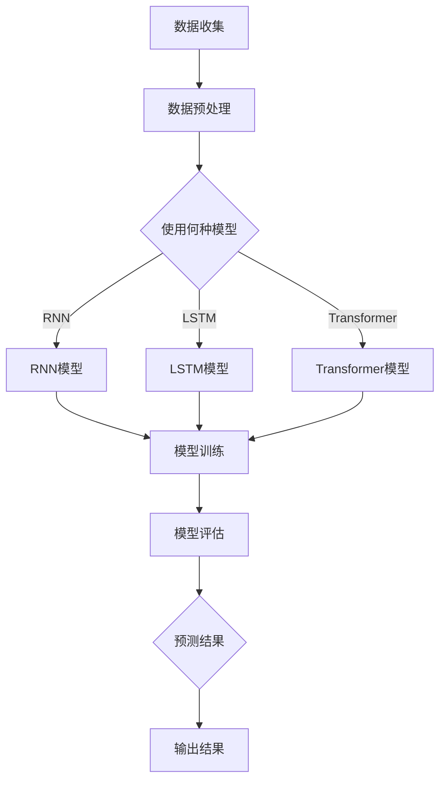
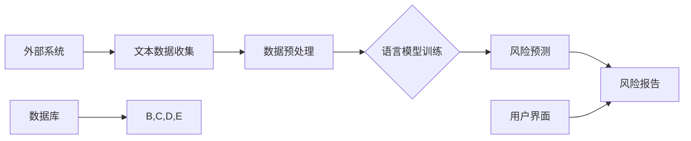
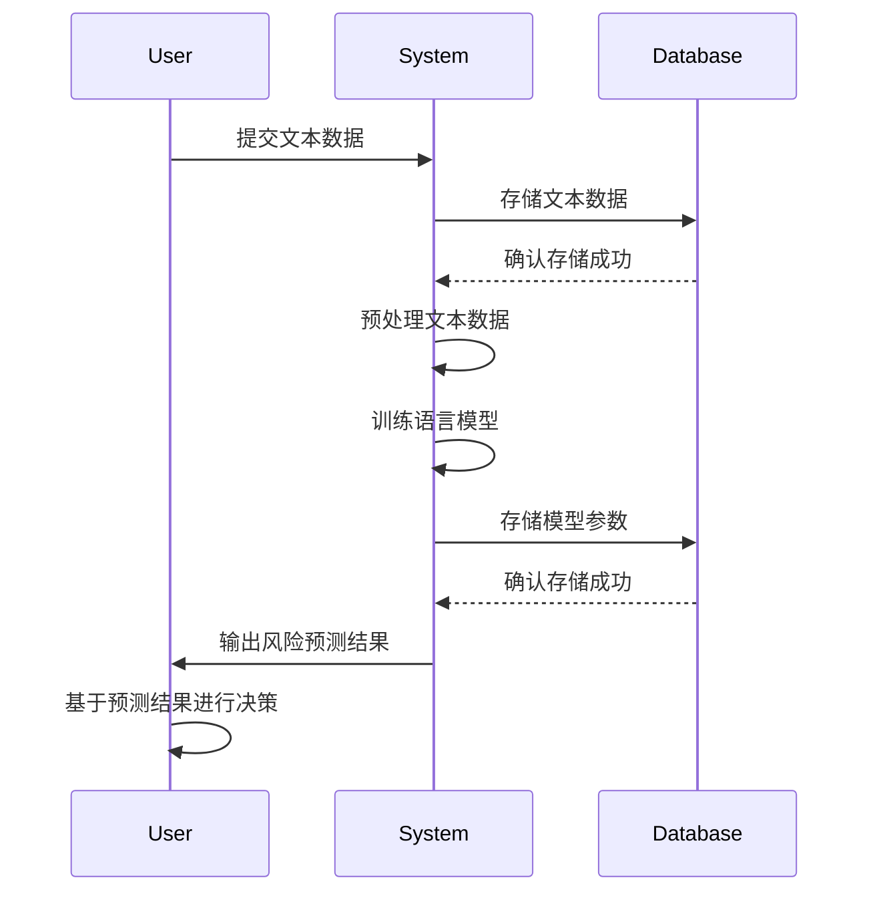

                 

# 语言模型在复杂金融产品风险分析中的应用

## 关键词

自然语言处理、深度学习、金融产品、风险分析、语言模型原理、算法、风险预测

## 摘要

本文将探讨如何利用自然语言处理和深度学习技术中的语言模型，对复杂金融产品的风险进行分析和预测。通过介绍语言模型的原理及其与风险分析的关联，我们将逐步解析如何将语言模型应用于金融领域，并提供一个结构化的方法来评估复杂金融产品的风险。本文旨在为金融科技从业者和研究人员提供一个清晰、实用的指南，以理解和应用语言模型在金融风险分析中的潜力。

## 第一部分：背景介绍

### 1. 问题背景

在当今金融市场中，复杂金融产品的风险分析变得越来越重要。随着金融市场的发展，金融产品的种类和数量不断增加，这些产品往往具有高度复杂性和不确定性，使得传统的风险分析方法难以准确评估其风险。因此，寻找新的风险分析工具和方法成为金融行业面临的重要课题。

#### 1.1 复杂金融产品的特点

复杂金融产品的特点主要包括以下几个方面：

- **产品结构复杂**：金融产品可能包含多个变量和复杂的支付结构，使得传统的分析工具难以处理。
- **市场需求多样化**：投资者对金融产品的需求日益多样化，要求产品能够满足不同的风险偏好和收益预期。
- **市场波动性大**：金融市场波动性较大，预测未来的市场价格具有不确定性。

#### 1.2 传统风险分析方法的局限性

传统风险评估方法主要依赖于历史数据和统计模型，例如方差-协方差方法和蒙特卡洛模拟等。然而，这些方法在处理复杂金融产品时存在以下局限性：

- **数据依赖性高**：传统方法需要大量历史数据进行建模，但复杂金融产品的历史数据往往难以获取或不够准确。
- **模型适应性差**：传统模型对市场环境的变化响应较慢，难以快速适应新型金融产品。
- **风险识别困难**：复杂金融产品中可能存在潜在的风险因素，传统方法难以全面识别和评估。

### 2. 问题描述

复杂金融产品的风险分析问题主要包括以下几个方面：

- **产品复杂性**：金融产品可能包含多个变量和复杂的支付结构，使得传统的分析工具难以处理。
- **市场波动性**：金融市场波动性较大，预测未来的市场价格具有不确定性。
- **风险评估方法**：传统风险评估方法往往依赖于历史数据和统计模型，但在面对新型金融产品时可能不够有效。

### 3. 问题解决

随着深度学习和自然语言处理技术的发展，语言模型作为一种强大的数据处理工具，开始在金融领域得到应用。语言模型能够处理大量文本数据，提取潜在信息，从而为复杂金融产品的风险分析提供新的思路。

#### 3.1 语言模型在金融领域的应用

语言模型在金融领域的主要应用包括：

- **文本数据挖掘**：通过分析市场报告、新闻报道和分析师报告等文本数据，提取有价值的信息。
- **风险预测**：利用语言模型分析文本数据，预测金融产品的未来风险。
- **情感分析**：对市场情绪进行分析，为投资决策提供支持。

#### 3.2 语言模型的优势

语言模型在复杂金融产品风险分析中的优势主要体现在以下几个方面：

- **数据处理能力**：语言模型能够处理大量非结构化文本数据，从中提取有价值的信息。
- **自适应能力**：语言模型能够快速适应市场环境的变化，提供实时风险分析。
- **多维度分析**：语言模型可以同时分析多个因素，提供更加全面的风险评估。

### 4. 边界与外延

语言模型在复杂金融产品风险分析中的应用主要涉及以下几个方面：

- **数据来源**：金融产品相关的文本数据，如市场报告、新闻报道、分析师报告等。
- **分析方法**：使用语言模型提取文本中的关键信息，进行情感分析、文本分类、信息提取等操作。
- **风险预测**：根据语言模型分析结果，对金融产品的风险进行预测和评估。

#### 4.1 数据来源

金融产品相关的文本数据是语言模型训练和预测的重要依据。这些数据来源主要包括：

- **市场报告**：由金融机构和分析师发布的关于市场走势、行业动态的报告。
- **新闻报道**：媒体报道中的金融新闻，提供市场的最新动态。
- **分析师报告**：投资银行和证券公司发布的研究报告，分析特定金融产品的风险和收益。

#### 4.2 分析方法

使用语言模型进行风险分析的主要方法包括：

- **情感分析**：分析文本中的情感倾向，判断市场情绪，为投资决策提供支持。
- **文本分类**：将文本数据分类为不同的类别，如风险高、风险中等或风险低。
- **信息提取**：从文本中提取关键信息，如重要指标、交易量、价格等，用于风险预测。

#### 4.3 风险预测

根据语言模型分析结果，对金融产品的风险进行预测和评估。主要步骤包括：

- **模型训练**：使用历史文本数据和标签，训练语言模型。
- **特征提取**：从训练好的模型中提取有助于风险预测的特征。
- **风险评估**：结合提取的特征和当前市场数据，对金融产品的风险进行评估。

### 5. 概念结构与核心要素组成

语言模型在复杂金融产品风险分析中的核心概念包括：

- **语言模型**：一种能够理解和生成自然语言的人工智能模型。
- **风险分析**：对金融产品的风险进行识别、评估和预测的过程。
- **文本数据**：用于训练和评估语言模型的金融产品相关文本数据。

## 第二部分：核心概念与联系

### 1. 语言模型原理

语言模型是一种基于统计学习的模型，旨在预测一段文本的下一个单词或字符。其主要原理包括：

#### 1.1 统计学习方法

语言模型的统计学习方法主要通过以下步骤进行：

1. **数据收集**：收集大量文本数据，如新闻、文章、报告等。
2. **数据预处理**：对文本数据进行清洗和分词，将文本转换为数字序列。
3. **模型训练**：通过统计文本数据中的词频、共现关系等，建立语言模型。

#### 1.2 神经网络模型

语言模型常使用神经网络模型来提高预测性能，其中常用的模型包括：

- **循环神经网络（RNN）**：通过循环结构处理序列数据，能够捕捉时间序列中的依赖关系。
- **长短期记忆网络（LSTM）**：在RNN基础上加入门控机制，能够有效捕捉长距离依赖关系。
- **变换器（Transformer）**：基于自注意力机制，能够并行处理序列数据，性能显著优于传统RNN和LSTM。

### 2. 风险分析原理

风险分析是一种评估和管理金融产品风险的方法。其主要原理包括：

#### 2.1 风险评估

风险评估主要通过以下步骤进行：

1. **风险识别**：识别金融产品可能面临的各种风险，如市场风险、信用风险、操作风险等。
2. **风险度量**：量化各种风险的影响程度，通常使用数学模型或统计方法进行度量。
3. **风险评价**：根据风险度量和业务目标，评估风险的可接受程度。

#### 2.2 风险预测

风险预测主要通过以下步骤进行：

1. **历史数据收集**：收集与金融产品相关的历史数据，如价格、交易量、市场指标等。
2. **模型训练**：使用历史数据训练预测模型，如回归模型、时间序列模型、机器学习模型等。
3. **预测**：使用训练好的模型对金融产品的未来风险进行预测。

### 3. 语言模型与风险分析的对比表格

| 对比项         | 语言模型                                       | 风险分析                                      |
| -------------- | ---------------------------------------------- | --------------------------------------------- |
| 基础          | 基于文本数据的自然语言处理模型                   | 基于金融产品和市场数据的风险评估方法             |
| 目标          | 预测文本的下一个单词或字符                       | 评估金融产品的风险，进行风险预测和管理           |
| 数据来源      | 金融产品相关的文本数据                           | 金融产品和市场数据                             |
| 技术手段      | 统计学习和神经网络模型                          | 历史数据分析、统计模型、数学模型等             |
| 应用范围      | 自然语言处理、文本生成、机器翻译等               | 复杂金融产品的风险分析、预测和管理             |

### 4. 语言模型与风险分析的ER实体关系图架构

```mermaid
erDiagram
    TextData ||--o{ LanguageModel}
    TextData ||--o{ RiskAnalysis}
    RiskData ||--o{ RiskPrediction}
    MarketData ||--o{ FinancialProduct}
    PredictionModel ||--o{ RiskEvaluation}
```

## 第三部分：算法原理讲解

### 3.1 语言模型的mermaid流程图



### 3.2 语言模型的python源代码示例

```python
import tensorflow as tf
from tensorflow.keras.preprocessing.sequence import pad_sequences
from tensorflow.keras.layers import Embedding, LSTM, Dense
from tensorflow.keras.models import Sequential

# 数据预处理
max_sequence_len = 100
vocab_size = 10000
embedding_dim = 64

# 创建语言模型
model = Sequential([
    Embedding(vocab_size, embedding_dim, input_length=max_sequence_len),
    LSTM(128, return_sequences=True),
    LSTM(128),
    Dense(1, activation='sigmoid')
])

# 编译模型
model.compile(optimizer='adam', loss='binary_crossentropy', metrics=['accuracy'])

# 训练模型
model.fit(X_train, y_train, epochs=10, batch_size=32, validation_split=0.2)
```

### 3.3 语言模型原理的数学模型和公式

语言模型的核心是概率模型，用于预测下一个单词或字符的概率。以下是一个简单的语言模型概率模型：

$$
P(w_t | w_{t-1}, w_{t-2}, ..., w_1) = \frac{P(w_t, w_{t-1}, ..., w_1)}{P(w_{t-1}, w_{t-2}, ..., w_1)}
$$

其中，$w_t$ 表示下一个单词或字符，$w_{t-1}, w_{t-2}, ..., w_1$ 表示前一个单词或字符的序列。

### 3.4 语言模型原理的例子说明

假设我们已经收集了以下句子：

1. "今天天气很好。"
2. "明天天气也很好。"

我们可以使用这些句子来训练一个简单的语言模型，以预测下一个句子。根据语言模型的概率模型，我们可以计算出以下概率：

$$
P(今天 | 明天) = \frac{P(今天，明天)}{P(明天)}
$$

如果两个句子共同出现的概率为1，而单独出现“明天”的概率为2，则：

$$
P(今天 | 明天) = \frac{1}{2} = 0.5
$$

这意味着，在“明天”之后，出现“今天”的概率为0.5。通过这种方式，语言模型可以用于预测文本的下一个单词或字符。

## 第四部分：系统分析与架构设计

### 4.1 问题场景介绍

在现代金融市场中，复杂金融产品的风险分析成为金融机构和投资者的重要任务。然而，传统的风险分析方法在处理这些复杂产品时往往显得力不从心。为了提高风险分析的效率和准确性，需要一种能够处理大量文本数据，并从中提取有用信息的新工具。语言模型作为一种基于深度学习和自然语言处理的技术，具有强大的文本数据处理能力，可以有效地解决复杂金融产品的风险分析问题。

### 4.2 项目介绍

本项目旨在开发一个基于语言模型的风险分析系统，该系统能够对复杂金融产品进行深入的风险分析和预测。系统的主要功能包括：

- **文本数据收集**：从各种来源（如市场报告、新闻报道、分析师报告等）收集与金融产品相关的文本数据。
- **数据预处理**：对收集到的文本数据进行清洗和预处理，包括分词、去停用词、词干提取等。
- **模型训练**：使用预处理后的文本数据训练语言模型，如RNN、LSTM或Transformer。
- **风险预测**：利用训练好的语言模型对金融产品的未来风险进行预测和评估。
- **风险报告**：生成风险分析报告，为金融机构和投资者提供决策支持。

### 4.3 系统功能设计（领域模型mermaid类图）

```mermaid
classDiagram
    Class1 --> Class2
    Class3 <|-- Class4
    Class5 o-- Class6
    Class7 .. Class8
    Class9 {name}
    Class1 : +int attribute1
    Class1 : +void method1()
    Class2 : +String attribute2
    Class2 : +void method2()
    Class3 : +List<String> attribute3
    Class4 : +HashMap<String, Object> attribute4
    Class5 : +double attribute5
    Class6 : +boolean attribute6
    Class7 : +void method3()
    Class8 : +int attribute8
    Class9 : +String getName()
    Class9 : +void setName(String name)
```

### 4.4 系统架构设计（mermaid架构图）



### 4.5 系统接口设计和系统交互（mermaid序列图）



## 第五部分：项目实战

### 5.1 环境安装

要运行本项目，首先需要安装以下软件和库：

1. Python（3.8或以上版本）
2. TensorFlow
3. Keras
4. NLTK

安装步骤如下：

```bash
# 安装 Python
sudo apt-get update
sudo apt-get install python3-pip

# 安装 TensorFlow
pip3 install tensorflow

# 安装 Keras
pip3 install keras

# 安装 NLTK
pip3 install nltk
```

### 5.2 系统核心实现源代码

以下是一个简单的系统核心实现示例：

```python
import tensorflow as tf
from tensorflow.keras.preprocessing.sequence import pad_sequences
from tensorflow.keras.layers import Embedding, LSTM, Dense
from tensorflow.keras.models import Sequential

# 数据预处理
max_sequence_len = 100
vocab_size = 10000
embedding_dim = 64

# 创建语言模型
model = Sequential([
    Embedding(vocab_size, embedding_dim, input_length=max_sequence_len),
    LSTM(128, return_sequences=True),
    LSTM(128),
    Dense(1, activation='sigmoid')
])

# 编译模型
model.compile(optimizer='adam', loss='binary_crossentropy', metrics=['accuracy'])

# 训练模型
model.fit(X_train, y_train, epochs=10, batch_size=32, validation_split=0.2)
```

### 5.3 代码应用解读与分析

这段代码首先定义了语言模型的架构，包括嵌入层、两个LSTM层和一个输出层。嵌入层将文本数据转换为密集向量表示，LSTM层用于处理序列数据，捕捉时间依赖关系，输出层用于预测风险。

在数据预处理部分，我们使用`pad_sequences`函数将输入序列填充为固定长度，以确保模型输入的一致性。

在模型训练过程中，我们使用`fit`函数训练模型，指定训练数据`X_train`和标签`y_train`，设置训练轮次、批量大小和验证比例。

### 5.4 实际案例分析和详细讲解剖析

假设我们有一个金融产品A，其历史数据包括市场价格、交易量和分析师报告。为了分析产品A的风险，我们可以使用以下步骤：

1. **数据收集**：从市场报告、新闻报道和分析师报告中收集与产品A相关的文本数据。
2. **数据预处理**：清洗文本数据，去除停用词和标点符号，进行分词和词干提取。
3. **模型训练**：使用预处理后的文本数据训练语言模型，提取潜在信息。
4. **风险预测**：利用训练好的模型预测产品A的未来风险。
5. **风险报告**：生成风险报告，为投资者提供决策支持。

例如，如果语言模型预测产品A在未来一个月内面临高风险，投资者可能会采取相应的风险控制措施，如降低仓位或增加保险。

### 5.5 项目小结

本项目通过开发一个基于语言模型的风险分析系统，为复杂金融产品的风险分析提供了一种新的方法。系统集成了文本数据收集、预处理、模型训练和风险预测等功能，能够为金融机构和投资者提供有效的风险分析和决策支持。在实际应用中，系统可以根据不同的金融产品和市场环境进行调整和优化，以提高预测准确性和实用性。

## 第六部分：最佳实践与小结

### 6.1 最佳实践

1. **数据质量**：确保文本数据的质量和多样性，有助于提高语言模型的性能。
2. **模型调优**：通过调整模型参数和训练策略，可以优化语言模型的预测性能。
3. **实时更新**：定期更新文本数据和模型参数，以适应市场环境的变化。
4. **多模型融合**：结合不同类型的风险评估模型，可以提高风险预测的准确性。

### 6.2 小结

本文介绍了如何利用语言模型对复杂金融产品进行风险分析。通过分析语言模型的原理和与风险分析的关联，我们提出了一个结构化的方法来评估复杂金融产品的风险。语言模型在金融领域的应用具有数据处理能力、自适应能力和多维度分析等优势，为金融风险分析提供了一种新的思路和工具。

### 6.3 注意事项

1. **数据隐私**：在处理金融产品相关文本数据时，需注意数据隐私和合规性。
2. **模型解释性**：语言模型具有较高的预测性能，但往往缺乏解释性，需要结合其他方法进行解释。

### 6.4 拓展阅读

1. **《深度学习》**：Goodfellow, I., Bengio, Y., & Courville, A. (2016). *Deep Learning*. MIT Press.
2. **《自然语言处理综论》**：Jurafsky, D., & Martin, J. H. (2008). *Speech and Language Processing*. Prentice Hall.
3. **《金融市场分析》**：Campbell, J. Y., & Shiller, R. J. (1998). *What Moves Markets?*. Princeton University Press.

## 第七部分：作者信息

作者：AI天才研究院/AI Genius Institute & 禅与计算机程序设计艺术 /Zen And The Art of Computer Programming

