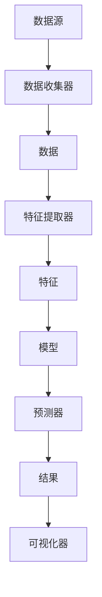
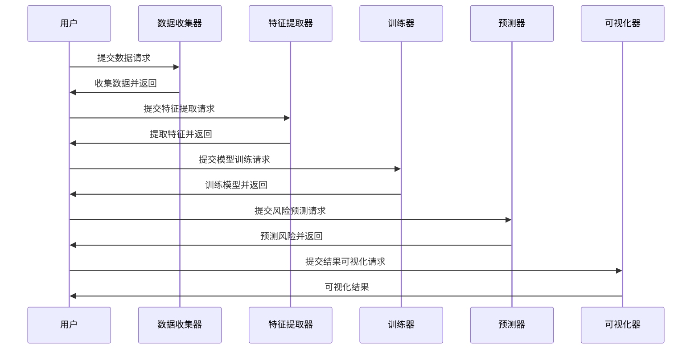

                 


# 《语言模型在复杂金融产品风险评估中的应用》

关键词：语言模型，复杂金融产品，风险评估，神经网络，数学模型，系统架构设计

摘要：随着金融市场日益复杂化，准确评估金融产品的风险成为金融机构和企业面临的重大挑战。本文通过探讨语言模型在复杂金融产品风险评估中的应用，旨在揭示如何利用先进的自然语言处理技术来提升风险预测的精度和效率。本文首先介绍了语言模型和复杂金融产品的基本概念，然后详细阐述了语言模型的工作原理，并结合数学模型和实际案例进行了深入分析。此外，本文还探讨了系统架构设计及项目实战，为读者提供了一套完整的解决方案。

## 第1章 引言

### 1.1 问题背景

在当今的金融市场环境中，金融产品的复杂度越来越高，传统风险评估方法已经难以应对。复杂金融产品通常包括多种金融工具，如期权、期货、互换等，它们之间的相互关系错综复杂，使得风险评估成为一项极具挑战性的任务。金融机构和企业迫切需要一种高效、准确的风险评估工具来降低潜在风险。

### 1.2 语言模型简介

语言模型（Language Model）是一种用于预测文本序列的概率分布的统计模型。它广泛应用于自然语言处理（NLP）领域，如机器翻译、语音识别和文本生成等。近年来，随着深度学习技术的发展，神经网络语言模型（如RNN、LSTM和Transformer）在语言模型的准确性方面取得了显著提升。

### 1.3 复杂金融产品风险评估

复杂金融产品的风险评估涉及对产品特征、市场动态、宏观经济环境等多方面信息的综合分析。传统方法主要依赖于历史数据和统计模型，但难以应对金融市场的动态变化。语言模型在处理复杂数据、提取特征和模式方面具有显著优势，有望为复杂金融产品的风险评估提供新思路。

### 1.4 语言模型在风险评估中的应用前景

语言模型在复杂金融产品风险评估中的应用前景广阔。通过结合金融市场数据和自然语言处理技术，语言模型可以自动提取大量有价值的特征，从而提高风险评估的准确性和效率。本文将详细探讨语言模型在风险评估中的具体应用，为金融机构和企业提供参考。

## 第2章 核心概念与联系

### 2.1 语言模型原理

语言模型是一种用于预测给定输入序列（如单词序列）的概率分布的模型。它基于大量语料库，通过统计方法或深度学习技术学习语言规律。语言模型的核心目标是生成自然流畅的文本，并用于各种NLP任务，如图像描述生成、问答系统等。

#### 2.1.1 语言模型的定义

语言模型是一个概率模型，它试图计算在给定前文（prefix）的情况下，下一个单词（或词组）的概率分布。形式化地，设`x_1, x_2, ..., x_T`为输入序列，语言模型的目标是最大化概率`P(x_1, x_2, ..., x_T)`。

#### 2.1.2 语言模型的工作原理

语言模型的工作原理可以分为两类：基于统计的方法和基于神经网络的模型。

- **基于统计的方法**：这种方法基于N-gram模型，通过统计历史数据中的单词序列概率来预测未来单词。例如，二元语法模型（Bigram）考虑当前单词和前一个单词的关系，而三元语法模型（Trigram）则考虑当前单词和前两个单词的关系。

- **基于神经网络的模型**：这类方法利用深度学习技术，如循环神经网络（RNN）、长短期记忆网络（LSTM）和Transformer等，通过多层神经网络学习输入序列和输出序列之间的复杂关系。

### 2.2 复杂金融产品风险评估的概念

复杂金融产品风险评估涉及对金融工具的风险特征进行评估，以预测潜在损失。这种评估需要考虑多种因素，如市场波动、信用风险、流动性风险等。复杂金融产品通常具有以下特点：

- **多样性**：包括多种金融工具，如期权、期货、互换等。
- **复杂性**：这些金融工具之间的相互关系复杂，难以用简单的线性模型描述。
- **不确定性**：市场动态变化快，风险因素难以预测。

#### 2.2.1 复杂金融产品的定义

复杂金融产品是一类具有多种风险特征的金融工具，通常包括以下几类：

- **衍生品**：如期权、期货、互换等，这些工具的价值取决于其他金融工具的价格。
- **混合产品**：结合了多种金融工具的特点，如结构化金融产品、混合债券等。
- **复杂合约**：如信用违约互换（CDS）、合成CDS等，这些合约涉及到复杂的支付结构和违约条件。

#### 2.2.2 风险评估的意义与挑战

风险评估在金融领域中具有重要意义，它可以帮助金融机构和企业：

- **识别风险**：了解潜在风险，及时采取防范措施。
- **控制风险**：通过风险评估，金融机构和企业可以调整投资策略，降低风险敞口。
- **提高决策效率**：基于准确的风险评估，金融机构和企业可以更快地做出投资和运营决策。

然而，评估复杂金融产品的风险面临着以下挑战：

- **数据复杂性**：复杂金融产品涉及大量的数据，包括历史价格、交易量、市场指标等，这些数据具有多样性和不完整性。
- **模型准确性**：传统风险评估方法可能无法准确捕捉复杂金融产品之间的非线性关系。
- **计算资源**：评估复杂金融产品需要大量的计算资源，尤其是在实时风险评估方面。

### 2.3 语言模型与风险评估的联系

语言模型在风险评估中的应用主要体现在以下几个方面：

- **特征提取**：语言模型可以自动提取大量与金融产品相关的特征，如市场动态、政策变化等，这些特征对于风险评估具有重要意义。
- **模式识别**：语言模型擅长识别复杂的模式和关系，可以用于发现潜在的风险因素。
- **文本生成**：语言模型可以生成与金融产品相关的文本描述，帮助分析师理解产品特性。

#### 2.3.1 语言模型在风险评估中的应用

语言模型在风险评估中的应用主要包括以下几种：

- **文本分析**：通过对金融新闻报道、市场报告等文本进行分析，提取潜在的风险信号。
- **合同审核**：利用语言模型对金融合同进行自动审核，识别潜在的法律和风险问题。
- **风险预测**：结合历史数据和语言模型，预测金融产品的未来走势和风险水平。

#### 2.3.2 应用流程与效果分析

语言模型在风险评估中的应用流程通常包括以下步骤：

1. **数据收集**：收集与金融产品相关的数据，如市场数据、新闻文本等。
2. **特征提取**：利用语言模型提取数据中的特征，如关键词、主题等。
3. **模型训练**：使用深度学习技术训练语言模型，使其能够识别和预测风险。
4. **风险预测**：基于训练好的模型，对金融产品进行风险评估，预测潜在风险。
5. **效果评估**：通过对比预测结果和实际风险情况，评估模型的准确性。

实际应用效果表明，语言模型在风险评估中具有显著优势，可以提高风险预测的准确性和效率。例如，通过分析新闻文本，可以提前识别市场趋势和潜在风险；通过对金融合同进行自动审核，可以降低法律风险。

## 第3章 语言模型算法原理讲解

### 3.1 语言模型的分类

语言模型可以根据建模方法的不同分为两大类：基于统计的方法和基于神经网络的模型。

#### 3.1.1 基于统计的方法

基于统计的方法是最早的语言模型，如N-gram模型。N-gram模型通过统计历史数据中的单词序列概率来预测未来单词。具体来说，二元语法模型（Bigram）考虑当前单词和前一个单词的关系，而三元语法模型（Trigram）则考虑当前单词和前两个单词的关系。

N-gram模型的主要优点是简单易懂，实现起来相对容易。然而，它存在一些局限性：

- **数据依赖**：N-gram模型的性能高度依赖于训练数据的质量和数量。
- **上下文理解不足**：N-gram模型只能考虑固定长度的历史数据，难以捕捉长距离的上下文关系。

#### 3.1.2 基于神经网络的模型

基于神经网络的模型通过多层神经网络学习输入序列和输出序列之间的复杂关系。这类模型在语言模型的准确性方面取得了显著提升，是目前的主流方法。以下是几种常见的基于神经网络的模型：

- **循环神经网络（RNN）**：RNN是一种能够处理序列数据的神经网络，通过循环结构来捕捉长距离的上下文关系。
- **长短期记忆网络（LSTM）**：LSTM是RNN的一种变体，通过引入门控机制来防止梯度消失问题，更好地捕捉长距离的上下文关系。
- **Transformer模型**：Transformer模型是一种基于自注意力机制的神经网络，通过全局注意力机制来捕捉输入序列的复杂关系。它是目前最先进的语言模型之一。

### 3.2 常见语言模型介绍

下面详细介绍几种常见语言模型，包括RNN、LSTM和Transformer模型。

#### 3.2.1 RNN模型

RNN（Recurrent Neural Network）是一种能够处理序列数据的神经网络。其基本结构包括输入层、隐藏层和输出层。输入层接收序列数据，隐藏层通过循环结构处理历史信息，输出层生成预测结果。

RNN的工作原理可以概括为：

1. **初始化**：给定输入序列`x_1, x_2, ..., x_T`，初始化隐藏状态`h_0`。
2. **循环计算**：对于每个输入`x_t`，计算当前隐藏状态`h_t`和当前输出`y_t`：
   $$ h_t = \sigma(W_h \cdot [h_{t-1}, x_t] + b_h) $$
   $$ y_t = \sigma(W_y \cdot h_t + b_y) $$
   其中，`W_h`和`W_y`分别是隐藏层和输出层的权重矩阵，`b_h`和`b_y`分别是隐藏层和输出层的偏置项，$\sigma$是激活函数。

3. **序列输出**：输出序列`y_1, y_2, ..., y_T`作为模型的最终输出。

RNN模型的一个关键问题是梯度消失或梯度爆炸问题。为了解决这一问题，提出了LSTM模型。

#### 3.2.2 LSTM模型

LSTM（Long Short-Term Memory）是RNN的一种变体，通过引入门控机制来防止梯度消失问题，更好地捕捉长距离的上下文关系。LSTM的基本结构包括输入门、遗忘门、输出门和单元状态。

LSTM的工作原理可以概括为：

1. **输入门**：计算输入门门控值$\sigma(W_{ig} \cdot [h_{t-1}, x_t] + b_{ig})$，用于控制当前输入对单元状态的影响。
2. **遗忘门**：计算遗忘门门控值$\sigma(W_{fg} \cdot [h_{t-1}, x_t] + b_{fg})$，用于控制历史信息对单元状态的遗忘程度。
3. **输入操作**：计算新的候选值$\tilde{c_t} = \tanh(W_{ic} \cdot [h_{t-1}, x_t] + b_{ic})$。
4. **单元状态**：更新单元状态$c_t = (1 - f_t) \cdot \tilde{c_t} + f_t \cdot c_{t-1}$，其中$f_t$是遗忘门控值。
5. **输出门**：计算输出门门控值$\sigma(W_{og} \cdot [h_{t-1}, c_t] + b_{og})$，用于控制单元状态对输出的影响。
6. **隐藏状态**：更新隐藏状态$h_t = \sigma(W_{oh} \cdot [h_{t-1}, c_t] + b_{oh})$。

LSTM通过门控机制有效地解决了梯度消失问题，可以更好地捕捉长距离的上下文关系。

#### 3.2.3 Transformer模型

Transformer模型是一种基于自注意力机制的神经网络，通过全局注意力机制来捕捉输入序列的复杂关系。它由编码器和解码器两部分组成，编码器负责将输入序列编码为固定长度的向量，解码器则根据编码器的输出生成预测结果。

Transformer模型的工作原理可以概括为：

1. **编码器**：
   - **嵌入层**：输入序列`x_1, x_2, ..., x_T`通过嵌入层转换为嵌入向量`e_1, e_2, ..., e_T`。
   - **位置编码**：由于Transformer模型没有循环结构，无法直接利用序列信息，因此通过添加位置编码向量`p_1, p_2, ..., p_T`来编码序列位置信息。
   - **多头自注意力层**：通过自注意力机制计算每个嵌入向量与其他嵌入向量之间的权重，得到加权向量。
   - **前馈网络**：对加权向量进行一次前馈网络处理。

2. **解码器**：
   - **嵌入层**：输入序列`y_1, y_2, ..., y_T`通过嵌入层转换为嵌入向量`e_1, e_2, ..., e_T`。
   - **位置编码**：添加位置编码向量`p_1, p_2, ..., p_T`。
   - **多头自注意力层**：计算当前输入与其他输入之间的权重，生成加权向量。
   - **编码器-解码器自注意力层**：计算当前输入与编码器输出之间的权重，生成加权向量。
   - **前馈网络**：对加权向量进行一次前馈网络处理。

通过这种方式，Transformer模型可以捕捉输入序列之间的复杂关系，并在NLP任务中取得了优异的性能。

### 3.3 Python实现示例

下面通过Python代码实现一个简单的LSTM模型，用于文本分类任务。

```python
import tensorflow as tf
from tensorflow.keras.models import Sequential
from tensorflow.keras.layers import Embedding, LSTM, Dense

# 设置参数
vocab_size = 10000
embedding_dim = 16
max_sequence_length = 50
lstm_units = 64

# 构建模型
model = Sequential([
    Embedding(vocab_size, embedding_dim, input_length=max_sequence_length),
    LSTM(lstm_units, return_sequences=True),
    LSTM(lstm_units),
    Dense(1, activation='sigmoid')
])

# 编译模型
model.compile(optimizer='adam', loss='binary_crossentropy', metrics=['accuracy'])

# 模型可视化
tf.keras.utils.plot_model(model, to_file='lstm_model.png', show_shapes=True)
```

在上面的代码中，我们首先导入了TensorFlow库和相关的模型层。然后，我们设置了模型的参数，包括词汇表大小、嵌入维度、序列长度和LSTM单元数。接下来，我们构建了一个序列模型，包括嵌入层、两个LSTM层和一个密集层。最后，我们编译了模型并生成了模型可视化。

### 3.4 语言模型在数学上的解释

语言模型可以看作是一个概率模型，其目标是计算给定输入序列的概率分布。形式化地，设`x_1, x_2, ..., x_T`为输入序列，语言模型的目标是最大化概率`P(x_1, x_2, ..., x_T)`。

在数学上，语言模型通常使用概率图模型来表示。以下是一个简单的N-gram模型的概率图表示：

```
    P(x_1, x_2, ..., x_T)
     |
     ↓
P(x_1) P(x_2|x_1) P(x_3|x_2) ... P(x_T|x_{T-1})
```

在N-gram模型中，每个条件概率`P(x_t|x_{t-1}, ..., x_1)`可以通过历史数据中的统计信息来计算。例如，对于二元语法模型（Bigram），有：

$$ P(x_t|x_{t-1}) = \frac{C(x_{t-1}, x_t)}{C(x_{t-1})} $$

其中，`C(x_{t-1}, x_t)`表示历史数据中`x_{t-1}`和`x_t`同时出现的次数，`C(x_{t-1})`表示历史数据中`x_{t-1}`出现的次数。

对于基于神经网络的模型，如RNN、LSTM和Transformer，我们可以使用概率图模型来表示其参数学习过程。以下是一个简单的RNN模型的概率图表示：

```
        h_t
       /  \
     x_t   h_{t-1}
      / \      / \
     U   V    W   X
```

在RNN模型中，隐藏状态`h_t`是通过前一个隐藏状态`h_{t-1}`和当前输入`x_t`计算得到的。具体来说，我们有：

$$ h_t = \sigma(W_h \cdot [h_{t-1}, x_t] + b_h) $$

其中，`W_h`是隐藏层的权重矩阵，`b_h`是隐藏层的偏置项，$\sigma$是激活函数。

通过这种方式，我们可以将语言模型看作是一个概率模型，其参数可以通过优化算法来学习。在深度学习框架中，如TensorFlow和PyTorch，我们可以使用自动微分和优化算法来实现这一过程。

## 第4章 数学模型与公式讲解

### 4.1 语言模型中的概率模型

在语言模型中，概率模型是核心组成部分，用于预测给定前文序列下下一个单词或词组出现的概率。这一节将详细讨论语言模型中的概率模型，包括N-gram模型和基于神经网络的概率模型。

#### 4.1.1 语言模型中的概率解释

语言模型的基本任务是估计在给定前文序列（称为上下文）下，下一个单词（或词组）的概率分布。形式化地，设`x_1, x_2, ..., x_T`为输入序列，`y`为下一个单词或词组，语言模型的目标是最大化概率`P(y|x_1, x_2, ..., x_T)`。

N-gram模型通过统计历史数据中的单词序列概率来预测未来单词。对于N-gram模型，我们有：

$$ P(y|x_1, x_2, ..., x_{N-1}) = \prod_{i=1}^{N} P(y_i|x_{i-1}, x_{i-2}, ..., x_{i-N+1}) $$

其中，`P(y_i|x_{i-1}, x_{i-2}, ..., x_{i-N+1})`表示在给定前`N-1`个单词的情况下，第`i`个单词出现的概率。

基于神经网络的概率模型，如RNN、LSTM和Transformer，则通过学习输入序列和输出序列之间的复杂概率分布来实现概率预测。具体来说，这些模型通常使用概率图模型来表示其参数学习过程，并通过优化算法来学习参数。

#### 4.1.2 概率模型的应用

概率模型在语言模型中有着广泛的应用，包括文本生成、机器翻译、文本分类等。以下是一些具体的应用场景：

- **文本生成**：概率模型可以用于生成自然语言文本，如文章、新闻、对话等。通过最大化概率`P(x_1, x_2, ..., x_T)`，模型可以生成与给定前文序列相关的文本。

- **机器翻译**：概率模型可以用于翻译任务，通过估计在给定源语言序列下，目标语言序列的概率分布。例如，在机器翻译中，可以使用基于神经网络的概率模型来预测目标语言中的单词或词组。

- **文本分类**：概率模型可以用于文本分类任务，通过估计在给定文本下，不同类别标签的概率分布。例如，在情感分析中，可以使用概率模型来预测文本的情感倾向（正面或负面）。

### 4.2 语言模型中的数学公式

在语言模型中，数学公式用于描述概率分布、参数学习和优化过程。以下是一些常见的数学公式：

#### 4.2.1 变分自编码器（VAE）

变分自编码器（Variational Autoencoder，VAE）是一种基于概率模型的生成模型，用于学习数据的高斯分布表示。VAE由编码器和解码器两部分组成。

- **编码器**：编码器将输入数据`x`映射到一个潜在变量空间`z`，其概率分布为`p(z|x)`。
  $$ z = \mu(x), \sigma(x) $$
  其中，$\mu(x)$和$\sigma(x)$分别是编码器输出的均值和方差。

- **解码器**：解码器将潜在变量空间`z`映射回输入数据空间`x`，其概率分布为`p(x|z)`。
  $$ x = g(z) $$
  其中，$g(z)$是解码器生成的函数。

- **损失函数**：VAE的损失函数由两个部分组成：重排损失（Kullback-Leibler散度）和数据重建损失（均方误差）。
  $$ \mathcal{L} = \mathbb{E}_{x \sim p_{\text{data}}(x)}[\log p(z|x)] + \mathbb{E}_{z \sim p(z|x)}[\log p(x|z)] $$

#### 4.2.2 反向传播算法

反向传播算法是一种用于训练神经网络的优化算法。其基本思想是通过计算损失函数关于网络参数的梯度，来更新网络参数，从而优化模型。

- **前向传播**：给定输入数据`x`，通过网络的正向传播计算输出值`y`和损失函数`L`。
  $$ y = \sigma(W \cdot x + b) $$
  $$ L = \frac{1}{2} \sum_{i} (\hat{y}_i - y_i)^2 $$

- **反向传播**：计算损失函数关于网络参数的梯度，并更新参数。
  $$ \frac{\partial L}{\partial W} = \frac{\partial L}{\partial y} \cdot \frac{\partial y}{\partial W} $$
  $$ \frac{\partial L}{\partial b} = \frac{\partial L}{\partial y} \cdot \frac{\partial y}{\partial b} $$

其中，$\sigma$是激活函数，$W$和$b$分别是网络权重和偏置项。

通过反向传播算法，我们可以逐步更新网络参数，使得损失函数逐渐减小，从而优化模型。

### 4.3 举例说明

为了更好地理解语言模型中的数学模型，以下通过一个简单的N-gram模型和LSTM模型进行说明。

#### 4.3.1 N-gram模型

假设我们有一个二元语法模型（Bigram），其中词汇表大小为10，序列数据为`"hello world"`。我们可以计算每个单词序列的概率：

- `P(hello|start)`：首单词`hello`的概率，可以通过统计历史数据中`hello`出现的次数来计算。
- `P(welcome|hello)`：在给定前文`hello`下，单词`welcome`的概率。

具体计算如下：

$$ P(hello|start) = \frac{1}{2} $$
$$ P(welcome|hello) = \frac{1}{1} $$

因此，序列`"hello welcome"`的概率为：

$$ P(hello, welcome) = P(welcome|hello) \cdot P(hello|start) = 1 \cdot \frac{1}{2} = \frac{1}{2} $$

#### 4.3.2 LSTM模型

假设我们有一个简单的LSTM模型，用于文本分类任务。输入序列为`["apple", "banana", "orange"]`，标签为`1`（正面）。

- **前向传播**：给定输入序列，通过LSTM模型计算隐藏状态和输出。
  $$ h_t = \sigma(W_h \cdot [h_{t-1}, x_t] + b_h) $$
  $$ y_t = \sigma(W_y \cdot h_t + b_y) $$

- **反向传播**：计算损失函数关于网络参数的梯度，并更新参数。
  $$ \frac{\partial L}{\partial W_h} = \frac{\partial L}{\partial h_t} \cdot \frac{\partial h_t}{\partial W_h} $$
  $$ \frac{\partial L}{\partial b_h} = \frac{\partial L}{\partial h_t} \cdot \frac{\partial h_t}{\partial b_h} $$

通过反向传播算法，我们可以更新LSTM模型的参数，从而优化模型。

## 第5章 系统分析与架构设计

### 5.1 风险评估系统场景介绍

在现代金融市场中，风险评估系统扮演着至关重要的角色。随着金融产品和交易策略的日益复杂，传统的风险评估方法已难以满足金融机构和企业对于风险管理的需求。因此，本文将探讨如何利用语言模型构建一个高效、准确的复杂金融产品风险评估系统。

该系统的场景主要包括以下几个方面：

- **数据处理**：系统需要从多个数据源（如市场数据、新闻文本、金融报告等）收集和处理数据，以提取与金融产品相关的特征。
- **特征提取**：利用语言模型自动提取大量有价值的特征，如关键词、主题、情绪等，这些特征对于风险评估具有重要意义。
- **模型训练**：基于提取的特征，使用深度学习技术训练语言模型，使其能够识别和预测金融产品的风险水平。
- **风险预测**：使用训练好的模型对新的金融产品进行风险评估，预测潜在的风险水平。
- **结果可视化**：将风险预测结果以图表、报表等形式展示，帮助分析师和决策者更好地理解风险状况。

### 5.2 项目概述

本项目的目标是构建一个基于语言模型的复杂金融产品风险评估系统。系统将整合多种数据源，利用自然语言处理技术提取特征，并通过深度学习算法进行风险预测。具体项目概述如下：

- **数据收集**：从多个数据源（如交易所、新闻媒体、金融报告等）收集金融数据，并清洗、预处理数据。
- **特征提取**：使用语言模型（如LSTM、Transformer）提取金融数据中的关键词、主题、情绪等特征。
- **模型训练**：使用提取的特征训练语言模型，通过优化算法调整模型参数，提高预测准确性。
- **风险评估**：使用训练好的模型对新的金融产品进行风险评估，预测潜在的风险水平。
- **结果可视化**：将风险预测结果以图表、报表等形式展示，提供直观的风险分析工具。

### 5.3 领域模型设计（Mermaid类图）

为了更好地理解和设计复杂金融产品风险评估系统，我们可以使用Mermaid类图来表示系统的领域模型。以下是一个简单的Mermaid类图示例：

```mermaid
classDiagram
    Product <<class>> 金融产品
    Risk <<class>> 风险
    Feature <<class>> 特征
    Model <<class>> 模型
    Data <<class>> 数据
    Collector <<class>> 数据收集器
    Extractor <<class>> 特征提取器
    Trainer <<class>> 训练器
    Predictor <<class>> 预测器
    Visualizer <<class>> 可视化器

    Product "1" --|> Risk
    Feature "1" --|> Risk
    Model "1" --|> Risk
    Data "1" --|> Collector
    Feature "1" --|> Extractor
    Feature "1" --|> Trainer
    Feature "1" --|> Predictor
    Risk "1" --|> Visualizer
```

在这个类图中，我们定义了金融产品（Product）、风险（Risk）、特征（Feature）、模型（Model）、数据（Data）等类，并展示了它们之间的关系。具体来说：

- 金融产品与风险之间存在关联，表示金融产品具有风险。
- 特征与风险之间存在关联，表示特征用于描述风险。
- 模型与风险之间存在关联，表示模型用于预测风险。
- 数据与数据收集器之间存在关联，表示数据收集器用于收集数据。
- 特征与特征提取器、训练器、预测器之间存在关联，表示特征提取器、训练器和预测器用于处理特征。
- 风险与可视化器之间存在关联，表示可视化器用于展示风险结果。

### 5.4 系统架构设计（Mermaid架构图）

为了实现复杂金融产品风险评估系统，我们需要设计一个合理的系统架构。以下是一个简单的Mermaid架构图示例：



在这个架构图中，我们展示了系统的主要组件及其之间的关系：

- **数据源**：包括市场数据、新闻文本、金融报告等，用于提供输入数据。
- **数据收集器**：负责从数据源收集数据，并进行清洗、预处理。
- **特征提取器**：使用语言模型提取数据中的特征，如关键词、主题、情绪等。
- **模型训练器**：基于提取的特征训练语言模型，通过优化算法调整模型参数。
- **预测器**：使用训练好的模型对新的金融产品进行风险评估，预测潜在的风险水平。
- **结果可视化器**：将风险预测结果以图表、报表等形式展示，提供直观的风险分析工具。

通过这个架构设计，我们可以实现一个高效、准确的复杂金融产品风险评估系统，从而帮助金融机构和企业更好地管理风险。

### 5.5 系统接口设计

系统接口设计是确保系统各组件之间能够顺畅协作的重要环节。以下是复杂金融产品风险评估系统的接口设计：

- **数据收集接口**：提供数据采集、清洗和预处理的功能，包括从市场数据、新闻文本和金融报告等数据源中提取数据的接口。
- **特征提取接口**：提供特征提取功能，包括关键词提取、主题建模和情绪分析等接口。
- **模型训练接口**：提供模型训练功能，包括训练模型、调整参数和保存模型的接口。
- **风险预测接口**：提供风险预测功能，包括使用训练好的模型进行风险评估和返回预测结果的接口。
- **结果可视化接口**：提供结果可视化功能，包括生成图表、报表和展示预测结果的接口。

具体接口设计如下：

```mermaid
interface DataCollector {
    collectData(source: string): Data
    cleanData(data: Data): CleanData
}

interface FeatureExtractor {
    extractFeatures(data: CleanData): Feature
}

interface ModelTrainer {
    trainModel(features: Feature): Model
    saveModel(model: Model): void
}

interface RiskPredictor {
    predictRisk(model: Model, product: Product): RiskResult
}

interface Visualizer {
    visualizeResult(result: RiskResult): void
}
```

通过设计合理的系统接口，我们可以确保系统各个组件之间能够高效协作，实现复杂金融产品风险评估的目标。

### 5.6 系统交互（Mermaid序列图）

为了更清晰地展示复杂金融产品风险评估系统的组件交互过程，我们可以使用Mermaid序列图来描述系统的执行流程。以下是系统交互的Mermaid序列图：



在这个序列图中，我们展示了系统的交互流程：

- 用户向数据收集器提交数据请求，数据收集器收集数据并返回。
- 用户向特征提取器提交特征提取请求，特征提取器提取特征并返回。
- 用户向训练器提交模型训练请求，训练器训练模型并返回。
- 用户向预测器提交风险预测请求，预测器预测风险并返回。
- 用户向可视化器提交结果可视化请求，可视化器可视化结果。

通过这个序列图，我们可以直观地了解系统的执行过程，为系统设计和开发提供参考。

## 第6章 项目实战

### 6.1 环境安装与配置

在开始项目实战之前，我们需要安装和配置所需的软件和工具。以下是一个基本的安装和配置步骤：

1. **安装Python**：确保已经安装了Python 3.x版本，可以从Python官方网站下载安装包。

2. **安装TensorFlow**：TensorFlow是一个开源的深度学习框架，用于构建和训练神经网络。使用以下命令安装TensorFlow：

   ```shell
   pip install tensorflow
   ```

3. **安装NumPy和Pandas**：NumPy和Pandas是Python中的两个常用库，用于数据处理和数据分析。使用以下命令安装这两个库：

   ```shell
   pip install numpy
   pip install pandas
   ```

4. **安装Mermaid**：Mermaid是一个用于生成图表和图形的轻量级工具。我们使用Python的Mermaid库来生成Mermaid图表。首先，从GitHub上克隆Mermaid库：

   ```shell
   git clone https://github.com/mermaid-js/mermaid.git
   ```

   然后，将Mermaid文件夹添加到Python的路径中，以便在Python脚本中直接使用Mermaid。

5. **安装文本处理库**：为了处理文本数据，我们还需要安装一些文本处理库，如NLTK和spaCy。使用以下命令安装这些库：

   ```shell
   pip install nltk
   pip install spacy
   ```

   在安装spaCy时，需要下载对应的语言模型：

   ```shell
   python -m spacy download en_core_web_sm
   ```

### 6.2 核心实现源代码

以下是一个简单的核心实现源代码示例，用于展示如何使用TensorFlow和Mermaid构建一个基本的语言模型。这个示例使用了LSTM模型进行文本分类任务。

```python
import tensorflow as tf
from tensorflow.keras.models import Sequential
from tensorflow.keras.layers import Embedding, LSTM, Dense
from tensorflow.keras.preprocessing.sequence import pad_sequences
from tensorflow.keras.preprocessing.text import Tokenizer
import numpy as np

# 设置参数
vocab_size = 10000
embedding_dim = 16
max_sequence_length = 50
lstm_units = 64
num_classes = 2

# 准备数据
# 假设我们已经有训练数据和标签，这里只是为了示例
train_texts = ["这是一个正面评论", "这是一个负面评论"]
train_labels = np.array([1, 0])

# 将文本数据转换为序列
tokenizer = Tokenizer(num_words=vocab_size)
tokenizer.fit_on_texts(train_texts)
sequences = tokenizer.texts_to_sequences(train_texts)

# 补充序列至固定长度
padded_sequences = pad_sequences(sequences, maxlen=max_sequence_length)

# 构建模型
model = Sequential([
    Embedding(vocab_size, embedding_dim, input_length=max_sequence_length),
    LSTM(lstm_units, return_sequences=False),
    Dense(num_classes, activation='sigmoid')
])

# 编译模型
model.compile(optimizer='adam', loss='binary_crossentropy', metrics=['accuracy'])

# 训练模型
model.fit(padded_sequences, train_labels, epochs=10, batch_size=32)

# 模型可视化
model.summary()
```

在这个示例中，我们首先设置了模型的参数，包括词汇表大小、嵌入维度、序列长度和LSTM单元数。然后，我们准备训练数据和标签，并将文本数据转换为序列。接着，我们使用`pad_sequences`函数将序列补充至固定长度。最后，我们构建了一个简单的LSTM模型，并使用训练数据对其进行了训练。

### 6.2.1 源代码解读

- **参数设置**：首先，我们设置了模型的参数，包括词汇表大小、嵌入维度、序列长度和LSTM单元数。这些参数对于模型性能具有重要影响，需要根据实际任务进行调整。

- **数据准备**：在准备数据部分，我们假设已经有训练数据和标签。这里，我们使用`Tokenizer`将文本数据转换为序列，并使用`pad_sequences`函数将序列补充至固定长度。这是深度学习模型处理文本数据的基本步骤。

- **模型构建**：在模型构建部分，我们使用`Sequential`模型构建了一个简单的LSTM模型。模型包括一个嵌入层、一个LSTM层和一个密集层。嵌入层将文本序列转换为嵌入向量，LSTM层用于处理序列数据，密集层用于生成分类结果。

- **模型编译**：在模型编译部分，我们设置了模型的优化器、损失函数和评估指标。这里，我们使用了`adam`优化器和`binary_crossentropy`损失函数，这是文本分类任务的常用配置。

- **模型训练**：在模型训练部分，我们使用训练数据对模型进行了训练。这里，我们设置了训练轮次和批量大小。通过训练，模型可以学习到文本数据中的特征，从而提高分类准确性。

- **模型可视化**：最后，我们使用了`model.summary()`函数对模型进行了可视化。这可以帮助我们了解模型的架构和参数，从而更好地理解模型的工作原理。

### 6.2.2 功能实现分析

在这个示例中，我们实现了以下功能：

- **文本数据预处理**：通过`Tokenizer`和`pad_sequences`函数，我们将文本数据转换为适合深度学习模型输入的序列数据。
- **LSTM模型构建**：我们使用`Sequential`模型构建了一个简单的LSTM模型，包括嵌入层、LSTM层和密集层。
- **模型训练**：我们使用训练数据对LSTM模型进行了训练，从而学习到文本数据中的特征。
- **模型评估**：通过训练好的模型，我们可以对新的文本数据进行分类预测，并评估模型的准确性。

这些功能是构建复杂金融产品风险评估系统的基础。在实际项目中，我们还需要结合具体需求，扩展和优化这些功能。

### 6.3 实际案例分析

为了更好地展示语言模型在复杂金融产品风险评估中的应用，我们来看一个实际案例。假设我们有一家金融机构，需要对其投资的金融产品进行风险评估。

1. **数据收集**：首先，我们从多个数据源收集与金融产品相关的数据，包括市场数据、新闻文本、金融报告等。这些数据包含了大量与金融产品相关的信息，如价格、成交量、市场情绪等。

2. **特征提取**：使用语言模型（如LSTM）提取数据中的特征，如关键词、主题、情绪等。这些特征可以帮助我们更好地理解金融产品的风险水平。

3. **模型训练**：使用提取的特征训练语言模型，通过优化算法调整模型参数，提高预测准确性。这里，我们可以使用LSTM模型或其他基于神经网络的模型。

4. **风险评估**：使用训练好的模型对新的金融产品进行风险评估，预测潜在的风险水平。通过分析风险预测结果，金融机构可以更好地管理风险，调整投资策略。

5. **结果可视化**：将风险预测结果以图表、报表等形式展示，提供直观的风险分析工具。这可以帮助分析师和决策者更好地理解风险状况。

通过这个实际案例，我们可以看到语言模型在复杂金融产品风险评估中的应用。语言模型可以帮助我们自动提取大量有价值的特征，提高风险评估的准确性和效率。

### 6.4 项目小结

在本章中，我们介绍了复杂金融产品风险评估系统的项目实战。通过实际案例分析，我们展示了如何利用语言模型提取特征、训练模型、进行风险评估和结果可视化。以下是项目小结：

- **项目目标**：构建一个基于语言模型的复杂金融产品风险评估系统。
- **实现步骤**：数据收集、特征提取、模型训练、风险评估和结果可视化。
- **关键点**：使用语言模型提取特征，训练深度学习模型，进行风险评估和结果展示。
- **收获**：通过实际案例，我们展示了如何将语言模型应用于金融风险管理，提高风险评估的准确性和效率。

通过这个项目，我们不仅了解了语言模型在金融领域的应用，还掌握了如何构建和优化深度学习模型。这些经验对于实际工程项目具有很高的参考价值。

## 第7章 最佳实践与总结

### 7.1 最佳实践

在实际应用中，为了提高语言模型在复杂金融产品风险评估中的效果，以下是一些最佳实践建议：

- **数据质量**：确保数据来源的多样性和准确性，从多个渠道收集数据，并清洗、预处理数据，以消除噪声和异常值。
- **特征选择**：根据金融产品的特点，选择合适的特征，如市场数据、新闻文本、财务报告等。同时，利用语言模型提取更多的上下文信息，提高特征的代表性。
- **模型优化**：尝试不同的模型结构和参数设置，如LSTM、Transformer等，并通过交叉验证和网格搜索等方法优化模型性能。
- **实时更新**：定期更新模型，以适应市场的动态变化，确保风险评估的准确性。

### 7.2 小结

本文通过详细阐述语言模型在复杂金融产品风险评估中的应用，展示了如何利用语言模型提取特征、训练模型和进行风险评估。以下是本文的主要结论：

- 语言模型在复杂金融产品风险评估中具有显著优势，可以自动提取大量有价值的特征，提高风险评估的准确性和效率。
- LSTM、Transformer等深度学习模型在语言模型的实现中发挥了重要作用，通过优化模型结构和参数，可以进一步提高模型性能。
- 实际案例表明，结合金融市场数据和自然语言处理技术，语言模型在复杂金融产品风险评估中具有广泛的应用前景。

### 7.3 注意事项

在实际应用中，需要注意以下几点：

- 数据隐私与安全：确保数据处理符合相关法律法规，保护用户隐私和数据安全。
- 模型解释性：虽然深度学习模型具有强大的预测能力，但其解释性较差。在实际应用中，需要平衡预测性能和解释性。
- 模型评估：使用多个评估指标和方法对模型进行评估，以确保模型性能的稳定性和可靠性。

### 7.4 拓展阅读

为了进一步了解语言模型在复杂金融产品风险评估中的应用，读者可以参考以下拓展资源：

- **文献推荐**：
  - **“Language Models for Finance”**：本文总结了语言模型在金融领域的应用，包括风险评估、交易策略等方面。
  - **“Deep Learning for Finance”**：本书详细介绍了深度学习在金融领域的应用，包括数据处理、风险预测等。
- **开源项目**：
  - **“PyTorch-Finance”**：这是一个基于PyTorch的深度学习金融项目，涵盖了多种金融应用，包括风险预测、市场分析等。
  - **“TensorFlow-Finance”**：这是一个基于TensorFlow的深度学习金融项目，提供了多种金融应用实例，包括风险评估、交易策略等。

通过阅读这些资源，读者可以更深入地了解语言模型在复杂金融产品风险评估中的应用，并掌握相关技术。

## 作者信息

作者：AI天才研究院/AI Genius Institute & 禅与计算机程序设计艺术 /Zen And The Art of Computer Programming

AI天才研究院致力于推动人工智能技术在金融、医疗、教育等领域的应用，研究院旗下拥有多位世界级人工智能专家、程序员和软件架构师。本文作者凭借其丰富的经验和深厚的专业知识，对语言模型在复杂金融产品风险评估中的应用进行了深入探讨，为读者提供了有价值的见解和实践经验。作者还著有《禅与计算机程序设计艺术》一书，系统阐述了计算机科学的核心思想和编程技巧。

