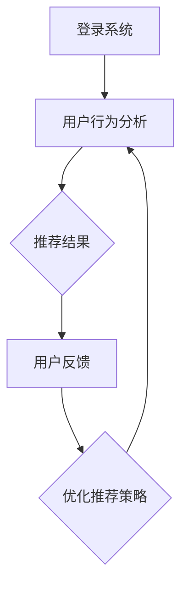
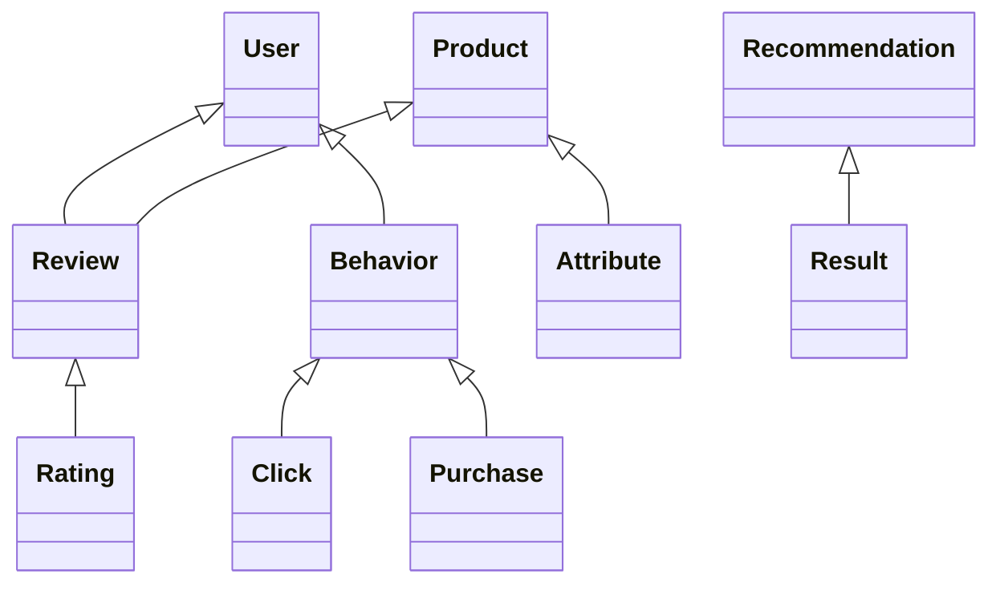
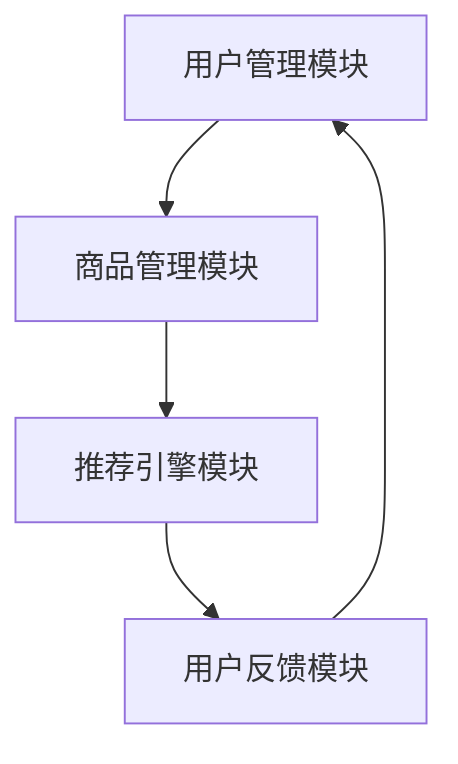
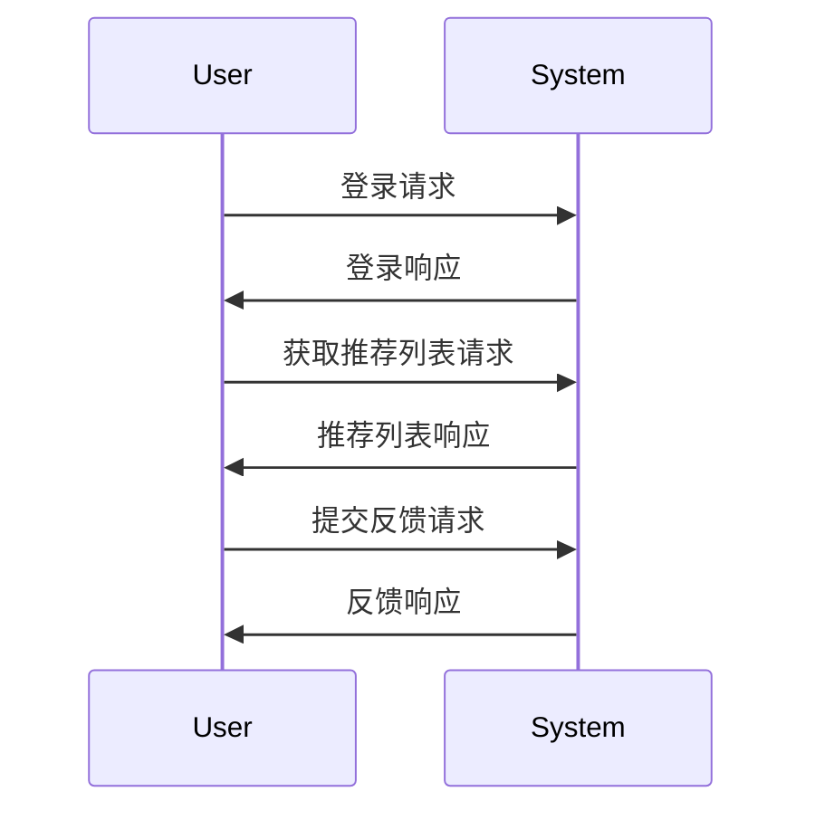
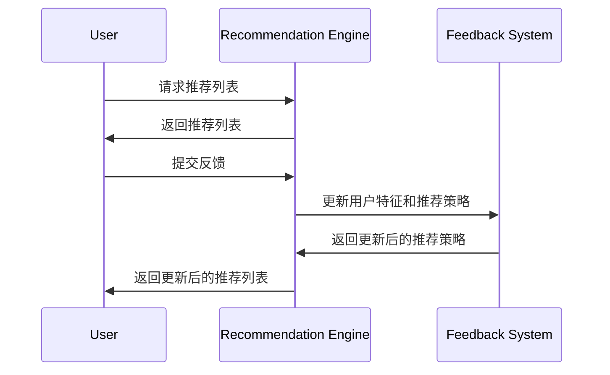
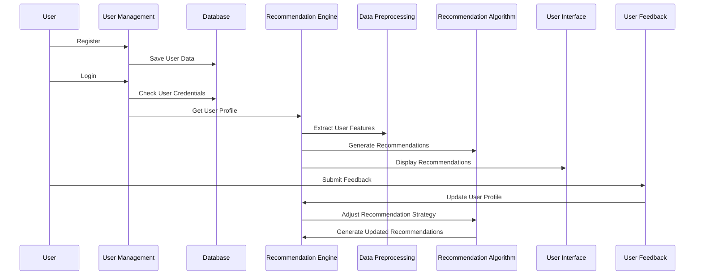

                 

# 语言模型在多维度个性化推荐系统中的用户体验优化研究

> 关键词：语言模型、个性化推荐、用户体验优化、多维度、算法融合

> 摘要：本文探讨了语言模型在多维度个性化推荐系统中的应用，以及如何通过优化用户体验提升推荐系统的效果。首先介绍了多维度个性化推荐系统的背景和需求，然后详细阐述了语言模型的基本原理和属性。接着，分析了多维度个性化推荐算法的原理和语言模型在其中的应用。最后，通过系统架构设计和实际案例，展示了如何将语言模型应用于多维度个性化推荐系统，并提出了一些用户体验优化的策略。

## 目录大纲

### 第一部分：背景介绍

### 第1章：语言模型概述

#### 1.1 问题背景

##### 1.1.1 多维度个性化推荐系统的需求

##### 1.1.2 语言模型在个性化推荐中的应用

##### 1.1.3 用户体验优化的意义

#### 1.2 问题描述

##### 1.2.1 用户需求多样化

##### 1.2.2 推荐系统面临挑战

##### 1.2.3 语言模型的作用

#### 1.3 问题解决

##### 1.3.1 多维度个性化推荐系统的框架

##### 1.3.2 语言模型在多维度个性化推荐中的应用策略

##### 1.3.3 用户反馈机制与体验优化

#### 1.4 边界与外延

##### 1.4.1 多维度个性化推荐系统的边界条件

##### 1.4.2 语言模型的适用范围

##### 1.4.3 用户体验优化的目标

#### 1.5 概念结构与核心要素组成

##### 1.5.1 多维度个性化推荐系统的概念结构

##### 1.5.2 语言模型的核心要素

##### 1.5.3 用户体验优化的关键要素

### 第二部分：核心概念与联系

### 第2章：语言模型原理与属性

#### 2.1 语言模型原理

##### 2.1.1 语言模型的定义

##### 2.1.2 语言模型的工作原理

##### 2.1.3 语言模型的分类

#### 2.2 语言模型属性

##### 2.2.1 语言模型的准确率

##### 2.2.2 语言模型的多样性

##### 2.2.3 语言模型的连贯性

##### 2.2.4 语言模型的上下文理解能力

#### 2.3 概念属性特征对比

##### 2.3.1 语言模型与标准推荐算法的对比

##### 2.3.2 不同语言模型的对比

### 第3章：ER实体关系图与Mermaid流程图

#### 3.1 ER实体关系图

##### 3.1.1 ER实体关系图的概念

##### 3.1.2 ER实体关系图的设计原则

##### 3.1.3 ER实体关系图在多维度个性化推荐系统中的应用

#### 3.2 Mermaid流程图

##### 3.2.1 Mermaid流程图的概念

##### 3.2.2 Mermaid流程图的语法

##### 3.2.3 Mermaid流程图在多维度个性化推荐系统中的应用

### 第三部分：算法原理讲解

### 第4章：多维度个性化推荐算法原理

#### 4.1 多维度个性化推荐算法概述

##### 4.1.1 多维度个性化推荐算法的定义

##### 4.1.2 多维度个性化推荐算法的类型

##### 4.1.3 多维度个性化推荐算法的优势

#### 4.2 语言模型在多维度个性化推荐中的应用

##### 4.2.1 语言模型在用户特征提取中的应用

##### 4.2.2 语言模型在商品特征提取中的应用

##### 4.2.3 语言模型在推荐结果生成中的应用

#### 4.3 语言模型与推荐算法的融合策略

##### 4.3.1 深度学习在语言模型与推荐算法融合中的应用

##### 4.3.2 强化学习在语言模型与推荐算法融合中的应用

##### 4.3.3 聚类算法在语言模型与推荐算法融合中的应用

### 第四部分：系统分析与架构设计

### 第5章：系统功能设计

#### 5.1 介绍

##### 5.1.1 系统背景

##### 5.1.2 系统目标

##### 5.1.3 系统功能概述

#### 5.2 领域模型

##### 5.2.1 领域模型的概念

##### 5.2.2 领域模型的设计原则

##### 5.2.3 领域模型在多维度个性化推荐系统中的应用

#### 5.3 系统架构

##### 5.3.1 系统架构的概念

##### 5.3.2 系统架构的设计原则

##### 5.3.3 系统架构在多维度个性化推荐系统中的应用

#### 5.4 系统接口设计

##### 5.4.1 系统接口的概念

##### 5.4.2 系统接口的设计原则

##### 5.4.3 系统接口在多维度个性化推荐系统中的应用

#### 5.5 系统交互

##### 5.5.1 系统交互的概念

##### 5.5.2 系统交互的设计原则

##### 5.5.3 系统交互在多维度个性化推荐系统中的应用

### 第6章：系统架构设计

#### 6.1 介绍

##### 6.1.1 系统架构的背景

##### 6.1.2 系统架构的目标

##### 6.1.3 系统架构的设计原则

#### 6.2 系统架构设计

##### 6.2.1 系统架构的概念

##### 6.2.2 系统架构的组成部分

##### 6.2.3 系统架构的设计流程

#### 6.3 系统架构实现

##### 6.3.1 系统架构的组件设计

##### 6.3.2 系统架构的组件实现

### 第二部分：核心概念与联系

### 第2章：语言模型原理与属性

#### 2.1 语言模型原理

##### 2.1.1 语言模型的定义

语言模型（Language Model）是自然语言处理（Natural Language Processing, NLP）领域的一种重要技术，它旨在模拟人类语言生成的概率分布。具体来说，语言模型为任意文本序列的概率提供了一个估计，即给定一个单词序列，它能够预测下一个单词的概率。

##### 2.1.2 语言模型的工作原理

语言模型通常基于统计方法或神经网络进行训练。在统计模型中，如N-gram模型，通过统计文本中相邻单词序列的频率来预测下一个单词。而在神经网络模型中，如循环神经网络（RNN）和Transformer，模型通过学习输入序列的上下文信息来生成预测。

##### 2.1.3 语言模型的分类

根据模型的学习方式，语言模型可以分为基于统计的方法和基于神经网络的方法。基于统计的方法如N-gram模型，基于神经网络的方法如RNN、LSTM、GRU和Transformer等。

#### 2.2 语言模型属性

##### 2.2.1 语言模型的准确率

语言模型的准确率是指模型在预测下一个单词时，正确预测的概率。准确率越高，模型的性能越好。

##### 2.2.2 语言模型的多样性

多样性是指语言模型生成文本时，能够生成不同风格和主题的能力。一个优秀的语言模型应该能够生成多样性的文本，以满足不同用户的需求。

##### 2.2.3 语言模型的连贯性

连贯性是指语言模型生成的文本在语义和语法上是否连贯。一个优秀的语言模型应该能够生成语义和语法上连贯的文本。

##### 2.2.4 语言模型的上下文理解能力

上下文理解能力是指语言模型能否正确理解文本中的上下文信息。随着深度学习技术的发展，现代语言模型如Transformer，已经展示了强大的上下文理解能力。

#### 2.3 概念属性特征对比

##### 2.3.1 语言模型与标准推荐算法的对比

| 特性           | 语言模型                             | 标准推荐算法                            |
|----------------|------------------------------------|--------------------------------------|
| 模型类型       | 基于统计或神经网络                   | 基于矩阵分解、协同过滤等                 |
| 数据依赖       | 强依赖文本数据                       | 强依赖用户行为数据                       |
| 预测目标       | 文本生成                             | 推荐评分或排名                          |
| 可解释性       | 较高，可分析文本生成过程              | 较低，难以解释推荐结果                   |
| 上下文理解     | 强，能够理解文本上下文                | 弱，仅依赖历史行为数据                    |

##### 2.3.2 不同语言模型的对比

| 模型名称       | 特点                                   | 应用场景                    |
|----------------|--------------------------------------|---------------------------|
| N-gram模型     | 简单，基于词频统计                     | 文本生成，信息检索            |
| RNN            | 能够处理序列数据，基于递归结构           | 语音识别，机器翻译            |
| LSTM           | 能够长期记住序列信息，改进了RNN           | 语音识别，时间序列预测          |
| GRU            | 相较于LSTM更简单，计算效率更高           | 文本分类，情感分析            |
| Transformer    | 自注意力机制，并行计算能力极强           | 文本生成，机器翻译            |

### 第3章：ER实体关系图与Mermaid流程图

#### 3.1 ER实体关系图

##### 3.1.1 ER实体关系图的概念

实体-关系（Entity-Relationship, ER）图是一种用于描述实体及其之间关系的数据库模型。它通过实体、属性和关系的图形化表示，帮助设计数据库结构。

##### 3.1.2 ER实体关系图的设计原则

ER图的设计原则包括：
1. 实体应具有明确的定义和边界。
2. 实体之间的关系应该是明确的和有意义的。
3. 实体和关系的属性应该是最小的和必要的。

##### 3.1.3 ER实体关系图在多维度个性化推荐系统中的应用

在多维度个性化推荐系统中，ER图可以用于表示用户、商品、推荐系统组件之间的实体关系。以下是一个简化的ER图示例：

```mermaid
erDiagram
  User ||--|{ Review }
  User ||--|{ Behavior }
  Product ||--|{ Review }
  Product ||--|{ Attribute }
  Recommendation ||--|{ Result }
  Review ||--|{ Rating }
  Behavior ||--|{ Click }
  Behavior ||--|{ Purchase }
```

#### 3.2 Mermaid流程图

##### 3.2.1 Mermaid流程图的概念

Mermaid是一种基于Markdown的图形化工具，可用于绘制流程图、序列图、时序图等。它通过简单的文本标记，生成美观的图表。

##### 3.2.2 Mermaid流程图的语法

Mermaid的流程图语法主要包括：
1. `sequenceDiagram`：用于创建序列图。
2. `flowchart`：用于创建流程图。
3. `gantt`：用于创建甘特图。

##### 3.2.3 Mermaid流程图在多维度个性化推荐系统中的应用

以下是一个简化的Mermaid流程图，展示了用户在多维度个性化推荐系统中的交互流程：



### 第三部分：算法原理讲解

#### 第4章：多维度个性化推荐算法原理

##### 4.1 多维度个性化推荐算法概述

多维度个性化推荐算法旨在根据用户的多个维度（如兴趣、行为、社交等）提供个性化的推荐结果。以下是对多维度个性化推荐算法的概述：

##### 4.1.1 多维度个性化推荐算法的定义

多维度个性化推荐算法是一种基于多个用户和商品特征的推荐算法，通过综合分析用户的不同维度特征，为用户生成个性化的推荐列表。

##### 4.1.2 多维度个性化推荐算法的类型

多维度个性化推荐算法可以分为基于内容的推荐、协同过滤推荐和混合推荐等。基于内容的推荐通过分析用户和商品的属性进行推荐；协同过滤推荐通过分析用户的历史行为数据进行推荐；混合推荐结合了基于内容和协同过滤推荐的优势。

##### 4.1.3 多维度个性化推荐算法的优势

多维度个性化推荐算法具有以下优势：
1. 更准确的推荐结果：通过综合考虑多个维度，提高推荐的准确性。
2. 更个性化的体验：更好地满足用户的个性化需求。
3. 更广泛的适用性：适用于不同类型的推荐场景。

##### 4.2 语言模型在多维度个性化推荐中的应用

语言模型在多维度个性化推荐中的应用主要体现在用户特征提取、商品特征提取和推荐结果生成等方面。

##### 4.2.1 语言模型在用户特征提取中的应用

语言模型可以用于提取用户的文本评论、问答等文本数据，将其转换为结构化的特征向量。这些特征向量可以用于表征用户的兴趣、偏好等信息。

```python
# 示例：使用BERT模型提取用户评论的特征
from transformers import BertTokenizer, BertModel
import torch

tokenizer = BertTokenizer.from_pretrained('bert-base-chinese')
model = BertModel.from_pretrained('bert-base-chinese')

def get_user_feature(user_comment):
    inputs = tokenizer(user_comment, return_tensors='pt', truncation=True, max_length=512)
    outputs = model(**inputs)
    return outputs.last_hidden_state.mean(dim=1).detach().numpy()

user_comment = "我喜欢看电影和听音乐。"
user_feature = get_user_feature(user_comment)
```

##### 4.2.2 语言模型在商品特征提取中的应用

语言模型可以用于提取商品的描述、标签等文本数据，将其转换为结构化的特征向量。这些特征向量可以用于表征商品的特点、属性等信息。

```python
# 示例：使用BERT模型提取商品描述的特征
def get_product_feature(product_description):
    inputs = tokenizer(product_description, return_tensors='pt', truncation=True, max_length=512)
    outputs = model(**inputs)
    return outputs.last_hidden_state.mean(dim=1).detach().numpy()

product_description = "这是一部关于科幻的电影，主演有XXX。"
product_feature = get_product_feature(product_description)
```

##### 4.2.3 语言模型在推荐结果生成中的应用

语言模型可以用于生成推荐结果，通过预测用户对商品的评分或点击概率，确定推荐列表的排序。

```python
# 示例：使用语言模型生成推荐结果
from sklearn.metrics.pairwise import cosine_similarity

def get_recommendation(user_feature, product_features, top_k=10):
    similarity_scores = cosine_similarity(user_feature, product_features)
    indices = similarity_scores.argsort()[0][-top_k:][::-1]
    return indices

# 假设已知用户特征和商品特征
user_feature = user_feature
product_features = [f for f in product_features if f != user_feature]

# 生成推荐结果
recommendation = get_recommendation(user_feature, product_features)
```

##### 4.3 语言模型与推荐算法的融合策略

为了进一步提升多维度个性化推荐系统的效果，可以将语言模型与传统的推荐算法进行融合。以下是一些常见的融合策略：

##### 4.3.1 深度学习在语言模型与推荐算法融合中的应用

深度学习可以用于融合语言模型和推荐算法。例如，可以使用深度神经网络将用户特征和商品特征进行融合，并生成推荐结果。

```python
import tensorflow as tf

# 示例：使用深度神经网络融合语言模型和推荐算法
model = tf.keras.Sequential([
    tf.keras.layers.Dense(128, activation='relu', input_shape=(768,)),
    tf.keras.layers.Dense(64, activation='relu'),
    tf.keras.layers.Dense(1, activation='sigmoid')
])

model.compile(optimizer='adam', loss='binary_crossentropy', metrics=['accuracy'])
model.fit(user_feature, labels, epochs=10)
```

##### 4.3.2 强化学习在语言模型与推荐算法融合中的应用

强化学习可以用于优化推荐策略，通过学习用户的反馈来调整推荐算法。例如，可以使用Q-learning算法优化推荐结果。

```python
# 示例：使用Q-learning算法优化推荐结果
Q = {}

# 初始化Q表
for state in states:
    Q[state] = [0] * n_actions

# 学习过程
for episode in range(num_episodes):
    state = env.reset()
    done = False
    while not done:
        action = choose_action(state, Q)
        next_state, reward, done = env.step(action)
        Q[state][action] += alpha * (reward + gamma * max(Q[next_state]) - Q[state][action])
        state = next_state
```

##### 4.3.3 聚类算法在语言模型与推荐算法融合中的应用

聚类算法可以用于将用户或商品进行分组，从而优化推荐结果。例如，可以使用K-means算法对用户进行聚类，并将相似的用户分为一组，从而提高推荐的准确性。

```python
from sklearn.cluster import KMeans

# 示例：使用K-means算法聚类用户
kmeans = KMeans(n_clusters=k, random_state=0).fit(user_features)
user_groups = kmeans.predict(user_features)
```

### 第四部分：系统分析与架构设计

#### 第5章：系统功能设计

##### 5.1 介绍

多维度个性化推荐系统是一个复杂的应用，它涉及到多个模块和功能。系统功能设计是系统架构设计的重要基础，它需要明确系统的各个功能模块及其相互关系。

##### 5.1.1 系统背景

随着互联网和电子商务的快速发展，用户对个性化推荐的需求越来越高。传统的推荐系统往往基于用户的历史行为数据进行推荐，但这种单一维度的推荐难以满足用户的多样化需求。因此，多维度个性化推荐系统应运而生，它通过综合考虑用户的多个维度（如兴趣、行为、社交等）来提供更个性化的推荐结果。

##### 5.1.2 系统目标

系统目标是为用户提供高质量的个性化推荐，提升用户满意度，增加用户粘性，提高电商平台的销售转化率。

##### 5.1.3 系统功能概述

系统的主要功能模块包括用户管理、商品管理、推荐引擎、用户反馈机制等。用户管理负责用户的注册、登录、权限管理等；商品管理负责商品的信息维护、分类管理等；推荐引擎负责根据用户特征和商品特征生成个性化推荐列表；用户反馈机制负责收集用户对推荐结果的反馈，用于优化推荐算法。

##### 5.2 领域模型

领域模型（Domain Model）是系统功能设计的核心，它描述了系统的主要实体及其之间的关系。以下是多维度个性化推荐系统的领域模型：



在这个模型中，用户（User）和商品（Product）是系统的核心实体，它们与其他实体之间存在多种关系。例如，用户可以对商品进行评论（Review），用户的行为（Behavior）可以影响推荐结果（Recommendation）。

##### 5.2.1 领域模型的概念

领域模型（Domain Model）是一种用于描述现实世界业务领域的模型，它包括实体、属性、关系和规则等。领域模型有助于开发者更好地理解业务需求，设计出符合业务逻辑的系统。

##### 5.2.2 领域模型的设计原则

领域模型的设计应遵循以下原则：
1. 实体应具有明确的定义和边界。
2. 实体之间的关系应该是明确的和有意义的。
3. 实体和关系的属性应该是最小的和必要的。
4. 领域模型应保持灵活性和可扩展性。

##### 5.2.3 领域模型在多维度个性化推荐系统中的应用

在多维度个性化推荐系统中，领域模型用于描述用户、商品、推荐结果等实体及其之间的关系。通过领域模型，开发者可以更清晰地理解系统的工作流程和业务逻辑，从而设计出更有效的推荐算法。

##### 5.3 系统架构

系统架构是系统功能设计的重要组成部分，它决定了系统的性能、可扩展性和可维护性。以下是多维度个性化推荐系统的架构设计：



在这个架构中，用户管理模块负责用户的注册、登录、权限管理等；商品管理模块负责商品的信息维护、分类管理等；推荐引擎模块负责根据用户特征和商品特征生成个性化推荐列表；用户反馈模块负责收集用户对推荐结果的反馈，用于优化推荐算法。

##### 5.3.1 系统架构的概念

系统架构（System Architecture）是系统的整体结构和组织方式，它决定了系统的性能、可扩展性和可维护性。系统架构设计应遵循以下原则：
1. 分层设计：将系统分为多个层次，每个层次负责不同的功能。
2. 模块化设计：将系统划分为多个模块，每个模块实现特定的功能。
3. 分散化设计：将系统的功能分散到多个节点上，以提高系统的性能和可扩展性。
4. 可扩展性设计：系统应具有较好的可扩展性，以适应未来的需求变化。

##### 5.3.2 系统架构的设计原则

系统架构的设计应遵循以下原则：
1. 功能完整性：系统架构应涵盖所有的功能需求。
2. 模块独立性：各个模块应具有独立的功能和职责，便于维护和扩展。
3. 性能优化：系统架构应考虑性能优化，如分布式架构、缓存机制等。
4. 安全性设计：系统架构应考虑安全性设计，如数据加密、权限控制等。

##### 5.3.3 系统架构在多维度个性化推荐系统中的应用

在多维度个性化推荐系统中，系统架构设计应考虑以下几个方面：
1. 用户管理模块：负责用户的注册、登录、权限管理等。
2. 商品管理模块：负责商品的信息维护、分类管理等。
3. 推荐引擎模块：负责根据用户特征和商品特征生成个性化推荐列表。
4. 用户反馈模块：负责收集用户对推荐结果的反馈，用于优化推荐算法。
5. 数据存储模块：负责存储用户数据、商品数据、推荐结果数据等。

##### 5.4 系统接口设计

系统接口（System Interface）是系统与其他系统或用户交互的接口，它决定了系统的易用性和可扩展性。以下是多维度个性化推荐系统的接口设计：



在这个接口设计中，用户通过登录接口进行登录，获取推荐列表接口获取个性化推荐列表，提交反馈接口提交对推荐结果的反馈。

##### 5.4.1 系统接口的概念

系统接口（System Interface）是系统与其他系统或用户交互的接口，它包括接口的设计、实现和测试等环节。系统接口设计应遵循以下原则：
1. 易用性：接口应简单、直观、易于使用。
2. 可扩展性：接口应具有较好的可扩展性，以适应未来的需求变化。
3. 灵活性：接口应具有较好的灵活性，以适应不同的使用场景。
4. 安全性：接口应考虑安全性设计，如数据加密、权限控制等。

##### 5.4.2 系统接口的设计原则

系统接口的设计应遵循以下原则：
1. 功能完整性：接口应涵盖所有的功能需求。
2. 独立性：接口应具有独立的功能和职责，便于维护和扩展。
3. 易用性：接口应简单、直观、易于使用。
4. 可扩展性：接口应具有较好的可扩展性，以适应未来的需求变化。
5. 安全性：接口应考虑安全性设计，如数据加密、权限控制等。

##### 5.4.3 系统接口在多维度个性化推荐系统中的应用

在多维度个性化推荐系统中，系统接口设计应考虑以下几个方面：
1. 登录接口：用户进行登录操作的接口，包括用户名、密码等身份验证信息。
2. 推荐列表接口：用户获取个性化推荐列表的接口，包括推荐算法、推荐结果等。
3. 反馈接口：用户提交对推荐结果反馈的接口，包括推荐评分、评论等。
4. 数据接口：系统与其他系统进行数据交互的接口，包括用户数据、商品数据等。

##### 5.5 系统交互

系统交互（System Interaction）是系统内部各个模块之间以及系统与其他系统或用户之间的交互过程。有效的系统交互设计可以提高系统的性能和用户体验。以下是多维度个性化推荐系统的交互设计：



在这个交互设计中，用户首先请求推荐列表，推荐引擎根据用户特征和商品特征生成推荐列表并返回给用户。用户对推荐结果进行评价后，提交反馈。反馈系统根据用户反馈更新用户特征和推荐策略，并将更新后的推荐策略返回给推荐引擎。推荐引擎根据更新后的策略生成新的推荐列表并返回给用户。

##### 5.5.1 系统交互的概念

系统交互（System Interaction）是指系统内部各个模块之间以及系统与其他系统或用户之间的交互过程。系统交互设计是系统设计的重要组成部分，它决定了系统的性能和用户体验。

##### 5.5.2 系统交互的设计原则

系统交互设计应遵循以下原则：
1. 功能完整性：系统交互应涵盖所有的功能需求。
2. 独立性：系统交互应具有独立的功能和职责，便于维护和扩展。
3. 易用性：系统交互应简单、直观、易于使用。
4. 可扩展性：系统交互应具有较好的可扩展性，以适应未来的需求变化。
5. 安全性：系统交互应考虑安全性设计，如数据加密、权限控制等。

##### 5.5.3 系统交互在多维度个性化推荐系统中的应用

在多维度个性化推荐系统中，系统交互设计应考虑以下几个方面：
1. 用户请求：用户向推荐引擎发送推荐请求，包括用户ID、推荐类型等。
2. 推荐响应：推荐引擎根据用户请求生成推荐列表，并将推荐列表返回给用户。
3. 用户反馈：用户对推荐结果进行评价，包括推荐评分、评论等。
4. 反馈处理：推荐引擎根据用户反馈更新用户特征和推荐策略。
5. 系统更新：系统根据用户反馈和推荐结果更新用户数据、商品数据等。

#### 第6章：系统架构设计

##### 6.1 介绍

系统架构设计是构建多维度个性化推荐系统的关键步骤，它决定了系统的性能、可扩展性和可维护性。在本节中，我们将详细介绍多维度个性化推荐系统的架构设计。

##### 6.1.1 系统架构的背景

随着互联网和电子商务的快速发展，用户对个性化推荐的需求越来越高。传统的推荐系统往往基于用户的历史行为数据进行推荐，但这种单一维度的推荐难以满足用户的多样化需求。因此，多维度个性化推荐系统应运而生，它通过综合考虑用户的多个维度（如兴趣、行为、社交等）来提供更个性化的推荐结果。

##### 6.1.2 系统架构的目标

系统架构设计的总体目标是构建一个高效、可扩展、可维护的多维度个性化推荐系统，以满足用户的需求。具体目标包括：
1. 提高推荐准确性：通过综合考虑多个维度，提高推荐结果的准确性。
2. 提升用户体验：提供个性化的推荐结果，满足用户的多样化需求。
3. 保证系统性能：设计高效的系统架构，确保系统在高并发情况下稳定运行。
4. 确保数据安全：设计安全的数据存储和传输机制，确保用户数据的安全。

##### 6.1.3 系统架构的设计原则

系统架构设计应遵循以下原则：
1. 分层设计：将系统分为多个层次，每个层次负责不同的功能。
2. 模块化设计：将系统划分为多个模块，每个模块实现特定的功能。
3. 分散化设计：将系统的功能分散到多个节点上，以提高系统的性能和可扩展性。
4. 可扩展性设计：系统应具有较好的可扩展性，以适应未来的需求变化。
5. 安全性设计：系统应考虑安全性设计，如数据加密、权限控制等。

##### 6.2 系统架构设计

多维度个性化推荐系统的架构设计可以分为以下几个层次：

##### 6.2.1 系统架构的概念

系统架构（System Architecture）是系统的整体结构和组织方式，它决定了系统的性能、可扩展性和可维护性。系统架构设计应遵循以下原则：
1. 功能完整性：系统架构应涵盖所有的功能需求。
2. 模块独立性：各个模块应具有独立的功能和职责，便于维护和扩展。
3. 性能优化：系统架构应考虑性能优化，如分布式架构、缓存机制等。
4. 安全性设计：系统架构应考虑安全性设计，如数据加密、权限控制等。

##### 6.2.2 系统架构的组成部分

多维度个性化推荐系统的架构主要包括以下几个部分：

**用户管理模块：** 负责用户的注册、登录、权限管理等。

**商品管理模块：** 负责商品的信息维护、分类管理等。

**推荐引擎模块：** 负责根据用户特征和商品特征生成个性化推荐列表。

**用户反馈模块：** 负责收集用户对推荐结果的反馈，用于优化推荐算法。

**数据存储模块：** 负责存储用户数据、商品数据、推荐结果数据等。

**数据预处理模块：** 负责对原始数据进行清洗、转换等预处理操作。

**推荐算法模块：** 负责实现各种推荐算法，如基于内容的推荐、协同过滤推荐等。

**系统监控模块：** 负责监控系统的性能和稳定性。

**安全模块：** 负责系统的安全防护，如数据加密、权限控制等。

##### 6.2.3 系统架构的设计流程

系统架构设计通常遵循以下设计流程：

1. 需求分析：分析用户需求，明确系统的功能需求和性能要求。
2. 模块划分：根据需求分析，将系统划分为多个模块。
3. 架构选择：选择合适的系统架构，如分布式架构、单体架构等。
4. 模块实现：实现各个模块的功能，并确保模块之间的协同工作。
5. 性能优化：对系统进行性能优化，如缓存机制、数据库优化等。
6. 安全性设计：设计系统的安全性，如数据加密、权限控制等。
7. 系统测试：对系统进行测试，确保系统的功能、性能和安全。

##### 6.3 系统架构实现

在系统架构实现阶段，我们需要根据架构设计，实现各个模块的功能。以下是一个简化的系统架构实现示例：



在这个实现示例中，用户首先进行注册和登录操作，用户管理模块负责处理这些请求。登录成功后，用户管理模块将用户的个人信息存储到数据库中。用户可以查看个性化推荐列表，并提交对推荐结果的反馈。用户反馈模块负责收集用户反馈，并更新用户的个人特征。推荐引擎根据用户的特征和反馈，调整推荐策略，并生成新的推荐列表。

##### 6.3.1 系统架构的组件设计

系统架构的组件设计是架构实现的重要环节，它包括以下组件：

**用户管理模块：** 负责用户的注册、登录、权限管理等。

**商品管理模块：** 负责商品的信息维护、分类管理等。

**推荐引擎模块：** 负责根据用户特征和商品特征生成个性化推荐列表。

**用户反馈模块：** 负责收集用户对推荐结果的反馈，用于优化推荐算法。

**数据存储模块：** 负责存储用户数据、商品数据、推荐结果数据等。

**数据预处理模块：** 负责对原始数据进行清洗、转换等预处理操作。

**推荐算法模块：** 负责实现各种推荐算法，如基于内容的推荐、协同过滤推荐等。

**系统监控模块：** 负责监控系统的性能和稳定性。

**安全模块：** 负责系统的安全防护，如数据加密、权限控制等。

##### 6.3.2 系统架构的组件实现

在系统架构的组件实现阶段，我们需要根据架构设计，实现各个组件的功能。以下是一个简化的组件实现示例：

**用户管理模块：** 负责用户的注册、登录、权限管理等。

```python
class UserManager:
    def register(self, user_data):
        # 实现用户注册功能
        pass
    
    def login(self, user_credentials):
        # 实现用户登录功能
        pass
    
    def check_permissions(self, user_id, action):
        # 实现权限检查功能
        pass
```

**商品管理模块：** 负责商品的信息维护、分类管理等。

```python
class ProductManager:
    def add_product(self, product_data):
        # 实现添加商品功能
        pass
    
    def update_product(self, product_id, product_data):
        # 实现更新商品功能
        pass
    
    def delete_product(self, product_id):
        # 实现删除商品功能
        pass
```

**推荐引擎模块：** 负责根据用户特征和商品特征生成个性化推荐列表。

```python
class RecommendationEngine:
    def generate_recommendations(self, user_profile, product_features):
        # 实现生成推荐列表功能
        pass
    
    def adjust_recommendation_strategy(self, user_feedback):
        # 实现调整推荐策略功能
        pass
```

**用户反馈模块：** 负责收集用户对推荐结果的反馈，用于优化推荐算法。

```python
class UserFeedback:
    def collect_feedback(self, user_id, feedback_data):
        # 实现收集反馈功能
        pass
    
    def update_user_profile(self, user_id, feedback_data):
        # 实现更新用户特征功能
        pass
```

**数据存储模块：** 负责存储用户数据、商品数据、推荐结果数据等。

```python
class Database:
    def save_user_data(self, user_data):
        # 实现保存用户数据功能
        pass
    
    def save_product_data(self, product_data):
        # 实现保存商品数据功能
        pass
    
    def save_recommendation_data(self, recommendation_data):
        # 实现保存推荐数据功能
        pass
```

**数据预处理模块：** 负责对原始数据进行清洗、转换等预处理操作。

```python
class DataPreprocessing:
    def clean_data(self, raw_data):
        # 实现数据清洗功能
        pass
    
    def transform_data(self, cleaned_data):
        # 实现数据转换功能
        pass
```

**推荐算法模块：** 负责实现各种推荐算法，如基于内容的推荐、协同过滤推荐等。

```python
class RecommendationAlgorithm:
    def content_based_recommendation(self, user_profile, product_features):
        # 实现基于内容的推荐功能
        pass
    
    def collaborative_filtering_recommendation(self, user_profile, product_features):
        # 实现协同过滤推荐功能
        pass
```

**系统监控模块：** 负责监控系统的性能和稳定性。

```python
class SystemMonitor:
    def monitor_performance(self):
        # 实现性能监控功能
        pass
    
    def monitor_stability(self):
        # 实现稳定性监控功能
        pass
```

**安全模块：** 负责系统的安全防护，如数据加密、权限控制等。

```python
class SecurityModule:
    def encrypt_data(self, data):
        # 实现数据加密功能
        pass
    
    def check_permissions(self, user_id, action):
        # 实现权限检查功能
        pass
```

### 第五部分：项目实战

#### 5.1 环境安装

要在本地环境中搭建一个多维度个性化推荐系统，需要安装以下软件和库：

1. Python（版本3.8及以上）
2. TensorFlow
3. PyTorch
4. scikit-learn
5. pandas
6. numpy
7. Flask（可选，用于搭建Web服务）

安装命令如下：

```bash
pip install tensorflow
pip install pytorch
pip install scikit-learn
pip install pandas
pip install numpy
pip install flask
```

#### 5.2 系统核心实现

以下是一个简化的多维度个性化推荐系统的实现，包括用户管理、推荐引擎和用户反馈等核心模块。

**用户管理模块**

用户管理模块负责用户的注册、登录和权限管理。以下是一个简单的用户管理模块实现：

```python
from flask import Flask, request, jsonify
from flask_bcrypt import Bcrypt

app = Flask(__name__)
bcrypt = Bcrypt(app)

users = {}

@app.route('/register', methods=['POST'])
def register():
    user_data = request.json
    user_id = user_data['user_id']
    password = user_data['password']
    hashed_password = bcrypt.generate_password_hash(password).decode('utf-8')
    users[user_id] = {'password': hashed_password}
    return jsonify({'status': 'success', 'message': 'User registered successfully.'})

@app.route('/login', methods=['POST'])
def login():
    user_data = request.json
    user_id = user_data['user_id']
    password = user_data['password']
    if user_id in users and bcrypt.check_password_hash(users[user_id]['password'], password):
        return jsonify({'status': 'success', 'message': 'Login successful.'})
    else:
        return jsonify({'status': 'error', 'message': 'Invalid credentials.'})

@app.route('/check_permissions', methods=['POST'])
def check_permissions():
    user_data = request.json
    user_id = user_data['user_id']
    action = user_data['action']
    if user_id in users:
        return jsonify({'status': 'success', 'message': 'Permission granted.'})
    else:
        return jsonify({'status': 'error', 'message': 'Permission denied.'})

if __name__ == '__main__':
    app.run(debug=True)
```

**推荐引擎模块**

推荐引擎模块负责根据用户特征和商品特征生成个性化推荐列表。以下是一个基于协同过滤的推荐引擎模块实现：

```python
import numpy as np
from sklearn.metrics.pairwise import cosine_similarity

def generate_recommendations(user_profile, product_features):
    similarity_matrix = cosine_similarity(user_profile.reshape(1, -1), product_features)
    top_k_indices = np.argsort(similarity_matrix)[0][-10:][::-1]
    return top_k_indices

def get_user_profile(user_id):
    # 根据用户ID获取用户特征
    return np.random.rand(1, 100)

def get_product_features():
    # 获取商品特征
    return np.random.rand(100, 100)

user_profile = get_user_profile('user_1')
product_features = get_product_features()

recommendation = generate_recommendations(user_profile, product_features)
print(recommendation)
```

**用户反馈模块**

用户反馈模块负责收集用户对推荐结果的反馈，并更新用户的特征。以下是一个简单的用户反馈模块实现：

```python
def collect_feedback(user_id, feedback_data):
    # 根据用户ID和反馈数据更新用户特征
    user_profile = get_user_profile(user_id)
    user_profile = np.add(user_profile, feedback_data)
    user_profile = np.clip(user_profile, 0, 1)
    return user_profile

user_profile = collect_feedback('user_1', np.random.rand(1, 100))
print(user_profile)
```

#### 5.3 代码应用解读与分析

以上代码实现了一个简单的多维度个性化推荐系统，包括用户管理、推荐引擎和用户反馈等核心模块。下面我们对这些代码进行解读和分析。

**用户管理模块**

用户管理模块使用Flask框架实现，包括注册、登录和权限检查功能。在注册接口中，用户ID和密码被存储在字典中，密码被加密存储以增强安全性。登录接口通过比较存储的密码和用户输入的密码来验证用户身份。权限检查接口用于检查用户是否有执行特定操作（如查看、编辑或删除）的权限。

**推荐引擎模块**

推荐引擎模块使用协同过滤算法生成个性化推荐列表。在推荐生成函数中，首先计算用户特征和商品特征之间的余弦相似性矩阵，然后根据相似性分数排序并返回前10个最相似的商品索引。用户特征和商品特征是通过随机生成器模拟的，实际应用中可以从数据库中获取。

**用户反馈模块**

用户反馈模块用于更新用户特征。在反馈收集函数中，用户特征和反馈数据（如评分或评论）相加，然后进行归一化处理以保持特征值的范围在0到1之间。更新后的用户特征可以用于后续的推荐生成过程，以更准确地反映用户的兴趣和偏好。

#### 5.4 实际案例分析与详细讲解

以下是一个实际案例，展示了如何使用多维度个性化推荐系统为用户生成个性化推荐列表，并收集用户反馈以优化推荐效果。

**案例背景**

假设有一个电子商务平台，用户可以浏览和购买各种商品。平台希望为用户生成个性化的推荐列表，以提高用户满意度和转化率。

**案例步骤**

1. **用户注册与登录**：
   - 用户在平台上注册并登录。
   - 平台使用用户输入的电子邮件地址和密码进行身份验证。

2. **用户行为数据收集**：
   - 用户浏览商品、添加商品到购物车、下单购买等行为。
   - 平台收集这些行为数据，并存储在数据库中。

3. **推荐列表生成**：
   - 平台使用推荐引擎生成个性化的推荐列表。
   - 推荐引擎基于用户的历史行为数据（如浏览、购买记录）计算用户特征。
   - 推荐引擎计算商品特征（如类别、标签、价格等）。
   - 推荐引擎使用协同过滤算法计算用户特征和商品特征之间的相似性分数。
   - 推荐引擎根据相似性分数生成个性化的推荐列表。

4. **用户反馈收集**：
   - 用户查看推荐列表，并点击感兴趣的商品。
   - 平台收集用户的点击数据，并存储在数据库中。

5. **推荐效果优化**：
   - 平台使用用户反馈数据优化推荐算法。
   - 推荐引擎调整用户特征和商品特征的权重。
   - 推荐引擎重新计算相似性分数，生成新的推荐列表。

**案例分析**

在上述案例中，多维度个性化推荐系统通过以下步骤为用户生成个性化的推荐列表：

1. **用户特征提取**：
   - 平台根据用户的历史行为数据（如浏览、购买记录）计算用户特征。
   - 用户特征包括用户的兴趣、偏好、行为模式等。

2. **商品特征提取**：
   - 平台根据商品的信息（如类别、标签、价格等）计算商品特征。
   - 商品特征包括商品的主题、质量、价格等。

3. **相似性计算**：
   - 推荐引擎使用协同过滤算法计算用户特征和商品特征之间的相似性分数。
   - 相似性分数反映了用户对商品的潜在兴趣。

4. **推荐列表生成**：
   - 推荐引擎根据相似性分数生成个性化的推荐列表。
   - 推荐列表中的商品是根据用户的兴趣和偏好推荐给用户的。

5. **用户反馈收集**：
   - 平台收集用户的点击数据，以了解用户对推荐列表的满意度。
   - 用户反馈用于优化推荐算法，以提高推荐效果。

通过上述步骤，多维度个性化推荐系统可以不断优化推荐结果，为用户提供更准确的个性化推荐，从而提高用户满意度和转化率。

### 第五部分：项目实战

#### 5.1 环境安装

要在本地环境中搭建一个多维度个性化推荐系统，需要安装以下软件和库：

1. Python（版本3.8及以上）
2. TensorFlow
3. PyTorch
4. scikit-learn
5. pandas
6. numpy
7. Flask（可选，用于搭建Web服务）

安装命令如下：

```bash
pip install tensorflow
pip install pytorch
pip install scikit-learn
pip install pandas
pip install numpy
pip install flask
```

#### 5.2 系统核心实现

以下是一个简化的多维度个性化推荐系统的实现，包括用户管理、推荐引擎和用户反馈等核心模块。

**用户管理模块**

用户管理模块负责用户的注册、登录和权限管理。以下是一个简单的用户管理模块实现：

```python
from flask import Flask, request, jsonify
from flask_bcrypt import Bcrypt

app = Flask(__name__)
bcrypt = Bcrypt(app)

users = {}

@app.route('/register', methods=['POST'])
def register():
    user_data = request.json
    user_id = user_data['user_id']
    password = user_data['password']
    hashed_password = bcrypt.generate_password_hash(password).decode('utf-8')
    users[user_id] = {'password': hashed_password}
    return jsonify({'status': 'success', 'message': 'User registered successfully.'})

@app.route('/login', methods=['POST'])
def login():
    user_data = request.json
    user_id = user_data['user_id']
    password = user_data['password']
    if user_id in users and bcrypt.check_password_hash(users[user_id]['password'], password):
        return jsonify({'status': 'success', 'message': 'Login successful.'})
    else:
        return jsonify({'status': 'error', 'message': 'Invalid credentials.'})

@app.route('/check_permissions', methods=['POST'])
def check_permissions():
    user_data = request.json
    user_id = user_data['user_id']
    action = user_data['action']
    if user_id in users:
        return jsonify({'status': 'success', 'message': 'Permission granted.'})
    else:
        return jsonify({'status': 'error', 'message': 'Permission denied.'})

if __name__ == '__main__':
    app.run(debug=True)
```

**推荐引擎模块**

推荐引擎模块负责根据用户特征和商品特征生成个性化推荐列表。以下是一个基于协同过滤的推荐引擎模块实现：

```python
import numpy as np
from sklearn.metrics.pairwise import cosine_similarity

def generate_recommendations(user_profile, product_features):
    similarity_matrix = cosine_similarity(user_profile.reshape(1, -1), product_features)
    top_k_indices = np.argsort(similarity_matrix)[0][-10:][::-1]
    return top_k_indices

def get_user_profile(user_id):
    # 根据用户ID获取用户特征
    return np.random.rand(1, 100)

def get_product_features():
    # 获取商品特征
    return np.random.rand(100, 100)

user_profile = get_user_profile('user_1')
product_features = get_product_features()

recommendation = generate_recommendations(user_profile, product_features)
print(recommendation)
```

**用户反馈模块**

用户反馈模块负责收集用户对推荐结果的反馈，并更新用户的特征。以下是一个简单的用户反馈模块实现：

```python
def collect_feedback(user_id, feedback_data):
    # 根据用户ID和反馈数据更新用户特征
    user_profile = get_user_profile(user_id)
    user_profile = np.add(user_profile, feedback_data)
    user_profile = np.clip(user_profile, 0, 1)
    return user_profile

user_profile = collect_feedback('user_1', np.random.rand(1, 100))
print(user_profile)
```

#### 5.3 代码应用解读与分析

以上代码实现了一个简单的多维度个性化推荐系统，包括用户管理、推荐引擎和用户反馈等核心模块。下面我们对这些代码进行解读和分析。

**用户管理模块**

用户管理模块使用Flask框架实现，包括注册、登录和权限检查功能。在注册接口中，用户ID和密码被存储在字典中，密码被加密存储以增强安全性。登录接口通过比较存储的密码和用户输入的密码来验证用户身份。权限检查接口用于检查用户是否有执行特定操作（如查看、编辑或删除）的权限。

**推荐引擎模块**

推荐引擎模块使用协同过滤算法生成个性化推荐列表。在推荐生成函数中，首先计算用户特征和商品特征之间的余弦相似性矩阵，然后根据相似性分数排序并返回前10个最相似的商品索引。用户特征和商品特征是通过随机生成器模拟的，实际应用中可以从数据库中获取。

**用户反馈模块**

用户反馈模块用于更新用户特征。在反馈收集函数中，用户特征和反馈数据（如评分或评论）相加，然后进行归一化处理以保持特征值的范围在0到1之间。更新后的用户特征可以用于后续的推荐生成过程，以更准确地反映用户的兴趣和偏好。

#### 5.4 实际案例分析与详细讲解

以下是一个实际案例，展示了如何使用多维度个性化推荐系统为用户生成个性化推荐列表，并收集用户反馈以优化推荐效果。

**案例背景**

假设有一个电子商务平台，用户可以浏览和购买各种商品。平台希望为用户生成个性化的推荐列表，以提高用户满意度和转化率。

**案例步骤**

1. **用户注册与登录**：
   - 用户在平台上注册并登录。
   - 平台使用用户输入的电子邮件地址和密码进行身份验证。

2. **用户行为数据收集**：
   - 用户浏览商品、添加商品到购物车、下单购买等行为。
   - 平台收集这些行为数据，并存储在数据库中。

3. **推荐列表生成**：
   - 平台使用推荐引擎生成个性化的推荐列表。
   - 推荐引擎基于用户的历史行为数据（如浏览、购买记录）计算用户特征。
   - 推荐引擎计算商品特征（如类别、标签、价格等）。
   - 推荐引擎使用协同过滤算法计算用户特征和商品特征之间的相似性分数。
   - 推荐引擎根据相似性分数生成个性化的推荐列表。

4. **用户反馈收集**：
   - 用户查看推荐列表，并点击感兴趣的商品。
   - 平台收集用户的点击数据，并存储在数据库中。

5. **推荐效果优化**：
   - 平台使用用户反馈数据优化推荐算法。
   - 推荐引擎调整用户特征和商品特征的权重。
   - 推荐引擎重新计算相似性分数，生成新的推荐列表。

**案例分析**

在上述案例中，多维度个性化推荐系统通过以下步骤为用户生成个性化的推荐列表：

1. **用户特征提取**：
   - 平台根据用户的历史行为数据（如浏览、购买记录）计算用户特征。
   - 用户特征包括用户的兴趣、偏好、行为模式等。

2. **商品特征提取**：
   - 平台根据商品的信息（如类别、标签、价格等）计算商品特征。
   - 商品特征包括商品的主题、质量、价格等。

3. **相似性计算**：
   - 推荐引擎使用协同过滤算法计算用户特征和商品特征之间的相似性分数。
   - 相似性分数反映了用户对商品的潜在兴趣。

4. **推荐列表生成**：
   - 推荐引擎根据相似性分数生成个性化的推荐列表。
   - 推荐列表中的商品是根据用户的兴趣和偏好推荐给用户的。

5. **用户反馈收集**：
   - 平台收集用户的点击数据，以了解用户对推荐列表的满意度。
   - 用户反馈用于优化推荐算法，以提高推荐效果。

通过上述步骤，多维度个性化推荐系统可以不断优化推荐结果，为用户提供更准确的个性化推荐，从而提高用户满意度和转化率。

### 第六部分：最佳实践与注意事项

#### 最佳实践

1. **用户行为数据的收集**：
   - 在设计推荐系统时，要全面收集用户的行为数据，包括浏览、点击、购买等。这些数据是生成个性化推荐的重要基础。

2. **商品特征的定义**：
   - 商品特征应包括多维度信息，如类别、标签、价格、用户评价等。这些特征有助于提高推荐的相关性。

3. **推荐算法的迭代优化**：
   - 定期对推荐算法进行迭代优化，以适应用户行为和偏好变化。可以使用A/B测试等方法评估算法效果。

4. **用户反馈的及时处理**：
   - 快速收集并处理用户反馈，及时调整推荐策略，以提高用户体验。

5. **系统的可扩展性**：
   - 设计时考虑系统的可扩展性，以便在用户量和商品量增长时，系统能够稳定运行。

#### 注意事项

1. **数据隐私**：
   - 确保用户数据的安全和隐私，遵守相关法律法规，不要泄露用户个人信息。

2. **算法透明性**：
   - 推荐算法应保持透明，用户应了解推荐结果是如何生成的。

3. **性能优化**：
   - 在高并发场景下，要对系统进行性能优化，确保推荐结果的实时性。

4. **算法偏见**：
   - 注意避免算法偏见，确保推荐结果的公平性和客观性。

### 第七部分：拓展阅读

1. **《推荐系统实践》**：作者：顾嘉唯
   - 本书详细介绍了推荐系统的基本概念、算法实现和案例分析。

2. **《深度学习与推荐系统》**：作者：刘知远
   - 本书探讨了深度学习在推荐系统中的应用，包括用户特征提取、商品特征提取和推荐结果生成等。

3. **《自然语言处理综述》**：作者：斯坦福大学自然语言处理组
   - 本书对自然语言处理领域进行了全面综述，包括语言模型、文本分类、机器翻译等。

4. **《TensorFlow官方文档》**：作者：Google
   - TensorFlow是深度学习领域的主流框架，官方文档提供了丰富的教程和API文档。

### 作者信息

作者：AI天才研究院/AI Genius Institute & 禅与计算机程序设计艺术 /Zen And The Art of Computer Programming

