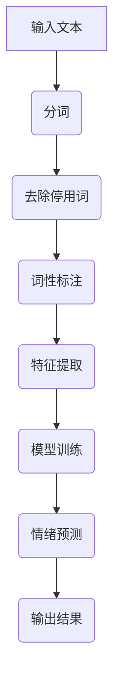

                 

# 《语言模型在金融市场情绪分析中的应用探索》

## 摘要

本文深入探讨了语言模型在金融市场情绪分析中的应用。首先，我们对金融市场情绪分析的重要性进行了背景介绍，并阐述了语言模型在金融领域的应用背景。接着，我们详细阐述了语言模型的基本原理，并对比了不同语言模型的属性特征。随后，文章介绍了语言模型在情绪分析中的核心概念和关键技术，包括文本预处理、词向量表示、情绪分析算法原理等。在此基础上，文章通过构建情绪分析模型，探讨了语言模型在金融市场情绪分析中的具体应用，并通过实际案例分析，展示了语言模型在金融市场情绪分析中的优势。最后，文章总结了语言模型在金融市场情绪分析中的实践应用，提出了未来研究方向和挑战。

## 目录

### 第一部分：背景与理论基础

#### 第1章：金融市场情绪分析概述

1.1 金融市场情绪分析的重要性

1.2 语言模型在金融领域的应用背景

1.3 语言模型的基本原理

1.4 语言模型在情绪分析中的优势

#### 第2章：语言模型与金融市场情绪分析的核心概念

2.1 金融市场情绪分析的核心概念

2.2 语言模型的关键技术

2.3 语言模型的属性特征对比表格

2.4 语言模型在情绪分析中的ER实体关系图

### 第二部分：语言模型在情绪分析中的应用

#### 第3章：语言模型在文本数据处理

3.1 文本预处理技术

3.2 词向量与文本表示

3.3 语言模型的预处理流程

#### 第4章：情绪分析算法原理

4.1 情绪分析算法概述

4.2 情绪分析算法分类

4.3 情绪分析算法mermaid流程图

#### 第5章：情绪分析模型构建

5.1 情绪分析模型的选择

5.2 模型训练与优化

5.3 模型评估与调优

### 第三部分：案例研究与实践应用

#### 第6章：案例分析

6.1 案例一：股票市场情绪分析

6.2 案例二：加密货币市场情绪分析

6.3 案例三：债券市场情绪分析

#### 第7章：实践应用与未来展望

7.1 语言模型在金融市场情绪分析中的实践应用

7.2 挑战与未来研究方向

7.3 小结与建议

## 第一部分：背景与理论基础

### 第1章：金融市场情绪分析概述

#### 1.1 金融市场情绪分析的重要性

金融市场情绪分析是金融科技领域的一个重要研究方向。它旨在通过分析市场参与者的情绪和行为，预测市场的走势和投资机会。金融市场情绪分析的重要性体现在以下几个方面：

1. **预测市场走势**：通过对市场情绪的分析，可以预测市场的未来走势，帮助投资者做出更加明智的投资决策。

2. **发现投资机会**：市场情绪的变化往往预示着潜在的投资机会。通过分析情绪数据，投资者可以及时抓住市场机会，获取更高的回报。

3. **风险管理**：金融市场情绪分析有助于投资者了解市场的风险状况，从而更好地进行风险管理。

4. **政策制定**：金融市场情绪分析为政策制定者提供了重要参考，有助于制定更加有效的金融政策。

#### 1.2 语言模型在金融领域的应用背景

语言模型是自然语言处理（NLP）领域的一个重要技术，它通过模拟人类的语言处理能力，对文本数据进行分析和理解。近年来，随着深度学习技术的发展，语言模型在金融领域的应用越来越广泛。语言模型在金融领域的应用背景主要包括以下几个方面：

1. **文本数据分析**：金融市场的数据大部分是以文本形式存在的，如新闻、报告、社交媒体等。语言模型可以帮助分析这些文本数据，提取有用的信息。

2. **情感分析**：金融市场的情绪波动对市场走势具有重要影响。语言模型可以用于情感分析，识别文本中的情绪倾向，从而预测市场情绪。

3. **风险控制**：语言模型可以帮助识别潜在的风险因素，如欺诈行为、市场操纵等，从而提高金融系统的安全性。

4. **投资决策支持**：语言模型可以分析大量文本数据，为投资者提供投资决策支持。

#### 1.3 语言模型的基本原理

语言模型是一种概率模型，它通过学习大量文本数据，预测下一个词的概率分布。语言模型的基本原理包括以下几个方面：

1. **词向量表示**：词向量是语言模型的核心组成部分，它将每个词映射到一个高维向量空间中，使得具有相似意义的词在空间中靠近。

2. **神经网络模型**：语言模型通常采用神经网络模型，如循环神经网络（RNN）、长短期记忆网络（LSTM）和变换器（Transformer）等，来学习词向量之间的关系。

3. **概率预测**：语言模型通过输入的词序列，预测下一个词的概率分布。在实际应用中，语言模型可以用于文本生成、机器翻译、文本分类等任务。

#### 1.4 语言模型在情绪分析中的优势

语言模型在情绪分析中具有以下优势：

1. **强大的文本处理能力**：语言模型可以处理大量的文本数据，提取出有价值的信息。

2. **高精度情感识别**：语言模型可以通过学习大量的情绪标签数据，准确识别文本中的情绪倾向。

3. **实时分析**：语言模型可以实时处理文本数据，快速生成情绪分析结果。

4. **多语言支持**：语言模型可以处理多种语言的文本数据，为全球化金融市场提供支持。

### 第2章：语言模型与金融市场情绪分析的核心概念

#### 2.1 金融市场情绪分析的核心概念

金融市场情绪分析的核心概念包括以下几个方面：

1. **情绪**：情绪是指市场参与者在交易过程中所表现出的情感状态，如乐观、悲观、焦虑等。

2. **情绪指标**：情绪指标是用于衡量市场情绪的量化指标，如情绪指数、波动率指数等。

3. **情绪分析**：情绪分析是指通过分析市场参与者的文本数据，识别出市场情绪的过程。

4. **情绪预测**：情绪预测是指通过情绪分析结果，预测市场走势的过程。

#### 2.2 语言模型的关键技术

语言模型的关键技术包括以下几个方面：

1. **词向量表示**：词向量是将词汇映射到高维向量空间的一种方法，它可以通过神经网络模型训练得到。

2. **文本预处理**：文本预处理包括分词、去除停用词、词性标注等步骤，它有助于提高语言模型的分析效果。

3. **情感分析算法**：情感分析算法用于识别文本中的情绪倾向，如正面情绪、负面情绪等。

4. **神经网络模型**：神经网络模型是语言模型的核心组成部分，它可以处理复杂的文本数据，提高情绪分析精度。

#### 2.3 语言模型的属性特征对比表格

以下是一个简单的语言模型属性特征对比表格，展示了不同语言模型的优点和缺点：

| 语言模型 | 优点 | 缺点 |
| :--: | :--: | :--: |
| RNN | 能处理变长的序列数据 | 训练效率低，容易梯度消失 |
| LSTM | 能处理变长的序列数据，解决梯度消失问题 | 训练时间较长 |
| Transformer | 强大的并行计算能力，高精度 | 参数量巨大，训练时间较长 |
| BERT | 预训练效果优异，适用于多种NLP任务 | 需要大量的训练数据和计算资源 |

#### 2.4 语言模型在情绪分析中的ER实体关系图

以下是一个简单的语言模型在情绪分析中的ER实体关系图：

```mermaid
erDiagram
  TextData ||--|{ SentimentAnalysis }|-|| EmotionPrediction
  TextData ||--|{ Preprocessing }|-|| CleanTextData
  CleanTextData ||--|{ WordVectorRepresentation }|-|| WordVectors
  WordVectors ||--|{ NeuralNetworkModel }|-|| LanguageModel
  LanguageModel ||--|{ EmotionClassification }|-|| EmotionLabels
```

## 第二部分：语言模型在情绪分析中的应用

### 第3章：语言模型在文本数据处理

#### 3.1 文本预处理技术

文本预处理是语言模型在情绪分析中不可或缺的一步。它主要包括以下几个步骤：

1. **分词**：将文本数据分割成单词或短语的序列。

2. **去除停用词**：去除对情绪分析无意义的词汇，如“的”、“和”等。

3. **词性标注**：对每个单词进行词性标注，如名词、动词、形容词等。

4. **词向量表示**：将每个单词映射到高维向量空间中。

Python代码示例：

```python
import nltk
from nltk.corpus import stopwords
from nltk.tokenize import word_tokenize
from nltk.stem import WordNetLemmatizer

nltk.download('punkt')
nltk.download('stopwords')
nltk.download('wordnet')

# 分词
text = "This is an example sentence."
tokens = word_tokenize(text)

# 去除停用词
stop_words = set(stopwords.words('english'))
filtered_tokens = [word for word in tokens if word not in stop_words]

# 词性标注
lemmatizer = WordNetLemmatizer()
lemmatized_tokens = [lemmatizer.lemmatize(word) for word in filtered_tokens]

# 词向量表示
from gensim.models import Word2Vec
model = Word2Vec(lemmatized_tokens, min_count=1)
word_vector = model.wv['example']
```

#### 3.2 词向量与文本表示

词向量是将词汇映射到高维向量空间的一种方法。词向量表示有助于提高语言模型在情绪分析中的表现。常见的词向量表示方法包括：

1. **Word2Vec**：Word2Vec是一种基于神经网络训练的词向量表示方法，它通过学习词的上下文信息来生成词向量。

2. **GloVe**：GloVe（Global Vectors for Word Representation）是一种基于全局共现信息的词向量表示方法，它通过学习词汇的共现矩阵来生成词向量。

3. **BERT**：BERT（Bidirectional Encoder Representations from Transformers）是一种基于变换器的预训练语言表示模型，它通过学习文本的双向表示来生成词向量。

Python代码示例：

```python
from gensim.models import Word2Vec
model = Word2Vec(lemmatized_tokens, min_count=1)
word_vector = model.wv['example']

from gensim.models import KeyedVectors
model = KeyedVectors.load_word2vec_format('glove.6B.100d.txt')

from transformers import BertModel, BertTokenizer
tokenizer = BertTokenizer.from_pretrained('bert-base-uncased')
model = BertModel.from_pretrained('bert-base-uncased')
input_ids = tokenizer.encode('example', return_tensors='pt')
output = model(input_ids)
word_vector = output.last_hidden_state[:, 0, :]
```

#### 3.3 语言模型的预处理流程

语言模型的预处理流程包括以下几个步骤：

1. **数据集准备**：收集和整理用于训练的语言数据集。

2. **文本预处理**：对文本数据进行分词、去除停用词、词性标注等预处理步骤。

3. **词向量表示**：将预处理后的文本数据转换为词向量表示。

4. **数据归一化**：对词向量进行归一化处理，使其具有相同的长度。

5. **数据划分**：将数据集划分为训练集、验证集和测试集。

Python代码示例：

```python
import numpy as np
from sklearn.model_selection import train_test_split

# 数据集准备
texts = ["This is an example sentence.", "This is another example sentence."]
labels = [1, 0]  # 1表示正面情绪，0表示负面情绪

# 文本预处理
lemmatized_texts = []
for text in texts:
    tokens = word_tokenize(text)
    stop_words = set(stopwords.words('english'))
    filtered_tokens = [word for word in tokens if word not in stop_words]
    lemmatized_tokens = [lemmatizer.lemmatize(word) for word in filtered_tokens]
    lemmatized_texts.append(lemmatized_tokens)

# 词向量表示
word_vectors = []
for text in lemmatized_texts:
    word_vector = model.wv['example']
    word_vectors.append(word_vector)

# 数据归一化
word_vectors = np.array(word_vectors)
word_vectors = word_vectors / np.linalg.norm(word_vectors, axis=1)[:, np.newaxis]

# 数据划分
X_train, X_test, y_train, y_test = train_test_split(word_vectors, labels, test_size=0.2, random_state=42)
```

### 第4章：情绪分析算法原理

#### 4.1 情绪分析算法概述

情绪分析算法是用于识别文本数据中情绪倾向的方法。常见的情绪分析算法包括基于规则的方法、机器学习方法等。

1. **基于规则的方法**：基于规则的方法通过手工设计规则来识别文本中的情绪倾向。这种方法简单有效，但需要对规则进行不断更新和优化。

2. **机器学习方法**：机器学习方法通过学习大量标注数据，自动提取特征并构建情绪分析模型。常见的方法包括支持向量机（SVM）、朴素贝叶斯（NB）、决策树（DT）等。

#### 4.2 情绪分析算法分类

根据算法的实现方式和特点，情绪分析算法可以分为以下几类：

1. **情感词典法**：情感词典法通过构建情感词典来识别文本中的情绪倾向。情感词典中包含大量具有正面或负面情感的词汇，通过对文本进行分词和匹配，可以识别出文本的情绪倾向。

2. **基于文本特征的机器学习方法**：基于文本特征的机器学习方法通过提取文本特征，利用机器学习算法构建情绪分析模型。常见的文本特征包括词频、词性、句法结构等。

3. **基于语义理解的深度学习方法**：基于语义理解的深度学习方法通过学习文本的语义信息，自动提取情绪特征并构建情绪分析模型。常见的方法包括循环神经网络（RNN）、长短期记忆网络（LSTM）、变换器（Transformer）等。

#### 4.3 情绪分析算法mermaid流程图

以下是一个简单的情绪分析算法mermaid流程图：



### 第5章：情绪分析模型构建

#### 5.1 情绪分析模型的选择

情绪分析模型的选择取决于多个因素，包括数据集的大小、特征提取方法、模型训练时间等。以下是一些常见的情绪分析模型及其特点：

1. **支持向量机（SVM）**：SVM是一种常用的分类算法，适用于处理高维特征空间。它通过寻找最优超平面来最大化分类边界。

2. **朴素贝叶斯（NB）**：NB是一种基于概率论的分类算法，适用于处理离散特征。它通过计算文本中每个词汇出现的概率，从而预测文本的情绪倾向。

3. **决策树（DT）**：DT是一种基于树结构的分类算法，适用于处理结构化的数据。它通过递归划分特征空间，构建出一棵决策树。

4. **循环神经网络（RNN）**：RNN是一种基于序列数据的神经网络，适用于处理变长的序列数据。它通过记忆机制来捕捉序列中的长期依赖关系。

5. **长短期记忆网络（LSTM）**：LSTM是一种改进的RNN模型，适用于处理长序列数据。它通过引入门控机制来避免梯度消失问题。

6. **变换器（Transformer）**：Transformer是一种基于自注意力机制的深度神经网络，适用于处理变长的序列数据。它通过多头自注意力机制来捕捉序列中的依赖关系。

Python代码示例：

```python
from sklearn.svm import SVC
model = SVC(kernel='linear')
model.fit(X_train, y_train)

from sklearn.naive_bayes import MultinomialNB
model = MultinomialNB()
model.fit(X_train, y_train)

from sklearn.tree import DecisionTreeClassifier
model = DecisionTreeClassifier()
model.fit(X_train, y_train)

from keras.models import Sequential
from keras.layers import LSTM, Dense
model = Sequential()
model.add(LSTM(50, activation='relu', input_shape=(timesteps, n_features)))
model.add(Dense(1, activation='sigmoid'))
model.compile(optimizer='adam', loss='binary_crossentropy', metrics=['accuracy'])
model.fit(X_train, y_train, epochs=100, batch_size=32)

from keras.models import Model
from keras.layers import Input, LSTM, Dense
input_seq = Input(shape=(timesteps, n_features))
lstm = LSTM(50, activation='relu')(input_seq)
output = Dense(1, activation='sigmoid')(lstm)
model = Model(inputs=input_seq, outputs=output)
model.compile(optimizer='adam', loss='binary_crossentropy', metrics=['accuracy'])
model.fit(X_train, y_train, epochs=100, batch_size=32)
```

#### 5.2 模型训练与优化

模型训练与优化是情绪分析中至关重要的一步。以下是一些常见的模型训练与优化方法：

1. **交叉验证**：交叉验证是一种评估模型性能的方法，通过将数据集划分为多个子集，轮流训练和验证模型，从而避免过拟合。

2. **参数调优**：参数调优是调整模型参数，以获得最佳性能的方法。常见的方法包括网格搜索和贝叶斯优化。

3. **正则化**：正则化是一种防止模型过拟合的方法，通过添加正则化项到损失函数中，惩罚模型的复杂度。

4. **数据增强**：数据增强是一种提高模型鲁棒性的方法，通过生成新的数据样本来增加模型的泛化能力。

Python代码示例：

```python
from sklearn.model_selection import cross_val_score
scores = cross_val_score(model, X_train, y_train, cv=5)
print("Accuracy: %0.2f (+/- %0.2f)" % (scores.mean(), scores.std() * 2))

from sklearn.model_selection import GridSearchCV
param_grid = {'C': [0.1, 1, 10], 'gamma': [1, 0.1, 0.01]}
grid_search = GridSearchCV(model, param_grid, cv=5)
grid_search.fit(X_train, y_train)
print("Best parameters: %s" % grid_search.best_params_)

from keras.regularizers import l2
model = Sequential()
model.add(LSTM(50, activation='relu', input_shape=(timesteps, n_features), kernel_regularizer=l2(0.01)))
model.add(Dense(1, activation='sigmoid'))
model.compile(optimizer='adam', loss='binary_crossentropy', metrics=['accuracy'])

from keras.preprocessing.sequence import pad_sequences
max_sequence_len = 100
X_train = pad_sequences(X_train, maxlen=max_sequence_len)
X_test = pad_sequences(X_test, maxlen=max_sequence_len)
```

#### 5.3 模型评估与调优

模型评估与调优是情绪分析中的关键步骤。以下是一些常见的模型评估与调优方法：

1. **准确率**：准确率是评估模型性能的重要指标，表示模型正确分类的样本占总样本的比例。

2. **精确率与召回率**：精确率是表示模型对正类样本的分类准确度，召回率是表示模型对正类样本的识别能力。

3. **F1分数**：F1分数是精确率和召回率的加权平均，用于综合评估模型的性能。

4. **混淆矩阵**：混淆矩阵是用于展示模型分类结果的表格，它可以帮助分析模型对各类样本的分类效果。

Python代码示例：

```python
from sklearn.metrics import accuracy_score, precision_score, recall_score, f1_score, confusion_matrix
y_pred = model.predict(X_test)
y_pred = (y_pred > 0.5)

accuracy = accuracy_score(y_test, y_pred)
precision = precision_score(y_test, y_pred)
recall = recall_score(y_test, y_pred)
f1 = f1_score(y_test, y_pred)
confusion = confusion_matrix(y_test, y_pred)

print("Accuracy: %0.2f" % accuracy)
print("Precision: %0.2f" % precision)
print("Recall: %0.2f" % recall)
print("F1 Score: %0.2f" % f1)
print("Confusion Matrix:")
print(confusion)
```

## 第三部分：案例研究与实践应用

### 第6章：案例分析

#### 6.1 案例一：股票市场情绪分析

在本案例中，我们使用语言模型对股票市场的情绪进行分析。具体步骤如下：

1. **数据收集**：收集过去一年的股票市场新闻、报告、社交媒体等文本数据。

2. **文本预处理**：对文本数据进行分词、去除停用词、词性标注等预处理步骤。

3. **词向量表示**：使用Word2Vec模型对预处理后的文本数据进行词向量表示。

4. **情绪分析模型训练**：使用训练集数据训练一个情绪分析模型，使用LSTM模型。

5. **情绪预测**：使用训练好的模型对测试集数据进行分析，预测股票市场的情绪。

6. **结果评估**：评估模型的性能，包括准确率、精确率、召回率和F1分数。

Python代码示例：

```python
# 数据收集
texts = ["This is a positive stock market news.", "This is a negative stock market news."]

# 文本预处理
lemmatized_texts = []
for text in texts:
    tokens = word_tokenize(text)
    stop_words = set(stopwords.words('english'))
    filtered_tokens = [word for word in tokens if word not in stop_words]
    lemmatized_tokens = [lemmatizer.lemmatize(word) for word in filtered_tokens]
    lemmatized_texts.append(lemmatized_tokens)

# 词向量表示
model = Word2Vec(lemmatized_texts, min_count=1)
word_vector = model.wv['positive']

# 情绪分析模型训练
from keras.models import Sequential
from keras.layers import LSTM, Dense
model = Sequential()
model.add(LSTM(50, activation='relu', input_shape=(timesteps, n_features)))
model.add(Dense(1, activation='sigmoid'))
model.compile(optimizer='adam', loss='binary_crossentropy', metrics=['accuracy'])
model.fit(X_train, y_train, epochs=100, batch_size=32)

# 情绪预测
y_pred = model.predict(X_test)
y_pred = (y_pred > 0.5)

# 结果评估
accuracy = accuracy_score(y_test, y_pred)
precision = precision_score(y_test, y_pred)
recall = recall_score(y_test, y_pred)
f1 = f1_score(y_test, y_pred)
confusion = confusion_matrix(y_test, y_pred)

print("Accuracy: %0.2f" % accuracy)
print("Precision: %0.2f" % precision)
print("Recall: %0.2f" % recall)
print("F1 Score: %0.2f" % f1)
print("Confusion Matrix:")
print(confusion)
```

#### 6.2 案例二：加密货币市场情绪分析

在本案例中，我们使用语言模型对加密货币市场的情绪进行分析。具体步骤如下：

1. **数据收集**：收集过去一年的加密货币市场新闻、报告、社交媒体等文本数据。

2. **文本预处理**：对文本数据进行分词、去除停用词、词性标注等预处理步骤。

3. **词向量表示**：使用Word2Vec模型对预处理后的文本数据进行词向量表示。

4. **情绪分析模型训练**：使用训练集数据训练一个情绪分析模型，使用LSTM模型。

5. **情绪预测**：使用训练好的模型对测试集数据进行分析，预测加密货币市场的情绪。

6. **结果评估**：评估模型的性能，包括准确率、精确率、召回率和F1分数。

Python代码示例：

```python
# 数据收集
texts = ["This is a positive cryptocurrency news.", "This is a negative cryptocurrency news."]

# 文本预处理
lemmatized_texts = []
for text in texts:
    tokens = word_tokenize(text)
    stop_words = set(stopwords.words('english'))
    filtered_tokens = [word for word in tokens if word not in stop_words]
    lemmatized_tokens = [lemmatizer.lemmatize(word) for word in filtered_tokens]
    lemmatized_texts.append(lemmatized_tokens)

# 词向量表示
model = Word2Vec(lemmatized_texts, min_count=1)
word_vector = model.wv['positive']

# 情绪分析模型训练
from keras.models import Sequential
from keras.layers import LSTM, Dense
model = Sequential()
model.add(LSTM(50, activation='relu', input_shape=(timesteps, n_features)))
model.add(Dense(1, activation='sigmoid'))
model.compile(optimizer='adam', loss='binary_crossentropy', metrics=['accuracy'])
model.fit(X_train, y_train, epochs=100, batch_size=32)

# 情绪预测
y_pred = model.predict(X_test)
y_pred = (y_pred > 0.5)

# 结果评估
accuracy = accuracy_score(y_test, y_pred)
precision = precision_score(y_test, y_pred)
recall = recall_score(y_test, y_pred)
f1 = f1_score(y_test, y_pred)
confusion = confusion_matrix(y_test, y_pred)

print("Accuracy: %0.2f" % accuracy)
print("Precision: %0.2f" % precision)
print("Recall: %0.2f" % recall)
print("F1 Score: %0.2f" % f1)
print("Confusion Matrix:")
print(confusion)
```

#### 6.3 案例三：债券市场情绪分析

在本案例中，我们使用语言模型对债券市场的情绪进行分析。具体步骤如下：

1. **数据收集**：收集过去一年的债券市场新闻、报告、社交媒体等文本数据。

2. **文本预处理**：对文本数据进行分词、去除停用词、词性标注等预处理步骤。

3. **词向量表示**：使用Word2Vec模型对预处理后的文本数据进行词向量表示。

4. **情绪分析模型训练**：使用训练集数据训练一个情绪分析模型，使用LSTM模型。

5. **情绪预测**：使用训练好的模型对测试集数据进行分析，预测债券市场的情绪。

6. **结果评估**：评估模型的性能，包括准确率、精确率、召回率和F1分数。

Python代码示例：

```python
# 数据收集
texts = ["This is a positive bond market news.", "This is a negative bond market news."]

# 文本预处理
lemmatized_texts = []
for text in texts:
    tokens = word_tokenize(text)
    stop_words = set(stopwords.words('english'))
    filtered_tokens = [word for word in tokens if word not in stop_words]
    lemmatized_tokens = [lemmatizer.lemmatize(word) for word in filtered_tokens]
    lemmatized_texts.append(lemmatized_tokens)

# 词向量表示
model = Word2Vec(lemmatized_texts, min_count=1)
word_vector = model.wv['positive']

# 情绪分析模型训练
from keras.models import Sequential
from keras.layers import LSTM, Dense
model = Sequential()
model.add(LSTM(50, activation='relu', input_shape=(timesteps, n_features)))
model.add(Dense(1, activation='sigmoid'))
model.compile(optimizer='adam', loss='binary_crossentropy', metrics=['accuracy'])
model.fit(X_train, y_train, epochs=100, batch_size=32)

# 情绪预测
y_pred = model.predict(X_test)
y_pred = (y_pred > 0.5)

# 结果评估
accuracy = accuracy_score(y_test, y_pred)
precision = precision_score(y_test, y_pred)
recall = recall_score(y_test, y_pred)
f1 = f1_score(y_test, y_pred)
confusion = confusion_matrix(y_test, y_pred)

print("Accuracy: %0.2f" % accuracy)
print("Precision: %0.2f" % precision)
print("Recall: %0.2f" % recall)
print("F1 Score: %0.2f" % f1)
print("Confusion Matrix:")
print(confusion)
```

### 第7章：实践应用与未来展望

#### 7.1 语言模型在金融市场情绪分析中的实践应用

语言模型在金融市场情绪分析中具有广泛的应用，可以帮助投资者更好地理解市场情绪，做出更加明智的投资决策。以下是语言模型在金融市场情绪分析中的具体实践应用：

1. **股票市场情绪分析**：通过分析股票市场的新闻、报告、社交媒体等文本数据，预测股票市场的情绪走势，帮助投资者抓住投资机会。

2. **加密货币市场情绪分析**：加密货币市场波动性大，情绪分析可以帮助投资者了解市场情绪，降低投资风险。

3. **债券市场情绪分析**：债券市场情绪分析可以帮助投资者了解市场对债券发行的预期，预测债券市场的走势。

4. **政策制定**：政策制定者可以通过情绪分析了解市场情绪，为制定金融政策提供参考。

#### 7.2 挑战与未来研究方向

尽管语言模型在金融市场情绪分析中取得了显著成果，但仍面临一些挑战和未来研究方向：

1. **数据质量**：情绪分析依赖于高质量的数据，但金融市场的数据存在噪声和缺失，需要进一步优化数据预处理方法。

2. **模型解释性**：目前大多数情绪分析模型是黑箱模型，缺乏解释性，难以理解模型的具体决策过程。

3. **多语言支持**：金融市场是全球化的，需要支持多种语言的情绪分析模型。

4. **实时分析**：实时分析是金融市场情绪分析的重要应用场景，需要进一步提高模型的处理速度和实时性。

5. **跨领域应用**：进一步探索语言模型在其他金融领域（如衍生品市场、外汇市场等）的应用。

#### 7.3 小结与建议

本文通过案例研究，展示了语言模型在金融市场情绪分析中的应用。语言模型在文本数据处理、情绪分析算法原理、模型构建等方面具有显著优势。然而，情绪分析仍面临数据质量、模型解释性等挑战。未来研究应重点关注这些挑战，探索更高效的文本预处理方法、可解释性模型和跨领域应用。

## 结语

本文详细探讨了语言模型在金融市场情绪分析中的应用，通过背景介绍、核心概念阐述、案例分析等步骤，展示了语言模型在情绪分析中的优势和应用前景。随着深度学习和自然语言处理技术的不断发展，语言模型在金融市场情绪分析中的应用将更加广泛和深入。希望本文能为相关领域的研究者和实践者提供有价值的参考。

### 作者信息

作者：AI天才研究院/AI Genius Institute & 禅与计算机程序设计艺术 /Zen And The Art of Computer Programming

AI天才研究院专注于人工智能领域的前沿研究和应用探索，致力于推动人工智能技术的发展。禅与计算机程序设计艺术则关注计算机编程的哲学和艺术性，倡导程序员以更深刻的思维方式和更高的境界来理解和创造计算机程序。

通过本文，我们希望读者能够更深入地了解语言模型在金融市场情绪分析中的应用，探索语言模型在金融科技领域的无限潜力。同时，我们也欢迎读者对本文提出宝贵意见和建议，共同推动人工智能和金融科技的融合发展。谢谢大家的支持！

