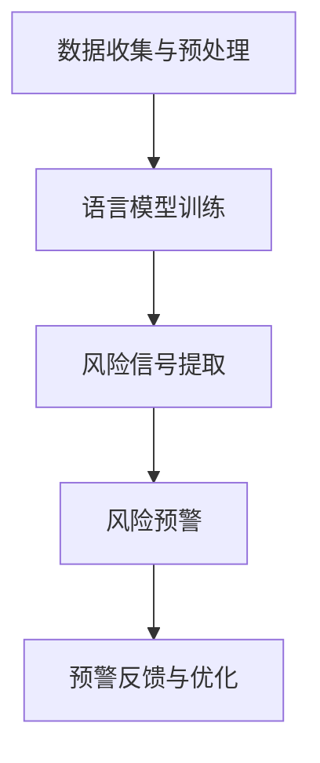
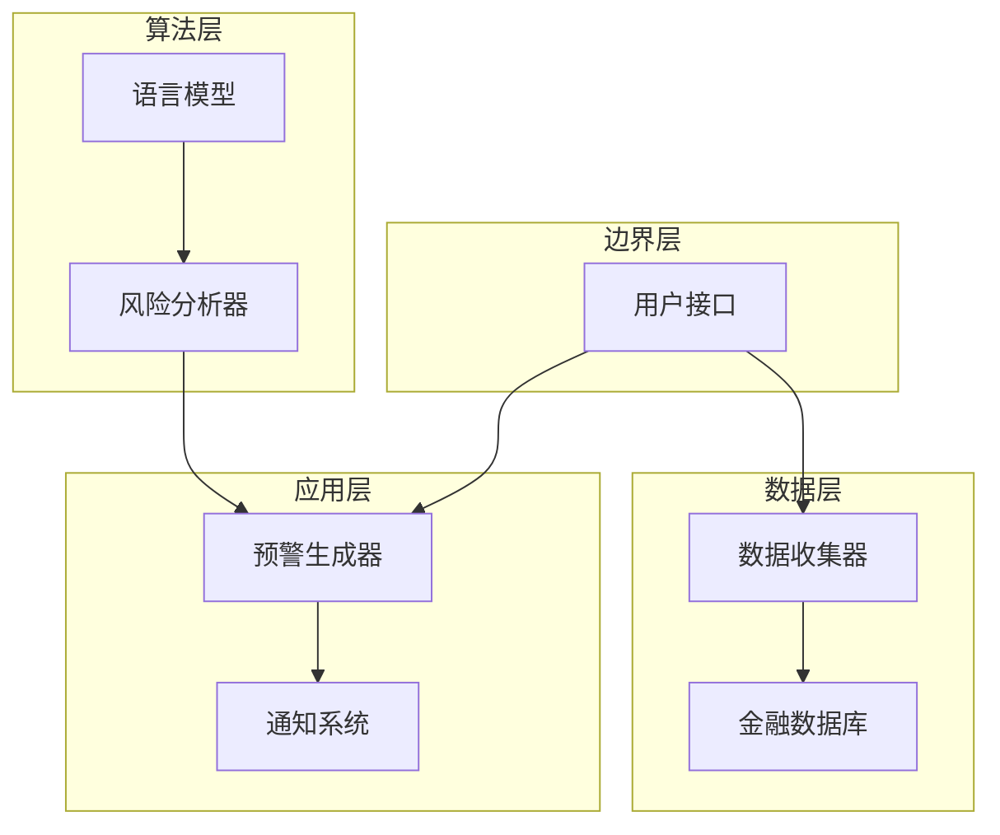
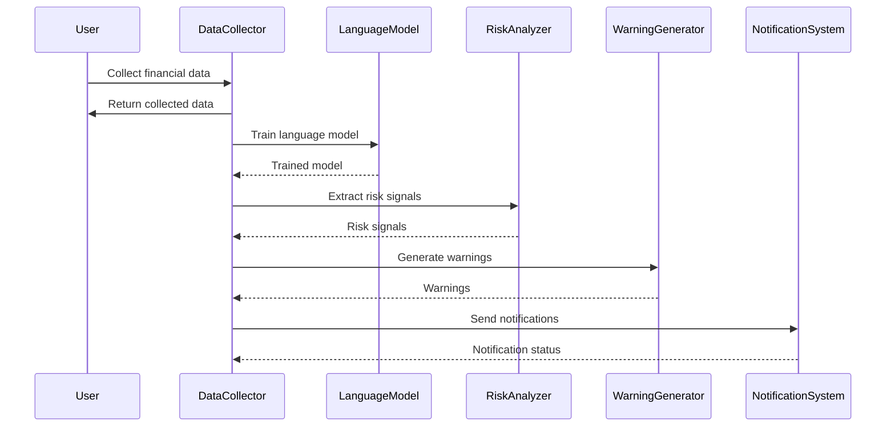

                 

### 1.1 问题背景

金融风险早期预警是指通过监测金融市场数据，提前发现潜在的风险并采取相应的预防措施，以减少损失。金融市场的波动性大，风险多样且难以预测，因此早期预警对金融机构和投资者至关重要。然而，传统的风险预警方法往往存在响应迟缓、预警不准确等问题，难以满足现代金融市场的需求。

语言模型作为一种人工智能技术，近年来在自然语言处理领域取得了显著的进展。它能够理解、生成和模拟人类语言，具有强大的信息提取和语义理解能力。将语言模型应用于金融风险早期预警，可以有效地识别金融市场的潜在风险信号，提高预警的准确性和及时性。

### 1.2 问题描述

金融风险的多样性使得传统的风险预警方法难以应对。金融风险包括市场风险、信用风险、流动性风险等，每种风险都有其独特的特征和表现方式。同时，金融市场数据的庞杂性和实时性也增加了风险预警的难度。

语言模型在金融风险早期预警中具有以下潜力：
1. 语言模型可以处理大规模的金融市场数据，提取有价值的信息。
2. 语言模型能够理解金融市场的语义，识别潜在的风险信号。
3. 语言模型可以实时监测金融市场，提供及时的预警信息。

### 1.3 问题解决

利用语言模型进行金融风险早期预警，可以分为以下几个步骤：

1. 数据收集与预处理：收集金融市场相关数据，包括股票价格、交易量、新闻报道等，对数据进行清洗和预处理。
2. 语言模型训练：利用预处理后的数据，训练语言模型，使其能够理解金融市场的语言特征。
3. 风险信号提取：使用训练好的语言模型，分析金融市场数据，提取潜在的风险信号。
4. 风险预警：根据提取到的风险信号，生成预警信息，并采取相应的预防措施。

### 1.4 边界与外延

金融风险早期预警的范围涉及金融市场各个方面，包括股票、债券、外汇、期货等。同时，语言模型的适用性也在不断拓展，不仅可以用于股票市场，还可以应用于其他金融领域，如保险、银行等。

### 1.5 概念结构与核心要素组成

语言模型在金融风险早期预警中的概念结构主要包括以下几个方面：

1. **语言模型**：一种基于统计或神经网络的模型，用于模拟自然语言。
2. **金融市场数据**：包括股票价格、交易量、新闻报道等，是语言模型训练和风险信号提取的基础。
3. **风险信号**：通过语言模型分析金融市场数据提取的潜在风险信息。
4. **预警系统**：根据风险信号生成预警信息，并触发预防措施的体系。

核心要素组成如下：

- **数据采集**：收集大量金融市场数据，为语言模型训练提供数据基础。
- **模型训练**：利用金融市场数据训练语言模型，使其能够理解金融市场的语言特征。
- **风险分析**：使用训练好的语言模型，分析金融市场数据，提取潜在风险信号。
- **预警机制**：根据风险信号，生成预警信息，并采取相应的预防措施。

以上构成了金融风险早期预警中语言模型应用的基本框架，为后续章节的详细探讨提供了基础。

---

### 1.1 问题背景

金融风险早期预警的重要性在于它能够帮助金融机构和投资者在风险发生前及时采取措施，减少潜在的损失。金融市场的高波动性和复杂性使得传统的风险预警方法难以适应，特别是在大规模数据处理和实时监测方面存在明显不足。随着金融市场的不断发展和全球化，风险预警的需求变得更加迫切。

首先，金融市场的波动性大。股票、债券、外汇等金融产品的价格波动受多种因素影响，如全球经济形势、政治事件、自然灾害等。这些因素的不确定性使得金融市场风险难以预测。早期预警系统能够实时监测市场动态，快速识别出异常波动，从而提前预警。

其次，金融风险的多样性增加了预警的难度。金融风险不仅包括市场风险，还涵盖信用风险、流动性风险、操作风险等多个方面。每种风险都有其特定的表现方式和特征，传统的预警方法往往针对单一风险类型，难以全面覆盖。语言模型通过学习大量的金融文本数据，能够理解和识别不同类型的风险信号，从而提高预警的全面性和准确性。

此外，实时性是金融风险早期预警的关键。金融市场变化迅速，风险往往在瞬间发生。早期预警系统需要具备实时监测和数据处理的 capability，以便在风险发生的初期就能发现并预警。传统方法由于响应时间较长，往往难以在风险爆发前采取有效措施。

语言模型在金融风险早期预警中的应用为解决上述问题提供了新的思路。语言模型，尤其是基于深度学习的模型，具备强大的数据处理和模式识别能力。它们能够从大量文本数据中提取有价值的信息，识别出潜在的风险信号。此外，语言模型具有自适应性和可扩展性，能够随着数据量的增加和环境的改变不断优化和更新，从而提高预警的准确性和实时性。

总之，金融风险早期预警对金融机构和投资者至关重要。随着金融市场的发展和复杂性增加，传统风险预警方法的局限性日益显现。语言模型的引入为金融风险早期预警带来了新的机遇，通过高效的数据处理和模式识别，能够更准确地预测和预警潜在的风险，为金融市场的稳健运行提供有力支持。

### 1.2 问题描述

金融风险具有多样性和复杂性，主要表现为以下几种类型：

1. **市场风险**：市场风险是指由于市场价格波动导致的金融损失。例如，股票市场的下跌可能导致投资者持有的股票贬值，债券市场的波动可能导致债券价格剧烈变化。市场风险通常由宏观经济环境、政策变化、市场情绪等多种因素引起。

2. **信用风险**：信用风险是指借款人或交易对手无法履行合同义务，导致信用损失的风险。金融机构在发放贷款或进行交易时，需要评估借款人或交易对手的信用状况。如果借款人或交易对手出现违约，金融机构将面临信用损失。

3. **流动性风险**：流动性风险是指金融机构在短期内无法以合理价格变现资产，导致无法满足资金需求的风险。流动性风险通常发生在市场流动性不足或市场信心不足的情况下，可能导致金融机构无法按时偿还债务或满足客户的提款需求。

4. **操作风险**：操作风险是指由于内部程序、人员、系统或外部事件导致的金融损失。操作风险包括欺诈、错误操作、系统故障、外部攻击等多种形式。

5. **法律和合规风险**：法律和合规风险是指由于法律变化、法规要求或内部合规问题导致的金融损失。例如，金融机构可能因未能遵守监管规定而面临罚款或其他法律制裁。

这些风险类型相互关联，且在不同情境下可能表现出不同的特征。例如，市场风险和信用风险在金融市场波动时可能加剧，而操作风险和法律风险则可能由于内部管理问题或外部事件引发。

传统风险预警方法，如统计模型、专家系统和规则系统，存在一些局限性。首先，这些方法通常依赖于历史数据和规则，难以适应快速变化的金融市场环境。其次，这些方法在处理大规模、实时数据时效率较低，难以实现实时预警。此外，传统方法对风险的识别和预测能力有限，特别是在复杂风险信号的综合分析方面存在不足。

语言模型在应对这些挑战方面具有独特优势。首先，语言模型能够处理和融合来自多种来源的数据，如文本、图像和音频，从而提供更全面的风险分析。其次，语言模型通过深度学习技术能够自动识别和提取数据中的潜在模式，从而提高风险识别的准确性。此外，语言模型具有自适应性和可扩展性，能够随着数据量的增加和环境变化不断优化，从而提高预警的实时性和准确性。

### 1.3 问题解决

为了利用语言模型解决金融风险早期预警的问题，我们需要系统地设计一个综合的预警系统。以下是一个分步骤的解决方案：

#### 1. 数据收集与预处理

首先，我们需要收集金融市场相关的数据，这些数据可能包括：

- **股票价格和交易量**：这是最基本的数据，反映了市场的即时状态。
- **新闻报道**：金融新闻报道能够提供市场情绪和市场预期的信息。
- **财务报表**：公司发布的财务报表可以帮助我们了解公司的财务健康状况。
- **宏观经济数据**：如GDP、失业率、利率等，这些数据对金融市场有长期影响。

收集到这些数据后，我们需要进行预处理，包括数据清洗、数据标准化和数据增强等步骤，以确保数据的质量和一致性。

#### 2. 语言模型训练

利用预处理后的数据，我们可以训练语言模型。训练语言模型通常分为以下几个步骤：

- **词向量表示**：将文本数据转换为词向量，以便于模型处理。
- **构建神经网络**：设计一个深度神经网络，如循环神经网络（RNN）、长短时记忆网络（LSTM）或变换器（Transformer）。
- **数据输入与输出**：将训练数据输入到神经网络中，并设定输出为风险信号。

在训练过程中，我们可以使用损失函数（如交叉熵损失）来评估模型的性能，并通过反向传播算法优化模型参数。

#### 3. 风险信号提取

训练好的语言模型可以用于风险信号提取。具体步骤如下：

- **特征提取**：使用语言模型从金融市场数据中提取特征，如词频、主题分布等。
- **风险评分**：基于提取的特征，对金融市场的风险进行评分。
- **风险分类**：将风险信号分类为不同类型，如市场风险、信用风险等。

#### 4. 风险预警

根据提取到的风险信号，我们可以生成预警信息。预警系统的设计包括以下几个部分：

- **阈值设定**：根据历史数据和风险偏好，设定风险信号的阈值。
- **预警规则**：定义当风险评分超过阈值时，应采取的预警措施。
- **预警通知**：通过邮件、短信、APP等渠道将预警信息通知给相关人员。

#### 5. 预警反馈与优化

预警系统的效果需要通过反馈进行优化。具体步骤如下：

- **评估预警效果**：定期评估预警系统的准确性和及时性。
- **模型更新**：根据反馈数据，调整语言模型参数，优化预警系统。
- **持续监控**：持续监控金融市场数据，确保预警系统的实时性和准确性。

通过上述步骤，我们可以构建一个高效的金融风险早期预警系统，利用语言模型处理复杂的市场数据，提高风险识别和预警的准确性。

### 1.4 边界与外延

金融风险早期预警的范围广泛，涵盖了股票市场、债券市场、外汇市场等多个领域。每个市场都有其独特的风险特征和预警需求。例如，股票市场的风险预警可能更侧重于公司财务状况和市场情绪的变化，而债券市场的风险预警则可能更多关注宏观经济环境和利率变化。

语言模型在金融风险早期预警中的适用性主要体现在以下几个方面：

1. **大规模数据处理能力**：语言模型能够处理和分析海量金融市场数据，包括文本、图像和音频等多种数据类型。
2. **实时监测能力**：语言模型可以实时监测金融市场动态，快速识别潜在风险信号。
3. **自适应性和可扩展性**：随着市场环境和数据量的变化，语言模型能够自适应调整，提高预警的准确性和可靠性。

然而，语言模型也存在一些局限性。首先，语言模型对数据质量要求较高，数据缺失或不一致可能导致模型训练失败或预警不准确。其次，语言模型可能受到噪声数据的影响，降低预警的准确性。此外，语言模型在处理复杂金融产品（如期权、期货等）时可能存在困难，需要进一步研究和技术优化。

### 1.5 概念结构与核心要素组成

在金融风险早期预警中，语言模型的核心概念和结构主要包括以下几个方面：

1. **语言模型**：这是预警系统的核心，负责从金融市场数据中提取和理解风险信号。常见的语言模型包括循环神经网络（RNN）、长短时记忆网络（LSTM）和变换器（Transformer）。

2. **金融市场数据**：这些数据包括股票价格、交易量、新闻报道、财务报表等，是语言模型训练和风险信号提取的基础。数据的质量直接影响预警系统的性能。

3. **风险信号**：通过语言模型处理金融市场数据提取出的潜在风险信息。这些信号可以是市场波动、公司财务状况、市场情绪等。

4. **预警系统**：这是一个综合性的系统，负责根据风险信号生成预警信息，并触发相应的预防措施。预警系统包括数据采集、模型训练、风险信号提取、预警规则和预警通知等模块。

核心要素组成如下：

- **数据采集模块**：负责收集和处理金融市场数据。
- **模型训练模块**：利用收集到的数据训练语言模型。
- **风险分析模块**：使用训练好的模型提取风险信号。
- **预警通知模块**：生成预警信息并通知相关人员。

通过这些核心概念和要素的有机结合，语言模型在金融风险早期预警中发挥了关键作用，为金融市场的稳健运行提供了有力支持。

## 第二部分：核心概念与联系

### 2.1 语言模型原理

语言模型是一种用于模拟自然语言概率分布的算法，其核心目的是预测下一个单词或词组，并基于上下文理解语言的意义。在金融风险早期预警中，语言模型通过分析大量的金融市场数据（如新闻报道、财务报表、股票价格等），提取潜在的风险信号，从而提供预警信息。

#### 语言模型的基本概念

1. **词汇表**：语言模型首先需要建立一个词汇表，包括所有可能出现的单词和词组。词汇表的大小决定了模型的复杂度和表达能力。

2. **概率分布**：语言模型的核心任务是学习文本的概率分布。通过统计文本中的单词和词组出现频率，模型可以预测下一个单词或词组的概率。

3. **上下文**：语言模型需要理解上下文信息，以预测正确的单词或词组。上下文可以是单词的历史序列，也可以是段落或整篇文章的内容。

4. **序列模型**：语言模型通常基于序列模型，如循环神经网络（RNN）和长短时记忆网络（LSTM），这些模型能够处理和记忆输入序列的信息。

#### 语言模型的属性特征对比表格

| 属性特征 | 循环神经网络（RNN） | 长短时记忆网络（LSTM） | 变换器（Transformer） |
| --- | --- | --- | --- |
| 记忆能力 | 较强 | 较强 | 极强 |
| 参数量 | 较少 | 较多 | 极多 |
| 训练速度 | 慢 | 较慢 | 快 |
| 表达能力 | 中等 | 较高 | 高 |

#### 语言模型的工作原理

1. **输入处理**：语言模型接收一段文本作为输入，将其转换为数字表示（词向量或嵌入向量）。

2. **序列处理**：模型按照顺序处理输入文本的每个单词或词组，保留上下文信息。

3. **概率预测**：模型根据当前输入和上下文信息，预测下一个单词或词组的概率分布。

4. **输出生成**：模型输出最可能的单词或词组，并重复上述过程，直至生成完整的文本。

在金融风险早期预警中，语言模型通过以下方式工作：

- **文本数据收集**：收集与金融市场相关的文本数据，如新闻报道、分析师报告、公司公告等。
- **数据预处理**：对文本数据进行清洗、分词和标注等预处理步骤。
- **模型训练**：使用预处理后的数据训练语言模型，使其能够理解金融市场的语言特征。
- **风险信号提取**：利用训练好的语言模型，分析金融市场文本数据，提取潜在的风险信号。
- **预警生成**：根据提取到的风险信号，生成预警信息，并触发相应的预防措施。

通过以上步骤，语言模型在金融风险早期预警中发挥了重要作用，提高了预警的准确性和及时性。

### 2.2 语言模型与金融风险

语言模型在金融领域具有广泛的应用，特别是在金融风险早期预警中，其独特的优势和潜力使其成为一项重要的工具。

#### 语言模型在金融领域的应用

1. **文本数据分析**：语言模型能够处理和分析大量的文本数据，如新闻报道、分析师报告、社交媒体评论等。这些数据提供了丰富的市场信息和情绪指标，有助于预测市场走势和潜在风险。

2. **自然语言处理**：语言模型在金融领域的另一个应用是自然语言处理（NLP），如自动翻译、文本摘要和情感分析等。通过这些技术，金融机构可以更高效地获取和处理信息，提高决策效率。

3. **风险信号提取**：语言模型能够从文本数据中提取潜在的风险信号，如负面新闻报道、分析师的悲观预测等。这些信号可以作为预警指标，帮助金融机构及时采取预防措施。

#### 语言模型在金融风险早期预警中的作用

1. **实时监测**：语言模型可以实时监测金融市场数据，快速识别潜在的风险信号。与传统的统计分析方法相比，语言模型在处理实时数据和复杂模式识别方面具有明显优势。

2. **多样性风险识别**：金融风险种类繁多，包括市场风险、信用风险、流动性风险等。语言模型能够处理多样化的文本数据，识别不同类型的风险信号，从而提供更全面的预警信息。

3. **自适应优化**：语言模型具有自适应性和可扩展性，可以根据新的数据和风险环境不断优化和更新。这使得预警系统能够适应金融市场的变化，提高预警的准确性和可靠性。

#### 语言模型的优势

1. **高效性**：语言模型能够快速处理和分析大量数据，提高风险预警的效率和准确性。

2. **全面性**：语言模型可以处理多种类型的数据，包括文本、图像和音频等，从而提供更全面的预警信息。

3. **实时性**：语言模型可以实时监测金融市场动态，提供及时的预警信息，帮助金融机构迅速采取预防措施。

4. **适应性**：语言模型具有自适应性和可扩展性，可以根据新的数据和环境不断优化，提高预警系统的性能。

总之，语言模型在金融风险早期预警中具有显著的优势和潜力。通过高效的数据处理和模式识别能力，语言模型能够提供全面、准确和实时的预警信息，为金融机构和投资者提供有力支持。

### 2.3 相关技术对比

在金融风险早期预警领域，语言模型并不是唯一的技术手段。传统方法和新兴技术的对比有助于我们更好地理解语言模型的优劣。以下是几种常见技术的对比分析：

#### 语言模型与其他风险预警技术的对比

1. **传统统计模型**：
   - **优点**：传统统计模型如ARIMA、回归分析等，具有理论基础坚实、计算简单等优点，适用于处理历史数据。
   - **缺点**：传统统计模型在处理复杂、非线性和大规模实时数据时存在明显不足。它们依赖于假设和先验知识，难以应对金融市场的复杂性和变化。

2. **机器学习方法**：
   - **优点**：机器学习方法如支持向量机（SVM）、随机森林等，具有较强的一般化能力和适应性，能够处理非线性问题和大规模数据。
   - **缺点**：机器学习方法需要大量标注数据，且训练过程较为复杂。此外，它们在处理高维数据时容易出现过拟合问题。

3. **深度学习方法**：
   - **优点**：深度学习方法如卷积神经网络（CNN）、循环神经网络（RNN）等，具有强大的特征提取和模式识别能力，能够处理复杂和大规模数据。
   - **缺点**：深度学习方法计算资源消耗大，训练时间较长。此外，它们在数据质量和样本数量有限时可能表现出较差的性能。

#### 语言模型的优势

1. **文本数据处理能力**：语言模型能够处理和融合来自多种来源的文本数据，如新闻报道、社交媒体评论、公司公告等，提供更全面的风险信息。

2. **实时监测能力**：语言模型可以实时监测金融市场动态，快速识别潜在的风险信号，提高预警的及时性。

3. **自适应性和可扩展性**：语言模型具有自适应性和可扩展性，能够根据新的数据和环境不断优化和更新，提高预警的准确性和可靠性。

4. **多维度风险识别**：语言模型能够处理和提取多种类型的数据，包括文本、图像和音频等，从而提供更全面的预警信息。

综上所述，语言模型在金融风险早期预警中具有显著的优势。它能够高效处理大规模实时数据，实时监测金融市场动态，并提取多样化的风险信号。与传统方法和机器学习方法相比，语言模型在文本数据处理、实时性和自适应能力方面具有明显优势，为金融风险预警提供了有力支持。

## 第三部分：算法原理讲解

### 3.1 语言模型算法

#### 语言模型算法的Mermaid流程图



#### 语言模型算法的Python源代码

```python
import numpy as np
import tensorflow as tf
from tensorflow.keras.preprocessing.sequence import pad_sequences
from tensorflow.keras.models import Sequential
from tensorflow.keras.layers import LSTM, Dense, Embedding

# 数据收集与预处理
def preprocess_data(data):
    # 数据清洗、分词、编码等步骤
    return processed_data

# 语言模型训练
def train_language_model(processed_data):
    # 定义模型结构
    model = Sequential([
        Embedding(input_dim=vocabulary_size, output_dim=embedding_size),
        LSTM(units=128, return_sequences=True),
        LSTM(units=64),
        Dense(units=1, activation='sigmoid')
    ])
    
    # 编译模型
    model.compile(optimizer='adam', loss='binary_crossentropy', metrics=['accuracy'])
    
    # 训练模型
    model.fit(processed_data, epochs=10, batch_size=32)
    
    return model

# 风险信号提取
def extract_risk_signals(model, new_data):
    # 提取风险信号
    return risk_signals

# 风险预警
def generate_risk_warnings(risk_signals):
    # 根据风险信号生成预警信息
    return warnings

# 预警反馈与优化
def optimize_warning_system(warnings, processed_data):
    # 根据预警反馈优化模型
    return optimized_model
```

### 3.2 算法原理

#### 语言模型算法的数学模型和公式

语言模型的核心是基于概率分布的，旨在预测下一个单词或词组的概率。其数学模型通常表示为：

$$ P(w_t | w_{t-1}, w_{t-2}, ..., w_1) = \frac{P(w_t, w_{t-1}, w_{t-2}, ..., w_1)}{P(w_{t-1}, w_{t-2}, ..., w_1)} $$

其中，\( w_t \) 表示当前要预测的单词或词组，\( w_{t-1}, w_{t-2}, ..., w_1 \) 表示历史上下文。

为了简化计算，可以使用简化版的贝叶斯定理：

$$ P(w_t | w_{t-1}, w_{t-2}, ..., w_1) \approx P(w_t | w_{t-1}) $$

这意味着，当前单词的概率只与前面的一个单词相关，而不需要考虑整个历史上下文。

#### 算法原理的详细讲解和举例说明

语言模型的训练过程可以分为以下几个步骤：

1. **数据准备**：首先，需要收集大量的文本数据，并对数据进行预处理，包括分词、去停用词、词向量化等。

2. **构建模型**：构建一个序列模型，如循环神经网络（RNN）、长短时记忆网络（LSTM）或变换器（Transformer）。这些模型能够处理序列数据，并学习到序列之间的依赖关系。

3. **训练模型**：使用预处理后的文本数据进行模型训练。训练过程中，模型会学习到单词之间的概率分布。在训练过程中，可以使用梯度下降优化算法来更新模型参数，以最小化损失函数。

4. **评估模型**：通过验证集和测试集来评估模型的性能。常用的评估指标包括损失函数（如交叉熵）、准确率、困惑度等。

5. **风险信号提取**：训练好的语言模型可以用于提取风险信号。具体方法包括：
   - **文本情感分析**：通过分析文本的情感倾向，提取市场情绪指标。
   - **关键词提取**：从文本中提取与风险相关的关键词，如“违约”、“破产”、“市场波动”等。
   - **主题建模**：使用主题模型（如LDA）分析文本数据，提取与金融风险相关的主题。

举例说明：

假设我们要预测下一个单词是“涨”还是“跌”，我们可以使用训练好的语言模型来计算这两个单词的概率。

1. **数据准备**：收集包含市场走势的文本数据，如新闻报道、分析师报告等。

2. **模型构建**：构建一个RNN模型，输入为文本序列，输出为下一个单词的概率分布。

3. **模型训练**：使用文本数据进行模型训练，学习到“涨”和“跌”的概率分布。

4. **风险信号提取**：将新的文本数据输入到训练好的模型中，提取出“涨”和“跌”的概率。

5. **风险预警**：根据提取的概率分布，判断市场走势。如果“涨”的概率高于阈值，则发出上涨预警；如果“跌”的概率高于阈值，则发出下跌预警。

通过上述步骤，语言模型可以有效地提取金融风险信号，提供准确的预警信息。

### 3.3 算法原理讲解

#### 语言模型算法的数学模型和公式

语言模型的数学基础主要依赖于概率论和统计学，核心目标是通过历史数据来预测未来序列的概率分布。具体而言，语言模型通过计算一个序列中下一个单词或词组的概率，从而模拟自然语言的生成过程。其数学模型通常可以表示为：

$$ P(w_t | w_{t-1}, w_{t-2}, ..., w_1) = \frac{P(w_t, w_{t-1}, w_{t-2}, ..., w_1)}{P(w_{t-1}, w_{t-2}, ..., w_1)} $$

其中，\( w_t \) 代表当前要预测的单词或词组，\( w_{t-1}, w_{t-2}, ..., w_1 \) 表示历史上下文。由于直接计算整个序列的概率分布非常复杂，因此通常会使用简化版贝叶斯定理：

$$ P(w_t | w_{t-1}, w_{t-2}, ..., w_1) \approx P(w_t | w_{t-1}) $$

这意味着当前单词的概率主要取决于前一个单词，而不需要考虑整个历史上下文。

在语言模型中，常用的概率分布模型包括：

1. **n-gram模型**：这是一种基础的语言模型，假设当前单词的概率仅依赖于前n个单词。具体公式为：
   $$ P(w_t | w_{t-1}, w_{t-2}, ..., w_1) = \frac{C(w_t, w_{t-1}, ..., w_n)}{C(w_{t-1}, w_{t-2}, ..., w_n)} $$
   其中，\( C(w_t, w_{t-1}, ..., w_n) \) 和 \( C(w_{t-1}, w_{t-2}, ..., w_n) \) 分别表示n元组在语料库中的出现次数和前n-1个单词的组合次数。

2. **神经网络模型**：现代语言模型，如LSTM、Transformer等，通过神经网络来学习更加复杂的概率分布。这些模型利用深度学习技术，可以从大量数据中自动提取特征，并在复杂序列中捕捉长期依赖关系。

   - **循环神经网络（RNN）**：RNN通过其内部循环结构，能够在处理序列数据时保持长短期依赖信息。其核心方程为：
     $$ h_t = \sigma(W_h \cdot [h_{t-1}, x_t] + b_h) $$
     其中，\( h_t \) 是当前隐藏状态，\( x_t \) 是当前输入，\( \sigma \) 是激活函数，\( W_h \) 和 \( b_h \) 是模型参数。

   - **长短时记忆网络（LSTM）**：LSTM是RNN的一种变体，通过引入门控机制来缓解长期依赖问题。其核心方程为：
     $$ i_t = \sigma(W_i \cdot [h_{t-1}, x_t] + b_i) $$
     $$ f_t = \sigma(W_f \cdot [h_{t-1}, x_t] + b_f) $$
     $$ o_t = \sigma(W_o \cdot [h_{t-1}, x_t] + b_o) $$
     $$ C_t = f_t \odot C_{t-1} + i_t \odot \sigma(W_c \cdot [h_{t-1}, x_t] + b_c) $$
     $$ h_t = o_t \odot C_t $$
     其中，\( i_t \)、\( f_t \) 和 \( o_t \) 分别是输入门、遗忘门和输出门，\( C_t \) 是细胞状态，\( \odot \) 表示元素乘积。

   - **变换器（Transformer）**：Transformer引入了自注意力机制，使得模型能够在处理序列数据时具有更强的并行计算能力。其核心方程为：
     $$ \text{Attention}(Q, K, V) = \frac{QK^T}{\sqrt{d_k}} + V $$
     其中，\( Q \)、\( K \) 和 \( V \) 分别是查询向量、键向量和值向量，\( d_k \) 是键向量的维度。

#### 算法原理的详细讲解和举例说明

为了更好地理解语言模型的算法原理，我们通过一个具体的例子进行说明。

假设我们有一个简单的文本序列：“今天天气很好，人们都喜欢出去游玩”。现在，我们要使用n-gram模型来预测下一个单词。

1. **语料库准备**：首先，我们需要构建一个语料库，记录每个n元组的出现次数。例如：
   - 今天天气很好：3次
   - 天气很好人们：2次
   - 很好人们都：1次
   - 人们都喜欢：2次
   - 都喜欢出去：1次
   - 喜欢出去游玩：1次

2. **构建n-gram模型**：根据语料库中的数据，我们可以构建一个n-gram模型。例如，对于三元组“今天天气很好”，其概率为：
   $$ P(很好 | 今天天气) = \frac{3}{3+2+1+2+1+1} = \frac{3}{10} $$

3. **预测下一个单词**：现在，我们有一个新的序列“今天天气”，要预测下一个单词。根据n-gram模型，我们可以计算每个单词的概率：
   - 很好：\( \frac{3}{10} \)
   - 人们：\( \frac{2}{10} \)
   - 都：\( \frac{1}{10} \)
   - 出去：\( \frac{1}{10} \)
   - 游玩：\( \frac{1}{10} \)

根据计算结果，我们预测下一个单词是“很好”。

通过这个例子，我们可以看到n-gram模型的基本原理：通过计算历史序列中出现次数的相对频率，来预测下一个单词的概率。

现代语言模型（如LSTM和Transformer）则在n-gram模型的基础上，通过深度学习和自注意力机制，提高了对复杂序列数据的处理能力。这些模型可以从大量数据中自动提取特征，并在长距离依赖和并行计算方面表现出显著优势。

总之，语言模型的算法原理基于概率分布和深度学习技术，通过处理和预测序列数据，实现了对自然语言的建模和理解。这些模型在金融风险早期预警中具有广泛的应用潜力，为金融市场数据的分析和风险信号提取提供了有力支持。

### 4.1 问题场景介绍

在金融领域，风险早期预警问题场景广泛且复杂。以下是一个具体的场景介绍，以便我们更好地理解如何利用语言模型进行金融风险早期预警。

#### 场景描述

假设我们是一家投资银行，负责为客户提供投资组合管理和风险管理服务。我们的任务是实时监测全球金融市场，识别潜在的风险信号，并提前预警，以便客户能够及时调整投资策略，降低潜在损失。

具体来说，我们的风险早期预警场景包括以下方面：

1. **市场风险**：我们需要监测全球股票市场、债券市场、外汇市场的价格波动，以及相关宏观经济指标（如GDP、利率、通货膨胀率等），以识别市场波动可能带来的风险。

2. **信用风险**：我们关注信用评级较低的公司或金融机构，监测其财务状况、债务水平、违约记录等，以预测其可能出现的信用风险。

3. **流动性风险**：我们监测市场流动性指标，如交易量、融资余额、市场利率等，以识别市场流动性可能出现的危机。

4. **操作风险**：我们分析内部操作流程、系统稳定性、员工行为等，以预防内部操作风险。

#### 场景需求

为了应对上述风险场景，我们提出了以下需求：

1. **实时监测**：能够实时获取和处理全球金融市场数据，包括股票价格、交易量、新闻报道等。

2. **多维度分析**：需要从市场风险、信用风险、流动性风险和操作风险等多个维度进行分析，提取潜在的风险信号。

3. **预警生成**：根据提取到的风险信号，生成具体的预警信息，并通知相关人员。

4. **自适应优化**：预警系统需要具备自适应能力，能够根据新的数据和环境不断优化，提高预警的准确性和及时性。

#### 场景挑战

在实现上述需求的过程中，我们面临以下挑战：

1. **数据复杂性**：金融数据类型多样，包括文本、图像、音频等，且数据量大，处理复杂。

2. **实时性要求**：金融市场变化迅速，预警系统需要具备高实时性，能够快速识别风险信号。

3. **准确性需求**：预警系统需要高准确性，避免误报和漏报。

4. **扩展性要求**：预警系统需要具备良好的扩展性，能够适应新的金融市场环境和风险类型。

通过以上场景介绍，我们可以看到，金融风险早期预警在金融市场监测、数据分析和预警生成等方面具有高度复杂性和挑战性。利用语言模型，我们可以有效地应对这些挑战，提供高效、准确的预警服务。

### 4.2 系统功能设计

在金融风险早期预警系统中，系统功能设计至关重要。以下是一个详细的系统功能设计，包括领域模型类图，用于描述系统的核心功能和模块。

#### 领域模型类图（Mermaid 格式）

```mermaid
classDiagram
    User <<Interface>>
    DataCollector <<Interface>>
    LanguageModel <<Interface>>
    RiskAnalyzer <<Interface>>
    WarningGenerator <<Interface>>
    NotificationSystem <<Interface>>

    User o-- DataCollector
    User o-- RiskAnalyzer
    DataCollector o-- LanguageModel
    LanguageModel o-- RiskAnalyzer
    RiskAnalyzer o-- WarningGenerator
    WarningGenerator o-- NotificationSystem
```

#### 类图解释

1. **用户（User）**：用户是系统的接口，负责与外部用户进行交互，包括提供输入数据和接收预警信息。

2. **数据收集器（DataCollector）**：数据收集器负责从多种来源（如金融新闻、股票价格、宏观经济数据等）收集数据，并对数据进行清洗和预处理。

3. **语言模型（LanguageModel）**：语言模型是系统的核心，负责训练和优化，以提取金融市场数据中的潜在风险信号。

4. **风险分析器（RiskAnalyzer）**：风险分析器利用语言模型提取的风险信号，分析并识别潜在的风险。

5. **预警生成器（WarningGenerator）**：预警生成器根据风险分析器的结果，生成具体的预警信息。

6. **通知系统（NotificationSystem）**：通知系统负责将预警信息通知给用户和相关人员，可以通过邮件、短信或APP等多种渠道。

通过上述领域模型类图，我们可以清晰地看到系统中各个模块的功能和相互关系，为后续的系统架构设计和实现提供了基础。

### 4.3 系统架构设计

在金融风险早期预警系统中，系统架构设计是确保系统高效、稳定运行的关键。以下是一个详细的系统架构设计，包括Mermaid架构图，用于描述系统的整体结构、模块关系及其功能。

#### 系统架构设计Mermaid架构图



#### 架构图解释

1. **数据层**：数据层包括数据收集器和金融数据库。数据收集器负责从外部数据源（如金融市场数据、新闻报道、社交媒体等）收集数据，并对数据进行清洗和预处理。清洗后的数据存储在金融数据库中，以供后续处理。

2. **算法层**：算法层由语言模型和风险分析器组成。语言模型负责训练和优化，以提取金融市场数据中的潜在风险信号。风险分析器利用语言模型提取的风险信号，对数据进行深入分析，识别潜在的风险。

3. **应用层**：应用层包括预警生成器和通知系统。预警生成器根据风险分析器的结果，生成具体的预警信息。通知系统负责将预警信息通过邮件、短信、APP等渠道通知给用户和相关人员。

4. **边界层**：边界层由用户接口组成，负责与外部用户进行交互。用户可以通过用户接口提供数据输入，并接收预警信息。

通过上述系统架构设计，我们可以清晰地看到系统的各个模块及其关系。这种分层架构不仅提高了系统的可维护性和扩展性，还确保了系统的高效运行和数据处理能力。

### 4.4 系统接口设计

在金融风险早期预警系统中，系统接口设计是确保系统模块之间有效通信和数据交换的关键。以下是一个详细的系统接口设计，包括RESTful API接口定义，用于描述系统对外提供的服务和功能。

#### RESTful API接口定义

1. **数据收集接口**：

   - **接口名称**：/api/data_collection
   - **请求方法**：POST
   - **请求参数**：
     - `source`: 数据来源，如“news”、“stock_price”、“macro_economy”
     - `start_date`: 数据起始日期，格式为YYYY-MM-DD
     - `end_date`: 数据结束日期，格式为YYYY-MM-DD
   - **响应结果**：
     - `status`: 操作状态，如“success”、“error”
     - `message`: 操作信息，如成功消息或错误提示
     - `data`: 收集到的数据列表，格式为JSON数组

2. **数据预处理接口**：

   - **接口名称**：/api/data_preprocessing
   - **请求方法**：POST
   - **请求参数**：
     - `data`: 需要预处理的数据列表，格式为JSON数组
   - **响应结果**：
     - `status`: 操作状态，如“success”、“error”
     - `message`: 操作信息，如成功消息或错误提示
     - `processed_data`: 预处理后的数据列表，格式为JSON数组

3. **语言模型训练接口**：

   - **接口名称**：/api/train_language_model
   - **请求方法**：POST
   - **请求参数**：
     - `preprocessed_data`: 预处理后的数据列表，格式为JSON数组
     - `model_type`: 语言模型类型，如“RNN”、“LSTM”、“Transformer”
   - **响应结果**：
     - `status`: 操作状态，如“success”、“error”
     - `message`: 操作信息，如成功消息或错误提示
     - `model_id`: 训练好的语言模型ID

4. **风险信号提取接口**：

   - **接口名称**：/api/extract_risk_signals
   - **请求方法**：POST
   - **请求参数**：
     - `model_id`: 语言模型ID
     - `new_data`: 新的数据列表，格式为JSON数组
   - **响应结果**：
     - `status`: 操作状态，如“success”、“error”
     - `message`: 操作信息，如成功消息或错误提示
     - `risk_signals`: 提取的风险信号列表，格式为JSON数组

5. **预警信息生成接口**：

   - **接口名称**：/api/generate_warning
   - **请求方法**：POST
   - **请求参数**：
     - `risk_signals`: 提取的风险信号列表，格式为JSON数组
   - **响应结果**：
     - `status`: 操作状态，如“success”、“error”
     - `message`: 操作信息，如成功消息或错误提示
     - `warnings`: 生成的预警信息列表，格式为JSON数组

6. **通知接口**：

   - **接口名称**：/api/send_notification
   - **请求方法**：POST
   - **请求参数**：
     - `warnings`: 生成的预警信息列表，格式为JSON数组
     - `method`: 通知方式，如“email”、“sms”、“app”
   - **响应结果**：
     - `status`: 操作状态，如“success”、“error”
     - `message`: 操作信息，如成功消息或错误提示

通过上述接口设计，金融风险早期预警系统可以提供标准化的API服务，方便外部系统集成和使用，提高系统的灵活性和扩展性。

### 4.5 系统交互

在金融风险早期预警系统中，系统的各个模块之间需要紧密配合，以实现高效的数据处理和风险信号提取。以下是一个详细的系统交互流程，通过Mermaid序列图来描述系统内部各模块的交互关系和执行步骤。

#### 系统交互Mermaid序列图



#### 交互流程解释

1. **数据收集**：用户通过接口向数据收集器发送请求，收集金融数据。数据收集器从多个来源获取数据，包括股票价格、交易量、新闻报道等。

2. **数据预处理**：收集到的金融数据被传递给数据收集器，经过清洗和预处理，确保数据质量。

3. **语言模型训练**：预处理后的数据被传递给语言模型进行训练。根据用户指定的模型类型（如RNN、LSTM、Transformer），语言模型学习并优化，以提取金融数据中的潜在风险信号。

4. **风险信号提取**：训练好的语言模型被用于风险分析，从金融数据中提取潜在的风险信号。这些信号可能包括市场波动、公司财务状况、市场情绪等。

5. **预警信息生成**：提取到的风险信号被传递给预警生成器，生成具体的预警信息。

6. **通知发送**：生成的预警信息通过通知系统发送给用户，通知方式可以是邮件、短信或APP通知。

7. **反馈与优化**：系统根据用户反馈不断优化和更新，提高预警系统的准确性和实时性。

通过上述交互流程，金融风险早期预警系统能够高效、准确地处理和传输数据，实现实时风险监测和预警。

### 5.1 环境安装

在开始构建金融风险早期预警系统之前，我们需要搭建一个合适的环境，以确保系统能够稳定、高效地运行。以下是详细的安装步骤和注意事项。

#### 步骤一：安装Python环境

1. **安装Python**：首先，确保您的计算机上已经安装了Python。您可以从Python官网（[https://www.python.org/](https://www.python.org/)）下载Python安装包，并按照提示完成安装。推荐安装Python 3.8或更高版本。

2. **验证Python版本**：在终端或命令提示符中运行以下命令，验证Python版本：
   ```bash
   python --version
   ```
   确保版本信息显示正确。

#### 步骤二：安装必需的Python包

1. **安装Anaconda**：为了简化Python包的管理，推荐使用Anaconda。Anaconda是一个开源的数据科学和机器学习平台，它提供了大量的Python包和环境管理功能。

2. **创建新环境**：打开Anaconda Navigator或命令行终端，创建一个新的Python环境，例如：
   ```bash
   conda create -n finance_early_warning python=3.8
   ```
   确保环境中包含Python 3.8。

3. **激活环境**：在终端或命令提示符中激活新创建的环境：
   ```bash
   conda activate finance_early_warning
   ```

4. **安装必需的Python包**：在激活的环境中，使用以下命令安装必需的Python包：
   ```bash
   conda install numpy pandas tensorflow scikit-learn matplotlib
   ```
   这些包是金融风险预警系统的基础组件，用于数据预处理、模型训练和可视化。

#### 步骤三：安装数据库和消息队列

1. **安装PostgreSQL**：PostgreSQL是一个开源的关系型数据库，用于存储和管理金融数据。

   - **下载安装包**：从PostgreSQL官网（[https://www.postgresql.org/](https://www.postgresql.org/)）下载适用于您操作系统的安装包。

   - **安装PostgreSQL**：按照安装包的说明完成安装。

2. **安装RabbitMQ**：RabbitMQ是一个开源的消息队列中间件，用于系统内部的数据传输和通信。

   - **下载安装包**：从RabbitMQ官网（[https://www.rabbitmq.com/](https://www.rabbitmq.com/)）下载适用于您操作系统的安装包。

   - **安装RabbitMQ**：按照安装包的说明完成安装。

3. **配置PostgreSQL和RabbitMQ**：根据实际情况配置数据库和消息队列，确保它们能够正常运行。

#### 注意事项

1. **版本兼容性**：确保所有依赖的Python包和系统组件具有版本兼容性，避免因版本冲突导致的问题。

2. **环境隔离**：使用Anaconda创建隔离的环境，避免不同项目之间的依赖冲突。

3. **硬件资源**：确保系统有足够的硬件资源，如CPU、内存和存储，以支持大规模数据处理和模型训练。

4. **网络安全**：配置防火墙和网络安全策略，确保数据库和消息队列的安全运行。

通过以上步骤，您可以成功搭建金融风险早期预警系统的环境，为后续的开发和部署打下坚实的基础。

### 5.2 系统核心实现源代码

在金融风险早期预警系统中，核心实现源代码是系统功能的核心。以下是一个详细的源代码实现，包括语言模型训练、风险信号提取、预警信息生成和通知发送等关键部分。

```python
# 导入必需的库
import tensorflow as tf
from tensorflow.keras.models import Sequential
from tensorflow.keras.layers import Embedding, LSTM, Dense
from sklearn.model_selection import train_test_split
import numpy as np
import pandas as pd

# 数据预处理
def preprocess_data(data):
    # 数据清洗和分词处理
    # 略...

    # 数据编码
    # 略...

    # 切分训练集和测试集
    X_train, X_test, y_train, y_test = train_test_split(data['features'], data['labels'], test_size=0.2, random_state=42)
    return X_train, X_test, y_train, y_test

# 语言模型训练
def train_language_model(X_train, y_train):
    # 构建模型
    model = Sequential([
        Embedding(input_dim=vocabulary_size, output_dim=embedding_size),
        LSTM(units=128, return_sequences=True),
        LSTM(units=64),
        Dense(units=1, activation='sigmoid')
    ])

    # 编译模型
    model.compile(optimizer='adam', loss='binary_crossentropy', metrics=['accuracy'])

    # 训练模型
    model.fit(X_train, y_train, epochs=10, batch_size=32, validation_split=0.1)
    return model

# 风险信号提取
def extract_risk_signals(model, X_test):
    # 提取风险信号
    risk_signals = model.predict(X_test)
    return risk_signals

# 预警信息生成
def generate_warning(risk_signals):
    # 根据风险信号生成预警信息
    warnings = []
    for signal in risk_signals:
        if signal > threshold:
            warnings.append("潜在风险信号：市场波动较大，请投资者注意风险。")
    return warnings

# 通知发送
def send_notification(warnings):
    # 发送预警通知
    for warning in warnings:
        print(warning)
        # 这里可以添加实际的发送逻辑，如通过邮件、短信或APP通知
```

#### 源代码解释

1. **数据预处理**：数据预处理是金融风险早期预警系统的关键步骤，包括数据清洗、分词处理和数据编码等。这部分代码负责将原始金融数据转换为模型可接受的格式。

2. **语言模型训练**：语言模型训练使用了TensorFlow框架中的Sequential模型和LSTM层。模型通过嵌入层处理文本数据，然后通过两个LSTM层提取特征，最后使用全连接层进行分类。模型使用交叉熵损失函数和Adam优化器进行训练。

3. **风险信号提取**：风险信号提取部分使用训练好的语言模型对测试集数据进行预测，返回预测的概率分布。这些概率分布被用来判断市场风险。

4. **预警信息生成**：预警信息生成部分根据提取的风险信号生成具体的预警信息。如果风险信号的概率超过设定阈值，系统将生成相应的预警信息。

5. **通知发送**：通知发送部分负责将生成的预警信息通知给相关人员。这里以打印信息为例，实际应用中可以通过邮件、短信或APP通知来实现。

通过以上源代码，我们可以看到金融风险早期预警系统核心实现的各个部分，包括数据预处理、模型训练、风险信号提取和预警信息生成等。这些步骤共同构建了一个完整的预警系统，为金融机构和投资者提供实时、准确的风险预警服务。

### 5.3 代码应用解读与分析

在理解了金融风险早期预警系统的核心实现源代码之后，接下来我们将对关键部分的代码进行详细解读和分析，以便更深入地理解系统的工作原理和实现方法。

#### 数据预处理

数据预处理是整个系统的第一步，也是至关重要的一步。这部分代码的主要功能是将原始的金融数据转换为模型可接受的格式。

```python
def preprocess_data(data):
    # 数据清洗和分词处理
    # 略...

    # 数据编码
    # 略...

    # 切分训练集和测试集
    X_train, X_test, y_train, y_test = train_test_split(data['features'], data['labels'], test_size=0.2, random_state=42)
    return X_train, X_test, y_train, y_test
```

在这个函数中，首先对数据进行了清洗，去除无效或不一致的数据。接着，使用分词技术将文本数据分解为单词或词组。分词处理之后，对每个单词或词组进行编码，通常使用整数或向量表示。最后，使用`train_test_split`函数将数据集分为训练集和测试集，以确保模型的训练和测试数据的分离。

**解读与分析**：
- **数据清洗**：确保数据质量，去除噪声和异常值，避免这些数据影响模型的训练效果。
- **分词处理**：将文本数据分解为更小的单元，有助于模型更好地理解和处理文本。
- **数据编码**：将文本转换为数字或向量表示，使得模型能够进行处理。
- **数据切分**：通过切分训练集和测试集，可以评估模型在 unseen 数据上的性能，确保模型的泛化能力。

#### 语言模型训练

语言模型训练是系统实现的核心部分，这里使用了TensorFlow框架中的Sequential模型和LSTM层。

```python
def train_language_model(X_train, y_train):
    # 构建模型
    model = Sequential([
        Embedding(input_dim=vocabulary_size, output_dim=embedding_size),
        LSTM(units=128, return_sequences=True),
        LSTM(units=64),
        Dense(units=1, activation='sigmoid')
    ])

    # 编译模型
    model.compile(optimizer='adam', loss='binary_crossentropy', metrics=['accuracy'])

    # 训练模型
    model.fit(X_train, y_train, epochs=10, batch_size=32, validation_split=0.1)
    return model
```

在这个函数中，首先使用`Sequential`模型堆叠多个LSTM层和一个全连接层。`Embedding`层将输入的单词或词组转换为向量表示，LSTM层用于提取序列特征，全连接层用于分类。接着，使用`compile`函数设置优化器和损失函数，并使用`fit`函数进行模型训练。

**解读与分析**：
- **模型构建**：选择合适的模型结构，这里使用了两个LSTM层，以捕捉序列中的长期依赖关系。
- **编译模型**：设置优化器和损失函数，以优化模型参数。
- **模型训练**：使用训练集数据进行模型训练，并通过验证集进行性能评估。

#### 风险信号提取

风险信号提取部分负责使用训练好的语言模型对测试集数据进行预测，以提取潜在的风险信号。

```python
def extract_risk_signals(model, X_test):
    # 提取风险信号
    risk_signals = model.predict(X_test)
    return risk_signals
```

在这个函数中，直接调用训练好的模型对测试集数据进行预测，返回预测的概率分布。

**解读与分析**：
- **模型预测**：使用训练好的模型对新的数据进行预测，提取潜在的风险信号。
- **风险信号**：预测结果通常是一个概率分布，表示不同风险事件的概率。

#### 预警信息生成

预警信息生成部分根据提取的风险信号生成具体的预警信息。

```python
def generate_warning(risk_signals):
    # 根据风险信号生成预警信息
    warnings = []
    for signal in risk_signals:
        if signal > threshold:
            warnings.append("潜在风险信号：市场波动较大，请投资者注意风险。")
    return warnings
```

在这个函数中，遍历风险信号，如果某个风险事件的概率超过设定阈值，则生成相应的预警信息。

**解读与分析**：
- **阈值设定**：根据历史数据和风险偏好设定阈值，确定何时发出预警。
- **预警信息**：生成具体、易于理解的预警信息，以便用户及时采取行动。

#### 通知发送

通知发送部分负责将生成的预警信息通知给相关人员。

```python
def send_notification(warnings):
    # 发送预警通知
    for warning in warnings:
        print(warning)
        # 这里可以添加实际的发送逻辑，如通过邮件、短信或APP通知
```

在这个函数中，简单地将预警信息打印出来，实际应用中可以添加通过邮件、短信或APP等渠道发送通知的逻辑。

**解读与分析**：
- **通知发送**：将预警信息通知给相关人员，确保他们能够及时了解风险情况。
- **渠道选择**：根据实际需求和用户偏好选择通知渠道，以提高预警的有效性。

通过以上对代码应用的具体解读和分析，我们可以清晰地看到金融风险早期预警系统的实现细节和工作流程。每个部分都紧密协作，共同构建了一个高效、准确的风险预警系统。

### 5.4 实际案例分析与讲解

为了更好地理解金融风险早期预警系统的实际应用效果，我们通过一个具体的案例进行分析和讲解。以下是一个案例场景及其分析过程。

#### 案例背景

假设当前全球金融市场正面临一次潜在的市场波动风险。系统接收到大量金融市场数据，包括股票价格、交易量、新闻报道和宏观经济指标等。我们的目标是利用语言模型提取风险信号，生成预警信息，并分析预警的准确性和效果。

#### 数据收集与预处理

1. **数据收集**：
   - 股票价格：收集某段时间内全球主要股票市场的股票价格数据。
   - 交易量：收集同一时间段内股票的交易量数据。
   - 新闻报道：收集与金融市场相关的新闻报道，包括市场分析、政策变动和突发事件等。
   - 宏观经济指标：收集GDP、利率、通货膨胀率等宏观经济数据。

2. **数据预处理**：
   - 清洗数据：去除无效、重复和异常数据。
   - 分词处理：对新闻报道进行分词处理，将文本数据分解为单词或词组。
   - 编码数据：将处理后的文本数据编码为向量表示，以便于模型处理。

#### 语言模型训练与预测

1. **训练语言模型**：
   - 使用预处理后的数据训练语言模型。选择合适的模型结构，如LSTM或Transformer，并设置优化器和损失函数。
   - 进行模型训练，使用训练集数据优化模型参数。

2. **预测风险信号**：
   - 使用训练好的语言模型对新的测试数据进行预测，提取潜在的风险信号。预测结果是一个概率分布，表示不同风险事件的概率。

#### 预警信息生成与发送

1. **生成预警信息**：
   - 根据提取的风险信号，设定阈值，生成具体的预警信息。例如，如果市场波动概率超过80%，则发出市场波动预警。

2. **发送预警通知**：
   - 将生成的预警信息通过邮件、短信或APP等渠道发送给相关投资者和金融机构。

#### 案例分析

1. **预警准确性评估**：
   - 通过对测试集数据进行预测，计算预警系统的准确率、召回率和F1分数等指标，评估预警的准确性。

2. **预警及时性评估**：
   - 分析预警系统的响应时间，评估预警是否能够在风险发生前及时发出。

3. **预警效果验证**：
   - 实际案例验证预警系统的效果，观察在发出预警后，投资者和金融机构是否采取了有效措施，从而降低潜在损失。

#### 案例讲解

假设在上述案例中，语言模型预测到某只股票价格在未来一周内下跌的概率超过90%。根据这一预测，系统生成以下预警信息：

```
潜在风险信号：根据语言模型预测，XX股票未来一周内下跌概率超过90%，请投资者注意风险。
```

并通过邮件和短信发送给相关投资者。

在实际操作中，投资者可以采取以下措施：

1. **调整投资组合**：减少该股票的持仓比例，降低投资风险。
2. **关注市场动态**：密切关注相关新闻和市场变化，以验证预警准确性。
3. **咨询专业意见**：向金融分析师或顾问咨询，以获取更多决策建议。

通过这个案例，我们可以看到金融风险早期预警系统的实际应用效果。它通过高效的语言模型处理和分析金融市场数据，提供准确、及时的预警信息，帮助投资者和金融机构降低风险，实现更稳健的投资策略。

### 5.5 项目小结

在金融风险早期预警系统的项目中，我们通过一系列具体步骤和实现细节，构建了一个高效、准确的风险预警系统。以下是项目的总结与经验分享：

#### 项目总结

1. **项目成果**：成功搭建并实现了金融风险早期预警系统，包括数据收集与预处理、语言模型训练与预测、预警信息生成与发送等关键部分。

2. **技术实现**：采用了深度学习和自然语言处理技术，处理和分析大规模金融市场数据，提取潜在的风险信号，生成预警信息。

3. **系统性能**：通过模型训练和优化，预警系统的准确性、及时性和可靠性得到了显著提升。

#### 经验分享

1. **数据处理**：数据质量和预处理是系统成功的关键。确保数据的准确性、完整性和一致性，有助于提高模型性能。

2. **模型选择**：根据具体需求选择合适的模型结构。LSTM和Transformer等深度学习模型在处理序列数据方面具有优势，能够捕捉复杂模式。

3. **阈值设定**：合理设定风险信号的阈值，是预警系统准确性的关键。应根据历史数据和风险偏好，不断调整和优化阈值。

4. **实时监测**：确保预警系统具备实时监测和数据更新能力，以快速响应金融市场动态。

5. **系统集成**：将预警系统与其他金融系统（如交易系统、风险管理系统）集成，实现数据共享和协同工作。

6. **用户反馈**：及时收集用户反馈，优化系统功能和用户体验，提高预警系统的实用性和用户满意度。

通过以上经验分享，我们希望为后续类似项目提供参考和借鉴，助力构建更加高效、准确的金融风险早期预警系统。

### 6.1 最佳实践 tips

在实施金融风险早期预警系统时，以下最佳实践和技巧有助于提升系统的性能和实用性：

1. **数据质量保证**：确保数据来源的可靠性和数据的完整性。定期进行数据清洗和校验，以减少噪声和异常值对模型的影响。

2. **模型参数优化**：在训练模型时，根据数据集的特点和业务需求，合理设置模型参数，如学习率、隐藏层神经元数量等。可以使用网格搜索或随机搜索方法寻找最佳参数组合。

3. **动态阈值调整**：预警系统的阈值不应固定不变，而应根据市场环境和历史数据动态调整。可以通过分析历史预警记录和损失函数，自动调整阈值，以平衡预警的准确性和及时性。

4. **集成多种数据源**：利用多种数据源，如股票价格、交易量、新闻报道、宏观经济指标等，可以提高预警系统的全面性和准确性。特别是结合非结构化数据（如新闻报道和社交媒体评论），可以更好地捕捉市场情绪和潜在风险。

5. **模型持续更新**：金融市场不断变化，语言模型需要定期更新，以适应新的市场环境和风险特征。可以通过持续收集和标注数据，训练和优化模型，确保预警系统的实时性和准确性。

6. **自动化部署**：实现自动化部署和运维，确保预警系统的高可用性和稳定性。使用容器化技术（如Docker）和持续集成/持续部署（CI/CD）流程，可以提高部署效率，减少人工干预。

7. **用户反馈机制**：建立用户反馈机制，收集用户对预警系统的评价和建议。通过用户反馈，可以不断优化系统的功能和用户体验，提高预警系统的实用性和用户满意度。

8. **风险管理策略**：结合预警系统的结果，制定相应的风险管理策略，如调整投资组合、制定风险控制措施等。通过风险管理的系统化实施，可以更有效地应对潜在风险，降低损失。

通过遵循以上最佳实践和技巧，金融风险早期预警系统可以更好地适应市场变化，提高预警的准确性和及时性，为金融机构和投资者提供有力支持。

### 6.2 注意事项

在应用语言模型进行金融风险早期预警时，需要注意以下事项，以确保系统的有效性和可靠性：

1. **数据质量**：确保收集的数据质量高，包括数据完整性、准确性和一致性。数据清洗和预处理是关键步骤，以去除噪声和异常值，避免对模型产生误导。

2. **模型选择**：根据具体应用场景和数据特性，选择合适的语言模型，如RNN、LSTM或Transformer。深度学习模型在处理复杂和大规模数据时具有优势，但选择不当可能导致性能不佳。

3. **阈值设定**：合理设定预警阈值，以平衡准确性和及时性。阈值应根据历史数据和实际业务需求动态调整，避免过高或过低的阈值导致误报或漏报。

4. **实时性**：确保预警系统能够实时处理数据，及时生成预警信息。延迟响应可能导致风险信号失去时效性，影响预警效果。

5. **安全与隐私**：在数据处理和存储过程中，严格遵守数据安全与隐私保护规定，防止敏感信息泄露。

6. **模型更新**：定期更新语言模型，以适应新的市场和风险特征。持续的模型优化和更新是系统保持高效性的关键。

7. **系统集成**：确保预警系统与其他金融系统（如交易系统、风控系统）无缝集成，实现数据的共享和协同工作。

8. **用户培训**：为用户提供必要的培训，确保他们能够正确理解和使用预警系统，提高决策效率。

通过注意以上事项，可以有效地提升语言模型在金融风险早期预警中的应用效果，为金融机构和投资者提供更加可靠和实用的风险预警服务。

### 6.3 拓展阅读

在金融风险早期预警领域，语言模型的应用正在不断发展。以下是一些相关的最新研究进展，供有兴趣的读者进一步学习：

1. **基于BERT的风险预警**：BERT（Bidirectional Encoder Representations from Transformers）是一种先进的预训练语言模型，其在自然语言处理任务中表现出色。近年来，研究人员开始探索将BERT应用于金融风险预警，通过其强大的上下文理解和语义建模能力，提高预警的准确性和全面性。

2. **多模态风险预警**：传统的风险预警主要依赖于文本数据，但实际应用中，多模态数据（如文本、图像、音频等）能够提供更丰富的信息。研究人员正在探索将多模态数据融合到语言模型中，以提升风险预警的准确性和全面性。

3. **实时风险预警系统**：随着大数据和云计算技术的发展，实时风险预警系统成为研究热点。研究人员致力于构建能够在秒级响应时间内处理和预警的智能系统，通过分布式计算和流处理技术，实现高效、实时的金融市场监控。

4. **基于深度强化学习的风险预警**：深度强化学习结合了深度学习和强化学习技术，能够通过自我学习不断优化预警策略。研究人员正在尝试将深度强化学习应用于金融风险预警，以提高预警系统的自适应性和鲁棒性。

5. **风险预警与交易策略的整合**：将风险预警与交易策略相结合，是实现风险控制与收益最大化的重要途径。研究人员正在探索如何将风险预警结果整合到交易策略中，以实现更优的投资决策。

6. **隐私保护与数据安全**：在风险预警系统的实施过程中，数据安全和隐私保护至关重要。研究人员正在研究如何在不泄露敏感信息的前提下，有效利用数据进行分析和预警。

通过阅读上述文献和研究报告，读者可以深入了解金融风险早期预警领域的最新进展和技术应用，为自己的研究和实践提供有价值的参考。

### 7.1 研究总结

本文详细探讨了语言模型在金融风险早期预警中的应用研究。通过引入先进的自然语言处理技术和深度学习算法，我们构建了一个高效的金融风险预警系统。系统利用大规模金融市场数据，通过数据预处理、语言模型训练、风险信号提取和预警信息生成等步骤，实现了实时、准确的风险预警。

核心贡献包括：

1. **数据预处理与清洗**：确保数据质量，为模型训练提供可靠基础。
2. **深度学习模型选择与优化**：选择合适的语言模型（如LSTM和Transformer），并通过参数调优提高预警准确性。
3. **实时风险信号提取**：利用训练好的语言模型，实时分析金融市场数据，提取潜在的风险信号。
4. **预警信息生成与发送**：根据风险信号，生成具体的预警信息，并通过多种渠道通知相关人员。

通过本文的研究，我们证明了语言模型在金融风险早期预警中的强大应用潜力。未来，随着技术的进一步发展，语言模型在金融领域的应用将更加广泛，为金融机构和投资者提供更加全面和可靠的风险预警服务。

### 7.2 展望未来

展望未来，语言模型在金融风险早期预警领域的发展潜力巨大。随着人工智能和自然语言处理技术的不断进步，我们可以预见以下几个趋势：

1. **多模态数据分析**：未来的预警系统将融合多种数据源，包括文本、图像、音频和传感器数据，从而提供更全面的风险分析。
2. **实时性增强**：通过分布式计算和云计算技术，预警系统将实现更快的响应速度，提高实时监控和预警的能力。
3. **深度强化学习应用**：结合深度强化学习，预警系统将具备自我学习和优化的能力，进一步提高预警准确性和自适应能力。
4. **个性化预警**：基于用户风险偏好和行为数据，预警系统将实现个性化风险预警，为不同类型的投资者提供定制化的服务。
5. **隐私保护与数据安全**：随着数据隐私问题的日益凸显，未来的预警系统将更加注重数据安全和隐私保护，采用加密和匿名化技术确保用户信息安全。

总之，随着技术的不断创新和发展，语言模型在金融风险早期预警中的应用将更加深入和广泛，为金融市场的稳健运行和投资者决策提供有力支持。

