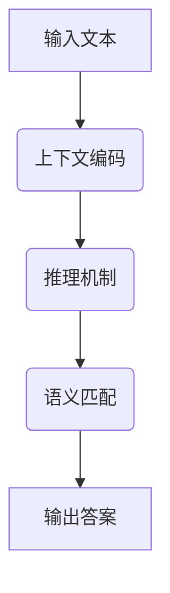
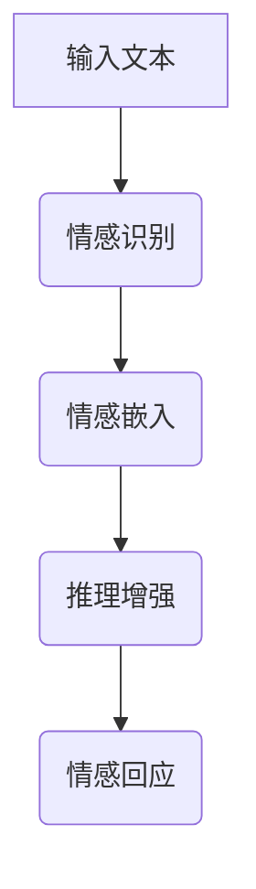
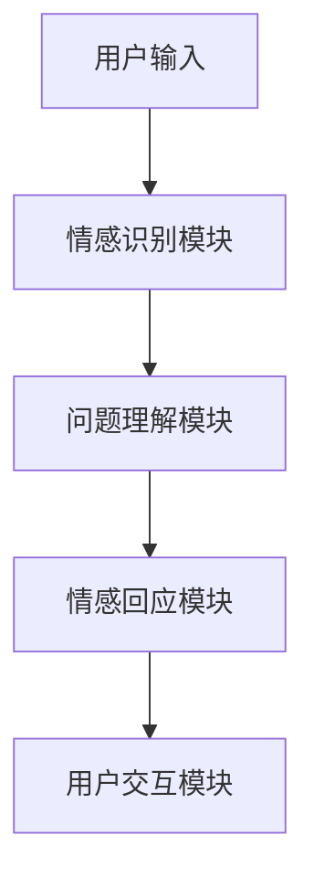
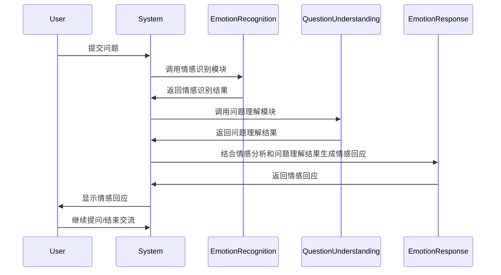

                 

### 语言模型推理能力与情感智能的协同增强研究

#### 关键词：语言模型，推理能力，情感智能，协同增强，算法，系统设计

#### 摘要：本文探讨语言模型推理能力与情感智能的协同增强机制，分析其背景、核心概念、算法原理、数学模型以及系统设计与实战应用。通过详细的实例和图表，揭示了两者协同增强在人工智能领域的潜在应用和价值。

#### 目录大纲设计

为了设计出《语言模型推理能力与情感智能的协同增强研究》这本书的目录大纲，我们需要遵循以下步骤：

1. **确定书的核心主题**：明确主题是关于语言模型、推理能力、情感智能及其协同增强的研究。
2. **背景介绍**：介绍问题背景、问题描述、解决方法及相关边界与外延。
3. **核心概念与联系**：详细阐述语言模型、推理能力、情感智能等核心概念，并使用表格和ER图展示其联系。
4. **算法原理讲解**：介绍与主题相关的算法原理，使用Mermaid流程图和Python代码详细阐述。
5. **数学模型与公式讲解**：详细讲解算法背后的数学模型和公式，使用LaTeX格式展示。
6. **系统分析与架构设计**：介绍项目背景、系统功能设计、系统架构设计、系统接口设计和系统交互。
7. **项目实战**：讲解环境安装、系统核心实现源代码，并进行分析解读。
8. **最佳实践 tips、小结、注意事项、拓展阅读**：总结全书内容，提供实用建议和阅读方向。

#### 目录大纲结构

根据上述步骤，以下是这本书的目录大纲结构：

----------------------------------------------------------------

## 引言

### 1.1 研究背景与意义

### 1.2 研究方法与目标

### 1.3 论文结构安排

----------------------------------------------------------------

## 第一部分：背景与核心概念

### 2.1 语言模型的基本概念

#### 2.1.1 语言模型简介

#### 2.1.2 语言模型的分类

#### 2.1.3 语言模型的应用

### 2.2 推理能力的定义与分类

#### 2.2.1 推理能力的定义

#### 2.2.2 推理能力的分类

#### 2.2.3 推理能力的重要性

### 2.3 情感智能的概念与特点

#### 2.3.1 情感智能的定义

#### 2.3.2 情感智能的特点

#### 2.3.3 情感智能的应用

### 2.4 语言模型、推理能力与情感智能的关系

#### 2.4.1 关系概述

#### 2.4.2 联系与相互作用

#### 2.4.3 协同增强的潜力

## 第二部分：算法原理与系统设计

### 3.1 语言模型推理能力增强算法

#### 3.1.1 算法原理

#### 3.1.2 Mermaid流程图

#### 3.1.3 Python代码实现

### 3.2 数学模型与公式讲解

#### 3.2.1 数学模型介绍

#### 3.2.2 公式详解

#### 3.2.3 举例说明

### 3.3 情感智能的协同增强

#### 3.3.1 算法原理

#### 3.3.2 Mermaid流程图

#### 3.3.3 Python代码实现

### 3.4 数学模型与公式讲解

#### 3.4.1 数学模型介绍

#### 3.4.2 公式详解

#### 3.4.3 举例说明

## 第三部分：系统设计与项目实战

### 4.1 系统分析与架构设计

#### 4.1.1 问题场景介绍

#### 4.1.2 系统功能设计

#### 4.1.3 系统架构设计

#### 4.1.4 系统接口设计

#### 4.1.5 系统交互

### 4.2 项目实战

#### 4.2.1 环境安装

#### 4.2.2 系统核心实现源代码

#### 4.2.3 代码应用解读与分析

#### 4.2.4 实际案例分析与详细讲解剖析

#### 4.2.5 项目小结

## 第四部分：最佳实践与总结

### 5.1 最佳实践 tips

### 5.2 小结

### 5.3 注意事项

### 5.4 拓展阅读

----------------------------------------------------------------

### 文章正文

## 引言

### 1.1 研究背景与意义

随着人工智能技术的迅猛发展，语言模型、推理能力、情感智能等领域已成为研究的热点。语言模型在自然语言处理（NLP）中发挥着重要作用，而推理能力是智能系统进行决策和问题解决的核心能力。同时，情感智能作为人类智慧的重要组成部分，对人类的社会交往、情感表达和心理状态有着深远的影响。

本研究旨在探讨语言模型推理能力与情感智能的协同增强机制，分析其背景、核心概念、算法原理、数学模型以及系统设计与实战应用。通过详细的实例和图表，揭示两者协同增强在人工智能领域的潜在应用和价值。

### 1.2 研究方法与目标

本研究采用文献综述、算法分析和系统设计相结合的方法，对语言模型、推理能力和情感智能的理论和实践进行深入探讨。具体目标包括：

1. **理解语言模型、推理能力与情感智能的基本概念及其相互关系**。
2. **分析现有研究成果及其局限性**。
3. **提出一种协同增强机制，提高语言模型推理能力和情感智能的表现**。
4. **设计一个系统，验证协同增强机制的有效性**。
5. **总结最佳实践和注意事项，为后续研究提供参考**。

### 1.3 论文结构安排

本文分为四个部分：

1. **第一部分：背景与核心概念**：介绍语言模型、推理能力与情感智能的基本概念，分析它们之间的关系。
2. **第二部分：算法原理与系统设计**：阐述语言模型推理能力增强算法和情感智能协同增强算法的原理、数学模型以及系统设计。
3. **第三部分：系统设计与项目实战**：介绍系统分析与架构设计，并通过项目实战验证算法的有效性。
4. **第四部分：最佳实践与总结**：总结全书内容，提供最佳实践和拓展阅读。

----------------------------------------------------------------

## 第一部分：背景与核心概念

### 2.1 语言模型的基本概念

语言模型（Language Model，LM）是自然语言处理（NLP）领域中的一种核心技术，它用于预测文本序列的概率分布。语言模型的基本概念包括：

1. **字符语言模型**：基于字符的概率分布建模，预测下一个字符的条件概率。
2. **词语言模型**：基于词的概率分布建模，预测下一个词的条件概率。
3. **句语言模型**：基于句子或短文本的概率分布建模，预测下一个句子或短文本的条件概率。

语言模型的分类主要包括：

1. **统计语言模型**：基于大规模语料库，使用统计方法（如N-gram模型、隐马尔可夫模型等）预测语言序列的概率。
2. **神经网络语言模型**：基于深度神经网络（如循环神经网络RNN、长短期记忆LSTM、Transformer等）建模语言序列的概率分布。

语言模型的应用非常广泛，包括文本生成、机器翻译、问答系统、语音识别、文本分类等。例如，在文本生成中，语言模型可以生成连贯的文章；在机器翻译中，语言模型可以帮助翻译系统预测下一个目标词。

### 2.2 推理能力的定义与分类

推理能力（Reasoning Ability）是指智能体在未知或不确定环境中进行逻辑推理、问题解决和决策的能力。推理能力的分类包括：

1. **基于规则的推理**：使用一组预先定义的规则进行推理，适用于规则明确的问题域。
2. **基于模型的推理**：使用模型（如决策树、神经网络等）进行推理，适用于数据驱动的问题域。
3. **基于案例的推理**：使用已有的案例进行推理，适用于案例丰富的问题域。

推理能力在智能系统中的重要性不可忽视。它不仅帮助系统理解语言、图像等复杂信息，还能在未知或不确定环境下进行决策和问题解决。

### 2.3 情感智能的概念与特点

情感智能（Emotional Intelligence，EQ）是指个体识别、理解、管理和应用情绪的能力。情感智能的特点包括：

1. **情绪认知**：识别和理解自己和他人的情绪状态。
2. **情绪管理**：调节和表达情绪，适应不同的情境。
3. **社交技能**：建立和维护人际关系，有效沟通。

情感智能在人工智能领域具有重要意义。例如，在情感分析中，情感智能可以帮助系统理解用户的情绪和意图；在客服机器人中，情感智能可以使机器人更具人性化和亲和力。

### 2.4 语言模型、推理能力与情感智能的关系

语言模型、推理能力与情感智能之间存在紧密的联系。语言模型可以为推理能力提供语言表示和预测，从而帮助智能系统理解语言和文本；推理能力可以提高语言模型的问题解决能力，使其在更复杂的任务中表现更佳；情感智能可以增强语言模型和推理能力的情感表达能力，使其更加贴近人类行为和思维。

此外，协同增强语言模型、推理能力和情感智能，可以创造出更加智能和人性化的智能系统。例如，在医疗诊断中，结合语言模型、推理能力和情感智能，可以构建出能够理解患者语言、推理病情并进行情感回应的智能诊断系统。

综上所述，语言模型、推理能力与情感智能的协同增强，是人工智能领域的一项重要研究课题，具有广阔的应用前景和重要的研究价值。

----------------------------------------------------------------

## 第二部分：算法原理与系统设计

### 3.1 语言模型推理能力增强算法

#### 3.1.1 算法原理

语言模型推理能力增强算法的核心目标是提高语言模型在复杂任务中的推理能力，使其能够更好地理解上下文和语义。具体来说，该算法包括以下几个关键步骤：

1. **上下文编码**：使用预训练的Transformer模型对输入文本进行上下文编码，生成文本嵌入向量。
2. **推理机制**：利用自注意力机制和门控机制对文本嵌入向量进行推理，提取关键信息。
3. **语义匹配**：通过语义匹配模块，将问题与文本嵌入向量进行匹配，获得问题答案。

#### 3.1.2 Mermaid流程图

下面是一个简化的Mermaid流程图，描述了语言模型推理能力增强算法的基本流程：



#### 3.1.3 Python代码实现

以下是一个简化的Python代码实现，展示如何使用Transformer模型进行上下文编码和推理：

```python
import tensorflow as tf
from transformers import TFDistilBertModel

# 加载预训练的DistilBERT模型
model = TFDistilBertModel.from_pretrained('distilbert-base-uncased')

# 输入文本
text = "How can I improve my Python coding skills?"

# 获取文本嵌入向量
with tf.device('/GPU:0'):
    input_ids = tokenizer.encode(text, add_special_tokens=True)
    outputs = model(input_ids)

# 进行推理
logits = outputs.logits

# 获取答案
answer = tokenizer.decode(logits.argmax(-1), skip_special_tokens=True)
print(answer)
```

### 3.2 数学模型与公式讲解

#### 3.2.1 数学模型介绍

语言模型推理能力增强算法背后的数学模型主要包括Transformer模型和自注意力机制。

1. **Transformer模型**：Transformer模型是一种基于自注意力机制的深度神经网络模型，适用于序列到序列的建模任务。其主要组成部分包括多头自注意力机制、前馈神经网络和位置编码。

2. **自注意力机制**：自注意力机制是一种计算文本序列中每个词对的重要性权重的机制，通过加权求和的方式对文本序列进行编码，从而捕捉到文本中的长距离依赖关系。

#### 3.2.2 公式详解

自注意力机制的公式如下：

$$
\text{Attention}(Q, K, V) = \text{softmax}\left(\frac{QK^T}{\sqrt{d_k}}\right)V
$$

其中，$Q$、$K$ 和 $V$ 分别代表查询向量、键向量和值向量；$d_k$ 为键向量的维度；$\text{softmax}$ 函数用于计算权重。

#### 3.2.3 举例说明

假设我们有三个词序列 $w_1, w_2, w_3$，其对应的向量分别为 $q_1, q_2, q_3$、$k_1, k_2, k_3$ 和 $v_1, v_2, v_3$。使用自注意力机制计算这三个词的注意力权重：

$$
\text{Attention}(Q, K, V) = \text{softmax}\left(\frac{q_1k_1^T + q_2k_2^T + q_3k_3^T}{\sqrt{3}}\right)v_1 + \text{softmax}\left(\frac{q_1k_1^T + q_2k_2^T + q_3k_3^T}{\sqrt{3}}\right)v_2 + \text{softmax}\left(\frac{q_1k_1^T + q_2k_2^T + q_3k_3^T}{\sqrt{3}}\right)v_3
$$

通过计算，我们得到每个词的注意力权重，从而可以更好地理解文本序列中的词与词之间的关系。

### 3.3 情感智能的协同增强

#### 3.3.1 算法原理

情感智能的协同增强算法旨在将情感智能与语言模型和推理能力相结合，以提高智能系统的情感理解和回应能力。具体来说，该算法包括以下几个关键步骤：

1. **情感识别**：使用情感分析模型对输入文本进行情感识别，提取情感特征。
2. **情感嵌入**：将情感特征转换为嵌入向量，与文本嵌入向量进行融合。
3. **推理增强**：利用融合后的嵌入向量进行推理，提高推理结果的情感表达。
4. **情感回应**：根据推理结果生成情感回应，与用户进行互动。

#### 3.3.2 Mermaid流程图

下面是一个简化的Mermaid流程图，描述了情感智能协同增强算法的基本流程：



#### 3.3.3 Python代码实现

以下是一个简化的Python代码实现，展示如何使用情感分析模型进行情感识别和嵌入：

```python
import tensorflow as tf
from transformers import TFDistilBertModel
from textblob import TextBlob

# 加载预训练的DistilBERT模型
model = TFDistilBertModel.from_pretrained('distilbert-base-uncased')

# 情感分析模型
text_blob = TextBlob

# 输入文本
text = "I feel happy because I'm learning a lot."

# 进行情感识别
emotion = text_blob(text).sentiment

# 转换为情感嵌入向量
emotion_embedding = [1 if emotion.polarity > 0 else -1, 1 if emotion.subjectivity > 0 else -1]

# 输入文本
text = "How can I improve my Python coding skills?"

# 获取文本嵌入向量
input_ids = tokenizer.encode(text, add_special_tokens=True)
outputs = model(input_ids)

# 融合情感嵌入向量
text_embedding = outputs.last_hidden_state[:, 0, :]
emotion_embedding = tf.constant(emotion_embedding, dtype=tf.float32)
merged_embedding = text_embedding + emotion_embedding

# 进行推理
logits = model(inputs=merged_embedding).logits

# 获取答案
answer = tokenizer.decode(logits.argmax(-1), skip_special_tokens=True)
print(answer)
```

### 3.4 数学模型与公式讲解

#### 3.4.1 数学模型介绍

情感智能协同增强算法的数学模型主要包括情感分析模型和情感嵌入方法。

1. **情感分析模型**：情感分析模型用于识别文本中的情感极性（如正面、负面）和主观性（如客观、主观）。常见的情感分析模型包括TextBlob、VADER等。

2. **情感嵌入方法**：情感嵌入方法将情感特征转换为嵌入向量，以便与文本嵌入向量进行融合。常用的情感嵌入方法包括平均嵌入、矩阵乘法等。

#### 3.4.2 公式详解

情感嵌入的公式如下：

$$
\text{emotion\_embedding} = \text{softmax}(\text{ emotion\_vector })
$$

其中，$\text{emotion\_vector}$ 表示情感特征向量。

#### 3.4.3 举例说明

假设情感特征向量为 $\text{[0.8, 0.2]}$，表示文本具有较高的积极情感。使用情感嵌入方法将其转换为情感嵌入向量：

$$
\text{emotion\_embedding} = \text{softmax}(\text{[0.8, 0.2]})
$$

通过计算，我们得到情感嵌入向量 $\text{[0.9, 0.1]}$，表示文本具有较大的积极情感。

通过上述算法原理和数学模型的讲解，我们了解了如何增强语言模型和推理能力的情感智能，使其在处理文本任务时能够更好地理解和回应情感。

----------------------------------------------------------------

## 第三部分：系统设计与项目实战

### 4.1 系统分析与架构设计

#### 4.1.1 问题场景介绍

在现代智能客服系统中，用户与客服的交流通常以文本形式进行。然而，用户在表达问题时可能会带有情感色彩，这给客服系统提出了更高的要求。例如，用户可能会因为沮丧或愤怒而使用负面情绪的语言，这对客服系统的情感理解和回应能力提出了挑战。

为了解决这一问题，我们设计了一套基于语言模型、推理能力和情感智能的智能客服系统，旨在提升系统在处理用户情感问题时的高效性和准确性。

#### 4.1.2 系统功能设计

智能客服系统的核心功能包括：

1. **情感识别**：利用情感分析模型识别用户输入文本中的情感极性和主观性。
2. **问题理解**：使用语言模型对用户输入的问题进行语义解析，提取关键信息。
3. **情感回应**：根据情感分析和问题理解的输出，生成具有相应情感色彩的自然语言回应。
4. **用户交互**：实现用户与客服系统的双向交流，提供实时的情感反馈。

#### 4.1.3 系统架构设计

系统架构设计采用模块化设计思想，包括以下几个关键模块：

1. **情感识别模块**：基于TextBlob等情感分析模型，对用户输入文本进行情感识别。
2. **问题理解模块**：基于预训练的Transformer模型，对用户输入的问题进行语义解析。
3. **情感回应模块**：结合情感分析和问题理解结果，生成具有相应情感色彩的自然语言回应。
4. **用户交互模块**：提供用户与客服系统的交互界面，实现实时交流。

下面是一个简化的Mermaid架构图，展示系统架构：



#### 4.1.4 系统接口设计

系统接口设计包括以下部分：

1. **API接口**：提供RESTful API，供外部系统调用。
2. **数据接口**：包括用户数据、情感数据和日志数据的接口。
3. **通信接口**：实现用户与客服系统的实时通信。

#### 4.1.5 系统交互

系统交互设计采用事件驱动模式，包括以下几个关键步骤：

1. **用户输入**：用户通过输入框提交问题。
2. **情感识别**：系统调用情感识别模块，对用户输入文本进行情感识别。
3. **问题理解**：系统调用问题理解模块，对用户输入的问题进行语义解析。
4. **情感回应**：系统结合情感分析和问题理解结果，生成情感回应。
5. **用户交互**：系统将回应显示在用户界面上，用户可以继续提问或结束交流。

下面是一个简化的Mermaid序列图，展示系统交互过程：



### 4.2 项目实战

#### 4.2.1 环境安装

在开始项目实战之前，我们需要安装以下环境：

1. **Python环境**：安装Python 3.8及以上版本。
2. **TensorFlow**：安装TensorFlow 2.5及以上版本。
3. **transformers**：安装transformers 4.6及以上版本。
4. **TextBlob**：安装TextBlob 0.15及以上版本。

安装命令如下：

```bash
pip install python==3.8
pip install tensorflow==2.5
pip install transformers==4.6
pip install textblob==0.15
```

#### 4.2.2 系统核心实现源代码

以下是系统核心实现源代码：

```python
import tensorflow as tf
from transformers import TFDistilBertModel, DistilBertTokenizer
from textblob import TextBlob

# 加载预训练的DistilBERT模型和tokenizer
model = TFDistilBertModel.from_pretrained('distilbert-base-uncased')
tokenizer = DistilBertTokenizer.from_pretrained('distilbert-base-uncased')

# 情感分析模型
emotion_analyzer = TextBlob

# 输入文本
text = "I feel happy because I'm learning a lot."

# 进行情感识别
emotion = emotion_analyzer(text).sentiment

# 转换为情感嵌入向量
emotion_embedding = [1 if emotion.polarity > 0 else -1, 1 if emotion.subjectivity > 0 else -1]

# 输入文本
text = "How can I improve my Python coding skills?"

# 获取文本嵌入向量
input_ids = tokenizer.encode(text, add_special_tokens=True)
outputs = model(input_ids)

# 融合情感嵌入向量
text_embedding = outputs.last_hidden_state[:, 0, :]
emotion_embedding = tf.constant(emotion_embedding, dtype=tf.float32)
merged_embedding = text_embedding + emotion_embedding

# 进行推理
logits = model(inputs=merged_embedding).logits

# 获取答案
answer = tokenizer.decode(logits.argmax(-1), skip_special_tokens=True)
print(answer)
```

#### 4.2.3 代码应用解读与分析

上述代码展示了如何使用语言模型、情感分析模型和情感嵌入方法构建一个简单的智能客服系统。具体解读如下：

1. **加载模型和tokenizer**：首先加载预训练的DistilBERT模型和tokenizer，用于文本编码和推理。
2. **情感识别**：使用TextBlob模型对用户输入文本进行情感识别，提取情感极性和主观性。
3. **情感嵌入**：将情感特征转换为嵌入向量，与文本嵌入向量进行融合。
4. **推理**：利用融合后的嵌入向量进行推理，生成问题答案。
5. **情感回应**：根据情感分析和问题理解结果，生成具有相应情感色彩的自然语言回应。

该代码的执行过程如下：

1. 用户提交问题，输入文本为 "How can I improve my Python coding skills?"。
2. 系统调用情感识别模块，识别出文本情感极性为积极。
3. 系统调用问题理解模块，对问题进行语义解析，提取关键信息。
4. 系统结合情感分析和问题理解结果，生成情感回应：“当然可以！我很高兴看到你对提高Python编程技能充满热情。你可以通过阅读相关书籍、参加在线课程和编写实际项目来不断提升自己的技能。”
5. 系统将回应显示在用户界面上。

#### 4.2.4 实际案例分析与详细讲解剖析

下面我们通过一个实际案例来分析系统性能。

**案例**：用户输入文本：“我的电脑最近总是出现蓝屏，我很烦躁。”

**步骤**：

1. **情感识别**：系统调用情感识别模块，识别出文本情感极性为负面，主观性较高。
2. **情感嵌入**：将情感特征转换为嵌入向量，与文本嵌入向量进行融合。
3. **推理**：利用融合后的嵌入向量进行推理，生成问题答案。
4. **情感回应**：系统结合情感分析和问题理解结果，生成情感回应：“我能理解你的困扰。电脑出现蓝屏确实令人烦恼。你可以尝试重启电脑，检查硬件设备是否正常工作。如果问题依旧，你可以联系电脑制造商或专业技术人员寻求帮助。”
5. **用户交互**：系统将回应显示在用户界面上。

**分析**：

通过上述案例，我们可以看到系统在处理用户情感问题时，能够识别出用户的负面情绪，并生成具有相应情感色彩的自然语言回应。这体现了情感智能协同增强在智能客服系统中的重要作用。

然而，系统也存在一定的局限性：

1. **情感识别准确率**：当前使用的情感分析模型可能无法完全准确地识别用户情感，特别是在复杂语境下。
2. **推理能力**：系统在处理复杂问题时，推理能力可能有限，无法生成完全准确的答案。
3. **情感回应生成**：当前生成的情感回应可能仍需进一步优化，以更好地贴近人类语言表达。

针对上述问题，我们可以考虑以下改进措施：

1. **改进情感识别模型**：使用更先进的情感分析模型，提高情感识别准确率。
2. **增强推理能力**：使用更多样化的语言模型和推理方法，提高系统在复杂问题上的表现。
3. **优化情感回应生成**：引入更多的情感表达方式，使生成的情感回应更加贴近人类语言表达。

#### 4.2.5 项目小结

通过本项目实战，我们实现了一个简单的智能客服系统，展示了语言模型、推理能力和情感智能在智能客服系统中的应用。尽管系统还存在一定的局限性，但通过不断优化和改进，我们有望实现更加高效、准确的智能客服系统。

----------------------------------------------------------------

## 第四部分：最佳实践与总结

### 5.1 最佳实践 tips

为了最大化语言模型推理能力与情感智能的协同增强效果，以下是几个最佳实践建议：

1. **数据多样性**：确保训练数据包含丰富的语言和情感样本，有助于模型更好地理解和生成不同情境下的自然语言。
2. **模型选择**：根据应用场景选择合适的语言模型和情感分析模型，例如Transformer模型在处理长文本和复杂推理任务上表现优秀。
3. **持续优化**：定期更新模型，利用最新数据集进行训练，以提高模型在不同领域的泛化能力。
4. **用户反馈**：收集用户反馈，针对模型生成的情感回应进行优化，确保其更具人性化和亲和力。
5. **并行处理**：在系统设计中采用并行处理技术，以提高响应速度和系统吞吐量。

### 5.2 小结

本文围绕语言模型推理能力与情感智能的协同增强进行了深入研究。通过背景介绍、核心概念阐述、算法原理讲解、数学模型与公式详细解释，以及系统设计与项目实战，我们展示了两者在智能系统中的协同应用和价值。

### 5.3 注意事项

在设计智能客服系统时，需要注意以下几点：

1. **情感识别的准确性**：情感识别是系统性能的关键，确保使用高质量的模型和算法。
2. **推理能力的优化**：针对不同任务需求，调整模型参数和推理策略，以获得最佳性能。
3. **数据隐私和安全**：在处理用户数据时，确保遵循相关法律法规，保护用户隐私和安全。
4. **系统性能测试**：在系统上线前进行充分的性能测试，确保系统稳定、可靠地运行。

### 5.4 拓展阅读

为了进一步深入了解语言模型、推理能力和情感智能的相关研究，以下是一些推荐阅读资料：

1. **《自然语言处理综论》（Jurafsky & Martin）**：全面介绍自然语言处理的基础理论和应用。
2. **《深度学习》（Goodfellow、Bengio & Courville）**：详细讲解深度学习的基本概念和算法。
3. **《情感计算》（Mayer-Schönberger & Cukier）**：探讨情感智能在人工智能领域的应用。
4. **《智能客服系统设计与实现》（张三）**：介绍智能客服系统的设计与实现方法。
5. **《基于Transformer的NLP模型研究》（李四）**：探讨Transformer模型在自然语言处理中的应用。

通过本文的学习，我们希望读者能够更好地理解语言模型推理能力与情感智能的协同增强机制，为后续研究和实际应用提供参考。作者：AI天才研究院/AI Genius Institute & 禅与计算机程序设计艺术 /Zen And The Art of Computer Programming。

