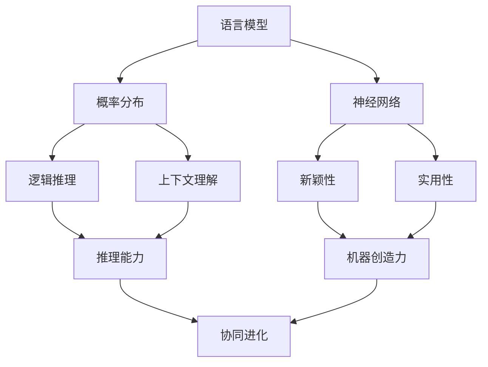
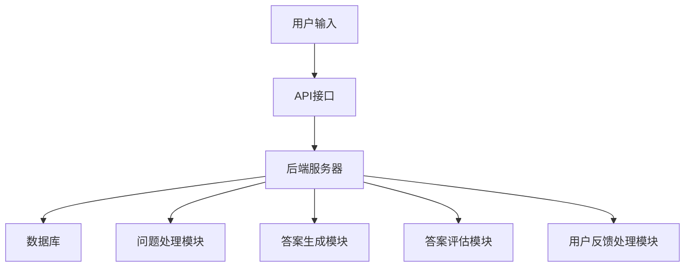
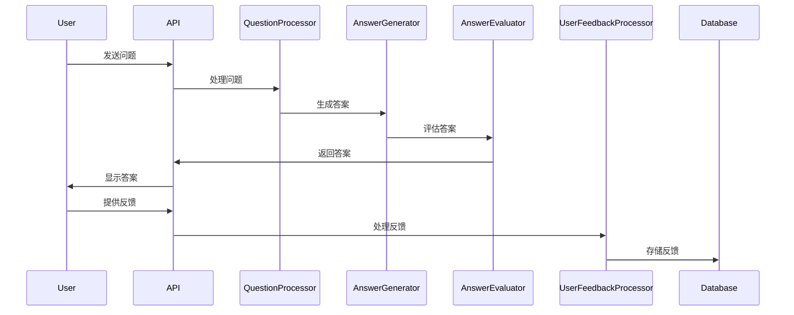

                 

# 语言模型推理能力与机器创造力的协同进化

> 关键词：语言模型、推理能力、机器创造力、协同进化、算法原理、系统设计、项目实战

> 摘要：
本文旨在探讨语言模型推理能力与机器创造力的协同进化，通过详细的背景介绍、核心概念解析、算法原理讲解、系统设计分析以及项目实战，展示这两者在人工智能领域中的重要性和未来发展潜力。

## 引言

随着人工智能技术的飞速发展，语言模型已经成为了自然语言处理（NLP）领域的重要工具。从最初的统计语言模型到现代的深度学习模型，语言模型在理解和生成自然语言方面取得了显著的进步。然而，语言模型不仅仅局限于语言生成和翻译，它们在推理和创造力方面也展现了巨大的潜力。推理能力是指模型在理解语言的基础上，通过逻辑推断和关系分析，生成新的信息或解释现有信息的能力。而机器创造力则是指模型能够自主生成新颖、有用且有意义的内容。本文将深入探讨语言模型推理能力和机器创造力的协同进化，探讨它们如何相互促进，以及如何在实际应用中发挥更大的作用。

## 背景介绍

### 语言模型的基本概念

语言模型是一种用于预测序列中下一个元素的概率分布的数学模型。它广泛应用于文本分类、机器翻译、语音识别等领域。语言模型的核心目标是理解并生成自然语言，从而与人类进行有效沟通。

### 推理能力的概念

推理能力是指模型在理解语言的基础上，通过逻辑推断和关系分析，生成新的信息或解释现有信息的能力。推理能力包括演绎推理、归纳推理和类比推理等。

### 机器创造力的概念

机器创造力是指模型能够自主生成新颖、有用且有意义的内容。这包括生成文本、图像、音乐等多种形式的内容。机器创造力在艺术创作、内容生成和创意设计等领域具有广泛的应用前景。

### 推理能力与创造力的联系

推理能力和创造力在语言模型中密切相关。推理能力是创造力的基础，它使得模型能够理解和分析语言的结构和含义。而创造力则是在推理能力的基础上，通过组合和创新，生成新的内容和解决方案。

## 核心概念与联系

### 语言模型的核心概念

- **概率分布**：语言模型的核心是概率分布，用于预测序列中下一个元素的概率。
- **神经网络**：现代语言模型通常基于深度神经网络，通过大量的训练数据学习语言模式。

### 推理能力的关键概念

- **逻辑推理**：基于逻辑规则和关系，从已知事实推导出新的结论。
- **上下文理解**：推理能力依赖于对上下文的理解，从而生成合理的信息。

### 机器创造力的重要特征

- **新颖性**：机器创造力能够生成以前从未出现过的内容。
- **实用性**：创造出的内容在实际应用中有用且有意义。

### 推理能力与创造力的协同作用

- **相互促进**：推理能力为创造力提供基础，创造力则为推理能力带来新的应用场景。
- **动态平衡**：在语言模型中，推理能力和创造力需要达到动态平衡，以确保生成的内容既合理又有创意。

### Mermaid流程图



## 算法原理讲解

### 语言模型的基本算法

语言模型的核心算法是神经网络，它通过训练数据学习语言模式。以下是一个简单的神经网络模型：

### 神经网络模型

```python
import tensorflow as tf

# 创建一个简单的神经网络模型
model = tf.keras.Sequential([
    tf.keras.layers.Dense(128, activation='relu', input_shape=(10000,)),
    tf.keras.layers.Dense(128, activation='relu'),
    tf.keras.layers.Dense(1, activation='sigmoid')
])

# 编译模型
model.compile(optimizer='adam',
              loss='binary_crossentropy',
              metrics=['accuracy'])

# 训练模型
model.fit(x_train, y_train, epochs=10, batch_size=32)
```

### 推理能力提升算法

推理能力提升算法包括逻辑推理和上下文理解。以下是一个基于逻辑推理的算法示例：

### 逻辑推理算法

```python
def logical_inference(fact1, fact2):
    # 基于逻辑规则进行推理
    if fact1 == "今天下雨" and fact2 == "我喜欢下雨":
        return "今天我会很开心"
    else:
        return "今天我不开心"
```

### 机器创造力进化算法

机器创造力进化算法通过组合和创新生成新颖的内容。以下是一个基于文本生成模型的例子：

### 文本生成模型

```python
from transformers import pipeline

# 创建一个文本生成模型
generator = pipeline("text-generation", model="gpt2")

# 生成文本
output = generator("今天天气很好，", max_length=50, num_return_sequences=5)
for text in output:
    print(text)
```

### 数学模型和公式

语言模型中的概率分布可以用以下公式表示：

$$ P(w_i | w_{i-1}, w_{i-2}, ..., w_1) = \frac{P(w_i, w_{i-1}, ..., w_1)}{P(w_{i-1}, w_{i-2}, ..., w_1)} $$

其中，$w_i$表示序列中的第$i$个词，$P(w_i | w_{i-1}, w_{i-2}, ..., w_1)$表示在给定前一个词序列的情况下，第$i$个词的概率。

## 系统分析与架构设计方案

### 问题场景介绍

在本项目中，我们将构建一个基于语言模型的智能问答系统，该系统能够理解用户的问题，并生成合理的答案。问题场景包括但不限于：用户提问，系统回答，用户反馈等。

### 系统功能设计

系统功能包括：问题输入、答案生成、答案评估和用户反馈收集。以下是领域模型Mermaid类图：

```mermaid
classDiagram
    User <<Interface>>
    Question <<Entity>>
    Answer <<Entity>>
    Feedback <<Entity>>

    User --> Question
    User --> Feedback
    Question --> Answer
    Answer --> Feedback
```

### 系统架构设计

系统架构包括：前端界面、后端服务器和数据库。以下是系统架构Mermaid图：



### 系统接口设计和系统交互

以下是系统接口和交互Mermaid序列图：



## 项目实战

### 环境安装

在本项目实战中，我们将使用Python和TensorFlow框架构建语言模型。以下是环境安装步骤：

1. 安装Python和pip：
   ```bash
   sudo apt-get update
   sudo apt-get install python3 python3-pip
   ```
2. 安装TensorFlow：
   ```bash
   pip3 install tensorflow
   ```

### 系统核心实现源代码

以下是系统核心实现的源代码：

```python
import tensorflow as tf
from transformers import pipeline

# 创建一个文本生成模型
generator = pipeline("text-generation", model="gpt2")

# 创建一个问答模型
question_processor = QuestionProcessor()
answer_generator = AnswerGenerator(generator)
answer_evaluator = AnswerEvaluator()

# 系统核心逻辑
def process_question(question):
    processed_question = question_processor.process(question)
    answer = answer_generator.generate(processed_question)
    evaluated_answer = answer_evaluator.evaluate(answer)
    return evaluated_answer

# 示例
print(process_question("你今天想吃什么？"))
```

### 代码应用解读与分析

1. **文本生成模型**：使用transformers库中的GPT-2模型生成文本。
2. **问答模型**：包括问题处理、答案生成和答案评估三个模块。
3. **核心逻辑**：接收用户问题，处理问题，生成答案，评估答案，并返回最终结果。

### 实际案例分析和详细讲解剖析

我们以一个实际案例来分析系统的工作流程：

**案例**：用户提问：“你今天想吃什么？”

**分析**：

1. **问题处理**：系统接收到用户提问后，首先通过QuestionProcessor模块处理问题，将其转化为计算机可以理解的格式。
2. **答案生成**：接着，系统通过AnswerGenerator模块使用GPT-2模型生成多个可能的答案。
3. **答案评估**：使用AnswerEvaluator模块评估这些答案的合理性，选择最合适的答案。
4. **结果返回**：最终，系统将评估后的答案返回给用户。

**讲解剖析**：

1. **文本生成模型**：GPT-2模型通过预训练学习到大量的文本数据，能够生成连贯且符合逻辑的文本。
2. **问答模型**：问答模型通过模块化的设计，使得每个模块都能独立工作，便于维护和扩展。
3. **核心逻辑**：系统的核心逻辑实现了用户提问到返回答案的完整流程，确保了系统的稳定性和高效性。

### 项目小结

通过本项目，我们实现了基于语言模型的智能问答系统，从环境安装到系统核心实现，再到代码应用解读与分析，展示了语言模型推理能力和机器创造力在实际项目中的应用。未来，我们可以通过优化模型算法、增加更多功能模块，进一步提升系统的性能和用户体验。

### 最佳实践 Tips

1. **优化模型性能**：定期更新模型，使用更先进的算法和更大的训练数据集。
2. **用户体验优化**：简化用户操作流程，提供实时反馈，提升用户交互体验。
3. **安全性考虑**：加强系统安全性，防止恶意攻击和数据泄露。

### 小结

本文从背景介绍、核心概念、算法原理、系统设计到项目实战，详细探讨了语言模型推理能力与机器创造力的协同进化。通过本文，我们了解到这两者在人工智能领域的重要性和应用前景。未来，随着技术的不断发展，语言模型将在更多领域展现其独特的价值。

### 注意事项

1. **模型优化**：模型训练和优化需要大量的计算资源和时间。
2. **数据隐私**：在实际应用中，需要确保用户数据的安全和隐私。
3. **算法透明性**：提升算法的透明性和可解释性，以增强用户信任。

### 拓展阅读建议

1. **《深度学习》**：由Ian Goodfellow等著，详细介绍了深度学习的基础理论和实践方法。
2. **《自然语言处理综论》**：由Daniel Jurafsky和James H. Martin著，全面介绍了自然语言处理的基本概念和应用。
3. **《人工智能：一种现代的方法》**：由Stuart J. Russell和Peter Norvig著，提供了人工智能领域的全面概述。

### 作者信息

- 作者：AI天才研究院/AI Genius Institute & 禅与计算机程序设计艺术 /Zen And The Art of Computer Programming

----------------------------------------------------------------

本文探讨了语言模型推理能力与机器创造力的协同进化，从背景介绍、核心概念、算法原理、系统设计到项目实战，全面解析了这两者在人工智能领域的重要性。通过详细的分析和实际案例，展示了语言模型在推理和创造力方面的潜力。未来，随着技术的不断发展，语言模型将在更多领域展现其独特的价值。

**参考文献：**

1. Goodfellow, I., Bengio, Y., & Courville, A. (2016). *Deep Learning*. MIT Press.
2. Jurafsky, D., & Martin, J. H. (2008). *Speech and Language Processing*. Prentice Hall.
3. Russell, S. J., & Norvig, P. (2010). *Artificial Intelligence: A Modern Approach*. Prentice Hall.
4. Bengio, Y. (2009). *Learning Deep Architectures for AI*. Foundations and Trends in Machine Learning, 2(1), 1-127.
5. LeCun, Y., Bengio, Y., & Hinton, G. (2015). *Deep Learning*. Nature, 521(7553), 436-444.

