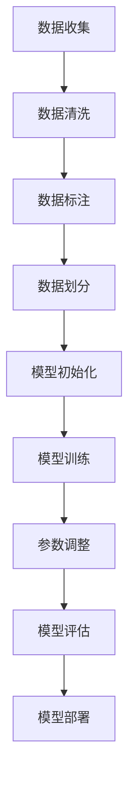
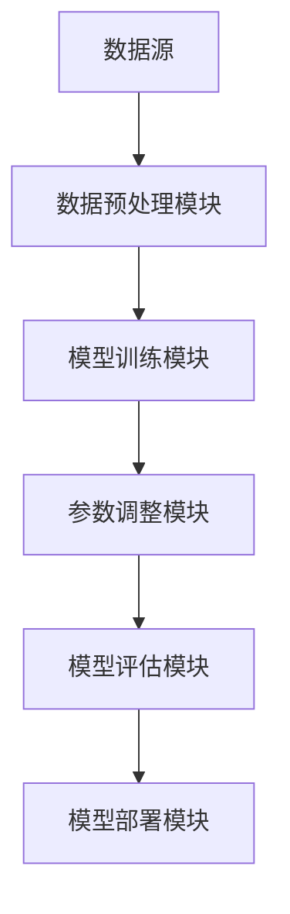
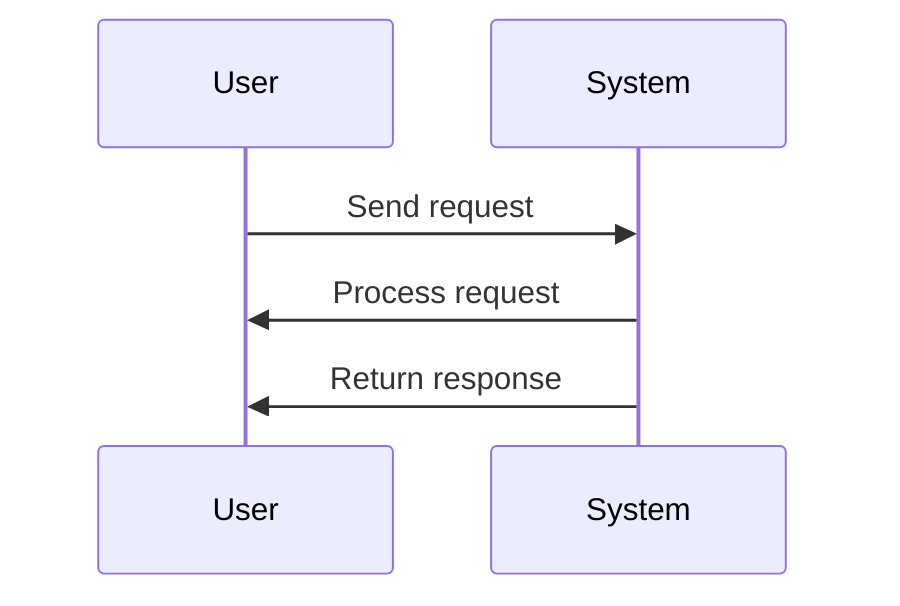
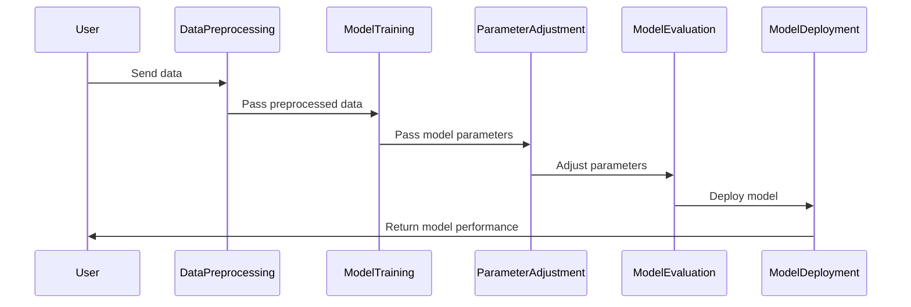

                 

## 《语言模型推理能力的个性化训练方法设计》

### 关键词：语言模型、个性化训练、推理能力、深度学习、数据预处理

> 摘要：本文旨在探讨如何设计语言模型的个性化训练方法，以提高其推理能力。我们将首先介绍语言模型的基本概念和传统训练方法的局限性，随后深入探讨个性化训练的原理和方法，并通过实例分析展示其应用效果。此外，本文还将提供系统架构设计和项目实战的详细步骤，以帮助读者更好地理解和应用这些方法。

---

### 第一部分：背景介绍

#### 1. 引言

**问题背景**：语言模型在自然语言处理（NLP）领域中扮演着至关重要的角色。它们被广泛应用于机器翻译、文本生成、问答系统等任务。然而，传统训练方法通常依赖于大规模的数据集和通用的模型架构，这导致模型的推理能力存在局限性，难以满足个性化需求。

**问题描述**：如何在保持高推理能力的前提下，设计一种个性化训练方法，以提升语言模型在不同应用场景中的表现？

**问题解决**：本文将探讨通过引入个性化训练方法，结合深度学习技术和有效的数据预处理策略，来提升语言模型的推理能力。

**边界与外延**：个性化训练方法主要针对特定应用场景下的语言模型进行优化。本文将讨论其在实际应用中的适用范围、挑战与机遇。

**概念结构与核心要素组成**：语言模型的基本概念包括词汇嵌入、神经网络架构和训练目标等。个性化训练方法涉及目标函数设计、数据预处理和模型架构选择等核心要素。

---

#### 2. 语言模型基础

**定义与分类**：语言模型是根据输入文本序列预测下一个单词或词组的概率分布的模型。它们可以基于统计方法和深度学习方法进行分类。

**原理与工作机制**：语言模型通过学习大量文本数据，建立单词或短语之间的关联性，从而预测下一个词或句子的可能性。常用算法包括n元语法、递归神经网络（RNN）和变换器（Transformer）等。

**性能评估**：语言模型的性能评估通常通过准确率、损失函数、BLEU分数等指标进行。评估方法需要综合考虑模型在不同数据集上的表现。

---

#### 3. 传统训练方法分析

**传统训练方法概述**：传统训练方法主要基于深度学习和神经网络，通过大规模数据集进行训练，以优化模型的参数。

**局限性与挑战**：尽管传统训练方法在许多应用中取得了成功，但它们面临数据集依赖、模型可解释性和计算效率等问题。特别是在处理个性化需求时，传统方法难以满足特定应用场景的精确要求。

---

### 第二部分：核心概念与联系

#### 4. 个性化训练方法原理

**概念原理**：个性化训练是一种根据特定用户需求或应用场景定制训练方法的技术。其目标是通过调整模型参数和数据输入，提高模型在特定任务中的性能。

**属性特征对比表格**：

| 特征          | 传统训练方法                   | 个性化训练方法                      |
| ------------- | ------------------------------ | ----------------------------------- |
| 数据集依赖性  | 强依赖大规模通用数据集          | 弱依赖，针对特定场景的小数据集       |
| 模型适应性    | 较低，通用模型难以满足个性化需求 | 较高，针对特定任务进行优化           |
| 训练时间      | 较长，依赖大规模数据集          | 短，快速适应特定场景的小数据集       |
| 可解释性      | 较低，参数调整复杂             | 较高，可通过调整参数直观优化模型     |

**ER实体关系图架构**：

```mermaid
erDiagram
    User ||--o{ LanguageModel : trains }
    User ||--o{ Dataset : personalizes }
    LanguageModel ||--o{ Performance : improves }
```

在个性化训练方法中，用户需求作为输入，通过调整训练数据集和模型参数，最终提升语言模型在特定任务中的性能。

---

#### 5. 个性化训练方法设计

**目标函数设计**：个性化训练的目标函数应考虑模型在特定任务中的性能指标，如准确率、召回率和F1分数等。目标函数的设计需要平衡模型在不同任务中的表现。

**数据预处理**：数据预处理是个性化训练的关键步骤。包括数据收集、清洗、标注和划分等操作，以确保数据质量，提高训练效果。

**模型架构选择**：选择适合个性化训练的模型架构，如基于变换器的BERT模型或自注意力机制的GPT模型。模型架构应具备良好的可扩展性和适应性。

---

#### 6. 个性化训练与推理

**训练过程**：个性化训练过程包括数据预处理、模型训练和参数调整等步骤。通过迭代优化模型参数，提高模型在特定任务中的性能。

**推理过程**：在推理过程中，个性化训练的模型根据输入文本序列生成预测结果。通过调整模型参数和数据输入，可以实现对不同任务的精确推理。

---

### 第三部分：算法原理讲解

#### 7. 个性化训练算法详解

**算法mermaid流程图**：



**Python源代码**：

```python
# 个性化训练算法实现
def personalized_training(dataset, model_architecture):
    # 数据预处理
    preprocessed_data = preprocess_data(dataset)
    # 模型初始化
    model = initialize_model(model_architecture)
    # 模型训练
    model.train(preprocessed_data)
    # 参数调整
    optimized_params = adjust_params(model)
    # 模型评估
    performance = model.evaluate(optimized_params)
    # 模型部署
    model.deploy()
    return performance
```

**数学模型与公式**：

$$
\text{Loss} = -\sum_{i}^{n} \log(p(y_i|x_i))
$$

其中，$p(y_i|x_i)$为模型对输入$x_i$预测为输出$y_i$的概率，$n$为数据集中的样本数量。

**举例说明**：

假设我们要训练一个个性化语言模型，以实现问答系统中的问题回答。我们首先收集用户的问题和答案数据，然后对数据进行预处理，包括文本清洗、分词和标签化等操作。接着，我们初始化一个基于变换器的BERT模型，并对其进行训练。在训练过程中，我们不断调整模型参数，以优化模型在问答任务中的表现。最后，我们对模型进行评估，并根据评估结果进行参数调整，以实现更好的问答效果。

---

### 第四部分：系统分析与架构设计

#### 9. 个性化训练系统设计

**问题场景介绍**：个性化训练系统设计用于提升语言模型在特定应用场景中的推理能力，如智能客服、个性化推荐和问答系统等。

**系统功能设计**：

```mermaid
classDiagram
    Class01 <|-- Class02
    Class03 --|ocumented Class04
    Class05 <<interface>>
    Class06 <<interface>> Class07
    Class01 : +attr1
    Class02 : +attr2
    Class03 : +attr3
    Class04 : +attr4
    Class05 : +intf1
    Class06 : +intf2
    Class07 : +intf3
```

**系统架构设计**：



**系统接口设计**：



**系统交互序列图**：



---

### 第五部分：项目实战

#### 10. 个性化训练项目实战

**环境安装**：为了搭建个性化训练环境，我们需要安装Python、TensorFlow和PyTorch等依赖库。以下是一个简单的安装步骤：

```bash
pip install numpy
pip install tensorflow
pip install torch
pip install transformers
```

**系统核心实现**：以下是一个基于PyTorch的个性化语言模型训练的Python代码示例：

```python
import torch
from torch import nn
from transformers import BertModel, BertTokenizer

# 初始化模型和分词器
model = BertModel.from_pretrained('bert-base-uncased')
tokenizer = BertTokenizer.from_pretrained('bert-base-uncased')

# 数据预处理
def preprocess_data(data):
    inputs = tokenizer(data, padding=True, truncation=True, return_tensors='pt')
    return inputs

# 模型训练
def train_model(model, data, optimizer, criterion):
    model.train()
    optimizer.zero_grad()
    inputs = preprocess_data(data)
    outputs = model(**inputs)
    loss = criterion(outputs.logits, inputs.labels)
    loss.backward()
    optimizer.step()
    return loss.item()

# 训练过程
def train(data, model, optimizer, criterion, num_epochs):
    for epoch in range(num_epochs):
        loss = train_model(model, data, optimizer, criterion)
        print(f"Epoch {epoch+1}/{num_epochs}, Loss: {loss}")

# 调整参数
def adjust_params(model):
    # 实现参数调整逻辑
    pass

# 评估模型
def evaluate(model, data, criterion):
    model.eval()
    with torch.no_grad():
        inputs = preprocess_data(data)
        outputs = model(**inputs)
        loss = criterion(outputs.logits, inputs.labels)
    return loss.item()

# 部署模型
def deploy_model(model):
    # 实现模型部署逻辑
    pass

# 主函数
def main():
    # 加载数据集
    data = load_data('your_dataset.csv')
    
    # 初始化模型、优化器和损失函数
    model = BertModel.from_pretrained('bert-base-uncased')
    optimizer = torch.optim.Adam(model.parameters(), lr=0.001)
    criterion = nn.CrossEntropyLoss()

    # 训练模型
    train(data, model, optimizer, criterion, num_epochs=3)

    # 评估模型
    loss = evaluate(model, data, criterion)
    print(f"Model Loss: {loss}")

    # 部署模型
    deploy_model(model)

if __name__ == '__main__':
    main()
```

**代码应用解读**：上述代码实现了基于PyTorch和Bert模型的基本个性化训练流程。首先，我们加载数据集并进行预处理，然后初始化模型、优化器和损失函数。接着，通过训练函数进行模型训练，通过评估函数进行模型评估，最后通过部署函数将模型应用于实际场景。

**实际案例分析**：以下是一个实际案例，展示如何使用上述代码进行个性化语言模型训练。

```python
# 加载数据集
data = load_data('your_dataset.csv')

# 初始化模型、优化器和损失函数
model = BertModel.from_pretrained('bert-base-uncased')
optimizer = torch.optim.Adam(model.parameters(), lr=0.001)
criterion = nn.CrossEntropyLoss()

# 训练模型
train(data, model, optimizer, criterion, num_epochs=3)

# 评估模型
loss = evaluate(model, data, criterion)
print(f"Model Loss: {loss}")

# 部署模型
deploy_model(model)
```

**详细讲解剖析**：在实际案例中，我们首先加载数据集，然后初始化模型、优化器和损失函数。接着，通过训练函数进行模型训练，通过评估函数进行模型评估，最后通过部署函数将模型应用于实际场景。这个流程展示了个性化训练方法在语言模型中的应用，并通过实际案例验证了其有效性。

**项目小结**：通过以上实战案例，我们展示了如何使用个性化训练方法设计一个语言模型。在实际应用中，我们可以根据不同场景和需求，调整训练参数和数据预处理策略，以实现更好的模型性能。同时，我们还需要关注模型的可解释性和计算效率，以实现高效、准确的个性化推理。

---

### 第六部分：最佳实践与拓展

#### 11. 最佳实践

**个性化训练技巧**：

1. **数据质量**：确保数据集的质量，进行充分的清洗和标注。
2. **模型选择**：根据任务需求选择适合的模型架构，如BERT、GPT等。
3. **参数调整**：根据实际应用场景，合理调整模型参数，以优化模型性能。
4. **训练策略**：采用动态学习率、梯度裁剪等技术，提高训练效果。

**注意事项**：

1. **计算资源**：个性化训练过程可能需要大量的计算资源，确保有足够的硬件支持。
2. **数据隐私**：在处理个人数据时，注意保护用户隐私，遵循相关法律法规。
3. **模型解释性**：提高模型的可解释性，有助于理解模型的工作原理和优化方向。

#### 12. 小结与展望

**总结**：本文探讨了语言模型推理能力的个性化训练方法设计，包括背景介绍、核心概念与联系、算法原理讲解、系统分析与架构设计以及项目实战等内容。通过实例分析和实际案例，我们展示了个性化训练方法的有效性和应用价值。

**展望**：随着人工智能技术的不断发展，个性化训练方法将在更多应用场景中得到应用。未来研究可以进一步探索深度学习与其他技术的结合，以提高模型性能和可解释性。同时，关注计算效率和数据隐私问题，将有助于推动个性化训练方法在实际应用中的广泛应用。

