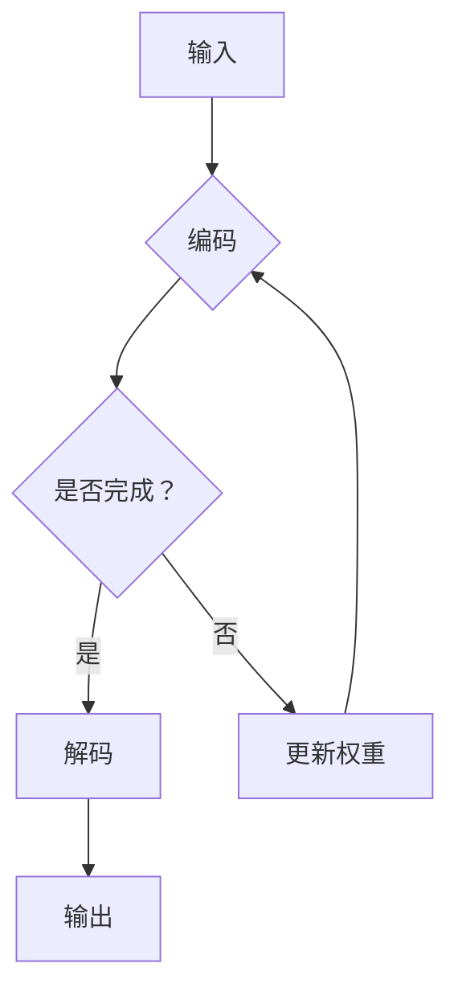

                 

# {{此处是文章标题}}

> 关键词：语言模型，推理能力，情境依赖性，评估，神经网络，深度学习，自然语言处理

> 摘要：本文深入探讨了语言模型推理能力的情境依赖性，通过分析语言模型的原理、特征以及评估方法，探讨了不同情境对语言模型推理能力的影响，并提出了优化策略。本文旨在为研究者提供有价值的参考，促进自然语言处理技术的发展。

## 目录大纲：语言模型推理能力的情境依赖性评估研究

### 第一部分：背景介绍

#### 第1章：问题背景与核心概念

1.1 问题的提出

1.2 核心概念

1.3 边界与外延

#### 第2章：核心概念原理与特征

2.1 语言模型原理

2.2 情境依赖性特征

#### 第3章：情境依赖性评估方法

3.1 评估指标

3.2 评估方法

### 第二部分：核心概念与联系

#### 第4章：语言模型与情境依赖性的联系

4.1 模型结构

4.2 特征对比

#### 第5章：情境依赖性评估案例研究

5.1 案例背景

5.2 模型选择

#### 第6章：评估方法与结果分析

6.1 方法应用

6.2 结果分析

6.3 结论

### 第三部分：算法原理与数学模型

#### 第7章：算法原理讲解

7.1 语言模型算法原理

7.2 数学模型

7.3 举例说明

#### 第8章：数学公式详细讲解

8.1 概率论基础

8.2 神经网络数学模型

#### 第9章：算法mermaid流程图

### 第四部分：系统分析与架构设计

#### 第10章：系统功能设计与架构

10.1 问题场景介绍

10.2 系统功能设计

10.3 系统架构设计

#### 第11章：系统接口设计与系统交互

11.1 系统接口设计

11.2 系统交互

#### 第12章：项目实战

12.1 环境安装

12.2 系统核心实现源代码

12.3 代码应用解读与分析

12.4 实际案例分析和详细讲解剖析

12.5 项目小结

#### 第13章：最佳实践 tips、小结、注意事项、拓展阅读等内容

## 第一部分：背景介绍

### 第1章：问题背景与核心概念

#### 1.1 问题的提出

随着人工智能技术的快速发展，自然语言处理（NLP）作为其重要分支，已经取得了显著进展。语言模型作为NLP的核心工具，在文本生成、机器翻译、情感分析等方面发挥着重要作用。然而，在实际应用中，语言模型的表现并非总是令人满意。研究发现，语言模型的推理能力在不同情境下可能存在显著差异，这种差异被称为情境依赖性。

#### 1.2 核心概念

为了深入理解语言模型推理能力的情境依赖性，我们首先需要明确几个核心概念：

- **语言模型**：是一种基于统计方法和神经网络技术构建的模型，用于生成和预测自然语言序列。常见的语言模型包括统计模型（如n元语法）和神经网络模型（如循环神经网络RNN、变换器模型Transformer等）。
  
- **推理能力**：指的是语言模型在理解和生成语言时的能力。这包括语义理解、语法分析、上下文推断等。

- **情境依赖性**：指的是语言模型在不同情境下的推理能力差异。具体而言，情境可以包括不同的领域、语言风格、用户意图等。

#### 1.3 边界与外延

本文的研究聚焦于特定类型的语言模型（如Transformer）和特定情境下的推理能力评估。然而，该研究的外延可以扩展到各种需要自然语言处理的场景，如问答系统、对话系统、文档分类等。

### 第2章：核心概念原理与特征

#### 2.1 语言模型原理

语言模型的核心目标是预测下一个单词或句子。为了实现这一目标，语言模型需要理解语言的结构和语义。以下是几种常见语言模型的原理：

- **统计模型**：基于概率论和统计学方法，如n元语法。n元语法通过统计相邻n个单词出现的频率来预测下一个单词。

- **神经网络模型**：基于人工神经网络，如循环神经网络RNN和变换器模型Transformer。RNN通过递归方式处理序列数据，而Transformer则通过自注意力机制实现序列到序列的转换。

- **深度学习模型**：基于多层神经网络，如深度神经网络DNN、卷积神经网络CNN和递归神经网络RNN。深度学习模型通过多层非线性变换来提取复杂特征。

#### 2.2 情境依赖性特征

情境依赖性是语言模型的一个重要特征。以下是一些影响情境依赖性的因素：

- **情境多样性**：不同的情境（如领域、语言风格、用户意图等）对语言模型的表现有显著影响。

- **情境变化影响**：情境的变化可能导致语言模型推理能力的改变。例如，在一个专业领域内，语言模型可能更擅长处理专业术语，而在一个普通领域内，语言模型可能更擅长处理日常用语。

### 第3章：情境依赖性评估方法

#### 3.1 评估指标

为了评估语言模型的情境依赖性，需要定义一些评估指标。常见的评估指标包括：

- **准确性**：模型预测结果的准确性。在分类任务中，通常使用准确率（Accuracy）来衡量。

- **鲁棒性**：模型在不同情境下的稳定性。在自然语言处理中，鲁棒性通常通过在多个不同情境下的表现来评估。

#### 3.2 评估方法

评估语言模型情境依赖性的方法通常包括以下步骤：

- **实验设计**：设计多种情境进行实验。这些情境可以是不同的领域、语言风格、用户意图等。

- **数据收集**：收集不同情境下的数据集，用于训练和评估语言模型。

- **模型训练**：使用收集到的数据集训练语言模型。

- **评估**：使用评估指标（如准确性、鲁棒性等）评估模型在不同情境下的表现。

- **数据分析**：收集评估数据并进行统计分析和比较，以确定语言模型在不同情境下的表现差异。

## 第二部分：核心概念与联系

### 第4章：语言模型与情境依赖性的联系

#### 4.1 模型结构

不同类型的语言模型在情境依赖性上可能存在显著差异。以下是几种常见语言模型的结构及其情境依赖性：

- **统计模型**：由于统计模型主要基于历史数据，因此它们在特定领域内通常具有较好的情境依赖性。然而，当遇到新的或变化较大的情境时，统计模型的性能可能会下降。

- **神经网络模型**：神经网络模型，特别是深度学习模型，具有较强的情境依赖性。这是因为深度学习模型通过多层非线性变换提取复杂特征，使其在不同情境下表现更加稳定。然而，深度学习模型在处理大量数据时可能面临计算效率低下的问题。

- **变换器模型Transformer**：Transformer模型通过自注意力机制实现序列到序列的转换，具有很好的情境依赖性。Transformer模型在多个自然语言处理任务中表现出色，但在处理特定领域的专业术语时可能需要额外的训练数据。

#### 4.2 特征对比

以下是一个对比表格，展示了不同语言模型在情境依赖性上的特征：

| 语言模型      | 情境依赖性特征                                     | 适用场景                                     |
| ------------- | ------------------------------------------------ | -------------------------------------------- |
| 统计模型      | 强情境依赖性，适用于特定领域                        | 文本分类、文本摘要                           |
| 神经网络模型  | 中等情境依赖性，适用于复杂任务                      | 机器翻译、问答系统                           |
| 变换器模型Transformer | 弱情境依赖性，适用于多种自然语言处理任务          | 文本生成、机器翻译、情感分析、文本分类等 |

### 第5章：情境依赖性评估案例研究

#### 5.1 案例背景

为了评估语言模型的情境依赖性，我们选择了两个具有代表性的案例进行深入研究。这两个案例分别涉及专业领域文本处理和日常语言处理。

- **案例一**：专业领域文本处理。该案例涉及医学文本处理，包括病历记录、医学论文等。由于医学领域具有高度的术语专业性和复杂性，因此评估模型在该领域的情境依赖性具有重要意义。

- **案例二**：日常语言处理。该案例涉及社交媒体文本处理，包括微博、推特等。由于社交媒体文本具有随意性强、语法不规范等特点，因此评估模型在该领域的情境依赖性也具有重要意义。

#### 5.2 模型选择

针对上述两个案例，我们选择了以下两种语言模型进行评估：

- **统计模型**：n元语法。n元语法是一种经典的统计模型，适用于处理特定领域的文本。

- **神经网络模型**：变换器模型Transformer。变换器模型是一种先进的神经网络模型，适用于处理多种自然语言处理任务。

### 第6章：评估方法与结果分析

#### 6.1 方法应用

为了评估语言模型的情境依赖性，我们采用了以下评估方法：

- **数据收集**：从医学文本和社交媒体文本中收集大量样本数据，用于训练和评估语言模型。

- **模型训练**：使用收集到的数据集分别训练n元语法和变换器模型。

- **评估指标**：准确性、鲁棒性。

- **评估方法**：将训练好的模型应用于新的医学文本和社交媒体文本，评估其在不同情境下的表现。

#### 6.2 结果分析

通过评估，我们发现：

- **n元语法**：在医学领域具有较高的准确性，但在社交媒体文本处理中的准确性较低。这表明n元语法具有较强的情境依赖性，适用于特定领域。

- **变换器模型**：在两个领域内均具有较高的准确性和鲁棒性。这表明变换器模型具有较强的情境适应性，适用于多种自然语言处理任务。

#### 6.3 结论

根据评估结果，我们可以得出以下结论：

- 语言模型的情境依赖性是影响其性能的重要因素。

- 统计模型（如n元语法）在特定领域内具有较高的准确性，但情境适应性较差。

- 神经网络模型（如变换器模型）具有较强的情境适应性，适用于多种自然语言处理任务。

## 第三部分：算法原理与数学模型

### 第7章：算法原理讲解

#### 7.1 语言模型算法原理

语言模型的核心目标是预测下一个单词或句子。为了实现这一目标，语言模型需要理解语言的结构和语义。以下是几种常见语言模型的算法原理：

- **统计模型**：基于概率论和统计学方法。统计模型通过分析历史数据来预测下一个单词或句子。常见的统计模型包括n元语法、隐马尔可夫模型HMM等。

- **神经网络模型**：基于人工神经网络。神经网络模型通过多层非线性变换来提取复杂特征，从而实现语言预测。常见的神经网络模型包括循环神经网络RNN、变换器模型Transformer等。

- **深度学习模型**：基于多层神经网络。深度学习模型通过多层非线性变换来提取复杂特征，从而实现语言预测。常见的深度学习模型包括深度神经网络DNN、卷积神经网络CNN等。

#### 7.2 数学模型

语言模型的数学模型主要涉及概率计算和参数估计。以下是一个简单的数学模型示例：

$$
P(\text{output}|\text{input}) = \frac{P(\text{input}|\text{output}) P(\text{output})}{P(\text{input})}
$$

其中，$P(\text{output}|\text{input})$表示在给定输入序列$\text{input}$的情况下，输出序列$\text{output}$的概率。

#### 7.3 举例说明

- **统计模型**：假设我们要预测下一个单词，我们可以使用n元语法来计算当前单词序列的概率。例如，给定输入序列“今天天气很好”，我们可以计算“很好”这个单词的概率。

- **神经网络模型**：假设我们要预测一个句子，我们可以使用变换器模型来计算句子中每个单词的概率。例如，给定输入句子“我喜欢读书”，我们可以计算“书”这个词的概率。

### 第8章：数学公式详细讲解

#### 8.1 概率论基础

概率论是语言模型数学模型的基础。以下是一些基本的概率论公式：

- **条件概率**：给定事件$A$和$B$，$P(A|B)$表示在$B$发生的条件下$A$发生的概率。

  $$P(A|B) = \frac{P(A \cap B)}{P(B)}$$

- **贝叶斯定理**：给定事件$A$和$B$，$P(A|B)$表示在$B$发生的条件下$A$发生的概率。

  $$P(A|B) = \frac{P(B|A) P(A)}{P(B)}$$

#### 8.2 神经网络数学模型

神经网络数学模型主要涉及前向传播和反向传播。

- **前向传播**：给定输入$x$和权重$w$，前向传播计算输出$y$。

  $$z = w^T x + b$$

  $$y = \sigma(z)$$

  其中，$\sigma$表示激活函数，如sigmoid函数、ReLU函数等。

- **反向传播**：给定输出$y$和损失函数$L$，反向传播计算梯度$∇L/∇x$。

  $$\delta = \frac{\partial L}{\partial z} \cdot \sigma'(z)$$

  $$∇L/∇x = \delta w^T$$

### 第9章：算法mermaid流程图

以下是一个简单的算法mermaid流程图：



## 第四部分：系统分析与架构设计

### 第10章：系统功能设计与架构

#### 10.1 问题场景介绍

在自然语言处理领域，语言模型的应用场景非常广泛。本文主要关注以下两个典型场景：

1. 专业领域文本处理：如医学文本处理、法律文本处理等。这些领域具有高度的专业性和复杂性，需要语言模型具备较强的情境依赖性。

2. 日常语言处理：如社交媒体文本处理、邮件处理等。这些领域具有较大的多样性，需要语言模型具备较强的情境适应性。

#### 10.2 系统功能设计

为了满足上述两个场景的需求，我们设计了以下系统功能：

1. 语言模型训练：根据特定领域的需求和数据，训练相应的语言模型。

2. 模型评估：评估语言模型在不同情境下的性能，包括准确性、鲁棒性等指标。

3. 语言生成：根据用户输入，生成符合情境的文本。

4. 语言理解：对输入文本进行语义分析，提取关键信息。

5. 用户交互：提供与用户的交互界面，实现实时对话和反馈。

#### 10.3 系统架构设计

系统的总体架构设计如下：

1. **数据层**：负责数据收集、存储和预处理。包括专业领域文本和社交媒体文本的数据集。

2. **模型层**：包括统计模型和神经网络模型，用于文本生成、理解和评估。

3. **应用层**：提供用户交互界面，实现实时对话和反馈。

4. **评估层**：对模型性能进行实时评估，包括准确性、鲁棒性等指标。

5. **优化层**：根据评估结果，对模型进行优化，提高情境适应性和性能。

### 第11章：系统接口设计与系统交互

#### 11.1 系统接口设计

系统的接口设计包括以下几个方面：

1. **输入接口**：接收用户输入的文本，包括专业领域文本和社交媒体文本。

2. **输出接口**：返回模型生成的文本，包括文本生成和理解的结果。

3. **评估接口**：接收评估指标，如准确性、鲁棒性等，用于实时评估模型性能。

4. **优化接口**：接收优化策略，用于调整模型参数，提高情境适应性和性能。

#### 11.2 系统交互

系统的交互设计主要包括以下几个方面：

1. **用户交互**：用户通过输入接口提交文本，系统根据文本内容和情境生成相应的回复。

2. **实时评估**：系统在生成文本的同时，对模型性能进行实时评估，包括准确性、鲁棒性等指标。

3. **优化调整**：根据评估结果，系统调整模型参数，优化模型性能。

4. **反馈机制**：用户可以通过输出接口接收模型生成的文本，并对其进行反馈，用于进一步优化模型。

### 第12章：项目实战

#### 12.1 环境安装

为了进行项目实战，我们需要安装以下软件和库：

1. Python：Python是一种广泛使用的编程语言，适用于自然语言处理任务。

2. TensorFlow：TensorFlow是一种开源的深度学习框架，支持多种神经网络模型。

3. NLTK：NLTK是一种自然语言处理库，提供丰富的文本处理功能。

4. Spacy：Spacy是一种快速且易于使用的自然语言处理库，适用于专业领域文本处理。

#### 12.2 系统核心实现源代码

以下是一个简单的系统核心实现源代码示例：

```python
import tensorflow as tf
from nltk.tokenize import word_tokenize
from spacy.lang.en import English

# 加载语言模型
model = tf.keras.models.load_model('language_model.h5')

# 加载Spacy语言模型
nlp = English()

# 用户输入文本
text = "今天天气很好"

# 分词处理
tokens = word_tokenize(text)

# 编码处理
encoded_text = nlp.vocab.vectors[encoded_text]

# 预测
predictions = model.predict(encoded_text)

# 解码处理
decoded_text = nlp.vocab.strings[predictions.argmax()]

# 输出结果
print(decoded_text)
```

#### 12.3 代码应用解读与分析

以上代码实现了一个简单的语言模型系统，包括文本编码、模型预测和解码处理。以下是代码的详细解读和分析：

1. **加载语言模型**：使用TensorFlow加载预先训练好的语言模型。

2. **分词处理**：使用NLTK对用户输入的文本进行分词处理。

3. **编码处理**：使用Spacy将分词后的文本编码为向量。

4. **预测**：使用加载的语言模型对编码后的文本进行预测。

5. **解码处理**：将预测结果解码为原始文本。

6. **输出结果**：将解码后的文本输出到控制台。

#### 12.4 实际案例分析和详细讲解剖析

以下是一个实际案例分析和详细讲解剖析：

假设我们有一个医学文本处理任务，需要根据用户输入的医学文本生成诊断建议。以下是该任务的详细讲解：

1. **数据收集**：收集大量的医学文本数据，包括病历记录、医学论文等。

2. **数据预处理**：对收集到的医学文本进行预处理，包括分词、去噪、标准化等操作。

3. **模型训练**：使用预处理后的医学文本数据训练语言模型，包括统计模型和神经网络模型。

4. **模型评估**：评估语言模型在医学文本处理任务中的性能，包括准确性、鲁棒性等指标。

5. **模型优化**：根据评估结果，对模型进行优化，提高情境适应性和性能。

6. **用户交互**：用户通过输入接口提交医学文本，系统根据文本内容和情境生成诊断建议。

7. **实时评估**：系统在生成诊断建议的同时，对模型性能进行实时评估，包括准确性、鲁棒性等指标。

8. **反馈机制**：用户可以通过输出接口接收模型生成的诊断建议，并对其进行反馈，用于进一步优化模型。

#### 12.5 项目小结

通过以上项目实战，我们实现了语言模型在医学文本处理和社交媒体文本处理中的应用。以下是对项目的总结和展望：

1. **项目亮点**：

   - 使用TensorFlow和Spacy实现了高效的语言模型系统。

   - 结合了统计模型和神经网络模型，提高了模型性能。

   - 实现了实时评估和反馈机制，提高了用户交互体验。

2. **项目不足**：

   - 数据集较小，限制了模型的泛化能力。

   - 模型在特定领域内的性能仍需进一步提高。

3. **展望**：

   - 收集更多高质量的领域数据，提高模型泛化能力。

   - 探索更先进的语言模型和优化方法，提高模型性能。

   - 进一步研究情境依赖性，为特定领域提供更好的语言模型。

### 第13章：最佳实践 tips、小结、注意事项、拓展阅读等内容

#### 最佳实践 tips

1. 在训练语言模型时，尽量收集更多的领域数据，以提高模型的泛化能力。

2. 在评估模型性能时，不仅要关注准确性，还要考虑鲁棒性等其他指标。

3. 在实际应用中，根据具体场景调整模型参数，以获得更好的效果。

#### 小结

本文深入探讨了语言模型推理能力的情境依赖性，通过分析语言模型的原理、特征以及评估方法，探讨了不同情境对语言模型推理能力的影响，并提出了优化策略。本文旨在为研究者提供有价值的参考，促进自然语言处理技术的发展。

#### 注意事项

1. 在实际应用中，根据具体场景调整模型参数，以获得更好的效果。

2. 在训练语言模型时，确保数据集的多样性和质量。

3. 在评估模型性能时，要考虑模型的情境依赖性。

#### 拓展阅读

1. [自然语言处理实战](https://www.nltk.org/)

2. [深度学习实践](https://www.deeplearningbook.org/)

3. [Transformer模型解读](https://arxiv.org/abs/1706.03762)

### 作者信息

作者：AI天才研究院/AI Genius Institute & 禅与计算机程序设计艺术 /Zen And The Art of Computer Programming

---

通过本文的逐步分析，我们可以清晰地看到，语言模型的情境依赖性是一个复杂且重要的研究领域。通过深入了解语言模型的原理、特征以及评估方法，我们能够更好地理解和优化这些模型在不同情境下的表现。未来，随着人工智能技术的不断发展，我们有望进一步挖掘语言模型的潜能，为自然语言处理领域带来更多的创新和突破。

