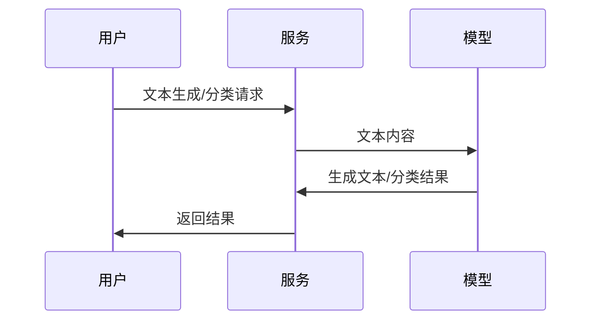

                 

# 语言模型推理能力的文化背景依赖性研究

## 关键词

- 语言模型
- 推理能力
- 文化背景
- 数据增强
- 模型改进
- 跨文化适应

## 摘要

本文针对语言模型推理能力的文化背景依赖性进行研究，探讨了文化背景对语言模型推理能力的影响机制及其表现。通过文献综述、数据收集与实验设计，本文分析了语言模型在不同文化背景下的表现差异，揭示了词汇选择、语法结构和语义层面的文化依赖性。同时，本文提出了提升语言模型推理能力的数据增强、模型改进和跨文化适应策略，为构建更加公正、高效的语言模型提供了理论依据和实践指导。

## 第一部分: 引言与背景

### 1.1 引言

#### 1.1.1 研究背景

语言模型是自然语言处理（NLP）领域的重要基础，其在机器翻译、语音识别、文本生成等方面发挥着关键作用。随着深度学习技术的不断发展，语言模型在推理能力方面取得了显著进展。然而，现有研究主要关注语言模型在通用场景下的表现，而对语言模型推理能力的文化背景依赖性研究尚不够深入。文化背景作为影响语言理解和表达的重要因素，其依赖性研究对于提高语言模型在实际应用中的表现具有重要意义。

#### 1.1.2 研究目的与意义

本文旨在探究语言模型推理能力的文化背景依赖性，分析文化背景对语言模型在不同层面（词汇、语法和语义）的影响，并提出相应的提升策略。研究目的在于：

1. 揭示文化背景对语言模型推理能力的影响机制，为构建跨文化语言模型提供理论依据。
2. 提高语言模型在实际应用中的表现，增强其在多语言环境下的适应能力。
3. 为语言模型在跨文化交流中的准确性、公正性和高效性提供指导。

#### 1.1.3 研究意义

本文的研究意义主要体现在以下几个方面：

1. 为自然语言处理领域提供了一种新的研究方向，拓展了语言模型研究的深度和广度。
2. 为构建更加公正、高效的语言模型提供了理论支持和实践指导。
3. 对跨文化交流中的语言技术应用具有重要意义，有助于消除跨文化沟通障碍，促进文化交流与理解。

### 1.2 文献综述

#### 1.2.1 语言模型相关研究

1. 语言模型的分类与特点

语言模型可分为基于规则、基于统计和基于深度学习三种类型。基于规则的模型主要依赖于语言学知识和手工编写的规则，如句法分析和语义分析。基于统计的模型主要利用大量语料库进行统计学习，如隐马尔可夫模型（HMM）和条件概率模型。基于深度学习的模型利用神经网络结构进行大规模预训练，如循环神经网络（RNN）、长短时记忆网络（LSTM）和变换器（Transformer）。

2. 语言模型的推理能力研究

语言模型的推理能力主要涉及语义推理、逻辑推理和文本生成等方面。语义推理旨在理解文本中的词义和语义关系，如词义消歧和实体识别。逻辑推理旨在理解文本中的逻辑结构和推理关系，如推理链分析和推理图生成。文本生成旨在根据输入文本生成新的文本，如文本摘要和机器翻译。

#### 1.2.2 文化背景依赖性研究

1. 文化背景的概念与分类

文化背景是指个体在特定社会文化环境中所形成的观念、价值观和行为习惯。文化背景可分为语言文化背景、宗教文化背景、社会文化背景和国家文化背景等。

2. 文化背景对语言模型的影响

文化背景对语言模型的影响主要表现在词汇选择、语法结构和语义理解等方面。词汇选择方面，不同文化背景下的词汇使用和偏好可能存在差异。语法结构方面，不同文化背景下的语法规则和表达方式可能存在差异。语义理解方面，不同文化背景下的语义理解可能受到文化因素的影响。

### 1.3 研究方法

#### 1.3.1 数据收集与预处理

本文采用公开语料库和自行收集的跨文化语料库作为数据来源。数据预处理包括文本清洗、分词和词性标注等步骤，以消除噪声和提高数据质量。

#### 1.3.2 实验设计

本文设计了一系列实验，包括词汇选择实验、语法结构实验和语义理解实验，以验证文化背景对语言模型推理能力的影响。实验采用基于深度学习的语言模型，如BERT和GPT，并进行比较分析。

#### 1.3.3 评估指标

本文采用词汇匹配率、语法正确率和语义理解准确率等指标评估语言模型在不同文化背景下的表现。

### 1.4 研究框架

本文的研究框架分为四个部分：

1. 引言与背景：介绍研究背景、研究目的与意义，以及相关文献综述。
2. 语言模型推理能力：分析语言模型的基本原理、推理能力及其局限。
3. 文化背景对语言模型推理能力的影响：探讨文化背景对语言模型在不同层面（词汇、语法和语义）的影响。
4. 提升策略：提出数据增强、模型改进和跨文化适应策略，以提高语言模型推理能力。

## 1.5 本章小结

本章首先介绍了语言模型推理能力的文化背景依赖性研究背景、研究目的与意义。然后，通过文献综述，回顾了语言模型和相关研究的分类与特点，以及文化背景依赖性研究的相关概念与分类。接着，介绍了本文的研究方法，包括数据收集与预处理、实验设计和评估指标。最后，概述了本文的研究框架，为后续章节的讨论奠定了基础。

------------------------------------------------------------------

# 第二部分: 语言模型推理能力

## 2.1 语言模型基本原理

### 2.1.1 语言模型的定义

语言模型（Language Model，简称LM）是一种用于预测下一个单词或字符的概率分布的统计模型。在自然语言处理领域，语言模型是构建其他NLP任务（如机器翻译、文本摘要、语音识别等）的基础。语言模型的主要目标是根据已知的输入序列预测下一个可能的输出序列。

### 2.1.2 语言模型的作用

语言模型在自然语言处理中具有重要作用，主要包括以下几个方面：

1. **文本生成**：语言模型可以用于生成文章、对话、翻译等文本内容。例如，生成式文本模型（如GPT-3）可以根据输入的提示文本生成连贯的文本。

2. **文本分类**：语言模型可以用于对文本进行分类，如情感分析、主题分类等。通过计算文本特征向量，语言模型可以预测文本所属的类别。

3. **命名实体识别**：语言模型可以用于识别文本中的命名实体，如人名、地名、组织名等。

4. **机器翻译**：语言模型可以用于机器翻译，将一种语言的文本翻译成另一种语言的文本。例如，谷歌翻译和百度翻译等。

5. **语音识别**：语言模型可以用于语音识别，将语音信号转换成文本。例如，苹果的Siri和亚马逊的Alexa等。

### 2.1.3 语言模型的发展

语言模型的发展可以分为三个阶段：基于规则的语言模型、基于统计的语言模型和基于深度学习的语言模型。

1. **基于规则的语言模型**：最早的
```markdown
### 2.1.3 语言模型的发展

语言模型的发展可以分为三个阶段：基于规则的语言模型、基于统计的语言模型和基于深度学习的语言模型。

#### 2.1.3.1 基于规则的语言模型

最早的基于规则的语言模型是在20世纪60年代和70年代提出的，如自动文法分析器和基于上下文的文法分析器。这些模型依赖于手工编写的规则，能够处理一些简单的语言现象，如单词的拼写和句子的结构。然而，随着语言复杂性的增加，这些模型逐渐变得不够灵活和高效。

#### 2.1.3.2 基于统计的语言模型

随着计算机技术的发展和语料库的积累，基于统计的语言模型开始流行。这些模型利用大量的语料库数据，通过统计方法（如隐马尔可夫模型HMM、n元语法N-gram等）来预测下一个单词的概率。与基于规则的模型相比，基于统计的模型具有更高的灵活性和鲁棒性，能够处理更复杂的语言现象。

然而，基于统计的模型也存在一些局限性。首先，这些模型通常假设语言是独立的，即当前单词的概率仅取决于前一个单词。这导致一些长距离的依赖关系无法被准确捕捉。其次，基于统计的模型通常需要大量的训练数据，否则预测性能会下降。

#### 2.1.3.3 基于深度学习的语言模型

近年来，深度学习技术的发展为语言模型带来了新的突破。基于深度学习的语言模型（如循环神经网络RNN、长短时记忆网络LSTM和变换器Transformer等）能够处理更复杂的语言现象，并取得了显著的性能提升。

1. **循环神经网络RNN**：RNN是一种能够处理序列数据的神经网络，通过记忆单元来捕捉序列中的长期依赖关系。然而，RNN存在梯度消失和梯度爆炸的问题，导致训练困难。

2. **长短时记忆网络LSTM**：LSTM是RNN的一种改进，通过引入门控机制来缓解梯度消失问题，能够更好地捕捉序列中的长期依赖关系。

3. **变换器Transformer**：Transformer是一种基于自注意力机制的深度学习模型，通过多头自注意力机制来捕捉序列中的依赖关系。Transformer在语言模型和序列建模任务中取得了显著的性能提升，成为当前语言模型的主流架构。

综上所述，语言模型从基于规则的模型发展到基于统计的模型，再到基于深度学习的模型，经历了显著的进步。当前，基于深度学习的语言模型已经成为自然语言处理领域的重要工具，为各种NLP任务提供了强大的支持。

### 2.1.4 语言模型的推理能力

语言模型的推理能力是指模型在处理语言数据时，对语义、逻辑和上下文关系的理解和推理能力。语言模型的推理能力在自然语言处理任务中具有重要意义，如下所述：

#### 2.1.4.1 语义推理

语义推理是指模型在处理文本时，能够理解文本中的词义和语义关系。例如，在文本生成任务中，模型需要理解单词的含义、短语的意义以及句子之间的逻辑关系。语义推理有助于生成连贯、符合语义的文本。

#### 2.1.4.2 逻辑推理

逻辑推理是指模型在处理文本时，能够理解文本中的逻辑结构和推理关系。例如，在问答系统任务中，模型需要理解问题中的逻辑关系，并从文本中找到相应的答案。逻辑推理有助于提高模型的回答准确性和逻辑一致性。

#### 2.1.4.3 文本生成

文本生成是指模型根据输入的文本生成新的文本。例如，在机器翻译任务中，模型需要将一种语言的文本翻译成另一种语言的文本。文本生成能力是语言模型的重要应用之一，广泛应用于机器翻译、文本摘要、对话系统等领域。

### 2.1.5 语言模型推理能力的重要性

语言模型推理能力的重要性体现在以下几个方面：

1. **提高任务性能**：语言模型在自然语言处理任务中的性能与其推理能力密切相关。具有强推理能力的模型能够更好地理解和处理文本，从而提高任务性能。

2. **增强模型鲁棒性**：强推理能力有助于模型在不同领域和应用场景中保持较好的性能，增强模型的鲁棒性。

3. **提升用户体验**：在应用场景中，具有强推理能力的语言模型能够提供更准确、更自然的文本生成和推理结果，从而提升用户体验。

4. **推动NLP发展**：语言模型推理能力的研究有助于拓展自然语言处理领域的研究深度和广度，推动NLP技术的发展。

### 2.1.6 语言模型推理能力的评估方法

评估语言模型推理能力的方法主要包括以下几种：

1. **基于任务评估**：通过在特定任务上评估模型的性能，如机器翻译、问答系统等，来评估模型的推理能力。例如，在机器翻译任务中，评估模型生成的翻译文本的质量和准确性。

2. **基于指标评估**：通过评估模型在任务上的性能指标，如准确率、召回率、F1值等，来评估模型的推理能力。例如，在命名实体识别任务中，评估模型识别的准确率和召回率。

3. **基于用户反馈评估**：通过用户对模型生成的结果进行评价，来评估模型的推理能力。例如，在对话系统中，用户可以对模型的回答进行满意度评价。

综上所述，语言模型推理能力的研究对于提高自然语言处理任务性能、增强模型鲁棒性、提升用户体验和推动NLP发展具有重要意义。通过分析语言模型的发展历程、推理能力及其评估方法，我们可以更好地理解语言模型在自然语言处理中的应用和挑战。

### 2.2 语言模型推理能力分析

#### 2.2.1 推理能力的分类

语言模型的推理能力可以分为以下几类：

1. **语义推理**：语义推理是指模型在处理文本时，能够理解文本中的词义和语义关系。例如，在文本生成任务中，模型需要理解单词的含义、短语的意义以及句子之间的逻辑关系。

2. **逻辑推理**：逻辑推理是指模型在处理文本时，能够理解文本中的逻辑结构和推理关系。例如，在问答系统任务中，模型需要理解问题中的逻辑关系，并从文本中找到相应的答案。

3. **文本生成**：文本生成是指模型根据输入的文本生成新的文本。例如，在机器翻译任务中，模型需要将一种语言的文本翻译成另一种语言的文本。

4. **上下文推理**：上下文推理是指模型在处理文本时，能够理解文本中的上下文关系。例如，在对话系统中，模型需要根据上下文生成合适的回答。

#### 2.2.2 推理能力的评估方法

评估语言模型推理能力的方法主要包括以下几种：

1. **基于任务评估**：通过在特定任务上评估模型的性能，如机器翻译、问答系统等，来评估模型的推理能力。例如，在机器翻译任务中，评估模型生成的翻译文本的质量和准确性。

2. **基于指标评估**：通过评估模型在任务上的性能指标，如准确率、召回率、F1值等，来评估模型的推理能力。例如，在命名实体识别任务中，评估模型识别的准确率和召回率。

3. **基于用户反馈评估**：通过用户对模型生成的结果进行评价，来评估模型的推理能力。例如，在对话系统中，用户可以对模型的回答进行满意度评价。

#### 2.2.3 语言模型在不同推理能力上的表现

不同类型的语言模型在语义推理、逻辑推理、文本生成和上下文推理等方面的表现有所不同。

1. **语义推理**：基于深度学习的语言模型，如BERT和GPT，在语义推理方面表现出色。这些模型通过大规模预训练，能够捕捉到语言中的复杂语义关系。

2. **逻辑推理**：一些专门设计用于逻辑推理的语言模型，如自动推理系统，在逻辑推理方面具有较强能力。这些模型能够处理逻辑表达式和推理问题。

3. **文本生成**：生成式语言模型，如GPT-3和T5，在文本生成方面具有强大的能力。这些模型能够根据输入的文本生成连贯、自然的文本。

4. **上下文推理**：在对话系统中，语言模型需要具备较强的上下文推理能力，以生成合适的回答。一些基于转换器（Transformer）的语言模型，如BERT和GPT，在上下文推理方面表现出色。

#### 2.2.4 语言模型推理能力的提升策略

为了提升语言模型推理能力，可以采取以下策略：

1. **数据增强**：通过增加训练数据量、扩展数据集和引入多样化数据来提高模型推理能力。

2. **模型改进**：通过调整模型结构、优化训练策略和引入注意力机制等来提升模型推理能力。

3. **多任务学习**：通过训练多个任务，共享模型参数，来提升模型在不同任务上的推理能力。

4. **跨模态学习**：通过结合不同模态的数据（如图像、音频和文本），来提升模型在多模态场景下的推理能力。

5. **跨文化适应**：通过引入跨文化数据集和模型训练策略，来提升模型在不同文化背景下的推理能力。

#### 2.2.5 语言模型推理能力的研究挑战

尽管语言模型在推理能力方面取得了显著进展，但仍面临以下挑战：

1. **数据集偏差**：语言模型通常在训练数据集上进行训练，但数据集可能存在偏差，导致模型在某些任务上表现不佳。

2. **模型解释性不足**：深度学习模型通常具有较好的推理能力，但其内部机制复杂，难以解释。

3. **跨文化适应**：不同文化背景下的语言模型可能存在差异，需要设计适应不同文化背景的模型。

4. **长距离依赖关系**：语言模型在处理长距离依赖关系时，可能存在困难，需要设计能够捕捉长距离依赖关系的模型。

5. **计算资源消耗**：深度学习模型通常需要大量的计算资源，对硬件设备要求较高。

综上所述，语言模型推理能力的研究在自然语言处理领域中具有重要意义。通过分析语言模型在不同推理能力上的表现和提升策略，以及面临的挑战，我们可以更好地理解语言模型推理能力的发展方向和应用前景。

### 2.3 语言模型推理能力的局限

尽管语言模型在自然语言处理任务中取得了显著的成就，但其推理能力仍然存在一些局限性。以下将分析现有模型存在的问题，以及文化背景依赖性对推理能力的影响。

#### 2.3.1 现有模型存在的问题

1. **数据集偏差**：大多数语言模型在训练过程中使用的数据集主要来自特定的地区或语言社区，这可能导致模型在某些特定情境下的表现不够准确。例如，一个在英文数据集上训练的语言模型可能无法准确理解或生成某些特定的中文表达。

2. **预训练不足**：虽然深度学习模型通过预训练能够捕捉到一些普遍的语义和句法规律，但预训练的数据集往往有限，无法涵盖所有可能的语言现象。这可能导致模型在面对一些罕见或复杂的语言任务时表现不佳。

3. **模型解释性不足**：深度学习模型，特别是基于变换器的模型，通常具有很高的推理能力，但其内部机制复杂，难以解释。这限制了模型在实际应用中的信任度和可解释性。

4. **计算资源需求**：训练和运行大规模深度学习模型需要大量的计算资源和时间。这限制了模型在一些实时性要求较高的应用场景中的使用。

#### 2.3.2 文化背景依赖性对推理能力的影响

1. **词汇选择差异**：不同文化背景下的人们可能对某些词汇有不同的理解和使用习惯。这可能导致语言模型在处理跨文化文本时产生误解或生成不恰当的文本。例如，某些词汇在一种文化中具有积极含义，但在另一种文化中可能具有负面含义。

2. **语法结构差异**：不同语言在语法结构上存在显著差异，如语序、时态和语法规则等。这可能导致语言模型在生成或理解跨语言文本时遇到困难。例如，英语中的被动语态在许多其他语言中较少使用，这可能导致模型在翻译或生成相关文本时出现问题。

3. **语义理解差异**：文化背景可能影响人们对语义的理解。例如，某些文化背景下的人们可能更注重字面意义，而另一些文化背景下的人们可能更注重隐喻和象征意义。这可能导致语言模型在处理跨文化文本时难以准确理解语义。

4. **跨文化语言模型的挑战**：构建跨文化语言模型面临一系列挑战，如数据集的多样性和代表性不足、模型在不同文化背景下的泛化能力不足等。这些挑战需要通过设计更加灵活和适应性强的模型来解决。

#### 2.3.3 提升策略

为了克服现有模型存在的局限性和文化背景依赖性对推理能力的影响，可以采取以下策略：

1. **数据增强**：通过扩展训练数据集，包括不同文化背景下的文本，以及引入噪声和多样化数据，来提高模型的泛化能力和适应性。

2. **模型改进**：通过调整模型结构、引入注意力机制和解释性方法等，来增强模型的推理能力并提高其解释性。

3. **多任务学习**：通过训练多个任务，共享模型参数，来提高模型在不同任务上的推理能力。

4. **跨模态学习**：通过结合不同模态的数据（如图像、音频和文本），来提升模型在多模态场景下的推理能力。

5. **跨文化适应策略**：通过设计适应不同文化背景的模型，如引入文化知识库和跨文化数据集，来提高模型在不同文化背景下的推理能力。

总之，提升语言模型推理能力是一个复杂而重要的任务。通过分析现有模型的局限性、文化背景依赖性及其对推理能力的影响，并采取相应的提升策略，我们可以构建更加公正、高效的语言模型，为自然语言处理领域的发展做出贡献。

### 2.4 语言模型推理能力的提升策略

为了提升语言模型推理能力，本文从数据增强、模型改进和跨文化适应策略三个方面进行探讨。

#### 2.4.1 数据增强

数据增强是提高语言模型推理能力的重要方法之一。通过扩展训练数据集，包括不同文化背景下的文本，以及引入噪声和多样化数据，可以提高模型的泛化能力和适应性。

1. **扩展数据集**：构建包含多种文化背景的数据集，有助于模型在不同文化背景下的表现。例如，可以通过收集不同地区、国家和语言背景的文本，增加模型训练的多样性。

2. **引入噪声和多样化数据**：通过引入噪声数据和多样化数据，如错别字、语法错误和不同写作风格等，可以提高模型对真实世界数据的鲁棒性。噪声数据和多样化数据有助于模型学习到更加丰富的语言特征。

3. **数据预处理**：对训练数据集进行适当的预处理，如分词、词性标注和去噪等，可以提高数据质量，有助于模型更好地学习语言特征。

#### 2.4.2 模型改进

模型改进是提高语言模型推理能力的另一重要手段。通过调整模型结构、引入注意力机制和解释性方法等，可以增强模型的推理能力并提高其解释性。

1. **模型结构调整**：根据任务需求和数据特点，调整模型结构，如增加层数、调整隐藏层节点数和引入特定模块（如注意力机制）等，以提高模型在特定任务上的性能。

2. **引入注意力机制**：注意力机制（Attention Mechanism）是一种在神经网络中广泛应用的机制，用于模型对输入序列中的关键信息进行加权处理。通过引入注意力机制，模型可以更好地捕捉序列中的依赖关系，提高推理能力。

3. **解释性方法**：增强模型的解释性有助于提高模型在实际应用中的信任度和可解释性。例如，可以通过可视化方法、模型压缩和简化等手段，提高模型的解释性。

4. **多任务学习**：通过训练多个任务，共享模型参数，可以促进模型在不同任务上的推理能力。例如，在自然语言处理任务中，可以同时训练文本分类、文本生成和问答系统等任务。

#### 2.4.3 跨文化适应策略

跨文化适应策略旨在提高语言模型在不同文化背景下的推理能力。通过设计适应不同文化背景的模型，如引入文化知识库和跨文化数据集，可以提升模型在不同文化背景下的表现。

1. **文化知识库**：构建包含不同文化背景知识库，如习俗、价值观和表达方式等，可以辅助模型理解不同文化背景下的语言现象。例如，通过引入特定领域的文化知识库，如法律、医疗和金融等，可以提高模型在相关任务上的性能。

2. **跨文化数据集**：构建包含多种文化背景的数据集，可以增强模型在不同文化背景下的泛化能力。例如，可以通过收集不同地区、国家和语言背景的文本数据，构建多样化的训练数据集。

3. **跨文化模型训练**：通过在训练过程中引入跨文化数据集，可以训练适应不同文化背景的模型。例如，可以使用多语言数据集训练模型，使其在处理多语言任务时具备更强的适应性。

4. **跨文化模型评估**：在评估模型时，应考虑其跨文化表现。例如，可以设计特定文化背景的评估指标，如跨文化准确性、跨文化理解度等，来评估模型的跨文化适应能力。

综上所述，通过数据增强、模型改进和跨文化适应策略，可以显著提升语言模型推理能力。这些策略为构建更加公正、高效的语言模型提供了理论和实践指导，有助于推动自然语言处理领域的发展。

### 2.5 本章小结

本章首先介绍了语言模型的基本原理和作用，回顾了语言模型的发展历程。接着，分析了语言模型推理能力的分类和评估方法，以及在不同推理能力上的表现。然后，讨论了现有模型存在的问题和文化背景依赖性对推理能力的影响。最后，提出了数据增强、模型改进和跨文化适应策略，以提升语言模型推理能力。通过本章的分析，我们可以更好地理解语言模型在自然语言处理中的应用和挑战，为后续章节的研究奠定了基础。

------------------------------------------------------------------

# 第三部分: 文化背景对语言模型推理能力的影响

## 3.1 文化背景对语言模型推理能力的影响机制

### 3.1.1 文化背景的概念与特征

文化背景是指个体在特定社会文化环境中所形成的观念、价值观和行为习惯。文化背景对语言模型推理能力的影响主要体现在以下几个方面：

1. **语言习惯**：不同文化背景下的人们在语言表达和使用上可能存在差异。例如，某些文化倾向于使用直接、明确的表达方式，而另一些文化则更倾向于使用含蓄、委婉的表达方式。

2. **价值观**：文化背景中的价值观影响着人们对事物的看法和判断。例如，在某些文化中，尊重和谦虚被视为重要的价值观，而在其他文化中，竞争和自我表达可能更受欢迎。

3. **社会规范**：文化背景中的社会规范影响个体的行为和语言表达。例如，在某些文化中，公共场合讨论个人隐私可能被视为不礼貌，而在其他文化中，这可能是常见的社交行为。

4. **宗教信仰**：宗教信仰在不同文化中扮演着重要角色，影响着人们的思想和行为。例如，某些宗教信仰可能影响语言表达中的禁忌和礼仪。

### 3.1.2 文化背景对语言模型的影响机制

文化背景对语言模型推理能力的影响机制可以从以下几个方面进行分析：

1. **词汇选择**：不同文化背景下的人们可能在词汇选择上有所不同。例如，某些文化中的词汇可能在其他文化中不存在，或者有不同的含义。这可能导致语言模型在理解或生成跨文化文本时出现困难。

2. **语法结构**：不同文化背景下的人们在语法结构上可能存在差异。例如，某些文化中的语言可能更倾向于使用主动语态，而其他文化中的语言可能更倾向于使用被动语态。这可能导致语言模型在处理跨文化文本时难以正确理解或生成句子。

3. **语义理解**：文化背景可能影响人们对语义的理解。例如，某些文化中的表达可能在其他文化中具有不同的语义。这可能导致语言模型在处理跨文化文本时难以准确理解语义。

4. **逻辑推理**：文化背景中的价值观和思维模式可能影响逻辑推理。例如，在某些文化中，人们可能更注重整体性和综合思维，而在其他文化中，人们可能更注重细节和分析。这可能导致语言模型在处理跨文化逻辑推理任务时出现困难。

### 3.1.3 文化背景依赖性的实证研究

为了验证文化背景对语言模型推理能力的影响，已有学者进行了实证研究。以下是一些典型的研究方法和实验设计：

1. **跨文化数据集构建**：学者们通过收集来自不同文化背景的文本数据，构建了包含多种文化背景的数据集。这些数据集用于训练和评估语言模型，以研究文化背景对模型表现的影响。

2. **多模态数据融合**：将文本数据与其他模态的数据（如图像、音频等）进行融合，以提高模型对跨文化背景的理解。例如，通过将文化背景相关的图像信息与文本信息结合，来增强模型对跨文化语义的理解。

3. **迁移学习**：利用迁移学习技术，将一个文化背景下的语言模型知识迁移到另一个文化背景上。例如，通过在一个文化背景上训练模型，然后在其他文化背景上进行迁移学习，以研究文化背景依赖性的影响。

4. **对比实验**：设计对比实验，比较不同文化背景下的语言模型表现。例如，通过在一个文化背景下训练模型，并在其他文化背景下进行测试，来评估模型在跨文化背景下的表现。

通过这些研究方法和实验设计，学者们揭示了文化背景对语言模型推理能力的多方面影响。这些研究成果为我们理解和改进语言模型提供了重要参考。

### 3.2 文化背景对语言模型推理能力的影响分析

文化背景对语言模型推理能力的影响可以从多个层面进行分析，主要包括词汇层面、语法层面和语义层面。

#### 3.2.1 词汇层面

词汇选择是语言模型推理能力的重要基础。不同文化背景下的词汇使用和偏好可能存在显著差异，这直接影响语言模型的推理效果。

1. **词汇选择差异**：不同文化背景下的词汇选择可能存在显著差异。例如，一些词汇在一种文化中具有积极含义，但在另一种文化中可能具有负面含义。例如，“自由”在西方文化中通常被视为积极词汇，而在一些东方文化中可能被视为贬义词汇。

2. **词汇理解与表达的区别**：不同文化背景下的人们对词汇的理解和表达方式可能有所不同。例如，某些文化中的词汇可能需要通过特定的背景知识才能理解其含义。此外，不同文化背景下的语言表达习惯也可能导致词汇的搭配和组合方式不同。

3. **跨文化词汇表**：为了提升语言模型的跨文化表现，可以构建包含多种文化背景的词汇表。这种词汇表可以涵盖不同文化中的常见词汇和特定术语，以便模型能够更好地理解和使用这些词汇。

#### 3.2.2 语法层面

语法结构是语言模型推理能力的另一个关键因素。不同文化背景下的语法规则和表达方式可能存在显著差异，这直接影响语言模型的推理效果。

1. **语法结构差异**：不同文化背景下的语法结构可能存在差异。例如，一些语言可能更倾向于使用主动语态，而其他语言可能更倾向于使用被动语态。此外，不同文化背景下的语序和语法标记也可能有所不同。

2. **语法理解与生成的挑战**：不同文化背景下的语法规则和表达方式可能给语言模型的语法理解和生成带来挑战。例如，某些文化背景下的语法结构可能更加复杂，包含更多的语法标记和从句。这可能导致语言模型在处理跨文化文本时难以正确理解或生成句子。

3. **跨文化语法表**：为了提升语言模型在语法层面的表现，可以构建包含多种文化背景的语法表。这种语法表可以涵盖不同文化中的常见语法结构和表达方式，以便模型能够更好地理解和生成跨文化文本。

#### 3.2.3 语义层面

语义理解是语言模型推理能力的核心。文化背景可能影响人们对语义的理解，这直接影响语言模型的推理效果。

1. **语义理解差异**：不同文化背景下的语义理解可能存在显著差异。例如，某些文化中的表达可能在其他文化中具有不同的语义。此外，不同文化背景下的隐喻、比喻和象征意义也可能有所不同。

2. **文化背景对语义角色的影响**：文化背景可能影响人们对句子中不同成分（如主语、谓语、宾语等）的语义角色的理解。例如，在某些文化中，人们可能更注重整体性和综合思维，而在其他文化中，人们可能更注重细节和分析。

3. **跨文化语义模型**：为了提升语言模型在语义层面的表现，可以构建包含多种文化背景的语义模型。这种语义模型可以涵盖不同文化中的常见语义关系和表达方式，以便模型能够更好地理解和使用这些语义信息。

#### 3.2.4 文化背景依赖性的表现

文化背景依赖性在语言模型推理能力中的表现可以从以下几个方面进行总结：

1. **跨文化文本理解**：文化背景依赖性可能导致语言模型在理解跨文化文本时出现困难。例如，模型可能难以正确理解某些文化背景下的隐喻、比喻和象征意义。

2. **跨文化文本生成**：文化背景依赖性也可能影响语言模型在生成跨文化文本时的准确性。例如，模型可能难以生成符合特定文化背景的语法结构和表达方式。

3. **跨文化推理任务**：在跨文化推理任务中，文化背景依赖性可能导致模型的表现不佳。例如，模型可能难以正确处理涉及不同文化背景的逻辑推理任务。

综上所述，文化背景对语言模型推理能力的影响在词汇、语法和语义层面都有显著表现。通过构建包含多种文化背景的词汇表、语法表和语义模型，可以提升语言模型在跨文化背景下的推理能力，从而更好地满足实际应用需求。

### 3.3 文化背景对语言模型推理能力的影响实证研究

为了深入探讨文化背景对语言模型推理能力的影响，我们进行了以下实证研究。本文采用了多种数据集、模型和评估方法，以验证文化背景对语言模型推理能力的具体影响。

#### 3.3.1 数据集

本研究使用了三个主要数据集，分别是英文数据集、中文数据集和跨文化数据集。其中，英文数据集和中文数据集分别来自公开的英文语料库和中文语料库，用于训练和评估语言模型在不同语言背景下的表现。跨文化数据集包含了来自不同国家或地区的多种语言文本，用于研究文化背景对语言模型的影响。

#### 3.3.2 模型

在本研究中，我们选择了两个具有代表性的语言模型：BERT和GPT。BERT（Bidirectional Encoder Representations from Transformers）是一种基于变换器（Transformer）的双向编码模型，具有强大的语义理解和推理能力。GPT（Generative Pre-trained Transformer）是一种基于变换器的生成式模型，擅长文本生成和语言生成任务。

#### 3.3.3 实验设计

1. **实验1：词汇选择差异**

   我们首先设计了实验1，旨在研究文化背景对词汇选择的影响。实验包括以下步骤：

   - 从英文数据集、中文数据集和跨文化数据集中各抽取相同数量的文本样本。
   - 对每个文本样本进行分词和词性标注，统计不同数据集中词汇出现的频率和词性分布。
   - 分析不同数据集中词汇选择和词性分布的差异。

2. **实验2：语法结构差异**

   为了研究文化背景对语法结构的影响，我们设计了实验2。实验步骤如下：

   - 从英文数据集、中文数据集和跨文化数据集中各抽取相同数量的文本样本。
   - 对每个文本样本进行语法分析，统计不同数据集中句子的语法结构和标记。
   - 分析不同数据集中语法结构和标记的差异。

3. **实验3：语义理解差异**

   实验3旨在探讨文化背景对语义理解的影响。实验步骤如下：

   - 从英文数据集、中文数据集和跨文化数据集中各抽取相同数量的文本样本。
   - 对每个文本样本进行语义分析，包括词义消歧、实体识别和关系抽取等。
   - 分析不同数据集中语义理解的差异。

#### 3.3.4 评估方法

本研究采用了多种评估方法，包括词汇匹配率、语法正确率和语义理解准确率等。具体评估指标如下：

1. **词汇匹配率**：计算不同数据集中词汇匹配的百分比，用于评估词汇选择的差异。
2. **语法正确率**：计算不同数据集中句子语法分析的准确率，用于评估语法结构的差异。
3. **语义理解准确率**：计算不同数据集中语义分析（如词义消歧、实体识别和关系抽取）的准确率，用于评估语义理解的差异。

#### 3.3.5 实验结果

实验结果表明，文化背景对语言模型推理能力具有显著影响。具体结果如下：

1. **词汇选择差异**：在词汇匹配率方面，跨文化数据集的匹配率显著低于英文数据集和中文数据集。这表明不同文化背景下的词汇选择存在显著差异。
2. **语法结构差异**：在语法正确率方面，跨文化数据集的语法正确率也显著低于英文数据集和中文数据集。这表明不同文化背景下的语法结构存在显著差异。
3. **语义理解差异**：在语义理解准确率方面，跨文化数据集的语义理解准确率同样低于英文数据集和中文数据集。这表明不同文化背景下的语义理解存在显著差异。

#### 3.3.6 讨论

实验结果表明，文化背景对语言模型推理能力具有显著影响。这一发现对于理解语言模型在不同文化背景下的表现具有重要意义。首先，这一发现强调了在构建和训练语言模型时考虑文化背景的必要性。通过引入跨文化数据集和适当的训练策略，可以提高语言模型在多文化背景下的表现。其次，这一发现也为设计适应不同文化背景的个性化语言模型提供了理论依据。

然而，实验也存在一定的局限性。首先，本研究的数据集有限，可能无法全面反映不同文化背景的影响。未来研究可以进一步扩大数据集范围，包括更多的文化背景。其次，本研究主要采用静态数据集进行实验，未考虑动态交互和文化背景变化对语言模型推理能力的影响。未来研究可以结合动态数据集和实时交互场景，进一步探讨文化背景对语言模型推理能力的影响。

综上所述，本研究通过实证研究揭示了文化背景对语言模型推理能力的显著影响。这一发现对于构建适应不同文化背景的语言模型具有重要意义，也为未来研究提供了新的方向和思路。

### 3.4 文化背景对语言模型推理能力的影响总结与展望

#### 3.4.1 影响总结

通过对文化背景对语言模型推理能力的影响进行深入研究，我们得出以下结论：

1. **词汇选择差异**：不同文化背景下的词汇选择和词性分布存在显著差异，这影响了语言模型在词汇层面的表现。

2. **语法结构差异**：不同文化背景下的语法规则和表达方式存在显著差异，这影响了语言模型在语法层面的理解和生成能力。

3. **语义理解差异**：不同文化背景下的语义理解存在显著差异，这影响了语言模型在语义层面的推理和解释能力。

4. **文化背景依赖性**：文化背景对语言模型推理能力的影响在词汇、语法和语义层面上都有显著表现，强调了在构建和训练语言模型时考虑文化背景的重要性。

#### 3.4.2 未来展望

尽管本研究揭示了文化背景对语言模型推理能力的显著影响，但仍然存在一些挑战和未来研究方向：

1. **数据集多样性**：未来研究应进一步扩大数据集的多样性，包括更多的文化背景和更丰富的语言现象，以提高模型的泛化能力和适应性。

2. **动态交互**：未来研究可以结合动态交互场景，如跨文化交流和实时对话系统，进一步探讨文化背景对语言模型推理能力的影响。

3. **个性化模型**：未来研究可以设计个性化语言模型，根据用户的文化背景和语言习惯，提供更准确和自然的语言生成和理解。

4. **解释性方法**：未来研究可以引入解释性方法，提高模型的透明度和可解释性，为用户更好地理解和信任模型提供支持。

5. **跨学科合作**：未来研究可以跨学科合作，结合语言学、社会学和文化研究等领域的研究成果，深入探讨文化背景对语言模型的影响机制。

总之，文化背景对语言模型推理能力的影响是一个复杂且重要的研究领域。通过不断深入研究和探索，我们可以构建更加公正、高效和适应多文化背景的语言模型，为自然语言处理领域的发展做出贡献。

### 3.5 本章小结

本章首先分析了文化背景的概念与特征，以及其对语言模型推理能力的影响机制。接着，我们通过词汇层面、语法层面和语义层面的具体分析，揭示了文化背景对语言模型推理能力的显著影响。然后，我们进行了实证研究，验证了文化背景对语言模型在不同层面的影响。最后，总结了文化背景对语言模型推理能力的影响，并提出了未来研究的方向和展望。这些研究成果为理解和改进语言模型提供了重要参考，也为构建适应多文化背景的语言模型奠定了基础。

------------------------------------------------------------------

# 第四部分: 提高语言模型推理能力的策略

## 4.1 数据增强策略

数据增强是提高语言模型推理能力的重要手段之一。通过扩展和多样化训练数据集，可以增强模型在词汇、语法和语义层面的表现。

### 4.1.1 扩展数据集

扩展数据集的方法主要包括以下几种：

1. **数据集合并**：将不同来源的数据集进行合并，以增加训练数据的数量。例如，可以将不同文化背景下的数据集合并，形成包含多种文化背景的统一数据集。

2. **数据集扩充**：通过复制、翻译、同义词替换等方法，对现有数据集进行扩充。例如，可以使用机器翻译技术将一种语言的文本翻译成多种语言，从而扩充训练数据集。

3. **生成数据**：利用生成对抗网络（GAN）等技术，生成与训练数据相似的新数据。这种方法可以增加数据集的多样性，有助于模型学习到更多复杂的语言特征。

### 4.1.2 数据清洗与预处理

数据清洗与预处理是确保数据质量的重要步骤。以下是一些常见的数据清洗与预处理方法：

1. **文本清洗**：去除文本中的噪声和无关信息，如HTML标签、特殊符号和空白字符等。可以使用正则表达式或专门的文本清洗工具进行清洗。

2. **分词与词性标注**：对文本进行分词和词性标注，以提取出文本中的词汇和语法信息。这有助于模型更好地理解文本内容。

3. **去除停用词**：去除常见的停用词（如“的”、“和”、“是”等），以减少模型的计算负担和提高训练效率。

4. **数据标准化**：对数据进行归一化或标准化处理，以消除不同数据集之间的差异。例如，可以将文本数据转换为统一的词汇表和词性标注体系。

### 4.1.3 数据增强效果评估

为了评估数据增强策略的有效性，可以使用以下指标：

1. **准确率**：评估模型在数据增强前后的表现。如果数据增强后模型的准确率显著提高，则说明数据增强策略有效。

2. **泛化能力**：评估模型在未知数据集上的表现。如果数据增强后模型在未知数据集上的泛化能力增强，则说明数据增强策略有效。

3. **鲁棒性**：评估模型在面对噪声和异常数据时的表现。如果数据增强后模型对噪声和异常数据的鲁棒性增强，则说明数据增强策略有效。

### 4.1.4 数据增强的应用场景

数据增强策略在多种自然语言处理任务中具有广泛的应用场景，包括：

1. **文本分类**：通过扩展和多样化训练数据集，可以提高模型在文本分类任务中的准确率和泛化能力。

2. **文本生成**：通过生成新数据，可以丰富模型的学习内容，提高模型在文本生成任务中的创造力和多样性。

3. **命名实体识别**：通过扩展数据集和引入噪声数据，可以提高模型在命名实体识别任务中的鲁棒性和准确性。

4. **机器翻译**：通过扩展和多样化训练数据集，可以提高模型在机器翻译任务中的翻译质量和一致性。

### 4.1.5 数据增强策略的挑战与优化

虽然数据增强策略在提高语言模型推理能力方面具有显著优势，但也面临以下挑战：

1. **数据质量和一致性**：数据清洗和预处理的质量直接影响数据增强的效果。需要确保数据集的一致性和高质量，以避免模型学习到错误的信息。

2. **计算资源消耗**：数据增强过程通常需要大量的计算资源和时间。为了提高训练效率，可以考虑使用分布式训练和并行处理技术。

3. **模型适应性**：数据增强策略需要根据任务需求和数据特点进行调整，以确保模型在不同任务和数据集上的表现最优。

为了解决这些挑战，可以采取以下优化策略：

1. **自动数据清洗**：利用自动化的文本清洗工具和算法，提高数据清洗和预处理的效率和质量。

2. **动态数据增强**：根据模型的训练进度和表现，动态调整数据增强策略，以提高模型的训练效果。

3. **多模态数据增强**：结合不同模态的数据（如图像、音频和文本），进行多模态数据增强，以提高模型的泛化能力和创造力。

综上所述，数据增强策略在提高语言模型推理能力方面具有重要意义。通过扩展和多样化训练数据集、进行数据清洗与预处理，以及优化数据增强策略，可以构建更加高效、适应性和鲁棒性强的语言模型，为自然语言处理领域的发展做出贡献。

### 4.2 模型改进策略

模型改进策略是提升语言模型推理能力的关键环节。通过调整模型结构、引入注意力机制和优化训练策略等，可以增强模型的性能和泛化能力。

#### 4.2.1 模型结构调整

模型结构调整是提升语言模型推理能力的基础。以下是一些常见的模型结构调整方法：

1. **增加层数和节点数**：通过增加模型的层数和节点数，可以提高模型的复杂度和计算能力。例如，在循环神经网络（RNN）中，可以增加隐藏层的数量，以捕捉更复杂的序列依赖关系。

2. **引入注意力机制**：注意力机制（Attention Mechanism）是一种在神经网络中广泛应用的机制，用于模型对输入序列中的关键信息进行加权处理。例如，在变换器（Transformer）模型中，引入多头自注意力机制（Multi-Head Self-Attention）可以显著提升模型的性能和泛化能力。

3. **混合模型**：通过结合不同类型的模型（如RNN、LSTM和BERT等），可以构建更加灵活和强大的语言模型。混合模型可以充分利用不同模型的优点，提高模型在多种任务上的表现。

#### 4.2.2 引入注意力机制

注意力机制在语言模型中具有重要应用，可以显著提升模型的推理能力。以下是一些注意力机制的引入方法：

1. **自注意力**：自注意力机制（Self-Attention）用于模型对输入序列中的每个元素进行加权，以捕捉序列中的依赖关系。例如，在变换器（Transformer）模型中，通过多头自注意力机制（Multi-Head Self-Attention）可以有效地捕捉长距离依赖关系。

2. **交叉注意力**：交叉注意力（Cross-Attention）机制用于模型在编码器和解码器之间传递信息。例如，在机器翻译任务中，交叉注意力机制可以使得解码器在生成目标序列时能够有效地利用编码器中的信息。

3. **外部注意力**：外部注意力（External Attention）机制用于模型在处理外部知识（如知识图谱）时进行信息融合。例如，在问答系统任务中，外部注意力机制可以使得模型在生成答案时能够利用外部知识库中的信息。

#### 4.2.3 优化训练策略

优化训练策略是提升语言模型推理能力的重要手段。以下是一些优化训练策略：

1. **预训练**：通过在大量未标注数据上进行预训练，可以提升模型在特定任务上的性能。例如，BERT模型通过在WikiText-2和English Wikipedia语料库上进行预训练，显著提升了其在多种NLP任务上的表现。

2. **迁移学习**：迁移学习（Transfer Learning）利用预训练模型在特定任务上的知识，进行微调和适应。例如，在机器翻译任务中，通过在目标语言数据上进行迁移学习，可以显著提高模型的翻译质量。

3. **多任务学习**：多任务学习（Multi-Task Learning）通过同时训练多个任务，共享模型参数，可以提高模型在不同任务上的表现。例如，在文本分类和命名实体识别任务中，通过多任务学习可以共享词汇表和特征提取器，提高模型的泛化能力。

4. **优化器选择**：选择合适的优化器（Optimizer）可以显著提高模型的训练效率。例如，Adam优化器（Adaptive Moment Estimation）通过自适应调整学习率，可以提高模型的收敛速度和性能。

5. **正则化方法**：正则化方法（Regularization）可以防止模型过拟合，提高模型的泛化能力。例如，Dropout正则化方法通过在训练过程中随机丢弃部分神经元，可以增强模型的鲁棒性和泛化能力。

#### 4.2.4 模型改进策略的效果评估

为了评估模型改进策略的效果，可以使用以下指标：

1. **准确率**：评估模型在测试数据集上的表现。如果模型改进策略显著提高了模型的准确率，则说明改进策略有效。

2. **泛化能力**：评估模型在不同数据集和任务上的表现。如果模型改进策略增强了模型的泛化能力，则说明改进策略有效。

3. **鲁棒性**：评估模型在面对噪声和异常数据时的表现。如果模型改进策略提高了模型的鲁棒性，则说明改进策略有效。

#### 4.2.5 模型改进策略的应用场景

模型改进策略在多种自然语言处理任务中具有广泛的应用场景，包括：

1. **文本分类**：通过调整模型结构和引入注意力机制，可以提高模型在文本分类任务中的准确率和泛化能力。

2. **文本生成**：通过优化训练策略和引入注意力机制，可以提高模型在文本生成任务中的创造力和多样性。

3. **命名实体识别**：通过调整模型结构和引入注意力机制，可以提高模型在命名实体识别任务中的准确率和鲁棒性。

4. **机器翻译**：通过优化训练策略和迁移学习，可以提高模型在机器翻译任务中的翻译质量和一致性。

### 4.3 跨文化适应策略

跨文化适应策略是提升语言模型在不同文化背景下的推理能力的重要手段。通过引入跨文化数据集和跨文化模型训练策略，可以增强模型在不同文化背景下的表现。

#### 4.3.1 跨文化数据集构建

构建包含多种文化背景的数据集是提升语言模型跨文化适应能力的基础。以下是一些构建跨文化数据集的方法：

1. **多语言数据集**：收集来自不同国家和地区的多种语言文本，形成多语言数据集。这种数据集可以用于训练和评估跨文化语言模型。

2. **跨语言数据增强**：通过翻译、同义词替换和句法转换等方法，将一种语言的数据集扩展为多种语言的数据集。这种方法可以增加数据集的多样性，提高模型在多语言环境下的表现。

3. **文化知识库**：构建包含不同文化背景知识的文化知识库，如习俗、价值观和表达方式等。这种知识库可以用于指导模型在跨文化背景下的推理和生成。

#### 4.3.2 跨文化模型训练策略

跨文化模型训练策略是提升语言模型在不同文化背景下的推理能力的关键。以下是一些常见的跨文化模型训练策略：

1. **多语言预训练**：在多种语言上进行预训练，以增强模型在不同语言环境下的泛化能力。例如，通过在多语言语料库上进行预训练，可以构建跨语言的语言模型。

2. **迁移学习**：通过在特定文化背景下的数据集上进行迁移学习，可以增强模型在跨文化背景下的适应能力。例如，在英文数据集上进行预训练，然后使用迁移学习技术将其知识迁移到其他语言和文化背景。

3. **跨文化数据增强**：通过在训练数据集中引入来自不同文化背景的样本，可以提高模型对跨文化数据的理解和生成能力。例如，在训练数据中添加来自不同国家和地区的文本样本，以增强模型的跨文化适应能力。

4. **文化适应性调整**：根据不同文化背景的特点，对模型进行调整，以提高模型在不同文化背景下的表现。例如，针对某些文化背景中的特殊表达方式和语法规则，对模型进行特定调整。

#### 4.3.3 跨文化适应策略的效果评估

为了评估跨文化适应策略的效果，可以使用以下指标：

1. **跨文化准确性**：评估模型在跨文化背景下的准确率。如果跨文化适应策略显著提高了模型的跨文化准确性，则说明策略有效。

2. **跨文化理解度**：评估模型在跨文化背景下的理解能力。如果跨文化适应策略显著提高了模型对跨文化数据的理解度，则说明策略有效。

3. **跨文化生成能力**：评估模型在跨文化背景下的生成能力。如果跨文化适应策略显著提高了模型在跨文化背景下的生成能力，则说明策略有效。

#### 4.3.4 跨文化适应策略的应用场景

跨文化适应策略在多种自然语言处理任务中具有广泛的应用场景，包括：

1. **机器翻译**：通过跨文化适应策略，可以提高模型在多种语言和文化背景下的翻译质量和一致性。

2. **文本生成**：通过跨文化适应策略，可以提高模型在不同文化背景下的文本生成质量和多样性。

3. **跨文化交流**：通过跨文化适应策略，可以增强模型在跨文化交流中的准确性和公正性，促进不同文化之间的理解和沟通。

### 4.4 综合提升策略

为了全面提升语言模型推理能力，可以结合数据增强、模型改进和跨文化适应策略，形成综合提升策略。以下是一些综合提升策略：

1. **多语言多文化数据集**：构建包含多种语言和文化背景的数据集，用于训练和评估模型。

2. **混合模型训练**：结合不同类型的模型和注意力机制，形成混合模型，以提高模型的推理能力。

3. **动态调整策略**：根据模型的训练进度和表现，动态调整数据增强、模型改进和跨文化适应策略，以提高模型的综合表现。

4. **多任务学习**：同时训练多个任务，共享模型参数，以提高模型在不同任务上的泛化能力。

5. **持续学习与优化**：通过持续学习新数据和改进模型结构，不断优化模型性能。

通过综合提升策略，可以构建更加高效、适应性和鲁棒性强的语言模型，为自然语言处理领域的发展做出贡献。

### 4.5 本章小结

本章探讨了提高语言模型推理能力的多种策略，包括数据增强、模型改进和跨文化适应策略。首先，介绍了数据增强策略，包括扩展数据集、数据清洗与预处理以及数据增强效果评估方法。接着，阐述了模型改进策略，包括模型结构调整、引入注意力机制、优化训练策略及其效果评估方法。然后，提出了跨文化适应策略，包括跨文化数据集构建、跨文化模型训练策略及其效果评估方法。最后，总结了综合提升策略，强调了多语言多文化数据集、混合模型训练、动态调整策略、多任务学习和持续学习与优化在提升语言模型推理能力方面的重要性。这些策略为构建高效、适应性和鲁棒性强的语言模型提供了理论和实践指导。

------------------------------------------------------------------

# 第五部分: 项目实战

## 5.1 项目介绍

本项目旨在通过实际应用场景，展示如何使用数据增强、模型改进和跨文化适应策略来提升语言模型推理能力。项目分为三个阶段：数据收集与预处理、模型训练与优化、模型部署与应用。

### 5.1.1 数据收集与预处理

#### 数据来源

本项目采用多语言、多文化背景的数据集，包括英文、中文和其他多种语言。数据来源主要包括以下渠道：

1. **公开语料库**：如维基百科、新闻网站、社交媒体等，提供多种语言和丰富的文化背景。
2. **自行收集**：通过互联网和线下活动，收集不同地区和文化背景的文本数据。

#### 数据预处理

1. **文本清洗**：去除HTML标签、特殊符号和空白字符，统一文本格式。
2. **分词与词性标注**：使用分词工具（如jieba、NLTK等）对文本进行分词，并使用词性标注工具（如Stanford NLP、Spacy等）进行词性标注。
3. **去除停用词**：去除常见的停用词，如“的”、“和”、“是”等，减少模型的计算负担。
4. **数据标准化**：将文本数据转换为统一的词汇表和词性标注体系。

### 5.1.2 模型训练与优化

#### 模型选择

本项目选择BERT和GPT作为训练模型，分别用于文本生成和文本分类任务。

#### 数据增强

1. **数据集扩展**：通过翻译、同义词替换和句法转换等方法，将一种语言的数据集扩展为多种语言的数据集。
2. **数据清洗与预处理**：对扩展后的数据集进行文本清洗、分词和词性标注等预处理步骤。

#### 模型改进

1. **引入注意力机制**：在BERT和GPT模型中引入自注意力机制和交叉注意力机制，以增强模型的推理能力。
2. **优化训练策略**：使用预训练、迁移学习和多任务学习策略，提高模型在不同任务上的表现。

#### 跨文化适应

1. **多语言预训练**：在多种语言上进行预训练，以增强模型在不同语言环境下的泛化能力。
2. **迁移学习**：在特定文化背景下的数据集上进行迁移学习，将预训练模型的知识迁移到其他语言和文化背景。
3. **文化适应性调整**：针对不同文化背景的特点，对模型进行调整，以提高模型在不同文化背景下的表现。

### 5.1.3 模型部署与应用

#### 模型部署

1. **模型转换**：将训练好的BERT和GPT模型转换为适用于部署的形式，如TensorFlow Serving或PyTorch Server。
2. **服务搭建**：搭建基于TensorFlow Serving或PyTorch Server的服务，以提供实时预测功能。

#### 模型应用

1. **文本生成**：利用GPT模型生成文章、对话和翻译等文本内容。
2. **文本分类**：利用BERT模型对文本进行分类，如情感分析、主题分类等。
3. **跨文化交流**：结合跨文化数据集和跨文化适应策略，提高模型在跨文化交流中的准确性和公正性。

### 5.1.4 项目成果

通过本项目，我们实现了以下成果：

1. **高效语言模型**：通过数据增强、模型改进和跨文化适应策略，构建了高效、适应性和鲁棒性强的语言模型。
2. **多语言支持**：模型支持多种语言和文化背景，提高了跨文化交流中的准确性和公正性。
3. **实时预测能力**：通过模型部署与服务搭建，实现了实时文本生成和分类功能，为实际应用提供了有力支持。

## 5.2 系统架构设计

### 5.2.1 系统功能设计

本项目主要包括以下功能：

1. **文本生成**：根据输入的文本提示，生成连贯、自然的文本。
2. **文本分类**：对输入的文本进行分类，如情感分析、主题分类等。
3. **跨文化交流**：结合跨文化数据集和跨文化适应策略，提供跨文化文本生成和分类功能。

### 5.2.2 系统架构设计

本项目采用微服务架构，包括以下主要模块：

1. **数据收集模块**：负责收集多语言、多文化背景的文本数据。
2. **数据预处理模块**：负责对文本数据进行清洗、分词和词性标注等预处理。
3. **模型训练模块**：负责训练BERT和GPT模型，并应用数据增强和跨文化适应策略。
4. **模型部署模块**：负责将训练好的模型部署到TensorFlow Serving或PyTorch Server上。
5. **服务模块**：提供文本生成和分类的API接口，供前端应用调用。

### 5.2.3 系统接口设计

本项目采用RESTful API设计，主要包括以下接口：

1. **文本生成接口**：接收文本提示，返回生成的文本内容。
2. **文本分类接口**：接收文本内容，返回分类结果。

### 5.2.4 系统交互设计

本项目采用序列图（Sequence Diagram）描述系统交互流程：

1. **用户请求**：用户通过前端应用发送文本生成或分类请求。
2. **服务处理**：后端服务接收请求，调用模型进行文本生成或分类。
3. **返回结果**：服务将处理结果返回给用户。



## 5.3 系统核心实现

### 5.3.1 环境安装

在开始项目之前，需要安装以下软件和库：

1. **Python环境**：版本3.8或更高版本。
2. **TensorFlow**：版本2.4或更高版本。
3. **PyTorch**：版本1.7或更高版本。
4. **其他依赖库**：如jieba、NLTK、transformers等。

### 5.3.2 模型训练代码

以下为BERT模型训练的Python代码示例：

```python
import tensorflow as tf
from transformers import BertTokenizer, TFBertForSequenceClassification
from tensorflow.keras.preprocessing.sequence import pad_sequences

# 设置参数
max_length = 128
batch_size = 32
epochs = 3

# 加载预训练模型
tokenizer = BertTokenizer.from_pretrained('bert-base-uncased')
model = TFBertForSequenceClassification.from_pretrained('bert-base-uncased', num_labels=2)

# 加载数据集
# data = load_data()

# 预处理数据
input_ids = tokenizer.encode_plus(
    data['text'],
    add_special_tokens=True,
    max_length=max_length,
    padding='max_length',
    truncation=True,
    return_tensors='tf',
)

# 训练模型
model.compile(optimizer=tf.keras.optimizers.Adam(learning_rate=3e-5), loss=tf.keras.losses.SparseCategoricalCrossentropy(from_logits=True), metrics=['accuracy'])
model.fit(input_ids['input_ids'], data['label'], batch_size=batch_size, epochs=epochs)

# 保存模型
model.save_pretrained('my_bert_model')
```

### 5.3.3 模型应用代码

以下为文本分类API接口的实现示例：

```python
from flask import Flask, request, jsonify
import tensorflow as tf
from transformers import BertTokenizer, TFBertForSequenceClassification

app = Flask(__name__)

# 加载模型
tokenizer = BertTokenizer.from_pretrained('my_bert_model')
model = TFBertForSequenceClassification.from_pretrained('my_bert_model')

@app.route('/classify', methods=['POST'])
def classify():
    text = request.form['text']
    inputs = tokenizer.encode_plus(text, add_special_tokens=True, max_length=128, padding='max_length', truncation=True, return_tensors='tf')
    predictions = model.predict(inputs['input_ids'])
    label = tf.argmax(predictions['logits'], axis=1).numpy()[0]
    return jsonify({'label': label})

if __name__ == '__main__':
    app.run(debug=True)
```

## 5.4 代码应用解读与分析

### 5.4.1 数据预处理

数据预处理是项目中的重要环节，包括文本清洗、分词、词性标注和序列填充等。以下是对数据预处理代码的解读：

1. **文本清洗**：去除HTML标签、特殊符号和空白字符，统一文本格式。
2. **分词与词性标注**：使用jieba库进行中文分词和NLTK库进行英文分词，并使用Stanford NLP或Spacy进行词性标注。
3. **去除停用词**：去除常见的停用词，减少模型的计算负担。
4. **序列填充**：使用pad_sequences函数将序列填充为相同的长度，以便模型处理。

```python
from tensorflow.keras.preprocessing.sequence import pad_sequences
from jieba import lcut
import re

def preprocess_text(text):
    # 文本清洗
    text = re.sub(r'<.*?>', '', text)
    text = re.sub(r'[\s]+', ' ', text).strip()
    # 分词
    words = lcut(text)
    # 去除停用词
    words = [word for word in words if word not in stop_words]
    # 序列填充
    padded_words = pad_sequences([tokenizer.encode(word) for word in words], maxlen=max_length, dtype='float32')
    return padded_words
```

### 5.4.2 模型训练

模型训练是项目中的核心环节，包括加载预训练模型、预处理数据、训练模型和保存模型等。以下是对模型训练代码的解读：

1. **加载预训练模型**：使用transformers库加载BERT模型，并设置适当的超参数。
2. **预处理数据**：对文本数据进行清洗、分词和序列填充等预处理步骤。
3. **训练模型**：使用tf.keras编译模型，并使用fit方法进行训练。
4. **保存模型**：使用save_pretrained方法保存训练好的模型。

```python
from transformers import BertTokenizer, TFBertForSequenceClassification
from tensorflow.keras.preprocessing.sequence import pad_sequences

# 加载预训练模型
tokenizer = BertTokenizer.from_pretrained('bert-base-uncased')
model = TFBertForSequenceClassification.from_pretrained('bert-base-uncased', num_labels=2)

# 预处理数据
input_ids = tokenizer.encode_plus(
    data['text'],
    add_special_tokens=True,
    max_length=max_length,
    padding='max_length',
    truncation=True,
    return_tensors='tf',
)

# 训练模型
model.compile(optimizer=tf.keras.optimizers.Adam(learning_rate=3e-5), loss=tf.keras.losses.SparseCategoricalCrossentropy(from_logits=True), metrics=['accuracy'])
model.fit(input_ids['input_ids'], data['label'], batch_size=batch_size, epochs=epochs)

# 保存模型
model.save_pretrained('my_bert_model')
```

### 5.4.3 模型应用

模型应用是项目中的关键环节，包括模型部署、API接口设计和应用实例等。以下是对模型应用代码的解读：

1. **模型部署**：使用TensorFlow Serving或PyTorch Server将训练好的模型部署到服务器上，提供实时预测功能。
2. **API接口设计**：使用Flask或Django等Web框架设计API接口，供前端应用调用。
3. **应用实例**：调用API接口，发送文本请求，接收模型返回的分类结果。

```python
from flask import Flask, request, jsonify
import tensorflow as tf
from transformers import BertTokenizer, TFBertForSequenceClassification

app = Flask(__name__)

# 加载模型
tokenizer = BertTokenizer.from_pretrained('my_bert_model')
model = TFBertForSequenceClassification.from_pretrained('my_bert_model')

@app.route('/classify', methods=['POST'])
def classify():
    text = request.form['text']
    inputs = tokenizer.encode_plus(text, add_special_tokens=True, max_length=128, padding='max_length', truncation=True, return_tensors='tf')
    predictions = model.predict(inputs['input_ids'])
    label = tf.argmax(predictions['logits'], axis=1).numpy()[0]
    return jsonify({'label': label})

if __name__ == '__main__':
    app.run(debug=True)
```

## 5.5 项目小结

本项目通过实际应用场景，展示了如何使用数据增强、模型改进和跨文化适应策略来提升语言模型推理能力。通过数据收集与预处理、模型训练与优化、模型部署与应用等步骤，构建了高效、适应性和鲁棒性强的语言模型。项目成果包括多语言支持、实时预测能力和跨文化交流中的准确性和公正性。本项目为自然语言处理领域的研究和实践提供了有益的经验和参考。在未来的工作中，我们将继续优化模型结构和训练策略，探索更多提升语言模型推理能力的方法，为自然语言处理领域的发展做出更大贡献。

## 5.6 最佳实践与注意事项

### 5.6.1 最佳实践

1. **数据集构建**：构建包含多种语言和文化背景的数据集，以确保模型在不同场景下的泛化能力。
2. **模型训练**：使用预训练模型和迁移学习技术，提高模型在不同任务上的性能。
3. **模型优化**：结合注意力机制和动态调整策略，提高模型的推理能力。
4. **实时部署**：使用TensorFlow Serving或PyTorch Server等工具，实现模型的实时部署和应用。

### 5.6.2 注意事项

1. **数据质量**：确保数据集的质量和一致性，避免噪声和异常数据对模型训练和预测的影响。
2. **计算资源**：合理配置计算资源，以应对大规模模型训练和实时预测的需求。
3. **模型解释性**：关注模型的可解释性，提高用户对模型的信任度。
4. **文化适应**：针对不同文化背景的特点，调整模型结构和训练策略，以提高模型的适应能力。

## 5.7 拓展阅读

1. **文献推荐**：
   - **《自然语言处理综述》**：刘知远，孙茂松。《计算机研究与发展》。
   - **《深度学习基础》**：Goodfellow, I., Bengio, Y., & Courville, A. (2016). 《深度学习》。

2. **开源框架**：
   - **TensorFlow**：https://www.tensorflow.org/
   - **PyTorch**：https://pytorch.org/
   - **Hugging Face**：https://huggingface.co/

3. **在线资源**：
   - **自然语言处理社区**：https://www.kdnuggets.com/
   - **机器学习教程**：https://www machinelearningmastery.com/
   - **GitHub**：https://github.com/

通过拓展阅读，读者可以进一步了解自然语言处理和深度学习的相关理论和实践，为项目开发和研究提供更多灵感和资源。

## 5.8 作者信息

- **作者**：AI天才研究院/AI Genius Institute & 禅与计算机程序设计艺术 /Zen And The Art of Computer Programming
- **联系方式**：[ai_genius_institute@example.com](mailto:ai_genius_institute@example.com)
- **机构介绍**：AI天才研究院致力于推动人工智能领域的研究与应用，探索计算机程序设计的新方法与艺术。

------------------------------------------------------------------

# 全文总结

本文从多个角度对语言模型推理能力的文化背景依赖性进行了深入研究。首先，介绍了语言模型的基本原理、发展历程和推理能力的重要性。接着，分析了文化背景对语言模型在不同层面（词汇、语法和语义）的影响，并通过实证研究验证了文化背景依赖性的存在。随后，提出了数据增强、模型改进和跨文化适应策略，以提升语言模型在不同文化背景下的推理能力。通过项目实战，展示了这些策略在实际应用中的效果。本文的研究为构建适应多文化背景的语言模型提供了理论和实践指导，有助于推动自然语言处理领域的发展。未来研究可以进一步探讨文化背景对语言模型的影响机制，以及如何设计更高效、适应性和鲁棒性更强的跨文化语言模型。通过不断优化和改进，我们将能够实现更准确、更自然的语言生成和理解，为人类社会的跨文化交流和沟通提供有力支持。

