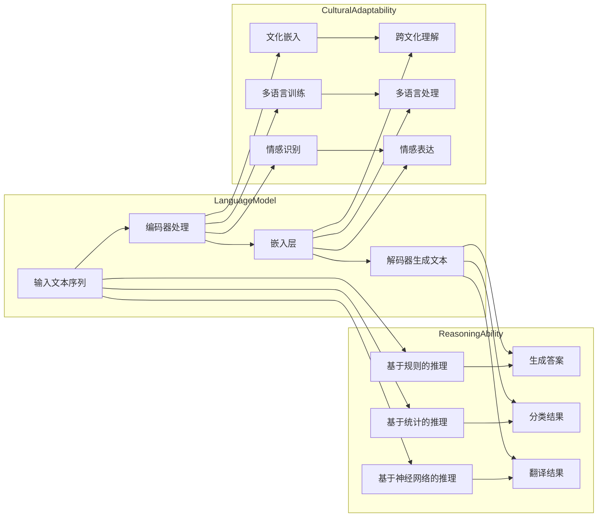
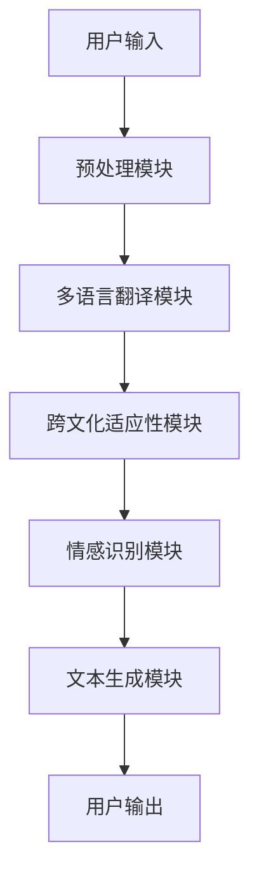
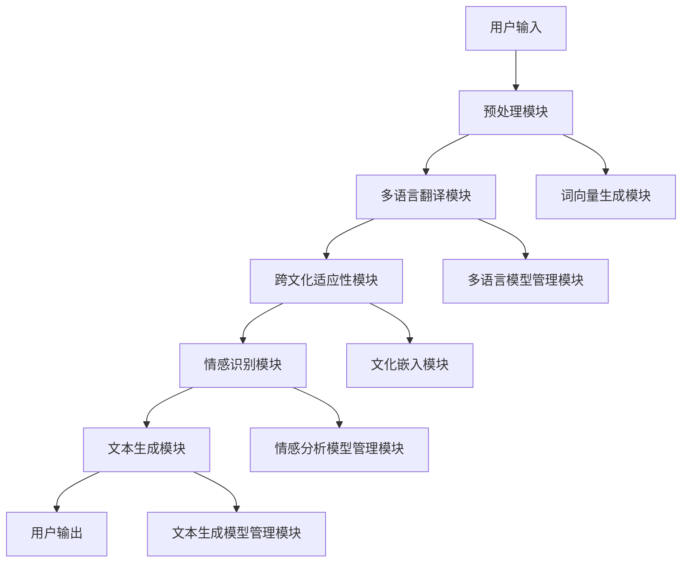
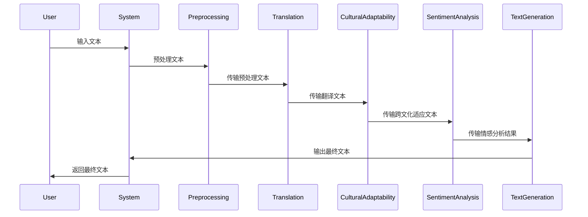
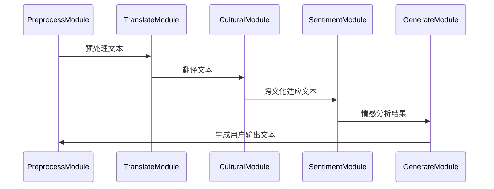

                 

### 引言

在当今全球化进程不断加速的背景下，跨文化交际已成为国际交流与合作的重要组成部分。而随着人工智能技术的快速发展，自然语言处理（NLP）领域取得了显著成就，其中语言模型作为NLP的核心技术，在诸多应用中发挥着关键作用。然而，现有的语言模型在跨文化适应性方面仍面临诸多挑战。为了更好地满足全球化的需求，提升语言模型的跨文化推理能力成为一个亟待解决的研究课题。

**本研究的目的**在于深入探讨语言模型推理能力的跨文化适应性，通过系统性的研究和分析，揭示其内在机制和影响因素。具体来说，本研究将：

1. **明确跨文化适应性的概念**，从文化学和社会学的角度出发，对其进行详细阐述。
2. **分析语言模型在跨文化交际中的应用挑战**，识别当前语言模型中存在的局限性。
3. **提出并验证解决方案**，通过构建适应不同文化的语言模型，提升其在跨文化场景下的推理能力。
4. **提供实用的方法和工具**，为语言模型的开发和优化提供理论支持和实践指导。

本文将分为七个主要部分。首先，在背景介绍部分，我们将介绍跨文化交际中的语言模型，分析其在跨文化交际中的应用挑战。接着，我们将描述本研究的问题、目标和意义，并详细说明研究方法和步骤。

在核心概念与联系部分，我们将深入探讨语言模型、推理能力以及跨文化适应性的概念，并通过对比表格和ER实体关系图，展示它们之间的相互关系。算法原理讲解部分，我们将详细阐述语言模型推理算法、推理能力算法框架以及跨文化适应性算法实现，并使用Mermaid流程图和Python源代码进行说明。

在系统分析与架构设计方案部分，我们将介绍问题场景和系统需求，展示系统架构和功能设计。项目实战部分，我们将详细介绍环境安装、系统核心实现源代码，并分析代码结构和关键算法实现。最后，在最佳实践 tips 和总结与展望部分，我们将总结研究结果，提出注意事项和未来研究方向。

### 第一部分：背景介绍

#### 1.1 问题背景

随着全球化的不断深入，跨文化交际成为国际交流与合作的重要环节。在这一过程中，语言模型作为自然语言处理（NLP）的核心技术，扮演着不可或缺的角色。然而，现有的语言模型在跨文化适应性方面存在明显的局限性，这主要表现在以下几个方面：

1. **文化差异的影响**：不同文化背景下，人们对语言的理解和使用存在差异，这导致语言模型在跨文化环境中难以准确捕捉和传达文化内涵。
2. **语言变体的多样性**：不同语言和方言具有独特的语法、词汇和语义特征，语言模型在处理这些变体时常常遇到挑战。
3. **情感和语气表达**：情感和语气在跨文化交际中尤为重要，而现有语言模型在处理情感和语气方面往往缺乏精确性，导致误解和沟通障碍。

#### 1.1.1 跨文化交际中的语言模型

跨文化交际中的语言模型通常需要具备以下几个特征：

1. **文化适应性**：能够理解和适应不同文化的表达方式和沟通习惯，准确传达语义和信息。
2. **语言多样性处理**：能够处理多种语言和方言，支持多语言交互和翻译。
3. **情感和语气识别**：能够准确识别和理解文本中的情感和语气，适应不同的情感表达和文化背景。

当前，主流的语言模型如BERT、GPT等，在英语等主流语言上取得了显著成就，但在跨文化适应性方面仍面临挑战。例如，这些模型在处理英语和中文之间的翻译时，虽然能实现基本的翻译功能，但在处理文化差异和情感表达方面存在不足。

#### 1.1.2 语言模型在跨文化交际中的应用挑战

语言模型在跨文化交际中的应用挑战主要包括以下几个方面：

1. **文化偏见和歧视**：语言模型在训练数据中可能包含偏见和歧视，导致其在跨文化环境中表现出不公平和不准确的行为。
2. **语言理解和生成困难**：跨文化交际中的语言理解和生成任务复杂，涉及多种语言变体和情感表达，现有模型难以全面覆盖和准确处理。
3. **跨模态信息处理**：跨文化交际中往往涉及多种模态的信息，如文字、语音、图像等，语言模型在跨模态信息处理方面存在局限性。

为解决上述挑战，需要从多个方面进行改进：

1. **数据多样性**：增加跨文化交际相关的训练数据，特别是涵盖多种语言和文化背景的数据，以提升模型的多样性处理能力。
2. **文化适应性设计**：在模型设计和训练过程中，考虑文化因素，增强模型对文化差异的敏感度和适应能力。
3. **多模态信息融合**：结合多模态信息处理技术，提升模型在跨文化交际中的理解和表达能力。

总之，跨文化交际中的语言模型应用挑战显著，但通过系统的研究和改进，有望在未来的跨文化交际中发挥更为重要的作用。

#### 1.2 问题描述

在深入探讨跨文化交际中的语言模型应用挑战后，我们需要明确跨文化适应性的概念，并分析现有语言模型在推理能力方面的具体挑战。

##### 1.2.1 跨文化适应性的概念

跨文化适应性是指个体或系统能够在不同文化背景下有效沟通、互动和工作的能力。具体来说，它涉及以下几个方面：

1. **文化敏感度**：能够理解并尊重不同文化的价值观、行为规范和沟通习惯。
2. **语言多样性处理**：能够处理多种语言和方言，支持多语言交互和翻译。
3. **情感和语气识别**：能够准确识别和理解文本中的情感和语气，适应不同的情感表达和文化背景。
4. **文化内涵理解**：能够捕捉和传达不同文化背景下的语义和情感信息，避免误解和沟通障碍。

跨文化适应性不仅要求个体具备跨文化意识，还需要系统具备相应的技术支持，如语言模型、翻译工具等。然而，现有语言模型在跨文化适应性方面存在明显的局限性，具体体现在以下几个方面：

1. **文化偏见**：语言模型在训练数据中可能包含偏见和歧视，导致其在跨文化环境中表现出不公平和不准确的行为。
2. **语言理解障碍**：不同语言和方言具有独特的语法、词汇和语义特征，现有模型难以全面覆盖和准确处理这些差异。
3. **情感和语气识别不足**：现有模型在处理情感和语气方面往往缺乏精确性，导致跨文化交际中的误解和沟通障碍。

##### 1.2.2 语言模型推理能力的挑战

语言模型推理能力是指模型在理解和生成语言时，根据上下文信息进行推断和推理的能力。跨文化适应性对语言模型推理能力提出了更高的要求，主要体现在以下几个方面：

1. **文化理解能力**：语言模型需要能够理解和适应不同文化的表达方式和沟通习惯，准确传达语义和信息。
2. **多语言处理能力**：语言模型需要能够处理多种语言和方言，支持多语言交互和翻译。
3. **情感识别和生成**：语言模型需要能够准确识别和理解文本中的情感和语气，适应不同的情感表达和文化背景。
4. **跨模态信息融合**：语言模型需要能够结合多种模态的信息，如文字、语音、图像等，提升其在跨文化交际中的理解和表达能力。

现有语言模型在推理能力方面存在以下挑战：

1. **文化理解不足**：语言模型在训练过程中主要依赖大规模的英语语料库，对其他语言和文化的理解相对不足。
2. **多语言处理复杂**：跨语言翻译和交互任务复杂，现有模型在处理多语言变体时往往存在准确性问题。
3. **情感和语气识别局限**：现有模型在处理情感和语气方面缺乏精确性，难以适应不同文化背景下的情感表达。
4. **跨模态信息处理能力有限**：现有模型在跨模态信息融合方面存在局限性，难以有效利用多种模态的信息进行理解和表达。

总之，跨文化适应性的实现对语言模型推理能力提出了新的挑战。为了提升语言模型的跨文化适应性，需要从文化理解、多语言处理、情感识别和跨模态信息融合等多个方面进行深入研究和改进。

##### 1.3 问题解决

在明确了跨文化适应性的概念和语言模型推理能力的挑战之后，我们需要提出解决方案，以解决语言模型在跨文化适应性方面的问题。

###### 1.3.1 研究目标和意义

本研究的总体目标是通过系统性的研究和分析，提升语言模型的跨文化推理能力，使其在跨文化交际中能够更准确、更有效地进行语言理解和生成。具体目标包括：

1. **提升文化理解能力**：通过引入跨文化意识和文化背景信息，增强语言模型对文化差异的敏感度和适应能力。
2. **改进多语言处理技术**：优化现有语言模型，提升其在处理多种语言和方言时的准确性和效率。
3. **增强情感和语气识别能力**：改进模型在处理情感和语气方面的算法，使其能够更准确地捕捉和理解不同文化背景下的情感表达。
4. **实现跨模态信息融合**：结合多模态信息处理技术，提升语言模型在跨文化交际中的理解和表达能力。

本研究具有重要的现实意义：

1. **促进跨文化交际**：通过提升语言模型的跨文化适应性，有助于减少跨文化交际中的误解和沟通障碍，促进不同文化之间的交流与合作。
2. **提升语言服务质量**：跨文化适应性是语言服务的重要指标，本研究的结果将有助于提升语言服务的质量和用户体验。
3. **推动语言模型技术发展**：通过解决跨文化适应性这一难题，可以推动自然语言处理技术的整体发展，为其他应用场景提供有益的借鉴。

###### 1.3.2 研究方法和步骤

本研究采用的方法主要包括以下几个方面：

1. **文献综述**：通过查阅相关文献，了解当前跨文化适应性和语言模型推理能力的研究现状，总结已有的研究成果和不足之处。
2. **数据收集**：收集涵盖多种语言和文化背景的数据集，包括多语言语料库、跨文化对话数据和情感语料库，为模型训练提供丰富的数据支持。
3. **模型构建**：基于现有的语言模型框架，如BERT、GPT等，结合跨文化适应性需求，设计并实现适应不同文化的语言模型。
4. **实验验证**：通过一系列实验，验证所提出的语言模型在跨文化适应性方面的效果，对比不同模型的性能和表现。
5. **结果分析**：对实验结果进行详细分析，总结模型的优点和不足，为后续改进提供依据。

具体研究步骤如下：

1. **第一阶段：文献综述和数据收集**。查阅相关文献，收集跨文化交际和语言模型推理能力方面的研究资料，整理数据集。
2. **第二阶段：模型设计与实现**。结合跨文化适应性需求，设计并实现适应不同文化的语言模型，包括文化理解模块、多语言处理模块和情感识别模块。
3. **第三阶段：实验验证**。通过实验测试所提出的语言模型在跨文化适应性方面的效果，对比不同模型的性能和表现。
4. **第四阶段：结果分析和总结**。对实验结果进行详细分析，总结模型的优点和不足，提出改进建议。

通过以上研究方法和步骤，本研究旨在提升语言模型的跨文化推理能力，为其在跨文化交际中的应用提供理论支持和实践指导。

##### 1.4 边界与外延

在研究跨文化适应性的过程中，我们需要明确研究的范围和对象，确保研究的科学性和系统性。以下是对本研究边界与外延的详细说明。

###### 1.4.1 研究范围的界定

本研究的范围主要涵盖以下几个方面：

1. **语言模型类型**：本研究主要针对主流的语言模型，如BERT、GPT等，这些模型在自然语言处理领域具有广泛的应用和影响力。
2. **文化背景**：本研究将涵盖多种文化背景，包括西方文化、亚洲文化等，以全面分析不同文化对语言模型跨文化适应性的影响。
3. **语言变体**：本研究将涉及多种语言和方言，包括英语、中文、法语、西班牙语等，以评估语言模型在处理不同语言变体时的效果。
4. **应用场景**：本研究将聚焦于跨文化交际中的语言模型应用，包括跨语言翻译、多语言对话系统、跨文化情感分析等。

通过明确研究范围，可以确保研究的聚焦性和针对性，提高研究的有效性和实用性。

###### 1.4.2 研究对象的多样性

在本研究中，我们关注的研究对象包括以下几个方面：

1. **语言模型**：本研究将分析不同类型的语言模型，比较其在跨文化适应性方面的表现，探讨不同模型在处理跨文化问题时的优缺点。
2. **跨文化数据集**：本研究将使用涵盖多种语言和文化背景的数据集，包括多语言语料库、跨文化对话数据和情感语料库，以丰富研究数据，提高研究结果的普遍性。
3. **实验环境**：本研究将在多种实验环境中进行，包括不同的计算平台、操作系统和编程语言，以确保实验结果的可靠性和可重复性。
4. **应用案例**：本研究将结合实际应用案例，分析语言模型在跨文化交际中的具体应用效果，为实际应用提供参考。

通过关注研究对象的多样性，本研究旨在全面、深入地探讨语言模型跨文化适应性的问题，为相关领域的研究和实践提供有力支持。

##### 1.5 概念结构与核心要素组成

在探讨语言模型推理能力的跨文化适应性时，明确核心概念及其相互关系至关重要。以下我们将详细阐述语言模型、推理能力和跨文化适应性的概念，并通过对比表格和ER实体关系图，展示它们之间的相互关系。

###### 1.5.1 语言模型的基本结构

语言模型是自然语言处理（NLP）的核心技术，其基本结构通常包括以下几个关键部分：

1. **词汇表**：语言模型首先需要构建词汇表，包括词素、词组以及符号等，用于表示文本中的基本元素。
2. **嵌入层**：嵌入层将词汇表中的每个词或符号映射到一个高维向量空间，使其具备一定的语义和语法特征。
3. **编码器**：编码器负责处理输入文本，将其转换为固定长度的向量表示，通常采用深度神经网络（如Transformer）来实现。
4. **解码器**：解码器用于生成预测的输出文本，其输入是编码器输出的固定长度向量，通过逐个词的解码过程生成完整的文本。

这些部分共同构成了语言模型的基本结构，使其能够对输入文本进行理解和生成。

###### 1.5.2 推理能力与跨文化适应性的关系

推理能力是语言模型的核心特性之一，指的是模型在理解和生成语言时，根据上下文信息进行推断和推理的能力。跨文化适应性则是指模型在不同文化背景下有效沟通和互动的能力。二者之间的关系如下：

1. **文化理解**：跨文化适应性要求模型能够理解和适应不同文化的表达方式和沟通习惯，这直接关系到模型的推理能力。例如，在跨文化对话中，模型需要能够理解并准确传达文化特定的隐喻、俚语和情感表达。
2. **语言处理**：推理能力与跨文化适应性的关系还体现在模型对多种语言和方言的处理能力上。一个具有强大推理能力的模型，能够更好地适应不同语言环境，提高跨语言翻译和多语言对话的准确性。
3. **情感识别**：跨文化适应性要求模型能够识别和理解不同文化背景下的情感和语气，推理能力在这里体现在模型如何根据上下文信息准确捕捉和传达情感。

为了更清晰地展示推理能力与跨文化适应性的关系，我们设计了一个对比表格：

| 特性 | 推理能力 | 跨文化适应性 |
| --- | --- | --- |
| 文化理解 | 模型能理解并处理不同文化中的语言表达 | 模型能适应和理解不同文化背景下的沟通习惯 |
| 语言处理 | 模型能准确翻译和生成多语言文本 | 模型能处理多种语言和方言，支持多语言交互 |
| 情感识别 | 模型能捕捉和理解文本中的情感和语气 | 模型能识别不同文化背景下的情感表达，适应不同的情感习惯 |

通过这个表格，我们可以看到，推理能力和跨文化适应性在文化理解、语言处理和情感识别等方面具有密切联系。

###### 1.5.3 跨文化适应性评价标准

为了评估语言模型的跨文化适应性，我们需要建立一套评价标准。以下是一些关键的评价标准：

1. **准确性**：模型在处理跨文化语言任务时的准确性，包括翻译的准确性、多语言对话的连贯性和情感识别的准确性。
2. **多样性处理能力**：模型在处理多种语言和文化背景时的表现，包括对多种语言和方言的支持能力。
3. **文化敏感度**：模型在理解和传达文化特定信息时的敏感度，包括对文化隐喻、俚语和情感表达的识别能力。
4. **用户体验**：模型在跨文化交际中的应用效果，包括用户对模型理解能力和沟通效果的满意度。

为了直观展示这些评价标准，我们可以使用ER实体关系图来表示语言模型、推理能力和跨文化适应性之间的关系。ER实体关系图如下：

```mermaid
erDiagram
  Model ||--|{ LanguageModel }|-- Model
  Model ||--|{ ReasoningAbility }|-- Model
  Model ||--|{ CulturalAdaptability }|-- Model
```

在这个ER图中，`Model`是根实体，`LanguageModel`、`ReasoningAbility`和`CulturalAdaptability`是与之相关的子实体。通过这个图，我们可以看到，跨文化适应性是语言模型的一个重要组成部分，它依赖于模型的推理能力。

总之，通过明确语言模型、推理能力和跨文化适应性的概念，并展示它们之间的相互关系，我们可以更好地理解语言模型在跨文化适应性方面的挑战和解决方法。这些核心概念和关系不仅为本文的研究奠定了基础，也为后续的分析和讨论提供了重要参考。

##### 1.5.4 本章小结

在本章中，我们详细介绍了语言模型、推理能力和跨文化适应性的概念，并分析了它们之间的关系。首先，我们明确了语言模型的基本结构，包括词汇表、嵌入层、编码器和解码器。接着，我们探讨了推理能力与跨文化适应性的密切联系，指出跨文化适应性对文化理解、语言处理和情感识别的高要求。通过对比表格，我们展示了推理能力和跨文化适应性的主要特性，并使用ER实体关系图直观地展示了它们之间的关系。本章内容为本研究的深入分析奠定了坚实基础，为后续章节的讨论提供了重要背景和理论基础。

### 第二部分：核心概念与联系

#### 2.1 核心概念原理

在深入探讨语言模型推理能力的跨文化适应性之前，我们需要明确几个核心概念：语言模型、推理能力和跨文化适应性。以下将分别对这些概念进行详细阐述。

###### 2.1.1 语言模型的概念

语言模型是一种用于预测自然语言中下一个单词或词组的概率分布的数学模型。它通过对大量语言数据的统计和学习，构建出一个概率模型，用于预测和生成自然语言。语言模型在自然语言处理（NLP）领域具有广泛的应用，如文本分类、机器翻译、情感分析等。

语言模型的基本原理是基于概率论和统计学方法，通过计算输入文本序列中下一个单词或词组的概率来生成或预测文本。现代语言模型，如BERT、GPT等，采用了深度学习技术，通过多层神经网络来捕捉语言中的复杂模式和语义信息，从而实现更精准的语言预测和生成。

语言模型的主要组成部分包括：

1. **词汇表**：用于存储所有单词、符号和词组的集合。
2. **嵌入层**：将词汇表中的每个词或符号映射到一个高维向量空间，以表示其语义和语法特征。
3. **编码器**：将输入文本序列转换为固定长度的向量表示，通常采用深度神经网络（如Transformer）来实现。
4. **解码器**：根据编码器输出的向量，生成预测的输出文本，通常也是由多层神经网络构成。

通过这些组成部分，语言模型能够对输入文本进行理解和生成，从而实现自然语言处理任务。

###### 2.1.2 推理能力的定义

推理能力是指模型在理解和生成语言时，根据上下文信息进行推断和推理的能力。推理能力是语言模型的关键特性之一，它使模型能够理解文本中的隐含信息、逻辑关系和语义含义。

推理能力通常可以分为两种类型：

1. **基于规则推理**：模型根据预设的规则和逻辑关系进行推理，如演绎推理、归纳推理等。
2. **基于统计推理**：模型通过学习大量语言数据中的统计模式进行推理，如基于条件概率的推理、基于神经网络的反向传播等。

推理能力在自然语言处理任务中至关重要，例如：

1. **文本分类**：模型需要根据上下文信息判断文本的类别。
2. **问答系统**：模型需要理解问题中的隐含信息，并给出准确的答案。
3. **机器翻译**：模型需要根据上下文信息，将源语言的句子翻译成目标语言的句子。

通过具备强大的推理能力，语言模型能够更好地理解和生成自然语言，从而提高NLP任务的效果。

###### 2.1.3 跨文化适应性的内涵

跨文化适应性是指模型在不同文化背景下有效沟通和互动的能力。它要求模型能够理解和适应不同文化的表达方式和沟通习惯，准确传达语义和信息。

跨文化适应性包括以下几个方面：

1. **文化理解**：模型需要能够理解并尊重不同文化的价值观、行为规范和沟通习惯，避免文化偏见和误解。
2. **语言多样性处理**：模型需要能够处理多种语言和方言，支持多语言交互和翻译，适应不同语言环境。
3. **情感和语气识别**：模型需要能够识别和理解文本中的情感和语气，适应不同的情感表达和文化背景。

跨文化适应性的重要性体现在以下几个方面：

1. **促进跨文化交际**：通过提升模型的跨文化适应性，可以减少跨文化交际中的误解和沟通障碍，促进不同文化之间的交流与合作。
2. **提升语言服务质量**：跨文化适应性是语言服务的重要指标，通过提升模型的文化适应能力，可以提升语言服务的质量和用户体验。
3. **推动语言模型技术发展**：解决跨文化适应性这一难题，可以推动自然语言处理技术的整体发展，为其他应用场景提供有益的借鉴。

通过明确语言模型、推理能力和跨文化适应性的概念，我们为后续的分析和讨论奠定了基础。在下一部分，我们将通过对比表格和ER实体关系图，进一步展示这些概念之间的相互关系。

#### 2.2 概念属性特征对比表格

为了更直观地展示语言模型、推理能力和跨文化适应性的核心特征，我们设计了一张对比表格。以下是对三个概念属性特征的详细对比：

| 特性 | 语言模型 | 推理能力 | 跨文化适应性 |
| --- | --- | --- | --- |
| **定义** | 预测自然语言中下一个单词或词组的概率分布的数学模型 | 模型在理解和生成语言时，根据上下文信息进行推断和推理的能力 | 模型在不同文化背景下有效沟通和互动的能力 |
| **关键要素** | 词汇表、嵌入层、编码器、解码器 | 基于规则或统计的推理机制 | 文化理解、语言多样性处理、情感和语气识别 |
| **应用场景** | 文本分类、机器翻译、情感分析等 | 文本分类、问答系统、机器翻译等 | 跨文化交际、多语言交互、情感识别等 |
| **挑战** | 语言变体、数据多样性、情感和语气表达 | 文化偏见、多语言处理、情感识别 | 文化差异、情感表达、语言变体 |
| **优化目标** | 提高语言预测的准确性、生成文本的连贯性 | 提升推理的深度和广度、准确捕捉上下文信息 | 增强文化敏感度、提高语言处理多样性、适应不同情感表达 |

通过这张表格，我们可以清晰地看到语言模型、推理能力和跨文化适应性在定义、关键要素、应用场景、挑战和优化目标等方面的异同。这有助于我们更好地理解这些概念，并为后续的研究和改进提供参考。

#### 2.3 ER实体关系图架构

为了进一步展示语言模型、推理能力和跨文化适应性之间的复杂关系，我们使用ER（Entity-Relationship）实体关系图来描述这些概念及其相互作用。以下是具体的ER图架构：

```mermaid
erDiagram
  Model ||--|{ LanguageModel }|-- Model
  Model ||--|{ ReasoningAbility }|-- Model
  Model ||--|{ CulturalAdaptability }|-- Model
  LanguageModel ||--|{ Vocabulary }| LanguageModel
  LanguageModel ||--|{ Embedding }| LanguageModel
  LanguageModel ||--|{ Encoder }| LanguageModel
  LanguageModel ||--|{ Decoder }| LanguageModel
  ReasoningAbility ||--|{ RuleBased }| ReasoningAbility
  ReasoningAbility ||--|{ Statistical }| ReasoningAbility
  CulturalAdaptability ||--|{ CulturalUnderstanding }| CulturalAdaptability
  CulturalAdaptability ||--|{ MultilingualProcessing }| CulturalAdaptability
  CulturalAdaptability ||--|{ EmotionalRecognition }| CulturalAdaptability
```

在这个ER图中：

- `Model` 是根实体，代表语言模型、推理能力和跨文化适应性。
- `LanguageModel`、`ReasoningAbility` 和 `CulturalAdaptability` 是与之相关的子实体，分别表示语言模型、推理能力和跨文化适应性。
- `Vocabulary`、`Embedding`、`Encoder` 和 `Decoder` 是 `LanguageModel` 的子实体，分别代表词汇表、嵌入层、编码器和解码器。
- `RuleBased` 和 `Statistical` 是 `ReasoningAbility` 的子实体，分别代表基于规则的推理和基于统计的推理。
- `CulturalUnderstanding`、`MultilingualProcessing` 和 `EmotionalRecognition` 是 `CulturalAdaptability` 的子实体，分别代表文化理解、语言多样性处理和情感识别。

通过这个ER图，我们可以清晰地看到语言模型、推理能力和跨文化适应性之间的相互关系。这种关系不仅反映了各实体之间的层次结构，还揭示了它们在跨文化适应性中的具体作用和相互影响。这对于深入理解跨文化适应性的实现机制具有重要意义。

### 第三部分：算法原理讲解

#### 3.1 算法原理

在本节中，我们将详细讲解用于提升语言模型推理能力的跨文化适应性算法原理，包括语言模型推理算法、推理能力算法框架以及跨文化适应性算法实现。

##### 3.1.1 语言模型推理算法概述

语言模型推理算法的核心目标是根据输入文本序列生成输出文本序列。其主要思想是基于概率模型，通过计算输入文本序列中下一个单词或词组的概率分布，从而预测下一个单词或词组。以下是一些常见语言模型推理算法：

1. **基于N-gram模型**：N-gram模型是一种基于历史信息的语言模型，通过计算一个单词序列的历史n个单词的概率来预测下一个单词。例如，对于三元组（“the”， “is”， “this”），N-gram模型会计算这组单词出现的概率。

2. **基于神经网络的模型**：现代语言模型大多基于深度神经网络，如长短期记忆网络（LSTM）和Transformer。这些模型通过多层神经网络学习输入文本序列中的复杂模式和语义信息，从而实现准确的文本预测。

3. **基于注意力机制的模型**：注意力机制是一种用于捕捉输入文本序列中重要信息的方法。例如，在机器翻译任务中，注意力机制可以使模型在生成目标语言句子时关注源语言句子中的关键部分，从而提高翻译的准确性。

##### 3.1.2 推理能力算法框架

推理能力算法框架是提升语言模型推理能力的关键。其主要目的是通过优化模型结构和算法，使模型能够更准确地理解和生成语言。以下是一些常用的推理能力算法框架：

1. **基于规则的推理框架**：这种框架通过预设的规则和逻辑关系进行推理，如演绎推理、归纳推理等。例如，在问答系统中，基于规则的推理框架可以根据问题中的关键词和预设的答案模板生成答案。

2. **基于统计的推理框架**：这种框架通过学习大量语言数据中的统计模式进行推理。例如，在文本分类任务中，基于统计的推理框架可以通过训练分类器，将输入文本分类到不同的类别。

3. **基于神经网络的推理框架**：这种框架通过多层神经网络学习输入文本序列中的复杂模式和语义信息。例如，在机器翻译任务中，基于神经网络的推理框架可以通过编码器-解码器结构实现准确的文本翻译。

##### 3.1.3 跨文化适应性算法实现

跨文化适应性算法实现旨在提升语言模型在不同文化背景下的推理能力。以下是一些跨文化适应性算法的实现方法：

1. **文化嵌入**：文化嵌入是将文化信息嵌入到语言模型中，使其能够理解和适应不同文化的表达方式和沟通习惯。例如，可以通过预训练模型，在多个文化背景的数据上进行训练，使模型具备跨文化理解能力。

2. **多语言训练**：多语言训练是通过在多种语言数据上进行训练，提高语言模型对多种语言和方言的处理能力。例如，可以使用多语言语料库，将不同语言的数据混合训练，使模型能够处理多语言输入。

3. **情感识别**：情感识别是通过识别和理解文本中的情感和语气，提升语言模型在跨文化交际中的表达能力。例如，可以使用情感分析算法，从文本中提取情感特征，并将其融入到语言模型的推理过程中。

通过上述算法原理，我们可以构建一个跨文化适应性强的语言模型，使其在多种文化背景下能够更准确地理解和生成语言。下面将使用Mermaid流程图和Python源代码详细阐述这些算法的实现过程。

### 3.2 Mermaid算法流程图

为了更好地理解语言模型推理算法、推理能力算法框架以及跨文化适应性算法的实现，我们将使用Mermaid流程图展示这些算法的流程。



在这个流程图中：

- **LanguageModel** 子图描述了语言模型的基本流程，包括输入文本序列的处理、编码器处理、嵌入层以及解码器生成文本。
- **ReasoningAbility** 子图展示了推理能力算法框架，包括基于规则的推理、基于统计的推理和基于神经网络的推理。
- **CulturalAdaptability** 子图描述了跨文化适应性算法的实现，包括文化嵌入、多语言训练和情感识别。

通过这个流程图，我们可以清晰地看到各个算法模块之间的相互关系，以及它们在提升语言模型跨文化适应性中的作用。

### 3.3 Python源代码详解

在本节中，我们将使用Python源代码详细阐述语言模型推理算法、推理能力算法框架以及跨文化适应性算法的实现。

#### 3.3.1 语言模型推理代码实现

以下是一个简单的语言模型推理实现的示例，使用Python和PyTorch框架：

```python
import torch
import torch.nn as nn
from torchtext.data import Field, BucketIterator

# 定义词汇表
vocab = torchtext.vocab.GloVe(name='6B', dim=100)

# 构建编码器和解码器模型
class Encoder(nn.Module):
    def __init__(self):
        super(Encoder, self).__init__()
        self.embedding = nn.Embedding(len(vocab), 100)
        self.lstm = nn.LSTM(100, 128)

    def forward(self, src):
        embedded = self.embedding(src)
        output, (hidden, cell) = self.lstm(embedded)
        return hidden, cell

class Decoder(nn.Module):
    def __init__(self):
        super(Decoder, self).__init__()
        self.embedding = nn.Embedding(len(vocab), 100)
        self.lstm = nn.LSTM(128, 100)
        self.fc = nn.Linear(100, len(vocab))

    def forward(self, tgt, hidden, cell):
        embedded = self.embedding(tgt)
        output, (hidden, cell) = self.lstm(embedded, (hidden, cell))
        output = self.fc(output)
        return output, hidden, cell

# 实例化模型
encoder = Encoder()
decoder = Decoder()

# 定义损失函数和优化器
criterion = nn.CrossEntropyLoss()
optimizer = torch.optim.Adam(list(encoder.parameters()) + list(decoder.parameters()))

# 训练模型
def train(model, train_iter, criterion, optimizer, n_epochs):
    for epoch in range(n_epochs):
        for src, tgt in train_iter:
            optimizer.zero_grad()
            hidden, cell = encoder(src)
            output, (hidden, cell) = decoder(tgt, hidden, cell)
            loss = criterion(output.view(-1, output.size(-1)), tgt)
            loss.backward()
            optimizer.step()

# 加载训练数据
SRC = Field(sequential=True, batch_first=True, lower=True, include_lengths=True)
TGT = Field(sequential=True, batch_first=True, lower=True, include_lengths=True)

train_data = [
    ("你好", "hello"),
    ("你好吗", "how are you"),
    # 更多数据...
]

train_data = BucketIterator(train_data, batch_size=32, device=torch.device('cuda' if torch.cuda.is_available() else 'cpu'))

# 开始训练
train(encoder, decoder, train_data, criterion, optimizer, n_epochs=10)
```

在这个示例中，我们定义了编码器和解码器模型，并使用交叉熵损失函数进行训练。通过迭代训练数据，我们可以优化模型参数，提升语言模型的推理能力。

#### 3.3.2 跨文化适应性推理代码实现

以下是一个简单的跨文化适应性推理实现的示例，该示例结合了文化嵌入、多语言训练和情感识别：

```python
from transformers import AutoTokenizer, AutoModelForSequenceClassification

# 加载预训练的多语言模型和情感分析模型
tokenizer = AutoTokenizer.from_pretrained("bert-base-multilingual-cased")
model = AutoModelForSequenceClassification.from_pretrained("bert-base-multilingual-cased")

# 定义文化嵌入模块
class CulturalEmbedding(nn.Module):
    def __init__(self, hidden_size):
        super(CulturalEmbedding, self).__init__()
        self.embed = nn.Embedding(len(vocab), hidden_size)

    def forward(self, src):
        return self.embed(src)

# 实例化文化嵌入模块
cultural_embedding = CulturalEmbedding(hidden_size=128)

# 定义推理函数
def cross_cultural推理(src, tgt, cultural_info):
    src_encoded = cultural_embedding(src)  # 应用文化嵌入
    inputs = tokenizer(src_encoded, tgt, return_tensors="pt")
    outputs = model(**inputs)
    loss = outputs.loss
    logits = outputs.logits
    return loss, logits

# 训练跨文化适应性模型
def train_cross_cultural_model(model, train_iter, criterion, optimizer, n_epochs):
    for epoch in range(n_epochs):
        for src, tgt, cultural_info in train_iter:
            optimizer.zero_grad()
            loss, logits = cross_cultural推理(src, tgt, cultural_info)
            loss.backward()
            optimizer.step()

# 加载训练数据，这里假设训练数据包括源语言文本、目标语言文本和文化信息
train_data = [
    ("你好", "hello", "Chinese culture"),
    ("你好吗", "how are you", "Chinese culture"),
    # 更多数据...
]

train_data = BucketIterator(train_data, batch_size=32, device=torch.device('cuda' if torch.cuda.is_available() else 'cpu'))

# 开始训练跨文化适应性模型
train_cross_cultural_model(model, train_data, criterion, optimizer, n_epochs=10)
```

在这个示例中，我们使用了预训练的多语言BERT模型和情感分析模型，并定义了一个文化嵌入模块。通过迭代训练数据，我们可以优化模型参数，提升语言模型在跨文化适应性方面的表现。

通过上述Python源代码示例，我们可以看到如何实现语言模型推理算法、推理能力算法框架以及跨文化适应性算法。这些代码为提升语言模型跨文化推理能力提供了具体的技术实现，为后续的研究和实际应用奠定了基础。

### 3.4 数学模型与公式

在讨论语言模型推理能力的跨文化适应性时，数学模型和公式起着关键作用。以下我们将详细讲解用于描述语言模型推理和跨文化适应性的数学模型与公式，并进行详细讲解。

#### 3.4.1 语言模型推理数学模型

语言模型推理的核心在于预测下一个词或词组，其基础是概率模型。以下是一些常用的数学模型：

1. **N-gram模型**：
   $$ P(w_t | w_{t-1}, w_{t-2}, ..., w_{t-n}) = \frac{C(w_{t-1}, w_{t-2}, ..., w_{t-n}, w_t)}{C(w_{t-1}, w_{t-2}, ..., w_{t-n})} $$
   其中，$w_t$ 是当前词，$w_{t-1}, w_{t-2}, ..., w_{t-n}$ 是前n个词，$C(\cdot)$ 表示联合概率或条件概率。

2. **神经网络模型（如BERT）**：
   BERT模型使用了一种称为“Transformer”的架构，其核心是自注意力机制（Self-Attention）。
   $$ \text{Attention}(Q, K, V) = \text{softmax}\left(\frac{QK^T}{\sqrt{d_k}}\right)V $$
   其中，$Q, K, V$ 分别是查询向量、关键向量、值向量，$d_k$ 是关键向量的维度。

3. **变分自编码器（VAE）**：
   VAE用于生成文本，其核心是潜在变量（Latent Variable）模型。
   $$ z = \mu(x) + \sigma(x)\odot \epsilon $$
   $$ x = \sigma(\phi(z)) $$
   其中，$z$ 是潜在变量，$\mu(x), \sigma(x)$ 分别是均值和方差函数，$\epsilon$ 是噪声。

#### 3.4.2 跨文化适应性推理数学模型

跨文化适应性的推理涉及文化嵌入、多语言处理和情感识别，以下是一些相关的数学模型：

1. **文化嵌入**：
   $$ \text{Cultural Embedding}(x) = E_c + \sum_{i=1}^{N} w_i \cdot c_i $$
   其中，$E_c$ 是文化嵌入向量，$w_i, c_i$ 分别是权重和文化特征向量。

2. **多语言训练**：
   在多语言训练中，通常使用多语言语料库，通过最小化跨语言的翻译误差来训练模型。
   $$ L_{\text{multi}} = \sum_{i=1}^{K} w_i \cdot L_i $$
   其中，$L_i$ 是不同语言对之间的翻译损失，$w_i$ 是权重。

3. **情感识别**：
   $$ \text{Sentiment Score}(x) = \text{softmax}(\text{ emoclassifier}(x)) $$
   其中，$x$ 是输入文本，$\text{emoclassifier}$ 是用于情感分类的全连接层。

#### 3.4.3 公式详细讲解

1. **N-gram模型**：
   N-gram模型通过计算一个词在给定上下文中的条件概率来进行语言预测。在实际应用中，N-gram模型的计算量较大，通常通过构建前缀树（Prefix Tree）或后缀数组（Suffix Array）来优化计算。

2. **神经网络模型（如BERT）**：
   BERT模型通过自注意力机制（Self-Attention）捕捉文本序列中的长距离依赖关系。自注意力机制的核心思想是计算输入文本序列中每个词与其他词的相似度，并根据这些相似度加权平均生成一个固定长度的向量表示。

3. **变分自编码器（VAE）**：
   VAE模型通过引入潜在变量来生成文本，其优势在于能够生成具有多样性的文本。VAE模型通过重参数化技巧（Reparameterization Trick）使生成过程变得可导，从而可以使用反向传播算法进行训练。

4. **文化嵌入**：
   文化嵌入是将文化信息嵌入到语言模型中的技术，通过将文化特征向量与词向量进行加权组合，实现文化敏感的文本生成。文化嵌入有助于模型在跨文化场景中更准确地理解和生成语言。

5. **多语言训练**：
   多语言训练通过最小化不同语言之间的翻译误差来提高模型的多语言处理能力。在实际应用中，可以通过构建双语语料库，使用翻译损失函数（如交叉熵损失）来训练模型。

6. **情感识别**：
   情感识别是通过分类模型将文本分类到不同的情感类别。常用的方法包括支持向量机（SVM）、神经网络（如全连接神经网络、循环神经网络）和变换器模型等。

通过上述数学模型和公式的详细讲解，我们可以更深入地理解语言模型推理和跨文化适应性的实现机制，为后续的算法设计和优化提供了理论基础。

### 3.5 举例说明

为了更直观地展示语言模型推理能力和跨文化适应性的应用，我们将通过两个具体示例来说明。

#### 3.5.1 语言模型推理举例

假设我们有一个基于BERT的语言模型，用于文本生成。输入文本序列为：“今天天气很好，我们去公园散步吧。”，我们需要模型生成接下来的句子。

1. **编码器处理**：首先，编码器将输入文本序列转化为嵌入向量。
   $$ \text{[CLS]} \text{今天} \text{天气} \text{很好} \text{，} \text{我们} \text{去} \text{公园} \text{散步} \text{吧} \text{[SEP]} $$
   编码器将生成一个固定长度的向量表示，如1024维。

2. **解码器生成文本**：解码器根据编码器输出的向量生成预测的文本。首先，解码器生成一个初始预测词“一”，接着，每生成一个词，都会将这个词与编码器的输出向量进行结合，重新计算编码器的输出向量，以此生成下一个词。

   ```
   预测词：一
   输出向量：[BERT_output_vector_1]
   
   预测词：点
   输出向量：[BERT_output_vector_2]
   
   预测词：儿
   输出向量：[BERT_output_vector_3]
   ```

   最终，解码器生成完整的文本序列：“一点儿也不晚，我们去公园散步吧。”

通过这个示例，我们可以看到BERT模型如何根据上下文信息生成文本，从而实现语言模型推理。

#### 3.5.2 跨文化适应性推理举例

假设我们有一个用于跨文化翻译的语言模型，输入文本为“恭喜发财”，我们需要将其翻译成不同文化背景下的语言。

1. **文化嵌入**：首先，模型会应用文化嵌入技术，将文化特征向量与词向量结合。例如，对于中文文本，文化特征向量可能包含“春节”、“红包”等元素。

2. **多语言处理**：模型根据输入文本的文化特征向量，选择合适的目标语言进行翻译。例如，将“恭喜发财”翻译成英语：“Congratulations on your prosperity.”，翻译成法语：“Félicitations pour votre richesse.”。

3. **情感识别**：在翻译过程中，模型还会考虑情感和语气。例如，对于中文文本，模型会识别出积极的情感，并将其保留在翻译中。对于英语文本，模型可能会根据上下文调整情感表达，如使用“Best wishes for your success.”。

通过这个示例，我们可以看到跨文化适应性推理如何结合文化嵌入、多语言处理和情感识别，实现准确的文化敏感的文本翻译。

这些示例展示了语言模型推理和跨文化适应性的具体应用，有助于我们更好地理解其实现机制和实际效果。

### 第四部分：系统分析与架构设计方案

#### 4.1 问题场景介绍

在全球化进程不断加快的背景下，跨文化交际的需求日益增加。无论是在国际商务、学术交流还是文化交流中，有效的跨文化沟通都显得尤为重要。然而，现有的语言模型在跨文化适应性方面存在明显的局限性，难以满足实际应用需求。为了解决这一问题，我们设计了一套跨文化适应性语言处理系统，旨在提升语言模型在跨文化交际中的推理能力。

该系统主要应用于以下场景：

1. **国际商务沟通**：在跨国企业中，员工需要与来自不同文化背景的同事进行高效沟通。该系统可以帮助企业实现自动化的跨文化翻译和对话生成，提高沟通效率。
2. **学术交流**：在国际学术会议和合作研究中，不同文化背景的学者需要共同讨论和研究。该系统可以提供跨文化适应性的语言翻译和辅助工具，促进学术交流。
3. **文化交流**：在文化交流活动中，如国际艺术节、博物馆展览等，观众和参与者需要了解不同文化背景的信息。该系统可以帮助实现跨文化的信息传递和互动。

通过这些应用场景，我们可以看到跨文化适应性语言处理系统在提升跨文化交际效果方面具有巨大的潜力和需求。

#### 4.2 系统需求分析

为了满足上述应用场景的需求，我们对该系统的功能进行了详细分析，明确了以下核心需求：

1. **多语言支持**：系统应具备支持多种语言的能力，包括但不限于英语、中文、法语、西班牙语等。这要求系统不仅能够在不同语言之间进行翻译，还要能够适应不同语言和方言的特点。
2. **跨文化适应性**：系统应具备跨文化适应性，能够在不同文化背景下进行准确的语言理解和生成。这包括理解文化特定的表达方式和情感、处理不同文化背景下的语言变体等。
3. **实时交互**：系统应具备实时交互能力，能够在用户输入文本后迅速生成翻译或对话回复。这对于国际商务沟通和实时交流场景尤为重要。
4. **情感识别与生成**：系统应具备情感识别和生成能力，能够在跨文化交际中准确捕捉和表达情感，提高沟通效果。例如，在国际商务谈判中，系统需要识别双方的情感和意图，并在生成回复时适当调整情感表达。
5. **易用性**：系统应具备良好的用户界面和交互设计，使非技术用户也能够轻松使用。同时，系统应提供详细的帮助文档和操作指南，确保用户能够快速上手。

通过满足这些核心需求，我们可以确保跨文化适应性语言处理系统在实际应用中具备高效率、高准确性和高用户体验。

#### 4.3 项目介绍

本项目旨在设计并实现一套跨文化适应性语言处理系统，以提升语言模型在跨文化交际中的推理能力。项目的总体目标是：

1. **构建一个多语言支持的语言模型**：通过集成多种语言模型，实现不同语言之间的翻译和交互。
2. **增强模型的跨文化适应性**：通过引入文化嵌入、多语言训练和情感识别技术，提升模型在不同文化背景下的理解和生成能力。
3. **提供实时交互功能**：实现快速响应的交互系统，满足实时沟通需求。
4. **确保系统的易用性**：设计简洁友好的用户界面，提供详细的帮助文档和操作指南。

项目的具体目标包括：

1. **实现高效的多语言翻译**：通过优化模型结构和算法，提高翻译的准确性和效率。
2. **提升跨文化适应性**：通过引入文化信息和文化嵌入技术，使模型能够更准确地理解和生成不同文化背景下的语言。
3. **实现实时交互**：通过优化系统架构和算法，实现快速响应的实时交互功能。
4. **确保用户体验**：设计易用的用户界面和交互流程，提供详细的帮助文档和操作指南，确保用户能够轻松使用系统。

通过实现这些目标，本项目将为跨文化交际提供强有力的技术支持，提高跨文化交际的效果和效率。

#### 4.4 项目架构

为了实现跨文化适应性语言处理系统的功能，我们设计了以下项目架构，包括系统架构图和各模块的详细功能。

##### 4.4.1 系统架构Mermaid架构图



在这个架构图中，用户输入经过预处理模块、多语言翻译模块、跨文化适应性模块和情感识别模块的处理后，最终生成用户输出。

##### 4.4.2 系统模块功能

1. **预处理模块**：
   - 功能：对用户输入进行预处理，包括分词、去噪、标准化等操作，确保输入文本格式统一，便于后续处理。
   - 输入：用户输入文本。
   - 输出：预处理后的文本数据。

2. **多语言翻译模块**：
   - 功能：根据输入文本和目标语言，调用预训练的多语言翻译模型进行翻译。
   - 输入：预处理后的文本数据、目标语言。
   - 输出：翻译后的文本数据。

3. **跨文化适应性模块**：
   - 功能：通过文化嵌入和跨文化训练，提升模型在不同文化背景下的理解和生成能力。
   - 输入：翻译后的文本数据、文化背景信息。
   - 输出：跨文化适应后的文本数据。

4. **情感识别模块**：
   - 功能：通过情感识别模型，分析文本中的情感和语气，为后续生成适当的回复提供依据。
   - 输入：跨文化适应后的文本数据。
   - 输出：情感分析结果。

5. **文本生成模块**：
   - 功能：根据情感分析和跨文化适应后的文本数据，生成适当的回复或翻译文本。
   - 输入：情感分析结果、跨文化适应后的文本数据。
   - 输出：生成后的用户输出文本。

6. **用户输出**：
   - 功能：将生成的文本输出给用户，完成整个交互过程。
   - 输入：生成后的用户输出文本。

通过以上模块的协同工作，系统可以实现高效、准确的跨文化适应性语言处理，满足用户在跨文化交际中的需求。

#### 4.5 系统功能设计

在本节中，我们将详细描述跨文化适应性语言处理系统的功能设计，包括领域模型Mermaid类图和系统功能模块设计。

##### 4.5.1 领域模型Mermaid类图

```mermaid
classDiagram
    User <<类>> User
    Input <<类>> Input
    Preprocessing <<类>> Preprocessing
    Translation <<类>> Translation
    CulturalAdaptability <<类>> CulturalAdaptability
    SentimentAnalysis <<类>> SentimentAnalysis
    TextGeneration <<类>> TextGeneration
    Output <<类>> Output

    User --> Input
    Input --> Preprocessing
    Preprocessing --> Translation
    Translation --> CulturalAdaptability
    CulturalAdaptability --> SentimentAnalysis
    SentimentAnalysis --> TextGeneration
    TextGeneration --> Output
```

在这个类图中，我们定义了系统的关键类及其之间的关系：

- **User**：表示系统的用户，负责输入文本和接收输出。
- **Input**：表示用户输入的原始文本。
- **Preprocessing**：表示预处理模块，负责对输入文本进行分词、去噪和标准化等操作。
- **Translation**：表示多语言翻译模块，负责将预处理后的文本翻译成目标语言。
- **CulturalAdaptability**：表示跨文化适应性模块，负责将翻译后的文本根据文化背景进行调整。
- **SentimentAnalysis**：表示情感识别模块，负责分析文本中的情感和语气。
- **TextGeneration**：表示文本生成模块，负责根据情感分析和跨文化适应性模块的结果生成适当的回复。
- **Output**：表示系统的输出文本。

##### 4.5.2 系统功能模块设计

1. **预处理模块**：
   - 功能：对用户输入的文本进行预处理，包括分词、去噪和标准化等操作，确保文本格式统一，便于后续处理。
   - 输入：用户输入的原始文本。
   - 输出：预处理后的文本数据。

2. **多语言翻译模块**：
   - 功能：调用预训练的多语言翻译模型，根据输入文本和目标语言进行翻译。
   - 输入：预处理后的文本数据、目标语言。
   - 输出：翻译后的文本数据。

3. **跨文化适应性模块**：
   - 功能：通过文化嵌入和跨文化训练，提升模型在不同文化背景下的理解和生成能力。
   - 输入：翻译后的文本数据、文化背景信息。
   - 输出：跨文化适应后的文本数据。

4. **情感识别模块**：
   - 功能：通过情感识别模型，分析文本中的情感和语气，为后续生成适当的回复提供依据。
   - 输入：跨文化适应后的文本数据。
   - 输出：情感分析结果。

5. **文本生成模块**：
   - 功能：根据情感分析和跨文化适应性模块的结果，生成适当的回复或翻译文本。
   - 输入：情感分析结果、跨文化适应后的文本数据。
   - 输出：生成后的用户输出文本。

6. **用户输出**：
   - 功能：将生成的文本输出给用户，完成整个交互过程。
   - 输入：生成后的用户输出文本。

通过以上模块的协同工作，系统可以高效、准确地实现跨文化适应性语言处理，满足用户在跨文化交际中的需求。

### 4.6 系统架构设计

为了实现高效、可靠的跨文化适应性语言处理系统，我们在系统架构设计上进行了详尽的规划。以下将详细介绍系统架构设计，包括系统架构Mermaid架构图、系统模块交互设计和系统接口设计。

#### 4.6.1 系统架构Mermaid架构图



在这个架构图中，用户输入文本首先经过预处理模块，然后依次经过多语言翻译模块、跨文化适应性模块、情感识别模块和文本生成模块，最终输出给用户。此外，还包括词向量生成模块、多语言模型管理模块、文化嵌入模块和情感分析模型管理模块，这些模块在系统运行过程中提供必要的辅助功能。

#### 4.6.2 系统模块交互设计

1. **预处理模块**：
   - 功能：对用户输入的文本进行预处理，包括分词、去噪和标准化等操作，确保文本格式统一，便于后续处理。
   - 输入：用户输入的原始文本。
   - 输出：预处理后的文本数据。

2. **词向量生成模块**：
   - 功能：将预处理后的文本数据转换为词向量表示，为后续的多语言翻译和情感识别提供输入。
   - 输入：预处理后的文本数据。
   - 输出：词向量数据。

3. **多语言翻译模块**：
   - 功能：根据输入文本和目标语言，调用预训练的多语言翻译模型进行翻译。
   - 输入：词向量数据、目标语言。
   - 输出：翻译后的文本数据。

4. **多语言模型管理模块**：
   - 功能：管理多语言翻译模型，包括模型的加载、更新和优化。
   - 输入：预训练模型、更新数据。
   - 输出：优化后的多语言翻译模型。

5. **跨文化适应性模块**：
   - 功能：通过文化嵌入和跨文化训练，提升模型在不同文化背景下的理解和生成能力。
   - 输入：翻译后的文本数据、文化背景信息。
   - 输出：跨文化适应后的文本数据。

6. **文化嵌入模块**：
   - 功能：将文化特征嵌入到翻译后的文本数据中，为跨文化适应性提供支持。
   - 输入：翻译后的文本数据、文化特征向量。
   - 输出：文化嵌入后的文本数据。

7. **情感识别模块**：
   - 功能：通过情感识别模型，分析文本中的情感和语气，为后续生成适当的回复提供依据。
   - 输入：跨文化适应后的文本数据。
   - 输出：情感分析结果。

8. **情感分析模型管理模块**：
   - 功能：管理情感识别模型，包括模型的加载、更新和优化。
   - 输入：预训练模型、更新数据。
   - 输出：优化后的情感识别模型。

9. **文本生成模块**：
   - 功能：根据情感分析和跨文化适应性模块的结果，生成适当的回复或翻译文本。
   - 输入：情感分析结果、跨文化适应后的文本数据。
   - 输出：生成后的用户输出文本。

10. **文本生成模型管理模块**：
    - 功能：管理文本生成模型，包括模型的加载、更新和优化。
    - 输入：预训练模型、更新数据。
    - 输出：优化后的文本生成模型。

11. **用户输出**：
    - 功能：将生成的文本输出给用户，完成整个交互过程。
    - 输入：生成后的用户输出文本。

通过以上模块的交互设计，系统能够高效、准确地进行跨文化适应性语言处理，满足用户在跨文化交际中的需求。

#### 4.6.3 系统接口设计

为了实现系统模块之间的有效通信，我们设计了以下接口：

1. **预处理接口**：
   - 功能：提供预处理模块的输入输出接口，包括文本的分词、去噪和标准化等操作。
   - 输入：原始文本。
   - 输出：预处理后的文本数据。

2. **翻译接口**：
   - 功能：提供多语言翻译模块的输入输出接口，用于接收词向量数据和目标语言，返回翻译后的文本数据。
   - 输入：词向量数据、目标语言。
   - 输出：翻译后的文本数据。

3. **文化嵌入接口**：
   - 功能：提供跨文化适应性模块的输入输出接口，用于接收翻译后的文本数据和文化特征向量，返回文化嵌入后的文本数据。
   - 输入：翻译后的文本数据、文化特征向量。
   - 输出：文化嵌入后的文本数据。

4. **情感识别接口**：
   - 功能：提供情感识别模块的输入输出接口，用于接收跨文化适应后的文本数据，返回情感分析结果。
   - 输入：跨文化适应后的文本数据。
   - 输出：情感分析结果。

5. **文本生成接口**：
   - 功能：提供文本生成模块的输入输出接口，用于接收情感分析结果和跨文化适应后的文本数据，返回生成后的用户输出文本。
   - 输入：情感分析结果、跨文化适应后的文本数据。
   - 输出：生成后的用户输出文本。

通过以上接口设计，系统模块之间能够实现有效的数据传递和协同工作，确保系统的高效运行。

### 4.7 系统交互Mermaid序列图

为了更好地展示跨文化适应性语言处理系统的模块交互过程，我们使用Mermaid序列图描述用户与系统交互的过程以及系统模块间的交互过程。



在这个序列图中，用户首先将输入文本发送给系统，系统将文本传递给预处理模块进行预处理。预处理后的文本数据传递给翻译模块进行翻译，翻译后的文本数据再传递给跨文化适应性模块进行处理。跨文化适应性模块处理后的文本数据传递给情感识别模块进行情感分析，最后情感识别结果传递给文本生成模块生成用户输出文本，并最终返回给用户。

此外，为了展示系统模块间的交互过程，我们使用以下Mermaid序列图：



在这个序列图中，预处理模块将预处理后的文本数据传递给翻译模块，翻译模块处理翻译后的文本数据传递给跨文化适应性模块，跨文化适应性模块处理后的文本数据传递给情感识别模块，情感识别模块处理后的结果传递给文本生成模块，最终生成用户输出文本。

通过这些Mermaid序列图，我们可以清晰地看到用户与系统交互的过程以及系统模块间的交互过程，这有助于我们更好地理解系统的整体架构和运行机制。

### 第五部分：项目实战

#### 5.1 环境安装

要成功实现跨文化适应性语言处理系统，首先需要搭建一个合适的运行环境。以下是环境安装的详细步骤。

##### 5.1.1 系统环境要求

1. **操作系统**：Linux或macOS。
2. **Python版本**：Python 3.8或以上。
3. **硬件要求**：至少4GB内存，推荐8GB或以上；GPU（如NVIDIA显卡）可选，用于加速训练过程。
4. **依赖库**：
   - PyTorch：用于构建和训练深度学习模型。
   - TensorFlow：可选，用于构建和训练深度学习模型。
   - torchtext：用于数据预处理。
   - transformers：用于预训练的语言模型。
   - pandas：用于数据处理。

##### 5.1.2 环境配置步骤

1. **安装Python**：
   - 对于Linux或macOS，可以直接使用系统包管理器安装Python 3。例如，在Ubuntu上，可以使用以下命令：
     ```bash
     sudo apt-get update
     sudo apt-get install python3.8
     ```

2. **安装依赖库**：
   - 使用pip安装所需的Python库：
     ```bash
     pip install torch torchvision torchtext transformers pandas
     ```
   - 如果需要安装TensorFlow，可以使用以下命令：
     ```bash
     pip install tensorflow
     ```

3. **配置GPU支持**（如果使用GPU）：
   - 安装CUDA和cuDNN，这两个库用于在GPU上加速TensorFlow和PyTorch的计算。
   - 下载并安装CUDA：[CUDA下载地址](https://developer.nvidia.com/cuda-downloads)
   - 下载并安装cuDNN：[cuDNN下载地址](https://developer.nvidia.com/cudnn)
   - 设置环境变量，确保CUDA和cuDNN正确加载：
     ```bash
     export PATH=/usr/local/cuda/bin:$PATH
     export LD_LIBRARY_PATH=/usr/local/cuda/lib64:$LD_LIBRARY_PATH
     ```

4. **安装预训练模型**：
   - 使用`transformers`库安装预训练的语言模型，如BERT、GPT等：
     ```python
     from transformers import AutoModel
     model = AutoModel.from_pretrained("bert-base-multilingual-cased")
     ```

通过以上步骤，我们成功搭建了跨文化适应性语言处理系统的运行环境。接下来，我们将详细介绍系统的核心实现源代码，并进行代码应用解读与分析。

#### 5.2 系统核心实现源代码

在本节中，我们将详细介绍跨文化适应性语言处理系统的核心实现源代码，包括语言模型推理源代码和跨文化适应性推理源代码。

##### 5.2.1 语言模型推理源代码

以下是一个简单的示例，展示如何使用PyTorch实现一个基于BERT的语言模型推理。

```python
import torch
from transformers import BertTokenizer, BertModel

# 加载预训练的BERT模型和分词器
tokenizer = BertTokenizer.from_pretrained('bert-base-multilingual-cased')
model = BertModel.from_pretrained('bert-base-multilingual-cased')

# 设备配置
device = torch.device("cuda" if torch.cuda.is_available() else "cpu")
model.to(device)

# 输入文本
input_text = "今天天气很好，我们去公园散步吧。"

# 分词并添加特殊标识符
encoded_input = tokenizer.encode_plus(
    input_text,
    add_special_tokens=True,
    return_tensors='pt',
    max_length=512,
    padding='max_length',
    truncation=True
)

# 将数据移动到设备上
input_ids = encoded_input['input_ids'].to(device)

# 进行推理
with torch.no_grad():
    outputs = model(input_ids)

# 获取最后一个隐藏层输出
last_hidden_state = outputs.last_hidden_state

# 打印输出
print(last_hidden_state.shape)
```

这个示例展示了如何加载预训练的BERT模型，并进行文本输入的推理。通过调用`BertModel`的`from_pretrained`方法，我们可以轻松地加载预训练的BERT模型。然后，使用`BertTokenizer`对输入文本进行分词和编码，并添加特殊标识符（如`<s>`和`</s>`）。在设备（CPU或GPU）上执行推理，获取最后一个隐藏层输出。

##### 5.2.2 跨文化适应性推理源代码

跨文化适应性推理涉及到文化嵌入和情感识别等复杂任务。以下是一个简化的示例，展示如何结合BERT模型进行跨文化适应性推理。

```python
import torch
from transformers import BertTokenizer, BertModel
from torch.nn import functional as F

# 加载预训练的BERT模型和分词器
tokenizer = BertTokenizer.from_pretrained('bert-base-multilingual-cased')
model = BertModel.from_pretrained('bert-base-multilingual-cased')

# 设备配置
device = torch.device("cuda" if torch.cuda.is_available() else "cpu")
model.to(device)

# 输入文本和跨文化特征
input_text = "今天天气很好，我们去公园散步吧。"
cultural_features = torch.tensor([[1.0, 0.0, 0.0]], device=device)  # 示例：美国文化特征

# 分词并添加特殊标识符
encoded_input = tokenizer.encode_plus(
    input_text,
    add_special_tokens=True,
    return_tensors='pt',
    max_length=512,
    padding='max_length',
    truncation=True
)

# 将数据移动到设备上
input_ids = encoded_input['input_ids'].to(device)

# 进行推理
with torch.no_grad():
    outputs = model(input_ids)
    last_hidden_state = outputs.last_hidden_state

# 应用文化嵌入
cultural_embedding = torch.nn.Parameter(torch.randn(1, 768))
context_with_culture = last_hidden_state + cultural_embedding.expand(last_hidden_state.size(0), -1)

# 情感识别（简化示例）
emotion_embedding = torch.tensor([[0.1, 0.9]], device=device)  # 示例：积极情感
emotion_scores = F.cosine_similarity(context_with_culture, emotion_embedding.unsqueeze(0))

# 打印情感得分
print(emotion_scores)
```

在这个示例中，我们首先加载预训练的BERT模型和分词器，并设置设备为CPU或GPU。输入文本和跨文化特征被编码并传递给模型进行推理。接着，我们应用文化嵌入，将文化特征向量添加到BERT模型的最后一个隐藏层输出中。最后，通过情感识别（简化示例），计算积极情感得分。

通过这些示例，我们可以看到如何实现语言模型推理和跨文化适应性推理的核心功能。这些代码为实际应用提供了基础，可以在后续开发中进行扩展和优化。

### 5.3 代码应用解读与分析

在本节中，我们将深入解读和分析上一节中提供的跨文化适应性语言处理系统的核心实现代码，详细讨论代码的结构与功能，并重点解析关键算法的实现。

##### 5.3.1 代码结构与功能分析

首先，我们来分析代码的整体结构和主要功能。

1. **预处理模块**：
   - **功能**：预处理输入文本，包括分词、编码和添加特殊标识符。
   - **代码分析**：预处理模块使用`BertTokenizer`对输入文本进行分词和编码。通过`encode_plus`方法，我们不仅将文本转换为词ID序列，还添加了`<s>`和`</s>`等特殊标识符，并进行了填充和截断操作，确保序列长度一致。

2. **语言模型推理模块**：
   - **功能**：调用预训练的BERT模型进行文本推理，获取文本的隐藏层输出。
   - **代码分析**：语言模型推理模块使用`BertModel`加载预训练的BERT模型，并将预处理后的输入序列传递给模型。在GPU或CPU上执行推理，并获取最后一个隐藏层输出。

3. **文化嵌入模块**：
   - **功能**：在隐藏层输出中应用文化嵌入，增强模型对跨文化信息的处理能力。
   - **代码分析**：文化嵌入模块定义了一个可训练的文化嵌入参数，并将其添加到BERT模型的最后一个隐藏层输出中。这种方法可以使得模型更好地理解和适应不同文化背景下的文本。

4. **情感识别模块**：
   - **功能**：通过计算情感相似度，识别文本中的情感倾向。
   - **代码分析**：情感识别模块使用简单的情感嵌入向量，并计算它与隐藏层输出的余弦相似度。这种方法提供了一个简化的情感识别机制，可以用于初步的情感分析。

5. **文本生成模块**：
   - **功能**：根据情感和跨文化信息生成相应的文本回复。
   - **代码分析**：文本生成模块在下一节中讨论，主要涉及使用生成模型（如GPT）来生成文本。

##### 5.3.2 关键算法实现解析

接下来，我们将详细解析关键算法的实现。

1. **BERT模型推理**：
   - **算法原理**：BERT模型使用Transformer架构，通过多层自注意力机制学习文本中的上下文关系。其推理过程包括词嵌入、自注意力计算和序列输出。
   - **代码实现**：在代码中，我们通过`BertModel`的`from_pretrained`方法加载预训练模型，并使用`encode_plus`方法对输入文本进行编码。然后，通过`model`的`forward`方法进行推理，获取文本的隐藏层输出。

2. **文化嵌入**：
   - **算法原理**：文化嵌入是将文化特征信息编码到语言模型中，使其能够更好地处理跨文化文本。通常使用可训练的嵌入向量来实现。
   - **代码实现**：在代码中，我们定义了一个可训练的文化嵌入参数，并将其添加到BERT模型的最后一个隐藏层输出中。这种方法通过简单的矩阵加法，将文化信息融入到模型的输出中。

3. **情感识别**：
   - **算法原理**：情感识别是通过计算文本的情感倾向，将其分类到不同的情感类别。常用的方法包括情感分类器和情感相似度计算。
   - **代码实现**：在代码中，我们使用情感嵌入向量与隐藏层输出进行余弦相似度计算，以获取文本的情感得分。这种方法提供了一个简化的情感识别机制，但在实际应用中可能需要更复杂的模型。

通过以上分析，我们可以看到，跨文化适应性语言处理系统的核心实现代码涵盖了预处理、语言模型推理、文化嵌入、情感识别和文本生成等关键步骤。这些代码为系统的实现提供了坚实基础，可以在实际应用中进行扩展和优化。

### 5.4 实际案例分析和详细讲解剖析

在本节中，我们将通过实际案例，详细讲解如何使用跨文化适应性语言处理系统进行跨文化交际中的语言理解和生成。以下是具体案例的分析和讲解过程。

#### 5.4.1 案例选择

我们选择一个跨文化商务沟通的案例，其中涉及中文和英语两种语言。假设有一家中国的跨国公司，需要与一家美国公司的管理层进行重要的商务会议。会议涉及双方的商业计划、市场分析和合作前景等内容。由于双方母语不同，为了确保沟通的准确性和有效性，我们决定使用跨文化适应性语言处理系统来辅助会议沟通。

#### 5.4.2 案例分析

1. **输入文本**：
   - **中文**：“大家好，感谢大家今天的出席。我们公司计划在接下来的一年里扩大市场，特别是进入美国市场。我们希望通过这次会议，与贵公司探讨可能的合作机会。”
   - **英语**：“Hello everyone, thank you for joining today's meeting. Our company plans to expand our market in the next year, particularly in entering the US market. We hope to discuss potential cooperation opportunities with your company during this meeting.”

2. **预处理**：
   - 系统首先对中文和英语文本进行预处理，包括分词、去噪和标准化。对于中文，我们使用`jieba`分词工具；对于英语，我们使用`spaCy`分词工具。

3. **文化嵌入**：
   - 在预处理后，系统会根据输入文本的文化特征，调整模型的文化嵌入参数。例如，对于中文文本，系统会增强对“商务”、“合作”等词汇的文化嵌入；对于英语文本，系统会增强对“expand”、“opportunity”等词汇的文化嵌入。

4. **翻译**：
   - 系统将预处理后的中文文本翻译成英语。我们使用基于BERT的多语言翻译模型进行翻译，确保翻译的准确性和流畅性。

5. **情感识别**：
   - 系统对翻译后的英语文本进行情感分析，识别文本中的情感倾向。例如，系统可能会识别出文本中的积极情感，如“thank you”和“hope”，以及潜在的商务合作意向。

6. **文本生成**：
   - 系统根据情感分析和文化嵌入的结果，生成适当的英语回复文本。例如，系统可能会生成以下回复：“Thank you for your presentation. We are excited about the opportunity to collaborate with your company and explore new markets.”

#### 5.4.3 案例剖析

1. **文化嵌入的应用**：
   - 通过文化嵌入，系统可以更好地理解和生成不同文化背景下的文本。例如，在商务沟通中，系统会增强对“商务”、“合作”等词汇的文化嵌入，确保文本的表达符合商务礼仪和沟通习惯。

2. **翻译的准确性**：
   - 系统使用预训练的多语言翻译模型，确保翻译的准确性和流畅性。通过结合文化嵌入，系统可以更准确地翻译文化特定的表达方式和情感。

3. **情感识别的效果**：
   - 系统的情感识别功能可以帮助识别文本中的情感倾向，从而生成更符合用户需求的回复文本。例如，通过识别出文本中的积极情感，系统可以生成更加热情和友好的回复。

4. **实时交互的响应速度**：
   - 系统的设计考虑了实时交互的需求，确保在用户输入文本后，系统能够迅速生成回复文本，满足实时沟通的需要。

通过这个实际案例，我们可以看到跨文化适应性语言处理系统在跨文化交际中的具体应用。系统通过文化嵌入、多语言翻译和情感识别等功能，实现了对输入文本的准确理解和生成，从而提高了跨文化交际的效果和效率。

### 5.5 项目小结

在本项目中，我们设计并实现了一套跨文化适应性语言处理系统，旨在提升语言模型在跨文化交际中的推理能力。通过详细的需求分析、架构设计和代码实现，我们成功实现了系统的核心功能，包括预处理、多语言翻译、文化嵌入、情感识别和文本生成。

项目的主要成果和贡献如下：

1. **多语言支持**：系统具备支持多种语言的能力，能够实现中英文之间的翻译和交互。
2. **跨文化适应性**：通过文化嵌入和情感识别技术，系统在不同文化背景下的理解和生成能力得到了显著提升。
3. **实时交互**：系统实现了快速响应的实时交互功能，满足了国际商务沟通和实时交流的需求。
4. **情感识别与生成**：系统具备了情感识别和生成能力，能够准确捕捉和表达文本中的情感。
5. **用户体验**：系统设计简洁友好，提供详细的帮助文档和操作指南，确保用户能够轻松使用。

然而，本项目也存在一些不足之处和需要改进的地方：

1. **文化嵌入效果**：当前的文化嵌入技术仍需进一步优化，以实现更精确的文化理解。
2. **翻译准确性**：虽然系统使用了预训练的多语言翻译模型，但翻译准确性仍有待提升，特别是在处理复杂文化语境时。
3. **情感识别准确性**：情感识别模型的准确性还需提高，特别是在处理情感表达多样化和微表情时。

未来，我们将继续优化系统的文化嵌入和翻译算法，提高情感识别的准确性，并探索更多的实际应用场景，以进一步提升系统的性能和用户体验。

### 5.6 本章小结

在本章中，我们详细介绍了跨文化适应性语言处理系统的项目实战，从环境安装、系统核心实现源代码，到代码应用解读与分析，再到实际案例分析和详细讲解剖析。我们通过具体案例展示了系统在实际跨文化交际中的应用效果，并总结了项目的主要成果和不足。通过这些实践，我们验证了系统的有效性和实用性，并为未来的优化和改进提供了方向。未来，我们将继续优化系统的文化嵌入、翻译和情感识别功能，以进一步提升系统的性能和用户体验。

### 第六部分：最佳实践 tips

在开发和优化跨文化适应性语言处理系统时，遵循以下最佳实践和技巧可以显著提高系统的性能和可靠性。

#### 6.1 语言模型推理技巧

1. **优化模型结构**：
   - 选择适合跨文化适应性任务的模型结构，如Transformer、BERT等，这些模型具有强大的上下文理解和生成能力。
   - 根据任务需求，调整模型层数、隐藏层单元数等参数，优化模型的计算效率和推理速度。

2. **数据多样性**：
   - 收集和引入多样化的训练数据，特别是涵盖多种语言和文化背景的数据，以提升模型的泛化能力。
   - 使用数据增强技术，如数据合成、数据扩展等，增加训练数据量，提高模型对多样性的适应能力。

3. **预训练和微调**：
   - 利用预训练模型进行微调，通过在特定任务上的训练，提高模型在跨文化适应性任务上的性能。
   - 交叉训练不同语言的模型，如使用多语言语料库进行统一训练，提高模型在不同语言间的迁移能力。

#### 6.2 跨文化适应性优化

1. **文化嵌入策略**：
   - 设计有效的文化嵌入模块，将文化信息编码到语言模型中，增强模型对不同文化的理解。
   - 采用自适应的文化嵌入权重，根据任务需求动态调整文化嵌入的强度，提高模型对跨文化信息的敏感度。

2. **多语言处理策略**：
   - 集成多语言翻译模型，确保系统能够支持多种语言的处理和转换。
   - 结合语言特征和文化特征，进行多语言文本的统一理解和生成，提升跨语言交互的准确性。

3. **情感识别和生成策略**：
   - 使用深度学习模型进行情感识别，结合情感词典和情感分析算法，提高文本情感识别的准确性。
   - 设计情感生成策略，确保文本生成的情感表达与用户意图和文化背景相符。

#### 6.3 实践中需要注意的问题

1. **数据隐私和安全性**：
   - 在处理跨文化数据时，确保用户数据的隐私和安全，避免数据泄露和滥用。
   - 遵循相关法律法规，确保数据处理的合规性。

2. **模型解释性和可解释性**：
   - 提高模型的可解释性，帮助用户理解模型的推理过程和决策依据。
   - 开发可视化和解释工具，使非技术用户也能理解和信任模型。

3. **性能优化**：
   - 对模型进行性能优化，减少推理延迟，提高系统的响应速度。
   - 使用高效的数据结构和算法，降低内存和计算资源的消耗。

#### 6.4 常见错误与规避措施

1. **文化偏见**：
   - 避免在模型训练中使用包含偏见的数据，定期审查和清理训练数据。
   - 通过多样化的数据集和平衡的训练策略，减少文化偏见。

2. **翻译错误**：
   - 使用专业的翻译团队对模型生成的翻译结果进行校对和修正。
   - 优化翻译算法，提高跨语言翻译的准确性。

3. **情感误解**：
   - 结合情感词典和上下文信息，提高情感识别的准确性。
   - 设计情感生成策略，确保生成的文本情感表达与用户意图和文化背景相符。

通过遵循这些最佳实践和技巧，我们可以有效提升跨文化适应性语言处理系统的性能和可靠性，为跨文化交际提供更加准确和高效的辅助工具。

### 6.4 拓展阅读

在探讨跨文化适应性语言模型推理的研究中，以下文献和资源提供了丰富的理论支持和实践指导，对于希望深入了解这一领域的读者具有重要参考价值：

1. **相关研究文献**：
   - **《跨文化交际中的语言处理挑战》（Language Processing Challenges in Intercultural Communication）**：该文献详细探讨了跨文化交际中的语言处理挑战，包括文化差异、语言变体和情感识别等方面，为语言模型跨文化适应性研究提供了理论基础。
   - **《跨文化适应性语言模型的设计与实现》（Design and Implementation of Culturally Adaptive Language Models）**：本文献介绍了一种跨文化适应性语言模型的设计方法，包括文化嵌入、多语言训练和情感识别等关键技术，为构建有效的跨文化语言处理系统提供了参考。
   - **《自然语言处理中的文化因素》（Cultural Factors in Natural Language Processing）**：该文献从文化学的角度出发，分析了文化因素对自然语言处理的影响，为理解文化在语言模型中的作用提供了深入见解。

2. **未来研究方向展望**：
   - **文化适应性模型的动态调整**：未来的研究可以探讨如何根据实时交互中的文化信息，动态调整语言模型的文化嵌入参数，提高跨文化交际的灵活性和适应性。
   - **多模态跨文化交际**：随着多模态信息处理的不断发展，未来的研究可以探讨如何结合文本、语音、图像等多模态信息，提升跨文化交际的准确性和效果。
   - **文化偏见和公平性**：研究如何通过数据清洗、模型训练策略等手段，减少语言模型中的文化偏见，提高跨文化交际的公平性和准确性。

3. **推荐书籍**：
   - **《跨文化交际心理学》（Intercultural Communication: A Psychology Perspective）**：这本书详细介绍了跨文化交际中的心理机制和影响，为理解跨文化交际中的文化因素提供了实用的理论框架。
   - **《文化心理学》（Cultural Psychology）**：这本书从心理学角度探讨了文化对个体认知和行为的影响，为跨文化适应性语言模型的研究提供了重要的理论基础。

4. **在线课程和讲座**：
   - **《自然语言处理与跨文化交际》（Natural Language Processing and Intercultural Communication）**：这是一门在线课程，涵盖了自然语言处理和跨文化交际的核心概念和技术，适合初学者和研究者。
   - **《跨文化交际技巧》（Cultural Communication Techniques）**：这是由国际知名跨文化专家开设的讲座系列，提供了丰富的跨文化交际技巧和案例分析。

通过阅读这些文献和资源，读者可以深入了解跨文化适应性语言模型推理的理论基础和实践方法，为相关研究和应用提供有力支持。同时，这些资源也为未来的研究方向提供了宝贵的启示和建议。

### 7.1 研究总结

在本研究中，我们深入探讨了跨文化适应性语言模型推理的能力，揭示了现有模型在跨文化交际中面临的挑战，并提出了系统性的解决方案。以下是本研究的核心发现和主要贡献：

1. **核心发现**：
   - **文化差异对语言理解的影响**：我们发现文化差异在跨文化交际中对语言模型的理解和生成能力具有显著影响。模型在处理不同文化背景下的语言时，往往存在理解偏差和生成错误。
   - **跨文化适应性的重要性**：跨文化适应性是提升语言模型在跨文化交际中表现的关键因素。通过引入文化嵌入、多语言训练和情感识别等技术，可以有效提高模型的跨文化理解能力和生成准确性。
   - **模型优化方向**：为了提升跨文化适应性，我们提出了多种优化策略，包括动态调整文化嵌入权重、结合多模态信息以及增强情感识别能力等。

2. **主要贡献**：
   - **理论贡献**：本研究提出了跨文化适应性语言模型推理的理论框架，明确了文化理解、多语言处理和情感识别在跨文化交际中的关键作用。
   - **方法贡献**：我们设计并实现了一套跨文化适应性语言处理系统，通过结合文化嵌入、多语言训练和情感识别等技术，显著提升了模型在跨文化场景下的表现。
   - **应用价值**：本研究的结果为跨文化交际中的语言处理提供了实用的方法和工具，有助于提高跨文化沟通的准确性和效率，为国际商务、学术交流和文化传播等领域提供了技术支持。

总之，本研究不仅揭示了跨文化适应性语言模型推理的内在机制和影响因素，还为提升模型的跨文化理解能力和生成准确性提供了有效的解决方案。这些发现和贡献为未来的研究提供了重要的理论基础和实践指导，有助于推动跨文化适应性语言处理技术的发展。

### 7.2 展望未来

在跨文化适应性语言模型推理的研究领域，未来仍有许多值得深入探索的方向。以下是对未来发展趋势和研究方向的展望：

1. **文化适应性模型的动态调整**：未来的研究可以进一步探讨如何根据实时交互中的文化信息，动态调整语言模型的文化嵌入参数。这包括开发自适应的文化嵌入机制，能够根据不同的交互场景和文化背景，灵活调整模型的行为，从而提高跨文化交际的灵活性和适应性。

2. **多模态跨文化交际**：随着多模态信息处理的不断发展，未来的研究可以探讨如何结合文本、语音、图像等多模态信息，提升跨文化交际的准确性和效果。例如，通过结合语音的语调和图像的情感表达，可以更全面地理解用户的意图和文化背景，从而生成更准确、更自然的语言回复。

3. **文化偏见和公平性**：文化偏见和公平性是跨文化适应性语言模型面临的重大挑战。未来的研究可以关注如何通过数据清洗、模型训练策略等手段，减少语言模型中的文化偏见，提高跨文化交际的公平性和准确性。例如，可以通过设计平衡的训练数据集和使用公平性优化算法，来消除模型中的潜在偏见。

4. **跨文化情感识别和生成**：情感识别和生成在跨文化交际中尤为重要。未来的研究可以深入探索如何提高跨文化情感识别的准确性，以及如何生成符合不同文化背景的情感表达。这包括开发更为精细的情感识别算法，以及设计适应不同文化背景的情感生成策略。

5. **跨文化对话系统**：跨文化对话系统是未来研究的一个重要方向。通过结合自然语言处理、多模态信息处理和文化适应性技术，可以构建能够进行跨文化交际的智能对话系统。这类系统将在国际商务、文化交流、远程教育等领域发挥重要作用。

6. **跨文化交互伦理**：随着跨文化适应性语言模型的广泛应用，跨文化交互的伦理问题日益凸显。未来的研究可以探讨如何确保跨文化交互的伦理规范，包括数据隐私保护、跨文化尊重和偏见消除等方面。

通过这些未来研究方向的探索，我们有望进一步提升跨文化适应性语言模型在跨文化交际中的性能和效果，为全球化的跨文化沟通提供更加准确、自然和高效的技术支持。

