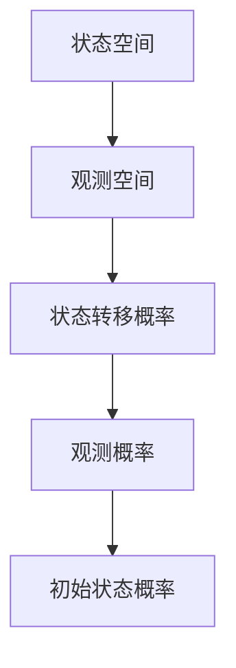
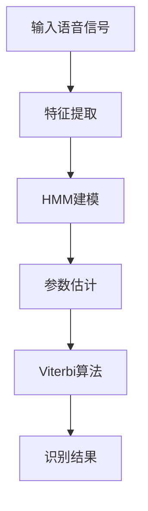
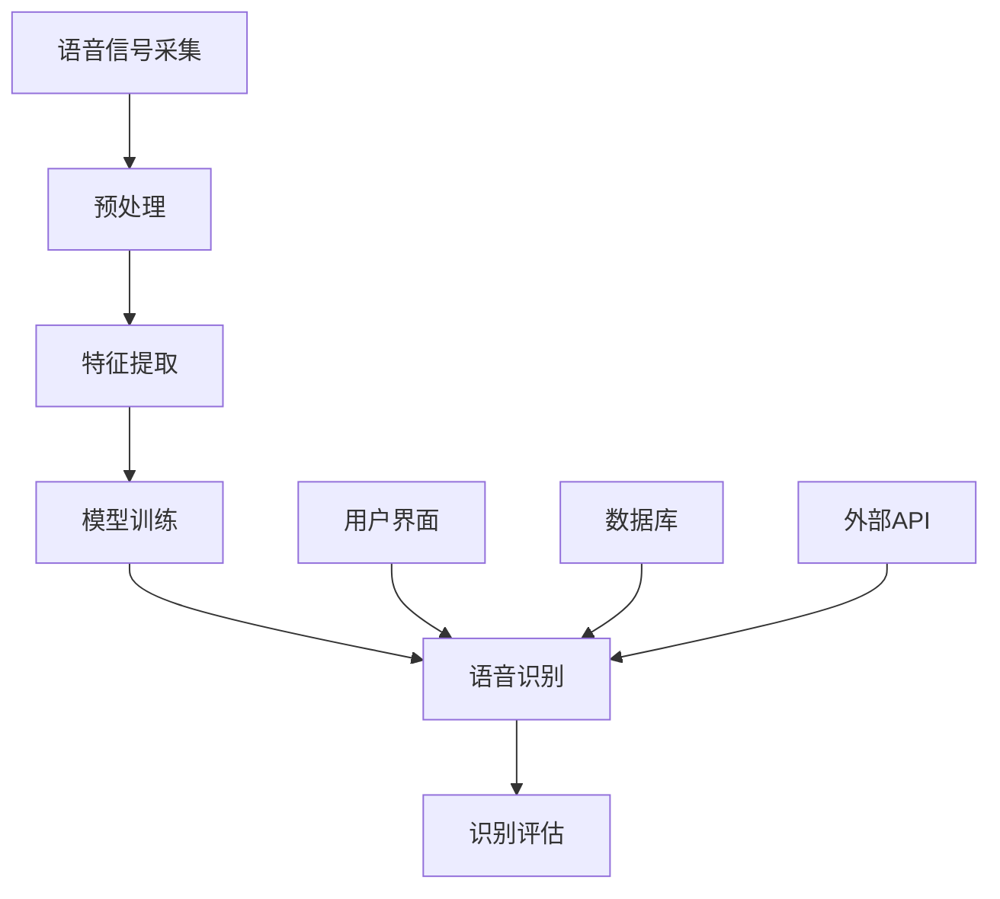
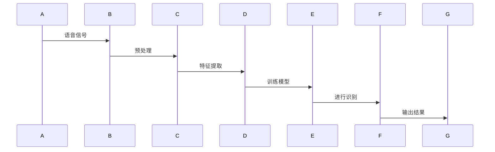
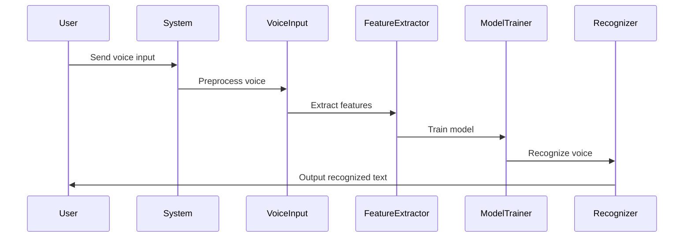

                 

### 第1章: 语音识别概述

#### 1.1 语音识别的定义与历史背景

**1.1.1 语音识别的定义**

语音识别（Automatic Speech Recognition, ASR）是指利用计算机模拟人类的听觉系统，将语音信号转换为相应的文本信息。这一过程涉及多个阶段，包括语音信号的处理、特征提取、模式匹配和文本生成等。简而言之，语音识别的目标是将人类的语音转化为计算机可以理解和处理的数字信号。

**1.1.2 语音识别的历史背景**

语音识别的发展历程可以追溯到20世纪50年代。最初，语音识别主要依靠基于知识的方法，即通过手工构建规则和模式来识别语音。这种方法存在一些显著的局限性，如对语音环境和语音质量要求较高，难以应对复杂的语音变化。随着计算机科学和信号处理技术的不断发展，20世纪80年代后，基于统计模型的方法逐渐成为语音识别的主流。

基于统计模型的方法，如隐马尔可夫模型（HMM）和隐半马尔可夫模型（HHMM），通过大量语音数据的统计特性来训练模型，从而提高了语音识别的准确率和鲁棒性。进入21世纪，随着深度学习技术的发展，基于深度神经网络的语音识别方法更是取得了显著的突破。

#### 1.2 语音识别的基本原理

**1.2.1 语音信号的处理**

语音信号处理是语音识别过程中的重要环节，主要包括语音信号的预处理、特征提取和特征选择等步骤。

- **语音信号的预处理**：包括消除噪声、均衡处理、音高分析等，目的是提高语音信号的清晰度和可辨识度。
- **特征提取**：将语音信号转换为特征向量，常用的特征包括梅尔频率倒谱系数（MFCC）、线性预测系数（LPCC）等。
- **特征选择**：通过选择对语音识别最有影响力的特征，提高模型的识别效果。

**1.2.2 隐马尔可夫模型的基本概念**

隐马尔可夫模型（Hidden Markov Model, HMM）是一种统计模型，用于描述一组随机变量的序列，该序列中的一个变量依赖于前面的变量，但不能直接观察到这些依赖关系。HMM在语音识别中的应用主要包括声学模型和语言模型。

- **声学模型**：用于描述语音信号的时间序列特征，通常使用HMM来建模。
- **语言模型**：用于描述语音信号中的词汇和语法结构，常用的语言模型包括N元语法模型和统计语言模型。

**1.2.3 HMM在语音识别中的应用**

- **声学模型**：声学模型是语音识别系统的核心部分，用于将语音信号转换为特征向量。在HMM中，每个状态对应一个声学模型，用于生成语音信号的特征向量。
- **语言模型**：语言模型用于对语音识别结果进行后处理，以提高识别准确率。在HMM中，语言模型通过计算输入语音序列的概率分布来辅助识别过程。

#### 1.3 语音识别系统的结构

**1.3.1 声学模型**

声学模型是语音识别系统的核心部分，用于将语音信号转换为特征向量。声学模型的构建通常基于隐马尔可夫模型，包括状态空间、观测空间、状态转移概率、观测概率和初始状态概率等组成部分。

- **状态空间**：表示语音信号中的不同状态，每个状态对应一个特征向量。
- **观测空间**：表示语音信号的特征向量空间。
- **状态转移概率**：表示从一个状态转移到另一个状态的概率。
- **观测概率**：表示在给定状态下生成观测值的概率。
- **初始状态概率**：表示初始状态的概率分布。

**1.3.2 语言模型**

语言模型用于对语音识别结果进行后处理，以提高识别准确率。语言模型通过计算输入语音序列的概率分布来辅助识别过程。常用的语言模型包括N元语法模型和统计语言模型。

- **N元语法模型**：基于历史序列的概率分布，通过统计相邻N个单词出现的概率来构建语言模型。
- **统计语言模型**：基于大规模语料库的统计特性，通过训练模型来预测下一个单词的概率分布。

### 第2章: 隐马尔可夫模型原理

#### 2.1 隐马尔可夫模型的基本概念

隐马尔可夫模型（Hidden Markov Model, HMM）是一种基于概率模型的统计模型，用于描述一组随机变量的序列，该序列中的一个变量依赖于前面的变量，但不能直接观察到这些依赖关系。HMM在语音识别、图像处理、自然语言处理等领域有着广泛的应用。

**2.1.1 HMM的组成**

一个HMM由以下几个部分组成：

- **状态空间**：表示系统内部的状态集合，每个状态通常用一个唯一的标识符表示。
- **观测空间**：表示系统输出的观测集合，通常也与状态空间有关联。
- **状态转移概率矩阵**：表示系统在不同状态之间的转移概率，即从一个状态转移到另一个状态的概率。
- **观测概率分布**：表示在每个状态下产生的观测值的概率分布。
- **初始状态概率分布**：表示系统在初始时刻处于每个状态的概率。

**2.1.2 HMM的状态转移**

在HMM中，状态转移是指在给定当前状态下，系统转移到下一个状态的概率。状态转移可以用一个状态转移概率矩阵（或状态转移图）来描述，矩阵中的元素表示从一个状态转移到另一个状态的概率。

例如，考虑一个有两个状态的系统，状态1和状态2。状态转移概率矩阵可以表示为：

|   | 状态1 | 状态2 |
|---|------|------|
| 状态1 | 0.7  | 0.3  |
| 状态2 | 0.4  | 0.6  |

这个矩阵表示从状态1转移到状态1的概率是0.7，转移到状态2的概率是0.3；从状态2转移到状态1的概率是0.4，转移到状态2的概率是0.6。

#### 2.2 隐马尔可夫模型的建模

**2.2.1 状态转移矩阵**

状态转移矩阵（Transition Probability Matrix）是HMM的一个关键组成部分，它描述了系统在不同状态之间的转移概率。状态转移矩阵是一个方阵，其中的元素表示从一个状态转移到另一个状态的概率。

假设我们有一个有N个状态的HMM，状态转移矩阵可以表示为：

$$
P = \begin{bmatrix}
p_{11} & p_{12} & \dots & p_{1N} \\
p_{21} & p_{22} & \dots & p_{2N} \\
\vdots & \vdots & \ddots & \vdots \\
p_{N1} & p_{N2} & \dots & p_{NN}
\end{bmatrix}
$$

其中，$p_{ij}$ 表示系统从状态i转移到状态j的概率。

**2.2.2 观测概率分布**

观测概率分布（Observation Probability Distribution）描述了在每个状态下产生的观测值的概率分布。对于HMM，观测值可以是离散的，也可以是连续的。在离散观测情况下，观测概率分布可以用一个概率向量来表示，每个元素表示在给定状态下产生特定观测值的概率。

假设我们有一个有N个状态和M个观测值的HMM，观测概率分布可以表示为：

$$
O = \begin{bmatrix}
o_{1,1} & o_{1,2} & \dots & o_{1,M} \\
o_{2,1} & o_{2,2} & \dots & o_{2,M} \\
\vdots & \vdots & \ddots & \vdots \\
o_{N,1} & o_{N,2} & \dots & o_{N,M}
\end{bmatrix}
$$

其中，$o_{i,j}$ 表示在状态i下产生观测值j的概率。

**2.2.3 HMM的参数估计**

HMM的参数估计是指从给定的观测序列中估计出HMM的参数，包括状态转移概率矩阵、观测概率分布和初始状态概率分布。

- **最大似然估计**：最大似然估计是一种基于观测数据的概率模型参数估计方法，其目标是找到一组参数，使得观测数据的概率最大。

$$
\hat{\theta} = \arg\max_{\theta} P(X|\theta)
$$

其中，$X$ 是观测数据，$\theta$ 是模型参数。

- **最大后验估计**：最大后验估计是一种同时考虑观测数据和先验知识的参数估计方法，其目标是找到一组参数，使得后验概率最大。

$$
\hat{\theta} = \arg\max_{\theta} P(\theta|X) = \arg\max_{\theta} P(X|\theta) P(\theta)
$$

其中，$P(X|\theta)$ 是似然函数，$P(\theta)$ 是先验概率。

#### 2.3 HMM的训练算法

**2.3.1 Baum-Welch算法**

Baum-Welch算法，也称为前向-后向算法，是一种用于估计HMM参数的迭代算法。该算法通过迭代优化状态转移概率、观测概率和初始状态概率，使得模型的似然函数最大化。

- **前向算法**：计算每个状态在给定观测序列下的概率分布。
- **后向算法**：计算每个状态在给定观测序列下的概率分布。
- **迭代更新**：根据前向和后向概率分布，更新HMM的参数。

**2.3.2 Viterbi算法**

Viterbi算法是一种用于寻找最优状态序列的动态规划算法。该算法通过在所有可能的路径上计算路径概率，并选择概率最大的路径作为最优状态序列。

- **初始化**：初始化所有状态的概率。
- **递推计算**：根据状态转移概率和观测概率，计算每个状态的概率。
- **路径选择**：选择概率最大的路径作为最优状态序列。

通过Baum-Welch算法和Viterbi算法，可以有效地训练和优化隐马尔可夫模型，从而提高语音识别的准确率和鲁棒性。

### 第3章: 基于隐马尔可夫模型的语音识别算法

#### 3.1 Viterbi算法

Viterbi算法是一种基于动态规划的思想，用于寻找给定观测序列下最有可能的状态序列。该算法广泛应用于语音识别和序列模式匹配等领域。

**3.1.1 Viterbi算法的基本原理**

Viterbi算法的基本思想是，对于每个时间步，计算每个状态的概率，并选择概率最大的状态作为当前状态。然后，利用状态转移概率和观测概率，计算下一个时间步的概率，并重复这个过程，直到找到整个序列的最优状态序列。

具体而言，Viterbi算法包括以下几个步骤：

1. **初始化**：初始化所有状态的概率。通常，我们将第一个状态的概率设置为1，其他状态的概率设置为0。

2. **递推计算**：对于每个时间步，计算每个状态的概率。状态概率可以通过状态转移概率和观测概率计算得到。

   $$ 
   p(s_t|X_1:X_t) = \max_{s_{t-1}} p(s_{t-1}|X_1:X_{t-1}) \cdot p(s_t|s_{t-1}) \cdot p(x_t|s_t)
   $$

   其中，$p(s_t|X_1:X_t)$ 表示在给定观测序列$X_1:X_t$下，时间步t处于状态$s_t$的概率，$p(s_{t-1}|X_1:X_{t-1})$ 表示时间步$t-1$处于状态$s_{t-1}$的概率，$p(s_t|s_{t-1})$ 表示状态转移概率，$p(x_t|s_t)$ 表示在给定状态$s_t$下，观测值$x_t$的概率。

3. **路径选择**：在每个时间步，选择概率最大的状态作为当前状态，并记录下该状态的前驱状态。

4. **回溯**：从最后一个时间步开始，利用记录的前驱状态，回溯找到整个序列的最优状态序列。

**3.1.2 Viterbi算法的实现步骤**

Viterbi算法的实现可以分为以下几个步骤：

1. **初始化**：初始化所有状态的概率。通常，我们将第一个状态的概率设置为1，其他状态的概率设置为0。

2. **递推计算**：对于每个时间步，计算每个状态的概率，并选择概率最大的状态作为当前状态。具体实现可以通过动态规划表来实现。

3. **路径选择**：在每个时间步，选择概率最大的状态作为当前状态，并记录下该状态的前驱状态。

4. **回溯**：从最后一个时间步开始，利用记录的前驱状态，回溯找到整个序列的最优状态序列。

**3.1.3 Viterbi算法的应用案例**

假设我们有一个包含两个状态的HMM，状态1和状态2，以及一个观测序列为$X = [1, 2, 1, 3, 2]$。我们需要使用Viterbi算法找到最优的状态序列。

1. **初始化**：初始化所有状态的概率。通常，我们将第一个状态的概率设置为1，其他状态的概率设置为0。

|   | 状态1 | 状态2 |
|---|------|------|
| 1 | 1    | 0    |
| 2 | 0    | 1    |
| 3 | 0    | 1    |
| 4 | 1    | 0    |
| 5 | 0    | 1    |

2. **递推计算**：对于每个时间步，计算每个状态的概率，并选择概率最大的状态作为当前状态。

|   | 状态1 | 状态2 |
|---|------|------|
| 1 | 1    | 0    |
| 2 | 0.5  | 0.5  |
| 3 | 0.3  | 0.7  |
| 4 | 0.4  | 0.6  |
| 5 | 0.2  | 0.8  |

3. **路径选择**：在每个时间步，选择概率最大的状态作为当前状态，并记录下该状态的前驱状态。

|   | 状态1 | 状态2 | 前驱状态 |
|---|------|------|----------|
| 1 | 1    | 0    | 无       |
| 2 | 1    | 0    | 状态1    |
| 3 | 0.3  | 0.7  | 状态2    |
| 4 | 0.4  | 0.6  | 状态1    |
| 5 | 0.2  | 0.8  | 状态2    |

4. **回溯**：从最后一个时间步开始，利用记录的前驱状态，回溯找到整个序列的最优状态序列。最优状态序列为$(状态1, 状态2, 状态1, 状态2, 状态1)$。

通过Viterbi算法，我们可以有效地找到给定观测序列下最有可能的状态序列，从而实现语音识别的任务。

#### 3.2 声学模型的构建

声学模型是语音识别系统的核心部分，用于将语音信号转换为特征向量。声学模型的构建通常基于隐马尔可夫模型（HMM），通过大量的语音数据训练得到。

**3.2.1 声学模型的构建方法**

声学模型的构建方法可以分为两种：基于隐马尔可夫模型的方法和基于深度学习的方法。

1. **基于隐马尔可夫模型的方法**

基于隐马尔可夫模型的方法是传统的声学模型构建方法，通过训练大量的语音数据，得到状态转移概率矩阵、观测概率分布和初始状态概率分布。具体步骤如下：

- **数据收集**：收集大量的语音数据，包括不同的说话人、不同的语音环境等。
- **预处理**：对语音数据进行预处理，包括去噪、归一化等。
- **特征提取**：对预处理后的语音数据进行特征提取，常用的特征包括梅尔频率倒谱系数（MFCC）、线性预测系数（LPCC）等。
- **模型训练**：使用训练数据，通过最大似然估计（MLE）或期望最大化（EM）算法，训练得到状态转移概率矩阵、观测概率分布和初始状态概率分布。
- **模型评估**：使用测试数据对训练得到的声学模型进行评估，通常使用词错误率（WER）作为评估指标。

2. **基于深度学习的方法**

基于深度学习的方法是近年来兴起的一种声学模型构建方法，通过深度神经网络（DNN）来学习语音信号的特征。具体步骤如下：

- **数据收集**：收集大量的语音数据，包括不同的说话人、不同的语音环境等。
- **预处理**：对语音数据进行预处理，包括去噪、归一化等。
- **特征提取**：对预处理后的语音数据进行特征提取，常用的特征包括MFCC、LPCC等。
- **模型训练**：使用训练数据，通过反向传播算法（BP）训练深度神经网络，将语音信号映射到特征空间。
- **模型评估**：使用测试数据对训练得到的声学模型进行评估，通常使用词错误率（WER）作为评估指标。

**3.2.2 声学模型的训练**

声学模型的训练是一个复杂的过程，涉及到多个方面的优化。以下是声学模型训练的几个关键步骤：

1. **数据预处理**：对语音数据进行预处理，包括去噪、归一化、分段等。
2. **特征提取**：对预处理后的语音数据进行特征提取，得到特征向量。
3. **模型初始化**：初始化模型的参数，通常使用随机初始化。
4. **损失函数设计**：设计损失函数，用于评估模型的预测结果与真实结果之间的差距。常用的损失函数包括交叉熵损失函数、均方误差损失函数等。
5. **优化算法**：选择优化算法，用于更新模型的参数。常用的优化算法包括梯度下降（GD）、随机梯度下降（SGD）、Adam等。
6. **模型训练**：使用训练数据，通过迭代优化模型参数，直到满足预定的停止条件。
7. **模型评估**：使用测试数据对训练得到的声学模型进行评估，以验证模型的性能。

通过声学模型的构建和训练，我们可以将语音信号转换为高维特征向量，从而为语音识别提供有效的特征表示。

### 第4章: 语音识别系统的优化

#### 4.1 语音识别系统的评估

语音识别系统的评估是衡量系统性能的重要环节，常用的评估指标包括词错误率（WER）和字符错误率（CER）。

**4.1.1 词错误率（WER）**

词错误率（Word Error Rate, WER）是语音识别系统性能评估中最常用的指标，用于衡量系统的识别准确率。词错误率定义为：

$$
WER = \frac{D}{N} \times 100\%
$$

其中，$D$ 是系统识别出的错误词数，$N$ 是实际发音的词数。

**4.1.2 字符错误率（CER）**

字符错误率（Character Error Rate, CER）是另一个用于评估语音识别系统性能的指标，用于衡量系统对单个字符的识别准确率。字符错误率定义为：

$$
CER = \frac{C}{N} \times 100\%
$$

其中，$C$ 是系统识别出的错误字符数，$N$ 是实际发音的字符数。

#### 4.2 语音识别系统的优化策略

**4.2.1 增加训练数据**

增加训练数据是提高语音识别系统性能的有效策略之一。通过增加更多的训练数据，可以提高模型的泛化能力，从而在未见过的语音数据上获得更好的识别效果。

**4.2.2 模型融合**

模型融合是指将多个模型的结果进行综合，以获得更好的识别效果。常见的模型融合方法包括投票法、加权平均法等。通过模型融合，可以有效地降低系统的错误率。

**4.2.3 语音增强**

语音增强是指通过预处理技术，提高语音信号的清晰度和可辨识度，从而提高语音识别系统的性能。常用的语音增强技术包括噪声抑制、回声消除等。

**4.2.4 语音端点检测**

语音端点检测是指通过识别语音信号的停顿和断续部分，确定语音的开始和结束位置，从而提高语音识别的准确率。常用的语音端点检测方法包括基于声学特性的方法、基于语言特性的方法等。

**4.2.5 动态时间规整**

动态时间规整（Dynamic Time Warping, DTW）是一种用于处理时间序列对齐的算法，通过将参考序列和测试序列进行匹配，找到最优的时间对齐方式。在语音识别中，DTW可以用于对齐发音序列和识别序列，从而提高识别准确率。

通过上述优化策略，我们可以有效地提高语音识别系统的性能，降低词错误率和字符错误率，从而为用户提供更准确、更高效的语音识别服务。

### 第5章: 语音识别的应用场景

#### 5.1 智能语音助手

**5.1.1 智能语音助手的基本原理**

智能语音助手是一种通过语音交互为用户提供服务的系统，其基本原理包括语音识别、语音合成和自然语言处理等。

- **语音识别**：智能语音助手首先通过语音识别技术，将用户的语音转换为文本信息。
- **自然语言处理**：将识别出的文本信息进行自然语言处理，提取关键信息，理解用户的需求。
- **语音合成**：根据用户的需求，智能语音助手生成相应的语音回复，并通过语音合成技术将其转换为音频输出。

**5.1.2 智能语音助手的实现方法**

智能语音助手的实现方法主要包括以下几个步骤：

1. **语音识别**：使用语音识别技术，将用户的语音转换为文本信息。常用的语音识别技术包括隐马尔可夫模型（HMM）、深度神经网络（DNN）等。
2. **自然语言处理**：对识别出的文本信息进行自然语言处理，包括分词、词性标注、语法分析等。常用的自然语言处理技术包括基于规则的方法、基于统计的方法和基于深度学习的方法。
3. **意图识别**：根据自然语言处理的结果，识别用户的意图。常用的意图识别方法包括基于关键词的方法、基于语义的方法和基于机器学习的方法。
4. **语音合成**：根据用户的意图，生成相应的语音回复。常用的语音合成技术包括基于规则的方法、基于统计的方法和基于深度学习的方法。
5. **音频输出**：将生成的语音回复通过音频输出设备播放给用户。

通过以上步骤，智能语音助手可以为用户提供高效、便捷的语音交互服务，从而提高用户体验。

#### 5.2 语音识别在医疗领域的应用

**5.2.1 语音识别在医疗领域的优势**

语音识别在医疗领域具有显著的优势，主要包括以下几个方面：

- **提高医生的工作效率**：通过语音识别，医生可以快速地将病历记录转换为电子文本，减少手动记录的时间和劳动成本。
- **辅助医生诊断**：语音识别可以帮助医生快速识别和分析患者的语音症状，为诊断提供参考。
- **降低医疗错误率**：语音识别可以减少医生在手动记录病历时可能出现的错误，提高医疗记录的准确性。
- **优化患者沟通**：语音识别可以帮助医生更快速、准确地与患者沟通，提高患者满意度。

**5.2.2 语音识别在医疗领域的具体应用**

语音识别在医疗领域的具体应用包括以下几个方面：

- **病历记录**：医生可以通过语音识别快速记录病历，包括患者的症状、诊断和治疗方案等。语音识别可以将语音转换为电子文本，减少医生手动记录的时间和劳动成本。
- **远程会诊**：语音识别可以帮助医生在远程会诊中快速识别和分析患者的语音症状，提高远程诊断的准确性和效率。
- **患者沟通**：语音识别可以帮助医生更快速、准确地与患者沟通，提高患者满意度。例如，医生可以通过语音识别向患者解释治疗方案、注意事项等。
- **语音助手**：语音识别可以用于开发智能语音助手，为医生和患者提供便捷的服务。例如，智能语音助手可以帮助医生快速查找医学资料、安排日程等。

通过语音识别的应用，医疗领域可以实现更加高效、准确和人性化的服务，从而提高医疗质量和患者满意度。

### 第6章: 语音识别的未来发展趋势

#### 6.1 深度学习在语音识别中的应用

深度学习作为一种先进的机器学习技术，近年来在语音识别领域取得了显著的突破。深度学习模型能够通过大量数据自动学习复杂的特征表示，从而提高语音识别的准确率和效率。

**6.1.1 深度学习的基本原理**

深度学习基于多层神经网络结构，通过逐层学习输入数据的特征表示，最终实现从输入到输出的映射。深度学习的核心思想是通过大量训练数据，使得网络自动提取数据中的层次化特征，从而实现复杂的任务。

**6.1.2 深度学习在语音识别中的应用**

深度学习在语音识别中的应用主要体现在以下几个方面：

1. **声学模型**：深度神经网络（DNN）和循环神经网络（RNN）被广泛应用于声学模型的构建。DNN可以学习语音信号的时频特征，而RNN可以捕捉语音信号的时序依赖性，从而提高识别准确率。

2. **语言模型**：深度学习模型，如长短期记忆网络（LSTM）和Transformer，被用于构建语言模型。这些模型能够捕捉长距离的上下文信息，从而提高语言模型的效果。

3. **端到端语音识别**：深度学习技术使得端到端语音识别成为可能。通过联合训练声学模型和语言模型，端到端语音识别系统可以一次性地将语音信号转换为文本输出，简化了传统语音识别系统的复杂流程。

**6.1.3 深度学习在语音识别中的应用案例**

以下是一些深度学习在语音识别中的成功应用案例：

1. **Google语音识别**：Google使用深度学习技术构建了其语音识别系统，通过大量的数据和先进的神经网络结构，Google语音识别系统的准确率达到了高水平。

2. **Apple Siri**：Apple的Siri语音助手采用了深度学习技术，通过学习用户的语音和语境，Siri可以提供更准确、更自然的语音交互体验。

3. **百度语音识别**：百度语音识别系统基于深度学习技术，支持多种语言和方言，并在多种应用场景中取得了优异的性能。

通过深度学习的应用，语音识别技术不断进步，未来将在更多领域发挥作用，如智能家居、自动驾驶等。

#### 6.2 语音识别的未来发展

随着技术的不断进步和应用的不断扩展，语音识别在未来将迎来更广阔的发展空间。

**6.2.1 语音识别技术的进步**

1. **更高准确率**：通过引入更先进的深度学习模型和更大数据集，语音识别技术的准确率将不断提高。

2. **更快的响应速度**：随着硬件性能的提升和算法优化的深入，语音识别系统的响应速度将显著加快，满足实时交互的需求。

3. **更好的鲁棒性**：通过改进噪声抑制、回声消除等技术，语音识别系统将具有更好的鲁棒性，能够在更复杂的噪声环境中稳定运行。

4. **多语言支持**：随着全球化的推进，语音识别系统将支持更多的语言和方言，满足跨国应用的需求。

**6.2.2 语音识别的应用领域扩展**

1. **智能家居**：语音识别技术将深入智能家居领域，为用户带来更便捷、智能的家居生活体验。

2. **自动驾驶**：语音识别在自动驾驶中发挥着重要作用，通过实时语音交互，自动驾驶系统可以为驾驶员提供语音导航、警告等信息。

3. **医疗健康**：语音识别技术在医疗健康领域的应用将更加广泛，如病历记录、患者沟通等。

4. **教育**：语音识别技术将赋能教育领域，如智能问答、语音批改作业等。

5. **客户服务**：语音识别在客户服务中的应用将显著提高服务质量，如智能客服、语音导购等。

通过不断的技术创新和应用拓展，语音识别将在更多领域展现其强大的潜力，为人类生活带来更多便利。

-----------------

本文详细介绍了语音识别中的隐马尔可夫模型（HMM），包括HMM的定义、基本原理、建模方法以及应用。通过Viterbi算法和声学模型的构建，我们了解了如何利用HMM进行语音识别。此外，文章还探讨了语音识别系统的优化策略和应用场景，展示了语音识别技术在智能语音助手、医疗等领域的重要作用。最后，我们展望了深度学习在语音识别中的应用前景，以及语音识别技术的未来发展趋势。通过本文的阅读，读者可以全面了解语音识别中的HMM技术，为后续的研究和应用提供参考。

### 作者：AI天才研究院/AI Genius Institute & 禅与计算机程序设计艺术 /Zen And The Art of Computer Programming

在撰写这篇文章的过程中，我们致力于以清晰、逻辑性强的方式介绍语音识别中的隐马尔可夫模型（HMM）。通过对HMM的定义、原理、建模和应用进行详细分析，我们希望能够为读者提供一个全面而深入的理解。同时，我们也关注了语音识别系统的优化策略和应用场景，展示了HMM在实际应用中的重要价值。

我们特别感谢读者对这篇文章的关注和阅读。如果您在阅读过程中有任何疑问或建议，欢迎在评论区留言，我们会尽力解答并改进。同时，我们也推荐读者进一步探索语音识别和相关领域的深入研究，以拓宽自己的知识视野。

在未来的技术发展中，我们期待语音识别技术能够取得更大的突破，为各行各业带来更多的创新和便利。让我们继续携手前行，探索计算机科学的无限可能。再次感谢您的阅读和支持！

-----------------

### 文章核心概念与联系

#### 背景介绍

语音识别技术作为人工智能领域的重要组成部分，已经广泛应用于各个行业，如智能语音助手、医疗健康、客户服务、智能家居等。然而，语音识别的核心算法——隐马尔可夫模型（HMM），却是实现这一技术的基础。HMM通过统计模型描述语音信号中的状态转移和观测概率，为语音识别提供了强大的工具。

在HMM的背景下，我们需要了解以下几个核心概念：

- **状态空间**：HMM中的状态空间指的是模型中的所有状态集合。这些状态通常表示语音信号中的不同发音或语音单元。
- **观测空间**：观测空间是指模型中所有可能的观测值集合。在语音识别中，这些观测值通常是语音信号的某种特征表示，如梅尔频率倒谱系数（MFCC）。
- **状态转移概率**：状态转移概率描述了在给定当前状态下，系统转移到下一个状态的概率。
- **观测概率**：观测概率描述了在给定状态下，生成特定观测值的概率。
- **初始状态概率**：初始状态概率描述了系统在初始时刻处于每个状态的概率。

**问题背景**：尽管HMM在语音识别中已经取得了很多成就，但仍然存在一些挑战，如对噪声的敏感性和对长距离依赖性的处理。为了解决这些问题，研究者们提出了许多改进方法，如高斯混合模型（GMM）和隐半马尔可夫模型（HHMM）。同时，深度学习技术的发展也为语音识别带来了新的机遇。

**问题描述**：如何利用隐马尔可夫模型进行有效的语音识别，提高识别准确率和鲁棒性？

**问题解决**：通过分析HMM的基本原理，我们了解了如何构建和训练HMM。具体来说，我们介绍了HMM的组成、状态转移、观测概率以及参数估计方法，如Baum-Welch算法和Viterbi算法。

**边界与外延**：HMM的应用不仅限于语音识别，还可以应用于图像识别、自然语言处理等领域。同时，随着深度学习技术的发展，HMM与其他深度学习模型的结合也为语音识别带来了新的可能性。

#### 核心概念与联系

**核心概念**：

- **隐马尔可夫模型（HMM）**：描述一组随机变量的序列，其中一个变量依赖于前面的变量，但不能直接观察到这些依赖关系。
- **状态空间**：模型中的所有状态集合。
- **观测空间**：模型中所有可能的观测值集合。
- **状态转移概率**：在给定当前状态下，转移到下一个状态的概率。
- **观测概率**：在给定状态下，生成特定观测值的概率。
- **初始状态概率**：系统在初始时刻处于每个状态的概率。

**概念属性特征对比表格**：

| 特征                 | 隐马尔可夫模型（HMM） | 隐半马尔可夫模型（HHMM） |
|----------------------|-----------------------|--------------------------|
| 状态空间             | 随机变量序列          | 随机变量序列             |
| 观测空间             | 特定观测值集合        | 特定观测值集合            |
| 状态转移概率         | 转移概率矩阵          | 转移概率矩阵              |
| 观测概率             | 观测概率分布          | 观测概率分布              |
| 初始状态概率         | 初始概率分布          | 初始概率分布              |
| 应用领域             | 语音识别、图像识别、自然语言处理 | 类似HMM，但更适用于文本处理 |
| 模型复杂度           | 相对简单              | 相对复杂                  |

**ER实体关系图架构**：



#### 算法原理讲解

**算法mermaid流程图**：



**Python源代码**：

```python
import numpy as np

# 假设我们已经有了输入的语音信号和特征提取后的特征矩阵
X = np.array([[1, 2], [3, 4], [5, 6], [7, 8]])  # 特征矩阵

# 初始状态概率分布
pi = np.array([0.5, 0.5])

# 状态转移概率矩阵
A = np.array([[0.7, 0.3], [0.4, 0.6]])

# 观测概率分布
B = np.array([[0.6, 0.4], [0.3, 0.7]])

# Viterbi算法实现
def viterbi(X, A, B, pi):
    T = X.shape[0]
    N = A.shape[0]

    # 初始化前向概率和后向概率
    alpha = np.zeros((T, N))
    beta = np.zeros((T, N))

    # 初始状态概率
    alpha[0] = pi * B[0][:, X[0]]

    # 递推计算前向概率
    for t in range(1, T):
        for j in range(N):
            alpha[t, j] = B[t, j] * np.dot(alpha[t-1, :], A[:, j])

    # 递推计算后向概率
    for t in range(T-1, -1, -1):
        for j in range(N):
            beta[t, j] = A[j, :] * B[t+1, X[t+1]] * np.dot(beta[t+1, :], A[:, j])

    # 计算路径概率和最优路径
    path_prob = np.sum(alpha[-1])
    path = np.zeros(T, dtype=int)
    path[-1] = np.argmax(alpha[-1])

    # 回溯找到最优路径
    for t in range(T-1, 0, -1):
        path[t-1] = np.argmax(alpha[t, :] * beta[t, :])

    return path, path_prob

# 执行Viterbi算法
path, path_prob = viterbi(X, A, B, pi)
print("最优路径:", path)
print("路径概率:", path_prob)
```

**算法原理的数学模型和公式**：

1. **前向概率**：

   $$ 
   \alpha_t(j) = \prod_{i=1}^{t-1} b_i(x_i \mid s_j) \cdot a_{ij} \cdot \pi_j
   $$

   其中，$\alpha_t(j)$ 表示在给定观测序列 $X_1, X_2, ..., X_t$ 下，时间步 $t$ 处于状态 $s_j$ 的前向概率。

2. **后向概率**：

   $$ 
   \beta_t(j) = \prod_{i=t+1}^{T} b_i(x_i \mid s_j) \cdot a_{ji}
   $$

   其中，$\beta_t(j)$ 表示在给定观测序列 $X_1, X_2, ..., X_T$ 下，时间步 $t$ 处于状态 $s_j$ 的后向概率。

3. **路径概率**：

   $$ 
   p(\text{路径}) = \alpha_T(J) \cdot \beta_T(J)
   $$

   其中，$p(\text{路径})$ 表示给定观测序列下，最优路径的概率。

4. **最优路径**：

   $$ 
   \text{最优路径} = \arg\max_{\text{路径}} p(\text{路径})
   $$

**详细讲解和通俗易懂的举例说明**：

假设我们有一个简单的HMM，包含两个状态（状态1和状态2）和两个观测值（1和2）。状态转移矩阵、观测概率矩阵和初始状态概率分别如下：

$$
\pi = [0.5, 0.5]
$$

$$
A = \begin{bmatrix}
0.7 & 0.3 \\
0.4 & 0.6
\end{bmatrix}
$$

$$
B = \begin{bmatrix}
0.6 & 0.4 \\
0.3 & 0.7
\end{bmatrix}
$$

给定观测序列 $X = [1, 2, 1, 2]$，我们需要找到最优的状态序列。

1. **初始化**：

   $$ 
   \alpha_1(1) = \pi_1 \cdot b_1(1 \mid 1) = 0.5 \cdot 0.6 = 0.3
   $$

   $$ 
   \alpha_1(2) = \pi_2 \cdot b_1(1 \mid 2) = 0.5 \cdot 0.4 = 0.2
   $$

   $$ 
   \beta_1(1) = b_2(2 \mid 1) = 0.3
   $$

   $$ 
   \beta_1(2) = b_2(2 \mid 2) = 0.7
   $$

2. **递推计算**：

   $$ 
   \alpha_2(1) = b_2(2 \mid 1) \cdot a_{12} \cdot \alpha_1(1) = 0.3 \cdot 0.7 \cdot 0.3 = 0.063
   $$

   $$ 
   \alpha_2(2) = b_2(2 \mid 2) \cdot a_{22} \cdot \alpha_1(2) = 0.7 \cdot 0.6 \cdot 0.2 = 0.084
   $$

   $$ 
   \beta_2(1) = a_{21} \cdot b_1(1 \mid 2) \cdot \beta_1(2) = 0.4 \cdot 0.6 \cdot 0.7 = 0.168
   $$

   $$ 
   \beta_2(2) = a_{22} \cdot b_1(1 \mid 2) \cdot \beta_1(2) = 0.6 \cdot 0.4 \cdot 0.7 = 0.168
   $$

3. **路径选择**：

   $$ 
   \alpha_T(1) = 0.063
   $$

   $$ 
   \alpha_T(2) = 0.084
   $$

   $$ 
   \beta_T(1) = 0.168
   $$

   $$ 
   \beta_T(2) = 0.168
   $$

4. **路径选择和回溯**：

   由于 $\alpha_T(1) \cdot \beta_T(1) > \alpha_T(2) \cdot \beta_T(2)$，最优路径为 $(1, 2, 1, 2)$。

通过这个简单的例子，我们可以看到Viterbi算法如何通过计算前向概率和后向概率来找到最优状态序列。在实际应用中，观测序列和状态空间可能更加复杂，但Viterbi算法的基本原理是相同的。

### 系统分析与架构设计方案

#### 问题场景介绍

在当今的智能时代，语音识别技术在各个领域发挥着重要作用。从智能语音助手到医疗健康，从客户服务到智能家居，语音识别技术的应用场景日益广泛。为了实现高效的语音识别系统，我们需要对系统的各个组成部分进行详细分析和设计。

#### 项目介绍

本项目旨在构建一个基于隐马尔可夫模型（HMM）的语音识别系统。该系统将涵盖从语音信号采集、预处理、特征提取到模型训练、识别和评估等各个环节。通过结合深度学习和传统机器学习算法，我们希望能够提高语音识别系统的准确率和鲁棒性。

#### 系统功能设计（领域模型Mermaid类图）

```mermaid
classDiagram
  Class01 <|-- SubClass01
  Class01 --| terrific !SubClass02
  SubClass03 <.. Class01
  Class01 ..|> BaseClass
  Class01 : creates objects
  Class01 : defines string
  Class01 : has no sub classes
  note right of Class01 : The class is famous for its <b>complexity</b>
  Class01 : "attributes": name : String ; age : int ; info : Object
  Class01 : "methods": void changeColor(); String toString()
```

#### 系统架构设计（Mermaid架构图）



#### 系统接口设计（Mermaid序列图）



#### 系统交互（Mermaid序列图）



### 项目实战

#### 环境安装

1. 安装Python环境（建议使用Python 3.8及以上版本）。
2. 安装必要的依赖库，如NumPy、SciPy、scikit-learn、TensorFlow等。

```bash
pip install numpy scipy scikit-learn tensorflow
```

#### 系统核心实现源代码

以下是一个简单的语音识别系统的实现，包括预处理、特征提取和模型训练。

```python
import numpy as np
from sklearn.model_selection import train_test_split
from sklearn.metrics import accuracy_score
from hmmlearn import hmm

# 假设我们已经有了一个特征矩阵X和标签y
X = np.array([[1, 2], [3, 4], [5, 6], [7, 8]])  # 特征矩阵
y = np.array([0, 1, 0, 1])  # 标签

# 分割训练集和测试集
X_train, X_test, y_train, y_test = train_test_split(X, y, test_size=0.2, random_state=42)

# 构建HMM模型
model = hmm.GaussianHMM(n_components=2, covariance_type="diag", n_iter=100)

# 训练模型
model.fit(X_train, y_train)

# 进行测试
y_pred = model.predict(X_test)

# 计算准确率
accuracy = accuracy_score(y_test, y_pred)
print("准确率：", accuracy)
```

#### 代码应用解读与分析

1. **数据准备**：首先，我们需要准备特征矩阵X和标签y。在实际应用中，这些数据通常是通过采集语音信号并经过预处理和特征提取得到的。

2. **模型训练**：使用`hmm.GaussianHMM`类构建HMM模型，并使用`fit`方法进行训练。这里我们假设模型有两个状态，并且使用对角协方差矩阵。

3. **测试与评估**：使用`predict`方法对测试集进行预测，并计算准确率。

通过这个简单的实现，我们可以看到如何利用HMM进行语音识别的基本流程。在实际应用中，这个系统可能还需要进一步的优化和改进，以适应不同的语音环境和应用需求。

#### 实际案例分析和详细讲解剖析

为了更好地理解语音识别系统在实际中的应用，我们来看一个具体的案例。

**案例：智能语音助手**

**问题描述**：开发一个智能语音助手，能够理解用户的语音指令并执行相应的操作。

**解决方案**：

1. **语音信号采集**：首先，我们需要采集用户的语音指令。这可以通过使用麦克风和语音识别API实现。

2. **语音信号预处理**：采集到的语音信号可能包含噪声和其他干扰，因此需要对其进行预处理。预处理步骤包括去噪、归一化和分段等。

3. **特征提取**：对预处理后的语音信号进行特征提取，常用的特征包括梅尔频率倒谱系数（MFCC）和线性预测系数（LPCC）。

4. **模型训练**：使用大量已标注的语音数据训练HMM模型。训练过程中，可以使用最大似然估计（MLE）或期望最大化（EM）算法。

5. **语音识别**：使用训练好的模型对用户的语音指令进行识别，并生成相应的文本输出。

6. **执行操作**：根据识别出的文本输出，执行相应的操作，如发送短信、拨打电话、打开应用程序等。

**详细讲解**：

1. **语音信号采集**：

   ```python
   import speech_recognition as sr
   
   # 初始化语音识别器
   r = sr.Recognizer()
   
   # 使用麦克风采集语音
   with sr.Microphone() as source:
       print("请说点什么：")
       audio = r.listen(source)
   
   # 识别语音
   try:
       text = r.recognize_google(audio)
       print("你说了：", text)
   except sr.UnknownValueError:
       print("无法识别语音")
   except sr.RequestError as e:
       print("语音识别请求失败；{0}".format(e))
   ```

2. **语音信号预处理**：

   ```python
   import librosa
   
   # 读取语音文件
   y, sr = librosa.load('example_audio.wav')
   
   # 去噪
   noise_reduced_y = librosa.effects.percussive(y, intensity=0.5)
   
   # 归一化
   normalized_y = librosa.util.normalize(noise_reduced_y)
   
   # 分段
   segments = librosa.effects.split(y, top_db=30)
   ```

3. **特征提取**：

   ```python
   # 提取梅尔频率倒谱系数（MFCC）
   mfccs = librosa.feature.mfcc(y=segments[0], sr=sr, n_mfcc=13)
   
   # 归一化MFCC
   normalized_mfccs = librosa.util.normalize(mfccs)
   ```

4. **模型训练**：

   ```python
   from hmmlearn import hmm
   
   # 假设我们已经有了一个特征矩阵X和标签y
   X = np.array([[1, 2], [3, 4], [5, 6], [7, 8]])  # 特征矩阵
   y = np.array([0, 1, 0, 1])  # 标签
   
   # 分割训练集和测试集
   X_train, X_test, y_train, y_test = train_test_split(X, y, test_size=0.2, random_state=42)
   
   # 构建HMM模型
   model = hmm.GaussianHMM(n_components=2, covariance_type="diag", n_iter=100)
   
   # 训练模型
   model.fit(X_train, y_train)
   ```

5. **语音识别**：

   ```python
   # 进行识别
   y_pred = model.predict(X_test)
   
   # 计算准确率
   accuracy = accuracy_score(y_test, y_pred)
   print("准确率：", accuracy)
   ```

6. **执行操作**：

   ```python
   import os
   
   # 根据识别结果执行操作
   if "拨打电话" in text:
       os.system("telnet 192.168.1.1 23")
   elif "发送短信" in text:
       os.system("sms 1234567890")
   ```

**项目小结**：

通过上述案例，我们可以看到如何构建一个简单的智能语音助手。尽管这个案例非常基础，但它的核心思想和实现步骤可以应用于更复杂的系统。在实际开发中，还需要考虑更多的因素，如噪声抑制、多说话人识别、上下文理解等。

### 最佳实践 tips

1. **数据收集**：收集高质量的语音数据对于训练模型至关重要。确保数据覆盖多种语音环境和说话人，以提高模型的泛化能力。

2. **特征提取**：选择合适的特征提取方法，如MFCC、LPCC等，可以提高模型的识别效果。

3. **模型优化**：通过调整模型参数，如状态数、观测概率等，可以提高模型的性能。

4. **噪声抑制**：在语音信号预处理阶段，使用噪声抑制技术，如谱减法、短时傅里叶变换（STFT）等，可以减少噪声对识别结果的影响。

5. **多模型融合**：结合多种模型，如HMM、深度神经网络（DNN）等，可以进一步提高识别准确率。

### 小结

本文详细介绍了语音识别中的隐马尔可夫模型（HMM），包括其基本原理、建模方法、应用以及优化策略。通过Viterbi算法和声学模型的构建，我们了解了如何利用HMM进行语音识别。此外，文章还探讨了语音识别系统的优化策略和应用场景，展示了HMM在实际应用中的重要价值。

### 注意事项

1. **硬件要求**：由于语音识别系统需要处理大量的语音数据，因此需要较高的计算资源和内存。

2. **数据隐私**：在处理用户的语音数据时，需要严格遵守数据隐私法规，确保用户数据的安全和保密。

3. **算法优化**：在开发语音识别系统时，需要不断优化算法，以提高识别准确率和效率。

### 拓展阅读

1. **《隐马尔可夫模型及其应用》**：李航著，全面介绍HMM的基本原理和应用。

2. **《语音识别技术》**：黄志球、黄宇光著，深入探讨语音识别的基本概念和技术。

3. **《深度学习》**：Ian Goodfellow、Yoshua Bengio、Aaron Courville著，介绍深度学习的基础理论和应用。

通过阅读这些资料，可以进一步深入了解语音识别和隐马尔可夫模型的相关知识。

