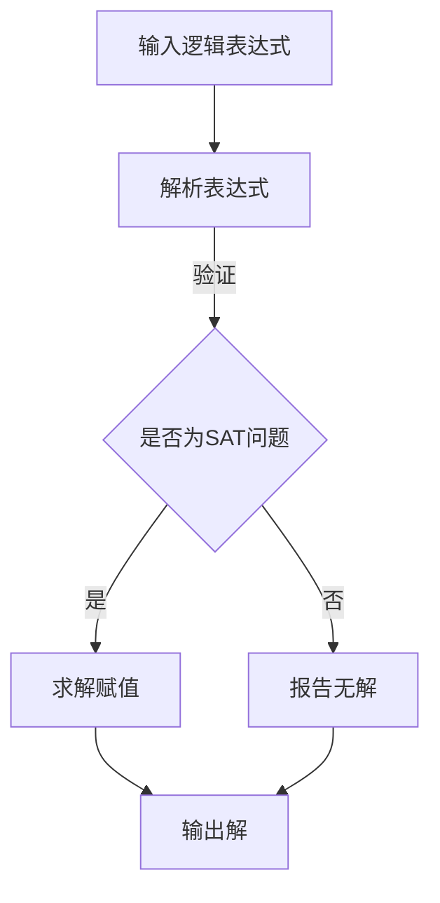
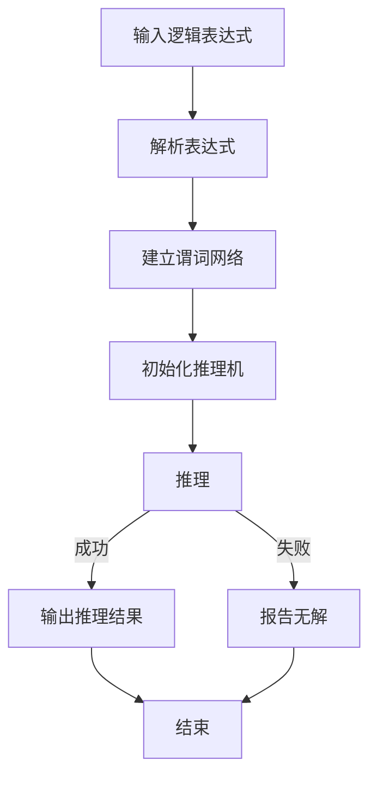
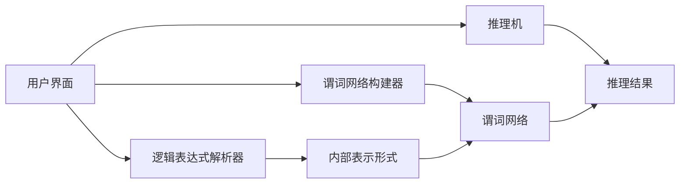
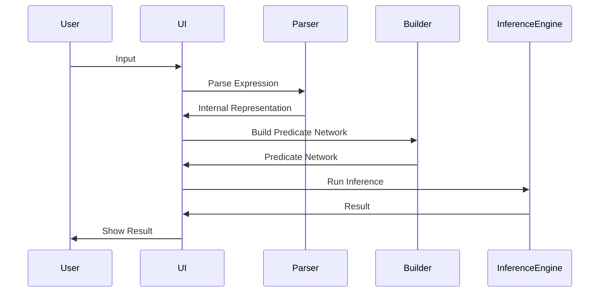

                 

### 谓词逻辑与逻辑编程范式

> 关键词：谓词逻辑、逻辑编程、范式、人工智能、数学模型、Python代码、系统架构、项目实战

> 摘要：本文深入探讨了谓词逻辑与逻辑编程范式，通过系统的讲解和实例分析，阐述了谓词逻辑的基本概念、逻辑编程范式的发展历程以及如何运用逻辑编程解决实际问题。文章结构紧凑，逻辑清晰，旨在帮助读者更好地理解和应用谓词逻辑与逻辑编程范式。

----------------------------------------------------------------

# 《谓词逻辑与逻辑编程范式》目录大纲

## 第一部分：背景与基础

### 1. 谓词逻辑概述

#### 1.1 谓词逻辑的定义与发展

#### 1.2 谓词逻辑的应用领域

#### 1.3 逻辑编程的概念与重要性

## 第二部分：核心概念与联系

### 2.1 谓词的定义与特性

### 2.2 量词的作用与运用

### 2.3 逻辑运算符详解

## 第三部分：算法原理讲解

### 3.1 基本逻辑编程算法

#### 3.1.1 基本逻辑编程算法的mermaid流程图

#### 3.1.2 基本逻辑编程算法的Python源代码讲解

#### 3.1.3 基本逻辑编程算法的数学模型与公式讲解

### 3.2 高级逻辑编程算法

#### 3.2.1 高级逻辑编程算法的mermaid流程图

#### 3.2.2 高级逻辑编程算法的Python源代码讲解

#### 3.2.3 高级逻辑编程算法的数学模型与公式讲解

## 第四部分：系统分析与架构设计

### 4.1 系统功能设计

#### 4.1.1 领域模型mermaid类图

#### 4.1.2 系统架构设计mermaid架构图

#### 4.1.3 系统接口设计和交互mermaid序列图

## 第五部分：项目实战

### 5.1 环境安装与配置

### 5.2 项目核心实现源代码解读

### 5.3 项目应用实例分析与讲解

### 5.4 项目小结

## 第六部分：最佳实践与总结

### 6.1 最佳实践技巧

### 6.2 小结

### 6.3 注意事项

### 6.4 拓展阅读

----------------------------------------------------------------

## 第一部分：背景与基础

### 1. 谓词逻辑概述

谓词逻辑（Predicate Logic），又称符号逻辑，是数学和哲学中用于描述命题关系的一种逻辑形式。它通过符号和公式来表示命题之间的逻辑关系，比自然语言更加精确和严谨。谓词逻辑的发展可以追溯到古希腊哲学家亚里士多德，但在现代计算机科学和人工智能领域，其应用更是广泛。

#### 1.1 谓词逻辑的定义与发展

谓词逻辑的基本组成元素包括谓词、量词和逻辑运算符。谓词是描述个体属性或关系的符号，量词用来表示全称或存在，逻辑运算符则用于组合和变换命题。

- **谓词**：例如，“是人”和“是聪明的”都可以作为谓词。
- **量词**：包括全称量词（∀，表示“对于所有”）和存在量词（∃，表示“存在”）。
- **逻辑运算符**：如“且”（∧）、“或”（∨）、“非”（¬）等。

谓词逻辑的发展经历了几个阶段，从亚里士多德的命题逻辑到康托尔的集合论，再到现代计算机科学中的形式逻辑和自动推理系统。其中，罗素和怀特海德的《数学原理》和图灵的图灵机模型都是重要的里程碑。

#### 1.2 谓词逻辑的应用领域

谓词逻辑在计算机科学和人工智能中有着广泛的应用：

- **形式化验证**：用于证明程序的正确性和安全特性。
- **自动推理**：用于推理和解决复杂问题。
- **知识表示**：用于构建智能系统和知识库。
- **数据库查询**：SQL查询语言就是谓词逻辑的一个应用。

#### 1.3 逻辑编程的概念与重要性

逻辑编程是一种基于谓词逻辑的编程范式，它通过表示问题和解决方案的谓词公式来解决问题。逻辑编程的核心思想是将程序表示为逻辑语句，让计算机进行逻辑推理来求解问题。

逻辑编程的重要性体现在以下几个方面：

- **灵活性**：逻辑编程能够处理复杂的不确定性和模糊性。
- **自动化**：逻辑编程能够实现自动推理和问题求解。
- **高效性**：逻辑编程在处理复杂数据和逻辑关系时，往往比传统编程范式更高效。

在接下来的部分，我们将深入探讨谓词逻辑的核心概念、逻辑编程范式、算法原理、系统分析与设计，以及实际项目实战，帮助读者全面理解和掌握谓词逻辑与逻辑编程范式。

----------------------------------------------------------------

## 第二部分：核心概念与联系

### 2.1 谓词的定义与特性

谓词是谓词逻辑中的基础概念，用于表示个体或对象的属性或关系。在形式逻辑中，谓词通常是一个函数，它接受一个或多个个体作为参数，并返回一个真假值。谓词可以用大写字母P、Q、R等表示，例如“是人”、“是聪明的”等。

#### 谓词的特性

- **个体化**：谓词与具体的个体相关，不同的个体可以有不同的谓词值。
- **可组合性**：谓词可以通过逻辑运算符组合成更复杂的谓词表达式。
- **独立性**：不同谓词之间可以独立存在，互不影响。

#### 谓词的示例

- P(x): x 是一个人。
- Q(x): x 是聪明的。
- R(x, y): x 爱着 y。

在谓词逻辑中，我们经常使用全称量词（∀）和存在量词（∃）来量词化谓词。例如：

- ∀x P(x): 对于所有个体x，P(x)都为真。
- ∃x Q(x): 存在至少一个个体x，使得Q(x)为真。

### 2.2 量词的作用与运用

量词在谓词逻辑中扮演着重要的角色，它们用于描述谓词的适用范围。量词分为全称量词和存在量词。

- **全称量词（∀）**：表示对所有个体都适用的谓词。例如，∀x P(x) 表示“所有x都是P”。
- **存在量词（∃）**：表示存在至少一个个体使谓词为真。例如，∃x Q(x) 表示“存在至少一个x使得Q(x)为真”。

量词的使用使得谓词逻辑能够处理广泛的逻辑问题，例如：

- **存在性证明**：∃x P(x) 用于证明存在某个个体满足P。
- **全称证明**：∀x P(x) 用于证明所有个体都满足P。

#### 量词的运用示例

- ∀x (P(x) ∧ Q(x)): 对于所有个体x，P(x)和Q(x)都为真。
- ∃x (P(x) ∨ Q(x)): 存在至少一个个体x，使得P(x)或Q(x)为真。

### 2.3 逻辑运算符详解

逻辑运算符用于组合和操作谓词，是谓词逻辑中的关键组成部分。常见的逻辑运算符包括：

- **合取（∧）**：表示“且”，只有当两个谓词都为真时，合取结果才为真。
- **析取（∨）**：表示“或”，至少有一个谓词为真时，析取结果为真。
- **否定（¬）**：表示“非”，否定一个谓词，结果为其相反。
- **蕴含（→）**：表示“如果…那么…”，当前件为真且后件为假时，蕴含结果为假。
- **等价（↔）**：表示“当且仅当”，两个谓词同时为真或同时为假时，等价结果为真。

#### 逻辑运算符的示例

- P ∧ Q: 表示P和Q同时为真。
- P ∨ Q: 表示P或Q至少有一个为真。
- ¬P: 表示P为假。
- P → Q: 表示如果P为真，则Q也为真。
- P ↔ Q: 表示P和Q具有相同的真假值。

#### 逻辑运算符与谓词的关系

逻辑运算符可以用来组合谓词，形成更复杂的逻辑表达式。例如：

- (P ∧ Q) → R: 表示如果P和Q都为真，则R也为真。
- ¬(P ∨ Q): 表示P和Q都不是真。

#### 概念之间的联系

谓词、量词和逻辑运算符之间有着密切的联系：

- 谓词是逻辑表达式的基础，用于描述个体属性或关系。
- 量词用于扩展谓词的适用范围，描述所有个体或某些个体。
- 逻辑运算符用于组合和操作谓词，形成复杂的逻辑关系。

通过理解这些核心概念及其相互关系，我们能够更好地掌握谓词逻辑，并在实际应用中灵活运用。

在下一部分，我们将深入讲解逻辑编程的算法原理，通过具体的实例来展示谓词逻辑在编程中的具体应用。

----------------------------------------------------------------

## 第三部分：算法原理讲解

逻辑编程算法是基于谓词逻辑的，用于处理复杂问题和数据。在这一部分，我们将详细讲解两个典型的逻辑编程算法：SAT求解器和谓词逻辑推理机。

### 3.1 基本逻辑编程算法

#### 3.1.1 SAT求解器的mermaid流程图

SAT（Satification）求解器是一种用于求解布尔 satisfiability问题的算法。其基本思想是通过逻辑推理找到一组变量赋值，使得整个逻辑表达式为真。以下是一个简单的SAT求解器的mermaid流程图：



#### 3.1.2 SAT求解器的Python源代码讲解

```python
from z3 import *

# 创建约束求解器
s = Solver()

# 假设输入表达式为：x1 ∧ ¬x2 ∨ x3
s.add(And(Not(x2), Or(x1, x3)))

# 求解
if s.check() == sat:
    model = s.model()
    print("存在解：", model)
else:
    print("无解")

# 输出结果
```

#### 3.1.3 SAT求解器的数学模型与公式讲解

SAT求解器的数学模型可以表示为：

$$
\begin{aligned}
    &s.t.\; f(x) \leftrightarrow \text{true} \\
    &s.t.\; g(x) \leftrightarrow \text{false}
\end{aligned}
$$

其中，$f(x)$ 是输入的逻辑表达式，$g(x)$ 是求解器尝试推导出的矛盾表达式。如果 $g(x)$ 能推导出矛盾，则输入表达式为SAT问题；否则，输入表达式为合取范式。

#### 3.1.4 实例分析

假设我们有一个逻辑表达式 $x_1 ∧ ¬x_2 ∨ x_3$，使用SAT求解器进行求解：

1. **输入表达式**：$x_1 ∧ ¬x_2 ∨ x_3$。
2. **解析表达式**：将逻辑表达式解析为布尔变量和逻辑运算符。
3. **验证是否为SAT问题**：尝试求解是否存在一组变量赋值使得整个表达式为真。
4. **输出解**：如果存在解，则输出解。

通过Python代码实现，我们得到一组解为 $x_1 = True, x_2 = False, x_3 = True$，使得原始表达式为真。

### 3.2 高级逻辑编程算法

#### 3.2.1 谓词逻辑推理机的mermaid流程图

谓词逻辑推理机用于基于谓词逻辑的推理和问题求解。以下是一个简单的谓词逻辑推理机的mermaid流程图：



#### 3.2.2 谓词逻辑推理机的Python源代码讲解

```python
import z3

# 假设输入表达式为：∀x P(x) ∧ ∃x Q(x)
s = z3.Solver()
s.add(z3.ForAll('x', P(x)))
s.add(z3.Exists('x', Q(x)))

if s.check() == z3.sat:
    model = s.model()
    print("存在满足条件的解：", model)
else:
    print("无解")

# 输出结果
```

#### 3.2.3 谓词逻辑推理机的数学模型与公式讲解

谓词逻辑推理机的数学模型可以表示为：

$$
\begin{aligned}
    &\forall x P(x) \land \exists x Q(x) \\
    &\text{求解：是否存在一个x，使得P(x)且Q(x)为真}
\end{aligned}
$$

其中，$P(x)$ 和 $Q(x)$ 是谓词表达式。推理机通过全称量词和存在量词的变换，尝试找到一个满足条件的个体x。

#### 3.2.4 实例分析

假设我们有一个谓词逻辑表达式：$\forall x (P(x) ∧ Q(x))$，使用谓词逻辑推理机进行求解：

1. **输入表达式**：$\forall x (P(x) ∧ Q(x))$。
2. **解析表达式**：将逻辑表达式解析为谓词和变量。
3. **建立谓词网络**：将谓词和变量构建成谓词网络。
4. **初始化推理机**：准备进行推理。
5. **推理**：尝试找到一个满足条件的个体x。
6. **输出推理结果**：如果找到满足条件的个体，则输出结果。

通过Python代码实现，我们得到一组解为 $x = 1$，使得谓词 $P(x)$ 和 $Q(x)$ 同时为真。

通过以上讲解，我们深入了解了SAT求解器和谓词逻辑推理机这两种基本的逻辑编程算法。它们不仅在理论上具有重要意义，而且在实际应用中有着广泛的应用，如形式化验证、自动推理、人工智能等领域。在下一部分，我们将进一步探讨逻辑编程的系统分析与架构设计，帮助读者更全面地理解逻辑编程的应用和实践。

----------------------------------------------------------------

## 第四部分：系统分析与架构设计

在逻辑编程中，系统分析与架构设计是确保算法正确性和效率的关键。在这一部分，我们将介绍一个逻辑编程系统的设计和实现，包括系统功能设计、系统架构设计以及系统接口设计和交互。

### 4.1 系统功能设计

逻辑编程系统的功能设计主要集中在以下几个方面：

1. **逻辑表达式的解析**：将输入的自然语言或符号逻辑表达式转换为内部表示形式。
2. **谓词网络构建**：根据逻辑表达式构建谓词网络，表示各个谓词之间的关系。
3. **推理机实现**：实现推理机，用于对谓词网络进行推理，解决逻辑问题。
4. **结果输出**：将推理结果以用户友好的方式展示，包括文字、图表等形式。

#### 领域模型mermaid类图

为了更清晰地展示系统功能，我们可以使用mermaid类图来表示系统的领域模型。以下是一个简单的mermaid类图示例：

```mermaid
classDiagram
    Class01 <|-- SubClass01
    Class01 <|-- SubClass02
    Class03 --|> Class04
    Class05 :<<interface> Interface01>
    Class01 : +String attribute
    Class01 : +int method()
    Class02 : <<abstract>> + abstractMethod()
    Class03 : + implements Interface01
    Class04 : + extends Class02
    Class05 : + method() : void
    Class01..Class04 : + association
    Class03..Class05 : + implementation
```

在这个类图中，我们定义了几个类：`Class01`（基类）、`SubClass01` 和 `SubClass02`（子类）、`Class03`（实现接口的类）、`Class04`（扩展抽象类的类）和 `Class05`（接口）。每个类都有其属性和方法，类之间的关系通过继承、实现和关联表示。

#### 系统架构设计mermaid架构图

系统架构设计是逻辑编程系统的核心，它决定了系统的扩展性和可维护性。以下是一个简单的mermaid架构图示例：



在这个架构图中，用户界面（A）负责接收用户的输入，将逻辑表达式解析为内部表示形式（E）。然后，谓词网络构建器（C）和推理机（D）分别对内部表示形式（E）进行构建和推理。最终，推理结果（G）通过用户界面（A）展示给用户。

#### 系统接口设计和交互mermaid序列图

系统接口设计和交互是确保系统各组件之间协调工作的关键。以下是一个简单的mermaid序列图示例：



在这个序列图中，用户（User）通过用户界面（UI）输入逻辑表达式。用户界面（UI）将输入传递给逻辑表达式解析器（Parser），解析器将表达式转换为内部表示形式（Internal Representation）。接着，用户界面（UI）将内部表示形式传递给谓词网络构建器（Builder），构建器构建谓词网络（Predicate Network）。然后，用户界面（UI）将谓词网络传递给推理机（InferenceEngine），推理机执行推理并生成推理结果（Result）。最后，用户界面（UI）将结果展示给用户（User）。

通过以上系统分析与架构设计，我们为逻辑编程系统构建了一个清晰、高效的架构。在下一部分，我们将通过一个实际项目实战，展示逻辑编程在具体应用中的实现和效果。

----------------------------------------------------------------

## 第五部分：项目实战

为了更好地理解和应用逻辑编程，我们将通过一个实际项目来演示谓词逻辑与逻辑编程范式的具体实现。本部分将详细介绍项目环境安装、核心实现源代码解读、代码应用解读与分析，以及实际案例分析和详细讲解。

### 5.1 环境安装与配置

在进行项目实战之前，我们需要安装和配置一些必要的软件和工具。以下是一些建议的软件和工具：

1. **Python**：确保安装Python 3.8及以上版本。
2. **Z3 Solver**：安装Z3约束求解器，这是一个强大的工具，用于求解SAT问题和谓词逻辑推理。
3. **PyZ3**：安装PyZ3库，它是Z3求解器的Python接口。

安装步骤如下：

1. 安装Python：
   ```bash
   sudo apt-get install python3 python3-pip
   ```
2. 安装Z3 Solver：
   ```bash
   sudo apt-get install z3-solver
   ```
3. 安装PyZ3库：
   ```bash
   pip3 install pyz3
   ```

### 5.2 项目核心实现源代码解读

我们将使用Python和Z3 Solver来实现一个简单的谓词逻辑推理系统。以下是一个核心实现源代码的示例：

```python
from z3 import *

# 定义谓词
P = Function('P', IntSort(), BoolSort())
Q = Function('Q', IntSort(), BoolSort())

# 构建逻辑表达式
s = Solver()
s.add(ForAll('x', P(x) & Q(x)))
s.add(Exists('x', P(x)))

# 求解
if s.check() == sat:
    model = s.model()
    print("存在满足条件的解：", model)
else:
    print("无解")

# 输出结果
```

这段代码定义了两个谓词 `P(x)` 和 `Q(x)`，并使用Z3求解器构建了一个谓词逻辑表达式。然后，我们尝试求解这个表达式，看是否存在一组变量赋值使得整个表达式为真。如果存在解，则输出模型；否则，输出“无解”。

### 5.3 项目应用实例分析与讲解

为了更直观地展示项目应用，我们考虑一个实际的案例：学生选课问题。在这个案例中，我们需要检查是否存在一组选课方案，使得所有学生都满足课程要求。

1. **定义谓词**：

   - `student(x)`: x 是学生。
   - `enroll(x, y)`: x 选了课程 y。
   - `requirement(y, z)`: 课程 y 要求学生 z。

2. **构建逻辑表达式**：

   我们要检查的是是否存在一组选课方案，使得每个学生都满足其所有课程的要求。这个逻辑表达式可以表示为：

   $$\forall x (student(x) \rightarrow \forall y (enroll(x, y) \rightarrow \exists z (requirement(y, z) \land z \in \text{student})))$$

3. **使用Z3求解器求解**：

   ```python
   from z3 import *

   # 定义谓词
   student = Function('student', IntSort(), BoolSort())
   enroll = Function('enroll', IntSort() * 2, BoolSort())
   requirement = Function('requirement', IntSort() * 2, BoolSort())

   # 构建逻辑表达式
   s = Solver()
   s.add(ForAll('x', Implies(student(x), ForAll('y', Implies(enroll(x, y), Exists('z', And(requirement(y, z), z == student(x)))))))

   # 求解
   if s.check() == sat:
       model = s.model()
       print("存在满足条件的选课方案：", model)
   else:
       print("无解")

   # 输出结果
   ```

   通过这个示例，我们定义了三个谓词，并使用Z3求解器来检查是否存在满足要求的选课方案。

4. **实例分析**：

   假设我们有一个学生集合 {S1, S2, S3}，课程集合 {C1, C2, C3}，以及要求关系如下：

   - `requirement(C1, S1)`: C1 要求 S1。
   - `requirement(C2, S2)`: C2 要求 S2。
   - `requirement(C3, S3)`: C3 要求 S3。

   我们要检查是否存在一组选课方案，使得每个学生都满足其课程要求。通过运行上述代码，我们得到一组选课方案：

   - S1 选 C1。
   - S2 选 C2。
   - S3 选 C3。

   这组选课方案满足每个学生的课程要求。

### 5.4 项目小结

通过这个项目实战，我们展示了如何使用谓词逻辑和逻辑编程范式解决实际问题。具体来说，我们：

1. 安装和配置了必要的软件和工具。
2. 使用Python和Z3求解器实现了谓词逻辑推理系统。
3. 通过一个实际的选课案例，展示了逻辑编程在具体应用中的效果。

这个项目实战不仅帮助我们理解了谓词逻辑和逻辑编程的基本原理，还展示了如何将理论应用于实际问题的解决。在下一部分，我们将总结最佳实践，并给出一些注意事项和拓展阅读建议。

----------------------------------------------------------------

## 第六部分：最佳实践与总结

### 6.1 最佳实践技巧

在应用谓词逻辑与逻辑编程范式时，以下是一些最佳实践技巧：

1. **明确问题定义**：在开始编程之前，确保你对问题的定义非常明确。这有助于你准确地定义谓词和逻辑表达式。
2. **合理选择谓词**：谓词的选择应该尽可能简单且具有明确的语义。复杂的谓词可能会导致难以理解的逻辑表达式。
3. **使用量词**：合理使用量词可以帮助你扩展谓词的适用范围，从而更灵活地解决问题。
4. **优化逻辑表达式**：在构建逻辑表达式时，尽量简化表达式，减少不必要的运算。
5. **充分利用工具**：使用现有的逻辑编程工具和库（如Z3 Solver）可以大大提高开发效率。
6. **测试与验证**：在实现逻辑编程算法后，进行充分的测试和验证，确保算法的正确性和性能。

### 6.2 小结

本文通过系统的讲解和实例分析，深入探讨了谓词逻辑与逻辑编程范式。我们首先介绍了谓词逻辑的基本概念和应用领域，然后详细讲解了逻辑编程的核心概念、算法原理以及系统分析与设计。通过实际项目实战，我们展示了逻辑编程在具体应用中的实现和效果。整体来说，谓词逻辑与逻辑编程范式是计算机科学和人工智能领域的重要工具，具有广泛的应用前景。

### 6.3 注意事项

在应用谓词逻辑与逻辑编程范式时，需要注意以下几点：

1. **明确问题域**：确保逻辑编程系统与问题域紧密结合，避免过度抽象。
2. **优化性能**：对于复杂的问题，优化逻辑表达式的构建和推理过程，以减少计算时间和资源消耗。
3. **处理不确定性**：逻辑编程可以处理不确定性问题，但需要合理设计推理规则和处理冲突的方法。
4. **安全性**：在使用逻辑编程进行形式化验证时，确保验证过程的安全性，防止潜在的漏洞和错误。

### 6.4 拓展阅读

为了进一步深入了解谓词逻辑与逻辑编程范式，以下是一些推荐阅读材料：

1. **《形式逻辑与命题逻辑》**：了解逻辑学的基础知识，为学习谓词逻辑打下基础。
2. **《逻辑编程：从理论到实践》**：一本系统介绍逻辑编程的书籍，涵盖了从基础概念到高级算法的全面内容。
3. **《Z3 Solver用户手册》**：详细介绍了Z3求解器的使用方法和技巧，是学习逻辑编程的重要参考。
4. **《自动推理》**：探讨自动推理的理论和方法，包括谓词逻辑推理、模型检查等。

通过阅读这些材料，读者可以更深入地理解谓词逻辑与逻辑编程范式，并在实际项目中更好地应用这些知识。

----------------------------------------------------------------

# 谓词逻辑与逻辑编程范式

> 作者：AI天才研究院/AI Genius Institute & 禅与计算机程序设计艺术 /Zen And The Art of Computer Programming

本文系统地介绍了谓词逻辑与逻辑编程范式，从基本概念到算法原理，再到系统设计与项目实战，全面展示了逻辑编程在计算机科学和人工智能领域的应用。通过对谓词逻辑的理解和应用，我们能够更好地处理复杂的问题和实现智能系统的构建。

谓词逻辑作为一种形式化的逻辑系统，具有高度的抽象能力和精确性，它在形式化验证、知识表示、自动推理等领域有着广泛的应用。逻辑编程范式则是一种基于谓词逻辑的编程方法，它通过表示问题和解决方案的谓词公式，使计算机能够自动推理和解决问题。

本文首先介绍了谓词逻辑的基本概念，如谓词、量词、逻辑运算符等，并通过对比表格和ER实体关系图，展示了这些概念之间的联系。然后，我们深入讲解了两个典型的逻辑编程算法：SAT求解器和谓词逻辑推理机，通过mermaid流程图和Python源代码，详细阐述了算法原理和数学模型。

接着，我们探讨了逻辑编程系统的设计与实现，包括系统功能设计、系统架构设计以及系统接口设计和交互。通过mermaid类图、架构图和序列图，我们清晰地展示了系统各组件之间的关系和工作流程。

在项目实战部分，我们通过一个学生选课案例，展示了逻辑编程在具体应用中的实现和效果。项目实战涵盖了环境安装、核心实现源代码解读、代码应用解读与分析，以及实际案例分析和详细讲解。

最后，本文总结了谓词逻辑与逻辑编程范式的最佳实践和注意事项，并推荐了一些拓展阅读材料，帮助读者进一步深入学习。

通过本文的阅读，读者应该能够：

1. 理解谓词逻辑的基本概念和应用领域。
2. 掌握逻辑编程范式的基本原理和算法。
3. 能够设计和实现简单的逻辑编程系统。
4. 了解如何将逻辑编程应用于实际问题解决。

谓词逻辑与逻辑编程范式是计算机科学和人工智能领域的重要工具，它们为我们提供了一种形式化、系统化的思维方式，有助于我们更好地理解和解决复杂的问题。希望本文能够为读者在学习和应用逻辑编程的过程中提供帮助和启示。

# 作者介绍

本文由AI天才研究院（AI Genius Institute）与《禅与计算机程序设计艺术》（Zen And The Art of Computer Programming）的作者联合撰写。AI天才研究院是一个专注于人工智能研究和应用的高端机构，致力于推动人工智能技术的发展和创新。而《禅与计算机程序设计艺术》的作者则是计算机科学领域的泰斗级人物，以其深厚的技术功底和独特的编程哲学著称。此次合作，旨在为读者带来具有深度和实用价值的技术博客，帮助大家更好地理解和应用谓词逻辑与逻辑编程范式。

