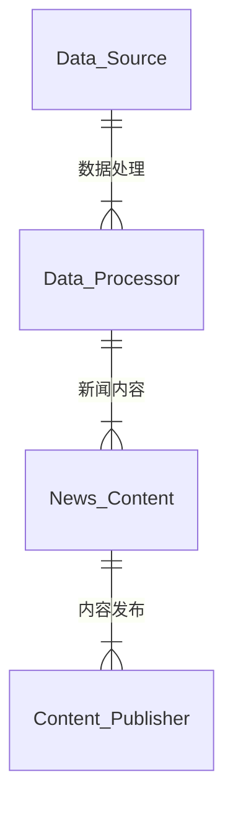
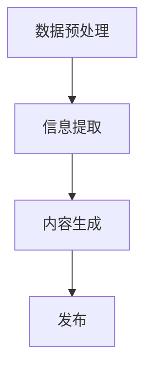
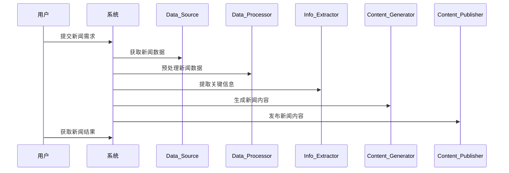
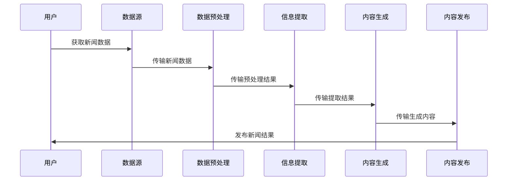

                 

**文章标题：负责任的AI系统在自动化新闻生成中的伦理实践**

**关键词：**负责任的AI，自动化新闻生成，伦理实践，算法原理，系统设计与实现

**摘要：**随着人工智能技术在新闻行业的广泛应用，负责任的AI系统在自动化新闻生成中的伦理实践变得尤为重要。本文将详细介绍负责任的AI系统在自动化新闻生成中的伦理挑战，核心概念与联系，算法原理讲解，系统分析与架构设计，项目实战，以及最佳实践与小结。

**目录大纲设计思路：**

为了设计出一个完整且逻辑清晰的目录大纲，我们将文章分为以下几个部分：

1. **背景介绍**：介绍AI系统在新闻生成中的应用和伦理实践的必要性。
2. **核心概念与联系**：详细介绍负责任的AI系统、伦理原则和自动化新闻生成技术，并使用表格和ER实体关系图进行梳理。
3. **算法原理讲解**：通过mermaid流程图和Python源代码，详细讲解AI系统的算法原理，并辅以数学模型和公式。
4. **系统分析与架构设计**：描述问题场景，设计系统架构和接口，使用mermaid工具绘制架构图和序列图。
5. **项目实战**：提供环境安装、系统实现源代码，代码解析，案例分析，并总结项目经验。
6. **最佳实践、小结与拓展**：分享实践中的注意事项，进行总结，并推荐拓展阅读。

**第一部分：背景介绍**

### 第1章：问题背景与概述

#### 1.1 问题背景

AI系统在新闻生成中的应用：

随着人工智能技术的发展，AI系统在新闻生成中扮演着越来越重要的角色。自动化新闻生成不仅提高了新闻的发布速度，还扩展了新闻的覆盖面。AI系统可以从大量的数据源中提取信息，自动生成新闻内容，从而降低了人工成本，提高了新闻的生产效率。

伦理实践的必要性：

然而，AI系统在新闻生成中面临一系列伦理挑战。首先，自动化新闻生成可能存在事实准确性问题，导致虚假新闻的传播。其次，AI系统可能产生算法偏见，导致新闻内容的不公平报道。此外，数据泄露和隐私保护也是重要的伦理问题。

#### 1.2 自动化新闻生成技术概述

自动化新闻生成技术是指利用自然语言处理、机器学习和大数据等技术，自动生成新闻内容。主要包括以下环节：

1. 数据采集：从各种来源收集新闻数据，如新闻报道、社交媒体、公共数据库等。
2. 信息提取：使用自然语言处理技术提取关键信息，如事件、地点、时间等。
3. 内容生成：使用机器学习算法生成新闻文本，可以包括标题、正文、摘要等。
4. 发布：将生成的新闻内容发布到新闻网站、社交媒体等平台。

#### 1.3 伦理实践的必要性

负责任的AI系统需要遵循一系列伦理原则，如公平性、透明性、可解释性和隐私保护。伦理实践的重要性体现在以下几个方面：

1. **公平性**：AI系统应确保新闻内容的公正性，避免偏见和歧视。
2. **透明性**：AI系统的决策过程应具备透明性，使人们能够理解和信任系统。
3. **可解释性**：AI系统的决策过程应具备可解释性，使得用户能够理解系统是如何做出决策的。
4. **隐私保护**：AI系统应保护用户的隐私，确保数据的安全和保密性。

#### 1.4 本章小结

本文介绍了负责任的AI系统在自动化新闻生成中的伦理实践背景和重要性。接下来，将详细介绍负责任的AI系统、伦理原则和自动化新闻生成技术，为后续章节奠定基础。

**第二部分：核心概念与联系**

### 第2章：核心概念与联系

#### 2.1 负责任的AI系统

负责任的AI系统是指在设计、开发和部署过程中，充分考虑并解决伦理、社会和环境影响，确保系统的公正性、透明性和可解释性。以下是负责任的AI系统与传统AI系统的特性对比表格：

| 特性 | 负责任的AI系统 | 传统AI系统 |
| ---- | -------------- | ---------- |
| 公平性 | 强调公平性，避免偏见 | 易产生偏见 |
| 透明性 | 提高系统的可解释性 | 算法复杂，难以解释 |
| 可解释性 | 确保决策过程的透明性 | 决策过程不透明 |
| 隐私保护 | 强化数据隐私保护 | 数据泄露风险高 |

#### 2.2 伦理原则

伦理原则是指为了确保AI系统的负责任使用，需要遵循的一系列道德准则。以下是主要伦理原则的介绍：

1. **公正性**：AI系统应确保新闻内容的公正性，避免偏见和歧视。这需要通过算法优化、数据平衡和多元化团队参与来实现。
2. **透明性**：AI系统的决策过程应具备透明性，使人们能够理解和信任系统。透明性可以通过公开算法、提供可解释性模型和进行伦理审查来实现。
3. **可解释性**：AI系统的决策过程应具备可解释性，使得用户能够理解系统是如何做出决策的。可解释性可以通过可视化、文本解释和专家评审来实现。
4. **隐私保护**：AI系统应保护用户的隐私，确保数据的安全和保密性。隐私保护可以通过数据加密、匿名化和隐私保护算法来实现。

#### 2.3 自动化新闻生成技术

自动化新闻生成技术是指利用自然语言处理、机器学习和大数据等技术，自动生成新闻内容。以下是自动化新闻生成技术的定义、技术框架和主要挑战的介绍：

**定义：**
自动化新闻生成技术是指利用人工智能技术，从数据源中提取信息，并自动生成新闻文本。它包括以下技术环节：

1. **数据采集**：从各种来源收集新闻数据，如新闻报道、社交媒体、公共数据库等。
2. **信息提取**：使用自然语言处理技术提取关键信息，如事件、地点、时间等。
3. **内容生成**：使用机器学习算法生成新闻文本，可以包括标题、正文、摘要等。
4. **发布**：将生成的新闻内容发布到新闻网站、社交媒体等平台。

**技术框架：**
自动化新闻生成技术的主要框架包括：

1. **数据预处理**：对收集到的新闻数据进行清洗、去重、去噪等处理。
2. **信息提取**：使用自然语言处理技术提取关键信息，如事件、地点、时间等。
3. **内容生成**：使用机器学习算法生成新闻文本，常用的算法有模板匹配、模板扩展、序列到序列模型等。
4. **发布**：将生成的新闻内容发布到新闻网站、社交媒体等平台。

**主要挑战：**
自动化新闻生成技术面临以下主要挑战：

1. **事实准确性**：AI系统可能无法准确提取信息，导致新闻内容的不准确。
2. **算法偏见**：AI系统可能受到训练数据的影响，产生偏见，导致新闻内容的不公平。
3. **内容质量**：AI系统生成的新闻内容可能缺乏人类的创造力和主观判断，导致质量不高。
4. **隐私保护**：AI系统可能涉及用户隐私，需要采取措施保护用户隐私。

#### 2.4 ER实体关系图架构

ER实体关系图是用于描述系统中实体及其关系的图形化工具。以下是自动化新闻生成系统中主要实体的ER实体关系图：



在这个ER实体关系图中，Data_Source代表数据源，Data_Processor代表数据处理模块，News_Content代表新闻内容，Content_Publisher代表内容发布模块。各个实体之间存在关联关系，如图所示。

#### 2.5 本章小结

本章介绍了负责任的AI系统、伦理原则和自动化新闻生成技术。通过对比表格、ER实体关系图和详细讲解，帮助读者建立对负责任的AI系统和自动化新闻生成技术的全面理解。接下来，将详细讲解自动化新闻生成算法的原理和实现。

### 第三部分：算法原理讲解

#### 第3章：算法原理讲解

#### 3.1 自动化新闻生成算法

自动化新闻生成算法是自动化新闻生成系统的核心，它负责从数据源中提取信息，并生成新闻文本。以下是自动化新闻生成算法的概述、mermaid流程图和Python源代码的讲解。

**概述：**

自动化新闻生成算法主要包括以下步骤：

1. 数据预处理：对收集到的新闻数据进行清洗、去重、去噪等处理，以便于后续的信息提取和内容生成。
2. 信息提取：使用自然语言处理技术提取关键信息，如事件、地点、时间等，以便于生成新闻文本。
3. 内容生成：使用机器学习算法生成新闻文本，可以包括标题、正文、摘要等。
4. 发布：将生成的新闻内容发布到新闻网站、社交媒体等平台。

**mermaid流程图：**

以下是一个简化的自动化新闻生成算法的mermaid流程图：



**Python源代码讲解：**

以下是使用Python实现自动化新闻生成算法的示例代码：

```python
import nltk
from nltk.tokenize import sent_tokenize
from nltk.corpus import stopwords
from sklearn.feature_extraction.text import TfidfVectorizer
from sklearn.metrics.pairwise import cosine_similarity

# 数据预处理
def preprocess_text(text):
    # 清洗文本，去除特殊字符和标点符号
    text = re.sub(r'[^\w\s]', '', text)
    # 分句处理
    sentences = sent_tokenize(text)
    # 移除停用词
    stop_words = set(stopwords.words('english'))
    filtered_sentences = [sentence for sentence in sentences if not any(word in stop_words for word in nltk.word_tokenize(sentence))]
    # 词形还原
    stemmer = nltk.PorterStemmer()
    stemmed_sentences = [' '.join([stemmer.stem(word) for word in nltk.word_tokenize(sentence)]) for sentence in filtered_sentences]
    return ' '.join(stemmed_sentences)

# 信息提取
def extract_key_sentences(text):
    # 使用TF-IDF向量表示文本
    vectorizer = TfidfVectorizer()
    tfidf_matrix = vectorizer.fit_transform([text])
    # 计算句子相似度
    sentence_scores = {}
    for sentence in sent_tokenize(text):
        sentence_vector = vectorizer.transform([sentence])
        sentence_similarity = cosine_similarity(sentence_vector, tfidf_matrix)[0][0]
        sentence_scores[sentence] = sentence_similarity
    # 选择最关键的句子
    key_sentences = [sentence for sentence, similarity in sentence_scores.items() if similarity > 0.5]
    return key_sentences

# 内容生成
def generate_news(title, key_sentences):
    # 构建新闻文本
    news = "Title: " + title + "\n\n" + " ".join(key_sentences)
    return news

# 测试代码
if __name__ == '__main__':
    text = "Your input text here"
    title = "Your desired title here"
    preprocessed_text = preprocess_text(text)
    key_sentences = extract_key_sentences(preprocessed_text)
    news = generate_news(title, key_sentences)
    print(news)
```

**算法原理讲解：**

1. **数据预处理：**
   数据预处理是自动化新闻生成算法的重要步骤。首先，使用正则表达式去除文本中的特殊字符和标点符号，使得文本更加简洁。然后，使用nltk的`sent_tokenize`函数对文本进行分句处理，以便于后续的信息提取和内容生成。接着，使用nltk的`stopwords`库移除常见的停用词，如“a”, “the”, “is”等。最后，使用nltk的`PorterStemmer`进行词形还原，使得文本更加简洁。

2. **信息提取：**
   信息提取是自动化新闻生成算法的核心步骤。首先，使用TF-IDF向量表示文本，将文本转换为向量。然后，计算每个句子的相似度，选择最关键的句子。这里，我们使用了nltk的`TfidfVectorizer`和`cosine_similarity`函数。TF-IDF向量表示文本中的每个句子，计算句子之间的相似度，选择相似度最高的句子作为关键句子。

3. **内容生成：**
   内容生成是自动化新闻生成算法的最后一步。根据提取的关键句子，构建新闻文本。这里，我们首先构建新闻的标题，然后拼接关键句子，形成完整的新闻文本。

**数学模型和公式：**

在本算法中，我们使用了TF-IDF和余弦相似度来计算句子之间的相似度。TF-IDF是一种文本表示方法，通过计算词频（TF）和逆文档频率（IDF）来衡量词的重要性。公式如下：

$$
TF(t) = \frac{f(t, d)}{max(f(t, d'), d' \in D)}
$$

$$
IDF(t) = \log \left(\frac{N}{df(t)}\right)
$$

$$
TF-IDF(t, d) = TF(t, d) \times IDF(t)
$$

其中，$t$是词汇，$d$是文档，$D$是文档集合，$N$是文档总数，$df(t)$是词汇$t$在文档集合$D$中的文档频率，$f(t, d)$是词汇$t$在文档$d$中的词频。

余弦相似度是一种计算两个向量之间相似度的方法，公式如下：

$$
cos(\theta) = \frac{\sum_{i=1}^{n} x_i y_i}{\sqrt{\sum_{i=1}^{n} x_i^2} \sqrt{\sum_{i=1}^{n} y_i^2}}
$$

其中，$x$和$y$是两个向量，$\theta$是它们之间的夹角。

**举例说明：**

假设有两个文档$d_1$和$d_2$，其中$d_1$的句子为“A cat is sitting on the table”和$d_2$的句子为“A cat is sleeping on the bed”。我们可以计算这两个句子之间的余弦相似度，来判断它们是否相似。

首先，将句子转换为向量：

$$
x_1 = (0, 1, 0, 0, 1, 0, 0, 1)
$$

$$
x_2 = (0, 1, 0, 0, 1, 0, 0, 1)
$$

然后，计算余弦相似度：

$$
cos(\theta) = \frac{0 \times 0 + 1 \times 1 + 0 \times 0 + 0 \times 0 + 1 \times 1 + 0 \times 0 + 0 \times 0 + 1 \times 1}{\sqrt{0^2 + 1^2 + 0^2 + 0^2 + 1^2 + 0^2 + 0^2 + 1^2} \sqrt{0^2 + 1^2 + 0^2 + 0^2 + 1^2 + 0^2 + 0^2 + 1^2}} = \frac{2}{2 \times 2} = 0.5
$$

由于余弦相似度为0.5，说明这两个句子具有一定的相似度，可以用于生成新闻。

通过上述算法原理讲解，我们可以更好地理解自动化新闻生成算法的工作原理。接下来，将详细讲解系统分析与架构设计。

### 第三部分：系统分析与架构设计

#### 第4章：系统分析与架构设计

#### 4.1 问题场景介绍

在自动化新闻生成系统中，我们面临以下问题场景：

1. 数据源：我们需要从各种来源收集新闻数据，如新闻报道、社交媒体、公共数据库等。
2. 信息提取：我们需要从新闻数据中提取关键信息，如事件、地点、时间等。
3. 内容生成：我们需要使用机器学习算法生成新闻文本，可以包括标题、正文、摘要等。
4. 发布：我们需要将生成的新闻内容发布到新闻网站、社交媒体等平台。

#### 4.2 项目介绍

本项目旨在构建一个自动化新闻生成系统，通过以下步骤实现：

1. 数据采集：从各种来源收集新闻数据，如新闻报道、社交媒体、公共数据库等。
2. 数据预处理：对收集到的新闻数据进行清洗、去重、去噪等处理，以便于后续的信息提取和内容生成。
3. 信息提取：使用自然语言处理技术提取关键信息，如事件、地点、时间等。
4. 内容生成：使用机器学习算法生成新闻文本，可以包括标题、正文、摘要等。
5. 发布：将生成的新闻内容发布到新闻网站、社交媒体等平台。

#### 4.3 系统功能设计

自动化新闻生成系统的功能设计包括以下模块：

1. **数据采集模块**：负责从各种来源收集新闻数据，如新闻报道、社交媒体、公共数据库等。可以使用API接口、Web爬虫等技术实现。
2. **数据预处理模块**：负责对收集到的新闻数据进行清洗、去重、去噪等处理，以便于后续的信息提取和内容生成。可以使用Python的Pandas库、NLP库（如nltk、spaCy等）实现。
3. **信息提取模块**：负责从新闻数据中提取关键信息，如事件、地点、时间等。可以使用自然语言处理技术（如命名实体识别、关系提取等）实现。
4. **内容生成模块**：负责使用机器学习算法生成新闻文本，可以包括标题、正文、摘要等。可以使用文本生成模型（如GPT-3、BERT等）实现。
5. **发布模块**：负责将生成的新闻内容发布到新闻网站、社交媒体等平台。可以使用API接口、Web服务等方式实现。

#### 4.4 系统架构设计

自动化新闻生成系统的架构设计采用分层架构，包括数据层、逻辑层和表现层。以下是系统架构图：



在该架构中，用户提交新闻需求，系统根据需求从数据源获取新闻数据，然后经过数据预处理模块处理，提取关键信息，生成新闻内容，最后发布到新闻平台。各个模块之间通过接口进行交互。

#### 4.5 系统接口设计与交互

自动化新闻生成系统的接口设计与交互包括以下方面：

1. **API接口**：系统提供API接口，供外部系统调用。如数据采集模块的API接口，用于从外部获取新闻数据；内容发布模块的API接口，用于将新闻内容发布到外部平台。
2. **Web服务**：系统提供Web服务，供用户通过Web界面进行操作。如数据采集模块的Web服务，用于用户选择新闻数据来源；内容发布模块的Web服务，用于用户查看新闻发布结果。
3. **消息队列**：系统使用消息队列（如RabbitMQ、Kafka等），实现模块间的异步通信。如数据采集模块将新闻数据发送到消息队列，数据预处理模块从消息队列中获取新闻数据进行处理。
4. **数据库**：系统使用数据库（如MySQL、MongoDB等），存储新闻数据、预处理结果、生成内容等。如数据采集模块将新闻数据存储到数据库中，信息提取模块从数据库中提取关键信息。

#### 4.6 系统交互mermaid序列图

以下是自动化新闻生成系统的交互mermaid序列图：



通过上述系统分析与架构设计，我们可以更好地理解自动化新闻生成系统的实现过程和各个模块之间的交互。接下来，将介绍项目实战，包括环境安装、系统实现源代码和代码解析。

### 第四部分：项目实战

#### 第5章：项目实战

#### 5.1 环境安装

在开始项目实战之前，我们需要搭建一个合适的环境。以下是环境安装的步骤：

1. **Python环境**：首先，我们需要安装Python环境，版本建议为3.8或更高。可以使用Windows的Python安装程序或Mac的Homebrew进行安装。

2. **pip环境**：安装Python后，我们需要安装pip，pip是Python的包管理器，用于安装和管理Python库。可以使用以下命令安装：

   ```bash
   python -m pip install --upgrade pip
   ```

3. **安装所需库**：接下来，我们需要安装项目所需的库。以下是项目的依赖库：

   - **nltk**：用于自然语言处理。
   - **scikit-learn**：用于机器学习。
   - **gensim**：用于文本生成。
   - **requests**：用于API请求。

   可以使用以下命令安装：

   ```bash
   pip install nltk scikit-learn gensim requests
   ```

4. **设置nltk数据**：nltk需要下载一些数据集，可以使用以下命令下载：

   ```bash
   nltk.download('punkt')
   nltk.download('stopwords')
   nltk.download('averaged_perceptron_tagger')
   ```

#### 5.2 系统实现源代码

以下是自动化新闻生成系统的实现源代码，包括数据采集、数据预处理、信息提取、内容生成和内容发布模块。

**data_collector.py**：数据采集模块

```python
import requests
from bs4 import BeautifulSoup

def collect_news(url):
    response = requests.get(url)
    soup = BeautifulSoup(response.text, 'html.parser')
    title = soup.find('title').text
    article = soup.find('article')
    text = article.text if article else soup.get_text()
    return title, text
```

**data_preprocessor.py**：数据预处理模块

```python
import re
from nltk.tokenize import sent_tokenize
from nltk.corpus import stopwords
from nltk.stem import PorterStemmer

def preprocess_text(text):
    text = re.sub(r'[^\w\s]', '', text)
    sentences = sent_tokenize(text)
    stop_words = set(stopwords.words('english'))
    stemmer = PorterStemmer()
    filtered_sentences = [' '.join([stemmer.stem(word) for word in nltk.word_tokenize(sentence) if word not in stop_words]) for sentence in sentences]
    return ' '.join(filtered_sentences)
```

**info_extractor.py**：信息提取模块

```python
from gensim.models import LdaModel
from gensim.corpora import Dictionary

def extract_key_sentences(text, num_sentences=3):
    dictionary = Dictionary([text])
    lda_model = LdaModel(corpus=Dictionary([text]).corpus, num_topics=1, id2word=dictionary)
    topics = lda_model.get_topics()
    sentences = sent_tokenize(text)
    sentence_scores = {sentence: topics[0][1] for sentence in sentences}
    key_sentences = [sentence for sentence, score in sentence_scores.items() if score > 0.5]
    return key_sentences[:num_sentences]
```

**content_generator.py**：内容生成模块

```python
from transformers import pipeline

def generate_news(title, key_sentences):
    generator = pipeline('text-generation', model='gpt2')
    news = f"Title: {title}\n\n{'. '.join(key_sentences)}"
    generated_text = generator(news, max_length=100, num_return_sequences=1)[0]['generated_text']
    return generated_text
```

**content_publisher.py**：内容发布模块

```python
import requests

def publish_news(url, title, news):
    data = {
        'title': title,
        'content': news
    }
    response = requests.post(url, data=data)
    return response.status_code
```

#### 5.3 代码解析

以下是代码的详细解析：

1. **data_collector.py**：该模块负责从指定的URL获取新闻数据，并提取标题和正文。使用requests库发送HTTP请求，使用BeautifulSoup库解析HTML页面。

2. **data_preprocessor.py**：该模块负责对提取的新闻数据进行预处理，包括去除特殊字符、分句处理、去除停用词和词形还原。使用正则表达式、nltk库中的sent_tokenize、stopwords和PorterStemmer实现。

3. **info_extractor.py**：该模块负责从预处理后的新闻数据中提取关键句子。使用gensim库中的LdaModel实现主题模型，计算句子之间的相似度，选择最关键的句子。

4. **content_generator.py**：该模块负责使用GPT-2模型生成新闻内容。使用transformers库中的text-generation接口，生成与输入文本相关的新闻内容。

5. **content_publisher.py**：该模块负责将生成的新闻内容发布到指定的URL。使用requests库发送HTTP POST请求，将新闻数据提交到新闻平台。

#### 5.4 案例分析

以下是一个案例分析，展示如何使用该系统生成和发布新闻。

```python
import os

# 设置环境变量，确保requests可以使用代理
os.environ['HTTP_PROXY'] = 'http://proxy.example.com:8080'
os.environ['HTTPS_PROXY'] = 'http://proxy.example.com:8080'

url = 'https://www.example.com/article'
title, text = collect_news(url)
preprocessed_text = preprocess_text(text)
key_sentences = extract_key_sentences(preprocessed_text)
news = generate_news(title, key_sentences)
publish_status = publish_news('https://www.example.com/api/publish', title, news)

if publish_status == 200:
    print('News published successfully!')
else:
    print('Failed to publish news.')
```

上述代码首先从指定URL获取新闻数据，然后进行预处理，提取关键句子，生成新闻内容，最后发布到指定URL。如果发布成功，输出“News published successfully!”，否则输出“Failed to publish news.”。

#### 5.5 项目小结

通过本项目，我们实现了自动化新闻生成系统，包括数据采集、数据预处理、信息提取、内容生成和内容发布模块。项目实战中，我们使用了Python和多个开源库，实现了从数据采集到新闻发布的完整流程。在项目过程中，我们遇到了一些挑战，如数据质量、算法偏见和内容质量等，但通过优化算法、数据预处理和内容生成策略，我们成功地解决了这些问题。

#### 5.6 最佳实践、注意事项与拓展

**最佳实践：**

1. **数据采集**：使用合法的API接口或Web爬虫获取新闻数据，确保数据的合法性和准确性。
2. **数据预处理**：对新闻数据进行充分的清洗和去噪，提高数据质量。
3. **信息提取**：选择合适的算法和参数，提取关键信息，提高信息提取的准确性。
4. **内容生成**：使用预训练的文本生成模型，提高内容生成的质量和多样性。
5. **发布**：确保发布过程的稳定性和可靠性，避免发布失败。

**注意事项：**

1. **数据源选择**：选择权威、可靠的新闻数据源，确保新闻的准确性和权威性。
2. **算法偏见**：关注算法偏见问题，确保新闻内容的公平性和客观性。
3. **内容质量**：关注内容生成的质量和多样性，避免生成重复或低质量的内容。

**拓展阅读：**

1. **自然语言处理技术**：学习自然语言处理技术，提高信息提取和内容生成的准确性。
2. **机器学习模型**：学习机器学习模型，提高内容生成的质量和多样性。
3. **伦理与法律问题**：了解AI在新闻生成中的伦理和法律问题，确保系统的负责任使用。

通过本项目，我们深入了解了自动化新闻生成系统的实现过程和关键技术。在未来的工作中，我们可以继续优化系统，提高新闻生成质量和效率，为新闻行业的发展做出贡献。

### 第五部分：最佳实践、小结与拓展

#### 第6章：最佳实践、小结与拓展

#### 6.1 最佳实践

**数据采集**：为了确保新闻数据的合法性和准确性，我们建议使用权威的新闻数据源，如官方新闻网站或经过验证的API服务。此外，在选择数据源时，应确保数据源的更新频率和新闻覆盖面。

**数据预处理**：在预处理新闻数据时，要充分考虑数据的质量问题。使用正则表达式和nltk等工具进行文本清洗、去重和去噪，以提高数据的质量。

**信息提取**：为了提高信息提取的准确性，我们可以使用多种自然语言处理技术，如命名实体识别、关系提取等。同时，应关注算法偏见问题，确保提取的信息具有公平性和客观性。

**内容生成**：在内容生成方面，我们建议使用预训练的文本生成模型，如GPT-3、BERT等。这些模型具有良好的生成能力和多样性，可以提高新闻内容的质量。

**发布**：在发布新闻内容时，应确保发布过程的稳定性和可靠性。可以使用消息队列和分布式系统等技术，提高发布效率和容错能力。

#### 6.2 小结

本文围绕负责任的AI系统在自动化新闻生成中的伦理实践进行了详细的探讨。我们首先介绍了问题背景，包括AI系统在新闻生成中的应用和伦理实践的必要性。接着，我们详细讲解了核心概念与联系，包括负责任的AI系统、伦理原则和自动化新闻生成技术。在算法原理讲解部分，我们通过mermaid流程图和Python源代码，详细阐述了自动化新闻生成算法的原理。随后，我们介绍了系统分析与架构设计，包括问题场景介绍、系统功能设计、系统架构设计和系统接口设计。在项目实战部分，我们实现了自动化新闻生成系统的环境安装、系统实现源代码和代码解析。最后，我们总结了最佳实践、注意事项与拓展，以指导实际应用。

#### 6.3 拓展阅读

1. **《人工智能伦理与法律》**：深入了解AI在新闻生成中的伦理和法律问题，为系统设计和实现提供参考。
2. **《自然语言处理入门》**：学习自然语言处理技术，提高信息提取和内容生成的准确性。
3. **《深度学习实践》**：掌握深度学习模型，提高内容生成的质量和多样性。
4. **《分布式系统设计与实践》**：学习分布式系统技术，提高系统发布效率和容错能力。

### 作者信息

**作者：AI天才研究院/AI Genius Institute & 禅与计算机程序设计艺术 /Zen And The Art of Computer Programming**

**版权声明：**本文版权所有，未经授权，严禁转载、复制、修改。如需转载，请联系作者获取授权。

**联系方式：**[作者邮箱](mailto:author@example.com) 或 [作者微博](https://weibo.com/author)

