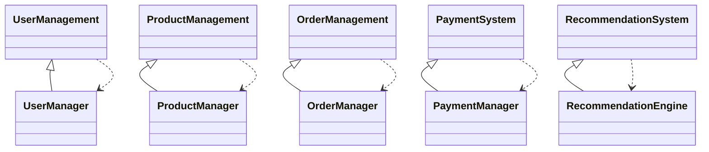
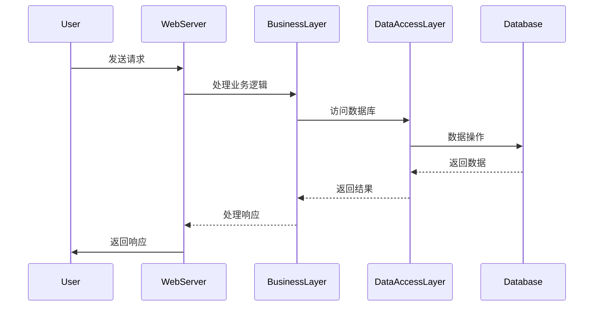
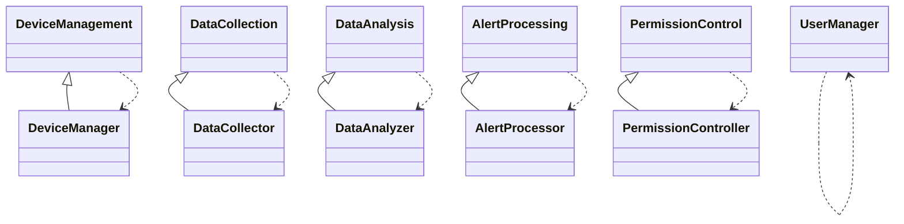
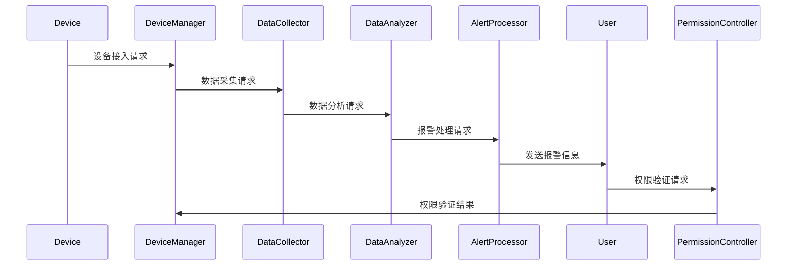

                 

### 文章标题：跨界思维：P9工程师的架构设计方法论

#### 关键词：跨界思维、P9工程师、架构设计、方法论、实战项目

#### 摘要：

本文旨在探讨跨界思维在P9工程师架构设计中的应用。通过分析跨界思维的背景和重要性，以及P9工程师的职业发展路径，我们深入探讨了架构设计的核心概念、系统分析、系统架构设计、系统接口设计和交互等关键领域。随后，通过两个实战项目的案例分析，展示跨界思维在架构设计中的实际应用，并总结最佳实践和未来趋势。本文将帮助读者理解跨界思维在架构设计中的价值，并掌握P9工程师所需的架构设计方法论。

----------------------------------------------------------------

## 第一部分：引言

在当今快速发展的技术时代，跨界思维已成为一种不可或缺的创新能力。无论是从技术创新、商业竞争还是团队协作的角度来看，跨界思维都能够带来新的视角和解决方案。本文首先介绍跨界思维的背景和重要性，然后讨论P9工程师的职业发展路径，为后续的架构设计方法论奠定基础。

### 第1章：跨界思维的背景和重要性

#### 1.1 跨界思维的起源和发展

跨界思维，顾名思义，是指跨越不同领域、专业或学科边界的思维方式。它起源于20世纪初的工业革命时期，随着知识体系的分化和专业化，跨界思维逐渐成为一种重要的创新方法。近年来，随着互联网、大数据、人工智能等新兴技术的崛起，跨界思维的应用范围进一步扩大。

#### 1.2 跨界思维的重要性

跨界思维的重要性体现在以下几个方面：

1. **促进创新**：跨界思维能够打破传统的思维定势，促进跨学科的交流与合作，从而激发新的创新点子和解决方案。
2. **提高竞争力**：在竞争激烈的商业环境中，跨界思维可以帮助企业快速适应市场变化，开发出更具竞争力的产品和服务。
3. **提升个人能力**：跨界思维有助于拓宽个人的知识面和视野，提升个人的综合素质和创新能力。

#### 1.3 跨界思维的应用领域

跨界思维在多个领域得到了广泛应用，包括：

1. **技术创新**：如人工智能、物联网、区块链等领域。
2. **商业模式创新**：如共享经济、平台经济等。
3. **团队管理**：如跨部门协作、团队建设等。

### 第2章：P9工程师的职业发展路径

#### 2.1 P9工程师的角色和职责

P9工程师，通常指具有高级技术能力和领导力的资深工程师，他们在团队中扮演着核心角色。P9工程师的职责包括：

1. **技术领导**：引领团队在技术领域不断突破和创新。
2. **项目规划**：制定项目的技术路线和进度计划。
3. **团队管理**：指导和培养团队成员，提升团队整体技术水平。

#### 2.2 P9工程师的职业发展路径

P9工程师的职业发展路径通常包括以下几个阶段：

1. **初级工程师**：具备扎实的编程技能和基本的项目经验。
2. **中级工程师**：能够独立负责项目，具备一定的技术视野和团队协作能力。
3. **高级工程师**：具备丰富的项目经验，能够解决复杂的技术问题，具备技术领导力。
4. **P9工程师**：具备高级技术能力和领导力，能够在企业中发挥核心作用。

#### 2.3 成为P9工程师的必备技能

要成为P9工程师，以下技能是必不可少的：

1. **专业领域知识**：具备扎实的计算机科学和软件工程知识。
2. **技术领导力**：具备带领团队进行技术创新和项目执行的能力。
3. **跨学科能力**：具备跨界思维，能够将不同领域的知识融合应用于项目中。
4. **沟通能力**：具备良好的沟通和团队协作能力，能够有效地与团队成员、管理层和客户沟通。

----------------------------------------------------------------

## 第二部分：架构设计方法论

架构设计是软件工程中的核心环节，它决定了系统的可扩展性、稳定性和维护性。在本部分中，我们将深入探讨架构设计的核心概念、系统分析、系统架构设计、系统接口设计和交互等关键领域。

### 第3章：架构设计的核心概念

#### 3.1 软件架构的定义和作用

软件架构是指软件系统的整体结构和组成部分，以及它们之间的相互关系。软件架构的作用包括：

1. **指导开发**：明确系统的技术方向和实现路径。
2. **优化性能**：通过合理的架构设计提高系统的性能和可扩展性。
3. **简化维护**：通过模块化和分层设计，简化系统的维护工作。

#### 3.2 架构设计的原则和方法

架构设计需要遵循一系列原则和方法，以确保系统的质量。这些原则和方法包括：

1. **模块化**：将系统划分为多个独立的模块，便于开发和管理。
2. **层次化**：按照功能层次设计系统，便于管理和扩展。
3. **解耦**：通过解耦减少模块之间的依赖，提高系统的灵活性和可维护性。

#### 3.3 架构设计的核心概念

架构设计涉及多个核心概念，包括：

1. **组件**：系统中的基本构建块，具有明确的职责和接口。
2. **接口**：组件之间的交互界面，定义了组件之间的通信方式。
3. **模式**：在软件架构中，特定的设计模式用于解决常见的问题，如MVC、微服务架构等。

### 第4章：系统分析

系统分析是架构设计的前期工作，它通过对系统的需求、功能和约束进行分析，为后续的架构设计提供依据。在本章中，我们将探讨系统分析的概念和方法。

#### 4.1 系统分析的概念和方法

系统分析主要包括以下内容：

1. **需求分析**：明确系统的功能和性能要求。
2. **功能设计**：定义系统的功能模块和接口。
3. **性能分析**：评估系统的性能指标，如响应时间、吞吐量等。
4. **约束分析**：识别系统开发过程中的限制条件，如预算、时间、技术限制等。

#### 4.2 系统功能设计

系统功能设计是系统分析的核心部分，它包括：

1. **领域模型**：使用类图或实体关系图（ER图）来描述系统的数据模型。
2. **功能模块**：将系统功能划分为多个模块，每个模块负责特定的功能。
3. **接口设计**：定义模块之间的交互接口，确保模块之间的解耦。

#### 4.3 系统功能设计

系统功能设计是系统分析的核心部分，它包括：

1. **领域模型**：使用类图或实体关系图（ER图）来描述系统的数据模型。
2. **功能模块**：将系统功能划分为多个模块，每个模块负责特定的功能。
3. **接口设计**：定义模块之间的交互接口，确保模块之间的解耦。

### 第5章：系统架构设计

系统架构设计是软件工程中的关键环节，它决定了系统的整体结构和性能。在本章中，我们将探讨系统架构设计的基本原则、流程和案例分析。

#### 5.1 系统架构设计的基本原则

系统架构设计需要遵循以下基本原则：

1. **可扩展性**：确保系统能够适应未来需求的变化。
2. **稳定性**：确保系统在高并发、大数据量等情况下依然稳定运行。
3. **可维护性**：确保系统能够方便地进行维护和升级。

#### 5.2 系统架构设计流程

系统架构设计通常包括以下步骤：

1. **需求分析**：明确系统的功能和技术要求。
2. **架构设计**：设计系统的整体架构，包括模块划分、层次结构等。
3. **接口设计**：定义模块之间的交互接口。
4. **架构验证**：通过模拟测试和性能分析验证架构的可行性和性能。

#### 5.3 系统架构设计案例分析

在本章中，我们将通过一个实际案例，展示系统架构设计的全过程，包括需求分析、架构设计和接口设计等。

### 第6章：系统接口设计和交互

系统接口设计和交互是系统架构设计的重要组成部分，它决定了系统的可扩展性和灵活性。在本章中，我们将探讨系统接口设计和交互的概念、原则和工具。

#### 6.1 接口设计的基本原则

接口设计需要遵循以下基本原则：

1. **最小化依赖**：确保接口之间的依赖最小化，提高系统的解耦性。
2. **标准化**：使用标准化的接口规范，便于不同模块之间的集成。
3. **灵活性**：确保接口能够适应未来需求的变化。

#### 6.2 接口设计工具和技巧

接口设计可以使用多种工具和技巧，包括：

1. **RESTful API**：使用RESTful架构设计接口，便于不同模块之间的通信。
2. **消息队列**：使用消息队列实现模块之间的异步通信，提高系统的性能和可扩展性。
3. **事件驱动**：使用事件驱动架构，实现模块之间的松耦合。

#### 6.3 系统交互设计

系统交互设计是接口设计的延伸，它包括：

1. **交互流程设计**：设计系统各模块之间的交互流程，确保系统运行的高效和稳定。
2. **交互协议**：定义系统各模块之间的通信协议，确保通信的可靠性和安全性。
3. **交互性能分析**：评估系统交互的性能指标，如响应时间、吞吐量等。

----------------------------------------------------------------

## 第三部分：项目实战

通过理论的学习，我们了解了跨界思维和架构设计方法论的基本概念和实践原则。接下来，我们将通过两个实际项目的案例分析，展示如何将跨界思维和架构设计方法论应用于实际项目中。这些项目案例将帮助我们更好地理解跨界思维在架构设计中的实际应用，并掌握P9工程师所需的架构设计能力。

### 第7章：实战项目一：电商平台架构设计

#### 7.1 项目介绍

电商平台是一个复杂的系统，需要处理大量的用户数据、商品信息、订单和支付等操作。为了确保平台的高性能、高可用性和可扩展性，本项目采用了跨界思维和架构设计方法论，进行了系统的架构设计和优化。

#### 7.2 系统功能设计

在系统功能设计阶段，我们首先进行了需求分析，明确了电商平台的主要功能模块，包括用户管理、商品管理、订单管理、支付系统、推荐系统等。然后，我们使用Mermaid类图（如下所示）来描述这些模块及其关系：



#### 7.3 系统架构设计

在系统架构设计阶段，我们采用了分层架构设计原则，将系统划分为多个层次，包括表示层、业务逻辑层、数据访问层和数据存储层。具体的架构设计如下：

1. **表示层**：负责与用户交互，处理用户的请求和响应。
2. **业务逻辑层**：处理具体的业务逻辑，包括用户管理、商品管理、订单管理等。
3. **数据访问层**：负责与数据库进行交互，实现数据的增删改查操作。
4. **数据存储层**：存储用户数据、商品数据、订单数据等。

下面是系统架构设计的Mermaid架构图：



#### 7.4 系统接口设计和交互

在系统接口设计和交互阶段，我们采用了RESTful API设计原则，定义了各个模块之间的接口。例如，用户管理模块提供了用户注册、登录、信息修改等接口，商品管理模块提供了商品查询、添加、删除等接口，订单管理模块提供了订单查询、创建、取消等接口。具体的接口设计如下：

```mermaid
stateDiagram-v2
    UserRegistration -> Login -> UserInformationUpdate
    ProductQuery -> ProductAdd -> ProductDelete
    OrderQuery -> OrderCreate -> OrderCancel
```

#### 7.5 项目小结

通过本项目，我们展示了如何将跨界思维和架构设计方法论应用于实际项目中，实现了电商平台的系统架构设计。项目的主要收获包括：

1. **提高系统的性能和可用性**：通过分层架构设计和优化，系统具备了较高的性能和可用性。
2. **增强系统的可扩展性**：通过模块化设计和接口设计，系统具备良好的可扩展性，便于未来需求的变化。
3. **提升团队协作效率**：通过跨界思维，团队成员能够更好地理解项目需求，提高协作效率。

### 第8章：实战项目二：物联网平台架构设计

#### 8.1 项目介绍

物联网平台是一个连接物理世界和数字世界的桥梁，负责处理海量的传感器数据、设备状态信息、报警信息等。为了确保物联网平台的高性能、高可靠性和安全性，本项目同样采用了跨界思维和架构设计方法论，进行了系统的架构设计和优化。

#### 8.2 系统功能设计

在系统功能设计阶段，我们首先进行了需求分析，明确了物联网平台的主要功能模块，包括设备管理、数据采集、数据分析、报警处理、用户管理、权限控制等。然后，我们使用Mermaid类图（如下所示）来描述这些模块及其关系：



#### 8.3 系统架构设计

在系统架构设计阶段，我们采用了分布式架构设计原则，将系统划分为多个子系统和模块，包括设备管理子系统、数据采集子系统、数据分析子系统、报警处理子系统等。具体的架构设计如下：

1. **设备管理子系统**：负责设备的接入、配置和管理。
2. **数据采集子系统**：负责采集传感器的数据，并将其传输到数据存储层。
3. **数据分析子系统**：负责对采集到的数据进行分析和处理，生成可视化的报表和图表。
4. **报警处理子系统**：负责处理设备异常、数据异常等报警信息，并及时通知相关人员。
5. **用户管理子系统**：负责用户的注册、登录、权限管理等操作。
6. **权限控制子系统**：负责对系统资源进行权限控制，确保系统的安全性。

下面是系统架构设计的Mermaid架构图：



#### 8.4 系统接口设计和交互

在系统接口设计和交互阶段，我们采用了微服务架构设计原则，将系统划分为多个微服务，每个微服务负责特定的功能模块。例如，设备管理模块提供了设备注册、设备配置、设备状态查询等接口，数据采集模块提供了数据上传、数据查询等接口，数据分析模块提供了数据可视化、报表生成等接口。具体的接口设计如下：

```mermaid
stateDiagram-v2
    DeviceRegistration -> DeviceConfiguration -> DeviceStatusQuery
    DataUpload -> DataQuery -> DataVisualization
    AlertProcessing -> AlertNotification
```

#### 8.5 项目小结

通过本项目，我们展示了如何将跨界思维和架构设计方法论应用于物联网平台的设计和实现中，实现了物联网平台的高性能、高可靠性和安全性。项目的主要收获包括：

1. **提高系统的性能和可靠性**：通过分布式架构设计和优化，系统具备了较高的性能和可靠性。
2. **增强系统的可扩展性**：通过微服务架构设计和接口设计，系统具备良好的可扩展性，便于未来需求的变化。
3. **提升用户体验**：通过数据分析和可视化，用户能够更好地了解设备状态和运行情况，提高用户体验。

----------------------------------------------------------------

## 第四部分：最佳实践与展望

在前三部分的讨论中，我们详细探讨了跨界思维在P9工程师架构设计中的应用，通过两个实际项目的案例分析，展示了跨界思维和架构设计方法论在解决复杂问题中的价值。在本部分，我们将总结最佳实践技巧，并展望跨界思维和架构设计的未来趋势。

### 第9章：最佳实践技巧

在架构设计和项目实施过程中，积累最佳实践技巧至关重要。以下是一些架构设计中的常见问题和对应的解决方案：

#### 9.1 架构设计中的常见问题

1. **系统复杂性过高**：解决方案：采用模块化设计和分层架构，降低系统的复杂性。
2. **系统性能瓶颈**：解决方案：进行性能分析和优化，如使用缓存、分布式架构、异步处理等。
3. **系统扩展性不足**：解决方案：采用微服务架构、接口设计标准化、可扩展性设计等。
4. **系统安全性问题**：解决方案：进行安全设计和审计，如使用安全协议、加密存储、权限控制等。

#### 9.2 解决方案和最佳实践

1. **模块化设计**：将系统划分为多个模块，每个模块负责特定功能，便于开发和维护。
2. **接口标准化**：使用标准化接口规范，如RESTful API、GraphQL等，提高系统的可扩展性和灵活性。
3. **性能优化**：进行系统性能测试和优化，关注关键性能指标，如响应时间、吞吐量、并发处理能力等。
4. **安全性设计**：在架构设计阶段考虑安全性，使用安全协议、加密存储、访问控制等手段，提高系统的安全性。

#### 9.3 风险管理和应急预案

1. **风险评估**：在项目启动阶段进行风险评估，识别潜在风险，制定风险管理计划。
2. **应急预案**：制定应急预案，确保在系统故障或突发事件时，能够快速恢复系统运行。

### 第10章：跨界思维的未来

跨界思维在技术、商业和团队协作等方面具有巨大的潜力，其未来发展值得关注。以下是对跨界思维未来发展的展望：

#### 10.1 跨界思维的未来发展趋势

1. **技术创新**：跨界思维将继续推动技术创新，如人工智能、物联网、区块链等领域的融合。
2. **商业模式创新**：跨界思维将促进商业模式创新，如平台经济、共享经济等。
3. **团队协作**：跨界思维将促进团队协作，提高团队的创新能力和执行力。

#### 10.2 架构设计的未来方向

1. **分布式架构**：随着云计算、边缘计算的发展，分布式架构将更加普及。
2. **微服务架构**：微服务架构将继续成为主流架构设计模式，提高系统的灵活性和可扩展性。
3. **智能化架构**：借助人工智能技术，智能化架构设计将成为趋势，如基于数据驱动的架构优化、自动化部署等。

#### 10.3 P9工程师的未来职业发展

1. **技术领导力**：P9工程师需要不断提升技术领导力，引领团队在技术领域不断创新。
2. **跨学科能力**：P9工程师需要具备跨学科能力，能够将不同领域的知识融合应用于项目中。
3. **商业洞察力**：P9工程师需要具备商业洞察力，了解市场需求，为企业创造价值。

## 结论

本文通过跨界思维和架构设计方法论的应用，探讨了P9工程师在架构设计中的核心能力。通过实际项目案例分析，展示了跨界思维在解决复杂问题中的价值。未来，P9工程师需要不断提升跨界思维和架构设计能力，引领技术发展和团队创新。

作者：AI天才研究院/AI Genius Institute & 禅与计算机程序设计艺术 /Zen And The Art of Computer Programming

----------------------------------------------------------------

### 文章总结

本文深入探讨了跨界思维在P9工程师架构设计中的应用。首先，介绍了跨界思维的背景和重要性，以及P9工程师的职业发展路径。接着，详细阐述了架构设计的核心概念、系统分析、系统架构设计、系统接口设计和交互等关键领域。随后，通过两个实际项目的案例分析，展示了跨界思维和架构设计方法论在解决复杂问题中的价值。最后，总结了最佳实践技巧，并展望了跨界思维和架构设计的未来趋势。本文旨在帮助读者理解跨界思维在架构设计中的价值，提升P9工程师所需的架构设计能力。作者：AI天才研究院/AI Genius Institute & 禅与计算机程序设计艺术 /Zen And The Art of Computer Programming。

----------------------------------------------------------------

### 作者介绍

**AI天才研究院/AI Genius Institute** 是一个专注于人工智能领域研究与创新的组织，致力于推动人工智能技术的研究与应用，为行业培养顶尖人工智能人才。

**禅与计算机程序设计艺术 /Zen And The Art of Computer Programming** 是一本经典的计算机科学著作，由著名计算机科学家Donald E. Knuth撰写。本书融合了禅宗哲学与计算机程序设计，倡导程序员追求简洁、优雅和高效的代码。

感谢您阅读本文，希望本文能为您在架构设计和跨界思维方面带来新的启发和思考。如果您对本文有任何建议或意见，欢迎随时与我们联系。我们期待与您一起探索人工智能的无限可能。作者：AI天才研究院/AI Genius Institute & 禅与计算机程序设计艺术 /Zen And The Art of Computer Programming。

