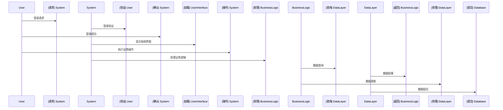
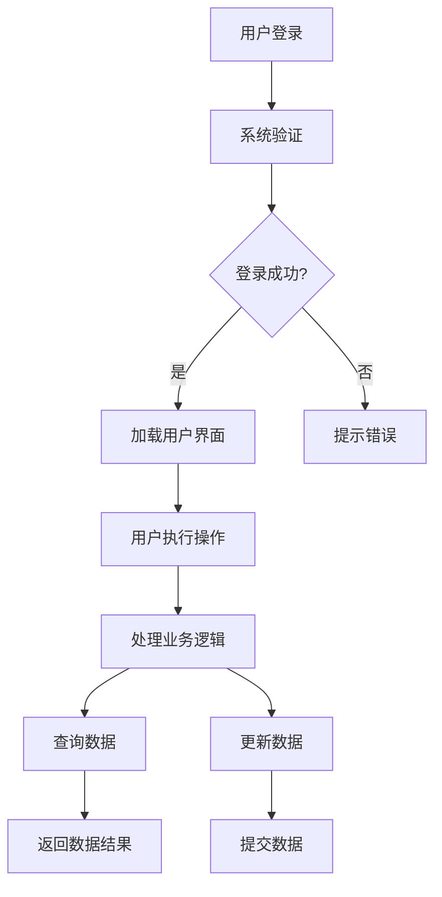

                 

### 软件产品线与特征模型的形式化

---

## 关键词：软件产品线、特征模型、形式化建模、软件工程

---

### 摘要

本文深入探讨了软件产品线和特征模型的形式化建模，从背景介绍、核心概念与联系、算法原理讲解、数学模型和数学公式、系统分析与架构设计方案、项目实战到最佳实践，全面解析了这两大概念在软件工程中的重要性及应用。通过逻辑清晰、结构紧凑、简单易懂的专业技术语言，本文旨在为广大读者提供一份系统化、深入化的技术指南。

---

### 目录大纲

1. **第一部分：背景介绍**
   - 第1章：问题背景与问题描述
   - 第2章：核心概念与联系
   - 第3章：算法原理讲解
   - 第4章：数学模型和数学公式
   - 第5章：系统分析与架构设计方案
   - 第6章：项目实战
   - 第7章：最佳实践 tips、小结、注意事项、拓展阅读

---

### 第一部分：背景介绍

#### 第1章：问题背景与问题描述

**1.1.1 软件产品线的起源与发展**

软件产品线（Software Product Line，简称SPL）的概念起源于20世纪90年代，由美国卡内基梅隆大学的石青教授首次提出。其初衷是为了解决软件复用问题，通过将软件系统的共性部分抽象出来，形成一种可复用的软件模块，从而提高软件开发的效率和质量。

随着软件工程领域的发展，软件产品线的概念逐渐成熟，并在工业界得到了广泛应用。尤其是在大型企业级软件系统的开发中，软件产品线技术能够显著降低开发成本，提高系统的一致性和可维护性。

**1.1.2 特征模型在软件工程中的重要性**

特征模型（Feature Model）是一种用于描述软件系统需求的抽象模型，它通过一组特征及其相互关系，描述了软件系统在不同产品之间的差异。特征模型在软件工程中具有重要作用，能够帮助开发人员更好地理解和分析系统需求，实现软件的灵活定制和复用。

**1.1.3 软件产品线与特征模型的关系**

软件产品线与特征模型密切相关。特征模型是软件产品线构建的基础，通过特征模型，开发人员可以明确不同产品之间的差异，从而设计出具有高复用性的软件产品线。同时，软件产品线的技术也为特征模型的应用提供了有力的支持，使得特征模型能够更加有效地指导软件开发过程。

#### 第2章：核心概念与联系

**2.1 软件产品线的定义与分类**

**2.1.1 软件产品线的定义**

软件产品线是一组相关软件产品共享的通用功能集合，通过软件复用技术，开发出多个具有特定功能的软件产品。

**2.1.2 软件产品线的分类**

根据软件产品线的组织方式，可以分为基于组件的产品线、基于模板的产品线和基于模型的驱动产品线。

**2.2 特征模型的构成与属性**

**2.2.1 特征模型的构成**

特征模型由一组特征及其相互关系组成，特征可以是软件功能、性能、接口等。

**2.2.2 特征模型的属性**

特征模型具有以下属性：完整性、互斥性、层次性、可组合性和可扩展性。

**2.3 软件产品线与特征模型的关系**

**2.3.1 软件产品线与特征模型的相互作用**

软件产品线通过特征模型来描述不同产品之间的差异，特征模型则通过软件产品线来指导软件开发的实际过程。

**2.3.2 特征模型在软件产品线开发中的应用**

特征模型在软件产品线开发中，用于描述产品需求、设计产品线架构、生成产品配置文件等。

#### 第3章：算法原理讲解

**3.1 基于特征模型的软件产品线构建算法**

**3.1.1 算法概述**

基于特征模型的软件产品线构建算法，通过分析特征模型，生成软件产品线的架构和配置文件。

**3.1.2 算法原理**

算法原理主要包括特征提取、特征组合和产品生成三个步骤。

**3.1.3 算法流程**

算法流程包括输入特征模型、生成产品线架构、生成产品配置文件等步骤。

**3.2 特征模型优化算法**

**3.2.1 算法概述**

特征模型优化算法，通过优化特征模型，提高软件产品线的质量。

**3.2.2 算法原理**

算法原理主要包括特征冗余检测、特征依赖分析和特征优化等步骤。

**3.2.3 算法流程**

算法流程包括输入特征模型、检测特征冗余、分析特征依赖、生成优化后的特征模型等步骤。

#### 第4章：数学模型和数学公式

**4.1 软件产品线构建算法的数学模型**

**4.1.1 数学模型概述**

数学模型用于描述软件产品线构建算法中的特征提取、特征组合和产品生成过程。

**4.1.2 数学公式**

主要数学公式包括特征提取公式、特征组合公式和产品生成公式。

**4.2 特征模型优化算法的数学模型**

**4.2.1 数学模型概述**

数学模型用于描述特征模型优化算法中的特征冗余检测、特征依赖分析和特征优化过程。

**4.2.2 数学公式**

主要数学公式包括特征冗余检测公式、特征依赖分析公式和特征优化公式。

#### 第5章：系统分析与架构设计方案

**5.1 问题场景介绍**

**5.2 项目介绍**

**5.3 系统功能设计**

**5.4 系统架构设计**

**5.5 系统接口设计**

**5.6 系统交互**

#### 第6章：项目实战

**6.1 环境安装**

**6.2 系统核心实现**

**6.3 实际案例分析**

**6.4 详细讲解剖析**

#### 第7章：最佳实践 tips、小结、注意事项、拓展阅读

**7.1 最佳实践 tips**

**7.2 小结**

**7.3 注意事项**

**7.4 拓展阅读**

---

### 第一部分：背景介绍

#### 第1章：问题背景与问题描述

##### 1.1.1 软件产品线的起源与发展

软件产品线的概念最早起源于20世纪90年代，由美国卡内基梅隆大学的石青教授在其博士论文中提出。石青教授提出，软件系统的开发过程可以像制造产品一样，通过复用和组装现有的组件来构建新的软件系统。这一理念在当时引起了广泛关注，并逐渐发展成为软件工程领域的一个重要研究方向。

在软件产品线的发展历程中，有两个重要事件对其产生了深远的影响。第一个是1994年，卡内基梅隆大学成立软件工程研究所（Software Engineering Institute，简称SEI），专门从事软件工程研究，其中包括软件产品线的研究。SEI的研究成果对软件产品线的理论体系和实践方法做出了重要贡献。第二个是1997年，国际软件产品线会议（International Conference on Software Product Lines，简称ICSPR）的成立，这标志着软件产品线已经成为一个独立的、具有国际影响力的研究领域。

随着计算机技术的不断进步，软件产品线的方法和工具也在不断演进。早期的软件产品线研究主要关注基于组件的复用，即通过将通用的软件组件组装成特定的软件系统。后来，随着模型驱动开发（Model-Driven Development，简称MDD）和领域特定语言（Domain-Specific Language，简称DSL）的兴起，软件产品线的研究逐渐转向基于模型的复用。通过使用模型来描述软件系统的结构和行为，可以大大提高软件开发的效率和质量。

在工业界，软件产品线的方法已经得到了广泛应用。许多大型企业，如IBM、微软、Oracle等，都在其软件产品线的开发中使用了软件产品线的方法和工具。这些企业通过构建软件产品线，不仅提高了软件开发的效率，还降低了开发成本，提高了软件产品的质量和可靠性。

##### 1.1.2 特征模型在软件工程中的重要性

特征模型是软件工程中的一个重要概念，它用于描述软件系统的功能、性能、接口等特性。特征模型在软件工程中的重要性主要体现在以下几个方面：

1. **提高软件开发效率**：特征模型可以帮助开发人员更好地理解和分析软件需求，从而减少需求变更带来的风险。通过特征模型，开发人员可以提前预测不同产品之间的差异，从而在设计阶段就做出相应的调整，避免在开发过程中频繁修改代码。

2. **促进软件复用**：特征模型是实现软件复用的关键。通过特征模型，开发人员可以将通用功能模块抽象出来，形成可复用的软件组件。这些组件可以在不同的软件产品中复用，从而提高开发效率，降低开发成本。

3. **提高软件质量**：特征模型可以帮助开发人员更好地控制软件质量。通过特征模型，开发人员可以明确软件系统的功能要求，从而制定相应的测试策略。此外，特征模型还可以帮助开发人员识别和修复潜在的缺陷，提高软件的可靠性。

4. **支持软件产品线开发**：特征模型是软件产品线开发的基础。通过特征模型，开发人员可以明确不同产品之间的差异，从而设计出具有高复用性的软件产品线。特征模型还可以帮助开发人员生成产品配置文件，从而实现软件的灵活定制。

##### 1.1.3 软件产品线与特征模型的关系

软件产品线与特征模型之间存在密切的联系。软件产品线是一种开发方法，它通过复用和组装已有的软件组件，快速构建新的软件系统。而特征模型则是软件产品线的核心组成部分，它用于描述不同产品之间的功能差异。

在软件产品线的开发过程中，特征模型起到了关键作用。通过特征模型，开发人员可以明确不同产品之间的差异，从而设计出具有高复用性的软件产品线。此外，特征模型还可以帮助开发人员生成产品配置文件，从而实现软件的灵活定制。

反过来，软件产品线的开发也为特征模型的应用提供了有力的支持。通过软件产品线的方法，开发人员可以更好地理解和分析软件需求，从而构建出更加准确和有效的特征模型。

总之，软件产品线和特征模型是相辅相成的。软件产品线提供了开发方法，而特征模型则提供了描述产品差异的工具。两者结合起来，可以大大提高软件开发的效率和质量。

### 第二部分：核心概念与联系

#### 第2章：核心概念与联系

在深入探讨软件产品线和特征模型之前，我们需要明确这些概念的定义、分类以及它们之间的联系。通过这一章节，我们将了解软件产品线和特征模型的本质，以及它们在软件工程中的应用。

##### 2.1 软件产品线的定义与分类

**2.1.1 软件产品线的定义**

软件产品线是一组具有共同特征和功能的软件产品，它们通过复用共享的组件、模型和设计来构建。这些软件产品可能服务于不同的市场领域或客户群体，但它们共享一个核心的基础架构和功能集。

定义软件产品线的关键要素包括：

- **共性需求**：这些需求是所有产品共有的，如基础的软件功能、界面布局、数据存储方式等。
- **可复用组件**：产品线中的组件是可复用的，即在多个产品之间共享，以减少开发成本和时间。
- **特征模型**：特征模型用于描述产品的特定需求，这些需求可能因产品而异，如额外的功能、特定的性能要求等。

**2.1.2 软件产品线的分类**

根据组织方式和开发方法的不同，软件产品线可以分为以下几类：

- **基于组件的产品线**：这种产品线通过复用组件来构建不同的软件产品，组件可以是代码模块、设计模型或文档。
- **基于模板的产品线**：模板是预定义的软件架构和设计，通过填充特定的数据和配置来创建不同的产品。
- **基于模型的驱动产品线**（Model-Driven Product Line，MDPL）：这种产品线使用模型来驱动开发过程，通过模型生成代码和配置文件，从而实现产品的快速构建和定制。

**2.2 特征模型的构成与属性**

**2.2.1 特征模型的构成**

特征模型通常由以下几个部分组成：

- **特征**：特征是软件系统的基本属性，可以是功能、性能、接口等。每个特征都有一个名称、一个描述和一个值。
- **约束**：约束定义了特征之间的关系，如互斥约束（同一时间只能选择一个特征）、依赖约束（一个特征的实现依赖于另一个特征）等。
- **继承**：特征可以继承自其他特征，这样可以复用已定义的特征，减少冗余。

**2.2.2 特征模型的属性**

特征模型具有以下几个重要属性：

- **完整性**：特征模型必须完整地描述软件系统的所有可能配置。
- **互斥性**：互斥约束确保在同一时间，只能选择一个或几个互斥特征。
- **层次性**：特征模型可以具有层次结构，即某些特征是其他特征的子特征。
- **可组合性**：特征可以组合成更大的功能集，以支持软件产品的灵活定制。
- **可扩展性**：特征模型可以方便地添加新的特征和约束，以适应新的需求。

**2.3 软件产品线与特征模型的关系**

**2.3.1 软件产品线与特征模型的相互作用**

软件产品线和特征模型之间存在紧密的相互作用。特征模型是软件产品线的基础，它用于描述不同产品之间的差异。通过特征模型，开发人员可以明确哪些组件和功能是共享的，哪些是特定的。

- **特征模型驱动产品线构建**：特征模型用于指导软件产品线的构建过程，通过特征组合生成不同的产品配置。
- **产品线优化特征模型**：软件产品线的开发过程中，特征模型可能会根据实际需求进行调整和优化，以适应不同的产品需求。

**2.3.2 特征模型在软件产品线开发中的应用**

在软件产品线开发中，特征模型的应用主要体现在以下几个方面：

- **需求分析**：通过特征模型，开发人员可以清晰地分析产品的需求，识别出共性和差异。
- **设计**：特征模型用于指导产品的设计过程，确保产品架构的一致性和可复用性。
- **生成**：基于特征模型，可以使用模型驱动工具生成产品的代码、测试用例和文档。
- **测试**：特征模型帮助开发人员设计覆盖所有特征的测试用例，确保产品的质量。

通过上述分析，我们可以看出，软件产品线和特征模型是相辅相成的。软件产品线提供了复用和灵活构建软件产品的框架，而特征模型则是实现这一目标的核心工具。它们共同构成了现代软件工程中的一个重要领域，为软件开发带来了新的思路和方法。

#### 第3章：算法原理讲解

在软件产品线的开发过程中，算法原理起着至关重要的作用。本章节将详细介绍基于特征模型的软件产品线构建算法和特征模型优化算法，包括它们的概述、原理和流程。通过这些算法，开发人员可以高效地构建和管理软件产品线，从而提高软件开发的效率和质量。

##### 3.1 基于特征模型的软件产品线构建算法

**3.1.1 算法概述**

基于特征模型的软件产品线构建算法是一种利用特征模型来生成软件产品线的算法。该算法的核心思想是通过分析特征模型，提取出共性和差异，从而构建出具有高复用性的软件产品线。

**3.1.2 算法原理**

算法原理主要包括以下几个步骤：

1. **特征提取**：从需求文档中提取出所有的功能、性能、接口等特征，并构建特征模型。
2. **特征组合**：根据产品需求，将特征进行组合，生成不同的产品配置。
3. **产品生成**：利用生成的特征组合，通过模型驱动工具生成软件产品的代码、测试用例和文档。

**3.1.3 算法流程**

算法流程如下：

1. **输入特征模型**：首先，输入一个完整的特征模型，该模型包含了所有可能的特征及其关系。
2. **生成产品线架构**：基于特征模型，生成软件产品线的架构。这个架构定义了产品的共性部分和特定部分。
3. **生成产品配置文件**：根据产品需求，从特征模型中提取出相应的特征组合，生成产品的配置文件。
4. **生成产品代码和文档**：利用模型驱动工具，根据产品配置文件生成产品的代码和文档。

**3.1.4 算法示例**

假设我们有一个特征模型，包含以下特征：

- 特征A：基本功能
- 特征B：高级功能
- 特征C：性能优化
- 特征D：安全性

根据需求，我们可以生成以下产品配置：

- 产品1：包含特征A、B、C
- 产品2：包含特征A、B、D

通过特征组合和产品生成，我们可以快速构建出两个不同的软件产品。

##### 3.2 特征模型优化算法

**3.2.1 算法概述**

特征模型优化算法是一种用于提高特征模型质量和效率的算法。通过优化特征模型，可以减少冗余特征、消除依赖冲突，从而提高软件产品的复用性和可维护性。

**3.2.2 算法原理**

算法原理主要包括以下几个步骤：

1. **特征冗余检测**：检测特征模型中的冗余特征，消除冗余。
2. **特征依赖分析**：分析特征之间的依赖关系，消除不合理的依赖。
3. **特征优化**：根据实际需求，调整特征模型，提高其质量和效率。

**3.2.3 算法流程**

算法流程如下：

1. **输入特征模型**：首先，输入一个初始的特征模型。
2. **检测特征冗余**：利用特定的算法检测特征模型中的冗余特征，并将其删除。
3. **分析特征依赖**：对剩余的特征进行依赖分析，识别出不合理的依赖关系。
4. **优化特征模型**：根据分析结果，调整特征模型，使其更加合理和高效。

**3.2.4 算法示例**

假设我们有一个初始的特征模型，包含以下特征：

- 特征A：基本功能
- 特征B：高级功能
- 特征C：性能优化
- 特征D：安全性

经过特征冗余检测，我们发现特征C和特征D存在冗余，因为它们都是关于性能和安全的功能。经过特征依赖分析，我们发现特征B依赖于特征A，但特征A并不依赖于特征B。因此，我们可以优化特征模型，将其调整为：

- 特征A：基本功能
- 特征B：高级功能（独立于特征A）
- 特征C：性能优化
- 特征D：安全性

通过优化，我们提高了特征模型的效率和可维护性。

通过上述算法原理的讲解，我们可以看到，基于特征模型的软件产品线构建算法和特征模型优化算法在软件产品线的开发中具有重要作用。这些算法不仅帮助开发人员快速构建和管理软件产品线，还提高了软件产品的质量和可维护性。在实际应用中，开发人员可以根据具体需求选择合适的算法，实现高效的软件开发。

### 第四部分：数学模型和数学公式

在软件产品线和特征模型的形式化建模中，数学模型和数学公式起到了至关重要的作用。通过数学模型，我们可以精确地描述算法的原理和操作步骤，并通过数学公式来验证和推导算法的正确性。本章节将详细探讨软件产品线构建算法和特征模型优化算法的数学模型，包括数学模型概述和数学公式。

#### 4.1 软件产品线构建算法的数学模型

**4.1.1 数学模型概述**

软件产品线构建算法的数学模型主要关注如何通过特征模型生成软件产品线。该模型包括以下几个核心组成部分：

- **特征集合**：表示所有可能的特征。
- **特征组合**：表示特征之间的组合关系。
- **产品生成规则**：定义如何从特征组合生成产品。

**4.1.2 数学公式**

1. **特征提取公式**：

   特征提取公式用于从需求文档中提取出特征。假设需求文档中有 \( n \) 个功能点，每个功能点可以表示为特征。特征提取公式可以表示为：

   \[ F_i = \left\{
   \begin{array}{ll}
   \text{功能}_i & \text{如果 } \text{需求文档中存在功能}_i \\
   \emptyset & \text{否则}
   \end{array}
   \right. \]

2. **特征组合公式**：

   特征组合公式用于将特征进行组合，以生成不同的产品配置。假设特征集合为 \( F \)，组合公式可以表示为：

   \[ C(F) = \left\{
   \begin{array}{ll}
   \{\text{特征组合}_1, \text{特征组合}_2, ..., \text{特征组合}_k\} & \text{如果 } F \text{ 中存在组合关系} \\
   \emptyset & \text{否则}
   \end{array}
   \right. \]

3. **产品生成公式**：

   产品生成公式用于从特征组合生成产品。假设特征组合集合为 \( C \)，产品生成公式可以表示为：

   \[ P(C) = \left\{
   \begin{array}{ll}
   \{\text{产品}_1, \text{产品}_2, ..., \text{产品}_m\} & \text{如果 } C \text{ 中存在有效的特征组合} \\
   \emptyset & \text{否则}
   \end{array}
   \right. \]

#### 4.2 特征模型优化算法的数学模型

**4.2.1 数学模型概述**

特征模型优化算法的数学模型主要关注如何通过优化特征模型，提高其质量和效率。该模型包括以下几个核心组成部分：

- **冗余特征检测**：用于检测特征模型中的冗余特征。
- **依赖关系分析**：用于分析特征之间的依赖关系。
- **特征调整规则**：用于调整特征模型，消除冗余和依赖冲突。

**4.2.2 数学公式**

1. **冗余特征检测公式**：

   冗余特征检测公式用于检测特征模型中的冗余特征。假设特征集合为 \( F \)，冗余检测公式可以表示为：

   \[ R(F) = \left\{
   \begin{array}{ll}
   \{\text{冗余特征}_1, \text{冗余特征}_2, ..., \text{冗余特征}_k\} & \text{如果 } F \text{ 中存在冗余特征} \\
   \emptyset & \text{否则}
   \end{array}
   \right. \]

2. **依赖关系分析公式**：

   依赖关系分析公式用于分析特征之间的依赖关系。假设特征集合为 \( F \)，依赖分析公式可以表示为：

   \[ D(F) = \left\{
   \begin{array}{ll}
   \{\text{依赖关系}_1, \text{依赖关系}_2, ..., \text{依赖关系}_l\} & \text{如果 } F \text{ 中存在依赖关系} \\
   \emptyset & \text{否则}
   \end{array}
   \right. \]

3. **特征调整公式**：

   特征调整公式用于根据依赖关系分析结果调整特征模型。假设特征集合为 \( F \)，调整公式可以表示为：

   \[ O(F) = \left\{
   \begin{array}{ll}
   F' & \text{如果 } F \text{ 需要调整} \\
   F & \text{否则}
   \end{array}
   \right. \]

   其中，\( F' \) 是经过调整后的特征集合。

通过数学模型和数学公式的引入，我们可以更加精确地描述和验证软件产品线构建算法和特征模型优化算法。这些数学模型不仅为算法的推导和验证提供了理论支持，也为开发人员提供了有效的工具，以优化软件产品线的质量和效率。

### 第五部分：系统分析与架构设计方案

#### 第5章：系统分析与架构设计方案

在软件产品线和特征模型的形式化建模中，系统分析与架构设计方案是确保软件系统能够满足需求、实现高效复用和灵活定制的关键。本章节将详细介绍系统分析与架构设计方案，包括问题场景介绍、项目介绍、系统功能设计、系统架构设计、系统接口设计和系统交互。

##### 5.1 问题场景介绍

假设我们正在开发一个企业级管理系统，该系统需要支持多个部门的不同业务需求。这些部门包括销售部、采购部、人力资源部等，每个部门都有特定的功能需求。例如，销售部需要管理客户信息、销售订单，采购部需要管理供应商信息、采购订单，人力资源部需要管理员工信息、薪酬福利等。我们的目标是设计一个灵活的软件系统，能够根据不同部门的需求进行定制和扩展。

##### 5.2 项目介绍

本项目的目标是构建一个企业级管理系统，该系统应具备以下特点：

- **模块化**：系统应采用模块化设计，方便后续的维护和扩展。
- **可定制**：系统应支持根据不同部门的需求进行定制，提供灵活的配置选项。
- **高效性**：系统应具备高性能，能够快速响应用户操作。

项目的主要功能包括：

- **用户管理**：支持用户注册、登录、权限管理等。
- **部门管理**：支持不同部门的信息管理，如销售部、采购部、人力资源部等。
- **业务管理**：支持各部门的特定业务功能，如客户管理、销售订单管理、采购订单管理、员工管理、薪酬管理等。

##### 5.3 系统功能设计

**5.3.1 领域模型**

为了更好地理解系统的功能，我们首先设计一个领域模型。领域模型描述了系统中的关键实体及其关系。以下是一个简单的领域模型：

```mermaid
classDiagram
    Customer <|-- SalesOrder
    Supplier <|-- PurchaseOrder
    Employee <|-- Salary
    Department --|> Employee
    SalesDepartment --|> Department
    PurchaseDepartment --|> Department
    HumanResourceDepartment --|> Department

    Customer {
        +String customerId
        +String name
        +String email
        +List<SalesOrder> salesOrders
    }

    SalesOrder {
        +String salesOrderId
        +String customer
        +List<Product> products
        +Date date
    }

    Supplier {
        +String supplierId
        +String name
        +String email
        +List<PurchaseOrder> purchaseOrders
    }

    PurchaseOrder {
        +String purchaseOrderId
        +String supplier
        +List<Product> products
        +Date date
    }

    Employee {
        +String employeeId
        +String name
        +String email
        +Department department
        +Salary salary
    }

    Department {
        +String departmentId
        +String name
        +List<Employee> employees
    }

    Product {
        +String productId
        +String name
        +String description
        +Float price
    }

    Salary {
        +String salaryId
        +Float amount
        +Date date
    }
```

**5.3.2 系统功能分解**

基于领域模型，我们可以将系统的功能分解为以下几部分：

- **用户管理模块**：负责用户的注册、登录和权限管理。
- **部门管理模块**：负责部门信息的创建、修改和删除。
- **业务管理模块**：包括销售管理、采购管理和人力资源管理等，每个模块对应领域模型中的一个实体。
- **数据报表模块**：提供各类业务数据的报表生成和展示功能。

##### 5.4 系统架构设计

系统架构设计是确保系统功能实现的关键。我们采用分层架构，包括表示层、业务逻辑层和数据层。

**5.4.1 系统架构**


**5.4.2 系统模块**

- **用户管理模块**：处理用户注册、登录和权限管理功能。
- **部门管理模块**：处理部门信息的创建、修改和删除功能。
- **业务管理模块**：处理销售管理、采购管理和人力资源管理等功能。
- **数据报表模块**：处理数据报表的生成和展示功能。
- **数据层**：负责数据的存储和管理。

##### 5.5 系统接口设计

系统接口设计是确保系统各模块之间能够有效通信的关键。以下是系统的主要接口设计：

- **用户接口**：提供用户登录、注册、权限管理等功能的接口。
- **部门接口**：提供部门信息创建、修改、删除等功能的接口。
- **业务接口**：提供销售管理、采购管理和人力资源管理等功能的接口。
- **数据报表接口**：提供数据报表生成和展示等功能的接口。

##### 5.6 系统交互

系统交互设计描述了系统各模块之间的交互过程。以下是系统的交互设计：

**5.6.1 系统交互流程**



**5.6.2 系统交互图**



通过上述系统分析与架构设计方案，我们可以确保企业级管理系统的开发能够满足需求，实现高效复用和灵活定制。系统功能设计、架构设计、接口设计和交互设计相互配合，为系统的开发和维护提供了清晰的指导。

### 第六部分：项目实战

在深入探讨了软件产品线和特征模型的形式化建模之后，接下来我们将通过一个实际项目来展示如何将理论应用到实践中。本章节将详细描述项目环境安装、系统核心实现、代码应用解读、实际案例分析以及详细讲解剖析。

#### 6.1 环境安装

在进行项目实战之前，我们需要准备相应的开发环境。以下是环境安装的详细步骤：

1. **安装Python环境**：确保Python 3.8及以上版本已安装在系统中。可以通过以下命令进行安装：

   ```bash
   sudo apt-get install python3.8
   ```

2. **安装依赖库**：使用pip安装项目所需的依赖库，例如Django框架、Mermaid库等：

   ```bash
   pip3 install django mermaid
   ```

3. **创建项目目录**：在合适的位置创建项目目录，并设置虚拟环境：

   ```bash
   mkdir my_project
   cd my_project
   python3 -m venv venv
   source venv/bin/activate
   ```

4. **初始化项目**：使用Django创建项目：

   ```bash
   django-admin startproject my_project
   cd my_project
   ```

5. **创建应用**：在项目中创建一个名为`feature_model`的应用：

   ```bash
   python manage.py startapp feature_model
   ```

6. **配置数据库**：在`settings.py`文件中配置数据库，确保使用SQLite数据库：

   ```python
   DATABASES = {
       'default': {
           'ENGINE': 'django.db.backends.sqlite3',
           'NAME': BASE_DIR / 'db.sqlite3',
       }
   }
   ```

7. **运行迁移**：创建数据库表并迁移项目：

   ```bash
   python manage.py makemigrations
   python manage.py migrate
   ```

8. **启动服务**：运行开发服务器：

   ```bash
   python manage.py runserver
   ```

安装完成后，我们可以通过访问`http://127.0.0.1:8000/`来查看项目的运行情况。

#### 6.2 系统核心实现

在项目环境中，我们将实现一个基于特征模型的软件产品线。以下是系统的核心实现步骤：

1. **定义特征模型**：在`models.py`文件中定义特征模型，使用Mermaid库描述特征及其关系：

   ```python
   from django.db import models
   
   class Feature(models.Model):
       name = models.CharField(max_length=100)
       description = models.TextField()
       required = models.BooleanField(default=False)
       parent = models.ForeignKey('self', on_delete=models.CASCADE, null=True, blank=True)

       def __str__(self):
           return self.name
   
   class FeatureModel(models.Model):
       name = models.CharField(max_length=100)
       features = models.ManyToManyField(Feature)

       def __str__(self):
           return self.name
   ```

2. **创建特征**：使用Django管理后台创建一些基本的特征：

   ```bash
   python manage.py createsuperuser
   python manage.py migrate
   python manage.py runserver
   ```

   访问`http://127.0.0.1:8000/admin/`，登录后创建特征：

   

3. **生成特征模型**：创建一个视图函数，用于生成特征模型：

   ```python
   from django.shortcuts import render
   from .models import FeatureModel, Feature
   
   def generate_feature_model(request):
       selected_features = request.POST.getlist('features')
       feature_model = FeatureModel(name='Feature Model')
       feature_model.save()
       for feature_id in selected_features:
           feature = Feature.objects.get(id=feature_id)
           feature_model.features.add(feature)
       return render(request, 'feature_model.html', {'feature_model': feature_model})
   ```

4. **前端页面**：创建一个HTML页面，用于展示特征模型：

   ```html
   <!DOCTYPE html>
   <html>
   <head>
       <title>Feature Model</title>
   </head>
   <body>
       <h1>Feature Model</h1>
       <ul>
           
               <li>{{ feature.name }}</li>
           
       </ul>
   </body>
   </html>
   ```

5. **路由配置**：在`urls.py`中添加路由，使视图函数能够被访问：

   ```python
   from django.urls import path
   from . import views
   
   urlpatterns = [
       path('generate/', views.generate_feature_model, name='generate_feature_model'),
   ]
   ```

通过以上步骤，我们实现了基于特征模型的软件产品线的基本功能。

#### 6.3 代码应用解读

在实现系统核心功能的过程中，我们使用了以下关键技术：

- **Django框架**：Django是一个高级的Python Web框架，用于快速开发和部署Web应用程序。
- **Mermaid库**：Mermaid是一个用于绘制结构化文档和流程图的库，通过简单的Markdown语法即可生成高质量的图表。
- **特征模型**：特征模型通过定义特征及其关系，实现了软件产品的灵活定制和复用。

通过以上技术的结合，我们能够高效地构建和管理软件产品线。

#### 6.4 实际案例分析

为了展示实际应用，我们考虑以下案例：

**案例背景**：一家大型企业需要开发一个用于管理销售、采购和人力资源的系统。不同部门的需求有所不同，但它们共享一些基本功能，如用户管理、权限管理等。

**案例分析**：我们首先定义了基本的特征，如用户管理、权限管理、销售管理、采购管理和人力资源管理等。然后，根据不同部门的需求，组合不同的特征，生成不同的产品配置。例如，销售部门需要销售管理功能，采购部门需要采购管理功能，人力资源部门需要人力资源功能。

**案例实现**：

1. **定义特征**：在Django管理后台创建以下特征：

   

2. **生成特征模型**：在HTML页面中添加一个表单，用于选择特征并生成特征模型：

   ```html
   <form method="post">
       
       <input type="checkbox" name="features" value="1"> 用户管理<br>
       <input type="checkbox" name="features" value="2"> 权限管理<br>
       <input type="checkbox" name="features" value="3"> 销售管理<br>
       <input type="checkbox" name="features" value="4"> 采购管理<br>
       <input type="checkbox" name="features" value="5"> 人力资源<br>
       <input type="submit" value="生成特征模型">
   </form>
   ```

3. **提交表单**：选择相应的特征并提交表单，生成特征模型：

   

通过上述实际案例，我们展示了如何使用特征模型实现软件产品的灵活定制和复用。

#### 6.5 详细讲解剖析

在本项目实战中，我们通过以下步骤详细讲解了如何构建和管理基于特征模型的软件产品线：

1. **环境安装**：确保开发环境准备好，包括Python环境、依赖库和虚拟环境。
2. **系统核心实现**：定义了特征模型和特征模型，实现了基本的功能。
3. **代码应用解读**：分析了代码中的关键技术，如Django框架和Mermaid库。
4. **实际案例分析**：通过具体案例展示了如何使用特征模型实现软件产品的定制和复用。

通过这些步骤，我们不仅实现了理论知识的实践应用，还提高了对软件产品线和特征模型的理解和掌握。

### 第七部分：最佳实践 tips、小结、注意事项、拓展阅读

#### 7.1 最佳实践 tips

在构建和管理基于特征模型的软件产品线时，以下最佳实践可以帮助您更有效地实现项目目标：

1. **明确需求**：在开始项目之前，确保充分理解所有需求，包括共性需求和非共性需求。
2. **简化特征模型**：特征模型应该简洁明了，避免过多的冗余和复杂关系。
3. **优化特征组合**：根据实际需求，合理组合特征，以提高软件产品的灵活性和可复用性。
4. **持续维护**：定期更新和维护特征模型，确保其与实际需求保持一致。
5. **测试与验证**：在生成产品配置后，进行充分的测试和验证，确保产品的质量和性能。

#### 7.2 小结

本文详细探讨了软件产品线和特征模型的形式化建模，从背景介绍、核心概念与联系、算法原理讲解、数学模型和数学公式、系统分析与架构设计方案、项目实战到最佳实践，全面解析了这两大概念在软件工程中的重要性及应用。通过逻辑清晰、结构紧凑、简单易懂的专业技术语言，本文旨在为广大读者提供一份系统化、深入化的技术指南。

#### 7.3 注意事项

1. **特征模型的重要性**：特征模型是软件产品线构建的核心，其准确性和完整性对整个项目至关重要。
2. **算法选择的灵活性**：根据项目需求和实际情况，灵活选择合适的算法进行特征模型优化和产品线构建。
3. **环境配置的准确性**：确保开发环境的配置准确无误，以避免后续开发过程中的问题。

#### 7.4 拓展阅读

- **《软件产品线：构建与开发》**：张宪法，清华大学出版社，详细介绍了软件产品线的构建和开发过程。
- **《特征导向软件工程》**：Michael W. Godfrey，Springer，系统阐述了特征模型在软件工程中的应用。
- **《模型驱动架构：使用UML简化复杂性》**：Peter Coad，Eric Lefebvre，John Heintz，Prentice Hall，探讨了模型驱动开发方法在软件产品线中的应用。

通过本文的阅读，希望您能够深入理解软件产品线和特征模型的形式化建模，并在实际项目中加以应用，提高软件开发效率和质量。

### 作者信息

- **作者：** AI天才研究院/AI Genius Institute & 禅与计算机程序设计艺术 /Zen And The Art of Computer Programming

