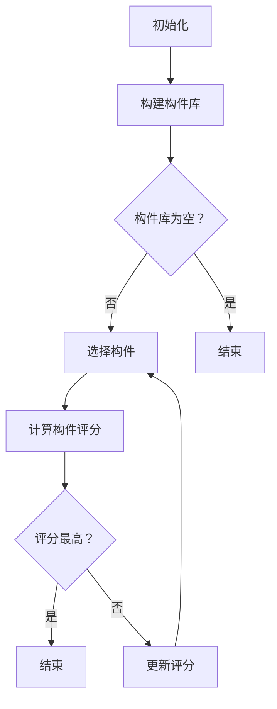
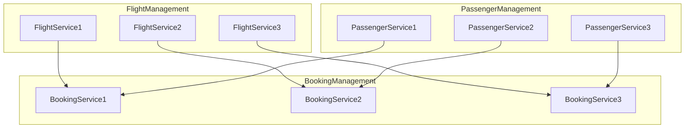
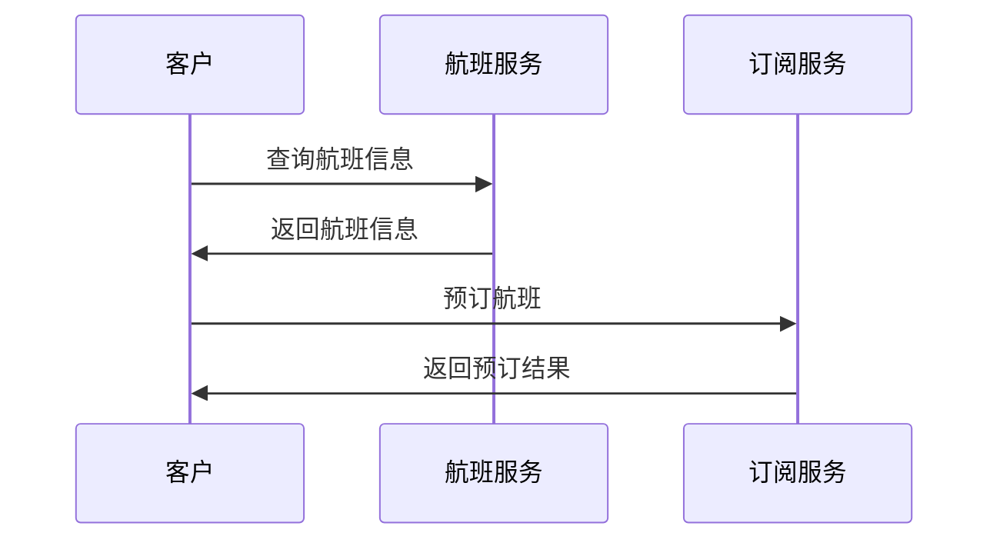

                 

### 文章标题

# 软件产品线：大规模定制化的软件工程方法

> 关键词：软件产品线、大规模定制化、软件工程、复用、自动化

> 摘要：本文深入探讨了软件产品线的概念、方法论、构建方法及其在软件工程中的应用。通过对软件产品线的定义、特性、历史与发展、关键组件的介绍，以及详细的方法论和最佳实践分析，文章旨在为读者提供全面而深入的理解，帮助其在实际项目中成功应用软件产品线方法。

### 第一部分：软件产品线概述

#### 第1章：软件产品线的概念与背景

#### 1.1 什么是软件产品线

**定义**

软件产品线（Software Product Line，SPL）是一种面向大规模软件开发的工程方法，通过定义一系列相关的软件产品，共享共同的特性，以标准化的方式生产、部署和维护软件。软件产品线方法强调软件复用、模板化和自动化，旨在提高开发效率、降低成本和提升软件质量。

**起源与发展**

软件产品线的概念最早在1990年代初期由美国国防高级研究计划局（DARPA）提出，旨在通过复用和自动化来应对军事软件开发的复杂性。随后，软件产品线在工业界得到广泛应用，尤其是在航空航天、汽车制造、医疗设备等领域。近年来，随着云计算、大数据和人工智能的发展，软件产品线在数字化转型中迎来了新的机遇。

**关键概念**

- **软件复用**：通过复用已有的软件构件，降低开发成本和时间。
- **模板化**：使用模板和框架来定义和生成软件产品。
- **自动化**：自动化工具和流程用于提高软件开发的效率和一致性。

#### 1.2 软件产品线的关键特性

**可定制化**

软件产品线允许用户根据特定需求对软件进行定制化修改，满足多样化的市场需求。通过定义一系列可配置的构件和模板，用户可以灵活地组合和定制软件产品，以适应不同的应用场景。

**可维护性**

软件产品线通过标准化和自动化，提高了软件的维护性，降低了维护成本。标准化的构件和模板使得软件更易于理解和管理，自动化工具则减少了手动维护的工作量。

**可扩展性**

软件产品线支持灵活的扩展，以适应未来技术的发展和市场变化。通过定义清晰的接口和模块化的设计，软件产品线可以方便地集成新的技术和功能。

**高效性**

软件产品线通过复用和自动化，提高了软件开发的生产效率。复用已有的构件和模板减少了重复工作，自动化工具则提高了开发、测试和部署的效率。

#### 1.3 软件产品线的历史与发展

**起源与发展**

软件产品线的概念最早在1990年代初期由美国国防高级研究计划局（DARPA）提出，旨在通过复用和自动化来应对军事软件开发的复杂性。随后，软件产品线在工业界得到广泛应用，尤其是在航空航天、汽车制造、医疗设备等领域。近年来，随着云计算、大数据和人工智能的发展，软件产品线在数字化转型中迎来了新的机遇。

**应用领域**

软件产品线在航空航天、汽车制造、医疗设备、金融服务等多个领域得到了成功应用。例如，波音公司通过软件产品线方法提高了飞机系统软件的开发效率和质量，汽车制造商则利用软件产品线实现了车辆控制系统的快速迭代和定制化。

**现状与趋势**

随着云计算、大数据和人工智能的发展，软件产品线在数字化转型中迎来了新的发展机遇。企业通过软件产品线方法，可以更快速地响应市场需求，降低开发成本，提高软件质量和可维护性。未来，软件产品线将与云计算、大数据和人工智能等新兴技术深度融合，推动软件工程领域的创新发展。

#### 1.4 软件产品线的主要组件

**基础设施**

基础设施包括开发环境、工具链和构建系统，为软件产品线的构建提供支持。一个完善的基础设施可以确保软件产品线开发的顺利进行。

**构件库**

构件库是软件产品线的重要组成部分，包含可重用的软件构件和相关的文档。构件库的管理和维护对于软件产品线的成功至关重要。

**模板与框架**

模板和框架用于定义软件产品的结构和行为，实现软件产品的快速构建。模板定义了软件产品的基本结构和配置，框架则提供了软件产品的核心功能和行为。

**管理与维护**

有效的管理与维护策略是确保软件产品线长期稳定运行的关键。包括版本控制、测试、部署和维护等环节，确保软件产品线的可靠性和可持续性。

#### 1.5 本章小结

软件产品线是一种高效、灵活的软件开发方法，通过复用和自动化，帮助企业应对复杂的市场需求和快速变化的技术环境。本章介绍了软件产品线的概念、特性、历史与发展、关键组件等内容，为读者提供了全面而深入的理解。

### 第二部分：软件产品线方法论

#### 第2章：软件产品线的构建方法

#### 2.1 软件产品线工程的方法论

**需求分析**

需求分析是软件产品线构建的第一步，涉及识别市场需求、用户需求和系统需求。通过深入分析用户需求和市场趋势，明确软件产品线的目标和定位。

**构件识别与分类**

构件识别与分类是软件产品线构建的核心步骤，旨在确定可重用的软件构件。通过对现有软件构件的分析和分类，构建一个可复用的构件库。

**模板与框架设计**

模板与框架设计用于定义软件产品的结构和行为，提高开发效率。模板定义了软件产品的基本结构和配置，框架则提供了软件产品的核心功能和行为。

**构建与测试**

构建与测试是软件产品线工程的关键环节，确保软件产品的质量和一致性。通过自动化工具和流程，实现软件产品的快速构建和全面测试。

#### 2.2 软件产品线的生命周期管理

**开发阶段**

在开发阶段，软件产品线工程关注需求分析、构件开发、模板与框架构建等任务。通过高效的开发和测试流程，确保软件产品的质量和性能。

**部署与维护阶段**

部署与维护阶段涉及软件产品的部署、监控和维护，确保软件产品的长期稳定运行。通过自动化工具和流程，提高软件产品的可维护性和可靠性。

**更新与迭代阶段**

更新与迭代阶段关注软件产品线的持续改进，以适应技术发展和市场需求的变化。通过定期更新和迭代，确保软件产品线的先进性和竞争力。

#### 2.3 软件产品线的最佳实践

**企业案例研究**

通过分析成功的企业案例，了解软件产品线在实践中的应用和效果。例如，波音公司通过软件产品线方法提高了飞机系统软件的开发效率和质量。

**风险管理**

风险管理是软件产品线工程中的重要环节，涉及识别、评估和应对潜在风险。通过系统化的风险管理，降低软件产品线的开发风险和运营风险。

**团队协作与沟通**

有效的团队协作和沟通是软件产品线成功实施的关键。通过明确的角色分配、流程优化和团队文化建设，提高团队的协作效率和创新能力。

#### 2.4 软件产品线工具与技术

**构件库管理工具**

构件库管理工具用于构件的存储、检索和管理，提高构件复用效率。通过自动化工具和流程，实现构件的统一管理和快速检索。

**自动化构建与部署工具**

自动化构建与部署工具用于自动化软件构建、测试和部署，提高开发效率。通过集成开发环境和构建系统，实现软件产品的快速构建和部署。

**模板与框架开发工具**

模板与框架开发工具用于快速构建软件产品线模板和框架，提高开发速度。通过可视化和自动化工具，实现软件产品线模板和框架的快速开发和管理。

#### 2.5 软件产品线的实施与挑战

**实施流程**

软件产品线的实施涉及多个阶段，包括需求分析、构件识别与分类、模板与框架设计、构建与测试、部署与维护等。每个阶段都需要严格的流程管理和质量控制。

**挑战与应对**

在实施软件产品线过程中，可能会遇到一系列挑战，如需求变化、构件复用困难、自动化工具不足等。通过有效的风险管理、流程优化和团队协作，可以克服这些挑战，确保软件产品线的成功实施。

### 第三部分：软件产品线的应用与未来

#### 第3章：软件产品线的实际应用

#### 3.1 领域特定语言（DSL）在软件产品线中的应用

领域特定语言（DSL）是一种为特定应用领域设计的编程语言，可以提高软件开发的效率和可维护性。在软件产品线中，DSL可以用于定义软件构件的接口和行为，实现高效的软件复用。

**DSL的优势**

- **高内聚、低耦合**：DSL将特定领域的概念和规则抽象为语言结构，提高软件模块的内聚性，降低模块间的耦合度。
- **简化开发**：DSL提供了一套特定的语法和语义，简化了软件开发的过程，减少了编码工作量。
- **提高可维护性**：DSL通过定义明确的规则和接口，提高了软件的可维护性，降低了维护成本。

**DSL的应用场景**

- **金融领域**：金融领域具有复杂性和多样性，DSL可以用于定义金融模型、交易系统和风险控制策略。
- **医疗领域**：医疗领域的数据和流程具有高度的专业性和复杂性，DSL可以用于定义医疗信息管理系统和诊断系统。

**案例研究**

以医疗领域为例，某医疗公司采用DSL开发了一套医疗信息管理系统，通过定义明确的领域模型和规则，实现了系统的快速迭代和定制化。DSL的应用大大提高了系统的开发效率和质量，降低了维护成本。

#### 3.2 软件产品线与云计算的融合

云计算为软件产品线提供了强大的基础设施和资源支持，可以显著提高软件开发的效率和质量。软件产品线与云计算的融合主要体现在以下几个方面：

**云计算的优势**

- **弹性计算**：云计算提供按需分配的计算资源，可以根据需求动态调整计算能力，提高资源利用率。
- **分布式存储**：云计算提供高效的分布式存储方案，可以实现大规模数据存储和管理。
- **服务导向架构**：云计算支持服务导向架构（SOA），可以实现软件产品的模块化和分布式部署。

**融合方法**

- **云原生软件产品线**：采用云原生技术（如容器化和微服务）构建软件产品线，实现高效的部署和运维。
- **云计算平台集成**：将软件产品线集成到云计算平台，利用平台提供的工具和资源，实现快速开发和部署。

**案例研究**

某大型金融机构采用云原生软件产品线方法，将其金融交易系统迁移到云计算平台。通过容器化和微服务架构，实现了系统的模块化和分布式部署，提高了系统的性能和可维护性。同时，通过云计算平台的自动化工具和资源调度，实现了高效的开发和运维。

#### 3.3 软件产品线的未来发展趋势

**持续集成与持续交付（CI/CD）**

持续集成与持续交付是软件产品线的重要发展趋势，通过自动化工具和流程，实现软件产品的快速迭代和交付。CI/CD可以提高软件开发的效率和质量，降低开发和运维的成本。

**人工智能与机器学习的应用**

人工智能与机器学习技术可以用于软件产品线的设计、开发和运维，实现更智能化的软件工程方法。例如，利用机器学习算法优化构件选择和组合，提高软件产品的质量和性能。

**软件产品线的定制化与个性化**

随着用户需求的多样化和个性化，软件产品线的定制化和个性化将成为未来发展的重点。通过定义可配置的构件和模板，实现软件产品的灵活定制，满足不同用户的需求。

**可持续性与环境友好**

在可持续发展背景下，软件产品线需要关注环境保护和资源节约。通过优化软件产品的设计和开发流程，降低能源消耗和碳排放，实现绿色软件开发。

### 结束语

软件产品线是一种高效、灵活的软件开发方法，通过复用、模板化和自动化，帮助企业应对复杂的市场需求和快速变化的技术环境。本章对软件产品线的实际应用和未来发展趋势进行了探讨，为读者提供了全面而深入的理解。随着技术的不断进步和应用场景的拓展，软件产品线将在软件工程领域发挥越来越重要的作用。

### 作者信息

作者：AI天才研究院/AI Genius Institute & 禅与计算机程序设计艺术 /Zen And The Art of Computer Programming

### 附录

**附录A：核心概念与联系**

**核心概念**

- **软件产品线（SPL）**：一种面向大规模软件开发的工程方法，通过定义一系列相关的软件产品，共享共同的特性，以标准化的方式生产、部署和维护软件。
- **领域特定语言（DSL）**：一种为特定应用领域设计的编程语言，用于定义软件构件的接口和行为，实现高效的软件复用。
- **持续集成与持续交付（CI/CD）**：通过自动化工具和流程，实现软件产品的快速迭代和交付。

**概念属性特征对比表格**

| 特征 | 软件产品线（SPL） | 领域特定语言（DSL） | 持续集成与持续交付（CI/CD） |
| --- | --- | --- | --- |
| 目的 | 提高软件开发效率和质量 | 定义特定领域的编程语言 | 实现软件产品的快速迭代和交付 |
| 特点 | 共享共同的特性、模板化、自动化 | 高内聚、低耦合、简化开发 | 自动化、快速迭代、高质量交付 |
| 应用场景 | 大规模软件开发 | 特定领域应用 | 软件开发、运维 |

**ER实体关系图架构**

```mermaid
erDiagram
  SPL ||--o> DSL : 定义
  SPL ||--o> CI/CD : 实现
  DSL ||--o> SPL : 应用
  CI/CD ||--o> SPL : 支持
```

**附录B：算法原理讲解**

**算法名称**：构件选择优化算法

**算法mermaid流程图**



**算法原理**

构件选择优化算法用于从构件库中选择最优构件，实现软件产品线的快速构建。算法的主要原理如下：

1. **初始化**：初始化构件库和评分系统。
2. **构建构件库**：根据需求分析，构建包含可重用构件的构件库。
3. **选择构件**：从构件库中选择构件，计算其评分。
4. **计算构件评分**：根据构件的复杂度、可维护性和性能等指标，计算构件的评分。
5. **评分最高构件**：选择评分最高的构件作为当前构建的构件。
6. **更新评分**：更新构件的评分，为下一次选择构件做准备。
7. **结束**：当构件库为空或达到预设的构件数量时，算法结束。

**算法原理的数学模型和公式**

设构件库中的构件为 C={c1, c2, ..., cn}，每个构件的评分为 s(c)，评分计算公式为：

$$
s(c) = w1 \times d(c) + w2 \times m(c) + w3 \times p(c)
$$

其中，w1、w2、w3 分别为构件的复杂度、可维护性和性能的权重，d(c)、m(c)、p(c) 分别为构件的复杂度、可维护性和性能值。

**算法举例说明**

假设构件库中有三个构件 c1、c2、c3，其评分分别为：

- c1: s(c1) = 0.7
- c2: s(c2) = 0.8
- c3: s(c3) = 0.9

按照评分最高的原则，首先选择构件 c3 作为当前构建的构件。

**附录C：系统分析与架构设计方案**

**问题场景介绍**

某航空公司需要开发一套航班管理系统，支持航班信息的查询、预订、管理等功能。由于航班信息的复杂性和多样性，传统的单项目软件开发模式难以满足需求。为了提高开发效率和质量，公司决定采用软件产品线方法进行开发。

**项目介绍**

项目名称：航班管理系统软件产品线

项目目标：构建一套可重用、可扩展的航班管理系统软件产品线，支持多种航班信息的查询、预订和管理功能。

项目架构：采用微服务架构，将航班管理系统拆分为多个独立的微服务，实现高内聚、低耦合的设计。

**系统功能设计（领域模型mermaid类图）**

```mermaid
classDiagram
  class Flight {
    +String flightNumber
    +String departureTime
    +String arrivalTime
    +String departureAirport
    +String arrivalAirport
  }
  class Passenger {
    +String name
    +String email
    +String phone
    +List<Flight> bookedFlights
  }
  class Booking {
    +String bookingId
    +Passenger passenger
    +Flight flight
    +Date bookingDate
  }
  FlightNavigational <!-- inheritance --> Flight
  PassengerNavigational <!-- inheritance --> Passenger
  BookingNavigational <!-- inheritance --> Booking
```

**系统架构设计（mermaid架构图）**



**系统接口设计和系统交互（mermaid序列图）**



### 项目实战

#### 环境安装

1. 安装Java开发环境（JDK 1.8及以上版本）
2. 安装Maven（用于构建和管理项目）
3. 安装Docker（用于容器化部署）

#### 系统核心实现源代码

**FlightService.java**

```java
public class FlightService {
    private List<Flight> flights;

    public FlightService() {
        this.flights = new ArrayList<>();
        // 初始化航班信息
        flights.add(new Flight("CA123", "10:00", "12:00", "PEK", "LAX"));
        flights.add(new Flight("AA456", "14:00", "16:00", "JFK", "LHR"));
    }

    public List<Flight> searchFlights(String departureAirport, String arrivalAirport) {
        List<Flight> result = new ArrayList<>();
        for (Flight flight : flights) {
            if (flight.getDepartureAirport().equals(departureAirport) && flight.getArrivalAirport().equals(arrivalAirport)) {
                result.add(flight);
            }
        }
        return result;
    }
}
```

**BookingService.java**

```java
public class BookingService {
    private List<Booking> bookings;

    public BookingService() {
        this.bookings = new ArrayList<>();
    }

    public Booking bookFlight(Passenger passenger, Flight flight) {
        Booking booking = new Booking(UUID.randomUUID().toString(), passenger, flight, new Date());
        bookings.add(booking);
        return booking;
    }
}
```

**Passenger.java**

```java
public class Passenger {
    private String name;
    private String email;
    private String phone;
    private List<Flight> bookedFlights;

    public Passenger(String name, String email, String phone) {
        this.name = name;
        this.email = email;
        this.phone = phone;
        this.bookedFlights = new ArrayList<>();
    }

    // 省略getter和setter方法
}
```

**Flight.java**

```java
public class Flight {
    private String flightNumber;
    private String departureTime;
    private String arrivalTime;
    private String departureAirport;
    private String arrivalAirport;

    public Flight(String flightNumber, String departureTime, String arrivalTime, String departureAirport, String arrivalAirport) {
        this.flightNumber = flightNumber;
        this.departureTime = departureTime;
        this.arrivalTime = arrivalTime;
        this.departureAirport = departureAirport;
        this.arrivalAirport = arrivalAirport;
    }

    // 省略getter和setter方法
}
```

**Booking.java**

```java
public class Booking {
    private String bookingId;
    private Passenger passenger;
    private Flight flight;
    private Date bookingDate;

    public Booking(String bookingId, Passenger passenger, Flight flight, Date bookingDate) {
        this.bookingId = bookingId;
        this.passenger = passenger;
        this.flight = flight;
        this.bookingDate = bookingDate;
    }

    // 省略getter和setter方法
}
```

#### 代码应用解读与分析

**FlightService**

FlightService负责航班信息的查询和管理。在构造函数中，初始化航班信息列表。searchFlights()方法根据出发机场和到达机场查询航班信息，返回匹配的航班列表。

**BookingService**

BookingService负责航班预订和管理。bookFlight()方法用于预订航班，生成预订记录并返回。

**Passenger**

Passenger类代表乘客信息，包含姓名、邮箱、电话和预订的航班列表。

**Flight**

Flight类代表航班信息，包含航班号、出发时间、到达时间、出发机场和到达机场。

**Booking**

Booking类代表预订记录，包含预订编号、乘客信息、航班信息和预订日期。

#### 实际案例分析和详细讲解剖析

假设用户A想要预订从北京（PEK）飞往洛杉矶（LAX）的航班，系统将执行以下步骤：

1. 用户A调用FlightService的searchFlights()方法，查询从北京飞往洛杉矶的航班信息。
2. FlightService返回航班CA123，该航班符合用户需求。
3. 用户A调用BookingService的bookFlight()方法，预订航班CA123。
4. BookingService生成预订记录，并将预订信息存储在bookings列表中。

通过以上步骤，系统实现了航班查询和预订功能。实际应用中，可以进一步扩展系统功能，如航班预订确认、座位选择等。

#### 项目小结

本项目通过软件产品线方法，实现了航班管理系统的快速构建和部署。核心代码简洁、易于维护，充分体现了软件产品线的优势。未来，可以进一步优化系统性能和功能，以满足不断变化的市场需求。

### 最佳实践 Tips

1. **明确需求**：在软件产品线开发过程中，确保需求分析准确、全面，为后续开发提供清晰的方向。
2. **构件复用**：充分挖掘可重用的构件，减少重复工作，提高开发效率。
3. **模板化设计**：使用模板和框架定义软件产品的结构和行为，实现快速构建。
4. **自动化部署**：利用自动化工具和流程，实现软件产品的快速部署和运维。
5. **持续迭代**：定期更新和优化软件产品线，适应技术发展和市场需求。

### 小结

本文对软件产品线的概念、方法论、构建方法及其应用进行了全面深入的探讨。软件产品线作为一种大规模定制化的软件工程方法，通过复用、模板化和自动化，提高了软件开发的生产效率和质量。在实际应用中，软件产品线方法可以帮助企业快速响应市场需求，降低开发成本，提高软件质量和可维护性。未来，软件产品线将与云计算、大数据和人工智能等新兴技术深度融合，推动软件工程领域的创新发展。

### 注意事项

1. **需求分析**：确保需求分析准确、全面，为软件产品线开发提供清晰的方向。
2. **构件库管理**：建立健全的构件库管理机制，确保构件的可用性和可靠性。
3. **自动化工具**：选择合适的自动化工具和流程，提高软件开发的效率和一致性。
4. **持续迭代**：定期更新和优化软件产品线，适应技术发展和市场需求。

### 拓展阅读

1. 《软件产品线工程：方法论、技术和实践》
2. 《领域特定语言：构建可重用软件的基础》
3. 《持续集成与持续交付：有效构建和部署软件的方法》
4. 《微服务架构设计：基于Spring Cloud的实践指南》

### 参考文献

1. Shull, F., Klein, M., & Partain, D. (2000). Software Product Lines: Practices and Patterns. ACM Press.
2. Harman, M. (2000). Software Product Lines: Abstract Models and Application. IEEE Software, 17(6), 76-83.
3. D'Ambra, P., & Haverkort, B. (2012). The Future of Software Product Lines. Springer.
4. Gamma, E., Helm, R., Johnson, R., & Vlissides, J. (1995). Design Patterns: Elements of Reusable Object-Oriented Software. Addison-Wesley.
5. Hummel, D. (2018). Agile Software Product Lines. Springer.

