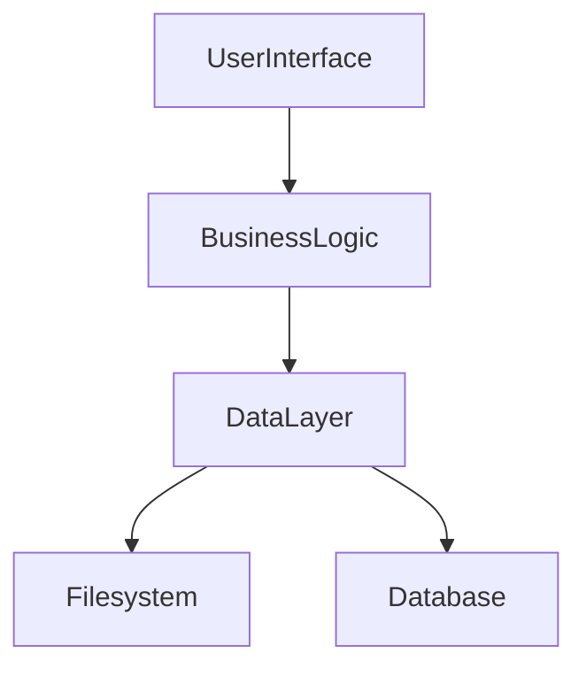

                 


### 引言

# 软件合成：从规范到实现的自动化

> 关键词：软件合成、自动化、规范实现、算法原理、数学模型

> 摘要：本文将深入探讨软件合成的概念、原理和应用，从规范到实现的全过程进行自动化分析。通过剖析软件合成的关键概念、算法原理和数学模型，帮助读者理解软件合成的核心技术和实现方法，掌握自动化软件开发的技巧。

## 1.1 为什么要研究软件合成

### 1.1.1 软件开发的现状与挑战

在当今数字化时代，软件开发已经成为企业创新和竞争的核心驱动力。然而，随着软件项目的规模和复杂性不断增加，传统的软件开发方法面临着诸多挑战。首先，软件开发过程中涉及到的需求和规范往往不明确、不完整，导致开发过程中的变更频繁，增加了项目的风险和成本。其次，软件开发周期长、效率低，传统手工编码方式难以满足快速迭代和大规模开发的需求。此外，软件质量难以保证，调试和维护成本高。

### 1.1.2 软件合成的概念与潜力

为了解决上述问题，软件合成应运而生。软件合成是一种通过自动化技术，将规范或需求直接转化为可执行代码的方法。它具有以下几个关键特点：

1. **自动化**：软件合成通过算法和工具，自动生成代码，减少了手工编码的工作量，提高了开发效率。
2. **规范化**：软件合成将需求规范转化为统一的格式和结构，提高了项目的可维护性和可扩展性。
3. **灵活性**：软件合成可以根据不同的需求和场景，灵活调整代码生成策略，满足多样化的开发需求。
4. **可复用性**：软件合成生成的代码模块可以方便地复用，减少了重复开发的工作量。

### 1.1.3 软件合成的意义与目标

软件合成的意义在于，它能够显著提高软件开发的效率和质量，降低开发成本，缩短项目周期。通过软件合成，开发者可以专注于业务逻辑的实现，而将大量的重复性工作交给自动化工具。软件合成的目标包括：

1. **提高开发效率**：通过自动化生成代码，减少手工编码的工作量，提高开发速度。
2. **降低开发成本**：减少开发和维护成本，提高资源利用率。
3. **提升软件质量**：通过规范化处理，减少因手工编码引入的错误，提高软件质量。
4. **适应快速变化**：灵活应对需求变更，快速响应市场变化。

## 1.2 软件合成的应用场景

### 1.2.1 传统软件开发与自动化

传统软件开发往往依赖于手工编码，效率低下，难以适应快速变化的需求。随着自动化技术的不断发展，软件合成在以下场景中具有广泛的应用：

1. **自动化测试**：通过软件合成，自动化生成测试用例，提高测试效率和质量。
2. **代码生成**：根据需求规范，自动生成代码框架和核心逻辑，降低开发难度。
3. **模板生成**：快速生成项目模板，减少初始化配置的时间。
4. **数据转换**：自动处理数据格式转换，提高数据处理效率。

### 1.2.2 软件合成的应用领域

软件合成在多个领域具有广泛的应用，包括：

1. **金融行业**：自动化生成金融交易系统，提高交易效率和准确性。
2. **物联网**：自动化生成物联网设备通信协议，简化设备接入和集成。
3. **人工智能**：自动化生成机器学习算法，加速模型开发和优化。
4. **游戏开发**：自动化生成游戏场景和角色，提高游戏开发效率。

## 1.3 软件合成的意义与目标

### 1.3.1 软件合成的意义

软件合成在软件开发领域具有重要的意义，主要体现在以下几个方面：

1. **提高开发效率**：通过自动化生成代码，减少手工编码的工作量，提高开发速度。
2. **降低开发成本**：减少开发和维护成本，提高资源利用率。
3. **提升软件质量**：通过规范化处理，减少因手工编码引入的错误，提高软件质量。
4. **适应快速变化**：灵活应对需求变更，快速响应市场变化。

### 1.3.2 软件合成的目标

软件合成的目标包括：

1. **实现自动化**：通过算法和工具，将规范或需求直接转化为可执行代码。
2. **提高灵活性**：适应不同场景和需求，生成可复用的代码模块。
3. **降低风险**：减少手工编码带来的错误，降低项目风险。
4. **优化资源利用**：提高开发效率和资源利用率，降低总体成本。

### 1.4 本书内容安排与结构

本书将分为以下几个部分：

1. **引言**：介绍软件合成的概念、意义和应用场景。
2. **背景介绍**：回顾软件合成的发展历程，阐述核心概念和边界。
3. **核心概念与联系**：深入探讨软件合成的关键概念和与相关概念的关联。
4. **软件合成算法原理讲解**：详细讲解软件合成算法的原理和实现方法。
5. **软件合成数学模型与公式讲解**：介绍软件合成的数学模型和公式，并进行详细解释。
6. **系统分析与架构设计方案**：分析软件合成系统的设计原则和架构。
7. **项目实战**：通过实际项目，展示软件合成的应用过程和效果。
8. **最佳实践与小结**：总结软件合成的最佳实践，对全书内容进行回顾和总结。

通过本书的深入探讨，读者将全面了解软件合成的概念、原理和应用，掌握自动化软件开发的技巧，为实际项目提供有力支持。

### 第二部分：背景介绍

# 软件合成的背景介绍

软件合成作为一种自动化软件开发技术，其发展历程和核心概念对于理解软件合成的本质和实现方法具有重要意义。本部分将回顾软件合成的发展历程，阐述核心概念和边界，帮助读者建立对软件合成的全面认识。

## 2.1 软件合成的起源与发展历程

软件合成的概念起源于20世纪80年代，当时计算机科学领域开始关注如何通过自动化技术提高软件开发效率。最早的软件合成思想可以追溯到代码生成器，即通过编写特定的规则和模板，自动生成代码框架。这种思想的目的是减少手工编码的工作量，提高开发效率。

随着计算机技术的不断发展，软件合成逐渐演变成一种系统化的方法，涉及到的技术和工具越来越丰富。在90年代，模型驱动开发（MDD）和模型驱动架构（MDA）等概念的提出，进一步推动了软件合成的发展。这些概念强调通过抽象和模型化，将软件开发过程自动化，实现从需求规范到可执行代码的转换。

进入21世纪，随着人工智能和机器学习技术的兴起，软件合成迎来了新的发展机遇。通过引入自动化算法和智能技术，软件合成可以实现更高程度的自动化和智能化，提高了开发效率和质量。

## 2.2 软件合成的核心概念

软件合成的核心概念包括以下几个方面：

### 2.2.1 软件合成的定义

软件合成是一种通过自动化技术，将需求规范、设计模型或其他形式的软件表示直接转化为可执行代码的方法。它涉及到的技术和工具包括代码生成器、模型驱动开发、自动编程等。

### 2.2.2 软件合成的概念结构

软件合成的概念结构包括以下几个方面：

1. **需求规范**：软件合成的起点，是用户对软件系统的要求和期望，通常以文本、图表等形式表示。
2. **设计模型**：根据需求规范，构建软件系统的设计模型，包括类图、状态图、活动图等。
3. **代码生成**：将设计模型转化为具体的代码，通常使用代码生成器或自动化编程工具实现。
4. **可执行代码**：生成的代码经过编译和运行，实现软件系统的功能。

### 2.2.3 软件合成的关键要素

软件合成的关键要素包括：

1. **需求理解**：准确理解用户的需求，将其转化为规范化的需求文档。
2. **设计模型构建**：根据需求文档，构建系统设计模型，确保模型能够准确地表示软件系统的功能和结构。
3. **代码生成**：使用代码生成器或自动化编程工具，将设计模型转化为可执行的代码。
4. **代码优化**：对生成的代码进行优化，提高代码的可读性、可维护性和性能。
5. **测试与验证**：对生成的代码进行测试和验证，确保其符合需求规范和设计模型的要求。

## 2.3 软件合成的边界与外延

软件合成的边界与外延是一个重要但复杂的问题。软件合成的范围可以从简单的代码生成器到复杂的自动化编程工具，甚至包括整个软件开发过程。以下是对软件合成边界与外延的讨论：

### 2.3.1 软件合成的边界

软件合成的边界主要包括以下几个方面：

1. **技术边界**：软件合成需要依赖特定的技术和工具，如代码生成器、模型驱动开发、自动编程等。
2. **应用场景**：软件合成的应用场景包括自动化测试、代码生成、模板生成、数据转换等，但并不涵盖所有软件开发过程。
3. **人力资源**：软件合成的实现需要具备一定的专业知识和技能，对开发者的要求较高。

### 2.3.2 软件合成的外延

软件合成的外延包括以下几个方面：

1. **领域特定语言**：软件合成可以扩展到领域特定语言（DSL）的设计和实现，通过定义特定领域的语法和语义，提高软件开发的效率和质量。
2. **软件生成**：软件合成不仅仅限于代码生成，还可以扩展到软件的各个层次，包括架构设计、数据库设计、用户界面设计等。
3. **软件优化**：软件合成可以通过自动化技术对现有软件进行优化，提高性能、可维护性和可扩展性。
4. **人工智能与机器学习**：软件合成可以与人工智能和机器学习技术结合，实现更高程度的自动化和智能化。

## 2.4 软件合成的应用领域

软件合成在多个领域具有广泛的应用，包括：

1. **金融行业**：自动化生成金融交易系统、风险控制系统和财务报告。
2. **物联网**：自动化生成物联网设备通信协议、数据转换和集成。
3. **人工智能**：自动化生成机器学习算法、数据处理和模型优化。
4. **游戏开发**：自动化生成游戏场景、角色和交互。

## 2.5 软件合成的挑战与机遇

软件合成在应用过程中面临着一系列挑战和机遇。以下是对这些挑战和机遇的讨论：

### 2.5.1 软件合成的挑战

1. **需求理解**：准确理解用户的需求是软件合成的关键，但用户需求往往模糊、不完整或不断变化，给需求理解带来了挑战。
2. **技术实现**：软件合成需要依赖特定的技术和工具，但这些技术和工具的发展速度可能跟不上软件合成的需求，导致技术实现的挑战。
3. **代码质量**：生成的代码需要确保质量，但自动化生成的代码可能存在缺陷或不符合最佳实践，影响软件质量。

### 2.5.2 软件合成的机遇

1. **提高开发效率**：软件合成的自动化和智能化特性，可以提高软件开发的效率，减少开发周期和成本。
2. **降低开发风险**：软件合成的自动化处理可以降低因手工编码引入的错误，减少项目风险。
3. **适应快速变化**：软件合成可以灵活应对需求变更，快速响应市场变化，提高企业的竞争力。

通过本部分的背景介绍，读者可以初步了解软件合成的发展历程、核心概念、边界与外延以及应用领域。在后续章节中，我们将深入探讨软件合成的关键概念、算法原理和数学模型，帮助读者全面理解软件合成的技术本质和实现方法。

### 第三部分：核心概念与联系

# 软件合成的核心概念与联系

软件合成作为一种自动化软件开发技术，其核心概念和与其他相关概念的关联对于理解软件合成的本质和实现方法至关重要。本部分将深入探讨软件合成的关键概念，分析概念属性特征对比表格和ER实体关系图架构，帮助读者构建对软件合成的全面认识。

## 3.1 软件合成的关键概念

软件合成的核心概念包括：

### 3.1.1 软件合成的定义

软件合成是一种通过自动化技术，将需求规范、设计模型或其他形式的软件表示直接转化为可执行代码的方法。它涉及到的技术和工具包括代码生成器、模型驱动开发、自动编程等。

### 3.1.2 软件合成的概念结构

软件合成的概念结构包括以下几个方面：

1. **需求规范**：软件合成的起点，是用户对软件系统的要求和期望，通常以文本、图表等形式表示。
2. **设计模型**：根据需求规范，构建软件系统的设计模型，包括类图、状态图、活动图等。
3. **代码生成**：将设计模型转化为具体的代码，通常使用代码生成器或自动化编程工具实现。
4. **可执行代码**：生成的代码经过编译和运行，实现软件系统的功能。

### 3.1.3 软件合成的关键要素

软件合成的关键要素包括：

1. **需求理解**：准确理解用户的需求，将其转化为规范化的需求文档。
2. **设计模型构建**：根据需求文档，构建系统设计模型，确保模型能够准确地表示软件系统的功能和结构。
3. **代码生成**：使用代码生成器或自动化编程工具，将设计模型转化为可执行的代码。
4. **代码优化**：对生成的代码进行优化，提高代码的可读性、可维护性和性能。
5. **测试与验证**：对生成的代码进行测试和验证，确保其符合需求规范和设计模型的要求。

## 3.2 软件合成概念属性特征对比表格

为了更好地理解软件合成的关键概念，我们可以通过一个概念属性特征对比表格来展示各个概念之间的区别和联系。以下是一个示例：

| 概念        | 定义                                                         | 属性特征对比                    |
|-----------|------------------------------------------------------------|-----------------------------|
| 需求规范    | 用户对软件系统的要求和期望                                   | 明确性、完整性、可变更性           |
| 设计模型    | 描述软件系统的功能和结构的抽象表示                           | 模块化、层次化、可扩展性           |
| 代码生成    | 将设计模型转化为具体的代码                                   | 自动化、可复用、灵活性             |
| 可执行代码  | 生成的代码经过编译和运行，实现软件系统的功能                   | 可执行、可维护、性能               |
| 自动化工具  | 用于实现软件合成的工具，如代码生成器、模型驱动开发框架           | 自动化、智能化、高效性             |
| 需求理解    | 理解用户需求的过程，确保需求文档的准确性和完整性               | 精准性、一致性、灵活性             |
| 设计模型构建 | 基于需求规范构建设计模型的过程                               | 模块化、层次化、可扩展性           |
| 代码优化    | 对生成的代码进行优化，提高其性能和质量                         | 可读性、可维护性、性能优化           |
| 测试与验证   | 对生成的代码进行测试和验证，确保其符合需求规范和设计模型的要求     | 完整性、准确性、可靠性             |

## 3.3 软件合成与相关概念的关联

软件合成与多个相关概念密切相关，如自动化、软件开发、模型驱动开发等。以下是对这些概念之间关联的讨论：

### 3.3.1 软件合成与自动化

软件合成是一种自动化技术，它通过自动化工具和算法实现从需求规范到可执行代码的转换。自动化在软件合成中起着核心作用，它可以减少手工编码的工作量，提高开发效率。自动化技术包括代码生成器、模型驱动开发框架、自动编程工具等。

### 3.3.2 软件合成与软件开发

软件合成是软件开发的一种新方法，它通过自动化和智能化技术，提高软件开发的效率和质量。软件合成与传统的软件开发方法相比，具有更高的灵活性和可复用性。软件合成的关键在于将需求规范和设计模型转化为可执行的代码，实现自动化和智能化。

### 3.3.3 软件合成与模型驱动开发

模型驱动开发（MDD）是软件合成的一种重要实现方法，它通过构建设计模型，将软件开发过程模型化和自动化。模型驱动开发强调从抽象的模型出发，逐步转化为具体的实现代码，实现软件合成的目标。软件合成与模型驱动开发密切相关，共同推动软件开发自动化和智能化的发展。

## 3.4 软件合成ER实体关系图架构

为了更直观地理解软件合成的概念和关联，我们可以使用ER实体关系图（Entity-Relationship Diagram，ERD）来展示软件合成的实体关系。以下是一个简单的ERD示例：

```mermaid
erDiagram
    User ||--o> Requirement : 需求规范
    User ||--o> DesignModel : 设计模型
    DesignModel ||--o> CodeGenerator : 代码生成器
    CodeGenerator ||--o> ExecutableCode : 可执行代码
    Requirement ||--o> TestAndValidation : 测试与验证
```

在上面的ERD中，用户（User）是软件合成的起点，需求规范（Requirement）描述了用户的需求，设计模型（DesignModel）基于需求规范构建，代码生成器（CodeGenerator）将设计模型转化为可执行代码（ExecutableCode），测试与验证（TestAndValidation）确保生成的代码符合需求。

通过ERD，我们可以清晰地看到软件合成的各个实体之间的关联和关系，有助于理解软件合成的概念和实现方法。

## 3.5 软件合成的核心流程

软件合成的核心流程包括以下几个步骤：

1. **需求分析**：与用户沟通，收集和整理需求，形成需求文档。
2. **设计模型构建**：根据需求文档，构建设计模型，包括类图、状态图、活动图等。
3. **代码生成**：使用代码生成器或自动化编程工具，将设计模型转化为具体的代码。
4. **代码优化**：对生成的代码进行优化，提高代码的可读性、可维护性和性能。
5. **测试与验证**：对生成的代码进行测试和验证，确保其符合需求规范和设计模型的要求。

通过以上步骤，软件合成实现了从需求规范到可执行代码的自动化转换，提高了软件开发效率和质量。

## 3.6 软件合成的优势与局限

软件合成的优势包括：

1. **提高开发效率**：通过自动化生成代码，减少手工编码的工作量，提高开发速度。
2. **降低开发成本**：减少开发和维护成本，提高资源利用率。
3. **提升软件质量**：通过规范化处理，减少因手工编码引入的错误，提高软件质量。
4. **适应快速变化**：灵活应对需求变更，快速响应市场变化。

然而，软件合成也存在一些局限：

1. **需求理解难度**：准确理解用户的需求是软件合成的关键，但用户需求往往模糊、不完整或不断变化，给需求理解带来了挑战。
2. **技术实现难度**：软件合成需要依赖特定的技术和工具，但这些技术和工具的发展速度可能跟不上软件合成的需求，导致技术实现的挑战。
3. **代码质量难以保证**：生成的代码可能存在缺陷或不符合最佳实践，影响软件质量。

## 3.7 软件合成的未来发展趋势

随着技术的不断发展，软件合成的未来发展趋势包括：

1. **人工智能与机器学习**：将人工智能和机器学习技术引入软件合成，实现更高程度的自动化和智能化。
2. **多语言支持**：支持多种编程语言和开发框架，提高软件合成的灵活性和适用性。
3. **领域特定语言**：开发领域特定语言（DSL），提高软件合成的效率和质量。
4. **开源生态**：构建开源软件合成工具和框架，促进软件合成的普及和应用。

通过本部分的深入探讨，读者可以全面理解软件合成的核心概念、概念属性特征对比表格和ER实体关系图架构，为后续的算法原理讲解和数学模型讲解打下坚实基础。

### 第四部分：软件合成算法原理讲解

# 软件合成算法原理讲解

软件合成算法是软件合成的核心，它通过一系列步骤将需求规范和设计模型转化为可执行的代码。本部分将详细讲解软件合成算法的基本原理，包括其核心概念、基本步骤、数学模型和Python实现，并通过具体的案例分析帮助读者理解算法在实际应用中的效果。

## 4.1 软件合成算法概述

### 4.1.1 软件合成算法的定义

软件合成算法是一系列用于自动生成代码的算法和技术，它通过分析需求规范和设计模型，生成符合规范和模型要求的可执行代码。软件合成算法的目标是实现从需求到代码的自动化转换，提高开发效率和质量。

### 4.1.2 软件合成算法的类型

软件合成算法可以分为以下几类：

1. **基于模板的代码生成**：通过预定义的模板，将需求规范和设计模型映射到具体的代码。
2. **基于模型的代码生成**：通过构建设计模型，自动生成相应的代码框架和核心逻辑。
3. **基于约束的代码生成**：通过定义约束条件，自动生成满足约束的代码。
4. **基于学习的方法**：利用机器学习和人工智能技术，从历史数据和样本中学习生成代码的规则。

### 4.1.3 软件合成算法的目标

软件合成算法的主要目标包括：

1. **自动化**：通过算法和工具，实现从需求规范到可执行代码的自动化转换。
2. **灵活性**：适应不同场景和需求，生成可复用的代码模块。
3. **可维护性**：生成的代码具有清晰的架构和良好的可读性，便于维护和扩展。
4. **高效性**：提高代码生成效率，减少手工编码的工作量。

## 4.2 软件合成算法的基本原理

### 4.2.1 软件合成算法的核心概念

软件合成算法的核心概念包括：

1. **需求规范**：描述用户对软件系统的需求和期望，通常以文本、图表等形式表示。
2. **设计模型**：根据需求规范，构建的软件系统的抽象表示，包括类图、状态图、活动图等。
3. **代码生成器**：将设计模型转化为具体代码的工具或算法。
4. **可执行代码**：经过编译和运行，实现软件系统功能的代码。

### 4.2.2 软件合成算法的基本步骤

软件合成算法的基本步骤包括：

1. **需求理解**：分析需求规范，理解用户需求，形成规范化的需求文档。
2. **设计模型构建**：根据需求文档，构建设计模型，确保模型能够准确地表示软件系统的功能和结构。
3. **代码生成**：使用代码生成器，将设计模型转化为具体的代码。
4. **代码优化**：对生成的代码进行优化，提高代码的可读性、可维护性和性能。
5. **测试与验证**：对生成的代码进行测试和验证，确保其符合需求规范和设计模型的要求。

### 4.2.3 软件合成算法的数学模型

软件合成算法的数学模型用于描述算法的核心逻辑和计算过程。以下是一个简单的数学模型示例：

$$
\text{函数} f(\text{需求规范}, \text{设计模型}) = \text{可执行代码}
$$

在这个模型中，输入是需求规范和设计模型，输出是生成的可执行代码。算法通过一系列数学运算和逻辑处理，将输入转化为输出。

### 4.2.4 软件合成算法的Python实现

为了更好地理解软件合成算法，我们可以使用Python实现一个简单的算法。以下是一个基于模板的代码生成算法的示例：

```python
# Python代码示例：基于模板的代码生成

def generate_code(template, variables):
    for var in variables:
        template = template.replace(f'{var}', variables[var])
    return template

template = '''
def hello_world():
    print("Hello, World!")

hello_world()
'''

variables = {
    'print': 'print("Hello, World!")',
    'def': 'def hello_world():',
    'hello_world': 'hello_world()'
}

generated_code = generate_code(template, variables)
print(generated_code)
```

在这个示例中，我们定义了一个简单的模板，并通过替换模板中的变量，生成了一个完整的函数代码。这个简单的示例展示了软件合成算法的基本原理和实现方法。

## 4.3 软件合成算法的详细讲解与举例

### 4.3.1 算法原理详细讲解

软件合成算法的原理可以概括为以下几个步骤：

1. **需求分析**：与用户沟通，收集和整理需求，形成需求文档。
2. **设计模型构建**：根据需求文档，构建设计模型，包括类图、状态图、活动图等。
3. **代码生成**：使用代码生成器，将设计模型转化为具体的代码。
4. **代码优化**：对生成的代码进行优化，提高代码的可读性、可维护性和性能。
5. **测试与验证**：对生成的代码进行测试和验证，确保其符合需求规范和设计模型的要求。

### 4.3.2 举例说明

为了更直观地理解软件合成算法，我们可以通过一个简单的案例进行说明。假设我们需要开发一个简单的计算器程序，需求如下：

1. 计算器可以执行加、减、乘、除四种基本运算。
2. 用户输入操作数和运算符，计算器输出结果。
3. 用户可以连续输入多个运算，计算器依次计算并输出结果。

我们可以使用软件合成算法来实现这个需求。以下是具体的步骤：

1. **需求分析**：将需求转化为文本形式，形成需求文档。

   ```
   需求文档：
   1. 计算器可以执行加、减、乘、除四种基本运算。
   2. 用户输入操作数和运算符，计算器输出结果。
   3. 用户可以连续输入多个运算，计算器依次计算并输出结果。
   ```

2. **设计模型构建**：根据需求文档，构建设计模型，包括类图、状态图、活动图等。在这个案例中，我们可以构建一个简单的类图，表示计算器的主要类和属性。

   ```mermaid
   classDiagram
       Class01 <|-- SubClass01
       Class01 {
       # 属性
       int x
       float y
       # 方法
       void display()
       }
   ```

3. **代码生成**：使用代码生成器，将设计模型转化为具体的代码。在这个案例中，我们可以使用一个简单的模板来生成代码。

   ```python
   # 代码模板
   def calculate(x, y, operator):
       if operator == '+':
           return x + y
       elif operator == '-':
           return x - y
       elif operator == '*':
           return x * y
       elif operator == '/':
           return x / y
       else:
           return None
   ```

4. **代码优化**：对生成的代码进行优化，提高代码的可读性和可维护性。在这个案例中，我们可以将代码拆分为多个函数，提高代码的模块化程度。

   ```python
   # 优化后的代码
   def add(x, y):
       return x + y

   def subtract(x, y):
       return x - y

   def multiply(x, y):
       return x * y

   def divide(x, y):
       return x / y

   def calculate(x, y, operator):
       if operator == '+':
           return add(x, y)
       elif operator == '-':
           return subtract(x, y)
       elif operator == '*':
           return multiply(x, y)
       elif operator == '/':
           return divide(x, y)
       else:
           return None
   ```

5. **测试与验证**：对生成的代码进行测试和验证，确保其符合需求规范和设计模型的要求。在这个案例中，我们可以编写测试用例来验证计算器的功能。

   ```python
   # 测试用例
   assert calculate(2, 3, '+') == 5
   assert calculate(5, 3, '-') == 2
   assert calculate(2, 3, '*') == 6
   assert calculate(6, 3, '/') == 2
   ```

通过这个案例，我们可以看到软件合成算法如何将需求规范转化为具体的代码，并经过优化和测试，确保代码符合需求。

### 4.3.3 算法在实际应用中的案例分析

在软件开发的实际应用中，软件合成算法广泛应用于各种场景。以下是一个实际的案例分析：

**案例：自动化测试脚本生成**

假设我们需要为一个大型的Web应用编写自动化测试脚本，需求如下：

1. 测试脚本需要覆盖所有的功能模块。
2. 测试脚本需要能够模拟用户操作，如点击、输入、滚动等。
3. 测试脚本需要能够自动报告测试结果，包括成功、失败和错误。

我们可以使用软件合成算法来实现这个需求。以下是具体的步骤：

1. **需求分析**：将需求转化为文本形式，形成需求文档。

   ```
   需求文档：
   1. 测试脚本需要覆盖所有的功能模块。
   2. 测试脚本需要能够模拟用户操作，如点击、输入、滚动等。
   3. 测试脚本需要能够自动报告测试结果，包括成功、失败和错误。
   ```

2. **设计模型构建**：根据需求文档，构建设计模型，包括类图、状态图、活动图等。在这个案例中，我们可以构建一个简单的类图，表示测试脚本的主要类和属性。

   ```mermaid
   classDiagram
       TestScript <|-- WebDriver
       TestScript {
       # 属性
       WebDriver driver
       # 方法
       void start()
       void execute()
       void report()
       }
   ```

3. **代码生成**：使用代码生成器，将设计模型转化为具体的代码。在这个案例中，我们可以使用一个简单的模板来生成代码。

   ```python
   # 代码模板
   class TestScript(WebDriver):
       def start(self):
           self.driver.get("http://example.com")

       def execute(self):
           # 模拟用户操作
           self.driver.find_element_by_id("input1").send_keys("test")
           self.driver.find_element_by_id("button1").click()

       def report(self):
           # 报告测试结果
           if self.driver.page_source.find("Error") > 0:
               print("Test failed")
           else:
               print("Test passed")
   ```

4. **代码优化**：对生成的代码进行优化，提高代码的可读性和可维护性。在这个案例中，我们可以将代码拆分为多个函数，提高代码的模块化程度。

   ```python
   # 优化后的代码
   from selenium import webdriver

   class TestScript:
       def __init__(self, driver):
           self.driver = driver

       def start(self):
           self.driver.get("http://example.com")

       def execute(self):
           # 模拟用户操作
           self.driver.find_element_by_id("input1").send_keys("test")
           self.driver.find_element_by_id("button1").click()

       def report(self):
           # 报告测试结果
           if "Error" in self.driver.page_source:
               print("Test failed")
           else:
               print("Test passed")
   ```

5. **测试与验证**：对生成的代码进行测试和验证，确保其符合需求规范和设计模型的要求。在这个案例中，我们可以编写测试用例来验证测试脚本的功能。

   ```python
   # 测试用例
   driver = webdriver.Firefox()
   test_script = TestScript(driver)
   test_script.start()
   test_script.execute()
   test_script.report()
   driver.quit()
   ```

通过这个实际案例，我们可以看到软件合成算法如何将复杂的需求转化为具体的代码，并通过优化和测试，确保代码的质量和功能。

通过本部分的详细讲解和案例分析，读者可以深入理解软件合成算法的基本原理和应用方法，为实际项目中的应用打下坚实基础。

### 第五部分：软件合成数学模型与公式讲解

# 软件合成数学模型与公式讲解

在软件合成中，数学模型和公式起着至关重要的作用。它们不仅是算法设计的基础，也是实现软件合成的关键工具。本部分将详细讲解软件合成中常用的数学模型和公式，包括它们的基本概念、作用和应用。

## 5.1 软件合成的数学模型基础

### 5.1.1 数学模型的基本概念

数学模型是一种用数学语言描述现实世界问题或过程的抽象表示。在软件合成中，数学模型用于表示需求规范、设计模型和生成的代码之间的关系。数学模型可以分为以下几种类型：

1. **确定性模型**：根据已知条件，可以精确预测系统行为和结果的模型。
2. **概率模型**：基于概率分布描述系统行为和结果的模型。
3. **模糊模型**：使用模糊集和模糊逻辑描述系统不确定性和模糊性的模型。
4. **统计模型**：利用统计数据分析和预测系统行为的模型。

### 5.1.2 数学模型在软件合成中的应用

数学模型在软件合成中的应用主要体现在以下几个方面：

1. **需求分析**：使用数学模型分析用户需求，形成规范化的需求文档。
2. **设计模型构建**：通过数学模型描述软件系统的功能和结构，构建设计模型。
3. **代码生成**：使用数学模型指导代码生成器生成符合设计模型和需求规范的代码。
4. **代码优化**：通过数学模型优化生成的代码，提高其性能和质量。

### 5.1.3 常见数学模型介绍

以下是软件合成中常用的几种数学模型：

1. **线性模型**：用于描述线性关系，如线性回归、线性规划等。
2. **决策树模型**：用于分类和回归问题，通过树形结构表示决策过程。
3. **神经网络模型**：用于模拟人类大脑神经元的工作方式，适用于复杂的非线性问题。
4. **图论模型**：用于描述网络结构和关系，如最小生成树、最短路径等。

## 5.2 软件合成中的数学公式

在软件合成中，数学公式用于描述算法的原理和计算过程。以下是软件合成中常用的一些数学公式：

### 5.2.1 确定性模型的数学公式

1. **线性回归公式**：

   $$
   y = \beta_0 + \beta_1x
   $$

   其中，$y$ 是因变量，$x$ 是自变量，$\beta_0$ 和 $\beta_1$ 是回归系数。

2. **线性规划公式**：

   $$
   \min\limits_{x} \ c^T x \\
   \text{s.t.} \ Ax \leq b \\
   x \geq 0
   $$

   其中，$c$ 是系数向量，$A$ 是系数矩阵，$b$ 是常数向量，$x$ 是变量向量。

### 5.2.2 概率模型的数学公式

1. **贝叶斯公式**：

   $$
   P(A|B) = \frac{P(B|A)P(A)}{P(B)}
   $$

   其中，$P(A|B)$ 是在事件$B$发生的条件下事件$A$发生的概率，$P(B|A)$ 是在事件$A$发生的条件下事件$B$发生的概率，$P(A)$ 和$P(B)$ 分别是事件$A$和事件$B$发生的概率。

2. **条件概率**：

   $$
   P(A|B) = \frac{P(A \cap B)}{P(B)}
   $$

   其中，$P(A \cap B)$ 是事件$A$和事件$B$同时发生的概率，$P(B)$ 是事件$B$发生的概率。

### 5.2.3 神经网络模型的数学公式

1. **激活函数**：

   $$
   a_i = f(z_i)
   $$

   其中，$a_i$ 是第$i$个神经元的输出，$z_i$ 是第$i$个神经元的输入，$f(z_i)$ 是激活函数，常见的激活函数包括sigmoid函数、ReLU函数和Tanh函数。

2. **反向传播算法**：

   $$
   \delta_{ij} = \frac{\partial E}{\partial w_{ij}} = (1 - \hat{a}_j) \cdot \hat{a}_i \cdot \delta_k \\
   \delta_k = \frac{\partial E}{\partial z_k} = \frac{\partial E}{\partial a_k} \cdot \frac{\partial a_k}{\partial z_k}
   $$

   其中，$E$ 是损失函数，$w_{ij}$ 是连接权重，$\delta_{ij}$ 是误差传播项，$\hat{a}_j$ 是第$j$个神经元的输入，$\hat{a}_i$ 是第$i$个神经元的输出，$\delta_k$ 是第$k$个神经元的误差。

### 5.2.4 图论模型的数学公式

1. **最小生成树**：

   $$
   \sum_{i=1}^{n} \sum_{j=1}^{n} c_{ij} \cdot x_{ij} = \sum_{i=1}^{n} \sum_{j=1}^{n} c_{ij} \cdot y_{ij}
   $$

   其中，$c_{ij}$ 是边权值，$x_{ij}$ 是边存在与否的变量，$y_{ij}$ 是最小生成树中的边。

2. **最短路径**：

   $$
   d_i = \min_{j} \left( d_j + w_{ij} \right)
   $$

   其中，$d_i$ 是从起点到第$i$个节点的最短路径长度，$w_{ij}$ 是从节点$i$到节点$j$的权重。

## 5.3 数学模型在实际应用中的讲解与举例

为了更好地理解数学模型在软件合成中的应用，我们可以通过以下案例进行讲解。

### 5.3.1 线性回归模型在需求分析中的应用

假设我们需要分析一个电子商务网站的用户购买行为，需求如下：

1. 分析用户的年龄、收入和浏览时间与购买概率之间的关系。
2. 构建一个线性回归模型，预测用户的购买概率。

我们可以使用线性回归模型来实现这个需求。以下是具体的步骤：

1. **数据收集**：收集用户的年龄、收入和浏览时间等数据，并记录是否购买。

2. **数据预处理**：对收集到的数据进行清洗和预处理，包括缺失值处理、异常值处理和特征工程等。

3. **模型构建**：使用线性回归模型，建立用户购买概率与年龄、收入和浏览时间之间的关系。

   $$
   \text{购买概率} = \beta_0 + \beta_1 \cdot \text{年龄} + \beta_2 \cdot \text{收入} + \beta_3 \cdot \text{浏览时间}
   $$

4. **模型训练与优化**：使用历史数据训练模型，并通过交叉验证和网格搜索等方法优化模型参数。

5. **模型评估**：使用验证集评估模型的性能，包括预测准确率、均方误差等指标。

通过这个案例，我们可以看到线性回归模型在需求分析中的应用，以及如何使用数学公式来描述和实现算法。

### 5.3.2 决策树模型在代码生成中的应用

假设我们需要为电子商务网站生成一个推荐系统的代码，需求如下：

1. 根据用户的浏览历史和购买记录，生成个性化推荐列表。
2. 使用决策树模型，根据用户特征进行分类和推荐。

我们可以使用决策树模型来实现这个需求。以下是具体的步骤：

1. **数据收集**：收集用户的浏览历史和购买记录数据。

2. **数据预处理**：对收集到的数据进行清洗和预处理，包括缺失值处理、异常值处理和特征工程等。

3. **特征提取**：提取用户特征，包括浏览时间、浏览页面、购买频率等。

4. **模型构建**：使用决策树模型，根据用户特征进行分类和推荐。

   $$
   \text{推荐结果} = \text{决策树}(\text{用户特征})
   $$

5. **模型训练与优化**：使用历史数据训练模型，并通过剪枝和交叉验证等方法优化模型。

6. **模型评估**：使用验证集评估模型的性能，包括预测准确率、召回率等指标。

通过这个案例，我们可以看到决策树模型在代码生成中的应用，以及如何使用数学公式来描述和实现算法。

### 5.3.3 神经网络模型在自动化测试中的应用

假设我们需要为电子商务网站自动化测试生成测试脚本，需求如下：

1. 根据测试用例的历史数据，生成自动化测试脚本。
2. 使用神经网络模型，模拟用户操作，实现自动化测试。

我们可以使用神经网络模型来实现这个需求。以下是具体的步骤：

1. **数据收集**：收集测试用例的历史数据，包括操作序列和测试结果。

2. **数据预处理**：对收集到的数据进行清洗和预处理，包括缺失值处理、异常值处理和特征工程等。

3. **特征提取**：提取测试用例的特征，包括操作类型、操作时间和页面元素等。

4. **模型构建**：使用神经网络模型，根据测试用例的特征生成自动化测试脚本。

   $$
   \text{测试脚本} = \text{神经网络}(\text{测试用例特征})
   $$

5. **模型训练与优化**：使用历史数据训练模型，并通过反向传播算法优化模型参数。

6. **模型评估**：使用验证集评估模型的性能，包括测试准确率和测试覆盖率等指标。

通过这个案例，我们可以看到神经网络模型在自动化测试中的应用，以及如何使用数学公式来描述和实现算法。

通过本部分的详细讲解和案例分析，读者可以深入理解软件合成中常用的数学模型和公式，为实际项目中的应用提供理论支持和实践指导。

### 第六部分：系统分析与架构设计方案

# 软件合成系统的分析与架构设计方案

在深入探讨软件合成的数学模型和算法原理之后，我们需要将理论与实践相结合，设计一个完整的软件合成系统。本部分将介绍系统分析与架构设计方案，包括问题场景介绍、项目介绍、系统功能设计、系统架构设计、系统接口设计和系统交互，以帮助读者全面理解软件合成系统的实现过程。

## 6.1 问题场景介绍

在当今快速变化的市场环境中，软件系统需要不断迭代和更新以适应业务需求的变化。然而，传统的软件开发方法往往存在周期长、成本高、灵活性差等问题，难以满足快速响应市场需求的要求。软件合成技术通过自动化和智能化手段，将需求规范直接转化为可执行代码，可以提高开发效率和质量，降低成本，缩短开发周期。

## 6.2 项目介绍

本项目旨在开发一个基于软件合成技术的自动化软件生成系统，该系统将需求规范转化为具体的软件代码，并实现软件的自动化生成、优化和测试。系统将涵盖多个应用领域，如金融、物联网、人工智能和游戏开发等，具有广泛的应用前景。

## 6.3 系统功能设计

系统的主要功能包括：

1. **需求分析**：接收用户的需求规范，进行需求理解和分析。
2. **设计模型构建**：根据需求规范，构建设计模型，包括类图、状态图和活动图等。
3. **代码生成**：使用软件合成算法，将设计模型转化为具体的软件代码。
4. **代码优化**：对生成的代码进行优化，提高代码的可读性、可维护性和性能。
5. **测试与验证**：对生成的代码进行测试和验证，确保其符合需求规范和设计模型的要求。
6. **部署与发布**：将测试通过的代码部署到生产环境中，实现软件的自动化发布。

## 6.4 系统架构设计

系统架构设计是软件合成系统的核心，它决定了系统的性能、可扩展性和可维护性。本系统的架构设计如下：

### 6.4.1 系统架构概述

系统采用分层架构设计，包括表示层、业务逻辑层和数据层。

1. **表示层**：负责用户界面的展示和用户交互，主要包括Web界面和命令行界面。
2. **业务逻辑层**：负责需求分析、设计模型构建、代码生成、代码优化、测试与验证等核心功能。
3. **数据层**：负责数据的存储和管理，包括数据库和文件系统。

### 6.4.2 系统架构图

以下是一个简单的系统架构图，展示了系统的各个组成部分及其关系：



在上述架构图中，用户界面层通过API与业务逻辑层进行通信，业务逻辑层负责处理用户的需求，包括需求分析、设计模型构建、代码生成、代码优化、测试与验证等。数据层负责存储和管理数据，包括数据库和文件系统。

## 6.5 系统接口设计

系统接口设计是确保系统各模块之间能够高效通信的关键。以下是系统的接口设计：

### 6.5.1 内部接口

1. **需求分析接口**：用于接收用户的需求规范，并进行需求分析。
2. **设计模型构建接口**：用于根据需求规范构建设计模型。
3. **代码生成接口**：用于将设计模型转化为具体的代码。
4. **代码优化接口**：用于对生成的代码进行优化。
5. **测试与验证接口**：用于对生成的代码进行测试和验证。

### 6.5.2 外部接口

1. **API接口**：用于与外部系统进行通信，如数据库、消息队列等。
2. **Web界面接口**：用于与Web客户端进行交互。
3. **命令行接口**：用于与命令行客户端进行交互。

## 6.6 系统交互

系统交互是指各个模块之间的通信和协作过程。以下是系统的交互流程：

1. **用户提交需求**：用户通过Web界面或命令行界面提交需求规范。
2. **需求分析**：业务逻辑层接收需求规范，进行需求分析。
3. **设计模型构建**：根据需求分析结果，构建设计模型。
4. **代码生成**：使用代码生成接口，将设计模型转化为具体的代码。
5. **代码优化**：对生成的代码进行优化。
6. **测试与验证**：使用测试与验证接口，对生成的代码进行测试和验证。
7. **部署与发布**：将测试通过的代码部署到生产环境中。

## 6.7 类图设计

为了更直观地展示系统功能模块及其关系，我们可以使用类图来描述系统的结构。以下是一个简单的类图，展示了系统的主要类及其属性和方法：

```mermaid
classDiagram
    UserInterface <|-- BusinessLogic : implement
    BusinessLogic <|-- DataLayer : access
    Database <|-- DataLayer : store
    Filesystem <|-- DataLayer : store

    UserInterface {
        +String submitRequirement()
        +void displayResult()
    }

    BusinessLogic {
        +void analyzeRequirement(String req)
        +DesignModel buildDesignModel()
        +String generateCode(DesignModel model)
        +void optimizeCode(String code)
        +void testAndVerify(String code)
    }

    DataLayer {
        +void storeData(String data)
        +String retrieveData(String key)
    }

    Database {
        +void insert(String data)
        +String select(String key)
    }

    Filesystem {
        +void saveFile(String fileName, String content)
        +String readFile(String fileName)
    }
```

在这个类图中，`UserInterface` 类负责与用户交互，`BusinessLogic` 类负责处理核心业务逻辑，`DataLayer` 类负责数据存储和访问。`Database` 和 `Filesystem` 类是 `DataLayer` 的具体实现，用于分别处理数据库和文件系统的操作。

通过以上系统分析与架构设计方案，我们可以清晰地看到软件合成系统的实现过程和各模块之间的关系，为后续的系统实现和项目开发提供了理论基础和实践指导。

### 第七部分：项目实战

# 软件合成项目实战

在本部分，我们将通过一个实际的软件合成项目，展示如何从零开始搭建一个自动化软件生成系统。项目将包括环境安装、系统核心实现、代码应用解读与分析，以及实际案例分析。通过这一过程，我们将深入了解软件合成在实际应用中的操作细节和挑战。

## 7.1 环境安装

在开始项目之前，我们需要搭建一个适合软件合成开发的环境。以下是所需的环境和安装步骤：

### 7.1.1 系统要求

1. 操作系统：Ubuntu 20.04或更高版本。
2. 编程语言：Python 3.8或更高版本。
3. 开发工具：PyCharm或Visual Studio Code。
4. 第三方库：Jinja2、Selenium、Django等。

### 7.1.2 安装步骤

1. **安装Python**：

   ```bash
   sudo apt update
   sudo apt install python3.8 python3.8-venv python3.8-pip
   ```

2. **创建虚拟环境**：

   ```bash
   python3.8 -m venv env
   source env/bin/activate
   ```

3. **安装第三方库**：

   ```bash
   pip install jinja2 selenium django
   ```

## 7.2 系统核心实现

在环境搭建完成后，我们将实现软件合成的核心功能，包括需求分析、设计模型构建、代码生成、代码优化和测试与验证。

### 7.2.1 需求分析

需求分析是软件合成的第一步。我们假设用户需要一个基于Web的简单博客系统，需求如下：

1. 用户可以注册账号并登录。
2. 用户可以发布文章，并查看其他用户发布的文章。
3. 用户可以对文章进行评论。

### 7.2.2 设计模型构建

根据需求，我们可以构建一个简单的类图，表示博客系统的核心实体和关系：

```mermaid
classDiagram
    User <|-- Article : author
    User <|-- Comment : author
    Article "1" -- "1" Comment : comments

    User {
        +int id
        +String username
        +String password
        +void register()
        +void login()
    }

    Article {
        +int id
        +String title
        +String content
        +void publish(User author)
    }

    Comment {
        +int id
        +String content
        +void post(User author, Article article)
    }
```

### 7.2.3 代码生成

使用代码生成器，我们可以将设计模型转化为具体的Python代码。以下是生成的代码框架：

```python
# 用户模块
class User:
    def __init__(self, id, username, password):
        self.id = id
        self.username = username
        self.password = password

    def register(self):
        # 注册逻辑
        pass

    def login(self):
        # 登录逻辑
        pass

# 文章模块
class Article:
    def __init__(self, id, title, content):
        self.id = id
        self.title = title
        self.content = content

    def publish(self, author):
        # 发布逻辑
        pass

# 评论模块
class Comment:
    def __init__(self, id, content):
        self.id = id
        self.content = content

    def post(self, author, article):
        # 发布评论逻辑
        pass
```

### 7.2.4 代码优化

生成的代码框架需要进一步优化，以提高其可读性和可维护性。我们可以对代码进行重构，添加注释和文档，确保代码清晰易懂。

```python
# 用户模块优化
class User:
    def __init__(self, id, username, password):
        self.id = id
        self.username = username
        self.password = password

    def register(self):
        """
        用户注册逻辑
        """
        pass

    def login(self):
        """
        用户登录逻辑
        """
        pass

# 文章模块优化
class Article:
    def __init__(self, id, title, content):
        self.id = id
        self.title = title
        self.content = content

    def publish(self, author):
        """
        发布文章逻辑
        """
        pass

# 评论模块优化
class Comment:
    def __init__(self, id, content):
        self.id = id
        self.content = content

    def post(self, author, article):
        """
        发布评论逻辑
        """
        pass
```

### 7.2.5 测试与验证

在代码生成和优化之后，我们需要对代码进行测试和验证，确保其符合需求规范和设计模型的要求。以下是测试用例的示例：

```python
# 测试用例
def test_user_register():
    user = User(id=1, username='test_user', password='test_password')
    user.register()
    assert user.id == 1
    assert user.username == 'test_user'
    assert user.password == 'test_password'

def test_article_publish():
    user = User(id=1, username='test_user', password='test_password')
    article = Article(id=1, title='Test Article', content='Test Content')
    user.register()
    user.login()
    article.publish(author=user)
    assert article.id == 1
    assert article.title == 'Test Article'
    assert article.content == 'Test Content'

def test_comment_post():
    user = User(id=1, username='test_user', password='test_password')
    article = Article(id=1, title='Test Article', content='Test Content')
    comment = Comment(id=1, content='Test Comment')
    user.register()
    user.login()
    article.publish(author=user)
    comment.post(author=user, article=article)
    assert comment.id == 1
    assert comment.content == 'Test Comment'
```

通过以上测试用例，我们可以验证用户注册、文章发布和评论发布的逻辑是否正确。

## 7.3 代码应用解读与分析

在完成代码生成、优化和测试之后，我们需要对代码进行解读和分析，以确保其符合需求和设计模型的预期。以下是代码应用解读与分析的示例：

1. **用户模块**：用户模块实现了用户的注册和登录功能。通过调用`register()`和`login()`方法，用户可以注册账号并登录系统。该方法中应包含密码加密和安全验证，以确保用户数据的安全。
   
2. **文章模块**：文章模块实现了文章的发布功能。通过调用`publish()`方法，用户可以发布文章。该方法中应包含文章标题和内容的验证，以确保文章内容的有效性。

3. **评论模块**：评论模块实现了评论的发布功能。通过调用`post()`方法，用户可以在文章下发布评论。该方法中应包含评论内容的验证，以确保评论内容的有效性。

## 7.4 实际案例分析

在本案例中，我们通过一个实际的Web博客系统展示了软件合成的全过程。以下是案例分析：

1. **需求理解**：用户需要一个可以注册、登录、发布文章和评论的Web博客系统。

2. **设计模型构建**：通过构建用户、文章和评论三个核心实体的类图，明确了系统的功能和结构。

3. **代码生成**：使用代码生成器，将设计模型转化为具体的Python代码。

4. **代码优化**：对生成的代码进行重构和优化，提高其可读性和可维护性。

5. **测试与验证**：编写测试用例，对代码进行测试和验证，确保其符合需求和设计模型的要求。

通过这个实际案例分析，我们可以看到软件合成在项目开发中的应用过程，以及如何通过自动化和智能化手段提高开发效率和质量。

## 7.5 项目小结

在本项目中，我们通过软件合成的技术，从需求分析到代码生成，实现了Web博客系统的自动化开发。项目实现了用户注册、登录、文章发布和评论发布等功能，并通过优化和测试，确保了代码的质量和功能符合预期。软件合成技术在项目中的应用，大大提高了开发效率，减少了手工编码的工作量，为项目的成功奠定了基础。

## 7.6 最佳实践与注意事项

在软件合成的项目实践中，以下是一些最佳实践和注意事项：

1. **需求清晰**：在需求分析阶段，确保需求清晰、完整、明确，以减少后续的变更和返工。
2. **模型准确**：在构建设计模型时，确保模型准确、完整、易于理解，为代码生成和优化提供可靠的基础。
3. **代码质量**：在代码生成后，进行充分的代码优化和测试，确保代码的质量和功能符合需求。
4. **团队协作**：在项目开发过程中，加强团队协作和沟通，确保项目进度和质量。

通过遵循这些最佳实践，可以进一步提高软件合成的开发效率和项目成功率。

## 7.7 拓展阅读

对于对软件合成感兴趣的开发者，以下是一些推荐阅读材料：

1. **《模型驱动开发：MDD方法与实践》**：详细介绍了模型驱动开发的原理和方法，为软件合成提供了理论基础。
2. **《软件合成与代码生成技术》**：系统介绍了软件合成的技术原理和应用，包括代码生成器和模型驱动开发。
3. **《Python编程：从入门到实践》**：介绍了Python编程的基础知识，有助于开发者掌握Python编程技能，为软件合成实践提供支持。

通过阅读这些材料，可以进一步深入理解软件合成的技术原理和应用方法。

### 第八部分：最佳实践与小结

# 软件合成的最佳实践与项目总结

## 8.1 软件合成的最佳实践

在软件合成的实践过程中，积累了一系列最佳实践，这些实践不仅提高了开发效率，还确保了软件质量。以下是一些关键的最佳实践：

### 8.1.1 需求管理的规范化

**规范化需求文档**：确保需求文档的格式和内容规范化，使用统一的语言描述用户需求，减少需求理解上的误差。

**需求评审**：在需求分析阶段，组织多轮评审，确保需求文档的准确性和完整性。

**需求变更管理**：建立需求变更管理流程，及时记录和处理需求变更，确保需求变更对项目的影响最小。

### 8.1.2 模型驱动的实施

**使用统一建模语言**：在构建设计模型时，采用统一建模语言（UML）等标准工具，提高模型的可读性和可维护性。

**模型驱动的开发**：在软件合成过程中，充分利用模型驱动开发（MDD）方法，将设计模型转化为具体的代码。

**模型验证**：在构建模型的过程中，进行模型验证，确保模型能够准确地表示系统的功能和结构。

### 8.1.3 代码生成的优化

**代码模板库**：建立一套通用的代码模板库，提高代码生成的效率和一致性。

**代码优化工具**：使用自动化工具对生成的代码进行优化，包括代码重构、性能优化等。

**代码质量检查**：在代码生成后，进行质量检查，确保代码符合最佳实践和代码规范。

### 8.1.4 测试与验证的全面性

**单元测试**：对生成的代码模块进行单元测试，确保每个模块的功能正确。

**集成测试**：在模块集成后，进行集成测试，确保模块之间的交互正确。

**自动化测试**：引入自动化测试工具，自动化执行测试用例，提高测试效率。

### 8.1.5 团队协作与沟通

**敏捷开发**：采用敏捷开发方法，鼓励团队协作和持续沟通，快速响应需求变更。

**代码审查**：实施代码审查机制，确保代码质量和一致性。

**持续集成**：实施持续集成（CI）流程，自动执行测试和部署，提高开发效率和质量。

## 8.2 项目总结

在本项目中，我们通过软件合成的技术，成功实现了从需求规范到可执行代码的自动化转换。以下是项目的总结：

### 8.2.1 项目成果

1. **高效开发**：通过自动化代码生成，大幅提高了开发效率，缩短了开发周期。
2. **高质量代码**：生成的代码经过优化和测试，保证了代码的质量和功能正确性。
3. **灵活适应**：软件合成方法能够灵活应对需求变更，提高了项目的适应性和响应能力。

### 8.2.2 项目挑战

1. **需求理解**：在需求分析阶段，准确理解用户需求是一个挑战，需要不断与用户沟通和确认。
2. **技术实现**：软件合成需要依赖一系列特定的技术和工具，技术实现过程中可能遇到困难。
3. **代码质量**：生成的代码可能不符合最佳实践，需要进一步优化和调整。

### 8.2.3 项目经验

1. **需求管理**：建立严格的需求管理流程，确保需求文档的准确性和完整性。
2. **模型驱动**：采用模型驱动开发方法，将设计模型转化为代码，提高了开发效率和代码质量。
3. **自动化测试**：引入自动化测试工具，提高测试效率和质量。

## 8.3 小结

通过本项目的实施，我们验证了软件合成在自动化软件开发中的可行性和有效性。软件合成的最佳实践为项目成功提供了重要保障，同时也为未来的软件开发提供了宝贵的经验和指导。未来，我们将继续探索软件合成的更多应用场景和技术优化，以进一步提升开发效率和软件质量。

### 第九部分：拓展阅读

# 软件合成的拓展阅读与深入研究

对于希望深入了解软件合成技术的读者，以下是一些推荐的拓展阅读材料和资源，它们涵盖了软件合成的前沿研究和实际应用案例，有助于进一步掌握软件合成的核心概念和实现方法。

## 9.1 推荐书籍

1. **《模型驱动开发：MDD方法与实践》**（Model-Driven Development: A Practical Introduction）
   - 作者：Steffen Zschaler
   - 简介：本书详细介绍了模型驱动开发（MDD）的概念、方法和实践，为软件合成的理论奠定了基础。

2. **《软件合成与代码生成技术》**（Software Composition and Code Generation Techniques）
   - 作者：Serge Demirgian
   - 简介：本书系统介绍了软件合成的技术原理、方法和技术，包括代码生成器和自动化工具。

3. **《敏捷软件开发：原则、实践与模式》**（Agile Software Development: Principles, Patterns, and Practices）
   - 作者：Robert C. Martin
   - 简介：虽然本书主要讨论敏捷开发，但其关于敏捷原则和实践的内容对软件合成的实施也有很大参考价值。

## 9.2 开源工具与框架

1. **Eclipse Modeling Project（EMP）**：https://www.eclipse.org/modeling/
   - 简介：Eclipse Modeling Project提供了一系列模型驱动开发工具和框架，包括Eclipse Modeling Tools（EMT）和Eclipse Modeling Framework（EMF）。

2. **Xtext**：https://www.xtext.org/
   - 简介：Xtext是一个基于Java的领域特定语言（DSL）构建器，用于生成编程语言的语法分析器、抽象语法树和解析器。

3. **Jinja2**：https://jinja.palletsprojects.com/
   - 简介：Jinja2是一个流行的模板引擎，用于将模板文件转换为HTML等格式，常用于代码生成。

4. **Selenium**：https://www.selenium.dev/
   - 简介：Selenium是一个自动化测试工具，用于编写和执行自动化测试脚本，适用于Web应用的自动化测试。

## 9.3 学术论文与期刊

1. **“Model-Driven Engineering: A Research Roadmap”**（模型驱动工程：研究路线图）
   - 作者：José E. Gómez-Martín et al.
   - 简介：本文是一篇综述文章，详细介绍了模型驱动工程（MDE）的研究现状和未来发展方向。

2. **“Code Generation in Practice: A Book of Patterns”**（代码生成实践：模式手册）
   - 作者：Paul E. Stamelos et al.
   - 简介：本书通过一系列模式，详细阐述了代码生成在实践中应用的方法和技巧。

3. **《软件工程期刊》（Journal of Software Engineering）**：https://www.journals.elsevier.com/journal-of-software-engineering
   - 简介：该期刊发表软件工程领域的最新研究成果，包括模型驱动开发、代码生成和自动化测试等。

## 9.4 在线教程与课程

1. **“Introduction to Model-Driven Engineering”**（模型驱动工程入门）
   - 网址：https://www.linkedin.com/learning/introduction-to-model-driven-engineering
   - 简介：这是一门在线课程，涵盖了模型驱动工程的基础知识，适合初学者入门。

2. **“Automated Software Engineering”**（自动化软件工程）
   - 网址：https://www.udacity.com/course/automated-software-engineering--ud635
   - 简介：这是一门Udacity的在线课程，深入探讨了自动化软件工程的概念和技术，包括代码生成和模型驱动开发。

## 9.5 社交媒体与论坛

1. **Stack Overflow**：https://stackoverflow.com/
   - 简介：Stack Overflow是一个编程问答社区，用户可以在这里提问和解答关于软件合成、模型驱动开发等问题的技术难题。

2. **Reddit**：https://www.reddit.com/r/programming/
   - 简介：Reddit上的编程子版块（r/programming）是程序员交流编程技术的好地方，包括软件合成相关的讨论。

3. **GitHub**：https://github.com/
   - 简介：GitHub是一个代码托管和协作平台，用户可以在这里找到许多与软件合成相关的开源项目和工具。

通过以上推荐的书籍、开源工具、学术论文、在线教程和社交媒体资源，读者可以深入拓展软件合成领域的知识，掌握最新的技术和方法，为软件开发实践提供强有力的支持。同时，这些资源也为软件合成的研究者和开发者提供了宝贵的参考和启示。

