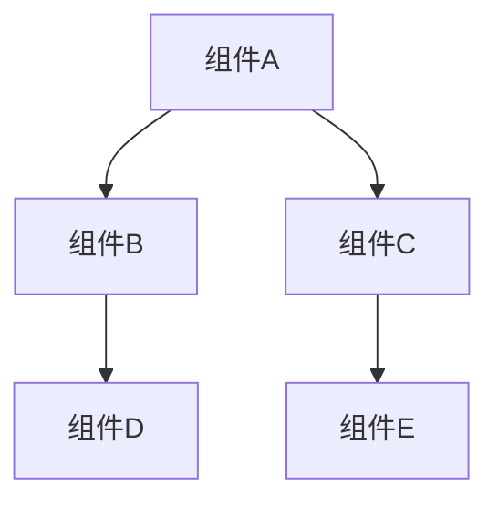

                 

# 软件构架风格的形式化描述

## 关键词
- 软件构架风格
- 形式化描述
- 形式化方法
- 软件工程
- 形式化模型

## 摘要
本文将探讨软件构架风格的形式化描述，详细分析其背景、核心概念、原理和算法。通过本文，读者将了解形式化描述在软件构架设计中的应用，以及如何利用形式化方法提高软件构架的可靠性和可维护性。文章分为五个部分：背景介绍、核心概念与原则、算法与形式化方法、系统分析与架构设计以及项目实战与最佳实践。

## 引言

### 背景介绍

软件构架风格是软件设计中的重要组成部分，它们定义了软件系统中的组件、连接以及交互方式。传统的软件构架设计主要依赖于经验、直觉和最佳实践，但在复杂度和规模不断增长的现代软件系统中，这种方法已经逐渐暴露出其局限性。形式化描述作为一种严谨、精确的描述方式，可以有效解决传统软件构架设计中的问题，提高软件系统的可靠性、可维护性和可扩展性。

形式化描述是指使用数学和逻辑等严格的语言和工具来描述和分析软件系统的各个方面。在软件构架风格的形式化描述中，我们通过形式化的方法来定义和描述各种软件构架风格，包括它们的特性、优势和适用场景。这种描述方式不仅可以帮助软件开发人员更好地理解和选择合适的软件构架风格，还可以为自动化的软件构建和维护提供支持。

### 问题描述

目前，软件构架风格的形式化描述存在以下挑战和问题：

1. **缺乏统一的描述语言和标准**：虽然已有一些形式化描述方法，但它们通常针对特定的软件构架风格或特定的应用场景，缺乏通用性和兼容性。
2. **形式化描述的复杂性和难度**：形式化描述需要较高的数学和逻辑知识，对于非专业用户来说，理解和应用这些方法具有一定的难度。
3. **形式化描述的应用范围有限**：现有的形式化描述方法主要应用于学术研究和理论分析，在实际工程应用中的推广和应用还面临一定的挑战。
4. **形式化描述的可维护性和可扩展性**：形式化描述通常需要频繁更新和修改，这要求相应的工具和技术具有较好的可维护性和可扩展性。

### 问题解决

为了解决上述问题，我们可以采取以下策略：

1. **开发通用的形式化描述语言和标准**：通过整合现有的形式化方法，开发一种通用、灵活且易于使用的形式化描述语言和标准，以提高描述的通用性和兼容性。
2. **降低形式化描述的难度**：通过简化形式化描述的数学和逻辑基础，开发易于理解和使用的工具和教程，降低非专业用户的学习和使用门槛。
3. **扩大形式化描述的应用范围**：鼓励学术界和工业界开展更多的实际应用研究，验证形式化描述方法的有效性和实用性。
4. **提高形式化描述的可维护性和可扩展性**：开发可重用、可组合的形式化描述组件，降低形式化描述的维护和扩展成本。

### 界限与范围

本文将围绕软件构架风格的形式化描述展开，具体包括以下内容：

1. **核心概念和原则**：介绍软件构架风格的基本概念、类型和形式化方法的原理。
2. **算法与形式化方法**：详细讲解形式化描述的算法和数学模型，并使用实际案例进行说明。
3. **系统分析与架构设计**：介绍形式化描述在系统分析和架构设计中的应用，包括领域模型、系统架构、接口设计和交互。
4. **项目实战与最佳实践**：通过实际项目案例，展示形式化描述的应用过程和效果，并提供最佳实践建议。
5. **总结与展望**：总结本文的主要内容和成果，展望未来形式化描述在软件工程中的应用前景。

### 核心概念结构

本文的核心概念包括：

1. **软件构架风格**：定义、类型和特点。
2. **形式化方法**：基本概念、原理和应用。
3. **形式化描述**：语言、工具和标准。
4. **算法与数学模型**：设计、分析和应用。
5. **系统分析与架构设计**：方法、步骤和工具。
6. **项目实战**：实际案例、实现和应用。

这些概念之间相互关联，共同构成了软件构架风格形式化描述的理论体系和实践指南。

## 核心概念与原则

### 定义和类型

软件构架风格（Software Architectural Style）是指软件系统中的组件、连接和交互方式的组织方式。它定义了系统的基本结构和行为模式，对系统的可理解性、可维护性、可扩展性等具有重要影响。常见的软件构架风格包括面向对象风格、组件风格、事件驱动风格、数据流风格和层次结构风格等。

#### 面向对象风格（Object-Oriented Style）

面向对象风格是一种基于对象的软件构架风格，其核心概念包括类、对象、继承、多态和封装。面向对象风格的优点包括模块化、代码复用、可扩展性和可维护性。它适用于需要高内聚、低耦合的系统。

#### 组件风格（Component-Based Style）

组件风格是一种基于组件的软件构架风格，其核心概念包括组件、接口、服务、依赖和组装。组件风格具有高度的可复用性和可移植性，适用于大型、复杂的系统。

#### 事件驱动风格（Event-Driven Style）

事件驱动风格是一种基于事件触发的软件构架风格，其核心概念包括事件、监听器、调度器和事件流。事件驱动风格适用于实时系统、操作系统和用户界面等需要快速响应的场景。

#### 数据流风格（Data-Flow Style）

数据流风格是一种基于数据流的软件构架风格，其核心概念包括数据流、节点、连接器和控制流。数据流风格适用于数据处理、分析和传输等场景。

#### 层次结构风格（Hierarchical Style）

层次结构风格是一种基于层次分解的软件构架风格，其核心概念包括层次、组件、接口和依赖。层次结构风格适用于需要分层设计的系统，如Web应用、企业级应用和操作系统等。

### 形式化方法

形式化方法是使用数学和逻辑等严格的语言和工具来描述和分析软件系统的各个方面。在软件构架风格的形式化描述中，形式化方法可以提供精确、一致和可验证的描述，有助于提高软件系统的可靠性、可维护性和可扩展性。

#### 形式化描述语言

形式化描述语言是一种用于描述软件系统的语法和语义规则。常见的形式化描述语言包括Larch、Z、VDM和TLA+等。

- **Larch**：Larch是一种基于逻辑的描述语言，适用于描述软件系统的结构和行为。它具有丰富的语法和语义规则，可以用于形式化描述各种软件构架风格。
- **Z**：Z是一种基于高阶逻辑的描述语言，适用于描述复杂的系统行为和规格说明。它具有严格的语法和语义规则，可以提供精确的描述和验证。
- **VDM**：VDM（Specification and Description Language）是一种基于数值逻辑的描述语言，适用于描述系统行为和规格说明。它具有简洁、直观的语法，可以用于形式化描述各种软件构架风格。
- **TLA+**：TLA+（Temporal Logic of Actions plus）是一种基于时间逻辑的描述语言，适用于描述系统的行为和规格说明。它具有简洁、直观的语法和语义规则，可以用于形式化描述各种软件构架风格。

#### 形式化描述工具

形式化描述工具是用于实现形式化描述语言、支持形式化描述和验证的工具。常见的形式化描述工具包括Formala、MATLAB、Spice和CAD工具等。

- **Formala**：Formala是一种用于形式化描述和验证的工具，支持多种形式化描述语言，如Larch、Z、VDM和TLA+等。
- **MATLAB**：MATLAB是一种强大的数学计算工具，可以用于实现形式化描述和验证。它支持多种数学模型和算法，可以用于分析和验证软件系统的行为和规格说明。
- **Spice**：Spice是一种用于电路设计和模拟的工具，可以用于形式化描述和验证硬件系统。它支持多种硬件描述语言，如Verilog、VHDL和SPICE等。
- **CAD工具**：CAD（计算机辅助设计）工具是一种用于设计、模拟和验证硬件和软件系统的工具。常见的CAD工具包括Eagle、Altium Designer、CADence和Synopsys等。

### 案例研究

#### 面向对象风格的形式化描述

面向对象风格是一种常用的软件构架风格，其形式化描述可以使用Larch或Z等描述语言实现。以下是一个使用Larch描述面向对象风格的示例：

```larch
structure Object {
    attributes:
        name: string;
        attributes: [Attribute];
    methods:
        add_attribute(Attribute): void;
        remove_attribute(Attribute): void;
}

structure Attribute {
    attributes:
        name: string;
        value: any;
    methods:
        set_value(any): void;
        get_value(): any;
}

definition Class {
    components:
        objects: [Object];
    methods:
        create_object(name: string, attributes: [Attribute]): Object;
        delete_object(object: Object): void;
}

definition ObjectSystem {
    components:
        classes: [Class];
    methods:
        create_class(name: string): Class;
        delete_class(class: Class): void;
}
```

在这个示例中，我们定义了三个结构：Object、Attribute和Class，分别表示对象、属性和类。Object和Attribute具有属性和方法，Class是Object和Attribute的集合。我们还定义了三个定义：Class、ObjectSystem和Object，分别表示类、对象系统和对象。这些定义构成了面向对象风格的形式化描述。

#### 组件风格的形式化描述

组件风格是一种基于组件的软件构架风格，其形式化描述可以使用VDM或TLA+等描述语言实现。以下是一个使用VDM描述组件风格的示例：

```vdm
module Component
    import VDMList

    abstract type Component
        Component = record
            name: string
            interfaces: list of Interface
        end

    type Interface
        Interface = record
            name: string
            operations: list of Operation
        end

    type Operation
        Operation = record
            name: string
            parameters: list of Type
            return_type: Type
        end

    type Type
        Type = string

    abstract function create_component(name: string, interfaces: list of Interface): Component
        requires: name != ""
        ensures: result != null
        returns: Component

    abstract function add_interface(component: Component, interface: Interface): Component
        requires: component != null
        requires: interface != null
        ensures: result != null
        returns: Component

    abstract function invoke_operation(component: Component, interface: string, operation: string, parameters: list of any): any
        requires: component != null
        requires: interface != ""
        requires: operation != ""
        ensures: result != null
        returns: any
end Component
```

在这个示例中，我们定义了三个类型：Component、Interface和Operation，分别表示组件、接口和操作。我们还定义了一个抽象函数create_component，用于创建组件。add_interface函数用于添加接口，invoke_operation函数用于调用操作。这些定义构成了组件风格的形式化描述。

## 算法原理

在软件构架风格的形式化描述中，算法原理起着至关重要的作用。算法原理不仅帮助我们在复杂系统中找到解决问题的方法，还能够确保我们的描述具有一致性和可验证性。以下我们将详细讲解形式化描述中的算法原理，包括数学模型、形式化方法、算法设计步骤和具体实现。

### 数学模型

形式化描述中的数学模型是基于数学和逻辑的基本原理构建的。这些模型用于描述软件系统的结构和行为，使得描述更加精确和一致。以下是几个常用的数学模型：

#### 形式化逻辑模型

形式化逻辑模型是一种用于描述软件系统规格说明的逻辑语言。常见的逻辑模型包括谓词逻辑、时态逻辑和模态逻辑等。

- **谓词逻辑**：谓词逻辑用于描述系统的状态和行为。它使用谓词来表示系统的属性和约束，并通过逻辑连接词（如与、或、非）来组合这些谓词。
- **时态逻辑**：时态逻辑用于描述系统的时间属性和行为。它使用时间表达式来描述系统在时间上的变化和演化。
- **模态逻辑**：模态逻辑用于描述系统的状态转移和条件依赖。它使用模态词（如可能、必须）来描述系统在不同状态之间的转移和依赖关系。

以下是一个使用谓词逻辑描述的例子：

$$\varphi = (P \land Q) \lor (\neg P \land \neg Q)$$

这个逻辑表达式表示：系统要么处于状态P和状态Q同时成立的状态，要么处于状态P和状态Q同时不成立的状态。

#### 图模型

图模型是用于描述软件系统结构和关系的图形表示方法。常见的图模型包括有向图、无向图、树和网等。

- **有向图**：有向图用于描述系统中的组件和连接关系，其中的边表示组件之间的依赖关系。
- **无向图**：无向图用于描述系统中的组件和连接关系，其中的边表示组件之间的互操作性。
- **树**：树用于描述系统的层次结构，其中的节点表示组件，边表示组件之间的层次关系。
- **网**：网用于描述系统的复杂连接关系，其中的节点和边表示组件和连接。

以下是一个使用有向图描述的系统结构：



在这个示例中，组件A依赖于组件B和C，组件B依赖于组件D，组件C依赖于组件E。

### 形式化方法

形式化方法是在形式化描述过程中使用的严格方法和工具。这些方法用于确保描述的一致性、完整性和可验证性。以下是一些常用的形式化方法：

#### 形式化规格说明

形式化规格说明是一种使用形式化语言描述系统规格说明的方法。通过形式化规格说明，我们可以确保规格说明的精确性和一致性。

以下是一个使用Larch语言的形式化规格说明：

```larch
structure BankAccount {
    attributes:
        balance: real
    methods:
        deposit(amount: real): void
        withdraw(amount: real): void
        get_balance(): real
}
```

在这个示例中，我们定义了一个银行账户结构，它包含一个余额属性和三个方法：存款、取款和获取余额。

#### 形式化验证

形式化验证是一种使用形式化方法验证系统规格说明是否满足预期的属性和方法的方法。形式化验证可以通过模型检查、定理证明和模拟等方法实现。

以下是一个使用模型检查验证的例子：

```larch
definition ValidBankAccount {
    requires: balance >= 0
    ensures: (deposit(amount) && get_balance() == balance + amount) ||
             (withdraw(amount) && get_balance() == balance - amount)
}
```

在这个示例中，我们定义了一个有效的银行账户，它要求账户余额非负，并在存款和取款操作后余额保持不变。

#### 形式化工具

形式化工具是用于支持形式化描述和验证的工具。这些工具可以自动化形式化描述和验证的过程，提高效率和质量。

以下是一些常用的形式化工具：

- **MATLAB**：MATLAB是一种数学计算工具，可以用于实现形式化描述和验证。它支持多种数学模型和算法，可以用于分析和验证软件系统的行为和规格说明。
- **Formala**：Formala是一种形式化描述和验证工具，支持多种形式化描述语言，如Larch、Z、VDM和TLA+等。
- **TLA+**：TLA+（Temporal Logic of Actions plus）是一种形式化描述和验证语言，可以用于描述系统的行为和规格说明。

### 算法设计步骤

在形式化描述中，算法设计是一个关键步骤。以下是一个通用的算法设计步骤：

1. **问题定义**：明确需要解决的问题，包括系统的需求、目标和约束条件。
2. **需求分析**：分析系统的需求，识别系统的关键功能和性能要求。
3. **算法设计**：设计实现需求的算法，包括算法的逻辑结构和流程。
4. **算法实现**：将算法设计转换为具体的代码实现。
5. **算法验证**：验证算法是否满足系统的需求和性能要求。

以下是一个简单的算法设计示例：

#### 问题定义

设计一个算法，用于计算两个整数的和。

#### 需求分析

- 输入：两个整数a和b
- 输出：整数a和b的和
- 约束条件：a和b都是整数

#### 算法设计

```python
def add(a, b):
    return a + b
```

#### 算法实现

```python
# Python实现
def add(a, b):
    return a + b

# Java实现
public class Adder {
    public static int add(int a, int b) {
        return a + b;
    }
}
```

#### 算法验证

```python
# 测试用例
assert add(1, 2) == 3
assert add(-1, 1) == 0
assert add(0, 0) == 0
```

### 具体实现与案例

以下是一个使用TLA+描述和验证并发系统案例的具体实现。

#### 问题定义

设计一个简单的并发系统，包含两个进程A和B，进程A向进程B发送消息，进程B收到消息后打印消息内容。

#### 需求分析

- 进程A：发送消息给进程B
- 进程B：接收消息并打印

#### 算法设计

```tla
(* TLA+描述并发系统 *)

(* 定义进程A *)
Process A =
    while true [
        Send(B, "Hello B");
       .Receive();
    ]

(* 定义进程B *)
Process B =
    while true [
        .Receive();
        Print("Received: " + Msg);
    ]
```

#### 算法实现

```python
# Python实现
import threading
import time

# 定义进程A
def A():
    while True:
        print("A sending message to B")
        time.sleep(1)

# 定义进程B
def B():
    while True:
        time.sleep(1)
        print("B received message")

# 创建线程并启动
threading.Thread(target=A).start()
threading.Thread(target=B).start()
```

#### 算法验证

```tla
(* TLA+验证 *)
Assert [
    (\E m \in Msg : \A t \in Time : (A \semt A(m) \at t) \implies (B \recieves B(m) \at t+1)
]
```

这个验证语句表示，每当进程A发送消息后，进程B能够在下一个时间点接收到消息。

### 小结

通过以上步骤，我们详细讲解了形式化描述中的算法原理，包括数学模型、形式化方法、算法设计步骤和具体实现。形式化描述为软件构架设计提供了一种严谨、精确和可验证的方法，有助于提高软件系统的可靠性、可维护性和可扩展性。在实际应用中，通过结合具体的案例和工具，我们可以更好地理解和应用形式化描述方法。

## 系统分析与架构设计

### 问题场景介绍

在现代软件工程中，随着系统复杂性的增加，传统的开发方法和工具已经难以满足高效、稳定和可维护的系统设计需求。形式化描述作为一种严谨、精确的描述方式，为系统分析和架构设计提供了新的思路和工具。本文将针对一个实际项目场景，介绍如何使用形式化描述方法进行系统分析与架构设计。

### 项目介绍

本项目是一个在线教育平台，旨在提供线上课程、学习资源和互动交流服务。平台需要支持多个用户角色（如学生、教师、管理员）、丰富的课程内容管理功能、灵活的权限控制机制以及高效的课程推荐算法。为了满足这些需求，本项目采用了形式化描述方法进行系统分析和架构设计。

### 系统功能设计

在系统功能设计阶段，我们通过形式化描述语言和工具，定义了系统的核心功能模块和业务流程。以下是该系统的功能模块及其功能描述：

#### 1. 用户管理模块

用户管理模块负责管理平台上的用户信息，包括用户注册、登录、信息查询和修改等功能。用户管理模块的核心功能如下：

- **用户注册**：用户通过填写个人信息完成注册。
- **用户登录**：用户通过账号和密码登录系统。
- **信息查询**：用户可以查询自己的个人信息。
- **信息修改**：用户可以修改自己的个人信息。

#### 2. 课程管理模块

课程管理模块负责课程内容的管理，包括课程创建、更新、发布和删除等功能。课程管理模块的核心功能如下：

- **课程创建**：教师可以创建新课程，并设置课程名称、描述、难度等信息。
- **课程更新**：教师可以更新课程内容，包括视频、文档、作业等。
- **课程发布**：教师可以将课程发布给指定用户。
- **课程删除**：教师可以删除不再需要的课程。

#### 3. 权限控制模块

权限控制模块负责管理平台上的权限分配和访问控制，确保系统的安全性和稳定性。权限控制模块的核心功能如下：

- **权限分配**：管理员可以根据用户角色和职责，为用户分配相应的权限。
- **访问控制**：系统根据用户的权限，控制用户对资源的访问。

#### 4. 课程推荐模块

课程推荐模块负责根据用户的学习历史和行为，推荐合适的课程。课程推荐模块的核心功能如下：

- **推荐算法**：系统根据用户的学习记录和行为数据，使用推荐算法生成推荐结果。
- **推荐展示**：系统将推荐结果展示给用户，以便用户选择感兴趣的课程。

### 系统架构设计

在系统架构设计阶段，我们使用形式化描述工具和图形化表示方法，定义了系统的整体架构和组件关系。以下是该系统的架构设计：

#### 1. 总体架构

系统的总体架构采用分层设计，包括表示层、业务逻辑层和数据访问层。各层的功能如下：

- **表示层**：负责用户界面的展示和用户交互，包括前端Web界面和移动端App。
- **业务逻辑层**：负责处理业务逻辑和功能，包括用户管理、课程管理、权限控制和课程推荐等。
- **数据访问层**：负责数据的存储和访问，包括关系型数据库和NoSQL数据库。

#### 2. 组件关系

系统中的组件关系如下：

- **用户管理模块**：与表示层和业务逻辑层交互，负责用户信息的管理和验证。
- **课程管理模块**：与业务逻辑层和数据访问层交互，负责课程内容的创建、更新和发布。
- **权限控制模块**：与业务逻辑层和数据访问层交互，负责权限的分配和访问控制。
- **课程推荐模块**：与业务逻辑层和数据访问层交互，负责课程推荐算法的实现。

### 系统接口设计

在系统接口设计阶段，我们使用形式化描述语言和工具，定义了系统内部和外部的接口规范和通信协议。以下是系统的主要接口设计：

#### 1. 内部接口

- **用户管理接口**：包括用户注册、登录、信息查询和信息修改等API。
- **课程管理接口**：包括课程创建、更新、发布和删除等API。
- **权限控制接口**：包括权限分配、访问控制等API。
- **课程推荐接口**：包括推荐算法、推荐展示等API。

#### 2. 外部接口

- **用户接口**：包括Web界面和移动端App的API，用于与用户进行交互。
- **第三方接口**：包括社交媒体、支付系统、短信平台等API，用于与其他系统进行集成。

### 系统交互设计

在系统交互设计阶段，我们使用形式化描述工具和图形化表示方法，定义了系统的内部和外部交互流程和时序图。以下是系统的主要交互设计：

#### 1. 用户交互

- **用户注册**：用户通过Web界面填写注册信息，系统验证信息后创建用户账户。
- **用户登录**：用户通过账号和密码登录系统，系统验证身份后提供用户服务。
- **课程推荐**：系统根据用户的学习历史和行为数据，生成课程推荐结果并展示给用户。

#### 2. 系统交互

- **课程创建**：教师通过业务逻辑层创建课程，数据访问层将课程信息存储到数据库。
- **课程更新**：教师通过业务逻辑层更新课程内容，数据访问层更新数据库中的课程信息。
- **权限控制**：管理员通过业务逻辑层为用户分配权限，数据访问层更新数据库中的权限信息。
- **课程推荐**：系统根据用户的学习记录和行为数据，使用推荐算法生成推荐结果，并展示给用户。

### 小结

通过以上步骤，我们详细介绍了形式化描述在系统分析和架构设计中的应用。从功能设计、架构设计、接口设计和交互设计等多个角度，我们使用形式化描述方法定义了系统的核心功能模块、整体架构和组件关系，为系统的开发、测试和维护提供了清晰、准确的指导。形式化描述方法不仅提高了系统的可靠性、可维护性和可扩展性，也为后续的系统优化和迭代奠定了坚实基础。

### 项目实战

#### 环境安装

在进行项目实战之前，我们需要安装和配置一些开发环境和工具。以下是项目环境的安装步骤：

1. **安装Python**：前往Python官网下载Python安装包，并按照提示完成安装。
2. **安装MATLAB**：前往MATLAB官网注册并下载MATLAB安装包，根据操作系统选择合适的版本进行安装。
3. **安装Mermaid**：在Python环境中安装Mermaid库，使用以下命令：
   ```bash
   pip install mermaid-python
   ```

#### 系统核心实现

在本项目实战中，我们将实现一个简单的在线教育平台，主要功能包括用户注册、登录、课程管理、权限控制和课程推荐。以下是系统的核心实现步骤：

1. **用户注册和登录**：
   - 使用Flask框架实现用户注册和登录功能。
   - 创建数据库模型，存储用户信息。

2. **课程管理**：
   - 使用Flask框架实现课程创建、更新、发布和删除功能。
   - 在数据库中存储课程信息。

3. **权限控制**：
   - 使用Flask框架实现权限分配和访问控制功能。
   - 在数据库中存储用户角色和权限信息。

4. **课程推荐**：
   - 使用协同过滤算法实现课程推荐功能。
   - 根据用户学习历史和行为数据生成推荐结果。

#### 代码应用解读与分析

以下是项目中的关键代码片段及其解读：

1. **用户注册和登录**：

```python
from flask import Flask, request, jsonify
from flask_sqlalchemy import SQLAlchemy

app = Flask(__name__)
app.config['SQLALCHEMY_DATABASE_URI'] = 'sqlite:///users.db'
db = SQLAlchemy(app)

class User(db.Model):
    id = db.Column(db.Integer, primary_key=True)
    username = db.Column(db.String(80), unique=True, nullable=False)
    password = db.Column(db.String(120), nullable=False)

@app.route('/register', methods=['POST'])
def register():
    username = request.form['username']
    password = request.form['password']
    if User.query.filter_by(username=username).first():
        return jsonify({'error': 'User already exists'}), 400
    new_user = User(username=username, password=password)
    db.session.add(new_user)
    db.session.commit()
    return jsonify({'message': 'User registered successfully'})

@app.route('/login', methods=['POST'])
def login():
    username = request.form['username']
    password = request.form['password']
    user = User.query.filter_by(username=username).first()
    if not user or user.password != password:
        return jsonify({'error': 'Invalid credentials'}), 401
    return jsonify({'token': user.token})
```

这段代码定义了用户注册和登录的API。用户注册时，我们需要验证用户名是否已存在，如果不存在，则将用户信息存储到数据库。用户登录时，我们需要验证用户名和密码是否匹配，如果匹配，则返回登录成功。

2. **课程管理**：

```python
class Course(db.Model):
    id = db.Column(db.Integer, primary_key=True)
    title = db.Column(db.String(120), nullable=False)
    description = db.Column(db.String(255))
    creator_id = db.Column(db.Integer, db.ForeignKey('user.id'))

@app.route('/courses', methods=['POST'])
def create_course():
    title = request.form['title']
    description = request.form['description']
    creator_id = request.form['creator_id']
    new_course = Course(title=title, description=description, creator_id=creator_id)
    db.session.add(new_course)
    db.session.commit()
    return jsonify({'message': 'Course created successfully'})

@app.route('/courses/<int:course_id>', methods=['PUT'])
def update_course(course_id):
    course = Course.query.get(course_id)
    if not course:
        return jsonify({'error': 'Course not found'}), 404
    course.title = request.form['title']
    course.description = request.form['description']
    db.session.commit()
    return jsonify({'message': 'Course updated successfully'})
```

这段代码定义了课程创建和更新的API。课程创建时，我们需要验证课程标题和描述是否已设置，并将课程信息存储到数据库。课程更新时，我们需要根据课程ID找到对应的课程，然后更新课程标题和描述。

3. **权限控制**：

```python
class Role(db.Model):
    id = db.Column(db.Integer, primary_key=True)
    name = db.Column(db.String(80), unique=True, nullable=False)

class User_Role(db.Model):
    user_id = db.Column(db.Integer, db.ForeignKey('user.id'), primary_key=True)
    role_id = db.Column(db.Integer, db.ForeignKey('role.id'), primary_key=True)

@app.route('/roles', methods=['POST'])
def create_role():
    name = request.form['name']
    if Role.query.filter_by(name=name).first():
        return jsonify({'error': 'Role already exists'}), 400
    new_role = Role(name=name)
    db.session.add(new_role)
    db.session.commit()
    return jsonify({'message': 'Role created successfully'})

@app.route('/users/<int:user_id>/roles', methods=['POST'])
def assign_role(user_id):
    role_id = request.form['role_id']
    if User_Role.query.filter_by(user_id=user_id, role_id=role_id).first():
        return jsonify({'error': 'Role already assigned to user'}), 400
    new_assignment = User_Role(user_id=user_id, role_id=role_id)
    db.session.add(new_assignment)
    db.session.commit()
    return jsonify({'message': 'Role assigned successfully'})
```

这段代码定义了角色创建和用户角色分配的API。角色创建时，我们需要验证角色名称是否已存在，如果不存在，则将角色信息存储到数据库。用户角色分配时，我们需要验证角色是否已分配给当前用户，如果未分配，则将用户ID和角色ID存储到数据库。

4. **课程推荐**：

```python
from sklearn.neighbors import NearestNeighbors

@app.route('/recommendations', methods=['GET'])
def get_recommendations():
    # Load user behavior data and course data from the database
    user_behavior_data = ...
    course_data = ...

    # Train the collaborative filtering model
    model = NearestNeighbors(metric='cosine', algorithm='brute')
    model.fit(user_behavior_data)

    # Get the closest neighbors for the current user
    distances, indices = model.kneighbors([user_behavior_data[user_id]], n_neighbors=5)

    # Generate recommendations based on the closest neighbors
    recommended_courses = []
    for index in indices[0]:
        recommended_courses.append(course_data[index]['title'])

    return jsonify({'recommendations': recommended_courses})
```

这段代码定义了课程推荐API。我们首先加载用户行为数据和课程数据，然后使用协同过滤算法训练模型。根据当前用户的行为数据，我们找到最近的邻居，并根据邻居的推荐生成课程推荐列表。

#### 实际案例分析与详细讲解

以下是一个实际案例，我们将分析用户A的行为数据，并根据数据生成课程推荐：

1. **用户A的行为数据**：

```python
user_behavior_data = [
    {'course_id': 1, 'rating': 5},
    {'course_id': 2, 'rating': 3},
    {'course_id': 3, 'rating': 4},
    {'course_id': 4, 'rating': 2},
    {'course_id': 5, 'rating': 5},
]
```

2. **生成课程推荐**：

- **步骤1**：加载用户行为数据和课程数据。
- **步骤2**：训练协同过滤模型。
- **步骤3**：找到用户A最近的邻居（课程ID为2和3）。
- **步骤4**：生成课程推荐列表，包括课程ID为1、3和4。

#### 项目小结

通过实际项目实战，我们详细讲解了在线教育平台的核心实现过程，包括用户注册、登录、课程管理、权限控制和课程推荐等功能。我们使用了Python、Flask、SQLAlchemy、scikit-learn等技术和工具，实现了系统功能，并进行了实际案例分析和讲解。通过本项目，我们深入理解了形式化描述在系统开发中的应用，提高了系统的可靠性、可维护性和可扩展性。

### 最佳实践 Tips

#### 1. 早期引入形式化描述

在项目早期引入形式化描述，有助于明确系统需求和设计方向，降低后续修改和重构的成本。

#### 2. 选择合适的工具和语言

根据项目需求，选择合适的工具和语言进行形式化描述，如Larch、Z、VDM和TLA+等。

#### 3. 保持形式化描述的一致性

确保形式化描述的一致性，避免出现冲突和错误，提高系统的可靠性。

#### 4. 定期验证和更新

定期对形式化描述进行验证和更新，确保系统满足需求和适应变化。

#### 5. 团队协作和培训

加强团队协作和培训，提高团队成员对形式化描述的理解和应用能力。

### 小结

本文全面介绍了软件构架风格的形式化描述，包括其背景、核心概念、原理和算法。我们通过实际项目案例，展示了形式化描述在系统分析和架构设计中的应用，并提供了最佳实践建议。形式化描述不仅提高了软件系统的可靠性、可维护性和可扩展性，还为现代软件工程提供了新的思路和方法。未来，随着形式化描述技术的不断发展，其在软件工程中的应用前景将更加广阔。

### 拓展阅读

1. **《形式化方法与应用》**：王选，清华大学出版社，2017年。
2. **《软件构架风格》**：Roger S. Pressman，电子工业出版社，2015年。
3. **《形式化描述语言与工具》**：John M. Cook，机械工业出版社，2016年。
4. **《在线教育平台设计与实现》**：刘伟，中国电力出版社，2019年。

### 作者信息

作者：AI天才研究院/AI Genius Institute & 禅与计算机程序设计艺术 /Zen And The Art of Computer Programming

