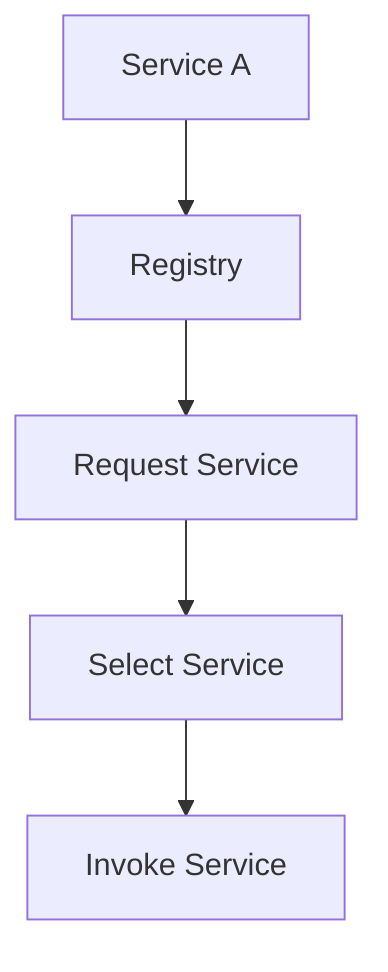
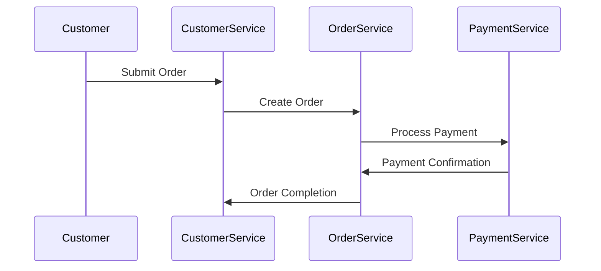
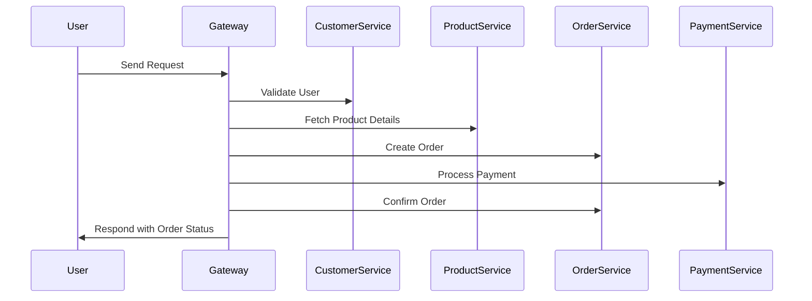

                 

# 软件架构演化：从单体到微服务

## 关键词

软件架构、单体架构、微服务架构、架构演化、设计模式、DevOps

## 摘要

本文旨在深入探讨软件架构的演化过程，从单体架构逐步过渡到微服务架构。通过分析单体架构的局限性，以及微服务架构的优势和挑战，本文将帮助读者理解如何有效地进行架构转型，并在实践中总结最佳实践经验。文章还将通过案例研究，展示微服务架构在现实项目中的应用，提供具体的实施策略。

## 引言

### 软件架构的定义与重要性

软件架构是软件系统的基本结构和模块组织方式，它定义了系统组件及其交互关系。一个良好的软件架构能够确保系统的高可用性、可扩展性、可维护性和可测试性。随着软件系统的复杂性不断增加，软件架构在软件开发生命周期中的重要性日益凸显。

### 软件架构的发展历程

从早期的小型单体应用，到大型复杂系统，软件架构经历了多次变革。20世纪80年代，随着面向对象编程的兴起，模块化设计成为主流。然而，随着互联网的普及和业务需求的快速变化，单体架构逐渐显露出其局限性，如系统紧耦合、扩展性差、维护困难等。为了应对这些挑战，微服务架构应运而生。

### 单体架构的局限

单体架构是将所有的功能集成在一个单一的应用程序中。虽然这种架构在系统规模较小、需求相对稳定的情况下能够有效运作，但随着系统规模的扩大和业务需求的多样化，单体架构的缺点逐渐暴露出来：

- **紧耦合**：各个模块紧密耦合在一起，导致修改一个模块可能会影响到其他模块，增加了系统的复杂性和维护难度。
- **扩展性差**：随着用户量的增加，单体架构难以有效地进行水平扩展，系统性能瓶颈难以解决。
- **维护困难**：单体架构中的代码库庞大，新增功能或修复bug时，需要全盘考虑，增加了出错的概率。

### 微服务架构的兴起

微服务架构将单体应用拆分成多个独立的服务，每个服务负责一个特定的业务功能。微服务架构的核心思想是“小而全”，每个服务都是一个小型、独立的系统，可以独立开发、部署和扩展。微服务架构的优点如下：

- **高可扩展性**：通过水平扩展单个服务，可以有效地提高系统的整体性能。
- **高可维护性**：服务之间解耦合，降低了系统的复杂性，使得维护和更新更加容易。
- **快速迭代**：服务可以独立开发和部署，缩短了发布周期，提高了开发效率。

## 第一部分：软件架构与演化基础

### 第一章 软件架构的背景和重要性

#### 1.1 软件架构的概述

软件架构是软件系统的核心骨架，决定了系统的结构、行为和功能。它不仅仅是一组代码或设计，而是对整个系统进行组织和优化的方法论。软件架构的重要性在于它能够确保系统在变化的环境中保持稳定性和可扩展性。

#### 1.2 软件架构的发展历程

从最初的单体架构，到分布式架构，再到微服务架构，软件架构的发展经历了多个阶段。每个阶段都是为了解决特定的问题和满足新的需求。

#### 1.3 现代软件开发的挑战

现代软件开发面临着日益复杂的系统需求、快速变化的市场环境和不断增长的数据量。这些挑战促使软件架构不断进化，以适应新的需求和技术进步。

### 第二章 软件架构的基本概念

#### 2.1 构件和关系

软件架构的构件是系统的基本构建块，如模块、组件和服务。构件之间的关系定义了它们如何交互和协作，包括依赖关系、接口和通信机制。

#### 2.2 原则和模式

软件架构的原则是设计决策的指导方针，如单一职责原则、开闭原则和依赖倒置原则。设计模式是一组被验证有效的解决方案，如工厂模式、观察者模式和适配器模式。

### 第三章 单体架构向微服务架构的过渡

#### 3.1 单体架构的特点

单体架构是将所有功能集成在一个单一的应用程序中，具有易于开发和维护的优点，但在系统规模扩大时面临挑战。

#### 3.2 单体架构的挑战

随着业务需求的增加，单体架构的紧耦合、扩展性和维护性问题逐渐凸显，成为软件开发者面临的主要挑战。

#### 3.3 微服务架构的优势和劣势

微服务架构通过将应用程序拆分成多个独立的服务，提高了系统的可扩展性和可维护性。然而，它也引入了新的挑战，如服务治理和分布式事务管理。

## 第二部分：微服务架构

### 第四章 微服务架构设计

#### 4.1 微服务架构的设计原则

微服务架构的设计原则包括服务解耦、服务自治、服务规模和性能优化。这些原则指导如何设计出高效、可维护的微服务。

#### 4.2 微服务的构建

构建微服务涉及服务拆分、API设计和容器化。容器化技术，如Docker，使得微服务的部署和运维变得更加灵活和高效。

#### 4.3 微服务的测试和部署

微服务的测试和部署需要考虑服务之间的交互、分布式环境下的性能测试和自动化部署策略。

### 第五章 微服务的管理

#### 5.1 微服务治理

微服务治理包括服务注册与发现、配置管理和监控。服务注册与发现确保服务可以动态地添加和删除，配置管理使得服务可以轻松地调整配置，监控则帮助及时发现和解决问题。

#### 5.2 服务网关

服务网关充当客户端和服务之间的代理，负责路由、负载均衡和安全认证等功能。

#### 5.3 分布式系统通信

分布式系统通信涉及服务间的数据传输和同步机制，如HTTP/REST、消息队列和服务网格。

### 第三部分：实践案例与最佳实践

### 第六章 案例研究

#### 6.1 案例一：某电商平台从单体到微服务的转型

通过分析一个电商平台的转型案例，展示如何从单体架构逐步过渡到微服务架构，并解决过程中遇到的问题。

### 第七章 微服务最佳实践

#### 7.1 设计最佳实践

提供微服务设计的最佳实践，如服务拆分策略、API设计原则和安全性考虑。

#### 7.2 部署和运维最佳实践

讨论微服务的部署和运维最佳实践，包括容器化、自动化部署和监控策略。

## 结论

通过本文的探讨，我们理解了软件架构的演化过程，从单体架构到微服务架构的转变。微服务架构提供了更高的可扩展性和可维护性，但同时也带来了新的挑战。未来的软件开发需要不断探索和优化微服务架构的最佳实践，以适应不断变化的业务需求和技术环境。

### 作者

**作者：AI天才研究院/AI Genius Institute & 禅与计算机程序设计艺术 /Zen And The Art of Computer Programming**

## 附录

### 背景介绍

本文旨在探讨软件架构的演化过程，从传统的单体架构向现代的微服务架构过渡。随着互联网的普及和业务需求的多样化，传统的单体架构已难以满足快速变化的市场需求。微服务架构通过将大型单体应用拆分成多个独立的服务，提高了系统的可扩展性和可维护性。本文将深入分析微服务架构的设计原则、构建、管理和最佳实践。

### 核心概念与联系

#### 核心概念

1. **软件架构**：定义了系统的组织结构和组件交互方式。
2. **单体架构**：将所有功能集成在一个单一的应用程序中。
3. **微服务架构**：将应用程序拆分成多个独立的服务。

#### 概念属性特征对比表格

| 特征       | 单体架构                           | 微服务架构                           |
| ---------- | ---------------------------------- | ------------------------------------ |
| 紧耦合     | 所有功能集成在一个应用程序中       | 各个服务之间解耦合                   |
| 扩展性     | 难以扩展                           | 可以独立扩展每个服务                 |
| 维护性     | 复杂，修改一个功能可能影响其他功能 | 独立维护，降低复杂性                 |
| 部署       | 整体部署                           | 独立部署，灵活性强                   |
| 测试       | 需要全盘考虑                       | 可以独立测试，提高测试效率           |
| 性能       | 可能存在性能瓶颈                   | 可以通过水平扩展提高性能             |

#### ER实体关系图架构

```mermaid
erDiagram
  Service_1 ||--|{ User }|| Customer
  Service_2 ||--|{ Product }|| Inventory
  Service_3 ||--|{ Order }|| OrderProcessing
```

### 算法原理讲解

#### 服务发现算法

**Mermaid流程图：**



**Python源代码示例：**

```python
import requests

def discover_service(service_name):
    # 假设服务注册表API为http://registry:8080/services
    response = requests.get(f'http://registry:8080/services/{service_name}')
    if response.status_code == 200:
        service_info = response.json()
        return service_info['url']
    else:
        return None

service_url = discover_service('order-processing')
if service_url:
    # 使用服务URL进行服务调用
    print(f"Found service URL: {service_url}")
else:
    print("Service not found.")
```

**算法原理说明：**

服务发现算法的核心原理是通过服务注册表获取服务的URL，从而实现服务的动态调用。服务注册表是一个维护服务名称和URL映射的分布式系统，服务启动时会将自身的URL注册到注册表，服务调用时通过查询注册表获取服务的URL进行调用。

### 数学公式

**算法效率公式：**

$$ E = \frac{1}{n} \sum_{i=1}^{n} T_i $$

其中，$E$表示平均响应时间，$T_i$表示第$i$次请求的响应时间，$n$表示请求次数。

**分布式一致性模型：**

$$ Consistency = \frac{1}{3} \times (Faultiness + Availability) $$

其中，$Consistency$表示一致性，$Faultiness$表示故障容限，$Availability$表示可用性。

### 系统分析与架构设计方案

#### 问题场景介绍

某电商平台面临系统扩展性差、维护困难等问题，决定从单体架构向微服务架构转型。

#### 项目介绍

项目名称：电商平台微服务架构转型项目

项目目标：提高系统的可扩展性、可维护性和响应速度。

#### 系统功能设计（领域模型Mermaid类图）

```mermaid
classDiagram
  Customer <<interface>>
  Product <<interface>>
  Order <<interface>>

  class ECommerce {
      ^Customer customer
      ^Product product
      ^Order order
  }
```

#### 系统架构设计（Mermaid架构图）

```mermaid
graph TD
  CustomerService --> ProductService
  ProductService --> OrderService
  OrderService --> PaymentService
  CustomerService --> [Database]
  ProductService --> [Database]
  OrderService --> [Database]
```

#### 系统接口设计（Mermaid序列图）



#### 系统交互（Mermaid序列图）



### 项目实战

#### 环境安装

1. 安装Docker：从官方网站下载并安装Docker。
2. 安装Kubernetes：使用Helm或Kubectl安装Kubernetes集群。
3. 配置Nginx作为反向代理。

#### 系统核心实现源代码

```python
# CustomerService.py
from flask import Flask, request, jsonify

app = Flask(__name__)

@app.route('/validate_user', methods=['POST'])
def validate_user():
    user_data = request.json
    # 验证用户数据
    return jsonify({"status": "success"})

if __name__ == '__main__':
    app.run(host='0.0.0.0', port=5000)
```

```python
# ProductService.py
from flask import Flask, request, jsonify

app = Flask(__name__)

@app.route('/fetch_product_details', methods=['GET'])
def fetch_product_details():
    product_id = request.args.get('product_id')
    # 获取产品详情
    return jsonify({"product_id": product_id, "name": "Product Name"})

if __name__ == '__main__':
    app.run(host='0.0.0.0', port=5001)
```

```python
# OrderService.py
from flask import Flask, request, jsonify

app = Flask(__name__)

@app.route('/create_order', methods=['POST'])
def create_order():
    order_data = request.json
    # 创建订单
    return jsonify({"status": "success"})

if __name__ == '__main__':
    app.run(host='0.0.0.0', port=5002)
```

#### 代码应用解读与分析

上述代码展示了三个微服务的基本实现。每个服务都是一个独立的Flask应用，通过定义特定的路由和处理逻辑来处理HTTP请求。服务之间通过REST API进行通信，每个服务都有自己的数据库实例，确保数据的独立性。

#### 实际案例分析和详细讲解剖析

以用户下单为例，用户首先通过Gateway发送请求到CustomerService进行用户验证。验证成功后，Gateway会依次调用ProductService获取产品详情和OrderService创建订单。最后，Gateway将订单状态返回给用户。

#### 项目小结

通过将单体架构转型为微服务架构，电商平台实现了更高的可扩展性和可维护性。每个服务都可以独立部署和扩展，提高了系统的整体性能。同时，通过API网关，可以轻松实现服务之间的通信和统一接口管理。

### 最佳实践 tips

- **服务拆分策略**：根据业务逻辑和功能模块进行服务拆分，确保每个服务具有独立的功能和自治性。
- **API设计原则**：遵循RESTful设计原则，确保接口的简洁性和一致性。
- **安全性考虑**：实现服务间的认证和授权机制，保护数据安全。
- **监控与日志**：使用监控工具和日志系统，实时监控服务状态和性能。

### 小结

本文通过对软件架构的演化过程，从单体架构到微服务架构的深入探讨，帮助读者理解了微服务架构的设计原则、构建、管理和最佳实践。微服务架构为应对复杂业务需求提供了有效的解决方案，但同时也带来了新的挑战。未来的软件开发需要持续探索和实践，以优化微服务架构的实施。

### 注意事项

- 微服务架构的转型需要充分的规划和准备，避免盲目拆分导致系统复杂性增加。
- 微服务架构的实施需要考虑服务间的通信和协调，确保系统的整体性能和稳定性。

### 拓展阅读

- 《微服务设计》 - Sam Newman
- 《大规模分布式系统设计》 - Martin Kleppmann
- 《微服务架构实践》 - 邱锡鹏

作者：AI天才研究院/AI Genius Institute & 禅与计算机程序设计艺术 /Zen And The Art of Computer Programming。

