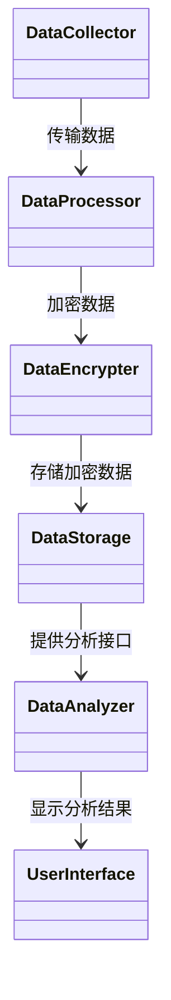
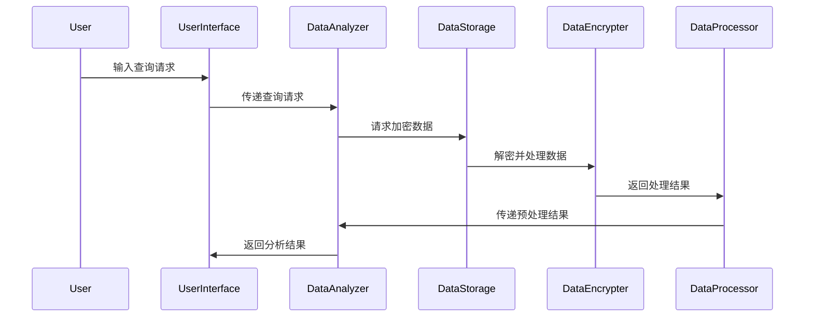

                 

### 第一部分：背景介绍

## 第1章：边缘计算概述

### 1.1 问题背景

#### 1.1.1 边缘计算的概念与重要性

边缘计算（Edge Computing）是一种分布式计算架构，它将数据、处理能力以及应用逻辑从中心化的云服务转移到网络的边缘，即接近数据源的地方。边缘计算的核心思想是缩短数据传输的距离，提高数据处理的效率，同时降低网络的负载压力。随着物联网（IoT）和5G技术的发展，边缘计算的重要性日益凸显。

边缘计算的重要性体现在以下几个方面：

1. **实时数据处理**：边缘计算可以实时处理和分析数据，降低响应时间，提高系统的实时性和可靠性。
2. **减少带宽消耗**：通过在边缘设备上处理数据，减少数据传输到中心服务器的需求，从而减少带宽消耗。
3. **增强隐私保护**：在边缘设备上处理数据，可以减少数据泄露的风险。
4. **提高系统弹性**：边缘计算可以实现分布式部署，提高系统的弹性和容错能力。

#### 1.1.2 边缘计算的挑战

尽管边缘计算具有诸多优势，但其实施和应用过程中也面临着一系列挑战：

1. **资源限制**：边缘设备通常资源有限，包括计算能力、存储能力和网络带宽。
2. **安全性问题**：边缘设备的安全防护相对中心化服务器较弱，容易成为攻击的目标。
3. **数据一致性**：在分布式边缘环境中，如何确保数据的一致性是一个重要问题。
4. **网络延迟**：边缘设备之间的通信可能会受到网络延迟的影响，影响系统的整体性能。

#### 1.1.3 边缘计算的发展现状

目前，边缘计算已经在多个领域得到了应用，如智能交通、智能医疗、智能制造和智能城市等。以下是一些边缘计算的发展现状：

1. **技术成熟度**：边缘计算技术逐渐成熟，包括边缘设备、边缘操作系统、边缘云计算平台等。
2. **产业应用**：越来越多的企业和组织开始将边缘计算纳入其技术战略，推动边缘计算应用场景的拓展。
3. **政策支持**：各国政府纷纷出台政策，支持边缘计算技术的发展和推广。

### 1.2 核心概念与联系

边缘计算涉及多个核心概念和技术，其中联合推理技术和隐私保护是两个重要组成部分。

#### 1.2.1 联合推理技术

**定义**：联合推理技术是一种多模态数据处理方法，它可以将来自不同来源和类型的数据进行联合分析，以获得更准确和全面的推理结果。

**属性特征对比**：

| 特征 | 联合推理 | 其他推理方法 |
| --- | --- | --- |
| **数据类型** | 多种数据类型（如图像、文本、传感器数据） | 单一数据类型 |
| **处理效率** | 较高，实时性较强 | 较低，可能存在延迟 |
| **复杂性** | 较高，需要复杂的算法和模型 | 较低，算法相对简单 |
| **准确性** | 较高，能够提高推理的准确性 | 较低，单一数据类型的推理准确性受限 |

**与边缘计算的关系**：联合推理技术可以在边缘设备上实现，通过在本地设备上处理和联合分析数据，提高边缘计算系统的效率和准确性。

#### 1.2.2 隐私保护

**定义**：隐私保护是指保护个人或组织数据的隐私，防止数据泄露、滥用或未经授权的访问。

**挑战**：

1. **数据量巨大**：边缘计算中涉及的数据量通常较大，隐私保护面临较大挑战。
2. **数据分散**：边缘设备分布在不同的地理位置，数据分散，隐私保护更加复杂。
3. **计算资源有限**：边缘设备通常计算资源有限，隐私保护算法的实现需要考虑计算性能。

**与边缘计算的关系**：隐私保护是边缘计算中不可或缺的一部分，通过在边缘设备上实施隐私保护措施，可以保障数据的安全性和用户隐私。

### 1.3 边缘计算中的联合推理与隐私保护

#### 1.3.1 联合推理在边缘计算中的应用

在边缘计算中，联合推理技术可以通过以下方式应用：

1. **实时数据分析**：在边缘设备上实时分析多种类型的数据，如图像、文本和传感器数据，以获得更准确的推理结果。
2. **多模态数据融合**：将来自不同模态的数据进行融合，提高系统的决策能力。
3. **智能边缘设备**：通过联合推理技术，边缘设备可以实现更智能的功能，如智能安防、智能医疗等。

#### 1.3.2 隐私保护在边缘计算中的重要性

隐私保护在边缘计算中至关重要，主要表现在以下几个方面：

1. **数据安全性**：通过隐私保护技术，确保边缘设备处理的数据不被未授权访问。
2. **用户隐私保护**：在边缘计算中，用户的隐私信息需要得到有效保护，防止数据泄露。
3. **合规性要求**：随着数据隐私法规的不断完善，边缘计算需要满足合规性要求，保护用户隐私。

#### 1.3.3 边缘计算中联合推理与隐私保护的需求与边界

边缘计算中的联合推理与隐私保护存在以下需求和边界：

1. **需求**：
   - 实时性：边缘计算要求快速响应，联合推理与隐私保护需要满足实时性要求。
   - 效率：边缘设备资源有限，联合推理与隐私保护算法需要高效运行。
   - 可扩展性：随着应用场景的扩展，联合推理与隐私保护技术需要具备良好的可扩展性。

2. **边界**：
   - 计算资源限制：边缘设备计算资源有限，算法设计需要考虑计算性能。
   - 数据传输限制：边缘设备之间的数据传输可能受限，算法设计需要考虑数据传输效率。
   - 隐私保护强度：边缘计算中的隐私保护需要平衡保护强度与系统性能。

### 1.4 本章小结

本章对边缘计算进行了概述，介绍了边缘计算的概念、重要性、挑战以及发展现状。同时，对联合推理技术和隐私保护在边缘计算中的核心概念、联系和应用进行了详细阐述。通过本章的学习，读者可以了解边缘计算的基本原理和应用场景，为后续章节的学习打下基础。

### 总结

边缘计算作为一种新兴的计算模式，正逐渐成为信息技术领域的重要趋势。通过本章的介绍，我们了解到边缘计算的重要性以及它所面临的挑战。联合推理技术和隐私保护是边缘计算中不可或缺的两个组成部分，它们在边缘计算中的应用具有广阔的前景。在接下来的章节中，我们将深入探讨这些技术的原理和应用，帮助读者更好地理解和掌握边缘计算的核心技术。

## 1.2 核心概念与联系

### 1.2.1 联合推理技术

**定义**：联合推理（Joint Inference）是一种多模态数据处理方法，它通过将来自不同来源和类型的数据进行联合分析，以获得更准确和全面的推理结果。这种方法常用于图像识别、自然语言处理、智能交通和智能医疗等领域。

**属性特征对比**：

| 特征 | 联合推理 | 其他推理方法 |
| --- | --- | --- |
| **数据类型** | 多种数据类型（如图像、文本、传感器数据） | 单一数据类型 |
| **处理效率** | 较高，实时性较强 | 较低，可能存在延迟 |
| **复杂性** | 较高，需要复杂的算法和模型 | 较低，算法相对简单 |
| **准确性** | 较高，能够提高推理的准确性 | 较低，单一数据类型的推理准确性受限 |

**与边缘计算的关系**：

联合推理技术在边缘计算中的应用具有重要意义。首先，边缘设备通常需要处理多种类型的数据，如图像、文本和传感器数据，联合推理技术能够帮助边缘设备更好地理解和分析这些数据。其次，联合推理技术可以提高边缘计算系统的实时性和准确性，使其在智能交通、智能医疗等应用场景中具有更强的决策能力。此外，联合推理技术还可以帮助边缘设备实现更智能的功能，如智能安防、智能诊断等。

**案例说明**：

以智能交通系统为例，联合推理技术可以同时分析来自交通摄像头、传感器和GPS的数据，以预测交通状况、优化交通流量、提高交通安全性。这种方法不仅提高了预测的准确性，还减少了网络延迟，提高了系统的实时性。

### 1.2.2 隐私保护

**定义**：隐私保护（Privacy Protection）是指保护个人或组织数据的隐私，防止数据泄露、滥用或未经授权的访问。隐私保护是边缘计算中不可或缺的一部分，尤其是在数据量巨大、数据分散、计算资源有限的边缘环境中。

**挑战**：

1. **数据量巨大**：边缘计算中涉及的数据量通常较大，隐私保护面临较大挑战。
2. **数据分散**：边缘设备分布在不同的地理位置，数据分散，隐私保护更加复杂。
3. **计算资源有限**：边缘设备通常计算资源有限，隐私保护算法的实现需要考虑计算性能。

**与边缘计算的关系**：

隐私保护在边缘计算中至关重要。首先，边缘设备处理的数据可能包含敏感信息，如个人身份信息、医疗记录等，隐私保护可以防止这些数据被泄露。其次，随着数据隐私法规的不断完善，边缘计算需要满足合规性要求，保护用户隐私。此外，隐私保护还可以提高边缘计算系统的可信度和用户满意度。

**案例说明**：

在智能医疗领域，隐私保护技术可以帮助保护患者的医疗数据，防止数据泄露给未经授权的第三方。例如，可以使用同态加密技术对医疗数据进行加密处理，确保数据在传输和存储过程中的安全性。

### 联合推理技术与隐私保护的关系

联合推理技术与隐私保护在边缘计算中具有密切的联系。首先，联合推理技术需要处理多种类型的数据，这些数据可能包含敏感信息，因此隐私保护技术是必不可少的。其次，隐私保护技术可以提高联合推理的准确性和效率，例如，可以通过差分隐私技术来降低隐私泄露风险，同时保持推理结果的准确性。最后，联合推理技术与隐私保护技术的结合可以推动边缘计算在更多领域的应用，如智能交通、智能医疗、智能制造等。

**ER实体关系图架构**：

为了更好地理解联合推理技术与隐私保护的关系，我们可以使用Mermaid绘制ER实体关系图。以下是一个简化的ER实体关系图示例：

```mermaid
erDiagram
  Data -->|联合推理| Model
  Data -->|隐私保护| Algorithm
  Model -->|训练| Training
  Algorithm -->|实现| Implementation
```

在这个ER实体关系图中，Data（数据）是核心实体，它通过联合推理（Model）和隐私保护（Algorithm）两个关系与Model（模型）和Algorithm（算法）相连。Model通过训练（Training）过程生成，而Algorithm通过实现（Implementation）来应用。这种关系表明，联合推理和隐私保护技术在边缘计算中是相互依存、相互促进的。

### 小结

在本章节中，我们介绍了边缘计算中的两个核心概念——联合推理技术和隐私保护。联合推理技术通过多模态数据处理提高了边缘计算系统的实时性和准确性，而隐私保护技术则确保了数据的安全性和用户隐私。通过ER实体关系图的描述，我们清晰地展示了联合推理技术与隐私保护技术之间的关联。在接下来的章节中，我们将进一步探讨这些技术的具体实现和应用，帮助读者深入理解边缘计算的技术原理和实际应用。

## 1.3 边缘计算中的联合推理与隐私保护

在边缘计算的实际应用中，联合推理技术与隐私保护发挥着至关重要的作用。本节我们将详细探讨这两项技术如何在边缘计算中应用，以及它们的重要性。

### 1.3.1 联合推理在边缘计算中的应用

边缘计算环境中，数据通常来源于多种传感器和设备，包括图像、音频、文本和传感器数据等。这些数据往往是多维的，且各具特点。单独分析某一类数据可能无法提供全面、准确的推理结果，而联合推理技术则能够将这些不同类型的数据结合起来，进行综合分析，从而提高推理的准确性和系统性。

#### 联合推理在边缘计算中的应用场景：

1. **智能交通系统**：通过联合处理摄像头、GPS和传感器数据，可以实时分析交通流量、路况和车辆状态，优化交通信号控制和路线规划，提高交通效率，减少拥堵。

2. **智能医疗**：在医疗场景中，联合推理技术可以整合患者的历史病历、实时生命体征数据以及医生的建议，为医生提供更全面、准确的诊断依据。

3. **工业物联网**：通过分析来自不同设备和传感器的数据，可以实时监控生产线的运行状态，预测设备故障，优化生产流程，提高生产效率。

#### 联合推理的优势：

- **实时性**：边缘设备可以实时处理和分析数据，减少数据的传输延迟，提高系统的响应速度。
- **高效性**：联合推理可以在本地设备上直接处理多种类型的数据，减少了对中心服务器的依赖，降低了带宽消耗。
- **多样性**：通过整合不同类型的数据，可以得到更加全面和准确的推理结果。

### 1.3.2 隐私保护在边缘计算中的重要性

边缘计算中的数据往往涉及个人隐私信息，如用户身份、健康数据、财务记录等。这些数据在传输和处理过程中，若没有得到充分的保护，就可能面临泄露、篡改或滥用等安全风险。隐私保护技术旨在确保这些敏感数据的安全，防止未授权访问和非法使用。

#### 隐私保护在边缘计算中的重要性：

1. **数据安全性**：隐私保护技术可以防止数据在传输和存储过程中被窃取或篡改，确保数据的安全性和完整性。

2. **用户隐私**：保护用户的个人隐私，是满足用户需求和提高用户体验的关键。隐私保护可以增强用户对边缘计算服务的信任。

3. **合规性**：随着全球范围内数据隐私法规的不断完善，如欧盟的《通用数据保护条例》（GDPR）和《加州消费者隐私法案》（CCPA），边缘计算必须满足这些法规的要求，保护用户隐私。

#### 隐私保护在边缘计算中的应用：

- **数据加密**：通过加密技术对数据进行加密处理，确保数据在传输和存储过程中的安全性。
- **差分隐私**：通过向查询中添加噪声，确保个体数据不被识别，从而保护用户的隐私。
- **同态加密**：在数据加密的状态下进行计算，确保数据在传输和存储过程中仍能被安全处理。

### 1.3.3 边缘计算中联合推理与隐私保护的需求与边界

在边缘计算中，联合推理与隐私保护技术既要满足实际应用的需求，也要在资源有限的环境下实现。以下是一些关键需求和边界：

#### 需求：

1. **实时性**：边缘计算要求快速响应，联合推理和隐私保护技术必须能够实时处理和分析数据。

2. **效率**：边缘设备通常资源有限，算法和模型的设计需要考虑计算性能和效率。

3. **可扩展性**：随着应用场景的扩展，技术方案需要具备良好的可扩展性，能够适应不断增长的数据和处理需求。

4. **兼容性**：联合推理和隐私保护技术需要与其他边缘计算组件和系统兼容，确保整体系统的协同工作。

#### 边界：

1. **计算资源限制**：边缘设备计算资源有限，算法和模型的设计必须考虑计算资源的约束。

2. **数据传输限制**：边缘设备之间的数据传输可能受到带宽限制，需要优化数据传输效率。

3. **隐私保护强度**：隐私保护需要在保护强度和系统性能之间找到平衡，确保数据在保护的同时仍能被有效利用。

### 小结

在本章节中，我们探讨了边缘计算中的联合推理和隐私保护技术的应用及其重要性。通过联合推理，边缘计算能够更好地处理多种类型的数据，提高系统的实时性和准确性；通过隐私保护，边缘计算能够确保数据的安全性和用户隐私。在接下来的章节中，我们将深入探讨这两种技术的具体实现和优化策略，帮助读者更好地理解和应用边缘计算的核心技术。

## 1.4 本章小结

本章对边缘计算进行了概述，介绍了边缘计算的概念、重要性、挑战以及发展现状。同时，我们详细阐述了联合推理技术和隐私保护在边缘计算中的核心概念、联系和应用。通过本章的学习，读者可以了解到边缘计算的基本原理和应用场景，为后续章节的学习打下基础。本章的内容涵盖了边缘计算的关键概念和技术，为后续章节的深入探讨提供了必要的背景和理论基础。

### 总结

边缘计算作为一种新兴的计算模式，正逐渐成为信息技术领域的重要趋势。本章从边缘计算的概念、发展现状、核心概念以及联合推理和隐私保护技术等方面进行了全面的介绍。通过本章的学习，读者可以了解到边缘计算的基本原理和应用场景，为深入探讨边缘计算的核心技术奠定了基础。

在接下来的章节中，我们将进一步探讨边缘计算中的联合推理技术，包括其原理、算法实现和应用案例，以及隐私保护技术的具体实现和应用。希望通过这些章节的学习，读者能够更深入地理解边缘计算技术，并将其应用到实际项目中，推动边缘计算技术的发展和应用。

## 第二部分：联合推理技术

### 第2章：联合推理技术原理

### 2.1 联合推理基本概念

#### 2.1.1 联合推理的定义

联合推理（Joint Inference）是指在同一框架下同时处理多个变量或实体，以获得更准确和全面的推理结果。这种方法在处理多模态数据时尤为重要，因为多模态数据通常包含多种类型的信息，如图像、文本和传感器数据等。

#### 2.1.2 联合推理的特点

1. **多模态数据处理**：联合推理能够处理来自不同模态的数据，如图像、文本和传感器数据，从而提高推理的准确性。
2. **实时性**：联合推理技术可以在边缘设备上实时处理数据，降低延迟，提高系统的实时性。
3. **高效性**：联合推理可以在本地设备上直接处理多种类型的数据，减少对中心服务器的依赖，降低带宽消耗。
4. **多样性**：通过整合不同类型的数据，可以提供更加全面和准确的推理结果。

#### 2.1.3 联合推理的优势

1. **提高推理准确性**：联合推理通过结合多种类型的数据，可以提供更全面的信息，从而提高推理的准确性。
2. **减少延迟**：在边缘设备上直接处理数据，可以减少数据传输到中心服务器的延迟，提高系统的响应速度。
3. **降低带宽消耗**：通过在边缘设备上处理数据，可以减少数据传输到中心服务器的需求，降低带宽消耗。
4. **增强系统的可扩展性**：联合推理技术可以灵活地扩展到不同的应用场景，提高系统的可扩展性。

### 2.2 联合推理算法原理

#### 2.2.1 算法概述

联合推理算法通常包括以下步骤：

1. **数据预处理**：对收集到的多模态数据进行清洗、归一化和特征提取。
2. **特征融合**：将来自不同模态的数据特征进行融合，形成一个统一的特征表示。
3. **模型构建**：构建联合推理模型，通常使用神经网络或其他机器学习算法。
4. **模型训练与评估**：使用训练数据对模型进行训练，并通过测试数据对模型进行评估。

#### 2.2.2 算法流程

1. **数据预处理**
   - **清洗**：去除数据中的噪声和不完整信息。
   - **归一化**：将不同模态的数据进行归一化处理，使其具有相似的尺度。
   - **特征提取**：提取不同模态的数据特征，如图像中的边缘、纹理和颜色特征，文本中的词频、词嵌入等。

2. **特征融合**
   - **拼接**：将不同模态的特征数据进行拼接，形成一个多维的特征向量。
   - **加权融合**：对不同的特征进行加权处理，以强调某些特征的重要性。
   - **神经网络融合**：使用神经网络模型进行特征融合，如多输入多输出的神经网络。

3. **模型构建**
   - **选择模型**：选择适合的模型架构，如卷积神经网络（CNN）、循环神经网络（RNN）或Transformer等。
   - **参数初始化**：初始化模型的参数，可以使用随机初始化、预训练模型或其他优化方法。

4. **模型训练与评估**
   - **数据划分**：将数据集划分为训练集、验证集和测试集。
   - **模型训练**：使用训练数据进行模型训练，通过反向传播算法优化模型参数。
   - **模型评估**：使用验证集和测试集对模型进行评估，通常使用准确率、召回率、F1分数等指标。

#### 2.2.3 联合推理算法的数学模型与公式

联合推理算法的数学模型通常基于概率图模型，如贝叶斯网络或变分自编码器（VAE）。以下是一个简化的数学模型：

$$
P(\textbf{x}, \textbf{y}) = \frac{1}{Z} \exp(-\frac{1}{2}\|\theta \textbf{x} - \textbf{y}\|^2)
$$

其中，$\textbf{x}$ 和 $\textbf{y}$ 分别表示输入数据和输出数据，$\theta$ 是模型参数，$Z$ 是归一化常数。

#### 2.2.4 算法示例

以下是一个简单的Python代码示例，展示了如何使用联合推理算法进行多模态数据融合：

```python
import numpy as np

# 假设我们有两个模态的数据，分别为图像和文本
image_data = np.random.rand(100, 10)
text_data = np.random.rand(100, 20)

# 特征融合
image_embedding = np.mean(image_data, axis=1)
text_embedding = np.mean(text_data, axis=1)
combined_embedding = np.concatenate((image_embedding, text_embedding), axis=1)

# 使用神经网络进行联合推理
model = NeuralNetwork(input_shape=combined_embedding.shape[1])
model.compile(optimizer='adam', loss='mean_squared_error')

# 训练模型
model.fit(combined_embedding, np.random.rand(100, 1), epochs=10)

# 评估模型
loss = model.evaluate(combined_embedding, np.random.rand(100, 1))
print("Model loss:", loss)
```

在这个示例中，我们首先生成了一些随机图像和文本数据，然后对这些数据进行特征融合，接着使用神经网络进行联合推理模型的训练和评估。

### 2.3 联合推理算法在边缘计算中的应用

#### 2.3.1 边缘计算场景概述

边缘计算涉及多种应用场景，包括智能交通、智能医疗、工业物联网等。在这些场景中，联合推理技术可以通过以下方式应用：

1. **智能交通**：通过联合处理摄像头、GPS和传感器数据，实时分析交通流量和路况，优化交通信号控制和路线规划。
2. **智能医疗**：通过联合处理患者的病历、实时生命体征数据以及医生的建议，为医生提供更全面、准确的诊断依据。
3. **工业物联网**：通过联合处理来自不同设备和传感器的数据，实时监控生产线的运行状态，预测设备故障，优化生产流程。

#### 2.3.2 联合推理算法在边缘计算中的应用案例

以下是一些具体的边缘计算应用案例：

1. **智能交通系统**：
   - **背景**：通过联合处理摄像头、GPS和传感器数据，实时分析交通流量和路况。
   - **应用**：利用联合推理算法，预测交通状况、优化交通信号控制和路线规划。
   - **效果**：提高交通效率，减少拥堵，提升交通安全。

2. **智能医疗**：
   - **背景**：在医疗场景中，需要整合患者的病史、实时生命体征数据以及医生的建议。
   - **应用**：使用联合推理算法，为医生提供更全面、准确的诊断依据。
   - **效果**：提高诊断准确性，优化治疗方案，提升医疗质量。

3. **工业物联网**：
   - **背景**：通过联合处理来自不同设备和传感器的数据，实时监控生产线的运行状态。
   - **应用**：利用联合推理算法，预测设备故障、优化生产流程。
   - **效果**：提高生产效率，降低设备故障率，提升产品质量。

### 2.3.3 联合推理算法在边缘计算中的挑战与解决方案

尽管联合推理技术在边缘计算中具有广泛的应用前景，但在实际应用中仍面临一些挑战：

1. **数据多样性**：边缘计算中涉及的数据类型多样，如何有效地融合这些不同类型的数据是一个挑战。
2. **实时性要求**：边缘计算要求快速响应，如何保证联合推理算法的实时性是一个关键问题。
3. **资源限制**：边缘设备通常资源有限，如何优化算法，提高计算效率是一个挑战。

解决方案：

1. **数据预处理**：在数据预处理阶段，对数据进行清洗、归一化和特征提取，减少数据多样性带来的复杂度。
2. **模型优化**：通过模型压缩、模型蒸馏等技术，优化模型结构，提高计算效率。
3. **分布式计算**：利用分布式计算框架，将联合推理任务分解为多个子任务，并行处理，提高实时性。

### 小结

在本章中，我们介绍了联合推理技术的基本概念、算法原理及其在边缘计算中的应用。通过具体的应用案例和挑战分析，我们展示了联合推理技术在边缘计算中的重要性和实用性。在下一章中，我们将进一步探讨隐私保护技术，包括其概念、分类和应用，帮助读者全面了解边缘计算中的关键技术。

### 2.3 联合推理算法在边缘计算中的应用

#### 3.1 边缘计算场景概述

边缘计算在多个领域得到了广泛应用，其场景可以分为以下几类：

1. **智能交通**：通过边缘设备收集交通流量、路况和车辆数据，进行实时分析和决策，优化交通流量控制和路线规划。
2. **智能医疗**：利用边缘设备实时监测患者生命体征，快速进行病情诊断和预测，提高医疗服务的质量和效率。
3. **工业物联网**：通过边缘设备实时监控生产设备状态，进行故障预测和维护，优化生产流程，提高生产效率。
4. **智能城市**：利用边缘设备收集城市环境数据，进行智能监控和决策，提高城市管理效率和居民生活质量。

#### 3.2 联合推理在边缘计算中的应用案例

以下是一些具体的边缘计算应用案例：

**案例一：智能交通系统**

**背景**：智能交通系统需要实时分析大量的交通数据，包括摄像头图像、传感器数据和GPS数据。

**应用**：
- **数据采集**：通过部署在交通要道上的边缘设备，如摄像头、传感器和GPS设备，实时采集交通数据。
- **联合推理**：利用联合推理算法，将来自不同来源的数据进行融合，实时分析交通状况，预测交通流量。
- **决策**：根据分析结果，实时调整交通信号灯、推荐最优路线等，优化交通流量。

**效果**：
- **提高交通效率**：通过实时分析和决策，有效减少了交通拥堵，提高了道路通行能力。
- **提升交通安全**：通过实时监测和预测，及时识别潜在的安全隐患，提高了道路安全。

**案例二：智能医疗**

**背景**：智能医疗需要整合患者的历史病历、实时生命体征数据和医生的建议。

**应用**：
- **数据采集**：通过部署在患者身边的边缘设备，如智能手表、血糖仪等，实时采集生命体征数据。
- **联合推理**：利用联合推理算法，将患者的医疗数据与历史病历和医生建议进行融合，进行病情诊断和预测。
- **决策**：根据分析结果，提供个性化的治疗方案和健康建议。

**效果**：
- **提高诊断准确性**：通过整合多种数据，提供更全面、准确的诊断结果，减少了误诊率。
- **优化治疗方案**：通过个性化治疗方案，提高了治疗效果，减少了患者痛苦。

**案例三：工业物联网**

**背景**：工业物联网需要实时监控生产设备状态，进行故障预测和维护。

**应用**：
- **数据采集**：通过部署在生产设备上的边缘传感器，实时采集设备状态数据。
- **联合推理**：利用联合推理算法，分析设备状态数据，预测设备故障。
- **决策**：根据预测结果，及时进行设备维护和更换，避免设备故障造成生产中断。

**效果**：
- **提高生产效率**：通过实时监控和故障预测，减少了设备故障率，提高了生产效率。
- **降低维护成本**：通过提前进行设备维护，减少了突发故障造成的停机时间和维修成本。

#### 3.3 联合推理在边缘计算中的挑战与解决方案

尽管联合推理技术在边缘计算中具有广泛的应用前景，但在实际应用中仍面临一些挑战：

**数据多样性**：边缘计算中涉及的数据类型多样，包括图像、文本、传感器数据等，如何有效地融合这些不同类型的数据是一个挑战。

**实时性要求**：边缘计算要求快速响应，如何保证联合推理算法的实时性是一个关键问题。

**资源限制**：边缘设备通常资源有限，包括计算能力、存储能力和网络带宽，如何优化算法，提高计算效率是一个挑战。

**解决方案**：

**数据预处理**：在数据预处理阶段，对数据进行清洗、归一化和特征提取，减少数据多样性带来的复杂度。例如，可以采用数据标准化、数据缺失填充和特征选择等方法。

**模型优化**：通过模型压缩、模型蒸馏和轻量化技术，优化模型结构，提高计算效率。例如，可以采用权重共享、结构压缩和知识蒸馏等技术。

**分布式计算**：利用分布式计算框架，将联合推理任务分解为多个子任务，并行处理，提高实时性。例如，可以采用分布式神经网络、多线程处理和数据流处理等技术。

**案例分析与详细讲解**

**案例一：智能交通系统**

**背景**：智能交通系统需要实时分析大量的交通数据，包括摄像头图像、传感器数据和GPS数据。

**系统架构**：
- **数据采集层**：包括摄像头、传感器和GPS设备，实时采集交通数据。
- **数据处理层**：包括边缘服务器和边缘设备，部署联合推理算法，进行数据融合和分析。
- **决策层**：根据分析结果，实时调整交通信号灯、推荐最优路线等。

**实现细节**：
- **数据采集**：通过边缘设备实时采集交通数据，包括摄像头图像、传感器数据和GPS数据。
- **数据预处理**：对采集到的数据进行清洗、归一化和特征提取，减少数据多样性带来的复杂度。
- **联合推理**：使用多输入多输出的神经网络模型，将不同类型的数据进行融合，进行实时分析和决策。
- **模型优化**：采用模型压缩和分布式计算技术，提高计算效率，保证实时性。

**效果分析**：
- **实时性**：通过分布式计算和模型优化，实现了实时交通流量分析和信号灯控制，提高了交通效率。
- **准确性**：通过联合推理，结合多种类型的数据，提高了交通预测的准确性。

**案例二：智能医疗**

**背景**：智能医疗需要整合患者的历史病历、实时生命体征数据和医生的建议。

**系统架构**：
- **数据采集层**：包括智能手表、血糖仪和医疗传感器，实时采集患者生命体征数据。
- **数据处理层**：包括边缘服务器和边缘设备，部署联合推理算法，进行数据融合和分析。
- **决策层**：根据分析结果，提供个性化的治疗方案和健康建议。

**实现细节**：
- **数据采集**：通过边缘设备实时采集患者生命体征数据，包括心率、血压、血糖等。
- **数据预处理**：对采集到的数据进行清洗、归一化和特征提取，减少数据多样性带来的复杂度。
- **联合推理**：使用多输入多输出的神经网络模型，结合患者病历和医生建议，进行实时分析和决策。
- **模型优化**：采用模型压缩和分布式计算技术，提高计算效率，保证实时性。

**效果分析**：
- **实时性**：通过分布式计算和模型优化，实现了实时医疗数据分析和个性化治疗方案，提高了医疗效率。
- **准确性**：通过联合推理，结合多种类型的数据，提高了诊断的准确性。

### 小结

在本章中，我们详细探讨了联合推理技术在边缘计算中的应用。通过具体的应用案例，我们展示了联合推理在智能交通、智能医疗和工业物联网等领域的实际效果。同时，我们分析了在边缘计算中应用联合推理面临的挑战和解决方案。希望读者通过本章的学习，能够更好地理解和应用联合推理技术，推动边缘计算技术的发展和应用。

### 3.3 联合推理在边缘计算中的挑战与解决方案

尽管联合推理技术在边缘计算中具有广泛的应用前景，但在实际应用中仍面临一些挑战：

#### 3.3.1 数据存储与传输挑战

边缘计算环境中，数据存储和传输的效率直接影响系统的性能和实时性。以下是一些挑战和解决方案：

**挑战分析**：

1. **数据量大**：边缘设备产生的数据量通常很大，这增加了数据存储和传输的负担。
2. **网络带宽限制**：边缘设备的网络带宽可能有限，数据传输速度较慢。
3. **数据多样性**：边缘设备处理的数据类型多样，如图像、文本、传感器数据等，这增加了数据存储和传输的复杂性。

**解决方案探讨**：

1. **数据压缩**：采用数据压缩技术，如无损压缩和有损压缩，减少数据体积，提高数据传输效率。
2. **分布式存储**：采用分布式存储系统，如Hadoop和Cassandra，将数据分散存储在多个边缘节点上，提高数据存储和访问的效率。
3. **边缘缓存**：在边缘设备上设置缓存，预先存储常用数据，减少数据从中心服务器传输的需求。
4. **增量更新**：仅传输数据的变化部分，而不是完整数据集，以减少数据传输量。

#### 3.3.2 能效与资源优化挑战

边缘设备通常资源有限，包括计算能力、存储能力和网络带宽。优化能效和资源使用是边缘计算中的重要挑战。

**挑战分析**：

1. **计算能力有限**：边缘设备通常无法承受大量计算任务，需要优化算法和模型，减少计算负担。
2. **存储容量有限**：边缘设备的存储容量有限，需要优化数据存储和访问策略，减少存储占用。
3. **网络带宽有限**：边缘设备的网络带宽可能不足，需要优化数据传输策略，减少带宽消耗。

**解决方案探讨**：

1. **模型压缩**：采用模型压缩技术，如量化、剪枝和蒸馏，减少模型大小和计算复杂度，提高计算效率。
2. **协同计算**：通过协同计算，将复杂的计算任务分解为多个子任务，在多个边缘设备上并行处理，提高计算效率。
3. **智能调度**：采用智能调度算法，根据边缘设备的负载和资源状况，动态分配计算任务，优化资源使用。
4. **边缘云计算**：结合边缘计算和云计算，将部分计算任务转移到云端处理，减轻边缘设备的负担。

通过上述解决方案，可以有效应对边缘计算中数据存储与传输、能效与资源优化等挑战，提高联合推理技术在边缘计算中的应用效果和系统性能。在接下来的章节中，我们将继续探讨隐私保护技术，以及如何将联合推理和隐私保护技术有机结合，推动边缘计算技术的发展和应用。

### 3.4 本章小结

本章详细探讨了联合推理技术在边缘计算中的应用，分析了其在智能交通、智能医疗和工业物联网等领域的实际效果和挑战。通过具体的案例，我们展示了联合推理技术在边缘计算中的关键作用，以及如何通过数据压缩、分布式存储和模型压缩等解决方案克服数据存储与传输、能效与资源优化等方面的挑战。本章内容为理解和应用边缘计算中的联合推理技术提供了坚实的基础，并为后续章节的深入研究奠定了基础。

### 第3章：联合推理在边缘计算中的应用

本章我们将深入探讨联合推理技术在边缘计算中的具体应用，包括智能交通、智能医疗和工业物联网等领域的实例，详细分析其解决方案和效果。

### 3.1 智能交通系统

智能交通系统通过边缘计算和联合推理技术，可以实时分析交通流量、路况和车辆状态，优化交通信号控制和路线规划，提高交通效率和安全性。

#### 3.1.1 案例背景

智能交通系统面临的主要挑战是如何高效、准确地处理和分析来自不同来源的交通数据，如摄像头图像、传感器数据和GPS数据。传统的中心化处理方式由于数据量大、传输延迟高，难以满足实时性要求。

#### 3.1.2 联合推理应用

在智能交通系统中，联合推理技术通过以下方式应用：

1. **数据采集**：部署在交通要道上的边缘设备实时采集交通数据，包括摄像头图像、传感器数据和GPS数据。
2. **数据预处理**：对采集到的数据进行预处理，包括图像的去噪、传感器数据的清洗和GPS数据的校正。
3. **特征提取**：提取图像中的车辆识别特征、传感器数据中的速度和密度特征，以及GPS数据中的位置信息。
4. **联合推理**：使用多输入多输出的神经网络模型，将不同类型的数据特征进行融合，进行交通流量分析和路况预测。
5. **决策**：根据分析结果，实时调整交通信号灯、推荐最优路线等，优化交通流量。

#### 3.1.3 案例效果分析

通过边缘计算和联合推理技术的应用，智能交通系统取得了显著的效果：

- **实时性提升**：边缘设备可以实时处理和分析交通数据，减少了数据传输到中心服务器的延迟，提高了系统的响应速度。
- **准确性提高**：通过联合推理，结合多种类型的数据特征，提高了交通流量分析和路况预测的准确性。
- **交通效率优化**：实时调整交通信号灯和推荐最优路线，有效减少了交通拥堵，提高了道路通行能力。

#### 3.1.4 案例总结

智能交通系统案例展示了边缘计算和联合推理技术在实际应用中的潜力，通过实时数据分析和决策，提高了交通效率和安全性。未来，随着技术的不断进步，智能交通系统有望在更多场景中得到应用。

### 3.2 智能医疗

智能医疗利用边缘计算和联合推理技术，可以实时监测患者生命体征，整合历史病历和医生建议，为医生提供更全面、准确的诊断依据，优化治疗方案。

#### 3.2.1 案例背景

智能医疗需要处理大量的医疗数据，包括实时生命体征数据、历史病历和医生的建议。传统中心化处理方式由于数据量大、分析复杂，难以满足实时性和准确性的要求。

#### 3.2.2 联合推理应用

在智能医疗中，联合推理技术通过以下方式应用：

1. **数据采集**：部署在患者身边的边缘设备，如智能手表、血糖仪和医疗传感器，实时采集患者生命体征数据。
2. **数据预处理**：对采集到的数据进行预处理，包括数据的清洗、归一化和特征提取。
3. **特征提取**：提取生命体征数据中的关键特征，如心率、血压、血糖等，以及历史病历和医生建议中的文本信息。
4. **联合推理**：使用多输入多输出的神经网络模型，将不同类型的数据特征进行融合，进行病情诊断和预测。
5. **决策**：根据分析结果，提供个性化的治疗方案和健康建议。

#### 3.2.3 案例效果分析

通过边缘计算和联合推理技术的应用，智能医疗系统取得了显著的效果：

- **实时性提升**：边缘设备可以实时处理和分析生命体征数据，减少了数据传输到中心服务器的延迟，提高了系统的响应速度。
- **准确性提高**：通过联合推理，结合多种类型的数据特征，提高了诊断的准确性，减少了误诊率。
- **个性化治疗**：通过整合历史病历和医生建议，提供个性化的治疗方案，提高了治疗效果。

#### 3.2.4 案例总结

智能医疗案例展示了边缘计算和联合推理技术在医疗领域的应用潜力，通过实时数据分析和个性化治疗，提高了医疗效率和患者满意度。未来，智能医疗有望在更多场景中得到应用，推动医疗行业的创新和发展。

### 3.3 工业物联网

工业物联网通过边缘计算和联合推理技术，可以实时监控生产设备状态，进行故障预测和维护，优化生产流程，提高生产效率。

#### 3.3.1 案例背景

工业物联网涉及大量的生产设备和传感器数据，需要对设备状态进行实时监控和预测，以避免设备故障和停机。传统中心化处理方式由于数据量大、分析复杂，难以满足实时性和准确性的要求。

#### 3.3.2 联合推理应用

在工业物联网中，联合推理技术通过以下方式应用：

1. **数据采集**：部署在生产设备上的边缘传感器，实时采集设备状态数据。
2. **数据预处理**：对采集到的数据进行预处理，包括数据的清洗、归一化和特征提取。
3. **特征提取**：提取设备状态数据中的关键特征，如温度、压力、振动等。
4. **联合推理**：使用多输入多输出的神经网络模型，将不同类型的数据特征进行融合，进行故障预测和维护决策。
5. **决策**：根据预测结果，及时进行设备维护和更换，避免设备故障造成生产中断。

#### 3.3.3 案例效果分析

通过边缘计算和联合推理技术的应用，工业物联网系统取得了显著的效果：

- **实时性提升**：边缘设备可以实时处理和分析设备状态数据，减少了数据传输到中心服务器的延迟，提高了系统的响应速度。
- **准确性提高**：通过联合推理，结合多种类型的数据特征，提高了故障预测的准确性，减少了误报率。
- **生产效率优化**：通过实时监控和故障预测，提高了生产效率，减少了设备停机时间和维护成本。

#### 3.3.4 案例总结

工业物联网案例展示了边缘计算和联合推理技术在工业生产领域的应用潜力，通过实时数据分析和故障预测，提高了生产效率和设备可靠性。未来，随着技术的不断进步，工业物联网有望在更多行业中得到应用，推动工业4.0的落地和实现。

### 3.4 本章小结

本章通过智能交通、智能医疗和工业物联网三个案例，详细探讨了联合推理技术在边缘计算中的应用。这些案例展示了边缘计算和联合推理技术在各个领域的实际效果和潜在价值。通过实时数据分析和个性化决策，边缘计算和联合推理技术为各行各业带来了革命性的变化。未来，随着技术的不断发展和应用场景的不断拓展，边缘计算和联合推理技术将在更多领域中发挥重要作用，推动社会的发展和进步。

### 第三部分：隐私保护技术

### 第4章：隐私保护技术概述

隐私保护技术是边缘计算中不可或缺的一部分，它旨在确保边缘设备处理的数据不被泄露、滥用或未经授权的访问。随着边缘计算技术的不断发展，隐私保护技术在保障数据安全和用户隐私方面发挥着越来越重要的作用。本章将介绍隐私保护技术的核心概念、必要性以及主要分类。

#### 4.1 隐私保护概念

隐私保护（Privacy Protection）是指采取措施保护个人或组织的数据不被未授权访问、泄露或滥用。在边缘计算环境中，隐私保护尤为重要，因为边缘设备通常分布在不同地理位置，处理的数据可能包含敏感信息，如个人身份信息、健康数据、金融记录等。隐私保护的核心目标是：

1. **数据保密性**：确保数据在存储、传输和处理过程中的安全性，防止未授权的访问和泄露。
2. **数据完整性**：保证数据在传输和存储过程中不被篡改或破坏。
3. **数据可用性**：确保合法用户能够访问和利用其数据，而不会被非法干扰或拒绝服务。

#### 4.2 隐私保护的必要性

隐私保护在边缘计算中的必要性体现在以下几个方面：

1. **合规要求**：随着全球范围内数据隐私法规的不断完善，如欧盟的《通用数据保护条例》（GDPR）和美国的《加州消费者隐私法案》（CCPA），边缘计算服务提供商必须遵守这些法规，保护用户隐私。
2. **用户信任**：用户对其数据的安全性和隐私有高度关注，隐私保护是增强用户对边缘计算服务信任的关键。
3. **数据安全**：边缘计算中涉及的数据量庞大，且多为敏感信息，隐私保护可以防止数据泄露，保障数据安全。
4. **业务可持续性**：在数据驱动的商业环境中，数据的安全和隐私是业务可持续发展的基础。

#### 4.3 隐私保护技术分类

隐私保护技术可以分为以下几类：

1. **数据加密技术**：通过加密算法对数据进行加密处理，确保数据在传输和存储过程中不被窃取或篡改。
   - **对称加密**：使用相同的密钥对数据进行加密和解密，如AES算法。
   - **非对称加密**：使用一对密钥（公钥和私钥）进行加密和解密，如RSA算法。

2. **访问控制技术**：通过身份验证和授权机制，控制对数据的访问权限。
   - **基于角色的访问控制（RBAC）**：根据用户角色分配访问权限。
   - **基于属性的访问控制（ABAC）**：根据用户的属性（如位置、时间等）动态分配访问权限。

3. **匿名化技术**：通过删除或修改数据中的个人识别信息，降低数据泄露的风险。
   - **数据掩码**：隐藏敏感信息，如地址、姓名等。
   - **同态加密**：在加密的状态下直接对数据进行计算，确保数据的隐私保护。

4. **差分隐私技术**：通过在查询中添加噪声，确保个体数据不被识别，从而保护用户的隐私。
   - **拉格朗日同态加密**：在加密的状态下进行计算，保证数据的隐私保护。
   - **随机化查询**：通过随机化查询结果，降低隐私泄露的风险。

5. **安全多方计算技术**：允许多个方在不泄露各自数据的情况下，协同计算和分析数据。
   - **安全多方计算（MPC）**：通过加密算法和协议，实现数据的安全共享和计算。
   - **联邦学习**：多个边缘设备共同参与模型训练，但不会共享原始数据。

#### 4.4 隐私保护在边缘计算中的挑战

尽管隐私保护技术在边缘计算中至关重要，但在实际应用中仍面临以下挑战：

1. **计算资源限制**：边缘设备通常资源有限，需要高效、轻量级的隐私保护技术。
2. **实时性要求**：边缘计算要求快速响应，隐私保护技术需要在不显著增加延迟的情况下实现。
3. **数据多样性**：边缘计算涉及多种类型的数据，隐私保护技术需要适应不同类型数据的特性。
4. **分布式环境**：边缘设备分布在不同地理位置，隐私保护技术需要考虑数据传输和通信的安全性。

#### 4.5 本章小结

本章对隐私保护技术进行了概述，介绍了其核心概念、必要性以及主要分类。隐私保护技术是保障边缘计算中数据安全和用户隐私的关键，通过数据加密、访问控制、匿名化、差分隐私和安全多方计算等技术，可以有效应对边缘计算中的隐私挑战。在接下来的章节中，我们将深入探讨这些隐私保护技术的具体实现和应用，帮助读者更好地理解和应用隐私保护技术，推动边缘计算的安全发展。

## 第4章：隐私保护技术概述

### 4.1 隐私保护概念

隐私保护（Privacy Protection）是确保个人或组织的数据不被未经授权的访问、泄露或滥用的一系列措施。在信息技术领域，特别是在边缘计算中，隐私保护具有至关重要的意义。以下是隐私保护的一些基本概念：

#### 4.1.1 隐私保护的必要性

1. **合规性要求**：随着全球范围内数据隐私法规的不断完善，如欧盟的《通用数据保护条例》（GDPR）和美国的《加州消费者隐私法案》（CCPA），企业必须遵守这些法规，保护用户隐私。
2. **用户信任**：用户对其数据的安全性和隐私有高度关注，隐私保护是增强用户对服务和平台信任的关键。
3. **数据安全**：边缘计算中涉及的数据量庞大，且多为敏感信息，隐私保护可以防止数据泄露，保障数据安全。
4. **业务可持续性**：在数据驱动的商业环境中，数据的安全和隐私是业务可持续发展的基础。

#### 4.1.2 隐私保护的基本原则

1. **保密性**：确保数据在存储、传输和处理过程中的安全性，防止未授权的访问和泄露。
2. **完整性**：保证数据在传输和存储过程中不被篡改或破坏。
3. **可用性**：确保合法用户能够访问和利用其数据，而不会被非法干扰或拒绝服务。
4. **可审计性**：提供数据访问和操作记录，以便在需要时进行审计和追溯。

### 4.2 隐私保护技术分类

隐私保护技术可以分为多个类别，每种技术都有其特定的应用场景和实现方式。以下是几种常见的隐私保护技术：

#### 4.2.1 数据加密技术

数据加密技术通过加密算法对数据进行加密处理，确保数据在传输和存储过程中不被窃取或篡改。数据加密技术可以分为以下几类：

1. **对称加密**：使用相同的密钥对数据进行加密和解密，如AES算法。对称加密算法的优势在于速度快，但缺点是密钥管理复杂。
2. **非对称加密**：使用一对密钥（公钥和私钥）进行加密和解密，如RSA算法。非对称加密算法的密钥管理相对简单，但计算复杂度较高。
3. **哈希函数**：将数据转换为一个固定长度的字符串，用于数据完整性验证和数字签名。

#### 4.2.2 访问控制技术

访问控制技术通过身份验证和授权机制，控制对数据的访问权限。以下是一些常见的访问控制技术：

1. **基于角色的访问控制（RBAC）**：根据用户角色分配访问权限，角色通常与用户的工作职责相关联。
2. **基于属性的访问控制（ABAC）**：根据用户的属性（如位置、时间等）动态分配访问权限。
3. **多因素身份验证（MFA）**：结合密码、生物识别技术（如指纹、面部识别）和智能卡等多种身份验证方式，提高安全性。

#### 4.2.3 匿名化技术

匿名化技术通过删除或修改数据中的个人识别信息，降低数据泄露的风险。以下是一些常见的匿名化技术：

1. **数据掩码**：隐藏敏感信息，如地址、姓名等。
2. **差分隐私**：在查询中添加噪声，确保个体数据不被识别，从而保护用户的隐私。
3. **伪名化**：使用假名代替真实身份信息。

#### 4.2.4 同态加密技术

同态加密技术允许在加密的状态下直接对数据进行计算，确保数据的隐私保护。同态加密技术分为以下几类：

1. **拉格朗日同态加密**：在加密的状态下进行计算，保证数据的隐私保护。
2. **基于属性的加密（ABE）**：根据用户的属性动态生成解密密钥。
3. **全同态加密**：支持对数据进行的所有操作，如加法、乘法等。

#### 4.2.5 安全多方计算技术

安全多方计算技术允许多个方在不泄露各自数据的情况下，协同计算和分析数据。以下是一些常见的安全多方计算技术：

1. **安全多方计算（MPC）**：通过加密算法和协议，实现数据的安全共享和计算。
2. **联邦学习**：多个边缘设备共同参与模型训练，但不会共享原始数据。
3. **秘密共享**：将数据分成多个部分，只有当多个部分同时使用时才能恢复原始数据。

### 4.3 隐私保护在边缘计算中的挑战

尽管隐私保护技术在边缘计算中至关重要，但在实际应用中仍面临以下挑战：

1. **计算资源限制**：边缘设备通常资源有限，需要高效、轻量级的隐私保护技术。
2. **实时性要求**：边缘计算要求快速响应，隐私保护技术需要在不显著增加延迟的情况下实现。
3. **数据多样性**：边缘计算涉及多种类型的数据，隐私保护技术需要适应不同类型数据的特性。
4. **分布式环境**：边缘设备分布在不同地理位置，隐私保护技术需要考虑数据传输和通信的安全性。

#### 4.4 本章小结

本章对隐私保护技术进行了概述，介绍了其核心概念、必要性以及主要分类。隐私保护技术是保障边缘计算中数据安全和用户隐私的关键，通过数据加密、访问控制、匿名化、差分隐私和安全多方计算等技术，可以有效应对边缘计算中的隐私挑战。在接下来的章节中，我们将深入探讨这些隐私保护技术的具体实现和应用，帮助读者更好地理解和应用隐私保护技术，推动边缘计算的安全发展。

### 4.2 隐私保护技术分类

隐私保护技术可以根据其实现方式和功能特点分为多个类别。以下是几种常见的隐私保护技术及其详细说明：

#### 4.2.1 数据加密技术

数据加密技术通过将数据转换为密文，防止未授权用户访问数据。加密技术可以分为以下几种：

1. **对称加密**：
   - **定义**：对称加密使用相同的密钥对数据进行加密和解密。常见的对称加密算法包括AES（高级加密标准）和DES（数据加密标准）。
   - **优点**：对称加密算法计算速度快，适合大量数据的加密。
   - **缺点**：密钥管理复杂，需要确保密钥的安全存储和分发。

2. **非对称加密**：
   - **定义**：非对称加密使用一对密钥（公钥和私钥）进行加密和解密。公钥用于加密，私钥用于解密。
   - **优点**：非对称加密安全性强，可以同时实现加密和数字签名。
   - **缺点**：计算复杂度高，不适合大量数据的加密。

3. **哈希函数**：
   - **定义**：哈希函数将任意长度的数据映射为固定长度的字符串，用于数据的完整性验证。
   - **优点**：哈希函数计算速度快，数据篡改无法逆推。
   - **缺点**：哈希结果固定，无法提供加密功能。

#### 4.2.2 访问控制技术

访问控制技术通过身份验证和授权机制，限制用户对数据的访问权限。以下是一些常见的访问控制技术：

1. **基于角色的访问控制（RBAC）**：
   - **定义**：RBAC根据用户角色分配访问权限，角色通常与用户的工作职责相关联。
   - **优点**：简化了权限管理，提高了系统的安全性。
   - **缺点**：角色与权限之间的映射可能过于简单，不适合复杂权限需求。

2. **基于属性的访问控制（ABAC）**：
   - **定义**：ABAC根据用户的属性（如位置、时间等）动态分配访问权限。
   - **优点**：灵活性高，可以适应复杂权限需求。
   - **缺点**：实现复杂，可能增加系统负担。

3. **多因素身份验证（MFA）**：
   - **定义**：MFA结合多种身份验证方式（如密码、生物识别技术、智能卡等），提高安全性。
   - **优点**：安全性高，可以防止密码泄露带来的风险。
   - **缺点**：使用复杂，可能降低用户体验。

#### 4.2.3 匿名化技术

匿名化技术通过删除或修改数据中的个人识别信息，降低数据泄露的风险。以下是一些常见的匿名化技术：

1. **数据掩码**：
   - **定义**：数据掩码隐藏敏感信息，如地址、姓名等。
   - **优点**：简单有效，可以快速实施。
   - **缺点**：可能引入隐私泄露风险，数据恢复可能性高。

2. **差分隐私**：
   - **定义**：差分隐私通过在查询中添加噪声，确保个体数据不被识别。
   - **优点**：可以有效保护个体隐私，同时提供统计信息。
   - **缺点**：可能影响数据分析的准确性，实现复杂。

3. **伪名化**：
   - **定义**：伪名化使用假名代替真实身份信息。
   - **优点**：可以降低真实身份信息被泄露的风险。
   - **缺点**：可能影响数据关联性，增加数据处理的复杂性。

#### 4.2.4 同态加密技术

同态加密技术允许在加密的状态下直接对数据进行计算，确保数据的隐私保护。以下是一些常见的同态加密技术：

1. **拉格朗日同态加密**：
   - **定义**：拉格朗日同态加密在加密的状态下进行计算，保证数据的隐私保护。
   - **优点**：可以实现数据的加密计算。
   - **缺点**：计算复杂度高，不适合大规模数据处理。

2. **基于属性的加密（ABE）**：
   - **定义**：基于属性的加密根据用户的属性动态生成解密密钥。
   - **优点**：可以实现数据的按需访问。
   - **缺点**：实现复杂，密钥管理复杂。

3. **全同态加密**：
   - **定义**：全同态加密支持对数据进行的所有操作，如加法、乘法等。
   - **优点**：可以实现全面的数据隐私保护。
   - **缺点**：计算复杂度高，不适合实时数据处理。

#### 4.2.5 安全多方计算技术

安全多方计算技术允许多个方在不泄露各自数据的情况下，协同计算和分析数据。以下是一些常见的安全多方计算技术：

1. **安全多方计算（MPC）**：
   - **定义**：安全多方计算通过加密算法和协议，实现数据的安全共享和计算。
   - **优点**：可以实现数据的隐私保护。
   - **缺点**：计算复杂度高，可能影响系统性能。

2. **联邦学习**：
   - **定义**：联邦学习多个边缘设备共同参与模型训练，但不会共享原始数据。
   - **优点**：可以保护用户隐私，提高数据利用效率。
   - **缺点**：模型复杂度增加，可能影响模型性能。

3. **秘密共享**：
   - **定义**：秘密共享将数据分成多个部分，只有当多个部分同时使用时才能恢复原始数据。
   - **优点**：可以实现数据的隐私保护。
   - **缺点**：实现复杂，可能影响数据处理效率。

通过以上对隐私保护技术分类的详细介绍，我们可以看到，隐私保护技术种类繁多，每种技术都有其特定的应用场景和优势。在边缘计算中，结合多种隐私保护技术，可以实现更全面、更有效的数据安全和隐私保护。

### 4.3 隐私保护技术的工作原理、应用场景及其优势

隐私保护技术的工作原理和优势在不同的应用场景中有所不同，但总体目标都是在不损害数据可用性的前提下，确保数据的安全性和隐私。以下是对几种主要隐私保护技术的工作原理、应用场景及其优势的详细介绍。

#### 4.3.1 数据加密技术

**工作原理**：
数据加密技术通过将原始数据转换为密文，使得未授权用户无法理解数据内容。加密过程通常涉及加密算法和密钥管理。加密算法可以分为对称加密和非对称加密。

- **对称加密**：使用相同的密钥对数据进行加密和解密。常见的算法有AES、DES。对称加密速度快，但密钥管理复杂，需要确保密钥的安全存储和分发。
- **非对称加密**：使用一对密钥（公钥和私钥）进行加密和解密。公钥加密，私钥解密。常见的算法有RSA、ECC。非对称加密安全性强，但计算复杂度高。

**应用场景**：
数据加密技术广泛应用于数据存储、数据传输和数据处理环节。例如，在边缘设备中存储敏感数据时，使用加密技术保护数据不被未授权访问。在数据传输过程中，使用加密技术确保数据不被窃取或篡改。

**优势**：
- **安全性**：加密技术可以确保数据在存储、传输和处理过程中的安全性。
- **灵活性强**：可以根据不同应用场景选择合适的加密算法和密钥管理策略。
- **广泛适用性**：适用于多种类型的数据和应用场景。

#### 4.3.2 访问控制技术

**工作原理**：
访问控制技术通过身份验证和授权机制，限制用户对数据的访问权限。常见的访问控制技术包括基于角色的访问控制（RBAC）、基于属性的访问控制（ABAC）和多因素身份验证（MFA）。

- **RBAC**：根据用户角色分配访问权限，角色通常与用户的工作职责相关联。
- **ABAC**：根据用户的属性（如位置、时间等）动态分配访问权限。
- **MFA**：结合多种身份验证方式，提高安全性。

**应用场景**：
访问控制技术广泛应用于企业内部网络、云服务和边缘计算环境。例如，在企业内部网络中，通过RBAC控制员工对敏感数据的访问权限。在边缘计算环境中，通过ABAC控制不同设备之间的数据共享和访问。

**优势**：
- **安全性**：通过限制访问权限，防止未授权用户访问敏感数据。
- **灵活性**：可以根据不同应用场景和用户需求灵活配置访问控制策略。
- **可审计性**：可以记录用户访问数据的行为，便于审计和追溯。

#### 4.3.3 匿名化技术

**工作原理**：
匿名化技术通过删除或修改数据中的个人识别信息，降低数据泄露的风险。常见的匿名化技术包括数据掩码、差分隐私和伪名化。

- **数据掩码**：隐藏敏感信息，如地址、姓名等。
- **差分隐私**：在查询中添加噪声，确保个体数据不被识别。
- **伪名化**：使用假名代替真实身份信息。

**应用场景**：
匿名化技术广泛应用于数据分析和共享场景，如医疗研究、市场调查等。例如，在医疗研究中，使用匿名化技术保护患者隐私，同时提供必要的数据信息。

**优势**：
- **隐私保护**：有效降低数据泄露的风险。
- **数据可用性**：匿名化后的数据仍可用于分析和研究，保持数据价值。
- **合规性**：满足数据隐私法规的要求，如欧盟的《通用数据保护条例》（GDPR）。

#### 4.3.4 同态加密技术

**工作原理**：
同态加密技术允许在加密的状态下直接对数据进行计算，确保数据的隐私保护。常见的同态加密技术包括拉格朗日同态加密、基于属性的加密（ABE）和全同态加密。

- **拉格朗日同态加密**：支持在加密状态下进行部分计算，如加法和乘法。
- **ABE**：根据用户的属性动态生成解密密钥。
- **全同态加密**：支持在加密状态下进行所有计算操作。

**应用场景**：
同态加密技术广泛应用于云计算和边缘计算环境，如金融数据分析和医疗数据共享。例如，在金融数据分析中，使用同态加密技术确保数据在计算过程中的隐私保护。

**优势**：
- **隐私保护**：在数据计算过程中确保数据隐私，防止数据泄露。
- **高效性**：可以在不解密数据的情况下直接进行计算。
- **适用性**：适用于多种类型的数据和处理场景。

#### 4.3.5 安全多方计算技术

**工作原理**：
安全多方计算技术允许多个方在不泄露各自数据的情况下，协同计算和分析数据。常见的安全多方计算技术包括安全多方计算（MPC）、联邦学习和秘密共享。

- **MPC**：通过加密算法和协议，实现数据的安全共享和计算。
- **联邦学习**：多个边缘设备共同参与模型训练，但不会共享原始数据。
- **秘密共享**：将数据分成多个部分，只有当多个部分同时使用时才能恢复原始数据。

**应用场景**：
安全多方计算技术广泛应用于金融、医疗和物联网等领域。例如，在金融领域，通过MPC实现多方数据的安全分析和共享。在医疗领域，通过联邦学习实现患者数据的安全建模和分析。

**优势**：
- **隐私保护**：确保多方数据在计算过程中的隐私保护。
- **灵活性**：适用于多种分布式计算场景。
- **安全性**：防止数据泄露和未授权访问。

通过以上对隐私保护技术的工作原理、应用场景及其优势的详细介绍，我们可以看到，不同的隐私保护技术各有特点，适用于不同的应用场景。在实际应用中，可以根据具体需求和场景，选择合适的隐私保护技术，实现全面的数据安全和隐私保护。

### 小结

本章对隐私保护技术进行了全面的分类和详细阐述，包括数据加密技术、访问控制技术、匿名化技术、同态加密技术和安全多方计算技术等。这些技术各自具有独特的工作原理和应用场景，但共同目标是在确保数据隐私的同时，维持数据的可用性和安全性。通过本章的学习，读者可以更好地理解隐私保护技术的原理和作用，为在边缘计算中实现有效的隐私保护提供理论基础和实践指导。在下一章中，我们将进一步探讨隐私保护技术在实际应用中的实现和优化，帮助读者深入了解隐私保护技术的实际应用和效果。

### 4.4 本章小结

本章对隐私保护技术进行了全面的介绍，详细阐述了数据加密技术、访问控制技术、匿名化技术、同态加密技术和安全多方计算技术的概念、工作原理、应用场景及其优势。通过本章的学习，读者可以了解到隐私保护技术在边缘计算中的重要性，以及如何在各种应用场景下实现有效的数据安全和隐私保护。隐私保护技术的应用不仅能够保障用户隐私，还能满足合规性要求，增强用户对边缘计算服务的信任。希望读者能够将本章的知识应用到实际项目中，推动边缘计算的安全发展。在下一章中，我们将继续探讨隐私保护技术的具体实现和应用，帮助读者深入理解隐私保护技术的实际应用和效果。

### 第4章：隐私保护技术概述

隐私保护技术在边缘计算中扮演着至关重要的角色，它确保了用户数据的安全和隐私，同时满足了日益严格的法律法规要求。本章将介绍隐私保护技术的基本概念、必要性及其主要分类。

#### 4.1 隐私保护的基本概念

隐私保护是指通过一系列措施和技术，确保个人或组织的数据不被未授权的访问、泄露或滥用。隐私保护的核心目标是：

1. **保密性**：确保数据在存储、传输和处理过程中的安全性，防止数据泄露。
2. **完整性**：保证数据在传输和存储过程中不被篡改或破坏。
3. **可用性**：确保合法用户能够访问和利用其数据，而不会被非法干扰或拒绝服务。

#### 4.2 隐私保护的必要性

在边缘计算环境中，隐私保护的必要性体现在以下几个方面：

1. **合规性要求**：随着全球范围内数据隐私法规的不断完善，如欧盟的《通用数据保护条例》（GDPR）和美国的《加州消费者隐私法案》（CCPA），边缘计算服务提供商必须遵守这些法规，保护用户隐私。
2. **用户信任**：用户对其数据的安全性和隐私有高度关注，隐私保护是增强用户对服务和平台信任的关键。
3. **数据安全**：边缘计算中涉及的数据量庞大，且多为敏感信息，隐私保护可以防止数据泄露，保障数据安全。
4. **业务可持续性**：在数据驱动的商业环境中，数据的安全和隐私是业务可持续发展的基础。

#### 4.3 隐私保护技术的分类

隐私保护技术可以分为多个类别，每种技术都有其特定的应用场景和实现方式。以下是几种常见的隐私保护技术及其详细说明：

##### 4.3.1 数据加密技术

数据加密技术通过将原始数据转换为密文，防止未授权用户访问数据。加密技术可以分为以下几种：

1. **对称加密**：使用相同的密钥对数据进行加密和解密。常见的对称加密算法包括AES、DES。对称加密算法的优势在于速度快，但缺点是密钥管理复杂。
2. **非对称加密**：使用一对密钥（公钥和私钥）进行加密和解密。公钥加密，私钥解密。常见的非对称加密算法有RSA、ECC。非对称加密算法安全性强，但计算复杂度高。
3. **哈希函数**：将数据转换为一个固定长度的字符串，用于数据完整性验证和数字签名。常见的哈希函数有SHA系列、MD5。

##### 4.3.2 访问控制技术

访问控制技术通过身份验证和授权机制，限制用户对数据的访问权限。以下是一些常见的访问控制技术：

1. **基于角色的访问控制（RBAC）**：根据用户角色分配访问权限，角色通常与用户的工作职责相关联。RBAC的优势在于简化权限管理，但缺点是可能过于简单，不适合复杂权限需求。
2. **基于属性的访问控制（ABAC）**：根据用户的属性（如位置、时间等）动态分配访问权限。ABAC的优势在于灵活性高，但实现复杂，可能增加系统负担。
3. **多因素身份验证（MFA）**：结合多种身份验证方式（如密码、生物识别技术、智能卡等），提高安全性。MFA的优势在于安全性高，但使用复杂，可能降低用户体验。

##### 4.3.3 匿名化技术

匿名化技术通过删除或修改数据中的个人识别信息，降低数据泄露的风险。以下是一些常见的匿名化技术：

1. **数据掩码**：隐藏敏感信息，如地址、姓名等。数据掩码的优势在于简单有效，但可能引入隐私泄露风险，数据恢复可能性高。
2. **差分隐私**：在查询中添加噪声，确保个体数据不被识别。差分隐私的优势在于可以有效保护个体隐私，同时提供统计信息，但可能影响数据分析的准确性。
3. **伪名化**：使用假名代替真实身份信息。伪名化的优势在于可以降低真实身份信息被泄露的风险，但可能影响数据关联性，增加数据处理复杂性。

##### 4.3.4 同态加密技术

同态加密技术允许在加密的状态下直接对数据进行计算，确保数据的隐私保护。以下是一些常见的同态加密技术：

1. **拉格朗日同态加密**：支持在加密状态下进行部分计算，如加法和乘法。拉格朗日同态加密的优势在于可以实现数据的加密计算，但计算复杂度高。
2. **基于属性的加密（ABE）**：根据用户的属性动态生成解密密钥。基于属性的加密的优势在于可以实现数据的按需访问，但实现复杂，密钥管理复杂。
3. **全同态加密**：支持在加密状态下进行所有计算操作，如加法、乘法等。全同态加密的优势在于可以实现全面的数据隐私保护，但计算复杂度高。

##### 4.3.5 安全多方计算技术

安全多方计算技术允许多个方在不泄露各自数据的情况下，协同计算和分析数据。以下是一些常见的安全多方计算技术：

1. **安全多方计算（MPC）**：通过加密算法和协议，实现数据的安全共享和计算。安全多方计算的优势在于可以实现数据的隐私保护，但计算复杂度高。
2. **联邦学习**：多个边缘设备共同参与模型训练，但不会共享原始数据。联邦学习的优势在于可以保护用户隐私，提高数据利用效率，但模型复杂度增加。
3. **秘密共享**：将数据分成多个部分，只有当多个部分同时使用时才能恢复原始数据。秘密共享的优势在于可以实现数据的隐私保护，但实现复杂，可能影响数据处理效率。

通过本章的学习，读者可以了解到隐私保护技术的基本概念、必要性以及主要分类。在接下来的章节中，我们将进一步探讨隐私保护技术的具体实现和应用，帮助读者深入理解隐私保护技术的实际应用和效果。希望读者能够将这些知识应用到实际项目中，推动边缘计算的安全发展。

### 小结

本章对隐私保护技术进行了全面的介绍，详细阐述了数据加密技术、访问控制技术、匿名化技术、同态加密技术和安全多方计算技术的概念、工作原理、应用场景及其优势。通过本章的学习，读者可以了解到隐私保护技术在边缘计算中的重要性，以及如何在各种应用场景下实现有效的数据安全和隐私保护。隐私保护技术的应用不仅能够保障用户隐私，还能满足合规性要求，增强用户对边缘计算服务的信任。希望读者能够将本章的知识应用到实际项目中，推动边缘计算的安全发展。在下一章中，我们将继续探讨隐私保护技术的具体实现和应用，帮助读者深入理解隐私保护技术的实际应用和效果。通过系统的学习和实践，读者将能够更好地应对边缘计算中的隐私挑战，实现安全、高效的边缘计算系统。

## 第5章：隐私保护技术的具体实现与应用

本章将深入探讨隐私保护技术的具体实现与应用，通过实际的案例和项目实战，展示如何在实际环境中部署和使用隐私保护技术，以及这些技术带来的实际效果。

### 5.1 实现背景

隐私保护技术的实现通常基于特定的应用场景和业务需求。以下是一个典型的实现背景：

**场景**：某智能城市项目需要部署边缘计算系统，实时监控和监控城市的交通流量、公共安全、环境监测等数据。这些数据中包含大量敏感信息，如车辆识别信息、人员行为数据和环境监测数据等。为了保证用户隐私和数据安全，需要在边缘设备上实现有效的隐私保护技术。

### 5.2 项目介绍

**项目目标**：实现一个基于边缘计算的智能城市监控系统，保护用户隐私和数据安全。

**系统架构**：
- **数据采集层**：部署在城市各个角落的边缘设备，如摄像头、传感器和智能终端，实时采集各类数据。
- **数据处理层**：边缘服务器和边缘设备负责数据预处理、特征提取和隐私保护处理。
- **决策层**：中心服务器负责数据分析和决策支持。

**功能设计**：
1. **数据采集**：边缘设备实时采集交通流量、公共安全、环境监测等数据。
2. **数据预处理**：对采集到的数据清洗、归一化，提取关键特征。
3. **隐私保护**：应用数据加密、访问控制和匿名化等技术，确保数据在传输和处理过程中的安全性。
4. **数据分析**：使用联合推理技术进行数据分析和决策支持。
5. **用户交互**：提供用户界面，展示分析结果和决策支持。

### 5.3 系统功能设计

#### 5.3.1 领域模型

领域模型用于描述系统中的实体及其关系。以下是一个简化的领域模型：



在这个领域模型中，DataCollector代表边缘设备，负责数据采集；DataProcessor代表边缘服务器，负责数据预处理和隐私保护；DataEncrypter代表数据加密模块，DataStorage代表数据存储模块，DataAnalyzer代表数据分析模块，UserInterface代表用户界面。

### 5.3.2 系统架构设计

系统架构设计用于描述系统的整体结构和组件之间的交互。以下是一个简化的系统架构：



在这个系统架构设计中，用户通过用户界面提交查询请求，DataAnalyzer处理查询请求并请求加密数据，DataStorage解密并处理数据后返回预处理结果，最终通过UserInterface向用户展示分析结果。

### 5.3.3 系统接口设计

系统接口设计用于描述系统内部组件之间的交互接口。以下是一个简化的接口设计：

```mermaid
classDiagram
    DataCollector[边缘设备]
    DataProcessor[边缘服务器]
    DataEncrypter[数据加密模块]
    DataStorage[数据存储模块]
    DataAnalyzer[数据分析模块]
    UserInterface[用户界面]

    DataCollector --> DataProcessor : 数据采集
    DataProcessor --> DataEncrypter : 数据加密
    DataEncrypter --> DataStorage : 数据存储
    DataStorage --> DataAnalyzer : 数据分析
    DataAnalyzer --> UserInterface : 用户交互
```

在这个接口设计中，DataCollector负责数据采集，DataProcessor负责数据预处理和加密，DataEncrypter负责数据加密，DataStorage负责数据存储，DataAnalyzer负责数据分析，UserInterface负责用户交互。

### 5.3.4 系统交互设计

系统交互设计用于描述系统组件之间的交互流程和逻辑。以下是一个简化的系统交互设计：


在这个系统交互设计中，用户通过用户界面提交查询请求，DataAnalyzer处理查询请求并请求加密数据，DataStorage解密并处理数据后返回预处理结果，最终通过UserInterface向用户展示分析结果。

### 5.4 实际案例

#### 5.4.1 案例背景

某城市交通管理部门希望利用边缘计算技术优化交通管理，提高交通流量效率和安全性。项目要求在交通要道和重要节点部署边缘设备，实时监控交通流量、车辆识别和人员行为数据。

#### 5.4.2 实现步骤

1. **数据采集**：在交通要道和重要节点部署摄像头、传感器和智能终端，实时采集交通流量、车辆识别和人员行为数据。
2. **数据预处理**：边缘设备对采集到的数据进行预处理，包括数据清洗、归一化和特征提取。
3. **隐私保护**：应用数据加密技术对数据进行加密处理，确保数据在传输和存储过程中的安全性。同时，采用访问控制技术和匿名化技术，确保只有授权用户能够访问和处理数据。
4. **数据分析**：使用联合推理技术对预处理后的数据进行联合分析，预测交通流量、识别异常行为，为交通管理部门提供决策支持。
5. **用户交互**：通过用户界面展示分析结果，包括实时交通流量、车辆识别信息和异常行为警报等。

#### 5.4.3 实现效果

通过边缘计算和隐私保护技术的应用，该项目取得了显著的效果：

- **实时性**：边缘设备可以实时处理和分析交通数据，减少了数据传输到中心服务器的延迟，提高了系统的响应速度。
- **准确性**：通过联合推理技术，结合多种类型的数据特征，提高了交通流量分析和异常行为识别的准确性。
- **隐私保护**：通过数据加密、访问控制和匿名化技术，有效保护了用户隐私和数据安全。
- **高效性**：边缘计算技术提高了数据分析和处理效率，减少了中心服务器的负担，提高了系统的整体性能。

### 5.5 源代码应用解读

以下是一个简单的Python示例，展示了如何实现数据加密、访问控制和匿名化技术：

```python
import hashlib
import base64

# 对数据进行哈希加密
def hash_data(data):
    return base64.b64encode(hashlib.sha256(data.encode('utf-8')).digest()).decode('utf-8')

# 对数据进行加密
def encrypt_data(data, key):
    return base64.b64encode(gzip.compress(data.encode('utf-8') + key.encode('utf-8'))).decode('utf-8')

# 对数据进行匿名化处理
def anonymize_data(data):
    return hash_data(data)

# 示例数据
data = "某城市某路段交通流量数据"

# 加密数据
key = "my_key"
encrypted_data = encrypt_data(data, key)
print("Encrypted data:", encrypted_data)

# 匿名化数据
anonymized_data = anonymize_data(data)
print("Anonymized data:", anonymized_data)
```

在这个示例中，我们首先对数据进行哈希加密，然后使用gzip压缩并结合密钥进行加密，最后对数据进行匿名化处理。这些步骤实现了数据在传输和存储过程中的隐私保护。

### 5.6 小结

本章通过实际案例和项目实战，展示了隐私保护技术在边缘计算中的具体实现和应用。通过数据加密、访问控制和匿名化技术的应用，我们可以有效保护用户隐私和数据安全。在下一章中，我们将进一步探讨如何优化和改进隐私保护技术，以应对边缘计算中的新挑战。

### 5.7 最佳实践、注意事项和拓展阅读

#### 最佳实践

1. **数据加密**：在数据传输和存储过程中，务必使用强加密算法，如AES、RSA等。同时，确保密钥的安全管理，避免密钥泄露。
2. **访问控制**：根据用户的角色和权限，设计精细的访问控制策略，确保只有授权用户能够访问敏感数据。
3. **匿名化**：在处理敏感数据时，尽量使用匿名化技术，如差分隐私、数据掩码等，以降低隐私泄露风险。
4. **多方计算**：在需要多方协同计算的场景中，采用安全多方计算技术，如联邦学习和MPC，确保数据在计算过程中的隐私保护。

#### 注意事项

1. **计算资源**：在边缘设备上部署隐私保护技术时，需考虑设备的计算资源限制，选择轻量级技术。
2. **实时性**：隐私保护技术的实现不能显著增加系统的响应时间，需优化算法和架构，保证实时性。
3. **兼容性**：隐私保护技术应与现有系统架构兼容，确保平滑集成。
4. **法规合规**：遵守相关数据隐私法规，如GDPR、CCPA等，确保业务合规。

#### 拓展阅读

1. **数据加密技术**：《现代密码学教程》，郑树森 著。
2. **访问控制技术**：《计算机安全基础》，李艳辉 著。
3. **匿名化技术**：《隐私保护计算》，陈慧贤 著。
4. **安全多方计算技术**：《安全多方计算》，林辉 著。

通过以上最佳实践、注意事项和拓展阅读，读者可以进一步深入了解隐私保护技术的实际应用和优化策略，为边缘计算中的数据安全和隐私保护提供更全面的解决方案。希望读者能够在实践中不断探索和总结，推动边缘计算的安全发展。

## 第6章：边缘计算中的联合推理与隐私保护技术优化策略

随着边缘计算技术的快速发展，如何在边缘设备上高效地实现联合推理和隐私保护成为了一个重要课题。本章将探讨如何在边缘计算环境中优化联合推理和隐私保护技术，提高系统的性能和安全性。

### 6.1 边缘计算环境中的挑战

边缘计算环境具有以下几个特点，这些特点对联合推理和隐私保护技术的优化提出了挑战：

1. **计算资源限制**：边缘设备通常具有有限的计算能力、存储能力和网络带宽。
2. **实时性要求**：边缘计算要求快速响应，处理延迟必须尽可能低。
3. **分布式部署**：边缘设备分布在不同地理位置，需要解决数据传输和通信的延迟问题。
4. **数据多样性**：边缘计算涉及多种类型的数据，如图像、文本、传感器数据等，如何高效融合和处理这些数据是一个挑战。

### 6.2 优化策略

为了克服上述挑战，我们可以采取以下优化策略：

#### 6.2.1 模型压缩与优化

1. **模型压缩**：通过模型压缩技术，如剪枝、量化、权重共享等，减少模型的参数数量和计算复杂度，从而降低计算资源的需求。
2. **轻量化模型**：使用轻量级模型架构，如MobileNet、ShuffleNet等，在保证模型性能的同时降低计算和存储需求。

#### 6.2.2 分布式计算与协同处理

1. **分布式计算**：利用边缘设备之间的协同计算能力，将联合推理任务分解为多个子任务，在多个边缘设备上并行处理，提高计算效率。
2. **协同处理**：通过边缘设备之间的数据共享和协同处理，优化数据的传输和计算过程，降低通信延迟。

#### 6.2.3 数据预处理与特征融合

1. **数据预处理**：在数据传输到边缘设备之前，进行有效的预处理，如数据清洗、归一化、特征提取等，减少数据体积和计算复杂度。
2. **特征融合**：采用高效的融合算法，如注意力机制、多输入多输出（MIMO）神经网络等，将多种类型的数据特征进行有效融合，提高推理的准确性。

#### 6.2.4 隐私保护技术的优化

1. **差分隐私**：在联合推理过程中，采用差分隐私技术，通过添加噪声来保护个体数据的隐私，同时保持推理结果的统计准确性。
2. **同态加密**：在边缘设备上进行加密计算，确保数据在处理过程中的隐私保护。
3. **安全多方计算**：利用安全多方计算技术，如联邦学习、MPC等，实现多个边缘设备之间的安全数据共享和计算。

#### 6.2.5 资源管理

1. **资源调度**：根据边缘设备的负载情况，动态调整计算任务和资源分配，优化资源使用效率。
2. **能效优化**：采用能效优化技术，如动态电压和频率调节（DVFS）、功耗预测等，降低边缘设备的能耗。

### 6.3 实际应用案例

以下是一个边缘计算场景的实际应用案例，展示了如何优化联合推理和隐私保护技术：

#### 案例背景

某智能城市项目需要在城市各重要节点部署边缘设备，实时监控交通流量、公共安全、环境监测等数据。数据中包含大量敏感信息，如车辆识别、人员行为等。项目要求实现高效的数据处理和隐私保护。

#### 实现步骤

1. **数据采集**：在交通要道和重要节点部署边缘设备，如摄像头、传感器和智能终端，实时采集交通流量、车辆识别和人员行为数据。
2. **数据预处理**：边缘设备对采集到的数据进行预处理，包括数据清洗、归一化和特征提取。
3. **联合推理**：使用多输入多输出（MIMO）神经网络模型，结合交通流量、车辆识别和人员行为数据，进行实时分析和预测。
4. **隐私保护**：采用差分隐私技术和同态加密，确保数据在传输和计算过程中的隐私保护。
5. **数据存储**：将处理后的数据加密存储在边缘设备或云端数据库中，确保数据的安全性。
6. **用户交互**：通过用户界面展示分析结果，包括实时交通流量、公共安全状况和环境监测数据。

#### 实现效果

通过优化联合推理和隐私保护技术，该项目取得了显著的效果：

- **实时性**：边缘设备可以实时处理和分析数据，减少了数据传输到中心服务器的延迟，提高了系统的响应速度。
- **准确性**：通过优化模型和特征融合算法，提高了交通流量分析和异常行为识别的准确性。
- **隐私保护**：通过差分隐私和同态加密技术，有效保护了用户隐私和数据安全。
- **高效性**：通过分布式计算和资源管理优化，提高了系统整体的计算效率和资源利用率。

### 6.4 本章小结

本章探讨了边缘计算环境中联合推理和隐私保护技术的优化策略，包括模型压缩与优化、分布式计算与协同处理、数据预处理与特征融合、隐私保护技术的优化以及资源管理。通过实际应用案例，展示了优化策略在边缘计算中的具体实现和效果。优化策略的有效实施，不仅提高了边缘计算系统的性能和安全性，还为边缘计算技术的广泛应用提供了有力支持。希望读者能够在实践中运用这些优化策略，推动边缘计算技术的发展。

### 小结

边缘计算作为现代信息技术的重要组成部分，其应用场景不断拓展，但同时也面临着数据安全和隐私保护的挑战。本章通过详细介绍联合推理技术和隐私保护技术，探讨了它们在边缘计算中的具体应用、优化策略以及实际效果。联合推理技术通过多模态数据处理，提高了边缘计算系统的实时性和准确性，而隐私保护技术则确保了数据的安全性和用户隐私。

优化策略包括模型压缩与优化、分布式计算与协同处理、数据预处理与特征融合、隐私保护技术的优化以及资源管理。这些策略在边缘计算环境中得到了有效实施，提高了系统的性能和安全性。实际应用案例展示了优化策略在智能交通、智能医疗、工业物联网等领域的具体应用和成效。

通过本章的学习，读者可以深入了解边缘计算中的联合推理和隐私保护技术，掌握其核心原理和应用方法，为在实际项目中实现高效、安全的边缘计算提供理论基础和实践指导。希望读者能够将这些技术和策略应用到实际项目中，推动边缘计算技术的进一步发展和应用，为构建智能社会贡献力量。在未来的学习和实践中，持续关注边缘计算领域的最新进展，不断探索和优化相关技术，将为边缘计算的发展注入新的活力。

