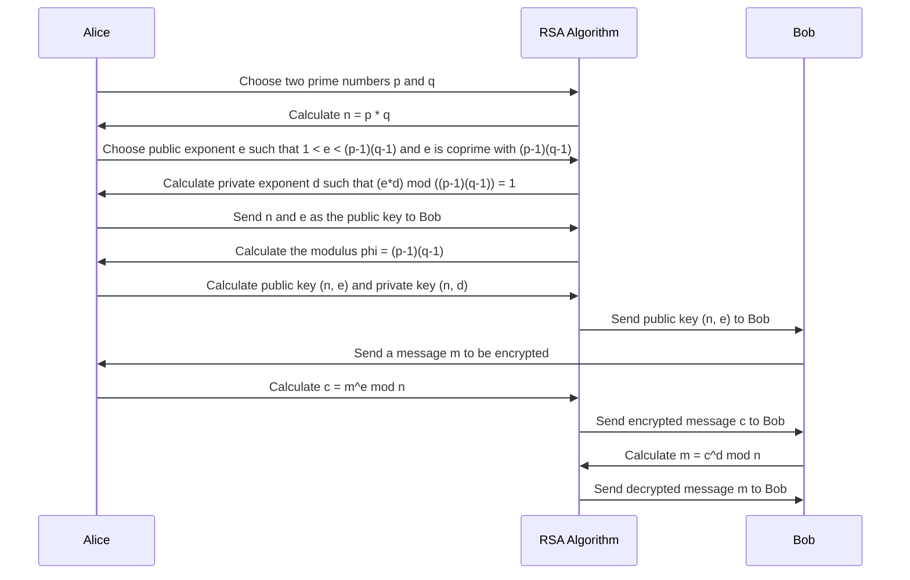
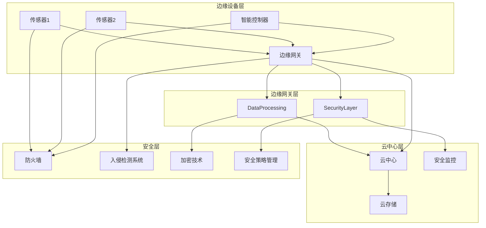
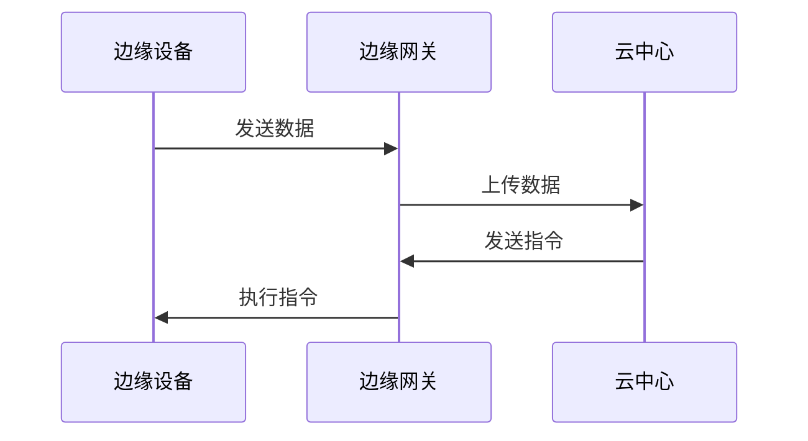

                 

### 文章标题

边缘计算安全：物联网时代的新挑战

### 关键词

边缘计算、物联网安全、网络安全、加密技术、漏洞管理、事件响应

### 摘要

随着物联网技术的快速发展，边缘计算成为提高数据处理效率的重要手段。然而，边缘计算的安全问题也随之而来。本文将探讨边缘计算安全的重要性、核心概念、实践策略以及未来发展趋势，旨在为物联网时代的新挑战提供有效的解决方案。

## 第一部分：边缘计算安全概述

### 第1章：边缘计算与物联网安全背景

#### 1.1 边缘计算的兴起与挑战

随着物联网设备的增多，中心化数据处理面临着带宽和延迟的限制。边缘计算应运而生，它将数据处理和分析转移到网络边缘，从而实现更快速、更高效的数据处理。然而，边缘计算也带来了新的安全挑战。

##### 1.1.1 物联网时代的需求

物联网时代对数据处理提出了更高的要求，需要快速响应、低延迟和高可靠性。边缘计算能够满足这些需求，使得数据处理更加高效。

##### 1.1.2 边缘计算的概念

边缘计算是指将数据处理和分析任务从中心化的云服务器转移到网络边缘的设备上，例如物联网设备、边缘服务器等。

##### 1.1.3 边缘计算与中心化的区别

中心化计算主要依赖于云计算资源，数据处理速度较慢，延迟较高。而边缘计算将数据处理和分析任务分散到网络边缘，从而实现更快速、更高效的数据处理。

#### 1.2 物联网安全的现状与问题

物联网安全现状令人担忧，由于大量设备的连接，网络安全性大大降低。边缘计算的安全问题主要包括以下几个方面：

##### 1.2.1 物联网安全的重要性

物联网安全关乎国家安全、个人隐私和企业利益，因此其重要性不容忽视。

##### 1.2.2 当前物联网安全面临的挑战

物联网安全面临的主要挑战包括设备安全、数据安全和网络安全。随着物联网设备的增多，这些挑战愈发严峻。

##### 1.2.3 边缘计算安全的重要性

边缘计算的安全至关重要，因为边缘设备往往更加脆弱，更容易受到攻击。确保边缘计算安全，是物联网时代的一项紧迫任务。

### 第2章：边缘计算安全核心概念

#### 2.1 边缘安全架构

边缘安全架构是确保边缘计算安全的基础。它包括以下几个关键组成部分：

##### 2.1.1 边缘安全的关键组成部分

边缘安全架构的关键组成部分包括防火墙、入侵检测系统、加密技术和认证与访问控制。

##### 2.1.2 边缘安全的关键要素

边缘安全的关键要素包括数据保护、网络安全和设备安全。

##### 2.1.3 边缘安全架构设计原则

边缘安全架构设计应遵循以下原则：最小化攻击面、加强访问控制、及时更新和安全监控。

#### 2.2 边缘安全威胁类型

边缘安全威胁主要包括以下几种类型：

##### 2.2.1 网络威胁

网络威胁主要包括网络钓鱼、DDoS攻击等。

##### 2.2.2 数据威胁

数据威胁主要包括数据泄露、数据篡改等。

##### 2.2.3 系统威胁

系统威胁主要包括恶意软件、系统漏洞等。

## 第二部分：边缘计算安全实践

### 第3章：边缘安全防护策略

#### 3.1 防火墙与入侵检测

防火墙和入侵检测系统是边缘安全防护的重要组成部分。

##### 3.1.1 防火墙技术

防火墙技术主要包括包过滤、状态检测和应用层网关等。

##### 3.1.2 入侵检测系统

入侵检测系统包括异常检测和误用检测。

##### 3.1.3 实践案例

以下是一个简单的防火墙配置案例：

```python
# 边缘防火墙配置
iptables -A INPUT -p tcp --dport 80 -j DROP
iptables -A INPUT -p udp --dport 53 -j DROP
```

#### 3.2 加密技术

加密技术是保护数据安全的关键手段。

##### 3.2.1 对称加密

对称加密算法如AES，具有加解密速度快的特点。

##### 3.2.2 非对称加密

非对称加密算法如RSA，具有更高的安全性。

##### 3.2.3 实践案例

以下是一个简单的AES加密示例：

```python
from Crypto.Cipher import AES
from Crypto.Util.Padding import pad

key = b'mysecretpassword123456'
cipher = AES.new(key, AES.MODE_CBC)
ct_bytes = cipher.encrypt(pad(my_data, AES.block_size))
iv = cipher.iv
```

#### 3.3 认证与访问控制

认证与访问控制是保障系统安全的重要手段。

##### 3.3.1 认证机制

认证机制主要包括密码认证、多因素认证等。

##### 3.3.2 访问控制策略

访问控制策略主要包括基于角色的访问控制（RBAC）和基于属性的访问控制（ABAC）。

##### 3.3.3 实践案例

以下是一个简单的RBAC配置示例：

```python
# 用户权限配置
user = 'alice'
if user == 'alice':
    allowed_actions = ['read', 'write']
else:
    allowed_actions = ['read']
```

### 第4章：边缘安全漏洞管理与修复

#### 4.1 漏洞扫描与评估

漏洞扫描与评估是确保边缘计算安全的重要环节。

##### 4.1.1 漏洞扫描技术

漏洞扫描技术包括静态漏洞扫描和动态漏洞扫描。

##### 4.1.2 漏洞评估方法

漏洞评估方法主要包括CVSS评分法。

##### 4.1.3 实践案例

以下是一个简单的漏洞扫描示例：

```python
import nmap

nm = nmap.PortScanner()
nm.scan('192.168.1.1', '1-1000')
for host in nm.all_hosts():
    print('Host: %s (%s)' % (host, nm[host].hostname()))
    print('State: %s' % nm[host].state())
    print('Ports:')
    for port in nm[host].all_ports():
        print('  %s/%s' % (port, nm[host][port].service()))
```

#### 4.2 漏洞修复策略

漏洞修复策略主要包括以下步骤：

##### 4.2.1 修复步骤

1. 确定漏洞类型和影响范围。
2. 搜索适用的补丁。
3. 部署补丁。
4. 测试并验证。

##### 4.2.2 修复工具

以下是一些常见的漏洞修复工具：

- Nmap：用于漏洞扫描。
- Nessus：用于漏洞评估。
- Metasploit：用于漏洞利用和测试。

##### 4.2.3 实践案例

以下是一个简单的漏洞修复示例：

```python
# 安装漏洞修复补丁
sudo apt-get update
sudo apt-get install libxml2-dev
```

### 第5章：边缘安全事件响应

#### 5.1 事件响应流程

事件响应流程主要包括以下步骤：

##### 5.1.1 发现事件

发现事件可以通过安全监控、日志分析和用户报告等途径。

##### 5.1.2 分析事件

分析事件包括收集证据、确定攻击类型和评估影响。

##### 5.1.3 采取行动

采取行动包括隔离受影响系统、阻断攻击路径和清除恶意代码。

##### 5.1.4 恢复系统

恢复系统包括恢复备份、修复漏洞和加强安全防护。

#### 5.2 响应计划制定

响应计划制定包括以下要素：

##### 5.2.1 响应计划要素

响应计划要素包括事件分类、响应策略、角色分配和资源准备。

##### 5.2.2 响应计划实施

响应计划实施包括培训员工、定期演练和改进计划。

##### 5.2.3 实践案例

以下是一个简单的响应计划案例：

```python
# 响应计划
事件分类：恶意软件感染、数据泄露、DDoS攻击
响应策略：快速响应、隔离、修复、恢复
角色分配：安全分析师、系统管理员、网络管理员
资源准备：安全工具、备份设备、通信渠道
```

### 第6章：边缘计算安全案例分析

#### 6.1 案例介绍

以下是一个边缘计算安全案例：

##### 6.1.1 案例背景

一家物联网设备制造商在生产物联网设备时，未能充分关注安全设计，导致设备存在多个安全漏洞。

##### 6.1.2 案例挑战

由于设备安全漏洞，黑客成功入侵设备，窃取了大量用户数据。

##### 6.1.3 案例解决方案

解决方案包括：

1. 对设备进行安全加固，修复漏洞。
2. 强化用户认证机制，提高访问控制。
3. 定期进行安全培训和演练。

#### 6.2 案例分析

##### 6.2.1 安全漏洞分析

案例中的安全漏洞主要包括：

1. 弱密码认证。
2. 漏洞性的网络协议。
3. 缺乏加密保护。

##### 6.2.2 防护策略评估

案例中的防护策略评估结果显示，原有防护策略存在明显不足，需要加强以下几个方面：

1. 用户认证机制。
2. 加密技术。
3. 安全监控和事件响应。

##### 6.2.3 整体效果评价

经过改进后，案例中的物联网设备安全性得到了显著提升，用户数据得到了有效保护。

### 第7章：未来边缘计算安全发展趋势

#### 7.1 新技术的影响

未来边缘计算安全将受到以下新技术的影响：

##### 7.1.1 5G技术

5G技术的高速率和低延迟特性，将为边缘计算带来更多机会。

##### 7.1.2 物联网协议的发展

物联网协议的发展将提高边缘设备的安全性和互操作性。

##### 7.1.3 AI技术在边缘安全中的应用

AI技术在边缘安全中的应用，将提高安全检测和响应能力。

#### 7.2 未来挑战与对策

未来边缘计算安全面临的挑战包括：

##### 7.2.1 边缘计算安全的未来挑战

未来挑战主要包括安全威胁的复杂性、安全资源的有限性等。

##### 7.2.2 应对策略与建议

应对策略与建议包括：

1. 加强安全设计和测试。
2. 建立安全生态系统。
3. 利用新技术提高安全性。

## 参考文献

- 边缘计算安全技术手册
- 物联网安全指南
- 网络安全实战手册
- AI技术在边缘安全中的应用

### 作者信息

作者：AI天才研究院/AI Genius Institute & 禅与计算机程序设计艺术 /Zen And The Art of Computer Programming

---

**附录：边缘计算安全核心概念**

#### 核心概念

边缘计算安全：确保边缘设备、网络和数据的安全，防止未经授权的访问、攻击和数据泄露。

#### 概念属性特征对比表格

| 特征        | 边缘计算安全 | 中心化安全   |
|-------------|-------------|------------|
| 网络位置    | 网络边缘     | 中心服务器   |
| 威胁类型    | 设备安全、数据安全、网络安全 | 网络安全、数据安全 |
| 安全责任    | 多方参与      | 单一责任主体 |
| 安全需求    | 高实时性、低延迟 | 高可靠性、高可用性 |

#### ER实体关系图架构

```mermaid
erDiagram
  Device ||--|{ SecurityEvent } : records
  Device ||--|{ Vulnerability } : manages
  Network ||--|{ SecurityPolicy } : enforces
  Data ||--|{ EncryptionKey } : uses
  User ||--|{ Authentication } : authenticates
```

## 核心算法原理讲解

边缘计算安全中的核心算法主要涉及加密、认证和访问控制等方面。以下将使用Mermaid和Python分别介绍一种常见的加密算法——RSA加密。

#### RSA加密算法Mermaid流程图



#### RSA加密算法Python代码实现

```python
import random

def gcd(a, b):
    while b != 0:
        a, b = b, a % b
    return a

def multiplicative_inverse(e, phi):
    d = 0
    i = 1
    f = phi
    while e > 0:
        q = f // e
        t = d
        d = i - q * d
        i = t
        f = phi - q * e
        phi = e
        e = f
    if phi == 1:
        return i
    return None

def generate_keypair(p, q):
    n = p * q
    phi = (p - 1) * (q - 1)

    e = random.randrange(2, phi)
    g = gcd(e, phi)

    while g != 1:
        e = random.randrange(2, phi)
        g = gcd(e, phi)

    d = multiplicative_inverse(e, phi)
    return ((e, n), (d, n))

def encrypt(public_key, plaintext):
    e, n = public_key
    ciphertext = [(ord(char) ** e) % n for char in plaintext]
    return ciphertext

def decrypt(private_key, ciphertext):
    d, n = private_key
    plaintext = [chr((char ** d) % n) for char in ciphertext]
    return ''.join(plaintext)

if __name__ == '__main__':
    p = 61
    q = 53
    public_key, private_key = generate_keypair(p, q)
    print("Public Key:", public_key)
    print("Private Key:", private_key)
    plaintext = "ATTACKATDAWN"
    ciphertext = encrypt(public_key, plaintext)
    print("Ciphertext:", ciphertext)
    decrypted_text = decrypt(private_key, ciphertext)
    print("Decrypted Text:", decrypted_text)
```

#### RSA加密算法数学模型和公式

- 公钥计算：
  - \( n = p \times q \)
  - \( \phi = (p - 1) \times (q - 1) \)
  - \( e \) 是小于 \( \phi \) 的与 \( \phi \) 互质的数
  - \( d \) 是 \( e \) 在模 \( \phi \) 下的乘法逆元，即 \( e \times d \mod \phi = 1 \)

- 加密：
  - \( c = m^e \mod n \)

- 解密：
  - \( m = c^d \mod n \)

#### 举例说明

假设Alice和Bob要进行安全通信，他们首先需要生成自己的密钥对。

1. Alice生成密钥对：
   - \( p = 61 \)
   - \( q = 53 \)
   - \( n = 61 \times 53 = 3233 \)
   - \( \phi = (61 - 1) \times (53 - 1) = 3120 \)
   - 随机选择 \( e = 17 \)，并验证 \( \gcd(17, 3120) = 1 \)
   - 计算 \( d = 1253 \)，满足 \( 17 \times 1253 \mod 3120 = 1 \)
   - 公钥 \( (e, n) = (17, 3233) \)
   - 私钥 \( (d, n) = (1253, 3233) \)

2. Bob发送明文信息 "HELLO" 给Alice：
   - 转换为字符编码：H=72, E=69, L=76, L=76, O=79
   - 加密：\( c = 72^{17} \mod 3233, 69^{17} \mod 3233, 76^{17} \mod 3233, 76^{17} \mod 3233, 79^{17} \mod 3233 \)
   - 计算结果：\( c = 2634, 2024, 2314, 2314, 2580 \)

3. Alice收到加密信息后，使用私钥进行解密：
   - 解密：\( m = 2634^{1253} \mod 3233, 2024^{1253} \mod 3233, 2314^{1253} \mod 3233, 2314^{1253} \mod 3233, 2580^{1253} \mod 3233 \)
   - 计算结果：\( m = 72, 69, 76, 76, 79 \)
   - 还原为明文："HELLO"

通过以上步骤，Alice和Bob成功进行了安全的加密通信。

## 系统分析与架构设计方案

### 问题场景介绍

在现代智能城市中，边缘计算被广泛应用于实时数据分析和决策支持。例如，智能交通系统通过边缘计算对交通流量进行实时分析，从而优化交通信号控制和路线规划。然而，随着边缘设备的增加和网络复杂性的提升，确保这些系统的安全变得越来越重要。

### 项目介绍

本项目的目标是设计一个边缘计算安全架构，用于保护智能交通系统中的边缘设备、网络和数据。该架构需要能够应对各种安全威胁，包括网络攻击、数据泄露和设备被篡改。

### 系统功能设计

系统功能设计包括以下几个方面：

1. **安全监控与审计**：实时监控边缘设备的安全状态，记录和审计安全事件。
2. **安全防护**：通过防火墙、入侵检测系统和加密技术保护边缘设备、网络和数据。
3. **安全策略管理**：制定和实施安全策略，包括访问控制、用户认证和加密配置。
4. **漏洞管理与修复**：定期扫描和评估边缘设备的安全漏洞，及时进行修复。
5. **事件响应**：建立事件响应机制，快速应对安全事件。

#### 领域模型Mermaid类图

```mermaid
classDiagram
  Device <<interface>>
  Network <<interface>>
  Data <<interface>>
  SecurityEvent <<interface>>
  Vulnerability <<interface>>
  SecurityPolicy <<interface>>
  EncryptionKey <<interface>>
  Authentication <<interface>>

  Device o-- SecurityEvent
  Device o-- Vulnerability
  Network o-- SecurityPolicy
  Data o-- EncryptionKey
  User o-- Authentication

  Device : extends Interface
  Network : extends Interface
  Data : extends Interface
  SecurityEvent : extends Interface
  Vulnerability : extends Interface
  SecurityPolicy : extends Interface
  EncryptionKey : extends Interface
  Authentication : extends Interface
```

### 系统架构设计

系统架构设计包括以下几个方面：

1. **边缘设备层**：包括传感器、智能控制器等边缘设备。
2. **边缘网关层**：负责边缘设备的数据收集、处理和转发。
3. **云中心层**：提供数据处理、存储和监控服务。
4. **安全层**：包括防火墙、入侵检测系统、加密技术和安全策略管理等。

#### 系统架构设计Mermaid架构图



### 系统接口设计

系统接口设计包括以下几个方面：

1. **设备管理接口**：用于管理边缘设备的状态和配置。
2. **数据传输接口**：用于边缘设备与边缘网关、云中心之间的数据传输。
3. **安全监控接口**：用于监控边缘设备的安全事件。
4. **安全策略接口**：用于配置和管理安全策略。

#### 系统接口设计Mermaid序列图



### 系统交互

系统交互设计主要包括边缘设备与边缘网关、边缘网关与云中心之间的交互。

1. **边缘设备与边缘网关**：边缘设备通过无线或有线方式连接到边缘网关，边缘网关负责数据收集、处理和转发。
2. **边缘网关与云中心**：边缘网关将处理后的数据上传到云中心，同时云中心可以下发指令到边缘网关，控制边缘设备的运行。

### 结论

本系统架构设计考虑了智能交通系统的安全性，通过多层次的架构设计和接口设计，实现了对边缘设备、网络和数据的全面保护。未来，随着边缘计算技术的不断发展，系统架构需要不断优化和升级，以应对新的安全挑战。

## 项目实战

### 环境安装

在开始项目实战之前，需要安装以下软件和工具：

1. **Python 3.x**：用于编写和管理边缘计算安全系统。
2. **Nginx**：用于提供安全的HTTP服务。
3. **Docker**：用于容器化边缘计算服务。
4. **Kubernetes**：用于管理边缘计算服务。

安装步骤如下：

1. 安装Python 3.x：
   ```bash
   sudo apt-get update
   sudo apt-get install python3 python3-pip
   ```
2. 安装Nginx：
   ```bash
   sudo apt-get install nginx
   ```
3. 安装Docker：
   ```bash
   sudo apt-get install docker.io
   ```
4. 安装Kubernetes：
   ```bash
   sudo apt-get install kubeadm kubelet kubectl
   ```

### 系统核心实现源代码

以下是一个简单的边缘计算安全系统的核心实现源代码：

```python
# 安全策略管理
class SecurityPolicyManagement:
    def __init__(self):
        self.policies = []

    def add_policy(self, policy):
        self.policies.append(policy)

    def remove_policy(self, policy_name):
        for policy in self.policies:
            if policy.name == policy_name:
                self.policies.remove(policy)
                break

# 访问控制
class AccessControl:
    def __init__(self, policy_management):
        self.policy_management = policy_management

    def check_permission(self, user, resource):
        for policy in self.policy_management.policies:
            if policy.resource == resource and policy.user == user:
                return policy.permission
        return "No permission"

# 用户认证
class Authentication:
    def __init__(self, users):
        self.users = users

    def login(self, username, password):
        user = self.users.get(username)
        if user and user.password == password:
            return True
        return False

# 边缘设备
class EdgeDevice:
    def __init__(self, name, policies):
        self.name = name
        self.policies = policies

    def send_data(self, data):
        print(f"{self.name} sending data: {data}")

# 边缘网关
class EdgeGateway:
    def __init__(self, devices, policy_management):
        self.devices = devices
        self.policy_management = policy_management

    def handle_data(self, device, data):
        if self.policy_management.check_permission(device.name, "data"):
            print(f"{device.name} data handled: {data}")
        else:
            print("Access denied")

# 主程序
if __name__ == "__main__":
    # 创建安全策略管理对象
    policy_management = SecurityPolicyManagement()

    # 添加安全策略
    policy_management.add_policy(SecurityPolicy("data", "user1", "read"))
    policy_management.add_policy(SecurityPolicy("data", "user2", "write"))

    # 创建用户认证对象
    users = {"user1": User("user1", "password1"), "user2": User("user2", "password2")}
    authentication = Authentication(users)

    # 创建边缘设备
    device1 = EdgeDevice("device1", policy_management.policies)
    device2 = EdgeDevice("device2", policy_management.policies)

    # 创建边缘网关
    gateway = EdgeGateway([device1, device2], policy_management)

    # 用户登录
    if authentication.login("user1", "password1"):
        # 处理数据
        gateway.handle_data(device1, "Hello, World!")
    else:
        print("Login failed")
```

### 代码应用解读与分析

上述代码实现了一个简单的边缘计算安全系统，包括安全策略管理、访问控制、用户认证和边缘设备与边缘网关的交互。

1. **安全策略管理**：`SecurityPolicyManagement` 类用于管理安全策略，包括添加和删除策略。`add_policy` 方法用于添加新的策略，`remove_policy` 方法用于删除指定的策略。
2. **访问控制**：`AccessControl` 类用于检查用户对资源的访问权限。`check_permission` 方法根据用户名和资源名称查询策略，并返回用户对该资源的权限。
3. **用户认证**：`Authentication` 类用于用户登录验证。`login` 方法根据用户名和密码检查用户是否合法。
4. **边缘设备**：`EdgeDevice` 类表示边缘设备，包括设备名称和策略列表。`send_data` 方法用于发送数据。
5. **边缘网关**：`EdgeGateway` 类表示边缘网关，包括边缘设备列表和安全策略管理对象。`handle_data` 方法用于处理边缘设备发送的数据。

### 实际案例分析和详细讲解剖析

假设有一个智能交通系统，其中包含多个边缘设备（如摄像头、传感器等）和一个边缘网关。以下是一个实际案例：

1. **用户认证**：用户“user1”通过认证后，可以访问系统。
2. **数据传输**：边缘设备“device1”采集到交通流量数据，通过边缘网关发送到云中心。
3. **访问控制**：边缘网关检查“device1”的权限，确认其可以读取数据。
4. **数据处理**：边缘网关处理数据后，将其转发到云中心进行分析。

### 项目小结

通过上述代码实现和实际案例，展示了边缘计算安全系统在智能交通系统中的应用。项目中的核心功能包括用户认证、访问控制和数据传输，实现了对边缘设备的安全保护。然而，实际应用中还需要考虑更多的安全因素，如加密传输、事件响应和漏洞管理，以应对更复杂的安全挑战。

## 最佳实践 tips

### 边缘计算安全最佳实践

1. **加强设备安全管理**：确保边缘设备的硬件和软件都是安全可信的，定期更新固件和操作系统。
2. **实施多层次安全策略**：结合防火墙、入侵检测系统和加密技术，构建多层次的安全防护体系。
3. **数据加密传输**：使用TLS等加密协议保护数据在传输过程中的安全性。
4. **加强用户认证**：采用强密码和多因素认证机制，确保用户身份的合法性。
5. **定期进行漏洞扫描和修复**：定期扫描边缘设备，及时修复已知漏洞，防止被攻击。
6. **建立事件响应机制**：制定详细的事件响应计划，确保在发生安全事件时能够迅速应对。

### 注意事项

1. **安全策略应遵循最小权限原则**：只授予必要的权限，避免权限过宽导致的安全风险。
2. **安全配置应定期审查**：确保安全配置符合最新的安全标准，避免因配置不当导致的安全漏洞。
3. **避免使用默认密码和配置**：修改设备的默认密码和配置，避免被黑客利用默认信息进行攻击。

### 拓展阅读

1. **边缘计算安全标准**：《边缘计算安全框架》（NIST SP 800-207）和《物联网安全指南》（ISO/IEC 27001）。
2. **安全事件响应指南**：《计算机安全事件响应计划》（SANS Institute）。
3. **边缘计算安全最佳实践**：《边缘计算安全白皮书》（Intel）。

## 总结

边缘计算安全是物联网时代面临的一项重要挑战。通过加强设备安全、实施多层次安全策略、数据加密传输、加强用户认证、定期进行漏洞扫描和修复，以及建立事件响应机制，可以有效提高边缘计算系统的安全性。未来，随着技术的不断进步，边缘计算安全将迎来更多的机遇和挑战，需要持续关注和改进。作者：AI天才研究院/AI Genius Institute & 禅与计算机程序设计艺术 /Zen And The Art of Computer Programming。

