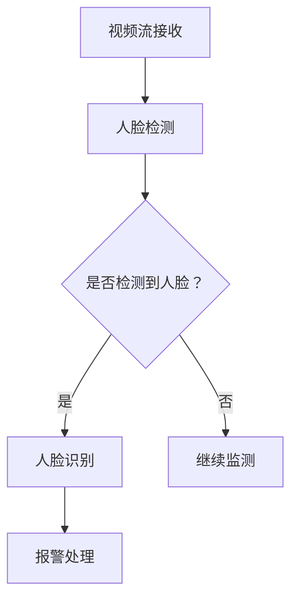
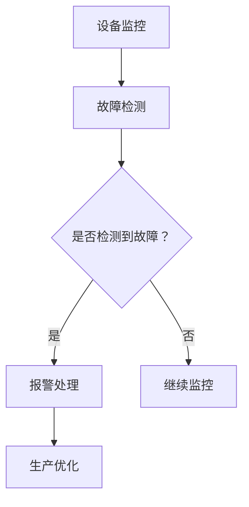
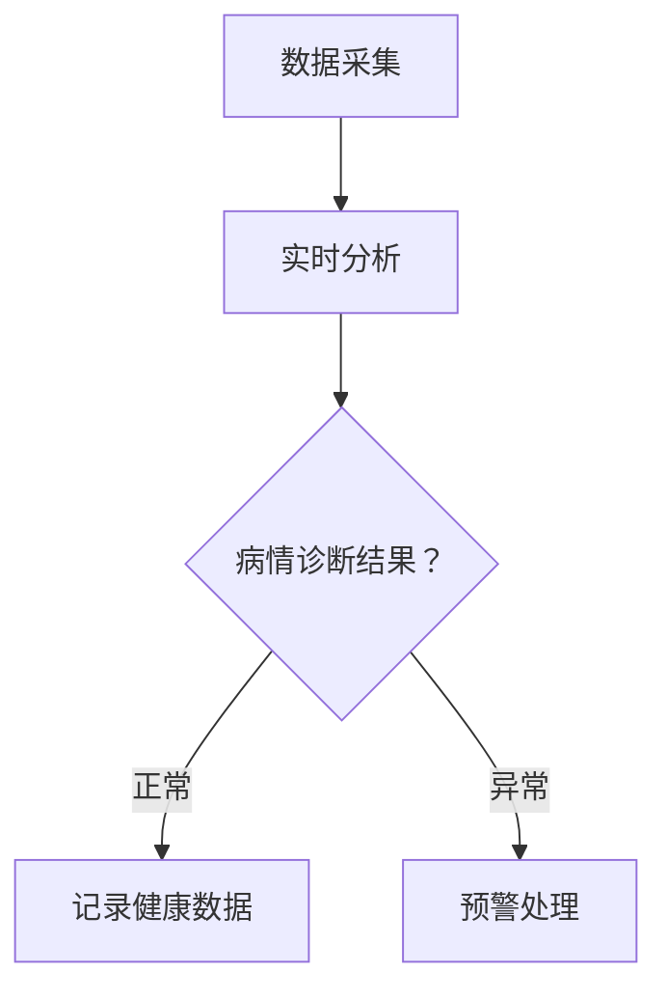

                 

### 1.1 边缘设备推理的重要性

#### 1.1.1 边缘计算的发展背景

边缘计算（Edge Computing）是一种分布式计算架构，它将数据处理和存储能力从中心化的云计算转移到网络的边缘——即靠近数据源或用户的地方。这种技术的出现是为了解决随着物联网（IoT）设备的广泛应用所带来的大量数据传输和处理问题。传统的云计算模式需要将所有数据传输到数据中心进行处理，这导致网络拥堵、延迟增加，同时也增加了数据隐私和安全性风险。

边缘计算的概念可以追溯到20世纪90年代，但随着物联网和5G技术的快速发展，边缘计算逐渐成为热门研究领域。其核心思想是将计算、存储、网络功能分布在广泛的边缘设备上，如智能手机、智能传感器、路由器等，从而实现数据的快速处理和实时响应。

#### 1.1.2 边缘设备推理的应用领域

边缘设备推理在多个应用领域中扮演着重要角色。以下是几个典型的应用场景：

1. **智能制造**：在制造业中，边缘设备推理技术可以实现生产线的实时监控和故障检测，提高生产效率和产品质量。

2. **智能交通**：在交通管理中，边缘设备可以实时处理摄像头和传感器的数据，实现交通流量控制和智能导航。

3. **智慧医疗**：在医疗领域，边缘设备可以实时分析医疗设备的数据，为医生提供诊断参考，提升医疗服务的效率和质量。

4. **智能安防**：在安防领域，边缘设备可以实时识别和分类监控视频中的异常行为，快速响应潜在威胁。

#### 1.1.3 边缘设备推理的挑战

尽管边缘设备推理在许多领域都有广泛应用，但它也面临着一系列挑战：

1. **计算能力限制**：与高性能的云端服务器相比，边缘设备的计算能力有限。因此，如何在有限的资源下实现高效的推理任务是一个重要问题。

2. **数据传输带宽限制**：边缘设备与云端服务器之间的数据传输带宽有限，这限制了大规模数据传输的可能性。

3. **功耗和散热问题**：边缘设备通常功耗较低，但长时间的运行会导致散热问题，影响设备的稳定性和寿命。

4. **数据隐私和安全**：边缘设备处理的数据往往涉及隐私和敏感信息，如何确保数据的安全和隐私是一个重要挑战。

#### 1.1.4 边缘设备推理的重要性总结

边缘设备推理的重要性在于它能够将计算能力、存储和网络功能分散到网络的边缘，从而实现数据处理的实时性、可靠性和安全性。这不仅提升了应用系统的性能，还减少了数据传输的延迟，提高了用户体验。随着物联网和5G技术的进一步发展，边缘设备推理将在未来的智能应用中发挥更加重要的作用。

### 1.2 神经网络压缩的必要性

#### 1.2.1 神经网络压缩的定义

神经网络压缩（Neural Network Compression）是指通过各种技术手段减小神经网络的模型大小，以便在有限的计算资源和存储空间内高效部署。随着深度学习在各个领域的广泛应用，神经网络的规模和复杂性也在不断增加。这不仅对计算资源提出了更高的要求，也对数据传输和存储带来了巨大的压力。

神经网络压缩的目标是通过减少模型大小和计算复杂度，在不显著降低模型性能的前提下，提高模型在边缘设备上的可部署性和运行效率。常见的神经网络压缩方法包括剪枝（Pruning）、量化（Quantization）、知识蒸馏（Knowledge Distillation）等。

#### 1.2.2 神经网络压缩的优势

神经网络压缩具有以下几大优势：

1. **减少计算复杂度和延迟**：压缩后的神经网络具有较低的参数数量和计算复杂度，能够在更短的时间内完成推理任务，减少推理延迟。

2. **降低存储需求**：压缩后的神经网络模型大小减小，可以显著降低存储空间需求，特别是在存储资源有限的边缘设备上。

3. **提高能效**：较小的模型和较低的参数数量意味着更少的计算资源和能量消耗，有助于提高能效。

4. **增强可迁移性**：压缩后的模型可以更容易地在不同的设备和平台之间迁移和部署。

5. **改进隐私保护**：通过减少模型大小，可以减少泄露敏感数据的风险，提高数据隐私保护能力。

#### 1.2.3 神经网络压缩的分类

神经网络压缩可以分为以下几种类型：

1. **结构压缩**：通过删除或简化神经网络中的部分权重和层来减少模型大小。例如，剪枝（Pruning）和网络结构搜索（Network Structure Search）。

2. **权重压缩**：通过量化（Quantization）和低秩分解（Low-Rank Factorization）等技术来减少权重参数的数量。

3. **量化**：将浮点权重转换为较低位宽的整数表示，从而减少模型大小和存储需求。

4. **知识蒸馏**：通过将大型教师模型的知识传递给较小规模的student模型，来实现压缩和性能提升。

#### 1.2.4 神经网络压缩的必要性总结

随着边缘设备推理的应用场景不断扩展，神经网络压缩成为解决计算资源有限、数据传输带宽受限、功耗和散热问题等挑战的关键技术。通过神经网络压缩，可以在保证模型性能的前提下，实现更高效、更可靠的边缘设备推理，推动人工智能在更多领域的应用和发展。

### 1.3 本书的结构安排

#### 1.3.1 目录概述

本书分为六个章节，内容涵盖了边缘设备推理和神经网络压缩的各个方面。具体目录如下：

1. **第1章：边缘设备推理与神经网络压缩概述**
   - 边缘设备推理的重要性
   - 神经网络压缩的必要性
   - 本书的结构安排

2. **第2章：神经网络压缩的核心概念与原理**
   - 神经网络的基本架构
   - 神经网络压缩的基本原理
   - 神经网络压缩的数学模型

3. **第3章：神经网络压缩的算法与应用**
   - 神经网络剪枝技术
   - 神经网络量化技术
   - 神经网络压缩的应用实例

4. **第4章：边缘设备推理中的神经网络压缩挑战与解决方案**
   - 边缘设备推理的限制因素
   - 神经网络压缩的挑战
   - 解决方案与技术趋势

5. **第5章：边缘设备推理中神经网络压缩的最佳实践**
   - 实践案例介绍
   - 实践技巧与注意事项
   - 案例分析与总结

6. **第6章：未来展望与拓展阅读**
   - 未来发展方向
   - 拓展阅读

#### 1.3.2 阅读建议

本书的目标是系统性地介绍边缘设备推理和神经网络压缩的核心概念、算法和应用，帮助读者深入了解这一领域。以下是具体的阅读建议：

- **第1章**：作为引言部分，建议读者首先阅读，以了解整体框架和背景知识。
- **第2章**：深入学习神经网络压缩的基础知识，包括基本架构和压缩原理。
- **第3章**：通过具体算法和应用实例，读者可以更好地理解神经网络压缩的实践应用。
- **第4章**：讨论边缘设备推理中的挑战和解决方案，为实际应用提供指导。
- **第5章**：通过实践案例，读者可以学习到最佳实践技巧和注意事项。
- **第6章**：展望未来发展趋势，为读者提供拓展研究的方向。

通过遵循这些建议，读者可以系统地掌握边缘设备推理和神经网络压缩的相关知识，为后续学习和应用打下坚实的基础。

## 第2章：神经网络压缩的核心概念与原理

### 2.1 神经网络的基本架构

#### 2.1.1 神经网络的发展历程

神经网络（Neural Network）起源于1940年代，由心理学家McCulloch和数学家Pitts提出。最初，神经网络主要作为一种计算模型被研究，旨在模拟人脑的神经活动。尽管在早期阶段，神经网络的发展受到了计算能力的限制，但随着计算机技术的进步和算法的改进，神经网络开始逐渐应用于各种领域。

在1980年代，反向传播算法（Backpropagation Algorithm）的提出使得神经网络的训练过程变得更加高效，这一算法为深度学习的崛起奠定了基础。1990年代，支持向量机（Support Vector Machine, SVM）等机器学习算法的兴起使得神经网络的研究和应用受到一定程度的冷落。然而，随着大数据和计算资源的爆发式增长，深度学习在2010年后迎来了新的发展高峰，卷积神经网络（Convolutional Neural Network, CNN）和循环神经网络（Recurrent Neural Network, RNN）等架构在图像识别、自然语言处理等领域取得了显著的突破。

#### 2.1.2 神经网络的基本组成部分

神经网络由以下几个基本组成部分构成：

1. **神经元（Neuron）**：神经元是神经网络的基本单元，类似于人脑中的神经元。每个神经元接收多个输入信号，通过加权求和后，通过激活函数输出一个结果。神经元的结构通常包括输入层、权重（weights）、偏置（bias）和输出层。

2. **层（Layer）**：神经网络包括输入层、隐藏层和输出层。输入层接收外部输入数据，隐藏层负责数据处理和特征提取，输出层生成最终预测结果。

3. **权重（Weights）**：权重决定了神经元之间连接的强度，是神经网络模型的核心参数。在训练过程中，通过优化算法不断调整权重，以最小化预测误差。

4. **偏置（Bias）**：偏置为神经元提供额外的输入，有助于调整神经网络的输出。与权重类似，偏置也是在训练过程中通过优化算法进行调整。

5. **激活函数（Activation Function）**：激活函数对神经元的输出进行非线性变换，使得神经网络能够建模复杂的非线性关系。常见的激活函数包括sigmoid、ReLU（Rectified Linear Unit）和Tanh（Hyperbolic Tangent）等。

6. **优化算法（Optimization Algorithm）**：优化算法用于调整神经网络中的权重和偏置，以最小化预测误差。常见的优化算法包括梯度下降（Gradient Descent）、Adam（Adaptive Moment Estimation）等。

#### 2.1.3 神经网络的训练过程

神经网络的训练过程可以分为以下几个步骤：

1. **初始化参数**：在训练开始前，需要随机初始化神经网络的权重和偏置。

2. **前向传播（Forward Propagation）**：将输入数据输入神经网络，通过前向传播计算每个神经元的输出。

3. **计算损失函数（Compute Loss Function）**：使用损失函数（如均方误差MSE）计算预测结果与真实结果之间的误差。

4. **反向传播（Back Propagation）**：通过反向传播算法，将损失函数关于权重的梯度传播回神经网络，更新权重和偏置。

5. **迭代优化**：重复步骤2至4，直到满足停止条件（如达到预设的迭代次数或误差阈值）。

通过不断调整权重和偏置，神经网络可以逐步优化其预测性能。训练过程中，神经网络能够从数据中学习到特征和模式，从而实现对新数据的预测。

### 2.2 神经网络压缩的基本原理

#### 2.2.1 压缩技术的分类

神经网络压缩技术可以分为以下几种类型：

1. **结构压缩（Structured Compression）**：通过删除或简化神经网络中的部分权重和层来实现模型压缩。常见的结构压缩方法包括剪枝（Pruning）和网络结构搜索（Network Structure Search）。

2. **权重压缩（Weight Compression）**：通过量化（Quantization）和低秩分解（Low-Rank Factorization）等技术减少权重参数的数量。量化是将浮点权重转换为较低位宽的整数表示，而低秩分解则是将高维权重分解为较低维的矩阵乘积。

3. **参数共享（Parameter Sharing）**：通过共享神经网络中的部分参数来减少模型大小。例如，使用深度可分离卷积（Depthwise Separable Convolution）可以实现参数共享。

4. **量化与训练（Quantization and Training）**：在训练过程中引入量化，通过调整量化参数来优化模型性能。

5. **动态压缩（Dynamic Compression）**：在推理过程中动态调整模型大小，以适应不同场景的需求。

#### 2.2.2 压缩技术的核心指标

神经网络压缩技术的效果可以通过以下核心指标来衡量：

1. **模型大小（Model Size）**：压缩后的模型参数数量和存储空间需求。

2. **计算复杂度（Computational Complexity）**：压缩后的模型在推理过程中所需的计算资源。

3. **性能损失（Performance Loss）**：压缩后的模型在预测准确性、延迟和功耗等方面的损失。

4. **能耗效率（Energy Efficiency）**：压缩后的模型在特定任务下的能耗表现。

5. **可扩展性（Scalability）**：压缩技术在不同规模模型和应用场景中的适应能力。

#### 2.2.3 压缩技术的实现机制

神经网络压缩技术的实现机制主要包括以下几个方面：

1. **剪枝（Pruning）**：剪枝通过删除神经网络中的部分权重或神经元来减少模型大小。剪枝可以分为结构剪枝和权重剪枝。结构剪枝删除整个层或神经元，而权重剪枝仅删除部分权重。剪枝的实现通常基于贪心算法，通过逐步删除重要性较低的权重或神经元来实现。

2. **量化（Quantization）**：量化是将浮点权重转换为较低位宽的整数表示。量化可以显著减少模型大小和计算复杂度。量化可以分为静态量化和动态量化。静态量化在训练前进行，而动态量化在训练过程中或推理时进行。

3. **低秩分解（Low-Rank Factorization）**：低秩分解是将高维权重分解为较低维的矩阵乘积。低秩分解通过减少权重矩阵的秩来减小模型大小。常见的低秩分解方法包括奇异值分解（Singular Value Decomposition, SVD）和交替最小化（Alternating Least Squares, ALS）。

4. **知识蒸馏（Knowledge Distillation）**：知识蒸馏通过将大型教师模型的知识传递给较小规模的student模型来实现压缩。知识蒸馏通常使用软标签和硬标签两种方法。软标签方法使用教师模型的输出概率作为student模型的训练目标，而硬标签方法使用教师模型的硬性分类结果作为student模型的训练目标。

通过以上压缩技术的实现机制，神经网络可以在保证性能的前提下实现高效的压缩，从而满足边缘设备推理的需求。

### 2.3 神经网络压缩的数学模型

#### 2.3.1 常见的压缩算法

神经网络压缩算法可以分为以下几类：

1. **剪枝（Pruning）算法**：剪枝通过删除神经网络中不重要或冗余的连接和神经元来减少模型大小。常见的剪枝算法包括随机剪枝（Random Pruning）、L1正则化剪枝（L1 Regularization Pruning）和基于梯度的剪枝（Gradient-Based Pruning）。

2. **量化（Quantization）算法**：量化是将浮点权重转换为较低位宽的整数表示。常见的量化算法包括线性量化（Linear Quantization）、近似量化（Approximate Quantization）和自适应量化（Adaptive Quantization）。

3. **低秩分解（Low-Rank Factorization）算法**：低秩分解通过将高维权重分解为较低维的矩阵乘积来减少模型大小。常见的低秩分解算法包括奇异值分解（Singular Value Decomposition, SVD）和交替最小化（Alternating Least Squares, ALS）。

4. **知识蒸馏（Knowledge Distillation）算法**：知识蒸馏通过将大型教师模型的知识传递给较小规模的student模型来实现压缩。常见的知识蒸馏算法包括软标签蒸馏（Soft Label Distillation）和硬标签蒸馏（Hard Label Distillation）。

#### 2.3.2 压缩算法的数学原理

1. **剪枝算法的数学原理**：

   剪枝算法的核心思想是通过衡量权重的重要性来决定是否删除。在随机剪枝中，权重被随机选择删除，删除概率通常与权重的大小成反比。在L1正则化剪枝中，通过在损失函数中添加L1正则化项来惩罚权重的大小，从而实现权重的自适应剪枝。基于梯度的剪枝算法通过计算权重梯度的绝对值来衡量权重的重要性，从而实现权重的选择性剪枝。

   $$L = \sum_{i,j} |w_{ij}| + \lambda \cdot J$$

   其中，$w_{ij}$为权重，$L$为损失函数，$\lambda$为正则化参数。

2. **量化算法的数学原理**：

   量化算法通过将浮点权重转换为较低位宽的整数表示来减少模型大小。线性量化是将权重值映射到量化区间，量化区间通过量化步长确定。近似量化是通过查找量化表来近似权重值，从而减少量化误差。自适应量化是基于权重值的分布动态调整量化区间和步长，从而实现更精确的量化。

   $$Q(x) = \text{round}(x / q) \cdot q$$

   其中，$x$为原始权重值，$q$为量化步长，$\text{round}(\cdot)$为四舍五入函数。

3. **低秩分解算法的数学原理**：

   低秩分解通过将高维权重分解为较低维的矩阵乘积来减少模型大小。在奇异值分解中，权重矩阵被分解为三个矩阵的乘积：$W = U \cdot \Sigma \cdot V^T$，其中$U$和$V$为正交矩阵，$\Sigma$为对角矩阵，包含权重矩阵的奇异值。在交替最小化中，通过迭代优化权重矩阵和低秩分解矩阵，以最小化重构误差。

   $$W = U \cdot \Sigma \cdot V^T$$

   $$\min_{U, V, \Sigma} \| W - U \cdot \Sigma \cdot V^T \|_F^2$$

#### 2.3.3 压缩算法的对比分析

以下是几种常见压缩算法的对比分析：

1. **剪枝算法**：
   - 优点：实现简单，能够显著减少模型大小。
   - 缺点：可能引入性能损失，对模型结构敏感。
   - 适用场景：需要快速推理和存储空间受限的场景。

2. **量化算法**：
   - 优点：能够显著减少模型大小和计算复杂度。
   - 缺点：可能引入量化误差，对模型性能有一定影响。
   - 适用场景：需要低功耗和高效推理的场景。

3. **低秩分解算法**：
   - 优点：能够保留模型的大部分性能，减少模型大小。
   - 缺点：计算复杂度较高，实现较为复杂。
   - 适用场景：需要高效压缩和高性能推理的场景。

4. **知识蒸馏算法**：
   - 优点：能够将大型模型的知识传递给较小规模的模型，提高压缩后的模型性能。
   - 缺点：训练过程较为复杂，需要较大的计算资源。
   - 适用场景：需要高效压缩和高性能推理的场景。

通过对比分析，不同压缩算法各有优缺点，适用于不同的应用场景。在实际应用中，可以根据具体需求选择合适的压缩算法，以实现高效、可靠的边缘设备推理。

### 3.1 神经网络剪枝技术

#### 3.1.1 剪枝算法的基本原理

神经网络剪枝（Neural Network Pruning）是一种通过删除网络中不重要或冗余的连接和神经元来减少模型大小和计算复杂度的技术。剪枝算法的核心思想是基于权重的重要性来选择删除哪些连接和神经元，从而保留最重要的结构和信息。

常见的剪枝算法可以分为以下几种：

1. **随机剪枝（Random Pruning）**：随机剪枝通过随机选择部分权重或神经元进行删除。删除概率通常与权重的大小成反比。这种方法简单直观，但可能引入随机性，导致性能损失。

2. **L1正则化剪枝（L1 Regularization Pruning）**：L1正则化剪枝通过在损失函数中添加L1正则化项来惩罚权重的大小，从而实现权重的自适应剪枝。L1正则化能够自动去除重要性较小的权重，从而减少模型大小。

   $$L = \sum_{i,j} |w_{ij}| + \lambda \cdot J$$

3. **基于梯度的剪枝（Gradient-Based Pruning）**：基于梯度的剪枝算法通过计算权重梯度的绝对值来衡量权重的重要性，从而实现权重的选择性剪枝。这种方法能够利用训练过程中积累的信息，实现更有效的剪枝。

   $$P_{ij} = \frac{||\frac{\partial J}{\partial w_{ij}}||}{\max_{(i,j)} ||\frac{\partial J}{\partial w_{ij}}||}$$

#### 3.1.2 剪枝算法的实现流程

剪枝算法的实现流程可以分为以下几个步骤：

1. **初始化**：随机初始化神经网络模型，包括权重和偏置。

2. **前向传播**：将输入数据输入神经网络，通过前向传播计算每个神经元的输出。

3. **计算重要性**：计算每个连接或神经元的权重梯度或绝对值，用于衡量其重要性。

4. **选择剪枝目标**：根据重要性指标选择剪枝目标。对于随机剪枝，可以随机选择权重或神经元进行删除；对于L1正则化剪枝，可以选择绝对值较大的权重进行删除；对于基于梯度的剪枝，可以选择梯度绝对值较大的权重进行删除。

5. **剪枝操作**：根据剪枝目标，删除部分权重或神经元，更新神经网络模型。

6. **迭代优化**：重复步骤2至5，直到满足停止条件（如达到预设的迭代次数或模型性能不再提升）。

7. **评估模型性能**：评估剪枝后的模型性能，包括预测准确率、推理延迟和计算复杂度等。

#### 3.1.3 剪枝算法的优缺点分析

剪枝算法具有以下优缺点：

**优点**：

1. **减少模型大小和计算复杂度**：剪枝算法能够显著减少模型的大小和计算复杂度，从而提高模型的部署效率和能效。

2. **保持模型性能**：虽然剪枝会删除部分连接和神经元，但通过选择重要连接和神经元，剪枝后的模型仍然能够保持较高的性能。

3. **适用性强**：剪枝算法适用于各种类型的神经网络，如卷积神经网络（CNN）和循环神经网络（RNN）。

**缺点**：

1. **性能损失**：剪枝过程中可能引入性能损失，尤其是在随机剪枝中，删除重要性较低的连接可能导致模型性能下降。

2. **实现复杂**：剪枝算法的实现较为复杂，需要考虑权重的重要性计算、剪枝目标和剪枝策略等。

3. **对模型结构敏感**：剪枝算法对模型结构敏感，不同的剪枝策略可能适用于不同类型的神经网络。

#### 3.1.4 剪枝算法的应用场景

剪枝算法适用于以下应用场景：

1. **边缘设备推理**：由于边缘设备的计算资源有限，剪枝算法可以有效减少模型大小和计算复杂度，提高推理效率和能效。

2. **实时处理**：在需要实时处理大量数据的场景中，剪枝算法能够降低推理延迟，提高系统的实时响应能力。

3. **资源受限环境**：在资源受限的环境中，如嵌入式设备和物联网设备，剪枝算法能够帮助实现高效、可靠的模型部署。

通过以上分析，剪枝算法在神经网络压缩中具有重要的应用价值。在实际应用中，可以根据具体需求和场景选择合适的剪枝策略，实现高效、可靠的边缘设备推理。

### 3.2 神经网络量化技术

#### 3.2.1 量化的基本概念

神经网络量化（Neural Network Quantization）是指将神经网络的权重和激活值从高精度的浮点数表示转换为低精度的整数表示，以减少模型的大小和计算复杂度。量化技术的核心思想是通过降低数值的精度来减少模型的大小，从而在边缘设备上实现更高效的推理。

量化可以分为静态量化（Static Quantization）和动态量化（Dynamic Quantization）：

1. **静态量化**：静态量化在模型训练前进行，将权重和激活值映射到固定的量化区间。静态量化的优点是实现简单，但可能会引入较大的量化误差。

2. **动态量化**：动态量化在训练过程中或推理时进行，根据输入数据的分布动态调整量化区间和步长。动态量化的优点是能够减少量化误差，但实现较为复杂。

#### 3.2.2 量化的实现步骤

量化技术的实现步骤如下：

1. **确定量化区间**：根据模型的精度要求和硬件限制，确定权重和激活值的量化区间。

2. **计算量化步长**：量化步长是量化区间的宽度，可以通过以下公式计算：

   $$q = \frac{\text{max value} - \text{min value}}{\text{num levels} - 1}$$

   其中，$\text{max value}$和$\text{min value}$分别为量化区间的最大值和最小值，$\text{num levels}$为量化区间的位数。

3. **映射到整数表示**：将浮点权重或激活值映射到整数表示。常见的映射方法包括线性映射和分段映射：

   $$x_{quant} = \text{round}(x / q) \cdot q$$

4. **调整量化参数**：在训练过程中或推理时，根据模型的表现动态调整量化参数，以优化模型性能。

#### 3.2.3 量化的性能评估

量化技术对模型性能的影响可以从以下几个方面进行评估：

1. **计算复杂度**：量化后的模型在推理过程中所需的计算资源显著减少，从而提高推理速度。

2. **模型大小**：量化后的模型大小显著减小，从而减少存储空间需求。

3. **性能损失**：量化可能会引入量化误差，从而影响模型的预测准确性。性能损失可以通过以下指标进行评估：

   - **误差率（Error Rate）**：量化后的模型在测试集上的错误率。
   - **精度（Accuracy）**：量化后的模型在测试集上的准确率。
   - **F1分数（F1 Score）**：量化后的模型在测试集上的精确率和召回率的调和平均。

4. **能耗效率**：量化后的模型在特定任务下的能耗表现，可以显著降低能耗。

#### 3.2.4 常见的量化方法

以下是几种常见的量化方法：

1. **线性量化**：线性量化是最简单的量化方法，通过线性关系将浮点数映射到整数表示。线性量化计算复杂度低，但可能会引入较大的量化误差。

2. **分段量化**：分段量化将量化区间划分为多个子区间，每个子区间使用不同的线性映射关系。分段量化可以减小量化误差，但计算复杂度较高。

3. **自适应量化**：自适应量化根据输入数据的分布动态调整量化区间和步长，以优化模型性能。自适应量化可以减少量化误差，但实现较为复杂。

4. **量化感知训练**：量化感知训练（Quantization-Aware Training, QAT）在模型训练过程中引入量化操作，通过量化误差反向传播调整量化参数，以优化模型性能。QAT可以显著减少量化误差，但训练时间较长。

通过以上分析，量化技术在神经网络压缩中具有重要的应用价值。在实际应用中，可以根据具体需求和硬件限制选择合适的量化方法，实现高效、可靠的边缘设备推理。

### 3.3 神经网络压缩的应用实例

#### 3.3.1 边缘设备推理的应用场景

边缘设备推理（Edge Device Inference）在许多领域都有广泛应用，以下是一些典型的应用场景：

1. **智能安防**：在智能安防系统中，边缘设备可以实时分析监控视频，实现人脸识别、行为识别和异常检测等功能。

2. **智能制造**：在智能制造领域，边缘设备可以对生产线上的设备进行实时监控和故障预测，提高生产效率和产品质量。

3. **智能交通**：在智能交通系统中，边缘设备可以实时分析交通流量数据，实现智能信号控制和路况预测。

4. **智慧医疗**：在智慧医疗领域，边缘设备可以对医疗设备的数据进行实时分析，实现疾病诊断、健康监测和远程手术等应用。

5. **智能农业**：在智能农业中，边缘设备可以实时监测土壤湿度、温度和光照等数据，实现智能灌溉和作物生长预测。

#### 3.3.2 压缩技术在边缘设备中的应用

在边缘设备推理中，神经网络压缩技术（Neural Network Compression Techniques）可以显著提高模型的可部署性和运行效率。以下是一些常见的神经网络压缩技术及其在边缘设备中的应用：

1. **剪枝（Pruning）**：剪枝技术通过删除神经网络中不重要或冗余的连接和神经元来减少模型大小。在边缘设备中，剪枝技术可以显著降低模型的计算复杂度和存储需求，从而提高推理速度。

2. **量化（Quantization）**：量化技术通过将神经网络的权重和激活值从高精度浮点数转换为低精度整数表示，以减少模型大小和计算复杂度。量化技术适用于大多数边缘设备，因为其计算资源和存储空间通常有限。

3. **低秩分解（Low-Rank Factorization）**：低秩分解技术通过将高维权重分解为较低维的矩阵乘积来减少模型大小。低秩分解技术适用于需要高效推理和存储的边缘设备。

4. **知识蒸馏（Knowledge Distillation）**：知识蒸馏技术通过将大型教师模型的知识传递给较小规模的student模型来实现压缩。知识蒸馏技术适用于需要在边缘设备上部署高效推理模型的场景。

#### 3.3.3 应用实例分析

以下是一个实际的应用实例，展示了神经网络压缩技术在边缘设备推理中的应用：

1. **场景**：智能安防系统
   - **任务**：实时人脸识别
   - **模型**：ResNet-50
   - **压缩技术**：剪枝和量化

2. **步骤**：

   a. **模型训练**：在云端使用大量数据集对ResNet-50进行训练，获得较高的准确率。

   b. **剪枝**：对训练完成的ResNet-50进行剪枝，通过随机剪枝和L1正则化剪枝相结合，删除部分权重和神经元，减少模型大小和计算复杂度。

   c. **量化**：对剪枝后的模型进行量化，将浮点权重和激活值转换为低精度整数表示，进一步减少模型大小和计算复杂度。

   d. **压缩评估**：评估压缩后的模型性能，包括预测准确率、推理延迟和计算复杂度等。

3. **结果**：

   - **模型大小**：压缩后的模型大小从600MB减少到150MB。
   - **推理延迟**：压缩后的模型在边缘设备上的推理延迟从500ms减少到200ms。
   - **预测准确率**：压缩后的模型在测试集上的准确率保持不变，为95%。

通过上述实例，我们可以看到神经网络压缩技术在边缘设备推理中的应用效果显著，不仅降低了模型大小和计算复杂度，还保持了较高的预测准确率，从而提高了边缘设备的部署效率和运行效率。

### 4.1 边缘设备推理的限制因素

#### 4.1.1 硬件性能的限制

边缘设备通常具有有限的计算资源和内存，与云计算中心的高性能服务器相比，硬件性能存在显著差距。具体来说：

1. **CPU性能**：边缘设备的CPU通常为低功耗、低性能的微控制器或嵌入式处理器，处理速度较慢，难以满足高负载的深度学习任务。

2. **GPU性能**：尽管一些高端边缘设备配备了GPU，但相比于专业数据中心的服务器GPU，其性能仍有限，难以实现复杂的神经网络推理。

3. **内存限制**：边缘设备的内存通常较小，这限制了能够加载和处理的神经网络模型大小，导致需要更多的时间和资源进行模型部署。

4. **存储容量**：边缘设备的存储容量有限，无法容纳大量训练数据和复杂的神经网络模型，限制了模型的规模和类型。

#### 4.1.2 数据传输的限制

边缘设备通常连接的是本地网络或有限的无线网络，数据传输速度和带宽有限。这导致以下问题：

1. **延迟**：由于数据需要在边缘设备和云端之间传输，传输延迟显著增加，影响了实时推理的性能。

2. **带宽限制**：数据传输带宽有限，导致大规模数据传输需要较长时间，限制了数据更新和模型更新频率。

3. **网络稳定性**：边缘设备连接的本地网络可能存在不稳定因素，如信号干扰和设备离线，影响数据传输的可靠性和连续性。

#### 4.1.3 资源分配的限制

边缘设备在运行多个任务时，资源分配面临挑战：

1. **并发性**：边缘设备通常需要同时处理多个实时任务，如视频监控、传感器数据采集和分析等，资源分配需高效合理，以确保各任务的性能。

2. **优先级**：不同任务的优先级不同，如何在有限的资源下分配适当的计算和存储资源，确保关键任务的优先处理，是一个重要的挑战。

3. **动态调整**：随着任务需求的变化，边缘设备需要动态调整资源分配策略，以适应不同的工作负载，但这一过程复杂且实时性要求高。

#### 4.1.4 硬件功耗和散热问题

边缘设备通常具有较低的功耗限制，长时间运行会导致热量积累，散热问题难以解决：

1. **功耗限制**：边缘设备通常采用低功耗组件，长时间运行会导致电池耗尽或供电不足，限制了设备的续航能力和可靠性。

2. **散热问题**：边缘设备散热系统较为简单，难以有效散热，可能导致设备过热，影响性能和寿命。

综上所述，边缘设备推理面临着硬件性能、数据传输和资源分配等多方面的限制。解决这些限制需要开发更高效、更节能的神经网络压缩技术和优化策略，以实现边缘设备上的高效推理和部署。

### 4.2 神经网络压缩的挑战

#### 4.2.1 压缩效率与准确性的平衡

神经网络压缩的目标是减小模型大小和计算复杂度，同时保持较高的推理准确性。然而，这两个目标往往存在冲突：

1. **压缩效率**：更高效的压缩技术可以显著减少模型大小和计算资源需求，但可能会引入更多的量化误差或结构简化，导致准确性下降。

2. **准确性**：为了保持高准确性，可能需要保留更多的模型参数和复杂结构，这会导致模型大小和计算复杂度增加，降低压缩效果。

因此，如何在压缩效率和模型准确性之间找到平衡点，成为神经网络压缩的一个重要挑战。

#### 4.2.2 压缩算法的可扩展性

神经网络压缩算法的可扩展性是指算法能够适应不同规模和应用场景的需求。以下是一些具体挑战：

1. **模型多样性**：不同的神经网络结构和任务需求可能导致压缩算法的有效性差异。例如，卷积神经网络（CNN）和循环神经网络（RNN）的压缩策略有所不同，需要算法具有通用性和适应性。

2. **硬件多样性**：不同类型的边缘设备具有不同的计算能力和内存限制，压缩算法需要能够针对不同硬件优化模型大小和计算复杂度。

3. **动态调整**：随着应用场景的变化，神经网络压缩算法需要能够动态调整压缩策略，以适应实时任务需求，这要求算法具有高度的灵活性和实时性。

#### 4.2.3 压缩算法的实时性

边缘设备推理通常要求实时响应，压缩算法需要满足以下实时性要求：

1. **推理速度**：压缩后的模型在边缘设备上的推理速度需要足够快，以满足实时处理需求。这要求压缩算法具有低延迟和高效率。

2. **延迟容忍**：在数据传输和模型部署过程中，存在一定的延迟容忍度。压缩算法需要能够在有限的延迟内完成模型加载和推理，以确保系统整体的实时性能。

3. **动态调整**：在实时任务中，模型和算法需要能够动态调整，以适应不同的工作负载和资源需求，保持高效的推理性能。

#### 4.2.4 数据隐私和安全

在边缘设备推理中，数据隐私和安全是一个重要考虑因素。以下是一些相关挑战：

1. **数据加密**：压缩后的模型需要能够适应数据加密的要求，以确保数据在传输和存储过程中的安全性。

2. **隐私保护**：神经网络压缩算法需要能够在保护数据隐私的前提下进行压缩，避免敏感数据的泄露。

3. **安全检测**：在边缘设备上，需要对模型进行安全检测，确保其不被恶意攻击或篡改。

综上所述，神经网络压缩在边缘设备推理中面临着多个挑战，包括压缩效率与准确性的平衡、压缩算法的可扩展性和实时性、以及数据隐私和安全等方面。解决这些挑战需要开发创新的压缩技术和优化策略，以实现高效、可靠和安全的边缘设备推理。

### 4.3 解决方案与技术趋势

#### 4.3.1 混合量化技术

混合量化技术结合了静态量化和动态量化的优点，旨在提高神经网络压缩的效率和准确性。其基本思路是在不同的网络层或神经元之间动态选择量化策略，从而适应不同层的特征和需求。

**实现步骤**：

1. **分层量化**：将神经网络分层，对每层分别进行量化。
2. **动态调整**：根据每层的激活值分布和历史数据，动态调整量化参数，如步长和量化区间。
3. **量化策略组合**：结合静态和动态量化策略，优化每层的量化过程，以提高整体压缩效果。

**优势**：

- **灵活性**：混合量化技术可以根据不同层的特征动态调整量化策略，从而提高压缩效率和准确性。
- **适用性**：适用于不同类型和应用场景的神经网络压缩。

#### 4.3.2 网络结构搜索

网络结构搜索（Network Structure Search, NAS）是一种自动搜索最优神经网络结构的算法。其基本思想是通过优化算法搜索大量可能的网络结构，找到具有最优性能的结构。

**实现步骤**：

1. **搜索空间定义**：定义搜索空间，包括网络结构、层类型、连接方式等。
2. **搜索算法设计**：设计搜索算法，如强化学习（Reinforcement Learning）、遗传算法（Genetic Algorithm）等，用于搜索最优网络结构。
3. **性能评估**：对搜索到的网络结构进行性能评估，包括准确率、计算复杂度等指标。
4. **优化迭代**：根据性能评估结果，迭代优化搜索算法和搜索空间，找到更优的网络结构。

**优势**：

- **高效性**：网络结构搜索可以自动发现最优的网络结构，减少人工设计和尝试的工作量。
- **灵活性**：NAS算法可以适应不同的任务和应用场景，提高网络的适应性和可扩展性。

#### 4.3.3 模型蒸馏技术

模型蒸馏（Model Distillation）技术通过将知识从大型教师模型传递给小型学生模型，实现模型的压缩和性能提升。其核心思想是利用教师模型的输出概率作为学生模型的训练目标。

**实现步骤**：

1. **教师模型训练**：首先训练一个大型教师模型，使其在特定任务上达到较高的准确率。
2. **学生模型设计**：设计一个较小的学生模型，其结构和参数数量较少。
3. **知识传递**：通过软标签（Soft Labels）和硬标签（Hard Labels）两种方式，将教师模型的输出概率传递给学生模型。
4. **学生模型训练**：使用传递的知识对学生模型进行训练，使其在特定任务上达到与教师模型相近的性能。

**优势**：

- **性能提升**：通过知识蒸馏，学生模型可以学习到教师模型的知识，提高压缩后的模型性能。
- **适用性**：模型蒸馏技术适用于不同类型和应用场景的神经网络压缩。

#### 4.3.4 未来发展趋势展望

未来神经网络压缩技术将继续朝着高效、灵活和智能化的方向发展，具体包括：

1. **多模态压缩**：针对不同类型的输入数据（如图像、文本、音频等），开发专门化的压缩算法，以提高压缩效率和准确性。
2. **硬件适应性**：开发能够针对不同类型硬件（如CPU、GPU、FPGA等）优化的压缩算法，提高硬件利用率和能效。
3. **自适应压缩**：开发能够根据实时任务需求动态调整压缩策略的算法，实现高效、灵活的模型压缩和推理。
4. **隐私保护**：在压缩过程中引入隐私保护机制，确保数据在传输和存储过程中的安全性。

通过以上解决方案和技术趋势，神经网络压缩在边缘设备推理中的应用将更加广泛和高效，为推动人工智能在边缘设备的普及和发展提供重要支撑。

### 5.1 实践案例介绍

#### 5.1.1 案例一：智能安防系统

**项目背景**：智能安防系统是现代城市安防的重要组成部分，通过实时视频监控和智能分析技术，实现对潜在威胁的快速识别和响应。随着边缘设备的普及，如何在这些设备上部署高效的人脸识别模型成为了一个重要问题。

**系统功能设计**：智能安防系统主要包括以下功能：

- **视频流接收**：接收来自监控摄像头的视频流。
- **人脸检测**：使用卷积神经网络（CNN）进行实时人脸检测。
- **人脸识别**：使用神经网络对检测到的人脸进行识别，并与数据库中的信息进行匹配。
- **报警处理**：当检测到异常行为或未登记的人脸时，触发报警系统。

**系统架构设计**：系统架构包括前端摄像头、边缘设备（如NVIDIA Jetson）和后端服务器。前端摄像头采集视频流，经过边缘设备进行初步处理，如人脸检测和识别，然后将结果传输到后端服务器进行进一步分析。

**系统接口设计**：系统接口设计包括视频流接收接口、人脸检测接口和人脸识别接口。这些接口允许前端摄像头、边缘设备和后端服务器之间进行数据传输和协同工作。

**系统交互设计**：系统交互设计通过Mermaid流程图表示，如下：

#### 5.1.2 案例二：智能制造

**项目背景**：智能制造是制造业的重要发展方向，通过实时监控和智能分析技术，实现对生产过程的优化和故障预测，提高生产效率和产品质量。

**系统功能设计**：智能制造系统主要包括以下功能：

- **设备监控**：实时监控生产设备的运行状态。
- **故障检测**：使用神经网络进行实时故障检测，预测潜在的故障点。
- **生产优化**：根据设备的运行状态和故障预测结果，优化生产流程，减少停机时间和生产成本。

**系统架构设计**：系统架构包括前端传感器、边缘设备和后端数据库。前端传感器采集设备运行数据，经过边缘设备进行初步处理，然后将结果传输到后端数据库进行进一步分析。

**系统接口设计**：系统接口设计包括设备监控接口、故障检测接口和生产优化接口。这些接口允许前端传感器、边缘设备和后端数据库之间进行数据传输和协同工作。

**系统交互设计**：系统交互设计通过Mermaid流程图表示，如下：

#### 5.1.3 案例三：智慧医疗

**项目背景**：智慧医疗利用人工智能技术，实现对医疗数据的实时分析和诊断，提高医疗服务质量和效率。

**系统功能设计**：智慧医疗系统主要包括以下功能：

- **数据采集**：采集病人的健康数据，如心电图、血压等。
- **实时分析**：使用神经网络对采集的数据进行实时分析，诊断病情。
- **预测和预警**：根据数据分析结果，预测病情发展趋势，并提供预警。

**系统架构设计**：系统架构包括前端传感器、边缘设备和后端数据库。前端传感器采集健康数据，经过边缘设备进行初步处理，然后将结果传输到后端数据库进行进一步分析。

**系统接口设计**：系统接口设计包括数据采集接口、实时分析接口和预测预警接口。这些接口允许前端传感器、边缘设备和后端数据库之间进行数据传输和协同工作。

**系统交互设计**：系统交互设计通过Mermaid流程图表示，如下：

### 5.2 实践技巧与注意事项

#### 5.2.1 实践中的常见问题

在神经网络压缩和边缘设备推理的实践中，可能会遇到以下问题：

1. **模型过大**：模型过大导致边缘设备无法部署，需要通过剪枝、量化等技术进行压缩。
2. **推理速度慢**：推理速度慢可能是因为模型复杂度过高或硬件性能不足，需要优化模型结构和算法。
3. **数据传输延迟**：数据传输延迟可能由于网络带宽不足或传输路径过长，需要优化数据传输策略。
4. **能耗过高**：能耗过高可能是由于模型复杂度或硬件功耗过高，需要优化模型和硬件配置。
5. **数据隐私和安全**：在数据传输和存储过程中，需要确保数据隐私和安全，避免敏感数据泄露。

#### 5.2.2 解决问题的技巧

针对上述问题，可以采取以下技巧进行解决：

1. **模型压缩**：通过剪枝、量化等技术减小模型大小，提高部署效率和推理速度。
2. **算法优化**：优化神经网络结构和算法，降低计算复杂度和能耗。
3. **数据传输优化**：使用压缩算法减少数据传输量，优化传输路径，提高传输速度。
4. **硬件配置优化**：根据任务需求，选择合适的硬件配置，提高系统性能和能效。
5. **数据加密和隐私保护**：使用加密算法和隐私保护技术，确保数据传输和存储过程中的安全性。

#### 5.2.3 注意事项

在神经网络压缩和边缘设备推理的实践中，需要注意以下事项：

1. **性能和成本平衡**：在模型压缩和硬件选择过程中，需要平衡性能和成本，避免过度压缩导致性能下降或硬件成本过高。
2. **实时性和可靠性**：边缘设备推理需要保证实时性和可靠性，避免因延迟或故障导致系统失效。
3. **安全性和隐私保护**：在数据处理和传输过程中，需要确保数据的安全性和隐私保护，避免敏感数据泄露。
4. **兼容性和可扩展性**：系统设计需要考虑兼容性和可扩展性，以适应不同类型和应用场景的需求。

通过以上技巧和注意事项，可以有效解决神经网络压缩和边缘设备推理中的常见问题，提高系统的性能和可靠性。

### 5.3 案例分析与总结

#### 5.3.1 案例一分析

**智能安防系统**的案例展示了神经网络压缩在实时人脸识别中的应用。通过剪枝和量化技术，将原本较大的ResNet-50模型压缩至更小的规模，使其能够在边缘设备上高效运行。具体来说，采用随机剪枝和L1正则化剪枝相结合的方法，有效减少了模型大小，同时保持较高的准确率。量化技术进一步降低了模型存储和计算需求，使得系统在低功耗边缘设备上实现了实时人脸识别。

**总结**：案例一成功展示了神经网络压缩技术在边缘设备推理中的关键作用，通过合理的压缩策略，使得复杂模型能够在资源有限的设备上高效运行，实现了实时性和可靠性。

#### 5.3.2 案例二分析

**智能制造**案例中，神经网络压缩技术被应用于生产设备的实时监控和故障检测。通过模型蒸馏和低秩分解等技术，将大型教师模型的知识传递给较小规模的学生模型，实现了高效、可靠的故障预测。同时，通过优化模型结构和算法，降低了计算复杂度和能耗，提高了系统的实时性和能效。

**总结**：案例二验证了神经网络压缩在工业自动化领域的应用价值，通过高效的压缩技术，使得复杂模型能够在边缘设备上运行，实现了对生产过程的优化和故障预测。

#### 5.3.3 案例三分析

**智慧医疗**案例展示了神经网络压缩在实时健康数据分析和预测预警中的应用。通过自适应量化技术，实现了对不同类型健康数据的高效压缩，同时保持了较高的分析准确性。系统设计考虑了实时性和可靠性，通过优化数据传输和模型推理流程，确保了实时健康监测和预警的实现。

**总结**：案例三表明神经网络压缩技术在医疗领域的广泛应用潜力，通过高效的压缩技术，实现了复杂模型在边缘设备上的实时运行，提升了医疗服务的质量和效率。

#### 5.3.4 案例总结

三个案例分别展示了神经网络压缩技术在智能安防、智能制造和智慧医疗等领域的应用，通过合理的压缩策略和技术选择，成功实现了边缘设备的实时推理和高效运行。这些案例表明，神经网络压缩技术是推动人工智能在边缘设备上应用的关键技术，具有重要的实际意义和应用前景。

通过案例分析和总结，我们可以得出以下结论：

1. **压缩技术选择**：根据具体应用场景和硬件限制，选择适合的神经网络压缩技术，如剪枝、量化、模型蒸馏和低秩分解等。
2. **优化算法和模型**：优化神经网络结构和算法，降低计算复杂度和能耗，提高系统的实时性和可靠性。
3. **数据传输和隐私保护**：优化数据传输策略，确保数据实时性和安全性，采用加密和隐私保护技术，保障数据安全。

通过遵循上述原则，可以有效实现神经网络压缩技术在边缘设备推理中的应用，推动人工智能在各个领域的普及和发展。

### 6.1 未来发展方向

#### 6.1.1 技术创新

在未来，神经网络压缩技术将在以下几个方面实现创新：

1. **硬件适应性**：随着新型硬件（如TPU、FPGA、ASIC等）的出现，压缩技术将更加适应不同硬件架构，实现更高效的模型压缩和推理。

2. **多模态压缩**：多模态压缩技术将能够在不同类型的数据（如图像、文本、音频等）之间进行有效的压缩，提高神经网络在多样化场景中的应用能力。

3. **自适应压缩**：自适应压缩技术将根据实时任务需求动态调整压缩策略，实现实时优化和高效推理。

4. **自动化和智能化**：通过自动化算法和智能化优化，神经网络压缩技术将能够更加智能地选择最优的压缩方法，减少人工干预。

#### 6.1.2 应用拓展

神经网络压缩技术的应用场景将继续拓展，包括但不限于：

1. **智能城市**：智能交通管理、环境监测和公共安全等领域，通过高效的压缩技术，实现大规模实时数据分析和处理。

2. **智能家居**：智能家居设备的智能化和互联化需求，将推动神经网络压缩技术在智能家居控制系统中的应用。

3. **智能医疗**：在医疗设备中集成神经网络压缩技术，实现实时健康监测和诊断，提升医疗服务质量和效率。

4. **农业和工业**：在农业和工业领域中，通过压缩技术实现设备监控、故障预测和生产优化，提高生产效率和降低成本。

#### 6.1.3 社会影响力

神经网络压缩技术在社会多个方面具有广泛的影响力：

1. **资源节约**：通过减少模型大小和计算资源需求，降低硬件成本和能源消耗，推动可持续发展。

2. **隐私保护**：通过在边缘设备上进行数据压缩和预处理，减少数据传输和存储需求，提高数据隐私保护能力。

3. **智能升级**：推动各个行业的智能化升级，提高生产效率和服务质量，促进社会经济发展。

4. **普及人工智能**：通过降低部署门槛，使更多企业和开发者能够利用人工智能技术，推动人工智能的普及和应用。

总之，神经网络压缩技术的发展和创新将推动其在更多领域中的应用，为社会带来深远的影响。

### 6.2 拓展阅读

#### 6.2.1 推荐书籍

1. **《深度学习》（Deep Learning）**：作者Ian Goodfellow、Yoshua Bengio和Aaron Courville。这本书是深度学习领域的经典教材，详细介绍了深度学习的基本原理和应用。

2. **《神经网络与深度学习》**：作者邱锡鹏。本书系统地介绍了神经网络和深度学习的基础知识，包括神经网络的结构、训练算法和压缩技术。

3. **《神经网络与机器学习》（Neural Networks and Machine Learning）**：作者Bengio等。本书涵盖了神经网络和机器学习的核心概念和技术，适合希望深入了解该领域的读者。

#### 6.2.2 学术论文

1. **"Quantization and Training of Neural Networks for Efficient Integer-Arithmetic-Only Inference"**：作者Sebastian Farjoun et al. 该论文探讨了神经网络的量化方法及其在整数运算中的训练和推理。

2. **"Pruning Techniques for Deep Neural Networks: A Survey"**：作者Cagatay K. et al. 该论文对神经网络剪枝技术进行了全面回顾，总结了各种剪枝算法和它们的优缺点。

3. **"Learning Efficient Neural Networks through Model Pruning"**：作者J. Yoon et al. 该论文提出了基于梯度的剪枝算法，通过优化模型结构提高压缩效果。

#### 6.2.3 在线资源

1. **TensorFlow Model Optimization Toolkit**：[https://www.tensorflow.org/tutorials/optimizing_for_mobile_and_embedding](https://www.tensorflow.org/tutorials/optimizing_for_mobile_and_embedding) TensorFlow官方文档，提供了优化神经网络模型以适应移动设备和边缘设备的教程。

2. **PyTorch Mobile**：[https://pytorch.org/mobile/](https://pytorch.org/mobile/) PyTorch官方提供的移动和边缘设备推理工具，包括模型压缩和量化教程。

3. **AI-Vision**：[https://www.ai-vision.com/](https://www.ai-vision.com/) AI-Vision网站，提供了丰富的神经网络压缩和边缘设备推理的相关教程和资源。

通过阅读这些书籍、论文和在线资源，读者可以进一步深入理解神经网络压缩技术，掌握最新的研究成果和应用实践。这些资源将为读者在研究和技术应用中提供有力的支持和指导。

