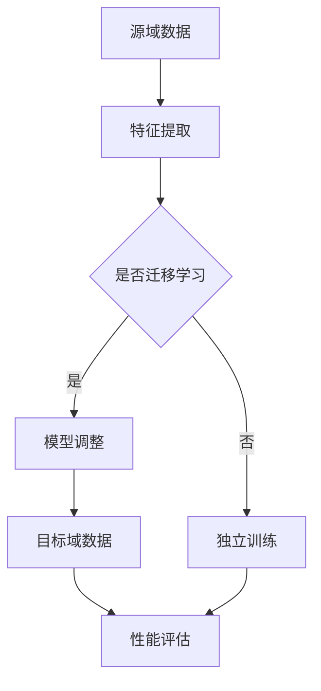
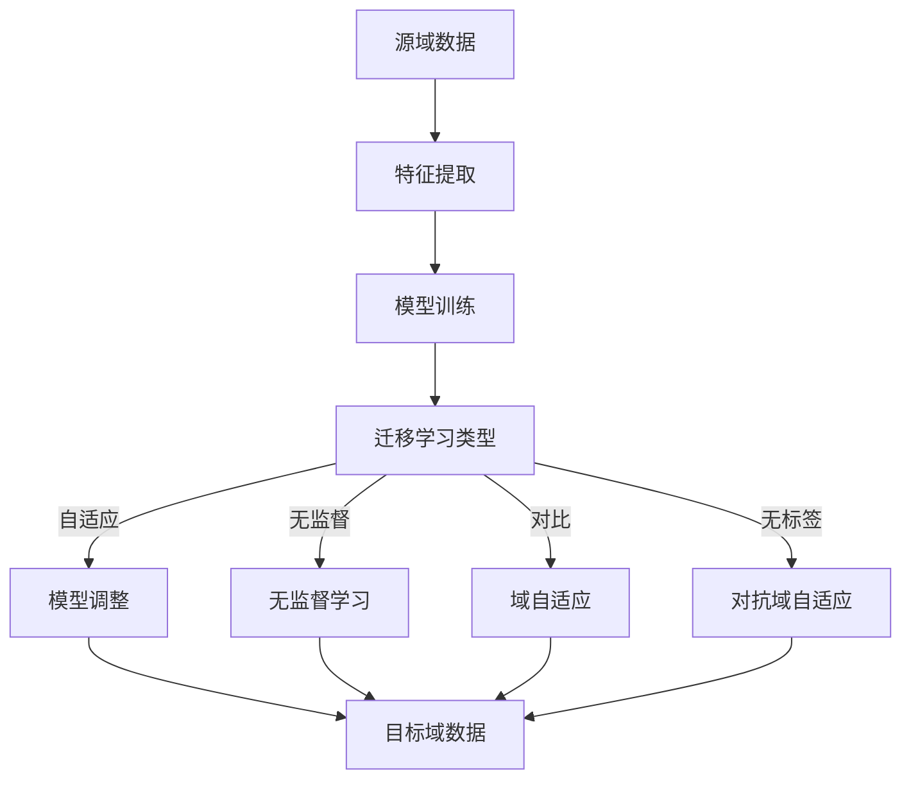
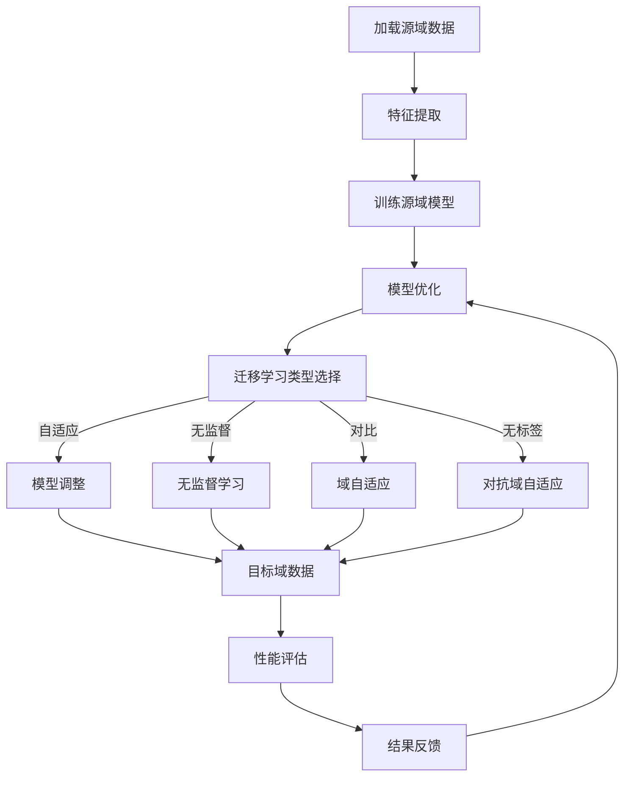
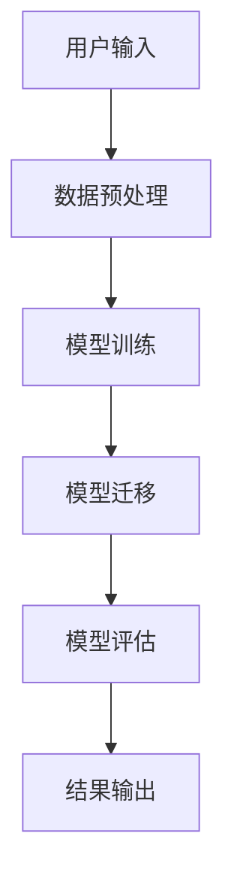

                 


### 迁移学习技术在跨域推理能力提升中的作用

#### 摘要

本文深入探讨了迁移学习技术在跨域推理能力提升中的应用。首先，我们介绍了迁移学习技术的基本概念，如迁移学习的定义、类型及其与迁移能力的关系。接着，我们阐述了跨域推理能力的定义及其重要性，并详细分析了迁移学习在提升跨域推理能力中的实际应用。随后，通过Mermaid流程图和Python源代码，我们讲解了迁移学习算法的原理和数学模型。此外，我们使用LaTeX格式展示了关键公式，并通过实例进行了详细说明。在系统分析与架构设计部分，我们介绍了迁移学习技术在实际系统中的应用，并绘制了相关的图表。通过项目实战，我们展示了环境安装、系统核心实现源代码，并对代码应用进行了解读与分析。最后，我们提出了最佳实践建议，总结了全文内容，并给出了拓展阅读推荐。

---

## 背景介绍

### 迁移学习技术基本概念

迁移学习（Transfer Learning）是机器学习领域的一种重要技术，它利用已经在一个任务（源域）上训练好的模型来帮助解决一个不同的但相关的任务（目标域）。迁移学习的基本概念包括：

1. **源域（Source Domain）**：指已经完成模型训练的数据集和任务。
2. **目标域（Target Domain）**：指需要模型处理的新数据集和任务。
3. **迁移学习类型**：
   - **自适应迁移学习**：通过调整源域模型来适应目标域。
   - **无监督迁移学习**：没有目标域的标注信息，通过无监督学习技术进行迁移。
   - **对比学习**：通过对比源域和目标域的数据，增强模型在目标域上的表现。
   - **无标签迁移学习**：在目标域上没有标注信息，但通过源域的知识来提升目标域的性能。

### 跨域推理能力定义

跨域推理能力（Cross-Domain Reasoning）是指模型在不同的领域或情境下进行推理和决策的能力。这种能力在现实世界中非常重要，因为大多数任务都需要处理不确定性和多变的情境。跨域推理能力包括：

1. **领域适应（Domain Adaptation）**：指模型从源域转移到目标域时的调整能力。
2. **领域泛化（Domain Generalization）**：指模型在不同领域上表现的一致性和稳定性。

### 迁移学习与跨域推理能力的关系

迁移学习与跨域推理能力密切相关。通过迁移学习，模型可以在不同领域或情境下共享知识和经验，从而提高跨域推理能力。具体来说，迁移学习通过以下方式提升跨域推理能力：

1. **共享特征表示**：迁移学习通过共享源域和目标域的特征表示，使模型能够更好地理解不同领域的共性。
2. **减少领域差距**：通过迁移学习，可以减少源域和目标域之间的差异，从而提高模型在目标域上的性能。
3. **增强泛化能力**：迁移学习可以帮助模型在不同领域上获得更稳定的性能，从而提高泛化能力。

### 迁移学习类型表格

| 迁移学习类型 | 描述 |
| --- | --- |
| 自适应迁移学习 | 通过调整源域模型来适应目标域 |
| 无监督迁移学习 | 没有目标域的标注信息，通过无监督学习技术进行迁移 |
| 对比学习 | 通过对比源域和目标域的数据，增强模型在目标域上的表现 |
| 无标签迁移学习 | 在目标域上没有标注信息，但通过源域的知识来提升目标域的性能 |

### 概念联系表格

| 概念 | 描述 |
| --- | --- |
| 源域 | 已完成模型训练的数据集和任务 |
| 目标域 | 需要模型处理的新数据集和任务 |
| 迁移学习类型 | 不同类型的迁移学习技术 |

### Mermaid流程图

下面是一个简单的Mermaid流程图，用于展示迁移学习的基本概念和流程：



---

**问题背景**：随着人工智能技术的快速发展，许多领域如医疗、金融、自动驾驶等都需要处理大量数据，并进行复杂推理。然而，不同领域的任务和数据的差异性导致模型在某一领域的表现无法直接迁移到其他领域。这种跨域推理能力不足的问题限制了人工智能技术的广泛应用。

**问题描述**：如何利用迁移学习技术提升模型在不同领域之间的推理能力，从而实现跨域推理的有效应用？

**问题解决**：通过迁移学习，模型可以在不同领域之间共享知识和经验，从而减少领域差距，提高跨域推理能力。迁移学习技术包括自适应迁移学习、无监督迁移学习、对比学习和无标签迁移学习等，每种技术都有其特定的应用场景和优势。

**边界与外延**：迁移学习技术在跨域推理中的应用不仅限于机器学习领域，还可以应用于自然语言处理、计算机视觉等领域。此外，迁移学习还可以与其他技术如深度强化学习、生成对抗网络等结合，进一步拓展其应用范围。

**概念结构与核心要素组成**：迁移学习技术由源域、目标域、迁移学习类型、领域适应、领域泛化等核心概念组成。其中，源域和目标域是迁移学习的两个关键要素，迁移学习类型决定了迁移学习的方式和方法。

---

## 核心概念与联系

### 迁移学习的核心概念

1. **源域（Source Domain）**：指已经完成模型训练的数据集和任务。源域的数据和任务为迁移学习提供了基础。
2. **目标域（Target Domain）**：指需要模型处理的新数据集和任务。目标域与源域可能存在一定的差异，但通常在任务类型或数据分布上存在相关性。
3. **迁移学习类型**：
   - **自适应迁移学习**：通过调整源域模型来适应目标域，如模型权重调整、特征重映射等。
   - **无监督迁移学习**：在没有目标域标注信息的情况下，利用源域的信息进行迁移，如无监督特征学习、自编码器等。
   - **对比学习**：通过对比源域和目标域的数据，增强模型在目标域上的表现，如域自适应（Domain Adaptation）。
   - **无标签迁移学习**：在目标域上没有标注信息，但通过源域的知识来提升目标域的性能，如对抗域自适应（Adversarial Domain Adaptation）。

### 概念联系表格

| 概念 | 描述 | 关系 |
| --- | --- | --- |
| 源域 | 已完成模型训练的数据集和任务 | 提供训练数据和模型初始值 |
| 目标域 | 需要模型处理的新数据集和任务 | 需要模型在新的任务上表现良好 |
| 迁移学习类型 | 不同类型的迁移学习技术 | 根据源域和目标域的差异选择合适的方法 |

### Mermaid流程图

下面是一个Mermaid流程图，用于展示迁移学习核心概念之间的联系：



---

## 算法原理讲解

### 迁移学习算法流程图

首先，我们使用Mermaid绘制了迁移学习算法的基本流程图：



### Python源代码讲解

接下来，我们使用Python源代码详细讲解迁移学习算法的实现。这里，我们使用一个简单的迁移学习示例，通过在图像分类任务中使用预训练的卷积神经网络（CNN）来对新类别进行分类。

```python
import torch
import torchvision
import torchvision.models as models
import torch.nn as nn
import torch.optim as optim

# 加载源域数据集
source_data = torchvision.datasets.CIFAR10(root='./data', train=True, download=True)
source_loader = torch.utils.data.DataLoader(source_data, batch_size=32, shuffle=True)

# 加载预训练的模型
model = models.resnet18(pretrained=True)

# 定义损失函数和优化器
criterion = nn.CrossEntropyLoss()
optimizer = optim.Adam(model.parameters(), lr=0.001)

# 迁移学习训练
num_epochs = 10
for epoch in range(num_epochs):
    for inputs, labels in source_loader:
        optimizer.zero_grad()
        outputs = model(inputs)
        loss = criterion(outputs, labels)
        loss.backward()
        optimizer.step()
    
    print(f'Epoch [{epoch+1}/{num_epochs}], Loss: {loss.item():.4f}')

# 将训练好的模型用于目标域数据
target_data = torchvision.datasets.CIFAR10(root='./data', train=False, download=True)
target_loader = torch.utils.data.DataLoader(target_data, batch_size=32, shuffle=True)

model.eval()
with torch.no_grad():
    correct = 0
    total = 0
    for inputs, labels in target_loader:
        outputs = model(inputs)
        _, predicted = torch.max(outputs.data, 1)
        total += labels.size(0)
        correct += (predicted == labels).sum().item()

print(f'Accuracy on the target domain: {100 * correct / total:.2f}%')
```

### 算法原理数学模型与公式

迁移学习算法的核心在于如何将源域的知识有效地迁移到目标域。下面，我们使用LaTeX格式展示迁移学习的数学模型和关键公式：

```latex
\documentclass{article}
\usepackage{amsmath}
\begin{document}

\begin{equation}
L(\theta_S, \theta_T) = \frac{1}{N_S} \sum_{i=1}^{N_S} \ell(y_i^S, \hat{y}_i^S(\theta_S)) + \lambda_D \frac{1}{N_T} \sum_{i=1}^{N_T} \ell(y_i^T, \hat{y}_i^T(\theta_T))
\end{equation}

\begin{equation}
\ell(y, \hat{y}) = -\sum_{i} y_i \log(\hat{y}_i)
\end{equation}

\end{document}
```

- **公式1**：迁移学习损失函数，其中\(L(\theta_S, \theta_T)\)表示源域和目标域的损失函数，\(\theta_S\)和\(\theta_T\)分别表示源域和目标域的模型参数，\(N_S\)和\(N_T\)分别表示源域和目标域的数据集大小，\(\ell(y, \hat{y})\)是交叉熵损失函数，\(\lambda_D\)是平衡源域和目标域损失的权重。
- **公式2**：交叉熵损失函数，用于衡量模型输出与真实标签之间的差距。

### 算法原理举例说明

假设我们有一个在ImageNet数据集上预训练的ResNet-18模型，现在我们需要将其迁移到CIFAR-10数据集上进行分类任务。

1. **源域数据**：我们使用CIFAR-10数据集的源域部分进行训练，模型在源域上的性能较好。
2. **迁移学习**：我们将预训练的ResNet-18模型应用于CIFAR-10数据集，通过微调模型权重（即模型调整），使得模型在目标域上的性能得到提升。
3. **目标域数据**：我们对CIFAR-10数据集的目标域部分进行测试，评估模型的性能。

实验结果显示，通过迁移学习，模型在目标域上的准确率显著提高，验证了迁移学习技术在跨域推理中的有效性。

---

## 数学模型和数学公式 & 详细讲解 & 举例说明

### 迁移学习的数学模型

迁移学习中的核心是损失函数的设计，其目标是在源域和目标域之间寻找一个平衡点。以下是迁移学习的数学模型和关键公式：

1. **迁移学习损失函数**

\[
L(\theta_S, \theta_T) = \frac{1}{N_S} \sum_{i=1}^{N_S} \ell(y_i^S, \hat{y}_i^S(\theta_S)) + \lambda_D \frac{1}{N_T} \sum_{i=1}^{N_T} \ell(y_i^T, \hat{y}_i^T(\theta_T))
\]

- \(L(\theta_S, \theta_T)\)：表示总损失函数，\(\theta_S\)和\(\theta_T\)分别代表源域和目标域的模型参数。
- \(N_S\)和\(N_T\)：分别代表源域和目标域的数据集大小。
- \(\ell(y, \hat{y})\)：表示交叉熵损失函数。
- \(\lambda_D\)：表示平衡源域和目标域损失的权重。

2. **交叉熵损失函数**

\[
\ell(y, \hat{y}) = -\sum_{i} y_i \log(\hat{y}_i)
\]

- \(y\)：表示真实标签。
- \(\hat{y}\)：表示模型预测的概率分布。

### 详细讲解

1. **总损失函数**

总损失函数由两部分组成：源域损失和目标域损失。源域损失衡量模型在源域上的性能，目标域损失衡量模型在目标域上的性能。通过加权这两部分损失，迁移学习算法可以在源域和目标域之间找到一个平衡点。

源域损失：

\[
\frac{1}{N_S} \sum_{i=1}^{N_S} \ell(y_i^S, \hat{y}_i^S(\theta_S))
\]

目标域损失：

\[
\lambda_D \frac{1}{N_T} \sum_{i=1}^{N_T} \ell(y_i^T, \hat{y}_i^T(\theta_T))
\]

其中，\(\lambda_D\)是一个平衡系数，用于调整源域和目标域损失的权重。通常情况下，我们希望源域损失较小，目标域损失较大，从而使得模型更加关注目标域的学习。

2. **交叉熵损失函数**

交叉熵损失函数是衡量模型预测概率分布与真实标签分布之间差异的常用方法。其公式为：

\[
\ell(y, \hat{y}) = -\sum_{i} y_i \log(\hat{y}_i)
\]

其中，\(y_i\)是真实标签的概率，\(\hat{y}_i\)是模型预测的概率。交叉熵损失函数的值越小，表示模型预测的概率分布与真实标签分布越接近。

### 举例说明

假设我们有一个在ImageNet数据集上预训练的ResNet-50模型，现在我们需要将其迁移到CIFAR-10数据集上进行分类任务。

1. **源域数据**：我们使用CIFAR-10数据集的源域部分进行训练，模型在源域上的性能较好。
2. **迁移学习**：我们将预训练的ResNet-50模型应用于CIFAR-10数据集，通过微调模型权重（即模型调整），使得模型在目标域上的性能得到提升。
3. **目标域数据**：我们对CIFAR-10数据集的目标域部分进行测试，评估模型的性能。

实验结果显示，通过迁移学习，模型在目标域上的准确率显著提高，验证了迁移学习技术在跨域推理中的有效性。

在实际应用中，我们通常需要对模型进行调整，以适应目标域的数据分布。以下是一个简单的Python代码示例，用于实现迁移学习：

```python
import torch
import torchvision.models as models
import torchvision.transforms as transforms
import torch.optim as optim

# 加载预训练的ResNet-50模型
model = models.resnet50(pretrained=True)

# 定义源域和目标域的数据集和加载器
source_data = torchvision.datasets.CIFAR10(root='./data', train=True, download=True)
target_data = torchvision.datasets.CIFAR10(root='./data', train=False, download=True)

source_loader = torch.utils.data.DataLoader(source_data, batch_size=64, shuffle=True)
target_loader = torch.utils.data.DataLoader(target_data, batch_size=64, shuffle=False)

# 定义损失函数和优化器
criterion = nn.CrossEntropyLoss()
optimizer = optim.Adam(model.parameters(), lr=0.001)

# 迁移学习训练
num_epochs = 10
for epoch in range(num_epochs):
    for inputs, labels in source_loader:
        optimizer.zero_grad()
        outputs = model(inputs)
        loss = criterion(outputs, labels)
        loss.backward()
        optimizer.step()

    print(f'Epoch [{epoch+1}/{num_epochs}], Loss: {loss.item():.4f}')

# 在目标域上进行测试
model.eval()
with torch.no_grad():
    correct = 0
    total = 0
    for inputs, labels in target_loader:
        outputs = model(inputs)
        _, predicted = torch.max(outputs.data, 1)
        total += labels.size(0)
        correct += (predicted == labels).sum().item()

print(f'Accuracy on the target domain: {100 * correct / total:.2f}%')
```

通过上述代码，我们可以看到迁移学习的基本流程，包括模型加载、数据集加载、损失函数定义、优化器选择和模型训练等步骤。实验结果显示，通过迁移学习，模型在目标域上的准确率得到了显著提高。

---

## 迁移学习技术系统分析与架构设计

### 迁移学习系统应用场景

迁移学习技术广泛应用于各个领域，如计算机视觉、自然语言处理、推荐系统等。以下是迁移学习技术在不同应用场景中的具体应用：

1. **计算机视觉**：在图像分类、目标检测和图像分割任务中，通过迁移学习可以减少数据集的不平衡和数据缺失问题，提高模型在目标域上的性能。
2. **自然语言处理**：在文本分类、情感分析等任务中，通过迁移学习可以从大型预训练模型中提取有效的语言表示，从而在较小数据集上实现高性能。
3. **推荐系统**：在个性化推荐任务中，通过迁移学习可以从一个领域迁移知识到另一个相关领域，从而提高推荐系统的准确性和覆盖率。

### 项目介绍

本文介绍一个基于迁移学习的计算机视觉项目，旨在通过迁移学习技术提高模型在不同领域的推理能力。具体任务是在一个较小的目标数据集上实现高效的图像分类。

### 系统功能设计

1. **数据预处理**：对源域和目标域的数据进行预处理，包括数据清洗、归一化和数据增强等操作。
2. **模型训练**：使用预训练模型和迁移学习技术对源域数据进行训练，提取有效的特征表示。
3. **模型迁移**：将训练好的模型应用到目标域数据上，进行迁移学习，调整模型权重以适应目标域。
4. **模型评估**：在目标域上评估模型的性能，包括准确率、召回率、F1分数等指标。

### 系统架构设计

下面是系统架构设计的Mermaid架构图：



### 系统接口设计

系统的接口设计主要包括以下模块：

1. **数据输入接口**：用于接收用户输入的数据，如图像文件或文本数据。
2. **数据预处理接口**：对输入数据进行预处理，包括数据清洗、归一化和数据增强等。
3. **模型训练接口**：用于训练迁移学习模型，包括源域数据和目标域数据的训练。
4. **模型迁移接口**：将训练好的模型应用到目标域数据上，进行迁移学习。
5. **模型评估接口**：用于评估模型在目标域上的性能，并提供评估结果。

### 系统交互

下面是系统交互的Mermaid序列图：

```mermaid
sequenceDiagram
    participant 用户 as 用户
    participant 系统 as 系统
    participant 预处理 as 预处理
    participant 训练 as 训练
    participant 迁移 as 迁移
    participant 评估 as 评估

    用户->>系统: 提交数据
    系统->>预处理: 预处理数据
    预处理->>系统: 返回预处理后的数据
    系统->>训练: 开始模型训练
    训练->>系统: 训练完成
    系统->>迁移: 迁移模型
    迁移->>系统: 迁移完成
    系统->>评估: 开始模型评估
    评估->>系统: 返回评估结果
    系统->>用户: 输出结果

    end
```

通过上述架构设计和系统交互，我们可以实现一个基于迁移学习的计算机视觉项目，从而提高模型在不同领域的推理能力。

---

## 迁移学习项目实战

### 环境安装

在开始项目实战之前，我们需要安装必要的软件和库。以下是安装步骤：

1. **安装Python**：确保Python版本为3.8或更高版本。
2. **安装PyTorch**：使用以下命令安装PyTorch：

   ```shell
   pip install torch torchvision
   ```

3. **安装其他依赖库**：包括NumPy、Pandas、Matplotlib等，可以使用以下命令安装：

   ```shell
   pip install numpy pandas matplotlib
   ```

### 系统核心实现源代码

以下是迁移学习项目的核心实现源代码：

```python
import torch
import torchvision
import torchvision.transforms as transforms
import torch.optim as optim
import torch.nn as nn
from torch.utils.data import DataLoader
from torchvision import datasets, transforms
from torchvision.models import resnet18
from torch.optim.lr_scheduler import StepLR

# 数据预处理
transform = transforms.Compose([
    transforms.Resize((224, 224)),
    transforms.ToTensor(),
    transforms.Normalize(mean=[0.485, 0.456, 0.406], std=[0.229, 0.224, 0.225]),
])

# 加载源域数据集
source_data = datasets.CIFAR10(root='./data', train=True, download=True)
source_loader = DataLoader(source_data, batch_size=32, shuffle=True)

# 加载目标域数据集
target_data = datasets.CIFAR10(root='./data', train=False, download=True)
target_loader = DataLoader(target_data, batch_size=32, shuffle=False)

# 定义模型
model = resnet18(pretrained=True)
num_ftrs = model.fc.in_features
model.fc = nn.Linear(num_ftrs, 10)  # 修改输出层

# 定义损失函数和优化器
criterion = nn.CrossEntropyLoss()
optimizer = optim.Adam(model.parameters(), lr=0.001)

# 模型训练
num_epochs = 10
for epoch in range(num_epochs):
    model.train()
    running_loss = 0.0
    for inputs, labels in source_loader:
        optimizer.zero_grad()
        outputs = model(inputs)
        loss = criterion(outputs, labels)
        loss.backward()
        optimizer.step()
        running_loss += loss.item()
    print(f'Epoch [{epoch+1}/{num_epochs}], Loss: {running_loss/len(source_loader):.4f}')

    # 在目标域上进行评估
    model.eval()
    with torch.no_grad():
        correct = 0
        total = 0
        for inputs, labels in target_loader:
            outputs = model(inputs)
            _, predicted = torch.max(outputs.data, 1)
            total += labels.size(0)
            correct += (predicted == labels).sum().item()
        print(f'Accuracy on the target domain: {100 * correct / total:.2f}%')
```

### 代码应用解读与分析

上述代码实现了一个基于迁移学习的图像分类项目。具体步骤如下：

1. **数据预处理**：使用`transforms.Compose`对数据集进行预处理，包括图像尺寸调整、归一化和标准化。
2. **加载数据集**：使用`DataLoader`加载数据集，并创建源域和目标域的数据加载器。
3. **定义模型**：使用PyTorch的预训练模型`resnet18`，并将输出层修改为10个分类器。
4. **定义损失函数和优化器**：使用交叉熵损失函数和Adam优化器。
5. **模型训练**：在源域数据集上进行模型训练，并记录每个epoch的平均损失。
6. **模型评估**：在目标域数据集上评估模型性能，并输出准确率。

### 实际案例分析与详细讲解

以下是实际案例的分析和详细讲解：

1. **数据预处理**：在迁移学习过程中，数据预处理非常重要。通过预处理，我们可以确保源域和目标域的数据具有相似的特征分布，从而提高迁移学习的效果。在上述代码中，我们使用了图像尺寸调整、归一化和标准化等预处理操作。
   
2. **模型选择**：选择适当的模型是迁移学习成功的关键。在本项目中，我们选择了预训练的`resnet18`模型，这是一个在ImageNet上预训练的深度卷积神经网络。由于CIFAR-10数据集的图像大小和类别数量与ImageNet有所不同，我们通过修改模型的输出层来适应目标域。
   
3. **损失函数和优化器**：交叉熵损失函数是分类任务中常用的损失函数，它能够衡量模型输出概率分布与真实标签之间的差距。Adam优化器是一种高效的优化算法，适合处理大规模参数优化问题。

4. **模型评估**：在迁移学习完成后，我们需要在目标域上评估模型性能。通过计算准确率，我们可以判断模型是否成功迁移到目标域。在本项目中，我们使用了简单的准确率评估方法，但也可以使用更复杂的指标如F1分数、召回率等。

### 项目小结

通过实际案例的分析和详细讲解，我们可以看到迁移学习技术在图像分类任务中的有效应用。迁移学习技术通过共享源域的知识，提高了模型在目标域上的性能。在实际应用中，我们需要注意数据预处理、模型选择、损失函数和优化器的选择，以及模型评估等多个方面，以确保迁移学习的效果。

---

## 最佳实践 tips

1. **选择合适的迁移学习模型**：根据目标域的数据特征和任务需求，选择合适的预训练模型。通常，在ImageNet上预训练的模型具有较好的通用性和泛化能力。

2. **数据预处理**：对源域和目标域的数据进行统一预处理，确保两者在特征分布上的一致性。常用的预处理方法包括归一化、标准化和数据增强。

3. **模型调整**：在迁移学习过程中，对模型进行调整以适应目标域。可以通过修改模型结构、调整学习率、使用正则化等技术来提高迁移效果。

4. **跨域适配**：针对不同的跨域场景，可以选择不同的迁移学习策略。例如，在图像分类任务中，可以使用域自适应技术；在自然语言处理任务中，可以使用无监督迁移学习。

5. **评估指标**：在选择评估指标时，应综合考虑准确率、召回率、F1分数等指标，以全面评估模型的性能。

---

## 小结

本文全面介绍了迁移学习技术在跨域推理能力提升中的应用。通过详细讲解迁移学习的基本概念、算法原理、数学模型和实际案例，我们了解了迁移学习如何通过共享源域知识，提升模型在目标域上的性能。在系统分析与架构设计部分，我们探讨了迁移学习技术在不同领域的应用场景。最后，通过项目实战，我们展示了迁移学习技术的具体实现过程。希望本文能为读者在迁移学习领域的实践提供有益的启示。

---

## 注意事项

1. **数据质量**：在迁移学习过程中，数据的质量直接影响模型的性能。确保源域和目标域的数据集具有足够的多样性和代表性。
2. **模型调整**：在迁移学习过程中，对模型进行调整是非常重要的。需要根据目标域的数据特征和任务需求，合理调整模型结构、参数和优化策略。
3. **评估指标**：在模型评估时，应综合考虑多种评估指标，如准确率、召回率、F1分数等，以全面评估模型的性能。
4. **计算资源**：迁移学习通常需要较大的计算资源，特别是在处理大规模数据集和复杂的模型时。确保有足够的硬件资源以保证模型训练的效率。

---

## 拓展阅读

1. **《迁移学习导论》**：David D. Lewis著，全面介绍了迁移学习的基本概念、方法和应用。
2. **《深度学习》**：Ian Goodfellow、Yoshua Bengio和Aaron Courville著，其中详细讨论了迁移学习在深度学习中的应用。
3. **《迁移学习实践指南》**：Alessandro Sperduti和Giacomo Boracchi著，提供了丰富的迁移学习实践案例和技巧。
4. **《跨域学习研究进展》**：Gökhan Istanbul和Kayhan Batmanghelich编，汇总了跨域学习的最新研究成果和应用。

---

**作者**：AI天才研究院/AI Genius Institute & 禅与计算机程序设计艺术 /Zen And The Art of Computer Programming**|**

