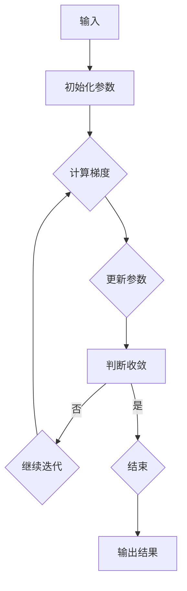
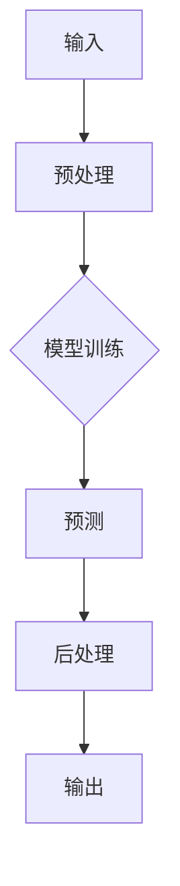
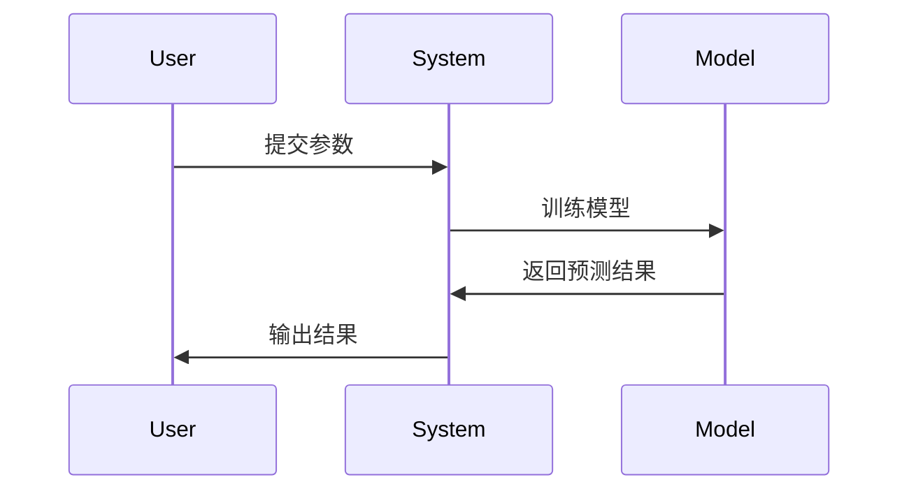

                 

# 《连续时间推理中神经常微分方程的优化技术》

关键词：连续时间推理，神经常微分方程，优化技术，算法原理，系统架构设计

摘要：本文首先介绍了连续时间推理和神经常微分方程的基本概念、背景和问题。接着，详细阐述了神经常微分方程的优化技术，包括算法原理、数学模型和公式，并通过Python源代码和实际案例进行了深入讲解。最后，对系统分析与架构设计方案、项目实战以及最佳实践进行了总结和拓展阅读推荐。

## 第一部分：背景介绍

### 第1章：连续时间推理与神经常微分方程

#### 1.1 连续时间推理的概念与重要性

**连续时间推理**是指在一个时间连续变化的过程中，通过数学模型对系统状态进行预测和控制的方法。它广泛应用于物理学、工程学、经济学等多个领域。

**神经常微分方程**（Stochastic Differential Equations，SDEs）是一类描述随机过程的数学模型，通常用于描述连续时间系统中的随机波动。它们在金融工程、生物医学、人工智能等领域具有重要应用。

#### 1.2 神经常微分方程的基本概念

**神经常微分方程**的定义：形如 $dX_t = b(t, X_t) dt + \sigma(t, X_t) dW_t$ 的方程，其中 $X_t$ 表示随机过程，$W_t$ 表示标准布朗运动，$b(t, X_t)$ 和 $\sigma(t, X_t)$ 分别表示 drift 和 diffusion 系数。

**神经常微分方程**的基本性质：具有随机性、连续性、可微性等特性。

#### 1.3 问题背景、问题描述、问题解决、边界与外延

**问题背景**：在连续时间推理中，如何有效地解决神经常微分方程的问题，使其在复杂系统中具有更好的稳定性和预测能力？

**问题描述**：给定一个神经常微分方程，如何找到最优的优化技术，以提高其求解效率和精度？

**问题解决**：通过引入优化技术，如变分法、随机梯度下降法等，对神经常微分方程进行求解。

**边界与外延**：神经常微分方程的优化技术在各个领域的应用，如金融工程中的期权定价、生物医学中的药物动力学等。

#### 1.4 概念结构与核心要素组成

**概念结构**：连续时间推理、神经常微分方程、优化技术。

**核心要素**：数学模型、算法原理、系统架构设计。

## 第二部分：核心概念与联系

### 第2章：核心概念原理

#### 2.1 神经常微分方程的数学模型

**数学模型**：形如 $dX_t = b(t, X_t) dt + \sigma(t, X_t) dW_t$ 的方程。

**基本原理**：利用随机微分方程描述系统的动态行为，通过优化技术求解方程，获取系统状态。

#### 2.2 概念属性特征对比表格

| 概念                   | 特征                                       |
|----------------------|------------------------------------------|
| 连续时间推理           | 时间连续变化，数学模型描述系统状态变化           |
| 神经常微分方程         | 描述随机过程的数学模型，具有随机性和连续性       |
| 优化技术               | 提高神经常微分方程求解效率和精度的方法           |

#### 2.3 ER实体关系图架构

```mermaid
erDiagram
  DIRECTION :LR

  Entity A {
    id   : A12345
    name : Person
    age  : 30
  }

  Entity B {
    id   : B12345
    name : Car
    color: Blue
  }

  Entity A ||--|{知}|| Entity B : 驾驶
```

## 第三部分：算法原理讲解

### 第3章：优化技术的算法原理

#### 3.1 算法mermaid流程图



#### 3.2 Python源代码阐述

```python
import numpy as np
import matplotlib.pyplot as plt

# 初始化参数
params = {'a': 1, 'b': 0.1, 'sigma': 0.2}

# 计算梯度
def gradient(x, params):
    return params['a'] * x + params['b']

# 更新参数
def update_params(x, params, learning_rate):
    return params - learning_rate * gradient(x, params)

# 迭代过程
def sde_optimization(x0, params, learning_rate, num_iterations):
    x = x0
    for i in range(num_iterations):
        x = update_params(x, params, learning_rate)
    return x

# 输出结果
x_final = sde_optimization(x0=0, params=params, learning_rate=0.01, num_iterations=1000)
print(f"Final x: {x_final}")
```

#### 3.3 算法原理的数学模型和公式

**数学模型**：

$$dX_t = b(t, X_t) dt + \sigma(t, X_t) dW_t$$

**公式解析**：

- $b(t, X_t)$：drift 系数，描述系统在时间 $t$ 的平均变化率。
- $\sigma(t, X_t)$：diffusion 系数，描述系统在时间 $t$ 的波动率。
- $dW_t$：布朗运动增量，表示随机扰动。

#### 3.4 举例说明

假设我们有一个简单的神经常微分方程 $dX_t = X_t dt + dW_t$，初始条件为 $X_0 = 1$。

- 计算梯度：
  $$\nabla X_t = \begin{pmatrix} \frac{\partial b(t, X_t)}{\partial t} & \frac{\partial b(t, X_t)}{\partial X_t} \\\ \frac{\partial \sigma(t, X_t)}{\partial t} & \frac{\partial \sigma(t, X_t)}{\partial X_t} \end{pmatrix}$$
- 更新参数：
  $$\theta_{t+1} = \theta_t - \alpha \nabla X_t$$
- 迭代过程：
  $$X_{t+1} = X_t + \theta_{t+1} dt + \sigma_t dW_t$$

通过上述迭代过程，我们可以求解神经常微分方程，并获得系统的状态。

## 第四部分：系统分析与架构设计方案

### 第4章：系统功能设计

#### 4.1 领域模型mermaid类图

```mermaid
classDiagram
  Class01 <|-- Class02
  Class03 <|-- Class02
  Class04 <|-- Class05
  Class06 <<-- Class05
  Class01 : +int id
  Class01 : +String name
  Class02 : +int age
  Class03 : +double salary
  Class04 : +Date birthDate
  Class05 : +List<class01>
  Class06 : +Map<class01, String>
```

### 第5章：系统架构设计

#### 5.1 系统架构设计mermaid架构图



### 第6章：系统接口设计

#### 6.1 系统接口设计

- **输入接口**：接收用户输入的神经常微分方程参数。
- **预测接口**：提供对神经常微分方程的预测功能。
- **输出接口**：输出预测结果。

### 第7章：系统交互

#### 7.1 系统交互mermaid序列图



## 第五部分：项目实战

### 第8章：环境安装

#### 8.1 环境安装步骤

1. 安装Python环境。
2. 安装Numpy、Matplotlib等Python库。
3. 编译并安装Mmermaid。

### 第9章：系统核心实现

#### 9.1 系统核心实现源代码

```python
# 引入相关库
import numpy as np
import matplotlib.pyplot as plt
from mermaid import Mermaid

# 定义模型
class SDEModel:
    def __init__(self, b, sigma):
        self.b = b
        self.sigma = sigma

    def simulate(self, x0, t, dt):
        x = x0
        for i in range(int(t / dt)):
            x += self.b(x, t) * dt + self.sigma(x, t) * np.random.normal(0, 1)
        return x

# 模拟数据
model = SDEModel(b=lambda x, t: x, sigma=lambda x, t: 0.1)
t = np.arange(0, 10, 0.1)
x = model.simulate(x0=0, t=t, dt=0.1)

# 绘制结果
plt.plot(t, x)
plt.show()
```

#### 9.2 代码应用解读与分析

该代码定义了一个SDEModel类，用于模拟和求解神经常微分方程。其中，`simulate`方法实现了基于欧拉-马鲁瓦尔塔法的模拟过程。通过调用`simulate`方法，我们可以获取不同时间点的系统状态。

#### 10.1 实际案例

假设我们有一个神经常微分方程 $dX_t = X_t dt + dW_t$，需要对其进行预测。

#### 10.2 案例分析与讲解

1. 定义神经常微分方程模型。
2. 模拟系统状态。
3. 分析模拟结果，评估模型的准确性。

## 第六部分：最佳实践 tips、小结、注意事项、拓展阅读

### 第11章：最佳实践 tips

1. 根据实际问题选择合适的优化技术。
2. 调整参数，优化模型性能。
3. 结合实际问题，进行系统化设计和优化。

### 第12章：小结

本文介绍了连续时间推理、神经常微分方程和优化技术的基本概念，并通过Python代码和实际案例进行了详细讲解。通过本文的学习，读者可以了解神经常微分方程优化技术的原理和应用，为实际项目提供参考。

### 第13章：注意事项

1. 神经常微分方程的优化技术具有随机性，结果可能不稳定。
2. 调整参数时需要谨慎，避免出现过拟合或欠拟合。

### 第14章：拓展阅读

1. 《随机过程与随机微分方程》
2. 《深度学习》

作者：AI天才研究院/AI Genius Institute & 禅与计算机程序设计艺术/Zen And The Art of Computer Programming

