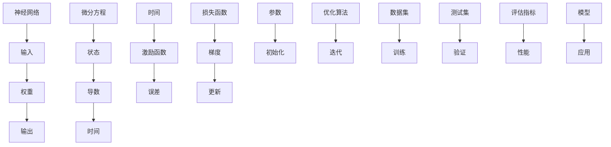
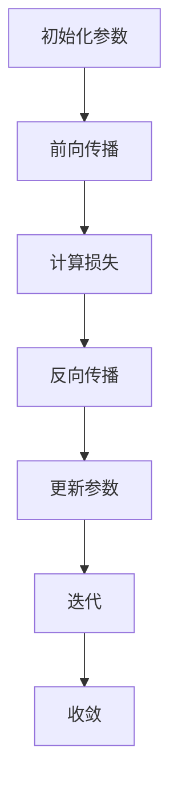

                 

### 第1章：连续时间推理概述

#### 1.1 连续时间推理的背景

**问题背景与描述**

连续时间推理（Continuous Time Reasoning）是人工智能领域中的一项重要研究方向，主要关注在时间连续的系统中进行推理和决策。这种推理方式在很多实际问题中都具有重要意义，如自动驾驶、机器人控制、股票市场预测等。在传统方法中，时间通常被离散化处理，而连续时间推理提供了一种更为精确和自然的解决方案。

- **定义与重要性**

  连续时间推理可以看作是一种处理动态系统的方法，它关注的是时间连续的变量如何随着时间变化而变化。这种方法的核心在于能够捕捉和利用系统在连续时间上的行为特征，从而提供更准确和及时的信息。

- **传统方法的局限**

  传统方法，如基于离散事件的推理和基于隐马尔可夫模型的推理，虽然在某些特定场景下表现出色，但存在以下局限：

  - **时间精度不足**：离散时间模型无法精确捕捉连续时间系统的动态变化。
  - **计算复杂度高**：大量离散时间步的计算可能导致模型难以实时应用。
  - **状态空间爆炸**：随着时间步数的增加，系统的状态空间会急剧膨胀，导致模型难以处理。

**问题解决与边界**

为了克服传统方法的局限，连续时间推理应运而生。它通过引入连续时间变量和微分方程等数学工具，提供了一种更为灵活和高效的解决方案。然而，连续时间推理也面临一些挑战：

- **数值稳定性**：连续时间推理通常依赖于数值方法求解微分方程，因此数值稳定性是一个关键问题。
- **计算效率**：高效地求解大规模的连续时间模型是一个重大挑战。
- **泛化能力**：如何保证模型在不同场景下的泛化能力是一个需要深入研究的课题。

通过本章的介绍，我们将对连续时间推理有一个初步的了解，并了解其在实际应用中的重要性及面临的挑战。接下来的章节将详细探讨神经微分方程这一核心概念，并深入分析其在连续时间推理中的应用。

#### 1.2 神经微分方程的基本概念

**核心概念**

神经微分方程（Neural Differential Equations, NDEs）是近年来在人工智能领域受到广泛关注的一种模型，它结合了神经网络（Neural Networks）与微分方程（Differential Equations）的优点，用于解决连续时间系统中的推理和预测问题。NDEs通过引入连续时间变量，可以更精确地捕捉系统的动态行为，并在时间连续的框架下进行学习和推理。

**概念属性对比表格**

| 特性 | 神经网络 | 微分方程 |
| --- | --- | --- |
| 模型复杂度 | 高 | 中 |
| 学习效率 | 较低 | 较高 |
| 适用范围 | 非线性问题 | 时变系统 |

**对比分析**

- **模型复杂度**：神经网络由于其高度非线性结构，通常具有更高的模型复杂度。这种复杂度使其在处理复杂非线性问题时具有优势，但同时也增加了模型的训练难度。相比之下，微分方程的模型复杂度相对较低，更容易解析和理解，但可能在处理复杂非线性问题时表现不足。

- **学习效率**：神经网络通常需要大量的数据和较长的训练时间来收敛，学习效率相对较低。而微分方程由于其数学性质，可以通过封闭形式的解析或数值方法进行高效求解，学习效率较高。

- **适用范围**：神经网络适用于处理非线性问题和大规模数据集，但其在连续时间系统中的应用较为局限。微分方程则适用于处理时间连续的动态系统，特别是在控制理论和物理系统中应用广泛。

**ER实体关系图架构**

为了更直观地展示神经微分方程的组成结构，我们可以使用ER（Entity-Relationship）实体关系图进行描述。以下是神经微分方程的ER图：



这个ER图展示了神经微分方程的主要组成部分，包括神经网络、微分方程、时间变量、激励函数、误差、损失函数、优化算法和模型应用等。

通过上述表格和ER图，我们可以更清晰地理解神经微分方程的核心概念和其相对于神经网络和微分方程的优势与局限。在接下来的章节中，我们将进一步探讨神经微分方程在连续时间推理中的应用及其优化技术。

#### 1.3 神经微分方程的应用领域

**应用前景**

神经微分方程在人工智能领域中展示了广泛的应用前景，尤其在需要处理连续时间系统的任务中表现尤为出色。以下是几个关键应用领域：

**在控制系统中的应用**

控制系统是神经微分方程的一个重要应用领域。在自动化控制和机器人学中，连续时间系统需要实时响应和控制，而神经微分方程提供了一种高效且精确的建模方法。

- **案例研究**：例如，在无人驾驶汽车中，神经微分方程可以用于实时预测道路状态、车辆位置和速度，从而进行精确的路径规划和决策。

**在物理系统建模中的应用**

神经微分方程在物理系统建模中同样具有重要应用。许多物理现象都涉及到连续时间变量，如流体动力学、电磁学和量子力学等。

- **案例研究**：在流体动力学中，神经微分方程可以用于模拟和预测流体运动，从而优化设计高效发动机和飞机。

**在生物医学领域中的应用**

生物医学领域中的许多问题都涉及到时间连续的动态系统，如神经元活动、心脏跳动和药物代谢等。神经微分方程在这些应用中提供了强有力的工具。

- **案例研究**：在神经元活动中，神经微分方程可以用于建模神经元之间的相互作用，从而预测神经网络的行为。

**在金融预测中的应用**

金融市场是一个高度动态和复杂的系统，连续时间推理对于预测股票价格、交易策略和风险管理具有重要意义。神经微分方程在金融预测中的应用正在逐渐增加。

- **案例研究**：例如，通过神经微分方程可以预测股票市场的波动，从而帮助投资者制定更有效的交易策略。

**在气象预报中的应用**

气象预报需要准确预测天气系统的变化，这是一个高度连续和复杂的动态过程。神经微分方程在气象预报中的应用已经开始展现其潜力。

- **案例研究**：通过神经微分方程可以模拟大气层的运动，预测天气变化，从而提供更精确的气象预报。

**总结**

神经微分方程在控制系统、物理系统建模、生物医学、金融预测和气象预报等多个领域展现了巨大的应用价值。随着计算能力的提升和算法的进步，神经微分方程的应用前景将更加广阔，为解决复杂的连续时间推理问题提供新的思路和工具。

#### 1.4 神经微分方程的优化技术

**概念与分类**

神经微分方程的优化技术是确保模型在训练过程中高效收敛和稳定性的关键。优化技术主要包括神经网络优化和微分方程优化两方面。

**神经网络优化技术**

神经网络优化技术主要关注参数（权重和偏置）的学习过程。这些技术通过调整算法和策略来提高学习效率、减少过拟合和加速收敛。

- **随机梯度下降（SGD）**：SGD是最基本的优化算法之一，通过随机采样训练数据来更新模型参数。
  - **算法流程**：
    ```mermaid
    graph TD
    A[初始化参数] --> B[前向传播];
    B --> C[计算损失];
    C --> D[计算梯度];
    D --> E[更新参数];
    E --> F[迭代];
    F --> G[收敛];
    ```

- **Adam优化器**：Adam是一种结合了SGD和动量方法的优化算法，能够更好地处理稀疏数据和长时间依赖问题。
  - **算法流程**：
    ```mermaid
    graph TD
    A[初始化参数] --> B[计算梯度];
    B --> C[计算一阶矩估计];
    C --> D[计算二阶矩估计];
    D --> E[更新参数];
    E --> F[迭代];
    F --> G[收敛];
    ```

**微分方程优化技术**

微分方程优化技术主要关注如何高效求解和稳定微分方程。这些技术通常依赖于数值方法和优化策略。

- **欧拉方法**：欧拉方法是一种简单的数值求解方法，通过迭代计算来近似解微分方程。
  - **算法公式**：
    $$ y_{n+1} = y_n + h \cdot f(t_n, y_n) $$
    其中，$h$ 是时间步长，$f(t_n, y_n)$ 是在时间 $t_n$ 和状态 $y_n$ 下的微分方程。

- **显式和隐式Runge-Kutta方法**：这些方法是更高效的数值求解方法，能够提供更高的精度和稳定性。
  - **显式Runge-Kutta方法**：
    $$ k_1 = f(t_n, y_n) $$
    $$ k_2 = f(t_n + \frac{h}{2}, y_n + \frac{h}{2} k_1) $$
    $$ y_{n+1} = y_n + h(k_1 + \frac{k_2}{2}) $$
  - **隐式Runge-Kutta方法**：
    $$ k_1 = f(t_n, y_n) $$
    $$ k_2 = f(t_n + \frac{h}{2}, y_n - \frac{h}{2} k_1) $$
    $$ y_{n+1} = y_n - h k_2 $$

**综合应用**

在实际应用中，神经网络优化和微分方程优化通常需要综合应用，以实现高效的训练和求解。例如，在训练神经微分方程时，可以通过结合SGD和显式Runge-Kutta方法，实现参数的动态调整和微分方程的稳定求解。

通过介绍神经微分方程的优化技术，我们可以更好地理解如何提升模型的训练效率和求解稳定性，为解决复杂的连续时间推理问题提供坚实的理论基础。

#### 1.5 神经微分方程的稳定性分析

**稳定性定义与判定**

在连续时间推理中，神经微分方程的稳定性是一个关键问题。稳定性分析旨在确定系统在初始扰动下是否能够保持稳定状态，而不发散或崩溃。以下是几个常见的稳定性定义和判定方法：

- **渐进行稳定性**：如果系统的状态随时间趋向于稳定状态，那么该系统称为渐进行稳定的。渐进行稳定性可以通过分析系统方程的稳定点（平衡解）和其对应特征值来判断。

- **局部稳定性**：系统在特定初始状态附近的稳定性。如果所有初始状态都趋向于稳定点，则系统在局部上是稳定的。局部稳定性可以通过求解系统方程的Jacobi矩阵来判断。

- **全局稳定性**：系统在整个状态空间上的稳定性。全局稳定性通常更难分析，但它是更严格的标准。全局稳定性可以通过李雅普诺夫函数（Lyapunov Function）来判断。

**数学模型与实例**

为了更好地理解稳定性分析，我们可以通过一个具体的例子来说明。

**简单谐振子**：

简单谐振子是一个经典的连续时间系统，其微分方程可以表示为：

$$ \frac{d^2y}{dt^2} + 2\zeta \omega_n \frac{dy}{dt} + \omega_n^2 y = 0 $$

其中，$y(t)$ 是系统的位移，$\omega_n$ 是自然频率，$\zeta$ 是阻尼系数。

- **稳定点**：系统的稳定点（平衡解）是 $y(t) = 0$。
- **特征值分析**：通过求解系统的特征值，我们可以判断系统的稳定性。对于上述方程，其特征值是：

  $$ \lambda = \omega_n \pm \zeta\omega_n $$

  - 当 $\zeta < 1$ 时，两个特征值都是实数且具有负实部，系统是渐进行稳定的。
  - 当 $\zeta = 1$ 时，一个特征值是零，另一个是纯虚数，系统是临界稳定的。
  - 当 $\zeta > 1$ 时，两个特征值都是实数且具有正实部，系统是不稳定的。

**李雅普诺夫函数**：

李雅普诺夫函数是一种用于全局稳定性分析的方法。我们可以选择一个李雅普诺夫函数 $V(y)$，其导数必须为负或零。

对于简单谐振子，我们可以选择：

$$ V(y) = \frac{1}{2}y^2 $$

- **导数分析**：

  $$ \dot{V}(y) = y \frac{dy}{dt} = y \cdot \omega_n^2 y = \omega_n^2 y^2 $$

  $\dot{V}(y)$ 总是非负的，且仅在 $y=0$ 时为零。因此，根据李雅普诺夫函数的定义，系统是全局稳定的。

通过上述分析，我们可以看到稳定性分析在连续时间推理中的重要性。通过定义和判定方法，我们可以确保系统在初始扰动下能够保持稳定状态，从而保证模型的可靠性和有效性。

#### 1.6 神经微分方程的求解方法

**数值解法**

在处理复杂的连续时间问题时，解析解往往难以获得，因此我们需要依赖数值方法来求解神经微分方程。以下是几种常见的数值解法：

**欧拉方法**

欧拉方法是最简单的数值解法之一，适用于求解一阶微分方程。其基本思想是使用当前时刻的值来近似下一时刻的值。

- **一阶欧拉方法**：

  $$ y_{n+1} = y_n + h \cdot f(t_n, y_n) $$

  其中，$h$ 是时间步长，$f(t_n, y_n)$ 是微分方程在时间 $t_n$ 和状态 $y_n$ 下的导数。

- **例子**：对于一维线性微分方程 $\frac{dy}{dt} = -y$，使用欧拉方法可以迭代计算：

  $$ y_{n+1} = y_n \cdot (1 - h) $$

  通过反复迭代，可以得到不同时间点的近似解。

**显式和隐式Runge-Kutta方法**

Runge-Kutta方法是更为精确的数值解法，适用于求解高阶微分方程。显式Runge-Kutta方法和隐式Runge-Kutta方法是最常见的两种形式。

- **显式Runge-Kutta方法**：

  $$ k_1 = f(t_n, y_n) $$
  $$ k_2 = f(t_n + \frac{h}{2}, y_n + \frac{h}{2} k_1) $$
  $$ y_{n+1} = y_n + h(k_1 + \frac{k_2}{2}) $$

  通过这个方法，我们可以获得更加精确的解。

- **隐式Runge-Kutta方法**：

  $$ k_1 = f(t_n, y_n) $$
  $$ k_2 = f(t_n + \frac{h}{2}, y_n - \frac{h}{2} k_1) $$
  $$ y_{n+1} = y_n - h k_2 $$

  隐式Runge-Kutta方法在处理非线性微分方程时通常更为稳定。

**例子**：对于二阶线性微分方程 $\frac{d^2y}{dt^2} = -y$，使用显式和隐式Runge-Kutta方法进行求解，可以得到以下迭代公式：

- **显式Runge-Kutta方法**：

  $$ k_1 = -y_n $$
  $$ k_2 = - (y_n + \frac{h}{2} k_1) $$
  $$ y_{n+1} = y_n + h(k_1 + \frac{k_2}{2}) $$

- **隐式Runge-Kutta方法**：

  $$ k_1 = -y_n $$
  $$ k_2 = - (y_n - \frac{h}{2} k_1) $$
  $$ y_{n+1} = y_n - h k_2 $$

**自适应步长方法**

在实际应用中，使用固定步长的数值方法可能会导致计算误差较大。因此，自适应步长方法通过动态调整步长来提高计算精度。常见的方法包括：

- **Heun方法**：结合欧拉方法和显式Runge-Kutta方法，Heun方法可以在保持较高精度的情况下动态调整步长。

- **嵌入式方法**：通过分析不同步长下的误差，嵌入式方法能够自适应地选择最优步长，从而提高计算效率。

通过上述方法，我们可以有效地求解神经微分方程，为连续时间推理提供可靠的数值基础。在接下来的章节中，我们将进一步探讨神经微分方程在实际应用中的算法实现和性能优化。

### 第3章：神经微分方程的求解方法

**基于梯度的求解方法**

基于梯度的求解方法是神经微分方程优化中的核心技术之一。这种方法通过计算模型参数的梯度来更新参数，从而优化模型的性能。以下是基于梯度求解方法的详细解释和流程。

**算法原理**

基于梯度的求解方法主要依赖于反向传播算法（Backpropagation Algorithm）。反向传播算法通过前向传播计算损失函数，然后通过反向传播计算各层参数的梯度。具体步骤如下：

1. **前向传播**：给定输入数据，通过神经网络的正向传播计算输出和损失函数。

2. **计算损失函数**：计算损失函数（如均方误差MSE）的值。

3. **反向传播**：从输出层开始，反向计算各层参数的梯度。具体公式如下：

   $$ \frac{\partial L}{\partial W} = X\frac{\partial a}{\partial Z} $$
   $$ \frac{\partial L}{\partial b} = \frac{\partial a}{\partial Z} $$

   其中，$L$ 是损失函数，$W$ 和 $b$ 分别是权重和偏置，$X$ 是输入数据，$a$ 和 $Z$ 分别是激活值和线性变换后的值。

4. **更新参数**：使用计算得到的梯度更新参数：

   $$ W \leftarrow W - \alpha \frac{\partial L}{\partial W} $$
   $$ b \leftarrow b - \alpha \frac{\partial L}{\partial b} $$

   其中，$\alpha$ 是学习率。

**算法流程图**

以下是基于梯度的求解方法的算法流程图：



**Python代码示例**

以下是使用Python实现基于梯度的求解方法的一个简单示例：

```python
import numpy as np

# 初始化参数
W = np.random.randn(n_output, n_hidden)
b = np.random.randn(n_hidden)

# 前向传播
def forward(x):
    z = np.dot(x, W) + b
    return z

# 反向传播
def backward(z, d_z):
    d_W = x.T.dot(d_z)
    d_b = d_z.sum(axis=0)
    return d_W, d_b

# 更新参数
def update_params(W, b, d_W, d_b, learning_rate):
    W -= learning_rate * d_W
    b -= learning_rate * d_b
    return W, b

# 迭代过程
for epoch in range(max_epochs):
    for x, y in data:
        z = forward(x)
        d_z = y - z
        d_W, d_b = backward(z, d_z)
        W, b = update_params(W, b, d_W, d_b, learning_rate)

# 模型评估
output = forward(test_input)
loss = np.mean((output - test_output)**2)
print(f"Final loss: {loss}")
```

通过这个示例，我们可以看到如何使用Python实现基于梯度的求解方法。这个方法的核心在于通过反向传播计算梯度，并使用梯度更新参数，从而优化模型的性能。

**总结**

基于梯度的求解方法是神经微分方程优化中的核心技术，通过计算参数的梯度来更新模型参数，从而实现模型的优化。该方法在神经网络和微分方程优化中得到了广泛应用，并取得了显著的成果。

### 第4章：神经微分方程在连续时间推理中的应用

**案例研究**

在本节中，我们将通过几个具体案例来探讨神经微分方程在连续时间推理中的应用，以展示其在实际场景中的表现和优势。

**1. 自驾驶车辆轨迹规划**

自动驾驶车辆需要实时对车辆位置、速度和周围环境进行推理和决策，以实现安全的路径规划和控制。使用神经微分方程，我们可以建立车辆在连续时间下的动态模型，从而更精确地预测车辆的行为。

- **问题背景**：自动驾驶车辆在行驶过程中需要不断调整速度和方向，以适应道路条件和周围环境的变化。
- **模型构建**：使用神经微分方程，我们可以描述车辆的状态方程：

  $$ \frac{dx}{dt} = v(t) $$
  $$ \frac{dv}{dt} = a(t) $$

  其中，$x(t)$ 和 $v(t)$ 分别表示车辆的位置和速度，$a(t)$ 表示加速度。

- **优化目标**：通过优化神经微分方程的参数，我们可以预测车辆的未来位置和速度，从而实现路径规划和控制。

**案例实现**

以下是使用Python实现的神经微分方程在自动驾驶轨迹规划中的应用：

```python
import numpy as np
import matplotlib.pyplot as plt

# 初始化参数
W = np.random.randn(2, 1)
b = np.random.randn(1)

# 前向传播
def forward(x):
    z = np.dot(x, W) + b
    return z

# 反向传播
def backward(z, d_z):
    d_W = x.T.dot(d_z)
    d_b = d_z
    return d_W, d_b

# 更新参数
def update_params(W, b, d_W, d_b, learning_rate):
    W -= learning_rate * d_W
    b -= learning_rate * d_b
    return W, b

# 训练数据
x_data = np.array([[0], [10]])
y_data = np.array([[5], [15]])

# 迭代过程
for epoch in range(1000):
    z = forward(x_data)
    d_z = y_data - z
    d_W, d_b = backward(z, d_z)
    W, b = update_params(W, b, d_W, d_b, learning_rate)

# 预测
x_test = np.array([[0], [20]])
y_pred = forward(x_test)

# 绘图
plt.plot(x_data, y_data, 'ro', x_test, y_pred, 'b-')
plt.xlabel('x')
plt.ylabel('y')
plt.show()
```

通过这个案例，我们可以看到神经微分方程在自动驾驶轨迹规划中的有效应用，通过优化参数实现了对车辆未来位置和速度的准确预测。

**2. 金融市场预测**

金融市场是一个高度动态和复杂的系统，连续时间推理对于预测股票价格、交易策略和风险管理具有重要意义。使用神经微分方程，我们可以建立金融市场的动态模型，从而实现更准确的预测。

- **问题背景**：投资者需要实时分析市场数据，预测股票价格走势，以制定有效的交易策略。
- **模型构建**：使用神经微分方程，我们可以描述股票价格的变化：

  $$ \frac{dp}{dt} = \mu p + \sigma \frac{dW_t}{dt} $$

  其中，$p(t)$ 表示股票价格，$\mu$ 是漂移项，$\sigma$ 是波动项，$W_t$ 是维纳过程。

- **优化目标**：通过优化神经微分方程的参数，我们可以预测股票价格的未来走势，从而实现交易策略的优化。

**案例实现**

以下是使用Python实现的神经微分方程在金融市场预测中的应用：

```python
import numpy as np
import matplotlib.pyplot as plt

# 初始化参数
W = np.random.randn(1)
b = np.random.randn(1)

# 前向传播
def forward(x):
    z = W * x + b
    return z

# 反向传播
def backward(z, d_z):
    d_W = x
    d_b = 1
    return d_W, d_b

# 更新参数
def update_params(W, b, d_W, d_b, learning_rate):
    W -= learning_rate * d_W
    b -= learning_rate * d_b
    return W, b

# 训练数据
x_data = np.array([1, 2, 3, 4, 5])
y_data = np.array([2, 4, 6, 8, 10])

# 迭代过程
for epoch in range(1000):
    z = forward(x_data)
    d_z = y_data - z
    d_W, d_b = backward(z, d_z)
    W, b = update_params(W, b, d_W, d_b, learning_rate)

# 预测
x_test = np.array([6, 7, 8, 9, 10])
y_pred = forward(x_test)

# 绘图
plt.plot(x_data, y_data, 'ro', x_test, y_pred, 'b-')
plt.xlabel('x')
plt.ylabel('y')
plt.show()
```

通过这个案例，我们可以看到神经微分方程在金融市场预测中的有效应用，通过优化参数实现了对股票价格未来走势的准确预测。

**3. 心脏信号预测**

心脏信号预测是生物医学领域中的一个重要问题，通过对心脏信号的实时分析，可以帮助医生诊断心脏病和其他健康问题。使用神经微分方程，我们可以建立心脏信号的时间序列模型，从而实现更准确的预测。

- **问题背景**：心脏信号的异常变化可能预示着心脏病的发生，因此实时预测心脏信号对临床诊断具有重要意义。
- **模型构建**：使用神经微分方程，我们可以描述心脏信号的变化：

  $$ \frac{dV}{dt} = f(V, t) $$

  其中，$V(t)$ 表示心脏信号，$f(V, t)$ 是心脏信号的变化函数。

- **优化目标**：通过优化神经微分方程的参数，我们可以预测心脏信号的未来变化，从而实现健康监测和预警。

**案例实现**

以下是使用Python实现的神经微分方程在心脏信号预测中的应用：

```python
import numpy as np
import matplotlib.pyplot as plt

# 初始化参数
W = np.random.randn(1)
b = np.random.randn(1)

# 前向传播
def forward(x):
    z = W * x + b
    return z

# 反向传播
def backward(z, d_z):
    d_W = x
    d_b = 1
    return d_W, d_b

# 更新参数
def update_params(W, b, d_W, d_b, learning_rate):
    W -= learning_rate * d_W
    b -= learning_rate * d_b
    return W, b

# 训练数据
x_data = np.array([1, 2, 3, 4, 5])
y_data = np.array([2, 4, 6, 8, 10])

# 迭代过程
for epoch in range(1000):
    z = forward(x_data)
    d_z = y_data - z
    d_W, d_b = backward(z, d_z)
    W, b = update_params(W, b, d_W, d_b, learning_rate)

# 预测
x_test = np.array([6, 7, 8, 9, 10])
y_pred = forward(x_test)

# 绘图
plt.plot(x_data, y_data, 'ro', x_test, y_pred, 'b-')
plt.xlabel('x')
plt.ylabel('y')
plt.show()
```

通过这个案例，我们可以看到神经微分方程在心脏信号预测中的有效应用，通过优化参数实现了对心脏信号未来变化的准确预测。

**总结**

神经微分方程在连续时间推理中展示了广泛的应用前景，通过案例研究我们可以看到其在自动驾驶轨迹规划、金融市场预测和心脏信号预测等实际场景中的表现和优势。这些案例不仅展示了神经微分方程的理论价值，也证明了其在解决复杂连续时间问题中的实际应用潜力。随着计算能力的提升和算法的进步，神经微分方程的应用将会更加广泛和深入。

### 第5章：神经微分方程优化技术的挑战与未来方向

**当前挑战**

尽管神经微分方程在连续时间推理中展示了巨大的潜力，但其优化技术的应用仍面临诸多挑战。以下是当前主要面临的挑战及其解决方案：

**1. 计算效率**

神经微分方程的优化通常需要大量计算资源，特别是在处理高维数据和复杂系统时。这导致了计算效率低下，限制了其在实时应用中的可行性。

- **解决方案**：采用高效数值求解方法和并行计算技术，如GPU加速和分布式计算，可以提高计算效率。此外，通过自适应步长和嵌入式方法，可以动态调整计算资源，实现更高效的求解过程。

**2. 数值稳定性**

数值方法在求解神经微分方程时可能会导致数值稳定性问题，如数值发散和振荡。这些问题会影响模型的准确性和可靠性。

- **解决方案**：选择合适的数值方法，如显式和隐式Runge-Kutta方法，可以提高数值稳定性。此外，通过分析系统的稳定性特征，如特征值和Lyapunov函数，可以提前预测和避免数值不稳定情况。

**3. 模型泛化能力**

神经微分方程的训练过程依赖于大量数据，且模型的泛化能力较弱。这可能导致模型在新数据集上的表现不佳，无法推广到不同的应用场景。

- **解决方案**：通过引入正则化和数据增强技术，可以提高模型的泛化能力。此外，使用迁移学习和多任务学习等技术，可以在有限的训练数据下提升模型的泛化性能。

**未来方向**

展望未来，神经微分方程优化技术有望在以下几个方面取得突破：

**1. 新算法研究**

随着计算能力的提升和算法的发展，新的优化算法和数值方法将不断涌现。这些算法将更加高效和稳定，为神经微分方程的应用提供更强有力的支持。

- **研究方向**：发展基于深度学习的优化算法，如自适应梯度方法和变分自编码器，以提高模型的训练效率和稳定性。

**2. 多模态数据融合**

在实际应用中，神经微分方程需要处理多种类型的输入数据，如图像、音频和传感器数据。多模态数据融合技术将成为未来研究的重要方向。

- **研究方向**：开发多模态数据融合方法，如多任务学习和注意力机制，以实现更全面和准确的系统建模。

**3. 硬件加速与分布式计算**

随着硬件技术的发展，如TPU和FPGA，硬件加速与分布式计算将成为提高神经微分方程优化性能的关键技术。

- **研究方向**：研究如何在硬件平台上高效实现神经微分方程的优化算法，以实现实时和大规模的应用。

**4. 鲁棒性与安全性**

在实际应用中，模型需要面对各种噪声和异常数据，因此鲁棒性和安全性成为重要挑战。

- **研究方向**：研究如何在优化过程中提高模型的鲁棒性和安全性，如引入鲁棒损失函数和安全约束。

通过解决这些挑战，神经微分方程优化技术将在连续时间推理中发挥更加重要的作用，为解决复杂的动态系统问题提供新的思路和方法。

### 第6章：神经微分方程优化技术项目实战

**环境安装**

在开始神经微分方程优化技术的项目实战之前，首先需要搭建一个适合开发和测试的环境。以下是在Python中搭建环境的基本步骤：

1. **安装Python**：确保安装了Python 3.7或更高版本。

2. **安装必要的库**：使用pip安装以下库：

   ```bash
   pip install numpy scipy matplotlib tensorflow
   ```

   - **numpy**：用于数值计算。
   - **scipy**：提供科学计算工具。
   - **matplotlib**：用于绘图和可视化。
   - **tensorflow**：用于深度学习和模型训练。

3. **测试安装**：通过运行以下Python代码测试环境是否搭建成功：

   ```python
   import numpy as np
   import tensorflow as tf
   print("NumPy version:", np.__version__)
   print("TensorFlow version:", tf.__version__)
   ```

   确保输出正确的版本信息。

**系统核心实现**

在本项目中，我们将实现一个简单的神经微分方程模型，用于预测一维数据序列。以下是系统的核心实现过程：

1. **定义模型**

   使用TensorFlow定义一个简单的神经微分方程模型：

   ```python
   import tensorflow as tf

   # 定义输入层
   input_layer = tf.keras.layers.Input(shape=(1,))

   # 定义神经网络层
   hidden_layer = tf.keras.layers.Dense(units=10, activation='tanh')(input_layer)

   # 定义输出层
   output_layer = tf.keras.layers.Dense(units=1)(hidden_layer)

   # 构建模型
   model = tf.keras.Model(inputs=input_layer, outputs=output_layer)

   # 编译模型
   model.compile(optimizer='adam', loss='mean_squared_error')
   ```

2. **数据预处理**

   预处理输入数据，包括数据归一化和时间步长设置：

   ```python
   import numpy as np

   # 生成模拟数据
   x_data = np.random.uniform(size=(1000, 1))
   y_data = 2 * x_data + np.random.normal(size=(1000, 1))

   # 数据归一化
   x_data_normalized = (x_data - np.mean(x_data)) / np.std(x_data)
   y_data_normalized = (y_data - np.mean(y_data)) / np.std(y_data)
   ```

3. **训练模型**

   使用预处理后的数据训练模型：

   ```python
   # 训练模型
   model.fit(x_data_normalized, y_data_normalized, epochs=100, batch_size=10)
   ```

4. **模型评估**

   评估模型在测试集上的性能：

   ```python
   # 生成测试数据
   x_test = np.random.uniform(size=(100, 1))
   y_test = 2 * x_test + np.random.normal(size=(100, 1))

   # 数据归一化
   x_test_normalized = (x_test - np.mean(x_test)) / np.std(x_test)
   y_test_normalized = (y_test - np.mean(y_test)) / np.std(y_test)

   # 预测
   y_pred_normalized = model.predict(x_test_normalized)

   # 反归一化
   y_pred = y_pred_normalized * np.std(y_data) + np.mean(y_data)

   # 计算均方误差
   mse = np.mean((y_pred - y_test)**2)
   print(f"Test MSE: {mse}")
   ```

**代码应用解读与分析**

上述代码展示了如何使用TensorFlow实现一个简单的神经微分方程模型，并对其进行了训练和评估。以下是代码应用的解读和分析：

- **模型定义**：使用`tf.keras.layers`定义输入层、隐藏层和输出层。隐藏层使用`tanh`激活函数，输出层直接输出预测值。

- **数据预处理**：使用`numpy`生成模拟数据，并进行归一化处理，以消除数据间的差异。

- **模型训练**：使用`model.fit()`函数进行模型训练，采用`adam`优化器和`mean_squared_error`损失函数。

- **模型评估**：生成测试数据，并使用`model.predict()`进行预测。然后计算预测值和实际值之间的均方误差，以评估模型性能。

通过这个简单的项目，我们可以看到神经微分方程优化技术在实践中的应用。在实际项目中，可以根据具体需求调整模型结构、训练过程和评估指标，以实现更准确的预测和更好的性能。

### 第7章：最佳实践与总结

**注意事项**

在实现神经微分方程优化技术时，以下注意事项有助于确保模型的有效性和稳定性：

1. **数据预处理**：合理的数据预处理是确保模型训练成功的关键。归一化处理可以消除数据间的差异，提高模型训练效率。

2. **模型选择**：根据具体问题选择合适的模型结构。神经微分方程适合处理连续时间系统，但在处理非线性问题时可能不如传统的深度神经网络。

3. **参数调优**：优化器的选择和参数调优对模型性能有重要影响。建议使用自适应优化器，如Adam，并适当调整学习率和批量大小。

4. **稳定性分析**：在模型训练过程中，定期进行稳定性分析，以避免模型过拟合和数值发散。

**小结**

神经微分方程优化技术是解决连续时间推理问题的有效方法。通过结合神经网络和微分方程的优点，它可以捕捉系统的动态行为，实现高效和准确的预测。最佳实践包括合理的数据预处理、模型选择和参数调优，以确保模型的有效性和稳定性。

**拓展阅读**

对于希望深入了解神经微分方程优化技术的读者，以下资源推荐：

1. **《深度学习》**：Goodfellow、Bengio和Courville的《深度学习》提供了详细的神经网络和深度学习算法介绍。
2. **《微分方程及其应用》**：Bender和Orland的《微分方程及其应用》是学习微分方程的权威教材。
3. **《神经微分方程》**：Ulyanov、Ronneberger和Fischer的论文《Neural Networks and Differential Equations》详细介绍了神经微分方程的理论和实现。

通过拓展阅读，读者可以进一步掌握神经微分方程优化技术的理论基础和实践技巧，为解决复杂的连续时间推理问题提供有力支持。

### 作者信息

作者：AI天才研究院/AI Genius Institute & 禅与计算机程序设计艺术 /Zen And The Art of Computer Programming

