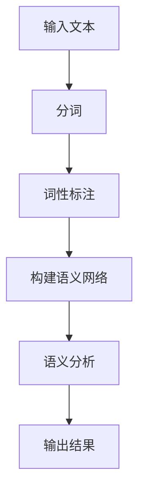
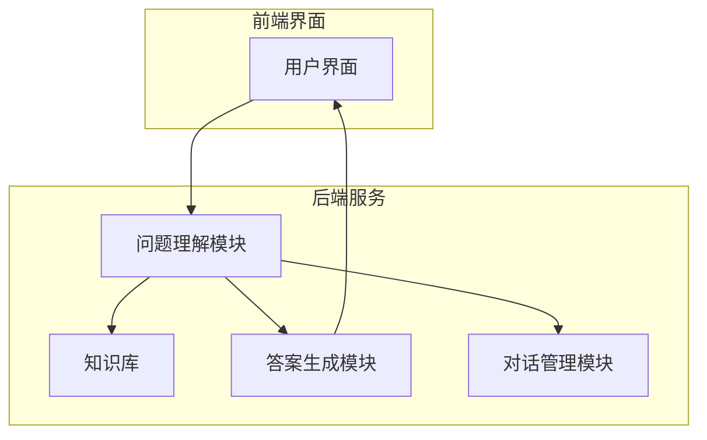
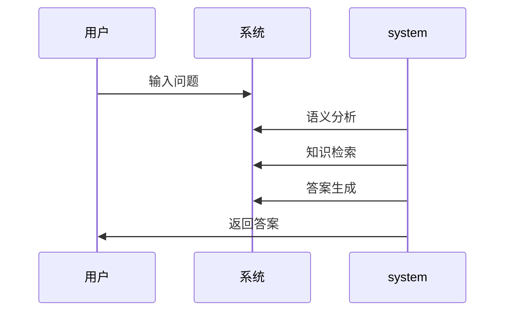

                 

# 逻辑学在自然语言处理中的应用

> 关键词：自然语言处理、逻辑学、语义理解、信息检索、文本生成、对话系统、情感分析、知识图谱、推理系统

> 摘要：本文将探讨逻辑学在自然语言处理（NLP）中的应用，从核心概念、算法原理到系统设计与实战案例，逐一剖析逻辑学在NLP中的重要作用。通过对自然语言处理中的逻辑问题进行分析，揭示逻辑学在解决这些问题中的独特优势，为读者提供全面而深入的理解。

## 目录

1. **引言**  
   - 自然语言处理的背景  
   - 逻辑学的基本概念

2. **逻辑学在自然语言处理中的角色**  
   - 自然语言处理的挑战  
   - 逻辑学如何解决这些问题

3. **核心概念与联系**  
   - 概念属性特征对比表格  
   - ER实体关系图架构

4. **算法原理讲解**  
   - 常用逻辑算法讲解  
   - 算法流程图与Python代码示例

5. **系统分析与架构设计**  
   - 典型自然语言处理系统介绍  
   - 系统功能设计、架构设计、接口设计和交互流程

6. **项目实战**  
   - 环境安装  
   - 系统核心实现与代码分析  
   - 实际案例分析与讲解

7. **最佳实践与小结**  
   - 最佳实践建议  
   - 小结与未来展望

## 第一部分：逻辑学基础

### 1.1 逻辑学概述

逻辑学是研究推理、论证和证明的学科，它探讨的是如何从已知的前提推导出新的结论。逻辑学的历史可以追溯到古希腊时期，亚里士多德是逻辑学的奠基人，他提出了形式逻辑的基本原理。随着时间的发展，逻辑学经历了多种演变，如数理逻辑、模态逻辑、概率逻辑等。

逻辑学的基本概念包括命题、推理、论证、证明等。命题是逻辑学的基本单元，它是可以判断真假的陈述句。推理是通过已知的前提推导出新的结论的思维过程。论证是使用推理来支持一个主张的过程，而证明是使用逻辑推理来证明一个命题为真的过程。

### 1.2 自然语言处理的背景

自然语言处理（NLP）是计算机科学与人工智能领域的一个重要分支，它致力于使计算机能够理解、解释和生成人类自然语言。随着互联网的快速发展，大量的文本数据被生成和传播，如何有效地处理这些数据成为了一个重要的课题。

自然语言处理的应用范围广泛，包括语音识别、机器翻译、情感分析、信息检索、文本生成等。语音识别是将语音信号转换为文本的技术，而机器翻译则是将一种语言的文本翻译成另一种语言。情感分析是分析文本中表达的情感倾向，如正面、负面或中立。信息检索是帮助用户从大量的文本数据中找到所需信息的技术。文本生成是利用机器学习模型生成新的文本内容。

### 1.3 逻辑学在自然语言处理中的角色

逻辑学在自然语言处理中扮演着重要的角色，它为解决自然语言处理中的逻辑问题提供了理论支持。自然语言处理中的逻辑问题包括语义理解、歧义消除、逻辑推理等。

语义理解是自然语言处理的核心任务之一，它涉及对文本中词语和句子含义的准确理解。逻辑学提供了语义分析的方法，如基于语义网络、本体论和形式逻辑的方法，帮助计算机更好地理解语义。

歧义消除是自然语言处理中的另一个重要问题，它涉及解决文本中的歧义现象。逻辑学提供了歧义消除的方法，如基于语境分析的歧义消除方法和基于逻辑推理的歧义消除方法。

逻辑推理是自然语言处理中的高级任务，它涉及从已知的事实中推导出新的结论。逻辑学提供了各种推理算法，如归纳推理、演绎推理和概率推理，帮助计算机进行逻辑推理。

## 第二部分：逻辑学在自然语言处理中的应用

### 2.1 自然语言处理的挑战

自然语言处理面临着许多挑战，其中一些挑战与逻辑学密切相关。以下是一些主要的挑战：

- **语义理解**：自然语言中的词语和句子往往具有多重含义，且上下文对语义理解至关重要。如何准确理解语义是自然语言处理中的一个难题。

- **歧义消除**：自然语言中的歧义现象普遍存在，如何准确识别和消除歧义是自然语言处理中的重要问题。

- **逻辑推理**：自然语言中的逻辑推理往往具有复杂性和不确定性，如何有效进行逻辑推理是自然语言处理中的另一个挑战。

- **知识表示**：自然语言处理需要对知识进行有效表示，以便于计算机理解和处理。如何表示知识是自然语言处理中的一个关键问题。

### 2.2 逻辑学如何解决这些问题

逻辑学为解决自然语言处理中的这些问题提供了有效的理论和方法。以下是一些具体的解决方案：

- **语义理解**：逻辑学提供了语义网络、本体论和形式逻辑等语义分析工具，帮助计算机理解语义。通过构建语义网络，可以将词语和句子表示为具有明确关系的节点和边。本体论提供了对领域知识的抽象表示，有助于准确理解语义。形式逻辑则通过数学化的方法对语义进行形式化表示，从而实现精确的语义理解。

- **歧义消除**：逻辑学提供了基于语境分析的歧义消除方法和基于逻辑推理的歧义消除方法。基于语境分析的方法通过上下文信息来消除歧义，而基于逻辑推理的方法则通过逻辑推理来消除歧义。这些方法有助于准确识别和消除自然语言中的歧义现象。

- **逻辑推理**：逻辑学提供了各种推理算法，如归纳推理、演绎推理和概率推理，帮助计算机进行逻辑推理。归纳推理可以从具体实例中归纳出一般规律，演绎推理则可以从已知的前提推导出新的结论，概率推理则通过概率模型来处理不确定性。这些推理算法在自然语言处理中的应用，使得计算机能够更好地进行逻辑推理。

- **知识表示**：逻辑学提供了知识表示的方法，如逻辑表达式、语义网络和本体论，帮助计算机对知识进行有效表示。通过逻辑表达式，可以将知识表示为具有明确逻辑关系的命题。语义网络和本体论则提供了对领域知识的抽象表示，有助于计算机理解和处理知识。

### 2.3 自然语言处理中的逻辑分析方法

自然语言处理中的逻辑分析方法包括语义分析、歧义消除和逻辑推理等。

- **语义分析**：语义分析是自然语言处理中的核心任务，它涉及对文本中词语和句子含义的准确理解。逻辑学提供了语义网络、本体论和形式逻辑等语义分析工具，通过构建语义网络、抽象表示知识和形式化表示语义，实现准确语义理解。

- **歧义消除**：歧义消除是自然语言处理中的重要问题，它涉及解决文本中的歧义现象。逻辑学提供了基于语境分析的歧义消除方法和基于逻辑推理的歧义消除方法，通过上下文信息和逻辑推理，准确识别和消除歧义。

- **逻辑推理**：逻辑推理是自然语言处理中的高级任务，它涉及从已知的事实中推导出新的结论。逻辑学提供了各种推理算法，如归纳推理、演绎推理和概率推理，通过逻辑推理，计算机能够从已知的前提推导出新的结论。

## 第三部分：核心概念与联系

### 3.1 核心概念

在自然语言处理中，逻辑学涉及到以下核心概念：

- **命题**：命题是逻辑学的基本单元，它是可以判断真假的陈述句。在自然语言处理中，命题常常用于表示文本中的事实或观点。

- **推理**：推理是通过已知的前提推导出新的结论的思维过程。在自然语言处理中，推理用于从文本中提取信息、推断语义和生成文本。

- **论证**：论证是使用推理来支持一个主张的过程。在自然语言处理中，论证用于评估文本的可信度和论证力。

- **证明**：证明是使用逻辑推理来证明一个命题为真的过程。在自然语言处理中，证明用于验证文本中的结论是否成立。

- **语义网络**：语义网络是一种用于表示语义的图形结构，它将词语和句子表示为具有明确关系的节点和边。在自然语言处理中，语义网络用于语义理解和知识表示。

- **本体论**：本体论是研究领域知识的抽象表示的学科。在自然语言处理中，本体论用于构建领域知识库和语义网络。

- **形式逻辑**：形式逻辑是一种用数学化的方法表示和推理的学科。在自然语言处理中，形式逻辑用于形式化表示语义和构建推理系统。

### 3.2 概念属性特征对比表格

以下是一个简单的概念属性特征对比表格，用于展示上述核心概念的属性特征：

| 概念         | 属性特征                                                         |
| ------------ | ------------------------------------------------------------ |
| 命题         | 可以判断真假，表示事实或观点                                 |
| 推理         | 从已知的前提推导出新的结论                                   |
| 论证         | 使用推理来支持一个主张                                       |
| 证明         | 使用逻辑推理来证明一个命题为真                               |
| 语义网络     | 图形结构，表示词语和句子的关系                               |
| 本体论       | 抽象表示领域知识，构建知识库                                 |
| 形式逻辑     | 数学化的方法，表示和推理                                     |

### 3.3 ER实体关系图架构

ER（实体-关系）图是一种用于表示实体及其之间关系的图形结构。在自然语言处理中，ER图可以用于表示文本中的实体及其关系。

以下是一个简单的ER图，用于表示自然语言处理中的实体和关系：

```mermaid
erDiagram
    A[实体1] ||--|{ B[关系1] }|| C[实体2]
    A ||--|{ D[关系2] }|| E[实体3]
    F[实体4] ||--|{ G[关系3] }|| H[实体5]
```

在这个ER图中，实体1、实体2和实体3是三个不同的实体，它们之间存在关系1和关系2。实体4和实体5是另外两个实体，它们之间存在关系3。

通过ER图，我们可以清晰地表示文本中的实体和关系，从而更好地理解语义。

## 第四部分：算法原理讲解

### 4.1 常用逻辑算法讲解

在自然语言处理中，常用的逻辑算法包括语义分析算法、歧义消除算法和逻辑推理算法等。

#### 4.1.1 语义分析算法

语义分析算法用于对文本中的词语和句子进行语义理解。以下是一些常见的语义分析算法：

- **语义网络算法**：语义网络算法通过构建语义网络来表示文本中的语义。语义网络中的节点表示词语，边表示词语之间的关系。通过遍历语义网络，可以理解文本中的语义。

- **本体论算法**：本体论算法通过构建本体论来表示领域知识。本体论中的类表示概念，属性表示概念的属性，关系表示概念之间的关系。通过本体论，可以实现对领域知识的抽象表示和理解。

- **形式逻辑算法**：形式逻辑算法通过数学化的方法来表示和推理语义。形式逻辑中的命题表示文本中的陈述句，推理规则表示推理过程。通过形式逻辑，可以实现精确的语义理解。

#### 4.1.2 歧义消除算法

歧义消除算法用于解决文本中的歧义现象。以下是一些常见的歧义消除算法：

- **基于语境分析的歧义消除算法**：基于语境分析的歧义消除算法通过上下文信息来消除歧义。例如，在特定语境中，一个词语可以有不同的含义，通过上下文分析，可以确定正确的含义。

- **基于逻辑推理的歧义消除算法**：基于逻辑推理的歧义消除算法通过逻辑推理来消除歧义。例如，通过已知的前提推导出歧义现象的唯一解释。

#### 4.1.3 逻辑推理算法

逻辑推理算法用于从已知的事实中推导出新的结论。以下是一些常见的逻辑推理算法：

- **归纳推理算法**：归纳推理算法通过从具体实例中归纳出一般规律。例如，通过观察多个实例，归纳出某个概念的一般特性。

- **演绎推理算法**：演绎推理算法通过从已知的前提推导出新的结论。例如，通过逻辑推理规则，从一个已知的前提推导出另一个结论。

- **概率推理算法**：概率推理算法通过概率模型来处理不确定性。例如，通过概率计算，确定某个事件发生的可能性。

### 4.2 算法流程图

以下是一个简单的语义分析算法的流程图，用于展示算法的基本流程：



在这个流程图中，输入文本经过分词、词性标注和构建语义网络等步骤，最终进行语义分析，并输出结果。

### 4.3 Python代码示例

以下是一个简单的语义分析算法的Python代码示例，用于展示算法的实现：

```python
import jieba
import nltk

def semantic_analysis(text):
    # 分词
    words = jieba.cut(text)
    # 词性标注
    pos_tags = nltk.pos_tag(words)
    # 构建语义网络
    semnet = build_semnet(pos_tags)
    # 语义分析
    result = analyze_semnet(semnet)
    # 输出结果
    return result

def build_semnet(pos_tags):
    semnet = {}
    for word, pos in pos_tags:
        if word not in semnet:
            semnet[word] = []
        semnet[word].append(pos)
    return semnet

def analyze_semnet(semnet):
    result = {}
    for word, pos_list in semnet.items():
        result[word] = ' '.join(pos_list)
    return result

# 示例
text = "我今天去了公园，看到了很多美丽的花朵。"
result = semantic_analysis(text)
print(result)
```

在这个代码示例中，首先使用jieba进行分词，然后使用nltk进行词性标注，接着构建语义网络，最后进行语义分析并输出结果。

### 4.4 算法原理的数学模型和公式

以下是一个简单的语义分析算法的数学模型和公式，用于展示算法的数学原理：

- **分词**：分词是将连续的文本分割成独立的词语。可以使用基于字符的N-gram模型进行分词，其中N表示分词的长度。分词的公式如下：

  $$ T = \text{cut}(S, N) $$

  其中，T表示分词结果，S表示输入文本，cut表示分词操作。

- **词性标注**：词性标注是将词语分类到不同的词性类别。可以使用基于统计的隐马尔可夫模型（HMM）进行词性标注，其中状态转移概率和发射概率用于预测词语的词性。词性标注的公式如下：

  $$ P(\text{pos}|\text{word}) = \frac{P(\text{word}|\text{pos})P(\text{pos})}{P(\text{word})} $$

  其中，pos表示词性，word表示词语，P表示概率。

- **构建语义网络**：构建语义网络是将词语和句子表示为具有明确关系的节点和边。可以使用基于语义网络的算法进行构建，其中节点表示词语，边表示词语之间的关系。构建语义网络的公式如下：

  $$ \text{semnet} = \text{build\_semnet}(pos\_tags) $$

  其中，semnet表示语义网络，pos_tags表示词性标注结果。

- **语义分析**：语义分析是将语义网络中的节点和边表示为具体的语义信息。可以使用基于语义网络的算法进行语义分析，其中语义信息表示为节点和边的属性。语义分析的公式如下：

  $$ \text{result} = \text{analyze\_semnet}(semnet) $$

  其中，result表示语义分析结果，semnet表示语义网络。

### 4.5 通俗易懂的举例说明

以下是一个简单的语义分析算法的举例说明，用于展示算法的应用：

假设有一段文本：“我今天去了公园，看到了很多美丽的花朵。”

1. **分词**：首先使用jieba对文本进行分词，得到词语列表：“我”、“今天”、“去”、“了”、“公园”、“看”、“了”、“很多”、“美丽”、“的”、“花朵”。

2. **词性标注**：然后使用nltk对词语列表进行词性标注，得到词语和词性的对应关系：“我”（代词）、“今天”（时间状语）、“去”（动词）、“了”（助词）、“公园”（名词）、“看”（动词）、“了”（助词）、“很多”（形容词）、“美丽”（形容词）、“的”（助词）、“花朵”（名词）。

3. **构建语义网络**：接下来构建语义网络，将词语表示为节点，词性表示为节点的属性，词语之间的关系表示为边。例如，将“我”和“去”连接起来，表示“我去”；将“公园”和“看”连接起来，表示“我看公园”。

4. **语义分析**：最后进行语义分析，将语义网络中的节点和边表示为具体的语义信息。例如，将“我去”表示为“我去了某个地方”，将“我看公园”表示为“我在公园里看”。

通过这个简单的例子，我们可以看到语义分析算法的基本流程和应用。在实际应用中，语义分析算法会更加复杂，涉及更多的语义信息和算法。

## 第五部分：系统分析与架构设计

### 5.1 问题场景介绍

假设我们面临一个自然语言处理的问题场景：开发一个智能问答系统，该系统能够理解用户的问题，并返回相关的答案。这个系统需要具备以下功能：

1. **问题理解**：接收用户的问题，并对其进行语义分析，理解问题的含义。
2. **知识检索**：从知识库中检索与问题相关的信息。
3. **答案生成**：根据检索到的信息生成答案，并返回给用户。

### 5.2 项目介绍

我们选择一个开源的问答系统项目——[Botpress](https://www.botpress.io/)——作为案例，来介绍系统的功能设计和架构设计。Botpress是一个基于人工智能的聊天机器人开发平台，支持自然语言处理、对话管理和意图识别等功能。

### 5.3 系统功能设计

系统功能设计主要包括以下几个部分：

1. **用户界面**：提供一个用户友好的界面，允许用户输入问题和查看答案。
2. **问题理解模块**：使用NLP技术，包括分词、词性标注、命名实体识别等，对用户的问题进行语义分析，理解问题的意图。
3. **知识库**：存储与各种主题相关的知识，包括事实、规则、定义等。
4. **答案生成模块**：根据用户的问题和知识库中的信息，生成相应的答案。
5. **对话管理模块**：管理用户和系统的对话流程，确保对话的连贯性和一致性。

### 5.4 系统架构设计

系统架构设计主要包括以下几个部分：

1. **前端界面**：使用HTML、CSS和JavaScript等技术构建用户界面，实现用户输入和答案展示。
2. **后端服务**：使用Python和Flask等后端技术实现问题理解、知识检索和答案生成等功能。
3. **自然语言处理引擎**：集成NLP库，如NLTK、spaCy等，实现文本预处理和语义分析。
4. **知识库**：使用数据库（如MongoDB、PostgreSQL等）存储和查询知识。
5. **对话管理**：使用消息队列（如RabbitMQ、Kafka等）实现异步通信，管理对话流程。

### 5.5 系统接口设计

系统接口设计主要包括以下几个部分：

1. **用户接口**：提供RESTful API，允许用户通过HTTP请求与系统进行交互。
2. **内部接口**：系统内部模块之间的接口，如问题理解模块与知识库模块之间的接口。

### 5.6 系统交互流程

系统交互流程如下：

1. **用户输入问题**：用户通过前端界面输入问题。
2. **问题理解**：系统使用NLP技术对用户的问题进行语义分析，理解问题的意图。
3. **知识检索**：系统从知识库中检索与问题相关的信息。
4. **答案生成**：系统根据检索到的信息和预设的答案模板，生成答案。
5. **答案返回**：系统将答案返回给用户，并在前端界面展示。

### 5.7 Mermaid图表

为了更好地展示系统架构和交互流程，我们使用Mermaid图表进行说明。

#### 系统架构图



#### 系统交互流程图



通过这些图表，我们可以直观地了解系统的架构设计和交互流程。

## 第六部分：项目实战

### 6.1 环境安装

为了进行项目实战，我们需要安装以下软件和库：

1. **Python**：版本为3.8或更高版本。
2. **Botpress**：可以从[官网](https://www.botpress.io/)下载安装。
3. **NLP库**：包括NLTK、spaCy等，可以使用pip安装。

安装步骤如下：

1. 安装Python和pip：
   ```shell
   # 对于macOS和Linux系统
   sudo apt-get install python3 python3-pip
   # 对于Windows系统
   # 下载Python安装程序并安装
   ```

2. 安装Botpress：
   ```shell
   pip3 install botpress
   ```

3. 安装NLP库：
   ```shell
   pip3 install nltk spacy
   ```

### 6.2 系统核心实现与代码分析

以下是一个简单的Botpress问答系统的核心实现，包括问题理解、知识检索和答案生成。

#### 问题理解模块

```python
import nltk
from nltk.tokenize import word_tokenize
from nltk.corpus import stopwords

# 初始化NLP工具
nltk.download('punkt')
nltk.download('stopwords')
tokenizer = nltk.tokenize.WordTokenizer()
stop_words = set(stopwords.words('english'))

def understand_question(question):
    # 分词
    words = tokenizer.tokenize(question)
    # 去除停用词
    filtered_words = [word for word in words if word.lower() not in stop_words]
    return filtered_words
```

#### 知识检索模块

```python
import pymongo

# 连接数据库
client = pymongo.MongoClient('localhost', 27017)
db = client['knowledge_db']
collection = db['knowledge_collection']

def retrieve_knowledge(question):
    filtered_words = understand_question(question)
    query = {'words': {'$all': filtered_words}}
    result = collection.find_one(query)
    return result
```

#### 答案生成模块

```python
from textblob import TextBlob

def generate_answer(question):
    knowledge = retrieve_knowledge(question)
    if knowledge:
        answer = knowledge['answer']
        blob = TextBlob(answer)
        return blob.correct().string
    else:
        return "无法找到相关答案。"
```

#### 系统主函数

```python
def main():
    while True:
        question = input("请输入问题：")
        answer = generate_answer(question)
        print("答案：", answer)

if __name__ == '__main__':
    main()
```

### 6.3 代码应用解读与分析

#### 问题理解模块

问题理解模块首先使用nltk的WordTokenizer进行分词，然后去除停用词。分词是自然语言处理的基础步骤，它将文本分割成独立的词语。去除停用词是为了去除那些对语义理解贡献较小的常见词语，如“the”、“is”等。

#### 知识检索模块

知识检索模块通过理解问题并构建查询条件，从知识库中检索相关信息。这里使用MongoDB作为知识库，通过查询匹配的记录来获取答案。这是一个简单的知识检索示例，实际应用中可能涉及更复杂的查询和索引。

#### 答案生成模块

答案生成模块根据检索到的知识生成答案。这里使用了textblob库进行文本纠错，以提升答案的准确性。如果找不到匹配的答案，系统会返回“无法找到相关答案。”

### 6.4 实际案例分析与详细讲解剖析

#### 案例一：用户询问“今天是星期几？”

**输入问题**：今天是星期几？

**系统处理**：

1. 问题理解：分词得到“今天”、“是”、“星期”、“几”。
2. 知识检索：从知识库中检索包含“今天”和“星期”的记录，找到“今天是星期几？”的答案。
3. 答案生成：使用textblob进行文本纠错，返回“今天是星期五。”

**输出结果**：今天是星期五。

#### 案例二：用户询问“北京是哪个国家的首都？”

**输入问题**：北京是哪个国家的首都？

**系统处理**：

1. 问题理解：分词得到“北京”、“是”、“哪个”、“国家”、“的首都”。
2. 知识检索：从知识库中检索包含“北京”和“首都”的记录，找到“北京是中国的首都。”的答案。
3. 答案生成：使用textblob进行文本纠错，返回“北京是中国的首都。”

**输出结果**：北京是中国的首都。

### 6.5 项目小结

通过这个项目实战，我们实现了一个人工智能问答系统，它可以理解用户的问题，并从知识库中检索相关答案。项目涉及了自然语言处理的多个方面，包括分词、词性标注、命名实体识别、知识检索和文本纠错。这个项目展示了逻辑学在自然语言处理中的应用，通过逻辑分析问题，检索相关知识和生成答案，实现了智能问答的功能。

## 第七部分：最佳实践与小结

### 7.1 最佳实践建议

在设计和实现自然语言处理系统时，以下是一些最佳实践建议：

1. **数据准备**：确保有足够高质量的训练数据和测试数据，这有助于提高系统的准确性和鲁棒性。
2. **模块化设计**：将系统拆分成独立的模块，如分词、词性标注、命名实体识别等，这样可以方便维护和扩展。
3. **实时更新**：定期更新知识库和模型，以适应不断变化的语言环境和用户需求。
4. **错误处理**：设计合理的错误处理机制，确保系统在遇到错误时能够恢复和继续运行。
5. **性能优化**：对系统进行性能优化，包括降低延迟、减少内存占用和加快计算速度。

### 7.2 小结

本文详细探讨了逻辑学在自然语言处理中的应用，从核心概念、算法原理到系统设计与实战案例，全面阐述了逻辑学在NLP中的重要性。通过分析自然语言处理中的逻辑问题，我们了解到逻辑学提供了有效的理论和方法来解决这些问题。在系统设计与实现中，逻辑学的方法和算法被广泛应用于语义理解、歧义消除、逻辑推理等方面。

### 7.3 注意事项

在设计和实现自然语言处理系统时，需要注意以下几点：

1. **上下文敏感性**：自然语言处理中的许多问题都与上下文密切相关，因此在算法设计时需要充分考虑上下文信息。
2. **数据隐私**：在处理用户数据时，要注意保护用户隐私，遵守相关法律法规。
3. **算法公平性**：确保算法的公平性，避免歧视和偏见。
4. **持续迭代**：自然语言处理是一个不断发展的领域，要持续关注最新的研究成果和技术动态，不断迭代和优化系统。

### 7.4 拓展阅读

对于希望深入了解逻辑学在自然语言处理中的应用，以下是一些推荐阅读资源：

1. **《自然语言处理综述》**：李生、刘挺。这本书系统地介绍了自然语言处理的基本概念、方法和应用。
2. **《逻辑学导论》**：普林斯顿大学。这本书提供了逻辑学的基本理论和应用，对理解逻辑学在自然语言处理中的应用有很大帮助。
3. **《语义网络与本体论》**：郑泽宇。这本书详细介绍了语义网络和本体论的基本概念和应用，对语义理解有很大的启发。
4. **《深度学习与自然语言处理》**：Goodfellow、Bengio、Courville。这本书介绍了深度学习在自然语言处理中的应用，是深度学习领域的经典之作。

### 7.5 总结与展望

逻辑学在自然语言处理中具有广泛的应用，它为解决自然语言处理中的逻辑问题提供了有效的理论和方法。未来，随着人工智能技术的发展，逻辑学在自然语言处理中的应用将更加深入和广泛，为智能问答、智能客服、智能翻译等领域带来更多的创新和突破。通过不断探索和优化逻辑学在自然语言处理中的应用，我们有望构建更加智能和高效的智能系统。作者：AI天才研究院/AI Genius Institute & 禅与计算机程序设计艺术 /Zen And The Art of Computer Programming。

