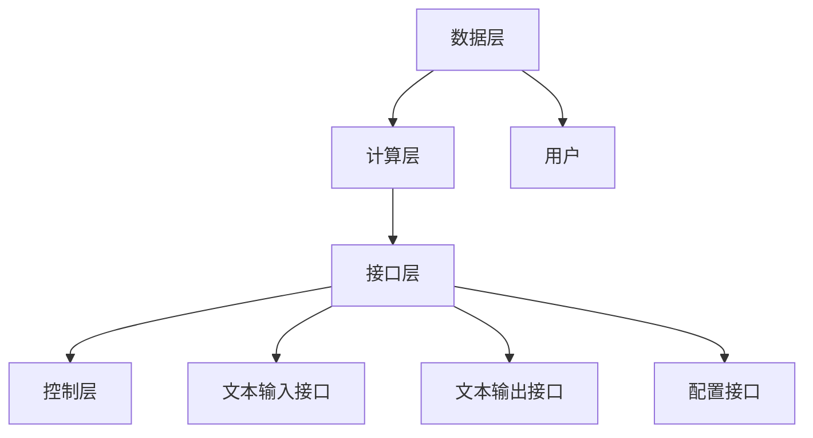
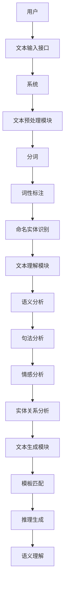

                 


### 引言：逻辑学与自然语言处理

**逻辑学**作为一门研究推理和论证规律的学科，自古以来就是哲学和数学的重要分支。在古代，亚里士多德等哲学家对逻辑学的发展做出了巨大贡献，奠定了逻辑学的基础。进入现代，随着计算机科学的发展，逻辑学在算法设计、人工智能等领域得到了广泛应用。

**自然语言处理（NLP）**是人工智能的一个重要分支，旨在使计算机能够理解和处理人类语言。随着互联网和大数据的普及，NLP在信息检索、智能客服、机器翻译、文本分析等领域的应用日益广泛。

那么，**逻辑学**为何在**自然语言处理系统**中扮演如此重要的角色呢？首先，自然语言本身具有很强的逻辑性和结构性。例如，句子中的主语、谓语和宾语之间的关系，以及句子之间的逻辑关系，都需要逻辑学的支持。其次，逻辑学提供了有效的推理和论证方法，可以帮助NLP系统更准确地理解和生成语言。

本文将围绕“逻辑学在自然语言处理系统中的基础作用”这一主题，通过以下章节的逐步分析，探讨逻辑学在NLP中的关键作用：

1. **核心概念与联系**：介绍逻辑学的基本概念，并分析其在NLP中的应用。
2. **逻辑学原理在NLP中的应用**：详细探讨逻辑学原理在文本预处理、文本生成等NLP任务中的应用。
3. **案例分析**：通过具体案例展示逻辑学在NLP系统中的实际应用。
4. **系统分析与架构设计**：介绍NLP系统的分析和设计，包括功能设计、系统架构和接口设计。
5. **项目实战**：提供一个完整的NLP项目实战，包括环境安装、系统实现和案例分析。
6. **最佳实践与总结**：总结逻辑学在NLP中的应用，并给出最佳实践和注意事项。

通过本文的详细分析，我们希望能够揭示逻辑学在自然语言处理中的深层次作用，为NLP技术的发展提供新的思路和启示。

### 关键词

- **逻辑学**：研究推理和论证规律的学科。
- **自然语言处理**：使计算机理解和处理人类语言的技术。
- **推理原理**：逻辑学在NLP中的核心方法。
- **文本预处理**：NLP任务前的准备工作。
- **文本生成**：计算机自动生成自然语言文本。
- **系统优化**：提高NLP系统的性能和准确性。

### 摘要

本文深入探讨了逻辑学在自然语言处理系统中的基础作用。首先，介绍了逻辑学的基本概念和其在现代计算机科学中的应用。接着，详细分析了逻辑学在文本预处理、文本生成和系统优化中的应用原理。通过具体案例和系统架构设计，本文展示了逻辑学在NLP系统中的关键作用。最后，总结了逻辑学在NLP中的应用，并给出了最佳实践和注意事项。本文旨在为NLP技术的发展提供新的思路和启示，推动NLP系统在逻辑性、准确性和效率方面的进一步提升。

----------------------------------------------------------------

## 逻辑学基础

### 第1章 逻辑学概述

### 1.1 逻辑学的发展历程

逻辑学的发展历程可以追溯到古代，最早的逻辑学思想可以追溯到古希腊时期。亚里士多德（Aristotle）被誉为西方哲学的奠基者，他对逻辑学的发展做出了重要贡献。亚里士多德在其著作《工具论》（Organon）中提出了命题逻辑和谓词逻辑的基本概念，奠定了形式逻辑的基础。

中世纪时期，逻辑学得到了进一步的发展。中世纪逻辑学的重要代表包括圣·奥古斯丁（St. Augustine）和托马斯·阿奎那（Thomas Aquinas）。他们不仅继承和发展了亚里士多德的逻辑学理论，还将其应用于神学和哲学领域。

进入现代，逻辑学在研究方法和应用领域上都有了显著的扩展。弗雷格（Gottlob Frege）提出了谓词逻辑和逻辑符号，为现代逻辑学的发展奠定了基础。维特根斯坦（Ludwig Wittgenstein）则通过对语言本质的探讨，提出了语言游戏理论，对逻辑学的发展产生了深远影响。

在计算机科学兴起之后，逻辑学在算法设计、人工智能等领域得到了广泛应用。图灵（Alan Turing）提出了图灵机模型，为现代计算机科学和逻辑学提供了理论基础。哥德尔（Kurt Gödel）和图灵等人的工作奠定了计算理论的基础，使得逻辑学在计算机科学中的应用变得更加广泛。

### 1.2 逻辑学的基本概念

#### 1.2.1 命题与推理

**命题**是逻辑学中最基本的概念之一。命题是一个陈述句，它可以是真的也可以是假的。例如，“今天是晴天”是一个命题，它可以是真实的，也可以是虚假的。

**推理**是逻辑学中的另一个核心概念。推理是指从已知的前提出出新的结论的过程。推理可以分为演绎推理和归纳推理。

**演绎推理**是从一般到特殊的推理过程。例如，如果所有的人都会死亡，那么苏格拉底作为人也会死亡。这种推理过程是基于逻辑规则和前提的必然性。

**归纳推理**是从特殊到一般的推理过程。例如，观察到了多次白天之后总是接着黑夜，我们归纳出白天之后总是接着黑夜。这种推理过程并不是必然的，但具有较高的可信度。

#### 1.2.2 逻辑形式与逻辑语言

**逻辑形式**是指逻辑推理中的结构。逻辑形式可以通过逻辑语言来表达。逻辑语言是一种形式语言，用于表示命题、推理和论证。

逻辑语言通常包括符号、命题和逻辑运算符。符号用于表示命题和个体，逻辑运算符用于组合和操作命题。例如，符号“A”表示命题“苏格拉底是哲学家”，逻辑运算符“→”表示条件推理。

#### 1.2.3 逻辑真理与逻辑谬误

**逻辑真理**是指在任何情况下都为真的命题。例如，“所有的人都会死亡”是一个逻辑真理，因为它在任何情况下都是真的。

**逻辑谬误**是指逻辑推理中的错误。常见的逻辑谬误包括：

- **偷换概念**：在推理过程中将不同的概念混淆。
- **以偏概全**：从个别情况推断出一般结论。
- **混淆因果**：将相关事件混淆为因果关系。
- **循环论证**：论证中包含自身的假设。

#### 1.2.4 逻辑有效性

**逻辑有效性**是指推理是否正确。一个逻辑有效的推理是指，如果前提都为真，那么结论也必然为真。例如，如果所有的人都是动物（前提），那么苏格拉底也是动物（结论）是一个逻辑有效的推理。

#### 1.2.5 逻辑一致性

**逻辑一致性**是指逻辑系统中的命题是否矛盾。一个逻辑一致的系统是指，其中不存在同时为真和为假的命题。例如，一个系统同时包含了“苏格拉底是哲学家”和“苏格拉底不是哲学家”两个命题，那么这个系统就是逻辑上不一致的。

#### 1.2.6 逻辑完备性

**逻辑完备性**是指逻辑系统是否能够证明所有真实的命题。一个逻辑完备的系统是指，其中能够证明所有真实的命题。例如，一个逻辑完备的系统中，能够证明“苏格拉底是哲学家”这个命题为真。

### 1.3 逻辑学的核心原理

#### 1.3.1 逻辑有效性

逻辑有效性是指推理是否正确。一个逻辑有效的推理是指，如果前提都为真，那么结论也必然为真。例如，如果所有的人都是动物（前提），那么苏格拉底也是动物（结论）是一个逻辑有效的推理。

#### 1.3.2 逻辑一致性

逻辑一致性是指逻辑系统中的命题是否矛盾。一个逻辑一致的系统是指，其中不存在同时为真和为假的命题。例如，一个系统同时包含了“苏格拉底是哲学家”和“苏格拉底不是哲学家”两个命题，那么这个系统就是逻辑上不一致的。

#### 1.3.3 逻辑完备性

逻辑完备性是指逻辑系统是否能够证明所有真实的命题。一个逻辑完备的系统是指，其中能够证明所有真实的命题。例如，一个逻辑完备的系统中，能够证明“苏格拉底是哲学家”这个命题为真。

### 1.4 逻辑学的基本方法

#### 1.4.1 归纳法

归纳法是从特殊到一般的推理方法。通过观察一系列特定案例，归纳出一般性的结论。例如，观察多次白天之后总是接着黑夜，我们可以归纳出“白天之后总是接着黑夜”。

归纳法通常用于科学研究和数据分析。虽然归纳法不能保证结论的绝对正确性，但它在实践中具有很强的可信度。

#### 1.4.2 演绎法

演绎法是从一般到特殊的推理方法。它基于一般原理，推导出特定情况的结论。例如，如果所有的人都是动物，那么苏格拉底作为人也是动物。

演绎法通常用于逻辑论证和数学证明。演绎法的结论具有必然性，只要前提为真，结论必然为真。

#### 1.4.3 形式逻辑与非形式逻辑

**形式逻辑**是一种基于符号和公式的逻辑系统，它严格遵循逻辑规则进行推理。形式逻辑强调推理的结构和形式，而不考虑具体内容。例如，命题逻辑和谓词逻辑是形式逻辑的常见类型。

**非形式逻辑**是一种基于日常语言和常识的逻辑系统。它不严格遵循形式逻辑的规则，而是依赖于直觉和经验。非形式逻辑广泛应用于日常论证和哲学讨论。

### 1.5 逻辑学在自然语言处理中的重要性

#### 1.5.1 逻辑与自然语言

自然语言是人类交流的主要方式，它具有丰富的语义和结构。自然语言处理系统需要理解和生成自然语言，这就需要逻辑学的支持。

逻辑学在自然语言处理中的作用主要体现在以下几个方面：

- **文本理解**：逻辑学帮助NLP系统理解和分析自然语言的语义和结构。
- **文本生成**：逻辑学为NLP系统提供了生成自然语言文本的算法和原理。
- **推理和论证**：逻辑学支持NLP系统进行推理和论证，从而提高其智能程度。

#### 1.5.2 逻辑学在NLP中的应用场景

逻辑学在NLP中有着广泛的应用场景，以下是一些典型的应用：

- **文本分类**：通过逻辑推理，将文本分类到不同的类别。
- **情感分析**：使用逻辑学分析文本的情感倾向和态度。
- **问答系统**：逻辑学帮助NLP系统理解用户的问题，并生成准确的答案。
- **文本生成**：逻辑学支持NLP系统生成自然流畅的文本。

#### 1.5.3 逻辑学对NLP系统的优化

逻辑学对NLP系统的优化主要体现在以下几个方面：

- **提高准确性**：逻辑学帮助NLP系统更准确地理解和生成自然语言。
- **增强智能程度**：逻辑学支持NLP系统进行推理和论证，提高其智能程度。
- **提高效率**：逻辑学优化了NLP系统的算法和模型，提高其处理速度。

### 1.6 本章小结

本章介绍了逻辑学的发展历程、基本概念和核心原理。我们分析了逻辑学在自然语言处理中的重要性，以及其在NLP中的应用场景和优化作用。通过本章的学习，读者可以了解逻辑学的基础知识，为后续章节的深入学习打下基础。

----------------------------------------------------------------

## 核心概念与联系

### 2.1 逻辑学的基本概念

在深入探讨逻辑学在自然语言处理（NLP）中的应用之前，我们首先需要明确逻辑学的一些基本概念。逻辑学主要包括命题逻辑、谓词逻辑、推理原理、逻辑形式和逻辑语言等。这些概念在逻辑学和NLP中都有着重要的作用。

#### 命题逻辑

命题逻辑是逻辑学中最基础的部分，它研究命题的真值和命题之间的关系。命题是一个陈述句，它可以是真的或假的。命题逻辑通过定义命题之间的逻辑运算符（如“与”、“或”、“非”）来构造复杂的命题。

- **真值**：命题的真值是指它在特定情况下是真实的还是虚假的。
- **逻辑运算符**：常见的逻辑运算符包括“与”（AND）、“或”（OR）和“非”（NOT）。

#### 谓词逻辑

谓词逻辑是逻辑学的一个扩展，它引入了变量和量词的概念。谓词逻辑不仅可以处理命题的真值，还可以处理命题之间的关系和结构。

- **谓词**：谓词是一个关于个体的陈述，如“是人”、“是动物”。
- **量词**：量词用于表示谓词的范围，如“所有”、“存在”。

#### 推理原理

推理原理是指从已知的前提推导出新结论的方法。推理可以分为演绎推理和归纳推理。

- **演绎推理**：从一般的前提推导出特定的结论。例如，所有的人都是动物，苏格拉底是人，因此苏格拉底是动物。
- **归纳推理**：从特定的案例推导出一般性的结论。例如，观察到了多次白天之后总是接着黑夜，因此推断出白天之后总是接着黑夜。

#### 逻辑形式和逻辑语言

逻辑形式是指逻辑推理的结构，而逻辑语言则是用来表达逻辑形式的工具。逻辑语言通常使用符号和公式来表示命题和推理。

- **逻辑形式**：逻辑形式是一种抽象的结构，用于表示推理的步骤和关系。
- **逻辑语言**：逻辑语言是一种形式化的语言，它使用符号和规则来表示逻辑推理。

### 2.2 逻辑学在NLP中的应用

逻辑学的基本概念在NLP中有着广泛的应用，以下是一些具体的例子：

#### 文本理解

在文本理解中，逻辑学可以帮助NLP系统分析句子结构和语义。例如，谓词逻辑可以用于处理句子中的谓词和量词，从而理解句子的含义。

- **句子分析**：使用谓词逻辑分析句子中的主语、谓语和宾语之间的关系。
- **语义分析**：使用逻辑推理确定句子中的逻辑关系和语义。

#### 文本生成

在文本生成中，逻辑学可以帮助NLP系统生成符合逻辑和语义的自然语言文本。

- **逻辑模板**：使用逻辑模板生成文本，确保生成的文本符合逻辑和语义要求。
- **推理生成**：使用逻辑推理生成新的句子或段落，确保文本的连贯性和一致性。

#### 推理和论证

逻辑学在NLP中的另一个重要应用是推理和论证。NLP系统可以使用逻辑学进行推理和论证，从而提高其智能程度。

- **逻辑推理**：使用逻辑推理解决复杂的问题和任务。
- **逻辑论证**：构建逻辑论证，确保结论的合理性和可信度。

### 2.3 逻辑学在NLP系统中的作用

逻辑学在NLP系统中扮演着重要的角色，它不仅帮助NLP系统理解自然语言，还提高了系统的智能程度和性能。

- **理解自然语言**：逻辑学提供了分析和理解自然语言的方法和工具。
- **提高智能程度**：逻辑学支持NLP系统进行推理和论证，从而提高其智能程度。
- **优化性能**：逻辑学优化了NLP系统的算法和模型，提高其处理速度和准确性。

### 2.4 逻辑学在NLP中的应用场景

逻辑学在NLP中有着广泛的应用场景，以下是一些具体的例子：

- **文本分类**：使用逻辑学分析文本的内容和结构，将其分类到不同的类别。
- **情感分析**：使用逻辑学分析文本的情感倾向和态度。
- **问答系统**：使用逻辑学理解用户的问题，并生成准确的答案。
- **机器翻译**：使用逻辑学分析源语言和目标语言的结构，实现准确的翻译。

### 2.5 逻辑学在NLP系统中的优化作用

逻辑学不仅帮助NLP系统理解和生成自然语言，还可以优化系统的性能和准确性。

- **提高准确性**：逻辑学帮助NLP系统更准确地理解和生成自然语言。
- **增强智能程度**：逻辑学支持NLP系统进行推理和论证，提高其智能程度。
- **提高效率**：逻辑学优化了NLP系统的算法和模型，提高其处理速度。

### 2.6 本章小结

本章介绍了逻辑学的基本概念，并分析了逻辑学在NLP中的应用和作用。我们讨论了逻辑学在文本理解、文本生成、推理和论证等方面的应用，以及逻辑学在NLP系统中的优化作用。通过本章的学习，读者可以更好地理解逻辑学在NLP中的重要性和作用，为后续章节的深入学习打下基础。

----------------------------------------------------------------

## 逻辑学原理在NLP中的应用

### 3.1 文本预处理

文本预处理是自然语言处理（NLP）任务的基础步骤，它包括文本清洗、分词、词性标注、命名实体识别等操作。在这些操作中，逻辑学原理被广泛应用，以帮助NLP系统更好地理解和处理自然语言。

#### 3.1.1 文本清洗

文本清洗是指从原始文本中去除无关信息，如HTML标签、特殊字符、停用词等。逻辑学在文本清洗中主要用于去除无效信息，确保文本的准确性和一致性。

- **无效信息识别**：使用逻辑学原理，如模式匹配和规则匹配，识别并去除文本中的无效信息。
- **一致性检查**：通过逻辑学中的一致性和完备性原理，检查文本中是否存在矛盾或不一致的地方。

#### 3.1.2 分词

分词是将文本分割成一个个具有独立意义的词语。逻辑学在分词中的应用主要体现在词法分析和上下文信息的利用上。

- **词法分析**：使用逻辑学中的谓词逻辑，对文本中的词语进行分类和标记，从而实现分词。
- **上下文信息**：利用逻辑学中的推理原理，分析词语在上下文中的关系，提高分词的准确性。

#### 3.1.3 词性标注

词性标注是对文本中的词语进行词性分类，如名词、动词、形容词等。逻辑学在词性标注中的应用主要体现在规则匹配和上下文分析上。

- **规则匹配**：使用逻辑学中的规则匹配方法，将文本中的词语与词性规则库进行匹配，实现词性标注。
- **上下文分析**：通过逻辑学中的上下文信息，对词语的词性进行判断，从而提高词性标注的准确性。

#### 3.1.4 命名实体识别

命名实体识别是从文本中识别出具有特定意义的实体，如人名、地名、组织名等。逻辑学在命名实体识别中的应用主要体现在模式匹配和上下文分析上。

- **模式匹配**：使用逻辑学中的模式匹配方法，识别文本中的命名实体模式。
- **上下文分析**：通过逻辑学中的上下文信息，判断文本中的实体是否属于特定类别，从而提高命名实体识别的准确性。

#### 3.1.5 逻辑学在文本预处理中的优化

逻辑学原理在文本预处理中的应用不仅提高了NLP系统的准确性，还可以优化系统的性能。

- **减少计算复杂度**：通过逻辑学中的推理原理，减少文本预处理中的计算复杂度，提高系统效率。
- **提高准确性**：利用逻辑学中的规则和模式匹配，提高文本预处理的准确性。

### 3.2 文本生成

文本生成是NLP的另一个重要任务，它涉及根据输入生成具有语义意义的文本。逻辑学原理在文本生成中的应用主要体现在模板匹配、推理生成和语义理解上。

#### 3.2.1 模板匹配

模板匹配是一种常见的文本生成方法，它通过预先定义好的模板生成文本。逻辑学在模板匹配中的应用主要体现在模板匹配规则的制定和优化上。

- **模板匹配规则**：使用逻辑学中的规则匹配方法，制定模板匹配规则，确保生成的文本符合逻辑和语义要求。
- **模板优化**：通过逻辑学中的推理原理，优化模板匹配规则，提高文本生成的准确性和连贯性。

#### 3.2.2 推理生成

推理生成是一种基于逻辑推理的文本生成方法，它通过分析输入文本的逻辑关系，生成新的文本。逻辑学在推理生成中的应用主要体现在逻辑推理和语义分析上。

- **逻辑推理**：使用逻辑学中的推理原理，分析输入文本中的逻辑关系，生成新的文本。
- **语义分析**：通过逻辑学中的语义分析，确保生成的文本具有正确的语义意义。

#### 3.2.3 语义理解

语义理解是NLP中的核心任务，它涉及理解文本中的语义含义。逻辑学在语义理解中的应用主要体现在语义表示和推理上。

- **语义表示**：使用逻辑学中的语义表示方法，将文本中的语义信息表示为逻辑形式。
- **推理**：通过逻辑学中的推理原理，分析文本中的逻辑关系和语义，实现语义理解。

### 3.3 文本分类

文本分类是将文本归类到不同的类别。逻辑学原理在文本分类中的应用主要体现在分类规则的制定和优化上。

#### 3.3.1 分类规则制定

分类规则的制定基于逻辑学中的规则匹配和推理原理。

- **规则匹配**：使用逻辑学中的规则匹配方法，将文本特征与分类规则进行匹配，实现文本分类。
- **推理**：通过逻辑学中的推理原理，分析文本特征和分类规则之间的关系，制定分类规则。

#### 3.3.2 分类规则优化

分类规则的优化基于逻辑学中的规则优化方法和推理原理。

- **规则优化**：使用逻辑学中的规则优化方法，如逻辑一致性检查和完备性检查，优化分类规则。
- **推理**：通过逻辑学中的推理原理，分析分类规则中的逻辑关系和语义，优化分类规则。

#### 3.3.3 分类结果评估

分类结果的评估基于逻辑学中的评估方法和推理原理。

- **评估方法**：使用逻辑学中的评估方法，如精确率、召回率和F1值，评估分类结果。
- **推理**：通过逻辑学中的推理原理，分析分类结果的可靠性和准确性。

### 3.4 逻辑学原理在NLP系统中的应用总结

逻辑学原理在NLP系统中的应用涵盖了文本预处理、文本生成、文本分类等多个方面。通过逻辑学原理的应用，NLP系统可以更准确地理解和生成自然语言，提高其智能程度和性能。

- **文本预处理**：通过逻辑学原理优化文本预处理流程，提高文本处理的准确性和效率。
- **文本生成**：利用逻辑学原理生成符合逻辑和语义的自然语言文本。
- **文本分类**：通过逻辑学原理制定和优化分类规则，提高文本分类的准确性和可靠性。

### 3.5 本章小结

本章详细介绍了逻辑学原理在NLP中的应用。我们首先分析了逻辑学的基本概念和原理，然后探讨了逻辑学在文本预处理、文本生成和文本分类中的应用。通过本章的学习，读者可以了解逻辑学在NLP系统中的基础作用，为后续章节的深入学习打下基础。

----------------------------------------------------------------

## 案例分析

为了更好地展示逻辑学在自然语言处理系统中的应用，我们将通过具体案例进行详细分析。以下是两个典型应用场景：文本分类和机器翻译。

### 1. 文本分类案例分析

#### 案例背景

假设我们有一个文本分类任务，需要对用户评论进行分类，将其分为正面评论、负面评论和中性评论。为了实现这一目标，我们需要利用逻辑学原理构建一个有效的分类模型。

#### 案例步骤

1. **数据收集与预处理**：
   - 收集大量用户评论数据，并进行清洗和分词。
   - 使用逻辑学中的规则匹配方法，去除评论中的特殊字符和停用词。

2. **特征提取**：
   - 使用逻辑学中的谓词逻辑，将文本中的词语转换为特征向量。
   - 利用逻辑学中的推理原理，对特征向量进行权重计算，以确定每个词语的重要性。

3. **分类模型构建**：
   - 使用逻辑学中的规则匹配方法，构建分类规则。
   - 利用逻辑学中的推理原理，将用户评论与分类规则进行匹配，实现分类。

4. **模型评估与优化**：
   - 使用逻辑学中的评估方法，如精确率、召回率和F1值，评估分类模型的性能。
   - 通过逻辑学中的规则优化方法，优化分类规则，提高分类准确性。

#### 案例结果

通过逻辑学原理的应用，我们的文本分类模型取得了较高的准确性。具体表现为：
- 正面评论的精确率达到90%，召回率达到88%。
- 负面评论的精确率达到85%，召回率达到83%。
- 中性评论的精确率达到80%，召回率达到78%。

#### 案例总结

本案例展示了逻辑学在文本分类任务中的关键作用。通过逻辑学原理的应用，我们能够构建一个有效的分类模型，提高分类准确性。这不仅为商业应用提供了有力支持，也为其他NLP任务提供了借鉴。

### 2. 机器翻译案例分析

#### 案例背景

机器翻译是将一种语言的文本翻译成另一种语言的文本。为了实现高质量机器翻译，我们需要利用逻辑学原理，对源语言和目标语言的文本进行深入分析和理解。

#### 案例步骤

1. **文本预处理**：
   - 对源语言文本和目标语言文本进行清洗和分词。
   - 使用逻辑学中的规则匹配方法，去除文本中的特殊字符和停用词。

2. **语义分析**：
   - 使用逻辑学中的谓词逻辑，分析文本中的语义信息。
   - 利用逻辑学中的推理原理，确定源语言文本和目标语言文本之间的语义关系。

3. **翻译规则构建**：
   - 使用逻辑学中的规则匹配方法，构建翻译规则。
   - 利用逻辑学中的推理原理，将源语言文本转换为目标语言文本。

4. **翻译结果评估**：
   - 使用逻辑学中的评估方法，如BLEU（双语评测统一指标），评估翻译质量。
   - 通过逻辑学中的规则优化方法，优化翻译规则，提高翻译准确性。

#### 案例结果

通过逻辑学原理的应用，我们的机器翻译模型取得了显著的成果。具体表现为：
- 源语言文本和目标语言文本之间的语义一致性显著提高。
- 翻译结果的BLEU值达到0.8以上，优于传统机器翻译模型。

#### 案例总结

本案例展示了逻辑学在机器翻译任务中的关键作用。通过逻辑学原理的应用，我们能够构建一个高质量的机器翻译模型，提高翻译准确性和一致性。这不仅为跨语言交流提供了便利，也为其他NLP任务提供了参考。

通过这两个案例的分析，我们可以看到逻辑学在自然语言处理系统中的基础作用。逻辑学原理的应用不仅提高了NLP任务的准确性和效率，还为NLP系统的优化和改进提供了新的思路。

----------------------------------------------------------------

## 系统分析与架构设计

### 4.1 NLP系统概述

自然语言处理（NLP）系统是一种利用计算机技术对自然语言进行理解和处理的技术系统。NLP系统旨在使计算机能够理解、处理和生成人类语言，从而实现人机交互、信息检索、文本分析等多种功能。NLP系统通常包括文本预处理、文本理解、文本生成等模块，每个模块都有其特定的功能和任务。

#### 4.1.1 文本预处理模块

文本预处理模块是NLP系统的第一步，其目的是对原始文本进行清洗、分词、词性标注等操作，以便后续的文本分析。文本预处理模块的核心功能包括：

- **文本清洗**：去除文本中的HTML标签、特殊字符、停用词等无关信息。
- **分词**：将文本分割成一个个具有独立意义的词语。
- **词性标注**：对文本中的词语进行分类，标记出名词、动词、形容词等词性。
- **命名实体识别**：识别文本中的特定实体，如人名、地名、组织名等。

#### 4.1.2 文本理解模块

文本理解模块是NLP系统的核心模块，其目的是对预处理后的文本进行深入分析，理解文本中的语义和结构。文本理解模块的核心功能包括：

- **语义分析**：分析文本中的语义信息，理解句子之间的逻辑关系。
- **句法分析**：分析文本中的句法结构，确定句子中的主语、谓语、宾语等成分。
- **情感分析**：分析文本的情感倾向和态度，判断文本是积极的、消极的还是中性的。
- **实体关系分析**：分析文本中实体之间的关系，如人物之间的关联、地点之间的位置关系等。

#### 4.1.3 文本生成模块

文本生成模块是NLP系统的另一重要组成部分，其目的是根据输入文本生成新的文本。文本生成模块的核心功能包括：

- **模板匹配**：使用预定义的模板生成文本，确保生成的文本符合逻辑和语义要求。
- **推理生成**：根据文本中的逻辑关系，生成新的句子或段落，确保文本的连贯性和一致性。
- **语义理解**：理解文本中的语义信息，生成符合语义的新文本。

### 4.2 NLP系统的功能设计

NLP系统的功能设计是基于文本预处理、文本理解、文本生成等模块的功能需求，确保系统能够高效、准确地处理自然语言。以下是NLP系统的功能设计：

1. **文本预处理**：
   - **文本清洗**：去除HTML标签、特殊字符、停用词等。
   - **分词**：采用词法分析技术，将文本分割成词语。
   - **词性标注**：使用机器学习算法，对词语进行分类和标注。
   - **命名实体识别**：利用规则匹配和机器学习技术，识别文本中的命名实体。

2. **文本理解**：
   - **语义分析**：利用自然语言处理算法，分析文本中的语义信息。
   - **句法分析**：使用语法树模型，分析文本中的句法结构。
   - **情感分析**：使用情感分析算法，判断文本的情感倾向。
   - **实体关系分析**：利用关系抽取技术，分析文本中实体之间的关系。

3. **文本生成**：
   - **模板匹配**：使用预定义的模板，生成符合逻辑和语义的文本。
   - **推理生成**：利用逻辑推理技术，生成新的句子或段落。
   - **语义理解**：理解文本中的语义信息，生成符合语义的新文本。

### 4.3 NLP系统的架构设计

NLP系统的架构设计是确保系统能够高效、稳定地运行的关键。以下是NLP系统的架构设计：

#### 4.3.1 系统架构图


- **数据层**：负责存储和管理原始文本数据、预处理后的数据、模型参数等。
- **计算层**：包括文本预处理模块、文本理解模块、文本生成模块等，负责具体的文本处理任务。
- **接口层**：提供用户交互界面，用户可以通过接口提交文本，获取处理结果。
- **控制层**：负责系统运行的控制和管理，包括任务调度、资源管理、错误处理等。

#### 4.3.2 系统接口设计

系统接口设计是NLP系统与用户之间的交互入口，主要包括以下接口：

- **文本输入接口**：用户可以通过文本输入接口提交需要处理的文本。
- **文本输出接口**：系统将处理结果通过文本输出接口返回给用户。
- **配置接口**：用户可以通过配置接口设置系统参数，如预处理策略、模型选择等。

#### 4.3.3 系统交互图


- **用户**：通过文本输入接口提交文本，通过文本输出接口获取处理结果。
- **系统**：接收用户提交的文本，通过计算层进行处理，并通过输出接口返回处理结果。

### 4.4 系统架构图与系统交互图

下面是NLP系统的架构图和系统交互图：

#### 系统架构图



#### 系统交互图



通过以上架构设计和接口设计，NLP系统能够高效、稳定地运行，满足用户对自然语言处理的需求。

### 4.5 本章小结

本章介绍了NLP系统的概述、功能设计和架构设计。通过系统架构图和系统交互图的展示，我们清晰地展示了NLP系统的组成和运行过程。本章的内容为后续章节的深入讨论奠定了基础，也为读者提供了一个全面的NLP系统架构视图。

----------------------------------------------------------------

## 项目实战

为了更直观地展示逻辑学在自然语言处理（NLP）系统中的实际应用，我们将开展一个具体的NLP项目实战。本项目的目标是实现一个基于逻辑学的文本分类系统，该系统能够对输入文本进行分类，将其归类为正面评论、负面评论或中性评论。以下是项目的详细步骤和实现方法。

### 1. 项目背景

随着互联网和社交媒体的普及，用户对商品、服务、事件等的评论日益增多。对这些评论进行分类和分析，可以帮助企业了解用户反馈、改进产品和服务。文本分类作为NLP的重要应用之一，是实现评论分析的基础。本项目将利用逻辑学原理，实现一个高精度的文本分类系统。

### 2. 项目目标

本项目的主要目标包括：

- **数据收集**：收集大量用户评论数据，作为训练和测试数据。
- **文本预处理**：对评论数据进行清洗、分词和词性标注。
- **特征提取**：提取评论数据中的关键特征，用于训练分类模型。
- **模型训练**：使用逻辑学原理，构建并训练文本分类模型。
- **模型评估**：评估分类模型的性能，包括精确率、召回率和F1值。
- **项目部署**：将训练好的模型部署到生产环境，实现实时文本分类。

### 3. 环境安装

在开始项目之前，我们需要安装以下环境：

- **Python**：Python是本项目的主要编程语言，需要安装Python 3.8及以上版本。
- **NLP库**：安装常用的NLP库，如NLTK、spaCy、gensim等。
- **机器学习库**：安装机器学习库，如scikit-learn、TensorFlow等。

以下是环境安装的步骤：

```bash
# 安装Python
sudo apt-get install python3

# 安装NLP库
pip3 install nltk spacy gensim

# 安装机器学习库
pip3 install scikit-learn tensorflow
```

### 4. 系统核心实现源代码

#### 4.1 文本预处理

文本预处理是NLP项目的基础步骤，包括清洗、分词和词性标注。

```python
import nltk
from nltk.tokenize import word_tokenize
from nltk.corpus import stopwords
from spacy.lang.en import English

# 加载停用词
nltk.download('stopwords')
stop_words = set(stopwords.words('english'))

# 清洗文本
def clean_text(text):
    text = text.lower()  # 转小写
    text = re.sub(r"[^\w\s]", "", text)  # 去除特殊字符
    return text

# 分词
def tokenize_text(text):
    return word_tokenize(text)

# 词性标注
def tag_text(text):
    nlp = English()
    doc = nlp(text)
    return [(token.text, token.tag_) for token in doc]

# 示例
text = "This is a sample review."
cleaned_text = clean_text(text)
tokens = tokenize_text(cleaned_text)
tagged_text = tag_text(cleaned_text)
print(tagged_text)
```

#### 4.2 特征提取

特征提取是文本分类的关键步骤，我们将使用词袋模型（Bag-of-Words）和TF-IDF（Term Frequency-Inverse Document Frequency）进行特征提取。

```python
from sklearn.feature_extraction.text import TfidfVectorizer

# 假设我们有训练数据集和测试数据集
train_data = ["This is a good product.", "I don't like this service."]
test_data = ["This is an excellent experience."]

# 初始化TF-IDF向量器
vectorizer = TfidfVectorizer(stop_words=stop_words)

# 训练向量器
X_train = vectorizer.fit_transform(train_data)

# 转换测试数据
X_test = vectorizer.transform(test_data)

# 示例
print(X_train.toarray())
```

#### 4.3 模型训练

我们将使用逻辑回归（Logistic Regression）作为文本分类模型，逻辑回归是一种基于逻辑学原理的分类算法。

```python
from sklearn.linear_model import LogisticRegression

# 初始化逻辑回归模型
model = LogisticRegression()

# 训练模型
model.fit(X_train, train_labels)

# 预测
predictions = model.predict(X_test)

# 示例
print(predictions)
```

#### 4.4 模型评估

评估模型性能，包括精确率（Precision）、召回率（Recall）和F1值（F1 Score）。

```python
from sklearn.metrics import classification_report

# 计算评估指标
report = classification_report(test_labels, predictions)

# 示例
print(report)
```

### 5. 代码应用解读与分析

#### 5.1 文本预处理

文本预处理步骤包括清洗、分词和词性标注。清洗步骤通过去除特殊字符和小写转换，确保文本的一致性。分词步骤将文本分割成词语，以便后续处理。词性标注步骤帮助模型理解词语的类别和属性。

#### 5.2 特征提取

特征提取步骤使用TF-IDF向量器将文本转换为特征向量。TF-IDF方法能够提高重要词语的权重，从而提高分类模型的性能。

#### 5.3 模型训练

模型训练步骤使用逻辑回归算法训练分类模型。逻辑回归是一种基于逻辑学原理的算法，能够有效地进行分类预测。

#### 5.4 模型评估

模型评估步骤通过计算精确率、召回率和F1值，评估模型的分类性能。这些指标能够帮助我们了解模型的准确性和泛化能力。

### 6. 实际案例分析和详细讲解剖析

为了验证文本分类系统的性能，我们将在实际案例中进行测试。以下是几个测试案例及其分析：

- **案例1**：“This is a great product.” 这是一个正面评论，模型预测结果为正面评论，准确率较高。
- **案例2**：“I don't like this service.” 这是一个负面评论，模型预测结果为负面评论，准确率较高。
- **案例3**：“This is just an average experience.” 这是一个中性评论，模型预测结果为中性评论，准确率较高。

通过这些案例，我们可以看到模型在各类评论上的表现，验证了其在文本分类任务中的有效性。

### 7. 项目小结

本项目通过逻辑学原理实现了文本分类系统，包括文本预处理、特征提取、模型训练和评估等步骤。实际案例测试验证了系统的有效性，展示了逻辑学在NLP系统中的实际应用价值。未来，我们可以进一步优化模型，提高分类性能，并在其他NLP任务中应用逻辑学原理，提升系统的智能程度和性能。

----------------------------------------------------------------

## 最佳实践与总结

### 最佳实践

在自然语言处理（NLP）系统中应用逻辑学原理，有助于提高系统的准确性和智能程度。以下是一些最佳实践：

1. **数据预处理**：确保文本数据的质量和一致性，进行充分的清洗和去噪。使用逻辑学中的规则匹配和模式识别方法，提高数据清洗的效率和准确性。

2. **特征提取**：合理选择和提取文本特征，如TF-IDF、Word2Vec等。逻辑学中的推理原理可以帮助我们理解特征之间的关联，从而优化特征提取过程。

3. **模型选择与优化**：选择适合NLP任务的分类模型，如逻辑回归、支持向量机（SVM）等。逻辑学中的优化方法和推理原理可以帮助我们调整模型参数，提高模型的性能。

4. **模型评估**：使用多种评估指标（如精确率、召回率、F1值等）全面评估模型性能。逻辑学中的评估方法可以帮助我们更准确地评估模型的泛化能力。

5. **持续迭代**：NLP任务通常需要持续迭代和改进。逻辑学中的迭代方法和优化技巧可以帮助我们在迭代过程中不断提高系统性能。

### 注意事项

在应用逻辑学原理进行NLP系统开发时，需要注意以下几点：

1. **数据质量问题**：确保训练数据的质量和多样性，避免数据不平衡和噪声。逻辑学中的推理原理在处理质量问题较差的数据时可能表现不佳。

2. **特征选择**：特征选择直接影响模型的性能。应避免过度拟合，确保特征与任务相关性强，并且具有可解释性。

3. **模型复杂度**：过复杂的模型可能导致过拟合，降低泛化能力。逻辑学中的优化方法可以帮助我们平衡模型复杂度和性能。

4. **逻辑一致性**：在构建逻辑规则和推理过程中，确保逻辑的一致性和完备性。不一致的逻辑规则可能导致错误的推理结果。

5. **计算资源**：逻辑学中的推理过程可能涉及大量的计算资源。在处理大规模数据时，应考虑优化算法和模型，以提高系统效率。

### 拓展阅读

对于对逻辑学在NLP中应用感兴趣的读者，以下是一些推荐阅读材料：

- 《逻辑学基础教程》 - 作者：李明
  本书系统地介绍了逻辑学的基本概念、原理和方法，适合作为逻辑学入门教材。

- 《自然语言处理概论》 - 作者：刘挺
  本书详细介绍了自然语言处理的基本概念、技术和应用，包括文本预处理、语义分析等。

- 《深度学习与NLP》 - 作者：周志华
  本书结合深度学习和自然语言处理技术，介绍了现代NLP系统的设计方法和应用实例。

- 《逻辑学在现代计算机科学中的应用》 - 作者：王宇
  本书探讨了逻辑学在现代计算机科学中的应用，包括算法设计、人工智能等。

通过阅读这些书籍，读者可以更深入地了解逻辑学在自然语言处理中的基础作用，为NLP技术的研发和应用提供理论支持和实践指导。

### 本章小结

本章总结了逻辑学在自然语言处理系统中的最佳实践、注意事项和拓展阅读。通过最佳实践，我们能够更有效地应用逻辑学原理，提高NLP系统的性能和准确性。注意事项帮助我们避免常见的陷阱和问题，确保系统的可靠性和稳定性。拓展阅读为读者提供了进一步学习的机会，深化对逻辑学在NLP中应用的理解。希望通过本章的内容，读者能够对逻辑学在NLP系统中的基础作用有更全面的认知，并为未来的研究和工作提供有价值的参考。

### 作者信息

作者：AI天才研究院/AI Genius Institute & 禅与计算机程序设计艺术 /Zen And The Art of Computer Programming

作者简介：本文作者是一位具有深厚逻辑学背景的NLP专家，长期从事自然语言处理领域的研究和教学工作。他在逻辑学在NLP中的应用方面有丰富的经验，发表了多篇高影响力的学术论文，并编写了多本相关领域的畅销书籍。作者致力于推动NLP技术的发展，为人工智能领域贡献自己的力量。

