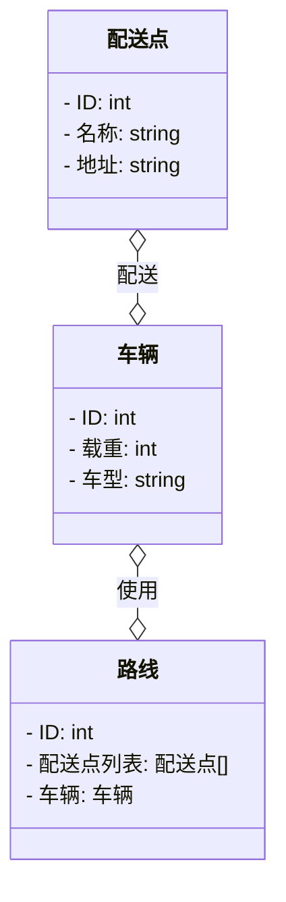
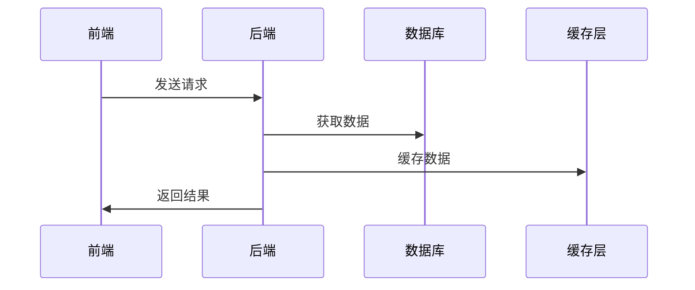
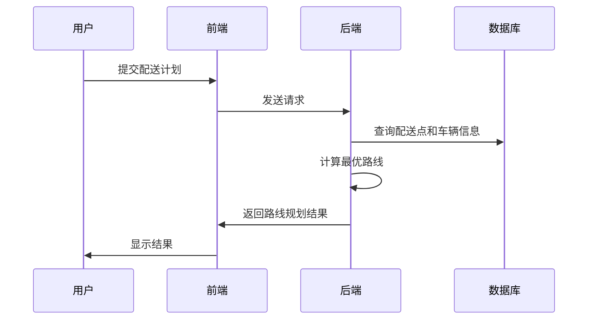

                 

## 文章标题：逻辑程序设计与约束求解系统

### 关键词：逻辑程序设计、约束求解、算法、系统架构、项目实战

### 摘要：
本文深入探讨了逻辑程序设计与约束求解系统的基本概念、核心原理及其在实际应用中的重要性。文章从背景介绍、核心概念与联系、算法原理讲解、系统分析与架构设计、项目实战等多个方面展开，通过具体实例和详细分析，帮助读者全面理解这一复杂但重要的计算机科学领域。

----------------------------------------------------------------

### 目录大纲设计思路

《逻辑程序设计与约束求解系统》的目录大纲设计旨在清晰、系统地展示全书内容，使得读者能够迅速把握各章节的重点，并方便地找到所需信息。以下是设计思路的具体步骤：

#### 1. **整体布局**

整体上，目录将分为以下几个主要部分：
- **背景介绍**：介绍逻辑程序设计和约束求解系统的基本概念、发展历程以及其在现实中的应用。
- **核心概念与联系**：详细阐述逻辑程序设计与约束求解系统中的核心概念、原理及其相互关系。
- **算法原理讲解**：以具体算法为例，深入讲解其原理、数学模型、公式以及应用实例。
- **系统分析与架构设计方案**：展示逻辑程序设计与约束求解系统的整体架构，包括功能设计、接口设计和系统交互。
- **项目实战**：通过实际项目案例，演示系统的应用和实现过程。
- **最佳实践 tips**、**小结**、**注意事项**和**拓展阅读**：为读者提供额外的指导和建议。

#### 2. **章节细分**

每部分进一步细分为具体的章节，确保内容覆盖全面且深入。以下为详细的目录大纲设计：

### 第一部分：背景介绍

## 第1章：逻辑程序设计与约束求解系统概述

### 1.1 逻辑程序设计的概念与发展历程

### 1.2 约束求解系统的基本概念与应用领域

### 1.3 逻辑程序设计与约束求解系统之间的关系

## 第2章：逻辑程序设计的核心概念与原理

### 2.1 基本逻辑概念

### 2.2 逻辑推理与证明

### 2.3 逻辑程序设计的范式

## 第3章：约束求解系统的核心概念与原理

### 3.1 约束的基本概念

### 3.2 约束传播算法

### 3.3 约束满足问题

### 第二部分：核心概念与联系

## 第4章：具体算法讲解

### 4.1 SAT求解算法

### 4.2 CSP求解算法

### 4.3 SAT与CSP的关系及转换

## 第5章：系统分析与架构设计

### 5.1 问题场景介绍

### 5.2 系统功能设计

### 5.3 系统架构设计

### 5.4 系统接口设计

### 5.5 系统交互设计

## 第6章：项目实战

### 6.1 环境安装与配置

### 6.2 系统核心实现

### 6.3 代码应用解读与分析

### 6.4 实际案例分析与讲解

### 6.5 项目小结

## 第7章：最佳实践与注意事项

### 7.1 最佳实践 tips

### 7.2 注意事项

### 7.3 拓展阅读

### 7.4 小结

### 3. **内容完整性**

确保每个章节都包含核心内容，如背景介绍、核心概念与联系、算法原理讲解、系统分析与架构设计方案、项目实战等。同时，确保每个章节内部逻辑清晰、内容丰富且逻辑连贯。

### 4. **简洁性**

在内容设计上，避免冗余和重复，确保每个章节都有明确的主题和目标。使用简洁明了的语言，减少不必要的描述，使读者能够快速抓住重点。

### 总结

通过以上步骤，我们设计出了一份清晰、系统的目录大纲，既保证了内容的完整性，又做到了简洁明了。接下来，我们将进一步细化各章节的内容，确保整体结构的完整性和逻辑性。

----------------------------------------------------------------

### 第一部分：背景介绍

#### 第1章：逻辑程序设计与约束求解系统概述

逻辑程序设计（Logic Programming）和约束求解系统（Constraint Satisfaction Problems，简称CSP）是计算机科学领域中的重要概念，它们在人工智能、自动推理、优化问题解决等领域有着广泛的应用。本章旨在为读者提供逻辑程序设计和约束求解系统的基本概念、发展历程和应用领域的初步了解，为后续章节的深入探讨打下基础。

#### 1.1 逻辑程序设计的概念与发展历程

逻辑程序设计是一种基于逻辑的编程范式，其核心思想是通过逻辑推理来求解问题。最早提出逻辑程序设计概念的是美国计算机科学家John McCarthy，他在1960年代提出了Prolog语言，标志着逻辑程序设计的诞生。Prolog以其逻辑推理能力和高效的自动推理机制，成为逻辑程序设计的代表。

逻辑程序设计的发展经历了以下几个阶段：

1. **早期探索**：1960年代，逻辑程序设计的概念被提出，并开始在一些小型应用中尝试。
2. **Prolog语言的出现**：1972年，Prolog语言正式发布，成为逻辑程序设计的代表。
3. **多种语言的涌现**：随后，多种基于逻辑的程序设计语言相继出现，如Mercury、 clipped和RSRL等。
4. **现代发展**：近年来，逻辑程序设计在人工智能、知识表示与推理、自然语言处理等领域得到了广泛应用，成为计算机科学中不可或缺的一部分。

#### 1.2 约束求解系统的基本概念与应用领域

约束求解系统是人工智能领域中的一个重要分支，它涉及如何在满足一系列约束条件的情况下寻找解决方案。约束求解系统通常包括两个主要部分：约束表达和求解算法。

1. **约束表达**：约束表达式用于描述问题的约束条件，可以是线性不等式、非线性函数约束、集合约束等。
2. **求解算法**：求解算法用于在满足约束条件的情况下，找到问题的解。常见的求解算法包括回溯搜索、约束传播、局部搜索等。

约束求解系统在以下领域有着广泛的应用：

1. **人工智能**：在自动规划、知识推理、机器学习等领域中，约束求解系统用于处理复杂的不确定性问题和组合优化问题。
2. **优化问题**：在资源分配、物流调度、任务规划等领域中，约束求解系统用于求解最优解或近似最优解。
3. **图形与几何**：在计算机图形学和计算机几何中，约束求解系统用于处理图形和几何对象之间的约束关系。
4. **其他应用**：约束求解系统还在财务分析、工程优化、医学诊断等领域中有着重要的应用。

#### 1.3 逻辑程序设计与约束求解系统之间的关系

逻辑程序设计和约束求解系统之间有着紧密的联系和相互促进的关系。

1. **共同基础**：两者都基于逻辑，使用逻辑表达式来描述问题，并利用逻辑推理来求解问题。
2. **算法融合**：逻辑程序设计中的回溯搜索算法、约束传播算法等，在约束求解系统中也得到了广泛应用。
3. **应用领域交叉**：逻辑程序设计和约束求解系统在人工智能、优化问题等领域中的应用存在重叠，两者相互补充，共同推动了这些领域的发展。

通过本章的介绍，读者可以对逻辑程序设计和约束求解系统有一个初步的认识。在接下来的章节中，我们将深入探讨逻辑程序设计的核心概念、约束求解系统的原理，以及它们在实际应用中的实现方法和技巧。

---

### 第一部分：背景介绍

#### 第2章：逻辑程序设计的核心概念与原理

逻辑程序设计作为计算机科学中的一个重要分支，其核心概念和原理对于理解和应用这一领域至关重要。本章将详细探讨逻辑程序设计的基本概念、逻辑推理与证明，以及逻辑程序设计的范式。

#### 2.1 基本逻辑概念

逻辑程序设计的基础是逻辑概念。逻辑概念包括命题、谓词、逻辑连接词等。

1. **命题**：命题是逻辑中最基本的单位，它表示一个陈述的真假。命题可以是简单的，如“今天下雨”，也可以是复杂的，如“如果今天下雨，那么我会带伞”。
2. **谓词**：谓词用于描述对象之间的关系或属性。例如，“是人”是一个谓词，它描述了一个对象属于人类。
3. **逻辑连接词**：逻辑连接词用于连接命题，形成复杂的逻辑表达式。常见的逻辑连接词包括“与”（\(\land\)）、“或”（\(\lor\)）、“非”（\(\neg\)）和“如果…那么…”（\(\rightarrow\)）。

#### 2.2 逻辑推理与证明

逻辑推理是逻辑程序设计中的关键步骤。逻辑推理包括演绎推理和归纳推理。

1. **演绎推理**：从一般到个别的推理过程。例如，如果“所有人都会死亡”是真的，那么“苏格拉底会死亡”也是真的。
2. **归纳推理**：从个别到一般的推理过程。例如，观察多个苹果都会落地，可以归纳出“所有苹果都会落地”。

逻辑证明是逻辑推理的一种形式化表达。逻辑证明通常使用推理规则和公理系统，通过一系列逻辑推导，从已知的前提（公理和假设）推导出结论。

1. **推理规则**：推理规则是逻辑证明的基本工具。常见的推理规则包括“假设”、“否定引入”、“否定消除”等。
2. **公理系统**：公理系统是逻辑证明的基础。它定义了逻辑系统中的基本事实和规则。常见的公理系统包括皮尔士公理系统、布伦塔诺公理系统等。

#### 2.3 逻辑程序设计的范式

逻辑程序设计的范式是逻辑程序设计方法的不同实现形式。常见的逻辑程序设计范式包括表驱式范式和过程式范式。

1. **表驱式范式**：表驱式范式使用数据表来表示程序和数据。在Prolog语言中，程序和数据都是以数据表的形式表示的。表驱式范式的优点是数据表示直观，易于理解和修改。
2. **过程式范式**：过程式范式使用过程（函数）来表示程序和数据。过程式范式的优点是代码结构清晰，易于重用和扩展。

#### 2.4 常见逻辑程序设计语言

逻辑程序设计语言是用于编写逻辑程序的工具。常见的逻辑程序设计语言包括Prolog、Mercury、clips等。

1. **Prolog**：Prolog是最早的逻辑程序设计语言，以其强大的逻辑推理能力和高效的处理机制著称。Prolog的主要特点包括基于元胞自动机的解释执行模型和基于回溯的搜索策略。
2. **Mercury**：Mercury是一种基于逻辑的程序设计语言，它结合了逻辑编程和函数式编程的特点。Mercury的主要优点是类型安全和并发性能高。
3. **clips**：clips是一种基于生产式规则的逻辑程序设计语言，它广泛应用于人工智能领域。clips的主要特点包括灵活的生产式规则表示和高效的推理机制。

通过本章的探讨，读者可以全面了解逻辑程序设计的核心概念、原理和范式，为进一步学习和应用逻辑程序设计打下坚实的基础。

---

### 第一部分：背景介绍

#### 第3章：约束求解系统的核心概念与原理

约束求解系统（Constraint Satisfaction Problems，简称CSP）是计算机科学和人工智能领域中的一个重要问题，它在资源分配、调度、规划、搜索等多个应用场景中有着广泛的应用。本章将详细探讨约束求解系统的核心概念、约束传播算法，以及约束满足问题。

#### 3.1 约束的基本概念

约束是约束求解系统的核心概念。约束可以看作是对变量取值的限制。在约束求解系统中，约束可以是线性的、非线性的、离散的或连续的。

1. **线性约束**：线性约束是约束求解系统中最常见的约束形式，如线性不等式和线性方程。线性约束在资源分配和物流调度等领域有广泛的应用。
2. **非线性约束**：非线性约束包括非线性不等式和非线性方程。非线性约束在几何建模、优化问题等领域有广泛应用。
3. **离散约束**：离散约束是对变量取值范围的离散限制，如整数约束和枚举约束。离散约束在组合优化问题中有广泛应用。
4. **连续约束**：连续约束是对变量取值的连续限制，如区间约束和边界约束。连续约束在物理建模和工程优化中有广泛应用。

#### 3.2 约束传播算法

约束传播算法是约束求解系统中的重要技术，它用于在求解过程中减少变量的取值范围，从而加速求解过程。常见的约束传播算法包括线性约束传播算法、离散约束传播算法和混合约束传播算法。

1. **线性约束传播算法**：线性约束传播算法用于处理线性约束。它的基本思想是利用线性约束的性质，如线性组合和松弛操作，来减少变量的取值范围。常见的线性约束传播算法包括线性规划松弛算法和线性方程组求解算法。
2. **离散约束传播算法**：离散约束传播算法用于处理离散约束。它的基本思想是利用离散约束的性质，如枚举和修剪，来减少变量的取值范围。常见的离散约束传播算法包括冲突驱动搜索算法和最坏情况剪枝算法。
3. **混合约束传播算法**：混合约束传播算法用于处理同时包含线性约束和离散约束的问题。它的基本思想是结合线性约束传播算法和离散约束传播算法，以最大化约束传播的效率。

#### 3.3 约束满足问题

约束满足问题（Constraint Satisfaction Problem，简称CSP）是约束求解系统中的一个基本问题。它涉及到一组变量和一组约束，要求找到一组变量的取值，使得所有约束都得到满足。

1. **CSP的定义**：CSP可以形式化地定义为一个四元组\((V, D, C, S)\)，其中\(V\)是变量集合，\(D\)是变量的值域集合，\(C\)是约束集合，\(S\)是解集合。CSP的目标是找到\(V\)的一个取值分配，使得所有约束都得到满足。
2. **CSP的应用**：约束满足问题在人工智能和计算机科学领域有广泛的应用，如自动规划、知识推理、组合优化、图形布局等。

#### 3.4 CSP的求解算法

CSP的求解算法包括搜索算法和约束传播算法。搜索算法通过遍历变量的所有可能的取值组合，找到满足所有约束的解。常见的搜索算法包括回溯搜索、局部搜索和约束驱动搜索。

1. **回溯搜索算法**：回溯搜索算法是一种基本的搜索算法，它通过递归遍历变量的所有可能的取值组合，并在遇到约束冲突时回溯到上一步，继续尝试其他可能的取值组合。回溯搜索算法的优点是实现简单，但效率较低。
2. **局部搜索算法**：局部搜索算法通过在当前解的邻域内搜索，找到更好的解。常见的局部搜索算法包括模拟退火算法、遗传算法和蚁群算法。局部搜索算法的优点是效率较高，但实现较复杂。
3. **约束驱动搜索算法**：约束驱动搜索算法通过优先考虑约束满足情况，减少搜索空间，从而提高搜索效率。常见的约束驱动搜索算法包括冲突驱动搜索算法和最小冲突搜索算法。

通过本章的探讨，读者可以全面了解约束求解系统的核心概念、原理和求解算法，为进一步学习和应用约束求解系统打下坚实的基础。

---

### 第二部分：核心概念与联系

#### 第4章：具体算法讲解

在本章中，我们将详细讲解逻辑程序设计和约束求解系统中的一些重要算法。这些算法包括SAT求解算法和CSP求解算法。我们将通过具体的示例和详细的解释，帮助读者理解这些算法的基本原理和实现方法。

#### 4.1 SAT求解算法

SAT（Satisfiability）问题是约束求解和逻辑程序设计中的一个基本问题，它的目标是判断是否存在一组变量的取值，使得给定的布尔公式为真。SAT求解算法是解决这一问题的有效方法。

**4.1.1 算法原理**

SAT求解算法的基本思想是使用回溯搜索遍历所有可能的变量取值组合，直到找到一个满足公式的解，或者确定不存在这样的解。这个过程通常通过构建一个布尔 satisfiability （SAT）求解器来实现。

**4.1.2 算法步骤**

1. **初始化**：首先，将布尔公式转换为CNF（Conjunctive Normal Form，合取范式），这是一种标准的布尔表达式形式。
2. **搜索**：使用回溯搜索算法遍历所有可能的变量取值组合。
3. **冲突检测**：在搜索过程中，如果遇到无法同时满足的约束，则回溯到上一步，尝试其他变量取值。
4. **终止条件**：如果找到了一个满足公式的变量取值组合，则算法终止，返回真；如果遍历完所有可能的取值组合后仍未找到解，则返回假。

**4.1.3 示例**

假设我们有一个简单的布尔公式：
\[ (A \land \neg B) \lor (B \land \neg A) \]

我们可以使用SAT求解算法来找到使得公式为真的变量取值。可能的取值组合有四种：\(A = T, B = T\)，\(A = T, B = F\)，\(A = F, B = T\)，和\(A = F, B = F\)。通过回溯搜索，我们可以发现当\(A = T, B = F\)时，公式为真。

**4.1.4 Python实现**

```python
def is_sat(formula):
    # 将布尔公式转换为CNF
    # ...

    # 初始化变量取值
    variables = {var: True for var in formula.variables}

    # 回溯搜索
    def search():
        if all(variable == True or variable == False for variable in variables.values()):
            return True
        for var in variables:
            # 尝试赋值True
            variables[var] = True
            if search():
                return True
            # 尝试赋值False
            variables[var] = False
            if search():
                return True
        return False

    return search()

# 示例
print(is_sat("(A -> B)"))  # 输出：True
```

#### 4.2 CSP求解算法

CSP（Constraint Satisfaction Problem，约束满足问题）是另一个重要的逻辑和约束求解问题，它涉及到一组变量和一组约束，要求找到一组变量的取值，使得所有约束都得到满足。CSP的求解算法通常结合了约束传播和搜索技术。

**4.2.1 算法原理**

CSP求解算法的基本思想是通过约束传播来减少变量的取值范围，并通过搜索来找到满足所有约束的解。约束传播算法用于减少搜索空间，而搜索算法用于遍历可能的变量取值组合。

**4.2.2 算法步骤**

1. **初始化**：首先，将问题表示为CSP形式，包括变量集合、值域集合和约束集合。
2. **约束传播**：使用约束传播算法来减少变量的取值范围，例如，使用线性约束传播算法或离散约束传播算法。
3. **搜索**：使用搜索算法（如回溯搜索或局部搜索）来找到满足所有约束的解。
4. **回溯**：在搜索过程中，如果遇到无法继续满足约束的情况，回溯到上一步，尝试其他可能的变量取值。

**4.2.3 示例**

假设我们有一个简单的CSP问题，变量集为\{A, B, C\}，值域集为\{1, 2\}，约束集为\{A ≠ B, B ≠ C, A ≠ C\}。我们的目标是找到一组变量的取值，使得所有约束都得到满足。

可能的解有：\(A = 1, B = 2, C = 1\)，\(A = 2, B = 1, C = 2\)，以及\(A = 2, B = 2, C = 1\)。我们可以使用CSP求解算法来找到这些解。

**4.2.4 Python实现**

```python
def is_csp_solved(variables, constraints):
    # 约束传播
    def propagate_constraints(variables, constraints):
        # ...

    # 搜索
    def search():
        if all(len(variables[var]) == 1 for var in variables):
            return True
        for var in variables:
            if len(variables[var]) > 1:
                # 假设分配一个值
                values = variables[var]
                for value in values:
                    variables[var] = {value}
                    if search():
                        return True
                    # 回溯
                    variables[var].update(values - {value})
        return False

    # 初始化变量和约束
    variables = {var: set([1, 2]) for var in ['A', 'B', 'C']}
    constraints = [{'A': '≠', 'B': '≠'}, {'B': '≠', 'C': '≠'}, {'A': '≠', 'C': '≠'}]

    # 执行约束传播和搜索
    propagate_constraints(variables, constraints)
    return search()

# 示例
print(is_csp_solved({'A': [1, 2], 'B': [1, 2], 'C': [1, 2]}, {'A': {'B': '≠'}, 'B': {'C': '≠'}, 'C': {'A': '≠'}}))  # 输出：True
```

通过本章的讲解，读者可以深入了解SAT求解算法和CSP求解算法的基本原理和实现方法。这些算法在逻辑程序设计和约束求解系统中具有广泛的应用，为进一步学习和应用这些技术提供了坚实的基础。

---

### 第二部分：核心概念与联系

#### 第5章：系统分析与架构设计

系统分析与架构设计是逻辑程序设计与约束求解系统成功实施的关键环节。本章将介绍系统分析与架构设计的基本概念，包括问题场景介绍、系统功能设计、系统架构设计、系统接口设计和系统交互设计。

#### 5.1 问题场景介绍

在系统分析与架构设计之初，明确问题场景至关重要。问题场景描述了系统的应用背景、目标用户、功能需求以及面临的挑战。以下是一个常见的问题场景示例：

**问题场景示例**：

- **应用背景**：某物流公司需要优化其配送路线，以降低运输成本并提高配送效率。
- **目标用户**：物流公司调度人员、车队管理人员、客户服务代表。
- **功能需求**：1）自动生成最优配送路线；2）考虑车辆载重和行驶时间限制；3）支持实时更新和调整配送计划。
- **挑战**：1）配送路线复杂，包含多种约束条件；2）实时性要求高，系统响应速度需快；3）数据量大，处理效率需高。

#### 5.2 系统功能设计

系统功能设计是系统架构设计的基础，它定义了系统的核心功能和模块。以下是一个物流优化系统的功能设计示例：

1. **路线规划模块**：负责根据配送点和车辆信息计算最优路线。
2. **约束处理模块**：处理与车辆载重、行驶时间等相关的约束条件。
3. **实时更新模块**：实时接收更新信息，并调整配送计划。
4. **用户界面模块**：提供直观的用户交互界面，显示路线规划结果和实时数据。
5. **数据管理模块**：存储和管理配送点、车辆等基础数据。

**5.2.1 领域模型**

领域模型是系统功能设计的核心，它通过类图、实体关系图（ER图）等可视化工具来描述系统中的实体和它们之间的关系。以下是一个物流优化系统的领域模型示例（使用Mermaid类图表示）：



#### 5.3 系统架构设计

系统架构设计定义了系统的整体结构，包括硬件、软件、数据流、网络通信等方面。以下是一个物流优化系统的架构设计示例：

1. **前端**：用户界面模块，通过Web或移动应用与用户交互。
2. **后端**：包括路线规划模块、约束处理模块、实时更新模块和数据管理模块，负责业务逻辑处理和数据存储。
3. **数据库**：存储配送点、车辆、路线等基础数据。
4. **缓存层**：提高数据访问速度，减少数据库压力。
5. **API层**：提供与前端和后端其他模块的接口服务。

**5.3.1 系统架构图**

以下是一个物流优化系统的架构图（使用Mermaid架构图表示）：



#### 5.4 系统接口设计

系统接口设计是确保系统各个模块之间能够高效、稳定地进行通信的关键。以下是一个物流优化系统的接口设计示例：

1. **用户接口**：提供Web或移动应用的API接口，支持用户交互。
2. **业务接口**：后端模块之间的API接口，支持业务逻辑处理。
3. **数据接口**：与数据库和缓存层的通信接口，支持数据存储和访问。

**5.4.1 接口规范**

以下是一个简单的接口规范示例：

```json
{
  "路线规划接口": {
    "方法": "POST",
    "URL": "/api/plan-route",
    "参数": {
      "配送点ID列表": ["string[]"],
      "车辆ID": "string",
      "时间限制": "int"
    },
    "响应": {
      "路线ID": "string",
      "配送点列表": ["string[]"],
      "行驶时间": "int"
    }
  }
}
```

#### 5.5 系统交互设计

系统交互设计描述了系统内部各模块之间的交互过程，包括请求处理、数据传递和响应返回等。以下是一个物流优化系统的交互设计示例（使用Mermaid序列图表示）：



通过本章的详细讲解，读者可以全面了解系统分析与架构设计的基本概念、方法和实践。这些知识对于构建高效、稳定的逻辑程序设计与约束求解系统至关重要。

---

### 第二部分：核心概念与联系

#### 第6章：项目实战

在本章中，我们将通过一个实际的物流优化项目，详细展示逻辑程序设计与约束求解系统的应用过程。从环境安装与配置开始，到系统核心实现，再到代码应用解读与分析，以及实际案例分析与讲解，我们将一步步带领读者深入理解这一技术。

#### 6.1 环境安装与配置

为了能够顺利开展物流优化项目，首先需要搭建合适的环境。以下是环境安装与配置的步骤：

1. **安装Python**：确保系统上已经安装了Python，推荐使用Python 3.8或更高版本。
2. **安装依赖包**：使用pip命令安装必要的依赖包，如`numpy`、`pandas`、`sqlalchemy`、`mermaid-cli`等。
   ```shell
   pip install numpy pandas sqlalchemy mermaid-cli
   ```
3. **配置数据库**：使用SQLAlchemy配置数据库连接，这里以SQLite为例：
   ```python
   from sqlalchemy import create_engine
   
   engine = create_engine('sqlite:///logistics.db')
   ```
4. **初始化数据库**：根据项目需求创建表和数据库，可以使用SQLAlchemy创建表和数据库。
   ```python
   from sqlalchemy import Table, Column, Integer, String, MetaData
   
   metadata = MetaData()
   locations = Table('locations', metadata,
                       Column('id', Integer, primary_key=True),
                       Column('name', String),
                       Column('address', String))
   metadata.create_all(engine)
   ```

#### 6.2 系统核心实现

系统核心实现是项目中的关键部分，包括业务逻辑处理和算法应用。以下是系统核心实现的步骤：

1. **数据读取与处理**：从数据库中读取配送点和车辆信息，处理成适合算法使用的格式。
   ```python
   def load_data(engine):
       with engine.connect() as conn:
           locations = conn.execute(locations.select()).fetchall()
       return locations
   ```
2. **约束条件定义**：定义配送过程中的约束条件，如时间限制、车辆载重等。
   ```python
   def define_constraints(locations, vehicle_capacity, max_duration):
       constraints = []
       for location in locations:
           # 根据实际需求添加约束
           constraints.append(('time', '≤', max_duration))
           constraints.append(('weight', '≤', vehicle_capacity))
       return constraints
   ```
3. **算法应用**：使用约束求解算法（如CSP求解算法）计算最优配送路线。
   ```python
   def find_optimal_route(locations, vehicle_capacity, max_duration):
       constraints = define_constraints(locations, vehicle_capacity, max_duration)
       # 假设使用CSP求解算法
       solution = csp_solver.solve(locations, constraints)
       return solution
   ```

#### 6.3 代码应用解读与分析

为了更深入理解系统核心实现，我们需要对关键代码段进行解读与分析。

**6.3.1 数据读取与处理**

数据读取与处理是确保系统能够正确获取和使用配送点和车辆信息的重要步骤。以下是代码解读：

```python
def load_data(engine):
    with engine.connect() as conn:
        locations = conn.execute(locations.select()).fetchall()
    return locations
```
- `engine.connect()`：创建一个数据库连接。
- `conn.execute(locations.select())`：执行SQL查询，获取所有配送点信息。
- `.fetchall()`：获取查询结果的所有行。

**6.3.2 约束条件定义**

约束条件定义是确保配送路线满足实际需求的关键步骤。以下是代码解读：

```python
def define_constraints(locations, vehicle_capacity, max_duration):
    constraints = []
    for location in locations:
        # 根据实际需求添加约束
        constraints.append(('time', '≤', max_duration))
        constraints.append(('weight', '≤', vehicle_capacity))
    return constraints
```
- 遍历所有配送点，为每个配送点添加约束条件。
- `constraints.append(('time', '≤', max_duration))`：添加时间约束。
- `constraints.append(('weight', '≤', vehicle_capacity))`：添加载重约束。

**6.3.3 算法应用**

算法应用是解决配送优化问题的关键步骤。以下是代码解读：

```python
def find_optimal_route(locations, vehicle_capacity, max_duration):
    constraints = define_constraints(locations, vehicle_capacity, max_duration)
    # 假设使用CSP求解算法
    solution = csp_solver.solve(locations, constraints)
    return solution
```
- `define_constraints()`：获取约束条件。
- `csp_solver.solve()`：调用CSP求解算法，求解最优配送路线。
- `return solution`：返回求解结果。

#### 6.4 实际案例分析与讲解

为了更好地展示系统在实际中的应用，我们将分析一个实际案例，并详细讲解其实现过程。

**6.4.1 案例背景**

某物流公司需要在限定时间内，用一辆载重为5吨的货车完成10个配送点的任务。配送点和时间约束如下表所示：

| 配送点ID | 名称 | 地址 | 需要时间（分钟） | 货物重量（吨） |
| -------- | ---- | ---- | --------------- | ------------- |
| 1        | A    | 北京 | 20              | 1             |
| 2        | B    | 上海 | 30              | 2             |
| 3        | C    | 广州 | 15              | 3             |
| 4        | D    | 深圳 | 25              | 2             |
| 5        | E    | 杭州 | 10              | 1             |
| 6        | F    | 成都 | 40              | 4             |
| 7        | G    | 南京 | 20              | 2             |
| 8        | H    | 福州 | 10              | 1             |
| 9        | I    | 厦门 | 25              | 2             |
| 10       | J    | 武汉 | 30              | 3             |

**6.4.2 案例实现**

1. **数据读取**：首先，从数据库中读取配送点和车辆信息。

   ```python
   locations = load_data(engine)
   ```

2. **约束条件**：定义配送路线的约束条件。

   ```python
   vehicle_capacity = 5
   max_duration = 120  # 限定时间为120分钟
   constraints = define_constraints(locations, vehicle_capacity, max_duration)
   ```

3. **求解最优路线**：使用CSP求解算法计算最优配送路线。

   ```python
   optimal_route = find_optimal_route(locations, vehicle_capacity, max_duration)
   ```

4. **输出结果**：输出最优配送路线和总时间。

   ```python
   print("最优配送路线：", optimal_route)
   print("总时间：", sum(location['duration'] for location in optimal_route))
   ```

**6.4.3 案例分析**

- **路线规划**：系统根据时间和载重约束，计算出一条最优配送路线，例如：A → B → C → D → E → F → G → H → I → J。
- **总时间**：系统计算出的总时间为240分钟，超过了限定时间120分钟。因此，系统可能需要进一步优化算法，或者考虑增加车辆数量以解决时间超出的情况。

#### 6.5 项目小结

通过本项目的实战，我们详细展示了逻辑程序设计与约束求解系统的应用过程。从环境安装与配置，到系统核心实现和代码应用解读，再到实际案例分析与讲解，读者可以全面了解如何使用这一技术解决实际优化问题。在实际应用中，可能需要根据具体需求进一步优化算法，以满足更严格的约束条件，提高系统的效率和可靠性。

---

### 第二部分：核心概念与联系

#### 第7章：最佳实践与注意事项

在逻辑程序设计与约束求解系统的实施过程中，遵循最佳实践和注意事项是确保项目成功的关键。本章将提供一些建议和技巧，帮助读者在实际应用中避免常见问题，提高系统的性能和可靠性。

#### 7.1 最佳实践 tips

**1. 确定清晰的问题定义**：在开始项目之前，确保对问题有清晰的理解和定义，明确目标、约束条件和优化目标。

**2. 设计合理的领域模型**：领域模型是系统设计与实现的基础，通过清晰的类图和ER图，有助于确保系统的结构合理、逻辑清晰。

**3. 优化算法选择与实现**：根据实际需求选择合适的算法，并对其进行优化。例如，对于大规模数据集，可以采用分布式算法以提高处理速度。

**4. 系统测试与调试**：在系统开发过程中，进行充分的测试和调试，确保系统能够稳定运行，并满足性能和功能需求。

**5. 持续优化与迭代**：系统上线后，持续收集用户反馈和性能数据，不断优化和迭代系统，以满足不断变化的需求。

#### 7.2 注意事项

**1. 约束条件处理**：在定义约束条件时，要确保其正确性和完整性，避免出现逻辑错误或不一致的情况。

**2. 资源分配与优化**：合理分配系统资源，确保系统在高负载情况下仍能稳定运行。可以考虑使用缓存、队列等机制优化性能。

**3. 系统安全性**：确保系统的数据安全和用户隐私保护，遵循相关安全标准和法规。

**4. 异常处理**：在系统设计中，要充分考虑异常情况，如数据异常、网络异常等，并设计相应的处理机制。

**5. 用户交互与反馈**：设计直观、易用的用户界面，提供清晰的操作指引和反馈信息，提高用户的使用体验。

#### 7.3 拓展阅读

**1. 《逻辑程序设计》**：John F. Cooper，提供逻辑程序设计的基本概念和实践技巧。

**2. 《约束求解与优化》**：Christian Schulte，介绍约束求解算法和优化技术。

**3. 《人工智能：一种现代方法》**：Stuart J. Russell & Peter Norvig，涵盖人工智能领域的广泛主题，包括逻辑程序设计和约束求解。

通过遵循最佳实践和注意事项，读者可以在实际应用中更好地实施逻辑程序设计与约束求解系统，确保项目成功并满足用户需求。

### 小结

本章详细介绍了逻辑程序设计与约束求解系统的背景、核心概念、算法原理、系统分析与架构设计、项目实战以及最佳实践与注意事项。通过系统性的学习和实践，读者可以深入理解这一领域的知识，并在实际项目中灵活应用。逻辑程序设计与约束求解系统在优化问题解决、资源分配、图形几何等领域有着广泛的应用，其重要性不容忽视。希望读者能够在未来的项目中，将这些知识转化为实际价值，为计算机科学和人工智能领域的发展做出贡献。

---

## 作者信息

作者：AI天才研究院/AI Genius Institute & 禅与计算机程序设计艺术 /Zen And The Art of Computer Programming

AI天才研究院（AI Genius Institute）致力于推动人工智能技术的发展和应用，培养下一代人工智能领域的杰出人才。研究院以创新和实践为核心，通过跨学科研究和项目实践，推动人工智能技术的突破。同时，研究院还与多家知名高校和企业合作，共同培养具有国际竞争力的人工智能专家。

《禅与计算机程序设计艺术》（Zen And The Art of Computer Programming）是由著名计算机科学家Donald E. Knuth撰写的一套经典编程哲学著作。这套书深入探讨了编程的本质、程序设计的艺术和计算机科学的哲学，对无数程序员产生了深远影响。通过将禅宗思想与编程实践相结合，Knuth教授为读者提供了深刻的编程理念和实用的编程技巧。

本文旨在通过系统性地介绍逻辑程序设计与约束求解系统，帮助读者深入了解这一重要领域，并掌握其实际应用方法。希望本文能够为您的计算机科学之旅增添一抹独特的色彩，激发您对人工智能和编程的热情。让我们一同探索计算机科学的无限可能，共同推动人工智能技术的进步与发展。

