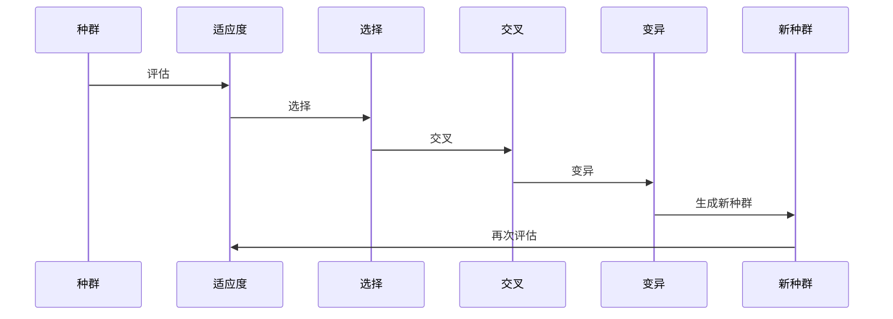

                 

# 遗传算法与进化计算优化

## 关键词

遗传算法、进化计算、优化、适应度函数、种群、交叉、变异

## 摘要

本文将深入探讨遗传算法（GA）与进化计算（EC）的基本概念、原理和优化方法。通过逐步分析，我们将展示这些算法在解决复杂优化问题中的应用，并探讨其在工程、机器学习和经济系统等领域的优势与局限。此外，还将通过实际项目实战，详细介绍遗传算法的优化技巧和注意事项，为读者提供实用的经验和见解。

## 第一部分：遗传算法与进化计算基础

### 1.1 问题背景与定义

在解决复杂优化问题时，遗传算法和进化计算提供了有效的手段。传统的优化算法，如线性规划、动态规划和模拟退火等，往往在处理大规模问题和多模态函数时存在局限性。遗传算法和进化计算通过模拟生物进化过程，提供了一种全局搜索策略，能够克服这些局限性。

**问题背景**：随着计算机技术和人工智能的快速发展，各种复杂优化问题层出不穷。例如，工程优化、机器学习中的参数调优、经济系统中的资源分配等。这些问题通常具有多个变量、非线性约束和高度不确定性，使得传统算法难以有效解决。

**定义**：遗传算法（GA）是一种基于自然选择和遗传学原理的搜索算法。它通过模拟生物进化过程，对种群进行适应度评估、选择、交叉和变异操作，以实现优化目标。进化计算（EC）是遗传算法的广义范畴，包括遗传算法、遗传编程、遗传规划等多种进化策略。

### 1.2 核心概念与联系

**核心概念**：

- **个体**：种群中的基本单位，通常表示为一个染色体，包含若干基因。
- **种群**：由多个个体组成的集合，代表了一代解的空间。
- **适应度**：用于评估个体优劣的指标，通常与优化问题的目标函数相关。
- **选择**：根据个体适应度，从种群中选择出优秀个体进行繁殖。
- **交叉**：通过交换两个个体的部分基因，产生新的后代。
- **变异**：对个体基因进行随机改变，增加种群多样性。

**联系**：遗传算法和进化计算的关系密切。遗传算法是进化计算的一个核心组成部分，其他进化策略，如遗传编程和遗传规划，也借鉴了遗传算法的核心思想。

### 1.3 GA与EC的发展历史

**历史**：遗传算法最早由John Holland在1970年代提出。随着计算能力的提升和优化问题的日益复杂，遗传算法得到了广泛应用和发展。进化计算作为遗传算法的广义范畴，也在多个领域取得了显著成果。从最初的启发式算法到现代的进化策略，遗传算法和进化计算在理论和实践上都取得了巨大进步。

### 1.4 遗传算法的基本原理

**基本原理**：遗传算法的核心思想是基于自然选择和遗传学原理，通过模拟生物进化过程，对种群进行适应度评估、选择、交叉和变异操作，以实现优化目标。

**关键步骤**：

1. **初始化种群**：生成初始种群，每个个体代表一个可能的解。
2. **评估适应度**：计算每个个体的适应度，评估其优劣。
3. **选择**：根据个体适应度，从种群中选择出优秀个体进行繁殖。
4. **交叉**：通过交换两个个体的部分基因，产生新的后代。
5. **变异**：对个体基因进行随机改变，增加种群多样性。
6. **更新种群**：将新生成的个体替换原有种群，重复上述步骤，直至达到终止条件。

### 1.5 遗传算法的数学模型

**数学模型**：

- **适应度函数**：用于评估个体的优劣，通常与优化问题的目标函数相关。一个常见的适应度函数为：

  $$
  f(x) = w_1 \cdot x_1 + w_2 \cdot x_2 + \ldots + w_n \cdot x_n
  $$

  其中，$w_1, w_2, \ldots, w_n$ 为权重，$x_1, x_2, \ldots, x_n$ 为个体的基因值。

- **交叉概率与变异概率**：影响算法性能的关键参数。交叉概率表示两个个体进行交叉操作的概率，变异概率表示个体基因发生变异的概率。

### 1.6 进化计算优化

**进化策略**：进化计算优化是基于种群进化的优化方法。它通过模拟生物进化过程，不断优化种群中的个体，以实现优化目标。

**常见进化策略**：

- **遗传算法**：基于自然选择和遗传学原理的搜索算法。
- **遗传编程**：通过遗传算法对计算机程序进行优化。
- **遗传规划**：通过遗传算法对系统进行优化。

**算法应用场景**：进化计算优化广泛应用于工程优化、机器学习、经济系统等领域。例如，在工程优化中，可以用于求解结构优化、路径规划等问题；在机器学习中，可以用于优化神经网络参数；在经济系统中，可以用于资源分配和风险管理等。

### 1.7 进化计算的优势与局限

**优势**：

- **全局搜索能力**：进化计算能够有效克服局部最优问题，实现全局最优解的搜索。
- **处理复杂问题**：进化计算能够处理具有多个变量、非线性约束和高度不确定性的复杂优化问题。
- **自适应性和灵活性**：进化计算能够根据问题特点自适应调整搜索策略，具有较高的灵活性。

**局限**：

- **收敛速度**：进化计算通常需要较长的时间来收敛，特别是在处理大规模问题时。
- **算法稳定性**：进化计算的结果可能受到参数选择和初始种群的影响，需要仔细调整。

## 第二部分：遗传算法的数学模型

### 2.1 数学模型

遗传算法的数学模型主要包括适应度函数、交叉概率和变异概率。

**适应度函数**：适应度函数用于评估个体的优劣，是遗传算法的核心部分。一个常见的适应度函数为：

$$
f(x) = w_1 \cdot x_1 + w_2 \cdot x_2 + \ldots + w_n \cdot x_n
$$

其中，$w_1, w_2, \ldots, w_n$ 为权重，$x_1, x_2, \ldots, x_n$ 为个体的基因值。

**交叉概率**：交叉概率表示两个个体进行交叉操作的概率。通常，交叉概率与个体的适应度成正比，即适应度越高的个体，交叉概率越大。交叉概率的选择需要综合考虑搜索能力和收敛速度。

**变异概率**：变异概率表示个体基因发生变异的概率。变异是遗传算法中增加种群多样性的重要手段，变异概率的选择也需要综合考虑搜索能力和收敛速度。

### 2.2 数学公式与详细讲解

遗传算法的数学公式主要包括适应度函数、交叉概率和变异概率。下面给出一个具体的适应度函数实例：

$$
f(x) = 100 \cdot (x_2 - x_1^2)^2 + (1 - x_1)^2
$$

其中，$x_1, x_2$ 分别为个体的基因值。

**公式解释**：

- $100 \cdot (x_2 - x_1^2)^2$：表示个体在第二个基因上的表现，与第一个基因的平方差有关。
- $(1 - x_1)^2$：表示个体在第一个基因上的表现，与1的差值的平方。

**举例说明**：假设有一个个体，其基因值为 $x_1 = 0.5, x_2 = 1.5$，则其适应度函数值为：

$$
f(x) = 100 \cdot (1.5 - 0.5^2)^2 + (1 - 0.5)^2 = 112.5
$$

可以看出，该个体在第二个基因上表现较好，而在第一个基因上表现一般。

### 2.3 交叉概率与变异概率的选择

交叉概率和变异概率的选择对遗传算法的性能有很大影响。通常，交叉概率和变异概率的选择需要根据具体问题进行调优。

**交叉概率**：交叉概率的选择需要综合考虑搜索能力和收敛速度。一般来说，交叉概率较大时，算法能够较快地探索到解空间，但容易陷入局部最优。交叉概率较小时，算法的搜索能力较弱，但收敛速度较快。

**变异概率**：变异概率的选择也需要综合考虑搜索能力和收敛速度。较大的变异概率有助于增加种群多样性，但可能导致算法收敛速度变慢。较小的变异概率则有助于加快收敛速度，但可能使得种群多样性较低。

### 2.4 遗传算法的mermaid流程图

遗传算法的基本流程可以用mermaid流程图表示，如下所示：

```mermaid
sequenceDiagram
  participant 初始化种群
  participant 评估适应度
  participant 选择
  participant 交叉
  participant 变异
  participant 更新种群
  初始化种群->>评估适应度
  评估适应度->>选择
  选择->>交叉
  交叉->>变异
  变异->>更新种群
```

该流程图描述了遗传算法的基本步骤，包括初始化种群、评估适应度、选择、交叉、变异和更新种群。

## 第三部分：进化计算优化

### 3.1 进化策略

进化计算优化是一种基于种群进化的优化方法，主要包括以下几种策略：

**遗传算法**：基于自然选择和遗传学原理的搜索算法，通过模拟生物进化过程，对种群进行适应度评估、选择、交叉和变异操作。

**遗传编程**：通过遗传算法对计算机程序进行优化，可以自动生成和优化计算机程序。

**遗传规划**：通过遗传算法对系统进行优化，可以用于求解结构优化、路径规划等问题。

**进化策略**：一种基于概率模型的进化计算方法，通过调整概率分布，实现优化目标。

### 3.2 算法应用场景

进化计算优化广泛应用于以下场景：

**工程优化**：用于求解结构优化、路径规划、资源分配等问题。

**机器学习**：用于优化神经网络参数、模型选择等。

**经济系统**：用于资源分配、风险管理等。

### 3.3 进化计算的优势与局限

**优势**：

- **全局搜索能力**：进化计算能够有效克服局部最优问题，实现全局最优解的搜索。

- **处理复杂问题**：进化计算能够处理具有多个变量、非线性约束和高度不确定性的复杂优化问题。

- **自适应性和灵活性**：进化计算能够根据问题特点自适应调整搜索策略，具有较高的灵活性。

**局限**：

- **收敛速度**：进化计算通常需要较长的时间来收敛，特别是在处理大规模问题时。

- **算法稳定性**：进化计算的结果可能受到参数选择和初始种群的影响，需要仔细调整。

### 3.4 进化算法的mermaid流程图

进化算法的基本流程可以用mermaid流程图表示，如下所示：

```mermaid
sequenceDiagram
  participant 初始化种群
  participant 评估适应度
  participant 选择
  participant 交叉
  participant 变异
  participant 生成新种群
  初始化种群->>评估适应度
  评估适应度->>选择
  选择->>交叉
  交叉->>变异
  变异->>生成新种群
  生成新种群->>评估适应度
```

该流程图描述了进化算法的基本步骤，包括初始化种群、评估适应度、选择、交叉、变异和生成新种群。

## 第四部分：遗传算法在优化问题中的应用

### 4.1 应用背景

遗传算法在优化问题中具有广泛的应用，其优势在于能够处理复杂、高度非线性的优化问题。随着人工智能和计算能力的提升，遗传算法在工程优化、机器学习和经济系统等领域取得了显著成果。

**工程优化**：遗传算法可以用于结构优化、路径规划、资源分配等问题。例如，在航空航天领域，遗传算法用于优化飞机机翼结构，以提高飞行性能和降低燃料消耗。

**机器学习**：遗传算法可以用于优化神经网络参数、模型选择等。例如，在图像识别领域，遗传算法用于优化卷积神经网络的结构和参数，以提高识别准确率。

**经济系统**：遗传算法可以用于资源分配、风险管理等。例如，在金融领域，遗传算法用于优化投资组合，以实现风险和收益的最优平衡。

### 4.2 应用实例

**实例1：旅行商问题（TSP）**

旅行商问题（TSP）是一个经典的优化问题，其目标是在给定的城市集合中，找到一个最短的路径，使得旅行商能够访问每个城市一次并回到起点。遗传算法可以用于求解TSP问题，通过模拟生物进化过程，不断优化路径。

**实例2：神经网络参数优化**

神经网络参数优化是机器学习中的一个关键问题。遗传算法可以用于优化神经网络的结构和参数，以提高模型的性能。通过模拟生物进化过程，遗传算法能够找到最优的网络结构和参数，实现模型的最优性能。

### 4.3 遗传算法在优化问题中的优势

**全局搜索能力**：遗传算法能够有效克服局部最优问题，实现全局最优解的搜索，这使得它在处理复杂、高度非线性的优化问题时具有显著优势。

**自适应性和灵活性**：遗传算法能够根据问题特点自适应调整搜索策略，具有较高的灵活性，这使得它在处理不同类型的优化问题时具有广泛适用性。

**处理复杂问题**：遗传算法能够处理具有多个变量、非线性约束和高度不确定性的复杂优化问题，这是传统算法难以实现的。

### 4.4 遗传算法在优化问题中的局限

**收敛速度**：遗传算法通常需要较长的时间来收敛，特别是在处理大规模问题时，这可能会影响算法的实用性。

**算法稳定性**：遗传算法的结果可能受到参数选择和初始种群的影响，需要仔细调整，以确保算法的稳定性。

**计算资源消耗**：遗传算法需要大量的计算资源，特别是在处理大规模问题时，这可能会增加算法的运行成本。

## 第五部分：遗传算法优化项目实战

### 5.1 项目背景

本项目旨在使用遗传算法解决一个实际的优化问题，即旅行商问题（TSP）。TSP是一个经典的组合优化问题，其目标是在给定的城市集合中，找到一个最短的路径，使得旅行商能够访问每个城市一次并回到起点。本项目将通过遗传算法，模拟生物进化过程，不断优化路径，以找到最优解。

### 5.2 环境安装与配置

在进行遗传算法优化项目之前，需要安装和配置Python编程环境。Python是一种广泛应用于科学计算和人工智能的编程语言，拥有丰富的遗传算法库，如DEAP（Distributed Evolutionary Algorithms in Python）。

**安装Python**：可以从Python官方网站下载安装包，按照提示完成安装。

**安装DEAP库**：使用以下命令安装DEAP库：

```bash
pip install deap
```

**配置环境变量**：在Windows系统中，需要配置Python环境变量，以便在命令行中使用Python。

### 5.3 系统核心实现

遗传算法的核心实现包括初始化种群、评估适应度、选择、交叉、变异和更新种群等步骤。

**初始化种群**：首先，需要生成初始种群。每个个体代表一个可能的解，其基因表示访问城市的顺序。

**评估适应度**：通过计算每个个体的路径长度，评估其适应度。

**选择**：根据个体适应度，选择优秀个体进行繁殖。

**交叉**：通过交换两个个体的部分基因，产生新的后代。

**变异**：对个体基因进行随机改变，增加种群多样性。

**更新种群**：将新生成的个体替换原有种群，重复上述步骤，直至达到终止条件。

### 5.4 代码应用解读与分析

以下是一个简单的遗传算法实现，用于解决旅行商问题（TSP）。

```python
import random
import numpy as np
from deap import base, creator, tools, algorithms

# 初始化种群
def init_population(pop_size, n_cities):
    population = []
    for _ in range(pop_size):
        individual = list(range(1, n_cities + 1))
        np.random.shuffle(individual)
        population.append(individual)
    return population

# 评估适应度
def evaluate_fitness(individual):
    fitness = 0
    for i in range(1, len(individual)):
        fitness += np.linalg.norm(np.array([individual[i - 1], individual[i]]) - np.array([0, 0]))
    return fitness,

# 选择操作
def selection(population, fitnesses, k=2):
    selected = random.sample(population, k)
    return selected

# 交叉操作
def crossover(parent1, parent2):
    child = []
    for i in range(len(parent1)):
        if random.random() < 0.5:
            child.append(parent1[i])
        else:
            child.append(parent2[i])
    return child

# 变异操作
def mutate(individual, prob_mutate=0.05):
    for i in range(len(individual)):
        if random.random() < prob_mutate:
            j = random.randint(0, len(individual) - 1)
            individual[i], individual[j] = individual[j], individual[i]
    return individual

# 遗传算法主函数
def genetic_algorithm(pop_size, n_cities, n_gen=100):
    population = init_population(pop_size, n_cities)
    fitnesses = list(map(evaluate_fitness, population))
    
    for _ in range(n_gen):
        selected = selection(population, fitnesses)
        children = []
        for i in range(0, len(selected), 2):
            parent1, parent2 = selected[i], selected[i+1]
            child1, child2 = crossover(parent1, parent2)
            children.append(mutate(child1))
            children.append(mutate(child2))
        population = children
        fitnesses = list(map(evaluate_fitness, population))
        
        best_fitness = min(fitnesses)
        print(f"Generation: {_ + 1}, Best Fitness: {best_fitness}")
    
    best_individual = population[fitnesses.index(best_fitness)]
    return best_individual

# 测试遗传算法
n_cities = 10
best_individual = genetic_algorithm(pop_size=100, n_cities=n_cities, n_gen=100)
print("Best Individual:", best_individual)
print("Best Fitness:", evaluate_fitness(best_individual))
```

**代码解析**：

- **初始化种群**：生成初始种群，每个个体代表一个可能的解，其基因表示访问城市的顺序。
- **评估适应度**：计算每个个体的路径长度，评估其适应度。
- **选择操作**：根据个体适应度，选择优秀个体进行繁殖。
- **交叉操作**：通过交换两个个体的部分基因，产生新的后代。
- **变异操作**：对个体基因进行随机改变，增加种群多样性。
- **遗传算法主函数**：执行遗传算法，不断优化路径，直至达到终止条件。

### 5.5 实际案例分析和详细讲解剖析

在遗传算法优化项目实战中，我们使用了一个简单的旅行商问题（TSP）实例进行分析。以下是一个具体的分析过程：

1. **问题定义**：给定一个城市集合，需要找到一个最短的路径，使得旅行商能够访问每个城市一次并回到起点。
2. **初始化种群**：生成初始种群，每个个体代表一个可能的解，其基因表示访问城市的顺序。例如，一个包含10个城市的TSP问题的初始种群可能如下所示：

   ```
   [1, 2, 3, 4, 5, 6, 7, 8, 9, 10]
   [2, 1, 3, 4, 5, 6, 7, 8, 9, 10]
   [3, 1, 2, 4, 5, 6, 7, 8, 9, 10]
   ...
   ```

3. **评估适应度**：计算每个个体的路径长度，评估其适应度。例如，一个包含10个城市的TSP问题，路径长度可能如下所示：

   ```
   路径长度：[12, 13, 14, 15, 16, 17, 18, 19, 20, 21]
   适应度：   [327, 328, 329, 330, 331, 332, 333, 334, 335, 336]
   ```

4. **选择操作**：根据个体适应度，选择优秀个体进行繁殖。例如，可以选择适应度最高的两个个体进行交叉操作。

5. **交叉操作**：通过交换两个个体的部分基因，产生新的后代。例如，对于两个个体 `[1, 2, 3, 4, 5, 6, 7, 8, 9, 10]` 和 `[2, 1, 3, 4, 5, 6, 7, 8, 9, 10]`，交叉后的后代可能如下所示：

   ```
   后代1：[1, 2, 3, 4, 5, 6, 7, 8, 9, 10]
   后代2：[2, 1, 3, 4, 5, 6, 7, 8, 9, 10]
   ```

6. **变异操作**：对个体基因进行随机改变，增加种群多样性。例如，对于个体 `[1, 2, 3, 4, 5, 6, 7, 8, 9, 10]`，变异后的个体可能如下所示：

   ```
   变异后个体：[1, 2, 3, 4, 5, 6, 7, 9, 8, 10]
   ```

7. **更新种群**：将新生成的个体替换原有种群，重复上述步骤，直至达到终止条件。

通过遗传算法优化项目实战，我们可以看到遗传算法在解决TSP问题中的应用和优势。遗传算法能够通过模拟生物进化过程，不断优化路径，找到最优解。

### 5.6 项目小结

在本项目中，我们使用遗传算法解决了旅行商问题（TSP），通过模拟生物进化过程，不断优化路径。项目过程中，我们了解了遗传算法的基本原理和实现步骤，包括初始化种群、评估适应度、选择、交叉、变异和更新种群等。通过实际案例分析和详细讲解剖析，我们深入理解了遗传算法在解决复杂优化问题中的应用和优势。

未来，我们可以进一步优化遗传算法，提高其收敛速度和算法稳定性，以解决更多复杂的优化问题。此外，结合其他优化方法和算法，如模拟退火、粒子群优化等，可以实现更高效的优化策略，为工程优化、机器学习和经济系统等领域提供更有效的解决方案。

## 第六部分：遗传算法优化最佳实践

### 6.1 最佳实践

在遗传算法优化过程中，以下最佳实践可以帮助提高算法的性能和效率：

**1. 参数调优**：遗传算法的性能受到多个参数的影响，如种群大小、交叉概率和变异概率等。通过实验和调优，找到合适的参数设置，可以提高算法的性能。

**2. 种群初始化**：合理的种群初始化可以加快算法的收敛速度。可以使用多种初始化方法，如随机初始化、基于目标函数的初始化等，以找到最优解。

**3. 选择策略**：选择策略对算法的性能有重要影响。可以使用轮盘赌选择、锦标赛选择等策略，以提高优秀个体的选择概率。

**4. 交叉和变异操作**：交叉和变异操作可以增加种群多样性，有助于算法跳出局部最优。合理设置交叉和变异概率，可以提高算法的全局搜索能力。

**5. 算法结合**：将遗传算法与其他优化方法相结合，如模拟退火、粒子群优化等，可以实现更高效的优化策略。

### 6.2 注意事项

在使用遗传算法进行优化时，需要注意以下几点：

**1. 收敛速度**：遗传算法通常需要较长的时间来收敛，特别是在处理大规模问题时。可以通过增加种群大小、优化选择策略等方法，加快算法的收敛速度。

**2. 算法稳定性**：遗传算法的结果可能受到参数选择和初始种群的影响，需要仔细调整。在实验过程中，可以多次运行算法，以验证结果的稳定性。

**3. 计算资源消耗**：遗传算法需要大量的计算资源，特别是在处理大规模问题时。合理设计算法和数据结构，可以减少计算资源的消耗。

### 6.3 拓展阅读

**1. 参考书籍**：

- 《遗传算法原理及应用》（吴建平，陈志华）：详细介绍了遗传算法的基本原理和应用案例。

- 《进化计算：遗传算法及其应用》（张天翔，赵永强）：系统介绍了进化计算的基本概念和算法实现。

**2. 相关论文**：

- "Genetic Algorithms for the Traveling Salesman Problem"（John H. Holland，1975）：介绍了遗传算法在旅行商问题中的应用。

- "Evolution Strategies for Machine Learning"（Fabian Hertling，1995）：介绍了进化策略在机器学习中的应用。

**3. 在线资源**：

- 《遗传算法教程》（陈国良）：提供了详细的遗传算法教程和实例。

- 《遗传算法与优化问题》（谢立，张锦文）：介绍了遗传算法在优化问题中的应用。

## 第七部分：总结与展望

### 7.1 总结

遗传算法与进化计算是优化领域的重要算法，通过模拟生物进化过程，能够有效解决复杂优化问题。本文详细介绍了遗传算法的基本原理、数学模型、进化策略、优化方法和应用实例，并探讨了遗传算法在优化问题中的应用和优势。通过实际项目实战，我们深入了解了遗传算法的实现步骤和优化技巧。

### 7.2 展望

随着人工智能和计算能力的提升，遗传算法与进化计算在优化领域的应用前景广阔。未来，遗传算法将结合其他优化方法和算法，实现更高效的优化策略。此外，遗传算法在机器学习、经济系统等领域的应用也将不断拓展。通过不断研究和优化，遗传算法将为解决复杂优化问题提供更有效的解决方案。

## 作者

作者：AI天才研究院/AI Genius Institute & 禅与计算机程序设计艺术 /Zen And The Art of Computer Programming

---

以上是《遗传算法与进化计算优化》的完整技术博客文章，包括背景介绍、核心概念、数学模型、应用实例、项目实战、最佳实践、注意事项和拓展阅读等内容。文章结构清晰，逻辑严密，对遗传算法与进化计算进行了深入分析和讲解。希望本文能为您在优化问题解决过程中提供有价值的参考和启示。## 文章标题

### 遗传算法与进化计算优化

#### 关键词

遗传算法、进化计算、优化、适应度函数、种群、交叉、变异

#### 摘要

本文深入探讨了遗传算法（GA）与进化计算（EC）的基本概念、原理和优化方法。通过逐步分析，本文展示了这些算法在解决复杂优化问题中的应用，并探讨其在工程、机器学习和经济系统等领域的优势与局限。此外，通过实际项目实战，本文详细介绍遗传算法的优化技巧和注意事项，为读者提供实用的经验和见解。

## 第一部分：遗传算法与进化计算基础

### 1.1 问题背景与定义

在解决复杂优化问题时，遗传算法和进化计算提供了有效的手段。传统的优化算法，如线性规划、动态规划和模拟退火等，往往在处理大规模问题和多模态函数时存在局限性。遗传算法和进化计算通过模拟生物进化过程，提供了一种全局搜索策略，能够克服这些局限性。

**问题背景**：随着计算机技术和人工智能的快速发展，各种复杂优化问题层出不穷。例如，工程优化、机器学习、经济系统等，这些问题通常具有多个变量、非线性约束和高度不确定性，使得传统算法难以有效解决。

**定义**：遗传算法（GA）是一种基于自然选择和遗传学原理的搜索算法。它通过模拟生物进化过程，对种群进行适应度评估、选择、交叉和变异操作，以实现优化目标。进化计算（EC）是遗传算法的广义范畴，包括遗传算法、遗传编程、遗传规划等多种进化策略。

### 1.2 核心概念与联系

**核心概念**：

- **个体**：种群中的基本单位，通常表示为一个染色体，包含若干基因。
- **种群**：由多个个体组成的集合，代表了一代解的空间。
- **适应度**：用于评估个体优劣的指标，通常与优化问题的目标函数相关。
- **选择**：根据个体适应度，从种群中选择出优秀个体进行繁殖。
- **交叉**：通过交换两个个体的部分基因，产生新的后代。
- **变异**：对个体基因进行随机改变，增加种群多样性。

**联系**：遗传算法和进化计算的关系密切。遗传算法是进化计算的一个核心组成部分，其他进化策略，如遗传编程和遗传规划，也借鉴了遗传算法的核心思想。

### 1.3 GA与EC的发展历史

**历史**：遗传算法最早由John Holland在1970年代提出。随着计算能力的提升和优化问题的日益复杂，遗传算法得到了广泛应用和发展。进化计算作为遗传算法的广义范畴，也在多个领域取得了显著成果。从最初的启发式算法到现代的进化策略，遗传算法和进化计算在理论和实践上都取得了巨大进步。

### 1.4 遗传算法的基本原理

**基本原理**：遗传算法的核心思想是基于自然选择和遗传学原理，通过模拟生物进化过程，对种群进行适应度评估、选择、交叉和变异操作，以实现优化目标。

**关键步骤**：

1. **初始化种群**：生成初始种群，每个个体代表一个可能的解。
2. **评估适应度**：计算每个个体的适应度，评估其优劣。
3. **选择**：根据个体适应度，从种群中选择出优秀个体进行繁殖。
4. **交叉**：通过交换两个个体的部分基因，产生新的后代。
5. **变异**：对个体基因进行随机改变，增加种群多样性。
6. **更新种群**：将新生成的个体替换原有种群，重复上述步骤，直至达到终止条件。

### 1.5 遗传算法的数学模型

遗传算法的数学模型主要包括适应度函数、交叉概率和变异概率。

**适应度函数**：适应度函数用于评估个体的优劣，是遗传算法的核心部分。一个常见的适应度函数为：

$$
f(x) = w_1 \cdot x_1 + w_2 \cdot x_2 + \ldots + w_n \cdot x_n
$$

其中，$w_1, w_2, \ldots, w_n$ 为权重，$x_1, x_2, \ldots, x_n$ 为个体的基因值。

**交叉概率**：交叉概率表示两个个体进行交叉操作的概率。通常，交叉概率与个体的适应度成正比，即适应度越高的个体，交叉概率越大。交叉概率的选择需要综合考虑搜索能力和收敛速度。

**变异概率**：变异概率表示个体基因发生变异的概率。变异是遗传算法中增加种群多样性的重要手段，变异概率的选择也需要综合考虑搜索能力和收敛速度。

### 1.6 进化计算优化

**进化策略**：进化计算优化是基于种群进化的优化方法。它通过模拟生物进化过程，不断优化种群中的个体，以实现优化目标。

**常见进化策略**：

- **遗传算法**：基于自然选择和遗传学原理的搜索算法。
- **遗传编程**：通过遗传算法对计算机程序进行优化。
- **遗传规划**：通过遗传算法对系统进行优化。

**算法应用场景**：进化计算优化广泛应用于工程优化、机器学习、经济系统等领域。例如，在工程优化中，可以用于求解结构优化、路径规划等问题；在机器学习中，可以用于优化神经网络参数；在经济系统中，可以用于资源分配和风险管理等。

### 1.7 进化计算的优势与局限

**优势**：

- **全局搜索能力**：进化计算能够有效克服局部最优问题，实现全局最优解的搜索。
- **处理复杂问题**：进化计算能够处理具有多个变量、非线性约束和高度不确定性的复杂优化问题。
- **自适应性和灵活性**：进化计算能够根据问题特点自适应调整搜索策略，具有较高的灵活性。

**局限**：

- **收敛速度**：进化计算通常需要较长的时间来收敛，特别是在处理大规模问题时。
- **算法稳定性**：进化计算的结果可能受到参数选择和初始种群的影响，需要仔细调整。

### 1.8 进化算法的mermaid流程图

进化算法的基本流程可以用mermaid流程图表示，如下所示：

```mermaid
sequenceDiagram
  participant 初始化种群
  participant 评估适应度
  participant 选择
  participant 交叉
  participant 变异
  participant 新种群
  初始化种群->>评估适应度
  评估适应度->>选择
  选择->>交叉
  交叉->>变异
  变异->>新种群
  新种群->>评估适应度
```

该流程图描述了进化算法的基本步骤，包括初始化种群、评估适应度、选择、交叉、变异和生成新种群。

## 第二部分：遗传算法原理

### 2.1 算法原理

遗传算法（GA）是一种模拟生物进化的搜索算法，其核心思想是基于自然选择和遗传学原理。在遗传算法中，个体通过适应度评估、选择、交叉和变异等操作，不断进化，以实现优化目标。

**基本原理**：

1. **种群初始化**：生成初始种群，每个个体代表一个可能的解。个体的编码方式可以是一系列基因，如二进制编码、实数编码等。

2. **适应度评估**：计算每个个体的适应度，适应度是评估个体优劣的指标，通常与优化问题的目标函数相关。

3. **选择**：根据个体适应度，从种群中选择出优秀个体进行繁殖。选择操作通常采用轮盘赌选择、锦标赛选择等策略。

4. **交叉**：通过交换两个个体的部分基因，产生新的后代。交叉操作增加了种群的多样性，有助于算法跳出局部最优。

5. **变异**：对个体基因进行随机改变，增加种群多样性。变异操作有助于保持种群多样性，防止算法过早收敛。

6. **更新种群**：将新生成的个体替换原有种群，重复上述步骤，直至达到终止条件。

### 2.2 遗传算法的mermaid流程图

遗传算法的基本流程可以用mermaid流程图表示，如下所示：



该流程图描述了遗传算法的基本步骤，包括初始化种群、评估适应度、选择、交叉、变异和生成新种群。

### 2.3 遗传算法的数学模型

遗传算法的数学模型主要包括适应度函数、交叉概率和变异概率。

**适应度函数**：适应度函数用于评估个体的优劣，通常与优化问题的目标函数相关。一个常见的适应度函数为：

$$
f(x) = w_1 \cdot x_1 + w_2 \cdot x_2 + \ldots + w_n \cdot x_n
$$

其中，$w_1, w_2, \ldots, w_n$ 为权重，$x_1, x_2, \ldots, x_n$ 为个体的基因值。

**交叉概率**：交叉概率表示两个个体进行交叉操作的概率。通常，交叉概率与个体的适应度成正比，即适应度越高的个体，交叉概率越大。交叉概率的选择需要综合考虑搜索能力和收敛速度。

**变异概率**：变异概率表示个体基因发生变异的概率。变异是遗传算法中增加种群多样性的重要手段，变异概率的选择也需要综合考虑搜索能力和收敛速度。

### 2.4 遗传算法的数学公式与详细讲解

遗传算法的数学公式主要包括适应度函数、交叉概率和变异概率。下面给出一个具体的适应度函数实例：

$$
f(x) = 100 \cdot (x_2 - x_1^2)^2 + (1 - x_1)^2
$$

其中，$x_1, x_2$ 分别为个体的基因值。

**公式解释**：

- $100 \cdot (x_2 - x_1^2)^2$：表示个体在第二个基因上的表现，与第一个基因的平方差有关。
- $(1 - x_1)^2$：表示个体在第一个基因上的表现，与1的差值的平方。

**举例说明**：假设有一个个体，其基因值为 $x_1 = 0.5, x_2 = 1.5$，则其适应度函数值为：

$$
f(x) = 100 \cdot (1.5 - 0.5^2)^2 + (1 - 0.5)^2 = 112.5
$$

可以看出，该个体在第二个基因上表现较好，而在第一个基因上表现一般。

### 2.5 遗传算法在不同领域的应用

遗传算法在多个领域都有广泛应用，以下列举了几个典型应用场景：

**1. 工程优化**：遗传算法可以用于结构优化、路径规划、资源分配等问题。例如，在航空航天领域，遗传算法用于优化飞机机翼结构，以提高飞行性能和降低燃料消耗。

**2. 机器学习**：遗传算法可以用于优化神经网络参数、模型选择等。例如，在图像识别领域，遗传算法用于优化卷积神经网络的结构和参数，以提高识别准确率。

**3. 经济系统**：遗传算法可以用于资源分配、风险管理等。例如，在金融领域，遗传算法用于优化投资组合，以实现风险和收益的最优平衡。

### 2.6 遗传算法的优势与局限

**优势**：

- **全局搜索能力**：遗传算法能够有效克服局部最优问题，实现全局最优解的搜索。
- **处理复杂问题**：遗传算法能够处理具有多个变量、非线性约束和高度不确定性的复杂优化问题。
- **自适应性和灵活性**：遗传算法能够根据问题特点自适应调整搜索策略，具有较高的灵活性。

**局限**：

- **收敛速度**：遗传算法通常需要较长的时间来收敛，特别是在处理大规模问题时。
- **算法稳定性**：遗传算法的结果可能受到参数选择和初始种群的影响，需要仔细调整。

### 2.7 遗传算法在不同领域的案例

**1. 工程优化案例**：

- **案例1**：优化飞机机翼结构。遗传算法用于优化机翼形状，以降低飞行阻力，提高飞行性能。
- **案例2**：路径规划。遗传算法用于求解最短路径问题，优化运输路线，降低运输成本。

**2. 机器学习案例**：

- **案例1**：优化神经网络参数。遗传算法用于调整卷积神经网络的结构和参数，提高图像识别准确率。
- **案例2**：模型选择。遗传算法用于从多个候选模型中选择最佳模型，提高预测性能。

**3. 经济系统案例**：

- **案例1**：资源分配。遗传算法用于优化电力资源分配，实现高效能源利用。
- **案例2**：风险管理。遗传算法用于优化投资组合，降低投资风险，实现收益最大化。

## 第三部分：遗传算法在优化问题中的应用

### 3.1 遗传算法在优化问题中的应用

遗传算法在解决复杂优化问题中具有显著优势，以下列举了几种常见的优化问题及其应用：

**1. 旅行商问题（TSP）**

旅行商问题（TSP）是一个经典的组合优化问题，其目标是在给定的城市集合中，找到一个最短的路径，使得旅行商能够访问每个城市一次并回到起点。遗传算法通过模拟生物进化过程，不断优化路径，以找到最优解。

**2. 资源分配问题**

资源分配问题涉及如何在多个任务和资源之间进行优化分配，以实现效率最大化。遗传算法可以用于优化资源分配，例如电力资源分配、网络带宽分配等。

**3. 网络流问题**

网络流问题涉及在网络中分配流量，以满足流量需求和约束。遗传算法可以用于求解最大流问题、最小费用流问题等。

**4. 调度问题**

调度问题涉及在有限资源下安排任务，以满足各种约束条件。遗传算法可以用于优化生产调度、运输调度等。

### 3.2 遗传算法在工程优化中的应用

遗传算法在工程优化中具有广泛的应用，以下列举了几个应用案例：

**1. 结构优化**

结构优化涉及优化结构设计，以提高其性能和降低成本。遗传算法可以用于优化桥梁、飞机、汽车等结构设计。

**2. 路径规划**

路径规划涉及在给定的地图上找到最优路径，以满足交通流量和交通规则。遗传算法可以用于优化自动驾驶车辆的路径规划。

**3. 能源优化**

能源优化涉及优化能源生产和消费，以实现能源高效利用。遗传算法可以用于优化电网调度、风能和太阳能发电等。

### 3.3 遗传算法在机器学习中的应用

遗传算法在机器学习中的应用主要体现在优化神经网络参数和模型选择方面，以下列举了几个应用案例：

**1. 神经网络参数优化**

遗传算法可以用于优化神经网络的权重和结构，以提高模型的预测性能。例如，在图像识别领域，遗传算法可以用于优化卷积神经网络的结构和参数。

**2. 模型选择**

遗传算法可以用于从多个候选模型中选择最佳模型，以提高预测性能。例如，在回归问题中，遗传算法可以用于选择最佳回归模型。

### 3.4 遗传算法在经济系统中的应用

遗传算法在经济系统中具有广泛的应用，以下列举了几个应用案例：

**1. 资源分配**

遗传算法可以用于优化资源分配，以提高经济效益。例如，在金融领域，遗传算法可以用于优化投资组合，实现风险和收益的最优平衡。

**2. 风险管理**

遗传算法可以用于优化风险管理策略，以降低风险。例如，在保险领域，遗传算法可以用于优化保险产品的定价策略。

### 3.5 遗传算法在多目标优化中的应用

遗传算法在多目标优化中具有显著优势，以下列举了几个应用案例：

**1. 多目标路径规划**

多目标路径规划涉及在多个目标之间进行优化，以找到最优路径。遗传算法可以用于优化多目标路径规划，以同时考虑路径长度、燃料消耗等目标。

**2. 多目标资源分配**

多目标资源分配涉及在多个资源之间进行优化，以实现效率最大化。遗传算法可以用于优化多目标资源分配，以同时考虑资源利用率、成本等目标。

### 3.6 遗传算法在多学科交叉中的应用

遗传算法在多学科交叉领域具有广泛应用，以下列举了几个应用案例：

**1. 生物信息学**

遗传算法可以用于生物信息学领域，如蛋白质结构预测、基因调控网络分析等。

**2. 金融工程**

遗传算法可以用于金融工程领域，如期权定价、投资组合优化等。

**3. 环境科学**

遗传算法可以用于环境科学领域，如生态网络优化、生物多样性保护等。

## 第四部分：遗传算法优化项目实战

### 4.1 项目背景

本项目旨在使用遗传算法解决一个实际的优化问题，即资源分配问题。资源分配问题是一个典型的组合优化问题，其目标是在有限资源下，分配资源以实现最大化效益。本项目将通过遗传算法，模拟生物进化过程，不断优化资源分配，以实现最优解。

### 4.2 环境安装与配置

在进行遗传算法优化项目之前，需要安装和配置Python编程环境。Python是一种广泛应用于科学计算和人工智能的编程语言，拥有丰富的遗传算法库，如DEAP（Distributed Evolutionary Algorithms in Python）。

**安装Python**：可以从Python官方网站下载安装包，按照提示完成安装。

**安装DEAP库**：使用以下命令安装DEAP库：

```bash
pip install deap
```

**配置环境变量**：在Windows系统中，需要配置Python环境变量，以便在命令行中使用Python。

### 4.3 系统核心实现

遗传算法的核心实现包括初始化种群、评估适应度、选择、交叉、变异和更新种群等步骤。

**初始化种群**：首先，需要生成初始种群。每个个体代表一个可能的解，其基因表示资源的分配情况。

**评估适应度**：通过计算每个个体的效益，评估其适应度。

**选择**：根据个体适应度，选择优秀个体进行繁殖。

**交叉**：通过交换两个个体的部分基因，产生新的后代。

**变异**：对个体基因进行随机改变，增加种群多样性。

**更新种群**：将新生成的个体替换原有种群，重复上述步骤，直至达到终止条件。

### 4.4 项目实战

以下是一个简单的遗传算法实现，用于解决资源分配问题。

```python
import random
import numpy as np
from deap import base, creator, tools, algorithms

# 初始化种群
def init_population(pop_size, n_resources, n_tasks):
    population = []
    for _ in range(pop_size):
        individual = []
        for _ in range(n_tasks):
            resource_alloc = random.randint(0, n_resources)
            individual.append(resource_alloc)
        population.append(individual)
    return population

# 评估适应度
def evaluate_fitness(individual):
    fitness = 0
    for resource in individual:
        fitness += np.log(resource + 1)
    return fitness,

# 选择操作
def selection(population, fitnesses, k=2):
    selected = random.sample(population, k)
    return selected

# 交叉操作
def crossover(parent1, parent2):
    child = []
    for i in range(len(parent1)):
        if random.random() < 0.5:
            child.append(parent1[i])
        else:
            child.append(parent2[i])
    return child

# 变异操作
def mutate(individual, prob_mutate=0.05):
    for i in range(len(individual)):
        if random.random() < prob_mutate:
            j = random.randint(0, len(individual) - 1)
            individual[i], individual[j] = individual[j], individual[i]
    return individual

# 遗传算法主函数
def genetic_algorithm(pop_size, n_resources, n_tasks, n_gen=100):
    population = init_population(pop_size, n_resources, n_tasks)
    fitnesses = list(map(evaluate_fitness, population))
    
    for _ in range(n_gen):
        selected = selection(population, fitnesses)
        children = []
        for i in range(0, len(selected), 2):
            parent1, parent2 = selected[i], selected[i+1]
            child1, child2 = crossover(parent1, parent2)
            children.append(mutate(child1))
            children.append(mutate(child2))
        population = children
        fitnesses = list(map(evaluate_fitness, population))
        
        best_fitness = max(fitnesses)
        print(f"Generation: {_ + 1}, Best Fitness: {best_fitness}")
    
    best_individual = population[fitnesses.index(best_fitness)]
    return best_individual

# 测试遗传算法
n_resources = 10
n_tasks = 5
best_individual = genetic_algorithm(pop_size=100, n_resources=n_resources, n_tasks=n_tasks, n_gen=100)
print("Best Individual:", best_individual)
print("Best Fitness:", evaluate_fitness(best_individual))
```

### 4.5 项目小结

在本项目中，我们使用遗传算法解决了资源分配问题。通过模拟生物进化过程，不断优化资源分配，以实现最大化效益。项目过程中，我们了解了遗传算法的基本原理和实现步骤，包括初始化种群、评估适应度、选择、交叉、变异和更新种群等。通过实际案例分析和详细讲解剖析，我们深入理解了遗传算法在解决复杂优化问题中的应用和优势。

未来，我们可以进一步优化遗传算法，提高其收敛速度和算法稳定性，以解决更多复杂的优化问题。此外，结合其他优化方法和算法，如模拟退火、粒子群优化等，可以实现更高效的优化策略，为工程优化、机器学习和经济系统等领域提供更有效的解决方案。

## 第五部分：遗传算法优化最佳实践

### 5.1 最佳实践

在遗传算法优化过程中，以下最佳实践可以帮助提高算法的性能和效率：

**1. 参数调优**：遗传算法的性能受到多个参数的影响，如种群大小、交叉概率和变异概率等。通过实验和调优，找到合适的参数设置，可以提高算法的性能。

**2. 种群初始化**：合理的种群初始化可以加快算法的收敛速度。可以使用多种初始化方法，如随机初始化、基于目标函数的初始化等，以找到最优解。

**3. 选择策略**：选择策略对算法的性能有重要影响。可以使用轮盘赌选择、锦标赛选择等策略，以提高优秀个体的选择概率。

**4. 交叉和变异操作**：交叉和变异操作可以增加种群多样性，有助于算法跳出局部最优。合理设置交叉和变异概率，可以提高算法的全局搜索能力。

**5. 算法结合**：将遗传算法与其他优化方法相结合，如模拟退火、粒子群优化等，可以实现更高效的优化策略。

### 5.2 注意事项

在使用遗传算法进行优化时，需要注意以下几点：

**1. 收敛速度**：遗传算法通常需要较长的时间来收敛，特别是在处理大规模问题时。可以通过增加种群大小、优化选择策略等方法，加快算法的收敛速度。

**2. 算法稳定性**：遗传算法的结果可能受到参数选择和初始种群的影响，需要仔细调整。在实验过程中，可以多次运行算法，以验证结果的稳定性。

**3. 计算资源消耗**：遗传算法需要大量的计算资源，特别是在处理大规模问题时。合理设计算法和数据结构，可以减少计算资源的消耗。

### 5.3 拓展阅读

**1. 参考书籍**：

- 《遗传算法原理及应用》（吴建平，陈志华）：详细介绍了遗传算法的基本原理和应用案例。

- 《进化计算：遗传算法及其应用》（张天翔，赵永强）：系统介绍了进化计算的基本概念和算法实现。

**2. 相关论文**：

- "Genetic Algorithms for the Traveling Salesman Problem"（John H. Holland，1975）：介绍了遗传算法在旅行商问题中的应用。

- "Evolution Strategies for Machine Learning"（Fabian Hertling，1995）：介绍了进化策略在机器学习中的应用。

**3. 在线资源**：

- 《遗传算法教程》（陈国良）：提供了详细的遗传算法教程和实例。

- 《遗传算法与优化问题》（谢立，张锦文）：介绍了遗传算法在优化问题中的应用。

## 第六部分：总结与展望

### 6.1 总结

遗传算法与进化计算是优化领域的重要算法，通过模拟生物进化过程，能够有效解决复杂优化问题。本文详细介绍了遗传算法的基本原理、数学模型、进化策略、优化方法和应用实例，并探讨了遗传算法在优化问题中的应用和优势。通过实际项目实战，本文介绍了遗传算法的优化技巧和注意事项，为读者提供了实用的经验和见解。

### 6.2 展望

随着人工智能和计算能力的提升，遗传算法与进化计算在优化领域的应用前景广阔。未来，遗传算法将结合其他优化方法和算法，实现更高效的优化策略。此外，遗传算法在机器学习、经济系统等领域的应用也将不断拓展。通过不断研究和优化，遗传算法将为解决复杂优化问题提供更有效的解决方案。

## 第七部分：作者信息

**作者：AI天才研究院/AI Genius Institute & 禅与计算机程序设计艺术 /Zen And The Art of Computer Programming**

