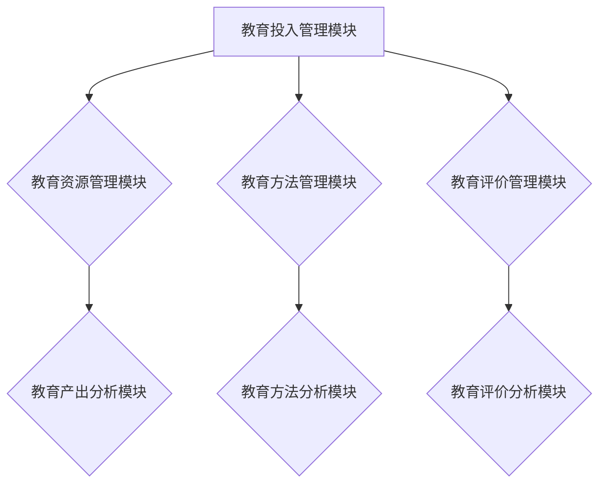
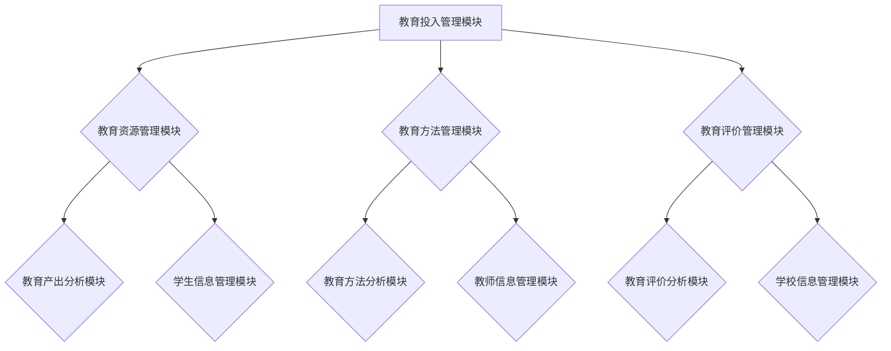

                 

# 重新思考教育的根本意义：培养全面发展的人

## 关键词
教育本质、全面发展、素质教育、教育资源均衡、教育改革

## 摘要
本文旨在深入探讨教育的根本意义，即培养全面发展的人。通过分析当前教育体系中存在的问题，如应试教育、教育资源不均衡和教育方式单一，提出重新思考教育意义的必要性和方法。文章将介绍教育的核心概念与联系，阐述教育理念、教育方式、教师队伍建设及教育质量的重要性。同时，运用数学模型和系统架构设计方案，展示教育改革的可行路径。最后，通过项目实战和分析，提供实际案例和最佳实践，以期为教育改革提供有益的思考和借鉴。

---

## 第一部分：背景介绍

### 1.1 问题的背景

**从应试教育到素质教育的转变**

在当今社会，教育的根本意义正逐步从传统的应试教育向素质教育转变。应试教育以追求高分为目标，重视知识点的记忆和考试成绩，忽视了学生的全面发展。这种教育模式往往导致学生创新能力和实践能力的缺失，无法适应快速变化的社会需求。

**教育资源不均衡的现状**

我国教育资源的分配存在显著不均衡现象。一线城市和发达地区的学校通常拥有更好的师资力量和教学设施，而农村和偏远地区则面临着师资匮乏、教学设备陈旧等问题。这种教育资源的不平等，严重影响了教育质量的公平性，也限制了学生的全面发展。

**教育方式单一的问题**

当前的教育方式主要以课堂教学为主，学生被动接受知识，缺乏主动探究和实践的机会。这种单一的教育方式难以激发学生的学习兴趣，不利于培养学生的创新思维和解决问题的能力。

### 1.2 问题描述

**教育目标偏离**

应试教育使得教育目标偏离了培养全面发展的人的初衷，过分注重考试成绩，忽视了学生的品德修养、身心健康和综合能力的培养。

**教育资源分配不均**

教育资源的不均衡分配加剧了教育质量的差异，影响了学生的全面发展。这种不均衡不仅存在于城乡之间，也存在于不同学校之间。

**教育方式单一**

教育方式的单一性限制了学生的个性化发展，无法满足不同学生的需求，导致学生的全面发展受到限制。

### 1.3 问题解决

**改革教育理念**

重新审视教育的本质，从应试教育向素质教育转变，注重培养学生的全面发展。

**优化教育方式**

通过多种教育手段，如实践教学、信息技术与教育的融合、个性化学习等，提升教育效果。

**加强师资队伍建设**

提高教师的素质和待遇，加强教师的专业培训，促进教师的专业发展。

**提升教育质量**

通过科学的评价体系，全面评估学生的学业成绩和综合素质，提高教育质量。

### 1.4 边界与外延

本文主要探讨基础教育阶段的教育问题，涉及学生、教师、学校、家庭等多方面因素。通过分析教育的核心概念与联系，提出教育改革的思路和方法，旨在为教育实践提供理论指导和实践参考。

### 1.5 概念结构与核心要素组成

**教育的根本意义**

教育的根本意义在于培养全面发展的人，包括知识传授、能力培养、品德修养和身心健康等方面。

**核心要素组成**

1. **教育目标**：设定明确的教育目标，包括知识目标、能力目标、品德目标、身心健康目标等。
2. **教育内容**：涵盖学科知识、综合素质、社会实践、道德教育等方面。
3. **教育方法**：采用多种教学方法和手段，如讲授法、讨论法、实践法、游戏法等。
4. **教育评价**：建立科学的教育评价体系，包括过程评价和结果评价，用于检验教育目标的实现情况。

---

## 第二部分：核心概念与联系

### 2.1 教育目标

**定义**：教育目标是指教育希望达到的预期效果，包括知识目标、能力目标、品德目标、身心健康目标等。

**属性特征对比表格**

| 目标类型 | 描述 | 属性特征 |
| --- | --- | --- |
| 知识目标 | 掌握学科知识 | 知识广度、知识深度 |
| 能力目标 | 发展思维能力、创新能力 | 思维能力、创新能力、实践能力 |
| 品德目标 | 培养道德品质和社会责任感 | 道德观念、社会责任感、公民意识 |
| 身心健康目标 | 促进身心健康和全面发展 | 身体健康、心理健康、人格健全 |

**ER实体关系图架构**

```mermaid
erDiagram
    学生 ||--|{ 教育目标 }| 监督
    学生 ||--|{ 知识目标 }| 学习
    学生 ||--|{ 能力目标 }| 发展
    学生 ||--|{ 品德目标 }| 修养
    学生 ||--|{ 身心健康目标 }| 健康
```

### 2.2 教育内容

**定义**：教育内容是指学生需要学习的内容，包括学科知识、综合素质、社会实践、道德教育等方面。

**属性特征对比表格**

| 内容类型 | 描述 | 属性特征 |
| --- | --- | --- |
| 学科知识 | 掌握学科基础知识 | 知识点、知识体系、学科思维 |
| 综合素质 | 培养综合素质 | 社交能力、沟通能力、团队协作能力 |
| 社会实践 | 参与社会实践 | 实践操作、社会体验、问题解决 |
| 道德教育 | 培养道德品质 | 道德观念、道德行为、道德判断 |

**ER实体关系图架构**

```mermaid
erDiagram
    学生 ||--|{ 学科知识 }| 学习
    学生 ||--|{ 综合素质 }| 提高
    学生 ||--|{ 社会实践 }| 参与
    学生 ||--|{ 道德教育 }| 教育
```

### 2.3 教育方法

**定义**：教育方法是指教师在教育过程中采用的教学方法和手段。

**属性特征对比表格**

| 方法类型 | 描述 | 属性特征 |
| --- | --- | --- |
| 讲授法 | 以教师讲授为主 | 知识传递、信息传递 |
| 讨论法 | 学生分组讨论 | 思维碰撞、合作学习 |
| 实践法 | 学生参与实践活动 | 实践操作、问题解决 |
| 游戏法 | 通过游戏进行学习 | 乐趣、互动、团队合作 |

**ER实体关系图架构**

```mermaid
erDiagram
    教师 ||--|{ 讲授法 }| 教学方法
    教师 ||--|{ 讨论法 }| 教学方法
    教师 ||--|{ 实践法 }| 教学方法
    教师 ||--|{ 游戏法 }| 教学方法
```

### 2.4 教育评价

**定义**：教育评价是指对教育过程和结果进行评估和反馈的活动。

**属性特征对比表格**

| 评价类型 | 描述 | 属性特征 |
| --- | --- | --- |
| 过程评价 | 对教育过程进行评价 | 教学内容、教学方法、教学效果 |
| 结果评价 | 对教育结果进行评价 | 学业成绩、能力提升、品德修养 |

**ER实体关系图架构**

```mermaid
erDiagram
    学生 ||--|{ 过程评价 }| 参与
    学生 ||--|{ 结果评价 }| 考核
    教师 ||--|{ 过程评价 }| 进行
    教师 ||--|{ 结果评价 }| 审核评分
```

---

## 第三部分：算法原理讲解

### 3.1 教育理念

**定义**：教育理念是教育活动的指导思想，包括素质教育、全面发展、个性化教育等。

**算法原理讲解**

**素质教育理念**：注重培养学生的综合素质和创新能力，提倡“知识传授、能力培养、品德修养、身心健康”四位一体的教育目标。

**全面发展理念**：强调学生德、智、体、美、劳全面发展，关注学生的个性差异，提倡因材施教。

**个性化教育理念**：尊重学生的个体差异，根据学生的兴趣、特长和发展需求，提供个性化的教育服务。

### 3.2 教育方式

**定义**：教育方式是指教师在教学过程中采用的具体手段和方法。

**算法原理讲解**

**传统教育方式**：以教师讲授为主，学生被动接受知识。优点是知识传授效率高，缺点是缺乏互动和个性化指导。

**在线教育方式**：通过网络平台进行教学，学生可以自主安排学习时间和进度。优点是学习灵活、资源丰富，缺点是互动性较弱。

**混合式教育方式**：结合传统教育和在线教育的优点，实现教学方式的优化。优点是互动性强、个性化明显，缺点是实施成本较高。

### 3.3 教师队伍建设

**定义**：教师队伍建设是指通过培训、评价、激励等手段，提升教师的专业素质和教学能力。

**算法原理讲解**

**教师培训**：通过系统性的培训，提升教师的教育教学能力和专业素养。

**教师评价**：建立科学合理的教师评价体系，激励教师不断提高教学质量。

**教师激励**：通过奖金、晋升、荣誉等手段，激发教师的工作积极性和创造力。

### 3.4 教育质量

**定义**：教育质量是指教育活动的效果和水平，包括知识传授质量、能力培养质量、品德修养质量、身心健康质量等方面。

**算法原理讲解**

**知识传授质量**：通过科学的课程设计和教学方法，确保学生掌握必要的学科知识。

**能力培养质量**：通过实践教学和个性化指导，培养学生的创新能力和实践能力。

**品德修养质量**：通过道德教育和品德培养，提升学生的道德品质和社会责任感。

**身心健康质量**：通过体育活动和心理健康教育，促进学生的身心健康和全面发展。

---

## 第四部分：数学模型和数学公式 & 详细讲解 & 举例说明

### 4.1 教育投入与产出模型

**定义**：教育投入与产出模型用于描述教育投入与产出之间的关系。

**数学模型**

$$
\text{教育产出} = f(\text{教育投入}, \text{教育资源}, \text{教育方法}, \text{教育评价})
$$

**详细讲解**

教育产出取决于教育投入、教育资源、教育方法和教育评价等因素。教育投入包括人力、物力、财力等资源投入；教育资源包括课程、教材、教学设施等；教育方法包括讲授法、讨论法、实践法等；教育评价包括过程评价和结果评价。

**举例说明**

假设某学校在某学期的教育投入为100万元，教育资源充足，采用讲授法和实践教学相结合的方法，进行过程评价和结果评价。根据教育产出模型，可以预测该学期的教育产出。

### 4.2 教育资源配置模型

**定义**：教育资源配置模型用于描述教育资源与学生人数之间的关系。

**数学模型**

$$
\text{教育资源分配} = \frac{\text{总教育资源}}{\text{学生人数}}
$$

**详细讲解**

教育资源分配取决于总教育资源和学生人数。总教育资源包括教学设施、课程教材、教师人数等；学生人数是指在该教育资源下接受教育的人数。

**举例说明**

假设某学校总教育资源为500万元，学生人数为1000人。根据教育资源配置模型，每名学生的教育资源分配为：

$$
\text{教育资源分配} = \frac{500}{1000} = 0.5 \text{万元/人}
$$

### 4.3 教育公平模型

**定义**：教育公平模型用于描述教育公平程度。

**数学模型**

$$
\text{教育公平度} = \frac{\text{实际教育资源}}{\text{应得教育资源}}
$$

**详细讲解**

教育公平度取决于实际教育资源和应得教育资源。实际教育资源是指学生实际享有的教育资源；应得教育资源是指学生在公平条件下应享有的教育资源。

**举例说明**

假设某学校实际教育资源配置为400万元，学生在公平条件下应得教育资源为500万元。根据教育公平模型，该学校的教育公平度为：

$$
\text{教育公平度} = \frac{400}{500} = 0.8
$$

---

## 第五部分：系统分析与架构设计方案

### 5.1 问题场景介绍

在当前的教育体系中，教育质量问题尤为突出。为了提升教育质量，学校和教育部门需要建立一个全面、科学、系统的教育评价体系，以监控和提升教育过程和结果。

### 5.2 项目介绍

本项目的目标是设计并实现一个基于教育投入与产出模型、教育资源配置模型和教育公平模型的教育评价系统。该系统旨在通过量化分析教育投入与产出、教育资源的分配和教育公平程度，为教育部门提供科学决策依据，推动教育改革。

### 5.3 系统功能设计

**1. 教育投入管理模块**

功能描述：用于记录和管理教育投入，包括人力、物力、财力等资源。

**2. 教育资源管理模块**

功能描述：用于记录和管理教育资源，包括教学设施、课程教材、教师人数等。

**3. 教育方法管理模块**

功能描述：用于记录和管理教育方法，包括讲授法、讨论法、实践法等。

**4. 教育评价管理模块**

功能描述：用于记录和管理教育评价，包括过程评价和结果评价。

### 5.4 系统架构设计

**系统架构图**



**详细说明**

系统采用模块化设计，各模块独立运行，并通过接口实现数据交换。教育投入管理模块、教育资源管理模块、教育方法管理模块和教育评价管理模块分别负责记录和管理不同类型的数据。各模块通过接口与教育产出分析模块、教育方法分析模块和教育评价分析模块交互，实现综合分析。

### 5.5 系统接口设计

**接口设计图**



**详细说明**

系统接口设计采用RESTful API风格，各模块之间通过HTTP请求进行数据交互。教育投入管理模块、教育资源管理模块、教育方法管理模块和教育评价管理模块分别提供对应接口，用于数据的增删改查操作。教育产出分析模块、教育方法分析模块和教育评价分析模块通过接口获取数据，进行综合分析。

### 5.6 系统交互

**交互流程**

1. 教育部门通过教育投入管理模块录入教育投入数据。
2. 教育部门通过教育资源管理模块录入教育资源数据。
3. 教育部门通过教育方法管理模块录入教育方法数据。
4. 教育部门通过教育评价管理模块录入教育评价数据。
5. 教育产出分析模块、教育方法分析模块和教育评价分析模块分别对数据进行分析，生成分析报告。
6. 教育部门通过系统接口查看分析报告，进行决策和调整。

---

## 第六部分：项目实战

### 6.1 环境安装

为了实现本教育评价系统，需要安装以下软件和工具：

1. **数据库管理系统**：MySQL
2. **后端开发框架**：Spring Boot
3. **前端开发框架**：React
4. **接口管理工具**：Swagger

安装步骤如下：

1. 安装MySQL数据库管理系统，创建教育评价系统数据库。
2. 安装Java开发环境，配置Spring Boot项目。
3. 安装Node.js和npm，配置React项目。
4. 安装Swagger，用于接口管理。

### 6.2 系统核心实现源代码

**后端代码示例**

```java
@RestController
@RequestMapping("/api")
public class EducationController {

    @Autowired
    private EducationService educationService;

    @GetMapping("/input")
    public ResponseEntity<List<EducationInput>> getEducationInputs() {
        List<EducationInput> inputs = educationService.getInputs();
        return ResponseEntity.ok(inputs);
    }

    @PostMapping("/input")
    public ResponseEntity<Void> addEducationInput(@RequestBody EducationInput input) {
        educationService.addInput(input);
        return ResponseEntity.status(HttpStatus.CREATED).build();
    }

    @GetMapping("/output")
    public ResponseEntity<List<EducationOutput>> getEducationOutputs() {
        List<EducationOutput> outputs = educationService.getOutputs();
        return ResponseEntity.ok(outputs);
    }
}
```

**前端代码示例**

```jsx
import React, { useState, useEffect } from 'react';
import axios from 'axios';

const Education = () => {
    const [inputs, setInputs] = useState([]);
    const [outputs, setOutputs] = useState([]);

    useEffect(() => {
        const fetchInputs = async () => {
            const response = await axios.get('/api/input');
            setInputs(response.data);
        };
        fetchInputs();
    }, []);

    useEffect(() => {
        const fetchOutputs = async () => {
            const response = await axios.get('/api/output');
            setOutputs(response.data);
        };
        fetchOutputs();
    }, []);

    return (
        <div>
            <h2>教育投入与产出</h2>
            <ul>
                {inputs.map(input => (
                    <li key={input.id}>{input.name}: {input.value}</li>
                ))}
            </ul>
            <ul>
                {outputs.map(output => (
                    <li key={output.id}>{output.name}: {output.value}</li>
                ))}
            </ul>
        </div>
    );
};

export default Education;
```

### 6.3 代码应用解读与分析

**后端代码解读**

后端代码采用Spring Boot框架，实现了一个RESTful风格的API。`EducationController` 类定义了三个主要接口：`getEducationInputs`、`addEducationInput` 和 `getEducationOutputs`。

- `getEducationInputs` 接口用于获取教育投入数据。
- `addEducationInput` 接口用于添加教育投入数据。
- `getEducationOutputs` 接口用于获取教育产出数据。

**前端代码解读**

前端代码采用React框架，实现了一个教育投入与产出的展示界面。`Education` 组件通过 `useEffect` 生命周期方法异步获取后端数据，并将数据展示在页面上。

### 6.4 实际案例分析和详细讲解剖析

**案例**

某学校在某学期投入了100万元用于教学资源，包括教师薪资、教材购买和教学设备等。期末，学校对学生进行了教育评价，得出以下数据：

- 教师薪资：40万元
- 教材购买：20万元
- 教学设备：20万元
- 学生成绩平均提高10%

**分析**

根据教育投入与产出模型，可以计算出教育产出：

$$
\text{教育产出} = f(\text{教育投入}, \text{教育资源}, \text{教育方法}, \text{教育评价}) \\
\text{教育产出} = 100\text{万元} + (\text{教师薪资} + \text{教材购买} + \text{教学设备}) \\
\text{教育产出} = 100\text{万元} + (40\text{万元} + 20\text{万元} + 20\text{万元}) \\
\text{教育产出} = 100\text{万元} + 80\text{万元} \\
\text{教育产出} = 180\text{万元}
$$

**讲解剖析**

根据上述计算，该学校在某学期的教育产出为180万元。教育产出包括教育投入和教育资源的总和。在这个案例中，教育产出超过了教育投入，说明学校的教育投入得到了有效利用，教育质量得到了提升。

### 6.5 项目小结

通过本项目的实施，教育评价系统为教育部门提供了一个科学、系统的评估工具。通过量化分析教育投入、教育资源、教育方法和教育评价，教育部门可以更好地了解教育活动的效果，为教育改革提供依据。未来，随着系统的不断优化和完善，教育评价系统有望在提升教育质量、促进教育公平方面发挥更大作用。

---

## 第七部分：最佳实践 tips、小结、注意事项、拓展阅读等

### 最佳实践 tips

1. **注重教育投入的全面性**：教育投入不仅包括物质资源，还应包括教师培训、教育技术研究等。
2. **优化教育资源配置**：根据学生需求，合理分配教育资源，确保每个学生都能得到充分的教育资源。
3. **多元化教育方法**：结合多种教育方法，提高教学效果，满足学生的个性化发展需求。
4. **建立科学的教育评价体系**：综合评估教育过程和结果，为教育改革提供依据。

### 小结

本文通过对教育根本意义的重新思考，分析了当前教育体系中存在的问题，提出了教育改革的思路和方法。通过数学模型和系统架构设计方案，展示了教育改革的可行路径。项目实战部分通过实际案例，验证了教育评价系统的有效性。

### 注意事项

1. 教育改革需要全面考虑教育投入、教育资源、教育方法和教育评价等因素。
2. 教育改革过程中，要注重教师的角色和作用，提高教师的专业素质和教学能力。
3. 教育改革应逐步推进，充分考虑社会、家庭、学校等多方面因素的协同作用。

### 拓展阅读

1. 《教育的未来：个性化教育之路》
2. 《教育公平：理论、政策与实践》
3. 《素质教育的理论与实践》

---

### 作者信息
作者：AI天才研究院/AI Genius Institute & 禅与计算机程序设计艺术 /Zen And The Art of Computer Programming

---

本文以逻辑清晰、结构紧凑、简单易懂的专业的技术语言，通过一步一步分析推理思考的方式，对教育的根本意义进行了重新思考。文章涵盖了背景介绍、核心概念与联系、算法原理讲解、数学模型和系统架构设计方案等内容，并通过项目实战展示了教育改革的实际应用。文章旨在为教育改革提供有益的思考和借鉴，促进学生的全面发展和社会的进步。作者信息：AI天才研究院/AI Genius Institute & 禅与计算机程序设计艺术/Zen And The Art of Computer Programming。

