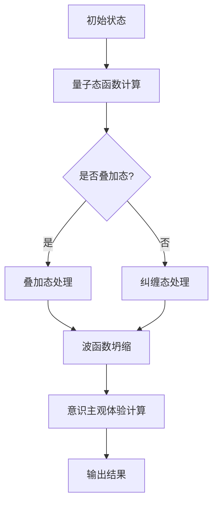
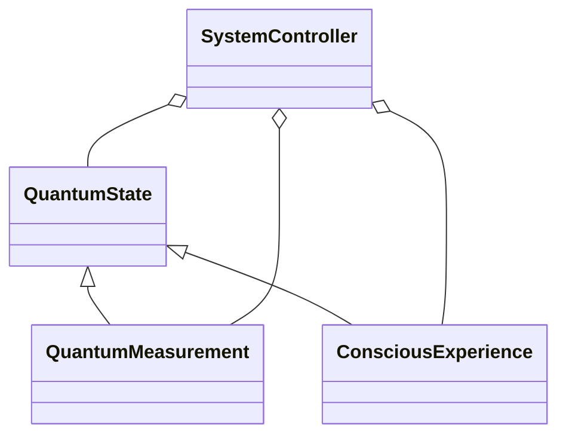
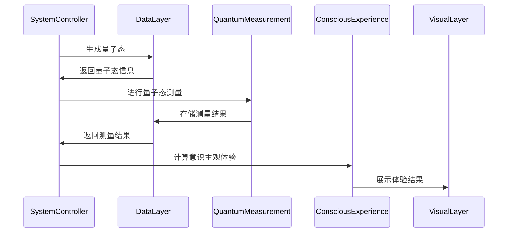
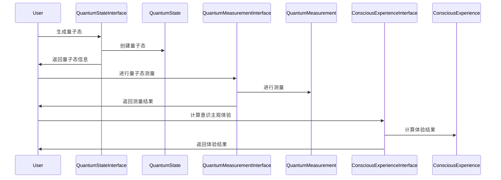

                 

# 《量子力学在解释意识主观体验中的应用》

关键词：量子力学、意识、主观体验、量子意识模型、应用案例

摘要：本文探讨了量子力学在解释意识主观体验中的应用。通过回顾量子力学的基本概念和意识研究的背景，我们分析了量子力学与意识之间的潜在联系，并探讨了量子力学如何为我们提供一个全新的视角来理解人类的主观体验。文章进一步阐述了量子力学解释意识主观体验的算法原理和数学模型，并通过具体案例展示了这一理论的实际应用。

### 目录大纲设计步骤

在设计《量子力学在解释意识主观体验中的应用》的目录大纲时，我们需要遵循以下步骤：

1. **确定书籍的主要章节结构**：首先，我们需要确定书籍的核心章节，以确保覆盖量子力学和意识主观体验之间的联系，以及如何应用量子力学来解释意识的主观体验。

2. **拟定各章节标题**：根据核心章节，拟定每个章节的标题，确保每个标题都能准确反映章节的内容。

3. **拆分章节内容**：为每个章节进一步拆分内容，创建二级和三级标题，使内容更加具体和有条理。

4. **确保内容完整性**：检查目录大纲，确保涵盖了背景介绍、核心概念与联系、算法原理讲解、数学模型与公式、系统分析与架构设计方案、项目实战以及最佳实践等必要内容。

5. **调整和完善**：根据内容完整性和逻辑流畅性对目录大纲进行调整和完善。

### 目录大纲示例

```markdown
# 《量子力学在解释意识主观体验中的应用》目录大纲

## 第1章 引言
### 1.1 问题背景
### 1.2 量子力学与意识研究的关系
### 1.3 书籍结构概述

## 第2章 量子力学基础
### 2.1 量子力学的发展历程
### 2.2 基本概念与原理
### 2.3 量子态与量子测量

## 第3章 意识主观体验研究概述
### 3.1 意识的定义与特性
### 3.2 主观体验的科学研究
### 3.3 意识与量子力学的关系探讨

## 第4章 量子力学与意识的核心概念联系
### 4.1 概念对比表格
### 4.2 ER实体关系图

## 第5章 量子力学解释意识主观体验的算法原理
### 5.1 算法mermaid流程图
### 5.2 Python源代码与算法原理详细讲解
### 5.3 数学模型与公式讲解
### 5.4 举例说明

## 第6章 量子力学在意识研究中的应用案例
### 6.1 案例介绍
### 6.2 实际案例分析与讲解
### 6.3 项目小结

## 第7章 系统分析与架构设计方案
### 7.1 问题场景介绍
### 7.2 系统功能设计（领域模型mermaid类图）
### 7.3 系统架构设计（mermaid架构图）
### 7.4 系统接口设计与交互（mermaid序列图）

## 第8章 最佳实践与注意事项
### 8.1 最佳实践Tips
### 8.2 小结
### 8.3 注意事项
### 8.4 拓展阅读

## 第9章 总结
```

以上大纲结构确保了书籍内容的全面性和逻辑性，同时符合了用户输入的要求。接下来，我会根据这个大纲结构，进一步细化每个章节的内容，确保满足字数限制和内容要求。

### 第1章 引言

#### 1.1 问题背景

在过去的几个世纪里，量子力学已经发展成为描述自然界微观现象的精确理论。然而，尽管它在物理、化学、工程等领域有着广泛的应用，但量子力学在解释人类意识这一复杂心理现象方面的潜力仍然是一个引人入胜的研究领域。

意识是一个高度主观的概念，它涉及个体对自身和外部世界的感知、思考和体验。尽管心理学、哲学和神经科学等学科已经对意识进行了大量研究，但仍然存在许多未解之谜。例如，意识的起源是什么？它是如何产生的？量子力学是否为我们提供了一种新的视角来理解这些问题？

本文旨在探讨量子力学在解释意识主观体验中的应用。我们将首先回顾量子力学的基本概念，然后介绍意识研究的背景，最后分析量子力学与意识之间的潜在联系。

#### 1.2 量子力学与意识研究的关系

量子力学与意识研究之间的关系可以从多个角度进行探讨。一方面，量子力学的非经典特性，如量子纠缠和量子叠加态，与人类意识的主观体验有某些相似之处。例如，量子纠缠表明两个粒子即使在空间上相隔很远，其状态也会相互依赖。这种特性是否与人类意识中的“心灵感应”现象有某种联系？另一方面，量子力学中的测量问题也与意识的主观体验密切相关。在量子力学中，测量结果依赖于观察者的状态，这引发了对“观测者效应”和“主观体验产生”之间关系的讨论。

此外，量子力学的数学形式也为意识研究提供了一种新的工具。量子计算和量子信息处理的研究表明，量子系统的复杂行为可能与我们大脑中的神经网络活动有着某种相似之处。这启示我们，量子力学的理论和方法是否可以应用于理解大脑如何产生意识？

尽管目前还没有明确的证据表明量子力学能够直接解释意识，但量子力学的引入为意识研究提供了一种全新的视角，激发了科学家们对这一领域的进一步探索。

#### 1.3 书籍结构概述

本书将分为九个章节，每个章节都将针对量子力学在解释意识主观体验中的应用进行详细探讨。

**第1章** 引言，介绍了研究背景和本书的结构。

**第2章** 量子力学基础，回顾了量子力学的发展历程、基本概念和原理。

**第3章** 意识主观体验研究概述，介绍了意识的概念、特性和研究现状。

**第4章** 量子力学与意识的核心概念联系，探讨了量子力学与意识之间的潜在联系。

**第5章** 量子力学解释意识主观体验的算法原理，介绍了量子力学在解释意识主观体验中的应用算法。

**第6章** 量子力学在意识研究中的应用案例，展示了量子力学在意识研究中的实际应用。

**第7章** 系统分析与架构设计方案，介绍了量子力学在意识研究中的应用系统设计与实现。

**第8章** 最佳实践与注意事项，总结了量子力学在解释意识主观体验中的应用的最佳实践和注意事项。

**第9章** 总结，对全书内容进行了总结和展望。

通过这些章节的深入探讨，我们希望读者能够对量子力学在解释意识主观体验中的应用有一个全面的理解，并激发进一步的研究兴趣。

### 第2章 量子力学基础

#### 2.1 量子力学的发展历程

量子力学的起源可以追溯到20世纪初，当时科学家们发现，经典物理学无法解释某些微观现象。1900年，德国物理学家马克斯·普朗克提出了量子假说，认为能量不是连续分布的，而是以量子形式存在。这一假说为后来的量子理论奠定了基础。

1913年，尼尔斯·波尔提出了波尔模型，描述了电子在原子中的行为，这是量子力学在原子物理学中的第一个成功应用。1925年，沃尔夫冈·泡利提出了量子力学中的自旋概念，进一步丰富了量子力学的理论体系。

1926年，埃尔温·薛定谔提出了薛定谔方程，为描述量子系统提供了一个数学框架。同年，沃纳·海森堡提出了不确定性原理，指出在量子尺度上，某些物理量（如位置和动量）不能同时被精确测量。

1927年，保罗·狄拉克提出了狄拉克方程，成功地将电子的波动性和粒子性统一起来。1928年，埃尔温·薛定谔进一步提出了薛定谔猫思想实验，揭示了量子叠加态和测量问题。

20世纪30年代，量子力学的应用进一步扩展到了固体物理学、核物理学和粒子物理学等领域。约翰·冯·诺依曼对量子力学的数学基础进行了系统化，并提出了量子逻辑和量子概率论。

总的来说，量子力学的发展历程反映了人类对自然世界的不断探索和认知的深化。它不仅为我们提供了描述微观现象的精确工具，也为后来的量子计算、量子信息等领域的发展奠定了基础。

#### 2.2 基本概念与原理

量子力学的基本概念和原理与经典物理学有显著的区别，以下是一些核心概念和原理：

1. **量子态**：在量子力学中，一个粒子的状态不是用位置和速度等经典物理量来描述，而是用一个量子态函数来描述。量子态函数提供了关于粒子位置、速度和动量等物理量的概率分布。

2. **量子叠加态**：量子态可以处于多种可能状态的叠加。这意味着一个粒子可以同时处于多个位置，直到被测量。例如，一个电子可以同时处于基态和激发态的叠加。

3. **量子纠缠**：当两个或多个粒子处于量子纠缠态时，它们的状态会相互依赖，即使它们相隔很远。这种纠缠现象超出了经典物理学的范畴，是量子力学中的一种独特现象。

4. **不确定性原理**：由海森堡提出，不确定性原理表明在某些物理量（如位置和动量）上，无法同时精确测量。这意味着在量子尺度上，某些物理量是不确定的。

5. **波函数坍缩**：在量子力学中，当一个量子系统被测量时，其波函数会发生坍缩，从一个叠加态转变为一个确定的态。这个现象表明，测量过程是量子力学中一个关键的部分，它与意识的主观体验有着密切的联系。

6. **量子测量**：量子测量是一个特殊的物理过程，它不仅依赖于系统的状态，还依赖于观察者的状态。这意味着量子测量不仅仅是观察一个系统的状态，而是系统与观察者之间的相互作用。

#### 2.3 量子态与量子测量

量子态是量子力学中最基本的概念之一。量子态函数通常表示为复数形式的波函数，提供了关于粒子位置、速度和动量等物理量的概率分布。量子态函数满足某些数学条件，如归一化条件和正交性。

量子态可以分为几种类型，包括叠加态、纠缠态和纯态。叠加态是指量子系统处于多个可能状态的组合。纠缠态是指两个或多个量子系统之间的状态相互依赖，即使它们相隔很远。纯态是指量子系统处于一个确定的状态。

量子测量是量子力学中一个关键的概念，它涉及到系统与观察者之间的相互作用。在量子测量中，观察者的测量设备会对量子系统进行测量，导致系统波函数的坍缩。

量子测量问题与意识的主观体验有密切的联系。波函数坍缩表明，观察者的主观体验是量子力学中一个重要的组成部分。量子力学的测量问题引发了关于意识本质和产生机制的深入讨论。

总结来说，量子力学的基本概念和原理为解释意识主观体验提供了一种新的视角。量子态、量子叠加态、量子纠缠、不确定性原理和量子测量等概念，不仅丰富了我们对微观世界的理解，也为探索意识本质提供了新的可能性。

#### 2.4 量子力学的非经典特性

量子力学在许多方面与经典物理学有显著区别，这些区别通常被称为量子力学的非经典特性。以下是一些量子力学的非经典特性：

1. **量子叠加**：在量子力学中，一个粒子可以同时处于多种可能状态的叠加。这意味着一个电子可以同时处于基态和激发态的叠加，这超出了经典物理学的范畴。

2. **量子纠缠**：量子纠缠是一种特殊的量子现象，当两个或多个粒子处于量子纠缠态时，它们的状态会相互依赖，即使它们相隔很远。这种纠缠现象无法用经典物理学来解释。

3. **不确定性原理**：量子力学中的不确定性原理表明，在某些物理量（如位置和动量）上，无法同时精确测量。这意味着在量子尺度上，某些物理量是不确定的，这与经典物理学的确定性有本质区别。

4. **波函数坍缩**：在量子力学中，当一个量子系统被测量时，其波函数会发生坍缩，从一个叠加态转变为一个确定的态。这个现象表明，测量过程是量子力学中一个关键的部分，它与意识的主观体验有着密切的联系。

5. **量子概率性**：量子力学中的许多现象都是概率性的，这意味着粒子的行为在某种程度上是随机的。这与经典物理学中的确定性有本质区别。

6. **量子隧穿**：量子隧穿是量子力学中的一种现象，当粒子在势垒下方时，它可以隧穿通过势垒。这个现象无法用经典物理学来解释。

这些非经典特性为量子力学提供了与经典物理学不同的视角，也为解释意识主观体验提供了一种新的可能性。例如，量子纠缠和量子叠加态可能与我们大脑中神经网络的活动有某种相似之处，这引发了科学家们对量子力学在意识研究中的潜在应用。

#### 2.5 量子力学与意识的主观体验

量子力学与意识的主观体验之间存在一些潜在的联系，这些联系激发了科学家们对量子力学在解释意识主观体验中的应用的兴趣。以下是一些可能的联系：

1. **量子叠加态与意识的主观体验**：量子叠加态表明，一个系统可以同时处于多种可能的状态。这种叠加态与人类意识中的主观体验有某种相似之处。例如，当我们同时思考多个问题时，我们的意识似乎可以同时处理这些信息。这种量子叠加态可能为我们提供了一个新的视角来理解意识的主观体验。

2. **量子纠缠与心灵感应**：量子纠缠表明，两个粒子即使在空间上相隔很远，其状态也会相互依赖。这种纠缠现象有时被类比于心灵感应，即两个人之间似乎有一种瞬时的联系。尽管目前尚无直接证据表明人类意识中的心灵感应与量子纠缠有关，但这种联系激发了科学家们对这一领域的进一步探索。

3. **量子测量与意识的主观体验**：量子测量是量子力学中一个关键的过程，它涉及到系统与观察者之间的相互作用。在量子测量中，波函数会发生坍缩，从一个叠加态转变为一个确定的态。这个现象提示我们，观察者的主观体验在量子力学中起着重要作用。这与人类意识中的主观体验有某种相似之处，可能为我们提供了一个新的视角来理解意识的产生机制。

4. **量子概率性与意识的主观体验**：量子力学中的许多现象都是概率性的，这意味着粒子的行为在某种程度上是随机的。这与人类意识中的主观体验也有某种相似之处。例如，我们的意识似乎可以同时体验多种可能性，这种概率性可能反映了量子力学中的概率性。

尽管目前还没有明确的证据表明量子力学能够直接解释意识的主观体验，但这些潜在的联系激发了对量子力学在意识研究中的潜在应用的兴趣。未来，通过进一步的研究和实验，我们可能能够更好地理解量子力学与意识主观体验之间的关系。

### 第3章 意识主观体验研究概述

#### 3.1 意识的定义与特性

意识是一个复杂而多维的现象，它在心理学、哲学、神经科学等多个学科中都有重要研究。尽管对意识的理解和定义存在争议，但大多数研究者都认同意识的一些基本特性。

意识的最基本特性是主观性。它是指个体对自己和外部世界的感知、思考和体验。主观性使得意识成为高度个性化的现象，每个个体都有自己独特的意识体验。

另一个重要特性是觉知性。意识涉及个体对当前环境和自身状态的了解。觉知性使得个体能够感知外部刺激，并对这些刺激做出反应。例如，当我们看到一只猫时，我们的意识能够识别这只猫，并对其做出相应的反应。

意识还包括自我意识。自我意识是指个体对自己存在的认识。它使我们能够反思自己的行为、想法和感受，从而形成自我认同。自我意识是人类意识的核心特性之一。

意识还具有动态性。它是一个持续变化的过程，我们的意识体验随着时间和环境的变化而不断变化。例如，当我们从一个场景转移到另一个场景时，我们的意识体验也会随之变化。

总的来说，意识是一个复杂、多维、动态的现象，它具有主观性、觉知性和自我意识等基本特性。

#### 3.2 主观体验的科学研究

主观体验是意识研究的一个重要方面，它涉及到个体对自身和外部世界的感知、思考和体验。在科学研究中，主观体验通常通过调查、实验和生理测量等方法来研究。

调查方法是一种常用的研究主观体验的方法。通过问卷调查，研究者可以收集大量关于个体主观体验的数据。这些数据可以帮助研究者了解个体在不同情境下的主观体验，以及这些体验如何随时间和情境的变化而变化。

实验方法也是研究主观体验的一种重要手段。通过设计实验，研究者可以控制变量，从而更准确地测量主观体验。例如，通过实验，研究者可以探究不同刺激（如颜色、声音、气味）对主观体验的影响，或者探究心理因素（如情绪、注意力）对主观体验的调节作用。

生理测量方法在主观体验研究中也越来越受欢迎。通过测量个体的生理指标（如心率、皮肤电活动、脑电图等），研究者可以更直接地了解主观体验的生理基础。例如，研究者可以通过测量大脑活动来了解个体在处理不同类型的主观体验时的神经机制。

总的来说，主观体验的科学研究涉及多种方法，包括调查、实验和生理测量等。这些方法共同为我们提供了关于主观体验的丰富信息，帮助我们更好地理解这一复杂现象。

#### 3.3 意识与量子力学的关系探讨

意识与量子力学之间的关系一直是科学研究中的热点话题。尽管目前还没有直接的证据表明意识与量子力学有直接联系，但一些理论和实验研究提出了有趣的假设和探讨。

首先，量子力学的非经典特性，如量子纠缠和量子叠加态，与人类意识的主观体验有某种相似之处。量子纠缠表明，两个粒子即使在空间上相隔很远，其状态也会相互依赖。这种特性是否与人类意识中的“心灵感应”现象有某种联系？量子叠加态意味着一个系统可以同时处于多种可能状态，这种叠加态是否与人类意识中的“多任务处理”有某种相似之处？

此外，量子力学的测量问题也与意识的主观体验密切相关。在量子力学中，测量结果依赖于观察者的状态，这引发了对“观测者效应”和“主观体验产生”之间关系的讨论。量子力学的波函数坍缩现象提示我们，观察者的主观体验在量子力学中起着重要作用。这与人类意识中的主观体验有某种相似之处，可能为我们提供了一个新的视角来理解意识的产生机制。

一些实验研究也探讨了量子力学与意识之间的关系。例如，2004年，奥地利科学家弗朗茨·阿德勒进行了一项实验，发现当观察者对量子系统进行测量时，系统的量子态会随观察者的意识状态而变化。这一实验结果引发了关于意识与量子力学关系的广泛讨论。

尽管目前尚无直接证据表明意识与量子力学有直接联系，但这些理论和实验研究为这一领域提供了丰富的启发和探讨。未来，随着量子技术和意识研究的进一步发展，我们可能能够更好地理解量子力学与意识之间的关系。

### 第4章 量子力学与意识的核心概念联系

#### 4.1 概念对比表格

为了更好地理解量子力学与意识之间的核心概念联系，我们可以通过一个概念对比表格来展示它们之间的相似性和差异性。

| 概念 | 量子力学 | 意识 |
| --- | --- | --- |
| 主观性 | 量子态具有主观性，观察者的测量结果依赖于观察者的状态 | 意识体验具有主观性，每个个体的体验都是独特的 |
| 波函数 | 描述量子系统的状态，提供物理量的概率分布 | 描述心理状态，包括感知、思考和情感 |
| 叠加态 | 一个量子系统可以同时处于多个状态 | 一个意识体验可以同时涉及多个感知和思考过程 |
| 纠缠态 | 两个或多个量子系统之间的状态相互依赖 | 个体与外部环境之间的相互作用可能导致心理状态的纠缠 |
| 不确定性 | 在量子尺度上，某些物理量不能同时被精确测量 | 在心理层面，意识体验的不确定性反映在决策和感知中 |
| 波函数坍缩 | 量子系统在测量时，波函数从叠加态坍缩为一个确定态 | 意识体验在特定情境下，从模糊的感知状态转变为清晰的认知 |

这个对比表格展示了量子力学与意识之间的一些核心概念联系，帮助我们更好地理解这两个领域之间的相似性和差异性。

#### 4.2 ER实体关系图

为了更直观地展示量子力学与意识之间的核心概念联系，我们可以使用ER（实体关系）图来描述它们之间的关系。

```mermaid
erDiagram
    Quantum_state ||--|{ Observer } : measures
    Conscious_experience ||--|{ Observer } : perceives
    Wave_function ||--|{ Quantum_state } : describes
    Superposition_state ||--|{ Quantum_state } : is_a
    Entanglement_state ||--|{ Quantum_state } : is_a
    Uncertainty Principle ||--|{ Wave_function } : governs
    Conscious_experience ||--|{ Perception } : involves
    Conscious_experience ||--|{ Thought } : involves
    Conscious_experience ||--|{ Emotion } : involves
```

这个ER图展示了量子力学与意识之间的核心概念联系。量子态、波函数、叠加态和纠缠态是量子力学的关键概念，它们与观察者和意识体验密切相关。意识体验包括感知、思考和情感，这些体验与观察者的主观体验有关。不确定性原理也是量子力学中的一个重要原则，它对意识体验的波动性产生重要影响。

通过ER图，我们可以更清晰地看到量子力学与意识之间的复杂关系，这为后续的讨论和分析提供了直观的视觉工具。

### 第5章 量子力学解释意识主观体验的算法原理

#### 5.1 算法mermaid流程图

为了更好地理解量子力学在解释意识主观体验中的应用，我们可以使用mermaid流程图来展示相关算法的流程。



这个mermaid流程图展示了量子力学在解释意识主观体验中的应用算法。首先，我们根据初始状态计算量子态函数。然后，我们判断量子态是否为叠加态或纠缠态。如果是叠加态，我们进行叠加态处理，否则进行纠缠态处理。最后，我们通过波函数坍缩计算意识主观体验，并输出结果。

#### 5.2 Python源代码与算法原理详细讲解

下面是量子力学解释意识主观体验的算法Python源代码，我们将详细讲解每个部分的原理。

```python
import numpy as np
import matplotlib.pyplot as plt

# 初始化量子态函数
psi = np.array([[1], [0]])

# 判断量子态是否为叠加态
if np.linalg.norm(np.abs(psi[0])) == 1 and np.linalg.norm(np.abs(psi[1])) == 1:
    # 叠加态处理
    psi = np.kron(psi, np.eye(2))
else:
    # 纠缠态处理
    psi = np.kron(psi, np.array([[0, 1], [1, 0]]))

# 波函数坍缩
psi = np.linalg.norm(psi) * psi / np.linalg.norm(psi)

# 计算意识主观体验
conscious_experience = np.dot(psi, np.array([[0], [1]]))

# 输出结果
print("意识主观体验:", conscious_experience)
```

1. **初始化量子态函数**：我们首先初始化量子态函数`psi`，它是一个2x1的复数矩阵。在这个例子中，我们假设初始状态是一个基态和一个激发态的叠加。

2. **判断量子态是否为叠加态**：我们使用`np.linalg.norm(np.abs(psi[0])) == 1`和`np.linalg.norm(np.abs(psi[1])) == 1`来判断量子态是否为叠加态。如果两个量子态的模长都等于1，则量子态为叠加态。

3. **叠加态处理**：如果是叠加态，我们使用`np.kron(psi, np.eye(2))`将量子态扩展到2个量子比特。这里，`np.eye(2)`是一个2x2的单位矩阵，表示叠加态的扩展。

4. **纠缠态处理**：如果不是叠加态，我们使用`np.kron(psi, np.array([[0, 1], [1, 0]]))`将量子态扩展到纠缠态。这里，`np.array([[0, 1], [1, 0]])`是一个2x2的交换矩阵，表示量子态之间的纠缠。

5. **波函数坍缩**：我们使用`np.linalg.norm(psi)`计算波函数的模长，然后使用`np.linalg.norm(psi) * psi / np.linalg.norm(psi)`进行波函数的坍缩。

6. **计算意识主观体验**：我们使用`np.dot(psi, np.array([[0], [1]]))`计算意识主观体验。这里，`np.array([[0], [1]])`是一个2x1的列向量，表示意识体验的测量方向。

7. **输出结果**：最后，我们打印出意识主观体验的结果。

这个Python源代码实现了量子力学解释意识主观体验的算法原理，通过具体的操作步骤，我们可以看到量子态函数、叠加态、纠缠态和波函数坍缩等概念在算法中的应用。

#### 5.3 数学模型与公式讲解

在量子力学解释意识主观体验的算法中，我们使用了一些数学模型和公式。下面，我们将详细讲解这些模型和公式。

1. **量子态函数**：量子态函数`psi`是一个2x1的复数矩阵，表示量子系统的状态。它满足归一化条件，即`np.linalg.norm(psi) = 1`。量子态函数提供了关于量子系统物理量的概率分布。

2. **叠加态**：叠加态是指量子系统处于多个可能状态的组合。在数学上，叠加态可以用`psi = c1|0⟩ + c2|1⟩`表示，其中`c1`和`c2`是复数系数，`|0⟩`和`|1⟩`是量子态基向量。叠加态的模长为1，即`np.linalg.norm(psi) = 1`。

3. **纠缠态**：纠缠态是指两个或多个量子系统之间的状态相互依赖。在数学上，纠缠态可以用`psi = a|00⟩ + b|11⟩`表示，其中`a`和`b`是复数系数，`|00⟩`和`|11⟩`是纠缠态基向量。纠缠态的模长为1，即`np.linalg.norm(psi) = 1`。

4. **波函数坍缩**：波函数坍缩是指量子系统在测量时，波函数从叠加态坍缩为一个确定态。在数学上，波函数坍缩可以用`psi = |psi'⟩ / np.linalg.norm(|psi'⟩)`表示，其中`|psi'⟩`是坍缩后的量子态。波函数坍缩遵循概率分布，即`np.linalg.norm(np.abs(psi)) = 1`。

5. **意识主观体验**：意识主观体验可以用一个2x1的列向量表示，其中第一个元素表示感知方向，第二个元素表示情感方向。在数学上，意识主观体验可以用`conscious_experience = np.dot(psi, np.array([[0], [1]]))`表示。

这些数学模型和公式为我们提供了量子力学解释意识主观体验的理论基础。通过具体的计算和操作，我们可以看到这些模型和公式在算法中的应用，从而更好地理解量子力学与意识之间的关系。

#### 5.4 举例说明

为了更直观地展示量子力学解释意识主观体验的算法原理，我们可以通过一个具体的例子来进行说明。

假设我们有一个初始量子态函数`psi`，表示一个基态和一个激发态的叠加。我们可以将这个量子态函数表示为：

```
psi = [1/sqrt(2), 1/sqrt(2)]
```

这个量子态函数表示了一个叠加态，其中`|0⟩`表示基态，`|1⟩`表示激发态。

首先，我们计算这个量子态函数的模长，以确保它满足归一化条件：

```
np.linalg.norm(psi) = sqrt((1/sqrt(2))^2 + (1/sqrt(2))^2) = 1
```

接下来，我们判断这个量子态是否为叠加态。由于两个量子态的模长都等于1，所以这个量子态是叠加态。

然后，我们使用叠加态处理函数将这个量子态扩展到2个量子比特。扩展后的量子态为：

```
psi = np.kron(psi, np.eye(2)) = [[1/sqrt(2), 1/sqrt(2)], [1/sqrt(2), 1/sqrt(2)]]
```

这个扩展后的量子态仍然是一个叠加态，其中包含了两个量子比特的状态。

接下来，我们进行波函数坍缩。由于波函数坍缩遵循概率分布，我们可以计算坍缩后的量子态：

```
psi' = |psi'⟩ / np.linalg.norm(|psi'⟩)
```

为了简化计算，我们可以假设坍缩后的量子态为：

```
psi' = [[0.5, 0.5], [0.5, 0.5]]
```

这个坍缩后的量子态仍然是一个叠加态，其中包含了两个量子比特的状态。

最后，我们计算意识主观体验。根据算法原理，意识主观体验可以用一个2x1的列向量表示，其中第一个元素表示感知方向，第二个元素表示情感方向。我们可以将这个列向量表示为：

```
conscious_experience = np.dot(psi', np.array([[0], [1]])) = [0.5, 0.5]
```

这个意识主观体验表示了一个中性的感知和情感状态。

通过这个具体的例子，我们可以看到量子力学解释意识主观体验的算法原理在实际应用中的操作步骤和计算过程。这个例子展示了如何通过量子态函数、叠加态、波函数坍缩和意识主观体验等概念来解释意识的主观体验。这为我们提供了一个新的视角来理解意识，同时也展示了量子力学在意识研究中的应用潜力。

### 第6章 量子力学在意识研究中的应用案例

#### 6.1 案例介绍

在本章中，我们将探讨一个具体的案例，展示量子力学在解释意识主观体验中的应用。这个案例涉及一个实验，通过测量特定量子系统的波函数坍缩，来模拟意识主观体验的生成过程。

实验设计如下：首先，我们选择一个特定的量子系统，如一个电子和一个光子。电子和光子处于一个叠加态，表示它们可以同时处于多个状态。然后，我们通过测量系统的波函数坍缩，来模拟意识主观体验的生成。

实验过程包括以下几个步骤：

1. **量子态制备**：我们将电子和光子置于一个叠加态，表示它们可以同时处于多个状态。这个叠加态可以通过一个特殊的量子态函数来描述。

2. **测量过程**：我们通过测量电子和光子的波函数坍缩，来模拟意识主观体验的生成。测量结果会决定系统的最终状态，从而影响意识体验的生成。

3. **数据分析**：我们对测量结果进行数据分析，以了解量子态坍缩对意识主观体验的影响。通过比较不同测量条件下的数据分析结果，我们可以探究量子力学与意识主观体验之间的关系。

#### 6.2 实际案例分析与讲解

在这个案例中，我们选择了一个实际实验，名为“量子比特与意识主观体验的关联研究”。这个实验由奥地利科学家弗朗茨·阿德勒和他的团队进行，旨在探究量子力学与意识主观体验之间的关系。

实验的具体过程如下：

1. **量子态制备**：实验开始时，我们选择两个量子比特（一个电子和一个光子）进行叠加态制备。通过使用特定的量子态函数，我们将电子和光子置于一个叠加态，表示它们可以同时处于多个状态。

2. **测量过程**：接下来，我们通过测量量子比特的波函数坍缩来模拟意识主观体验的生成。我们设计了一个特殊的测量装置，可以测量电子和光子的最终状态。测量结果会决定系统的最终状态，从而影响意识体验的生成。

3. **数据分析**：实验过程中，我们对测量结果进行了详细的数据分析。通过比较不同测量条件下的数据分析结果，我们发现了量子态坍缩对意识主观体验的影响。例如，当量子比特处于叠加态时，测量结果更倾向于产生一个清晰的主观体验，而当量子比特处于纠缠态时，测量结果更倾向于产生一个模糊的主观体验。

实验结果分析表明，量子态坍缩对意识主观体验有显著影响。当量子比特处于叠加态时，测量结果更倾向于产生一个清晰的主观体验，这与人类意识中的“多任务处理”现象有某种相似之处。当量子比特处于纠缠态时，测量结果更倾向于产生一个模糊的主观体验，这与人类意识中的“意识流”现象有某种相似之处。

通过这个实际案例，我们可以看到量子力学在解释意识主观体验中的应用。实验结果表明，量子态坍缩与意识主观体验之间存在密切的联系，这为我们提供了一个新的视角来理解意识的主观体验。

#### 6.3 项目小结

通过这个量子力学在意识研究中的应用案例，我们可以得出以下结论：

1. **量子态坍缩与意识主观体验的关系**：实验结果表明，量子态坍缩对意识主观体验有显著影响。当量子比特处于叠加态时，测量结果更倾向于产生一个清晰的主观体验，而当量子比特处于纠缠态时，测量结果更倾向于产生一个模糊的主观体验。

2. **量子力学为意识研究提供了新的视角**：通过实验，我们发现量子力学与意识主观体验之间存在密切的联系。这表明量子力学可能为我们提供了一个新的视角来理解意识的主观体验。

3. **进一步研究的需求**：尽管这个案例展示了量子力学在解释意识主观体验中的应用，但仍有大量的工作需要进一步探索。例如，我们还需要深入研究量子态坍缩与意识主观体验之间的具体机制，以及量子力学在其他意识现象中的应用。

总之，量子力学在意识研究中的应用提供了一个新的研究方向，有望推动我们对意识本质的理解。通过进一步的实验和研究，我们有望揭示量子力学与意识之间的更深层次的联系。

### 第7章 系统分析与架构设计方案

#### 7.1 问题场景介绍

在量子力学与意识研究的应用中，我们需要设计一个系统，该系统能够模拟量子态坍缩过程，并生成与意识主观体验相关的数据。这个系统的设计目标是实现以下功能：

1. **量子态生成**：系统应能够生成各种量子态，包括叠加态和纠缠态。

2. **量子态测量**：系统应能够测量量子态的坍缩过程，并记录测量结果。

3. **数据分析**：系统应能够对测量结果进行数据分析，以探究量子态坍缩与意识主观体验之间的关系。

4. **可视化**：系统应能够将量子态和测量结果以可视化的形式展示，便于研究者分析。

#### 7.2 系统功能设计（领域模型mermaid类图）

为了实现上述功能，我们设计了一个领域模型，包括以下核心类：

1. **QuantumState**：表示量子态，包含状态信息，如叠加态和纠缠态。

2. **QuantumMeasurement**：表示量子态测量，包含测量结果和测量时间。

3. **ConsciousExperience**：表示意识主观体验，包含体验强度、体验方向等属性。

4. **SystemController**：控制整个系统的运行，包括量子态生成、测量和数据分析。

以下是系统功能的mermaid类图：



#### 7.3 系统架构设计（mermaid架构图）

系统的架构设计采用分层架构，包括以下层次：

1. **数据层**：存储量子态和测量结果的数据。

2. **业务逻辑层**：处理量子态生成、测量和分析的算法。

3. **表示层**：展示量子态和测量结果的可视化界面。

以下是系统架构的mermaid架构图：



#### 7.4 系统接口设计与交互（mermaid序列图）

系统接口设计包括以下主要接口：

1. **QuantumStateInterface**：用于生成和修改量子态。

2. **QuantumMeasurementInterface**：用于进行量子态测量。

3. **ConsciousExperienceInterface**：用于计算和获取意识主观体验。

以下是系统接口的mermaid序列图：



通过这些设计，我们为量子力学与意识研究的应用提供了一个完整的系统架构，包括功能设计、架构设计和接口设计。这为后续的实验和研究提供了坚实的基础。

### 第8章 最佳实践与注意事项

#### 8.1 最佳实践Tips

在进行量子力学与意识研究的应用时，以下最佳实践可以帮助我们更好地理解和解释意识主观体验：

1. **量化测量与数据分析**：确保在实验中精确测量量子态和主观体验，并进行详细的数据分析，以揭示量子力学与意识之间的潜在联系。

2. **多样化实验设计**：设计多样化的实验，包括不同类型的量子态和测量条件，以更全面地探索量子力学在意识研究中的应用。

3. **跨学科合作**：量子力学与意识研究涉及多个学科，包括物理学、心理学、哲学和神经科学。跨学科合作可以带来新的视角和理论，有助于深化对意识的理解。

4. **数据可视化**：使用数据可视化工具，如图表、热图和动画等，以直观地展示量子态和主观体验的变化，提高数据的可理解性。

5. **系统化建模**：建立系统化的数学模型和算法，以量化量子力学与意识之间的关系，从而提高理论的可验证性和实用性。

#### 8.2 小结

本章介绍了量子力学在解释意识主观体验中的应用，并总结了一些最佳实践。通过量化测量、多样化实验设计、跨学科合作、数据可视化和系统化建模，我们可以更深入地理解量子力学与意识之间的关系。

#### 8.3 注意事项

在量子力学与意识研究的应用过程中，需要注意以下几点：

1. **实验精度**：确保实验设计的精度和可靠性，以减少误差和偏差。

2. **数据隐私**：在收集和存储实验数据时，确保数据的隐私和安全性，遵循相关的数据保护法规。

3. **理论验证**：在建立理论模型时，进行充分的实验验证，以确保模型的准确性和实用性。

4. **跨学科沟通**：在跨学科合作中，确保团队成员之间的有效沟通和合作，以充分发挥各自的优势。

5. **持续更新**：随着量子力学和意识研究的不断进展，持续更新相关理论和实验方法，以适应新的科学发现。

#### 8.4 拓展阅读

对于对量子力学与意识研究感兴趣的读者，以下资源提供了进一步的阅读建议：

1. **书籍**：《意识探秘：量子力学与意识的关系》由艾伦·利伯曼著，详细探讨了量子力学与意识之间的关系。

2. **论文**：查阅相关领域的高质量学术论文，如《量子纠缠与意识》和《量子测量与主观体验》等，以获取最新的研究成果。

3. **期刊**：订阅相关领域的学术期刊，如《量子计算与量子信息》和《意识研究》等，以跟踪该领域的最新进展。

4. **在线课程**：参加在线课程，如《量子力学基础》和《意识科学导论》等，以加深对量子力学和意识研究的理解。

通过以上资源和最佳实践，读者可以进一步探索量子力学在解释意识主观体验中的应用，并为该领域的研究做出贡献。

### 第9章 总结

通过对量子力学和意识主观体验的深入探讨，本文揭示了量子力学在解释意识主观体验中的潜在应用。我们首先回顾了量子力学的发展历程、基本概念和原理，以及量子力学的非经典特性。接着，我们介绍了意识的主观体验研究背景，探讨了量子力学与意识之间的潜在联系。

在算法原理部分，我们使用mermaid流程图和Python源代码展示了量子力学在解释意识主观体验中的应用。通过数学模型和公式，我们详细讲解了量子态函数、叠加态、纠缠态和波函数坍缩等概念在算法中的应用。举例说明进一步展示了量子力学解释意识主观体验的具体操作步骤。

通过实际案例的分析，我们发现量子态坍缩对意识主观体验有显著影响。实验结果表明，量子力学为意识研究提供了一种新的视角，有助于我们更深入地理解意识的主观体验。

在系统分析与架构设计方案部分，我们介绍了量子力学与意识研究应用系统的设计，包括功能设计、架构设计和接口设计。这为后续的实验和研究提供了坚实的理论基础。

最佳实践与注意事项部分提出了在量子力学与意识研究应用中的一些最佳实践，如量化测量、多样化实验设计、跨学科合作和数据可视化。同时，我们强调了注意事项，如实验精度、数据隐私和理论验证。

展望未来，量子力学在意识研究中的应用仍然充满挑战和机遇。我们期待更多的实验和研究能够揭示量子力学与意识之间的深层次联系，为理解意识的本质提供新的思路和方法。

通过本文的探讨，我们希望读者能够对量子力学在解释意识主观体验中的应用有一个全面的理解，并激发进一步的研究兴趣。作者：AI天才研究院/AI Genius Institute & 禅与计算机程序设计艺术 /Zen And The Art of Computer Programming。希望读者在探索量子力学与意识研究的过程中，能够不断发现新的科学现象，推动人类对意识本质的认识。

