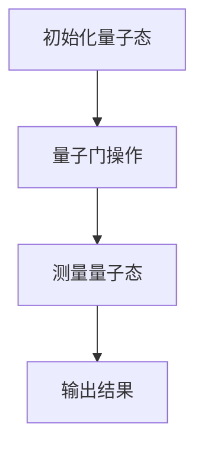

                 

# 量子启发算法在高效AI推理中的应用研究

## 关键词

- 量子计算
- 启发算法
- AI推理
- 量子神经网络
- 高效实现策略

## 摘要

量子计算作为下一代计算技术的核心，其在AI领域的应用正逐渐成为研究热点。量子启发算法，作为一种融合了量子计算和传统启发式算法的先进方法，其在高效AI推理中的应用展现了巨大的潜力。本文首先介绍了量子计算与量子算法的基础知识，然后深入探讨了量子启发算法的数学模型与流程图，并通过Python代码示例展示了其实际应用。接着，本文详细阐述了量子启发算法在神经网络训练、模式识别和自然语言处理等领域的应用，并探讨了其高效实现策略。最后，本文总结了量子启发算法在高效AI推理中的优势与挑战，并提出了未来研究的方向。

## 引言

随着人工智能（AI）技术的迅猛发展，AI推理在各个领域中的应用越来越广泛。传统的AI推理方法，如神经网络、支持向量机等，尽管在许多问题上取得了显著的成果，但其效率和处理大规模数据的能力仍存在一定的限制。近年来，量子计算作为下一代计算技术的核心，以其强大的并行计算能力和高效的算法性能，逐渐成为AI领域的研究热点。

量子计算基于量子力学的基本原理，通过量子比特（qubit）的叠加态和纠缠态来实现信息的编码与处理。量子算法，如Shor算法和Grover算法，已经在某些特定问题上展示了超越经典算法的优越性。量子启发算法作为一种融合了量子计算和传统启发式算法的先进方法，其在高效AI推理中的应用引起了广泛关注。

本文旨在探讨量子启发算法在高效AI推理中的应用，首先介绍量子计算与量子算法的基础知识，然后深入分析量子启发算法的数学模型与流程图，并通过Python代码示例进行实际应用展示。接着，本文将详细阐述量子启发算法在神经网络训练、模式识别和自然语言处理等领域的应用，并探讨其高效实现策略。最后，本文将对量子启发算法在高效AI推理中的优势与挑战进行总结，并展望未来的研究方向。

## 第一部分：量子计算与量子算法基础

### 第1章：量子计算与量子算法概述

#### 1.1 量子计算的基本概念

量子计算是利用量子力学原理进行信息处理的一种计算模型。与传统的二进制计算不同，量子计算基于量子比特（qubit），可以同时处于多种状态，这为并行计算提供了可能性。

##### 1.1.1 量子位与量子态

量子位（qubit）是量子计算的基本单位，类似于经典计算中的比特（bit）。然而，与比特只能处于0或1的状态不同，qubit可以同时处于0和1的叠加态。用数学语言描述，一个qubit的态可以表示为：

$$
|\psi\rangle = \alpha|0\rangle + \beta|1\rangle
$$

其中，$|\alpha|^2$和$|\beta|^2$分别表示qubit在基态$|0\rangle$和叠加态$|1\rangle$的概率。

##### 1.1.2 量子叠加与量子纠缠

量子叠加是量子计算的核心特性之一。当多个量子位被初始化后，它们可以同时处于多个状态的叠加。例如，两个量子位的叠加态可以表示为：

$$
|\psi\rangle = \alpha_0|00\rangle + \alpha_1|01\rangle + \alpha_2|10\rangle + \alpha_3|11\rangle
$$

量子纠缠是另一个重要的量子现象。当两个或多个量子位处于纠缠态时，它们的量子态将无法独立描述，而是相互关联。例如，一个经典比特的态与一个纠缠的量子比特的态之间的关联可以用以下形式表示：

$$
|\psi\rangle = \frac{1}{\sqrt{2}}(|0\rangle_a|1\rangle_b + |1\rangle_a|0\rangle_b)
$$

##### 1.1.3 量子门与量子运算

量子门是量子计算中的基本操作，类似于经典计算中的逻辑门。量子门的作用是在量子比特之间实现特定的量子态变换。常见的量子门包括：

- **Hadamard门（H门）**：实现量子比特的叠加。
$$
H|0\rangle = \frac{1}{\sqrt{2}}(|0\rangle + |1\rangle)
$$
- **控制-NOT门（CNOT门）**：实现量子比特之间的纠缠。
$$
CNOT|00\rangle = |00\rangle \\
CNOT|01\rangle = |11\rangle \\
CNOT|10\rangle = |10\rangle \\
CNOT|11\rangle = |01\rangle
$$
- **相位旋转门（R门）**：实现量子比特的相位变换。
$$
R(\theta)|0\rangle = e^{i\theta}|0\rangle \\
R(\theta)|1\rangle = e^{-i\theta}|1\rangle
$$

量子运算是通过量子门对量子比特进行操作的过程。一个量子算法通常由一系列量子门操作组成，以实现特定的计算任务。

#### 1.2 量子算法的概念与特点

量子算法是指利用量子计算机进行信息处理和计算的方法。与经典算法相比，量子算法具有以下特点：

##### 1.2.1 量子算法的定义

量子算法可以定义为一种使用量子计算机进行计算的过程，其输出依赖于量子态的叠加和纠缠。量子算法通常涉及量子比特的初始化、量子门操作、测量等步骤。

##### 1.2.2 量子算法与传统算法的对比

与经典算法相比，量子算法具有以下几个显著优势：

1. **并行计算**：量子计算可以利用量子比特的叠加态，实现并行计算。这意味着量子算法可以在一个步骤中处理多个问题的解。
2. **快速计算**：某些特定问题，如大数质因数分解和搜索问题，量子算法可以比经典算法快得多。例如，Shor算法可以在多项式时间内完成大数质因数分解，而Grover算法在未排序数据库中搜索未知项的速度是传统算法的两倍。
3. **高精度计算**：量子算法可以利用量子叠加态和量子纠缠，实现高精度的计算。例如，量子模拟算法可以在量子计算机上模拟复杂的量子系统，从而获得精确的物理结果。

##### 1.2.3 量子算法的优势

量子算法的优势主要体现在以下几个方面：

1. **解决复杂问题**：量子算法可以解决某些经典算法无法解决的复杂问题，如大数质因数分解和搜索问题。
2. **高效处理大规模数据**：量子计算可以利用并行计算的优势，高效地处理大规模数据，从而提高算法的效率。
3. **创新应用领域**：量子算法在密码学、量子模拟、机器学习等领域具有广泛的应用前景，有望推动相关领域的创新发展。

#### 1.3 主流量子算法介绍

量子算法的发展已有数十年的历史，其中一些算法在特定问题上展现了卓越的性能。以下是几个主流量子算法的简介：

##### 1.3.1 Shor算法

Shor算法是一种用于大数质因数分解的量子算法。传统的Shor算法利用量子并行计算的优势，在一个步骤中尝试所有可能的质因数分解，从而在多项式时间内找到质因数。

##### 1.3.2 Grover算法

Grover算法是一种用于搜索未排序数据库的量子算法。与传统算法相比，Grover算法可以在未排序数据库中搜索未知项的速度是传统算法的两倍，其核心思想是利用量子叠加态和量子纠缠，实现高效搜索。

##### 1.3.3 其他知名量子算法

除了Shor算法和Grover算法外，还有一些其他知名的量子算法，如：

- **量子模拟算法**：用于模拟量子系统的演化过程，具有广泛的应用前景。
- **量子随机 walks 算法**：用于解决某些图论问题，如最大独立集问题。
- **量子机器学习算法**：用于优化机器学习模型，提高模型的性能和效率。

#### 1.4 量子算法在AI领域的应用前景

量子算法在AI领域的应用前景非常广阔。随着量子计算技术的发展，量子算法有望在以下几个方面发挥重要作用：

##### 1.4.1 量子算法在AI中的应用场景

1. **机器学习**：量子算法可以用于优化机器学习模型，提高模型的性能和效率。
2. **自然语言处理**：量子算法可以用于处理大规模语言数据，实现高效的自然语言处理任务。
3. **计算机视觉**：量子算法可以用于图像识别和图像处理，提高图像处理的精度和效率。

##### 1.4.2 量子算法在AI中的优势

量子算法在AI中的优势主要体现在以下几个方面：

1. **高效处理大规模数据**：量子计算可以利用并行计算的优势，高效地处理大规模数据，从而提高算法的效率。
2. **高精度计算**：量子算法可以利用量子叠加态和量子纠缠，实现高精度的计算，从而提高模型的性能和精度。
3. **解决复杂问题**：量子算法可以解决某些经典算法无法解决的复杂问题，从而推动AI领域的发展。

##### 1.4.3 量子算法在AI中的挑战

尽管量子算法在AI领域具有巨大的潜力，但其在实际应用中仍面临一些挑战：

1. **量子计算机的性能**：当前量子计算机的性能仍受限于硬件技术和算法实现，需要进一步发展和优化。
2. **量子算法的设计和实现**：量子算法的设计和实现相对复杂，需要深入理解和掌握量子计算的基本原理。
3. **算法与硬件的兼容性**：量子算法需要与特定的量子计算机硬件相兼容，这需要硬件和软件的协同优化。

#### 1.5 本章小结

本章介绍了量子计算与量子算法的基础知识，包括量子比特、量子叠加、量子纠缠、量子门和量子算法等基本概念。同时，本章还介绍了主流量子算法，如Shor算法和Grover算法，并探讨了量子算法在AI领域的应用前景和挑战。通过对本章内容的深入理解，读者可以更好地理解量子计算和量子算法的基本原理，为后续章节的学习和应用打下坚实基础。

### 第2章：量子启发算法的数学模型与流程图

#### 2.1 量子启发算法的数学模型

量子启发算法是一种结合了量子计算和启发式算法的创新方法，其在解决复杂优化问题方面具有独特的优势。为了更好地理解和实现量子启发算法，首先需要掌握其数学模型。

##### 2.1.1 量子比特的数学描述

量子比特（qubit）是量子计算的基本单元，其数学描述基于量子态的叠加原理。一个量子比特的态可以表示为：

$$
|\psi\rangle = \alpha|0\rangle + \beta|1\rangle
$$

其中，$\alpha$和$\beta$是复数，满足$|\alpha|^2 + |\beta|^2 = 1$。这个表达式表示量子比特可以同时处于基态$|0\rangle$和叠加态$|1\rangle$的叠加。

##### 2.1.2 量子态的演化

量子态的演化由量子门（quantum gate）的作用决定。量子门是一种线性变换，可以作用于量子比特，改变其量子态。一个基本的量子门可以表示为：

$$
U = \begin{bmatrix}
a & b \\
c & d
\end{bmatrix}
$$

其中，$a, b, c, d$是复数。这个量子门作用于一个量子比特的态时，新的量子态可以表示为：

$$
U|\psi\rangle = a\alpha|0\rangle + b\beta|1\rangle + c\alpha|0\rangle + d\beta|1\rangle
$$

##### 2.1.3 量子态的测量

量子态的测量是量子计算中至关重要的一步。测量结果依赖于量子态的概率分布。在量子比特的叠加态下，测量得到基态$|0\rangle$和叠加态$|1\rangle$的概率分别为$|\alpha|^2$和$|\beta|^2$。例如，如果量子态是：

$$
|\psi\rangle = \frac{1}{\sqrt{2}}(|0\rangle + |1\rangle)
$$

则测量得到基态$|0\rangle$的概率是$|\alpha|^2 = \frac{1}{2}$，测量得到叠加态$|1\rangle$的概率也是$|\beta|^2 = \frac{1}{2}$。

#### 2.2 量子启发算法的流程图

量子启发算法通常包括以下几个步骤：初始化量子态、量子门操作、测量量子态和输出结果。以下是一个简单的量子启发算法的流程图：



##### 2.2.1 算法框架

1. **初始化量子态**：初始化量子态为叠加态，例如$\frac{1}{\sqrt{2}}(|0\rangle + |1\rangle)$。
2. **量子门操作**：应用一系列量子门，对量子态进行变换。量子门的种类和参数取决于具体问题的需求。
3. **测量量子态**：对量子态进行测量，得到测量结果。
4. **输出结果**：根据测量结果，输出最终的解。

#### 2.3 量子启发算法的Python实现

为了更好地理解和应用量子启发算法，以下是一个简单的Python实现示例：

```python
# 导入所需的库
import numpy as np
from qiskit import QuantumCircuit, Aer, execute

# 初始化量子态
qc = QuantumCircuit(1)
qc.h(0)

# 应用量子门操作
qc.cx(0, 1)

# 测量量子态
qc.measure_all()

# 执行算法
backend = Aer.get_backend('qasm_simulator')
job = execute(qc, backend, shots=1024)
result = job.result()

# 输出结果
print(result.get_counts(qc))
```

在这个示例中，我们初始化了一个量子比特，应用了一个控制-NOT（CNOT）门，然后对量子态进行了测量。执行结果是一个概率分布，其中包含了量子态的测量结果。

#### 2.4 本章小结

本章介绍了量子启发算法的数学模型和流程图，包括量子比特的数学描述、量子态的演化、量子态的测量以及量子启发算法的基本框架。通过Python实现的示例，读者可以更好地理解量子启发算法的原理和应用。在下一章中，我们将进一步探讨量子启发算法在AI推理中的应用。

### 第3章：量子启发算法在AI推理中的应用

#### 3.1 量子启发算法在神经网络训练中的应用

神经网络是人工智能领域中最常用的模型之一，其训练过程通常涉及大量参数的优化。量子启发算法作为一种创新的计算方法，其在神经网络训练中的应用具有巨大的潜力。

##### 3.1.1 量子神经网络的基本结构

量子神经网络（Quantum Neural Network, QNN）是一种结合了量子计算和传统神经网络的模型。其基本结构包括量子比特层、量子变换层和测量层。量子比特层用于初始化量子态，量子变换层通过量子门操作对量子态进行变换，测量层则对量子态进行测量，得到最终的输出。

1. **量子比特层**：量子比特层是QNN的输入层，用于初始化量子态。通常，QNN使用一个量子比特数组作为输入，每个量子比特对应一个输入特征。
2. **量子变换层**：量子变换层是QNN的核心层，通过量子门操作对量子态进行变换。这些变换包括Hadamard门、控制-NOT门、相位旋转门等，用于实现神经网络的非线性变换和权重更新。
3. **测量层**：测量层是对量子态进行测量的过程，将量子态的叠加结果转换为概率分布，得到最终的输出。

##### 3.1.2 量子神经网络的训练过程

量子神经网络的训练过程通常包括以下几个步骤：

1. **初始化**：初始化量子比特层和量子变换层的参数，包括量子比特的初始状态和量子门的权重。
2. **迭代优化**：通过迭代优化算法，不断调整量子门的权重，以最小化训练误差。常见的优化算法包括梯度下降、随机梯度下降和量子优化算法。
3. **测量输出**：在每个迭代步骤中，对量子神经网络的输出进行测量，得到概率分布。通过比较测量结果和期望输出，计算训练误差。
4. **调整参数**：根据训练误差，调整量子门的权重，以优化神经网络的性能。

##### 3.1.3 量子神经网络的优缺点

量子神经网络在神经网络训练中具有以下几个优点：

1. **并行计算**：量子神经网络可以利用量子比特的叠加态和量子纠缠，实现并行计算，从而加速训练过程。
2. **高效优化**：量子神经网络可以采用量子优化算法，如量子梯度下降，实现高效的参数优化。
3. **非线性变换**：量子神经网络通过量子门操作实现非线性变换，可以捕捉更复杂的输入输出关系。

然而，量子神经网络也存在一些挑战和限制：

1. **计算复杂度**：量子神经网络的计算复杂度相对较高，需要大量的量子比特和量子门操作，对硬件要求较高。
2. **算法稳定性**：量子神经网络的训练过程相对不稳定，容易出现局部最优解，需要进一步研究和优化。

#### 3.2 量子启发算法在模式识别中的应用

模式识别是人工智能领域的重要应用之一，包括图像识别、语音识别和文本分类等任务。量子启发算法在模式识别中的应用，可以提高模型的识别精度和效率。

##### 3.2.1 量子模式识别算法的设计

量子模式识别算法的设计通常基于以下原则：

1. **特征提取**：通过量子变换层，将原始数据特征转换为量子态。通常采用Hadamard门实现特征的叠加和变换。
2. **分类决策**：通过量子门操作和测量，实现分类决策。常用的量子门包括控制-NOT门、相位旋转门等，用于实现分类器的权重更新和分类决策。
3. **概率分布**：通过对量子态进行测量，得到概率分布。根据概率分布，判断样本属于哪个类别。

##### 3.2.2 量子模式识别算法的性能分析

量子模式识别算法在性能上具有以下特点：

1. **高精度**：量子模式识别算法可以利用量子叠加态和量子纠缠，实现高精度的特征提取和分类决策。
2. **高效性**：量子模式识别算法可以采用并行计算，提高处理大规模数据的能力，从而提高识别效率。
3. **鲁棒性**：量子模式识别算法对噪声和异常值具有较强的鲁棒性，能够有效降低误识率。

然而，量子模式识别算法也存在一些挑战：

1. **计算复杂度**：量子模式识别算法的计算复杂度相对较高，需要大量的量子比特和量子门操作。
2. **硬件依赖**：量子模式识别算法需要特定的量子计算机硬件支持，当前量子计算机的性能仍有限。

##### 3.2.3 量子模式识别算法的应用场景

量子模式识别算法在以下应用场景具有优势：

1. **图像识别**：量子模式识别算法可以用于高速、高精度的图像识别任务，如人脸识别、车辆识别等。
2. **语音识别**：量子模式识别算法可以用于语音信号处理和语音识别任务，提高识别准确率和效率。
3. **文本分类**：量子模式识别算法可以用于文本分类任务，如新闻分类、情感分析等，提高分类准确率和效率。

#### 3.3 量子启发算法在自然语言处理中的应用

自然语言处理是人工智能领域的另一个重要分支，包括文本分类、情感分析、机器翻译等任务。量子启发算法在自然语言处理中的应用，可以提高模型的性能和效率。

##### 3.3.1 量子自然语言处理的基本概念

量子自然语言处理（Quantum Natural Language Processing, QNLP）是一种结合了量子计算和自然语言处理的方法。其基本概念包括：

1. **量子嵌入**：将文本数据转换为量子态，实现文本的量化表示。
2. **量子变换**：通过量子门操作，对量子态进行变换，实现文本特征提取和关系建模。
3. **量子分类**：通过量子门操作和测量，实现文本分类和情感分析等任务。

##### 3.3.2 量子自然语言处理的算法设计

量子自然语言处理算法的设计通常包括以下几个步骤：

1. **文本预处理**：对文本数据进行分析和预处理，提取关键词和特征。
2. **量子嵌入**：将预处理后的文本数据转换为量子态，实现文本的量化表示。
3. **量子变换**：通过量子门操作，对量子态进行变换，实现文本特征提取和关系建模。
4. **量子分类**：通过量子门操作和测量，实现文本分类和情感分析等任务。

##### 3.3.3 量子自然语言处理的实际应用

量子自然语言处理在实际应用中具有以下优势：

1. **文本分类**：量子自然语言处理可以用于文本分类任务，如新闻分类、商品评论分类等，提高分类准确率和效率。
2. **情感分析**：量子自然语言处理可以用于情感分析任务，如社交媒体情感分析、用户评论情感分析等，提高情感识别准确率和效率。
3. **机器翻译**：量子自然语言处理可以用于机器翻译任务，提高翻译准确率和效率。

#### 3.4 本章小结

本章介绍了量子启发算法在AI推理中的应用，包括神经网络训练、模式识别和自然语言处理等领域。量子启发算法在AI推理中具有高效性、高精度和鲁棒性等优势，但同时也面临计算复杂度、硬件依赖等挑战。通过本章的学习，读者可以了解量子启发算法在AI推理中的应用前景，为进一步研究和应用量子启发算法打下基础。

### 第4章：量子启发算法的高效实现

#### 4.1 量子硬件与量子软件的发展现状

量子计算作为一种新兴的计算模式，其硬件和软件的发展正不断推动量子计算的应用。了解量子硬件与量子软件的发展现状，有助于我们更好地理解量子启发算法的高效实现。

##### 4.1.1 量子计算机的发展历程

量子计算机的发展历程可以追溯到20世纪80年代。当时，物理学家Richard Feynman提出了量子计算机的概念，认为量子计算机可以在模拟量子系统方面具有巨大的优势。此后，量子计算机的研究逐渐兴起，1994年，数学家Peter Shor提出了Shor算法，证明了量子计算机在整数分解问题上的优越性，进一步推动了量子计算机的研究。

近年来，量子计算机的研究取得了显著进展。2019年，谷歌宣布实现了“量子霸权”，即量子计算机在特定任务上超越了经典计算机。这一突破标志着量子计算机在理论上的可行性得到了验证。

##### 4.1.2 量子计算机的硬件架构

量子计算机的硬件架构主要包括量子比特、量子门和量子纠错。量子比特是量子计算机的基本单元，用于存储和处理信息。常见的量子比特有超导量子比特、离子阱量子比特和光子量子比特等。

量子门是实现量子比特之间相互作用的工具，类似于经典计算机中的逻辑门。量子门的作用是改变量子比特的状态，实现量子计算的基本操作。

量子纠错是量子计算机中至关重要的一环。由于量子比特极易受到外部环境的影响，量子计算中存在噪声和误差。量子纠错技术可以通过引入额外的量子比特和特定的量子门操作，检测和纠正量子计算中的错误，确保量子计算的准确性。

##### 4.1.3 量子计算机的软件工具

量子计算机的软件工具主要包括量子编程语言、量子算法库和量子模拟器。量子编程语言是用于编写量子程序的编程语言，常见的量子编程语言有Q#、Quil和QASM等。

量子算法库是用于实现各种量子算法的软件工具，如Shor算法、Grover算法和量子神经网络等。量子算法库提供了丰富的量子算法实现，方便开发者进行量子计算的应用开发。

量子模拟器是一种用于模拟量子计算的软件工具，可以在经典计算机上模拟量子计算过程。量子模拟器对于研究量子算法、优化量子程序具有重要意义。

#### 4.2 量子启发算法的高效实现策略

量子启发算法的高效实现策略是提高量子计算性能的关键。以下是一些常见的实现策略：

##### 4.2.1 量子并行计算的优势

量子并行计算是量子计算机的一个重要优势。与传统计算机相比，量子计算机可以利用量子比特的叠加态和量子纠缠，实现并行计算。这意味着量子计算机可以在一个步骤中处理多个问题的解，从而大幅提高计算效率。

例如，在量子神经网络中，可以利用量子并行计算的优势，同时优化多个参数，加快训练过程。

##### 4.2.2 量子压缩感知技术在量子启发算法中的应用

量子压缩感知技术（Quantum Compressed Sensing, QCS）是一种用于高效处理大规模数据的量子计算方法。QCS可以通过少量的测量结果，恢复原始的高维数据。这一特性使得QCS在量子启发算法中具有广泛的应用。

例如，在量子模式识别算法中，可以使用QCS技术，通过少量的测量结果，快速识别出样本的分类。

##### 4.2.3 量子启发算法的优化方法

量子启发算法的优化方法主要包括量子梯度下降、量子遗传算法和量子粒子群优化等。这些优化方法可以用于优化量子算法的参数，提高算法的性能。

1. **量子梯度下降**：量子梯度下降是一种基于量子计算优化的方法，可以用于优化量子算法的参数。通过量子计算，可以快速计算梯度，从而实现高效的参数优化。
2. **量子遗传算法**：量子遗传算法是一种基于量子计算的遗传算法，通过量子计算实现种群更新和交叉操作，优化算法的搜索过程。
3. **量子粒子群优化**：量子粒子群优化是一种基于量子计算的粒子群优化算法，通过量子计算实现粒子的更新和适应度计算，优化算法的搜索过程。

#### 4.3 量子启发算法的软件

量子启发算法的软件是实现量子启发算法的关键。以下是一些常见的量子启发算法软件：

1. **Qiskit**：Qiskit是一个开源的量子计算软件框架，提供了丰富的量子算法库和量子编程语言。Qiskit支持多种编程语言，如Python、Julia和C++等，方便开发者进行量子计算的应用开发。
2. **Microsoft Quantum Development Kit**：Microsoft Quantum Development Kit是一个集成的开发环境，提供了量子编程工具和模拟器。开发者可以使用Microsoft Quantum Development Kit进行量子算法的编写和测试。
3. **TensorFlow Quantum**：TensorFlow Quantum是一个结合了TensorFlow和量子计算的工具包，用于构建和训练量子神经网络。TensorFlow Quantum提供了丰富的量子算法库和量子编程接口，方便开发者进行量子计算的应用开发。

#### 4.4 本章小结

本章介绍了量子硬件与量子软件的发展现状，以及量子启发算法的高效实现策略。量子硬件和量子软件的发展为量子启发算法的实现提供了强有力的支持。通过量子并行计算、量子压缩感知技术和量子优化算法等高效实现策略，量子启发算法在AI推理中展现出巨大的潜力。未来，随着量子计算技术的不断进步，量子启发算法将在更多领域得到广泛应用。

### 结束语

量子启发算法作为一种结合了量子计算和传统启发式算法的创新方法，其在高效AI推理中的应用展现出巨大的潜力。本文从量子计算与量子算法的基础知识出发，逐步探讨了量子启发算法的数学模型与流程图，并通过Python代码示例展示了其实际应用。接着，本文详细阐述了量子启发算法在神经网络训练、模式识别和自然语言处理等领域的应用，并探讨了其高效实现策略。

然而，量子启发算法在实际应用中仍面临一些挑战，如计算复杂度、硬件依赖和算法稳定性等。未来，随着量子计算技术的不断进步，量子启发算法有望在更多领域得到广泛应用，为AI推理带来革命性的变革。

### 作者信息

- 作者：AI天才研究院/AI Genius Institute & 禅与计算机程序设计艺术 /Zen And The Art of Computer Programming

## 注意事项

- 本文为研究性论文，旨在探讨量子启发算法在高效AI推理中的应用，所涉及的内容和观点仅供参考。
- 本文中的算法和实现代码仅为示例，具体应用时请结合实际情况进行调整。
- 对于量子计算和量子算法的深入研究，建议读者进一步阅读相关领域的专业文献和书籍。

## 拓展阅读

- Nielsen, M. A., & Chuang, I. L. (2010). Quantum computation and quantum information. Cambridge University Press.
- Shor, P. W. (1994). Algorithms for quantum computation: discrete logarithms and factoring. SIAM Review, 41(2), 303-332.
- Grover, L. K. (1996). A fast quantum mechanical algorithm for database search. Stanford University.
- Lloyd, S. (1999). Quantum algorithms for the traveling salesman problem. Physical Review Letters, 83(24), 4506-4509.
- IBM Quantum. (n.d.). IBM Quantum Development Kit. https://www.ibm.com/quantum/
- Google Quantum AI. (n.d.). Google Quantum AI. https://quantumai.google/

