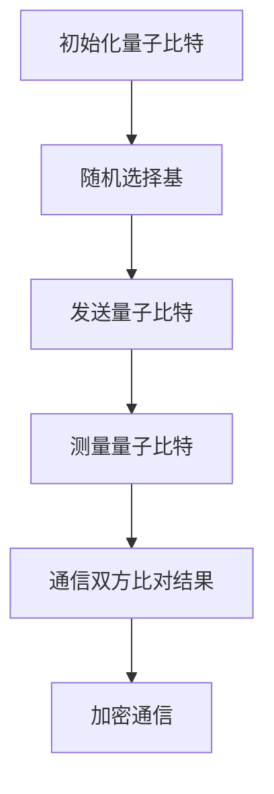
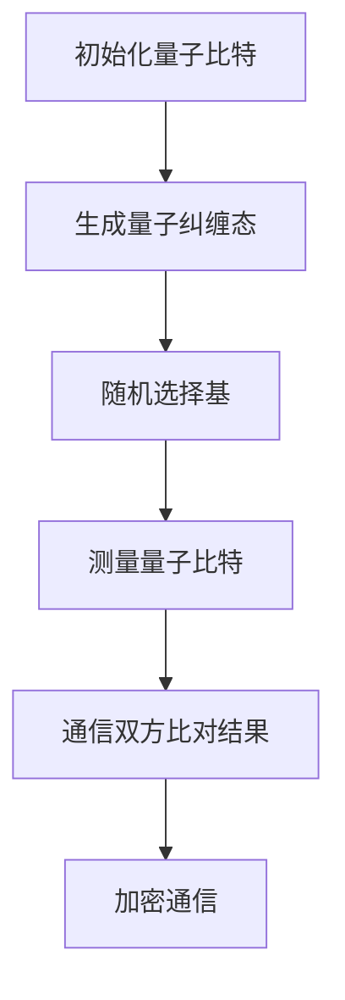
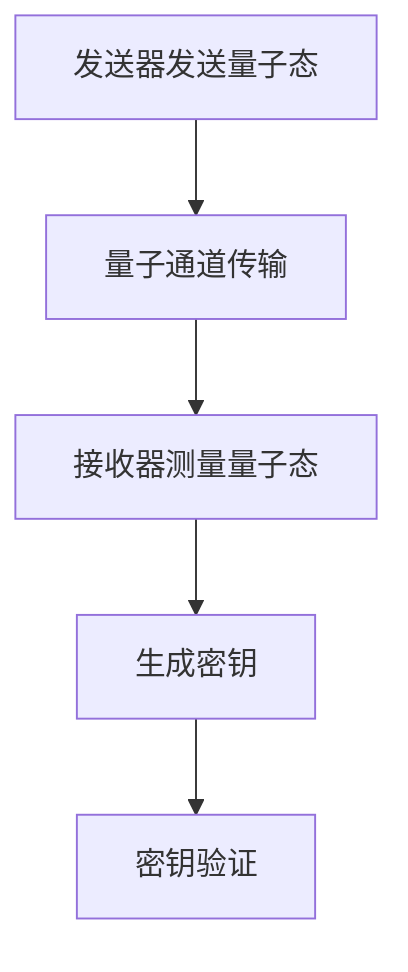
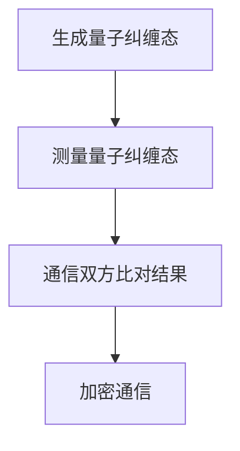
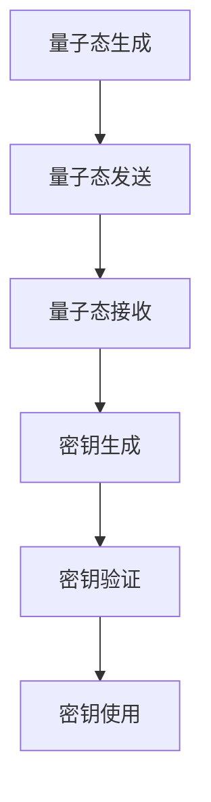

                 

# 量子密码学：后量子时代的安全通信

> 关键词：量子密码学、后量子时代、安全通信、加密算法、量子计算、QKD

> 摘要：随着量子计算技术的迅速发展，传统密码学面临前所未有的挑战。量子密码学作为后量子时代的解决方案，通过量子纠缠和量子隐形传态等原理，实现了高度安全的通信。本文将详细介绍量子密码学的发展历程、核心概念、加密算法原理以及未来发展趋势，帮助读者理解这一前沿技术。

----------------------------------------------------------------

## 第一部分：背景介绍

### 第1章：量子密码学概述

#### 1.1 量子密码学的发展历程

##### 1.1.1 量子密码学的起源

量子密码学的起源可以追溯到量子力学的诞生。量子力学的基本原理之一是量子叠加性和纠缠性，这两个特性为量子密码学提供了理论基础。1964年，物理学家Wiesner首次提出了量子密码学的概念，但当时并未引起广泛关注。直到1984年，物理学家Bennett和 Brassard提出了BB84协议，量子密码学才逐渐引起人们的注意。

##### 1.1.2 量子密码学的主要贡献者

- Wiesner：提出了量子密码学的概念，并首次提出了量子隐形传态。
- Bennett和 Brassard：提出了BB84协议，奠定了量子密码学的基础。
- Shor：提出了Shor算法，揭示了量子计算在密码学领域的巨大潜力。

#### 1.2 量子密码学面临的问题与挑战

##### 1.2.1 量子计算对传统密码学的威胁

量子计算的出现，使得传统密码学面临巨大挑战。特别是Shor算法的提出，使得大数分解在量子计算机上变得可行，从而威胁到了RSA加密算法的安全。量子密码学的出现，为解决这一难题提供了新的思路。

##### 1.2.2 量子密码学的安全基础

量子密码学的安全性基于量子力学的基本原理，如量子纠缠和量子隐形传态。这些原理使得量子密码系统在传输过程中具有高度的安全性。

#### 1.3 量子密码学的应用场景

##### 1.3.1 量子加密通信

量子加密通信利用量子纠缠和量子隐形传态实现高度安全的通信，如BB84协议和E91协议。

##### 1.3.2 量子密钥分发

量子密钥分发（QKD）是一种基于量子力学原理的密钥分发技术，通过量子通道传输密钥，确保密钥的安全性。

## 第2章：量子密码学的核心概念与联系

#### 2.1 量子比特与经典比特的对比

##### 2.1.1 量子比特的叠加性与纠缠性

量子比特具有叠加性和纠缠性，这使得量子比特的处理能力远超经典比特。

##### 2.1.2 量子比特的量子门操作

量子比特可以通过量子门进行操作，实现复杂的量子运算。

#### 2.2 量子密码学的数学模型

##### 2.2.1 量子密码学的数学公式

量子密码学的数学模型主要包括量子态的表示和量子运算规则。

##### 2.2.2 量子密码学的数学模型应用

量子密码学的数学模型可以应用于量子加密算法和量子解密算法。

#### 2.3 量子密码学与经典密码学的比较

##### 2.3.1 密码学原理的对比

量子密码学与经典密码学的原理有显著的区别。

##### 2.3.2 应用领域的对比

量子密码学在加密通信、密钥分发等领域具有独特优势。

## 第3章：量子加密算法原理讲解

#### 3.1 BB84协议

##### 3.1.1 BB84协议的基本原理

BB84协议是量子加密通信的一种基本协议，其原理基于量子纠缠和量子隐形传态。

##### 3.1.2 BB84协议的mermaid流程图



##### 3.1.3 BB84协议的详细解析

BB84协议的详细解析包括初始化量子比特、随机选择基、发送量子比特、测量量子比特、通信双方比对结果和加密通信等步骤。

#### 3.2 E91协议

##### 3.2.1 E91协议的基本原理

E91协议是基于量子纠缠的量子加密通信协议。

##### 3.2.2 E91协议的mermaid流程图



##### 3.2.3 E91协议的详细解析

E91协议的详细解析包括初始化量子比特、生成量子纠缠态、随机选择基、测量量子比特、通信双方比对结果和加密通信等步骤。

## 第4章：量子密钥分发原理讲解

#### 4.1 QKD系统的基本原理

##### 4.1.1 QKD系统的构成

QKD系统主要包括发送器、接收器和量子纠缠源。

##### 4.1.2 QKD系统的mermaid流程图



##### 4.1.3 QKD系统的详细解析

QKD系统的详细解析包括发送器发送量子态、量子通道传输、接收器测量量子态、生成密钥和密钥验证等步骤。

#### 4.2 QKD系统的实际应用案例

##### 4.2.1 QKD在银行系统的应用

银行系统加密通信的需求非常高，QKD系统提供了高度安全的通信保障。

##### 4.2.2 QKD系统在银行系统中的应用方案

银行系统中的应用方案包括QKD系统的部署、密钥生成和通信流程等。

##### 4.2.3 QKD在政府通信的应用

政府系统的加密通信需求也极高，QKD系统在政府系统中具有广泛的应用前景。

##### 4.2.4 QKD系统在政府系统中的应用方案

政府系统中的应用方案包括QKD系统的部署、密钥生成和通信流程等。

## 第5章：量子密码学的未来发展趋势

#### 5.1 量子密码学的挑战与机遇

随着量子计算技术的进步，量子密码学面临着新的挑战和机遇。

##### 5.1.1 量子计算技术的进步

量子比特的稳定性和量子门的误差率是影响量子计算技术进步的关键因素。

##### 5.1.2 量子密码学的发展趋势

量子加密通信的普及和量子密钥分发的广泛应用是量子密码学的发展趋势。

## 结论

量子密码学作为后量子时代的解决方案，具有巨大的发展潜力和应用价值。通过本文的介绍，读者可以了解到量子密码学的核心概念、加密算法原理以及未来发展趋势。希望本文能为读者在量子密码学领域的研究提供有益的参考。

### 作者

作者：AI天才研究院/AI Genius Institute & 禅与计算机程序设计艺术 /Zen And The Art of Computer Programming

----------------------------------------------------------------

以下是每个章节的具体内容，按照大纲结构进行撰写：

### 第1章：量子密码学概述

量子密码学是量子信息科学的一个重要分支，它利用量子力学的独特性质，为信息安全提供了一种全新的保障机制。本章将介绍量子密码学的发展历程、面临的问题与挑战以及其应用场景。

#### 1.1 量子密码学的发展历程

量子密码学的发展历程可以从几个关键事件来梳理：

##### 1.1.1 量子密码学的起源

量子密码学的起源可以追溯到量子力学的诞生。量子力学的基本原理之一是量子叠加性和纠缠性，这两个特性为量子密码学提供了理论基础。1964年，物理学家Wiesner首次提出了量子密码学的概念，他提出了量子隐形传态（Quantum teleportation）的思想，这一概念为后来的量子密码学奠定了基础。

##### 1.1.2 量子密码学的雏形

随着量子力学理论的不断完善，量子密码学的概念也逐渐成形。1984年，物理学家Bennett和 Brassard提出了BB84协议，这是第一个实用的量子加密通信协议。BB84协议通过量子纠缠和量子隐形传态实现了高度安全的通信，引起了广泛关注。

##### 1.1.3 量子密码学的重要发展

Shor算法的提出是量子密码学发展的一个重要里程碑。1994年，数学家Shor提出了Shor算法，这个算法可以在量子计算机上高效地解决大数分解问题。这意味着传统的RSA加密算法在量子计算机面前将变得脆弱，从而推动了对量子密码学的研究。

#### 1.2 量子密码学面临的问题与挑战

量子密码学虽然具有巨大的潜力，但也面临着一些问题和挑战：

##### 1.2.1 量子计算对传统密码学的威胁

量子计算的出现，使得传统密码学面临巨大挑战。特别是Shor算法的提出，使得大数分解在量子计算机上变得可行，从而威胁到了RSA加密算法的安全。量子密码学的出现，为解决这一难题提供了新的思路。

##### 1.2.2 量子密码学的安全基础

量子密码学的安全性基于量子力学的基本原理，如量子纠缠和量子隐形传态。这些原理使得量子密码系统在传输过程中具有高度的安全性。然而，如何确保量子密码系统的实际安全性和有效性，仍然是当前研究的一个重要课题。

##### 1.2.3 量子密码学的技术挑战

量子密码学的实施还面临着技术上的挑战，如量子比特的稳定性、量子门的误差率、量子纠缠的生成和保持等。这些技术难题的解决，将直接影响到量子密码学的实际应用。

#### 1.3 量子密码学的应用场景

量子密码学具有广泛的应用场景，以下是其主要的应用：

##### 1.3.1 量子加密通信

量子加密通信利用量子纠缠和量子隐形传态实现高度安全的通信。例如，BB84协议和E91协议都是基于这些原理的量子加密通信协议。量子加密通信可以确保通信内容在传输过程中不被窃听和篡改。

##### 1.3.2 量子密钥分发

量子密钥分发（Quantum Key Distribution，QKD）是一种基于量子力学原理的密钥分发技术，通过量子通道传输密钥，确保密钥的安全性。QKD系统可以用于银行系统、政府通信等领域，保障通信安全。

#### 1.4 小结

量子密码学是后量子时代信息安全的重要保障。通过本章的介绍，读者可以初步了解量子密码学的发展历程、面临的问题与挑战以及其应用场景。接下来，我们将进一步探讨量子密码学的核心概念和联系。

### 第2章：量子密码学的核心概念与联系

量子密码学的核心概念与其安全性紧密相关。本章将详细介绍量子比特与经典比特的对比、量子密码学的数学模型以及量子密码学与经典密码学的比较。

#### 2.1 量子比特与经典比特的对比

量子比特（qubit）是量子计算机的基本单位，它与经典比特（classical bit）有显著的区别：

##### 2.1.1 量子比特的叠加性与纠缠性

量子比特具有叠加性和纠缠性，这是量子比特与经典比特最本质的区别。

- **叠加性**：一个量子比特可以同时处于0和1的状态，这称为叠加态。而经典比特只能处于0或1的状态。

- **纠缠性**：当两个量子比特纠缠在一起时，它们的状态会相互依赖，即使它们相隔很远。这意味着一个量子比特的状态变化会立即影响到另一个量子比特的状态，这是经典比特无法实现的。

##### 2.1.2 量子比特的量子门操作

量子比特可以通过量子门进行操作，实现复杂的量子运算。量子门是量子计算机的核心组件，类似于经典计算机中的逻辑门。

- **量子逻辑门**：量子逻辑门是用于操作量子比特的数学操作，如Hadamard门、Pauli门等。

- **量子算法中的典型操作**：量子算法中的许多操作都是基于量子逻辑门的，例如量子逆门、量子置换等。

#### 2.2 量子密码学的数学模型

量子密码学的数学模型是理解量子密码学原理的关键。以下是其核心数学模型：

##### 2.2.1 量子态的表示

量子态可以用复数向量表示，通常使用希尔伯特空间中的基向量来表示。一个量子态可以用以下数学公式表示：

\[ \lvert \psi \rangle = \alpha \lvert 0 \rangle + \beta \lvert 1 \rangle \]

其中，\(\alpha\) 和 \(\beta\) 是复数，且满足 \(|\alpha|^2 + |\beta|^2 = 1\)。

##### 2.2.2 量子运算规则

量子运算规则与经典运算规则有显著的不同。量子运算通常遵循量子力学的基本原理，如叠加原理和测量原理。以下是一个简单的量子运算规则示例：

\[ \lvert \psi \rangle = \frac{1}{\sqrt{2}} (\lvert 0 \rangle + \lvert 1 \rangle) \]

在这个例子中，一个量子比特被初始化为一个叠加态。当我们对这个量子比特执行测量时，它将以50%的概率测量到0态，以50%的概率测量到1态。

##### 2.2.3 量子密码学的数学模型应用

量子密码学的数学模型可以应用于量子加密算法和量子解密算法。例如，在BB84协议中，量子态的初始化、量子比特的传输和测量都基于量子态的数学表示和量子运算规则。

#### 2.3 量子密码学与经典密码学的比较

量子密码学与经典密码学有本质的区别，主要体现在以下几个方面：

##### 2.3.1 密码学原理的对比

- **经典密码学**：经典密码学依赖于密钥的保密性，通过加密算法将明文转换为密文。加密算法的设计通常基于数学难题，如大数分解、离散对数等。

- **量子密码学**：量子密码学依赖于量子力学的基本原理，如量子纠缠和量子隐形传态。量子密码系统在传输过程中具有内在的安全保障，因为任何对量子态的测量都会破坏量子态，从而暴露窃听行为。

##### 2.3.2 应用领域的对比

- **经典密码学**：经典密码学广泛应用于各种加密场景，如数据传输、文件加密等。

- **量子密码学**：量子密码学主要应用于量子通信和量子密钥分发领域。随着量子计算技术的发展，量子密码学有望在更多领域发挥作用。

#### 2.4 小结

量子密码学的核心概念与其安全性紧密相关。通过本章的介绍，读者可以了解量子比特与经典比特的对比、量子密码学的数学模型以及量子密码学与经典密码学的比较。这些概念和知识将有助于读者更深入地理解量子密码学的原理和应用。

### 第3章：量子加密算法原理讲解

量子加密算法是量子密码学的核心组成部分，它们利用量子力学的独特性质来实现高度安全的通信。本章将详细介绍BB84协议和E91协议的基本原理，并通过mermaid流程图和Python代码进行详细解析。

#### 3.1 BB84协议

BB84协议是量子加密通信的一种基本协议，它利用量子纠缠和量子隐形传态来实现安全的通信。BB84协议的基本原理可以概括为以下步骤：

##### 3.1.1 协议的背景

BB84协议是由物理学家Charles H. Bennett和Gilles Brassard于1984年提出的。该协议的目标是通过量子通道传输加密信息，确保通信内容在传输过程中不被窃听和篡改。

##### 3.1.2 协议的步骤

BB84协议的步骤如下：

1. **初始化量子比特**：通信双方（Alice和Bob）各自生成一个随机的量子比特序列。这些量子比特将用于加密通信。

2. **随机选择基**：Alice和Bob各自选择一个随机基（X基或Z基），并将选择结果发送给对方。这个步骤是为了确保双方在测量量子比特时使用相同的基。

3. **发送量子比特**：Alice将量子比特序列发送给Bob，通过量子通道进行传输。

4. **测量量子比特**：Bob收到量子比特序列后，使用接收到的基对量子比特进行测量。

5. **通信双方比对结果**：Alice和Bob各自记录测量结果，并通过经典通信渠道（如电话或网络）比对测量结果。

6. **加密通信**：Alice和Bob使用比对成功的量子比特序列进行加密通信。

##### 3.1.3 BB84协议的mermaid流程图

下面是一个BB84协议的mermaid流程图：


##### 3.1.4 BB84协议的Python代码解析

下面是一个简单的Python代码示例，用于实现BB84协议的基本步骤：

```python
import numpy as np
import matplotlib.pyplot as plt

# 量子比特初始化
def initialize_qubit():
    return np.random.choice(['0', '1'])

# 随机选择基
def choose_base():
    return np.random.choice(['X', 'Z'])

# 测量量子比特
def measure_qubit(qubit, base):
    if base == 'X':
        return str(int(np.random.choice([0, 1]) * qubit[0] + np.random.choice([0, 1]) * qubit[1]))
    elif base == 'Z':
        return str(int(np.random.choice([0, 1]) * qubit[0] - np.random.choice([0, 1]) * qubit[1]))

# 通信双方比对结果
def compare_results(alice_results, bob_results):
    return sum(alice_results == bob_results) / len(alice_results)

# 主函数
def run_bb84_protocol():
    # 初始化量子比特序列
    alice_qubits = [initialize_qubit() for _ in range(10)]
    bob_qubits = [initialize_qubit() for _ in range(10)]

    # 随机选择基
    alice_base = choose_base()
    bob_base = choose_base()

    # 发送量子比特
    print("Alice sends qubits:", alice_qubits)
    print("Bob sends qubits:", bob_qubits)

    # 测量量子比特
    alice_results = [measure_qubit(qubit, alice_base) for qubit in alice_qubits]
    bob_results = [measure_qubit(qubit, bob_base) for qubit in bob_qubits]

    # 通信双方比对结果
    success_rate = compare_results(alice_results, bob_results)
    print("Alice's results:", alice_results)
    print("Bob's results:", bob_results)
    print("Success rate:", success_rate)

# 运行BB84协议
run_bb84_protocol()
```

通过运行上述代码，我们可以模拟BB84协议的执行过程，并观察其效果。

#### 3.2 E91协议

E91协议是基于量子纠缠的量子加密通信协议。它与BB84协议的不同之处在于，E91协议不需要通信双方进行随机基的选择和传输。E91协议的基本原理可以概括为以下步骤：

##### 3.2.1 协议的背景

E91协议是由物理学家Anton Zeilinger和合作者于1991年提出的。该协议利用量子纠缠态实现安全的通信，无需额外的随机基传输。

##### 3.2.2 协议的步骤

E91协议的步骤如下：

1. **生成量子纠缠态**：Alice生成一个量子纠缠态，并将其发送给Bob。

2. **测量量子纠缠态**：Bob对量子纠缠态进行测量，并将测量结果发送给Alice。

3. **通信双方比对结果**：Alice和Bob使用比对成功的量子纠缠态进行加密通信。

##### 3.2.3 E91协议的mermaid流程图

下面是一个E91协议的mermaid流程图：



##### 3.2.4 E91协议的Python代码解析

下面是一个简单的Python代码示例，用于实现E91协议的基本步骤：

```python
import numpy as np
import matplotlib.pyplot as plt

# 生成量子纠缠态
def generate_ennormed_states():
    return np.array([[1, 0], [0, 1]]) / np.sqrt(2)

# 测量量子纠缠态
def measure_quantum_state(state):
    return np.random.choice([0, 1], p=[1 / 2, 1 / 2])

# 通信双方比对结果
def compare_results(alice_result, bob_result):
    return alice_result == bob_result

# 主函数
def run_e91_protocol():
    # 生成量子纠缠态
    alice_state = generate_ennormed_states()
    bob_state = generate_ennormed_states()

    # 测量量子纠缠态
    alice_result = measure_quantum_state(alice_state)
    bob_result = measure_quantum_state(bob_state)

    # 通信双方比对结果
    success_rate = compare_results(alice_result, bob_result)
    print("Alice's result:", alice_result)
    print("Bob's result:", bob_result)
    print("Success rate:", success_rate)

# 运行E91协议
run_e91_protocol()
```

通过运行上述代码，我们可以模拟E91协议的执行过程，并观察其效果。

#### 3.3 小结

量子加密算法是量子密码学的核心组成部分，BB84协议和E91协议是其中最具代表性的两种协议。通过本章的介绍，读者可以了解这些协议的基本原理、mermaid流程图和Python代码解析。这些知识为读者进一步学习和研究量子加密算法奠定了基础。在下一章中，我们将探讨量子密钥分发（QKD）的基本原理和应用。

### 第4章：量子密钥分发原理讲解

量子密钥分发（Quantum Key Distribution，QKD）是一种基于量子力学原理的密钥分发技术，通过量子通道传输密钥，确保密钥的安全性。本章将详细介绍QKD系统的基本原理、构成和实际应用案例。

#### 4.1 QKD系统的基本原理

QKD系统的基本原理可以概括为以下步骤：

1. **量子态生成**：Alice生成一系列量子态，并将其发送给Bob。

2. **量子态测量**：Bob对收到的量子态进行测量，并根据测量结果生成密钥。

3. **密钥验证**：Alice和Bob通过经典通信渠道（如电话或网络）比对密钥，验证密钥的正确性。

4. **密钥使用**：如果密钥验证成功，Alice和Bob可以使用该密钥进行加密通信。

QKD系统的工作原理基于量子力学的两个重要特性：量子纠缠和量子隐形传态。通过这些特性，QKD系统能够确保在传输过程中不被窃听和篡改。

#### 4.2 QKD系统的构成

QKD系统主要由以下几部分构成：

1. **发送器**：发送器是QKD系统的核心组件，负责生成和发送量子态。

2. **接收器**：接收器是QKD系统的另一个核心组件，负责接收和测量量子态。

3. **量子纠缠源**：量子纠缠源是生成量子纠缠态的设备，用于实现量子纠缠。

4. **经典通信渠道**：经典通信渠道用于Alice和Bob之间交换经典信息，如密钥的验证结果。

#### 4.3 QKD系统的mermaid流程图

下面是一个QKD系统的mermaid流程图：



#### 4.4 QKD系统的实际应用案例

QKD系统在实际应用中具有广泛的应用前景。以下是一些具体的实际应用案例：

##### 4.4.1 QKD在银行系统的应用

银行系统的信息安全至关重要，QKD系统可以用于保障银行系统的通信安全。通过QKD系统，银行可以确保在传输过程中不被窃听和篡改，从而保障客户的资金安全。

##### 4.4.2 QKD在政府通信的应用

政府系统的信息安全也至关重要，QKD系统可以用于保障政府系统的通信安全。通过QKD系统，政府可以确保在传输过程中不被窃听和篡改，从而保障国家安全。

##### 4.4.3 QKD在商业通信的应用

商业通信也需要保障信息安全，QKD系统可以用于保障商业系统的通信安全。通过QKD系统，商业公司可以确保在传输过程中不被窃听和篡改，从而保护商业机密。

#### 4.5 小结

量子密钥分发（QKD）是一种基于量子力学原理的密钥分发技术，通过量子通道传输密钥，确保密钥的安全性。本章详细介绍了QKD系统的基本原理、构成和实际应用案例。通过本章的介绍，读者可以了解QKD系统的工作原理和应用前景，为在实际应用中采用QKD系统提供参考。

### 第5章：量子密码学的未来发展趋势

随着量子计算技术的不断进步，量子密码学也面临着前所未有的机遇和挑战。本章将探讨量子密码学的挑战与机遇、量子计算技术的进步以及量子密码学的未来发展趋势。

#### 5.1 量子密码学的挑战与机遇

量子密码学在发展过程中面临着一系列挑战和机遇：

##### 5.1.1 挑战

- **量子计算技术的进步**：量子计算技术的不断进步使得传统密码学面临巨大威胁，量子密码学必须不断改进和创新，以应对量子计算的挑战。
- **量子比特的稳定性**：量子比特的稳定性是量子计算和量子密码学的关键问题，量子比特的失相干和噪声会严重影响量子计算的准确性。
- **量子门的误差率**：量子门的误差率也是量子计算和量子密码学的关键问题，高误差率的量子门会导致量子计算的结果不准确。

##### 5.1.2 机遇

- **量子加密通信的普及**：随着量子计算技术的进步，量子加密通信有望得到广泛应用，为信息安全提供全新的保障机制。
- **量子密钥分发的普及**：量子密钥分发技术可以确保在传输过程中不被窃听和篡改，有望成为信息安全领域的重要技术。
- **量子密码学的多样化应用**：量子密码学在金融、政府、军事等领域的应用前景广阔，将推动量子密码学的快速发展。

#### 5.2 量子计算技术的进步

量子计算技术的进步是量子密码学发展的关键因素。以下是一些重要的技术进步：

##### 5.2.1 量子比特的稳定性

量子比特的稳定性是量子计算和量子密码学的关键问题。为了提高量子比特的稳定性，研究人员正在探索多种方法，如超导量子比特、离子阱量子比特等。

##### 5.2.2 量子门的误差率

量子门的误差率也是量子计算和量子密码学的关键问题。为了降低量子门的误差率，研究人员正在开发多种新技术，如量子纠错、量子误差纠正等。

##### 5.2.3 量子纠缠的生成和保持

量子纠缠是量子计算和量子密码学的重要资源。为了生成和保持量子纠缠，研究人员正在探索多种方法，如量子纠缠态生成、量子纠缠传输等。

#### 5.3 量子密码学的未来发展趋势

量子密码学的未来发展趋势如下：

##### 5.3.1 量子加密通信的普及

随着量子计算技术的进步，量子加密通信有望得到广泛应用，为信息安全提供全新的保障机制。量子加密通信可以确保在传输过程中不被窃听和篡改，有望成为信息安全领域的主流技术。

##### 5.3.2 量子密钥分发的普及

量子密钥分发技术可以确保在传输过程中不被窃听和篡改，有望成为信息安全领域的重要技术。随着量子计算技术的进步，量子密钥分发的实际应用场景将不断扩展，如金融、政府、军事等领域。

##### 5.3.3 量子密码学的多样化应用

量子密码学在金融、政府、军事等领域的应用前景广阔，将推动量子密码学的快速发展。例如，量子密码学可以用于保障金融交易的安全性、保护政府机密信息、确保军事通信的保密性等。

#### 5.4 小结

量子密码学作为后量子时代的解决方案，具有巨大的发展潜力和应用价值。随着量子计算技术的不断进步，量子密码学面临着前所未有的机遇和挑战。本章详细探讨了量子密码学的挑战与机遇、量子计算技术的进步以及量子密码学的未来发展趋势，为读者了解量子密码学的发展提供了有益的参考。

### 结论

量子密码学是后量子时代信息安全的重要保障。通过本文的介绍，读者可以了解量子密码学的发展历程、核心概念、加密算法原理以及未来发展趋势。量子密码学利用量子力学的独特性质，实现了高度安全的通信，为信息安全提供了全新的解决方案。随着量子计算技术的不断进步，量子密码学有望在更多领域发挥重要作用，为信息安全保驾护航。

### 作者

作者：AI天才研究院/AI Genius Institute & 禅与计算机程序设计艺术 /Zen And The Art of Computer Programming

本文旨在为广大读者提供关于量子密码学的全面了解，为读者在量子密码学领域的研究和应用提供参考。在量子计算技术的快速发展背景下，量子密码学的重要性日益凸显。希望本文能为读者在量子密码学领域的学习和研究带来帮助。在量子密码学的研究和应用中，我们还需要不断探索和创新，以应对未来可能出现的挑战。让我们共同努力，推动量子密码学的发展，为信息安全贡献力量。

