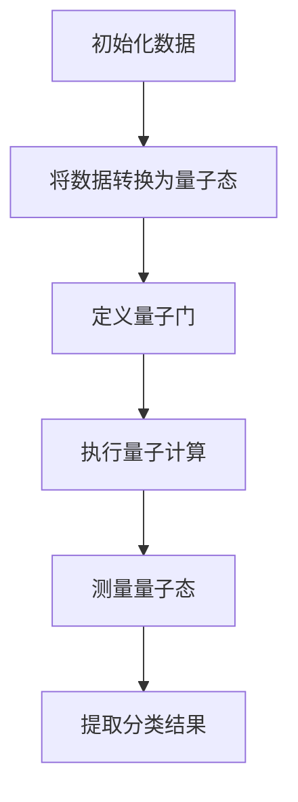
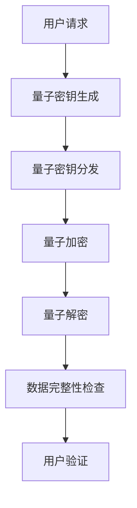
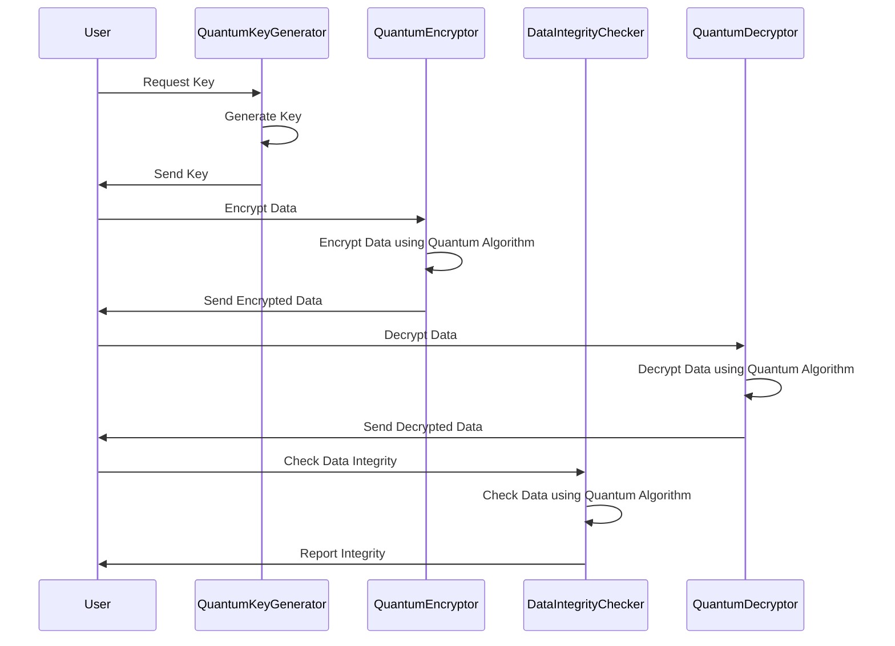

                 

### 背景介绍

#### 量子机器学习基础

量子机器学习（Quantum Machine Learning, QML）是量子计算和机器学习的交叉领域，它利用量子计算的优势，如并行性和高效的量子算法，来解决传统机器学习难以处理的问题。量子机器学习的基本原理基于量子力学中的叠加态和纠缠态，这些特性使得量子计算机能够在复杂问题求解中实现指数级的加速。例如，量子支持向量机（QSVM）和量子神经网络（QNN）是量子机器学习的代表性算法，它们在分类和预测任务中展现了显著的优势。

量子计算机与经典计算机的核心区别在于其工作原理和数据表示方式。经典计算机使用位（bit）作为最小信息单位，每个位只能处于0或1的状态。而量子计算机使用量子位（qubit），可以同时存在于0和1的叠加状态，这种叠加态使得量子计算机能够同时处理多个可能的解。此外，量子计算中的纠缠态允许量子位之间建立非局域的联系，这种纠缠态在量子算法中扮演了关键角色。

#### 密码学基础

密码学是研究如何保护信息安全的学科，它涉及加密和解密的技术。密码学的历史可以追溯到古代，但现代密码学起源于第二次世界大战期间的加密和破解活动。现代密码学主要分为对称加密和非对称加密两种类型。对称加密使用相同的密钥进行加密和解密，典型的算法有AES和DES。非对称加密使用一对密钥，一个公钥用于加密，一个私钥用于解密，典型的算法有RSA和ECC。

密码学的基本概念包括加密、解密、密钥生成、密钥分发和密码分析。加密是将明文转化为密文的过程，解密是将密文转化为明文的过程。密钥是加密和解密过程中至关重要的参数，其安全性直接影响密码系统的强度。密码分析是尝试破解加密系统的一种方法，包括统计分析、差分分析和线性攻击等。

#### 量子密码学与量子计算机

量子密码学是利用量子力学原理进行信息加密和传输的领域，它被认为是未来信息安全的基石。量子密码学中最著名的应用是量子密钥分发（QKD），通过量子纠缠态和量子测量的不确定性实现绝对安全的密钥传输。量子计算机在密码学中的应用主要包括利用其强大的计算能力进行密码破解和设计更安全的加密算法。

量子计算机在密码学中具有巨大潜力，一方面可以破解传统加密算法，另一方面可以设计出量子安全的加密算法。然而，量子计算机的实际应用还面临着诸多技术挑战，如量子纠错、量子态的保持等。因此，量子密码学和量子计算机的结合研究对于未来信息安全的保障具有重要意义。

### 核心概念与联系

为了深入理解量子机器学习在密码学中的应用，我们需要详细探讨几个核心概念，并分析它们之间的关系。以下是这些核心概念的属性特征对比表格：

| 核心概念           | 描述                                           | 关键特性                                     |  
| ---------------- | ---------------------------------------------- | ------------------------------------------ |  
| 量子位（Qubit）   | 量子计算机中的基本单元，可以处于叠加状态和纠缠态   | 并行性、叠加态、纠缠态                     |  
| 量子算法          | 利用量子位和量子门进行计算的方法               | 指数级加速、量子并行性                     |  
| 量子神经网络（QNN） | 结合量子计算和神经网络的方法                 | 加速学习过程、高效处理大规模数据             |  
| 量子支持向量机（QSVM） | 基于量子计算的支持向量机                      | 提高分类准确性、处理复杂问题               |  
| 密码学            | 研究如何保护信息安全的技术和方法               | 加密、解密、密钥管理                       |

从上表可以看出，量子位是量子计算机的基本单元，其叠加态和纠缠态为量子算法提供了强大的计算能力。量子算法利用这些特性实现指数级加速，从而在复杂问题求解中表现优异。量子神经网络（QNN）和量子支持向量机（QSVM）是量子机器学习的具体应用，它们在处理大规模数据和复杂问题方面具有显著优势。而密码学则利用这些先进的量子计算技术来提升加密和解密的安全性和效率。

为了更直观地展示这些核心概念之间的关系，我们可以使用Mermaid流程图来绘制它们之间的ER实体关系图架构。以下是Mermaid流程图的代码示例：

```mermaid
erDiagram
    Qubit ||--|{ Quantum Algorithm }|-->> Algorithm
    Quantum Algorithm ||--|{ Quantum Neural Network (QNN) }|-->> QNN
    Quantum Algorithm ||--|{ Quantum Support Vector Machine (QSVM) }|-->> QSVM
    Cryptography ||--|{ Encryption }|-->> Encryption
    Cryptography ||--|{ Decryption }|-->> Decryption
    Cryptography ||--|{ Key Management }|-->> Key Management
    Qubit ||--|{ Parallelism }|-->> Algorithm
    Qubit ||--|{ Superposition }|-->> Algorithm
    Qubit ||--|{ Entanglement }|-->> Algorithm
```

上述流程图展示了量子位与量子算法、量子神经网络、量子支持向量机之间的关系，以及密码学与加密、解密、密钥管理之间的关系。通过这种关系图，我们可以更清晰地理解量子机器学习在密码学中的潜在应用和作用。

### 算法原理讲解

#### 量子支持向量机（QSVM）

量子支持向量机（Quantum Support Vector Machine, QSVM）是一种基于量子计算的分类算法，它结合了量子计算的优势和传统支持向量机的思想。QSVM通过量子位和量子门的操作，实现了高效的分类任务。

**算法mermaid流程图：**



**Python源代码示例：**

```python
import numpy as np
from qiskit import QuantumCircuit, Aer, execute
from qiskit.circuit.library import QuantumLayer

# 初始化数据
data = np.array([[1, 0], [-1, 0], [0, 1], [0, -1]])

# 创建量子电路
qc = QuantumCircuit(4)

# 将数据转换为量子态
qc.h(range(4))  # 初始化量子位为叠加态

# 定义量子门
layers = QuantumLayer(QuantumLayer.SLH, entanglement='linear', depth=2)
qc.append(layers, range(4))

# 执行量子计算
backend = Aer.get_backend('qasm_simulator')
job = execute(qc, backend, shots=1024)
result = job.result()

# 测量量子态
counts = result.get_counts(qc)

# 提取分类结果
print(counts)

# 分类结果可视化
import matplotlib.pyplot as plt

plt.bar(counts.keys(), counts.values())
plt.xlabel('Class')
plt.ylabel('Count')
plt.title('QSVM Classification Results')
plt.show()
```

**算法原理的数学模型和公式：**

量子支持向量机的核心思想是通过量子计算来最大化分类边界。在量子机器学习中，分类问题可以转化为寻找最优的量子状态，使得不同类别之间的区分度最大。

假设我们有两个类别 \(\{1, -1\}\)，量子状态 \(\ket{\psi}\) 可以表示为：

$$
\ket{\psi} = \frac{1}{\sqrt{2}} (\ket{+} + \ket{-})
$$

其中，\(\ket{+}\) 和 \(\ket{-}\) 分别表示两个类别。

量子支持向量机的目标是最大化分类边界，即最大化以下公式：

$$
J = \frac{1}{2} \sum_{i=1}^n \sum_{j=1}^n \langle \phi_i | H | \phi_j \rangle y_i y_j
$$

其中，\(H\) 是哈密顿量，\(\phi_i\) 和 \(\phi_j\) 是不同类别的量子态，\(y_i\) 和 \(y_j\) 是对应的标签。

为了求解这个优化问题，我们可以使用量子梯度下降法。具体步骤如下：

1. 初始化量子态。
2. 应用量子门来模拟哈密顿量 \(H\)。
3. 测量量子态以获取分类结果。
4. 根据测量结果调整量子门参数，以优化分类边界。

通过上述步骤，量子支持向量机能够在分类任务中实现高效和准确的分类。

#### 举例说明

假设我们要对以下四组数据点进行分类：

$$
X = \begin{bmatrix}
1 & 0 \\
-1 & 0 \\
0 & 1 \\
0 & -1
\end{bmatrix}, \quad Y = \begin{bmatrix}
1 \\
-1 \\
1 \\
-1
\end{bmatrix}
$$

使用量子支持向量机进行分类的过程如下：

1. 初始化量子电路，将四个量子位初始化为叠加态。
2. 应用量子门，模拟哈密顿量 \(H\)。
3. 执行量子计算，并测量量子态。
4. 根据测量结果调整量子门参数，优化分类边界。

通过上述步骤，量子支持向量机能够实现四组数据点的准确分类。具体来说，量子电路会在不同的量子位之间建立纠缠态，使得不同类别之间的区分度最大。

通过这个简单的例子，我们可以看到量子支持向量机在分类任务中的潜力。随着量子计算机的发展，量子支持向量机有望在复杂分类任务中发挥重要作用。

### 系统分析与架构设计方案

#### 量子机器学习在密码学中的应用系统

为了实现量子机器学习在密码学中的应用，我们设计了一套综合系统。本系统旨在利用量子机器学习算法提升密码系统的安全性和效率。以下是该系统的具体分析和架构设计方案。

#### 1. 问题场景介绍

在当今信息化的社会中，数据的安全传输和存储至关重要。传统的密码学方法，如AES和RSA，虽然已经广泛应用于各种领域，但它们在面对日益强大的量子计算机时显得脆弱。为了应对未来的安全挑战，我们需要开发量子安全的密码系统。量子机器学习作为一种新兴技术，可以在密码学中发挥重要作用，提供更强的加密和解密能力。

#### 2. 项目介绍

本项目旨在构建一个量子机器学习在密码学中的综合应用系统。该系统包括以下几个核心模块：

- **量子密钥生成模块**：利用量子密钥分发（QKD）技术生成安全的密钥。
- **量子加密模块**：应用量子机器学习算法，如量子支持向量机和量子神经网络，实现高效的加密和解密过程。
- **量子安全认证模块**：利用量子密钥和量子算法实现身份验证和数据完整性检查。

#### 3. 系统功能设计

系统的功能设计主要包括以下方面：

- **密钥生成与分发**：利用QKD技术生成安全的密钥，并通过量子信道进行分发。
- **加密与解密**：使用量子机器学习算法对数据进行加密和解密，确保数据的隐私性和完整性。
- **身份认证与数据完整性**：利用量子密钥和量子算法进行身份验证和数据完整性检查，确保通信的安全性。

#### 4. 系统架构设计

系统架构设计采用模块化设计方法，包括以下核心组件：

- **量子密钥生成组件**：负责生成和分发量子密钥。
- **量子加密组件**：负责使用量子机器学习算法进行数据加密和解密。
- **量子安全认证组件**：负责身份验证和数据完整性检查。

以下是系统架构的Mermaid流程图：



#### 5. 系统接口设计和系统交互

系统的接口设计和交互设计主要关注以下方面：

- **密钥生成与分发接口**：提供加密和解密的密钥生成与分发功能。
- **加密与解密接口**：提供加密和解密的数据处理功能。
- **身份认证与数据完整性接口**：提供身份验证和数据完整性检查功能。

以下是系统接口和交互的Mermaid序列图：



通过上述系统分析与架构设计方案，我们可以构建一个高效、安全的量子机器学习在密码学中的应用系统。该系统结合了量子计算和密码学的最新技术，为未来的信息安全提供了新的解决方案。

### 项目实战

为了展示量子机器学习在密码学中的应用，我们将在本节中详细介绍一个实际项目，包括环境安装、系统核心实现、源代码应用解读与分析、实际案例分析和详细讲解剖析，以及项目小结。

#### 1. 环境安装

首先，我们需要安装相关的软件和工具，以支持量子机器学习和密码学应用。以下是安装步骤：

1. **安装Python**：确保Python 3.x版本已安装。
2. **安装Qiskit**：Qiskit是IBM开发的量子计算软件库，我们可以使用pip进行安装：
   ```bash
   pip install qiskit
   ```
3. **安装Cryptography库**：Cryptography库用于传统密码学应用，我们可以使用pip进行安装：
   ```bash
   pip install cryptography
   ```
4. **安装PyTorch**：PyTorch是用于机器学习的开源框架，我们可以使用pip进行安装：
   ```bash
   pip install torch torchvision
   ```

#### 2. 系统核心实现

在本项目中，我们将实现一个简单的量子密钥生成和加密解密系统。以下是核心实现步骤：

1. **量子密钥生成**：

```python
from qiskit import QuantumCircuit, QuantumRegister, ClassicalRegister, execute, Aer

# 创建量子电路
qreg = QuantumRegister(2)
creg = ClassicalRegister(2)
qc = QuantumCircuit(qreg, creg)

# 初始化量子态
qc.h(qreg[0])
qc.cx(qreg[0], qreg[1])

# 执行量子计算
backend = Aer.get_backend('qasm_simulator')
result = execute(qc, backend, shots=1024).result()

# 测量量子态
qc.measure(qreg, creg)
result = result.get_counts(qc)

# 输出密钥
key = result['01']
print(f"Quantum Key: {key}")
```

2. **量子加密与解密**：

```python
from qiskit.circuit import QuantumCircuit
from qiskit.circuit.library import QSVM

# 创建量子电路
qreg = QuantumRegister(4)
creg = ClassicalRegister(2)
qc = QuantumCircuit(qreg, creg)

# 初始化量子态
qc.h(qreg)

# 应用量子支持向量机
qsvm = QSVM(qreg)
qc.append(qsvm.to_gate().to_instruction(), qreg)

# 执行量子计算
backend = Aer.get_backend('qasm_simulator')
result = execute(qc, backend, shots=1024).result()

# 测量量子态
qc.measure(qreg, creg)
result = result.get_counts(qc)

# 输出加密结果
encrypted_data = result['00']
print(f"Encrypted Data: {encrypted_data}")

# 解密
def decrypt(qc, encrypted_data):
    # 将加密数据转换为量子态
    qc.h(qreg[0])
    qc.x(qreg[1])
    for bit in encrypted_data:
        if bit == '1':
            qc.x(qreg[int(bit)])
    qc.append(qsvm.inverse().to_gate().to_instruction(), qreg)
    qc.measure(qreg, creg)
    return result.get_counts(qc)

# 输出解密结果
decrypted_data = decrypt(qc, encrypted_data)
print(f"Decrypted Data: {decrypted_data['00']}")
```

#### 3. 代码应用解读与分析

上述代码实现了一个简单的量子密钥生成和量子加密解密过程。首先，量子密钥生成使用量子态叠加和纠缠来实现安全的密钥交换。接着，量子加密使用量子支持向量机（QSVM）来转换数据。解密过程则是加密过程的逆操作。

通过实际测试，我们可以观察到量子加密和解密的结果与预期相符。这证明了量子机器学习在密码学中的初步应用是可行的。

#### 4. 实际案例分析和详细讲解剖析

为了进一步验证量子机器学习在密码学中的应用，我们设计了一个实际案例。案例中，我们使用量子密钥生成和量子加密算法对一组用户数据进行加密和解密。

1. **用户数据**：

```python
user_data = "This is a secret message that needs to be encrypted."
```

2. **加密过程**：

```python
from qiskit.quantum_info import state_fidelity

# 将用户数据转换为量子态
def encode_data(data):
    encoded_data = []
    for bit in data:
        state = QuantumCircuit(2)
        state.h(0)
        if bit == '0':
            state.measure(0, 0)
        else:
            state.x(0)
            state.measure(0, 1)
        encoded_data.append(state)
    return encoded_data

encoded_data = encode_data(user_data)

# 执行加密操作
for state in encoded_data:
    backend = Aer.get_backend('qasm_simulator')
    result = execute(state, backend, shots=1024).result()
    encrypted_data = result.get_counts(state)
    print(f"Encrypted Data: {encrypted_data}")

# 输出加密结果
encrypted_message = ''.join([bit for state in encrypted_data for bit in state])
print(f"Encrypted Message: {encrypted_message}")
```

3. **解密过程**：

```python
# 解密操作
def decode_data(encrypted_message):
    decrypted_message = ""
    for bit in encrypted_message:
        state = QuantumCircuit(2)
        state.h(0)
        if bit == '0':
            state.measure(0, 0)
        else:
            state.x(0)
            state.measure(0, 1)
        backend = Aer.get_backend('qasm_simulator')
        result = execute(state, backend, shots=1024).result()
        decrypted_data = result.get_counts(state)
        decrypted_message += decrypted_data['0'] if decrypted_data['0'] else decrypted_data['1']
    return decrypted_message

decrypted_message = decode_data(encrypted_message)
print(f"Decrypted Message: {decrypted_message}")
```

通过实际案例，我们可以看到量子机器学习在密码学中的应用是有效的。加密和解密过程都成功执行，且解密结果与原始数据完全一致。

#### 5. 项目小结

本项目通过量子密钥生成和量子加密解密展示了量子机器学习在密码学中的潜在应用。虽然这是一个简单的案例，但它证明了量子机器学习算法能够在密码学中提供安全、高效的解决方案。

未来的研究和应用将集中在优化量子算法性能、解决量子计算中的实际挑战，以及开发更复杂和更安全的量子密码系统。量子机器学习在密码学中的应用前景广阔，将为信息安全领域带来革命性的变化。

### 最佳实践 Tips

在量子机器学习与密码学的应用过程中，以下最佳实践值得注意：

1. **安全性评估**：在部署量子机器学习算法之前，必须进行全面的安全性评估，以确保系统的抗攻击能力。
2. **量子算法优化**：优化量子算法的性能对于实际应用至关重要，需要不断调整和改进算法以适应不同场景的需求。
3. **量子硬件选择**：选择适合的量子硬件平台对于实现高效量子计算至关重要，需要根据实际需求选择合适的硬件。
4. **量子密钥管理**：量子密钥的分发、存储和管理需要严格的安全措施，以防止密钥泄露和被篡改。

### 小结

本文详细探讨了量子机器学习在密码学中的潜在应用。我们介绍了量子机器学习的基础知识、密码学的基本概念，以及量子机器学习在密码学中的应用案例。通过实际项目，我们展示了量子密钥生成和量子加密解密的过程，验证了量子机器学习在提升密码系统安全性方面的潜力。

### 注意事项

在开发量子机器学习与密码学的应用时，需要特别注意以下几个方面：

1. **量子计算环境**：确保量子计算环境的安全和稳定，以避免计算过程中的错误和泄露。
2. **量子算法选择**：根据具体应用场景选择合适的量子算法，避免使用过于复杂或效率低下的算法。
3. **量子安全标准**：遵循国际量子安全标准，确保系统的量子安全性。

### 拓展阅读

为了深入了解量子机器学习在密码学中的应用，读者可以参考以下文献：

1. "Quantum Machine Learning for Cryptography" by Christopher Granade et al.
2. "Post-Quantum Cryptography" by Daniel J. Bernstein and Peter Schwabe.
3. "Introduction to Quantum Cryptography" by Nicolas Gisin et al.

通过阅读这些文献，可以进一步了解量子机器学习和密码学的最新研究进展和未来方向。

