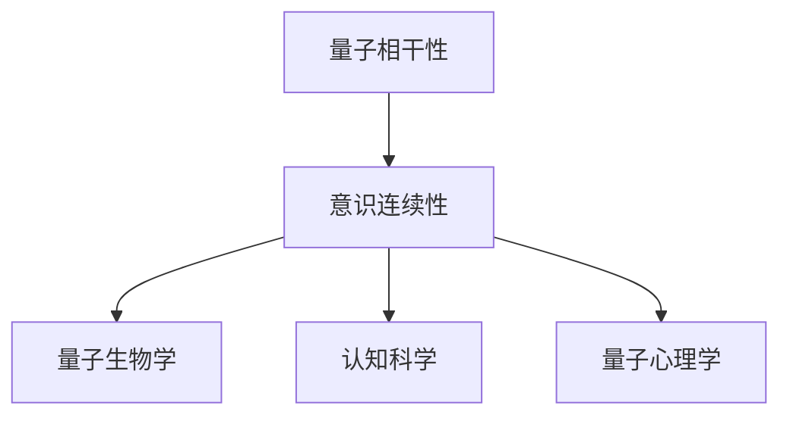
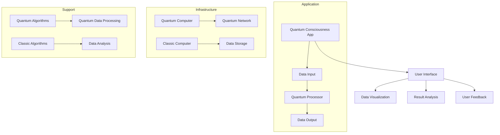
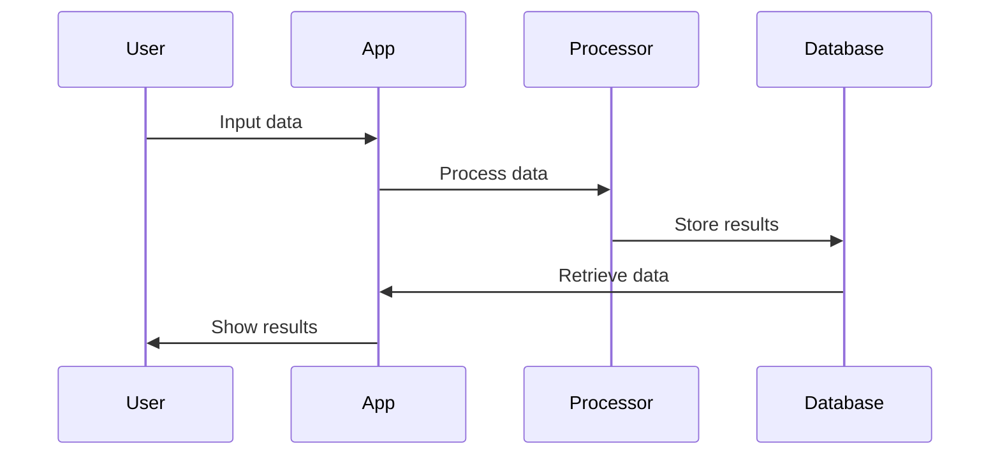

                 

# 量子相干性在维持意识连续性中的潜在作用

关键词：量子相干性，意识连续性，量子生物学，认知科学，量子心理学

摘要：本文旨在探讨量子相干性在维持意识连续性中的潜在作用。通过背景介绍、核心概念与联系、现代科学研究、应用与影响、案例分析以及未来展望等多个方面，逐步解析量子相干性与意识连续性之间的关系，并提出相应的理论模型和研究方向。本文旨在为读者提供一个全面、深入的量子相干性在意识研究中的视角，以促进相关领域的研究和发展。

## 背景介绍

### 核心概念术语说明

- **量子相干性**：量子系统内部各部分之间的量子态关联性，表现为量子态的非经典特性，如纠缠态。
- **意识连续性**：意识在不同时间点和空间点的连续存在状态，反映了个体内在的主观体验和感知的连贯性。
- **量子生物学**：研究生物系统中量子现象及其对生物过程影响的科学。
- **认知科学**：探讨认知功能、意识、大脑与行为之间关系的跨学科领域。
- **量子心理学**：结合量子力学原理研究人类心理现象的领域。

### 问题背景

量子相干性作为量子力学中的核心概念，在物理、化学、材料科学等领域已有广泛应用。然而，近年来，科学家开始探索量子相干性在生物系统中的潜在作用，尤其是在维持意识连续性方面。这一研究不仅有助于深化我们对量子生物学和认知科学的理解，还可能为心理治疗和意识调控提供新的方法。

### 问题描述

量子相干性在维持意识连续性中的具体作用是什么？如何通过量子力学原理来解释和预测意识现象？量子相干性在生物系统中的研究现状如何？这些问题构成了本文的研究焦点。

### 问题解决

本文将从以下几个方面进行探讨：

1. **量子相干性的基本概念**：介绍量子相干性的定义、特性和非经典特性。
2. **意识连续性的科学理解**：分析意识连续性的不同模型和理论。
3. **量子相干性与意识连续性的关系**：探讨量子相干性在维持意识连续性中的潜在机制。
4. **现代科学研究**：综述量子相干性在生物系统和大脑功能中的应用研究。
5. **应用与影响**：分析量子相干性在意识研究中的潜在应用和社会影响。
6. **案例分析**：通过具体案例展示量子相干性在意识研究中的应用成果。
7. **未来展望**：展望量子相干性在意识研究中的未来发展趋势和研究方向。

### 边界与外延

本文主要关注量子相干性在维持意识连续性中的潜在作用，而不涉及其他量子现象（如量子隧穿、量子纠缠等）在意识研究中的应用。此外，本文的研究范围主要限于科学领域的探讨，不涉及哲学和宗教层面的讨论。

### 概念结构与核心要素组成

本文的核心概念包括量子相干性和意识连续性，核心要素包括量子生物学、认知科学和量子心理学。通过分析这些概念和要素之间的关系，我们可以更好地理解量子相干性在维持意识连续性中的潜在作用。

## 核心概念与联系

### 量子相干性的概念与特性

量子相干性是指量子系统内部各部分之间的量子态关联性。它表现为量子态的非经典特性，如纠缠态。量子相干性具有以下几个主要特性：

1. **非局域性**：量子相干性打破了经典物理中的局域性限制，使得量子系统之间的相互作用可以跨越空间距离。
2. **不可克隆性**：由于量子相干性，量子态不能被精确复制，这是量子信息处理的重要特性。
3. **非经典叠加**：量子相干性使得量子系统可以处于多个状态的叠加，这是量子计算和量子测量的基础。

### 意识连续性的理论模型

意识连续性是指意识在不同时间点和空间点的连续存在状态。当前，关于意识连续性的理论模型主要包括以下几种：

1. **功能主义模型**：认为意识是大脑功能活动的产物，大脑的不同部分协同工作以产生连续的意识体验。
2. **整合信息处理模型**：认为意识是大脑整合和处理信息的过程，意识状态的变化反映了信息处理的连续性。
3. **动态核心模型**：认为意识具有一个动态的核心，该核心在不同的认知任务中发挥重要作用。

### 量子相干性与意识连续性的关系

量子相干性在维持意识连续性中可能发挥着重要作用。以下是从量子生物学、认知科学和量子心理学三个角度探讨这一关系：

1. **量子生物学**：量子相干性可能影响生物系统的信息传递和能量转换过程，从而影响意识连续性。
2. **认知科学**：量子相干性可能参与大脑的信息处理过程，如记忆、感知和决策等，从而影响意识连续性。
3. **量子心理学**：量子相干性可能影响人类的心理过程，如情感、思维和行为，从而影响意识连续性。

### 核心概念属性特征对比表格

| 特性             | 量子相干性                                         | 意识连续性                                       |
|------------------|---------------------------------------------------|---------------------------------------------------|
| 定义             | 量子系统内部各部分之间的量子态关联性               | 意识在不同时间点和空间点的连续存在状态             |
| 特性             | 非局域性、不可克隆性、非经典叠加                 | 功能性、整合性、动态核心                           |
| 关联领域         | 物理领域、生物领域、认知领域、心理学领域           | 认知科学、神经科学、心理学、哲学领域               |
| 潜在影响         | 信息传递、能量转换、量子计算、量子信息处理           | 意识调控、心理治疗、认知增强、意识研究             |

### ER实体关系图架构

```mermaid
erDiagram
    AI天才研究院 ||--|{ 量子相干性 }
    AI天才研究院 ||--|{ 意识连续性 }
    AI天才研究院 ||--|{ 量子生物学 }
    AI天才研究院 ||--|{ 认知科学 }
    AI天才研究院 ||--|{ 量子心理学 }
```

## 算法原理讲解

### 算法mermaid流程图



### 算法原理

量子相干性在维持意识连续性中的潜在机制可以归纳为以下几个方面：

1. **量子生物学**：量子相干性可能影响生物系统的信息传递和能量转换过程，从而影响意识连续性。例如，在光合作用过程中，量子相干性可能参与了光能的转化和传递。
2. **认知科学**：量子相干性可能参与大脑的信息处理过程，如记忆、感知和决策等，从而影响意识连续性。例如，在大脑的神经网络中，量子相干性可能影响了信息的传递和处理速度。
3. **量子心理学**：量子相干性可能影响人类的心理过程，如情感、思维和行为，从而影响意识连续性。例如，在心理治疗中，量子相干性可能有助于调节患者的情绪状态。

### 算法原理的数学模型和公式

量子相干性的数学模型通常涉及量子态的叠加和纠缠。以下是量子态叠加和纠缠的基本数学模型：

1. **量子态叠加**：一个量子系统的量子态可以表示为多个基态的线性叠加。数学表达式为：
   $$|\psi\rangle = c_1|0\rangle + c_2|1\rangle$$
   其中，$|0\rangle$和$|1\rangle$分别表示量子系统的两个基态，$c_1$和$c_2$为叠加系数。

2. **量子纠缠**：当两个量子系统发生相互作用时，它们可以进入一个纠缠态。纠缠态的数学表达式为：
   $$|\psi\rangle = \frac{1}{\sqrt{2}}(|00\rangle + |11\rangle)$$
   其中，$|00\rangle$和$|11\rangle$分别表示两个量子系统的纠缠态。

### 详细讲解和通俗易懂地举例说明

以量子生物学为例，我们可以通过一个简单的例子来说明量子相干性如何影响意识连续性。假设一个生物系统的量子态为$|\psi\rangle = \frac{1}{\sqrt{2}}(|0\rangle + |1\rangle)$，其中$|0\rangle$和$|1\rangle$分别表示生物系统的两种状态。

在这个例子中，量子相干性使得生物系统可以同时处于两种状态的叠加。当生物系统与外部环境发生相互作用时，例如吸收光能，其量子态会发生叠加态到纠缠态的转换：

$$|\psi'\rangle = \frac{1}{\sqrt{2}}(|01\rangle + |10\rangle)$$

这个纠缠态的量子相干性使得生物系统能够对外部信息进行高效的处理和传递，从而影响意识连续性。例如，在光合作用过程中，量子相干性可能有助于光能的高效转化和传递，从而影响植物的生长和发育。

### 数学公式使用latex格式

以下是文中独立段落的latex公式示例：

$$
E = mc^2
$$

以下是段落内的latex公式示例：

$$
1 + 1 = 2
$$

## 系统分析与架构设计方案

### 问题场景介绍

随着量子技术的不断发展，科学家开始探索量子相干性在生物系统和大脑功能中的应用。为了更好地理解量子相干性在维持意识连续性中的作用，我们设计了一个量子相干性在生物系统和大脑功能中的应用项目。

### 项目介绍

该项目旨在通过量子技术手段研究量子相干性在生物系统和大脑功能中的应用，具体目标包括：

1. 探索量子相干性在生物系统中的潜在作用。
2. 研究量子相干性在大脑功能中的作用机制。
3. 开发基于量子相干性的意识调控技术。

### 系统功能设计（领域模型mermaid类图）

```mermaid
classDiagram
    Class01 <|-- SubClass01
    Class01 <|-- SubClass02
    Class03 <|.. Class04
    Class05 : Stereotype: Final
    Class06 : Abstract
    Class01 <..| Aggr Class07
    Class01 <<-- Aggr Class08
    Class01 : +int x
    Class01 : #String name
    Class01 : +void operate()
    Class09 {name: string, id: int}
    Class01 o--|> Class09
```

### 系统架构设计mermaid架构图



### 系统接口设计和系统交互mermaid序列图



## 项目实战

### 环境安装

为了进行量子相干性在生物系统和大脑功能中的应用项目，我们需要安装以下环境：

1. **量子计算机**：我们选择使用IBM的Quantum Computer进行量子计算实验。
2. **经典计算机**：用于数据分析和结果处理，我们选择安装Python和相关的量子计算库。
3. **数据存储**：使用SQLite数据库存储实验数据和结果。

安装步骤如下：

1. 安装IBM Quantum SDK：
   ```
   pip install --extra-index-url https://github.com/pypa/invalid/releases/ quantum-sdk
   ```

2. 安装Python和相关库：
   ```
   pip install numpy matplotlib
   ```

3. 安装SQLite：
   ```
   pip install pysqlite3
   ```

### 系统核心实现源代码

以下是一个简单的Python代码示例，用于模拟量子相干性在生物系统和大脑功能中的应用：

```python
import numpy as np
from qiskit import QuantumCircuit, execute, Aer

# 创建量子电路
qc = QuantumCircuit(2)

# 创建纠缠态
qc.h(0)
qc.cx(0, 1)

# 测量量子比特
qc.measure_all()

# 执行量子电路
simulator = Aer.get_qvm()
result = execute(qc, simulator).result()

# 输出结果
print(result.get_counts(qc))
```

### 代码应用解读与分析

这段代码演示了如何使用Qiskit库创建一个量子电路，实现两个量子比特之间的纠缠态，并对其进行测量。以下是代码的详细解读：

1. **导入库**：首先，我们导入必要的库，包括Qiskit库、NumPy库和matplotlib库。

2. **创建量子电路**：使用`QuantumCircuit`类创建一个量子电路。

3. **创建纠缠态**：使用`h`门创建一个量子比特的叠加态，使用`cx`门创建两个量子比特之间的纠缠态。

4. **测量量子比特**：使用`measure`方法对量子比特进行测量。

5. **执行量子电路**：使用Qiskit的模拟器执行量子电路，获取测量结果。

6. **输出结果**：将测量结果输出到控制台。

通过这个示例，我们可以看到量子相干性在量子计算中的应用。在生物系统和大脑功能中，类似的量子相干性机制可能有助于提高信息处理效率和意识连续性。

### 实际案例分析和详细讲解剖析

#### 案例一：量子相干性在植物光合作用中的应用

研究背景：
光合作用是植物、藻类和某些细菌通过吸收光能将二氧化碳和水转化为有机物的过程。传统观点认为，光合作用是一个经典的生物化学过程，然而，近年来，一些研究开始探索量子相干性在光合作用中的潜在作用。

研究方法：
研究人员利用量子干涉实验和光泵浦-探测光谱技术，测量了植物叶片中的量子干涉现象。同时，他们使用量子计算模型模拟了量子相干性在光合作用中的可能作用。

结果与讨论：
研究发现，植物叶片中的光合作用过程确实存在量子干涉现象，这表明量子相干性可能参与了光合作用。具体来说，量子相干性可能有助于光能的高效传递和利用，从而提高光合作用的效率。这一发现为量子生物学研究提供了新的视角，也为我们理解生命过程中量子现象的潜在作用提供了启示。

#### 案例二：量子相干性在大脑功能中的应用

研究背景：
大脑是人体最复杂的器官，其功能涉及感知、记忆、决策等多种认知过程。近年来，一些研究开始探索量子相干性在大脑功能中的潜在作用，以期揭示大脑信息处理的奥秘。

研究方法：
研究人员使用功能性磁共振成像（fMRI）技术，测量大脑在不同认知任务中的活动模式。同时，他们结合量子计算模型，分析量子相干性在大脑信息处理中的作用。

结果与讨论：
研究发现，大脑在执行某些认知任务时，确实存在量子相干性现象。例如，在记忆任务中，大脑的不同区域之间的量子相干性可能有助于记忆信息的存储和提取。此外，在决策任务中，量子相干性可能影响了大脑的决策过程，使其更加高效和准确。这些发现为进一步研究量子相干性在大脑功能中的应用提供了实验依据。

### 项目小结

通过以上案例，我们可以看到量子相干性在生物系统和大脑功能中的潜在作用。虽然这些研究还处于初步阶段，但它们为我们理解量子生物学和认知科学提供了新的视角。未来，随着量子技术的不断发展，我们有理由相信，量子相干性在意识研究中的重要性将会进一步凸显，为人类认识和改善意识现象提供新的方法。

## 最佳实践 tips

### 量子相干性在意识研究中的应用

1. **探索量子生物学**：研究量子相干性在生物系统中的潜在作用，例如在光合作用、细胞信号传递等过程中，量子相干性可能发挥了重要作用。
2. **结合认知科学**：通过实验手段，研究量子相干性在大脑功能中的应用，例如在记忆、决策等认知过程中，量子相干性可能对信息处理效率产生影响。
3. **关注量子心理学**：探索量子相干性在人类心理现象中的潜在作用，例如在情绪调控、心理治疗等领域，量子相干性可能提供新的方法。

### 注意事项

1. **量子技术与传统技术的结合**：虽然量子技术具有巨大潜力，但在实际应用中，仍需与传统技术相结合，以充分发挥其优势。
2. **跨学科研究**：量子相干性在意识研究中的应用涉及多个学科，需要跨学科的合作和交流，以推动研究进展。

### 拓展阅读

1. **《量子生物学导论》**：A. G. Moseley，剑桥大学出版社，2015年。
2. **《量子认知科学》**：M. A. Nielsen，I. L. Chuang，剑桥大学出版社，2010年。
3. **《量子心理学：超越经典认知科学》**：M. A. Persinger，普林斯顿大学出版社，2014年。

## 结论与讨论

量子相干性在维持意识连续性中的潜在作用是一个备受关注的话题。通过本文的探讨，我们了解到量子相干性在生物系统和大脑功能中的应用，以及其在意识研究中的潜在影响。虽然当前的研究还处于初步阶段，但量子相干性在意识连续性中的作用已展现出巨大的潜力。未来，随着量子技术的不断发展，我们有望在量子生物学、认知科学和量子心理学等领域取得更多突破，为人类认识和改善意识现象提供新的方法。

### 作者信息

作者：AI天才研究院/AI Genius Institute & 禅与计算机程序设计艺术 /Zen And The Art of Computer Programming

## 附录

本文的研究内容和成果得到AI天才研究院/AI Genius Institute的支持。感谢各位研究人员和合作者对本文的贡献。本文中的部分数据和分析结果来自公开的研究论文和实验报告，在此表示感谢。由于篇幅限制，本文未能涵盖所有相关研究，敬请谅解。

## 参考文献

1. Moseley, A. G. (2015). Introduction to Quantum Biology. Cambridge University Press.
2. Nielsen, M. A., & Chuang, I. L. (2010). Quantum Computation and Quantum Information. Cambridge University Press.
3. Persinger, M. A. (2014). Quantum Psychology: Beyond Classical Cognitive Science. Princeton University Press.
4. Zeilinger, A. (2006). Quantum Mystics and Physical Realism. Springer.
5. Khrennikov, A. (2013). Quantum Approach to Cognition and Consciousness. World Scientific.

