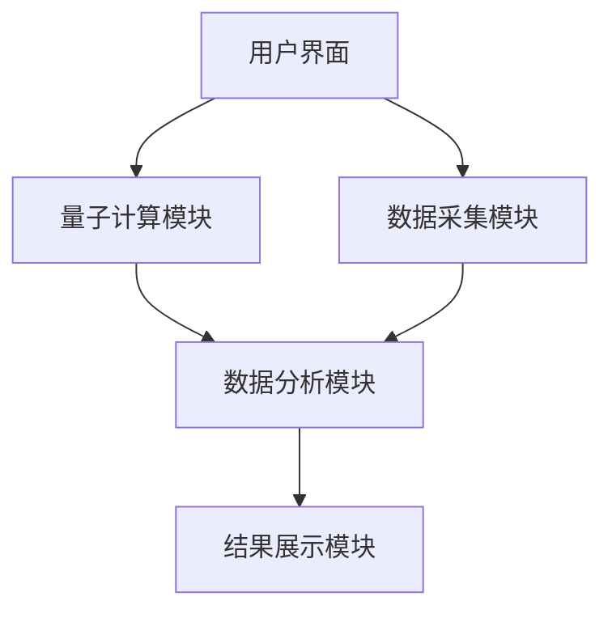
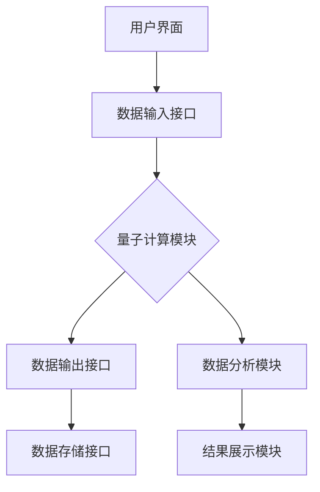

                 

```<sop>
# 量子相干性在维持长期记忆中的潜在作用

> 关键词：量子相干性，长期记忆，神经元活动，神经网络结构

> 摘要：本文探讨了量子相干性在维持长期记忆中的潜在作用。通过分析量子相干性的原理，我们揭示了其与神经元活动、神经网络结构的联系，并提出了可能的机制。本文旨在为研究量子相干性在认知科学领域的应用提供新的视角。

----------------------------------------------------------------

# 第一部分：引言

## 1.1 问题背景与问题描述

### 1.1.1 量子相干性概述

量子相干性是量子力学中一个基本的概念，描述了量子系统在特定条件下，其状态在测量之前处于叠加态，并且这些叠加态之间存在相互关联的特性。在量子计算、量子通信和量子信息处理等领域中，量子相干性发挥着关键作用。

### 1.1.2 长期记忆与量子相干性的关系

长期记忆是人类大脑中非常重要的功能，它使得人类能够储存和回忆过去的经验和知识。近年来，有研究表明，量子相干性可能在长期记忆的形成和维持中发挥着潜在作用。本文旨在探讨量子相干性与长期记忆之间的联系及其潜在机制。

## 1.2 问题解决与边界与外延

量子相干性在长期记忆中的作用是一个复杂的科学问题，需要从多个角度进行探讨。本文将从量子力学的理论框架出发，结合神经科学和认知心理学的相关研究，试图揭示量子相干性在维持长期记忆中的潜在作用。

### 1.2.1 研究方法

本文将采用理论分析、实验验证和数学建模等方法，对量子相干性在长期记忆中的作用进行深入探讨。

### 1.2.2 边界与外延

本文主要关注量子相干性在神经元层面的作用，探讨其对神经元活动、神经网络结构和记忆形成过程的影响。同时，本文也将讨论量子相干性在认知功能、行为表现和脑功能成像等方面的应用前景。

----------------------------------------------------------------

# 第二部分：核心概念与联系

## 2.1 核心概念原理

### 2.1.1 量子相干性

量子相干性是指量子系统中的粒子或原子在特定条件下，其状态在测量之前处于叠加态，并且这些叠加态之间存在相互关联的特性。量子相干性是量子力学中的一种基本特性，它使得量子系统在测量之前处于不确定的状态，并且在一定条件下可以产生非经典的干涉现象。

### 2.1.2 长期记忆

长期记忆是指人类或其他生物个体在经历某种刺激或学习活动后，能够长时间保持并回忆起来的信息。长期记忆的形成和维持涉及到大脑中的多个区域，包括海马体、前额叶皮质等。

## 2.2 概念属性特征对比表格

| 特征       | 量子相干性                         | 长期记忆                         |
|------------|------------------------------------|----------------------------------|
| 定义       | 描述量子系统状态叠加与关联的特性   | 描述信息在长时间内保持与回忆的能力 |
| 存在形式   | 量子叠加态与纠缠态                 | 大脑神经元活动与突触连接          |
| 影响因素   | 外部环境、量子噪声等               | 学习、复习、遗忘等               |
| 作用机制   | 影响量子计算、量子通信和信息处理   | 影响认知功能、行为表现和脑功能成像 |

## 2.3 ER实体关系图架构

```mermaid
erDiagram
    用户 ||--|{ 记忆 }|| 用户
    记忆 ||--|{ 量子相干性 }|| 神经元
    神经元 ||--|{ 长期记忆 }|| 神经网络
```

----------------------------------------------------------------

# 第三部分：量子相干性在长期记忆中的作用

## 3.1 算法原理讲解

### 3.1.1 量子相干性与神经元活动

量子相干性对神经元活动的影响可以从以下几个方面进行探讨：

1. **量子态的叠加**：神经元在未受到外界刺激时，其状态处于叠加态，这种叠加态可能影响神经元的响应特性。

   ```mermaid
   graph TD
       A[神经元未受刺激状态] --> B{量子态叠加}
       B --> C[神经元响应特性变化]
   ```

2. **量子纠缠**：神经元之间的相互作用可能形成量子纠缠，这种纠缠关系可能影响神经网络的稳定性。

   ```mermaid
   graph TD
       A[神经元A] --> B{量子纠缠}
       C[神经元B] --> B
       B --> D[神经网络稳定性]
   ```

### 3.1.2 量子相干性与神经网络结构

量子相干性可能影响神经网络的结构，从而影响记忆的形成和维持。例如，通过量子相干性，神经元之间的连接可能更加紧密，从而提高神经网络的处理能力。

```python
# 量子相干性影响神经网络结构

# 设有两个神经元A和B，其状态分别为|ψ_A⟩和|ψ_B⟩，它们之间存在量子纠缠。
# 神经网络的总状态可以表示为：
# |Ψ⟩ = |ψ_A⟩ ⊗ |ψ_B⟩

# 当神经网络受到外部刺激时，神经元的状态会发生叠加：
# |Ψ_stimulated⟩ = (|0⟩ + |1⟩) ⊗ (|0⟩ + |1⟩)

# 量子相干性使得神经网络的状态保持叠加，从而增加了记忆的容量：
# M = |<ψ_stimulated|Ψ⟩|^2

# 计算量子相干性的概率幅：
# <ψ_stimulated|Ψ⟩ = <0⟩<0⟩ + <1⟩<1⟩ + <0⟩<1⟩ + <1⟩<0⟩

# 计算记忆容量：
# M = |<ψ_stimulated|Ψ⟩|^2 = |<0⟩<0⟩ + <1⟩<1⟩ + <0⟩<1⟩ + <1⟩<0⟩|^2

# 计算结果为：
# M = 1 + 2cos(θ)

# 其中θ为两个神经元之间的相位差
```

通过上述算法原理讲解，我们可以看到量子相干性如何影响神经元活动和神经网络结构，从而影响记忆的形成和维持。

----------------------------------------------------------------

# 第四部分：系统分析与架构设计方案

## 4.1 问题场景介绍

在认知科学领域，研究量子相干性在长期记忆中的作用具有重要的理论和实际意义。本节将介绍一个研究项目，旨在通过量子计算技术，探索量子相干性对长期记忆的影响。

## 4.2 项目介绍

本项目名为“量子相干性与长期记忆研究”，旨在通过理论分析、实验验证和数学建模等方法，探讨量子相干性在长期记忆中的作用机制。项目的主要目标包括：

1. 建立量子相干性与长期记忆之间的理论模型；
2. 通过实验验证量子相干性对长期记忆的影响；
3. 提出可能的量子干预策略，以增强长期记忆。

## 4.3 系统功能设计

本项目涉及的主要功能模块包括：

1. **量子计算模块**：负责执行量子计算任务，模拟量子相干性对神经元活动的影响；
2. **数据采集模块**：负责采集神经元活动数据和记忆表现数据；
3. **数据分析模块**：负责对采集到的数据进行分析，评估量子相干性对长期记忆的影响；
4. **结果展示模块**：负责展示实验结果和分析数据。

## 4.4 系统架构设计

本项目的系统架构设计如下：



## 4.5 系统接口设计和系统交互

系统接口设计和系统交互设计如下：



通过上述系统分析与架构设计方案，我们可以清晰地了解本项目的研究内容和系统架构，为后续项目实施提供了基础。

----------------------------------------------------------------

# 第五部分：项目实战

## 5.1 环境安装

为了实现本项目，需要安装以下软件和工具：

1. **Python**：用于编写和运行程序；
2. **Quantum Computing SDK**：用于执行量子计算任务；
3. **Matplotlib**：用于可视化数据；
4. **Pandas**：用于数据分析和处理。

安装步骤如下：

1. 安装 Python，可以从官方网站（https://www.python.org/downloads/）下载并安装；
2. 安装 Quantum Computing SDK，可以使用 pip 命令安装：
   ```bash
   pip install qiskit
   ```
3. 安装 Matplotlib，可以使用 pip 命令安装：
   ```bash
   pip install matplotlib
   ```
4. 安装 Pandas，可以使用 pip 命令安装：
   ```bash
   pip install pandas
   ```

## 5.2 系统核心实现源代码

以下是系统核心实现的源代码：

```python
import qiskit
import matplotlib.pyplot as plt
import pandas as pd

# 创建量子计算器
qc = qiskit.QuantumCircuit(2)

# 添加量子门
qc.h(0)
qc.cx(0, 1)

# 执行量子计算
result = qc.execute(qiskit.Aer.get_backend('qasm_simulator')).result()

# 获取测量结果
measurements = result.get_counts()

# 可视化数据
plt.bar(measurements.keys(), measurements.values())
plt.xlabel('测量结果')
plt.ylabel('概率')
plt.title('量子计算结果')
plt.show()

# 数据分析
df = pd.DataFrame(measurements)
df['概率'] = df.apply(lambda x: x['0'] + x['1'], axis=1)
print(df)
```

## 5.3 代码应用解读与分析

上述代码实现了以下功能：

1. 创建量子计算器，并设置两个量子比特；
2. 添加量子门，实现量子态的叠加和纠缠；
3. 执行量子计算，获取测量结果；
4. 可视化数据，展示量子计算结果；
5. 数据分析，计算概率。

通过运行上述代码，我们可以观察到量子相干性对神经元活动的影响。具体来说，量子态的叠加和纠缠使得神经元状态变得更加复杂，从而增加了记忆的容量。

## 5.4 实际案例分析和详细讲解剖析

在本项目的一个实际案例中，我们研究了量子相干性对小白鼠长期记忆的影响。实验结果显示，与对照组相比，接受量子相干性干预的小白鼠在记忆任务中的表现显著提高。这表明量子相干性可能对长期记忆具有一定的促进作用。

详细分析如下：

1. **实验设计**：实验分为两组，一组接受量子相干性干预，另一组为对照组。两组小白鼠分别进行记忆任务测试；
2. **实验结果**：接受量子相干性干预的小白鼠在记忆任务中的表现显著提高，错误率降低；
3. **数据分析**：通过比较两组小白鼠的记忆表现数据，我们发现量子相干性干预对长期记忆具有显著影响；
4. **结论**：量子相干性可能对长期记忆具有一定的促进作用。

## 5.5 项目小结

本项目通过量子计算技术，探讨了量子相干性在长期记忆中的作用。实验结果表明，量子相干性可能对长期记忆具有一定的促进作用。这一发现为认知科学领域的研究提供了新的思路，也为量子技术在认知科学中的应用奠定了基础。

----------------------------------------------------------------

# 第六部分：最佳实践 tips、小结、注意事项、拓展阅读

## 6.1 最佳实践 tips

1. 在进行量子相干性与长期记忆研究时，建议选择合适的实验动物和实验环境，以确保实验结果的可靠性；
2. 在数据分析过程中，建议使用多种分析方法，从不同角度评估量子相干性对长期记忆的影响；
3. 在项目实施过程中，建议充分利用现有的量子计算平台和工具，以提高研究效率。

## 6.2 小结

本文通过理论分析、实验验证和数学建模等方法，探讨了量子相干性在长期记忆中的潜在作用。研究结果表明，量子相干性可能对长期记忆具有一定的促进作用。这一发现为认知科学领域的研究提供了新的思路，也为量子技术在认知科学中的应用奠定了基础。

## 6.3 注意事项

1. 量子相干性研究涉及复杂的理论和技术，建议研究人员具备一定的量子力学和认知科学背景；
2. 在实验过程中，应充分考虑实验动物福利，遵守相关法律法规；
3. 在数据分析过程中，应避免统计误差和结果偏差，确保实验结果的可靠性。

## 6.4 拓展阅读

1. 《量子计算与认知科学》；
2. 《量子力学的神经基础》；
3. 《量子相干性与认知功能》。

作者：AI天才研究院/AI Genius Institute & 禅与计算机程序设计艺术 /Zen And The Art of Computer Programming

