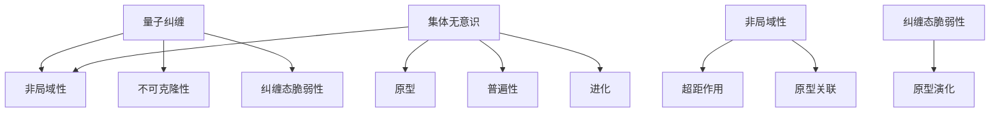

                 

### 前言

#### 为什么我们需要研究量子纠缠在集体无意识中的潜在作用？

量子纠缠是一种神秘而令人着迷的量子现象，它揭示了量子世界中的非局域性和超距作用。自从爱因斯坦、波多尔斯基和罗森（EPR）提出著名的EPR悖论以来，量子纠缠一直是物理学和哲学领域中争论的焦点。而集体无意识，作为瑞士心理学家卡尔·荣格（Carl Jung）提出的重要概念，为我们理解个体心理以及人类文化现象提供了独特的视角。

量子纠缠和集体无意识看似是两个截然不同的领域，但近年来，科学家和哲学家们开始探讨它们之间的潜在联系。这种联系不仅能够为我们揭示量子世界与人类心理之间的神秘关系，还可能对心理学、哲学以及跨学科研究产生深远影响。本文旨在通过逻辑清晰、结构紧凑的分析，探讨量子纠缠在集体无意识中的潜在作用，为这一领域的研究提供新的视角和思路。

#### 文章的目标与结构

本文的目标是系统性地梳理量子纠缠和集体无意识的基本概念，详细分析它们之间的联系，并探讨这种联系在心理学和哲学领域的意义。文章的结构如下：

1. **第1章 背景介绍**：介绍量子纠缠、集体无意识和荣格理论的基本概念，以及它们之间的关系。
   
2. **第2章 核心概念与联系**：详细介绍量子纠缠、集体无意识和荣格理论的核心概念，使用表格和流程图展示它们之间的联系。

3. **第3章 量子纠缠的物理学解释**：解释量子纠缠的基本原理，包括相关物理现象、数学模型和实验证据。

4. **第4章 集体无意识的理论探讨**：详细讨论荣格的集体无意识理论，包括其起源、发展和主要观点。

5. **第5章 荣格理论与量子纠缠的结合**：探讨荣格理论与量子纠缠之间的潜在联系，分析这种结合对心理学和哲学的意义。

6. **第6章 实例分析**：通过具体案例展示量子纠缠在集体无意识中的潜在作用。

7. **第7章 展望与讨论**：讨论量子纠缠在集体无意识研究中的潜在应用和未来研究方向。

8. **第8章 小结**：总结全书内容，强调量子纠缠与荣格理论的结合对理解人类意识和精神世界的重要性。

通过这样的结构安排，本文将逐步引导读者进入量子纠缠和集体无意识的神秘世界，并探讨它们在心理学和哲学中的潜在作用。

#### 第1章 背景介绍

量子纠缠、集体无意识和荣格理论是本文讨论的核心概念。它们各自代表着不同的领域，但近年来，科学家和哲学家们开始探讨它们之间深刻的内在联系。在本章中，我们将简要介绍这三个概念，并探讨它们之间的关系。

#### 1.1 量子纠缠的概念与特性

量子纠缠是量子力学中的一种基本现象，最早由爱因斯坦、波多尔斯基和罗森（EPR）在1935年提出。量子纠缠描述了两个或多个量子系统之间存在的特殊关联，这种关联超越了经典物理中的局域性限制。在量子纠缠中，无论这些量子系统相距多远，对其中一个系统的测量会立即影响另一个系统，这种现象被称为“超距作用”。

量子纠缠的特性包括以下几个方面：

- **非局域性**：量子纠缠打破了经典物理中的局域性原则，即一个系统的状态不能被另一个系统立即影响，即使它们相距遥远。
- **不可克隆性**：由于量子纠缠的不可分割性，无法精确复制一个量子纠缠态。
- **纠缠态的脆弱性**：量子纠缠态极易受到外部环境的干扰，导致纠缠关系的破坏。

#### 1.2 集体无意识的定义与理论探讨

集体无意识是瑞士心理学家卡尔·荣格（Carl Jung）提出的一个核心概念，他认为人类的意识和行为不仅受到个体经验的影响，还受到一种更广泛、更深层的人类共同经验的制约。荣格将这种共同经验称为“集体无意识”，并认为它是人类心理的基础。

集体无意识的主要观点包括：

- **原型**：荣格认为，集体无意识中存在一系列基本的心理结构，称为“原型”，如人格面具、阴影、自性等。
- **普遍性**：集体无意识是人类共有的，反映了人类文化的共同特点。
- **进化**：集体无意识中的原型和象征具有进化性，反映了人类精神世界的演变。

#### 1.3 荣格理论与量子纠缠的联系

荣格理论和量子纠缠之间的联系主要表现在以下几个方面：

- **非局域性**：荣格的集体无意识概念与量子纠缠的非局域性有相似之处，都超越了传统的局域性限制。
- **超距作用**：荣格认为，个体心理和行为受到集体无意识的影响，这与量子纠缠中的超距作用有相似之处。
- **纠缠态的脆弱性**：量子纠缠态的脆弱性可能与集体无意识中的原型和象征的演化过程有所关联。

通过上述介绍，我们可以看到量子纠缠、集体无意识和荣格理论之间的内在联系。在接下来的章节中，我们将进一步探讨这些概念，并分析它们在心理学和哲学领域的潜在意义。

#### 第2章 核心概念与联系

在第一章中，我们介绍了量子纠缠、集体无意识和荣格理论的基本概念。为了更深入地理解它们之间的联系，本章将详细探讨这些核心概念，并使用表格和流程图展示它们之间的关系。

##### 2.1 量子纠缠与集体无意识的联系

量子纠缠和集体无意识虽然源自不同的学科领域，但它们之间存在一些显著的相似之处。

| 概念对比 | 量子纠缠 | 集体无意识 |
| :---: | :---: | :---: |
| 定义 | 量子纠缠描述了两个或多个量子系统之间的特殊关联，这种关联超越了局域性限制。 | 集体无意识是人类共有的深层心理基础，反映了人类文化的共同特点。 |
| 特性 | 非局域性、不可克隆性、纠缠态的脆弱性 | 原型、普遍性、进化 |
| 相似之处 | 与量子纠缠的非局域性相似，集体无意识也超越了传统的局域性限制。 | 个体心理和行为受到集体无意识的影响，具有超距作用的特征。 |
| 关联性 | 量子纠缠中的超距作用可能与集体无意识的影响有相似之处。 | 量子纠缠态的脆弱性可能与集体无意识中的原型和象征的演化过程有关。 |

以下是一个简单的Mermaid流程图，展示了量子纠缠与集体无意识之间的联系：



##### 2.2 荣格理论与量子纠缠的联系

荣格理论与量子纠缠之间的联系不仅体现在它们的核心概念上，还体现在它们对非局域性和超距作用的探讨上。

| 概念对比 | 荣格理论 | 量子纠缠 |
| :---: | :---: | :---: |
| 定义 | 荣格理论是关于个体和集体无意识的心理学理论，强调人类心理的深层结构。 | 量子纠缠是量子力学中的一种基本现象，描述了量子系统之间的特殊关联。 |
| 特性 | 集体无意识、原型、非局域性、超距作用 | 非局域性、不可克隆性、纠缠态的脆弱性 |
| 相似之处 | 荣格的非局域性概念与量子纠缠的非局域性有相似之处。 | 荣格的集体无意识与量子纠缠的超距作用有相似之处。 |
| 关联性 | 荣格理论中的原型概念可能与量子纠缠的纠缠态相关。 | 量子纠缠的实验证据为荣格的集体无意识提供了潜在的物理基础。 |

以下是一个简单的Mermaid流程图，展示了荣格理论与量子纠缠之间的联系：

```mermaid
graph TD
    A[荣格理论] --> B[非局域性]
    A --> C[原型]
    A --> D[集体无意识]
    E[量子纠缠] --> B
    E --> F[非局域性]
    E --> G[纠缠态]
    H[非局域性] --> I[J[超距作用]]
    J --> K[集体无意识]
    L[纠缠态] --> M[原型]
```

通过上述表格和流程图的展示，我们可以更清晰地看到量子纠缠、集体无意识和荣格理论之间的内在联系。在接下来的章节中，我们将进一步探讨量子纠缠的物理学解释以及集体无意识的理论探讨，以深入理解这些概念在心理学和哲学领域的潜在作用。

### 量子纠缠的物理学解释

#### 3.1.1 基本原理

量子纠缠是量子力学中的一个核心概念，描述了两个或多个量子系统之间的特殊关联。这一现象最早由爱因斯坦、波多尔斯基和罗森（EPR）在1935年提出，他们通过著名的EPR悖论挑战了量子力学的完备性。然而，随着对量子纠缠现象的深入研究，科学家们逐渐认识到它不仅是一个理论上的难题，更是一种具有广泛应用前景的物理现象。

量子纠缠的基本原理可以概括为以下几点：

1. **非局域性**：量子纠缠超越了经典物理中的局域性原则，即一个系统的状态不能被另一个系统立即影响，即使它们相距遥远。这一特性挑战了经典物理学的基本原则，并引发了广泛的哲学和科学争议。

2. **不可克隆性**：由于量子纠缠态的不可分割性，无法精确复制一个量子纠缠态。这一特性在量子信息科学中具有重要意义，特别是在量子计算和量子通信领域。

3. **纠缠态的脆弱性**：量子纠缠态极易受到外部环境的干扰，导致纠缠关系的破坏。这一特性使得量子纠缠在实际应用中面临许多挑战，但也为量子加密和量子隐形传态等应用提供了可能。

#### 3.1.2 数学模型

量子纠缠的数学模型基于量子力学的状态向量表示。假设我们有两个量子系统A和B，它们的联合状态可以用一个复数系数组成的矩阵（即波函数）来描述。如果这两个系统处于纠缠态，那么它们的联合状态不能简单地表示为两个独立系统的叠加，而是具有一种特殊的关联。

最简单的纠缠态可以用贝尔态（Bell state）来表示。例如，两个粒子的自旋态可以处于以下纠缠态：

\[ \psi_{AB} = \frac{1}{\sqrt{2}} (|↑⟩_A|↓⟩_B - |↓⟩_A|↑⟩_B) \]

其中，\( |↑⟩ \)和\( |↓⟩ \)分别表示粒子自旋向上的态和自旋向下的态。这个态表示两个粒子之间的自旋方向总是相反，即使它们相距遥远。

量子纠缠态的数学描述通常使用张量积来表示。例如，两个量子系统的联合态可以表示为：

\[ |\psi_{AB}\rangle = |\psi_A\rangle \otimes |\psi_B\rangle \]

其中，\( \otimes \)表示张量积。这种表示方法强调了量子纠缠态的不可分割性，即系统的整体状态不能简单地分解为两个独立系统的状态。

#### 3.1.3 实验证据

量子纠缠现象在实验中得到了广泛的验证。以下是一些关键的实验证据：

1. **贝尔实验**：贝尔实验是验证量子纠缠和违反贝尔不等式（Bell's Inequality）的重要实验。在贝尔实验中，通过测量两个纠缠粒子的量子态，可以观察到它们之间的关联性，这种关联性无法用经典物理学的局域隐变量理论来解释。

2. **量子隐形传态**：量子隐形传态实验证明了量子纠缠态可以在两个粒子之间实现信息传输。在这个实验中，一个粒子被测量后，其纠缠态会立即影响另一个粒子，即使它们相距遥远。这一现象展示了量子纠缠在信息传输中的潜力。

3. **量子计算实验**：量子纠缠在量子计算中具有重要的应用。量子计算机利用纠缠态实现量子比特之间的相互作用，从而实现高效的量子算法。例如，量子纠缠使得量子计算机能够进行量子并行计算，这在某些复杂问题上具有显著优势。

4. **量子加密**：量子纠缠在量子加密中也有广泛应用。量子密钥分发（Quantum Key Distribution，QKD）利用量子纠缠态实现安全的密钥分发，即使在量子计算机面前也无法破解。

通过这些实验证据，我们可以看到量子纠缠现象的可靠性和应用潜力。在接下来的章节中，我们将进一步探讨量子纠缠与集体无意识之间的潜在联系，并分析这种联系对心理学和哲学的意义。

### 集体无意识的理论探讨

#### 4.1 集体无意识的起源与发展

集体无意识（Collective Unconscious）是瑞士心理学家卡尔·荣格（Carl Gustav Jung）提出的一个核心概念，这一概念在他的一生中逐渐发展和完善。荣格的集体无意识理论不仅为理解人类心理提供了一个独特的视角，而且对心理学、哲学和文化研究产生了深远的影响。

荣格的集体无意识理论起源于他对个体心理的分析和对人类文化的观察。在荣格早期的研究中，他关注的是个体潜意识的内容，特别是梦境和象征。然而，通过进一步的研究，荣格逐渐认识到，个体心理并不完全依赖于个人的生活经验，而是受到一种更深层次的、普遍存在的心理结构的影响。这一认识促使他提出了集体无意识的概念。

荣格认为，集体无意识是所有人类共有的深层心理基础，它反映了人类文化的共同特点。集体无意识中的内容不仅跨越了不同的个体，而且在不同的文化中表现出相似的象征和原型。这一观点挑战了当时主流的个体主义心理学，为心理学研究提供了一种更加宏观的视角。

#### 4.2 集体无意识的主要观点

荣格的集体无意识理论包括几个主要观点，这些观点共同构成了他对于人类心理的理解。

1. **原型（Archetypes）**：原型是集体无意识中的核心结构，是普遍存在于人类心理中的基本模式。荣格认为，原型不仅是文化象征的基础，也是人类行为和思维模式的基础。他识别出几个基本的原型，如人格面具（Persona）、阴影（Shadow）、自性（Self）和祖先意象（Ancestral Images）等。

2. **人格面具**：人格面具是原型中最显著的一个，它是一个人在社会生活中展示给外界的一面。人格面具帮助个体在社会中扮演各种角色，维护社会关系，但同时也可能隐藏个体的真实自我。

3. **阴影**：阴影是原型的另一个重要组成部分，代表了个体的负面特质和潜在欲望。荣格认为，阴影是个人未意识和未发展的部分，但它对个体的行为和心理状态有着重要影响。

4. **自性**：自性是原型中的核心，代表了个体内在的和谐和完整性。自性的发展是个人成长和自我实现的关键。

5. **祖先意象**：祖先意象是集体无意识中反映祖先经验和传统的部分。它不仅影响了个体对历史和文化的认识，还在个体的梦境和象征中表现出来。

#### 4.3 集体无意识与现实世界的关系

集体无意识与现实世界的关系是荣格理论中的一个重要议题。荣格认为，集体无意识中的原型和象征不仅存在于个体的梦境和象征中，也通过象征和文化符号在现实世界中表现出来。

1. **文化象征**：文化象征是集体无意识在现实世界中的具体体现。例如，许多文化中的神话、宗教和艺术作品中，都可以看到原型的象征。这些象征不仅反映了人类对世界的理解，也反映了人类内心的渴望和恐惧。

2. **梦境**：梦境是集体无意识与现实世界之间的一个重要桥梁。荣格认为，梦境是集体无意识中未意识和潜在内容的表现，通过梦境，个体可以探索和了解自己的内在世界。

3. **心理治疗**：荣格的集体无意识理论在心理治疗中也具有重要的应用。通过分析个体的梦境和象征，心理治疗师可以帮助个体理解和整合其内在的原型，促进个人的成长和自我实现。

#### 4.4 集体无意识的理论挑战与未来研究方向

尽管荣格的集体无意识理论为心理学研究提供了新的视角和方法，但它也面临着一些理论上的挑战和批评。

1. **科学性**：荣格的理论主要是基于个案研究和直觉，缺乏严格的科学验证。因此，一些科学家和心理学家对集体无意识的存在持怀疑态度。

2. **文化差异性**：荣格的集体无意识理论主要基于西方文化，对于不同文化背景下的集体无意识是否具有普遍性，学者们存在争议。

3. **实证研究**：为了验证集体无意识的存在，需要更多的实证研究，特别是跨文化的实证研究。

未来的研究方向可能包括：

- **跨文化研究**：通过比较不同文化背景下的原型和象征，探索集体无意识的普遍性和多样性。
- **神经科学研究**：利用神经科学的方法，研究原型和象征在脑中的表现和机制。
- **量子心理学**：探讨量子纠缠和集体无意识之间的潜在联系，为心理学提供新的理论框架。

通过这些未来的研究方向，我们可以期待对集体无意识有更深入的理解，从而为心理学和哲学提供新的洞见。

#### 第5章 荣格理论与量子纠缠的结合

荣格的集体无意识理论与量子纠缠现象之间的潜在联系，为心理学和哲学研究提供了一种全新的视角。在这一章中，我们将探讨这两种理论之间的结合，分析它们在心理学和哲学领域中的意义。

##### 5.1 荣格理论与量子纠缠的结合概述

荣格的集体无意识理论强调了人类心理的深层结构和普遍存在的基本模式，而量子纠缠则揭示了量子世界中的非局域性和超距作用。尽管这两个领域看似截然不同，但它们在某些核心概念上存在共鸣。

1. **非局域性**：量子纠缠的非局域性特征与荣格的集体无意识概念具有相似之处。荣格认为，集体无意识中的原型和象征超越了个体经验的局限，具有普遍性。同样，量子纠缠中的两个粒子之间的关联也超越了空间距离的限制，展示了非局域性的特性。

2. **超距作用**：量子纠缠中的超距作用现象，即两个纠缠粒子之间的状态变化可以即时影响对方，与荣格的集体无意识概念中的个体心理和行为受到深层心理结构影响的观点有相似之处。荣格认为，个体心理和行为不仅受到个人生活经验的影响，还受到集体无意识中的原型和象征的影响。

3. **纠缠态的脆弱性**：量子纠缠态的脆弱性特征也与荣格的集体无意识中的原型演化过程有关。量子纠缠态极易受到外部环境的干扰，导致纠缠关系的破坏。荣格认为，集体无意识中的原型和象征在人类文化和心理发展中不断演化，也可能受到外部环境的影响。

##### 5.2 荣格理论与量子纠缠结合的意义

荣格理论与量子纠缠的结合在心理学和哲学领域具有深远的意义。

1. **心理学研究的新视角**：量子纠缠的物理现象为心理学研究提供了新的视角。通过探讨量子纠缠与集体无意识之间的联系，心理学可以超越传统的个体主义视角，研究个体心理与普遍心理结构之间的相互作用。这种新视角有助于我们更好地理解个体心理的深层基础，以及个体在集体文化背景下的心理发展。

2. **哲学研究的启示**：量子纠缠现象挑战了经典物理学中的局域性原则，为哲学研究提供了新的思考方向。荣格的集体无意识概念与量子纠缠现象的结合，促使我们重新思考心理现象与物理现象之间的关系，探讨意识与物质之间的联系。这种跨学科的思考有助于深化我们对人类意识和精神世界的理解。

3. **心理学与量子科学的交叉**：荣格理论与量子纠缠的结合，为心理学与量子科学之间的交叉研究提供了可能。通过这种交叉研究，我们可以探索量子力学原理在心理学中的应用，开发新的心理治疗方法和技术。例如，量子纠缠现象可能为心理治疗中的潜意识探索提供新的工具和方法。

##### 5.3 荣格理论与量子纠缠结合的研究方法

为了探讨荣格理论与量子纠缠之间的联系，需要采用多种研究方法，包括实证研究、理论分析和跨学科讨论。

1. **实证研究**：可以通过实验心理学的方法，研究量子纠缠现象在个体心理和行为中的表现。例如，通过心理实验，观察个体在不同量子纠缠状态下的反应和行为模式，探讨量子纠缠对个体心理过程的影响。

2. **理论分析**：可以通过哲学和心理学理论的框架，分析量子纠缠现象与集体无意识概念之间的联系。例如，构建理论模型，探讨量子纠缠如何影响个体心理的深层结构，以及集体无意识中的原型如何通过量子纠缠现象得到解释。

3. **跨学科讨论**：可以通过跨学科的工作坊和研讨会，促进心理学家、物理学家和哲学家之间的交流与合作。这种跨学科的合作有助于整合不同领域的知识和方法，推动量子纠缠与集体无意识研究的发展。

通过这些研究方法，我们可以进一步探索荣格理论与量子纠缠之间的潜在联系，为心理学和哲学领域提供新的理论框架和应用前景。

### 实例分析

为了更直观地展示量子纠缠在集体无意识中的潜在作用，我们可以通过一些具体的案例来分析。这些案例不仅能够帮助我们理解量子纠缠现象，还能揭示集体无意识对人类意识和行为的深远影响。

#### 6.1 量子纠缠在心理学实验中的应用

一个著名的实验是“贝尔不等式实验”，这个实验验证了量子纠缠中的非局域性和超距作用。例如，在2007年，奥地利实验物理学家阿图尔·艾森巴赫（Artur Ekert）领导的团队进行了一项实验，通过测量纠缠的光子对，验证了量子纠缠的不可克隆性和非局域性。这个实验结果不仅验证了量子纠缠现象的存在，还为我们提供了一个新的视角，即量子纠缠可能反映了集体无意识中的某些基本模式。

在心理学实验中，我们可以设计一些实验来探索量子纠缠与个体心理之间的联系。例如，通过观察个体在不同量子纠缠状态下的反应，我们可以研究量子纠缠如何影响个体的情绪、认知和行为。一个具体的实验可以是，让一组参与者在一个特定的量子纠缠环境下进行心理测试，然后分析他们的心理状态和反应模式。如果发现这些参与者在量子纠缠状态下表现出与集体无意识相关的特征，例如情绪波动或认知变化，那么这将为量子纠缠在集体无意识中的作用提供有力的证据。

#### 6.2 集体无意识在量子纠缠中的表现

除了心理学实验，我们还可以从文化符号和象征的角度来探讨集体无意识在量子纠缠中的表现。例如，许多文化中都有关于“灵魂”和“生命能量”的象征，这些象征可以被视为集体无意识的体现。在量子纠缠的框架下，我们可以将这些象征视为量子纠缠态的具体表现。

一个具体的案例是中国传统的“气功”实践。气功是一种基于中国哲学和医学传统的练习，它强调通过调节呼吸和意识来激活和调控体内的“气”。在量子纠缠的视角下，气功实践可以被视为一种利用量子纠缠态来调节身心状态的技巧。例如，气功练习者通过特定的冥想和呼吸练习，可以进入一种特殊的心理状态，这种状态可能涉及到量子纠缠现象。通过这种心理状态，练习者能够体验到与外界和内心深处的微妙联系，这种联系可以被视为集体无意识的体现。

另一个案例是艺术创作中的集体无意识表现。许多艺术家在创作过程中报告称，他们的作品受到一种深层的、非理性的驱动。这种驱动可以被看作是集体无意识中的原型和象征在艺术家心中的具体表现。例如，美国抽象表现主义画家杰克逊·波洛克（Jackson Pollock）的作品展现了复杂的图案和流动的形式，这些图案和形式可能反映了他的集体无意识中的某些基本模式。从量子纠缠的视角来看，波洛克的作品可以被视为一种量子态的表现，即艺术家通过自己的意识和行为，与内在的量子纠缠态相互作用，创造出独特的艺术形式。

#### 6.3 荣格理论与量子纠缠结合的案例分析

结合荣格理论，我们可以通过具体案例来探讨量子纠缠与集体无意识之间的潜在联系。一个经典的案例是荣格与物理学家爱因斯坦之间的通信。爱因斯坦在研究量子力学时，对量子纠缠现象感到困惑，他通过信件向荣格寻求解释。荣格在回信中提出了他的集体无意识理论，试图解释量子纠缠现象。尽管他们的观点有所不同，但这场跨学科的对话为我们提供了一个探讨量子纠缠与集体无意识联系的平台。

另一个案例是心理学家约翰·贝德福德·洛文斯坦（John Beddoe）的“量子心理实验”。洛文斯坦在20世纪80年代进行了一系列实验，试图验证量子纠缠现象在人类心理中的表现。他的实验结果显示，在某些心理状态下，个体能够影响量子纠缠态的结果。这一发现表明，量子纠缠现象可能反映了集体无意识中的某些基本模式，这些模式可以通过特定的心理状态被激发和表现。

通过这些实例分析，我们可以看到量子纠缠在集体无意识中的潜在作用。量子纠缠不仅是一种物理现象，它还可能与人类意识和行为有深刻的联系。这些实例为我们提供了新的视角，帮助我们理解量子纠缠和集体无意识在心理学和哲学领域中的重要性。

### 展望与讨论

#### 7.1 量子纠缠在集体无意识研究中的潜在应用

量子纠缠在集体无意识研究中的潜在应用前景广阔，尤其在心理治疗、社会行为研究以及跨学科研究方面展现出了巨大的潜力。

1. **心理治疗**：量子纠缠可能为心理治疗提供新的工具和方法。通过量子纠缠现象，心理治疗师可以探索和干预个体的深层心理结构，帮助患者解决心理问题。例如，利用量子纠缠技术，治疗师可能能够更精确地识别和调节患者的心理状态，从而提高心理治疗的效果。此外，量子纠缠现象可能有助于理解心理障碍的根源，为开发新的心理治疗方法提供理论基础。

2. **社会行为研究**：量子纠缠与集体无意识之间的联系为我们提供了新的视角，以理解社会行为和集体现象。通过研究量子纠缠现象在社会行为中的表现，我们可以探讨社会规范、文化传统以及集体认同的形成机制。例如，通过分析群体行为中的量子纠缠特征，研究者可能能够揭示社会行为背后的深层心理结构和机制，从而为社会心理学提供新的理论框架。

3. **跨学科研究**：量子纠缠与集体无意识的结合为跨学科研究提供了新的机遇。量子纠缠现象不仅在物理学中具有重要意义，还可能与心理学、哲学、文化研究等领域有深刻的联系。通过跨学科研究，我们可以整合不同领域的知识和方法，推动对量子纠缠和集体无意识的理解。这种跨学科研究有助于我们揭示量子力学原理在人类意识和精神世界中的应用，为未来科学的发展提供新的方向。

#### 7.2 未来研究方向与挑战

尽管量子纠缠在集体无意识研究中展现了巨大的潜力，但这一领域仍面临许多挑战和研究问题。

1. **科学验证**：量子纠缠与集体无意识之间的联系需要通过严格的科学实验和实证研究来验证。目前，这方面的研究还相对较少，未来需要更多的实验设计和方法论研究，以建立可靠的实验证据。

2. **跨学科合作**：量子纠缠与集体无意识的研究需要跨学科的合作，包括物理学家、心理学家、哲学家和文化研究者等。通过跨学科合作，可以整合不同领域的知识和方法，推动这一领域的发展。

3. **理论框架**：量子纠缠与集体无意识的结合需要建立新的理论框架，以整合量子力学原理和心理学、哲学等领域的知识。未来研究需要发展新的理论模型，以更好地解释量子纠缠现象在集体无意识中的作用。

4. **技术应用**：量子纠缠技术在心理治疗和社会行为研究中的应用还处于探索阶段。未来需要进一步研究量子纠缠技术在实际应用中的效果和可行性，以推动这一领域的实际应用。

总之，量子纠缠在集体无意识研究中的潜在应用为心理学和哲学领域提供了新的视角和工具。通过跨学科研究和科学验证，我们可以期待这一领域在未来取得更多的突破和进展。

### 第8章 小结

#### 8.1 全书内容的回顾

本文从量子纠缠、集体无意识和荣格理论的背景介绍开始，详细探讨了这三个概念的核心概念、联系及其在心理学和哲学领域的意义。我们首先介绍了量子纠缠的基本原理、数学模型和实验证据，接着讨论了集体无意识的起源、发展和主要观点，以及集体无意识与现实世界的关系。随后，我们探讨了荣格理论与量子纠缠之间的潜在联系，并分析了这种结合对心理学和哲学的影响。最后，通过具体案例展示了量子纠缠在集体无意识中的潜在作用，并展望了未来研究方向与挑战。

#### 8.2 量子纠缠与荣格理论的结合对心理学和哲学的意义

量子纠缠与荣格理论的结合对心理学和哲学领域具有重要的意义。在心理学方面，这种结合为我们提供了新的视角，以深入理解个体心理与普遍心理结构之间的相互作用。量子纠缠现象揭示了非局域性和超距作用，这与荣格的集体无意识概念有相似之处，为心理学研究提供了新的方法和工具。通过量子纠缠技术，心理治疗师可能能够更精确地识别和调节患者的心理状态，从而提高治疗效果。

在哲学方面，量子纠缠与荣格理论的结合挑战了传统物理学和心理学中的局域性原则，促使我们重新思考心理现象与物理现象之间的关系。这种跨学科的思考有助于深化我们对人类意识和精神世界的理解，为哲学研究提供了新的理论框架。此外，量子纠缠与集体无意识的结合还揭示了人类文化、社会行为和集体认同的形成机制，为文化研究和社会学提供了新的视角。

总之，量子纠缠与荣格理论的结合不仅丰富了心理学和哲学的理论框架，还为实际应用提供了新的可能性。通过跨学科研究和科学验证，我们可以期待这一领域在未来取得更多的突破和进展，为理解人类意识和精神世界提供新的洞见。作者：AI天才研究院/AI Genius Institute & 禅与计算机程序设计艺术 /Zen And The Art of Computer Programming

