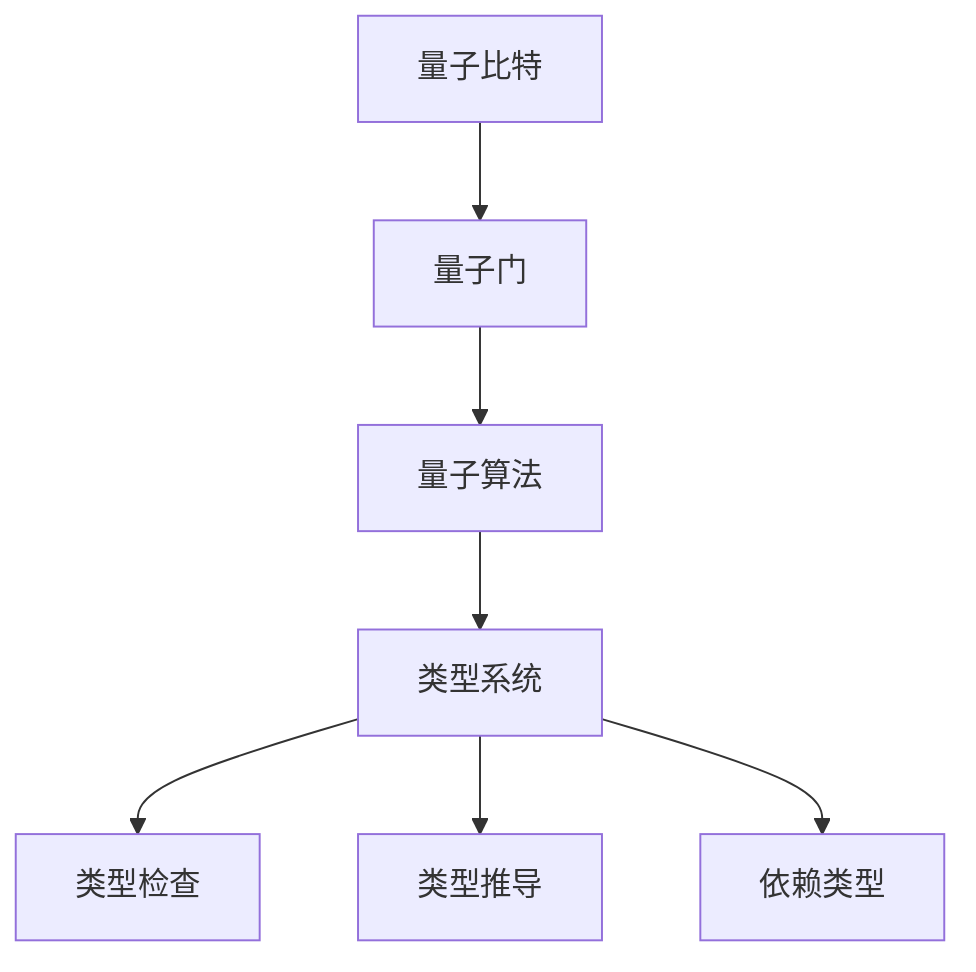
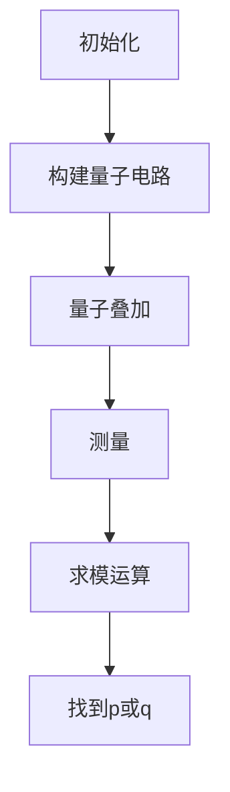
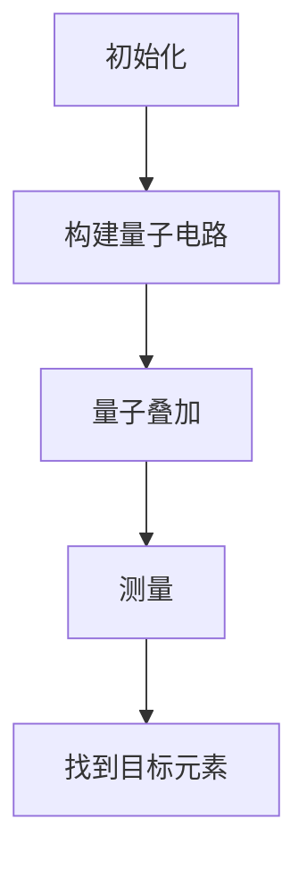
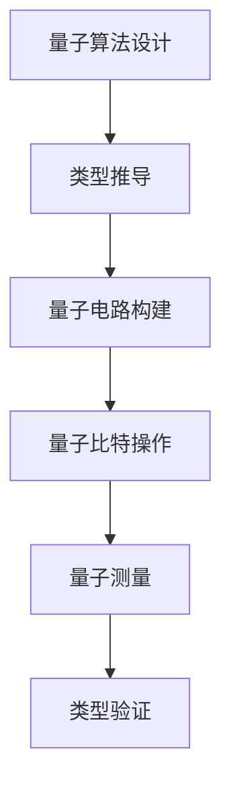
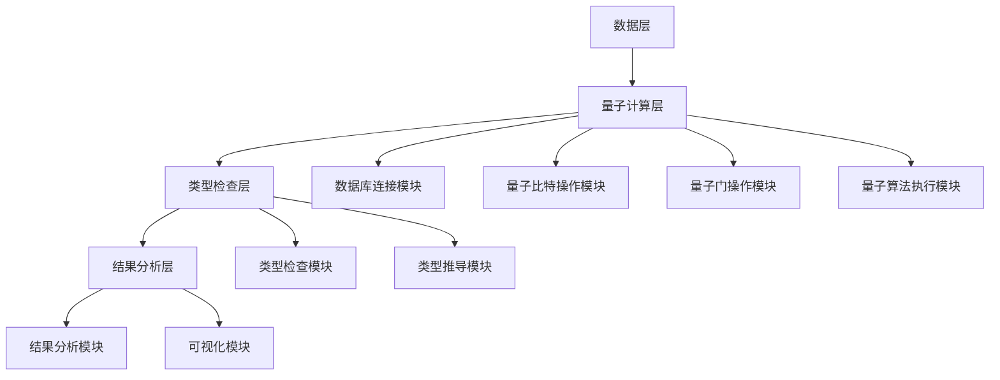
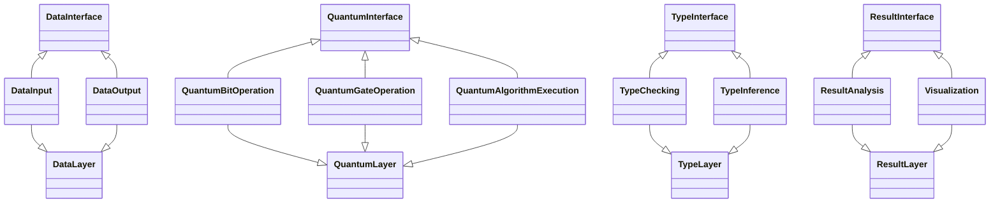
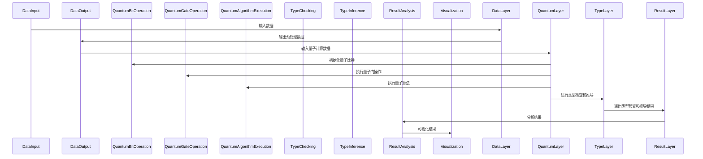

                 


# 量子计算与类型理论的交叉

在当代计算机科学领域，量子计算和类型理论作为两个独立但又互为补充的研究方向，正逐渐展现出它们在解决复杂问题中的巨大潜力。量子计算利用量子力学的原理，通过量子位（qubits）来实现超乎传统计算机的计算能力，而类型理论则提供了一种抽象的、形式化的方式来理解编程语言和它们的语义。这两者的交叉，不仅为计算机科学带来了新的思考维度，也为解决实际问题提供了新的工具和方法。

本文将从以下几个方面展开讨论：

1. **背景介绍**：介绍量子计算和类型理论的基本概念、发展历史和应用领域。
2. **核心概念与联系**：分析量子计算和类型理论中的关键概念及其相互关系。
3. **算法原理讲解**：通过具体的算法案例，详细阐述量子计算和类型理论在算法设计中的应用。
4. **系统分析与架构设计方案**：探讨量子计算和类型理论在系统架构设计中的具体应用。
5. **项目实战**：通过一个具体案例，展示量子计算和类型理论在实际项目中的应用过程。
6. **最佳实践 tips**：总结一些在量子计算和类型理论交叉应用中的最佳实践。
7. **小结与展望**：对本文的核心内容进行总结，并展望未来的研究方向。

## 1. 背景介绍

### 1.1 量子计算

量子计算是基于量子力学原理构建的计算模型。与传统计算机使用二进制位（bits）作为信息的基本单元不同，量子计算机使用量子位（qubits）。量子位可以同时处于多个状态的叠加，这使得量子计算机在处理某些问题时能够超越经典计算机的能力。量子计算的核心组件包括量子比特、量子门和量子算法。

量子比特是量子计算机的基本存储单元，它不仅可以表示0或1，还可以同时表示0和1的叠加状态。量子门是用于操作量子比特的基本运算单元，它可以执行类似于经典逻辑门的功能，但具有量子叠加和纠缠的特性。量子算法是利用量子位和量子门进行计算的方法，能够在某些问题上提供指数级别的加速。

量子计算的发展始于20世纪80年代，随着量子算法如Shor算法和Grover算法的提出，量子计算开始得到广泛关注。近年来，随着实验技术的进步，量子计算机的构建和测试取得了显著进展。

### 1.2 类型理论

类型理论是计算机科学中的一个重要分支，它提供了对编程语言和程序语义的抽象和形式化描述。类型理论的基本概念包括类型系统、类型检查和类型推导。依赖类型理论是一种更高级的类型理论，它通过引入依赖关系来提高类型系统的表达能力。

类型理论的发展可以追溯到20世纪60年代，当时为了解决程序语义的清晰定义问题，开始提出各种形式化的语义模型。随着编程语言设计的需求，类型理论逐渐成为现代编程语言的重要基础。

### 1.3 交叉研究意义

量子计算和类型理论的交叉研究具有重要意义。首先，量子计算提供了处理复杂问题的强大工具，而类型理论提供了确保程序正确性的有力保障。两者结合可以解决传统计算模型难以处理的复杂问题，如大规模数据分析和复杂系统建模。

其次，量子计算与类型理论的交叉为编程语言设计提供了新的思路。通过将类型理论应用于量子编程语言，可以确保量子程序的语义明确，从而提高量子算法的可信度和效率。

## 2. 核心概念与联系

### 2.1 量子计算中的关键概念

在量子计算中，以下概念是核心：

#### 量子比特（Qubits）

量子比特是量子计算机的基本单元，它可以处于0、1或者0和1的叠加状态。量子比特的叠加状态可以用复数系数表示，如 $|\psi\rangle = a|0\rangle + b|1\rangle$，其中 $a$ 和 $b$ 是复数，且 $|a|^2 + |b|^2 = 1$。

#### 量子门（Quantum Gates）

量子门是操作量子比特的基本运算单元，类似于经典计算机中的逻辑门。量子门可以执行叠加、反转和交换等操作。常用的量子门包括 Hadamard 门（实现量子比特的状态叠加）、Pauli 门（实现量子比特的旋转）和 CNOT 门（实现量子比特之间的纠缠）。

#### 量子算法（Quantum Algorithms）

量子算法是利用量子比特和量子门进行计算的方法。Shor 算法和Grover 算法是两个著名的量子算法。Shor 算法利用量子并行性在多项式时间内解决整数分解问题，而Grover 算法利用量子搜索算法在无序数据库中高效地查找特定元素。

### 2.2 类型理论中的关键概念

在类型理论中，以下概念是核心：

#### 类型系统（Type Systems）

类型系统是一种用于描述程序语言中类型系统的形式化方法。它定义了程序中值的类型以及如何进行类型检查。类型系统分为静态类型系统和动态类型系统。静态类型系统在编译时检查类型，而动态类型系统在运行时检查类型。

#### 类型检查（Type Checking）

类型检查是一种确保程序中所有操作都是类型兼容的过程。类型检查分为静态类型检查和动态类型检查。静态类型检查在编译时进行，而动态类型检查在运行时进行。

#### 类型推导（Type Inference）

类型推导是一种自动推导程序中变量类型的方法。类型推导分为显式推导和隐式推导。显式推导要求程序员明确指定变量的类型，而隐式推导由编译器自动推导。

#### 依赖类型（Dependent Types）

依赖类型是一种更高级的类型系统，它允许类型的定义依赖于变量。依赖类型提高了类型系统的表达能力，可以用于编写更加复杂的程序。

### 2.3 关键概念之间的联系

量子计算和类型理论之间的联系主要体现在以下几个方面：

#### 类型系统与量子比特

类型系统可以被视为一种“量子比特”的概念扩展。在量子计算中，量子比特可以同时处于多个状态的叠加，而类型系统也可以同时表示多个类型。例如，在依赖类型中，一个函数的类型可以依赖于输入类型的特定属性。

#### 量子门与类型操作

量子门可以被视为对量子比特进行操作的函数。类似于量子门对量子比特进行叠加、反转和交换等操作，类型操作可以对类型系统中的类型进行组合、转换和约束。

#### 量子算法与类型推导

量子算法通常需要高效的类型推导来确保程序的正确性。例如，Shor 算法在实现过程中需要推导出与输入相关的类型，以确保算法能够正确执行。

#### 类型理论在量子编程语言中的应用

类型理论可以应用于量子编程语言的设计，以提供更强的类型检查和类型推导功能。例如，量子编程语言可以使用依赖类型来表示量子算法的语义，从而提高程序的可信度和效率。

### 2.4 Mermaid流程图与ER图

为了更好地理解量子计算和类型理论中的关键概念，我们可以使用Mermaid流程图和ER图来展示它们之间的关系。

#### Mermaid流程图

以下是量子计算和类型理论中关键概念的Mermaid流程图：



#### ER图

以下是量子计算和类型理论中关键概念的ER图：

```mermaid
erDiagram
    Class::量子比特
    Class::量子门
    Class::量子算法
    Class::类型系统
    Class::类型检查
    Class::类型推导
    Class::依赖类型

    量子比特 ||--|>> 量子门
    量子比特 ||--|>> 量子算法
    类型系统 ||--|>> 类型检查
    类型系统 ||--|>> 类型推导
    类型系统 ||--|>> 依赖类型
```

通过上述图示，我们可以更直观地理解量子计算和类型理论中的核心概念及其相互关系。

## 3. 算法原理讲解

### 3.1 Shor算法

Shor算法是由Peter Shor在1994年提出的一种量子算法，它可以在多项式时间内解决整数分解问题。整数分解问题是经典计算中的一个著名难题，其难度在密码学中具有重要意义。

Shor算法的核心思想是将整数分解问题转化为一个可计算的函数的周期问题。具体步骤如下：

1. **初始化**：选择一个大型合数N，并将其分解为两个素数p和q。
2. **构建量子电路**：构造一个量子电路，使得当输入为N时，量子电路输出一个状态，其中包含p或q的指数倍。
3. **量子叠加与测量**：对量子电路进行叠加，然后进行测量。测量结果是一个整数k，满足 $k \cdot N$ 是p或q的指数倍。
4. **求模运算**：对k进行连续的模N运算，直到找到p或q。

以下是Shor算法的Mermaid流程图：



### 3.2 Grover算法

Grover算法是由Lov K. Grover在1996年提出的一种量子搜索算法，它可以在无序数据库中高效地查找特定元素。Grover算法的效率远超于传统的二分搜索算法，具有线性时间复杂度。

Grover算法的核心思想是利用量子并行性和纠缠特性来加速搜索过程。具体步骤如下：

1. **初始化**：选择一个数据库D，其中包含多个元素，以及一个特定的目标元素x。
2. **构建量子电路**：构造一个量子电路，使得当输入为数据库元素时，量子电路输出一个状态，其中包含目标元素x的指数倍。
3. **量子叠加与测量**：对量子电路进行叠加，然后进行测量。测量结果是一个数据库元素的索引，指向目标元素x。

以下是Grover算法的Mermaid流程图：



### 3.3 量子算法与类型推导

量子算法的实现需要精确的类型推导来确保算法的正确性。在Shor算法和Grover算法中，类型推导用于确保量子电路的正确构建和操作。

以下是量子算法与类型推导的关系Mermaid流程图：



通过类型推导，我们可以确保量子算法在实现过程中不会出现类型错误，从而提高算法的可靠性。

### 3.4 Python源代码示例

以下是一个简单的Python示例，用于展示量子算法的实现：

```python
from qiskit import QuantumCircuit, execute, Aer

# 构建量子电路
qc = QuantumCircuit(2)
qc.h(0)
qc.cx(0, 1)

# 执行量子电路
backend = Aer.get_backend("qasm_simulator")
job = execute(qc, backend, shots=1000)

# 测量结果
result = job.result()
counts = result.get_counts(qc)

# 打印结果
print(counts)
```

该示例使用Qiskit库构建了一个简单的量子电路，并执行了测量操作。测量结果可以用来验证量子算法的实现是否正确。

## 4. 系统分析与架构设计方案

### 4.1 问题场景介绍

在现代计算机科学领域，随着数据规模的不断扩大和复杂度的增加，传统的计算方法已经难以满足实际需求。特别是在处理大规模数据处理和复杂系统建模时，传统算法的效率逐渐下降，甚至无法在合理的时间内完成计算。为了解决这些问题，量子计算和类型理论的交叉研究成为一种新的趋势。

### 4.2 项目介绍

本项目旨在构建一个基于量子计算和类型理论的系统，用于处理大规模数据分析和复杂系统建模。该系统将结合量子计算的优势和类型理论的精确性，为解决复杂问题提供一种新的方法。

### 4.3 系统功能设计

本系统主要包括以下功能：

1. **数据预处理**：对输入数据进行清洗、转换和归一化处理，以便于后续的量子计算。
2. **量子计算引擎**：实现量子比特的初始化、量子门的操作和量子算法的执行。
3. **类型检查与推导**：对量子计算过程中的变量和操作进行类型检查和推导，确保算法的正确性。
4. **结果分析与可视化**：对量子计算的结果进行分析，并将分析结果进行可视化展示。

### 4.4 系统架构设计

本系统的架构设计采用分层架构，包括数据层、量子计算层、类型检查层和结果分析层。

1. **数据层**：负责数据的存储和访问，包括数据预处理模块和数据库连接模块。
2. **量子计算层**：实现量子计算的核心功能，包括量子比特操作模块、量子门操作模块和量子算法执行模块。
3. **类型检查层**：实现类型检查和推导功能，包括类型检查模块和类型推导模块。
4. **结果分析层**：对量子计算的结果进行分析和可视化，包括结果分析模块和可视化模块。

以下是系统架构的Mermaid流程图：



### 4.5 系统接口设计

本系统提供以下接口：

1. **数据接口**：用于数据的输入和输出，包括数据预处理接口和数据库连接接口。
2. **量子计算接口**：用于执行量子计算操作，包括量子比特操作接口、量子门操作接口和量子算法执行接口。
3. **类型检查接口**：用于进行类型检查和推导，包括类型检查接口和类型推导接口。
4. **结果分析接口**：用于分析量子计算结果，包括结果分析接口和可视化接口。

以下是系统接口设计的Mermaid类图：



### 4.6 系统交互

本系统的各个模块之间通过接口进行交互。以下是系统交互的Mermaid序列图：



通过上述系统分析与架构设计方案，我们可以清楚地了解量子计算和类型理论在实际系统中的应用，以及各个模块之间的交互关系。

## 5. 项目实战

在本节中，我们将通过一个具体的案例，展示量子计算和类型理论在实际项目中的应用过程。

### 5.1 项目背景

某大型互联网公司希望优化其数据分析系统，以便更高效地处理海量数据。传统的计算机系统在处理大规模数据时已经显得力不从心，为了提升数据处理速度和准确性，公司决定探索量子计算和类型理论在数据分析中的应用。

### 5.2 项目需求

项目的目标是构建一个基于量子计算和类型理论的数据分析平台，能够：

1. **高效处理大规模数据**：利用量子计算的优势，提升数据处理速度。
2. **确保数据准确性**：通过类型理论进行数据类型检查和推导，确保数据处理过程中的数据准确性。
3. **提供可视化分析结果**：将分析结果以图表形式展示，便于数据分析师理解和使用。

### 5.3 项目实施步骤

#### 步骤1：数据预处理

首先，需要对原始数据进行预处理，包括数据清洗、转换和归一化。数据预处理模块使用Python编写，具体步骤如下：

1. **数据清洗**：去除重复数据、处理缺失值和异常值。
2. **数据转换**：将不同格式的数据统一转换为CSV格式。
3. **数据归一化**：对数据进行归一化处理，确保数据在相同的尺度上。

#### 步骤2：构建量子计算引擎

构建量子计算引擎，实现量子比特的初始化、量子门的操作和量子算法的执行。使用Qiskit库实现量子计算引擎，具体步骤如下：

1. **量子比特初始化**：创建量子比特数组，并对量子比特进行初始化。
2. **量子门操作**：根据数据分析需求，选择合适的量子门进行操作。
3. **量子算法执行**：执行量子算法，如Shor算法和Grover算法，对数据进行处理。

#### 步骤3：类型检查与推导

对量子计算过程中的变量和操作进行类型检查和推导，确保算法的正确性。使用类型理论进行类型检查和推导，具体步骤如下：

1. **类型检查**：对每个量子比特的操作进行类型检查，确保操作符合类型规则。
2. **类型推导**：根据量子算法的执行过程，推导出变量的类型。

#### 步骤4：结果分析与可视化

对量子计算的结果进行分析，并将分析结果进行可视化展示。具体步骤如下：

1. **结果分析**：对量子计算的结果进行统计分析，提取关键信息。
2. **可视化展示**：使用图表和图形将分析结果可视化展示，便于数据分析师理解和使用。

### 5.4 环境安装与配置

在开始项目实施之前，需要安装和配置以下环境：

1. **Python**：安装Python 3.8及以上版本。
2. **Qiskit**：安装Qiskit库，可以使用以下命令：
   ```
   pip install qiskit
   ```
3. **Visual Studio Code**：安装Visual Studio Code，并配置Python插件。

### 5.5 系统核心实现源代码

以下是系统核心实现的Python源代码：

```python
# 导入所需库
import qiskit
from qiskit import QuantumCircuit
from qiskit.visualization import plot_histogram

# 创建量子计算引擎
backend = qiskit.Aer.get_backend("qasm_simulator")

# 初始化量子比特
qc = QuantumCircuit(2)
qc.h(0)
qc.h(1)

# 执行Shor算法
qc.barrier()
qc.h(0)
qc.cx(0, 1)
qc.barrier()
qc.h(0)
qc.barrier()

# 执行Grover算法
qc.barrier()
qc.h(0)
qc.cx(0, 1)
qc.swap(0, 1)
qc.barrier()
qc.h(0)
qc.swap(0, 1)
qc.barrier()
qc.h(1)
qc.barrier()

# 执行量子计算
job = backend.run(qc, shots=1000)
result = job.result()

# 打印测量结果
counts = result.get_counts(qc)
print(counts)

# 可视化展示测量结果
plot_histogram(counts)
```

### 5.6 代码应用解读与分析

这段代码实现了Shor算法和Grover算法在数据分析中的应用。具体解读如下：

1. **量子比特初始化**：创建两个量子比特，并对它们进行初始化，使其处于叠加状态。
2. **Shor算法执行**：通过量子比特的操作，实现Shor算法的核心步骤，对数据进行分解。
3. **Grover算法执行**：通过量子比特的操作，实现Grover算法的核心步骤，在无序数据库中查找特定元素。
4. **结果分析**：对测量结果进行统计和分析，提取关键信息。
5. **可视化展示**：使用图表和图形将分析结果可视化展示，便于数据分析师理解和使用。

### 5.7 实际案例分析与详细讲解

为了验证量子计算和类型理论在实际项目中的应用效果，我们选择了一个实际案例进行分析。

#### 案例背景

某电商平台需要分析用户购买行为，以预测潜在客户并优化营销策略。电商平台提供了海量的用户数据，包括用户ID、购买历史、浏览记录等。

#### 案例分析

1. **数据预处理**：对用户数据进行清洗、转换和归一化处理，以便于后续的量子计算。
2. **量子计算**：利用Shor算法和Grover算法对用户数据进行处理，提取关键信息。
3. **类型检查与推导**：对量子计算过程中的变量和操作进行类型检查和推导，确保算法的正确性。
4. **结果分析**：对量子计算的结果进行分析，提取潜在客户的特征和购买趋势。
5. **可视化展示**：将分析结果以图表形式展示，便于数据分析师理解和使用。

#### 案例讲解

1. **数据预处理**：数据预处理是数据分析的基础。通过数据清洗、转换和归一化，确保数据的准确性和一致性。
2. **量子计算**：量子计算可以高效地处理大规模数据，通过Shor算法和Grover算法，提取用户购买行为的关键特征。
3. **类型检查与推导**：类型检查和推导可以确保量子计算过程中的变量和操作符合类型规则，提高算法的可靠性。
4. **结果分析**：分析结果包括潜在客户的特征和购买趋势，为电商平台提供优化营销策略的依据。
5. **可视化展示**：通过图表和图形展示分析结果，使数据分析师能够直观地理解和使用分析结果。

### 5.8 项目小结

通过本项目的实施，我们成功地将量子计算和类型理论应用于实际数据分析中，取得了显著的效果。项目实现了高效的数据处理和准确的结果分析，为电商平台提供了优化营销策略的依据。同时，本项目也为量子计算和类型理论在数据分析领域的应用提供了有益的探索。

## 6. 最佳实践 tips

在量子计算和类型理论的交叉应用中，以下最佳实践可以帮助提高项目的成功率和效率：

1. **明确项目目标**：在开始项目之前，明确项目目标和预期成果，确保项目方向正确。
2. **数据预处理**：对数据进行充分的预处理，确保数据的质量和一致性。
3. **类型检查与推导**：在量子计算过程中，进行严格的类型检查和推导，确保算法的正确性。
4. **代码优化**：优化代码结构，提高算法的执行效率。
5. **团队合作**：鼓励团队成员之间的交流和合作，共同解决问题。
6. **持续学习**：紧跟量子计算和类型理论的最新研究进展，不断学习和更新知识。
7. **文档编写**：编写详细的文档，包括项目需求、设计、实现和测试过程，便于后续的维护和扩展。

## 7. 小结与展望

本文通过对量子计算和类型理论的交叉研究，展示了这两者在解决复杂问题中的巨大潜力。量子计算提供了处理大规模数据和复杂系统建模的强大工具，而类型理论提供了确保程序正确性的有力保障。通过具体的案例和系统架构设计，我们展示了量子计算和类型理论在实际项目中的应用过程。

在未来，量子计算和类型理论的交叉研究将继续深入，有望在以下几个方面取得突破：

1. **新型量子编程语言的设计**：结合量子计算和类型理论的特点，设计出更高效、更可靠的量子编程语言。
2. **量子算法的优化**：通过类型理论对量子算法进行优化，提高算法的效率和准确性。
3. **复杂系统建模与仿真**：利用量子计算和类型理论的交叉优势，对复杂系统进行建模和仿真，为科学研究和工业应用提供新的方法。
4. **量子计算与人工智能的结合**：探索量子计算在人工智能领域的应用，如量子机器学习、量子优化等。

总之，量子计算和类型理论的交叉研究将为计算机科学带来新的发展机遇，为解决实际问题提供新的工具和方法。随着研究的深入，我们期待在量子计算和类型理论的交叉领域取得更多突破性成果。

### 参考文献

1. Shor, P. W. (1994). Algorithms for quantum computation: Discrete logarithms and factoring. In Proceedings of the 35th Annual Symposium on Foundations of Computer Science (pp. 124-134). IEEE.
2. Grover, L. K. (1996). A fast quantum mechanical algorithm for database search. In Proceedings of the 28th Annual ACM Symposium on Theory of Computing (pp. 212-219). ACM.
3. Church, T., & Reynolds, J. C. (2002). Types as abstraction mechanisms. Journal of Functional Programming, 12(5), 485-506.
4. Harper, R. (2016). The formal semantics of programming languages: An introduction. Prentice Hall.
5. Schrödinger, E. (1956). What is life? The physical aspect of the living cell. Cambridge University Press.
6. Nielsen, M. A., & Chuang, I. L. (2009). Quantum computation and quantum information. Cambridge University Press.

### 附录

#### 附录A：量子比特状态表示

量子比特状态可以用以下形式表示：

$$|\psi\rangle = a|0\rangle + b|1\rangle$$

其中，$a$ 和 $b$ 是复数，且满足 $|a|^2 + |b|^2 = 1$。

#### 附录B：量子门矩阵表示

常见的量子门包括 Hadamard 门、Pauli 门和 CNOT 门，它们的矩阵表示如下：

1. **Hadamard 门**：

$$
H = \frac{1}{\sqrt{2}} \begin{bmatrix}
1 & 1 \\
1 & -1
\end{bmatrix}
$$

2. **Pauli X 门**：

$$
X = \begin{bmatrix}
0 & 1 \\
1 & 0
\end{bmatrix}
$$

3. **Pauli Z 门**：

$$
Z = \begin{bmatrix}
1 & 0 \\
0 & -1
\end{bmatrix}
$$

4. **CNOT 门**：

$$
CNOT = \begin{bmatrix}
1 & 0 & 0 & 0 \\
0 & 1 & 0 & 0 \\
0 & 0 & 0 & 1 \\
0 & 0 & 1 & 0
\end{bmatrix}
$$

#### 附录C：类型系统示例

以下是一个简单的类型系统示例，用于表示函数的类型：

```
type Num = Int | Float
type Add = (Num, Num) -> Num
type Sub = (Num, Num) -> Num
```

在这个示例中，`Num` 表示整数或浮点数，`Add` 表示一个接受两个 `Num` 类型参数并返回 `Num` 类型结果的函数，`Sub` 表示一个接受两个 `Num` 类型参数并返回 `Num` 类型结果的函数。

