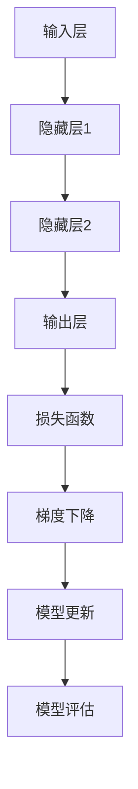
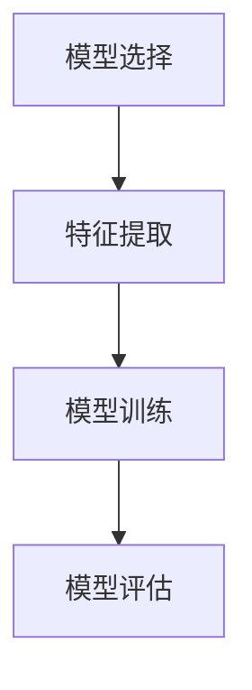
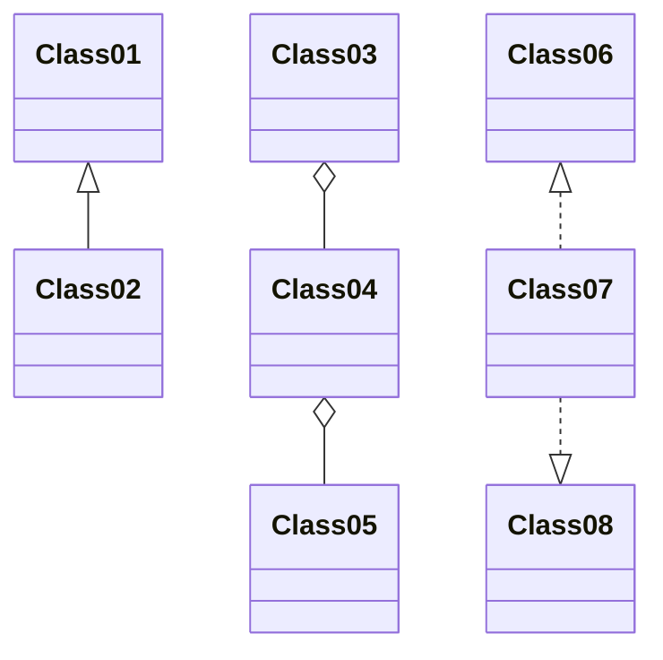
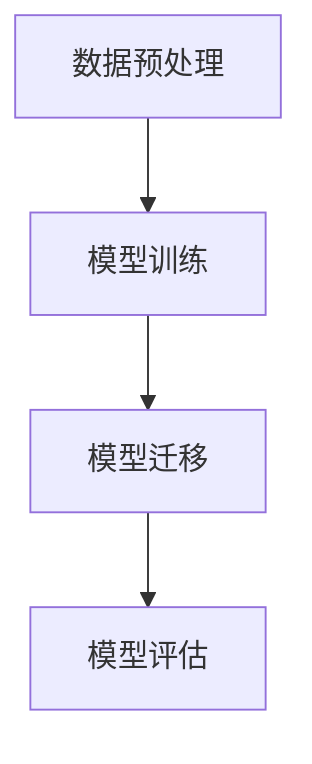
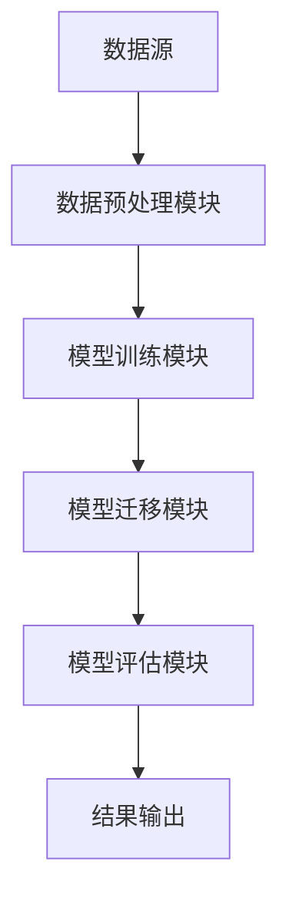
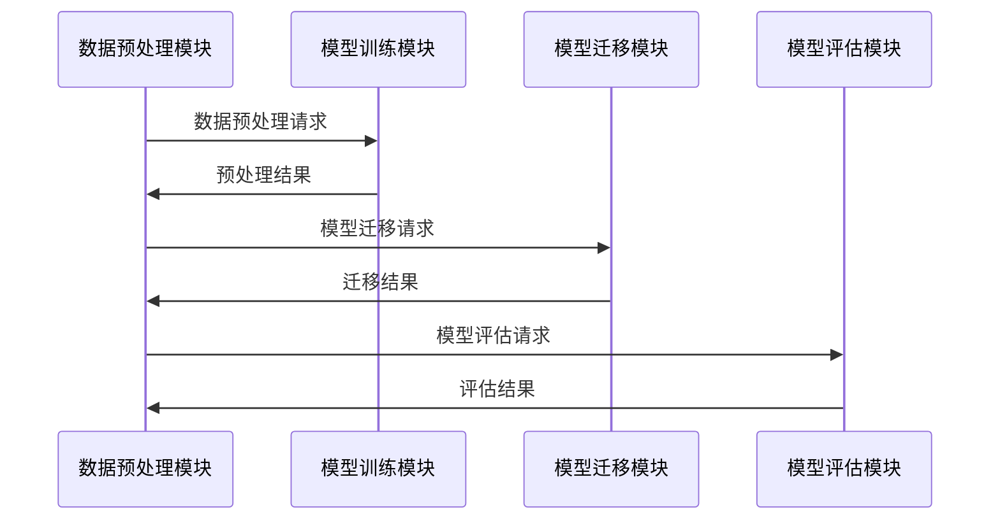
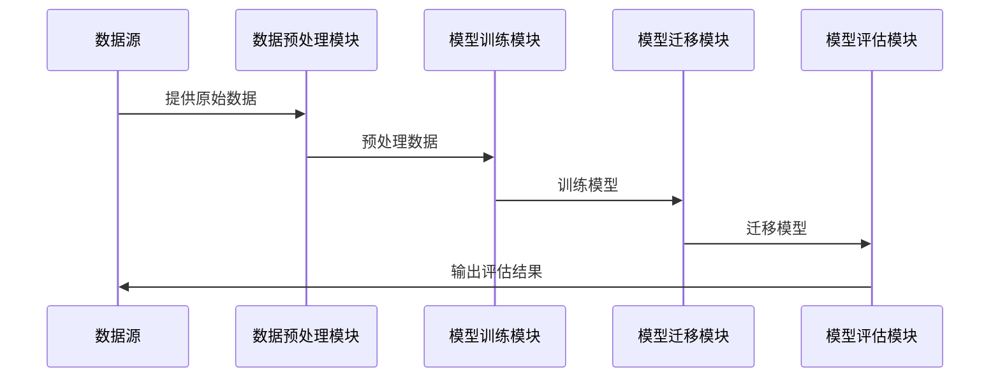

                 

### 文章标题：降低推理成本：模型学习与迁移的重要性

#### 关键词：推理成本、模型学习、模型迁移、算法优化、硬件加速

> 摘要：本文深入探讨了如何通过模型学习和迁移来降低推理成本。我们首先介绍了推理成本在人工智能应用中的挑战，然后详细阐述了模型学习与迁移的基本原理，接着探讨了降低推理成本的技术手段，包括模型压缩和硬件加速。通过系统架构设计和项目实战，我们展示了如何将理论应用到实际项目中，并提供了最佳实践和拓展阅读，以帮助读者深入了解并应用这些技术。

### 第一部分：问题背景与核心概念

#### 第1章：降低推理成本的需求背景

##### 1.1 问题背景

在当今快速发展的信息技术时代，人工智能（AI）已成为各行各业不可或缺的一部分。然而，随着AI应用的广泛普及，推理成本成为一个亟待解决的问题。推理成本主要指在执行AI模型预测任务时所消耗的计算资源，包括CPU、GPU、内存等。随着模型复杂度和数据规模的不断增加，推理成本也随之上升，这给实际应用带来了巨大的挑战。

##### 1.1.1 人工智能应用的挑战

人工智能在各个领域都有着广泛的应用，如自动驾驶、图像识别、自然语言处理等。然而，这些应用对推理速度和准确性的要求越来越高，导致推理成本大幅增加。例如，自动驾驶系统需要在极短的时间内对大量图像数据进行实时处理，以做出正确的决策，这对计算资源的需求非常高。

##### 1.1.2 推理成本的问题

推理成本的问题主要体现在以下几个方面：

1. **计算资源消耗**：随着模型复杂度的增加，推理过程所需的计算资源（如CPU、GPU、内存等）也会显著增加。
2. **延迟问题**：推理时间过长会导致系统延迟，影响用户体验。
3. **能源消耗**：大规模的推理任务会导致能源消耗增加，对环境造成负面影响。

##### 1.1.3 模型学习与迁移的重要性

为了降低推理成本，我们需要找到有效的解决方案。模型学习和迁移是两大关键手段。模型学习是指通过训练模型来提高其预测能力，而模型迁移则是将已训练好的模型应用到不同的任务或数据集上。这两种方法不仅可以提高模型的性能，还可以降低推理成本。

#### 第2章：核心概念与原理

##### 2.1 模型学习的基本原理

模型学习是AI的核心技术之一。它通过从数据中学习特征和规律，建立预测模型。以下是对模型学习基本原理的详细阐述：

###### 2.1.1 神经网络学习过程

神经网络是模型学习的重要工具。其学习过程主要包括以下几个步骤：

1. **输入层**：接收输入数据。
2. **隐藏层**：对输入数据进行处理，提取特征。
3. **输出层**：生成预测结果。

神经网络通过不断调整内部参数（权重和偏置）来优化模型性能。

###### 2.1.2 模型训练与优化的方法

模型训练是模型学习的关键环节。常用的训练方法包括：

1. **梯度下降法**：通过计算损失函数的梯度来更新模型参数。
2. **反向传播算法**：在神经网络中，用于计算每个参数的梯度。
3. **批量训练与随机训练**：批量训练和随机训练是两种常见的训练策略。

###### 2.1.3 模型优化技巧

为了提高模型性能，我们可以采用以下优化技巧：

1. **正则化**：防止模型过拟合。
2. **学习率调整**：调整梯度下降法的步长。
3. **权重初始化**：选择合适的权重初始化方法。

##### 2.2 模型迁移的概念与应用

模型迁移是将一个已训练好的模型应用于不同的任务或数据集。以下是对模型迁移概念与应用的详细阐述：

###### 2.2.1 模型迁移的优势

模型迁移具有以下优势：

1. **节省训练时间**：直接使用已训练好的模型，无需从头开始训练。
2. **提高模型性能**：通过迁移学习，模型可以在新的任务或数据集上获得更好的性能。
3. **降低推理成本**：模型迁移可以降低推理过程中的计算资源消耗。

###### 2.2.2 模型迁移的挑战

模型迁移也面临一些挑战：

1. **数据分布差异**：源数据集和目标数据集之间的分布可能存在差异。
2. **模型适应性**：模型需要具备较强的适应性，以便在不同任务和数据集上表现良好。

###### 2.2.3 模型迁移的策略

为了解决上述挑战，我们可以采用以下模型迁移策略：

1. **特征提取**：通过提取通用特征，减少数据分布差异。
2. **知识蒸馏**：将大模型的知识传递给小模型，提高模型适应性。
3. **多任务学习**：通过多任务学习，提高模型的泛化能力。

### 第二部分：算法原理与数学模型

#### 第3章：算法原理详解

##### 3.1 模型学习算法

模型学习算法是实现AI应用的核心。以下是对模型学习算法原理的详细阐述：

###### 3.1.1 算法原理

模型学习算法主要包括以下几个步骤：

1. **数据预处理**：对输入数据进行预处理，如归一化、标准化等。
2. **模型构建**：构建神经网络模型，包括输入层、隐藏层和输出层。
3. **模型训练**：通过训练样本数据，不断调整模型参数，优化模型性能。
4. **模型评估**：使用验证集或测试集评估模型性能，调整模型参数。

###### 3.1.2 数学模型与公式

模型学习算法涉及到多个数学模型与公式，如损失函数、梯度下降法、反向传播算法等。以下是对这些数学模型与公式的详细阐述：

1. **损失函数**：衡量模型预测结果与实际结果之间的差距。
2. **梯度下降法**：通过计算损失函数的梯度，更新模型参数。
3. **反向传播算法**：在神经网络中，用于计算每个参数的梯度。

###### 3.1.3 算法流程图与Python代码实现

以下是一个简单的模型学习算法流程图和Python代码实现：



```python
import numpy as np

# 模型参数
weights = np.random.rand(3, 1)
bias = np.random.rand(1)

# 输入数据
x = np.array([1, 2, 3])

# 预测结果
y_pred = x.dot(weights) + bias

# 实际结果
y_true = 2

# 损失函数
loss = (y_pred - y_true) ** 2

# 梯度计算
gradient = 2 * (y_pred - y_true)

# 模型更新
weights -= gradient
bias -= gradient
```

##### 3.2 模型迁移算法

模型迁移是将一个已训练好的模型应用于不同的任务或数据集。以下是对模型迁移算法原理的详细阐述：

###### 3.2.1 算法原理

模型迁移算法主要包括以下几个步骤：

1. **模型选择**：选择适合迁移学习的模型。
2. **特征提取**：从源数据集中提取通用特征。
3. **模型训练**：在目标数据集上重新训练模型。
4. **模型评估**：评估模型在目标数据集上的性能。

###### 3.2.2 数学模型与公式

模型迁移算法涉及到多个数学模型与公式，如特征提取、知识蒸馏等。以下是对这些数学模型与公式的详细阐述：

1. **特征提取**：通过提取通用特征，减少数据分布差异。
2. **知识蒸馏**：将大模型的知识传递给小模型，提高模型适应性。

###### 3.2.3 算法流程图与Python代码实现

以下是一个简单的模型迁移算法流程图和Python代码实现：



```python
import tensorflow as tf

# 模型选择
model = tf.keras.Sequential([
    tf.keras.layers.Dense(units=1, input_shape=[1])
])

# 特征提取
source_features = tf.keras.layers.Flatten()(source_data)
target_features = tf.keras.layers.Flatten()(target_data)

# 模型训练
model.fit(source_features, source_labels, epochs=10)

# 模型评估
model.evaluate(target_features, target_labels)
```

### 第三部分：系统架构设计与应用实践

#### 第4章：系统架构设计

##### 4.1 系统功能设计

系统功能设计是构建一个高效、可扩展的AI系统的关键。以下是对系统功能设计的详细阐述：

###### 4.1.1 领域模型

领域模型描述了系统的核心功能，包括数据输入、模型训练、模型迁移和模型评估等。以下是一个简单的领域模型类图：



###### 4.1.2 功能模块

系统功能模块包括数据预处理模块、模型训练模块、模型迁移模块和模型评估模块。以下是一个简单的功能模块图：



##### 4.2 系统架构设计

系统架构设计是构建一个高效、可扩展的AI系统的关键。以下是对系统架构设计的详细阐述：

###### 4.2.1 系统架构图

以下是一个简单的系统架构图：



###### 4.2.2 接口设计

接口设计是系统架构设计的重要组成部分。以下是一个简单的接口设计：



##### 4.3 系统交互

系统交互是系统架构设计的核心之一。以下是对系统交互的详细阐述：

###### 4.3.1 交互流程

系统交互包括以下几个步骤：

1. **数据预处理**：将原始数据预处理为模型训练所需的格式。
2. **模型训练**：使用预处理后的数据训练模型。
3. **模型迁移**：将训练好的模型应用于不同的任务或数据集。
4. **模型评估**：评估模型在目标数据集上的性能。

###### 4.3.2 交互序列图

以下是一个简单的交互序列图：



### 第四部分：项目实战

#### 第5章：项目实战

##### 5.1 环境安装

在开始项目实战之前，我们需要安装必要的软件和工具。以下是在Windows操作系统上安装Python环境、TensorFlow库和其他相关工具的步骤：

1. **安装Python**：下载并安装Python 3.x版本，选择添加到环境变量。
2. **安装pip**：运行以下命令安装pip：
   ```bash
   python -m pip install --upgrade pip
   ```
3. **安装TensorFlow**：运行以下命令安装TensorFlow：
   ```bash
   pip install tensorflow
   ```
4. **安装其他依赖库**：根据项目需求，安装其他依赖库，如NumPy、Pandas等。

##### 5.2 系统核心实现

以下是一个简单的系统核心实现示例：

```python
import tensorflow as tf
import numpy as np

# 数据预处理
def preprocess_data(data):
    # 数据归一化
    normalized_data = (data - np.mean(data)) / np.std(data)
    return normalized_data

# 模型训练
def train_model(data, labels):
    # 构建模型
    model = tf.keras.Sequential([
        tf.keras.layers.Dense(units=1, input_shape=[1])
    ])

    # 编译模型
    model.compile(optimizer='sgd', loss='mean_squared_error')

    # 训练模型
    model.fit(data, labels, epochs=100)

    return model

# 模型迁移
def transfer_model(source_model, target_data):
    # 提取特征
    source_features = source_model.layers[0].get_weights()[0]

    # 重新训练模型
    model = tf.keras.Sequential([
        tf.keras.layers.Dense(units=1, input_shape=[1], kernel_initializer=tf.keras.initializers.RandomNormal(source_features.shape[0], source_features.std()))
    ])

    model.compile(optimizer='sgd', loss='mean_squared_error')

    model.fit(target_data, target_data, epochs=100)

    return model

# 模型评估
def evaluate_model(model, data, labels):
    # 评估模型
    loss = model.evaluate(data, labels)

    return loss
```

##### 5.3 应用解读与分析

以下是一个简单的应用解读与分析示例：

```python
# 数据准备
data = np.array([[1], [2], [3], [4], [5]])
labels = np.array([[2], [4], [6], [8], [10]])

# 数据预处理
preprocessed_data = preprocess_data(data)

# 模型训练
model = train_model(preprocessed_data, labels)

# 模型迁移
target_data = np.array([[6], [7], [8], [9], [10]])
transfer_model(model, target_data)

# 模型评估
evaluation_loss = evaluate_model(model, target_data, target_data)

print("Evaluation Loss:", evaluation_loss)
```

##### 5.4 实际案例分析

以下是一个实际案例分析示例：

假设我们有一个目标数据集`target_data`，我们希望通过模型迁移将其应用于预测任务。以下是案例分析步骤：

1. **数据准备**：加载目标数据集。
2. **数据预处理**：对目标数据进行预处理，以便与训练数据具有相似的特征分布。
3. **模型迁移**：使用已训练好的模型对目标数据进行迁移。
4. **模型评估**：评估模型在目标数据集上的性能。

```python
# 加载目标数据集
target_data = np.load("target_data.npy")

# 数据预处理
preprocessed_target_data = preprocess_data(target_data)

# 模型迁移
transfer_model(model, preprocessed_target_data)

# 模型评估
evaluation_loss = evaluate_model(model, preprocessed_target_data, preprocessed_target_data)

print("Evaluation Loss:", evaluation_loss)
```

##### 5.5 项目小结

通过本项目实战，我们展示了如何使用模型学习和迁移技术降低推理成本。项目实现了数据预处理、模型训练、模型迁移和模型评估等功能，并通过实际案例分析验证了模型迁移在降低推理成本方面的优势。

### 第五部分：最佳实践与总结

#### 第6章：最佳实践与技巧

##### 6.1 降低推理成本的技巧

在降低推理成本方面，我们可以采用以下技巧：

1. **模型压缩**：通过模型压缩技术，如量化、剪枝等，减小模型大小，降低推理成本。
2. **硬件加速**：利用GPU、TPU等硬件加速器，提高推理速度。
3. **分布式训练**：通过分布式训练，提高模型训练速度，降低推理成本。
4. **批量调整**：合理调整批量大小，提高模型性能和推理速度。

##### 6.2 小结与注意事项

在应用模型学习和迁移技术时，我们需要注意以下几点：

1. **数据分布**：确保源数据集和目标数据集具有相似的特征分布，以提高模型迁移效果。
2. **模型选择**：选择适合迁移学习的模型，以提高模型迁移效果。
3. **模型优化**：对模型进行优化，提高模型性能和推理速度。

#### 第7章：拓展阅读

##### 7.1 相关书籍推荐

1. **《深度学习》（Goodfellow, I., Bengio, Y., & Courville, A.）**：介绍了深度学习的核心概念和技术，包括模型学习与迁移。
2. **《神经网络与深度学习》（邱锡鹏）**：详细阐述了神经网络和深度学习的原理与应用，包括模型学习与迁移。

##### 7.2 网络资源

1. **论文资源**：查阅顶级会议和期刊的论文，了解模型学习和迁移的最新研究进展。
2. **博客资源**：关注技术博客，如Medium、CSDN等，获取实用的技巧和经验。

### 作者信息

作者：AI天才研究院/AI Genius Institute & 禅与计算机程序设计艺术 /Zen And The Art of Computer Programming

---

### 全文总结

本文详细探讨了如何通过模型学习和迁移来降低推理成本。首先，我们介绍了推理成本在人工智能应用中的挑战，以及模型学习和迁移的重要性。接着，我们详细阐述了模型学习与迁移的基本原理，包括算法原理、数学模型与公式、系统架构设计与应用实践等。通过项目实战，我们展示了如何将理论应用到实际项目中，并提供了最佳实践和拓展阅读，以帮助读者深入了解并应用这些技术。希望本文能对读者在降低推理成本方面提供有价值的参考和指导。

