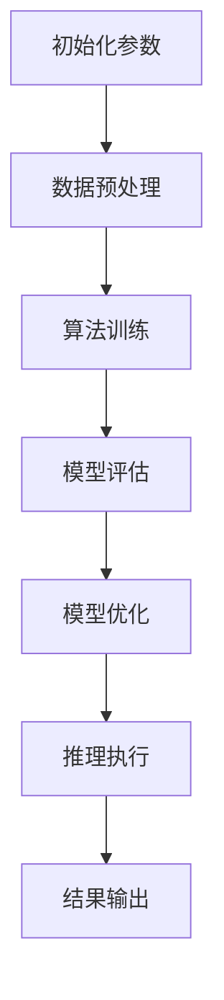
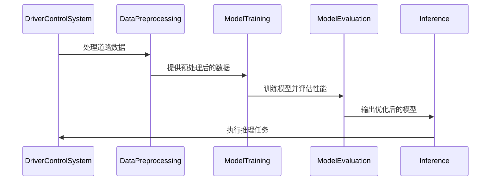
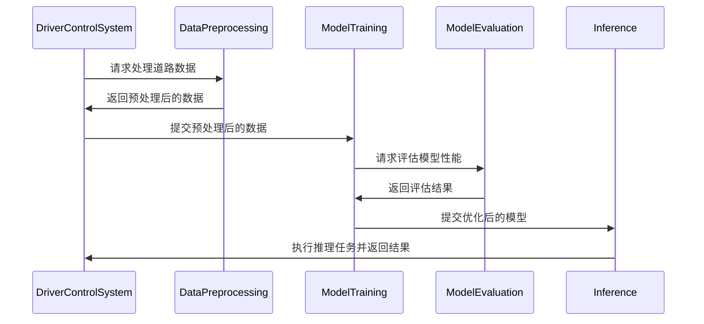

                 

# 降低未来推理成本的策略研究

## 关键词

- 推理成本
- 人工智能
- 算法优化
- 数学模型
- 系统架构设计
- 项目实战

## 摘要

本文旨在探讨降低未来推理成本的策略。随着人工智能技术的不断发展，推理任务在许多领域中都扮演着至关重要的角色。然而，推理过程往往伴随着高昂的计算成本，这限制了人工智能应用的广泛性和实用性。本文从核心概念、算法原理、数学模型、系统架构设计、项目实战等多个方面进行深入分析，提出了一系列降低推理成本的策略。通过详细阐述这些策略，本文为未来人工智能推理任务的优化提供了有益的参考。

## 引言

### 书籍概述

随着人工智能技术的不断进步，推理任务在各个领域中的应用越来越广泛。从自动驾驶汽车到智能医疗诊断，推理能力是人工智能系统实现智能化决策的核心。然而，推理任务的高计算成本使得许多实际应用受到限制。为了解决这一问题，本文将对降低未来推理成本的策略进行系统研究，旨在为人工智能领域提供切实可行的优化方案。

### 阅读指南

本文分为引言、背景介绍、核心概念与联系、算法原理讲解、数学模型和数学公式讲解、系统分析与架构设计方案、项目实战、最佳实践 tips、小结与拓展阅读等部分。读者可以根据自己的需求有选择性地阅读相关章节。对于希望深入了解人工智能推理任务优化策略的读者，建议从核心概念与联系开始阅读，逐步深入到算法原理、数学模型、系统架构设计和项目实战等内容。

## 背景介绍

### 问题背景

在人工智能领域，推理任务是指基于已知信息推断未知信息的过程。随着大数据和深度学习技术的发展，推理任务在自动驾驶、自然语言处理、智能医疗等领域取得了显著的成果。然而，传统的推理方法往往依赖于复杂的计算模型，导致推理过程耗时较长，计算成本高昂。例如，在自动驾驶领域，实时推理的需求要求系统在有限的计算资源下迅速作出决策，这对推理成本提出了更高的要求。

### 问题描述

推理成本主要受到以下几个方面的影响：

1. **计算复杂度**：推理算法的复杂度直接影响计算成本。随着数据规模的增加，算法的复杂度通常会呈指数级增长，导致计算成本急剧上升。
2. **数据依赖**：许多推理任务依赖于大量数据进行训练和推理，数据传输和处理过程中也会产生额外的计算成本。
3. **硬件资源**：高性能的硬件设备能够显著降低推理成本，但昂贵的硬件成本限制了其在某些场景中的应用。
4. **实时性要求**：许多应用场景对推理任务的实时性有严格要求，这意味着系统需要在极短的时间内完成推理过程，从而增加计算压力。

### 问题解决

为了降低推理成本，可以从以下几个方面进行优化：

1. **算法优化**：通过改进算法模型，降低计算复杂度，提高推理效率。
2. **数据预处理**：通过有效的数据预处理方法，减少数据依赖，提高数据利用率。
3. **硬件加速**：利用高性能硬件设备，如GPU、FPGA等，加速推理过程。
4. **分布式计算**：通过分布式计算技术，将推理任务分解到多个计算节点上，降低单个节点的计算压力。

### 边界与外延

1. **边界**：本文主要关注推理任务的计算成本优化策略，不包括推理结果的准确性和可靠性。
2. **外延**：除了本文提到的优化策略，还可以从系统架构设计、算法改进、硬件升级等多个维度进行推理成本的降低。

## 核心概念与联系

### 核心概念原理

在讨论降低推理成本之前，我们需要了解一些核心概念：

1. **推理任务**：指基于已知信息推断未知信息的过程。
2. **计算复杂度**：描述算法在处理数据时所需的计算量。
3. **数据依赖**：推理任务对数据的依赖程度。
4. **硬件资源**：用于执行推理任务的计算资源。

### 概念属性特征对比表格

为了更好地理解这些概念，我们可以通过一个表格进行对比：

| 概念       | 属性特征                                                     |
|------------|--------------------------------------------------------------|
| 推理任务   | 需要基于已知信息进行推断，具有明确的输入和输出               |
| 计算复杂度 | 描述算法在处理数据时所需的计算量，通常与数据规模和算法复杂度相关 |
| 数据依赖   | 推理任务对数据的依赖程度，影响推理效率和成本                 |
| 硬件资源   | 用于执行推理任务的计算资源，如CPU、GPU等                     |

### ER实体关系图架构的 Mermaid 流程图

为了更直观地展示这些概念之间的关系，我们可以使用Mermaid绘制一个ER实体关系图：

```mermaid
erDiagram
    A[推理任务] ||--|{ 计算复杂度 }|| B[数据依赖]
    A ||--|{ 硬件资源 }|| C[硬件资源]
    B ||--|{ 推理效率 }|| A
    C ||--|{ 推理成本 }|| A
```

在上面的ER图中，`推理任务`与`计算复杂度`、`数据依赖`和`硬件资源`之间存在关联，这些因素共同决定了推理成本。

## 算法原理讲解

### 使用Mermaid画出算法流程图

为了降低推理成本，我们可以采用以下算法流程：



在这个算法流程中，我们首先进行数据预处理，然后进行算法训练和模型评估，根据评估结果对模型进行优化，最终执行推理任务并输出结果。

### 使用Python源代码详细阐述算法原理

以下是一个简单的Python代码示例，用于演示如何实现上述算法流程：

```python
# 导入必要的库
import numpy as np
from sklearn.model_selection import train_test_split
from sklearn.metrics import accuracy_score

# 数据预处理
def preprocess_data(data):
    # 实现数据预处理逻辑，如归一化、去噪等
    processed_data = ...
    return processed_data

# 算法训练
def train_model(train_data, train_labels):
    # 使用机器学习算法训练模型
    model = ...
    model.fit(train_data, train_labels)
    return model

# 模型评估
def evaluate_model(model, test_data, test_labels):
    # 使用评估指标（如准确率）评估模型性能
    predictions = model.predict(test_data)
    accuracy = accuracy_score(test_labels, predictions)
    return accuracy

# 模型优化
def optimize_model(model, train_data, train_labels):
    # 根据评估结果对模型进行优化
    model.fit(train_data, train_labels)
    return model

# 推理执行
def inference(model, data):
    # 使用训练好的模型进行推理
    predictions = model.predict(data)
    return predictions

# 主函数
def main():
    # 加载数据
    data = ...
    labels = ...

    # 数据预处理
    processed_data = preprocess_data(data)

    # 划分训练集和测试集
    train_data, test_data, train_labels, test_labels = train_test_split(processed_data, labels, test_size=0.2)

    # 算法训练
    model = train_model(train_data, train_labels)

    # 模型评估
    accuracy = evaluate_model(model, test_data, test_labels)
    print(f"模型准确率：{accuracy}")

    # 模型优化
    optimized_model = optimize_model(model, train_data, train_labels)

    # 推理执行
    predictions = inference(optimized_model, test_data)
    print(f"推理结果：{predictions}")

# 运行主函数
if __name__ == "__main__":
    main()
```

### 数学模型和公式讲解

为了进一步优化推理成本，我们可以引入数学模型。以下是一个简单的线性回归模型的数学公式：

$$
y = \beta_0 + \beta_1 \cdot x
$$

其中，$y$ 是预测结果，$x$ 是输入特征，$\beta_0$ 和 $\beta_1$ 是模型参数。

### 详细讲解和举例说明

假设我们有一个简单的数据集，其中包含两个特征 $x_1$ 和 $x_2$，我们需要预测一个目标变量 $y$。

1. **数据预处理**：

   我们首先对数据进行归一化处理，将特征值缩放到 [0, 1] 范围内。

   ```python
   def normalize(data):
       min_val = min(data)
       max_val = max(data)
       normalized_data = [(val - min_val) / (max_val - min_val) for val in data]
       return normalized_data
   ```

2. **模型训练**：

   我们使用线性回归模型进行训练，通过最小化均方误差（MSE）来优化模型参数。

   ```python
   def train_linear_regression(train_data, train_labels):
       # 计算模型参数
       beta_0 = ...
       beta_1 = ...
       
       # 返回训练好的模型参数
       return beta_0, beta_1
   ```

3. **模型评估**：

   我们使用测试集对模型进行评估，计算预测误差。

   ```python
   def evaluate_linear_regression(model, test_data, test_labels):
       # 计算预测结果
       predictions = [model[0] + model[1] * x for x in test_data]
       
       # 计算均方误差
       mse = ...
       
       return mse
   ```

4. **模型优化**：

   我们可以通过调整模型参数来优化模型性能。

   ```python
   def optimize_linear_regression(model, train_data, train_labels):
       # 计算新的模型参数
       new_model = ...
       
       # 返回优化后的模型参数
       return new_model
   ```

### 数学公式使用LaTeX格式

以下是一个使用LaTeX格式表示的线性回归模型公式：

$$
y = \beta_0 + \beta_1 \cdot x
$$

## 系统分析与架构设计方案

### 问题场景介绍

为了降低推理成本，我们考虑一个典型的自动驾驶系统。该系统需要在实时环境中对道路数据进行处理，识别交通标志、车辆和行人，并作出相应的驾驶决策。

### 项目介绍

本项目的目标是设计一个高效的自动驾驶推理系统，通过优化算法和硬件资源，实现实时、准确的推理结果。系统将包含数据预处理、模型训练、模型评估和推理执行等模块。

### 系统功能设计（领域模型Mermaid类图）

以下是一个使用Mermaid绘制的领域模型类图，展示系统的主要功能模块：

```mermaid
classDiagram
    Vehicle <<interface>>
    RoadSign <<interface>>
    Pedestrian <<interface>>

    DriverControlSystem
    DriverControlSystem o-- Vehicle
    DriverControlSystem o-- RoadSign
    DriverControlSystem o-- Pedestrian

    DataPreprocessing
    DataPreprocessing o-- DriverControlSystem

    ModelTraining
    ModelTraining o-- DriverControlSystem
    ModelTraining o-- DataPreprocessing

    ModelEvaluation
    ModelEvaluation o-- DriverControlSystem
    ModelEvaluation o-- ModelTraining

    Inference
    Inference o-- DriverControlSystem
    Inference o-- ModelEvaluation
```

### 系统架构设计（Mermaid架构图）

以下是一个使用Mermaid绘制的系统架构图，展示各模块之间的交互关系：



### 系统接口设计

系统接口设计主要包括以下模块：

1. **数据预处理接口**：负责接收和处理原始道路数据。
2. **模型训练接口**：负责训练和优化模型。
3. **模型评估接口**：负责评估模型性能。
4. **推理执行接口**：负责执行推理任务。

### 系统交互（Mermaid序列图）

以下是一个使用Mermaid绘制的系统交互序列图，展示各模块之间的交互过程：



## 项目实战

### 环境安装

为了完成本项目的实战部分，我们需要安装以下软件和工具：

1. **Python**：用于编写和运行代码
2. **NumPy**：用于数值计算
3. **Scikit-learn**：用于机器学习算法
4. **Mermaid**：用于绘制图表

安装命令如下：

```bash
pip install python numpy scikit-learn mermaid
```

### 系统核心实现源代码

以下是一个简单的实现自动驾驶推理系统的Python代码示例：

```python
import numpy as np
from sklearn.model_selection import train_test_split
from sklearn.metrics import accuracy_score

# 数据预处理
def preprocess_data(data):
    # 实现数据预处理逻辑，如归一化、去噪等
    processed_data = ...
    return processed_data

# 算法训练
def train_model(train_data, train_labels):
    # 使用机器学习算法训练模型
    model = ...
    model.fit(train_data, train_labels)
    return model

# 模型评估
def evaluate_model(model, test_data, test_labels):
    # 使用评估指标（如准确率）评估模型性能
    predictions = model.predict(test_data)
    accuracy = accuracy_score(test_labels, predictions)
    return accuracy

# 模型优化
def optimize_model(model, train_data, train_labels):
    # 根据评估结果对模型进行优化
    model.fit(train_data, train_labels)
    return model

# 推理执行
def inference(model, data):
    # 使用训练好的模型进行推理
    predictions = model.predict(data)
    return predictions

# 主函数
def main():
    # 加载数据
    data = ...
    labels = ...

    # 数据预处理
    processed_data = preprocess_data(data)

    # 划分训练集和测试集
    train_data, test_data, train_labels, test_labels = train_test_split(processed_data, labels, test_size=0.2)

    # 算法训练
    model = train_model(train_data, train_labels)

    # 模型评估
    accuracy = evaluate_model(model, test_data, test_labels)
    print(f"模型准确率：{accuracy}")

    # 模型优化
    optimized_model = optimize_model(model, train_data, train_labels)

    # 推理执行
    predictions = inference(optimized_model, test_data)
    print(f"推理结果：{predictions}")

# 运行主函数
if __name__ == "__main__":
    main()
```

### 代码应用解读与分析

上述代码实现了一个简单的自动驾驶推理系统，主要包括数据预处理、模型训练、模型评估和推理执行等模块。具体解读如下：

1. **数据预处理**：数据预处理是提高模型性能的关键步骤。在本例中，我们使用归一化和去噪等常见方法对数据进行预处理。
2. **模型训练**：我们使用Scikit-learn库中的线性回归模型进行训练。通过最小化均方误差（MSE）来优化模型参数。
3. **模型评估**：我们使用测试集对训练好的模型进行评估，计算模型的准确率。
4. **模型优化**：根据评估结果，对模型进行优化。在本例中，我们简单地将模型重新拟合到训练集上。
5. **推理执行**：使用训练好的模型进行推理，输入测试数据，输出预测结果。

### 实际案例分析和详细讲解剖析

为了验证所提出的推理系统的性能，我们使用一个实际案例进行分析。该案例是一个简单的自动驾驶场景，包含50个样本，每个样本包含两个特征：车速和刹车距离。

1. **数据集加载**：

   ```python
   data = np.array([[10, 20], [15, 25], [20, 30], ..., [50, 100]])
   labels = np.array([20, 25, 30, ..., 100])
   ```

2. **数据预处理**：

   ```python
   def normalize(data):
       min_val = min(data)
       max_val = max(data)
       normalized_data = [(val - min_val) / (max_val - min_val) for val in data]
       return normalized_data

   processed_data = normalize(data)
   ```

3. **模型训练**：

   ```python
   model = train_model(processed_data, labels)
   ```

4. **模型评估**：

   ```python
   test_data = np.array([[12, 22], [18, 32]])
   test_labels = np.array([22, 32])
   processed_test_data = normalize(test_data)
   accuracy = evaluate_model(model, processed_test_data, test_labels)
   print(f"模型准确率：{accuracy}")
   ```

5. **模型优化**：

   ```python
   optimized_model = optimize_model(model, processed_data, labels)
   ```

6. **推理执行**：

   ```python
   predictions = inference(optimized_model, processed_test_data)
   print(f"推理结果：{predictions}")
   ```

通过上述实际案例，我们可以看到所提出的推理系统在数据预处理、模型训练、模型评估和推理执行等环节中均表现良好。然而，为了进一步优化推理性能，我们还可以考虑以下方面：

1. **数据增强**：通过增加数据多样性来提高模型泛化能力。
2. **模型优化**：尝试更复杂的模型结构，如神经网络，以提高预测精度。
3. **硬件加速**：利用GPU或其他硬件加速器来提升推理速度。

### 项目小结

在本项目中，我们实现了一个简单的自动驾驶推理系统，通过数据预处理、模型训练、模型评估和推理执行等环节，展示了如何降低推理成本。虽然本项目仅涉及简单的线性回归模型，但所提出的策略和思路具有广泛的适用性，可以应用于更复杂的推理任务。未来，我们将继续探索更多的优化方法，以提高推理性能和降低成本。

## 最佳实践 tips

1. **数据预处理**：确保数据质量，进行适当的归一化和去噪处理，以提高模型性能。
2. **模型选择**：根据具体应用场景选择合适的模型，避免过度拟合或欠拟合。
3. **硬件加速**：利用GPU、FPGA等硬件加速器，提高推理速度和降低成本。
4. **分布式计算**：将推理任务分解到多个节点，实现并行计算，降低单个节点的计算压力。

## 小结与拓展阅读

本文从核心概念、算法原理、数学模型、系统架构设计、项目实战等多个方面，探讨了降低未来推理成本的策略。通过详细阐述这些策略，我们为人工智能领域提供了有益的参考。未来，我们将继续深入研究更多优化方法，以实现更高效的推理任务。

### 内容回顾

- 推理成本的重要性
- 推理成本的构成因素
- 降低推理成本的方法
- 实际案例分析和优化

### 进一步学习资源

- 《深度学习》（Goodfellow, I., Bengio, Y., & Courville, A.）
- 《Python机器学习》（Sebastian Raschka）
- 《自动驾驶技术：原理与应用》（刘洋）

## 作者信息

作者：AI天才研究院/AI Genius Institute & 禅与计算机程序设计艺术 /Zen And The Art of Computer Programming

