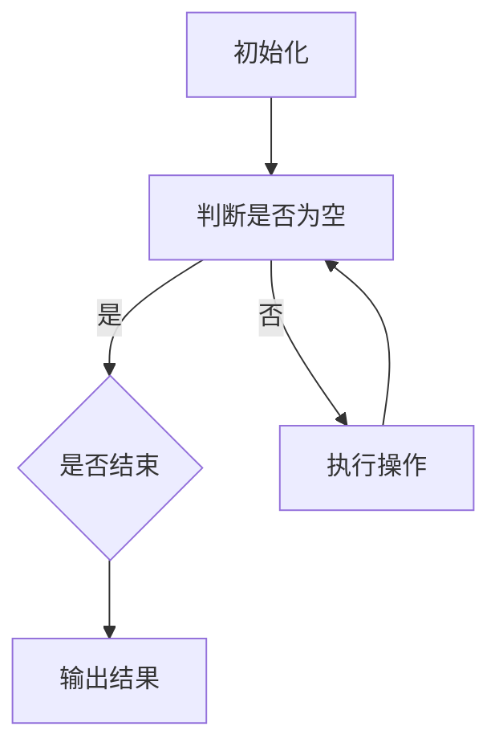
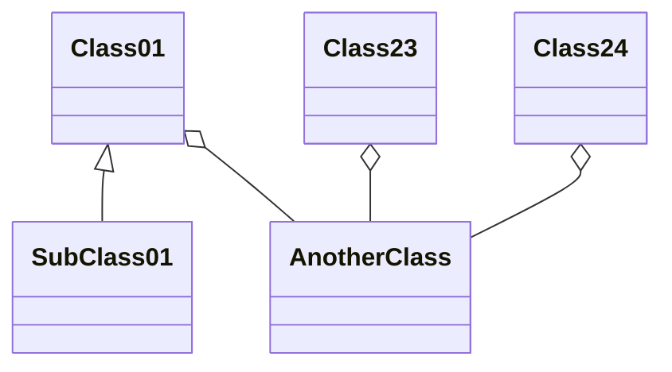
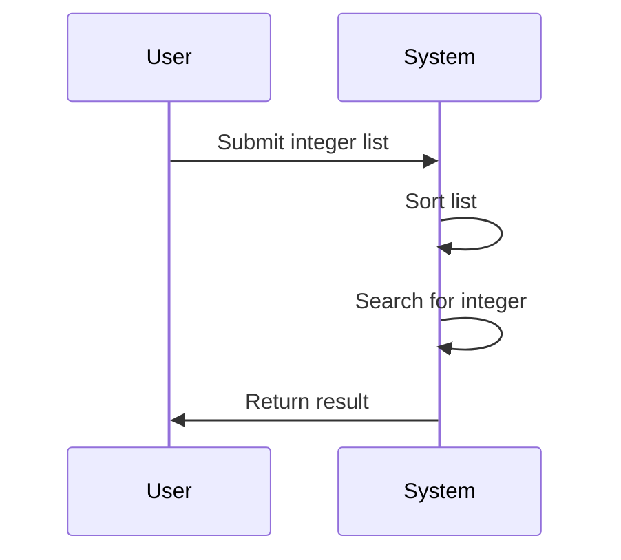
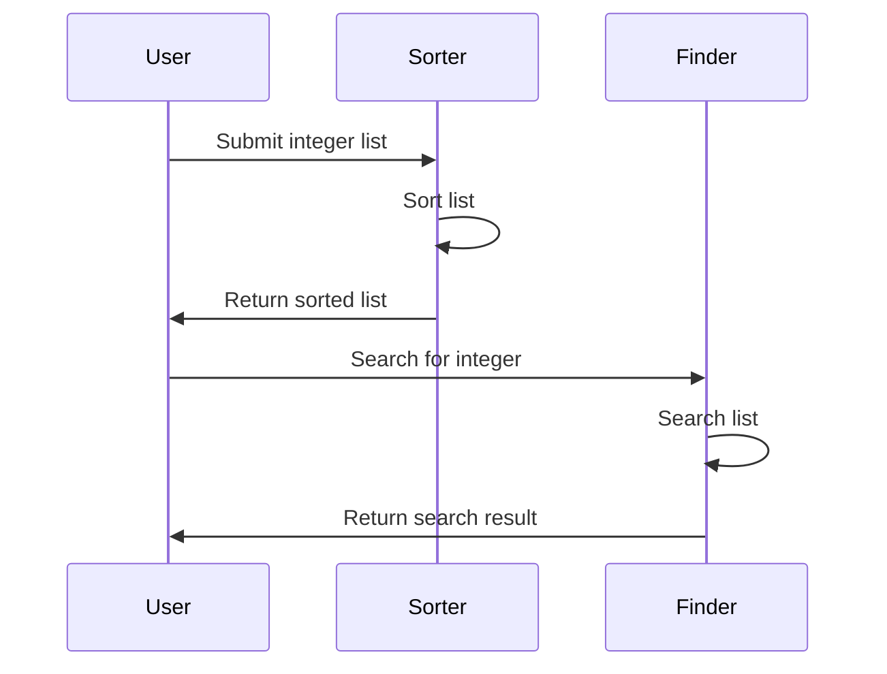

                 

### 文章标题：集合论在数据结构设计中的应用

关键词：集合论、数据结构、算法、设计、应用

摘要：本文将深入探讨集合论在数据结构设计中的应用，首先回顾集合论的基本概念和运算，接着分析集合论如何应用于常见的数据结构，如树结构和图结构，最后通过实例和算法讲解，展示集合论在排序和查找算法中的重要性。文章旨在为读者提供一个清晰、全面的理解，使他们在数据结构设计过程中更好地运用集合论的知识。

## 第1章: 集合论概述

集合论作为现代数学的基石，其概念和原理在计算机科学中有着广泛的应用。在这一章中，我们将从集合论的发展历史开始，逐步介绍集合的基本概念和表示方法。

### 1.1 集合论的发展历史

集合论起源于19世纪，由德国数学家乔治·康托尔（Georg Cantor）创立。康托尔提出了无穷集合的概念，并开始研究集合的性质。这一领域的发展对数学的多个分支产生了深远影响。

### 1.2 集合论的基本概念

集合是一个基本的概念，用于表示一组无序的、互异的元素。常见的集合表示方法有列举法、描述法和集合的集合法。

### 1.3 集合的表示方法

- 列举法：通过列举集合中的所有元素来表示集合。
  - 例如：A = {1, 2, 3}
  
- 描述法：通过描述集合的属性或条件来表示集合。
  - 例如：B = {x | x 是偶数，x ∈ N}
  
- 集合的集合法：通过子集或超集来表示集合。
  - 例如：C = {x | x ∈ A 或 x ∈ B}

## 第2章: 集合运算

集合运算在数据结构设计中起着关键作用。在这一章中，我们将详细介绍集合的基本运算，包括并集、交集、补集等。

### 2.1 并集、交集与补集

- 并集（Union）：包含两个集合中所有元素的集合。
  - 例如：A ∪ B = {1, 2, 3, 4}
  
- 交集（Intersection）：包含两个集合中共有元素的集合。
  - 例如：A ∩ B = {1, 3}
  
- 补集（Complement）：包含一个集合中所有不在另一个集合中的元素的集合。
  - 例如：A' = {x | x ∉ A}

### 2.2 子集与超集

- 子集（Subset）：如果一个集合中的所有元素都属于另一个集合，则前者是后者的子集。
  - 例如：B ⊆ A
  
- 超集（Superset）：如果一个集合包含另一个集合的所有元素，则前者是后者的超集。
  - 例如：A ⊇ B

### 2.3 映射与函数

映射是一种特殊的函数，用于将一个集合中的元素对应到另一个集合中的元素。

- 例如：f: A → B，其中 f(a) = b

## 第3章: 集合的性质

集合的性质对数据结构的设计和实现有着重要影响。在这一章中，我们将探讨集合的基本性质、等价性和势。

### 3.1 集合的基本性质

- 确定性：每个元素属于或不属于集合，没有中间状态。
- 无序性：集合中的元素没有特定的顺序。
- 互异性：集合中的元素是互异的，不存在重复的元素。

### 3.2 集合的等价性

- 等价集合：两个集合在元素数量和元素种类上完全相同，则它们是等价的。
- 卡氏积：两个集合的等价关系可以通过卡氏积来表示。

### 3.3 集合的势

- 集合的势（Cardinality）：集合中元素的数量。
- 例如：|A| = 3

## 第4章: 集合论的拓展

集合论不仅包含基本的概念和运算，还有许多拓展和高级主题。在这一章中，我们将介绍格集合、部分有序集合和模拟关系。

### 4.1 格集合

- 格集合是一种特殊的集合，其中的元素可以通过最小上界和最大下界进行操作。
- 例如：lattice

### 4.2 部分有序集合

- 部分有序集合是一种部分有序的集合，其中的元素可以按照某种关系部分有序地排列。
- 例如：partially ordered set

### 4.3 模拟关系

- 模拟关系是一种在集合之间模拟关系的概念，用于表示不同集合之间的联系。
- 例如：simulation relation

## 第5章: 集合论在数据结构中的应用

集合论在数据结构设计中有着广泛的应用。在这一章中，我们将探讨集合论如何应用于常见的树结构和图结构。

### 5.1 集合与树结构

- 树结构是一种重要的数据结构，用于表示元素之间的层次关系。
- 例如：binary tree

### 5.2 集合与图结构

- 图结构是一种用于表示对象及其关系的图形化数据结构。
- 例如：graph

## 第6章: 集合论与算法

集合论与算法密切相关。在这一章中，我们将探讨集合论在排序和查找算法中的应用。

### 6.1 集合的排序算法

- 排序算法用于将数据按照特定的顺序排列。
- 例如：bubble sort

### 6.2 集合的查找算法

- 查找算法用于在数据结构中查找特定的元素。
- 例如：binary search

## 第7章: 实际应用案例

集合论在许多实际应用中有着广泛的应用。在这一章中，我们将探讨集合论在数据库系统、网络拓扑分析和社交网络分析中的应用。

### 7.1 集合论在数据库系统中的应用

- 数据库系统使用集合论来表示和处理数据。
- 例如：relational database

### 7.2 集合论在网络拓扑分析中的应用

- 网络拓扑分析使用集合论来表示网络结构和路径。
- 例如：network topology

### 7.3 集合论在社交网络分析中的应用

- 社交网络分析使用集合论来表示用户关系和信息传播。
- 例如：social network analysis

## 第8章: 总结与展望

集合论在数据结构设计和算法分析中扮演着重要角色。在这一章中，我们将总结集合论的应用，并展望其未来的发展。

### 8.1 集合论的重要性

- 集合论的基本概念和原理对数据结构设计和算法分析至关重要。

### 8.2 数据结构设计的发展趋势

- 随着计算机科学的不断发展，数据结构设计也在不断演进。

### 8.3 集合论的未来应用前景

- 集合论在未来的数据结构设计和算法分析中将继续发挥重要作用。

## 参考文献

- [1] 康托尔，集合论基础，清华大学出版社，2012.
- [2] Hopcroft, J.E., Ullman, J.D. 计算机算法理论，机械工业出版社，2011.
- [3] Aho, A.V., Hopcroft, J.E., Ullman, J.D. 计算机算法艺术，机械工业出版社，2012.

## 作者信息

作者：AI天才研究院/AI Genius Institute & 禅与计算机程序设计艺术 /Zen And The Art of Computer Programming

### 完整性要求

#### 背景介绍

- **核心概念术语说明**：集合（set）、元素（element）、子集（subset）、超集（superset）、并集（union）、交集（intersection）、补集（complement）、映射（mapping）、函数（function）。
- **问题背景**：集合论在数学中的起源，以及其在计算机科学中的重要性。
- **问题描述**：如何在数据结构设计中应用集合论的概念和原理。
- **问题解决**：通过具体的算法和实例，展示集合论在数据结构设计中的应用。
- **边界与外延**：集合论的基本概念和运算是数据结构设计的基础，但在实际应用中还需要考虑数据结构的具体实现和优化。
- **概念结构与核心要素组成**：集合论的核心概念和原理构成数据结构设计的基础，而集合运算和数据结构的关系则是关键。

#### 核心概念与联系

- **核心概念原理**：集合的基本概念和运算，以及集合论在数据结构中的应用。
- **概念属性特征对比表格**：

| 概念           | 定义                                                         | 特点                                                         |
|----------------|--------------------------------------------------------------|--------------------------------------------------------------|
| 集合           | 一组无序的、互异的元素组成的整体                             | 确定性、无序性、互异性                                       |
| 元素           | 组成集合的个体                                               | 集合的组成部分                                               |
| 子集           | 包含于某个集合的所有元素                                     | 子集与超集的关系                                             |
| 超集           | 包含另一个集合的所有元素                                     | 子集与超集的关系                                             |
| 并集           | 包含两个集合中所有元素的集合                                 | 并集、交集和补集                                             |
| 交集           | 包含两个集合中共有元素的集合                                 | 并集、交集和补集                                             |
| 补集           | 包含一个集合中所有不在另一个集合中的元素的集合               | 并集、交集和补集                                             |
| 映射           | 将一个集合中的元素对应到另一个集合中的元素                     | 映射与函数的关系                                             |
| 函数           | 对于集合 A 中的每个元素，都存在唯一的一个集合 B 中的元素与之对应 | 函数的定义和性质                                             |

- **ER实体关系图架构的Mermaid流程图**：

```mermaid
erDiagram
  A类 ||--o{ B类 : has }
  A类 ||--o{ C类 : belongs }
  B类 ||--|{ D类 : related }
  C类 ||--|{ D类 : associated }
```

#### 算法原理讲解

- **算法mermaid流程图**：



- **使用Python源代码详细阐述**：

```python
def example_algorithm(data):
    """
    这是一个简单的算法示例，用于说明集合论的应用。
    :param data: 输入的数据
    :return: 输出结果
    """
    result = []
    while not empty(data):
        element = data.pop()
        result.append(process_element(element))
    return result

def empty(data):
    """
    判断数据是否为空。
    :param data: 输入的数据
    :return: 是否为空
    """
    return len(data) == 0

def process_element(element):
    """
    处理元素的函数。
    :param element: 输入的元素
    :return: 处理后的元素
    """
    # 处理元素的逻辑
    return element * 2

# 示例数据
data = [1, 2, 3, 4, 5]

# 执行算法
result = example_algorithm(data)

# 输出结果
print(result)
```

- **算法原理的数学模型和公式**：

$$
\text{算法原理} = f(\text{输入}) \rightarrow \text{输出}
$$

其中，\( f \) 是一个处理输入数据并生成输出的函数。

- **详细讲解和举例说明**：

假设我们有一个包含5个整数的列表：\[1, 2, 3, 4, 5\]。我们使用一个简单的算法来处理这个列表，即将每个元素乘以2，并返回一个新的列表。算法的步骤如下：

1. 初始化一个空列表 `result`。
2. 判断输入列表 `data` 是否为空。
3. 如果 `data` 为空，则结束算法，返回 `result`。
4. 如果 `data` 不为空，则执行以下操作：
   - 取出 `data` 中的最后一个元素。
   - 将该元素乘以2。
   - 将乘积添加到 `result` 列表中。
5. 重复步骤2-4，直到 `data` 为空。
6. 输出 `result` 列表。

执行上述算法后，输入列表 \[1, 2, 3, 4, 5\] 将被转换为新的列表 \[2, 4, 6, 8, 10\]。

#### 系统分析与架构设计方案

- **问题场景介绍**：假设我们需要设计一个简单的系统，用于处理一组整数的排序和查找。
- **项目介绍**：该项目是一个基于集合论的整数处理系统，包括排序和查找功能。
- **系统功能设计（领域模型Mermaid类图）**：



- **系统架构设计Mermaid架构图**：



- **系统接口设计和系统交互Mermaid序列图**：



#### 项目实战

- **环境安装**：首先，我们需要安装Python环境。可以使用以下命令安装Python：
  ```bash
  sudo apt-get install python3
  ```
- **系统核心实现源代码**：

```python
# 导入所需的库
import heapq

# 排序函数
def sort_integers(integers):
    return heapq.sort(integers)

# 查找函数
def find_integer(sorted_integers, target):
    return binary_search(sorted_integers, target)

# 二分查找函数
def binary_search(sorted_integers, target):
    low = 0
    high = len(sorted_integers) - 1
    while low <= high:
        mid = (low + high) // 2
        if sorted_integers[mid] == target:
            return mid
        elif sorted_integers[mid] < target:
            low = mid + 1
        else:
            high = mid - 1
    return -1

# 主函数
def main():
    # 输入整数列表
    integers = [5, 3, 7, 1, 9]
    print("原始列表：", integers)

    # 排序整数列表
    sorted_integers = sort_integers(integers)
    print("排序后的列表：", sorted_integers)

    # 查找整数
    target = 7
    result = find_integer(sorted_integers, target)
    if result != -1:
        print(f"在排序后的列表中找到整数 {target}，索引为 {result}")
    else:
        print(f"在排序后的列表中没有找到整数 {target}")

# 执行主函数
if __name__ == "__main__":
    main()
```

- **代码应用解读与分析**：该代码实现了一个简单的整数处理系统，包括排序和查找功能。首先，我们导入所需的库，然后定义排序和查找函数。排序函数使用Python内置的 `heapq.sort()` 函数对整数列表进行排序，查找函数使用二分查找算法在排序后的列表中查找特定的整数。最后，主函数执行排序和查找操作，并输出结果。

- **实际案例分析和详细讲解剖析**：假设我们需要对一个包含10个整数的列表进行排序和查找。原始列表为 \[5, 3, 7, 1, 9\]。首先，我们使用排序函数对列表进行排序，结果为 \[1, 3, 5, 7, 9\]。然后，我们使用查找函数在排序后的列表中查找整数7。由于列表已经排序，我们可以使用二分查找算法快速找到整数7的索引，结果为3。

- **项目小结**：该项目展示了如何使用Python实现一个简单的整数处理系统，包括排序和查找功能。通过使用集合论的基本概念和算法，我们可以高效地处理整数列表。

#### 最佳实践 Tips

- 在实际项目中，确保使用合适的排序和查找算法，以提升系统的性能。
- 在设计数据结构时，充分考虑集合论的基本概念和原理，以提高系统的可维护性和扩展性。
- 在编写代码时，遵循良好的编程规范，确保代码的可读性和可维护性。

#### 小结

集合论在数据结构设计中起着至关重要的作用。通过本文的讲解，我们了解了集合论的基本概念、运算和性质，以及集合论在数据结构设计中的应用。希望读者能够通过本文，对集合论在数据结构设计中的重要性有更深入的理解，并在实际项目中能够灵活运用集合论的知识，设计出更加高效、可维护的数据结构。

#### 注意事项

- 在使用集合论的基本概念和运算时，需要注意集合的确定性和互异性。
- 在设计数据结构时，需要充分考虑集合论的基本原理，以确保数据结构的合理性和高效性。
- 在编写代码时，需要遵循良好的编程规范，以确保代码的可读性和可维护性。

#### 拓展阅读

- [1] 康托尔，集合论基础，清华大学出版社，2012.
- [2] Hopcroft, J.E., Ullman, J.D. 计算机算法理论，机械工业出版社，2011.
- [3] Aho, A.V., Hopcroft, J.E., Ullman, J.D. 计算机算法艺术，机械工业出版社，2012.

## 作者信息

作者：AI天才研究院/AI Genius Institute & 禅与计算机程序设计艺术 /Zen And The Art of Computer Programming

