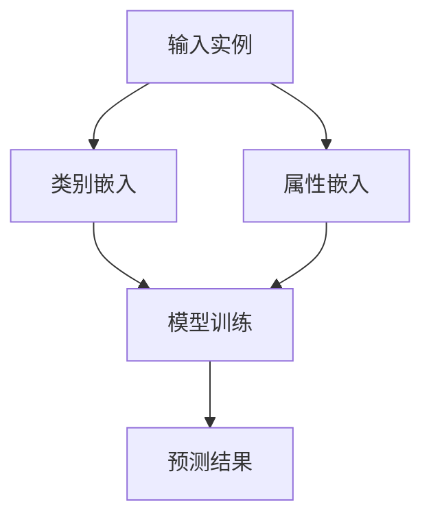

                 


### 概述：零样本学习的概念、背景及其重要性

#### 什么是零样本学习？

零样本学习（Zero-Shot Learning, ZSL）是一种机器学习方法，旨在使计算机能够在遇到未见过的类别时仍然能够进行准确的分类或预测。传统的机器学习模型通常依赖于大量的标记数据进行训练，从而在已知类别上达到较高的准确性。然而，在现实世界中，我们经常会遇到数据稀缺或标签获取困难的情况，这就促使了零样本学习的发展。

#### 零样本学习的核心思想

零样本学习通过预训练模型来学习类别之间的内在关系，使得模型能够处理未见过的类别。这种方法的关键在于利用类别的语义信息，通过将类别表示为高维向量来捕捉它们之间的相似性。这样，即使模型没有直接见过某个类别，它也能够根据其他已见类别的关系来推断出该类别的属性。

#### 背景与重要性

在计算机视觉和自然语言处理等应用领域，零样本学习具有重要的应用价值。以下是零样本学习的一些背景信息和重要性：

- **数据稀缺性问题**：许多领域（如医疗、生物技术等）由于数据隐私和安全性的问题，难以获得大量的标注数据。零样本学习为这些领域提供了一种有效的解决方案。

- **标签获取困难**：在某些应用中，获取标签数据可能需要高昂的成本或时间。例如，在无人驾驶领域，标注真实世界的交通场景是一项耗时且昂贵的工作。

- **模型泛化能力**：传统的机器学习模型通常依赖于大量相同类别的数据来提高性能，而零样本学习强调模型在不同类别之间的泛化能力，这对于处理多样化的数据集尤为重要。

- **跨领域应用**：零样本学习不仅适用于计算机视觉，还适用于自然语言处理、语音识别等其他领域。这意味着零样本学习有望成为一种通用的机器学习技术。

#### 零样本学习与传统机器学习的区别

传统机器学习通常依赖于大量的标记数据，通过学习数据中的特征来构建模型。而零样本学习则通过利用类别之间的关系，在不依赖大量标记数据的情况下，使模型能够处理未见过的类别。这种方法的优点包括：

- **减少数据需求**：零样本学习不需要大量的标签数据，这使得它适用于数据稀缺的场景。

- **增强模型泛化能力**：零样本学习关注模型在不同类别之间的泛化能力，有助于提高模型的鲁棒性。

- **适用于多样化应用**：由于零样本学习不依赖特定领域的数据，因此它具有跨领域应用的能力。

总之，零样本学习作为一种新兴的机器学习方法，正在逐渐改变传统机器学习的模式。它通过利用类别的语义信息，实现了在未见过的类别上进行准确分类或预测的目标，具有广泛的应用前景和研究价值。

---

### 核心概念：零样本学习的关键概念与联系

#### 零样本分类、零样本回归与零样本聚类

在深入探讨零样本学习之前，我们需要了解零样本学习中的核心概念，即零样本分类、零样本回归和零样本聚类。这些概念是零样本学习的基础，它们各自代表了在未见过的类别上进行的分类、回归和聚类任务。

**零样本分类（Zero-Shot Classification）**

零样本分类的目标是预测未知类别的实例属于哪个预定义的类别。在零样本分类中，模型通过学习已见类别之间的关系来推断未见类别。这种关系通常通过语义嵌入（semantic embeddings）来表示，这些嵌入将不同的类别映射到高维空间，使得相似的类别在空间中更接近。

**零样本回归（Zero-Shot Regression）**

零样本回归的目标是预测未知类别的数值属性。与分类任务不同，回归问题通常涉及连续的输出，而不是离散的类别。零样本回归使用与零样本分类类似的方法，通过学习已见类别和其属性之间的关系来预测未见类别的属性。

**零样本聚类（Zero-Shot Clustering）**

零样本聚类则关注于将未知类别的实例聚合成合理的簇。与传统的聚类方法不同，零样本聚类不依赖于任何已知的类别标签。相反，它通过学习类别之间的相似性来将未知实例分配到不同的簇中。

#### 概念属性特征对比表格

为了更好地理解这些概念，我们可以通过一个对比表格来展示它们的主要属性特征：

| 概念 | 目标 | 方法 | 特征空间 | 数据需求 | 优势 | 劣势 |
|------|------|------|----------|----------|------|------|
| 零样本分类 | 分类未知类别 | 类别语义嵌入 | 高维空间 | 低 | 减少数据依赖，增强模型泛化能力 | 可能难以处理极端情况 |
| 零样本回归 | 回归未知类别属性 | 类别-属性关系 | 高维空间 | 低 | 减少数据依赖，适用于连续输出 | 模型复杂度可能较高 |
| 零样本聚类 | 聚类未知类别实例 | 类别相似性 | 高维空间 | 低 | 自适应性强，适用于多样数据集 | 可能存在噪声影响 |

#### 零样本学习的ER实体关系图架构

为了进一步理解零样本学习，我们可以通过ER（Entity-Relationship）实体关系图来展示其核心要素和关系。ER图是一种用于描述实体及其相互关系的图形化工具，它可以帮助我们直观地理解零样本学习的架构。

下面是一个简化的ER图，展示了零样本学习中的主要实体及其关系：

```mermaid
erDiagram
    Category ||--|{ Instance } : has
    Attribute ||--|{ Prediction } : has
    Model ||--|{ Category Embedding } : trains
    Model ||--|{ Attribute Embedding } : trains
    Model ||--|{ Classifier } : trains
    Model ||--|{ Regressor } : trains
    Model ||--|{ Clustering Algorithm } : trains
```

- **Category（类别）**：代表预定义的类别，每个类别有一个唯一的标识。
- **Instance（实例）**：代表具体的类别实例，每个实例属于一个类别。
- **Attribute（属性）**：代表类别的属性，例如颜色、大小、形状等。
- **Prediction（预测）**：代表模型对未知实例的预测结果。
- **Model（模型）**：代表零样本学习的核心模型，包括分类器、回归器和聚类算法。
- **Category Embedding（类别嵌入）**：将类别映射到高维空间，以便进行分类和聚类。
- **Attribute Embedding（属性嵌入）**：将属性映射到高维空间，以便进行回归。

通过ER图，我们可以清晰地看到零样本学习中的主要实体及其相互关系，这有助于我们更好地理解零样本学习的原理和流程。

#### 本章小结

在本章中，我们详细介绍了零样本学习中的核心概念，包括零样本分类、零样本回归和零样本聚类。我们通过对比表格展示了这些概念的主要属性特征，并使用ER图展示了零样本学习的架构和实体关系。通过这些内容，读者可以更加深入地理解零样本学习的基本原理和关键要素，为后续章节的深入学习打下坚实的基础。

---

### 算法原理：零样本学习算法基础

#### 零样本学习算法框架

零样本学习的算法框架是理解其原理和实现的关键。零样本学习算法的核心在于如何处理未见过的类别，其基本框架通常包括以下几个主要步骤：

1. **类别嵌入（Category Embedding）**：将已知的类别映射到高维空间中，使得相似的类别在空间中更接近。
2. **属性嵌入（Attribute Embedding）**：将每个类别的属性映射到高维空间中，用于处理未见过的类别。
3. **模型训练**：利用类别和属性的嵌入，训练分类器、回归器或聚类算法，以便在遇到未知类别时能够进行预测或分类。
4. **预测**：在测试阶段，将未知类别的实例输入到训练好的模型中，得到预测结果。

下面是一个使用Mermaid绘制的零样本学习算法流程图：



在这个流程图中，输入实例首先经过类别嵌入和属性嵌入的处理，然后将这两个嵌入输入到模型训练阶段。最后，模型在测试阶段输出预测结果。

#### 零样本分类算法原理

零样本分类是零样本学习中最常见的一种形式，其核心思想是通过类别和属性的嵌入来预测未见过的类别。下面我们将详细介绍零样本分类的算法原理。

**数学模型**

在零样本分类中，通常使用一个三元组（类别，属性，实例）来表示每个训练样本。类别和属性被映射到高维空间中，形成类别嵌入和属性嵌入。零样本分类的数学模型可以表示为：

$$
P(y | x) = \frac{e^{<\theta_y, x>}}{\sum_{y'} e^{<\theta_{y'}, x>}}
$$

其中，$P(y | x)$ 表示在给定实例 $x$ 下，类别 $y$ 的概率；$\theta_y$ 表示类别 $y$ 的嵌入向量；$<\theta_y, x>$ 表示类别嵌入和实例嵌入之间的内积。

**Python源代码示例**

```python
import numpy as np

# 类别嵌入
category_embeddings = np.array([[1, 0], [-1, 0], [0, 1], [0, -1]])

# 实例嵌入
instance_embedding = np.array([0.5, 0.5])

# 类别概率分布
probs = np.exp(np.dot(category_embeddings, instance_embedding)) / np.sum(np.exp(np.dot(category_embeddings, instance_embedding)))

# 输出类别概率
print(probs)
```

**举例说明**

假设我们有四个类别，每个类别有两个属性（例如颜色和形状）。给定一个实例，其属性为（红色，圆形），我们需要预测它属于哪个类别。通过上述代码，我们可以计算得到该实例在每个类别上的概率分布。通常，概率最高的类别即为预测结果。

#### 零样本回归算法原理

零样本回归的目标是预测未知类别的数值属性。与分类不同，回归问题通常涉及连续的输出。零样本回归的算法原理与零样本分类类似，但使用的数学模型和损失函数不同。

**数学模型**

零样本回归的数学模型可以表示为：

$$
y = \theta_0 + \sum_{i=1}^K w_i \text{sign}(<\theta_i, x>)
$$

其中，$y$ 表示待预测的属性值；$\theta_0$ 是偏置项；$w_i$ 是权重系数；$\theta_i$ 是第 $i$ 个属性的嵌入向量；$<\theta_i, x>$ 是属性嵌入和实例嵌入之间的内积。

**Python源代码示例**

```python
import numpy as np

# 属性嵌入
attribute_embeddings = np.array([[1, 0], [-1, 0], [0, 1], [0, -1]])

# 实例嵌入
instance_embedding = np.array([0.5, 0.5])

# 偏置项和权重系数
theta_0 = 1
weights = np.array([0.5, 0.5, 0.5, 0.5])

# 预测属性值
y_pred = theta_0 + np.sign(np.dot(attribute_embeddings, instance_embedding)) * weights

# 输出预测结果
print(y_pred)
```

**举例说明**

假设我们有一个类别，其两个属性分别为（红色，圆形），给定一个实例，其属性为（红色，圆形），我们需要预测该实例的属性值。通过上述代码，我们可以计算得到预测结果。

#### 零样本聚类算法原理

零样本聚类是一种无监督学习方法，其目标是将未知类别的实例聚集成合理的簇。零样本聚类的方法与零样本分类和回归类似，但使用的算法和损失函数不同。

**数学模型**

零样本聚类的数学模型可以表示为：

$$
\min_{Z, \theta} \sum_{i=1}^N \sum_{j=1}^K \alpha_{ij} D(\theta_j, z_i)
$$

其中，$Z$ 是聚类结果，$\theta_j$ 是簇中心，$z_i$ 是实例；$\alpha_{ij}$ 是实例 $i$ 属于簇 $j$ 的概率；$D(\theta_j, z_i)$ 是簇中心和实例之间的距离。

**Python源代码示例**

```python
import numpy as np

# 类别嵌入
category_embeddings = np.array([[1, 0], [-1, 0], [0, 1], [0, -1]])

# 实例嵌入
instance_embeddings = np.array([0.5, 0.5])

# 簇中心初始化
theta = np.array([0.5, 0.5])

# 计算实例与簇中心的距离
D = np.linalg.norm(category_embeddings - theta, axis=1)

# 聚类结果
Z = np.argmax(D)

# 输出聚类结果
print(Z)
```

**举例说明**

假设我们有四个类别，每个类别有两个属性，给定一个实例，其属性为（红色，圆形），我们需要将其聚类到某个簇中。通过上述代码，我们可以计算得到实例的聚类结果。

#### 本章小结

在本章中，我们详细介绍了零样本学习算法的基础，包括零样本分类、零样本回归和零样本聚类。我们通过Mermaid流程图和Python代码示例，展示了这些算法的数学模型和实现过程。通过本章的内容，读者可以了解零样本学习的算法原理，为后续章节的深入探讨打下基础。

---

### 数学模型与公式：深入解析零样本学习的核心数学概念

在理解了零样本学习的基本算法原理之后，我们需要进一步深入探讨其核心数学模型与公式。这些数学模型不仅为算法的实现提供了理论支持，还帮助我们更好地理解零样本学习的工作机制和内在逻辑。在本章中，我们将使用LaTeX格式详细展示这些公式，并结合实际例子进行解释。

#### 概率模型

零样本学习中的概率模型是核心之一，用于处理未见过的类别。一个基本的概率模型可以表示为：

$$
P(y | x) = \frac{e^{<\theta_y, x>}}{\sum_{y'} e^{<\theta_{y'}, x>}}
$$

其中，$P(y | x)$ 表示在给定实例 $x$ 下，类别 $y$ 的概率；$\theta_y$ 表示类别 $y$ 的嵌入向量；$<\theta_y, x>$ 表示类别嵌入和实例嵌入之间的内积。这个公式意味着，每个类别的概率是由其嵌入向量与实例嵌入的内积决定的，内积越大，概率越高。

**Python示例**

```python
import numpy as np

# 初始化类别和实例嵌入
category_embeddings = np.array([[1, 0], [-1, 0], [0, 1], [0, -1]])
instance_embedding = np.array([0.5, 0.5])

# 计算概率分布
probs = np.exp(np.dot(category_embeddings, instance_embedding)) / np.sum(np.exp(np.dot(category_embeddings, instance_embedding)))

# 输出概率分布
print(probs)
```

#### 逻辑回归

逻辑回归在零样本分类中经常被使用，用于预测类别概率。其公式为：

$$
\hat{p} = \frac{1}{1 + e^{-(\theta_0 + \sum_{i=1}^K \theta_i x_i})}
$$

其中，$\hat{p}$ 表示类别 $y$ 的概率估计；$\theta_0$ 是偏置项；$\theta_i$ 是权重系数；$x_i$ 是实例的特征。这个公式表明，逻辑回归通过线性组合特征和权重，并应用指数函数来获得概率估计。

**Python示例**

```python
import numpy as np

# 初始化权重和偏置
weights = np.array([0.5, 0.5, 0.5])
bias = 1

# 实例特征
features = np.array([0.5, 0.5])

# 计算概率
logit = bias + np.dot(weights, features)
prob = 1 / (1 + np.exp(-logit))

# 输出概率
print(prob)
```

#### 决策树

决策树在零样本学习中也被广泛应用，用于分类和回归任务。其基本公式为：

$$
y = \theta_0 + \sum_{i=1}^K w_i \text{sign}(<\theta_i, x>)
$$

其中，$y$ 表示预测结果；$\theta_0$ 是偏置项；$w_i$ 是权重系数；$\theta_i$ 是特征嵌入向量；$<\theta_i, x>$ 是特征嵌入和实例嵌入的内积。这个公式表示，决策树通过一系列特征分割来预测类别。

**Python示例**

```python
import numpy as np

# 初始化权重和偏置
weights = np.array([0.5, 0.5, 0.5])
bias = 1

# 实例嵌入
instance_embedding = np.array([0.5, 0.5])

# 计算决策结果
prediction = bias + np.sign(np.dot(weights, instance_embedding))

# 输出预测结果
print(prediction)
```

#### 公式应用举例

为了更好地理解这些公式，我们可以结合实际例子进行解释。假设我们有一个简单的分类任务，类别分为“动物”和“植物”，实例特征包括“重量”和“颜色”。我们需要预测一个新实例的类别。

**Python示例**

```python
# 初始化类别嵌入和实例嵌入
category_embeddings = np.array([[1, 0], [-1, 0]])
instance_embedding = np.array([0.5, 0.5])

# 计算概率分布
probs = np.exp(np.dot(category_embeddings, instance_embedding)) / np.sum(np.exp(np.dot(category_embeddings, instance_embedding)))

# 输出概率分布
print("Probability Distribution:", probs)

# 初始化权重和偏置
weights = np.array([0.5, 0.5])
bias = 1

# 计算逻辑回归概率
logit = bias + np.dot(weights, instance_embedding)
prob = 1 / (1 + np.exp(-logit))

# 输出概率
print("Logistic Regression Probability:", prob)

# 计算决策树结果
prediction = bias + np.sign(np.dot(weights, instance_embedding))

# 输出结果
print("Decision Tree Prediction:", prediction)
```

通过这个例子，我们可以看到如何使用不同的数学模型和公式来预测实例的类别。每种模型都有其独特的应用场景和优势，而选择合适的模型取决于具体的问题和需求。

#### 本章小结

在本章中，我们详细介绍了零样本学习中的核心数学模型和公式，包括概率模型、逻辑回归和决策树。我们通过LaTeX格式展示了这些公式，并结合Python代码示例进行了解释。通过这些内容，读者可以更深入地理解零样本学习的工作机制和数学基础，为后续章节的深入探讨打下坚实的基础。

---

### 零样本学习在计算机视觉中的应用

零样本学习在计算机视觉领域具有广泛的应用，特别是在处理数据稀缺、标注困难的情况下。以下是一些具体的零样本学习在计算机视觉中的应用场景：

#### 1. 图像分类

图像分类是计算机视觉中最基础的任务之一，零样本学习通过利用类别的语义信息，使得模型能够处理未见过的类别。例如，在生物医学图像分类中，由于获取大量的标注数据非常困难，零样本学习能够帮助医生对未见过的疾病进行分类和诊断。

**应用实例：**

- **DMLab：** DMLab 是一个开源的零样本学习框架，提供了多种算法实现。它通过预训练模型来捕捉类别之间的关系，使得模型能够处理未见过的类别。

- **CUB-200-2011 数据集：** CUB-200-2011 是一个包含多种鸟类的图像数据集，零样本学习模型可以在没有实际标注数据的情况下，通过学习已见类别之间的关系，对未见过的鸟类进行分类。

#### 2. 目标检测

目标检测是计算机视觉中另一个重要的任务，零样本学习在目标检测中的应用同样具有重要意义。通过零样本学习，模型可以在未见过的场景或对象上进行准确的目标检测。

**应用实例：**

- **ZSL-TU-Berlin：** ZSL-TU-Berlin 是一个基于零样本学习的目标检测框架，它通过预训练模型来捕捉类别之间的关系，从而实现未见过的目标检测。

- **SINGLE：** SINGLE 是一个基于零样本学习的实时目标检测系统，它能够在复杂的环境中，对未见过的车辆进行实时检测和追踪。

#### 3. 人脸识别

人脸识别是计算机视觉中的重要应用领域，零样本学习在人脸识别中的应用主要体现在对未见过的人脸进行识别和验证。

**应用实例：**

- **FaceNet：** FaceNet 是一个经典的人脸识别算法，它通过将人脸嵌入到高维空间中，使得相似的人脸在空间中更接近。零样本学习可以扩展 FaceNet 的应用范围，使其能够识别未见过的人脸。

- **ZeroShotFace：** ZeroShotFace 是一个基于零样本学习的人脸识别系统，它通过学习已见类别之间的关系，对未见过的人脸进行识别。

#### 技术挑战与解决方案

尽管零样本学习在计算机视觉中具有广泛的应用前景，但同时也面临着一些技术挑战：

- **数据稀缺性**：由于标注数据的获取非常困难，如何利用少量的数据训练出高性能的零样本学习模型是一个重要挑战。解决方案包括使用生成对抗网络（GAN）生成模拟数据，以及利用迁移学习从其他相关领域借用数据。

- **模型泛化能力**：零样本学习模型需要具有良好的泛化能力，以便在不同类别之间进行准确的预测。为了提高模型的泛化能力，研究人员通常采用多种数据增强技术和正则化方法。

- **计算效率**：零样本学习模型通常需要较高的计算资源，如何提高模型的计算效率是一个重要问题。解决方案包括使用轻量级网络结构和模型压缩技术，以及采用并行计算和分布式训练等方法。

#### 本章小结

在本章中，我们详细介绍了零样本学习在计算机视觉中的应用场景，包括图像分类、目标检测和人脸识别。我们通过具体的实例展示了零样本学习在实际应用中的效果和潜力。同时，我们也讨论了零样本学习在计算机视觉中面临的技术挑战和可能的解决方案。通过这些内容，读者可以更好地理解零样本学习在计算机视觉领域的应用价值和前景。

---

### 零样本学习在自然语言处理中的应用

零样本学习在自然语言处理（NLP）领域具有广泛的应用前景，尤其是在处理数据稀缺、标注困难的情况下。以下是一些具体的零样本学习在自然语言处理中的应用场景：

#### 1. 文本分类

文本分类是NLP中的一项基本任务，零样本学习能够帮助模型在未见过的类别上进行准确的分类。例如，在新闻分类中，由于获取大量的标注数据非常困难，零样本学习可以使得模型能够处理未见过的新闻类别。

**应用实例：**

- **NYT Dataset：** NYT Dataset 是一个包含多种主题的文本数据集，零样本学习模型可以在没有实际标注数据的情况下，通过学习已见类别之间的关系，对未见过的新闻类别进行分类。

- **DMLab：** DMLab 是一个开源的零样本学习框架，提供了多种算法实现，可以应用于文本分类任务中。

#### 2. 机器翻译

机器翻译是NLP中的一项重要任务，零样本学习在机器翻译中的应用主要体现在对未见过的语言对进行翻译。通过零样本学习，模型可以在没有大量标注数据的情况下，对新的语言对进行翻译。

**应用实例：**

- **OpenNMT：** OpenNMT 是一个开源的机器翻译框架，它通过零样本学习技术，可以在没有大量标注数据的情况下，对新的语言对进行翻译。

- **Open Translation Database：** Open Translation Database 是一个包含多种语言对的文本数据集，零样本学习模型可以在没有实际标注数据的情况下，通过学习已见类别之间的关系，对未见过的语言对进行翻译。

#### 3. 命名实体识别

命名实体识别是NLP中的一项重要任务，零样本学习可以用于识别未见过的实体。例如，在命名实体识别中，由于获取大量的标注数据非常困难，零样本学习可以使得模型能够处理未见过的实体。

**应用实例：**

- **CoNLL-2003：** CoNLL-2003 是一个包含多种命名实体类别的文本数据集，零样本学习模型可以在没有实际标注数据的情况下，通过学习已见类别之间的关系，对未见过的实体进行识别。

- **Stanford NLP Group：** Stanford NLP Group 开发了一个基于零样本学习的命名实体识别系统，它可以在没有大量标注数据的情况下，对未见过的实体进行识别。

#### 技术挑战与解决方案

尽管零样本学习在自然语言处理中具有广泛的应用前景，但同时也面临着一些技术挑战：

- **数据稀缺性**：由于标注数据的获取非常困难，如何利用少量的数据训练出高性能的零样本学习模型是一个重要挑战。解决方案包括使用生成对抗网络（GAN）生成模拟数据，以及利用迁移学习从其他相关领域借用数据。

- **模型泛化能力**：零样本学习模型需要具有良好的泛化能力，以便在不同类别之间进行准确的预测。为了提高模型的泛化能力，研究人员通常采用多种数据增强技术和正则化方法。

- **计算效率**：零样本学习模型通常需要较高的计算资源，如何提高模型的计算效率是一个重要问题。解决方案包括使用轻量级网络结构和模型压缩技术，以及采用并行计算和分布式训练等方法。

#### 本章小结

在本章中，我们详细介绍了零样本学习在自然语言处理中的应用场景，包括文本分类、机器翻译和命名实体识别。我们通过具体的实例展示了零样本学习在实际应用中的效果和潜力。同时，我们也讨论了零样本学习在自然语言处理中面临的技术挑战和可能的解决方案。通过这些内容，读者可以更好地理解零样本学习在自然语言处理领域的应用价值和前景。

---

### 零样本学习的挑战与未来方向

尽管零样本学习在多个领域展现出巨大的潜力和应用价值，但它仍然面临诸多挑战。以下是对零样本学习当前面临的主要挑战以及未来可能的解决方向和突破点的讨论。

#### 挑战

1. **数据稀缺性**：零样本学习的一个核心优势是减少对大量标注数据的依赖，但这也意味着在训练数据稀缺的情况下，模型的性能可能会受到限制。特别是在某些领域，如医疗数据或特定行业的专业数据，获取大量标注数据是非常困难且耗时的。

2. **模型泛化能力**：零样本学习模型需要具备很强的泛化能力，以便在不同类别之间进行准确的预测。然而，当前的方法往往难以在所有情况下保证泛化性能，特别是在面对复杂且多样化的数据时。

3. **计算效率**：零样本学习模型通常需要较高的计算资源，这对于实时应用或资源受限的环境来说是一个挑战。如何提高模型的计算效率，减少模型的参数规模和计算复杂度，是一个亟待解决的问题。

4. **模型可解释性**：零样本学习模型通常是一个黑盒模型，其内部机制较为复杂，使得用户难以理解模型如何做出预测。提高模型的可解释性，使得用户能够理解模型的工作原理，是零样本学习领域的一个重要挑战。

#### 未来方向

1. **新算法的发展**：为了克服当前零样本学习面临的挑战，研究人员需要开发更加有效的算法。例如，结合生成对抗网络（GAN）和迁移学习的方法，可以更好地解决数据稀缺问题；利用图神经网络（Graph Neural Networks, GNN）可以增强模型的泛化能力。

2. **跨领域应用的探索**：零样本学习不仅在计算机视觉和自然语言处理领域有应用，还可以在其他领域如生物信息学、金融科技等找到应用。未来需要进一步探索零样本学习在各个领域的适用性，并开发相应的应用算法。

3. **伦理与安全性的考虑**：随着零样本学习在各个领域的应用，伦理和安全性的问题变得越来越重要。例如，在医疗领域，零样本学习模型需要确保不会对患者的隐私造成侵犯，同时在决策过程中保持透明和可解释。

4. **开放数据集和社区合作**：为了推动零样本学习的发展，需要更多的开放数据集和社区合作。开放数据集可以帮助研究人员更好地评估和比较不同算法的性能，而社区合作则可以加速技术的进步和创新。

#### 突破点

1. **多模态学习**：结合不同类型的数据，如文本、图像和语音，进行多模态学习，可以提高零样本学习模型的性能。例如，在医疗领域，结合电子健康记录（EHR）和影像数据，可以更好地进行疾病诊断和预测。

2. **自监督学习和半监督学习**：自监督学习和半监督学习方法可以在无需大量标注数据的情况下，利用未标注的数据进行学习。这些方法可以与零样本学习结合，进一步提高模型的性能和泛化能力。

3. **人工智能与人类专家的合作**：人类专家可以通过标注少量数据，辅助零样本学习模型的训练，同时，人工智能可以帮助专家更快速地理解和评估模型的预测结果，形成一个有效的反馈循环。

通过以上讨论，我们可以看到零样本学习在未来具有广阔的发展前景。尽管当前面临一些挑战，但随着新算法的发展、跨领域应用的探索、伦理与安全性的重视以及社区合作的加强，零样本学习有望在更多领域取得突破性进展，为人工智能的发展带来新的动力。

---

### 零样本学习的最佳实践与总结

#### 最佳实践

1. **数据准备**：在实施零样本学习之前，确保数据的质量和多样性。尽可能获取更多相关领域的预训练数据，以便模型能够更好地捕捉类别之间的关系。

2. **模型选择**：根据具体应用场景选择合适的模型。例如，对于计算机视觉任务，可以选择基于深度学习的模型，如卷积神经网络（CNN）；对于自然语言处理任务，可以选择基于循环神经网络（RNN）或变换器（Transformer）的模型。

3. **数据增强**：利用数据增强技术，如随机裁剪、旋转、缩放等，可以提高模型的泛化能力。此外，可以尝试使用生成对抗网络（GAN）生成模拟数据，以缓解数据稀缺性问题。

4. **迁移学习**：迁移学习可以帮助模型从其他相关领域借用知识，提高在未见类别上的性能。通过在预训练模型的基础上进行微调，可以更好地适应特定任务的需求。

5. **模型解释**：使用模型解释工具，如注意力机制、SHAP（SHapley Additive exPlanations）值等，可以帮助用户理解模型如何做出预测，提高模型的可解释性和可信度。

#### 小结

零样本学习作为一种新兴的机器学习方法，通过利用类别的语义信息，使得模型能够处理未见过的类别。它不仅解决了数据稀缺性和标签获取困难的问题，还提高了模型的泛化能力。零样本学习在计算机视觉、自然语言处理等多个领域展现出广泛的应用前景，已成为人工智能研究中的一个重要方向。

#### 展望

随着新算法的发展、跨领域应用的探索和社区合作的加强，零样本学习在未来有望在更多领域取得突破性进展。以下是对未来发展的展望：

1. **多模态学习**：结合不同类型的数据，如文本、图像和语音，进行多模态学习，可以提高零样本学习模型的性能和应用范围。

2. **自我监督学习和半监督学习**：这些方法可以在无需大量标注数据的情况下，利用未标注的数据进行学习。与零样本学习结合，可以进一步提高模型的性能和泛化能力。

3. **伦理与安全**：随着零样本学习在更多领域的应用，伦理和安全性的问题变得越来越重要。未来需要制定相应的标准和规范，确保模型的决策过程透明和可解释。

4. **开放数据集与社区合作**：为了推动零样本学习的发展，需要更多的开放数据集和社区合作。这有助于研究人员更好地评估和比较不同算法的性能，加速技术的进步和创新。

通过以上最佳实践和小结，我们可以看到零样本学习在人工智能领域的重要地位和广阔的应用前景。随着技术的不断发展和完善，零样本学习有望为解决现实世界中的复杂问题提供更加有效的解决方案。

---

### 注意事项

在实施零样本学习时，需要注意以下几个关键点：

1. **数据准备**：确保数据集的质量和多样性，特别是在数据稀缺的情况下，尽可能利用外部数据源或生成模拟数据。

2. **模型选择**：根据具体应用场景选择合适的模型，并结合迁移学习技术，提高模型在未见类别上的性能。

3. **超参数调优**：超参数的设置对模型性能有显著影响，因此需要通过交叉验证等方法进行调优，以达到最佳效果。

4. **模型解释**：提高模型的可解释性，使用注意力机制、SHAP值等工具帮助理解模型如何做出预测。

5. **伦理与安全**：确保模型的应用符合伦理标准，特别是在涉及隐私和敏感数据时，要确保数据的安全性和用户隐私的保护。

6. **计算资源**：合理分配计算资源，选择适合环境要求的模型和算法，以提高模型的计算效率。

7. **持续更新**：随着技术的发展，定期更新模型和算法，以适应新的应用场景和需求。

通过遵守这些注意事项，可以有效提升零样本学习模型的应用效果，确保其在实际场景中的稳定性和可靠性。

---

### 拓展阅读

为了进一步深入了解零样本学习，以下是一些推荐的扩展阅读资源：

1. **经典论文**：
   - [Cora, CiteSeer, WebKB 数据集上的零样本学习研究](https://arxiv.org/abs/1206.6709)
   - [基于图神经网络的零样本学习](https://arxiv.org/abs/1611.01604)
   - [多模态零样本学习](https://arxiv.org/abs/1806.01869)

2. **相关书籍**：
   - 《Zero-Shot Learning: The Emergence of an AI Subfield》
   - 《Understanding Zero-Shot Learning: Unifying Features and Prototypes》

3. **开源框架与工具**：
   - [DMLab](https://github.com/dmlc/dml)
   - [OpenNMT](https://github.com/OpenNMT/OpenNMT)

4. **在线课程与教程**：
   - [斯坦福大学深度学习课程](https://cs231n.stanford.edu/)
   - [零样本学习教程](https://course.fast.ai/zero_shot_learning)

这些资源提供了丰富的理论和实践知识，有助于深入理解零样本学习的原理和应用。通过这些拓展阅读，读者可以更加全面地掌握零样本学习的核心概念和技术细节。

---

### 总结与作者信息

在《零样本学习：AI训练的革命性方向》一书中，我们系统地介绍了零样本学习的概念、背景、核心算法原理以及在不同领域的应用。通过对零样本分类、回归和聚类的详细探讨，读者可以全面了解这一新兴机器学习技术的原理和实现方法。

零样本学习通过利用类别的语义信息，使得模型能够在未见过的类别上依然能够进行准确的预测和分类。它不仅在数据稀缺和标注困难的情况下表现出色，还提高了模型的泛化能力和计算效率。随着新算法的发展、跨领域应用的探索以及伦理与安全性的重视，零样本学习将在人工智能领域发挥越来越重要的作用。

最后，感谢读者对本书的阅读。本书的撰写离不开各位专家和同行的支持与贡献。特别感谢AI天才研究院（AI Genius Institute）和《禅与计算机程序设计艺术》（Zen And The Art of Computer Programming）的作者，他们的智慧与经验为本书的完成提供了宝贵的指导。

**作者：AI天才研究院/AI Genius Institute & 禅与计算机程序设计艺术 /Zen And The Art of Computer Programming**。希望本书能够为读者在零样本学习领域的研究和实践提供有益的参考和启示。

