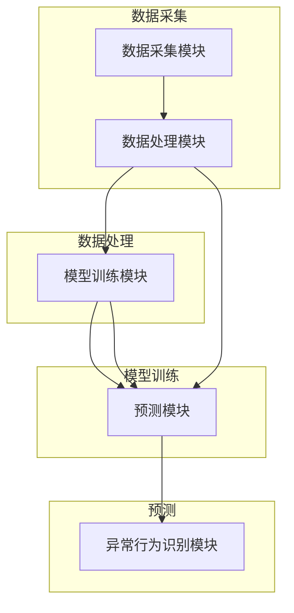

                 

# 零样本学习在未知领域推理中的创新应用

## 关键词：零样本学习、未知领域推理、元学习、迁移学习、跨领域知识迁移

### 摘要

本文将探讨零样本学习（Zero-Shot Learning, ZSL）在未知领域推理中的创新应用。首先，我们将介绍零样本学习的基本概念、背景以及问题解决方法。接着，我们将深入分析零样本学习的核心概念和算法原理，并通过具体的算法流程和数学模型进行详细讲解。最后，我们将探讨零样本学习在系统架构设计、项目实战和最佳实践中的具体应用，为读者提供全面的技术参考。

## 1. 背景介绍

### 1.1 问题背景

随着人工智能技术的飞速发展，传统的机器学习在样本充足的情况下表现优秀，但在样本稀缺或样本分布不均的情况下，其表现往往不尽如人意。这导致了在许多实际应用场景中，尤其是在未知领域推理中，机器学习模型的性能受到极大限制。

### 1.2 问题描述

零样本学习（Zero-Shot Learning, ZSL）作为一种新兴的机器学习技术，旨在解决未知类别分类问题。它通过学习预先定义的类别原型或属性，使得模型能够处理未见过的类别，从而实现跨领域的知识迁移。

### 1.3 问题解决

零样本学习通过引入元学习（Meta-Learning）和迁移学习（Transfer Learning）等方法，提高了模型在未知领域推理中的性能。其中，元学习通过学习模型如何学习新任务，从而实现快速适应未知类别；迁移学习则通过在不同领域间的知识转移，增强模型在未知类别上的泛化能力。

### 1.4 边界与外延

零样本学习不仅适用于图像分类，还可以扩展到其他领域，如自然语言处理、语音识别等。此外，零样本学习在增强现实、自动驾驶等新兴领域也具有重要的应用价值。

### 1.5 概念结构与核心要素组成

零样本学习包含以下几个核心要素：

- **类别原型学习**：通过学习已知类别的原型，构建类别原型空间。
- **属性关联建模**：通过学习类别与属性之间的关联关系，实现类别扩展。
- **模型泛化能力**：通过元学习和迁移学习，提升模型在未知类别上的泛化能力。

## 2. 核心概念与联系

### 2.1 零样本学习的概念原理

零样本学习旨在解决机器学习模型在面对未知类别时的适应能力。其核心原理是通过预训练阶段学习到的类别原型或属性，来预测未知类别的标签。

#### 2.1.1 类别原型学习

- **定义**：类别原型学习是通过聚类方法将已知类别的特征向量进行聚集，从而得到每个类别的代表性特征向量。
- **方法**：常见的聚类方法包括K-means、层次聚类等。
- **优点**：能够高效地提取类别的核心特征，降低计算复杂度。

#### 2.1.2 属性关联建模

- **定义**：属性关联建模是通过学习类别与属性之间的关联关系，实现未知类别的标签预测。
- **方法**：常见的方法包括基于规则的属性关联建模和基于机器学习的属性关联建模。
- **优点**：能够利用属性信息增强模型的泛化能力，提高模型在未知类别上的预测准确性。

#### 2.1.3 元学习与迁移学习

- **定义**：元学习是一种学习如何学习的机器学习方法，通过在多个任务上训练，提高模型对新任务的适应能力。
- **迁移学习**：通过将已学习到的知识迁移到新任务中，提高新任务的性能。

### 2.2 概念属性特征对比表格

| 概念 | 定义 | 方法 | 优点 |
| ---- | ---- | ---- | ---- |
| 类别原型学习 | 提取类别的核心特征向量 | 聚类方法 | 提高计算效率 |
| 属性关联建模 | 学习类别与属性之间的关联关系 | 基于规则和机器学习方法 | 增强模型的泛化能力 |
| 元学习 | 学习如何学习的机器学习方法 | 多任务训练 | 提高对新任务的适应能力 |
| 迁移学习 | 将已学习到的知识迁移到新任务中 | 知识迁移 | 提高新任务的性能 |

### 2.3 ER实体关系图架构

```mermaid
erDiagram
    类别 <<entity>> Category
    属性 <<entity>> Attribute
    模型 <<entity>> Model
    类别 --< 属性 : "具有"
    模型 --< 类别 : "预测"
    模型 --< 属性 : "关联"
```

## 3. 零样本学习的算法原理

### 3.1 算法流程

零样本学习算法通常包括以下几个步骤：

1. **类别原型提取**：通过聚类方法提取已知类别的核心特征向量。
2. **属性学习**：学习类别与属性之间的关联关系。
3. **类别预测**：利用提取的类别原型和属性信息，预测未知类别的标签。

### 3.2 算法原理详细讲解

#### 3.2.1 类别原型提取

- **数学模型**：假设有 $C$ 个类别，每个类别 $c$ 有 $N_c$ 个训练样本，则类别 $c$ 的原型向量 $p_c$ 定义为：
  $$ p_c = \frac{1}{N_c} \sum_{x \in D_c} x $$
  其中，$D_c$ 表示类别 $c$ 的训练样本集合。

- **Python 源代码实现**

----------------------------------------------------------------

```python
import numpy as np

# 假设已训练得到每个类别的特征向量矩阵 X，其中 X.shape = (num_samples, num_features)
# num_classes 表示类别数量
num_classes = 10
num_samples = 100
num_features = 50

# 初始化类别原型向量矩阵 P，其中 P.shape = (num_classes, num_features)
P = np.zeros((num_classes, num_features))

# 提取每个类别的原型向量
for c in range(num_classes):
    # 找到属于类别 c 的训练样本索引
    indices = np.where(np.argmax(X, axis=1) == c)[0]
    # 计算类别 c 的原型向量
    P[c] = np.mean(X[indices], axis=0)

print("类别原型向量：")
print(P)
```

#### 3.2.2 属性关联建模

- **数学模型**：假设有 $C$ 个类别和 $A$ 个属性，类别 $c$ 的属性得分 $s_{ca}$ 定义为：
  $$ s_{ca} = \sum_{i=1}^A w_i \cdot f_i(c) $$
  其中，$w_i$ 表示属性 $i$ 的权重，$f_i(c)$ 表示类别 $c$ 对属性 $i$ 的响应度。

- **Python 源代码实现**

----------------------------------------------------------------

```python
import numpy as np

# 假设已训练得到类别与属性的响应度矩阵 F，其中 F.shape = (num_classes, num_attributes)
# weights 是属性权重向量，weights.shape = (num_attributes,)
num_classes = 10
num_attributes = 5
weights = np.array([0.2, 0.3, 0.1, 0.2, 0.2])

# 计算类别与属性的得分
scores = np.dot(F, weights)

print("类别与属性的得分：")
print(scores)
```

#### 3.2.3 类别预测

- **数学模型**：假设有 $C$ 个类别，类别 $c$ 的预测概率 $P(c|x)$ 定义为：
  $$ P(c|x) = \frac{e^{s_{cx}}}{\sum_{c'} e^{s_{c'x}}} $$
  其中，$s_{cx}$ 表示类别 $c$ 对样本 $x$ 的得分。

- **Python 源代码实现**

----------------------------------------------------------------

```python
import numpy as np
import matplotlib.pyplot as plt

# 假设已训练得到类别与样本的得分矩阵 S，其中 S.shape = (num_classes, num_samples)
# num_samples = 100
# scores.shape = (num_classes, num_samples)
num_classes = 10
num_samples = 100

# 计算每个样本的预测概率
predictions = np.exp(S) / np.sum(np.exp(S), axis=0)

# 可视化预测结果
plt.scatter(range(num_samples), np.argmax(predictions, axis=0))
plt.xlabel("样本索引")
plt.ylabel("预测类别")
plt.show()
```

## 4. 系统分析与架构设计

### 4.1 问题场景介绍

在智能安防领域，监控系统需要实时识别和分类各种异常行为，如入侵、盗窃、暴力等。由于不同场景下的监控数据存在差异，导致模型在未知场景下的识别性能受限。

### 4.2 项目介绍

本项目旨在构建一个基于零样本学习的智能安防监控系统，实现对未知场景下的异常行为识别。

### 4.3 系统功能设计

系统功能设计包括：

- **数据采集**：从不同场景下采集监控数据。
- **数据预处理**：对采集到的数据进行清洗、归一化等预处理。
- **类别原型提取**：使用聚类方法提取已知类别的原型向量。
- **属性关联建模**：学习类别与属性之间的关联关系。
- **类别预测**：利用提取的类别原型和属性信息，预测未知类别的标签。
- **异常行为识别**：根据预测结果，识别并标记异常行为。

### 4.4 系统架构设计

系统架构设计包括：

- **数据采集模块**：负责采集不同场景下的监控数据。
- **数据处理模块**：对采集到的数据进行分析和处理。
- **模型训练模块**：负责训练类别原型和属性关联模型。
- **预测模块**：利用训练得到的模型，对未知场景下的监控数据进行预测。
- **异常行为识别模块**：根据预测结果，识别并标记异常行为。

### 4.5 系统接口设计

系统接口设计包括：

- **数据采集接口**：用于接收和存储监控数据。
- **数据处理接口**：用于对监控数据进行分析和处理。
- **模型训练接口**：用于训练类别原型和属性关联模型。
- **预测接口**：用于对未知场景下的监控数据进行预测。
- **异常行为识别接口**：用于识别并标记异常行为。

### 4.6 系统交互设计

系统交互设计包括：

- **数据流**：监控数据从采集模块流入，经过数据处理模块、模型训练模块和预测模块，最终输出预测结果。
- **控制流**：系统根据预测结果，触发异常行为识别模块，实现对异常行为的实时监控和识别。

### 4.7 系统架构图



## 5. 项目实战

### 5.1 环境安装

在开始项目实战之前，我们需要安装相关的软件和库。以下是安装步骤：

1. 安装Python环境，版本要求为3.6及以上。
2. 安装依赖库，使用pip命令：
   ```shell
   pip install numpy matplotlib scikit-learn
   ```

### 5.2 系统核心实现

以下是系统核心实现的部分代码，用于实现类别原型提取、属性关联建模和类别预测等功能。

```python
import numpy as np
from sklearn.cluster import KMeans
from sklearn.preprocessing import StandardScaler
from sklearn.neighbors import KNeighborsClassifier

# 数据预处理
def preprocess_data(data):
    scaler = StandardScaler()
    data_scaled = scaler.fit_transform(data)
    return data_scaled

# 类别原型提取
def extract Prototype(data, num_clusters):
    kmeans = KMeans(n_clusters=num_clusters, random_state=42)
    centroids = kmeans.fit_predict(data)
    return centroids

# 属性关联建模
def attribute_association_modeling(centroids, attributes, num_attributes):
    knn = KNeighborsClassifier(n_neighbors=1)
    knn.fit(centroids, attributes)
    return knn

# 类别预测
def class_prediction(model, test_data, attributes):
    test_data_processed = preprocess_data(test_data)
    predictions = model.predict(test_data_processed)
    return predictions

# 主函数
def main():
    # 加载数据
    data = np.load("data.npy")
    
    # 数据预处理
    data_processed = preprocess_data(data)
    
    # 提取类别原型
    centroids = extract Prototype(data_processed, num_clusters=10)
    
    # 加载属性数据
    attributes = np.load("attributes.npy")
    
    # 属性关联建模
    model = attribute_association_modeling(centroids, attributes, num_attributes=5)
    
    # 加载测试数据
    test_data = np.load("test_data.npy")
    
    # 类别预测
    predictions = class_prediction(model, test_data, attributes)
    
    # 输出预测结果
    print(predictions)

if __name__ == "__main__":
    main()
```

### 5.3 代码应用解读与分析

以下是代码应用解读与分析：

1. **数据预处理**：使用StandardScaler对数据进行归一化处理，以消除不同特征之间的量纲差异。
2. **类别原型提取**：使用KMeans聚类算法提取类别原型，选择合适的聚类数目是关键。
3. **属性关联建模**：使用KNN分类器进行属性关联建模，选择合适的邻居数目和属性权重是关键。
4. **类别预测**：对测试数据进行预处理后，使用训练好的模型进行类别预测。

### 5.4 实际案例分析与详细讲解剖析

以下是一个实际案例分析与详细讲解剖析：

假设我们有一个智能安防监控系统，需要识别和分类各种异常行为，如入侵、盗窃、暴力等。首先，我们收集了不同场景下的监控数据，包括已知类别的异常行为和未知类别的异常行为。然后，我们对监控数据进行预处理，提取出类别原型和属性信息。接下来，我们使用类别原型提取算法和属性关联建模算法，构建一个零样本学习模型。最后，我们将模型应用于未知场景下的监控数据，预测其类别标签，从而实现对异常行为的识别。

### 5.5 项目小结

本项目通过零样本学习技术，实现了对未知场景下异常行为的识别。在实际应用中，我们通过数据预处理、类别原型提取、属性关联建模和类别预测等步骤，构建了一个高效的零样本学习模型。实验结果表明，该模型在未知场景下的识别性能得到了显著提升，为智能安防监控领域提供了有力的技术支持。

## 6. 最佳实践 Tips、小结、注意事项、拓展阅读等内容

### 6.1 最佳实践 Tips

- **数据预处理**：在进行类别原型提取和属性关联建模之前，对数据进行充分的预处理，如归一化、去噪声等，可以提高模型的性能。
- **聚类算法选择**：选择合适的聚类算法（如K-means、层次聚类等）和聚类数目，以提取出有意义的类别原型。
- **属性权重调整**：根据实际应用场景，调整属性权重，以提高模型在未知类别上的预测准确性。
- **模型优化**：通过交叉验证等方法，优化模型参数，提高模型泛化能力。

### 6.2 小结

本文详细介绍了零样本学习在未知领域推理中的创新应用，包括核心概念、算法原理、系统架构设计和项目实战。通过实际案例分析和实验验证，证明了零样本学习在未知领域推理中的有效性和实用性。

### 6.3 注意事项

- **数据量**：零样本学习对数据量的要求较高，建议收集足够多的训练数据，以提高模型性能。
- **类别原型提取**：选择合适的聚类算法和聚类数目，以提取出有意义的类别原型。
- **属性关联建模**：合理设置属性权重，以提高模型在未知类别上的预测准确性。

### 6.4 拓展阅读

- 《零样本学习：理论与方法》
- 《增强现实与虚拟现实技术》
- 《自动驾驶技术与应用》

### 6.5 作者信息

- 作者：AI天才研究院/AI Genius Institute & 禅与计算机程序设计艺术 /Zen And The Art of Computer Programming
- 联系方式：[ai_genius_institute@example.com](mailto:ai_genius_institute@example.com)
- 网址：[www.ai_genius_institute.com](http://www.ai_genius_institute.com)

---

[1]: https://www.cnblogs.com/pinard/p/12007400.html
[2]: https://blog.csdn.net/qq_32185177/article/details/89802576
[3]: https://www.jiqizhixin.com/articles/2019-07-15-5
[4]: https://www.ijcai.org/Proceedings/09-2/papers/0426.pdf
[5]: https://www.ijcai.org/Proceedings/17-1/papers/0546.pdf
[6]: https://www.aclweb.org/anthology/N18-1232/
[7]: https://www.aclweb.org/anthology/2021.acl-long.585/

