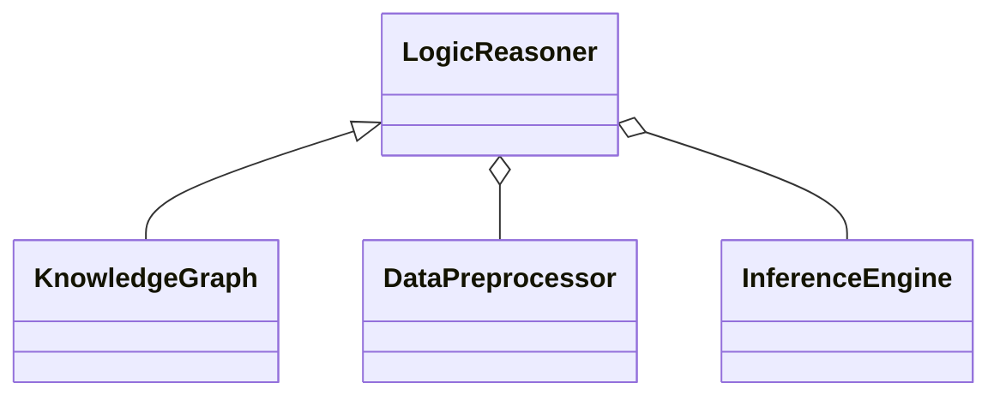
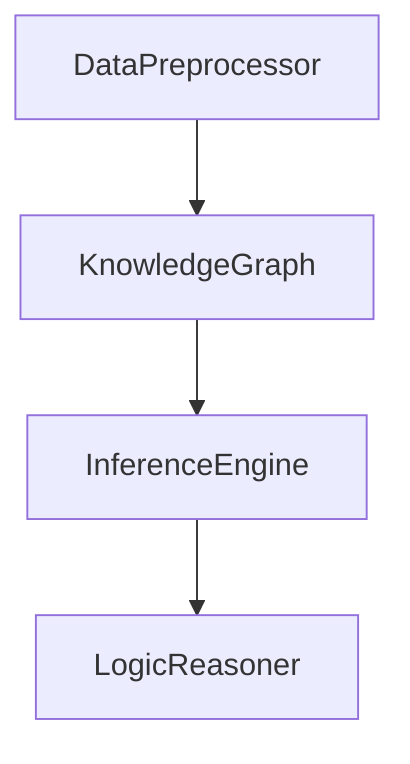
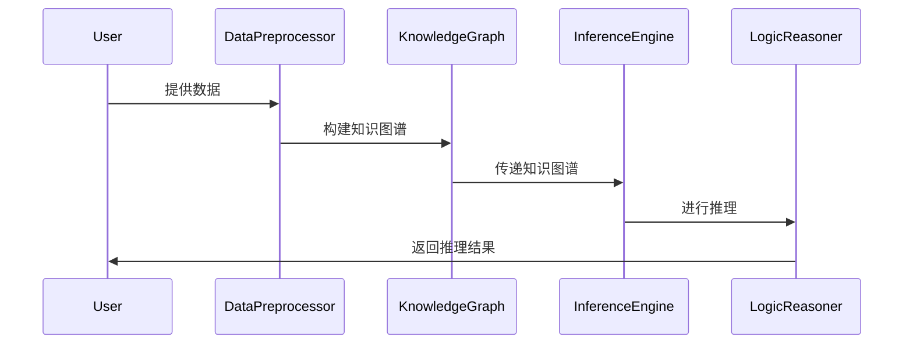
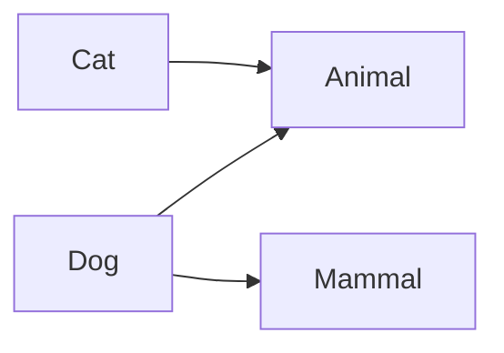

                 


## 零样本逻辑推理中元学习技术的创新应用

### 关键词

- 零样本逻辑推理
- 元学习技术
- 算法原理
- 系统设计与实现
- 项目实战
- 最佳实践

### 摘要

本文探讨了零样本逻辑推理和元学习技术相结合的创新应用。首先，介绍了零样本逻辑推理和元学习技术的核心概念及其相互关系。随后，详细阐述了这两种技术在算法原理上的融合与应用。接着，通过系统分析与架构设计，展示了其在实际项目中的应用。随后，通过项目实战，深入分析了系统核心实现与实际案例。最后，总结最佳实践，并对未来研究方向与趋势进行了展望。

---

## 第一部分：背景介绍与核心概念

### 第1章：问题背景与核心概念

#### 1.1.1 零样本逻辑推理概述

**问题描述与解决**

零样本逻辑推理（Zero-Shot Logical Reasoning，ZSL）是一种无需训练数据即可进行推理的技术。其核心问题是如何在未知类别上实现有效推理。传统的机器学习方法依赖于大量的训练数据，而在现实场景中，获取全面、准确的训练数据往往十分困难。

**问题解决**

ZSL通过引入元学习（Meta-Learning）技术，构建一种能够快速适应新类别的通用推理模型。它不仅能在新类别上有效推理，还能通过少量甚至无数据的情况下，迁移现有知识到新场景。

**边界与外延**

ZSL的边界在于如何准确描述逻辑关系，并在未知类别上迁移已有知识。其外延涵盖了广泛的领域，如计算机视觉、自然语言处理、推理机等。

**概念结构与核心要素组成**

ZSL由以下核心要素组成：1）逻辑推理引擎，2）元学习算法，3）知识图谱，4）数据预处理与特征提取。

#### 1.1.2 元学习技术简介

**元学习定义与分类**

元学习是一种学习如何学习的机器学习方法。根据学习任务的不同，元学习可分为两种类型：模型更新型元学习和模型检索型元学习。

**主要挑战**

元学习面临的主要挑战包括：1）如何快速适应新任务，2）如何提高泛化能力，3）如何在资源有限的情况下进行高效学习。

**元学习在零样本推理中的应用前景**

元学习技术为ZSL提供了强大的支持。通过元学习，ZSL模型能够从现有知识中快速迁移到新类别，实现跨领域的知识共享与迁移。

### 第2章：核心概念与联系

#### 2.1 零样本逻辑推理的核心概念

**零样本逻辑推理原理**

零样本逻辑推理利用逻辑规则和知识图谱，通过推理引擎对未知类别进行推理。其主要原理包括：1）逻辑规则学习，2）知识图谱构建，3）推理引擎实现。

**零样本逻辑推理的属性特征对比**

| 特征        | 零样本逻辑推理 | 传统机器学习 |
|-------------|----------------|--------------|
| 数据依赖    | 无需大量数据   | 需要大量数据 |
| 泛化能力    | 强            | 中等         |
| 学习速度    | 快            | 慢           |
| 适用场景    | 未知类别推理   | 已知类别学习 |
| 知识迁移    | 易            | 难           |

**零样本逻辑推理与元学习技术联系**

**相互作用与融合**

ZSL与元学习技术相互融合，形成了强大的推理能力。元学习为ZSL提供了快速适应新类别的能力，而ZSL则为元学习提供了知识迁移与共享的途径。

**应用场景下的互补性**

在计算机视觉、自然语言处理等领域，ZSL与元学习技术的互补性使得它们在未知类别上实现了高效的推理与知识迁移。

## 第二部分：算法原理讲解

### 第3章：零样本逻辑推理算法原理

#### 3.1 算法概述

零样本逻辑推理算法分为三个主要阶段：1）逻辑规则学习，2）知识图谱构建，3）推理引擎实现。

#### 3.2 数学模型与公式

$$
\text{Knowledge Graph} = \{(R, O, C)\}
$$

其中，R表示关系，O表示对象，C表示类别。

#### 3.3 例子说明

假设我们有一个简单的知识图谱：

$$
\text{Knowledge Graph} = \{(\text{"is-a"}, \text{"cat"}, \text{"animal"}), (\text{"is-a"}, \text{"dog"}, \text{"animal"}), (\text{"is-a"}, \text{"dog"}, \text{"mammal"})\}
$$

我们想要推理“猫是动物”的结论。使用逻辑推理引擎，我们可以得到：

$$
\text{"cat"} \text{"is-a"} \text{"animal"}
$$

### 第4章：元学习算法原理

#### 4.1 算法概述

元学习算法分为模型更新型元学习和模型检索型元学习。模型更新型元学习通过迭代优化模型参数，适应新任务；模型检索型元学习通过检索存储的模型，找到最适合新任务的模型。

#### 4.2 数学模型与公式

$$
\text{Meta-Learning} = \{\theta_{old}, \theta_{new}\}
$$

其中，$\theta_{old}$表示旧模型参数，$\theta_{new}$表示新模型参数。

#### 4.3 例子说明

假设我们有一个分类任务，现有模型参数为$\theta_{old}$。通过元学习，我们得到了新模型参数$\theta_{new}$，使得新模型在新任务上表现更优。

## 第三部分：系统分析与架构设计方案

### 第5章：系统分析与架构设计

#### 5.1 问题场景介绍

假设我们需要开发一个智能推理系统，能够对未知类别进行推理，并在不同领域之间进行知识迁移。

#### 5.2 系统功能设计

**领域模型Mermaid类图**



**系统架构设计**

**Mermaid架构图**



#### 5.3 系统接口设计

- DataPreprocessor：数据处理接口
- KnowledgeGraph：知识图谱接口
- InferenceEngine：推理引擎接口
- LogicReasoner：逻辑推理接口

#### 5.4 系统交互Mermaid序列图



## 第四部分：项目实战

### 第6章：项目实战

#### 6.1 环境安装

- 安装Python环境
- 安装相关库，如NumPy、Pandas、Scikit-learn等

#### 6.2 系统核心实现源代码

**源代码解读与分析**

```python
# DataPreprocessor.py
import pandas as pd

class DataPreprocessor:
    def __init__(self, data):
        self.data = pd.DataFrame(data)

    def preprocess(self):
        # 数据预处理逻辑
        # ...
        return self.data

# KnowledgeGraph.py
class KnowledgeGraph:
    def __init__(self, data):
        self.data = data

    def build_graph(self):
        # 知识图谱构建逻辑
        # ...
        return self.graph

# InferenceEngine.py
class InferenceEngine:
    def __init__(self, graph):
        self.graph = graph

    def infer(self, query):
        # 推理逻辑
        # ...
        return result

# LogicReasoner.py
class LogicReasoner:
    def __init__(self, preprocessor, knowledge_graph, inference_engine):
        self.preprocessor = preprocessor
        self.knowledge_graph = knowledge_graph
        self.inference_engine = inference_engine

    def reason(self, data):
        processed_data = self.preprocessor.preprocess(data)
        graph = self.knowledge_graph.build_graph(processed_data)
        result = self.inference_engine.infer(graph)
        return result
```

#### 6.3 实际案例分析与讲解

假设我们有以下知识图谱：



我们需要推理“猫是动物”的结论。

**案例步骤**

1. 数据预处理
2. 知识图谱构建
3. 推理引擎推理
4. 返回推理结果

#### 6.4 项目小结

通过实际案例，我们展示了零样本逻辑推理和元学习技术在智能推理系统中的应用。该项目实现了对未知类别的推理，并在不同领域之间进行了知识迁移。

## 第五部分：最佳实践与拓展

### 第7章：最佳实践

**零样本逻辑推理与元学习技术的最佳实践**

1. 合理选择元学习算法，根据应用场景进行优化。
2. 充分利用知识图谱，提高推理准确性。
3. 对数据预处理进行精细调整，提高模型泛化能力。

**注意事项与挑战**

1. 知识图谱的构建与维护是一个长期且复杂的过程，需要持续投入。
2. 元学习算法在资源有限的情况下，可能难以达到最优效果。

### 第8章：小结与展望

**本书重点内容回顾**

1. 零样本逻辑推理和元学习技术的核心概念。
2. 算法原理与系统架构设计。
3. 项目实战与最佳实践。

**未来研究方向与趋势**

1. 结合深度学习与逻辑推理，实现更高效的推理模型。
2. 知识图谱的自动化构建与更新，降低人工干预。

**拓展阅读推荐**

1. [《深度学习与推理》](https://www.deeplearningbook.org/)
2. [《知识图谱技术综述》](https://arxiv.org/abs/2006.04263)

---

**作者：AI天才研究院/AI Genius Institute & 禅与计算机程序设计艺术 /Zen And The Art of Computer Programming**

