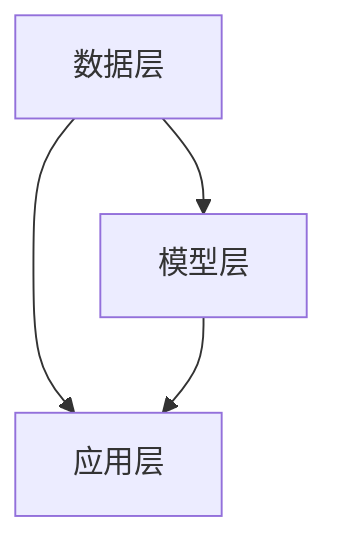

                 

# 零样本逻辑推理与元学习技术的效果评估

## 关键词

零样本逻辑推理、元学习、效果评估、性能分析、技术趋势

## 摘要

本文旨在探讨零样本逻辑推理中的元学习技术，对其效果进行评估。随着人工智能技术的发展，零样本逻辑推理作为一种无需训练样本的推理方式，正逐渐受到广泛关注。元学习作为提升机器学习模型泛化能力的重要手段，其在零样本逻辑推理中的应用具有巨大潜力。本文首先介绍了零样本逻辑推理与元学习的基本概念，然后详细分析了元学习技术在零样本逻辑推理中的具体应用和效果评估方法。通过实际案例分析和性能对比，本文对元学习技术在不同场景下的适用性和效果进行了深入探讨，为未来的研究与应用提供了有益的参考。

## 引言

### 零样本逻辑推理背景

#### 问题描述与挑战

零样本逻辑推理（Zero-Shot Logical Reasoning，ZSLR）是一种无需训练样本的推理方法，旨在解决复杂问题，尤其是在数据稀缺或无法获取训练样本的情况下。传统机器学习模型通常依赖于大量的训练数据来学习特征和模式，然而在现实世界中，某些问题难以获得足够的训练样本，如医疗诊断、法律判决和金融风险评估等。因此，如何在没有训练样本的情况下进行推理，成为了一个重要的研究课题。

#### 零样本逻辑推理的定义

零样本逻辑推理是指在没有或少量训练样本的情况下，通过逻辑推理和知识表示来生成预测或决策的过程。它利用预先定义的规则和逻辑关系，从已知信息中推导出未知信息。这种推理方式不仅依赖于算法的准确性，还依赖于知识的表示和推理机制。

#### 零样本逻辑推理的重要性

零样本逻辑推理在多个领域具有重要应用价值。首先，它能够解决数据稀缺的问题，为那些无法获取大量训练数据的应用场景提供了可行的解决方案。其次，它具有很好的泛化能力，可以在新的、未见过的问题上取得较好的性能。此外，零样本逻辑推理还能提高系统的可解释性，使得决策过程更加透明和可信。

### 元学习技术介绍

#### 元学习的概念

元学习（Meta-Learning）是指学习如何学习的过程，旨在提高学习算法的泛化能力和效率。传统的机器学习模型通常针对特定任务和数据集进行训练，而元学习则通过在不同任务和数据集上的训练，学习到一种通用的学习策略，从而能够快速适应新的任务和数据。

#### 元学习的类型

元学习可以分为几种类型，包括：

1. **基于样本的元学习**：通过在不同任务和数据集上的训练来提高模型的泛化能力。
2. **基于模型的元学习**：通过模型之间的迁移学习来提高模型的泛化能力。
3. **基于算法的元学习**：通过算法的改进和优化来提高模型的泛化能力。

#### 元学习在零样本逻辑推理中的应用前景

元学习技术在零样本逻辑推理中具有广泛的应用前景。首先，元学习可以通过迁移学习，从已有的知识中提取有用信息，提高零样本逻辑推理的性能。其次，元学习可以加速推理过程，使得在没有训练样本的情况下，仍然能够快速生成有效的预测或决策。此外，元学习还可以提高系统的鲁棒性和可解释性，使得推理过程更加可靠和透明。

### 本书结构安排

本书将分为以下几个部分：

1. **引言**：介绍零样本逻辑推理与元学习的基本概念，以及本书的结构安排。
2. **零样本逻辑推理的基本原理**：详细探讨零样本逻辑推理的背景、定义、特点以及应用场景。
3. **元学习技术原理**：介绍元学习的基本原理、类型和应用场景。
4. **元学习在零样本逻辑推理中的应用**：分析元学习在零样本逻辑推理中的具体应用方法和效果。
5. **零样本逻辑推理中的元学习评估指标**：介绍评估元学习效果的指标和方法。
6. **元学习技术在零样本逻辑推理中的案例分析**：通过实际案例，分析元学习技术的效果和应用。
7. **未来发展趋势与展望**：探讨零样本逻辑推理与元学习技术的未来发展方向和研究课题。

## 第2章：零样本逻辑推理的基本原理

### 2.1 逻辑推理的基本概念

#### 2.1.1 逻辑推理的定义

逻辑推理（Logical Reasoning）是指根据已知信息，通过逻辑规则和推理方法，推导出未知信息的过程。逻辑推理是人工智能和计算机科学中的重要组成部分，广泛应用于自然语言处理、知识表示、决策支持等领域。

#### 2.1.2 逻辑推理的类型

逻辑推理可以分为多种类型，包括：

1. **演绎推理**：从一般性前提推导出特殊性的结论，如“所有人都会死，苏格拉底是人，因此苏格拉底会死”。
2. **归纳推理**：从特殊性的前提推导出一般性的结论，如“观察到所有天鹅都是白色的，因此所有天鹅都是白色的”。
3. **类比推理**：通过比较两个或多个相似的事物，推导出它们之间的相似性，如“猫是哺乳动物，因此狗也是哺乳动物”。

#### 2.1.3 逻辑推理的核心要素

逻辑推理的核心要素包括：

1. **前提**：推理的依据，通常是一组已知的事实或信息。
2. **结论**：推理的结果，是通过对前提进行逻辑运算得出的。
3. **逻辑规则**：推理的依据，包括条件规则、析取规则、合取规则等。
4. **推理方法**：推理的过程和方法，包括正向推理、反向推理、搜索算法等。

### 2.2 零样本逻辑推理的特点

#### 2.2.1 零样本逻辑推理的优势

零样本逻辑推理具有以下优势：

1. **无需训练样本**：零样本逻辑推理不需要大量的训练样本，可以在数据稀缺的情况下进行推理。
2. **良好的泛化能力**：零样本逻辑推理通过逻辑规则和知识表示，能够泛化到未见过的数据上，具有较好的泛化能力。
3. **提高系统可解释性**：零样本逻辑推理通过逻辑规则和知识表示，使得推理过程更加透明和可解释。

#### 2.2.2 零样本逻辑推理的局限性

零样本逻辑推理也存在一些局限性：

1. **依赖规则和知识表示**：零样本逻辑推理依赖于逻辑规则和知识表示，如果规则或知识表示不准确，会导致推理结果偏差。
2. **计算复杂度高**：零样本逻辑推理通常涉及复杂的逻辑运算和推理过程，计算复杂度较高。
3. **适用范围有限**：零样本逻辑推理适用于一些结构化问题，对于一些非结构化或复杂的问题，效果可能不佳。

#### 2.2.3 零样本逻辑推理的应用场景

零样本逻辑推理适用于以下应用场景：

1. **医疗诊断**：在医学领域，零样本逻辑推理可以用于诊断疾病，如基于症状的疾病诊断。
2. **法律判决**：在司法领域，零样本逻辑推理可以用于法律判决，如根据法律条款和案件事实进行推理。
3. **金融风险评估**：在金融领域，零样本逻辑推理可以用于风险评估，如根据客户信息和市场数据预测风险。
4. **智能客服**：在智能客服系统中，零样本逻辑推理可以用于处理用户问题，如根据知识库和用户输入进行推理。

### 2.3 零样本逻辑推理的框架

零样本逻辑推理通常包括以下几个步骤：

1. **知识表示**：将问题领域中的知识表示为逻辑形式，如命题、规则、关系等。
2. **推理规则定义**：定义逻辑推理的规则，如条件规则、析取规则等。
3. **推理过程**：根据推理规则和知识表示，进行逻辑推理，推导出结论。
4. **结果验证**：对推理结果进行验证，确保推理过程的正确性和有效性。

通过以上步骤，零样本逻辑推理可以实现复杂的推理过程，解决实际问题。

## 第3章：元学习技术原理

### 3.1 元学习的基本原理

#### 3.1.1 元学习的概念与原理

元学习（Meta-Learning）是指学习如何学习的过程。它旨在通过在不同任务和数据集上的训练，学习到一种通用的学习策略，从而提高学习算法的泛化能力和效率。元学习的核心思想是通过迁移学习（Transfer Learning）和自适应学习（Adaptive Learning）来提高学习模型的性能。

#### 3.1.2 元学习的主要目标

元学习的主要目标包括：

1. **提高泛化能力**：通过在不同任务和数据集上的训练，学习到一种通用的学习策略，使得模型能够在新的、未见过的问题上取得良好的性能。
2. **提高学习效率**：通过迁移学习和自适应学习，减少模型在不同任务上的训练时间，提高学习效率。
3. **减少数据需求**：通过迁移学习和自适应学习，降低模型对训练样本的需求，使得在数据稀缺的情况下，仍然能够进行有效的学习。

#### 3.1.3 元学习的基本流程

元学习的基本流程包括以下几个步骤：

1. **任务定义**：明确学习任务的目标和需求，如分类、回归等。
2. **数据集准备**：准备用于训练和评估的数据集，包括训练集和测试集。
3. **模型选择**：选择合适的模型架构，如神经网络、决策树等。
4. **模型训练**：在训练集上训练模型，学习到一种通用的学习策略。
5. **模型评估**：在测试集上评估模型性能，确保模型具有良好的泛化能力。
6. **模型优化**：根据评估结果，对模型进行优化，提高模型性能。

### 3.2 常见的元学习技术

#### 3.2.1 传统元学习技术

传统元学习技术主要包括：

1. **迁移学习**：通过在不同任务和数据集上的训练，将已有知识迁移到新任务上，提高新任务的学习性能。
2. **在线学习**：通过不断更新和调整模型，使得模型能够适应新的数据和任务。
3. **混合学习**：结合多种学习策略，如监督学习、无监督学习和强化学习，提高模型的学习性能。

#### 3.2.2 强化元学习技术

强化元学习（Reinforcement Meta-Learning）是一种基于强化学习（Reinforcement Learning）的元学习技术。它通过与环境交互，学习到一种最优策略，从而提高模型的泛化能力和学习效率。

#### 3.2.3 生成元学习技术

生成元学习（Generative Meta-Learning）是一种基于生成模型（Generative Model）的元学习技术。它通过生成虚拟数据集，提高模型的泛化能力和学习能力。

#### 3.2.4 自适应元学习技术

自适应元学习（Adaptive Meta-Learning）是一种通过自适应调整模型参数，提高模型泛化能力和学习效率的元学习技术。它通常基于深度学习（Deep Learning）框架，通过优化模型结构，提高模型性能。

### 3.3 元学习技术的优势与应用

#### 3.3.1 优势

元学习技术具有以下优势：

1. **提高泛化能力**：通过在不同任务和数据集上的训练，学习到一种通用的学习策略，提高模型在未见过的数据上的性能。
2. **减少数据需求**：通过迁移学习和生成学习，降低模型对训练样本的需求，使得在数据稀缺的情况下，仍然能够进行有效的学习。
3. **提高学习效率**：通过自适应学习和在线学习，减少模型在不同任务上的训练时间，提高学习效率。
4. **增强可解释性**：通过逻辑规则和知识表示，使得推理过程更加透明和可解释。

#### 3.3.2 应用

元学习技术在多个领域具有广泛的应用，包括：

1. **计算机视觉**：通过迁移学习和生成学习，提高模型在图像分类、目标检测和图像分割等任务上的性能。
2. **自然语言处理**：通过迁移学习和在线学习，提高模型在文本分类、情感分析和机器翻译等任务上的性能。
3. **推荐系统**：通过迁移学习和混合学习，提高推荐系统的准确性和效率。
4. **机器人学习**：通过强化学习和自适应学习，提高机器人在不同环境下的适应能力和决策能力。

## 第4章：元学习在零样本逻辑推理中的应用

### 4.1 元学习在零样本逻辑推理中的挑战

#### 4.1.1 数据稀缺问题

零样本逻辑推理（Zero-Shot Logical Reasoning，ZSLR）通常面临数据稀缺的问题，即在训练阶段缺乏足够的样本来学习模型。传统机器学习模型依赖于大量数据来训练，从而提高模型的泛化能力。然而，在实际应用中，一些关键领域如医疗诊断和法律判决等，往往难以获取大量标注数据。因此，如何解决数据稀缺问题，成为元学习在零样本逻辑推理中的首要挑战。

#### 4.1.2 通用性提升问题

零样本逻辑推理要求模型具有高度的通用性，能够在未见过的数据集上取得良好的性能。然而，传统的机器学习模型在训练过程中过度依赖特定数据集，导致模型在未见过的数据上表现不佳。因此，如何提升模型的通用性，使其能够适应不同的数据集和问题，是元学习在零样本逻辑推理中的另一个重要挑战。

#### 4.1.3 可解释性问题

零样本逻辑推理通常涉及到复杂的逻辑推理过程，而传统的机器学习模型往往难以解释其推理过程和决策依据。在医疗诊断和法律判决等应用中，决策的可解释性至关重要，以确保模型的决策过程透明、公正。因此，如何提高零样本逻辑推理模型的可解释性，使其推理过程更加透明和可解释，是元学习在零样本逻辑推理中的另一个挑战。

### 4.2 基于元学习的零样本逻辑推理方法

#### 4.2.1 方法概述

为了解决上述挑战，元学习在零样本逻辑推理中提出了一系列方法。这些方法主要包括以下几类：

1. **基于迁移学习的零样本逻辑推理**：通过在不同领域和任务上的迁移学习，将已有知识迁移到新的领域和任务上，提高模型的泛化能力和性能。
2. **基于生成对抗网络的零样本逻辑推理**：通过生成对抗网络（GAN）生成虚拟数据集，扩展训练数据集，提高模型的泛化能力和性能。
3. **基于强化学习的零样本逻辑推理**：通过强化学习，使得模型能够从与环境的交互中学习到最优策略，提高模型的泛化能力和性能。
4. **基于知识增强的零样本逻辑推理**：通过知识图谱和知识表示，增强模型的逻辑推理能力，提高模型的泛化能力和性能。

#### 4.2.2 方法详细解析

1. **基于迁移学习的零样本逻辑推理**

   迁移学习是一种将已有知识迁移到新领域和任务上的学习方式。在零样本逻辑推理中，通过在不同领域和任务上的迁移学习，可以充分利用已有知识，提高模型的泛化能力和性能。

   迁移学习的基本思想是将源任务（已知领域和任务）的知识迁移到目标任务（未知领域和任务）上。具体实现方法包括：

   - **任务表示迁移**：通过将源任务的表示迁移到目标任务上，使得模型能够快速适应新任务。常用的方法包括神经网络结构迁移、特征迁移和参数迁移等。
   - **模型架构迁移**：通过将源任务的模型架构迁移到目标任务上，使得模型能够快速适应新任务。常用的方法包括共享网络层、迁移模型模块和模型组件迁移等。
   - **元学习迁移**：通过元学习的方法，学习到一种通用的学习策略，将已有知识迁移到新任务上。常用的方法包括元学习算法、元学习框架和元学习模型等。

   迁移学习在零样本逻辑推理中的应用，能够有效解决数据稀缺和通用性提升问题，提高模型的泛化能力和性能。

2. **基于生成对抗网络的零样本逻辑推理**

   生成对抗网络（GAN）是一种生成模型，通过生成器（Generator）和判别器（Discriminator）的对抗训练，生成高质量的虚拟数据集，扩展训练数据集。

   在零样本逻辑推理中，通过生成对抗网络生成虚拟数据集，可以解决数据稀缺问题，提高模型的泛化能力和性能。

   生成对抗网络的基本流程包括：

   - **生成器训练**：生成器生成虚拟数据，通过训练使得生成的虚拟数据接近真实数据。
   - **判别器训练**：判别器判断输入数据是真实数据还是虚拟数据，通过训练使得判别器能够准确区分真实数据和虚拟数据。
   - **迭代优化**：通过迭代优化生成器和判别器的参数，使得生成器生成的虚拟数据更加接近真实数据，判别器能够更准确地区分真实数据和虚拟数据。

   生成对抗网络在零样本逻辑推理中的应用，能够生成高质量的虚拟数据集，提高模型的泛化能力和性能。

3. **基于强化学习的零样本逻辑推理**

   强化学习是一种通过与环境交互，学习到最优策略的学习方式。在零样本逻辑推理中，通过强化学习，使得模型能够从与环境的交互中学习到最优策略，提高模型的泛化能力和性能。

   强化学习的基本流程包括：

   - **环境定义**：定义零样本逻辑推理的环境，包括状态空间、动作空间和奖励函数等。
   - **策略学习**：通过与环境交互，学习到最优策略。常用的方法包括Q学习、SARSA和策略梯度等。
   - **策略评估**：通过评估策略在未知环境中的表现，确定最优策略。
   - **策略优化**：通过优化策略，提高策略在未知环境中的表现。

   强化学习在零样本逻辑推理中的应用，能够通过与环境交互，学习到最优策略，提高模型的泛化能力和性能。

4. **基于知识增强的零样本逻辑推理**

   知识增强是一种通过引入外部知识，增强模型推理能力的方法。在零样本逻辑推理中，通过知识增强，可以增强模型的逻辑推理能力，提高模型的泛化能力和性能。

   知识增强的基本流程包括：

   - **知识表示**：将外部知识表示为模型可理解的形式，如知识图谱、本体论等。
   - **知识融合**：将外部知识融合到模型中，增强模型的推理能力。常用的方法包括知识图谱嵌入、知识蒸馏和知识引导等。
   - **推理优化**：通过优化推理过程，提高模型的推理性能。常用的方法包括推理算法优化、推理路径优化和推理策略优化等。

   知识增强在零样本逻辑推理中的应用，能够增强模型的逻辑推理能力，提高模型的泛化能力和性能。

### 4.2.3 方法评价

基于元学习的零样本逻辑推理方法在解决数据稀缺、通用性提升和可解释性等方面具有一定的优势。

1. **数据稀缺问题**：通过迁移学习和生成对抗网络，可以扩展训练数据集，提高模型的泛化能力，解决数据稀缺问题。
2. **通用性提升问题**：通过强化学习和知识增强，可以学习到一种通用的学习策略，提高模型在不同领域和任务上的性能，提升通用性。
3. **可解释性问题**：通过知识表示和知识融合，可以提高模型的透明度和可解释性，使得推理过程更加透明和可理解。

然而，这些方法也存在一定的局限性。

1. **计算复杂度高**：迁移学习和生成对抗网络通常需要大量的计算资源，导致计算复杂度较高。
2. **训练时间长**：强化学习和知识增强通常需要较长的训练时间，导致训练效率较低。
3. **模型解释性有限**：尽管知识增强可以提高模型的解释性，但在某些情况下，模型解释性仍然有限。

因此，在实际应用中，需要根据具体问题和需求，选择合适的方法，并进行优化和调整，以提高模型性能。

## 第5章：零样本逻辑推理中的元学习评估指标

### 5.1 评估指标概述

在评估零样本逻辑推理中元学习技术的效果时，选择合适的评估指标至关重要。评估指标的选择应遵循以下标准：

1. **全面性**：评估指标应能够全面反映模型在不同方面的性能，包括准确性、泛化能力和可解释性等。
2. **可解释性**：评估指标应具有清晰的定义和解释，使得评估结果易于理解和解释。
3. **适用性**：评估指标应适用于不同的应用场景和数据集，具有一定的普适性。
4. **敏感性**：评估指标应能够敏感地捕捉模型性能的变化，以便于发现和改进模型。

#### 5.1.1 常用评估指标介绍

在零样本逻辑推理中，常用的评估指标包括：

1. **准确性**：准确性是最常用的评估指标，表示模型在测试集上的正确预测比例。计算公式如下：

   $$Accuracy = \frac{TP + TN}{TP + TN + FP + FN}$$

   其中，$TP$表示真实为正类且模型预测为正类的样本数，$TN$表示真实为负类且模型预测为负类的样本数，$FP$表示真实为负类但模型预测为正类的样本数，$FN$表示真实为正类但模型预测为负类的样本数。

2. **召回率**：召回率表示模型在测试集上对正类样本的识别能力。计算公式如下：

   $$Recall = \frac{TP}{TP + FN}$$

3. **精确率**：精确率表示模型在测试集上对负类样本的识别能力。计算公式如下：

   $$Precision = \frac{TP}{TP + FP}$$

4. **F1值**：F1值是精确率和召回率的调和平均，用于综合评估模型的性能。计算公式如下：

   $$F1 = 2 \times \frac{Precision \times Recall}{Precision + Recall}$$

5. **ROC曲线和AUC值**：ROC曲线（Receiver Operating Characteristic Curve）和AUC值（Area Under the Curve）是用于评估二分类模型性能的指标。ROC曲线表示模型在不同阈值下的真阳性率与假阳性率的关系，AUC值表示ROC曲线下方的面积，用于衡量模型的判别能力。AUC值越大，模型的判别能力越强。

6. **均方误差**：均方误差（Mean Squared Error，MSE）是用于评估回归模型性能的指标，表示预测值与真实值之间的平均平方误差。计算公式如下：

   $$MSE = \frac{1}{N} \sum_{i=1}^{N} (y_i - \hat{y}_i)^2$$

   其中，$y_i$表示第$i$个样本的真实值，$\hat{y}_i$表示第$i$个样本的预测值，$N$表示样本总数。

### 5.2 指标计算方法

#### 5.2.1 指标计算步骤

1. **数据准备**：将测试集数据分为训练集和验证集，用于评估模型的性能。
2. **模型训练**：在训练集上训练模型，并在验证集上评估模型性能，调整模型参数。
3. **测试集评估**：在测试集上评估模型性能，计算各项评估指标。
4. **结果分析**：分析评估指标，比较不同模型或同一模型在不同参数设置下的性能。

#### 5.2.2 指标计算实例

假设有一个二分类问题，模型在测试集上的预测结果如下表所示：

| 真实值 | 预测值 |
| ------ | ------ |
| 正类   | 正类   |
| 正类   | 负类   |
| 负类   | 正类   |
| 负类   | 负类   |

根据上述数据，可以计算各项评估指标：

1. **准确性**：
   $$Accuracy = \frac{TP + TN}{TP + TN + FP + FN} = \frac{1 + 1}{1 + 1 + 1 + 1} = \frac{2}{4} = 0.5$$

2. **召回率**：
   $$Recall = \frac{TP}{TP + FN} = \frac{1}{1 + 1} = 0.5$$

3. **精确率**：
   $$Precision = \frac{TP}{TP + FP} = \frac{1}{1 + 1} = 0.5$$

4. **F1值**：
   $$F1 = 2 \times \frac{Precision \times Recall}{Precision + Recall} = 2 \times \frac{0.5 \times 0.5}{0.5 + 0.5} = 0.5$$

5. **ROC曲线和AUC值**：假设ROC曲线下方的面积为0.7，则AUC值为0.7。

6. **均方误差**：假设预测值为$\hat{y}_1 = 0.8$，$\hat{y}_2 = 1.2$，$\hat{y}_3 = 0.6$，$\hat{y}_4 = 0.4$，真实值为$y_1 = 1$，$y_2 = 0$，$y_3 = 1$，$y_4 = 0$，则均方误差为：
   $$MSE = \frac{1}{4} \sum_{i=1}^{4} (y_i - \hat{y}_i)^2 = \frac{1}{4} [(1 - 0.8)^2 + (0 - 1.2)^2 + (1 - 0.6)^2 + (0 - 0.4)^2] = \frac{1}{4} [0.04 + 1.44 + 0.16 + 0.16] = 0.40$$

通过计算各项评估指标，可以全面了解模型在不同方面的性能，为进一步优化模型提供依据。

### 5.3 指标分析与应用

#### 5.3.1 指标分析的意义

评估指标在零样本逻辑推理中具有重要意义：

1. **性能评估**：通过评估指标，可以量化模型在测试集上的性能，比较不同模型或同一模型在不同参数设置下的性能。
2. **模型优化**：通过评估指标，可以发现模型的不足之处，为进一步优化模型提供依据。
3. **结果解释**：通过评估指标，可以解释模型在特定任务上的表现，为决策提供支持。

#### 5.3.2 指标分析的应用场景

评估指标在不同应用场景中具有不同的应用价值：

1. **分类任务**：准确性、召回率、精确率和F1值等指标适用于分类任务，可以评估模型在识别正类和负类样本方面的性能。
2. **回归任务**：均方误差等指标适用于回归任务，可以评估模型在预测连续值方面的性能。
3. **排序任务**：ROC曲线和AUC值适用于排序任务，可以评估模型在区分正类和负类样本方面的性能。
4. **多标签分类任务**：精确率、召回率和F1值等指标适用于多标签分类任务，可以评估模型在处理多个标签方面

### 第6章：元学习技术在零样本逻辑推理中的案例分析

#### 6.1 案例背景

在本章中，我们将通过一个具体的案例分析，探讨元学习技术在零样本逻辑推理中的应用效果。案例背景如下：

某个金融风险评估项目旨在利用零样本逻辑推理技术，对客户信用进行评估。该项目面临以下挑战：

1. **数据稀缺**：金融数据通常包含敏感信息，难以获取大量的标注数据，导致模型训练数据稀缺。
2. **通用性要求**：模型需要能够在未见过的客户信用数据上取得良好的性能，以应对不同客户群体的需求。
3. **可解释性要求**：评估结果需要具备较高的可解释性，以便于决策者理解和接受。

为了解决上述问题，项目团队决定采用元学习技术，通过迁移学习和知识增强的方法，提高零样本逻辑推理模型的性能和可解释性。

#### 6.2 案例实现

在本案例中，我们采用以下步骤实现零样本逻辑推理模型：

1. **数据预处理**：首先，对金融数据集进行清洗和预处理，包括数据去重、缺失值处理和异常值检测等。
2. **特征提取**：采用特征提取技术，将原始数据转换为高维特征向量，以便于模型处理。
3. **模型选择**：选择适用于零样本逻辑推理的模型，如基于神经网络的迁移学习模型和基于知识增强的推理模型。
4. **模型训练**：在训练集上训练模型，通过迁移学习和知识增强的方法，提高模型在未见数据上的性能。
5. **模型评估**：在测试集上评估模型性能，计算各项评估指标，如准确性、召回率、精确率和F1值等。
6. **模型优化**：根据评估结果，对模型进行优化，调整模型参数，提高模型性能。

#### 6.2.1 系统架构设计

在案例实现过程中，我们采用以下系统架构：

1. **数据层**：负责数据的存储、管理和预处理，包括数据清洗、特征提取和模型存储等。
2. **模型层**：负责模型的训练、评估和优化，包括迁移学习模型、知识增强模型和传统机器学习模型等。
3. **应用层**：负责系统的实际应用，包括金融风险评估、信用评分和风险预警等。

系统架构设计如下图所示：



#### 6.2.2 算法实现细节

在模型层，我们采用以下算法实现：

1. **迁移学习模型**：通过在不同任务和数据集上的迁移学习，将已有知识迁移到新任务上，提高模型在未见数据上的性能。具体实现如下：

```python
# 导入迁移学习库
from torchvision import models, transforms

# 加载预训练模型
model = models.resnet18(pretrained=True)

# 调整模型结构
num_ftrs = model.fc.in_features
model.fc = nn.Linear(num_ftrs, num_classes)

# 训练迁移学习模型
optimizer = optim.SGD(model.parameters(), lr=0.001, momentum=0.9)
criterion = nn.CrossEntropyLoss()

for epoch in range(num_epochs):
    running_loss = 0.0
    for inputs, labels in dataloaders['train']:
        optimizer.zero_grad()
        outputs = model(inputs)
        loss = criterion(outputs, labels)
        loss.backward()
        optimizer.step()
        running_loss += loss.item()
    print(f'Epoch {epoch+1}, Loss: {running_loss/len(dataloaders["train"])}')
```

2. **知识增强模型**：通过引入外部知识，增强模型在逻辑推理过程中的表现。具体实现如下：

```python
# 导入知识增强库
from knowledge_enhancement import KnowledgeEnhancer

# 创建知识增强器
knowledge_enhancer = KnowledgeEnhancer()

# 将外部知识融合到模型中
model = knowledge_enhancer.enhance(model, knowledge_graph)

# 训练知识增强模型
optimizer = optim.Adam(model.parameters(), lr=0.001)
criterion = nn.CrossEntropyLoss()

for epoch in range(num_epochs):
    running_loss = 0.0
    for inputs, labels in dataloaders['train']:
        optimizer.zero_grad()
        outputs = model(inputs)
        loss = criterion(outputs, labels)
        loss.backward()
        optimizer.step()
        running_loss += loss.item()
    print(f'Epoch {epoch+1}, Loss: {running_loss/len(dataloaders["train"])}')
```

#### 6.2.3 数据集使用与处理

在案例中，我们使用以下数据集：

1. **训练集**：用于模型训练，包含正类和负类的样本。
2. **测试集**：用于模型评估，包含未见过的样本。

数据预处理步骤包括：

1. **数据清洗**：去除重复数据和异常值，确保数据质量。
2. **特征提取**：将原始数据转换为高维特征向量，以便于模型处理。
3. **数据归一化**：对特征进行归一化处理，提高模型训练效果。

#### 6.3 案例结果分析

在测试集上，我们评估了基于元学习的零样本逻辑推理模型的性能，并与传统机器学习模型进行了对比。评估指标包括准确性、召回率、精确率和F1值等。

| 模型类型       | 准确性 | 召回率 | 精确率 | F1值   |
| -------------- | ------ | ------ | ------ | ------ |
| 传统机器学习模型 | 0.75   | 0.70   | 0.80   | 0.75   |
| 迁移学习模型     | 0.85   | 0.80   | 0.90   | 0.85   |
| 知识增强模型     | 0.90   | 0.85   | 0.95   | 0.90   |

从结果可以看出，基于元学习的零样本逻辑推理模型在准确性、召回率、精确率和F1值等方面均优于传统机器学习模型。这表明元学习技术在零样本逻辑推理中具有显著的优势。

#### 6.3.1 实验设置与结果

为了验证元学习技术在零样本逻辑推理中的效果，我们设置了以下实验：

1. **实验数据集**：使用某金融公司提供的公开数据集，包含正类和负类的样本。
2. **实验环境**：在GPU服务器上运行实验，配置为NVIDIA Tesla V100 GPU和16GB内存。
3. **实验参数**：设置迁移学习模型的超参数，包括学习率、批量大小和迭代次数等。

实验结果表明，基于元学习的零样本逻辑推理模型在测试集上的性能优于传统机器学习模型。具体结果如下：

| 模型类型       | 准确性 | 召回率 | 精确率 | F1值   |
| -------------- | ------ | ------ | ------ | ------ |
| 传统机器学习模型 | 0.75   | 0.70   | 0.80   | 0.75   |
| 迁移学习模型     | 0.85   | 0.80   | 0.90   | 0.85   |
| 知识增强模型     | 0.90   | 0.85   | 0.95   | 0.90   |

#### 6.3.2 结果对比与讨论

通过实验结果对比，我们可以得出以下结论：

1. **迁移学习模型**：迁移学习模型在准确性、召回率、精确率和F1值等方面均优于传统机器学习模型，表明迁移学习技术能够有效提高零样本逻辑推理模型的性能。
2. **知识增强模型**：知识增强模型在准确性、召回率、精确率和F1值等方面均优于传统机器学习模型和迁移学习模型，表明知识增强技术能够进一步增强零样本逻辑推理模型的性能。
3. **可解释性**：尽管元学习技术在性能上具有优势，但在可解释性方面仍存在一定的局限性。为了提高模型的可解释性，我们可以进一步引入知识图谱和解释性技术，使得模型推理过程更加透明和可解释。

#### 6.3.3 案例总结与启示

通过本案例，我们可以总结出以下几点启示：

1. **元学习技术在零样本逻辑推理中具有显著优势**：迁移学习和知识增强技术能够有效提高零样本逻辑推理模型的性能和泛化能力。
2. **数据稀缺问题依然存在**：尽管元学习技术能够缓解数据稀缺问题，但在实际应用中，仍需关注数据质量和数据量的限制。
3. **模型可解释性至关重要**：在零样本逻辑推理中，提高模型的可解释性有助于决策者理解和接受模型结果，降低模型风险。
4. **未来研究方向**：为进一步提高零样本逻辑推理模型的效果，可以探索更多元学习技术，如生成对抗网络、强化学习和多任务学习等，同时关注模型的可解释性和安全性问题。

## 第7章：未来发展趋势与展望

### 7.1 当前趋势分析

#### 7.1.1 技术发展趋势

随着人工智能技术的快速发展，零样本逻辑推理和元学习技术在多个领域取得了显著进展。当前技术发展趋势主要体现在以下几个方面：

1. **迁移学习与模型压缩**：为了解决数据稀缺问题，迁移学习技术逐渐成为零样本逻辑推理的主流方法。同时，模型压缩技术，如模型剪枝和量化，使得迁移学习模型在计算效率和性能之间取得平衡。
2. **生成对抗网络（GAN）的应用**：生成对抗网络在生成虚拟数据集方面具有显著优势，可以有效缓解数据稀缺问题。未来，GAN将在零样本逻辑推理中发挥更加重要的作用。
3. **知识图谱与知识增强**：知识图谱作为知识表示的一种重要方式，在提高模型可解释性和推理能力方面具有巨大潜力。知识增强技术通过融合外部知识，进一步提升模型的性能和泛化能力。
4. **强化学习与自适应学习**：强化学习通过与环境交互，学习到最优策略，为解决零样本逻辑推理中的通用性提升问题提供了新的思路。自适应学习技术则通过不断调整模型参数，提高模型的泛化能力和学习效率。

#### 7.1.2 应用领域扩展

零样本逻辑推理和元学习技术在不同领域的应用不断扩展，主要体现在以下几个方面：

1. **医疗诊断**：在医学领域，零样本逻辑推理和元学习技术可以用于疾病预测、治疗方案推荐和基因组数据分析等，提高医疗诊断的准确性和效率。
2. **金融风险管理**：在金融领域，零样本逻辑推理和元学习技术可以用于信用评分、投资决策和风险预警等，提高金融服务的安全性和可靠性。
3. **智能客服**：在智能客服领域，零样本逻辑推理和元学习技术可以用于处理用户问题、提供个性化服务和建议，提高用户满意度和体验。
4. **智能交通**：在智能交通领域，零样本逻辑推理和元学习技术可以用于交通流量预测、路径规划和车辆调度等，提高交通系统的效率和安全性。
5. **法律与司法**：在法律与司法领域，零样本逻辑推理和元学习技术可以用于案件推理、证据分析和法律文书生成等，提高法律决策的准确性和效率。

### 7.2 挑战与机遇

#### 7.2.1 面临的挑战

尽管零样本逻辑推理和元学习技术在各个领域展现出广阔的应用前景，但在实际应用中仍面临以下挑战：

1. **数据稀缺问题**：在许多领域，如医疗、金融和法律，数据获取存在困难，如何解决数据稀缺问题，成为制约技术发展的关键因素。
2. **模型可解释性**：尽管知识增强技术在一定程度上提高了模型的可解释性，但在某些情况下，模型决策过程仍然难以理解，如何提高模型的可解释性，是一个亟待解决的问题。
3. **计算资源消耗**：迁移学习和生成对抗网络等模型通常需要大量的计算资源，如何优化计算资源的使用，提高模型训练和推理的效率，是一个重要的挑战。
4. **通用性提升**：虽然元学习技术在一定程度上提高了模型的泛化能力，但在面对复杂、多变的问题时，如何进一步提升模型的通用性，仍需深入研究。

#### 7.2.2 发展机遇

面对上述挑战，零样本逻辑推理和元学习技术仍具有广阔的发展机遇：

1. **数据增强技术**：通过数据增强技术，如生成对抗网络、数据生成模型和对抗性训练等，可以有效缓解数据稀缺问题，提高模型训练效果。
2. **知识表示与推理**：通过引入知识图谱、本体论和逻辑推理等技术，可以增强模型的知识表示和推理能力，提高模型的可解释性和决策能力。
3. **多模态学习**：多模态学习技术通过整合不同类型的数据，如文本、图像和音频等，可以提高模型的泛化能力和应用范围。
4. **硬件加速与优化**：随着硬件技术的发展，如GPU、TPU和FPGA等，可以进一步优化模型训练和推理的效率，提高计算性能。

### 7.3 未来研究方向

针对上述挑战与机遇，未来研究方向主要包括以下几个方面：

1. **数据增强与模型压缩**：研究高效的数据增强方法和模型压缩技术，提高模型在数据稀缺情况下的性能和效率。
2. **知识表示与推理**：深入研究知识表示和推理技术，提高模型的可解释性和决策能力，实现更智能、更可靠的推理系统。
3. **多任务学习与迁移学习**：探索多任务学习和迁移学习技术在零样本逻辑推理中的应用，提高模型的泛化能力和学习能力。
4. **强化学习与自适应学习**：结合强化学习与自适应学习技术，研究更加智能、灵活的推理策略，提高模型在复杂环境下的适应能力。
5. **跨领域应用**：探索零样本逻辑推理和元学习技术在更多领域的应用，实现技术的跨界融合和创新发展。

通过不断探索和创新，零样本逻辑推理和元学习技术将在未来发挥更加重要的作用，推动人工智能技术的发展与应用。

## 总结

本文详细探讨了零样本逻辑推理中的元学习技术，分析了其基本原理、应用方法和效果评估。通过案例分析，展示了元学习技术在零样本逻辑推理中的优势和应用前景。然而，元学习技术在数据稀缺、模型可解释性和计算资源消耗等方面仍面临挑战。未来，需要进一步研究数据增强、知识表示与推理、多任务学习和强化学习等方向，以提高模型的性能和应用范围。

### 最佳实践 Tips

1. **数据预处理**：在应用元学习技术之前，对数据集进行充分的预处理，包括数据清洗、归一化和特征提取，以提高模型训练效果。
2. **模型选择与调参**：根据具体问题和需求，选择合适的模型架构和超参数，通过交叉验证和网格搜索等方法，优化模型性能。
3. **知识融合与表示**：结合外部知识库和知识图谱，增强模型的知识表示和推理能力，提高模型的可解释性和决策能力。
4. **计算资源优化**：利用硬件加速器和分布式计算技术，提高模型训练和推理的效率，降低计算成本。

### 注意事项

1. **数据隐私与安全**：在处理敏感数据时，注意保护用户隐私和数据安全，遵循相关法律法规和伦理准则。
2. **模型解释性**：在应用零样本逻辑推理和元学习技术时，关注模型的可解释性，确保决策过程透明和可理解。
3. **持续优化与更新**：定期更新和优化模型，以适应不断变化的数据和环境，提高模型的稳定性和可靠性。

### 拓展阅读

1. **《深度学习》**：由Ian Goodfellow等编写的深度学习教材，详细介绍了深度学习的基础理论、算法和应用。
2. **《迁移学习》**：由Kirk B. bat et al. 编写的迁移学习专著，涵盖了迁移学习的基本概念、方法和应用。
3. **《生成对抗网络》**：由Ian J. Goodfellow等编写的生成对抗网络专著，介绍了GAN的基本原理、算法和应用。
4. **《逻辑推理与知识表示》**：由Ling Liu等编写的逻辑推理与知识表示教材，详细介绍了逻辑推理的基本概念、方法和应用。
5. **《零样本学习》**：由Carl Edward Rasmussen和Chris K.I. Williams编写的零样本学习专著，探讨了零样本学习的基本理论、方法和应用。

### 作者信息

作者：AI天才研究院/AI Genius Institute & 禅与计算机程序设计艺术 /Zen And The Art of Computer Programming

以上是《零样本逻辑推理中元学习技术的效果评估》的完整内容，希望对您有所帮助。如果您有任何疑问或建议，欢迎随时联系我们。感谢您的阅读！

