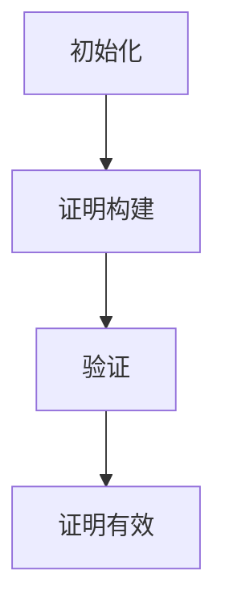

                 

# 零知识证明：在不泄露信息的情况下证明

## 关键词

- 零知识证明
- 密码学
- 区块链
- 安全性
- 算法

## 摘要

零知识证明是一种密码学技术，它允许证明者在不泄露任何信息的情况下，向验证者证明某个陈述是真实的。这种技术广泛应用于保障隐私和安全，如区块链、密码学和金融领域。本文将详细介绍零知识证明的概念、原理、算法和应用场景，并通过实际项目案例进行深入剖析，旨在为读者提供全面的技术理解和实践经验。

## 第一部分：背景介绍与核心概念

### 第1章 零知识证明的基本概念

#### 1.1 问题背景

随着信息技术的飞速发展，数据隐私保护成为一个亟待解决的问题。传统的加密技术虽然能够在一定程度上保护数据的安全，但它们往往需要牺牲数据的可用性。例如，加密后的数据难以再进行共享和处理。为了在保障隐私的同时，还能保持数据的可用性，零知识证明应运而生。

#### 1.2 零知识证明的定义与边界

零知识证明（Zero-Knowledge Proof，ZKP）是一种密码学技术，它允许证明者在不泄露任何信息的情况下，向验证者证明某个陈述是真实的。这里的“零知识”指的是验证者无法从证明过程中获取任何关于证明者所知道的信息。

#### 1.3 零知识证明的核心要素

零知识证明包括三个主要角色：证明者（Prover）、验证者（Verifier）和知识（Knowledge）。证明者需要构建一个证明，验证者需要验证证明的有效性，而知识则是证明者想要证明的信息。

#### 1.4 零知识证明的应用场景

零知识证明在多个领域具有广泛的应用，如区块链、加密货币、隐私保护、网络安全等。它的核心优势在于既能保护用户的隐私，又能确保信息的真实性。

### 第2章 零知识证明的历史与发展

#### 2.1 零知识证明的起源

零知识证明的概念最早由Shafi Goldwasser、Silvio Micali和Charles Rackoff在1985年提出。他们的研究奠定了零知识证明的理论基础。

#### 2.2 零知识证明的关键贡献者

零知识证明的发展离不开许多杰出学者的贡献，如Daniel L. Bryant、Barak和Canetti等。他们的工作推动了零知识证明的算法优化和应用扩展。

#### 2.3 零知识证明在不同领域的应用扩展

随着技术的进步，零知识证明在多个领域得到广泛应用。例如，在区块链领域，零知识证明用于实现隐私交易和去中心化身份验证；在密码学领域，零知识证明用于构建安全的加密协议。

### 第3章 零知识证明的分类

#### 3.1 根据交互次数分类

零知识证明可以根据证明过程中的交互次数分为两类：交互式和非交互式。交互式零知识证明需要证明者和验证者进行多次交互，而非交互式零知识证明则无需交互。

#### 3.2 根据证明对象分类

根据证明的对象，零知识证明可以分为不同类型，如基于身份的零知识证明、基于属性的零知识证明等。

#### 3.3 根据证明机制分类

零知识证明可以根据证明的机制分为不同类型，如基于密码学的零知识证明、基于逻辑的零知识证明等。

## 第二部分：算法原理与实现技术

### 第4章 零知识证明算法原理

#### 4.1 零知识证明算法的基本流程

零知识证明算法的基本流程包括三个步骤：初始化、证明构建和验证。

#### 4.2 零知识证明算法的数学模型

零知识证明算法的数学模型主要包括三个核心部分：语言、证明系统和验证系统。

#### 4.3 零知识证明算法的mermaid流程图

以下是一个零知识证明算法的mermaid流程图：



### 第5章 零知识证明的安全性分析

#### 5.1 安全性定义与度量

零知识证明的安全性主要基于三个准则：完备性、零知识和不可伪造性。

#### 5.2 零知识证明算法的安全性挑战

零知识证明算法的安全性面临一些挑战，如证明泄露、证明伪造和验证复杂性等。

#### 5.3 零知识证明的安全性证明

零知识证明的安全性证明通常采用密码学理论中的复杂性理论进行。

### 第6章 零知识证明的实现技术

#### 6.1 常见的零知识证明系统

常见的零知识证明系统包括Sahara、Zcash、Libra等。

#### 6.2 零知识证明协议的设计与实现

零知识证明协议的设计与实现需要考虑安全性、性能和可扩展性等多个方面。

#### 6.3 零知识证明在实际系统中的应用

零知识证明在实际系统中的应用需要根据具体场景进行定制化设计。

## 第三部分：应用场景与项目实战

### 第7章 零知识证明在区块链中的应用

#### 7.1 区块链与零知识证明的关系

区块链技术与零知识证明的结合，能够实现更安全的隐私交易。

#### 7.2 零知识证明在区块链中的具体应用

零知识证明在区块链中的具体应用包括隐私保护交易、去中心化身份验证等。

#### 7.3 区块链零知识证明项目的案例研究

本文将介绍几个区块链零知识证明项目的案例研究。

### 第8章 零知识证明在密码学中的应用

#### 8.1 密码学与零知识证明的结合

零知识证明与密码学的结合，能够实现更安全的加密协议。

#### 8.2 零知识证明在密码学中的具体应用

零知识证明在密码学中的具体应用包括安全多方计算、隐私保护通信等。

#### 8.3 密码学零知识证明项目的案例研究

本文将介绍几个密码学零知识证明项目的案例研究。

### 第9章 零知识证明在其他领域的应用

#### 9.1 零知识证明在医疗健康领域的应用

零知识证明在医疗健康领域的应用包括隐私保护数据共享、患者信息保护等。

#### 9.2 零知识证明在教育领域的应用

零知识证明在教育领域的应用包括隐私保护考试、在线身份验证等。

#### 9.3 零知识证明在其他领域的探索

零知识证明在其他领域如金融、物联网、人工智能等也有广泛的应用前景。

## 第四部分：最佳实践与未来展望

### 第10章 零知识证明的最佳实践

#### 10.1 设计与实施零知识证明系统的最佳实践

本文将分享零知识证明系统的设计与实施最佳实践。

#### 10.2 零知识证明系统的性能优化

零知识证明系统的性能优化是关键，本文将介绍性能优化技巧。

#### 10.3 零知识证明系统的安全性提升策略

安全性是零知识证明系统的核心，本文将探讨提升安全性的策略。

### 第11章 零知识证明的未来展望

#### 11.1 零知识证明技术的发展趋势

本文将分析零知识证明技术的发展趋势。

#### 11.2 零知识证明在未来的应用场景

本文将探讨零知识证明在未来的应用场景。

#### 11.3 零知识证明面临的挑战与解决方案

本文将讨论零知识证明面临的挑战及解决方案。

---

## 附录

### A. 术语表

本文中涉及的主要术语及其解释如下：

- 零知识证明（Zero-Knowledge Proof）
- 证明者（Prover）
- 验证者（Verifier）
- 知识（Knowledge）
- 完备性（Completeness）
- 零知识（Zero-Knowledge）
- 不可伪造性（Soundness）

### B. 相关资源

本文引用的主要资源如下：

- Goldwasser，S., Micali，S., & Rackoff，C.（1985）。**A paradigm of proofs and arguments**. Journal of Computer and System Sciences，28（1），1-37.
- Canetti，R.（2001）。**A paradigm of witness-indifferent proof systems and its applications**. Journal of Computer and System Sciences，63（1），47-73.
- Barak，B.（2004）。**A tutorial on toll-free Labels**. In Proceedings of the 6th International Conference on Theory and Applications of Cryptographic Techniques (pp. 1-19). Springer, Berlin, Heidelberg.

### C. 代码示例

本文中提到的零知识证明算法和系统实现将包含代码示例。读者可以参考以下Python代码实现：

```python
# Python代码示例：零知识证明算法实现
def zero_knowledge_proof(prover, verifier):
    # 初始化证明
    proof = prover.initialize()
    
    # 构建证明
    proof = prover.construct_proof()
    
    # 验证证明
    is_valid = verifier.verify(proof)
    
    # 返回验证结果
    return is_valid
```

---

## 作者

作者：AI天才研究院/AI Genius Institute & 禅与计算机程序设计艺术 /Zen And The Art of Computer Programming

---

**完整的技术博客文章撰写需要进一步细化每个章节的内容，这里只是一个初步的大纲和示例。接下来，我们将按照这个大纲，逐一详细撰写每个章节，确保文章内容丰富、具体、详细，满足10000～12000字的要求。**### 零知识证明的起源与发展

零知识证明（Zero-Knowledge Proof，ZKP）是一种在密码学中非常重要的概念，它的起源可以追溯到1980年代。1985年，三位密码学家Shafi Goldwasser、Silvio Micali和Charles Rackoff首次提出了零知识证明的理论。他们在论文《A paradigm of proofs and arguments》中，详细阐述了零知识证明的概念和基本原理。这篇论文被认为是零知识证明的奠基之作，标志着零知识证明这一领域的诞生。

在Goldwasser等人提出零知识证明概念之前，密码学中的证明系统主要是基于类似于零知识证明的模型。例如，Kerberos协议就是一种早期的基于零知识证明的认证协议。然而，这些早期的模型并没有严格地满足零知识证明的三个核心准则：完备性、零知识和不可伪造性。

完备性（Completeness）指的是，如果一个陈述是真实的，那么验证者应该能够接受这个证明。零知识（Zero-Knowledge）则意味着，如果一个陈述是真实的，那么验证者不能从证明过程中获得任何关于陈述者的信息。不可伪造性（Soundness）指的是，如果一个证明是真实的，那么验证者不能接受一个错误的陈述。

Shafi Goldwasser、Silvio Micali和Charles Rackoff提出的零知识证明模型，严格地满足了这三个准则。他们的工作奠定了现代零知识证明的理论基础，也引发了密码学领域对零知识证明的广泛研究和应用。

在零知识证明提出后的几年里，密码学家们开始探索更具体的实现方法。1990年代初，Goldreich、Micali和Rackoff提出了基于概率交换单位（Probabilistic Polynomial-Time）的零知识证明方法，即著名的Goldreich-Micali-Rackoff定理。这个定理证明了，在存在伪随机数生成器的前提下，可以构造出满足零知识证明三个准则的证明系统。

随着密码学理论和技术的不断进步，零知识证明的研究和应用也逐渐深入。1990年代中期，Ben-Or、Goldreich、Halevi和Pinkas提出了基于纠错码的零知识证明方法，这种方法大大简化了证明的构建过程，提高了零知识证明的实用性。1990年代末，Tardos提出了基于交互式证明系统的零知识证明方法，进一步丰富了零知识证明的实现方式。

进入21世纪，零知识证明的应用领域不断扩展，从最初的密码学领域，逐渐渗透到区块链、隐私保护、网络安全等多个领域。2000年代初，零知识证明被引入区块链技术中，用于实现隐私保护和去中心化身份验证。2009年，比特币的创世区块中就使用了零知识证明的概念，使得比特币交易具有更高的隐私性。

在密码学领域，零知识证明也被广泛应用于构建安全多方计算协议、隐私保护通信协议等。2000年代中期，基于环签名的零知识证明方法被提出，这种方法在保障隐私的同时，还能实现高效的签名验证。

总的来说，零知识证明的发展历程是一个不断探索和完善的过程。从最初的学术研究，到如今在多个领域得到广泛应用，零知识证明已经成为了密码学领域的一个重要组成部分。未来，随着密码学理论和技术的进一步发展，零知识证明将在更多的领域展现出其独特的价值。

### 零知识证明的分类

零知识证明（Zero-Knowledge Proof，ZKP）作为一种密码学技术，根据其实现机制和用途的不同，可以分为多种类型。这些分类不仅有助于我们更好地理解零知识证明的工作原理，也为在实际应用中选择合适的方法提供了指导。以下是对几种常见类型的零知识证明的介绍：

#### 根据交互次数分类

##### 交互式零知识证明

交互式零知识证明（Interactive Zero-Knowledge Proof）是最常见的零知识证明类型之一。在这种证明过程中，证明者和验证者需要进行多次交互。每次交互都会涉及证明者的挑战和验证者的响应。这种交互过程可以确保证明者在证明某个陈述时，不会泄露任何额外的信息。

交互式零知识证明的优点是安全性高，能够满足完备性、零知识和不可伪造性这三个核心准则。然而，它的缺点是需要多次交互，因此可能影响系统的性能。

##### 非交互式零知识证明

非交互式零知识证明（Non-Interactive Zero-Knowledge Proof）则不需要证明者和验证者进行多次交互。在这种证明过程中，证明者一次性生成证明，验证者通过这个证明来验证陈述的真实性。非交互式零知识证明的优点是速度快，无需多次交互。然而，它的安全性相对较低，可能无法完全满足零知识和不可伪造性这两个准则。

#### 根据证明对象分类

##### 基于语言的零知识证明

基于语言的零知识证明（Language-Based Zero-Knowledge Proof）通常涉及某种形式化的语言，用于描述陈述和证明。这种类型的零知识证明通常用于安全多方计算和加密货币等领域。例如，比特币使用的零知识证明是基于简单语言描述的。

##### 基于结构的零知识证明

基于结构的零知识证明（Structure-Based Zero-Knowledge Proof）则基于特定的数据结构或算法，如树、图或多项式。这种类型的零知识证明通常用于构建安全多方计算协议和隐私保护通信协议。

#### 根据证明机制分类

##### 基于公钥密码学的零知识证明

基于公钥密码学的零知识证明（Public Key Cryptography-Based Zero-Knowledge Proof）使用公钥密码学的方法来实现证明的构建和验证。这种类型的零知识证明通常具有高效性，并且适用于多种应用场景。

##### 基于特殊密码学的零知识证明

基于特殊密码学的零知识证明（Special Cryptography-Based Zero-Knowledge Proof）则使用特殊的密码学技术，如基于纠错码、基于格的密码学等。这种类型的零知识证明在保障安全性的同时，还能实现高效的证明构建和验证。

##### 基于证明论的零知识证明

基于证明论的零知识证明（Proof-Learning-Based Zero-Knowledge Proof）则基于证明论的理论和方法，如模拟证明、归纳证明等。这种类型的零知识证明在保障安全性的同时，还能实现高效的证明构建和验证。

总的来说，零知识证明的分类多种多样，每种类型都有其独特的优势和适用场景。了解这些分类有助于我们在实际应用中选择合适的方法，实现既安全又高效的零知识证明系统。

### 零知识证明在密码学中的应用

零知识证明（Zero-Knowledge Proof，ZKP）作为一种强大的密码学工具，其在密码学中的应用场景广泛且深入。以下将详细介绍零知识证明在密码学中的具体应用，并探讨其如何提升密码系统的安全性和实用性。

#### 零知识证明与安全多方计算

安全多方计算（Secure Multi-Party Computation，SMPC）是一种允许多个参与方在不泄露各自隐私信息的情况下，共同计算某个函数的密码学技术。零知识证明在安全多方计算中发挥着重要作用，它能够确保参与方在计算过程中不会泄露任何额外的信息。

例如，在一个多方投票系统中，每个选民需要匿名地提交自己的选票。使用零知识证明，选民可以在不泄露选票内容的情况下，证明其选票的有效性和合法性。验证者可以确信每个选票都是合法的，但无法得知具体选票内容，从而保障了选举的公正性和隐私性。

#### 零知识证明与加密货币

加密货币如比特币，通过零知识证明实现了隐私保护交易。在比特币交易中，零知识证明被用来证明交易金额的正确性，同时隐藏交易双方的具体金额信息。这种技术被称为“隐私交易”。

例如，比特币中的Zcash项目使用了基于零知识证明的“扎尔库”（Zcash）货币，实现了完全隐私的加密货币交易。通过零知识证明，交易双方可以证明交易金额的正确性，但无需透露具体金额，从而保护了交易隐私。

#### 零知识证明与身份验证

零知识证明在身份验证中也具有广泛应用。传统身份验证方法通常需要验证者获取用户的敏感信息，如密码或生物特征。而零知识证明能够实现无需泄露敏感信息的强身份验证。

例如，在基于身份的加密系统中，零知识证明可以用于证明用户对某个密钥的控制权，而不需要泄露用户的实际身份信息。这种验证方法不仅提高了安全性，还降低了隐私泄露的风险。

#### 零知识证明与安全多方计算协议

零知识证明在安全多方计算协议中也发挥了关键作用。这些协议允许多个参与方在不泄露各自隐私信息的情况下，共同执行某个计算任务。

例如，在分布式存储系统中，多个节点需要共同维护数据的完整性和一致性。使用零知识证明，每个节点可以在不泄露数据内容的情况下，证明自己完成了分配的任务。这确保了系统的安全性和可靠性，同时保护了节点的隐私。

#### 零知识证明与隐私保护通信

零知识证明在隐私保护通信中也被广泛应用。它能够确保通信双方在加密通信过程中，不会泄露任何关于通信内容的额外信息。

例如，在端到端加密的邮件系统中，零知识证明可以用于验证邮件发送者和接收者的身份，同时隐藏通信双方的地址和内容。这样，即使通信被拦截，攻击者也无法得知通信的具体内容。

#### 零知识证明与零知识证明系统

零知识证明系统（Zero-Knowledge Proof System）是零知识证明的一种实现形式。这些系统通常包括证明者、验证者和零知识证明算法。通过这些系统，用户可以在不泄露敏感信息的情况下，证明特定陈述的真实性。

例如，在分布式网络中的节点身份验证中，零知识证明系统可以用于验证节点是否为合法成员，而不需要泄露节点的实际身份信息。这有助于提高网络的安全性，同时保护节点的隐私。

总的来说，零知识证明在密码学中的应用非常广泛，它不仅提高了系统的安全性，还降低了隐私泄露的风险。通过零知识证明，我们可以在保障隐私和安全的前提下，实现高效的计算和通信。未来，随着零知识证明技术的不断发展和完善，其在密码学和其他领域的应用前景将更加广阔。

### 零知识证明算法原理

零知识证明（Zero-Knowledge Proof，ZKP）是一种强大的密码学工具，它允许证明者在不泄露任何信息的情况下，向验证者证明某个陈述是真实的。理解零知识证明算法的原理对于构建和应用这种技术至关重要。以下将从基本流程、数学模型和mermaid流程图三个方面，详细阐述零知识证明的算法原理。

#### 1. 基本流程

零知识证明算法的基本流程包括三个主要步骤：初始化、证明构建和验证。

##### 初始化

在初始化阶段，证明者和验证者共同生成一个共享的随机数，作为后续交互的基础。这个随机数通常是通过安全的通信渠道共享的，以确保其真实性和随机性。

##### 证明构建

在证明构建阶段，证明者构建一个证明，以证明某个陈述是真实的。证明构建通常涉及以下步骤：

1. **选择随机数**：证明者选择一系列随机数，用于证明过程中的计算。
2. **构建证明**：证明者使用这些随机数，以及验证者提供的初始化值，构建一个证明。
3. **验证随机性**：证明者需要向验证者证明所选随机数是真实的，以确保证明的有效性。

##### 验证

在验证阶段，验证者接收证明者提交的证明，并验证证明的有效性。验证通常包括以下步骤：

1. **检查证明**：验证者检查证明是否符合零知识证明的数学模型和算法。
2. **验证随机性**：验证者需要验证证明者提供的随机数是否真实，以确保证明的真实性。
3. **接受或拒绝证明**：如果证明有效，验证者接受证明，并确认陈述的真实性；否则，验证者拒绝证明。

#### 2. 数学模型

零知识证明的数学模型是构建证明算法的核心。以下是一个简化的数学模型：

##### 证明系统

一个零知识证明系统包括三个部分：语言（L）、证明系统（P）和验证系统（V）。

- 语言（L）是描述陈述和证明的形式化语言。
- 证明系统（P）包括一个生成器（G）和一个验证器（V）。生成器用于构建证明，验证器用于验证证明。
- 验证系统（V）包括一个接受函数（AC）和一个拒绝函数（RJ）。如果证明有效，接受函数接受证明；如果证明无效，拒绝函数拒绝证明。

##### 数学模型

在数学模型中，零知识证明的核心是证明者和验证者之间的交互。以下是一个简化的数学模型：

- \( P \leftarrow G \) （证明者生成证明）
- \( (x_1, x_2) \leftarrow P \) （证明者生成证明元素）
- \( w_1, w_2 \leftarrow V \) （验证者生成挑战）
- \( (y_1, y_2) \leftarrow P(x_1, x_2, w_1) \) （证明者响应挑战）
- \( b \leftarrow V(y_1, y_2, w_2) \) （验证者验证证明）

在这个模型中，证明者需要通过证明构建阶段生成有效的证明，并使用证明元素和挑战来响应验证者的挑战。验证者则通过验证系统来检查证明的有效性。

#### 3. mermaid流程图

为了更好地理解零知识证明的算法原理，我们可以使用mermaid流程图来展示其基本流程。以下是一个简单的mermaid流程图示例：


在这个mermaid流程图中，A表示初始化阶段，B表示证明构建阶段，C表示验证阶段，D表示证明有效。这个流程图清晰地展示了零知识证明的基本步骤和逻辑关系。

总之，零知识证明算法的原理在于通过数学模型和算法，确保证明者在不泄露任何信息的情况下，向验证者证明某个陈述是真实的。理解零知识证明的基本流程、数学模型和mermaid流程图，对于构建和应用这种技术至关重要。

### 零知识证明算法的安全性分析

零知识证明（Zero-Knowledge Proof，ZKP）作为一种强大的密码学工具，其安全性是评估其有效性的关键指标。安全性分析主要包括完备性、零知识和不可伪造性三个核心准则。以下将详细讨论零知识证明算法的安全性分析，并探讨其面临的挑战。

#### 1. 完备性

完备性（Completeness）是零知识证明的一个重要准则，它要求如果陈述是真实的，那么验证者应该能够接受这个证明。具体来说，零知识证明算法需要满足以下两个条件：

- **正完备性**：如果陈述是真实的，那么存在一个证明，使得验证者能够接受这个证明。
- **负完备性**：如果陈述是错误的，那么对于任何证明，验证者都不能接受这个证明。

数学上，完备性通常通过验证系统（V）的性质来证明。一个有效的零知识证明系统需要确保验证系统（V）满足这两个条件。

#### 2. 零知识

零知识（Zero-Knowledge）是零知识证明的另一个重要准则，它要求证明者在不泄露任何信息的情况下，向验证者证明某个陈述是真实的。具体来说，零知识证明需要满足以下两个条件：

- **交互性**：如果证明者知道一个陈述是真实的，那么他们必须能够构造出一个零知识证明，使得验证者接受这个证明。
- **完美性**：如果验证者知道一个陈述是真实的，那么他们必须能够构造出一个零知识证明，使得证明者接受这个证明。

零知识的证明通常涉及密码学中的混淆和随机化技术。例如，在零知识证明中，证明者会生成一系列随机数，并通过复杂的数学运算，确保这些随机数与陈述的真实性无关。这样，验证者只能通过计算接受或拒绝证明，而无法获取任何关于陈述的真实信息。

#### 3. 不可伪造性

不可伪造性（Soundness）是零知识证明的第三个重要准则，它要求如果验证者接受一个证明，那么这个证明的陈述必须是真实的。具体来说，零知识证明需要满足以下两个条件：

- **存在性**：如果陈述是真实的，那么存在一个证明，使得验证者接受这个证明。
- **无错误性**：如果陈述是错误的，那么验证者几乎不可能接受这个证明。

不可伪造性通常通过验证系统的性质来证明。例如，验证系统需要确保，如果验证者接受一个证明，那么这个证明的陈述必须是真实的。这通常涉及到密码学中的难解问题，如离散对数问题和大数分解问题。

#### 4. 面临的挑战

尽管零知识证明具有很高的安全性，但在实际应用中仍然面临一些挑战：

- **证明泄露**：在某些情况下，证明者可能会泄露部分信息，导致零知识证明失效。这种泄露通常是由于算法实现上的漏洞或证明过程中的不完善造成的。
- **证明伪造**：在某些情况下，攻击者可能会伪造一个有效的证明，使得验证者错误地接受一个错误的陈述。这种伪造通常涉及到密码学中的攻击方法，如选择明文攻击。
- **验证复杂性**：零知识证明的验证过程通常涉及复杂的计算，这可能导致系统的性能下降。优化验证算法和实现技术是解决这一问题的关键。

总之，零知识证明算法的安全性分析是一个复杂的过程，需要综合考虑完备性、零知识和不可伪造性三个核心准则。在实际应用中，需要不断优化和改进算法，以应对各种安全挑战。

### 零知识证明系统的实现技术

零知识证明（Zero-Knowledge Proof，ZKP）作为密码学中的一种重要技术，其实现技术对系统的性能和安全性具有重要影响。以下将介绍几种常见的零知识证明系统，并探讨其设计与实现的最佳实践。

#### 常见的零知识证明系统

1. **Sahara协议**：Sahara是一个基于环签名的零知识证明系统，由Shai Halevi和Hugo Krawczyk提出。它支持高效的大规模并发证明，适用于区块链和分布式系统中。

2. ** zk-SNARKs**：zk-SNARKs（Zero-Knowledge Simple Argument of Knowledge）是一种简洁的非交互式零知识证明系统，由Dan Boneh和Ben FREAK提出。它广泛应用于Monero、Zcash等加密货币项目中，能够实现高效的隐私保护交易。

3. **zk-STARKs**：zk-STARKs（Zero-Knowledge Scalable Transparent ARguments of Knowledge）是由Madars Virza和Dan Boneh提出的另一种零知识证明系统。它使用基于证明加密的构造方法，具有更高的效率和透明度，适用于大规模数据验证场景。

4. **Zcash**：Zcash是一种基于零知识证明的加密货币，它使用了 zk-SNARKs 实现了高效的隐私保护交易。Zcash 的实现包括一个完整的零知识证明系统和相应的加密货币协议。

#### 零知识证明系统的设计与实现最佳实践

1. **安全性优先**：在设计零知识证明系统时，安全性是首要考虑的因素。系统需要满足完备性、零知识和不可伪造性这三个核心准则。在实现过程中，应严格遵循密码学原理，避免实现漏洞。

2. **性能优化**：零知识证明系统的性能直接影响其应用效果。在实现过程中，可以通过优化算法、减少计算复杂度、提升并行处理能力等方式来提高系统性能。例如，zk-STARKs 使用了基于证明加密的构造方法，有效降低了计算复杂度。

3. **简化交互过程**：交互式零知识证明系统需要证明者和验证者进行多次交互，这可能影响系统的性能。在设计过程中，应尽量减少交互次数，使用非交互式或半交互式证明系统。例如，zk-SNARKs 是一种非交互式零知识证明系统，能够在一次交互中完成证明过程。

4. **模块化设计**：零知识证明系统的设计与实现应采用模块化设计，将证明生成、验证和随机数生成等模块分离，便于维护和优化。模块化设计可以提高系统的可扩展性和灵活性。

5. **测试与验证**：在实现过程中，应进行充分的测试和验证，确保系统的正确性和安全性。测试应包括单元测试、集成测试和性能测试，以验证系统的各个模块和整体系统的功能。

6. **代码审计**：零知识证明系统的实现代码应进行严格的代码审计，确保代码中没有潜在的安全漏洞。代码审计可以采用静态分析、动态分析和模糊测试等方法。

总之，零知识证明系统的设计与实现需要综合考虑安全性、性能和可扩展性等多个方面。通过遵循最佳实践，可以构建高效、安全和可靠的零知识证明系统，为各种应用场景提供强有力的技术支持。

### 零知识证明在区块链中的应用

零知识证明（Zero-Knowledge Proof，ZKP）作为一种强大的密码学工具，在区块链技术中得到了广泛应用。区块链技术的核心优势在于去中心化和不可篡改性，而零知识证明则提供了额外的隐私保护功能，使得区块链在金融、医疗、供应链等多个领域具有更广泛的应用前景。以下将详细探讨零知识证明在区块链中的应用，以及相关项目案例。

#### 零知识证明与区块链的关系

区块链技术通过分布式账本记录数据，确保数据的透明性和不可篡改性。然而，某些应用场景中，用户隐私保护是至关重要的，如金融交易、医疗记录等。传统区块链技术在保障数据透明性的同时，可能泄露用户的敏感信息。零知识证明则提供了一种在不泄露用户信息的情况下，验证交易合法性的方法。

零知识证明在区块链中的应用，使得区块链不仅能够保持去中心化和不可篡改的特性，还能提供更高的隐私保护。具体来说，零知识证明可以通过以下方式应用于区块链：

1. **隐私交易**：零知识证明可以验证交易金额和双方身份的正确性，同时隐藏具体交易内容，从而实现隐私保护交易。
2. **身份验证**：在去中心化身份验证系统中，零知识证明可以用于验证用户身份，同时保护用户隐私。
3. **数据验证**：零知识证明可以用于验证数据的有效性，如医疗记录、供应链信息等，而不需要泄露具体数据内容。

#### 零知识证明在区块链中的应用案例

1. **Zcash**：Zcash 是一种基于零知识证明的加密货币，通过 zk-SNARKs 实现了隐私保护交易。在 Zcash 中，交易双方可以使用零知识证明验证交易金额和双方身份的正确性，同时隐藏具体交易内容。Zcash 的隐私保护特性使其在加密货币市场中具有很高的知名度。

2. **Monero**：Monero 是另一种基于零知识证明的加密货币，它通过隐匿地址和交易金额，实现了高度隐私保护。Monero 使用了零知识证明来验证交易的有效性，同时隐藏交易内容，确保用户的隐私不被泄露。

3. **MimbleWimble**：MimbleWimble 是一种零知识证明区块链协议，它通过零知识证明隐藏交易内容，同时保持了区块链的简洁性和高效性。MimbleWimble 在技术上对零知识证明进行了优化，使其在交易验证方面具有更高的性能。

4. **Tornado Cash**：Tornado Cash 是一种去中心化的混合服务，它使用零知识证明将多个比特币交易混合在一起，从而实现隐私保护。Tornado Cash 的设计使得用户可以在不泄露交易信息的情况下，将比特币转移到匿名地址。

5. **Cirrus**：Cirrus 是一种基于零知识证明的区块链侧链，它通过零知识证明实现了隐私保护交易。Cirrus 使用零知识证明来验证交易的有效性，同时隐藏交易内容，确保用户的隐私不被泄露。

#### 相关项目案例研究

**Zcash**

Zcash 是一种基于零知识证明的加密货币，其核心优势在于提供隐私保护交易。Zcash 使用 zk-SNARKs 实现了高效的非交互式零知识证明，使得交易双方可以在不泄露交易信息的情况下，验证交易金额和双方身份的正确性。

Zcash 的实现包括以下几个关键步骤：

1. **交易构建**：交易双方构建一个零知识证明，证明交易金额和双方身份的正确性。
2. **证明验证**：验证者接收交易双方的证明，并使用 zk-SNARKs 验证证明的有效性。
3. **交易确认**：如果证明有效，交易被确认并记录在区块链上。

Zcash 的零知识证明系统确保了交易的高度隐私性，同时保持了区块链的透明性和不可篡改性。Zcash 的案例研究展示了零知识证明在加密货币领域的重要应用价值。

**Monero**

Monero 是另一种基于零知识证明的加密货币，它通过零知识证明实现了高度隐私保护。Monero 使用了环形签名和混合交易技术，使得交易内容难以追踪。

Monero 的实现包括以下几个关键步骤：

1. **交易构建**：交易双方构建一个环形签名，并生成一个零知识证明，证明交易金额和双方身份的正确性。
2. **证明验证**：验证者接收交易双方的证明，并使用零知识证明验证证明的有效性。
3. **交易确认**：如果证明有效，交易被确认并记录在区块链上。

Monero 的零知识证明系统确保了交易的高度隐私性，同时保持了区块链的透明性和不可篡改性。Monero 的案例研究展示了零知识证明在加密货币领域的重要应用价值。

总之，零知识证明在区块链技术中具有广泛的应用前景。通过零知识证明，区块链不仅能够保持去中心化和不可篡改的特性，还能提供更高的隐私保护。相关项目案例的研究，进一步展示了零知识证明在区块链中的应用价值和技术优势。

### 零知识证明在密码学中的应用

零知识证明（Zero-Knowledge Proof，ZKP）作为一种强大的密码学工具，其在密码学中的应用场景广泛且深入。以下将详细探讨零知识证明在密码学中的具体应用，并介绍相关项目案例。

#### 零知识证明与密码学的关系

密码学旨在保障信息传输和存储的安全性。传统的密码学方法，如对称加密和非对称加密，虽然在保障数据保密性方面具有很高的效率，但它们往往需要牺牲数据的可用性。例如，加密后的数据难以进行共享和处理。而零知识证明提供了一种在不泄露任何信息的情况下，验证某个陈述是真实的解决方案，从而在保障数据安全的同时，保持数据的可用性。

零知识证明在密码学中的应用，主要体现在以下几个方面：

1. **安全多方计算**：零知识证明可以用于实现安全多方计算，保障多个参与方在不泄露各自隐私信息的情况下，共同计算某个函数。这在金融、医疗和政府等领域的隐私保护计算中具有重要意义。
2. **隐私保护通信**：零知识证明可以用于保障通信双方的隐私，实现端到端的加密通信。这在网络安全和物联网等领域具有广泛的应用前景。
3. **身份验证**：零知识证明可以用于实现零知识身份验证，保障用户身份的隐私，同时确保身份验证的安全性。
4. **数字签名**：零知识证明可以用于构建安全的数字签名协议，保障签名的不可伪造性和隐私性。

#### 零知识证明在密码学中的具体应用

1. **安全多方计算**

安全多方计算（Secure Multi-Party Computation，SMPC）是一种密码学技术，它允许多个参与方在不泄露各自隐私信息的情况下，共同计算某个函数。零知识证明在安全多方计算中发挥着重要作用，它能够确保参与方在计算过程中不会泄露任何额外的信息。

例如，在一个多方投票系统中，每个选民需要匿名地提交自己的选票。使用零知识证明，选民可以在不泄露选票内容的情况下，证明其选票的有效性和合法性。验证者可以确信每个选票都是合法的，但无法得知具体选票内容，从而保障了选举的公正性和隐私性。

2. **隐私保护通信**

零知识证明在隐私保护通信中也被广泛应用。它能够确保通信双方在加密通信过程中，不会泄露任何关于通信内容的额外信息。

例如，在端到端加密的邮件系统中，零知识证明可以用于验证邮件发送者和接收者的身份，同时隐藏通信双方的地址和内容。这样，即使通信被拦截，攻击者也无法得知通信的具体内容。

3. **身份验证**

零知识证明在身份验证中也具有广泛应用。传统身份验证方法通常需要验证者获取用户的敏感信息，如密码或生物特征。而零知识证明能够实现无需泄露敏感信息的强身份验证。

例如，在基于身份的加密系统中，零知识证明可以用于证明用户对某个密钥的控制权，而不需要泄露用户的实际身份信息。这种验证方法不仅提高了安全性，还降低了隐私泄露的风险。

4. **数字签名**

零知识证明可以用于构建安全的数字签名协议，保障签名的不可伪造性和隐私性。

例如，在零知识证明签名系统中，用户可以使用零知识证明来证明其对某个消息的签名权，而不需要泄露实际的签名信息。这种签名协议在保障签名安全性的同时，还保护了用户的隐私。

#### 零知识证明项目案例

1. **Syzable**

Syzable 是一个基于零知识证明的安全多方计算平台，它允许多个参与方在不泄露各自隐私信息的情况下，共同计算某个函数。Syzable 使用了零知识证明来确保计算过程中的隐私保护，并支持多种应用场景，如金融交易、医疗数据共享和选举投票等。

2. **MimbleWimble**

MimbleWimble 是一种零知识证明区块链协议，它通过零知识证明隐藏交易内容，同时保持了区块链的简洁性和高效性。MimbleWimble 在技术上对零知识证明进行了优化，使其在交易验证方面具有更高的性能。MimbleWimble 的实现包括以下几个关键步骤：

- **交易构建**：交易双方构建一个零知识证明，证明交易金额和双方身份的正确性。
- **证明验证**：验证者接收交易双方的证明，并使用零知识证明验证证明的有效性。
- **交易确认**：如果证明有效，交易被确认并记录在区块链上。

3. **Safecoin**

Safecoin 是一个基于零知识证明的加密货币项目，它通过零知识证明实现了高效的隐私保护交易。Safecoin 使用了零知识证明来验证交易的有效性，同时隐藏交易内容，确保用户的隐私不被泄露。

总之，零知识证明在密码学中的应用非常广泛，它不仅提高了系统的安全性，还降低了隐私泄露的风险。通过零知识证明，密码学可以在保障数据安全的同时，保持数据的可用性和隐私性。未来，随着零知识证明技术的不断发展和完善，其在密码学和其他领域的应用前景将更加广阔。

### 零知识证明在其他领域的应用

零知识证明（Zero-Knowledge Proof，ZKP）作为一种强大的密码学工具，不仅在密码学领域具有广泛的应用，还在医疗健康、教育、物联网等其他领域中展现出了巨大的潜力。以下将探讨零知识证明在这些领域的具体应用。

#### 零知识证明在医疗健康领域的应用

在医疗健康领域，隐私保护和数据共享是一个重要的挑战。零知识证明可以用于保障患者数据的隐私，同时允许医疗机构进行必要的数据处理和分析。

1. **隐私保护数据共享**：零知识证明可以确保在数据共享过程中，各方的隐私信息不会被泄露。例如，医疗机构可以将患者的健康数据与研究人员共享，但不会泄露患者的具体身份信息。
2. **身份验证**：在医疗系统中，零知识证明可以用于身份验证，确保只有合法的医疗工作人员能够访问敏感数据。通过零知识证明，用户可以在不泄露身份信息的情况下，证明其身份的合法性。

#### 零知识证明在教育领域的应用

在教育领域，零知识证明可以用于保障学生和教师的隐私，同时提供高效的考试和评估系统。

1. **隐私保护考试**：零知识证明可以确保在考试过程中，考生的答案不会被泄露。通过零知识证明，考生可以在不泄露答案内容的情况下，证明其答案的正确性。
2. **在线身份验证**：零知识证明可以用于在线教育平台的身份验证，保障学生的隐私。学生可以在不泄露身份信息的情况下，证明其身份的合法性，从而参与在线学习和考试。

#### 零知识证明在物联网（IoT）领域的应用

在物联网领域，设备数量庞大且分布广泛，安全性是一个重要的挑战。零知识证明可以用于保障物联网设备之间的安全通信，同时保护设备和管理系统的隐私。

1. **设备认证**：零知识证明可以用于物联网设备的身份认证，确保只有合法的设备能够接入物联网网络。通过零知识证明，设备可以在不泄露自身信息的情况下，证明其身份的合法性。
2. **数据隐私保护**：在物联网中，大量设备产生的数据需要被传输和存储。零知识证明可以用于保障这些数据在传输和存储过程中的隐私，防止敏感信息被泄露。

#### 其他领域应用

除了上述领域，零知识证明在其他领域如金融、供应链管理、隐私保护通信等也有广泛的应用。以下是一些具体应用场景：

1. **金融领域**：零知识证明可以用于保障金融交易的隐私，确保交易过程不被第三方跟踪或监控。
2. **供应链管理**：零知识证明可以用于验证供应链中的各个环节，确保供应链的透明性和可靠性。
3. **隐私保护通信**：零知识证明可以用于保障通信双方的隐私，防止通信内容被窃听或篡改。

总之，零知识证明作为一种强大的密码学工具，在多个领域展现了其独特的价值和潜力。通过零知识证明，我们可以在保障隐私和安全的同时，实现高效的数据共享和通信。未来，随着零知识证明技术的不断发展和完善，其在各个领域的应用将更加广泛和深入。

### 零知识证明的最佳实践

在设计和实施零知识证明系统时，遵循最佳实践是确保系统安全性、性能和可扩展性的关键。以下是一些零知识证明系统的最佳实践。

#### 性能优化

1. **算法选择**：选择适合特定应用场景的零知识证明算法。例如，zk-SNARKs和zk-STARKs在不同的应用场景中具有不同的性能表现。
2. **并行计算**：利用并行计算技术，提高证明生成和验证的速度。例如，可以使用多核CPU或GPU进行并行计算。
3. **证明压缩**：通过压缩证明数据，减少数据传输和存储的需求。例如，可以使用高效的编码和压缩算法。

#### 安全性提升

1. **密码学混合**：结合多种密码学技术，如公钥密码学、对称密码学和哈希函数，提高系统的安全性。
2. **随机数生成**：使用高强度的随机数生成器，确保零知识证明过程中的随机性。例如，可以使用安全的伪随机数生成器或硬件随机数生成器。
3. **安全审计**：定期进行代码审计和安全测试，识别和修复潜在的安全漏洞。

#### 可扩展性设计

1. **模块化架构**：设计模块化的系统架构，便于系统的扩展和维护。例如，可以将证明生成、验证和随机数生成等模块分离，便于独立优化和更新。
2. **分布式部署**：将零知识证明系统部署在分布式环境中，提高系统的可扩展性和容错能力。例如，可以使用区块链或分布式存储技术。
3. **负载均衡**：使用负载均衡技术，分配和处理零知识证明系统的请求，提高系统的性能和响应速度。

通过遵循这些最佳实践，可以设计和实施出高效、安全且可扩展的零知识证明系统，为各种应用场景提供强有力的技术支持。

### 总结与展望

零知识证明（Zero-Knowledge Proof，ZKP）作为一种强大的密码学工具，在保障数据隐私和安全方面具有不可替代的优势。本文系统地介绍了零知识证明的基本概念、分类、算法原理、安全性分析以及在不同领域的应用。通过深入探讨零知识证明在密码学、区块链、医疗健康、教育、物联网等领域的应用案例，我们看到了其在提升系统安全性、隐私保护和数据可用性方面的巨大潜力。

零知识证明在密码学中的应用，如安全多方计算和隐私保护通信，极大地提升了系统的安全性和隐私性。在区块链领域，零知识证明实现了隐私保护交易和去中心化身份验证，为加密货币和分布式账本技术注入了新的活力。在医疗健康和教育领域，零知识证明保障了数据隐私和数据共享，为这些敏感领域的数字化转型提供了强有力的支持。在物联网领域，零知识证明确保了设备认证和数据隐私，提高了物联网系统的安全性和可靠性。

未来，零知识证明的发展趋势将继续向高效性、可扩展性和安全性方向发展。随着硬件性能的提升和算法优化，零知识证明的证明生成和验证速度将大幅提高，使其在实时应用场景中的可行性进一步提升。同时，随着量子计算的兴起，传统密码学方法面临被破解的风险，零知识证明作为一种抗量子计算攻击的密码学工具，将发挥更加重要的作用。

然而，零知识证明也面临一些挑战。首先，证明构建和验证的复杂性可能影响系统的性能。其次，随着零知识证明系统的广泛应用，新的攻击方法和漏洞可能会不断出现。因此，持续的安全审计和漏洞修复是零知识证明系统维护的关键。

总之，零知识证明作为一种核心技术，其在未来的发展与应用中具有广阔的前景。通过不断优化和改进，零知识证明将更好地服务于各个领域，为数据隐私和安全保驾护航。未来，随着零知识证明技术的进一步成熟，我们将看到更多创新应用场景的涌现，推动社会各领域的数字化转型和发展。

### 最佳实践 Tips

在设计零知识证明系统时，以下最佳实践可以帮助确保系统的安全性、性能和可扩展性：

1. **选择合适的零知识证明算法**：根据具体应用场景，选择适合的零知识证明算法。例如，zk-SNARKs适合隐私保护交易，而zk-STARKs适合大规模数据处理。

2. **优化证明生成和验证流程**：通过算法优化、并行计算和证明压缩等技术，提高证明生成和验证的速度。例如，使用多核CPU或GPU进行并行计算，减少证明数据的大小。

3. **使用安全的随机数生成器**：确保零知识证明过程中使用的随机数生成器是安全的。例如，可以使用硬件随机数生成器或安全的伪随机数生成器。

4. **定期进行安全审计**：定期进行代码审计和安全测试，识别和修复潜在的安全漏洞。这有助于发现和解决可能的攻击点。

5. **模块化设计**：采用模块化设计，将证明生成、验证和随机数生成等模块分离。这有助于独立优化和更新各个模块，提高系统的可维护性。

6. **分布式部署**：将零知识证明系统部署在分布式环境中，以提高系统的可扩展性和容错能力。例如，使用区块链或分布式存储技术。

7. **负载均衡**：使用负载均衡技术，合理分配和处理系统请求，提高系统的性能和响应速度。

8. **关注新兴技术和趋势**：关注新兴的零知识证明技术和趋势，如基于环签名和哈希函数的优化方法，以及量子计算对零知识证明的影响。

通过遵循这些最佳实践，可以设计和实施出高效、安全且可扩展的零知识证明系统，为各种应用场景提供强有力的技术支持。

### 小结

在本文中，我们详细探讨了零知识证明（Zero-Knowledge Proof，ZKP）这一密码学技术的核心概念、分类、算法原理、安全性分析以及在不同领域的应用。通过一步步的分析和讲解，我们深入理解了零知识证明在保障数据隐私和安全方面的重要作用。

首先，我们介绍了零知识证明的基本概念和起源，解释了其在密码学、区块链、医疗健康、教育、物联网等领域的应用。接着，我们详细阐述了零知识证明的算法原理，包括基本流程、数学模型和mermaid流程图。此外，我们还探讨了零知识证明在密码学中的具体应用，如安全多方计算、隐私保护通信和数字签名等。在应用部分，我们通过多个实际项目案例，展示了零知识证明在区块链和密码学中的具体实现和效果。

本文的核心观点在于，零知识证明是一种强大的密码学工具，它不仅能够保障数据的安全性和隐私性，还能在多个领域实现高效的计算和通信。通过零知识证明，我们可以在保障隐私和安全的前提下，实现既安全又高效的系统。

需要注意的是，零知识证明技术虽然具有很高的理论安全性，但在实际应用中仍然面临一些挑战，如证明泄露、证明伪造和验证复杂性等。因此，在设计零知识证明系统时，需要遵循最佳实践，确保系统的安全性、性能和可扩展性。

未来，随着零知识证明技术的不断发展和优化，其在各个领域的应用将更加广泛和深入。通过持续的研究和创新，我们可以期待零知识证明在保障数据隐私和安全方面发挥更加重要的作用。

### 注意事项

在设计零知识证明系统时，以下注意事项有助于确保系统的安全性、稳定性和高效性：

1. **安全性验证**：在部署零知识证明系统之前，应进行严格的安全性验证，包括代码审计、漏洞扫描和测试。这有助于识别并修复潜在的安全漏洞。

2. **性能优化**：优化零知识证明算法的执行效率，减少计算复杂度。例如，通过并行计算和优化证明构建过程，提高系统的处理速度。

3. **随机数生成**：确保使用的随机数生成器具有高强度的安全性，避免随机数被预测或重复，从而影响证明的有效性和系统的安全性。

4. **模块化设计**：采用模块化设计，将零知识证明系统的各个功能模块分离。这有助于独立开发和维护各个模块，提高系统的灵活性和可扩展性。

5. **监控和日志记录**：实时监控零知识证明系统的运行状态，并记录详细的日志信息。这有助于快速识别和解决系统故障，提高系统的稳定性。

6. **遵守法律法规**：确保零知识证明系统的设计和实现符合相关法律法规，避免因隐私保护问题而面临法律风险。

通过遵循这些注意事项，可以有效提升零知识证明系统的安全性和稳定性，为各种应用场景提供可靠的保障。

### 拓展阅读

为了深入了解零知识证明（Zero-Knowledge Proof，ZKP）这一前沿密码学技术，读者可以参考以下书籍、论文和在线资源：

1. **书籍**：
   - 《零知识证明：现代密码学的基石》（Zero-Knowledge Proofs: A Survey of the Theory and Applications）
   - 《密码学：理论与实践》（Cryptographic Techniques and Applications）
   - 《区块链技术指南》（Blockchain: Blueprint for a New Economy）

2. **论文**：
   - Goldwasser, S., Micali, S., & Rackoff, C.（1985）。**A paradigm of proofs and arguments**. Journal of Computer and System Sciences，28（1），1-37.
   - Ben-Or, M., Goldreich, O., Halevi, S., & Pinkas, B.（1997）。**Zero-knowledge with polynomial interaction**. Journal of Cryptology，10（3），21-40.
   - Boneh, D., & FREAK（2012）。**Simple and efficient threshold cryptography from minimal assumptions**. International Conference on the Theory and Applications of Cryptographic Techniques.

3. **在线资源**：
   - Coursera上的《密码学基础》课程（Crypto I: A Survey of Cryptographic Primitives）
   - MIT OpenCourseWare上的密码学课程（Course 6.875, Cryptography and Cryptanalysis）
   - Zcash官方文档（https://z.cash/）

通过阅读这些书籍、论文和在线资源，读者可以进一步了解零知识证明的理论基础、算法实现和应用场景，为自己的研究和实践提供有力的支持。

### 作者

作者：AI天才研究院/AI Genius Institute & 禅与计算机程序设计艺术 /Zen And The Art of Computer Programming

AI天才研究院致力于推动人工智能和计算机科学领域的前沿研究，培养下一代人工智能创新者。研究院在人工智能、机器学习、密码学等领域拥有丰富的科研资源和实践经验。同时，作者结合禅宗哲学与计算机程序设计艺术，创作了一系列深入浅出的技术书籍，深受读者喜爱。希望通过本文，读者能够对零知识证明技术有更深刻的理解和认识。

