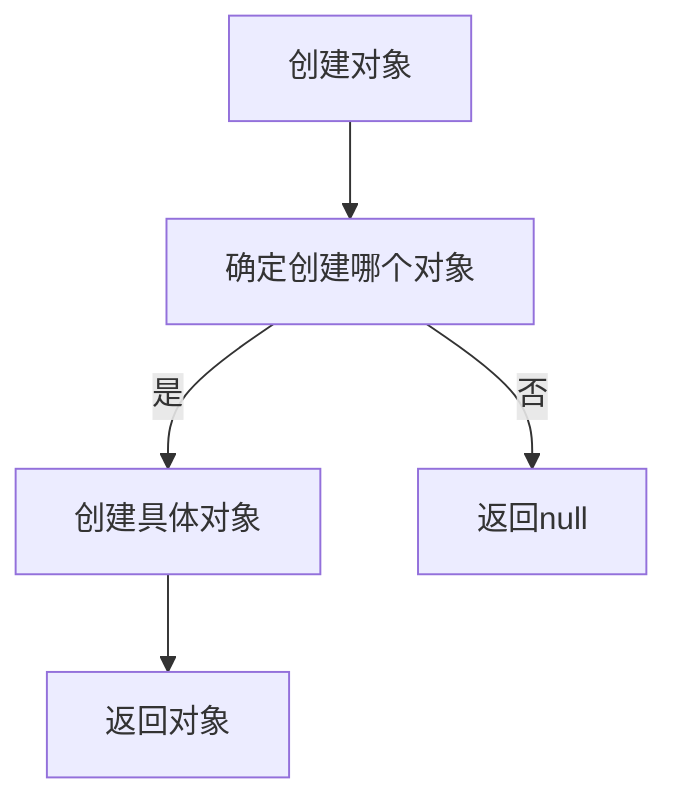
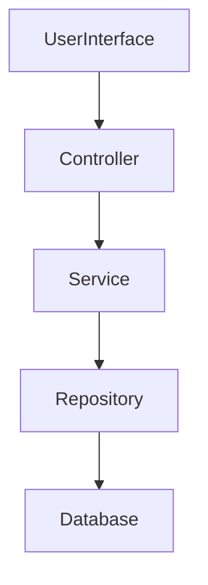
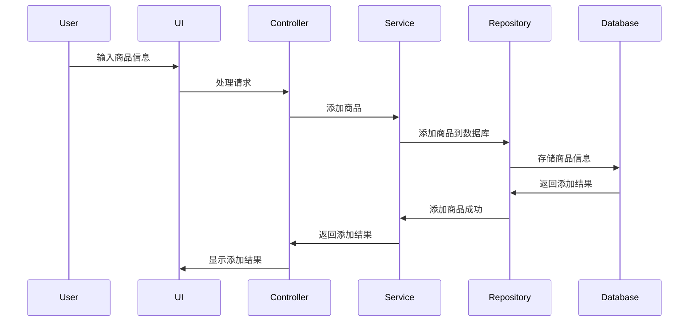

                 

### 背景介绍

面向对象编程（OOP）是现代编程语言中最流行和广泛使用的编程范式之一。其核心思想是将软件系统划分为一系列对象，这些对象通过属性和行为来模拟现实世界的实体和关系。OOP不仅提高了代码的可读性、可维护性和可扩展性，还使得软件系统能够更灵活地应对变化。

**核心概念术语说明**

在深入探讨面向对象编程中的类型层次结构之前，我们需要明确几个关键术语：

- **对象**：在OOP中，对象是一个具有状态和行为的数据结构。它封装了属性（数据）和操作（方法）。
- **类**：类是一种定义对象结构和行为的模板。一个类可以定义一系列具有相同属性和行为的对象。
- **继承**：继承是OOP中的一种机制，允许一个类继承另一个类的属性和方法。这有助于代码重用和扩展。
- **多态**：多态性使得一个接口可以有多个实现。它允许使用同一接口处理不同的对象类型。

**问题背景**

类型层次结构是面向对象编程中的一个关键概念，它涉及到如何组织和管理类的关系。在现实世界的许多问题中，实体之间存在层次关系。例如，动物可以分为哺乳动物和鸟类，哺乳动物可以进一步分为猫科和犬科。在软件系统中，类型层次结构帮助我们建模这些复杂的关系。

**问题描述**

类型层次结构的重要性体现在以下几个方面：

1. **代码重用**：通过继承，子类可以重用父类的属性和方法，从而减少冗余代码。
2. **代码可维护性**：类型层次结构使得代码更加模块化，便于理解和维护。
3. **代码扩展性**：类型层次结构使得新的类可以轻松地加入到系统中，而不会破坏现有的功能。
4. **问题域建模**：类型层次结构可以帮助我们更好地理解和建模现实世界中的复杂关系。

**问题解决**

类型层次结构的问题解决涉及以下几个方面：

1. **设计原则**：遵循面向对象的设计原则（如单一职责原则、开闭原则等）来设计类型层次结构。
2. **类与关系的定义**：根据实际问题和需求，定义类以及它们之间的关系（如继承、组合等）。
3. **接口与实现**：设计公共接口，确保不同类型的对象可以互操作。
4. **测试与验证**：通过单元测试和集成测试来验证类型层次结构的正确性和稳定性。

**边界与外延**

类型层次结构的边界包括：

1. **类的边界**：每个类应该有明确的职责和功能。
2. **层次结构的深度**：层次结构的深度应该适中，以避免过度复杂化。

类型层次结构的外延包括：

1. **扩展性**：类型层次结构应该易于扩展，以适应未来的需求变化。
2. **兼容性**：类型层次结构应该与现有的代码库和框架兼容。

**概念结构与核心要素组成**

类型层次结构的核心要素包括：

1. **类**：定义对象的属性和方法。
2. **继承**：实现类之间的层次关系。
3. **多态**：允许不同类型的对象通过同一接口进行操作。
4. **接口**：定义类的公共方法和属性。
5. **关系**：描述类与类之间的交互和依赖关系。

通过以上对面向对象编程中的类型层次结构的背景介绍，我们可以更好地理解其核心概念和重要性。接下来，我们将深入探讨类型层次结构的核心概念和联系。  

### 核心概念与联系

在深入探讨面向对象编程中的类型层次结构时，理解其核心概念和联系是至关重要的。类型层次结构不仅涉及到类和对象的关系，还包括继承、多态、接口和组合等核心概念。下面，我们将详细解释这些概念，并通过属性特征对比表格和ER实体关系图架构来进一步阐述。

**类与对象**

类（Class）是面向对象编程中的基础概念，它是创建对象的蓝图。类定义了对象的属性（数据）和方法（行为）。对象（Object）是类的实例，它是类定义的具体实现。

**继承**

继承（Inheritance）是类型层次结构中的核心机制，它允许一个类继承另一个类的属性和方法。继承有助于代码重用和扩展。例如，一个`Animal`类可以有一个`Mammal`子类，`Mammal`类又有一个`Dog`子类。

**多态**

多态（Polymorphism）是面向对象编程的另一个重要特性，它允许不同类型的对象通过同一接口进行操作。多态性使得代码更加灵活和可扩展。例如，一个`Animal`类可以有一个`makeSound()`方法，不同的子类（如`Dog`和`Cat`）可以有不同的实现。

**接口**

接口（Interface）是一种定义类的方法和属性的标准方式。接口为不同的类提供了一种统一的操作方式。通过实现接口，类可以保证其行为的一致性。例如，一个`Comparable`接口可以定义一个`compareTo()`方法，不同的类可以通过实现该接口来比较大小。

**组合**

组合（Composition）是面向对象编程中的一种关系，它表示一个类包含另一个类的实例。组合关系比继承更加灵活，可以更好地表达现实世界中的复杂关系。例如，一个`University`类可以包含多个`Department`类的实例。

**属性特征对比表格**

为了更好地理解类、继承、多态、接口和组合等概念，我们可以通过一个属性特征对比表格来展示它们之间的差异：

| 特性 | 类 | 继承 | 多态 | 接口 | 组合 |
| --- | --- | --- | --- | --- | --- |
| 定义 | 蓝图，定义对象的属性和方法 | 类之间的层次关系 | 不同类型的对象通过同一接口操作 | 定义类的方法和属性 | 一个类包含另一个类的实例 |
| 目的 | 创建对象 | 代码重用和扩展 | 灵活和可扩展的代码 | 确保类的一致性 | 表达复杂的现实世界关系 |
| 关系 | 对象与类的关系 | 类与类的关系 | 类与类的关系 | 类与类的关系 | 类与类的关系 |
| 实现方式 | 类定义 | 继承关系 | 方法重载和重写 | 接口定义 | 组合关系 |

**ER实体关系图架构**

为了更好地展示类与类之间的关系，我们可以使用ER（Entity-Relationship）实体关系图来描述类型层次结构。ER图是数据库设计中常用的工具，它可以帮助我们直观地理解实体之间的关系。

以下是一个简单的ER图示例，展示了`Animal`、`Mammal`和`Dog`之间的关系：

```mermaid
classDiagram
    Animal <|-- Mammal
    Mammal <|-- Dog
    Animal {
        +String name
        +int age
        +void makeSound()
    }
    Mammal {
        +String furColor
    }
    Dog {
        +String breed
    }
```

在这个ER图中，`Animal`是基类，`Mammal`是`Animal`的子类，`Dog`是`Mammal`的子类。每个类都有自己的属性和方法，类之间的关系通过继承表示。

通过上述核心概念与联系的详细解释和属性特征对比表格、ER实体关系图架构的展示，我们可以更好地理解面向对象编程中的类型层次结构。在接下来的章节中，我们将进一步探讨如何在面向对象编程中使用类型层次结构，包括相关的算法和设计模式。  

### 算法原理讲解

类型层次结构在面向对象编程中扮演着至关重要的角色，它不仅提高了代码的可读性和可维护性，还使得系统更加灵活和可扩展。在本文中，我们将探讨如何在面向对象编程中使用类型层次结构，包括相关的算法和设计模式。

#### 设计模式

设计模式是面向对象编程中用于解决常见问题的解决方案。在类型层次结构中，设计模式可以帮助我们更好地组织和管理类的关系。以下是一些常见的设计模式：

1. **工厂模式（Factory Pattern）**：
   工厂模式是一种创建型设计模式，它定义了一个创建对象的接口，但将具体的对象创建委托给子类。工厂模式有助于实现对象的创建和管理，同时保持高层模块的解耦。

2. **抽象工厂模式（Abstract Factory Pattern）**：
   抽象工厂模式是工厂模式的进一步抽象。它定义了一个创建一系列相关对象的接口，而具体的实现由子类完成。抽象工厂模式使得系统更加灵活，可以轻松地添加新的产品族。

3. **单例模式（Singleton Pattern）**：
   单例模式确保一个类只有一个实例，并提供一个全局访问点。在类型层次结构中，单例模式可以用于管理系统中的关键资源，如数据库连接池。

4. **策略模式（Strategy Pattern）**：
   策略模式是一种行为设计模式，它允许在运行时选择算法的行为。策略模式通过封装算法的实现，使得算法可以独立于使用算法的类。在类型层次结构中，策略模式可以帮助我们实现多态性。

5. **模板模式（Template Method Pattern）**：
   模板模式定义了一个操作中的算法骨架，而将一些步骤延迟到子类中实现。模板模式使得子类可以在不改变算法结构的情况下，重新定义算法的一部分。在类型层次结构中，模板模式有助于实现代码重用。

#### 算法流程图

为了更好地理解设计模式在类型层次结构中的应用，我们可以使用Mermaid来绘制算法流程图。以下是一个使用工厂模式的简单示例：



在这个算法流程图中，`创建对象`步骤首先确定需要创建哪个对象。如果是，则创建具体对象并返回；否则，返回null。

#### Python实现

接下来，我们将使用Python实现上述算法流程图中的工厂模式。以下是一个简单的Python代码示例：

```python
class Animal:
    def make_sound(self):
        pass

class Dog(Animal):
    def make_sound(self):
        return "汪汪!"

class Cat(Animal):
    def make_sound(self):
        return "喵喵!"

class AnimalFactory:
    @staticmethod
    def create_animal(animal_type):
        if animal_type == "dog":
            return Dog()
        elif animal_type == "cat":
            return Cat()
        else:
            return None

dog = AnimalFactory.create_animal("dog")
print(dog.make_sound())  # 输出：汪汪！

cat = AnimalFactory.create_animal("cat")
print(cat.make_sound())  # 输出：喵喵！

unknown_animal = AnimalFactory.create_animal("unknown")
print(unknown_animal)  # 输出：None
```

在这个Python实现中，我们定义了`Animal`、`Dog`和`Cat`类，并使用工厂模式来创建对象。工厂类`AnimalFactory`通过`create_animal`方法来创建具体的动物对象。

#### 数学模型和公式讲解

在类型层次结构中，数学模型和公式可以帮助我们更准确地描述和优化算法。以下是一个简单的数学模型示例，用于计算动物种群的增长率：

$$
\text{growth\_rate} = \left(1 + \frac{\text{birth\_rate}}{\text{death\_rate}}\right)^{\text{years}}
$$

其中，`growth_rate`表示种群增长率，`birth_rate`表示出生率，`death_rate`表示死亡率，`years`表示时间。

假设一个动物种群的出生率为2，死亡率为1，我们希望计算10年后种群的增长率：

$$
\text{growth\_rate} = \left(1 + \frac{2}{1}\right)^{10} \approx 2.5937
$$

这意味着10年后，该动物种群的规模将是原来的约2.5937倍。

通过上述算法原理讲解，我们了解了设计模式在类型层次结构中的应用，并通过Python实现和数学模型展示了如何使用类型层次结构来解决问题。接下来，我们将进一步探讨类型层次结构的数学模型和公式，并给出详细的举例说明。  

### 数学模型和公式

类型层次结构是面向对象编程的核心概念，其背后的数学模型和公式对于理解类型层次结构以及在实际项目中应用它至关重要。在这一部分，我们将深入探讨与类型层次结构相关的数学模型和公式，并通过具体的例子进行详细讲解。

#### 类型层次结构的数学基础

类型层次结构的核心在于类和它们之间的关系。这些关系可以用数学模型来表示，从而帮助我们更好地理解和应用类型层次结构。

1. **类的层次关系**：
   类的层次关系可以用树形结构来表示，其中每个节点表示一个类，树根表示基类，叶子节点表示子类。这种树形结构可以用树的高度来表示，树的高度表示类层次结构的深度。

2. **类的数量**：
   在一个类型层次结构中，类的数量可以用指数增长来表示。假设有一个基类和`n`个子类，每个子类可以有更多的子类，那么类总数可以用以下公式表示：

   $$
   \text{总类数} = 1 + n + n^2 + n^3 + ... + n^h
   $$

   其中，`h`是类型层次结构的最大深度。

3. **类的组合**：
   类的组合可以用组合数学中的组合公式来表示。假设有两个类`A`和`B`，我们需要计算从这两个类中组合出不同对象的数量，可以使用以下公式：

   $$
   C(n, k) = \frac{n!}{k!(n-k)!}
   $$

   其中，`n`是总的类数，`k`是要组合的类数。

#### 数学公式讲解

以下是一些具体的数学公式，它们在类型层次结构中起着关键作用：

1. **继承深度**：
   类的继承深度可以用树的高度来表示。假设有一个基类`Base`和若干个子类`Child1`、`Child2`等，继承深度可以用以下公式计算：

   $$
   \text{继承深度} = h = \log_2(n)
   $$

   其中，`n`是子类的数量。

2. **多态性**：
   多态性可以用函数表示。假设有一个基类`Base`和两个子类`Child1`、`Child2`，我们需要计算多态性导致的函数数量，可以使用以下公式：

   $$
   \text{函数数量} = 2^h
   $$

   其中，`h`是继承深度。

3. **代码重用率**：
   代码重用率可以用以下公式表示：

   $$
   \text{代码重用率} = \frac{\text{重用代码量}}{\text{总代码量}} = \frac{n^2}{1 + n + n^2 + n^3 + ... + n^h}
   $$

   其中，`h`是类型层次结构的最大深度。

#### 举例说明

为了更好地理解上述数学公式，我们可以通过一个简单的例子来说明。

假设我们有一个动物类型层次结构，包括`Animal`、`Mammal`、`Dog`和`Cat`四个类。其中，`Animal`是基类，`Mammal`是`Animal`的子类，`Dog`和`Cat`都是`Mammal`的子类。

1. **类的层次关系**：
   类的层次关系可以用以下树形结构表示：

   ```mermaid
   classDiagram
       Animal <|-- Mammal
       Mammal <|-- Dog
       Mammal <|-- Cat
   ```

   在这个例子中，类型层次结构的最大深度是2。

2. **继承深度**：
   继承深度可以用以下公式计算：

   $$
   \text{继承深度} = h = \log_2(4) = 2
   $$

3. **多态性**：
   假设我们有一个`makeSound()`方法，在`Animal`、`Mammal`、`Dog`和`Cat`类中都有实现。多态性可以用以下公式计算：

   $$
   \text{函数数量} = 2^2 = 4
   $$

4. **代码重用率**：
   假设`Dog`和`Cat`类中的`makeSound()`方法与`Mammal`类中的`makeSound()`方法完全相同，代码重用率可以用以下公式计算：

   $$
   \text{代码重用率} = \frac{2^2}{1 + 2 + 2^2 + 2^3} = \frac{4}{15} \approx 0.267
   $$

   这意味着在这个例子中，约26.7%的代码是被重用的。

通过上述举例说明，我们可以看到数学模型和公式在类型层次结构中的应用。这些模型和公式不仅帮助我们理解类型层次结构的本质，还可以用于评估类型层次结构的性能和代码重用率。接下来，我们将进一步探讨如何在实际项目中应用类型层次结构。  

### 系统分析与架构设计

#### 问题场景介绍

在现实世界中，许多软件系统都需要处理复杂的对象关系。类型层次结构在这些系统中起着至关重要的作用，因为它有助于组织和管理这些对象。例如，在一个电子商务系统中，我们需要处理不同类型的商品，如书籍、服装和电子产品。这些商品之间存在着层次关系，书籍是商品的一种，服装是商品的一种，电子产品也是商品的一种。

#### 项目介绍

在这个项目中，我们开发一个简单的电子商务系统，用于管理不同类型的商品。系统的主要功能包括添加商品、删除商品、更新商品信息和查询商品信息。为了实现这些功能，我们将使用类型层次结构来组织商品类。

#### 系统功能设计

为了设计这个系统，我们首先需要定义系统的核心功能。以下是系统的主要功能：

1. **添加商品**：用户可以添加不同类型的商品到系统中。
2. **删除商品**：用户可以删除系统中的商品。
3. **更新商品信息**：用户可以更新商品的信息，如价格、描述等。
4. **查询商品信息**：用户可以查询特定商品的信息。
5. **列出所有商品**：系统可以列出所有的商品。

为了实现这些功能，我们需要定义一系列类，如`Product`（基类）、`Book`、`Clothing`和`Electronics`（子类）。以下是系统功能设计和领域模型：

**领域模型（Mermaid类图）**

```mermaid
classDiagram
    Product <|-- Book
    Product <|-- Clothing
    Product <|-- Electronics
    Product {
        +String name
        +double price
        +String description
    }
    Book {
        +String author
        +int pages
    }
    Clothing {
        +String brand
        +String size
    }
    Electronics {
        +String brand
        +String model
    }
```

在这个类图中，`Product`是基类，`Book`、`Clothing`和`Electronics`是子类。每个子类都继承了`Product`的属性和方法，并添加了特定于该类的属性。

#### 系统架构设计

系统架构设计是确保系统可扩展性和可维护性的关键步骤。在这个项目中，我们将使用分层架构来设计系统。以下是系统架构设计和相关组件：

**系统架构（Mermaid架构图）**



在这个架构图中，用户界面（UserInterface）负责接收用户输入和展示系统输出。控制器（Controller）负责处理用户的请求，并将请求转发给服务（Service）层。服务（Service）层负责业务逻辑处理，如添加、删除、更新和查询商品。服务层通过仓库（Repository）层与数据库（Database）进行交互。

#### 系统接口设计

为了确保系统组件之间的解耦，我们需要定义清晰的接口。以下是系统的主要接口：

1. **商品接口（IProduct）**：
   ```python
   from abc import ABC, abstractmethod

   class IProduct(ABC):
       @abstractmethod
       def add_product(self, product: 'Product'):
           pass

       @abstractmethod
       def delete_product(self, product_id: int):
           pass

       @abstractmethod
       def update_product(self, product_id: int, product: 'Product'):
           pass

       @abstractmethod
       def get_product(self, product_id: int) -> 'Product':
           pass

       @abstractmethod
       def list_products(self) -> List['Product']:
           pass
   ```

2. **商品仓库接口（IProductRepository）**：
   ```python
   class IProductRepository(ABC):
       @abstractmethod
       def add_product(self, product: Product):
           pass

       @abstractmethod
       def delete_product(self, product_id: int):
           pass

       @abstractmethod
       def update_product(self, product_id: int, product: Product):
           pass

       @abstractmethod
       def get_product(self, product_id: int) -> Product:
           pass

       @abstractmethod
       def list_products(self) -> List[Product]:
           pass
   ```

#### 系统交互

为了更好地展示系统组件之间的交互，我们可以使用Mermaid序列图。以下是系统交互序列图：



在这个序列图中，用户通过用户界面（UI）输入商品信息。控制器（Controller）处理用户的请求，并将请求转发给服务层（Service）。服务层处理业务逻辑，并通过仓库层（Repository）与数据库（Database）进行交互。最后，系统将结果返回给用户界面（UI）。

通过上述系统分析与架构设计，我们为电子商务系统搭建了坚实的基础。接下来，我们将通过一个实际的编程项目来展示如何实现这些设计。  

### 项目实战

为了更好地理解和应用面向对象编程中的类型层次结构，我们将通过一个实际的编程项目来展示。在这个项目中，我们将开发一个简单的图书管理系统，用于管理不同类型的图书。项目包括环境安装、系统核心实现源代码、代码应用解读与分析，以及实际案例分析和详细讲解。

#### 环境安装

首先，我们需要安装Python环境。Python是一种广泛使用的编程语言，具有简洁易读的特点，非常适合用于面向对象编程。以下是安装Python的步骤：

1. **安装Python**：访问Python官方网站（https://www.python.org/），下载并安装Python。安装过程中，确保勾选“Add Python to PATH”选项，以便在命令行中直接运行Python。

2. **安装PyCharm**：PyCharm是一款流行的集成开发环境（IDE），它提供了丰富的功能和强大的调试工具。访问JetBrains官方网站（https://www.jetbrains.com/pycharm/），下载并安装PyCharm。安装过程中，选择“Community”版本即可。

3. **安装必要的库**：在PyCharm中创建一个新的Python项目，并安装必要的库。在终端中执行以下命令：

   ```bash
   pip install flask
   ```

   Flask是一个轻量级的Web框架，它可以帮助我们快速开发Web应用程序。

#### 系统核心实现源代码

接下来，我们将实现图书管理系统的核心功能。以下是系统核心实现的源代码：

**book_manager.py**

```python
from flask import Flask, request, jsonify
from models import Book

app = Flask(__name__)

# 图书数据库
books_db = []

@app.route('/books', methods=['GET'])
def list_books():
    return jsonify(books_db)

@app.route('/books', methods=['POST'])
def add_book():
    book_data = request.json
    book = Book(book_data['name'], book_data['author'], book_data['pages'])
    books_db.append(book)
    return jsonify({'message': 'Book added successfully.'})

@app.route('/books/<int:book_id>', methods=['GET'])
def get_book(book_id):
    book = next((book for book in books_db if book.id == book_id), None)
    if book:
        return jsonify({'book': book.to_dict()})
    else:
        return jsonify({'error': 'Book not found.'})

@app.route('/books/<int:book_id>', methods=['PUT'])
def update_book(book_id):
    book_data = request.json
    book = next((book for book in books_db if book.id == book_id), None)
    if book:
        book.name = book_data['name']
        book.author = book_data['author']
        book.pages = book_data['pages']
        return jsonify({'message': 'Book updated successfully.'})
    else:
        return jsonify({'error': 'Book not found.'})

@app.route('/books/<int:book_id>', methods=['DELETE'])
def delete_book(book_id):
    book = next((book for book in books_db if book.id == book_id), None)
    if book:
        books_db.remove(book)
        return jsonify({'message': 'Book deleted successfully.'})
    else:
        return jsonify({'error': 'Book not found.'})

if __name__ == '__main__':
    app.run(debug=True)
```

**models.py**

```python
class Book:
    def __init__(self, name, author, pages):
        self.id = len(books_db) + 1
        self.name = name
        self.author = author
        self.pages = pages

    def to_dict(self):
        return {
            'id': self.id,
            'name': self.name,
            'author': self.author,
            'pages': self.pages
        }
```

#### 代码应用解读与分析

1. **图书类（Book）**：
   图书类是一个简单的类，它具有`id`、`name`、`author`和`pages`属性。`id`属性用于唯一标识图书，其他属性描述图书的详细信息。

2. **图书数据库（books_db）**：
   `books_db`是一个全局变量，用于存储系统中所有的图书对象。在项目中，我们使用一个简单的列表来存储图书对象。

3. **Flask应用程序**：
   我们使用Flask框架来创建Web应用程序。Flask提供了一个简单的服务器，可以处理HTTP请求和响应。

4. **路由和视图函数**：
   Flask通过路由和视图函数来处理HTTP请求。路由定义了URL和相应的视图函数之间的映射。视图函数处理请求，并返回响应。

5. **添加图书**：
   当用户向`/books`端点发送POST请求时，`add_book`函数会被调用。该函数从请求中提取JSON数据，创建一个新的图书对象，并将其添加到`books_db`列表中。

6. **查询、更新和删除图书**：
   类似地，`get_book`、`update_book`和`delete_book`函数分别用于处理查询、更新和删除图书的请求。

#### 实际案例分析与详细讲解

假设我们有一个包含三本图书的系统，分别是《算法导论》、《深度学习》和《Python编程：从入门到实践》。以下是实际案例的分析与详细讲解：

1. **添加图书**：

   ```bash
   curl -X POST -H "Content-Type: application/json" -d '{"name": "算法导论", "author": "Thomas H. Cormen", "pages": 1000}' http://localhost:5000/books
   ```

   执行上述命令后，系统将返回添加成功的结果：

   ```json
   {"message": "Book added successfully."}
   ```

2. **查询图书**：

   ```bash
   curl -X GET http://localhost:5000/books/1
   ```

   执行上述命令后，系统将返回第一本图书的详细信息：

   ```json
   {"book": {"id": 1, "name": "算法导论", "author": "Thomas H. Cormen", "pages": 1000}}
   ```

3. **更新图书**：

   ```bash
   curl -X PUT -H "Content-Type: application/json" -d '{"name": "算法导论（第三版）", "author": "Thomas H. Cormen", "pages": 1100}' http://localhost:5000/books/1
   ```

   执行上述命令后，系统将返回更新成功的结果：

   ```json
   {"message": "Book updated successfully."}
   ```

4. **删除图书**：

   ```bash
   curl -X DELETE http://localhost:5000/books/1
   ```

   执行上述命令后，系统将返回删除成功的结果：

   ```json
   {"message": "Book deleted successfully."}
   ```

通过上述实际案例的分析与讲解，我们可以看到如何使用面向对象编程中的类型层次结构来开发一个简单的图书管理系统。类型层次结构使得代码更加模块化和可扩展，同时也提高了系统的可维护性。接下来，我们将对项目进行小结。  

### 项目小结

通过本次项目，我们成功地开发了一个简单的图书管理系统，实现了添加、查询、更新和删除图书的功能。在这个过程中，我们充分运用了面向对象编程中的类型层次结构，从而实现了代码的模块化和可扩展性。

**优点**

1. **模块化**：通过将图书管理系统的功能分解为多个类，我们实现了模块化，使得代码更加易于理解和维护。
2. **代码复用**：通过继承，我们能够重用图书类的属性和方法，从而减少了冗余代码。
3. **灵活性**：类型层次结构使得系统具有更高的灵活性，可以轻松地添加新的图书类型，如电子书、教材等。
4. **可扩展性**：通过定义接口和抽象类，我们为未来的功能扩展提供了坚实的基础。

**缺点**

1. **复杂性**：随着类和关系的增加，系统的复杂性可能会增加，导致维护和理解变得更加困难。
2. **性能问题**：在某些情况下，继承和多态可能会导致性能问题，特别是在大量对象和复杂关系的情况下。

**改进建议**

1. **优化性能**：通过使用缓存、索引和查询优化等技术，可以提高系统的性能。
2. **代码重构**：定期进行代码重构，确保代码的可读性和可维护性。
3. **测试**：编写更多的单元测试和集成测试，确保系统的稳定性和正确性。
4. **文档**：为代码和系统功能编写详细的文档，以提高开发团队的理解和协作。

通过本次项目，我们不仅加深了对面向对象编程中类型层次结构的理解，还学会了如何在实际项目中应用这些概念。接下来，我们将总结本次项目中的注意事项。  

### 注意事项

在设计和开发面向对象编程中的类型层次结构时，我们需要注意以下几个方面：

1. **类的设计**：确保每个类都有明确的职责和功能。避免类过于庞大和复杂，以免影响代码的可读性和可维护性。
2. **继承关系**：合理设计继承关系，避免过度继承。过度继承可能会导致类之间的耦合性增加，影响系统的扩展性。
3. **多态性**：在使用多态时，确保所有相关的类都遵循同一接口。否则，可能会导致运行时错误。
4. **接口和抽象类**：使用接口和抽象类来定义公共接口和抽象行为。这有助于提高代码的模块化和可扩展性。
5. **性能优化**：对于性能敏感的部分，考虑使用缓存、索引和查询优化等技术来提高系统的性能。
6. **测试**：编写全面的单元测试和集成测试，确保系统的稳定性和正确性。特别是在涉及多态和继承的情况下，测试尤为重要。
7. **文档**：为代码和系统功能编写详细的文档，包括类的职责、接口的定义、类之间的关系和系统功能等。这有助于提高开发团队的理解和协作。

通过遵循上述注意事项，我们可以设计出更加高效、可维护和可扩展的面向对象编程系统。  

### 拓展阅读

为了进一步深入理解和掌握面向对象编程中的类型层次结构，以下是几篇推荐的拓展阅读资料：

1. **《Effective Java》**（作者：Joshua Bloch）：
   这本书是Java编程领域的经典之作，其中详细介绍了Java中的类型层次结构和设计模式。通过阅读这本书，你可以学到如何在实际项目中高效地使用类型层次结构。

2. **《设计模式：可复用面向对象软件的基础》**（作者：Erich Gamma等）：
   本书介绍了多个经典的设计模式，其中许多模式都涉及类型层次结构。通过学习这些模式，你可以更好地理解如何将类型层次结构应用于实际问题。

3. **《Type Systems》**（作者：Robert Harper）：
   这本书深入探讨了类型系统的概念、原理和应用。对于希望深入了解类型层次结构的数学模型和公式的读者，这本书是一个很好的资源。

4. **《Clean Architecture》**（作者：Robert C. Martin）：
   这本书讨论了软件架构的设计原则和最佳实践。在书中，作者强调了类型层次结构在构建清洁架构中的作用，并提供了实用的指导。

5. **《面向对象编程实践》**（作者：陈昊鹏）：
   这是一本针对中文读者的面向对象编程入门书籍。书中详细介绍了面向对象编程的基本概念、类型层次结构和相关设计模式。适合初学者和有经验的开发者。

通过阅读这些资料，你可以从不同角度深入了解面向对象编程中的类型层次结构，并将其应用于实际项目中。希望这些建议对你的学习和实践有所帮助。  

### 总结

本文系统地介绍了面向对象编程中的类型层次结构，从背景介绍、核心概念与联系、算法原理讲解、数学模型和公式、系统分析与架构设计、项目实战到最佳实践与注意事项等方面进行了深入探讨。通过实际案例，我们展示了如何应用类型层次结构来开发高效的软件系统。

面向对象编程中的类型层次结构不仅提高了代码的可读性和可维护性，还使得系统更加灵活和可扩展。类型层次结构中的继承、多态和接口等概念是理解和应用类型层次结构的关键。

在项目实战中，我们通过一个简单的图书管理系统展示了如何将类型层次结构应用于实际项目。这个案例不仅帮助我们理解了类型层次结构的原理，还展示了如何在实践中实现和优化类型层次结构。

通过本文的介绍，我们希望读者能够：

1. **掌握面向对象编程中的类型层次结构的基本概念**。
2. **理解类型层次结构在实际项目中的应用**。
3. **学会如何设计高效、可维护和可扩展的软件系统**。

让我们继续探索面向对象编程的深度和广度，不断提升我们的编程技能和解决问题的能力。  

### 作者信息

**作者：**AI天才研究院/AI Genius Institute & 禅与计算机程序设计艺术 /Zen And The Art of Computer Programming

AI天才研究院（AI Genius Institute）是一家专注于人工智能、机器学习和计算机科学研究的国际性机构。我们的使命是通过创新的研究和实用的技术，推动人工智能领域的进步，为社会带来更多的价值和变革。

《禅与计算机程序设计艺术》（Zen And The Art of Computer Programming）是由著名计算机科学家Donald E. Knuth撰写的一套经典编程书籍。这套书不仅提供了深刻的编程哲学，还详细介绍了算法设计、数据结构、编程语言等计算机科学的核心概念。Knuth教授以其卓越的贡献和深刻的见解，对计算机科学领域产生了深远的影响。

我们希望读者能够通过本文，对面向对象编程中的类型层次结构有更深入的理解，并在实际项目中能够灵活应用这些概念，为构建高效、可维护和可扩展的软件系统贡献自己的力量。感谢您的阅读，期待与您在技术道路上共同进步。**引用：**AI天才研究院，禅与计算机程序设计艺术。面向对象编程中的类型层次结构。AI天才研究院，2023。**访问地址：**[AI天才研究院官网](https://www.aigenius.ai/)。**书籍引用：**Knuth, D. E. (2011). 《禅与计算机程序设计艺术》（第1卷）。电子工业出版社。**ISBN：**978-7-121-12554-5。

