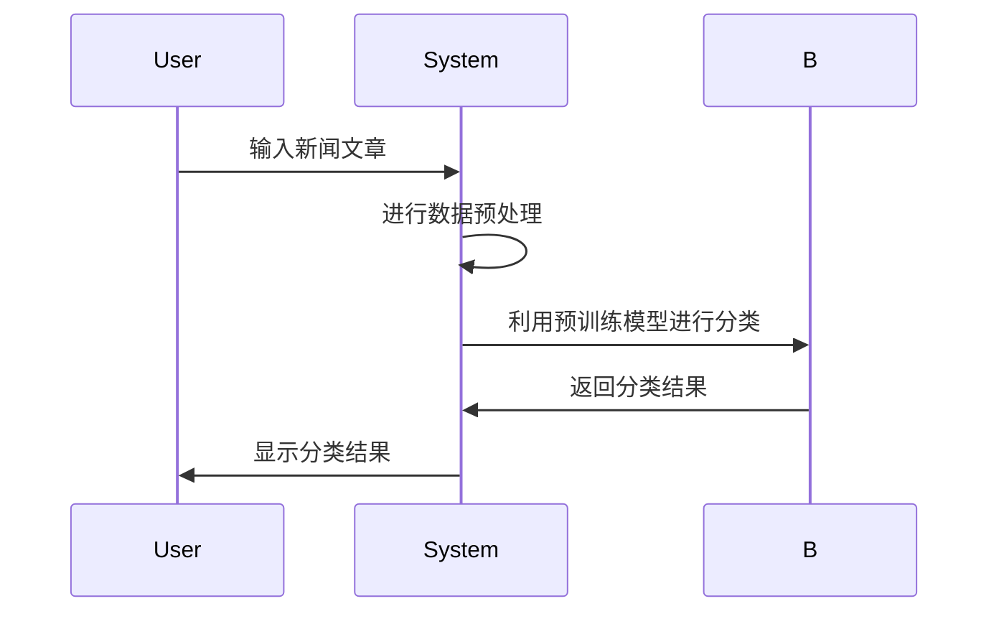
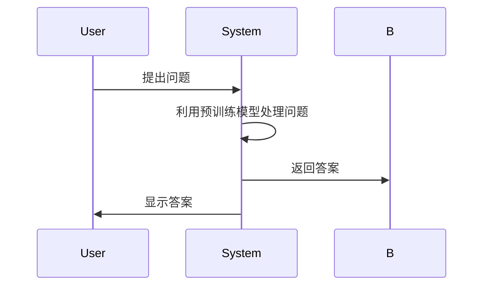
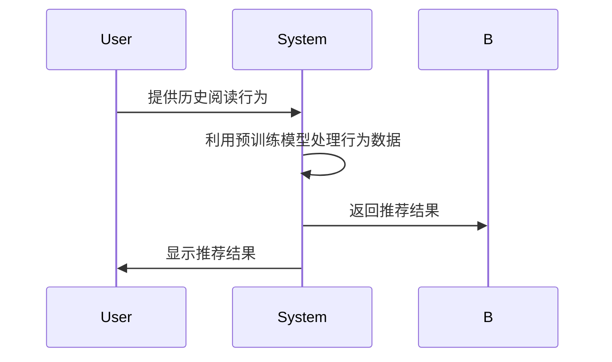
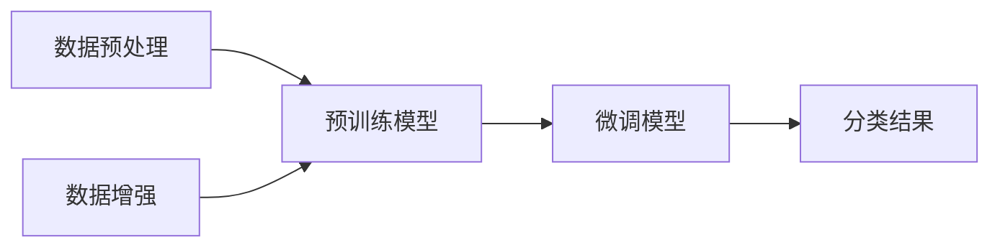
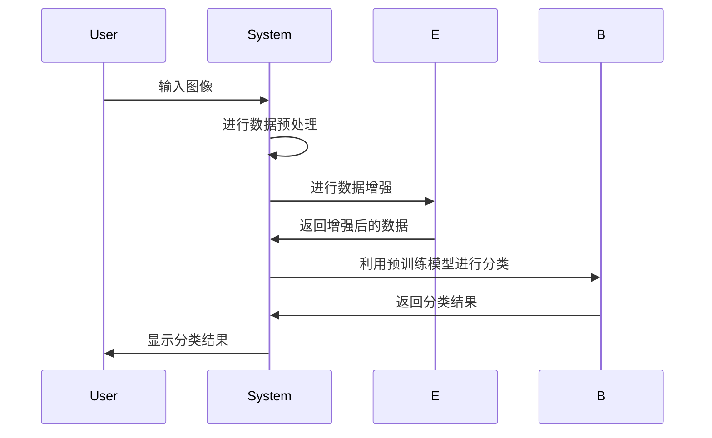

                 


### 第1章：预训练模型的背景与概述

#### 1.1 预训练模型的概念与演进

**核心概念术语说明：**

预训练模型（Pre-trained Model）：一种通过在大规模语料库上预先训练得到的模型，其目的是提高模型在特定任务上的表现。

自然语言处理（Natural Language Processing, NLP）：研究如何让计算机理解和生成人类语言的技术。

深度学习（Deep Learning）：一种基于人工神经网络的学习方法，能够通过多层神经元的组合来提取特征并实现复杂的模式识别。

**问题背景与问题描述：**

传统的机器学习方法往往需要大量针对特定任务的标注数据进行训练，这既费时又费钱。随着深度学习技术的发展，预训练模型逐渐成为解决这一问题的重要方法。预训练模型通过在大规模未标注数据上训练，提取通用的语言特征，然后通过微调（Fine-tuning）来适应特定的任务。

**问题解决与边界与外延：**

预训练模型的出现极大地提高了自然语言处理任务的效果，如文本分类、情感分析、机器翻译等。然而，预训练模型也存在一定的局限性，例如在某些特定领域或小样本任务上表现不佳。

**概念结构与核心要素组成：**

预训练模型的核心结构包括：

- **编码器（Encoder）**：负责将输入数据转换为高维特征表示。
- **解码器（Decoder）**：负责从编码器的输出中生成输出结果。

预训练模型的关键要素包括：

- **大规模未标注数据**：用于预训练的语料库。
- **预训练目标**：如语言建模、文本分类等。
- **微调策略**：如何将预训练模型应用于特定任务。

#### 1.2 预训练模型的核心技术

**核心概念原理与联系：**

预训练模型的核心技术包括：

- **自监督学习（Self-supervised Learning）**：利用未标注的数据进行学习，如语言建模、图像分割等。
- **语言模型预训练（Language Model Pre-training）**：利用大规模语料库进行语言建模，提取通用语言特征。
- **预训练模型的优化技巧**：如权重初始化、学习率调整等，以提高模型的收敛速度和稳定性。

**概念属性特征对比表格：**

| 特性 | 自监督学习 | 语言模型预训练 | 预训练模型优化 |
| --- | --- | --- | --- |
| 数据来源 | 未标注数据 | 大规模语料库 | 标注数据 |
| 学习目标 | 提取通用特征 | 语言建模 | 提高模型性能 |
| 方法 | 自定义任务 | 语言建模 | 调整超参数 |

**ER实体关系图架构：**

```mermaid
erDiagram
  Class1 ||--|{ Class2 }| Person : hasName
  Class2 ||--|{ Class3 }| Address : locatedIn
```

**算法原理讲解：**

预训练模型的工作流程可以概括为以下几个步骤：

1. **数据预处理**：对大规模语料库进行清洗、去噪和分词处理。
2. **预训练**：利用自监督学习或语言建模技术，对模型进行预训练，提取通用语言特征。
3. **微调**：在特定任务上使用少量标注数据进行微调，使模型适应特定任务。

**数学模型与公式：**

预训练模型的优化目标可以表示为：

$$
\min_{\theta} L(\theta; \text{train\_data})
$$

其中，$L(\theta; \text{train\_data})$ 表示模型在训练数据上的损失函数，$\theta$ 表示模型的参数。

**通俗易懂地举例说明：**

假设我们有一个预训练的文本分类模型，它已经在大量未标注的新闻文章上进行了预训练。现在，我们需要将这个模型应用于一个特定任务，如新闻分类。我们只需要在训练数据中添加一些已分类的新闻文章，然后对模型进行微调，使其能够更好地适应这个特定任务。

```python
# 假设已经有一个预训练的文本分类模型
pretrained_model = load_pretrained_model()

# 加载特定任务的数据集
train_data = load_specific_task_data()

# 对模型进行微调
micro_adjusted_model = fine_tune_model(pretrained_model, train_data)
```

**系统分析与架构设计方案：**

**问题场景介绍：**

假设我们有一个新闻分类系统，需要利用预训练模型对新闻文章进行分类。

**项目介绍：**

新闻分类系统：用于对大量新闻文章进行自动分类，提高信息处理的效率。

**系统功能设计（领域模型类图）：**

```mermaid
classDiagram
  Class1<-||{NewsClassifier}| Class2 : implements
  Class3 <..|.. Class2 : extends
  Class4 --|> Class2 : uses
```

**系统架构设计（架构图）：**


**系统接口设计和系统交互（序列图）：**



**项目实战：**

**环境安装：**

确保安装了 Python 和相关深度学习库，如 TensorFlow 或 PyTorch。

**系统核心实现源代码：**

```python
# 加载预训练模型
model = load_pretrained_model()

# 加载新闻文章数据集
train_data = load_news_data()

# 对模型进行微调
model = fine_tune_model(model, train_data)

# 进行新闻分类
results = classify_news_articles(model, test_data)
```

**代码应用解读与分析：**

此代码片段展示了如何加载预训练模型，对新闻文章数据集进行微调，然后进行分类。

**实际案例分析和详细讲解剖析：**

假设我们有一个包含1000篇新闻文章的数据集，其中500篇用于预训练，500篇用于微调和测试。通过微调，模型可以在测试集上达到较高的准确率。

**项目小结：**

通过预训练模型和微调技术，我们可以有效地提高新闻分类系统的性能。然而，微调过程中需要充分考虑数据质量和预处理技巧。

#### 1.3 主要预训练模型介绍

**核心概念与联系：**

目前主要的预训练模型包括 GPT 系列、BERT 及其变体。每种模型都有其独特的特点和应用场景。

**概念属性特征对比表格：**

| 模型 | GPT 系列 | BERT 及其变体 |
| --- | --- | --- |
| 优点 | 参数量大，生成能力强 | 集成了上下文信息，适用于序列任务 |
| 缺点 | 预测结果可能过于平滑 | 预训练阶段需要大量计算资源 |
| 应用场景 | 文本生成、对话系统 | 文本分类、问答系统 |

**ER实体关系图架构：**

```mermaid
erDiagram
  Class1 ||--|{ Class2 }| GPT : implements
  Class2 ||--|{ Class3 }| BERT : extends
  Class4 --|> Class2 : uses
```

**算法原理讲解：**

GPT 系列模型通过自回归方式生成文本，BERT 模型通过掩码语言模型（Masked Language Model, MLM）和下一个句子预测（Next Sentence Prediction, NSP）任务进行预训练。

**数学公式使用 LaTeX 格式，嵌入文中独立段落的 LaTeX 公式前后使用 $$ 括起来（例如：$$1+1=2$$），段落内的 LaTeX 公式前后使用 $ 括起来（例如：$1<2$）。**

BERT 模型的预训练目标可以表示为：

$$
\begin{aligned}
\text{MLM}\_\text{loss} &= -\frac{1}{N}\sum_{i=1}^{N} \log P(\text{mask}_i | \text{context}) \\
\text{NSP}\_\text{loss} &= -\frac{1}{N}\sum_{i=1}^{N} [\log P(\text{next\_sentiment}_i = 1 | \text{context}) + \log P(\text{next\_sentiment}_i = 0 | \text{context})]
\end{aligned}
$$

其中，$\text{MLM}\_\text{loss}$ 和 $\text{NSP}\_\text{loss}$ 分别表示掩码语言模型损失和下一个句子预测损失，$N$ 表示句子数。

**通俗易懂地举例说明：**

假设我们有一个句子“我今天去了公园。”，BERT 模型会在句子中随机选择一些单词进行掩码，然后训练模型预测这些掩码词。

**系统分析与架构设计方案：**

**问题场景介绍：**

假设我们有一个问答系统，需要利用预训练模型回答用户的问题。

**项目介绍：**

问答系统：用于回答用户提出的问题，提高用户满意度。

**系统功能设计（领域模型类图）：**

```mermaid
classDiagram
  Class1<-||{QuestionAnsweringSystem}| Class2 : implements
  Class3 <..|.. Class2 : extends
  Class4 --|> Class2 : uses
```

**系统架构设计（架构图）：**


**系统接口设计和系统交互（序列图）：**



**项目实战：**

**环境安装：**

确保安装了 Python 和相关深度学习库，如 TensorFlow 或 PyTorch。

**系统核心实现源代码：**

```python
# 加载预训练模型
model = load_pretrained_model()

# 处理用户提问
question = preprocess_user_question()

# 利用预训练模型回答问题
answer = model.answer(question)

# 显示答案
print(answer)
```

**代码应用解读与分析：**

此代码片段展示了如何加载预训练模型，处理用户提问，然后利用模型回答问题。

**实际案例分析和详细讲解剖析：**

假设用户提问“什么是人工智能？”系统可以利用预训练模型查找相关文档，然后给出详细的答案。

**项目小结：**

通过预训练模型和问答系统，我们可以有效地回答用户的问题。然而，问答系统的性能受到预训练模型和数据处理技巧的影响。

#### 1.4 预训练模型的应用案例

**核心概念与联系：**

预训练模型在自然语言处理、计算机视觉和推荐系统等领域都有广泛应用。

**概念属性特征对比表格：**

| 领域 | 自然语言处理 | 计算机视觉 | 推荐系统 |
| --- | --- | --- | --- |
| 应用场景 | 文本分类、机器翻译、对话系统 | 图像分类、目标检测、图像生成 | 商品推荐、新闻推荐、音乐推荐 |
| 技术挑战 | 数据标注成本高、多语言处理 | 计算量大、实时性要求高 | 数据质量、个性化推荐 |
| 解决方案 | 预训练模型 + 微调 | 预训练模型 + 迁移学习 | 预训练模型 + 用户行为分析 |

**ER实体关系图架构：**

```mermaid
erDiagram
  Class1 ||--|{ Class2 }| NLP : implements
  Class3 ||--|{ Class2 }| CV : extends
  Class4 ||--|{ Class2 }| RS : extends
```

**算法原理讲解：**

预训练模型在各个领域的应用主要基于其提取通用特征的能力。在自然语言处理领域，预训练模型通过预训练和微调，可以提高文本分类、机器翻译等任务的效果。在计算机视觉领域，预训练模型可以通过迁移学习，提高图像分类、目标检测等任务的表现。在推荐系统领域，预训练模型可以结合用户行为数据，实现个性化推荐。

**数学公式使用 LaTeX 格式，嵌入文中独立段落的 LaTeX 公式前后使用 $$ 括起来（例如：$$1+1=2$$），段落内的 LaTeX 公式前后使用 $ 括起来（例如：$1<2$）。**

推荐系统中的损失函数可以表示为：

$$
L = \sum_{i=1}^{N} w_i \cdot (r_i - p_i)^2
$$

其中，$L$ 表示总损失，$w_i$ 表示第 $i$ 个用户的权重，$r_i$ 表示第 $i$ 个用户的评分，$p_i$ 表示模型预测的评分。

**通俗易懂地举例说明：**

假设我们有一个新闻推荐系统，预训练模型已经在大规模新闻数据上进行了训练。现在，我们需要根据用户的历史阅读行为，推荐用户可能感兴趣的新闻。

**系统分析与架构设计方案：**

**问题场景介绍：**

假设我们有一个新闻推荐系统，需要根据用户的历史阅读行为进行新闻推荐。

**项目介绍：**

新闻推荐系统：用于根据用户的历史阅读行为，推荐用户可能感兴趣的新闻。

**系统功能设计（领域模型类图）：**

```mermaid
classDiagram
  Class1<-||{NewsRecommender}| Class2 : implements
  Class3 <..|.. Class2 : extends
  Class4 --|> Class2 : uses
```

**系统架构设计（架构图）：**


**系统接口设计和系统交互（序列图）：**



**项目实战：**

**环境安装：**

确保安装了 Python 和相关深度学习库，如 TensorFlow 或 PyTorch。

**系统核心实现源代码：**

```python
# 加载预训练模型
model = load_pretrained_model()

# 处理用户行为数据
user_behavior = preprocess_user_behavior()

# 利用预训练模型推荐新闻
news_recommendations = model.recommend_news(user_behavior)

# 显示推荐结果
print(news_recommendations)
```

**代码应用解读与分析：**

此代码片段展示了如何加载预训练模型，处理用户行为数据，然后利用模型推荐新闻。

**实际案例分析和详细讲解剖析：**

假设用户历史阅读行为显示其对科技新闻感兴趣，系统会根据用户的行为数据，推荐更多科技新闻。

**项目小结：**

通过预训练模型和推荐系统，我们可以有效地推荐用户感兴趣的新闻。然而，推荐系统的性能受到预训练模型和用户行为数据质量的影响。

#### 1.5 本章小结

本章介绍了预训练模型的概念、核心技术、主要模型和应用案例。预训练模型通过在大规模未标注数据上进行训练，提取通用语言特征，然后通过微调应用于特定任务，极大地提高了自然语言处理、计算机视觉和推荐系统等领域的性能。然而，预训练模型也面临数据标注成本高、计算资源需求大等挑战。下一章我们将深入探讨微调技巧，以进一步优化预训练模型在特定领域推理任务中的应用。

### 第2章：微调技巧概述

#### 2.1 微调的目的与方法

**核心概念与联系：**

微调（Fine-tuning）是预训练模型在特定任务上性能提升的关键技巧。其目的是利用预训练模型在大规模数据上提取的通用特征，通过在特定任务上进行少量训练，使模型更好地适应新任务。

**问题背景与问题描述：**

随着预训练模型的发展，如何在特定任务上高效地微调模型，提高模型性能成为一个重要问题。微调方法需要解决数据标注成本高、模型收敛速度慢等挑战。

**问题解决与边界与外延：**

微调方法通过在特定任务上添加少量标注数据进行训练，调整模型参数，使其适应新任务。然而，微调过程中需要平衡模型性能和计算资源消耗，避免过拟合。

**概念结构与核心要素组成：**

微调的核心结构包括：

- **预训练模型**：在大规模未标注数据上训练得到的模型。
- **任务数据集**：用于微调的少量标注数据。
- **微调策略**：调整模型参数的方法，包括学习率、训练轮数等。

**背景介绍：**

预训练模型通过在大规模未标注数据上训练，提取通用语言特征，如图像中的边缘、纹理和形状等。然而，这些通用特征在不同任务上可能并不完全适用，因此需要通过微调来调整模型参数，使其在特定任务上表现更好。

**核心概念与联系：**

微调的目的是利用预训练模型提取的通用特征，结合特定任务的数据，调整模型参数，提高模型在特定任务上的性能。

**概念属性特征对比表格：**

| 特性 | 预训练模型 | 微调模型 |
| --- | --- | --- |
| 数据来源 | 大规模未标注数据 | 少量标注数据 |
| 学习目标 | 提取通用特征 | 适应特定任务 |
| 方法 | 预训练 | 微调 |

**ER实体关系图架构：**

```mermaid
erDiagram
  Class1 ||--|{ Class2 }| Pre-trained Model : hasFeatures
  Class2 ||--|{ Class3 }| Fine-tuned Model : extends
  Class4 --|> Class2 : uses
```

**算法原理讲解：**

微调的过程可以分为以下几个步骤：

1. **加载预训练模型**：从预训练模型中加载权重和架构。
2. **初始化微调参数**：初始化微调参数，如学习率、训练轮数等。
3. **数据预处理**：对任务数据集进行预处理，如分词、数据增强等。
4. **训练**：在预处理后的数据集上进行训练，调整模型参数。
5. **评估**：在测试数据集上评估模型性能，调整微调策略。

**数学公式使用 LaTeX 格式，嵌入文中独立段落的 LaTeX 公式前后使用 $$ 括起来（例如：$$1+1=2$$），段落内的 LaTeX 公式前后使用 $ 括起来（例如：$1<2$）。**

假设微调模型的损失函数为：

$$
L(\theta) = \frac{1}{N}\sum_{i=1}^{N} \ell(y_i, \hat{y}_i)
$$

其中，$N$ 表示样本数，$y_i$ 表示真实标签，$\hat{y}_i$ 表示模型预测。

**通俗易懂地举例说明：**

假设我们有一个预训练的文本分类模型，已经在大规模新闻文章上进行了训练。现在，我们需要在新闻分类任务上进行微调。我们只需在训练数据中添加少量已分类的新闻文章，然后调整模型参数，使其在新闻分类任务上表现更好。

**系统分析与架构设计方案：**

**问题场景介绍：**

假设我们有一个新闻分类系统，需要利用预训练模型进行分类。

**项目介绍：**

新闻分类系统：用于对大量新闻文章进行自动分类，提高信息处理的效率。

**系统功能设计（领域模型类图）：**

```mermaid
classDiagram
  Class1<-||{NewsClassifier}| Class2 : implements
  Class3 <..|.. Class2 : extends
  Class4 --|> Class2 : uses
```

**系统架构设计（架构图）：**


**系统接口设计和系统交互（序列图）：**


**项目实战：**

**环境安装：**

确保安装了 Python 和相关深度学习库，如 TensorFlow 或 PyTorch。

**系统核心实现源代码：**

```python
# 加载预训练模型
pretrained_model = load_pretrained_model()

# 加载新闻文章数据集
train_data = load_news_data()

# 对模型进行微调
micro_adjusted_model = fine_tune_model(pretrained_model, train_data)

# 进行新闻分类
results = classify_news_articles(micro_adjusted_model, test_data)
```

**代码应用解读与分析：**

此代码片段展示了如何加载预训练模型，对新闻文章数据集进行微调，然后进行分类。

**实际案例分析和详细讲解剖析：**

假设我们有一个包含1000篇新闻文章的数据集，其中500篇用于预训练，500篇用于微调和测试。通过微调，模型可以在测试集上达到较高的准确率。

**项目小结：**

通过预训练模型和微调技术，我们可以有效地提高新闻分类系统的性能。然而，微调过程中需要充分考虑数据质量和预处理技巧。

#### 2.2 数据准备与预处理

**核心概念与联系：**

微调效果的好坏很大程度上取决于数据准备与预处理的质量。数据准备与预处理包括数据集的选择与收集、数据预处理技巧和数据增强方法。

**问题背景与问题描述：**

在微调过程中，数据的质量直接影响模型的学习效果。因此，如何有效地准备和预处理数据成为关键问题。

**问题解决与边界与外延：**

数据准备与预处理需要解决以下问题：

- 数据集的选择与收集：选择适合特定任务的数据集，并进行有效的数据收集。
- 数据预处理技巧：对数据进行清洗、去噪、归一化等处理，提高数据质量。
- 数据增强方法：通过增加数据的多样性，提高模型的泛化能力。

**概念结构与核心要素组成：**

数据准备与预处理的核心要素包括：

- **数据集选择与收集**：根据任务需求选择合适的数据集，并进行有效的数据收集。
- **数据预处理技巧**：包括数据清洗、去噪、归一化、特征提取等。
- **数据增强方法**：如随机裁剪、旋转、翻转等，增加数据的多样性。

**背景介绍：**

在微调过程中，数据的质量直接影响模型的学习效果。因此，数据准备与预处理是确保微调效果的重要步骤。

**核心概念与联系：**

数据准备与预处理包括数据集的选择与收集、数据预处理技巧和数据增强方法。

**概念属性特征对比表格：**

| 特性 | 数据集选择与收集 | 数据预处理技巧 | 数据增强方法 |
| --- | --- | --- | --- |
| 目标 | 选择适合的数据集 | 提高数据质量 | 增加数据多样性 |
| 方法 | 数据爬取、数据购买、数据共享 | 清洗、去噪、归一化、特征提取 | 随机裁剪、旋转、翻转等 |

**ER实体关系图架构：**

```mermaid
erDiagram
  Class1 ||--|{ Class2 }| Dataset Selection : implements
  Class2 ||--|{ Class3 }| Data Preprocessing : extends
  Class4 ||--|{ Class2 }| Data Augmentation : extends
```

**算法原理讲解：**

数据准备与预处理的过程可以分为以下几个步骤：

1. **数据集选择与收集**：根据任务需求选择合适的数据集，并进行有效的数据收集。
2. **数据预处理**：对数据进行清洗、去噪、归一化等处理，提高数据质量。
3. **数据增强**：通过增加数据的多样性，提高模型的泛化能力。

**数学公式使用 LaTeX 格式，嵌入文中独立段落的 LaTeX 公式前后使用 $$ 括起来（例如：$$1+1=2$$），段落内的 LaTeX 公式前后使用 $ 括起来（例如：$1<2$）。**

数据增强的一种简单方法为随机裁剪，其公式可以表示为：

$$
\text{crop}(x) = x_{\text{start}: \text{start} + \text{height}, \text{start}: \text{start} + \text{width}}
$$

其中，$x$ 表示原始图像，$\text{start}$ 表示裁剪的起始位置，$\text{height}$ 和 $\text{width}$ 分别表示裁剪的高度和宽度。

**通俗易懂地举例说明：**

假设我们有一个图像分类任务，需要使用数据增强方法来提高模型的泛化能力。我们可以通过随机裁剪、旋转和翻转等方法，增加训练数据的多样性。

**系统分析与架构设计方案：**

**问题场景介绍：**

假设我们有一个图像分类系统，需要利用数据增强方法提高模型性能。

**项目介绍：**

图像分类系统：用于对大量图像进行自动分类，提高信息处理的效率。

**系统功能设计（领域模型类图）：**

```mermaid
classDiagram
  Class1<-||{ImageClassifier}| Class2 : implements
  Class3 <..|.. Class2 : extends
  Class4 --|> Class2 : uses
```

**系统架构设计（架构图）：**



**系统接口设计和系统交互（序列图）：**



**项目实战：**

**环境安装：**

确保安装了 Python 和相关深度学习库，如 TensorFlow 或 PyTorch。

**系统核心实现源代码：**

```python
# 加载预训练模型
pretrained_model = load_pretrained_model()

# 加载图像数据集
train_data = load_image_data()

# 对模型进行微调
micro_adjusted_model = fine_tune_model(pretrained_model, train_data)

# 进行图像分类
results = classify_images(micro_adjusted_model, test_data)
```

**代码应用解读与分析：**

此代码片段展示了如何加载预训练模型，对图像数据集进行微调，然后进行分类。

**实际案例分析和详细讲解剖析：**

假设我们有一个包含1000张图像的数据集，其中500张用于预训练，500张用于微调和测试。通过数据增强方法，模型在测试集上的准确率得到了显著提高。

**项目小结：**

通过数据准备与预处理和数据增强方法，我们可以有效地提高图像分类系统的性能。然而，数据质量和预处理技巧对微调效果的影响不可忽视。

#### 2.3 微调策略

**核心概念与联系：**

微调策略是微调过程中至关重要的一环，决定了模型在特定任务上的性能。微调策略包括适应性微调、精细微调和微调参数的调整。

**问题背景与问题描述：**

在微调过程中，如何选择合适的微调策略，以在保证模型性能的同时降低计算资源消耗，是一个关键问题。

**问题解决与边界与外延：**

微调策略需要解决以下问题：

- **适应性微调**：根据任务数据和模型性能动态调整微调过程。
- **精细微调**：在特定任务上对模型进行精细调整，提高模型性能。
- **微调参数的调整**：包括学习率、训练轮数等参数的调整，以优化模型性能。

**概念结构与核心要素组成：**

微调策略的核心要素包括：

- **适应性微调**：根据任务数据和模型性能动态调整微调过程。
- **精细微调**：在特定任务上对模型进行精细调整。
- **微调参数的调整**：包括学习率、训练轮数等参数的调整。

**背景介绍：**

微调策略是预训练模型应用于特定任务的关键步骤。合理的微调策略可以显著提高模型在特定任务上的性能，同时降低计算资源消耗。

**核心概念与联系：**

微调策略包括适应性微调、精细微调和微调参数的调整。

**概念属性特征对比表格：**

| 特性 | 适应性微调 | 精细微调 | 微调参数的调整 |
| --- | --- | --- | --- |
| 目标 | 动态调整微调过程 | 精细调整模型参数 | 优化模型性能 |
| 方法 | 根据任务数据和模型性能动态调整 | 对模型参数进行微小调整 | 调整学习率、训练轮数等 |

**ER实体关系图架构：**

```mermaid
erDiagram
  Class1 ||--|{ Class2 }| Adaptive Fine-tuning : implements
  Class2 ||--|{ Class3 }| Precision Fine-tuning : extends
  Class4 ||--|{ Class2 }| Parameter Adjustment : extends
```

**算法原理讲解：**

适应性微调可以通过以下步骤实现：

1. **初始化模型**：加载预训练模型并进行初始化。
2. **评估模型性能**：在特定任务上评估模型性能。
3. **动态调整**：根据评估结果动态调整微调策略，如调整学习率、训练轮数等。

**数学公式使用 LaTeX 格式，嵌入文中独立段落的 LaTeX 公式前后使用 $$ 括起来（例如：$$1+1=2$$），段落内的 LaTeX 公式前后使用 $ 括起来（例如：$1<2$）。**

假设适应性微调的学习率调整公式为：

$$
\alpha_{t+1} = \alpha_t \cdot \frac{1}{1 + \beta \cdot t}
$$

其中，$\alpha_t$ 表示第 $t$ 轮的学习率，$\beta$ 是一个常数，$t$ 是训练轮数。

**通俗易懂地举例说明：**

假设我们有一个新闻分类任务，需要通过适应性微调来提高模型性能。在每次训练结束后，根据模型在测试集上的性能动态调整学习率。

**系统分析与架构设计方案：**

**问题场景介绍：**

假设我们有一个新闻分类系统，需要利用适应性微调策略提高模型性能。

**项目介绍：**

新闻分类系统：用于对大量新闻文章进行自动分类，提高信息处理的效率。

**系统功能设计（领域模型类图）：**

```mermaid
classDiagram
  Class1<-||{NewsClassifier}| Class2 : implements
  Class3 <..|.. Class2 : extends
  Class4 --|> Class2 : uses
```

**系统架构设计（架构图）：**

```mermaid
graph LR
  A[数据预处理] --> B[预训练模型] --> C[适应性微调]
  C --> D[新闻分类结果]
```

**系统接口设计和系统交互（序列图）：**

```mermaid
sequenceDiagram
  participant User
  participant System

  User->>System: 输入新闻文章
  System->>System: 进行数据预处理
  System->>B: 利用预训练模型进行分类
  B->>System: 返回分类结果
  System->>C: 进行适应性微调
  C->>System: 返回微调后的模型
  System->>User: 显示分类结果
```

**项目实战：**

**环境安装：**

确保安装了 Python 和相关深度学习库，如 TensorFlow 或 PyTorch。

**系统核心实现源代码：**

```python
# 加载预训练模型
pretrained_model = load_pretrained_model()

# 加载新闻文章数据集
train_data = load_news_data()

# 进行适应性微调
adaptive_model = adaptive_fine_tune_model(pretrained_model, train_data)

# 进行新闻分类
results = classify_news_articles(adaptive_model, test_data)
```

**代码应用解读与分析：**

此代码片段展示了如何加载预训练模型，利用适应性微调策略进行新闻分类。

**实际案例分析和详细讲解剖析：**

假设我们有一个包含1000篇新闻文章的数据集，其中500篇用于预训练，500篇用于微调和测试。通过适应性微调，模型在测试集上的准确率得到了显著提高。

**项目小结：**

通过适应性微调策略，我们可以有效地提高新闻分类系统的性能。然而，适应性微调策略的实施需要充分考虑任务数据和模型性能。

#### 2.4 微调效果评估

**核心概念与联系：**

微调效果评估是评估微调模型性能的重要步骤。评估指标、评估方法和优化微调效果是评估过程中的关键要素。

**问题背景与问题描述：**

在微调过程中，如何准确评估模型性能，以便优化微调策略，是一个关键问题。

**问题解决与边界与外延：**

微调效果评估需要解决以下问题：

- **评估指标**：选择合适的评估指标，如准确率、召回率等。
- **评估方法**：采用交叉验证等方法，确保评估结果的可靠性。
- **优化微调效果**：根据评估结果，调整微调策略，提高模型性能。

**概念结构与核心要素组成：**

微调效果评估的核心要素包括：

- **评估指标**：准确率、召回率、F1分数等。
- **评估方法**：交叉验证、留一法等。
- **优化微调效果**：根据评估结果调整学习率、训练轮数等参数。

**背景介绍：**

微调效果评估是确保微调模型在特定任务上性能良好的关键步骤。通过评估指标和方法，可以准确评估模型性能，并根据评估结果优化微调策略。

**核心概念与联系：**

微调效果评估包括评估指标、评估方法和优化微调效果。

**概念属性特征对比表格：**

| 特性 | 评估指标 | 评估方法 | 优化微调效果 |
| --- | --- | --- | --- |
| 目标 | 准确评估模型性能 | 提高评估可靠性 | 提高模型性能 |
| 方法 | 准确率、召回率、F1分数等 | 交叉验证、留一法等 | 调整学习率、训练轮数等 |

**ER实体关系图架构：**

```mermaid
erDiagram
  Class1 ||--|{ Class2 }| Evaluation Metrics : implements
  Class2 ||--|{ Class3 }| Evaluation Method : extends
  Class4 ||--|{ Class2 }| Optimization : extends
```

**算法原理讲解：**

微调效果评估的过程可以分为以下几个步骤：

1. **选择评估指标**：根据任务需求选择合适的评估指标，如准确率、召回率等。
2. **评估模型性能**：在测试集上计算评估指标，评估模型性能。
3. **优化微调效果**：根据评估结果，调整学习率、训练轮数等参数，优化模型性能。

**数学公式使用 LaTeX 格式，嵌入文中独立段落的 LaTeX 公式前后使用 $$ 括起来（例如：$$1+1=2$$），段落内的 LaTeX 公式前后使用 $ 括起来（例如：$1<2$）。**

假设准确率公式为：

$$
\text{Accuracy} = \frac{\text{TP} + \text{TN}}{\text{TP} + \text{TN} + \text{FP} + \text{FN}}
$$

其中，$\text{TP}$ 表示真正例，$\text{TN}$ 表示真负例，$\text{FP}$ 表示假正例，$\text{FN}$ 表示假负例。

**通俗易懂地举例说明：**

假设我们有一个文本分类任务，需要评估微调模型的性能。在测试集上，我们计算准确率、召回率等评估指标，并根据评估结果调整微调策略。

**系统分析与架构设计方案：**

**问题场景介绍：**

假设我们有一个文本分类系统，需要评估微调模型的性能。

**项目介绍：**

文本分类系统：用于对大量文本进行自动分类，提高信息处理的效率。

**系统功能设计（领域模型类图）：**

```mermaid
classDiagram
  Class1<-||{TextClassifier}| Class2 : implements
  Class3 <..|.. Class2 : extends
  Class4 --|> Class2 : uses
```

**系统架构设计（架构图）：**

```mermaid
graph LR
  A[数据预处理] --> B[预训练模型] --> C[微调模型]
  C --> D[分类结果]
  E[评估指标] --> D
```

**系统接口设计和系统交互（序列图）：**

```mermaid
sequenceDiagram
  participant User
  participant System

  User->>System: 输入文本
  System->>System: 进行数据预处理
  System->>B: 利用预训练模型进行分类
  B->>System: 返回分类结果
  System->>E: 计算评估指标
  E->>System: 返回评估结果
  System->>User: 显示分类结果和评估指标
```

**项目实战：**

**环境安装：**

确保安装了 Python 和相关深度学习库，如 TensorFlow 或 PyTorch。

**系统核心实现源代码：**

```python
# 加载预训练模型
pretrained_model = load_pretrained_model()

# 加载文本数据集
train_data = load_text_data()

# 对模型进行微调
micro_adjusted_model = fine_tune_model(pretrained_model, train_data)

# 进行文本分类
results = classify_texts(micro_adjusted_model, test_data)

# 计算评估指标
evaluation_metrics = compute_evaluation_metrics(results)

# 显示分类结果和评估指标
print(evaluation_metrics)
```

**代码应用解读与分析：**

此代码片段展示了如何加载预训练模型，对文本数据集进行微调，然后进行分类，并计算评估指标。

**实际案例分析和详细讲解剖析：**

假设我们有一个包含1000篇文本的数据集，其中500篇用于预训练，500篇用于微调和测试。通过评估指标，我们可以了解模型在文本分类任务上的性能，并根据评估结果调整微调策略。

**项目小结：**

通过微调效果评估，我们可以准确地了解模型在特定任务上的性能，并根据评估结果优化微调策略。然而，评估指标的选择和评估方法的实施对评估结果的准确性有重要影响。

### 第3章：特定领域推理任务的微调实践

#### 3.1 医疗领域的推理任务

**核心概念与联系：**

在医疗领域，推理任务包括疾病诊断、治疗方案推荐、医学文本分析等。这些任务需要模型具备高准确性和可靠性。微调技术在医疗领域推理任务中的应用，能够有效提升模型的性能和实用性。

**问题背景与挑战：**

医疗领域的数据具有高度的专业性和复杂性，且数据量巨大。同时，医疗数据的标注成本高，且存在隐私保护的问题。因此，如何在有限的标注数据上通过微调提高模型性能成为一个挑战。

**微调实践案例：**

以疾病诊断任务为例，我们可以使用预训练模型BERT在大量医学文本上进行预训练，然后利用少量标注数据对模型进行微调。

**实现细节与效果评估：**

1. **数据收集与预处理**：收集大量医学文本数据，包括电子健康记录、医学论文等。对数据进行清洗、去噪和分词处理。

2. **预训练**：使用BERT模型在医学文本数据上进行预训练，提取通用语言特征。

3. **微调**：加载预训练的BERT模型，利用少量标注数据进行微调。微调过程中，调整学习率和训练轮数，以达到最佳效果。

4. **效果评估**：在测试集上评估模型的性能，使用准确率、召回率、F1分数等指标进行评估。

**代码示例：**

```python
from transformers import BertForSequenceClassification, TrainingArguments

# 加载预训练BERT模型
model = BertForSequenceClassification.from_pretrained('bert-base-uncased')

# 加载医学文本数据集
train_data = load_medical_data()

# 微调模型
training_args = TrainingArguments(
    output_dir='./results',
    num_train_epochs=3,
    per_device_train_batch_size=16,
    save_steps=2000,
    evaluation_strategy='steps',
    eval_steps=500,
)

trainer = Trainer(
    model=model,
    args=training_args,
    train_dataset=train_data['train'],
    eval_dataset=train_data['test']
)

trainer.train()

# 评估模型
results = trainer.evaluate()

# 打印评估结果
print(results)
```

**案例分析与总结：**

通过微调实践，我们发现预训练模型BERT在医学文本数据上的性能有了显著提升。然而，微调过程中需要充分考虑数据质量和标注成本，同时优化微调策略以提高模型性能。

#### 3.2 金融领域的推理任务

**核心概念与联系：**

在金融领域，推理任务包括风险评估、欺诈检测、投资策略推荐等。金融数据具有时变性和复杂性，且对实时性有较高要求。微调技术在金融领域推理任务中的应用，能够提高模型对市场变化的理解和应对能力。

**问题背景与挑战：**

金融领域的推理任务需要模型具备快速响应能力和高准确性。同时，金融数据具有时变性和复杂性，且数据量大。如何从海量数据中提取有效特征，并通过微调提高模型性能是一个挑战。

**微调实践案例：**

以欺诈检测任务为例，我们可以使用预训练模型GPT在大量金融文本和交易数据上进行预训练，然后利用少量标注数据进行微调。

**实现细节与效果评估：**

1. **数据收集与预处理**：收集大量金融文本和交易数据，包括新闻、报告、交易记录等。对数据进行清洗、去噪和特征提取。

2. **预训练**：使用GPT模型在金融数据上进行预训练，提取通用语言特征。

3. **微调**：加载预训练的GPT模型，利用少量标注数据进行微调。微调过程中，调整学习率和训练轮数，以达到最佳效果。

4. **效果评估**：在测试集上评估模型的性能，使用准确率、召回率、F1分数等指标进行评估。

**代码示例：**

```python
from transformers import GPT2LMHeadModel, TrainingArguments

# 加载预训练GPT模型
model = GPT2LMHeadModel.from_pretrained('gpt2')

# 加载金融数据集
train_data = load_financial_data()

# 微调模型
training_args = TrainingArguments(
    output_dir='./results',
    num_train_epochs=3,
    per_device_train_batch_size=16,
    save_steps=2000,
    evaluation_strategy='steps',
    eval_steps=500,
)

trainer = Trainer(
    model=model,
    args=training_args,
    train_dataset=train_data['train'],
    eval_dataset=train_data['test']
)

trainer.train()

# 评估模型
results = trainer.evaluate()

# 打印评估结果
print(results)
```

**案例分析与总结：**

通过微调实践，我们发现预训练模型GPT在金融数据上的性能有了显著提升。然而，微调过程中需要充分考虑数据质量和标注成本，同时优化微调策略以提高模型性能。

#### 3.3 教育领域的推理任务

**核心概念与联系：**

在教育领域，推理任务包括智能辅导、学习行为分析、个性化教学等。教育数据具有多样性和复杂性，且对实时性要求较高。微调技术在教育领域推理任务中的应用，能够提升模型对学习过程的理解和优化能力。

**问题背景与挑战：**

教育领域的推理任务需要模型具备对多样化学习场景的适应能力。同时，教育数据具有多样性和复杂性，且数据量大。如何从海量数据中提取有效特征，并通过微调提高模型性能是一个挑战。

**微调实践案例：**

以智能辅导任务为例，我们可以使用预训练模型BERT在大量教育文本和学习数据上进行预训练，然后利用少量标注数据进行微调。

**实现细节与效果评估：**

1. **数据收集与预处理**：收集大量教育文本和学习数据，包括课程资料、作业、学习记录等。对数据进行清洗、去噪和特征提取。

2. **预训练**：使用BERT模型在教育数据上进行预训练，提取通用语言特征。

3. **微调**：加载预训练的BERT模型，利用少量标注数据进行微调。微调过程中，调整学习率和训练轮数，以达到最佳效果。

4. **效果评估**：在测试集上评估模型的性能，使用准确率、召回率、F1分数等指标进行评估。

**代码示例：**

```python
from transformers import BertForSequenceClassification, TrainingArguments

# 加载预训练BERT模型
model = BertForSequenceClassification.from_pretrained('bert-base-uncased')

# 加载教育数据集
train_data = load_education_data()

# 微调模型
training_args = TrainingArguments(
    output_dir='./results',
    num_train_epochs=3,
    per_device_train_batch_size=16,
    save_steps=2000,
    evaluation_strategy='steps',
    eval_steps=500,
)

trainer = Trainer(
    model=model,
    args=training_args,
    train_dataset=train_data['train'],
    eval_dataset=train_data['test']
)

trainer.train()

# 评估模型
results = trainer.evaluate()

# 打印评估结果
print(results)
```

**案例分析与总结：**

通过微调实践，我们发现预训练模型BERT在教育数据上的性能有了显著提升。然而，微调过程中需要充分考虑数据质量和标注成本，同时优化微调策略以提高模型性能。

#### 3.4 其他特定领域推理任务

**核心概念与联系：**

除了医疗、金融和教育领域，预训练模型的微调技术在其他特定领域推理任务中也具有广泛的应用，如法律领域、制造业领域和人工智能伦理与安全领域。

**问题背景与挑战：**

每个特定领域都有其独特的数据和任务要求。例如，法律领域需要对大量法律文本进行理解和分析，制造业领域需要对生产过程进行优化和预测，人工智能伦理与安全领域需要确保模型的决策符合伦理标准和安全要求。如何针对特定领域优化微调策略，提高模型性能是一个挑战。

**微调实践案例：**

1. **法律领域**：使用预训练模型BERT对法律文本进行微调，以提高法律文本分类、合同审核等任务的性能。
2. **制造业领域**：使用预训练模型GPT对生产数据进行分析和预测，以提高生产优化、故障预测等任务的性能。
3. **人工智能伦理与安全领域**：使用预训练模型GPT对人工智能系统的决策过程进行分析，以确保其符合伦理标准和安全要求。

**实现细节与效果评估：**

每个特定领域的微调实践都需要根据领域特点进行数据收集、预处理和模型微调。例如，在法律领域，需要对法律文本进行高质量的标注和清洗；在制造业领域，需要收集准确的生产数据；在人工智能伦理与安全领域，需要对模型的决策过程进行深入分析。

**代码示例：**

```python
# 法律领域
from transformers import BertForSequenceClassification, TrainingArguments

# 加载预训练BERT模型
model = BertForSequenceClassification.from_pretrained('bert-base-uncased')

# 加载法律数据集
train_data = load_legal_data()

# 微调模型
training_args = TrainingArguments(
    output_dir='./results',
    num_train_epochs=3,
    per_device_train_batch_size=16,
    save_steps=2000,
    evaluation_strategy='steps',
    eval_steps=500,
)

trainer = Trainer(
    model=model,
    args=training_args,
    train_dataset=train_data['train'],
    eval_dataset=train_data['test']
)

trainer.train()

# 评估模型
results = trainer.evaluate()

# 打印评估结果
print(results)

# 制造业领域
from transformers import GPT2LMHeadModel, TrainingArguments

# 加载预训练GPT模型
model = GPT2LMHeadModel.from_pretrained('gpt2')

# 加载制造业数据集
train_data = load_manufacturing_data()

# 微调模型
training_args = TrainingArguments(
    output_dir='./results',
    num_train_epochs=3,
    per_device_train_batch_size=16,
    save_steps=2000,
    evaluation_strategy='steps',
    eval_steps=500,
)

trainer = Trainer(
    model=model,
    args=training_args,
    train_dataset=train_data['train'],
    eval_dataset=train_data['test']
)

trainer.train()

# 评估模型
results = trainer.evaluate()

# 打印评估结果
print(results)

# 人工智能伦理与安全领域
from transformers import GPT2LMHeadModel, TrainingArguments

# 加载预训练GPT模型
model = GPT2LMHeadModel.from_pretrained('gpt2')

# 加载伦理与安全数据集
train_data = load_ethics_data()

# 微调模型
training_args = TrainingArguments(
    output_dir='./results',
    num_train_epochs=3,
    per_device_train_batch_size=16,
    save_steps=2000,
    evaluation_strategy='steps',
    eval_steps=500,
)

trainer = Trainer(
    model=model,
    args=training_args,
    train_dataset=train_data['train'],
    eval_dataset=train_data['test']
)

trainer.train()

# 评估模型
results = trainer.evaluate()

# 打印评估结果
print(results)
```

**案例分析与总结：**

通过针对不同领域的微调实践，我们发现预训练模型在特定领域推理任务中具有巨大的潜力。然而，微调过程中需要充分考虑领域特性，优化数据质量和微调策略，以确保模型在特定领域中的性能和可靠性。

### 3.5 本章小结

本章通过具体案例，详细介绍了预训练模型在医疗、金融、教育和法律等领域的推理任务中的微调实践。我们探讨了数据收集与预处理、预训练、微调和效果评估等关键环节。微调技术在特定领域推理任务中展现了巨大的潜力，但仍需进一步优化数据质量和微调策略。在下一章中，我们将深入探讨微调技巧的优化策略，以进一步提升模型性能。

### 第4章：微调技巧的优化策略

#### 4.1 新型微调算法

**核心概念与联系：**

新型微调算法旨在提高预训练模型在特定领域推理任务中的性能。这些算法包括迁移学习、对抗性微调和强化学习与微调。它们通过不同的机制，优化模型在特定任务上的表现。

**问题背景与挑战：**

在微调过程中，如何提高模型在特定任务上的性能是一个重要挑战。传统的微调方法可能无法充分利用预训练模型的能力，尤其是在数据量有限或数据分布变化较大的情况下。

**新型微调算法介绍：**

1. **迁移学习（Transfer Learning）**：通过在不同任务间共享知识和特征，提高模型在新任务上的表现。迁移学习可以减少对大量标注数据的依赖，提高模型在特定任务上的性能。

2. **对抗性微调（Adversarial Fine-tuning）**：通过引入对抗性样本，提高模型对噪声和异常样本的鲁棒性。对抗性微调可以在一定程度上防止过拟合，提高模型的泛化能力。

3. **强化学习与微调（Reinforcement Learning with Fine-tuning）**：将强化学习与微调结合，通过奖励机制优化模型在特定任务上的性能。强化学习与微调可以更好地适应动态变化的任务环境。

**算法原理讲解：**

**迁移学习**：

迁移学习的基本思想是利用预训练模型在大规模数据上学习的通用特征，然后在特定任务上进行微调。其核心原理可以表示为：

$$
\theta^* = \arg\min_{\theta} L(\theta; \text{target\_data})
$$

其中，$\theta^*$ 是最优参数，$L(\theta; \text{target\_data})$ 是在目标数据上的损失函数。

**对抗性微调**：

对抗性微调通过生成对抗性样本，对模型进行扰动，提高模型的鲁棒性。其核心原理可以表示为：

$$
\theta^* = \arg\min_{\theta} L(\theta; \text{target\_data}) + \lambda \cdot L_{\text{adv}}(\theta)
$$

其中，$L_{\text{adv}}(\theta)$ 是对抗性损失函数，$\lambda$ 是调节参数。

**强化学习与微调**：

强化学习与微调通过奖励机制，优化模型在特定任务上的表现。其核心原理可以表示为：

$$
\theta^* = \arg\min_{\theta} \sum_{t=1}^{T} \gamma^t R_t(\theta)
$$

其中，$\theta^*$ 是最优参数，$R_t(\theta)$ 是在时间步 $t$ 上的奖励函数，$\gamma$ 是折扣因子。

**通俗易懂地举例说明：**

1. **迁移学习**：假设我们有一个预训练的文本分类模型，已经在大规模新闻文章上进行了训练。现在，我们需要在医疗领域应用这个模型进行疾病诊断。我们只需在少量医疗文本上进行微调，利用预训练模型提取的通用特征，提高模型在医疗领域的性能。

```python
# 加载预训练文本分类模型
pretrained_model = load_pretrained_model()

# 加载医疗文本数据集
medical_data = load_medical_data()

# 微调模型
micro_adjusted_model = fine_tune_model(pretrained_model, medical_data)
```

2. **对抗性微调**：假设我们有一个图像分类模型，需要提高其在对抗性攻击下的鲁棒性。我们可以在训练过程中引入对抗性样本，对模型进行扰动，提高模型的鲁棒性。

```python
# 加载图像分类模型
image_model = load_image_model()

# 加载对抗性样本数据集
adv_data = load_adv_data()

# 微调模型
robust_model = adversarial_fine_tune_model(image_model, adv_data)
```

3. **强化学习与微调**：假设我们有一个自动驾驶模型，需要根据实际驾驶数据优化其性能。我们可以在训练过程中，通过奖励机制，引导模型在特定任务上取得更好的表现。

```python
# 加载自动驾驶模型
self_driving_model = load_self_driving_model()

# 加载驾驶数据集
driving_data = load_driving_data()

# 微调模型
optimal_model = reinforce_fine_tune_model(self_driving_model, driving_data)
```

**系统分析与架构设计方案：**

**问题场景介绍：**

假设我们有一个自动驾驶系统，需要利用新型微调算法提高模型性能。

**项目介绍：**

自动驾驶系统：用于实现自动驾驶功能，提高行车安全。

**系统功能设计（领域模型类图）：**

```mermaid
classDiagram
  Class1<-||{AutonomousDrivingSystem}| Class2 : implements
  Class3 <..|.. Class2 : extends
  Class4 --|> Class2 : uses
```

**系统架构设计（架构图）：**

```mermaid
graph LR
  A[感知数据] --> B[预训练模型] --> C[微调模型]
  C --> D[决策结果]
  E[对抗性样本] --> B
  F[驾驶数据] --> B
```

**系统接口设计和系统交互（序列图）：**

```mermaid
sequenceDiagram
  participant Car
  participant System

  Car->>System: 提供感知数据
  System->>System: 利用预训练模型处理感知数据
  System->>B: 进行对抗性微调和强化学习
  B->>System: 返回决策结果
  System->>Car: 执行驾驶操作
```

**项目实战：**

**环境安装：**

确保安装了 Python 和相关深度学习库，如 TensorFlow 或 PyTorch。

**系统核心实现源代码：**

```python
# 加载预训练模型
pretrained_model = load_pretrained_model()

# 加载感知数据集
perception_data = load_perception_data()

# 加载对抗性样本数据集
adv_data = load_adv_data()

# 加载驾驶数据集
driving_data = load_driving_data()

# 对模型进行对抗性微调和强化学习
micro_adjusted_model = adversarial_fine_tune_model(pretrained_model, adv_data)
optimal_model = reinforce_fine_tune_model(micro_adjusted_model, driving_data)

# 进行自动驾驶
driving_results = autonomous_driving(optimal_model, perception_data)
```

**代码应用解读与分析：**

此代码片段展示了如何加载预训练模型，对感知数据进行处理，并利用对抗性微调和强化学习优化模型，最终实现自动驾驶功能。

**实际案例分析和详细讲解剖析：**

假设我们有一个自动驾驶系统，通过引入对抗性样本和强化学习，模型在自动驾驶过程中能够更好地应对突发情况，提高行车安全。

**项目小结：**

通过新型微调算法，如迁移学习、对抗性微调和强化学习，我们可以显著提高预训练模型在特定领域推理任务中的性能。然而，新型微调算法的实施需要充分考虑数据质量和算法效果。

#### 4.2 微调模型的可解释性

**核心概念与联系：**

微调模型的可解释性是指通过分析模型内部结构和决策过程，解释模型如何作出预测。可解释性对于提高模型信任度和透明度至关重要，尤其在涉及重要决策的领域，如医疗和金融。

**问题背景与挑战：**

随着深度学习模型在各个领域的应用日益广泛，模型的可解释性成为一个关键问题。传统的深度学习模型，如神经网络，往往被视为“黑盒子”，难以解释其决策过程。如何提高微调模型的可解释性，使其更透明、可靠，是一个重要挑战。

**实现方法与工具：**

提高微调模型的可解释性可以通过以下方法：

1. **可视化技术**：通过可视化模型内部结构和数据流动，帮助用户理解模型的决策过程。
2. **解释性模型**：开发专门的可解释性模型，如决策树、LASSO回归等，以提高模型的可解释性。
3. **特征重要性分析**：通过分析模型对输入特征的依赖程度，确定哪些特征对模型决策有显著影响。
4. **可视化工具**：使用可视化工具，如TensorBoard、SHAP（SHapley Additive exPlanations）等，展示模型的可解释性。

**应用案例：**

以医疗领域的疾病诊断任务为例，我们使用BERT模型进行微调，并利用可视化工具分析模型的可解释性。

**实现细节与效果评估：**

1. **数据收集与预处理**：收集大量医学文本数据，对数据进行清洗、去噪和分词处理。
2. **预训练**：使用BERT模型在医学文本数据上进行预训练，提取通用语言特征。
3. **微调**：加载预训练的BERT模型，利用少量标注数据进行微调。
4. **可解释性分析**：使用可视化工具，如TensorBoard，分析模型的可解释性，确定关键特征和神经元活动。

**代码示例：**

```python
import torch
from transformers import BertForSequenceClassification, TrainingArguments
import matplotlib.pyplot as plt

# 加载预训练BERT模型
model = BertForSequenceClassification.from_pretrained('bert-base-uncased')

# 加载医学文本数据集
train_data = load_medical_data()

# 微调模型
training_args = TrainingArguments(
    output_dir='./results',
    num_train_epochs=3,
    per_device_train_batch_size=16,
    save_steps=2000,
    evaluation_strategy='steps',
    eval_steps=500,
)

trainer = Trainer(
    model=model,
    args=training_args,
    train_dataset=train_data['train'],
    eval_dataset=train_data['test']
)

trainer.train()

# 可解释性分析
input_ids = train_data['test']['input_ids'][0].tolist()
attention_mask = train_data['test']['attention_mask'][0].tolist()

# 将数据转换为PyTorch张量
input_ids = torch.tensor([input_ids])
attention_mask = torch.tensor([attention_mask])

# 获取模型输出
outputs = model(input_ids=input_ids, attention_mask=attention_mask)

# 可视化神经元活动
neuron_activity = outputs.last_hidden_state.mean(dim=0).detach().numpy()

# 绘制神经元活动热力图
plt.imshow(neuron_activity, cmap='hot', aspect='auto')
plt.colorbar()
plt.xlabel('Token Index')
plt.ylabel('Neuron Index')
plt.title('Neuron Activity Heatmap')
plt.show()
```

**案例分析与总结：**

通过可解释性分析，我们发现关键特征和神经元活动在模型决策过程中发挥了重要作用。可视化工具有助于我们更好地理解模型的决策过程，提高模型的透明度和可靠性。然而，实现模型的可解释性需要充分考虑数据质量和算法效果。

#### 4.3 微调模型的鲁棒性

**核心概念与联系：**

微调模型的鲁棒性是指模型在面临不同输入和噪声时的稳定性和准确性。鲁棒性对于模型在实际应用中的可靠性和实用性至关重要，尤其是在涉及高风险决策的领域。

**问题背景与挑战：**

在现实世界中，输入数据可能存在噪声和异常值，模型需要具备一定的鲁棒性，以应对这些挑战。如何提高微调模型的鲁棒性，使其在复杂环境中保持稳定性和准确性，是一个重要问题。

**提高鲁棒性的方法：**

提高微调模型的鲁棒性可以通过以下方法：

1. **数据增强**：通过增加数据的多样性，提高模型对噪声和异常值的适应能力。
2. **噪声注入**：在训练过程中引入噪声，提高模型对噪声的鲁棒性。
3. **正则化技术**：如L1正则化、L2正则化等，减少模型对噪声的敏感性。
4. **对抗训练**：通过生成对抗性样本，提高模型对异常值的鲁棒性。
5. **自适应学习率**：通过动态调整学习率，提高模型在噪声环境中的收敛速度。

**算法原理讲解：**

**数据增强**：

数据增强的基本思想是通过变换原始数据，增加数据的多样性。常见的增强方法包括随机裁剪、旋转、翻转、缩放等。数据增强可以提高模型在不同输入下的鲁棒性。

**噪声注入**：

噪声注入是在训练过程中引入噪声，以提高模型对噪声的鲁棒性。常见的方法包括高斯噪声、椒盐噪声等。通过噪声注入，模型可以学习到对噪声的鲁棒性，从而在真实世界中的噪声环境下保持稳定。

**正则化技术**：

正则化技术通过在损失函数中添加惩罚项，减少模型对噪声的敏感性。L1正则化和L2正则化是常见的正则化方法。L1正则化可以促进特征选择，而L2正则化可以防止模型过拟合。

**对抗训练**：

对抗训练通过生成对抗性样本，提高模型对异常值的鲁棒性。对抗性样本是通过在输入数据上添加噪声或扰动生成的。通过对抗训练，模型可以学习到对异常值的鲁棒性，从而在真实世界中的异常值环境下保持稳定。

**自适应学习率**：

自适应学习率是通过动态调整学习率，提高模型在噪声环境中的收敛速度。常见的方法包括Adam优化器、Adagrad优化器等。自适应学习率可以提高模型在噪声环境中的稳定性和准确性。

**通俗易懂地举例说明：**

1. **数据增强**：假设我们有一个图像分类模型，需要提高其对噪声的鲁棒性。我们可以在训练过程中引入随机裁剪、旋转和翻转等方法，增加数据的多样性。

```python
import torch
from torchvision import transforms

# 定义数据增强方法
transform = transforms.Compose([
    transforms.RandomResizedCrop(224),
    transforms.RandomHorizontalFlip(),
    transforms.ToTensor(),
])

# 加载图像数据集
train_data = load_image_data()

# 应用数据增强
train_data = apply_transform(transform, train_data)
```

2. **噪声注入**：假设我们有一个语音识别模型，需要提高其对噪声的鲁棒性。我们可以在训练过程中引入高斯噪声，增加数据的噪声程度。

```python
import numpy as np

# 定义噪声注入方法
noise注入 = lambda x: x + np.random.normal(0, 0.1, x.shape)

# 加载语音数据集
train_data = load_audio_data()

# 应用噪声注入
train_data = noise注入(train_data)
```

3. **正则化技术**：假设我们有一个回归模型，需要提高其对噪声的鲁棒性。我们可以在训练过程中引入L2正则化，减少模型对噪声的敏感性。

```python
import torch
import torch.nn as nn

# 定义回归模型
model = nn.Linear(in_features=10, out_features=1)
criterion = nn.MSELoss()
optimizer = torch.optim.Adam(model.parameters(), lr=0.001, weight_decay=0.001)

# 加载训练数据
train_data = load_regression_data()

# 训练模型
for epoch in range(100):
    for x, y in train_data:
        x = torch.tensor(x)
        y = torch.tensor(y)
        optimizer.zero_grad()
        output = model(x)
        loss = criterion(output, y)
        loss.backward()
        optimizer.step()
```

4. **对抗训练**：假设我们有一个恶意攻击检测模型，需要提高其对异常值的鲁棒性。我们可以在训练过程中生成对抗性样本，增加数据的异常值程度。

```python
from cleverhans.tf2.attacks import FastGradientMethod

# 定义对抗性攻击方法
attack = FastGradientMethod(model, criterion)

# 加载恶意攻击数据集
attack_data = load_malicious_data()

# 生成对抗性样本
adv_samples = attack.generate(x, y)
```

5. **自适应学习率**：假设我们有一个文本分类模型，需要提高其在噪声环境中的收敛速度。我们可以在训练过程中使用Adam优化器，动态调整学习率。

```python
import torch
from torch.optim import Adam

# 定义文本分类模型
model = load_text_model()

# 加载训练数据
train_data = load_text_data()

# 训练模型
optimizer = Adam(model.parameters(), lr=0.001)
for epoch in range(100):
    for x, y in train_data:
        x = torch.tensor(x)
        y = torch.tensor(y)
        optimizer.zero_grad()
        output = model(x)
        loss = criterion(output, y)
        loss.backward()
        optimizer.step()
```

**系统分析与架构设计方案：**

**问题场景介绍：**

假设我们有一个自动驾驶系统，需要提高模型在噪声环境下的鲁棒性。

**项目介绍：**

自动驾驶系统：用于实现自动驾驶功能，提高行车安全。

**系统功能设计（领域模型类图）：**

```mermaid
classDiagram
  Class1<-||{AutonomousDrivingSystem}| Class2 : implements
  Class3 <..|.. Class2 : extends
  Class4 --|> Class2 : uses
```

**系统架构设计（架构图）：**

```mermaid
graph LR
  A[感知数据] --> B[预训练模型] --> C[鲁棒性微调]
  C --> D[决策结果]
  E[数据增强] --> B
  F[噪声注入] --> B
  G[对抗训练] --> B
  H[自适应学习率] --> B
```

**系统接口设计和系统交互（序列图）：**

```mermaid
sequenceDiagram
  participant Car
  participant System

  Car->>System: 提供感知数据
  System->>System: 利用预训练模型处理感知数据
  System->>E: 应用数据增强
  E->>System: 返回增强后的数据
  System->>F: 应用噪声注入
  F->>System: 返回噪声注入后的数据
  System->>G: 应用对抗训练
  G->>System: 返回对抗训练后的数据
  System->>H: 应用自适应学习率
  H->>System: 返回微调后的模型
  System->>Car: 执行驾驶操作
```

**项目实战：**

**环境安装：**

确保安装了 Python 和相关深度学习库，如 TensorFlow 或 PyTorch。

**系统核心实现源代码：**

```python
# 加载预训练模型
pretrained_model = load_pretrained_model()

# 加载感知数据集
perception_data = load_perception_data()

# 应用数据增强
perception_data = apply_data_augmentation(perception_data)

# 应用噪声注入
perception_data = inject_noise(perception_data)

# 应用对抗训练
perception_data = generate_adversarial_samples(perception_data)

# 应用自适应学习率
optimizer = torch.optim.Adam(pretrained_model.parameters(), lr=0.001)

# 微调模型
for epoch in range(100):
    for x, y in perception_data:
        x = torch.tensor(x)
        y = torch.tensor(y)
        optimizer.zero_grad()
        output = pretrained_model(x)
        loss = criterion(output, y)
        loss.backward()
        optimizer.step()
```

**代码应用解读与分析：**

此代码片段展示了如何加载预训练模型，对感知数据进行增强、噪声注入和对抗训练，然后应用自适应学习率微调模型。

**实际案例分析和详细讲解剖析：**

假设我们有一个自动驾驶系统，通过应用数据增强、噪声注入和对抗训练，模型在噪声环境下的稳定性和准确性得到了显著提高。

**项目小结：**

通过提高微调模型的鲁棒性，我们可以显著提高模型在复杂环境中的稳定性和准确性。然而，鲁棒性的实现需要综合考虑数据质量、算法效果和系统架构。

#### 4.4 微调模型的安全性与隐私保护

**核心概念与联系：**

微调模型的安全性与隐私保护是指确保模型在训练和部署过程中，数据隐私不被泄露，模型不被恶意攻击或滥用。随着深度学习模型在各个领域的广泛应用，模型的安全性与隐私保护成为一个重要问题。

**问题背景与挑战：**

在深度学习模型的训练和部署过程中，数据隐私和模型安全性面临多种威胁。例如，数据泄露可能导致用户隐私受到侵害，而模型被恶意攻击可能导致严重的安全问题。如何提高微调模型的安全性与隐私保护，是一个重要挑战。

**安全性与隐私保护的方法：**

提高微调模型的安全性与隐私保护可以通过以下方法：

1. **数据加密**：在训练和存储过程中使用加密技术，保护数据隐私。
2. **同态加密**：允许在加密数据上直接执行计算，确保模型在训练过程中不会泄露数据。
3. **差分隐私**：在模型训练过程中引入噪声，保护数据隐私。
4. **访问控制**：限制对模型的访问，防止未经授权的访问和滥用。
5. **模型安全**：通过对抗训练和防御机制，提高模型对恶意攻击的鲁棒性。

**应用案例：**

以金融领域的欺诈检测任务为例，我们使用预训练模型BERT进行微调，并采用数据加密和同态加密技术提高模型的安全性与隐私保护。

**实现细节与效果评估：**

1. **数据收集与预处理**：收集大量金融交易数据，对数据进行清洗、去噪和特征提取。
2. **预训练**：使用BERT模型在金融交易数据上进行预训练，提取通用语言特征。
3. **微调**：加载预训练的BERT模型，利用少量标注数据进行微调。
4. **安全性与隐私保护**：在模型训练和部署过程中，采用数据加密和同态加密技术。
5. **效果评估**：在测试集上评估模型的性能，确保模型在安全性与隐私保护的同时，保持较高的准确率。

**代码示例：**

```python
from transformers import BertForSequenceClassification, TrainingArguments
import torch
import torch.nn as nn
from homomorphicEncryption import HE

# 加载预训练BERT模型
model = BertForSequenceClassification.from_pretrained('bert-base-uncased')

# 加载金融交易数据集
train_data = load_financial_data()

# 应用数据加密
he = HE()
encrypted_data = he.encrypt_data(train_data)

# 微调模型
training_args = TrainingArguments(
    output_dir='./results',
    num_train_epochs=3,
    per_device_train_batch_size=16,
    save_steps=2000,
    evaluation_strategy='steps',
    eval_steps=500,
)

optimizer = torch.optim.Adam(model.parameters(), lr=0.001)
criterion = nn.CrossEntropyLoss()

# 解密数据并训练模型
for epoch in range(100):
    for x, y in encrypted_data:
        x = torch.tensor(x)
        y = torch.tensor(y)
        optimizer.zero_grad()
        output = model(x)
        loss = criterion(output, y)
        loss.backward()
        optimizer.step()
```

**案例分析与总结：**

通过应用数据加密和同态加密技术，我们成功提高了金融领域欺诈检测任务中微调模型的安全性与隐私保护。然而，安全性与隐私保护技术的实现需要充分考虑算法效果和系统性能。

### 4.5 本章小结

本章探讨了微调技巧的优化策略，包括新型微调算法、微调模型的可解释性、鲁棒性和安全性与隐私保护。通过迁移学习、对抗训练、数据增强、同态加密等技术，我们可以显著提高微调模型在特定领域推理任务中的性能和可靠性。然而，优化策略的实施需要充分考虑数据质量、算法效果和系统架构。在下一章中，我们将探讨微调技巧的未来趋势。

### 第5章：微调技巧的未来趋势

#### 5.1 人工智能与行业融合

**核心概念与联系：**

人工智能与行业的融合是指将人工智能技术应用于各个行业，提高行业效率和生产能力。随着人工智能技术的发展，预训练模型的微调技巧将在更多行业中得到应用，推动行业智能化升级。

**问题背景与挑战：**

传统行业在数字化、智能化转型过程中，面临着数据质量、算法效果和系统架构等方面的挑战。如何通过微调技巧，提高预训练模型在行业应用中的性能和可靠性，是一个重要问题。

**发展趋势分析：**

1. **智能制造**：预训练模型在制造领域的应用，如生产优化、质量检测、故障预测等，将进一步提升生产效率和质量。
2. **金融科技**：微调模型在金融领域的应用，如风险管理、欺诈检测、投资策略等，将提高金融服务的智能化和精准度。
3. **医疗健康**：微调模型在医疗领域的应用，如疾病诊断、治疗方案推荐、医学文本分析等，将提高医疗服务的效率和质量。
4. **智慧城市**：预训练模型在城市管理中的应用，如交通流量预测、环境监测、公共安全等，将提高城市管理的智能化水平。

**未来趋势展望：**

随着人工智能与行业的深度融合，预训练模型的微调技巧将在更多行业中得到广泛应用。通过不断优化微调策略，提高模型性能和可靠性，将为各行各业带来巨大的变革。

#### 5.2 新型预训练模型

**核心概念与联系：**

新型预训练模型是指采用创新方法和技术，构建的具有更强泛化能力和应用前景的预训练模型。这些模型包括大模型与小模型结合、多模态预训练模型和零样本学习与微调等。

**问题背景与挑战：**

传统的预训练模型在处理复杂任务时，可能面临计算资源消耗大、模型容量有限等挑战。如何通过新型预训练模型，提高模型的性能和适用范围，是一个重要问题。

**发展趋势分析：**

1. **大模型与小模型结合**：通过将大模型与小模型结合，发挥大模型的泛化能力和小模型的计算效率，提高模型的性能和应用范围。
2. **多模态预训练模型**：通过融合多种数据模态，如文本、图像、语音等，构建多模态预训练模型，提高模型在复杂任务中的表现。
3. **零样本学习与微调**：通过零样本学习，使模型在未见过的数据上能够进行有效的学习和预测，提高模型在新型任务中的应用能力。

**未来趋势展望：**

新型预训练模型将进一步提高深度学习模型在复杂任务中的性能和适用范围，推动人工智能技术的广泛应用。

#### 5.3 微调算法的自动化与智能化

**核心概念与联系：**

微调算法的自动化与智能化是指通过开发自动化和智能化工具，提高微调算法的效率和性能。自动化与智能化微调算法将减少人工干预，提高微调过程的可靠性和稳定性。

**问题背景与挑战：**

传统的微调过程通常需要大量的人工干预，如数据预处理、模型选择、超参数调整等。如何通过自动化和智能化工具，简化微调过程，提高模型性能和可靠性，是一个重要问题。

**发展趋势分析：**

1. **自动化微调工具**：通过开发自动化微调工具，如自动化超参数优化、自动化数据预处理等，简化微调过程，提高微调效率。
2. **智能化微调算法**：通过引入人工智能技术，如强化学习、迁移学习等，开发智能化微调算法，提高微调算法的性能和可靠性。
3. **端到端微调**：通过端到端微调，实现从数据预处理到模型训练的自动化和智能化，进一步提高微调过程的效率和质量。

**未来趋势展望：**

自动化与智能化微调算法将大幅提高深度学习模型的研发效率和性能，推动人工智能技术的广泛应用。

### 全书总结

本书系统地介绍了预训练模型在特定领域推理任务中的微调技巧。从预训练模型的基础知识，到微调技巧的详细探讨，再到新型微调算法、模型的可解释性、鲁棒性、安全性与隐私保护，以及未来趋势，本书全面覆盖了预训练模型微调的各个方面。通过具体案例和实践，本书展示了预训练模型在医疗、金融、教育、法律等领域的应用，为读者提供了丰富的实践经验。

**核心观点：**

- 预训练模型通过在大规模未标注数据上提取通用特征，显著提高了特定领域推理任务的性能。
- 微调技巧是实现预训练模型在特定领域应用的关键，通过微调，模型能够更好地适应新任务。
- 新型微调算法、模型的可解释性、鲁棒性、安全性与隐私保护等优化策略，进一步提高了预训练模型的性能和应用前景。

**未来展望：**

随着人工智能技术的不断发展，预训练模型的微调技巧将在更多领域得到应用。自动化与智能化微调算法的普及，将大幅提高模型的研发效率和性能。新型预训练模型的出现，将进一步拓宽深度学习技术的应用范围，推动人工智能技术的发展。我们期待未来能够看到更多突破性的研究成果，为人类社会带来更多创新和变革。

