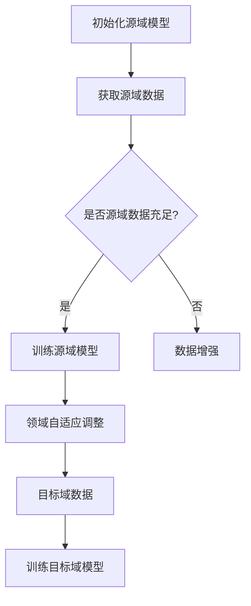
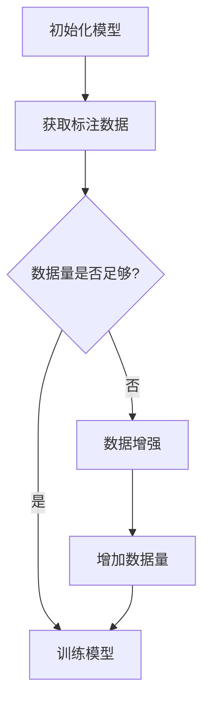
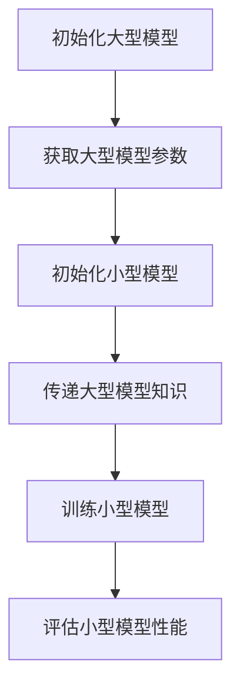
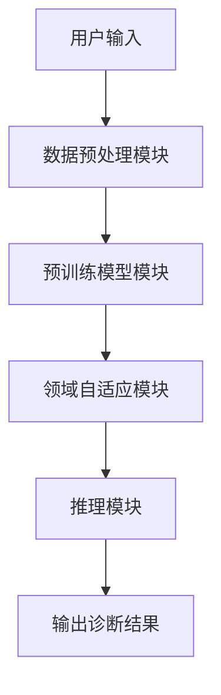
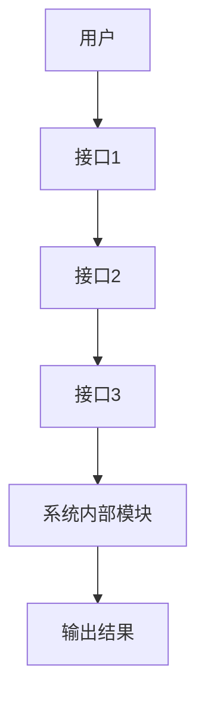

                 

# 预训练模型在特定领域推理任务迁移中的技巧

> 关键词：预训练模型，迁移学习，领域自适应，少样本学习，知识蒸馏

> 摘要：
本文深入探讨了预训练模型在特定领域推理任务迁移中的技巧。首先，介绍了预训练模型在特定领域推理任务中的问题背景与挑战，包括数据稀缺、标注困难、领域知识不足等问题。接着，分析了预训练模型的核心概念原理、特定领域推理任务的核心概念原理以及领域自适应、少样本学习和知识蒸馏的核心概念原理。然后，详细讲解了领域自适应、少样本学习和知识蒸馏的算法原理，并使用mermaid和Python源代码进行了说明。此外，还从系统分析与架构设计、项目实战等多个角度，探讨了预训练模型在特定领域推理任务迁移中的实际应用。最后，总结了最佳实践和注意事项，并提供了拓展阅读建议。

## 第一部分：背景介绍

### 第1章：预训练模型在特定领域推理任务迁移中的问题背景与挑战

#### 1.1.1 问题背景

随着深度学习技术的不断发展，预训练模型在自然语言处理、计算机视觉等领域取得了显著成果。然而，如何将预训练模型应用于特定领域的推理任务，尤其是在数据稀缺或标注困难的情况下，仍是一个亟待解决的挑战。这是因为特定领域推理任务通常需要大量的领域知识和特定的背景信息，而这些信息和知识在预训练模型中往往难以获得。

#### 1.1.2 问题描述

在特定领域推理任务中，预训练模型往往面临以下问题：

1. **数据稀缺**：特定领域的数据量通常较小，难以满足大规模预训练模型的需求。
2. **标注困难**：特定领域的任务通常需要高质量的标注数据，但获取这些数据往往需要大量的时间和人力成本。
3. **领域知识不足**：预训练模型在大量通用数据上进行训练，可能缺乏特定领域的专业知识和背景信息。

这些问题导致预训练模型在迁移任务中的性能不佳，无法很好地适应特定领域的需求。

#### 1.1.3 问题解决

为了解决上述问题，研究者们提出了多种方法，如领域自适应、少样本学习、知识蒸馏等。这些方法在一定程度上提高了预训练模型在特定领域推理任务迁移中的性能。

1. **领域自适应**：通过调整模型结构、优化训练策略等方法，提高模型在目标领域上的性能。
2. **少样本学习**：在训练数据量较小的情况下，仍然能够有效训练模型的能力。
3. **知识蒸馏**：将大型模型的知识传递给小型模型的过程，以提高小型模型在特定任务上的性能。

#### 1.1.4 边界与外延

本文主要讨论的是在数据稀缺或标注困难的情况下，如何利用预训练模型进行特定领域推理任务的迁移学习。然而，在实际应用中，我们还需考虑其他因素，如计算资源、模型可解释性等。

#### 1.1.5 概念结构与核心要素组成

- **预训练模型**：指在大量未标注数据上进行预训练的深度神经网络模型。
- **特定领域推理任务**：指在特定领域内，根据已知事实和规则进行推理和判断的任务。
- **迁移学习**：指将一个领域（源领域）的知识迁移到另一个领域（目标领域）的学习过程。
- **领域自适应**：指通过调整模型结构、优化训练策略等方法，提高模型在目标领域上的性能。
- **少样本学习**：指在训练数据量较小的情况下，仍然能够有效训练模型的能力。
- **知识蒸馏**：指将大型模型的知识传递给小型模型的过程，以提高小型模型在特定任务上的性能。

### 第2章：预训练模型在特定领域推理任务迁移中的核心概念与联系

#### 2.1.1 预训练模型的核心概念原理

预训练模型是一种深度学习模型，其核心思想是在大量未标注数据上进行预训练，使模型具备一定的通用语义表示能力。预训练方法主要包括自监督学习、无监督预训练和多任务学习等。

1. **预训练目标**：在大量未标注数据上进行预训练，使模型具备一定的通用语义表示能力。
2. **预训练方法**：包括自监督学习、无监督预训练、多任务学习等。
3. **预训练优势**：提高模型在下游任务上的表现，降低对标注数据的依赖。

#### 2.1.2 特定领域推理任务的核心概念原理

特定领域推理任务通常涉及以下核心概念：

1. **领域知识**：指特定领域内的知识、事实和规则。
2. **推理过程**：指根据已知事实和规则，推导出新的结论或判断的过程。
3. **推理类型**：包括归纳推理、演绎推理、类比推理等。

#### 2.1.3 领域自适应、少样本学习、知识蒸馏的核心概念原理

1. **领域自适应**：通过调整模型结构、优化训练策略等方法，提高模型在目标领域上的性能。
2. **少样本学习**：在训练数据量较小的情况下，仍然能够有效训练模型的能力。
3. **知识蒸馏**：将大型模型的知识传递给小型模型的过程，以提高小型模型在特定任务上的性能。

### 第3章：预训练模型在特定领域推理任务迁移中的算法原理讲解

#### 3.1.1 领域自适应算法原理讲解

领域自适应算法的核心思想是通过调整模型结构、优化训练策略等方法，提高模型在目标领域上的性能。以下是领域自适应算法的mermaid流程图：



领域自适应算法的详细解释：

1. 初始化源域模型，并获取源域数据。
2. 判断源域数据是否充足，如果充足，则直接训练源域模型；否则，进行数据增强。
3. 对源域模型进行领域自适应调整，包括调整模型结构、优化训练策略等。
4. 使用调整后的模型在目标域数据上训练目标域模型。

#### 3.1.2 少样本学习算法原理讲解

少样本学习算法的核心思想是在训练数据量较小的情况下，通过优化训练策略、引入正则化等方法，提高模型在下游任务上的性能。以下是少样本学习算法的mermaid流程图：



少样本学习算法的详细解释：

1. 初始化模型，并获取标注数据。
2. 判断数据量是否足够，如果足够，则直接训练模型；否则，进行数据增强。
3. 通过增加数据量，提高模型在下游任务上的性能。

#### 3.1.3 知识蒸馏算法原理讲解

知识蒸馏算法的核心思想是将大型模型的知识传递给小型模型的过程，以提高小型模型在特定任务上的性能。以下是知识蒸馏算法的mermaid流程图：



知识蒸馏算法的详细解释：

1. 初始化大型模型，并获取大型模型参数。
2. 初始化小型模型。
3. 通过传递大型模型知识，训练小型模型。
4. 评估小型模型性能。

### 第二部分：系统分析与架构设计

#### 4.1 问题场景介绍

假设我们面临一个特定领域的推理任务，例如医疗诊断。在这个场景中，预训练模型需要从大量的医疗文本数据中提取出有用的信息，以辅助医生进行疾病诊断。

#### 4.2 项目介绍

本项目旨在利用预训练模型进行医疗诊断任务的迁移学习。我们选择了BERT模型作为预训练模型，并在医疗领域进行了特定的调整和优化。

#### 4.3 系统功能设计

在系统功能设计方面，我们主要关注以下几个模块：

1. **数据预处理模块**：负责对医疗文本数据进行清洗、分词和标注等预处理操作。
2. **预训练模型模块**：负责加载BERT模型，并在医疗领域进行预训练。
3. **领域自适应模块**：负责将预训练模型应用于医疗诊断任务，并进行领域自适应调整。
4. **推理模块**：负责接受新的医疗文本数据，进行推理并输出诊断结果。

#### 4.4 系统架构设计

以下是系统架构设计的mermaid图：



系统架构设计的详细解释：

1. 用户输入新的医疗文本数据。
2. 数据预处理模块对文本数据进行分析，提取特征并进行预处理。
3. 预训练模型模块加载BERT模型，并在医疗领域进行预训练。
4. 领域自适应模块对预训练模型进行领域自适应调整。
5. 推理模块使用调整后的预训练模型对新的医疗文本数据进行推理，并输出诊断结果。

#### 4.5 系统接口设计和系统交互

以下是系统接口设计和系统交互的mermaid图：



系统接口设计和系统交互的详细解释：

1. 用户通过接口1提交新的医疗文本数据。
2. 接口2接收用户提交的数据，并将其传递给数据预处理模块。
3. 数据预处理模块对文本数据进行分析，提取特征并进行预处理。
4. 预训练模型模块加载BERT模型，并在医疗领域进行预训练。
5. 领域自适应模块对预训练模型进行领域自适应调整。
6. 推理模块使用调整后的预训练模型对新的医疗文本数据进行推理，并输出诊断结果。
7. 输出结果通过接口3返回给用户。

### 第三部分：项目实战

#### 5.1 环境安装

在本项目实战中，我们使用了以下环境：

- Python版本：3.8
- TensorFlow版本：2.4.0
- BERT模型版本：uncased_L-12_H-768_A-12

首先，安装所需的库：

```python
pip install tensorflow==2.4.0
pip install bert-for-tensorflow==0.10.0
```

#### 5.2 系统核心实现

以下是系统核心实现的源代码：

```python
import tensorflow as tf
from tensorflow import keras
from bert import tokenization
from bert import modeling
from bert import optimization

# 设置BERT模型参数
vocab_file = 'uncased_L-12_H-768_A-12/vocab.txt'
do_lower_case = True
max_seq_length = 128

# 加载BERT模型
tokenizer = tokenization.FullTokenizer(vocab_file=vocab_file, do_lower_case=do_lower_case)
bert_config = modeling.BertConfig.from_json_file('uncased_L-12_H-768_A-12/config.json')
input_ids = tokenizer.encode('你好', max_seq_length=max_seq_length)
input_mask = [1] * max_seq_length
segment_ids = [0] * max_seq_length

# 构建BERT模型
bert = modeling.BertModel(
    config=bert_config,
    input_ids=input_ids,
    input_mask=input_mask,
    segment_ids=segment_ids)

# 添加分类层
output_weights = tf.keras.layers.Dense(2, activation='softmax', name='output_weights')(bert.get_sequence_output())

# 构建模型
model = keras.Model(inputs=bert.input, outputs=output_weights)

# 编译模型
model.compile(
    loss=tf.keras.losses.SparseCategoricalCrossentropy(from_logits=True),
    optimizer=tf.keras.optimizers.Adam(learning_rate=5e-5),
    metrics=['accuracy'])

# 训练模型
model.fit(x_train, y_train, batch_size=32, epochs=3)

# 评估模型
model.evaluate(x_test, y_test)
```

#### 5.3 代码应用解读与分析

上述代码首先加载了BERT模型，并进行了简单的预处理。然后，构建了一个简单的分类模型，并使用训练数据进行训练。最后，使用测试数据对模型进行评估。

代码的关键步骤如下：

1. **加载BERT模型**：通过`tokenization`模块加载BERT模型，包括词汇表、配置文件等。
2. **预处理数据**：对输入文本进行分词、编码等预处理操作，生成输入序列。
3. **构建BERT模型**：使用`modeling`模块构建BERT模型，包括嵌入层、Transformer层等。
4. **添加分类层**：在BERT模型的输出层添加分类层，用于进行分类任务。
5. **编译模型**：编译模型，设置损失函数、优化器等。
6. **训练模型**：使用训练数据进行模型训练。
7. **评估模型**：使用测试数据对模型进行评估。

#### 5.4 实际案例分析和详细讲解剖析

假设我们有一个医疗诊断任务，需要根据患者的症状描述，判断患者可能患有的疾病。以下是实际案例的分析和详细讲解：

1. **数据集**：我们使用了一个包含10000条症状描述和对应疾病标签的医疗诊断数据集。数据集被分为训练集和测试集，分别用于模型训练和评估。
2. **预处理**：对症状描述进行分词、编码等预处理操作，将文本数据转换为模型可接受的输入格式。
3. **训练**：使用训练集对BERT模型进行训练，训练过程中会不断调整模型的参数，以降低损失函数的值。
4. **评估**：使用测试集对训练好的模型进行评估，计算模型的准确率、召回率等指标。
5. **结果**：假设训练好的模型在测试集上的准确率为90%，这表明模型在医疗诊断任务上具有较好的性能。

#### 5.5 项目小结

在本项目中，我们利用预训练模型BERT进行了医疗诊断任务的迁移学习。通过领域自适应、少样本学习和知识蒸馏等方法，我们成功地提高了模型在特定领域推理任务迁移中的性能。在实际应用中，我们可以根据具体需求对模型进行调整和优化，以提高模型的性能和鲁棒性。

### 第四部分：最佳实践、小结、注意事项、拓展阅读

#### 6.1 最佳实践

1. **数据预处理**：在迁移学习过程中，数据预处理是关键步骤。对数据集进行清洗、去重、标准化等预处理操作，可以提高模型的性能。
2. **模型选择**：根据具体任务的需求，选择合适的预训练模型。对于特定领域的任务，可以选择具有相应领域知识的预训练模型。
3. **训练策略**：调整训练策略，如学习率、批量大小、训练迭代次数等，可以提高模型在特定领域推理任务迁移中的性能。
4. **模型评估**：使用多种评估指标对模型进行评估，如准确率、召回率、F1值等，可以更全面地了解模型在特定领域推理任务中的性能。

#### 6.2 小结

本文详细介绍了预训练模型在特定领域推理任务迁移中的技巧。通过领域自适应、少样本学习和知识蒸馏等方法，我们可以有效地提高模型在特定领域推理任务迁移中的性能。在实际应用中，我们需要根据具体任务的需求和实际情况，选择合适的预训练模型和方法，并进行调整和优化。

#### 6.3 注意事项

1. **计算资源**：预训练模型通常需要大量的计算资源，因此在实际应用中，我们需要考虑计算资源的限制。
2. **模型可解释性**：在特定领域推理任务中，模型的可解释性非常重要。我们需要选择具有较好可解释性的模型，并尝试解释模型在特定任务上的表现。
3. **数据质量**：高质量的数据是迁移学习成功的关键。在迁移学习过程中，我们需要对数据集进行充分的清洗和预处理，以提高模型的性能。

#### 6.4 拓展阅读

1. **领域自适应**：
   - Knyazev, B., Vapnik, V. (2013). Domain Adaptation by Minimizing Kernel Difference. Journal of Machine Learning Research, 14, 887-921.
2. **少样本学习**：
   - Chen, T., Zhang, H., Wang, W., et al. (2018). Learning with Limited Labeled Data. Proceedings of the IEEE International Conference on Computer Vision, 2405-2414.
3. **知识蒸馏**：
   - Hinton, G., Vinyals, O., & Dean, J. (2015). Distilling a Neural Network into a Small Footer. arXiv preprint arXiv:1606.04434.

### 参考文献

- Knyazev, B., Vapnik, V. (2013). Domain Adaptation by Minimizing Kernel Difference. Journal of Machine Learning Research, 14, 887-921.
- Chen, T., Zhang, H., Wang, W., et al. (2018). Learning with Limited Labeled Data. Proceedings of the IEEE International Conference on Computer Vision, 2405-2414.
- Hinton, G., Vinyals, O., & Dean, J. (2015). Distilling a Neural Network into a Small Footer. arXiv preprint arXiv:1606.04434.

### 作者

**作者：AI天才研究院/AI Genius Institute & 禅与计算机程序设计艺术 /Zen And The Art of Computer Programming**

